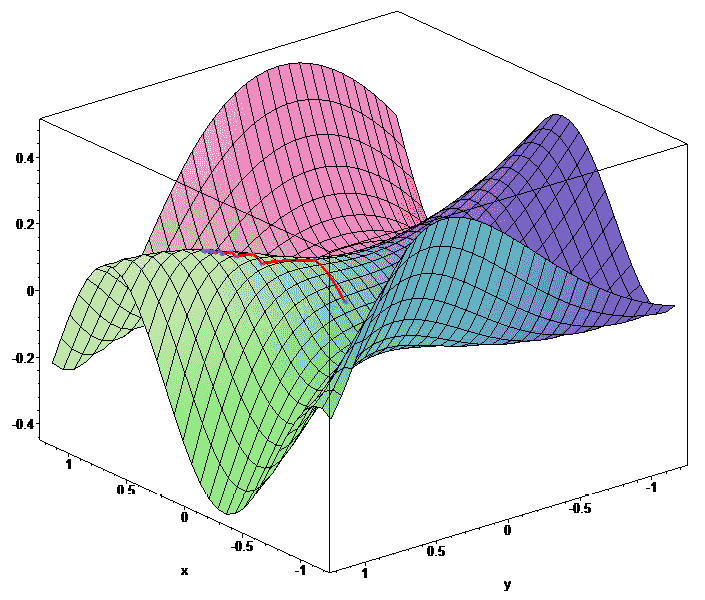
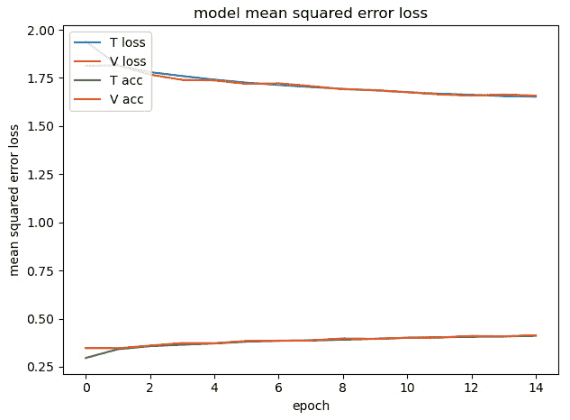
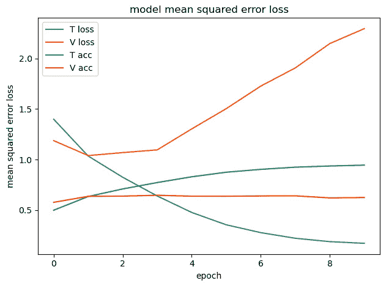
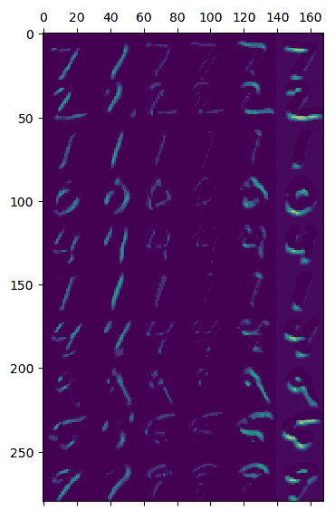
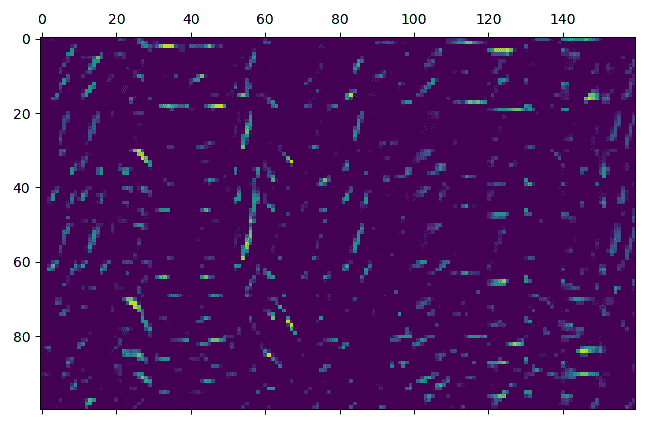
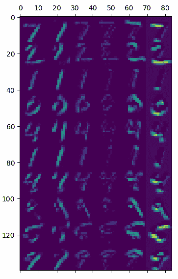
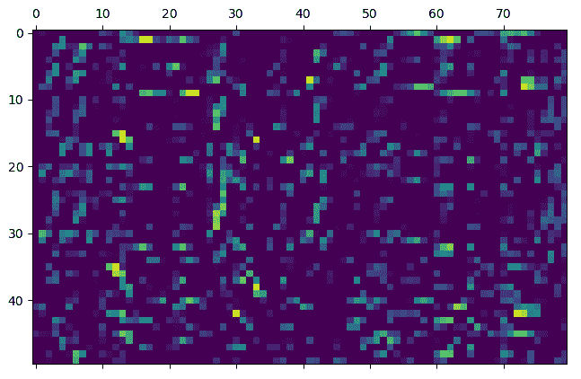

# 第五章：*第五章*：深度学习工作流程

在本章中，我们将介绍您在训练神经网络和将其投入生产过程中可能执行的操作步骤。我们将更深入地讨论深度学习背后的理论，以更好地解释我们在*第四章*，“使用神经网络的深度学习”中实际所做的工作，但我们主要关注与自动驾驶汽车相关的论点。我们还将介绍一些有助于我们在 CIFAR-10（一个小型图像的著名数据集）上获得更高精度的概念。我们相信，本章中提出的理论，加上与*第四章*，“使用神经网络的深度学习”和*第六章*，“改进您的神经网络”相关的更实际的知识，将为您提供足够的工具来执行自动驾驶汽车领域中的常见任务。

在本章中，我们将涵盖以下主题：

+   获取或创建数据集

+   训练、验证和测试数据集

+   分类器

+   数据增强

+   定义模型

+   如何调整卷积层、`MaxPooling`层和密集层

+   训练和随机性的作用

+   欠拟合和过拟合

+   激活的可视化

+   运行推理

+   重新训练

# 技术要求

要能够使用本章中解释的代码，您需要安装以下工具和模块：

+   Python 3.7

+   NumPy 模块

+   Matplotlib 模块

+   TensorFlow 模块

+   Keras 模块

+   OpenCV-Python 模块

本章的代码可以在[`github.com/PacktPublishing/Hands-On-Vision-and-Behavior-for-Self-Driving-Cars/tree/master/Chapter5`](https://github.com/PacktPublishing/Hands-On-Vision-and-Behavior-for-Self-Driving-Cars/tree/master/Chapter5)找到。

本章的“代码在行动”视频可以在以下位置找到：

[`bit.ly/3dJrcys`](https://bit.ly/3dJrcys)

# 获取数据集

一旦您有一个想要用神经网络执行的任务，通常的第一步是获取数据集，这是您需要喂给神经网络的那些数据。在我们这本书中执行的任务中，数据集通常由图像或视频组成，但它可以是任何东西，或者图像和其他数据的混合。

数据集代表您喂给神经网络的输入，但如您所注意到的，您的数据集还包含期望的输出，即标签。我们将用`x`表示神经网络的输入，用`y`表示输出。数据集由输入/特征（例如，MNIST 数据集中的图像）和输出/标签（例如，与每个图像关联的数字）组成。

我们有不同的数据集类型。让我们从最简单的开始——Keras 中包含的数据集——然后再继续到下一个。

## Keras 模块中的数据集

通常，数据库包含大量数据。在成千上万张图片上训练神经网络是正常的，但最好的神经网络是用数百万张图片训练的。那么我们如何使用它们呢？

最简单的方法，通常对实验很有帮助，是使用 Keras 中包含的数据库，就像我们在*第四章*中做的那样，*使用神经网络进行深度学习*，使用`load_data()`，如下所示：

```py
from keras.datasets import mnist
(x_train, y_train), (x_test, y_test) = mnist.load_data()
```

Keras 提供了各种数据库：

+   MNIST – 数字分类

+   CIFAR10 – 小图像的分类

+   CIFAR100 – 小图像的分类

+   IMDB 电影评论情感分类

+   路透社新闻社分类

+   Fashion MNIST 数据库

+   波士顿房价

这些数据库对于学习如何构建神经网络非常有用。在下一节中，我们将探讨一些对自动驾驶汽车更有用的数据库。

## 现有数据库

幸运的是，有几个有趣的公共数据库可供使用，但你必须始终仔细检查许可证，以了解你可以用它做什么，并最终获取或获得更宽松的许可证。

以下是一些你可能想要检查的与自动驾驶汽车相关的数据库：

+   BDD100K，一个大规模多样化的驾驶视频数据库；参考[`bdd-data.berkeley.edu/`](https://bdd-data.berkeley.edu/)。

+   博世小型交通信号灯数据库；参考[`hci.iwr.uni-heidelberg.de/content/bosch-small-traffic-lights-dataset`](https://hci.iwr.uni-heidelberg.de/content/bosch-small-traffic-lights-dataset)。

+   CULane，一个用于交通车道检测学术研究的大规模数据库；参考[`xingangpan.github.io/projects/CULane.html`](https://xingangpan.github.io/projects/CULane.html)。

+   KITTI 视觉基准套件；参考[`www.cvlibs.net/datasets/kitti/`](http://www.cvlibs.net/datasets/kitti/)。

+   Mapillary 交通标志数据库；参考[`www.mapillary.com/dataset/trafficsign`](https://www.mapillary.com/dataset/trafficsign)。

此外，还有一些其他更通用的数据库你可能觉得很有趣，特别是 WordNet 层次结构组织的图像数据库 ImageNet，[`www.image-net.org/`](http://www.image-net.org/)。

这个数据库包含数百万个指向互联网上图片的 URL，对神经网络的发展产生了重大影响。我们将在稍后详细讨论。

公共数据库很棒，但你也可能需要考虑其内容，因为有些图片被错误分类并不罕见。这对你的神经网络来说可能不是什么大问题，但你可能仍然希望获得尽可能好的数据库。

如果找不到令人满意的数据库，你总是可以生成一个。让我们看看如何快速构建用于自动驾驶汽车任务的优质数据库。

### 合成数据库

当可能时，您可能希望从可以创建*足够好*的图像的程序中生成数据集。我们在*第三章* *车道检测*中使用这项技术，我们从 Carla 中检测行人，从开源视频游戏 Speed Dreams 中获取图像，您也可以使用 3D 引擎或 3D 建模软件编写自己的生成器。

这些方法相对简单、快捷且非常便宜，可以生成大量数据集，实际上有时是无价的，因为在许多情况下，你可以自动标注图像并节省大量时间。然而，合成图像通常比真实图像简单，结果可能是你的网络在现实世界场景中的表现可能不如你想象的那么好。我们将在*第八章* *行为克隆*中使用这项技术。

如果不是最好的话，Carla 是当前最好的模拟器之一。

Carla，自动驾驶研究的开源模拟器，使用了以下网站：

+   [`carla.org/`](https://carla.org/)

+   [`github.com/carla-simulator/carla`](https://github.com/carla-simulator/carla)

您可以使用它来生成您任务所需的图像。

当这还不够时，您必须遵循手动流程。

## 您的定制数据集

有时，您可能没有令人满意的替代方案，您需要自己收集图像。这可能需要收集录像并对数千张图像进行分类。如果图像是从视频中提取的，您可能只需对视频进行分类，然后从中提取数百或数千张图像。

有时情况并非如此，您可能需要自己浏览成千上万张图片。或者，您可以使用专业公司的服务来为您标注图像。

有时您可能拥有图像，但分类可能很困难。想象一下，如果您可以访问汽车的录像，然后需要标注图像，添加汽车所在的框。如果您很幸运，您可能可以访问一个可以为您完成这项工作的神经网络。您可能仍然需要手动检查结果，并对一些图像进行重新分类，但这仍然可以节省大量工作。

接下来，我们将深入了解这些数据集。

# 理解三个数据集

实际上，你可能不需要一个数据集，但理想情况下需要三个。这些数据集用于训练、验证和测试。在定义它们之前，请考虑不幸的是，有时关于验证和测试的含义存在一些混淆，通常情况下只有两个数据集可用，就像这种情况，验证集和测试集是重合的。我们在*第四章* *使用神经网络的深度学习*中也做了同样的事情，我们使用了测试集作为验证集。

让我们现在定义这三个数据集，然后我们可以解释理想情况下我们应该如何测试 MNIST 数据集：

+   **训练数据集**：这是用于训练神经网络的数据库，通常是三个数据集中最大的一个。

+   **验证数据集**：这通常是指训练数据集的一部分，这部分数据不用于训练，而仅用于评估模型的性能和调整其超参数（例如，网络的拓扑结构或优化器的学习率）。

+   **测试数据集**：理想情况下，这是一个一次性数据集，用于在所有调整完成后评估模型的性能。

您不能使用训练数据集来评估模型的性能，因为训练数据集被优化器用于训练网络，所以这是最佳情况。然而，我们通常不需要神经网络在训练数据集上表现良好，而是在用户抛给它的任何东西上表现良好。因此，我们需要网络能够*泛化*。回到*第四章*“使用神经网络的深度学习”中的学生比喻，训练数据集上的高分意味着学生已经把书（训练数据集）背得滚瓜烂熟，但我们希望的是学生能够理解书的内容，并能够将这种知识应用到现实世界的情境中（验证数据集）。

那么，如果验证代表现实世界，为什么我们还需要测试数据集呢？问题是，在调整您的网络时，您将做出一些选择，这些选择将偏向于验证数据集（例如，根据其在验证数据集上的性能选择一个模型而不是另一个模型）。结果，验证数据集上的性能可能仍然高于现实世界。

测试数据集解决了这个问题，因为我们只在所有调整完成后才应用它。这也解释了为什么理想情况下，我们希望在仅使用一次后丢弃测试数据集。

这可能不切实际，但并非总是如此，因为有时您可以很容易地根据需要生成一些样本。

那么，我们如何在 MNIST 任务中使用三个数据集呢？也许您还记得从*第四章*，“使用神经网络的深度学习”，MNIST 数据集有 60,000（60 K）个样本用于训练，10,000（10 K）个用于测试。

理想情况下，您可以采用以下方法：

+   训练数据集可以使用为训练准备的 60,000 个样本。

+   验证数据集可以使用为测试准备的 10,000 个样本（正如我们所做的那样）。

+   测试数据集可以根据需要生成，现场写数字。

在讨论了三个数据集之后，我们现在可以看看如何将您的完整数据集分成三部分。虽然这似乎是一个简单的操作，但在如何进行操作方面您需要小心。

## 数据集拆分

给定你的完整数据集，你可能需要将其分成训练、验证和测试三个部分。如前所述，理想情况下，你希望测试是在现场生成的，但如果这不可能，你可能会选择使用总数据集的 15-20%进行测试。

在剩余的数据集中，你可能使用 15-20%作为验证。

如果你有很多样本，你可能为验证和测试使用更小的百分比。如果你有较小的数据集，在你对模型性能满意后（例如，如果你选择它是因为它在验证和测试数据集上都表现良好），你可能会将测试数据集添加到训练数据集中以获得更多样本。如果你这样做，就没有必要在测试数据集中评估性能，因为实际上它将成为训练的一部分。在这种情况下，你信任验证数据集的结果。

但即使大小相同，并不是所有的分割都是一样的。让我们用一个实际的例子来说明。

你想检测猫和狗。你有一个包含 10,000 张图片的数据集。你决定使用 8,000 张进行训练，2,000 张进行验证，测试是通过你家中 1 只狗和 1 只猫的视频实时记录来完成的；每次测试时，你都会制作一个新的视频。看起来完美。可能出什么问题？

首先，你需要在每个数据集中大致有相同数量的猫和狗。如果不是这样，网络将偏向于其中之一。直观地说，如果在训练过程中，网络看到 90%的图像是狗的，那么总是预测狗将给你 90%的准确率！

你读到随机化样本顺序是一种最佳实践，你就这样做了。然后你进行了分割。你的模型在训练、验证和测试数据集上表现良好。一切看起来都很不错。然后你尝试使用几个朋友的宠物，但什么都没发生。发生了什么？

一种可能性是，你的分割在衡量泛化方面并不好。即使你有 1 万张图片，它们可能只来自 100 只宠物（包括你的），每只狗和猫都出现了 100 次，位置略有不同（例如，来自视频）。如果你打乱样本，所有的狗和猫都会出现在所有数据集中，因此验证和测试将相对容易，因为网络*已经知道*那些宠物。

如果，相反，你为了验证而养了 20 只宠物，并且注意不要在训练或验证数据集中包含你的宠物照片，那么你的估计将更加现实，你有机会构建一个在泛化方面更好的神经网络。

现在我们有了三个数据集，是时候定义我们需要执行的任务了，这通常将是图像分类。

# 理解分类器

深度学习可以用于许多不同的任务。对于图像和 CNN 来说，一个非常常见的任务是分类。给定一个图像，神经网络需要使用在训练期间提供的标签之一对其进行分类。不出所料，这种类型的网络被称为*分类器*。

要做到这一点，神经网络将为每个标签有一个输出（例如，在 10 个数字的 MNIST 数据集上，我们有 10 个标签和 10 个输出），而只有一个输出应该是 1，其他所有输出应该是 0。

神经网络如何达到这种状态呢？其实，它并不能。神经网络通过内部乘法和求和产生浮点输出，而且很少能得到相似的输出。然而，我们可以将最大值视为热点（1），而所有其他值都可以视为冷点（0）。

我们通常在神经网络的末尾应用一个 softmax 层，它将输出转换为概率，这意味着 softmax 后的输出总和将是 1.0。这非常方便，因为我们可以很容易地知道神经网络对预测的信心程度。Keras 在模型中提供了一个获取概率的方法`predict()`，以及一个获取标签的方法`predict_classes()`。如果需要，可以使用`to_categorical()`将标签轻松转换为独热编码格式。

如果你需要从独热编码转换到标签，可以使用 NumPy 的`argmax()`函数。

现在我们知道了我们的任务是图像分类，但我们需要确保我们的数据集与我们的网络在生产部署时需要检测的内容相似。

## 创建真实世界的数据集

当你收集数据集时，无论是使用自己的图像还是其他合适的数据集，你需要确保图像反映了你可能在现实生活中遇到的条件。例如，你应该尝试获取以下列出的*问题图像*，因为你很可能在生产中遇到这些问题：

+   恶劣的光线（过曝和欠曝）

+   强烈的阴影

+   障碍物遮挡物体

+   物体部分出图

+   物体旋转

如果你不能轻松地获得这些类型的图像，可以使用数据增强，这正是我们下一节要讨论的内容。

## 数据增强

数据增强是增加你数据集中样本的过程，并从你已有的图像中派生新的图像；例如，降低亮度或旋转它们。

Keras 包括一个方便的方式来增强你的数据集，`ImageDataGenerator()`，它可以随机应用指定的转换，但不幸的是，它的文档并不特别完善，并且在参数方面缺乏一致性。因此，我们现在将分析一些最有用的转换。为了清晰起见，我们将构建一个只有一个参数的生成器，以观察其效果，但你很可能希望同时使用多个参数，我们将在稍后这样做。

`ImageDataGenerator()` 构造函数接受许多参数，例如以下这些：

+   `brightness_range`：这将改变图像的亮度，它接受两个参数的列表，分别是最小和最大亮度，例如 [0.1, 1.5]。

+   `rotation_range`：这将旋转图像，并接受一个表示旋转范围的度数参数，例如 60。

+   `width_shift_range`：这将使图像水平移动；它接受不同形式的参数。我建议使用可接受值的列表，例如 [-50, -25, 25, 50]。

+   `height_shift_range`：这将使图像垂直移动；它接受不同形式的参数。我建议使用可接受值的列表，例如 [-50, -25, 25, 50]。

+   `shear_range`：这是剪切强度，接受以度为单位的一个数字，例如 60。

+   `zoom_range`：这将放大或缩小图像，它接受两个参数的列表，分别是最小和最大缩放，例如 [0.5, 2]。

+   `horizontal_flip`：这将水平翻转图像，参数是一个布尔值。

+   `vertical_flip`：这将垂直翻转图像，参数是一个布尔值。

其中，水平翻转通常非常有效。

下图显示了使用亮度、旋转、宽度移动和高度移动增强图像的结果：

![图 5.1 – ImageDataGenerator() 结果。从上到下：brightness_range=[0.1, 1.5], rotation_range=60, width_shift_range=[-50, -25, 25, 50], 和 height_shift_range=[-75, -35, 35, 75]](img/Figure_5.1_B16322.jpg)

图 5.1 – ImageDataGenerator() 结果。从上到下：brightness_range=[0.1, 1.5], rotation_range=60, width_shift_range=[-50, -25, 25, 50], 和 height_shift_range=[-75, -35, 35, 75]

下图是使用剪切、缩放、水平翻转和垂直翻转生成的图像：

![图 5.2 – ImageDataGenerator() 结果。从上到下：shear_range=60, zoom_range=[0.5, 2], horizontal_flip=True, 和 vertical_flip=True](img/Figure_5.2_B16322.jpg)

图 5.2 – ImageDataGenerator() 结果。从上到下：shear_range=60, zoom_range=[0.5, 2], horizontal_flip=True, 和 vertical_flip=True

这些效果通常会组合使用，如下所示：

```py
datagen = ImageDataGenerator(brightness_range=[0.1, 1.5], rotation_range=60, width_shift_range=[-50, -25, 25, 50], horizontal_flip=True)
```

这是最终结果：

![图 5.3 – ImageDataGenerator() 结果。应用参数：brightness_range=[0.1, 1.5], rotation_range=60, width_shift_range=[-50, -25, 25, 50], 和 horizontal_flip=True](img/Figure_5.3_B16322.jpg)

图 5.3 – ImageDataGenerator() 结果。应用参数：brightness_range=[0.1, 1.5], rotation_range=60, width_shift_range=[-50, -25, 25, 50], 和 horizontal_flip=True

直观上，网络应该对图像的变化更加宽容，并且应该学会更好地泛化。

请记住，Keras 的数据增强更像是数据替换，因为它替换了原始图像，这意味着原始的、未更改的图像不会被发送到神经网络，除非随机组合是这样的，它们以未更改的形式呈现。

数据增强的巨大效果是样本会在每个周期改变。所以，为了清楚起见，Keras 中的数据增强不会在每个周期增加样本数量，但样本会根据指定的转换在每个周期改变。你可能想训练更多的周期。

接下来，我们将看到如何构建模型。

# 模型

现在你有一个图像数据集，你知道你想做什么（例如，分类），是时候构建你的模型了！

我们假设你正在工作于一个**卷积神经网络**，所以你可能甚至只需要使用卷积块、**MaxPooling**和**密集层**。但如何确定它们的大小？应该使用多少层？

让我们用 CIFAR-10 做一些测试，因为 MINST 太简单了，看看会发生什么。我们不会改变其他参数，但只是稍微玩一下这些层。

我们还将训练 5 个周期，以加快训练速度。这并不是为了得到最好的神经网络；这是为了衡量一些参数的影响。

我们的起点是一个包含一个卷积层、一个 MaxPooling 层和一个密集层的网络，如下所示：

```py
model = Sequential()
model.add(Conv2D(8, (3, 3), input_shape=x_train.shape[1:], activation='relu'))
model.add(MaxPooling2D())
model.add(Flatten())
model.add(Dense(units = 256, activation = "relu"))
model.add(Dense(num_classes))
model.add(Activation('softmax'))
```

以下是对此的总结：

```py
_______________________________________________________________
Layer (type)                 Output Shape              Param #   
===============================================================
conv2d_1 (Conv2D)            (None, 30, 30, 8)         224       
_______________________________________________________________
max_pooling2d_1 (MaxPooling2 (None, 15, 15, 8)         0         
_______________________________________________________________
flatten_1 (Flatten)          (None, 1800)              0         
_______________________________________________________________
dense_1 (Dense)              (None, 256)               461056    
_______________________________________________________________
dense_2 (Dense)              (None, 10)                2570      
_______________________________________________________________
activation_1 (Activation)    (None, 10)                0         
===============================================================
Total params: 463,850
Trainable params: 463,850
Non-trainable params: 0
```

你可以看到这是一个如此简单的网络，它已经有了 463 K 个参数。层数的数量是误导性的。你并不一定需要很多层来得到一个慢速的网络。

这是性能：

```py
Training time: 90.96391367912292
Min Loss: 0.8851623952198029
Min Validation Loss: 1.142119802236557
Max Accuracy: 0.68706
Max Validation Accuracy: 0.6068999767303467
```

现在，下一步是调整它。所以，让我们试试吧。

## 调整卷积层

让我们在卷积层中使用 32 个通道：

```py
Total params: 1,846,922
Training time: 124.37444043159485
Min Loss: 0.6110964662361145
Min Validation Loss: 1.0291267457723619
Max Accuracy: 0.78486
Max Validation Accuracy: 0.6568999886512756
```

还不错！准确率提高了，尽管比之前大 4 倍，但它的速度慢了不到 50%。

现在我们尝试堆叠 4 层：

```py
model.add(Conv2D(8, (3, 3), input_shape=x_train.shape[1:], activation='relu'))
model.add(Conv2D(8, (3, 3), input_shape=x_train.shape[1:], activation='relu', padding = "same"))
model.add(Conv2D(8, (3, 3), input_shape=x_train.shape[1:], activation='relu', padding = "same"))
model.add(Conv2D(8, (3, 3), input_shape=x_train.shape[1:], activation='relu', padding = "same"))
```

让我们用`model.summary()`检查网络的大小，就像通常那样：

```py
Total params: 465,602
```

它只是比初始模型稍微大一点！原因是由于密集层，大多数参数都存在，并且堆叠相同大小的卷积层并不会改变密集层所需的参数。这就是结果：

```py
Training time: 117.05060386657715
Min Loss: 0.6014562886440754
Min Validation Loss: 1.0268916247844697
Max Accuracy: 0.7864
Max Validation Accuracy: 0.6520000100135803
```

它非常相似——稍微快一点，准确率基本上相同。由于网络有多个层，它可以学习更复杂的函数。然而，它有一个更小的密集层，因此由于这个原因，它失去了一些准确率。

我们不使用**相同的**填充，而是尝试使用`valid`，这将每次减少卷积层的输出大小：

```py
model.add(Conv2D(8, (3, 3), input_shape=x_train.shape[1:], activation='relu'))
model.add(Conv2D(8, (3, 3), input_shape=x_train.shape[1:], activation='relu', padding="valid"))
model.add(Conv2D(8, (3, 3), input_shape=x_train.shape[1:], activation='relu', padding="valid"))
model.add(Conv2D(8, (3, 3), input_shape=x_train.shape[1:], activation='relu', padding="valid"))
```

参数数量显著减少，从 465,602：

```py
Total params: 299,714
```

我们现在使用不到 300 K 个参数，如下所示：

```py
Training time: 109.74382138252258
Min Loss: 0.8018992121839523
Min Validation Loss: 1.0897881112098693
Max Accuracy: 0.71658
Max Validation Accuracy: 0.6320000290870667
```

非常有趣的是，训练准确率下降了 7%，因为网络对于这个任务来说太小了。然而，验证准确率只下降了 2%。

现在我们使用初始模型，但使用相同的填充，因为这会给我们在卷积后处理一个稍微大一点的图像：

```py
model.add(Conv2D(8, (3, 3), input_shape=x_train.shape[1:], padding="same", activation='relu'))
Total params: 527,338
```

我们现在有更多的参数，这是性能：

```py
Training time: 91.4407947063446
Min Loss: 0.7653912879371643
Min Validation Loss: 1.0724352446556091
Max Accuracy: 0.73126
Max Validation Accuracy: 0.6324999928474426
```

与参考模型相比，准确度都有所提高，而时间几乎保持不变，因此这是一个积极的实验。

现在我们将核的大小增加到 7x7：

```py
model.add(Conv2D(8, (7, 7), input_shape=x_train.shape[1:], padding="same", activation='relu'))
Total params: 528,298
```

由于核现在更大，参数的数量增加是可以忽略不计的。但是它的表现如何？让我们检查一下：

```py
Training time: 94.85121083259583
Min Loss: 0.7786661441159248
Min Validation Loss: 1.156547416305542
Max Accuracy: 0.72674
Max Validation Accuracy: 0.6090999841690063
```

不太理想。它稍微慢一些，准确度也稍微低一些。很难知道原因；也许是因为输入图像太小。

我们知道在卷积层之后添加 MaxPooling 层是一个典型的模式，所以让我们看看我们如何调整它。

## 调整 MaxPooling

让我们回到之前的模型，并且只去掉`MaxPooling`：

```py
Total params: 1,846,250
```

移除`MaxPooling`意味着密集层现在大了 4 倍，因为卷积层的分辨率不再降低：

```py
Training time: 121.01851439476013
Min Loss: 0.8000291277170182
Min Validation Loss: 1.2463579467773438
Max Accuracy: 0.71736
Max Validation Accuracy: 0.5710999965667725
```

这看起来并不太高效。与原始网络相比，它更慢，准确度有所提高，但验证准确度却下降了。与具有四个卷积层的网络相比，它具有相同的速度，但验证准确度却远远低于后者。

看起来 MaxPooling 在减少计算的同时提高了泛化能力。毫不奇怪，它被广泛使用。

现在我们增加 MaxPooling 层的数量：

```py
model.add(Conv2D(8, (3, 3), input_shape=x_train.shape[1:], activation='relu'))
model.add(Conv2D(8, (3, 3), input_shape=x_train.shape[1:], activation='relu', padding = "same"))
model.add(MaxPooling2D())
model.add(Conv2D(8, (3, 3), input_shape=x_train.shape[1:], activation='relu', padding = "same"))
model.add(Conv2D(8, (3, 3), input_shape=x_train.shape[1:], activation='relu', padding = "same"))
model.add(MaxPooling2D())
```

由于第二卷积层现在是原来大小的四分之一，因此大小现在要小得多：

```py
Total params: 105,154
```

让我们检查一下性能：

```py
Training time: 105.30972981452942
Min Loss: 0.8419396163749695
Min Validation Loss: 0.9395202528476715
Max Accuracy: 0.7032
Max Validation Accuracy: 0.6686999797821045
```

虽然训练准确度并不高，但验证准确度是我们所达到的最佳水平，而且所有这些只使用了 100 K 个参数！

在调整网络的卷积部分之后，现在是时候看看我们如何调整由密集层组成的部分。

## 调整密集层

让我们回到初始模型，并将密集层增加到 4 倍，即 1,024 个神经元：

```py
Total params: 1,854,698
```

如预期的那样，参数的数量几乎增加了四倍。但是性能如何？

```py
Training time: 122.05767631530762
Min Loss: 0.6533840216350555
Min Validation Loss: 1.093649614238739
Max Accuracy: 0.7722
Max Validation Accuracy: 0.630299985408783
```

训练准确度还不错，但与最佳模型相比，验证准确度较低。

让我们尝试使用三个密集层：

```py
model.add(Dense(units = 512, activation = "relu"))
model.add(Dense(units = 256, activation = "relu"))
model.add(Dense(units = 128, activation = "relu"))
```

现在我们得到了以下参数：

```py
Total params: 1,087,850
```

参数的数量现在更少了：

```py
Training time: 111.73353481292725
Min Loss: 0.7527586654126645
Min Validation Loss: 1.1094331634044647
Max Accuracy: 0.7332
Max Validation Accuracy: 0.6115000247955322
```

结果可能有些令人失望。我们可能不应该过多地依赖增加密集层的数量。

下一步现在是要训练网络。让我们开始。

### 训练网络

我们现在可以更深入地讨论训练阶段，这是“魔法”发生的地方。我们甚至不会尝试描述其背后的数学概念。我们只会用非常通用和简化的术语讨论用于训练神经网络的算法。

我们需要一些定义：

+   **损失函数**或**代价函数**：一个计算神经网络预测与预期标签之间距离的函数；它可能是**MSE**（即**均方误差**）或更复杂的某种函数。

+   **导数**：函数的导数是一个新函数，可以测量函数在特定点上的变化程度（以及变化方向）。例如，如果你想象自己在一辆车上，速度可以是你的初始函数，其导数是加速度。如果速度是恒定的，导数（例如，加速度）为零；如果速度在增加，导数将是正的，如果速度在减少，导数将是负的。

+   **局部最小值**：神经网络的工作是使损失函数最小化。考虑到参数数量巨大，神经网络的函数可以非常复杂，因此达到全局最小值可能是不可能的，但网络仍然可以达到一个很好的局部最小值。

+   **收敛**：如果网络持续接近一个好的局部最小值，那么它就是在收敛。

使用这些定义，我们现在将看到训练实际上是如何进行的。

## 如何训练网络

算法由两部分组成，为了简化，让我们说它是为每个样本执行的，当然，整个过程在每个 epoch 都会重复。所以，让我们看看它是如何工作的：

+   **前向传播**：最终，你的神经网络只是一个具有许多参数（权重和可能的偏差）以及许多操作的函数，当提供输入时，可以计算一些输出。在前向传播中，我们计算预测和损失。

+   **反向传播**：优化器（例如，Adam 或随机梯度下降）向**后**（从最后一层到第一层）更新所有权重（例如，所有参数），试图最小化损失函数；**学习率**（一个介于 0 和 1.0 之间的数字，通常为 0.01 或更小）决定了权重将调整多少。

更大的学习率可以使它们训练得更快，但可能会跳过局部最小值，而较小的学习率可能会收敛，但花费太多时间。优化器正在积极研究，以尽可能提高训练速度，并且它们会动态地改变学习率来提高速度和精度。

Adam 是一个可以动态改变每个参数学习率的优化器示例：



图 5.4 – 梯度下降寻找最小值

虽然编写训练神经网络的算法非常复杂，但从某种意义上说，这个概念与某人试图学习打台球类似，直到重复相同的复杂射击直到成功。你选择你想要击中的点（标签），你做出你的动作（前向传播），你评估你离目标有多远，然后你尝试调整力量、方向以及所有其他变量（权重）。我们也有一种随机初始化的方法。让我们试试下一个。

## 随机初始化

你可能会想知道第一次运行神经网络时参数的值。将权重初始化为零效果不佳，而使用小的随机数则相当有效。Keras 提供了多种算法供你选择，你也可以更改标准差。

这个有趣的结果是，神经网络开始时带有相当数量的随机数据，你可能注意到在同一个数据集上用同一个模型训练实际上会产生不同的结果。让我们用我们之前的基本 CIFAR-10 CNN 来尝试。

第一次尝试产生了以下结果：

```py
Min Loss: 0.8791077242803573
Min Validation Loss: 1.1203862301826477
Max Accuracy: 0.69174
Max Validation Accuracy: 0.5996000170707703
```

第二次尝试产生了以下结果：

```py
Min Loss: 0.8642362675189972
Min Validation Loss: 1.1310886552810668
Max Accuracy: 0.69624
Max Validation Accuracy: 0.6100000143051147
```

你可以尝试使用以下代码来减少随机性：

```py
from numpy.random import seed
seed(1)
import tensorflow as tf
tf.random.set_seed(1)
```

然而，如果你在 GPU 上训练，仍然可能存在许多变化。在调整你的网络模型时，你应该考虑这一点，否则你可能会因为随机性而排除小的改进。

下一个阶段是了解过拟合和欠拟合是什么。

## 过拟合和欠拟合

在训练神经网络时，你将在**欠拟合**和**过拟合**之间进行斗争。让我们看看如何：

+   欠拟合是指模型过于简单，无法正确学习数据集。你需要添加参数、滤波器和神经元来增加模型的容量。

+   过拟合是指你的模型足够大，可以学习训练数据集，但它无法泛化（例如，它*记忆*了数据集，但当你提供其他数据时效果不佳）。

你也可以从准确率和损失随时间变化的图中看到：



图 5.5 – 欠拟合：模型太小（7,590 个参数）且没有学习到很多

前面的图表显示了一个极端的欠拟合，准确率保持非常低。现在参考以下图表：



图 5.6 – 过拟合：模型非常大（29,766,666 个参数）且没有很好地泛化

*图 5.6* 展示了一个神经网络过拟合的相对极端例子。你可能注意到，虽然训练损失随着 epoch 的增加而持续下降，但验证损失在第一个 epoch 达到最小值，然后持续增加。验证损失的最小值是你想要停止训练的地方。在*第六章*，“改进你的神经网络”中，我们将看到一个允许我们做到这一点或类似的技术——*提前停止*。

虽然你可能听说过过拟合是一个大问题，但实际上，首先尝试得到一个可以过拟合训练数据集的模型，然后应用可以减少过拟合并提高泛化能力的技术的策略可能是一个好方法。然而，这只有在你能以非常高的精度过拟合训练数据集的情况下才是好的。

我们将在*第六章*“改进你的神经网络”中看到非常有效的方法来减少过拟合，但有一点需要考虑的是，较小的模型不太容易过拟合，而且通常也更快。所以，当你试图过拟合训练数据集时，尽量不要使用一个非常大的模型。

在本节中，我们看到了如何使用损失图来了解我们在网络训练中的位置。在下一节中，我们将看到如何可视化激活，以了解我们的网络正在学习什么。

# 可视化激活

现在我们可以训练一个神经网络。太好了。但神经网络能看懂和理解什么？这是一个很难回答的问题，但既然卷积输出一个图像，我们可以尝试展示这一点。现在让我们尝试展示 MINST 测试数据集前 10 个图像的激活：

1.  首先，我们需要构建一个模型，这个模型是从我们之前的模型派生出来的，它从输入读取并得到我们想要的卷积层作为输出。名称可以来自摘要。我们将可视化第一个卷积层，`conv2d_1`：

    ```py
    conv_layer = next(x.output for x in model.layers if     x.output.name.startswith(conv_name))act_model = models.Model(inputs=model.input, outputs=[conv_layer])activations = act_model.predict(x_test[0:num_predictions, :, :, :])
    ```

1.  现在，对于每个测试图像，我们可以取所有激活并将它们连接起来以得到一个图像：

    ```py
    col_act = []
    for pred_idx, act in enumerate(activations):
        row_act = []
        for idx in range(act.shape[2]):
            row_act.append(act[:, :, idx])
        col_act.append(cv2.hconcat(row_act))
    ```

1.  然后我们可以展示它：

    ```py
    plt.matshow(cv2.vconcat(col_act), cmap='viridis')plt.show()
    ```

这是第一卷积层`conv2d_1`的结果，它有 6 个通道，28x28：



图 5.7 – MNIST，第一卷积层的激活

这看起来很有趣，但试图理解激活，以及通道学习识别的内容，总是涉及一些猜测工作。最后一个通道似乎专注于水平线，第三和第四个通道不是很强，这可能意味着网络没有正确训练，或者它已经比所需的要大。但看起来不错。

让我们现在检查第二层，`conv2d_2`，它有 16 个通道，10x10：



图 5.8 – MNIST，第二卷积层的激活

现在更复杂了——输出要小得多，我们有的通道也更多。看起来有些通道正在检测水平线，而有些则专注于对角线或垂直线。那么第一个最大池化层，`max_pooling2d_1`呢？它的分辨率低于原始通道，为 10x10，但它选择最大激活，应该是可以理解的。参考以下截图：



图 5.9 – MNIST，第一个最大池化层的激活状态

的确，激活状态看起来很好。为了好玩，让我们检查第二个最大池化层，`max_pooling2d_2`，它的大小是 5x5：



图 5.10 – MNIST，第二个最大池化层的激活状态

现在看起来很混乱，但仍然可以看出一些通道正在识别水平线，而另一些则专注于垂直线。这就是密集层发挥作用的时候，因为它们试图理解这些难以理解但并非完全随机的激活状态。

可视化激活状态对于了解神经网络正在学习什么、通道是如何被使用的非常有用，并且它是你在训练神经网络时可以使用的另一个工具，尤其是当你觉得它学习得不好，正在寻找问题时。

现在我们将讨论推理，这实际上是训练神经网络的全部目的。

# 推理

推理是将输入提供给你的网络并得到分类或预测的过程。当神经网络经过训练并部署到生产环境中时，我们使用它，例如，来分类图像或决定如何在道路上驾驶，这个过程称为推理。

第一步是加载模型：

```py
model = load_model(os.path.join(dir_save, model_name))
```

然后，你只需调用 `predict()`，这是 Keras 中的推理方法。让我们用 MNIST 的第一个测试样本来试一试：

```py
x_pred = model.predict(x_test[0:1, :, :, :])print("Expected:", np.argmax(y_test))print("First prediction probabilities:", x_pred)print("First prediction:", np.argmax(x_pred))
```

这是我的 MNIST 网络的结果：

```py
Expected: 7
First prediction probabilities: [[6.3424804e-14 6.1755254e-06 2.5011676e-08 2.2640785e-07 9.0170204e-08 7.4626680e-11 5.6195684e-13 9.9999273e-01 1.9735349e-09 7.3219508e-07]]
First prediction: 7
```

`predict()` 函数的结果是一个概率数组，这对于评估网络的置信度非常方便。在这种情况下，所有数字都非常接近零，除了数字 `7`，因此它是网络的预测，置信度超过 99.999%！在现实生活中，不幸的是，你很少看到网络工作得如此好！

在推理之后，有时你可能想要定期在新样本上重新训练，以改进网络。让我们看看这需要做什么。

# 重新训练

有时候，一旦你得到了一个表现良好的神经网络，你的工作就完成了。然而，有时候你可能想要在新样本上重新训练它，以获得更高的精度（因为你的数据集现在更大了），或者如果你的训练数据集变得相对快速过时，以获得更新的结果。

在某些情况下，你可能甚至想要持续不断地重新训练，例如每周一次，并将新模型自动部署到生产环境中。

在这种情况下，你有一个强大的程序来验证你在验证数据集上新的模型性能，以及在新的、可丢弃的测试数据集上性能是至关重要的。也许还建议保留所有模型的备份，并尝试找到一种方法来监控生产中的性能，以便快速识别异常。在自动驾驶汽车的情况下，我预计模型在投入生产之前将经历严格的自动和手动测试，但其他没有安全问题的行业可能要宽松得多。

有了这些，我们结束了关于重新训练的主题。

# 摘要

这是一章内容密集的章节，但希望你能更好地了解神经网络是什么以及如何训练它们。

我们讨论了很多关于数据集的内容，包括如何获取用于训练、验证和测试的正确数据集。我们描述了分类器是什么，并实现了数据增强。然后我们讨论了模型以及如何调整卷积层、MaxPooling 层和密集层。我们看到了训练是如何进行的，什么是反向传播，讨论了随机性在权重初始化中的作用，并展示了欠拟合和过度拟合网络的图表。为了了解我们的 CNN 表现如何，我们甚至可视化激活。然后我们讨论了推理和重新训练。

这意味着你现在有足够的知识来选择或创建一个数据集，从头开始训练一个神经网络，并且你将能够理解模型或数据集的变化是否提高了精度。

在*第六章* *提高你的神经网络*中，我们将看到如何将这些知识应用到实践中，以便显著提高神经网络的精度。

# 问题

在阅读这一章后，你应该能够回答以下问题：

1.  你可以重复使用测试数据集吗？

1.  数据增强是什么？

1.  Keras 中的数据增强是否向你的数据集添加图像？

1.  哪一层倾向于具有最多的参数？

1.  观察损失曲线，你如何判断一个网络正在过度拟合？

1.  网络过度拟合是否总是不好的？
