# *第六章*：改进你的神经网络

在*第四章*“使用神经网络的深度学习”中，我们设计了一个能够在训练数据集中达到几乎 93%准确率的网络，但它在验证数据集中的准确率却低于 66%。

在本章中，我们将继续改进那个神经网络，目标是显著提高验证准确率。我们的目标是达到至少 80%的验证准确率。我们将应用在*第五章*“深度学习工作流程”中获得的一些知识，我们还将学习一些对我们非常有帮助的新技术，例如批量归一化。

我们将涵盖以下主题：

+   通过数据增强减少参数数量

+   增加网络大小和层数

+   理解批量归一化

+   使用提前停止提高验证准确率

+   通过数据增强几乎增加数据集大小

+   使用 dropout 提高验证准确率

+   使用空间 dropout 提高验证准确率

# 技术要求

本章的完整源代码可以在以下位置找到：[`github.com/PacktPublishing/Hands-On-Vision-and-Behavior-for-Self-Driving-Cars/tree/master/Chapter6`](https://github.com/PacktPublishing/Hands-On-Vision-and-Behavior-for-Self-Driving-Cars/tree/master/Chapter6)

本章需要以下软件先决条件，以及以下基本知识将有助于更好地理解本章：

+   Python 3.7

+   NumPy 模块

+   Matplotlib 模块

+   TensorFlow 模块

+   Keras 模块

+   OpenCV-Python 模块

+   推荐的 GPU

本章的“代码实战”视频可以在以下位置找到：

[`bit.ly/3dGIdJA`](https://bit.ly/3dGIdJA)

# 更大的模型

训练自己的神经网络是一种艺术；你需要直觉、一些运气、大量的耐心，以及你能找到的所有知识和帮助。你还需要资金和时间，要么购买更快的 GPU，使用集群测试更多配置，或者付费获取更好的数据集。

但没有真正的食谱。话虽如此，我们将把我们的旅程分为两个阶段，如*第五章*“深度学习工作流程”中所述：

+   过拟合训练数据集

+   提高泛化能力

我们将从*第四章*“使用神经网络的深度学习”中我们留下的地方开始，我们的基本模型在 CIFAR-10 上达到了 66%的验证准确率，然后我们将显著改进它，首先是让它更快，然后是让它更精确。

## 起始点

以下是我们*第四章*“使用神经网络的深度学习”中开发的模型，该模型由于在相对较低的验证准确率下实现了较高的训练准确率，因此过拟合了数据集：

```py
model.add(Conv2D(filters=64, kernel_size=(3, 3), activation='relu',    input_shape=x_train.shape[1:]))
model.add(AveragePooling2D())
model.add(Conv2D(filters=256, kernel_size=(3, 3),    activation='relu'))
model.add(AveragePooling2D())

model.add(Flatten())
model.add(Dense(units=512, activation='relu'))
model.add(Dense(units=256, activation='relu'))
model.add(Dense(units=num_classes, activation = 'softmax'))
```

它是一个浅但相对较大的模型，因为它有以下数量的参数：

```py
Total params: 5,002,506
```

我们之前训练了 12 个 epoch，结果如下：

```py
Training time: 645.9990749359131
Min Loss: 0.12497963292273692
Min Validation Loss: 0.9336215916395187
Max Accuracy: 0.95826
Max Validation Accuracy: 0.6966000199317932
```

训练准确率实际上对我们来说已经足够好了（在这里，在这个运行中，它高于*第五章*，“深度学习工作流程”，主要是因为随机性），但验证准确率也很低。它是过拟合的。因此，我们甚至可以将其作为起点，但最好对其进行一点调整，看看我们是否可以做得更好或使其更快。

我们还应该关注五个 epoch，因为我们可能会在较少的 epoch 上进行一些测试，以加快整个过程：

```py
52s 1ms/step - loss: 0.5393 - accuracy: 0.8093 - val_loss: 0.9496 - val_accuracy: 0.6949 
```

当你使用较少的 epoch 时，你是在赌自己能够理解曲线的演变，因此你是在用开发速度换取选择准确性。有时，这很好，但有时则不然。

我们的模型太大，所以我们将开始减小其尺寸并稍微加快训练速度。

## 提高速度

我们的模式不仅非常大——事实上，它太大了。第二个卷积层有 256 个过滤器，与密集层的 512 个神经元结合，它们使用了大量的参数。我们可以做得更好。我们知道我们可以将它们分成 128 个过滤器的层，这将节省几乎一半的参数，因为密集层现在只需要一半的连接。

我们可以尝试一下。我们在*第四章*，“使用神经网络的深度学习”中了解到，为了在卷积后不丢失分辨率，我们可以在两层（密集层省略）上以相同的方式使用填充，如下所示：

```py
model.add(Conv2D(filters=64, kernel_size=(3, 3), activation='relu',    input_shape=x_train.shape[1:]))
model.add(AveragePooling2D())

model.add(Conv2D(filters=128, kernel_size=(3, 3),     activation='relu', padding="same"))
model.add(Conv2D(filters=128, kernel_size=(3, 3),     activation='relu', padding="same"))
model.add(AveragePooling2D())
```

在这里，我们可以看到现在的参数数量更低：

```py
Total params: 3,568,906
```

让我们检查完整的结果：

```py
Training time: 567.7167596817017
Min Loss: 0.1018450417491654
Min Validation Loss: 0.8735350118398666
Max Accuracy: 0.96568
Max Validation Accuracy: 0.7249000072479248
```

太好了！它更快了，准确率略有提高，而且，验证也提高了！

让我们在第一层做同样的操作，但这次不增加分辨率，以免增加参数，因为，在两个卷积层之间，增益较低：

```py
model.add(Conv2D(filters=32, kernel_size=(3, 3),     activation='relu', input_shape=x_train.shape[1:]))model.add(Conv2D(filters=32, kernel_size=(3, 3), activation='relu',    input_shape=x_train.shape[1:], padding="same"))model.add(AveragePooling2D())model.add(Conv2D(filters=128, kernel_size=(3, 3),     activation='relu', padding="same"))model.add(Conv2D(filters=128, kernel_size=(3, 3),     activation='relu', padding="same"))model.add(AveragePooling2D())
```

当我们尝试这样做时，我们得到以下结果：

```py
Training time: 584.955037355423
Min Loss: 0.10728564778155182
Min Validation Loss: 0.7890052844524383
Max Accuracy: 0.965
Max Validation Accuracy: 0.739300012588501
```

这与之前类似，尽管验证准确率略有提高。

接下来，我们将添加更多层。

## 增加深度

之前的模型实际上是一个很好的起点。

但我们将添加更多层，以增加非线性激活的数量，并能够学习更复杂的函数。这是模型（密集层省略）：

```py
model.add(Conv2D(filters=32, kernel_size=(3, 3), activation='relu', input_shape=x_train.shape[1:], padding="same"))model.add(Conv2D(filters=32, kernel_size=(3, 3), activation='relu', input_shape=x_train.shape[1:], padding="same"))model.add(AveragePooling2D())model.add(Conv2D(filters=128, kernel_size=(3, 3), activation='relu', padding="same"))model.add(Conv2D(filters=128, kernel_size=(3, 3), activation='relu', padding="same"))model.add(AveragePooling2D())model.add(Conv2D(filters=256, kernel_size=(3, 3), activation='relu', padding="same"))model.add(Conv2D(filters=256, kernel_size=(3, 3), activation='relu', padding="same"))model.add(AveragePooling2D())
```

这是结果：

```py
Training time: 741.1498856544495
Min Loss: 0.22022022939510644
Min Validation Loss: 0.7586277635633946
Max Accuracy: 0.92434
Max Validation Accuracy: 0.7630000114440918
```

网络现在明显变慢，准确率下降（可能因为需要更多的 epoch），但验证准确率提高了。

让我们现在尝试减少密集层，如下所示（卷积层省略）：

```py
model.add(Flatten())model.add(Dense(units=256, activation='relu'))model.add(Dense(units=128, activation='relu'))model.add(Dense(units=num_classes, activation = 'softmax'))
```

现在，我们有更少的参数：

```py
Total params: 2,162,986
```

但发生了一件非常糟糕的事情：

```py
Training time: 670.0584089756012
Min Loss: 2.3028031995391847
Min Validation Loss: 2.302628245162964
Max Accuracy: 0.09902
Max Validation Accuracy: 0.10000000149011612
```

两个验证都下降了！事实上，它们现在为 10%，或者如果你愿意，网络现在正在产生随机结果——它没有学习！

你可能会得出结论说我们把它搞坏了。实际上并非如此。只需再次运行它，利用随机性来利用它，我们的网络就会按预期学习：

```py
Training time: 686.5172057151794
Min Loss: 0.24410496438018978
Min Validation Loss: 0.7960220139861107
Max Accuracy: 0.91434
Max Validation Accuracy: 0.7454000115394592
```

然而，这并不是一个好兆头。这可能是由于层数的增加，因为具有更多层的网络更难训练，因为原始输入在向上层传播时可能存在问题。

让我们检查一下图表：

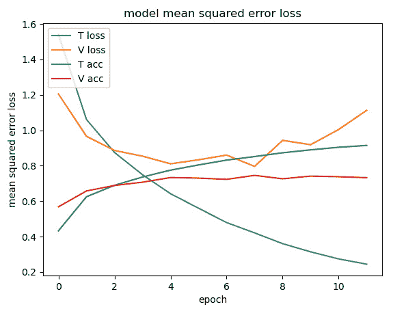

图 6.1 – 损失和准确率图

你可以看到，虽然训练损失（蓝色线）持续下降，但经过一些个 epoch 后，验证损失（橙色线）开始上升。正如在 *第五章* 的 *深度学习工作流程* 中解释的那样，这意味着模型过拟合了。这不一定是最优模型，但我们将继续开发它。

在下一节中，我们将简化这个模型。

# 一个更高效的网络

在我的笔记本电脑上训练先前的模型需要 686 秒，并达到 74.5% 的验证准确率和 91.4% 的训练准确率。理想情况下，为了提高效率，我们希望在保持准确率不变的同时减少训练时间。

让我们检查一些卷积层：

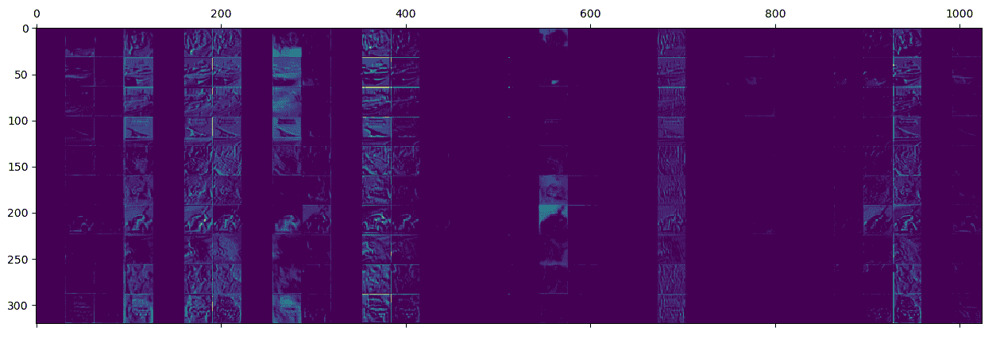

图 6.2 – 第一卷积层，32 个通道

我们已经在 *第五章* 的 *深度学习工作流程* 中看到了这些激活图，并且我们知道黑色通道没有达到大的激活，因此它们对结果贡献不大。在实践中，看起来一半的通道都没有使用。让我们尝试在每个卷积层中将通道数减半：

```py
model.add(Conv2D(filters=16, kernel_size=(3, 3), activation='relu', input_shape=x_train.shape[1:], padding="same"))
model.add(Conv2D(filters=16, kernel_size=(3, 3), activation='relu',    input_shape=x_train.shape[1:], padding="same"))
model.add(AveragePooling2D())

model.add(Conv2D(filters=32, kernel_size=(3, 3), activation='relu',    padding="same"))
model.add(Conv2D(filters=32, kernel_size=(3, 3), activation='relu',    padding="same"))
model.add(AveragePooling2D())

model.add(Conv2D(filters=64, kernel_size=(3, 3), activation='relu',    padding="same"))
model.add(Conv2D(filters=64, kernel_size=(3, 3), activation='relu',    padding="same"))
```

这是我们的结果：

```py
Total params: 829,146
```

如预期，参数数量现在少得多，训练速度也快得多：

```py
Training time: 422.8525400161743
Min Loss: 0.27083665314182637
Min Validation Loss: 0.8076118688702584
Max Accuracy: 0.90398
Max Validation Accuracy: 0.7415000200271606
```

我们可以看到，我们失去了一些准确率，但不是太多：

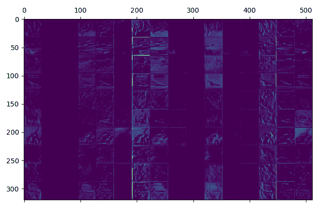

图 6.3 – 第一卷积层，16 个通道

现在好一些了。让我们检查第二层：

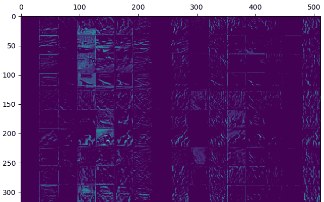

图 6.4 – 第二卷积层，16 个通道

这也好一些。让我们检查一下第四卷积层：

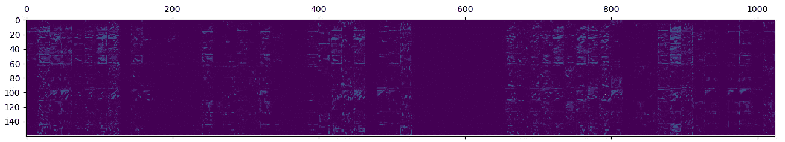

图 6.5 – 第四卷积层，64 个通道

它看起来有点空。让我们将第三层和第四层减半：

```py
Total params: 759,962
```

我们得到了以下结果：

```py
Training time: 376.09818053245544
Min Loss: 0.30105597005218265
Min Validation Loss: 0.8148738072395325
Max Accuracy: 0.89274
Max Validation Accuracy: 0.7391999959945679
```

训练准确率下降了，但验证准确率仍然不错：

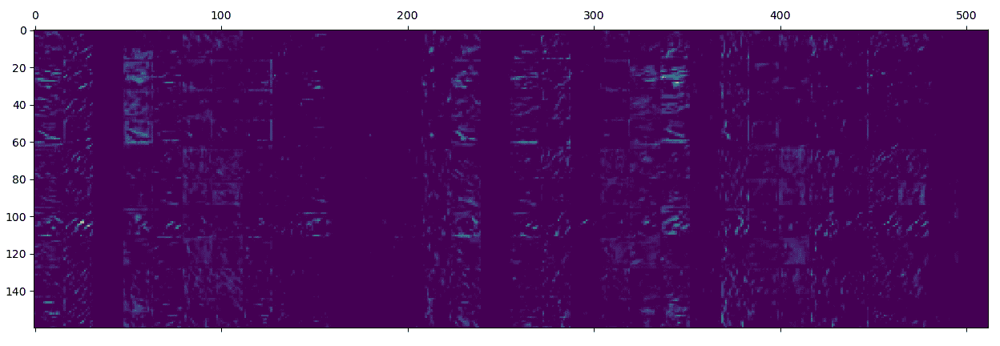

图 6.6 – 第四卷积层，32 个通道

让我们检查第六卷积层：

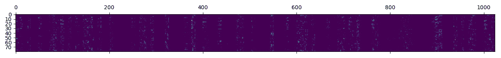

图 6.7 – 第六卷积层，128 个通道

它有点空。让我们也将最后两个卷积层减半：

```py
Total params: 368,666
```

它要小得多，这些结果是：

```py
Training time: 326.9148383140564
Min Loss: 0.296858479853943
Min Validation Loss: 0.7925313812971115
Max Accuracy: 0.89276
Max Validation Accuracy: 0.7425000071525574
```

它看起来仍然不错。让我们检查一下激活情况：

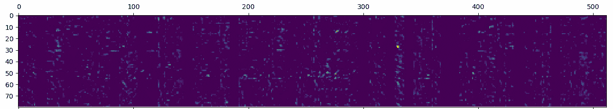

图 6.8 – 第六卷积层，64 个通道

你可以看到现在，许多通道被激活了，这希望是神经网络更好地利用其资源的指示。

将这个模型与上一节中构建的模型进行比较，你可以看到这个模型可以在不到一半的时间内训练完成，验证准确率几乎未变，训练准确率略有下降，但不是很多。所以，它确实更有效率。

在下一节中，我们将讨论批量归一化，这是一个在现代神经网络中非常常见的层。

# 使用批量归一化构建更智能的网络

我们将提供给网络的输入进行归一化，将范围限制在 0 到 1 之间，因此在中部网络中也这样做可能是有益的。这被称为**批量归一化**，它确实很神奇！

通常，你应该在想要归一化的输出之后、激活之前添加批量归一化，但添加在激活之后可能会提供更快的性能，这正是我们将要做的。

这是新的代码（省略了密集层）：

```py
model.add(Conv2D(filters=16, kernel_size=(3, 3), activation='relu',    input_shape=x_train.shape[1:], padding="same"))model.add(Conv2D(filters=16, kernel_size=(3, 3), activation='relu',    input_shape=x_train.shape[1:], padding="same"))model.add(BatchNormalization())model.add(AveragePooling2D())model.add(Conv2D(filters=32, kernel_size=(3, 3), activation='relu',    padding="same"))model.add(Conv2D(filters=32, kernel_size=(3, 3), activation='relu',    padding="same"))model.add(BatchNormalization())model.add(AveragePooling2D())model.add(Conv2D(filters=64, kernel_size=(3, 3), activation='relu',    padding="same"))model.add(Conv2D(filters=64, kernel_size=(3, 3), activation='relu',    padding="same"))model.add(BatchNormalization())model.add(AveragePooling2D())
```

参数数量仅略有增加：

```py
Total params: 369,114
```

这是结果：

```py
Training time: 518.0608556270599
Min Loss: 0.1616916553277429
Min Validation Loss: 0.7272815862298012
Max Accuracy: 0.94308
Max Validation Accuracy: 0.7675999999046326
```

还不错，尽管不幸的是，现在它要慢得多。但我们可以添加更多的批量归一化，看看是否可以改善情况：

```py
Training time: 698.9837136268616
Min Loss: 0.13732857785719446
Min Validation Loss: 0.6836542286396027
Max Accuracy: 0.95206
Max Validation Accuracy: 0.7918999791145325
```

是的，准确率都有所提高。我们实际上非常接近我们最初的 80%准确率的目标。但让我们更进一步，看看我们能做什么。

到目前为止，我们只使用了 ReLU 激活函数，但即使它被广泛使用，它也不是唯一的。Keras 支持多种激活函数，有时进行实验是值得的。我们将坚持使用 ReLU。

让我们检查一些激活情况：

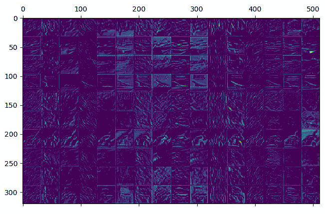

图 6.9 – 第二卷积层，16 个通道，批量归一化

现在，第二层的所有通道都在学习。非常好！

这是第四层的成果：

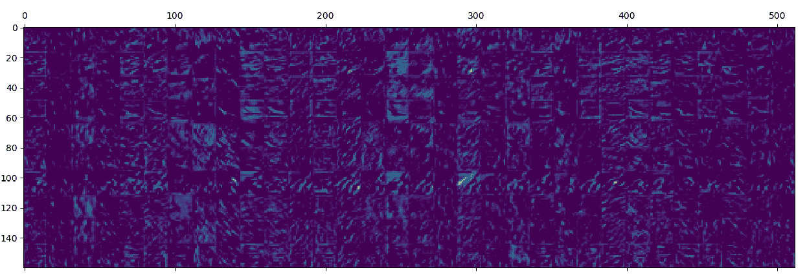

图 6.10 – 第四卷积层，32 个通道，批量归一化

这是第六层的成果：

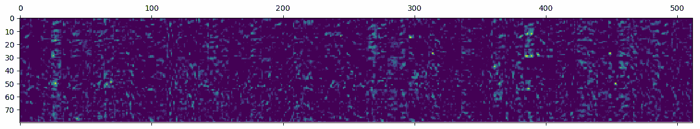

图 6.11 – 第六卷积层，64 个通道，批量归一化

它开始看起来不错了！

让我们尝试可视化批量归一化对第一层在批量归一化前后激活情况的影响：

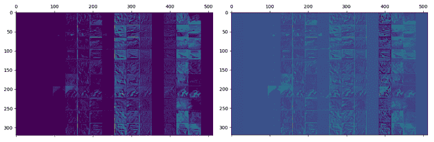

图 6.12 – 第一卷积层，16 个通道，批标准化前后的对比

你可以看到，通道的强度现在更加均匀；不再有既无活动又没有非常强烈的激活的通道。然而，那些不活跃的通道仍然没有真实信息。

让我们也检查第二层：

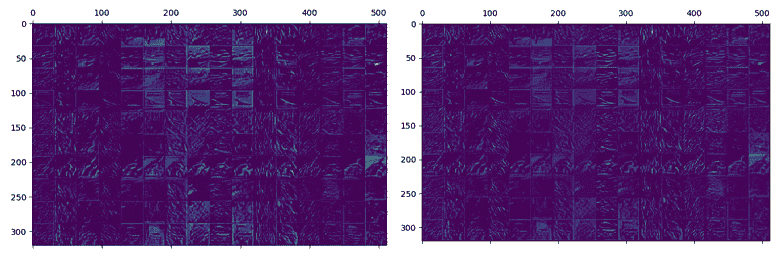

图 6.13 – 第二卷积层，16 个通道，批标准化前后的对比

这里可能不太明显，但你仍然可以看到通道之间的差异减少了，因为很明显，它们已经被归一化。直观上看，这有助于通过层传播较弱的信号，并且它有一些正则化效果，这导致更好的验证准确率。

既然我们已经讨论了批标准化，现在是时候进一步讨论什么是批，以及批的大小有什么影响。

## 选择合适的批大小

在训练过程中，我们有大量的样本，通常从几千到几百万。如果你还记得，优化器将计算损失函数并更新超参数以尝试减少损失。它可以在每个样本之后这样做，但结果可能会很嘈杂，连续的变化可能会减慢训练。在另一端，优化器可能只在每个 epoch 更新一次超参数——例如，使用梯度的平均值——但这通常会导致泛化不良。通常，批大小有一个范围，比这两个极端表现更好，但不幸的是，它取决于特定的神经网络。

较大的批量大小的确可以略微提高 GPU 上的训练时间，但如果你的模型很大，你可能会发现你的 GPU 内存是批量大小的限制因素。

批标准化也受到批量大小的影響，因为小批量会降低其有效性（因为没有足够的数据进行适当的归一化）。

考虑到这些因素，最好的做法是尝试。通常，你可以尝试使用 16、32、64 和 128，如果看到最佳值在范围的极限，最终可以扩展范围。

正如我们所见，最佳批大小可以提高准确率并可能提高速度，但还有一种技术可以帮助我们在加快速度的同时提高验证准确率，或者至少简化训练：提前停止。

# 提前停止

我们应该在什么时候停止训练？这是一个好问题！理想情况下，你希望在最小验证错误时停止。虽然你事先不知道这一点，但你可以通过检查损失来获得需要多少个 epoch 的概览。然而，当你训练你的网络时，有时你需要更多的 epoch，这取决于你如何调整你的模型，而且事先知道何时停止并不简单。

我们已经知道我们可以使用`ModelCheckpoint`，这是 Keras 的一个回调，在训练过程中保存具有最佳验证错误的模型。

但还有一个非常有用的回调，`EarlyStopping`，当预定义的一组条件发生时，它会停止训练：

```py
stop = EarlyStopping(min_delta=0.0005, patience=7, verbose=1)
```

配置提前停止最重要的参数如下：

+   `monitor`: 这决定了要监控哪个参数，默认为验证损失。

+   `min_delta`: 如果 epoch 之间的验证损失差异低于此值，则认为损失没有变化。

+   `耐心`: 这是允许在停止训练之前没有验证改进的 epoch 数量。

+   `verbose`: 这是指示 Keras 提供更多信息。

我们需要提前停止的原因是，在数据增强和 dropout 的情况下，我们需要更多的 epoch，而不是猜测何时停止，我们将使用提前停止来为我们完成这项工作。

现在让我们来谈谈数据增强。

# 使用数据增强改进数据集

是时候使用数据增强了，基本上，增加我们数据集的大小。

从现在起，我们将不再关心训练数据集的精度，因为这项技术会降低它，但我们将关注验证精度，预计它会提高。

我们也预计需要更多的 epoch，因为我们的数据集现在更难了，所以我们将 epoch 设置为`500`（尽管我们并不打算达到它）并使用具有`7`个 patience 的`EarlyStopping`。

让我们尝试这个增强：

```py
ImageDataGenerator(rotation_range=15, width_shift_range=[-5, 0, 5],    horizontal_flip=True)
```

您应该注意不要过度操作，因为网络可能会学习到一个与验证集差异很大的数据集，在这种情况下，您将看到验证精度停滞在 10%。

这是结果：

```py
Epoch 00031: val_loss did not improve from 0.48613
Epoch 00031: early stopping
Training time: 1951.4751739501953
Min Loss: 0.3638068118467927
Min Validation Loss: 0.48612626193910835
Max Accuracy: 0.87454
Max Validation Accuracy: 0.8460999727249146
```

提前停止在`31`个 epoch 后中断了训练，我们达到了 84%以上的验证精度——还不错。正如预期的那样，我们现在需要更多的 epoch。这是损失图：

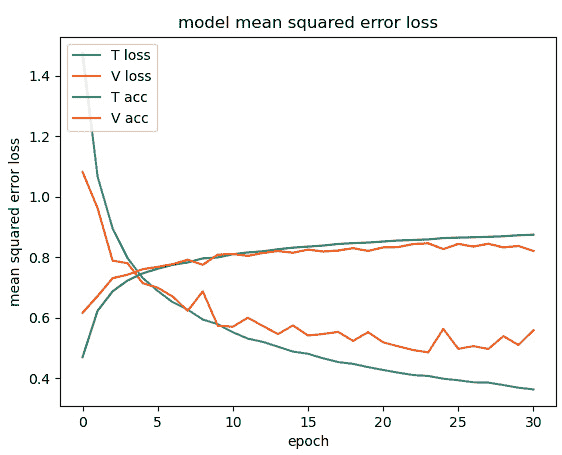

图 6.14 – 使用数据增强和提前停止的损失

您可以看到训练精度一直在增加，而验证精度在某些时候下降了。网络仍然有点过拟合。

让我们检查第一卷积层的激活：

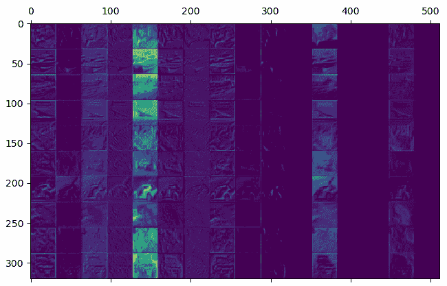

图 6.15 – 使用数据增强和提前停止的第一卷积层，16 个通道

它略有改善，但可能还会再次提高。

我们可以尝试稍微增加数据增强：

```py
ImageDataGenerator(rotation_range=15, width_shift_range=[-8, -4, 0,    4, 8], horizontal_flip=True, height_shift_range=[-5, 0, 5],    zoom_range=[0.9, 1.1])
```

这是结果：

```py
Epoch 00040: early stopping
Training time: 2923.3936190605164
Min Loss: 0.5091392234659194
Min Validation Loss: 0.5033097203373909
Max Accuracy: 0.8243
Max Validation Accuracy: 0.8331999778747559
```

这个模型速度较慢且精度较低。让我们看看图表：

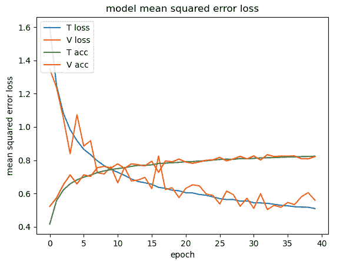

图 6.16 – 增加数据增强和提前停止的损失

可能需要更多的耐心。我们将坚持之前的数据增强。

在下一节中，我们将分析一种简单但有效的方法，通过使用 dropout 层来提高验证准确率。

# 使用 dropout 提高验证准确率

过拟合的一个来源是神经网络更依赖于一些神经元来得出结论，如果这些神经元出错，网络也会出错。减少这种问题的一种方法是在训练期间随机关闭一些神经元，而在推理期间保持它们正常工作。这样，神经网络就能学会更加抵抗错误，更好地泛化。这种机制被称为**dropout**，显然，Keras 支持它。Dropout 会增加训练时间，因为网络需要更多的 epoch 来收敛。它可能还需要更大的网络，因为在训练期间一些神经元会被随机关闭。当数据集对于网络来说不是很大时，它更有用，因为它更有可能过拟合。实际上，由于 dropout 旨在减少过拟合，如果你的网络没有过拟合，它带来的好处很小。

对于密集层，dropout 的典型值是 0.5，尽管我们可能使用略小的值，因为我们的模型过拟合不多。我们还将增加*耐心*到`20`，因为现在模型需要更多的 epoch 来训练，验证损失可能会波动更长的时间。

让我们尝试在密集层中添加一些 dropout：

```py
model.add(Flatten())
model.add(Dense(units=256, activation='relu'))
model.add(Dropout(0.4))
model.add(Dense(units=128, activation='relu'))
model.add(Dropout(0.2))
model.add(Dense(units=num_classes, activation = 'softmax'))
```

这是结果：

```py
Epoch 00097: early stopping
Training time: 6541.777503728867
Min Loss: 0.38114651718586684
Min Validation Loss: 0.44884318161308767
Max Accuracy: 0.87218
Max Validation Accuracy: 0.8585000038146973
```

这有点令人失望。训练花费了很长时间，但只有微小的进步。我们假设我们的密集层有点小。

让我们将层的尺寸增加 50%，同时增加第一个密集层中的 dropout，并减少第二个密集层中的 dropout：

```py
model.add(Flatten())model.add(Dense(units=384, activation='relu'))model.add(Dropout(0.5))model.add(Dense(units=192, activation='relu'))model.add(Dropout(0.1))model.add(Dense(units=num_classes, activation='softmax'))
```

当然，它更大，正如我们在这里可以看到的：

```py
Total params: 542,426
```

它的结果略好一些：

```py
Epoch 00122: early stopping
Training time: 8456.040931940079
Min Loss: 0.3601766444931924
Min Validation Loss: 0.4270844452492893
Max Accuracy: 0.87942
Max Validation Accuracy: 0.864799976348877
```

随着我们提高验证准确率，即使是小的进步也变得困难。

让我们检查一下图表：

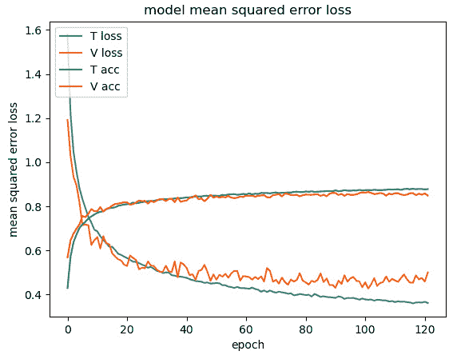

图 6.17 – 在密集层上使用更多数据增强和 dropout 的损失

存在一点过拟合，所以让我们尝试修复它。我们也可以在卷积层中使用`Dropout`。

让我们尝试这个：

```py
model.add(Conv2D(filters=16, kernel_size=(3, 3), activation='relu', input_shape=x_train.shape[1:],    padding="same"))
model.add(BatchNormalization())
model.add(Dropout(0.5))
model.add(Conv2D(filters=16, kernel_size=(3, 3), activation='relu', input_shape=x_train.shape[1:],    padding="same"))
model.add(BatchNormalization())
model.add(AveragePooling2D())
model.add(Dropout(0.5))
```

这是令人失望的结果：

```py
Epoch 00133: early stopping
Training time: 9261.82032418251
Min Loss: 0.6104169194960594
Min Validation Loss: 0.4887285701841116
Max Accuracy: 0.79362
Max Validation Accuracy: 0.8417999744415283
```

网络没有改进！

这里，我们看到一个有趣的情况——验证准确率显著高于训练准确率。这是怎么可能的？

假设你的分割是正确的（例如，你没有包含与训练数据集太相似图像的验证集），两个因素可以造成这种情况：

+   数据增强可能会使训练数据集比验证数据集更难。

+   Dropout 在训练阶段是激活的，而在预测阶段是关闭的，这意味着训练数据集可以比验证数据集显著更难。

在我们这个例子中，罪魁祸首是`Dropout`。你不必一定避免这种情况，如果它是合理的，但在这个例子中，验证准确率下降了，所以我们需要修复我们的`Dropout`，或者也许增加网络的大小。

我发现`Dropout`在卷积层中使用起来更困难，我个人在那个情况下不会使用大的`Dropout`。这里有一些指导方针：

+   不要在`Dropout`之后立即使用批量归一化，因为归一化会受到影响。

+   `Dropout`在`MaxPooling`之后比之前更有效。

+   在卷积层之后的`Dropout`会丢弃单个像素，但`SpatialDropout2D`会丢弃通道，并且建议在神经网络开始的第一几个层中使用。

我又进行了一些（长！）实验，并决定增加卷积层的大小，减少`Dropout`，并在几个层中使用`Spatial Dropout`。最终我得到了这个神经网络，这是我认为的最终版本。

这是卷积层的代码：

```py
model = Sequential()
model.add(Conv2D(filters=32, kernel_size=(3, 3), activation='relu', input_shape=x_train.shape[1:], padding="same"))
model.add(BatchNormalization())
model.add(Conv2D(filters=32, kernel_size=(3, 3), activation='relu', input_shape=x_train.shape[1:], padding="same"))
model.add(BatchNormalization())
model.add(AveragePooling2D())
model.add(SpatialDropout2D(0.2))

model.add(Conv2D(filters=48, kernel_size=(3, 3), activation='relu',    padding="same"))
model.add(BatchNormalization())
model.add(Conv2D(filters=48, kernel_size=(3, 3), activation='relu',    padding="same"))
model.add(BatchNormalization())
model.add(AveragePooling2D())
model.add(SpatialDropout2D(0.2))

model.add(Conv2D(filters=72, kernel_size=(3, 3), activation='relu',    padding="same"))
model.add(BatchNormalization())
model.add(Conv2D(filters=72, kernel_size=(3, 3), activation='relu',    padding="same"))
model.add(BatchNormalization())
model.add(AveragePooling2D())
model.add(Dropout(0.1))

And this is the part with the dense layers:model.add(Flatten())
model.add(Dense(units=384, activation='relu'))
model.add(Dropout(0.5))
model.add(Dense(units=192, activation='relu'))
model.add(Dropout(0.1))
model.add(Dense(units=num_classes, activation='softmax'))
```

这些是结果：

```py
Epoch 00168: early stopping
Training time: 13122.931826591492
Min Loss: 0.4703261657243967
Min Validation Loss: 0.3803714614287019
Max Accuracy: 0.84324
Max Validation Accuracy: 0.8779000043869019
```

验证准确率有所提高：


图 6.18 – 在密集和卷积层上使用更多数据增强和`Dropout`的损失

恭喜！现在你有了如何训练神经网络的思路，并且可以自由地实验和发挥创意！每个任务都是不同的，可能性真的是无限的。

为了好玩，让我们再次训练它，看看相同的逻辑模型在 MNIST 上的表现如何。

## 将模型应用于 MNIST

我们之前的 MNIST 模型达到了 98.3%的验证准确率，正如你可能已经注意到的，你越接近 100%，提高模型就越困难。

我们的 CIFAR-10 是在与 MNIST 不同的任务上训练的，但让我们看看它的表现：

```py
Epoch 00077: early stopping
Training time: 7110.028198957443
Min Loss: 0.04797766085289389
Min Validation Loss: 0.02718053938352254
Max Accuracy: 0.98681664
Max Validation Accuracy: 0.9919000267982483
```

这是它的图表：

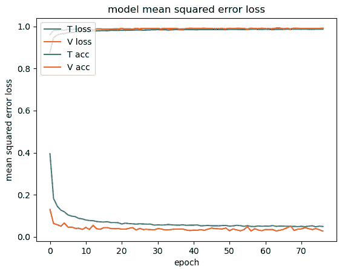

图 6.19 – MNIST，损失

我希望每个任务都像 MNIST 一样简单！

出于好奇，这是第一层的激活：

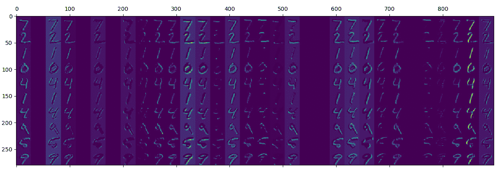

图 6.20 – MNIST，第一卷积层的激活

如你所见，许多通道被激活，并且它们很容易检测到数字的最重要特征。

这可能是一个尝试 GitHub 上的代码并对其进行实验的绝佳时机。

## 现在轮到你了！

如果你有些时间，你真的应该尝试一个公共数据集，或者甚至创建你自己的数据集，并从头开始训练一个神经网络。

如果你已经没有想法了，可以使用 CIFAR-100。

记住，训练神经网络通常不是线性的——你可能需要猜测什么可以帮助你，或者你可能尝试许多不同的事情。并且记住要反复试验，因为当你的模型发展时，不同技术和不同层的重要性可能会改变。

# 摘要

这是一个非常实用的章节，展示了在训练神经网络时的一种进行方式。我们从一个大模型开始，实现了 69.7%的验证准确率，然后我们减小了其尺寸并添加了一些层来增加非线性激活的数量。我们使用了批量归一化来均衡所有通道的贡献，然后我们学习了提前停止，这有助于我们决定何时停止训练。

在学习如何自动停止训练后，我们立即将其应用于数据增强，这不仅增加了数据集的大小，还增加了正确训练网络所需的 epoch 数量。然后我们介绍了`Dropout`和`SpatialDropout2D`，这是一种强大的减少过拟合的方法，尽管使用起来并不总是容易。

我们最终得到了一个达到 87.8%准确率的网络。

在下一章中，我们将训练一个能够在空旷的轨道上驾驶汽车的神经网络！

# 问题

在本章之后，你将能够回答以下问题：

1.  我们为什么想使用更多层？

1.  具有更多层的网络是否自动比较浅的网络慢？

1.  我们如何知道何时停止训练模型？

1.  我们可以使用哪个 Keras 函数在模型开始过拟合之前停止训练？

1.  你如何归一化通道？

1.  你如何有效地使你的数据集更大、更难？

1.  dropout 会使你的模型更鲁棒吗？

1.  如果你使用数据增强，你会期望训练变慢还是变快？

1.  如果你使用 dropout，你会期望训练变慢还是变快？
