# *第八章*: 行为克隆

在本章中，我们将训练一个神经网络来控制汽车的转向盘，有效地教会它如何驾驶汽车！希望你会对这项任务的核心如此简单感到惊讶，这要归功于深度学习。

为了实现我们的目标，我们不得不修改 CARLA 模拟器的一个示例，首先保存创建数据集所需的图像，然后使用我们的神经网络来驾驶。我们的神经网络将受到英伟达 DAVE-2 架构的启发，我们还将看到如何更好地可视化神经网络关注的区域。

在本章中，我们将涵盖以下主题：

+   使用行为克隆教神经网络如何驾驶

+   英伟达 DAVE-2 神经网络

+   从 Carla 记录图像和转向盘

+   记录三个视频流

+   创建神经网络

+   训练用于回归的神经网络

+   可视化显著性图

+   与 Carla 集成以实现自动驾驶

+   使用生成器训练更大的数据集

# 技术要求

为了能够使用本章中解释的代码，您需要安装以下工具和模块：

+   Carla 模拟器

+   Python 3.7

+   NumPy 模块

+   TensorFlow 模块

+   Keras 模块

+   `keras-vis`模块

+   OpenCV-Python 模块

+   一个 GPU（推荐）

本章的代码可以在以下链接找到：[`github.com/PacktPublishing/Hands-On-Vision-and-Behavior-for-Self-Driving-Cars/tree/master/Chapter8`](https://github.com/PacktPublishing/Hands-On-Vision-and-Behavior-for-Self-Driving-Cars/tree/master/Chapter8)。

本章的《代码实战》视频可以在以下链接找到：

[`bit.ly/3kjIQLA`](https://bit.ly/3kjIQLA)

# 使用行为克隆教神经网络如何驾驶

自动驾驶汽车是一个复杂的硬件和软件集合。普通汽车的硬件已经很复杂了，通常有成千上万的机械部件，而自动驾驶汽车又增加了许多传感器。软件并不简单，事实上，据说早在 15 年前，一家世界级的汽车制造商不得不退步，因为软件的复杂性已经失控。为了给您一个概念，一辆跑车可以有超过 50 个 CPU！

显然，制造一个既安全又相对快速的自动驾驶汽车是一个难以置信的挑战，但尽管如此，我们将看到一行代码可以有多强大。对我来说，意识到如此复杂的事情如驾驶可以用如此简单的方式编码，是一个启发性的时刻。但我并不应该感到惊讶，因为，在深度学习中，数据比代码本身更重要，至少在某种程度上。

我们没有在真实自动驾驶汽车上测试的奢侈条件，所以我们将使用 Carla，并且我们将训练一个神经网络，在输入摄像头视频后能够生成转向角度。尽管如此，我们并没有使用其他传感器，原则上，你可以使用你想象中的所有传感器，只需修改网络以接受这些额外的数据。

我们的目标是教会 Carla 如何进行一次“绕圈”，使用 **Town04** 轨道的一部分，这是 Carla 包含的轨道之一。我们希望我们的神经网络能够稍微直行，然后进行一些右转，直到到达初始点。原则上，为了训练神经网络，我们只需要驾驶 Carla，记录道路图像和我们应用的相应转向角度，这个过程被称为**行为克隆**。

我们的任务分为三个步骤：

+   构建数据集

+   设计和训练神经网络

+   在 Carla 中集成神经网络

我们将借鉴 Nvidia 创建的 DAVE-2 系统。那么，让我们开始描述它。

# 介绍 DAVE-2

DAVE-2 是 Nvidia 设计的一个系统，用于训练神经网络驾驶汽车，旨在作为一个概念验证，证明原则上一个单一的神经网络能够在一个道路上控制汽车。换句话说，如果提供足够的数据，我们的网络可以被训练来在真实的道路上驾驶真实的汽车。为了给你一个概念，Nvidia 使用了大约 72 小时的视频，每秒 10 帧。

这个想法非常简单：我们给神经网络提供视频流，神经网络将简单地生成转向角度，或者类似的东西。训练是由人类驾驶员创建的，系统从摄像头（训练数据）和驾驶员操作的转向盘（训练标签）收集数据。这被称为*行为克隆*，因为网络试图复制人类驾驶员的行为。

不幸的是，这会过于简单，因为大部分标签将简单地是 0（驾驶员直行），因此网络将难以学习如何移动到车道中间。为了缓解这个问题，Nvidia 使用了三个摄像头：

+   车辆中央的一个，这是真实的人类行为

+   左侧的一个，模拟如果汽车过于靠左时应该怎么做

+   右侧的一个，模拟如果汽车过于靠右时应该怎么做

为了使左右摄像头有用，当然有必要更改与它们视频相关的转向角度，以模拟一个校正；因此，*左*摄像头需要与一个*更向右*的转向相关联，而*右*摄像头需要与一个*更向左*的转向相关联。

下面的图示显示了系统：

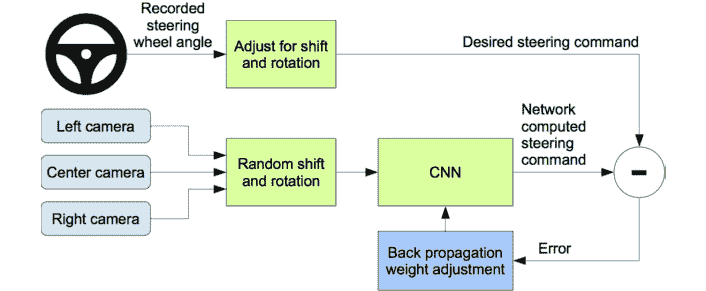

图 8.1 – Nvidia DAVE-2 系统

为了使系统更健壮，Nvidia 添加了随机的平移和旋转，并调整转向以适应，但我们将不会这样做。然而，我们将使用他们建议的三个视频流。

我们如何获取三个视频流和转向角度？当然是从 Carla 获取的，我们将在本章中大量使用它。在开始编写代码之前，让我们熟悉一下`manual_control.py`文件，这是一个我们将复制并修改的文件。

## 了解`manual_control.py`

我们不会编写一个完整的客户端代码来完成我们需要的操作，而是会修改`manual_control.py`文件，从`PythonAPI/examples`。

我通常会说明需要修改的代码位置，但您实际上需要检查 GitHub 以查看它。

在开始之前，请考虑本章的代码可能比通常更严格地要求版本，特别是可视化部分，因为它使用了一个尚未更新的库。

我的建议是使用 Python 3.7，并安装 TensorFlow 版本 2.2、Keras 2.3 和`scipy` 1.2，如下所示：

```py
pip install tensorflow==2.2.0 pip install keras==2.3.1 pip install scipy==1.2.3
```

如果您现在查看`manual_control.py`，您可能会注意到的第一件事是这个代码块：

```py
try:  sys.path.append(glob.glob('../carla/dist/carla-*%d.%d-%s.egg' % (    sys.version_info.major,    sys.version_info.minor,    'win-amd64' if os.name == 'nt' else 'linux-x86_64'))[0])except IndexError:  pass
```

它加载一个包含 Carla 代码的`egg`文件，该文件位于`PythonAPI/carla/dist/`文件夹中。作为替代方案，您也可以使用以下命令安装 Carla，当然需要使用您的`egg`文件名：

```py
python -m easy_install carla-0.9.9-py3.7-win-amd64.egg
```

在此之后，您可能会注意到代码被组织成以下类：

+   `World`: 我们车辆移动的虚拟世界，包括地图和所有演员（车辆、行人和传感器）。

+   `KeyboardControl`: 这个类会响应用户按下的键，并且包含一些逻辑，将转向、制动和加速的二进制开/关键转换为更广泛的值范围，这取决于它们被按下的时间长短，从而使汽车更容易控制。

+   `HUD`: 这个类渲染与模拟相关的所有信息，如速度、转向和油门，并管理可以显示一些信息给用户的提示，持续几秒钟。

+   `FadingText`: 这个类被 HUD 类使用，用于显示几秒钟后消失的通知。

+   `HelpText`: 这个类使用`pygame`（Carla 使用的游戏库）显示一些文本。

+   `CollisionSensor`: 这是一个能够检测碰撞的传感器。

+   `LaneInvasionSensor`: 这是一个能够检测您是否跨越了车道线的传感器。

+   `GnssSensor`: 这是一个 GPS/GNSS 传感器，它提供了 OpenDRIVE 地图内的 GNSS 位置。

+   `IMUSensor`: 这是一个惯性测量单元，它使用陀螺仪来检测施加在汽车上的加速度。

+   `RadarSensor`: 一个雷达，提供检测到的元素（包括速度）的二维地图。

+   `CameraManager`: 这是一个管理相机并打印其信息的类。

此外，还有一些其他值得注意的方法：

+   `main()`: 这部分主要致力于解析操作系统接收到的参数。

+   `game_loop()`：这个函数主要初始化 pygame、Carla 客户端以及所有相关对象，并且实现了游戏循环，其中每秒 60 次，分析按键并显示最新的图像在屏幕上。

帧的可视化是由`game_loop()`触发的，以下是一行：

```py
world.render(display)
```

`world.render()`方法调用`CameraManager.render()`，显示最后一帧可用的图像。

如果你检查了代码，你可能已经注意到 Carla 使用弱引用来避免循环引用。**弱引用**是一种不会阻止对象被垃圾回收的引用，这在某些场景中很有用，例如缓存。

当你与 Carla 一起工作时，有一件重要的事情需要考虑。你的一些代码在服务器上运行，而另一些代码在客户端上运行，可能不容易在这两者之间划清界限。这可能会导致意想不到的后果，例如你的模型运行速度慢 10 到 30 倍，这可能是由于它被序列化到服务器上，尽管这只是我在看到这个问题后的推测。因此，我在`game_loop()`方法中运行我的推理，这肯定是在客户端上运行的。

这也意味着帧是在服务器上计算并发送到客户端的。

另一个不幸需要考虑的事情是，Carla 的 API 并不稳定，版本 0.9.0 删除了许多应该很快就会恢复的功能。

文档也没有特别更新这些缺失的 API，所以如果你发现事情没有按预期工作，请不要感到惊讶。希望这很快就会得到修复。同时，你可以使用旧版本。我们使用了 Carla 0.9.9.2，还有一些粗糙的边缘，但对于我们的需求来说已经足够好了。

现在我们对 CARLA 有了更多的了解，让我们看看我们如何录制我们的数据集，从只有一个视频流开始。

## 录制一个视频流

在原则上，使用 Carla 录制一个视频流非常简单，因为已经有一个选项可以这样做。如果你从`PythonAPI/examples`目录运行`manual_control.py`，当你按下*R*键时，它就开始录制。

问题是我们还想要转向角度。通常，你可以将此类数据保存到某种类型的数据库中，CSV 文件或 pickle 文件。为了使事情更简单并专注于核心任务，我们只需将转向角度和一些其他数据添加到文件名中。这使得你构建数据集变得更容易，因为你可能想要记录多个针对特定问题修复的运行，你只需将文件移动到新目录中，就可以轻松地保留所有信息，而无需在数据库中更新路径。

但如果你不喜欢，请随意使用更好的系统。

我们可以从头开始编写一个与 Carla 服务器集成的客户端，并完成我们所需的功能，但为了简单起见，并更好地隔离所需更改，我们只需将`manual_control.py`复制到一个名为`manual_control_recording.py`的文件中，然后我们只需添加所需的内容。

请记住，这个文件应该在 `PythonAPI/examples` 目录下运行。

我们首先想做的事情是将轨道改为 `Town04`，因为它比默认轨道更有趣：

```py
client.load_world('Town04')
client.reload_world()
```

之前的代码需要放入 `game_loop()` 方法中。

变量 client 明显是连接到 Carla 服务器的客户端。

我们还需要将出生点（模拟开始的地方）改为固定，因为通常，它会每次都改变：

```py
spawn_point = spawn_points[0] if spawn_points else carla.Transform()
```

现在，我们需要更改文件名。在此过程中，我们不仅会保存转向角度，还会保存油门和刹车。我们可能不会使用它们，但如果你想进行实验，它们将为你提供。以下方法应在 `CameraManager` 类中定义：

```py
def set_last_controls(self, control):
    self.last_steer = control.steer
    self.last_throttle = control.throttle
    self.last_brake = control.brake
```

现在，我们可以按以下方式保存文件：

```py
image.save_to_disk('_out/%08d_%s_%f_%f_%f.jpg' % (image.frame,     camera_name, self.last_steer, self.last_throttle,    self.last_brake))
```

`image.frame` 变量包含当前帧的编号，而 `camera_name` 目前并不重要，但它的值将是 `MAIN`。

`image` 变量还包含我们想要保存的当前图像。

你应该得到类似以下的名字：

```py
00078843_MAIN_0.000000_0.500000_0.000000.jpg
```

在上一个文件名中，你可以识别以下组件：

+   帧编号（`00078843`）

+   相机（`MAIN`）

+   转向角度（`0.000000`）

+   油门（`0.500000`）

+   刹车（`0.000000`）

这是图像，以我的情况为例：

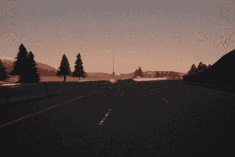

图 8.2 – Carla 的一帧，转向 0 度

这帧还可以，但并不完美。我应该待在另一条车道上，或者转向应该稍微指向右边。在行为克隆的情况下，汽车会从你那里学习，所以你的驾驶方式很重要。用键盘控制 Carla 并不好，而且在记录时，由于保存图像所花费的时间，效果更差。

真正的问题是，我们需要记录三个相机，而不仅仅是其中一个。让我们看看如何做到这一点。

### 记录三个视频流

要记录三个视频流，起点是拥有三个相机。

默认情况下，Carla 有以下五个相机：

+   一个经典的 *第三人称* 视角，从车后上方

+   从车前朝向道路（向前看）

+   从车前朝向汽车（向后看）

+   从高空

+   从左侧

在这里，你可以看到前三个相机：

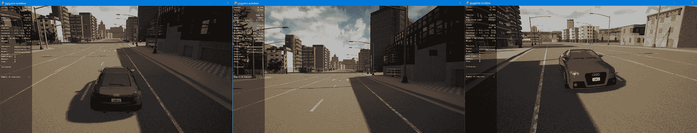

图 8.3 – 从上方、朝向道路和朝向汽车的相机

第二个相机对我们来说非常有趣。

以下是从剩余的两个相机中获取的：

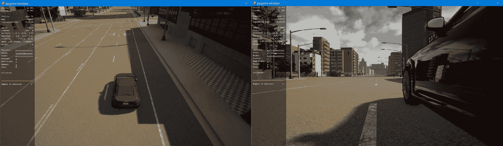

图 8.4 – 从高空和左侧的 Carla 相机

最后一个相机也有些有趣，尽管我们不想在我们的帧中记录汽车。由于某种原因，Carla 的作者没有将其添加到列表中，所以我们缺少右侧的相机。

幸运的是，更换相机或添加新相机相当简单。这是原始相机的定义，`CameraManager`构造函数：

```py
bound_y = 0.5 + self._parent.bounding_box.extent.y
self._camera_transforms = [
    (carla.Transform(carla.Location(x=-5.5, z=2.5),        carla.Rotation(pitch=8.0)), Attachment.SpringArm),
    (carla.Transform(carla.Location(x=1.6, z=1.7)),         Attachment.Rigid),
    (carla.Transform(carla.Location(x=5.5, y=1.5, z=1.5)),        Attachment.SpringArm),
    (carla.Transform(carla.Location(x=-8.0, z=6.0),         carla.Rotation(pitch=6.0)), Attachment.SpringArm),
    (carla.Transform(carla.Location(x=-1, y=-bound_y, z=0.5)),        Attachment.Rigid)]
```

作为第一次尝试，我们可以只保留第二和第五个相机，但我们希望它们处于可比较的位置。Carla 是用一个非常著名的游戏引擎编写的：*Unreal Engine 4*。在*Unreal Engine*中，*z*轴是垂直轴（上下），*x*轴用于前后，*y*轴用于横向移动，左右。因此，我们希望相机具有相同的*x*和*z*坐标。我们还想有一个第三个相机，从右侧。为此，只需改变*y*坐标的符号即可。这是仅针对相机的结果代码：

```py
(carla.Transform(carla.Location(x=1.6, z=1.7)), Attachment.Rigid),(carla.Transform(carla.Location(x=1.6, y=-bound_y, z=1.7)),    Attachment.Rigid),(carla.Transform(carla.Location(x=1.6, y=bound_y, z=1.7)),    Attachment.Rigid)
```

你可能可以在这里停止。我最终将侧向相机移动得更靠边，这可以通过更改`bound_y`来实现。

```py
bound_y = 4
```

这些是我们现在得到的图像：

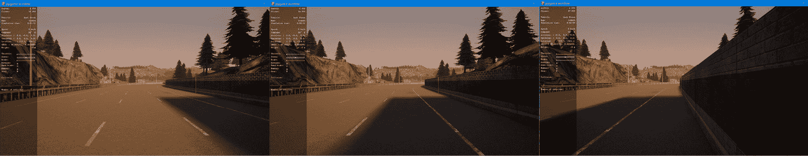

图 8.5 – 新相机：从左、从正面（主相机）和从右

现在，应该更容易理解，与主相机相比，左右相机可以用来教神经网络如何纠正轨迹，如果它不在正确的位置。当然，这假设主相机录制的流是预期的位置。

即使现在有了正确的相机，它们也没有在使用。我们需要在`World.restart()`中添加它们，如下所示：

```py
self.camera_manager.add_camera(1)self.camera_manager.add_camera(2)
```

`CameraManager.add_camera()`方法定义如下：

```py
camera_name = self.get_camera_name(camera_index)if not (camera_index in self.sensors_added_indexes):    sensor = self._parent.get_world().spawn_actor(                self.sensors[self.index][-1],                self._camera_transforms[camera_index][0],                attach_to=self._parent,                attachment_type=self._camera_transforms[camera_index][1])        self.sensors_added_indexes.add(camera_index)        self.sensors_added.append(sensor)        # We need to pass the lambda a weak reference to self to avoid         # circular reference.        weak_self = weakref.ref(self)        sensor.listen(lambda image: CameraManager._save_image(weak_self,         image, camera_name))
```

这段代码的作用如下：

1.  使用指定的相机设置传感器

1.  将传感器添加到列表中

1.  指示传感器调用一个 lambda 函数，该函数调用`save_image()`方法

下面的`get_camera_name()`方法用于根据其索引为相机获取一个有意义的名称，该索引依赖于我们之前定义的相机：

```py
def get_camera_name(self, index):    return 'MAIN' if index == 0 else ('LEFT' if index == 1 else         ('RIGHT' if index == 2 else 'UNK'))
```

在查看`save_image()`的代码之前，让我们讨论一个小问题。

每一帧录制三个相机有点慢，导致**每秒帧数**（**FPS**）低，这使得驾驶汽车变得困难。因此，你会过度纠正，录制一个次优的数据集，基本上是在教汽车如何蛇形行驶。为了限制这个问题，我们将为每一帧只录制一个相机视图，然后在下一帧旋转到下一个相机视图，我们将在录制过程中循环所有三个相机视图。毕竟，连续的帧是相似的，所以这不是一个大问题。

英伟达使用的相机以 30 FPS 的速度录制，但他们决定跳过大多数帧，只以 10 FPS 的速度录制，因为帧非常相似，这样会增加训练时间而不会增加太多信息。你不会以最高速度录制，但你的数据集会更好，如果你想有一个更大的数据集，你总是可以多开一些车。

`save_image()` 函数需要首先检查这是否是我们想要记录的帧：

```py
if self.recording:
    n = image.frame % 3

    # Save only one camera out of 3, to increase fluidity
    if (n == 0 and camera_name == 'MAIN') or (n == 1 and         camera_name == 'LEFT') or (n == 2 and camera_name ==            'RIGHT'):
       # Code to convert, resize and save the image
```

第二步是将图像转换为适合 OpenCV 的格式，因为我们将要使用它来保存图像。我们需要将原始缓冲区转换为 NumPy，我们还需要删除一个通道，因为 Carla 产生的图像是 BGRA，有四个通道：蓝色、绿色、红色和透明度（不透明度）：

```py
img = np.frombuffer(image.raw_data, dtype=np.dtype('uint8'))
img = np.reshape(img, (image.height, image.width, 4))
img = img[:, :, :3]
```

现在，我们可以调整图像大小，裁剪我们需要的部分，并保存它：

```py
img = cv2.resize(img, (200, 133))
img = img[67:, :, :]

cv2.imwrite('_out/%08d_%s_%f_%f_%f.jpg' % (image.frame, camera_name,   self.last_steer, self.last_throttle, self.last_brake), img). 
```

你可以在 GitHub 的代码仓库中看到，我记录了大量帧，足以驾驶一两个转弯，但如果你想沿着整个赛道驾驶，你需要更多的帧，而且你开得越好，效果越好。

现在，我们有了摄像头，我们需要使用它们来构建我们所需的数据集。

### 记录数据集

显然，为了构建数据集，你需要记录至少你期望你的网络做出的转弯。越多越好。但你也应该记录有助于你的汽车纠正轨迹的运动。左右摄像头已经帮助很多，但你应该也记录一些汽车靠近道路边缘，方向盘将其转向中心的段。

例如，考虑以下内容：

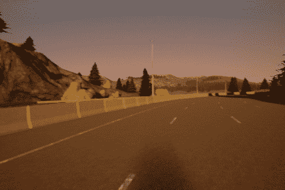

图 8.6 – 车辆靠近左侧，转向右侧

如果有转弯没有按照你想要的方式进行，你可以尝试记录它们多次，就像我这样做。

现在，你可能看到了将方向盘编码到图像名称中的优势。你可以将这些纠正段，或者你喜欢的任何内容，放在专用目录中，根据需要将它们添加到数据集中或从中移除。

如果你愿意，甚至可以手动选择图片的一部分，以纠正错误的转向角度，尽管如果只有有限数量的帧有错误的角度，这可能不是必要的。

尽管每帧只保存一个摄像头，但你可能仍然发现驾驶很困难，尤其是在速度方面。我个人更喜欢限制加速踏板，这样汽车不会开得太快，但当我想要减速时，我仍然可以减速。

加速踏板通常可以达到`1`的值，所以要限制它，只需要使用类似以下的一行代码，在`KeyboardControl ._parse_vehicle_keys()`方法中：

```py
self._control.throttle = min(self._control.throttle + 0.01, 0.5)
```

为了增加流畅性，你可能需要以较低的分辨率运行客户端：

```py
python manual_control_packt.py --res 480x320
```

你也可以降低服务器的分辨率，如下所示：

```py
CarlaUE4  -ResX=480-ResY=320
```

现在你有了原始数据集，是时候创建真实数据集了，带有适当的转向角度。

### 预处理数据集

我们记录的数据集是原始的，这意味着在使用之前需要一些预处理。

最重要的是要纠正左右摄像头的转向角度。

为了方便，这是通过一个额外的程序完成的，这样你最终可以更改它，而无需再次记录帧。

首先，我们需要一种方法从名称中提取数据（我们假设文件是 JPG 或 PNG 格式）：

```py
def expand_name(file):
    idx = int(max(file.rfind('/'), file.rfind('\\')))
    prefix = file[0:idx]
    file = file[idx:].replace('.png', '').replace('.jpg', '')
    parts = file.split('_')

    (seq, camera, steer, throttle, brake, img_type) = parts

    return (prefix + seq, camera, to_float(steer),        to_float(throttle), to_float(brake), img_type)
```

`to_float`方法只是一个方便的转换，将-0 转换为 0。

现在，改变转向角度很简单：

```py
(seq, camera, steer, throttle, brake, img_type) = expand_name(file_name)

    if camera == 'LEFT':
        steer = steer + 0.25
    if camera == 'RIGHT':
        steer = steer - 0.25
```

我添加了 0.25 的校正。如果你的相机离车更近，你可能想使用更小的数字。

在此过程中，我们还可以添加镜像帧，以稍微增加数据集的大小。

现在我们已经转换了数据集，我们准备训练一个类似于 DAVE-2 的神经网络来学习如何驾驶。

## 神经网络建模

要创建我们的神经网络，我们将从 DAVE-2 中汲取灵感，这是一个出奇简单的神经网络：

+   我们从一个 lambda 层开始，将图像像素限制在(-1, +1)范围内：

    ```py
    model = Sequential()
    model.add(Lambda(lambda x: x/127.5 - 1., input_shape=(66, 200, 3)))
    ```

+   然后，有三个大小为`5`和步长`(2,2)`的卷积层，它们将输出分辨率减半，以及三个大小为`3`的卷积层：

    ```py
    model.add(Conv2D(24, (5, 5), strides=(2, 2), activation='elu'))
    model.add(Conv2D(36, (5, 5), strides=(2, 2), activation='relu'))
    model.add(Conv2D(48, (5, 5), strides=(2, 2), activation='relu'))

    model.add(Conv2D(64, (3, 3), activation='relu'))
    model.add(Conv2D(64, (3, 3), activation='relu'))
    ```

+   然后，我们有密集层：

    ```py
    model.add(Flatten())
    model.add(Dense(1164, activation='relu'))
    model.add(Dense(100, activation='relu'))
    model.add(Dense(50, activation='relu'))
    model.add(Dense(10, activation='relu'))
    model.add(Dense(1, activation='tanh'))
    ```

当我想这些几行代码足以让汽车在真实道路上自动驾驶时，我总是感到惊讶！

虽然它看起来与之前我们看到的其他神经网络或多或少相似，但有一个非常重要的区别——最后的激活函数不是 softmax 函数，因为这不是一个分类器，而是一个需要执行*回归*任务的神经网络，根据图像预测正确的转向角度。

当神经网络试图在一个可能连续的区间内预测一个值时，我们称其为回归，例如在-1 和+1 之间。相比之下，在分类任务中，神经网络试图预测哪个标签更有可能是正确的，这很可能代表了图像的内容。因此，能够区分猫和狗的神经网络是一个分类器，而试图根据大小和位置预测公寓成本的神经网络则是在执行回归任务。

让我们看看我们需要更改什么才能使用神经网络进行回归。

## 训练回归神经网络

正如我们已经看到的，一个区别是缺少 softmax 层。取而代之的是，我们使用了 Tanh（双曲正切），这是一个用于生成(-1, +1)范围内值的激活函数，这正是我们需要用于转向角度的范围。然而，原则上，你甚至可以没有激活函数，直接使用最后一个神经元的值。

下图显示了 Tanh 函数：

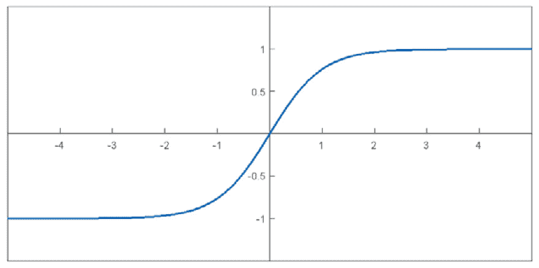

图 8.7 – tanh 函数

如您所见，Tanh 将激活函数的范围限制在(-1, +1)范围内。

通常情况下，当我们训练一个分类器，例如 MNIST 或 CIFAR-10 的情况，我们使用`categorical_crossentropy`作为损失函数，`accuracy`作为指标。然而，对于回归问题，我们需要使用`mse`作为损失函数，并且我们可以选择性地使用`cosine_proximity`作为指标。

余弦相似度是向量的相似性指标。所以，1 表示它们是相同的，0 表示它们是垂直的，-1 表示它们是相反的。损失和度量代码片段如下：

```py
model.compile(loss=mse, optimizer=Adam(), metrics=    ['cosine_proximity'])
```

其余的代码与分类器相同，只是我们不需要使用 one-hot 编码。

让我们看看训练的图表：

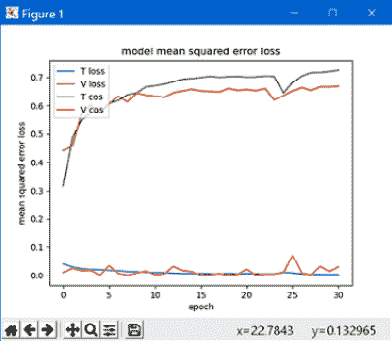

图 8.8 – 使用 DAVE-2 的行为克隆，训练

你可以看到轻微的过拟合。这是损失值：

```py
Min Loss: 0.0026791724107401277
Min Validation Loss: 0.0006011795485392213
Max Cosine Proximity: 0.72493887
Max Validation Cosine Proximity: 0.6687041521072388
```

在这种情况下，损失是训练中记录的转向角与网络计算的角度之间的均方误差。我们可以看到验证损失相当好。如果你有时间，你可以尝试对这个模型进行实验，添加 dropout 或甚至改变整个结构。

很快，我们将把我们的神经网络与 Carla 集成，看看它是如何驾驶的，但在那之前，质疑神经网络是否真的专注于道路的正确部分可能是合理的。下一节将展示我们如何使用称为**显著性图**的技术来做这件事。

## 可视化显著性图

要理解神经网络关注的是什么，我们应该使用一个实际例子，所以让我们选择一张图片：

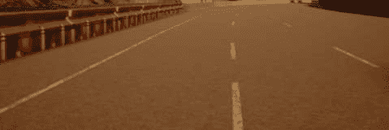

图 8.9 – 测试图像

如果我们作为人类必须在这条路上驾驶，我们会注意车道和墙壁，尽管诚然，墙壁的重要性不如之前的最后一个车道。

我们已经知道如何了解一个**CNN**（卷积神经网络的简称）如 DAVE-2 在考虑什么：因为卷积层的输出是一个图像，我们可以这样可视化：

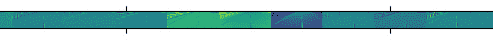

图 8.10 – 第一卷积层的部分激活

这是一个好的起点，但我们希望得到更多。我们希望了解哪些像素对预测贡献最大。为此，我们需要获取一个**显著性图**。

Keras 不支持它们，但我们可以使用`keras-vis`。你可以用`pip`安装它，如下所示：

```py
sudo pip install keras-vis
```

获取显著性图的第一步是创建一个从我们模型的输入开始但以我们想要分析的层结束的模型。生成的代码与我们所看到的激活非常相似，但为了方便，我们还需要层的索引：

```py
conv_layer, idx_layer = next((layer.output, idx) for idx, layer in   enumerate(model.layers) if layer.output.name.startswith(name))
act_model = models.Model(inputs=model.input, outputs=[conv_layer])
```

虽然在我们的情况下不是必需的，但你可能想将激活变为线性，然后重新加载模型：

```py
conv_layer.activation = activations.linear
sal_model = utils.apply_modifications(act_model)
```

现在，只需要调用`visualize_saliency()`：

```py
grads = visualize_saliency(sal_model, idx_layer,    filter_indices=None, seed_input=img)
plt.imshow(grads, alpha=.6)
```

我们对最后一层，即输出的显著性图感兴趣，但作为一个练习，我们将遍历所有卷积层，看看它们理解了什么。

让我们看看第一卷积层的显著性图：

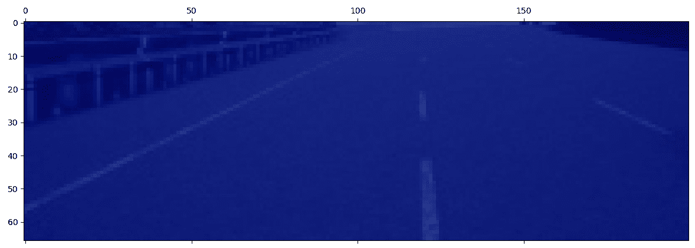

图 8.11 – 第一卷积层的显著性图

并不是很令人印象深刻，因为没有显著性，我们只能看到原始图像。

让我们看看第二层的地图：

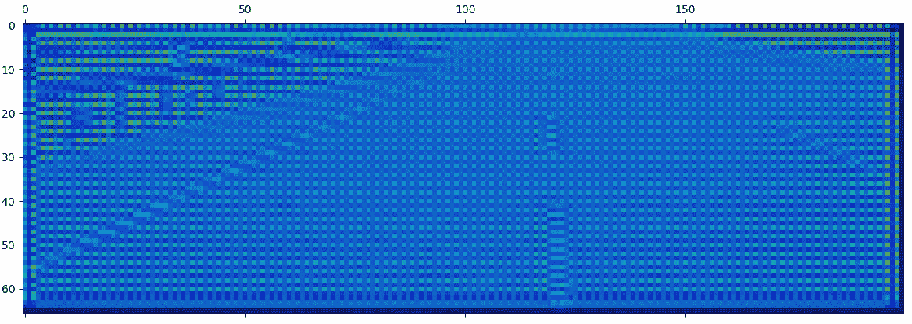

图 8.12 – 第二卷积层的显著性图

这是一种改进，但即使我们在中间线、墙上和右车道后的土地上看到了一些注意力，也不是很清晰。让我们看看第三层：

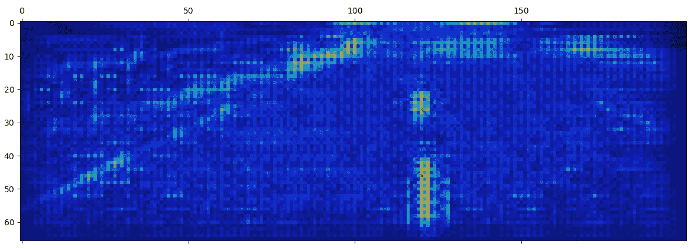

图 8.13 – 第三卷积层的显著性图

现在才是重点！我们可以看到对中央线和左线的极大关注，以及一些注意力集中在墙上和右线上。网络似乎在试图理解道路的尽头在哪里。让我们也看看第四层：

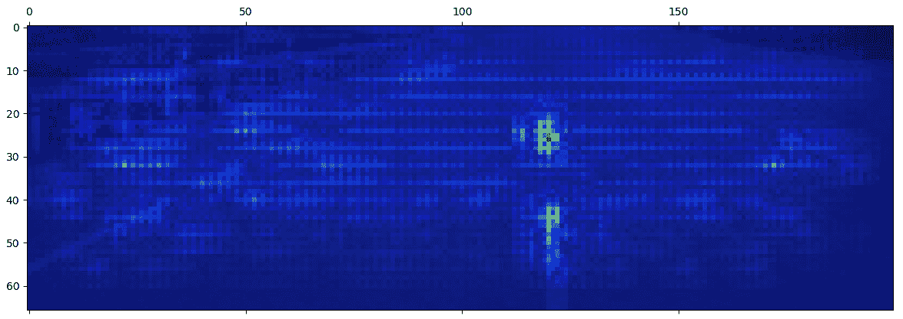

图 8.14 – 第四卷积层的显著性图

在这里，我们可以看到注意力主要集中在中央线上，但左线和墙上也有注意力的火花，以及在整个道路上的少许注意力。

我们还可以检查第五个也是最后一个卷积层：

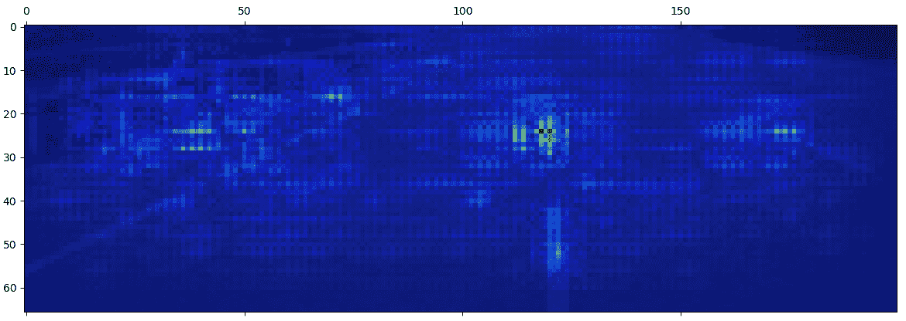

图 8.15 – 第五卷积层的显著性图

第五层与第四层相似，并且对左线和墙上的注意力有所增加。

我们还可以可视化密集层的显著性图。让我们看看最后一层的成果，这是我们认为是该图像真实显著性图的地方：

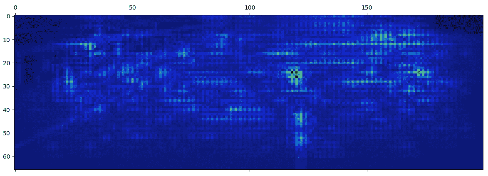

图 8.16 – 输出层的显著性图

最后一个显著性图，最重要的一个，对中央线和右线给予了极大的关注，加上对右上角的少许关注，这可能是一次尝试估计右车道的距离。我们还可以看到一些注意力在墙上和左车道上。所以，总的来说，这似乎很有希望。

让我们用另一张图片试试：

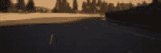

图 8.17 – 第二测试图像

这是一张很有趣的图片，因为它是从网络尚未训练的道路部分拍摄的，但它仍然表现得很出色。

让我们看看第三卷积层的显著性图：

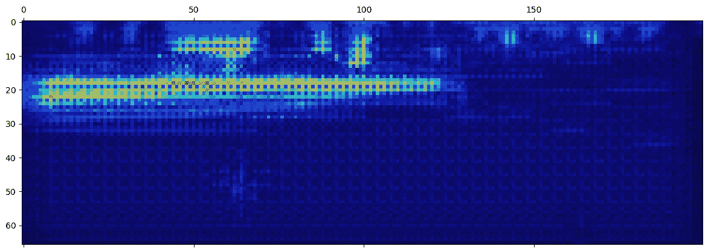

图 8.18 – 第三卷积层的显著性图

神经网络似乎非常关注道路的尽头，并且似乎还检测到了几棵树。如果它被训练用于制动，我敢打赌它会这么做！

让我们看看最终的地图：

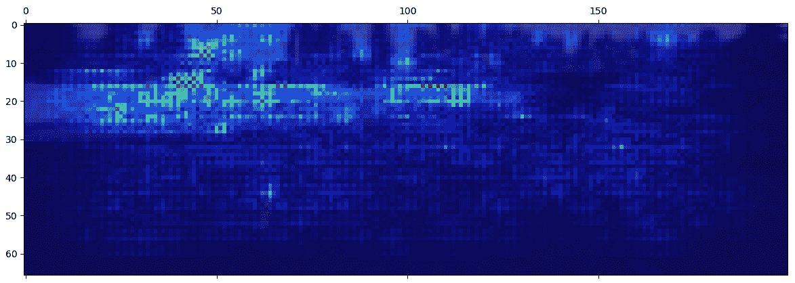

图 8.19 – 输出层的显著性图

这与之前的一个非常相似，但更加关注中央线和右侧线，以及一般道路上的一小部分。对我来说看起来不错。

让我们尝试使用最后一张图像，这张图像是从训练中取出的，用于教授何时向右转：

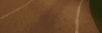

图 8.20 – 第三测试图像

这是它的最终显著性图：

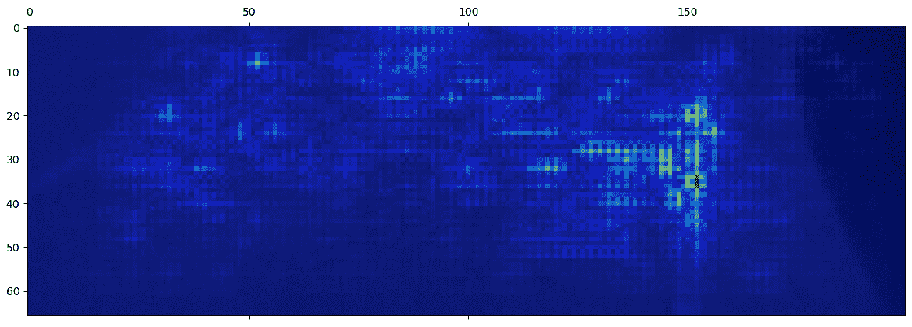

图 8.21 – 输出层的显著性图

你可以看到神经网络主要关注右侧线，同时关注整个道路，并对左侧线投入了一些注意力的火花。

如你所见，显著性图可以是一个有效的工具，帮助我们更好地理解网络的行为，并对其对世界的解释进行一种合理性检查。

现在是时候与 Carla 集成，看看我们在现实世界中的表现如何了。系好安全带，因为我们将要驾驶，我们的神经网络将坐在驾驶座上！

# 将神经网络与 Carla 集成

我们现在将我们的神经网络与 Carla 集成，以实现自动驾驶。

如前所述，我们首先复制`manual_control.py`文件，可以将其命名为`manual_control_drive.py`。为了简化，我将只编写你需要更改或添加的代码，但你可以在 GitHub 上找到完整的源代码。

请记住，这个文件应该在`PythonAPI/examples`目录下运行。

从原则上讲，让我们的神经网络控制方向盘相当简单，因为我们只需要分析当前帧并设置转向。然而，我们还需要施加一些油门，否则汽车不会移动！

同样重要的是，你需要在游戏循环中运行推理阶段，或者你确实确信它在客户端上运行，否则性能将大幅下降，你的网络将难以驾驶，因为接收帧和发送驾驶指令之间的延迟过多。

由于 Carla 客户端每次都会更换汽车，油门的效果也会改变，有时会使你的汽车速度过快或过慢。因此，你需要一种方法通过按键来改变油门，或者你可以始终使用同一辆汽车，这将是我们的解决方案。

你可以使用以下代码行获取 Carla 中可用的汽车列表：

```py
vehicles = world.get_blueprint_library().filter('vehicle.*')
```

在撰写本文时，这会产生以下列表：

```py
vehicle.citroen.c3
vehicle.chevrolet.impala
vehicle.audi.a2
vehicle.nissan.micra
vehicle.carlamotors.carlacola
vehicle.audi.tt
vehicle.bmw.grandtourer
vehicle.harley-davidson.low_rider
vehicle.bmw.isetta
vehicle.dodge_charger.police
vehicle.jeep.wrangler_rubicon
vehicle.mercedes-benz.coupe
vehicle.mini.cooperst
vehicle.nissan.patrol
vehicle.seat.leon
vehicle.toyota.prius
vehicle.yamaha.yzf
vehicle.kawasaki.ninja
vehicle.bh.crossbike
vehicle.tesla.model3
vehicle.gazelle.omafiets
vehicle.tesla.cybertruck
vehicle.diamondback.century
vehicle.audi.etron
vehicle.volkswagen.t2
vehicle.lincoln.mkz2017
vehicle.mustang.mustang
```

在`World.restart()`中，你可以选择你喜欢的汽车：

```py
bp=self.world.get_blueprint_library().filter(self._actor_filter)
blueprint = next(x for x in bp if x.id == 'vehicle.audi.tt')
```

Carla 使用演员，可以代表车辆、行人、传感器、交通灯、交通标志等；演员是通过名为`try_spawn_actor()`的模板创建的：

```py
self.player = self.world.try_spawn_actor(blueprint, spawn_point)
```

如果你现在运行代码，你会看到汽车，但视角是错误的。按下*Tab*键可以修复它：

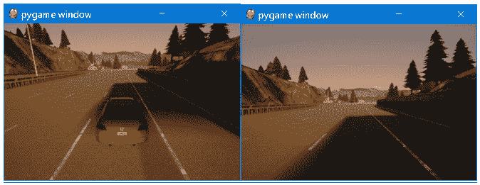

图 8.22 – 左：默认初始相机，右：自动驾驶相机

如果你想要从我在训练汽车的地方开始，你也需要在相同的方法中设置起始点：

```py
spawn_point = spawn_points[0] if spawn_points else carla.Transform()
```

如果你这样做，汽车将在随机位置生成，并且可能驾驶时会有更多问题。

在`game_loop()`中，我们还需要选择合适的赛道：

```py
client.load_world('Town04')
client.reload_world()
```

如果你现在运行它，在按下*Tab*之后，你应该看到以下类似的内容：

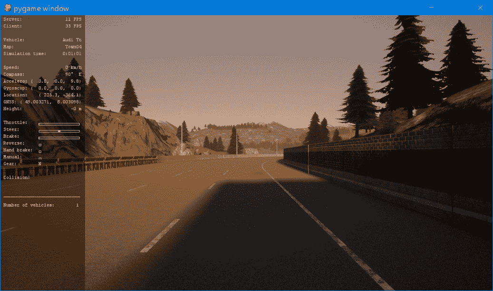

图 8.23 – Carla 的图像，准备自动驾驶

如果你按下*F1*，你可以移除左侧的信息。

为了方便起见，我们希望能够触发自动驾驶模式的开和关，因此我们需要一个变量来处理，如下所示，以及一个在`KeyboardControl`构造函数中保存计算出的转向角度的变量：

```py
self.self_driving = False
```

然后，在`KeyboardControl.parse_events()`中，我们将拦截*D*键，并切换自动驾驶功能的开和关：

```py
elif event.key == K_d:
  self.self_driving = not self.self_driving
  if self.self_driving:
    world.hud.notification('Self-driving with Neural Network')
  else:
    world.hud.notification('Self-driving OFF')
```

下一步是将从服务器接收到的最后一张图像进行缩放并保存，当它仍然是 BGR 格式时，在`CameraManager._parse_image()`中。这在这里展示：

```py
array_bgr = cv2.resize(array, (200, 133))
self.last_image = array_bgr[67:, :, :]
array = array[:, :, ::-1]  # BGR => RGB
```

`array`变量最初包含 BGR 格式的图像，而 NumPy 中的`::-1`反转了顺序，所以最后一行代码实际上在可视化之前将图像从 BGR 转换为 RGB。

现在，我们可以在`game_loop()`函数外部，主循环之外加载模型：

```py
model = keras.models.load_model('behave.h5')
```

然后，我们可以在`game_loop()`主循环内部运行模型，并保存转向，如下所示：

```py
if world.camera_manager.last_image is not None:
  image_array = np.asarray(world.camera_manager.last_image)
  controller.self_driving_steer = model.predict(image_array[    None, :, :, :], batch_size=1)[0][0].astype(float)
```

最后要做的事情就是使用我们计算出的转向，设置一个固定的油门，并限制最大速度，同时进行：

```py
if self.self_driving:
  self.player_max_speed = 0.3
  self.player_max_speed_fast = 0.3
  self._control.throttle = 0.3
  self._control.steer = self.self_driving_steer
  return
```

这听起来很好，但是它可能因为 GPU 错误而无法工作。让我们看看是什么问题以及如何克服它。

让你的 GPU 工作

你可能会得到类似于以下错误的错误：

```py
failed to create cublas handle: CUBLAS_STATUS_ALLOC_FAILED
```

我对发生的事情的理解是，与 Carla 的某些组件存在冲突，无论是服务器还是客户端，这导致 GPU 内存不足。特别是，TensorFlow 在尝试在 GPU 中分配所有内存时造成了问题。

幸运的是，这可以通过以下几行代码轻松修复：

```py
import tensorflow
gpus = tensorflow.config.experimental.list_physical_devices('GPU')
if gpus:
  try:
    for gpu in gpus:
      tensorflow.config.experimental.set_memory_growth(gpu, True)
    print('TensorFlow allowed growth to ', len(gpus), ' GPUs')
  except RuntimeError as e:
    print(e)
```

`set_memory_growth()`的调用指示 TensorFlow 只分配 GPU RAM 的一部分，并在需要时最终分配更多，从而解决问题。

到目前为止，你的汽车应该能够驾驶，让我们讨论一下它是如何工作的。

# 自动驾驶！

现在，你可以开始运行`manual_control_drive.py`，可能需要使用`--res 480x320`参数来降低分辨率。

如果你按下 *D* 键，汽车应该会开始自动行驶。它可能相当慢，但应该会运行，有时运行得很好，有时则不那么好。它可能不会总是按照它应该走的路线行驶。你可以尝试向数据集中添加图像或改进神经网络的架构——例如，通过添加一些 dropout 层。

你可以尝试更换汽车或提高速度。你可能会注意到，在更高的速度下，汽车开始更加无规律地移动，就像司机喝醉了一样！这是由于汽车进入错误位置和神经网络对其做出反应之间的过度延迟造成的。我认为这可以通过一个足够快的计算机来部分解决，以便处理许多 FPS。然而，我认为真正的解决方案还需要记录更高速度的运行，其中校正会更强烈；这需要一个比键盘更好的控制器，你还需要在输入中插入速度，或者拥有多个神经网络，并根据速度在它们之间切换。

有趣的是，有时即使我们使用外部摄像头，它也能以某种方式驾驶，结果是我们的汽车成为了图像的一部分！当然，结果并不好，即使速度很低，你也会得到 *醉酒驾驶* 的效果。

出于好奇，让我们检查一下显著性图。这是我们发送给网络的图像：

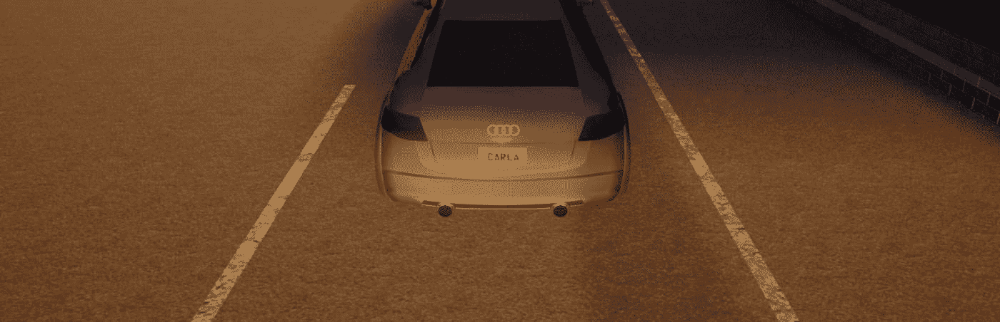

图 8.24 – 后视图

现在，我们可以检查显著性图：

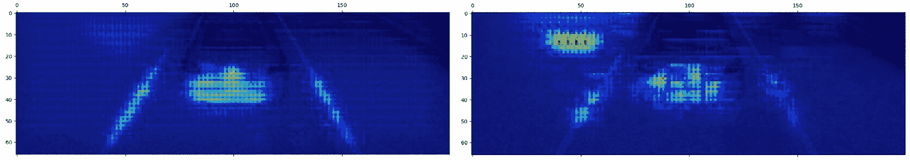

图 8.25 – 显著性图：第三卷积层和输出层

网络仍然能够识别线条和道路；然而，它非常关注汽车。我的假设是神经网络 *认为* 它是一个障碍物，道路在结束。

如果你想要教汽车如何使用这个摄像头或任何其他摄像头来驾驶，你需要用那个特定的摄像头来训练它。如果你想汽车在另一条赛道上正确驾驶，你需要在那条特定的赛道上训练它。最终，如果你在许多赛道和许多条件下训练它，它应该能够去任何地方驾驶。但这意味着构建一个包含数百万图像的巨大数据集。最终，如果你的数据集太大，你会耗尽内存。

在下一节中，我们将讨论生成器，这是一种可以帮助我们克服这些问题的技术。

## 使用生成器训练更大的数据集

当训练大数据集时，内存消耗可能成为一个问题。在 Keras 中，解决这个问题的方法之一是使用 Python 生成器。Python 生成器是一个可以懒加载地返回可能无限值流的函数，具有非常低的内存占用，因为你只需要一个对象的内存，当然，还需要所有可能需要的支持数据；生成器可以用作列表。典型的生成器有一个循环，并且对于需要成为流一部分的每个对象，它将使用`yield`关键字。

在 Keras 中，生成器需要知道批次大小，因为它需要返回一个样本批次和一个标签批次。

我们将保留一个要处理的文件列表，我们将编写一个生成器，可以使用这个列表返回与之关联的图像和标签。

我们将编写一个通用的生成器，希望你在其他情况下也能重用，它将接受四个参数：

+   一个 ID 列表，在我们的例子中是文件名

+   一个从 ID 检索输入（图像）的函数

+   一个从 ID 检索标签（方向盘）的函数

+   批次大小

首先，我们需要一个函数，可以返回给定文件的图像：

```py
def extract_image(file_name):
    return cv2.imread(file_name)
```

我们还需要一个函数，给定一个文件名，可以返回标签，在我们的例子中是转向角度：

```py
def extract_label(file_name):
  (seq, camera, steer, throttle, brake, img_type) =    expand_name(file_name)
  return steer
```

我们现在可以编写生成器，如下所示：

```py
def generator(ids, fn_image, fn_label, batch_size=32):
  num_samples = len(ids)
  while 1: # The generator never terminates
    samples_ids = shuffle(ids) # New epoch

    for offset in range(0, num_samples, batch_size):
      batch_samples_ids = samples_ids[offset:offset + batch_size]
      batch_samples = [fn_image(x) for x in batch_samples_ids]
      batch_labels = [fn_label(x) for x in batch_samples_ids]

      yield np.array(batch_samples), np.array(batch_labels)
```

`while`循环中的每次迭代对应一个周期，而`for`循环生成完成每个周期所需的全部批次；在每个周期的开始，我们随机打乱 ID 以改善训练。

在 Keras 中，过去你必须使用`fit_generator()`方法，但现在`fit()`能够理解如果参数是一个生成器，但你仍然需要提供一些新的参数：

+   `steps_per_epoch`：这表示单个训练周期中批次的数量，即训练样本数除以批次大小。

+   `validation_steps`：这表示单个验证周期中批次的数量，即验证样本数除以批次大小。

这是你需要使用我们刚刚定义的`generator()`函数的代码：

```py
files = shuffle(files)idx_split = int(len(files) * 0.8)
val_size = len(files) - idx_split
train_gen = generator(files[0:idx_split], extract_image,  extract_label, batch_size)
valid_gen = generator(files[idx_split:], extract_image,  extract_label, batch_size)
history_object = model.fit(train_gen, epochs=250,  steps_per_epoch=idx_split/batch_size, validation_data=valid_gen,  validation_steps=val_size/batch_size, shuffle=False, callbacks=  [checkpoint, early_stopping])
```

多亏了这段代码，你现在可以利用非常大的数据集了。然而，生成器还有一个应用：自定义按需数据增强。让我们简单谈谈这个话题。

## 硬件方式增强数据

我们已经看到了一种简单的方法来进行数据增强，使用*第七章*中的`ImageDataGenerator`，*检测行人和交通灯*。这可能适用于分类器，因为应用于图像的变换不会改变其分类。然而，在我们的情况下，这些变换中的一些会需要改变预测。实际上，英伟达设计了一种自定义数据增强，其中图像被随机移动，方向盘根据移动量相应更新。这可以通过生成器来完成，其中我们取原始图像，应用变换，并根据移动量调整方向盘。

但我们不仅限于复制输入中相同数量的图像，我们还可以创建更少（过滤）或更多；例如，镜像可以在运行时应用，结果是在内存中重复图像，而不必存储双倍数量的图像和保存，因此节省了文件访问和 JPEG 解压缩的一半；当然，我们还需要一些 CPU 来翻转图像。

# 摘要

在本章中，我们探讨了众多有趣的主题。

我们首先描述了 DAVE-2，这是英伟达的一个实验，旨在证明神经网络可以学会在道路上驾驶，我们决定在更小的规模上复制相同的实验。首先，我们从 Carla 收集图像，注意不仅要记录主摄像头，还要记录两个额外的侧摄像头，以教会网络如何纠正错误。

然后，我们创建了我们的神经网络，复制了 DAVE-2 的架构，并对其进行回归训练，这与其他我们迄今为止所做的训练相比需要一些改变。我们学习了如何生成显著性图，并更好地理解神经网络关注的地方。然后，我们与 Carla 集成，并使用该网络来自动驾驶汽车！

最后，我们学习了如何使用 Python 生成器训练神经网络，并讨论了如何利用这种方法实现更复杂的数据增强。

在下一章中，我们将探索一种用于在像素级别检测道路的尖端技术——语义分割。

# 问题

阅读本章后，你应该能够回答以下问题：

1.  英伟达为自动驾驶训练的神经网络的原始名称是什么？

1.  分类和回归任务之间的区别是什么？

1.  你可以使用哪个 Python 关键字来创建生成器？

1.  什么是显著性图？

1.  为什么我们需要记录三个视频流？

1.  为什么我们从`game_loop()`方法中进行推理？

# 进一步阅读

+   Nvidia DAVE-2: [`devblogs.nvidia.com/deep-learning-self-driving-cars/`](https://devblogs.nvidia.com/deep-learning-self-driving-cars/)

+   与 Carla 0.9.0 API 变更相关的笔记: [`carla.org/2018/07/30/release-0.9.0/`](https://carla.org/2018/07/30/release-0.9.0/)

+   Carla: [`carla.org`](https://carla.org)

+   `keras-vis`: [`github.com/raghakot/keras-vis`](https://github.com/raghakot/keras-vis)
