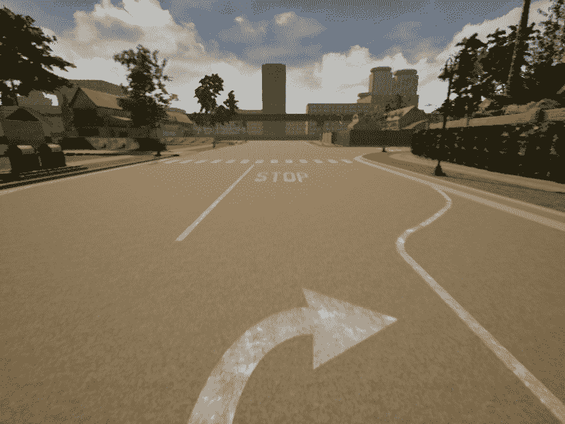

# *第九章*：语义分割

这可能是关于深度学习最先进的章节，因为我们将会深入到使用一种称为语义分割的技术，对图像进行像素级的分类。我们将充分利用到目前为止所学的内容，包括使用生成器进行数据增强。

我们将非常详细地研究一个非常灵活且高效的神经网络架构，称为 DenseNet，以及其用于语义分割的扩展，FC-DenseNet，然后我们将从头编写它，并使用由 Carla 构建的数据集进行训练。

希望您会发现这一章既鼓舞人心又具有挑战性。并且准备好进行长时间的训练，因为我们的任务可能相当有挑战性！

在本章中，我们将涵盖以下主题：

+   介绍语义分割

+   理解 DenseNet 用于分类

+   使用 CNN 进行语义分割

+   将 DenseNet 应用于语义分割

+   编写 FC-DenseNet 的模块

+   改进糟糕的语义分割

# 技术要求

要使用本章中解释的代码，您需要安装以下工具和模块：

+   Carla 模拟器

+   Python 3.7

+   NumPy 模块

+   TensorFlow 模块

+   Keras 模块

+   OpenCV-Python 模块

+   一个 GPU（推荐）

本章的代码可以在[`github.com/PacktPublishing/Hands-On-Computer-Vision-for-Self-Driving-Cars`](https://github.com/PacktPublishing/Hands-On-Computer-Vision-for-Self-Driving-Cars)找到。

本章的“代码实战”视频可以在以下位置找到：

[`bit.ly/3jquo3v`](https://bit.ly/3jquo3v)

# 介绍语义分割

在前面的章节中，我们实现了几个分类器，我们提供了一个图像作为输入，网络告诉我们它是什么。这在许多情况下可能是非常好的，但要非常有用，通常需要结合一种可以识别感兴趣区域的方法。我们在*第七章*，*检测行人和交通灯*中做到了这一点，我们使用了 SSD 来识别交通灯的感兴趣区域，然后我们的神经网络能够说出颜色。但即使这样，对我们来说也不会非常有用，因为 SSD 生成的感兴趣区域是矩形，因此一个告诉我们基本上和图像一样大的道路的网络不会提供太多信息：道路是直的？有转弯吗？我们无法知道。我们需要更高的精度。

如果对象检测器如 SSD 将分类提升到了下一个层次，现在我们需要达到那个层次之后，也许还有更多。实际上，我们想要对图像的每个像素进行分类，这被称为**语义**分割，这是一个相当有挑战性的任务。

为了更好地理解，让我们看看一个来自 Carla 的例子。以下是原始图像：



图 9.1 – Carla 的一帧

现在让我们看看语义分割相机产生的同一帧：


图 9.2 – 语义分割

这真是太好了！不仅图像非常简化，而且每种颜色都有特定的含义——道路是紫色，人行道是洋红色，树木是深绿色，车道线是亮绿色，等等。为了设定你的期望，我们可能无法达到如此完美的结果，我们也将以更低的分辨率工作，但我们仍然会取得有趣的结果。

为了更精确，这张图片并不是网络的真正输出，但它已经被转换为显示颜色；`rgb(7,0,0)`，其中 `7` 将被转换为紫色。

Carla 创建具有语义分割的图像的能力非常有帮助，可以让你随意实验，而无需依赖于预制的和有限的数据库。

在我们开始收集数据集之前，让我们更详细地讨论一下计划。

## 定义我们的目标

我们的目标是使用我们收集的数据集从头开始训练一个神经网络进行语义分割，以便它可以在像素级别检测道路、人行道、行人、交通标志等等。

需要的步骤如下：

1.  **创建数据集**：我们将使用 Carla 保存原始图像、原始分割图像（黑色图像，颜色较深）以及转换为便于我们使用的更好颜色的图像。

1.  **构建神经网络**：我们将深入研究一个称为 **DenseNet** 的架构，然后我们将看到执行语义分割的网络通常是如何构建的。在此之后，我们将查看用于语义分割的 DenseNet 的一个变体，称为 **FC-DenseNet**，然后我们将实现它。

1.  **训练神经网络**：在这里，我们将训练网络并评估结果；训练可能需要几个小时。

我们现在将看到收集数据集所需的更改。

## 收集数据集

我们已经看到了如何从 Carla 记录图像并修改 *第八章* 中的 `manual_control.py`，*行为克隆*，你也能做到这一点，但我们有一个问题：我们真的希望 RGB 和原始相机能够完全同步，以避免使我们的数据集变得不那么有效的运动。这个问题可以通过同步模式来解决，其中 Carla 等待所有传感器都准备好后再将它们发送到客户端，这确保了我们将要保存的三台相机之间完美的对应关系：RGB、原始分割和彩色分割。

这次，我们将修改另一个文件，`synchronous_mode.py`，因为它更适合这项任务。

我将指定每个代码块在文件中的位置，但建议你前往 GitHub 并查看那里的完整代码。

这个文件比 `manual_control.py` 简单得多，基本上有两个有趣的方面：

+   `CarlaSyncMode`，一个使能同步模式的类

+   `main()`，它初始化世界（代表轨道、天气和车辆的物体）和相机，然后移动汽车，在屏幕上绘制它

如果你运行它，你会看到这个文件可以自动驾驶汽车，可能速度非常快，合并 RGB 相机和语义分割：


图 9.3 – `synchronous_mode.py`的输出

不要对自动驾驶算法过于印象深刻，因为虽然对我们来说非常方便，但它也非常有限。

卡拉拉（Carla）有大量的**路标**，这些是 3D 指向的点。这些点在每个轨道上数以千计，沿着道路排列，并来自 OpenDRIVE 地图；OpenDRIVE 是一个开放文件格式，卡拉拉（Carla）使用它来描述道路。这些点与道路方向一致，因此如果你在移动汽车的同时也应用这些点的方向，汽车实际上就像自动驾驶一样移动。太棒了！直到你添加汽车和行人；然后你开始得到这样的帧，因为汽车会移动到其他车辆中：


图 9.4 – 发生碰撞的帧

当你看到这个时可能会有些惊讶，但对我们来说这仍然很好，所以这不是一个大问题。

让我们看看现在我们需要如何修改`synchronous_mode.py`。

## 修改`synchronous_mode.py`

所有后续的更改都需要在`main()`函数中进行：

+   我们将改变相机位置，使其与我们在行为克隆中使用的相同，尽管这不是必需的。这涉及到将两个`carla.Transform()`调用改为这一行（对两个位置都是相同的行）：

    ```py
    carla.Transform(carla.Location(x=1.6, z=1.7), 	  carla.Rotation(pitch=-15))
    ```

+   在移动汽车后，我们可以保存 RGB 相机和原始语义分割图像：

    ```py
    save_img(image_rgb, '_out/rgb/rgb_%08d.png' % 	  image_rgb.frame)
    save_img(image_semseg, '_out/seg_raw/seg_raw_%08d.png' % 	  image_rgb.frame)
    ```

+   在代码中，调用`image_semseg.convert()`的下一行将原始图像转换为彩色版本，根据 CityScapes 调色板；现在我们可以保存带有语义分割的图像，使其正确着色：

    ```py
    save_img(image_semseg, '_out/seg/seg_%08d.png' % 	  image_rgb.frame)
    ```

+   我们几乎完成了。我们只需要编写`save_img()`函数：

    ```py
    def save_img(image, path):
        array = np.frombuffer(image.raw_data, dtype=np.dtype("uint8"))
        array = np.reshape(array, (image.height, image.width, 4))
        array = array[:, :, :3]
        img = cv2.resize(array, (160, 160), 	 interpolation=cv2.INTER_NEAREST)
        cv2.imwrite(path, img)
    ```

代码的前几行将卡拉拉（Carla）的图像从缓冲区转换为 NumPy 数组，并选择前三个通道，丢弃第四个通道（透明度通道）。然后我们使用`INTER_NEAREST`算法将图像调整大小为 160 X 160，以避免在调整大小时平滑图像。

最后一行保存了图像。

小贴士：使用最近邻算法调整分割掩码的大小

你是否好奇为什么我们使用`INTER_NEAREST`，即最近邻算法进行缩放，这是最基础的插值方法？原因在于它不是进行颜色插值，而是选择接近插值位置的像素颜色，这对于原始语义分割非常重要。例如，假设我们将四个像素缩小到一点。其中两个像素的值为 7（道路），另外两个像素的值为 9（植被）。我们可能对输出为 7 或 9 都感到满意，但肯定不希望它为 8（人行道）！

但对于 RGB 和彩色分割，你可以使用更高级的插值。

这就是收集图像所需的一切。160 X 160 的分辨率是我为我的网络选择的，我们稍后会讨论这个选择。如果你使用另一个分辨率，请相应地调整设置。

你也可以以全分辨率保存，但这样你就必须编写一个程序在之后更改它，或者在你训练神经网络时进行此操作，由于我们将使用生成器，这意味着我们需要为每张图像和每个 epoch 使用这个约定——在我们的案例中超过 50,000 次——此外，它还会使加载 JPEG 变慢，在我们的案例中这也需要执行 50,000 次。

现在我们有了数据集，我们可以构建神经网络。让我们从 DenseNet 的架构开始，这是我们模型的基础。

# 理解 DenseNet 在分类中的应用

**DenseNet**是一个令人着迷的神经网络架构，旨在具有灵活性、内存效率、有效性和相对简单性。关于 DenseNet 有很多值得喜欢的地方。

DenseNet 架构旨在构建非常深的网络，通过从 ResNet 中提取的技术解决了**梯度消失**的问题。我们的实现将达到 50 层，但你很容易构建一个更深层的网络。实际上，Keras 有三种在 ImageNet 上训练的 DenseNet，分别有 121、169 和 201 层。DenseNet 还解决了**神经元死亡**的问题，即当你有基本不活跃的神经元时。下一节将展示 DenseNet 的高级概述。

## 从鸟瞰角度看 DenseNet

目前，我们将关注 DenseNet 作为一个分类器，这并不是我们即将实现的内容，但作为一个概念来开始理解它是很有用的。DenseNet 的高级架构在以下图中展示：


图 9.5 – DenseNet 作为分类器的高级视图，包含三个密集块

图中只显示了三个密集块，但实际上通常会有更多。

如从图中所示，理解以下内容相当简单：

+   输入是一个 RGB 图像。

+   存在一个初始的 7 X 7 卷积。

+   存在一个**密集块**，其中包含一些卷积操作。我们很快会对此进行深入描述。

+   每个密集块后面都跟着一个 1 X 1 卷积和一个平均池化，这会减小图像的大小。

+   最后一个密集块直接跟着平均池化。

+   最后，有一个密集（全连接）层，带有 **softmax**。

1 X 1 卷积可以用来减少通道数以加快计算速度。DenseNet 论文中将 1 X 1 卷积后面跟着平均池化称为 **过渡层**，当通道数减少时，他们称得到的网络为 **DenseNet-C**，其中 *C* 代表 *压缩*，卷积层被称为 **压缩层**。

作为分类器，这个高级架构并不特别引人注目，但正如你可能猜到的，创新在于密集块，这是下一节的重点。

## 理解密集块

密集块是该架构的名称，也是 DenseNet 的主要部分；它们包含卷积，通常根据分辨率、你想要达到的精度以及性能和训练时间，你会有几个这样的块。请注意，它们与我们之前遇到的密集层无关。

密集块是我们可以通过重复来增加网络深度的块，它们实现了以下目标：

+   它们解决了 *梯度消失* 问题，使我们能够构建非常深的网络。

+   他们非常高效，使用相对较少的参数。

+   它们解决了 *无效神经元* 问题，意味着所有的卷积都对最终结果有贡献，我们不会浪费 CPU 和内存在基本无用的神经元上。

这些是宏伟的目标，许多架构都难以实现这些目标。那么，让我们看看 DenseNet 如何做到其他许多架构无法做到的事情。以下是一个密集块：


图 9.6 – 带有五个卷积的密集块，以及输入

这确实很了不起，需要一些解释。也许你还记得来自 *第七章*，*检测行人和交通信号灯* 的 **ResNet**，这是一个由微软构建的神经网络，它有一个名为 *跳过连接* 的特性，这些快捷方式允许一层跳过其他层，有助于解决梯度消失问题，从而实现更深的网络。实际上，ResNet 的一些版本可以有超过 1,000 层！

DenseNet 将这一概念推向了极致，因为在每个密集块内部，每个卷积层都与其他卷积层连接并连接起来！这有两个非常重要的含义：

+   跳过连接的存在显然实现了 ResNet 中跳过连接的相同效果，使得训练更深的网络变得容易得多。

+   多亏了跳跃连接，每一层的特征可以被后续层复用，这使得网络非常高效，并且与其它架构相比，大大减少了参数数量。

该功能的复用效果可以通过以下图表更好地理解，该图表解释了密集块的效果，重点关注通道而不是跳跃连接：


图 9.7 – 跳跃连接对具有五个层和增长率为三的密集块的影响

第一条水平线显示了每个卷积添加的新特征，而所有其他水平线都是前一层提供的卷积，并且由于跳跃连接而得以复用。

通过分析图表，其中每一层的内容是一列，我们可以看到以下内容：

+   输入层有 5 个通道。

+   第 1 层增加了 3 个新通道，并复用了输入，因此它实际上有 8 个通道。

+   第 2 层增加了 3 个新通道，并复用了输入和第 1 层，因此它实际上有 11 个通道。

+   这种情况一直持续到第 5 层，它增加了 3 个新通道，并复用了输入以及第 1、2、3 和 4 层，因此它实际上有 20 个通道。

这非常强大，因为卷积可以复用之前的层，只添加一些新通道，结果使得网络紧凑且高效。此外，这些新通道将提供新的信息，因为它们可以直接访问之前的层，这意味着它们不会以某种方式复制相同的信息或失去与之前几层已计算内容的联系。每一层添加的新通道数量被称为**增长率**；在我们的例子中它是**3**，而在现实生活中它可能为 12、16 或更多。

为了使密集块正常工作，所有卷积都需要使用**same**值进行填充，正如我们所知，这保持了分辨率不变。

每个密集块后面都跟着一个具有平均池化的过渡层，这降低了分辨率；由于跳跃连接需要卷积的分辨率相同，这意味着我们只能在同一密集块内部有跳跃连接。

密集块的每一层由以下三个组件组成：

+   一个批量归一化层

+   一个 ReLU 激活

+   卷积

因此，卷积块可以写成如下形式：

```py
layer = BatchNormalization()(layer)
layer = ReLU()(layer)
layer = Conv2D(num_filters, kernel_size, padding="same",   kernel_initializer='he_uniform')(layer)
```

这是一种不同的 Keras 代码编写风格，在这种风格中，不是使用模型对象来描述架构，而是构建一系列层；这是使用跳跃连接时应该使用的风格，因为你需要灵活性，能够多次使用相同的层。

在 DenseNet 中，每个密集块的开始处，你可以添加一个可选的 1 X 1 卷积，目的是减少输入通道的数量，从而提高性能；当存在这个 1 X 1 卷积时，我们称之为**瓶颈层**（因为通道数量减少了），而网络被称为**DenseNet-B**。当网络同时具有瓶颈层和压缩层时，它被称为**DenseNet-BC**。正如我们所知，ReLU 激活函数会添加非线性，因此有很多层可以导致网络学习非常复杂的函数，这对于语义分割肯定是非常需要的。

如果你对 dropout 有所疑问，DenseNet 可以在没有 dropout 的情况下很好地工作；其中一个原因是存在归一化层，它们已经提供了正则化效果，因此与 dropout 的组合并不特别有效。此外，dropout 的存在通常要求我们增加网络的大小，这与 DenseNet 的目标相悖。尽管如此，原始论文提到在卷积层之后使用 dropout，当没有数据增强时，我认为通过扩展，如果样本不多，dropout 可以帮助。

现在我们已经了解了 DenseNet 的工作原理，让我们学习如何构建用于语义分割的神经网络，这将为后续关于如何将 DenseNet 应用于语义分割任务的章节铺平道路。

# 使用 CNN 进行图像分割

典型的语义分割任务接收一个 RGB 图像作为输入，并需要输出一个包含原始分割的图像，但这种方法可能存在问题。我们已经知道，分类器使用`one-hot encoded`标签生成结果，我们也可以为语义分割做同样的事情：而不是生成一个包含原始分割的单个图像，网络可以创建一系列`one-hot encoded`图像。在我们的案例中，由于我们需要 13 个类别，网络将输出 13 个 RGB 图像，每个标签一个，具有以下特征：

+   一张图像只描述一个标签。

+   属于该标签的像素在红色通道中的值为`1`，而所有其他像素都被标记为`0`。

每个给定的像素在一个图像中只能为`1`，在所有其他图像中都将为`0`。这是一个困难的任务，但并不一定需要特定的架构：一系列带有`same`填充的卷积层可以完成这项任务；然而，它们的成本很快就会变得计算昂贵，并且你可能还会遇到在内存中拟合模型的问题。因此，人们一直在努力改进这种架构。

如我们所知，解决此类问题的典型方法是通过一种形式的池化来降低分辨率，同时增加层和通道。这对于分类是有效的，但我们需要生成与输入相同分辨率的图像，因此我们需要一种方法来*回退*到该分辨率。实现这一目标的一种方法是通过使用**转置卷积**，也称为**反卷积**，这是一种与卷积相反方向的转换，能够增加输出分辨率。

如果你添加一系列卷积和一系列反卷积，得到的网络是 U 形的，左侧从输入开始，添加卷积和通道同时降低分辨率，右侧有一系列反卷积将分辨率恢复到原始值。这比仅使用相同大小的卷积更有效率，但生成的分割实际上分辨率会比原始输入低得多。为了解决这个问题，可以从左侧引入跳过连接到右侧，以便网络有足够的信息来恢复正确的分辨率，不仅在形式上（像素数），而且在实际层面（掩码级别）。

现在我们可以看看如何将这些想法应用到 DenseNet 中。

# 将 DenseNet 应用于语义分割

DenseNet 由于其效率、准确性和丰富的跳层而非常适合语义分割。事实上，即使在数据集有限且标签表示不足的情况下，使用 DenseNet 进行语义分割也已被证明是有效的。

要使用 DenseNet 进行语义分割，我们需要能够构建*U*网络的右侧，这意味着我们需要以下内容：

+   一种提高分辨率的方法；如果我们称 DenseNet 的过渡层为*transition down*，那么我们需要*transition-up*层。

+   我们需要构建跳层来连接*U*网络的左右两侧。

我们的参考网络是 FC-DenseNet，也称为一百层提拉米苏，但我们并不试图达到 100 层。

在实践中，我们希望实现一个类似于以下架构的架构：


图 9.8 – FC-DenseNet 架构示例

在*图 9.8*中连接拼接层的水平红色箭头是用于提高输出分辨率的跳连接，并且它们只能在工作时，左侧相应的密集块的输出与右侧相应的密集块的输入具有相同的分辨率；这是通过使用过渡-up 层实现的。

现在我们来看如何实现 FC-DenseNet。

# 编码 FC-DenseNet 的模块

DenseNet 非常灵活，因此您可以轻松地以多种方式配置它。然而，根据您计算机的硬件，您可能会遇到 GPU 的限制。以下是我计算机上使用的值，但请随意更改它们以实现更好的精度或减少内存消耗或训练网络所需的时间：

+   **输入和输出分辨率**: 160 X 160

+   **增长率（每个密集块中每个卷积层添加的通道数）**: 12

+   **密集块数量**: 11: 5 个向下，1 个用于在向下和向上之间过渡，5 个向上

+   **每个密集块中的卷积块数量**: 4

+   **批量大小**: 4

+   **密集块中的瓶颈层**: 否

+   **压缩因子**: 0.6

+   **Dropout**: 是的，0.2

    我们将定义一些函数，您可以使用它们来构建 FC-DenseNet，并且，像往常一样，我们邀请您查看 GitHub 上的完整代码。

    第一个函数只是定义了一个带有批量归一化的卷积：

    ```py
    def dn_conv(layer, num_filters, kernel_size, dropout=0.0):
        layer = BatchNormalization()(layer)
        layer = ReLU()(layer)
        layer = Conv2D(num_filters, kernel_size, padding="same", kernel_initializer='he_uniform')(layer)
         if dropout > 0.0:
            layer = Dropout(dropout)(layer)
         return layer
    ```

    没有什么特别的——我们在 ReLU 激活之前有一个批量归一化，然后是一个卷积层和可选的 Dropout。

    下一个函数使用先前的方法定义了一个密集块：

    ```py
    def dn_dense(layer, growth_rate, num_layers, add_bottleneck_layer, dropout=0.0):
      block_layers = []
      for i in range(num_layers):
        new_layer = dn_conv(layer, 4 * growth_rate, (1, 1),       dropout) if add_bottleneck_layer else layer
        new_layer = dn_conv(new_layer, growth_rate, (3, 3), dropout)
        block_layers.append(new_layer)
        layer = Concatenate()([layer, new_layer])
      return layer, Concatenate()(block_layers)
    ```

    发生了很多事情：

`num_layers` 3 X 3 卷积层，每次添加`growth_rate`通道。此外，如果`add_bottleneck_layer`被设置，则在每个 3 X 3 卷积之前，它添加一个 1 X 1 卷积来将输入的通道数转换为`4* growth_rate`；在我的配置中我没有使用瓶颈层，但您可以使用。

它返回两个输出，其中第一个输出，layer，是每个卷积的所有输出的连接，包括输入，第二个输出，来自`block_layers`，是每个卷积的所有输出的连接，不包括输入。

我们需要两个输出的原因是因为下采样路径和上采样路径略有不同。在下采样过程中，我们包括块的输入，而在上采样过程中则不包括；这只是为了保持网络的大小和计算时间合理，因为，在我的情况下，如果没有这个变化，网络将从 724 K 参数跳变到 12 M！

下一个函数定义了用于在下采样路径中降低分辨率的过渡层：

```py
def dn_transition_down(layer, compression_factor=1.0, dropout=0.0):
  num_filters_compressed = int(layer.shape[-1] *     compression_factor)
  layer = dn_conv(layer, num_filters_compressed, (1, 1), dropout)

  return AveragePooling2D(2, 2, padding='same')(layer)
```

它只是创建了一个 1 X 1 的卷积，然后是一个平均池化；如果您选择添加压缩因子，则通道数将减少；我选择了压缩因子`0.6`，因为没有压缩的网络太大，无法适应我的 GPU 的 RAM。

下一个方法是用于在上采样路径中增加分辨率的过渡层：

```py
def dn_transition_up(skip_connection, layer):  num_filters = int(layer.shape[-1])  layer = Conv2DTranspose(num_filters, kernel_size=3, strides=2,    padding='same',                            kernel_initializer='he_uniform')(layer)  return Concatenate()([layer, skip_connection])
```

它创建了一个反卷积来增加分辨率，并添加了跳过连接，这对于使我们能够增加分割掩码的有效分辨率当然很重要。

现在我们已经拥有了所有构建块，剩下的只是组装完整的网络。

## 将所有部件组合在一起

首先，关于分辨率的说明：我选择了 160 X 160，因为这基本上是我笔记本电脑能做的最大分辨率，结合其他设置。你可以尝试不同的分辨率，但你将看到并非所有分辨率都是可能的。实际上，根据密集块的数量，你可能需要使用 16、32 或 64 的倍数。为什么是这样？简单来说，让我们举一个例子，假设我们将使用 160 X 160。如果在下采样过程中，你将分辨率降低 16 倍（例如，你有 4 个密集块，每个块后面都有一个*向下转换*层），那么你的中间分辨率将是一个整数——在这种情况下，10 X 10。

当你上采样 4 次时，你的分辨率将增长 16 倍，所以你的最终分辨率仍然是 160 X 160。但如果你从 170 X 170 开始，你最终仍然会得到一个中间分辨率为 10 X 10 的分辨率，上采样它将产生一个最终分辨率为 160 X 160 的分辨率！这是一个问题，因为你需要将这些输出与下采样期间取出的跳跃层连接起来，如果两个分辨率不同，那么我们无法连接层，Keras 将生成一个错误。至于比例，它不需要是平方的，也不需要匹配你图像的比例。

下一步，我们需要做的是创建神经网络的输入和第一个卷积层的输入，因为密集块假设它们之前有一个卷积：

```py
input = Input(input_shape)layer = Conv2D(36, 7, padding='same')(input)
```

我使用了一个没有最大池化的 7 X 7 卷积，但请随意实验。你可以使用更大的图像并引入最大池化或平均池化，或者如果你能训练它，也可以创建一个更大的网络。

现在我们可以生成下采样路径：

```py
skip_connections = []for idx in range(groups):  (layer, _) = dn_dense(layer, growth_rate, 4,     add_bottleneck_layer, dropout)  skip_connections.append(layer)  layer = dn_transition_down(layer, transition_compression_factor,      dropout)
```

我们简单地创建我们想要的全部组，在我的配置中是五个，对于每个组我们添加一个密集层和一个向下转换层，并且我们还记录跳跃连接。

以下步骤构建上采样路径：

```py
skip_connections.reverse()
(layer, block_layers) = dn_dense(layer, growth_rate, 4,   add_bottleneck_layer, dropout)

for idx in range(groups):
  layer = dn_transition_up(skip_connections[idx], block_layers)
  (layer, block_layers) = dn_dense(layer, growth_rate, 4,     add_bottleneck_layer, dropout)
```

我们反转了跳跃连接，因为在向上传递时，我们会以相反的顺序遇到跳跃连接，并且我们添加了一个没有跟随向下转换的密集层。这被称为*瓶颈层*，因为它包含的信息量很少。然后我们简单地创建与下采样路径对应的向上转换和密集层。

现在我们有了最后一部分，让我们生成输出：

```py
layer = Conv2D(num_classes, kernel_size=1, padding='same',   kernel_initializer='he_uniform')(layer)output = Activation('softmax')(layer)model = Model(input, output)
```

我们简单地添加一个 1 X 1 卷积和一个 softmax 激活。

困难的部分已经完成，但我们需要学习如何将输入馈送到网络中。

## 向网络输入数据

向神经网络输入数据并不太难，但有一些实际上的复杂性，因为网络要求很高，将所有图像加载到 RAM 中可能不可行，所以我们将使用一个生成器。然而，这次，我们还将添加一个简单的数据增强——我们将镜像一半的图像。

但首先，我们将定义一个层次结构，其中所有图像都位于`dataset`文件夹的子目录中：

+   `rgb`包含图像。

+   `seg`包含分割并着色的图像。

+   `seg_raw`包含原始格式的图像（红色通道中的数值标签）。

这意味着当给定一个`rgb`文件夹中的图像时，我们只需更改路径到`seg_raw`即可获取相应的原始分割。这很有用。

我们将定义一个通用的生成器，可用于数据增强；我们的方法如下：

+   生成器将接收一个 ID 列表——在我们的案例中，是`rgb`图像的路径。

+   生成器还将接收两个函数——一个函数给定一个 ID 可以生成一个图像，另一个函数给定一个 ID 可以生成相应的标签（更改路径到`seg_raw`）。

+   我们将在每个 epoch 中提供索引以帮助数据增强。

这是通用的生成器：

```py
def generator(ids, fn_image, fn_label, augment, batch_size):
    num_samples = len(ids)
    while 1:  # Loop forever so the generator never terminates
        samples_ids = shuffle(ids)  # New epoch

        for offset in range(0, num_samples, batch_size):
            batch_samples_ids = samples_ids[offset:offset + batch_size]
            batch_samples = np.array([fn_image(x, augment, offset + idx) for idx, x in enumerate(batch_samples_ids)])
            batch_labels = np.array([fn_label(x, augment, offset + idx) for idx, x in enumerate(batch_samples_ids)])

            yield batch_samples, batch_labels
```

这与我们在*第八章*中已经看到的类似，*行为克隆*。它遍历所有 ID 并获取批次的图像和标签；主要区别是我们向函数传递了两个额外的参数，除了当前 ID 之外：

+   一个标志，指定我们是否想要启用数据增强

+   当前 epoch 中的索引以告诉函数我们的位置

现在将相对容易编写一个返回图像的函数：

```py
def extract_image(file_name, augment, idx):
  img = cv2.resize(cv2.imread(file_name), size_cv,     interpolation=cv2.INTER_NEAREST)

  if augment and (idx % 2 == 0):
    img = cv2.flip(img, 1)

  return img
```

我们使用最近邻算法加载图像并调整大小，正如已经讨论过的。这样，一半的时间图像将被翻转。

这是提取标签的函数：

```py
def extract_label(file_name, augment, idx):
  img = cv2.resize(cv2.imread(file_name.replace("rgb", "seg_raw",        2)), size_cv, interpolation=cv2.INTER_NEAREST)

  if augment and (idx % 2 == 0):
    img = cv2.flip(img, 1)

  return convert_to_segmentation_label(img, num_classes)
```

如预期，要获取标签，我们需要将路径从`rgb`更改为`seg_raw`，而在分类器中对数据进行增强时，标签不会改变。在这种情况下，掩码需要以相同的方式进行增强，因此当我们镜像`rgb`图像时，我们仍然需要镜像它。

更具挑战性的是生成正确的标签，因为原始格式不适合。通常，在一个分类器中，你提供一个 one-hot 编码的标签，这意味着如果你有十个可能的标签值，每个标签都会转换为一个包含十个元素的向量，其中只有一个元素是`1`，其余都是`0`。在这里，我们需要做同样的事情，但针对整个图像和像素级别：

+   我们的标签不是一个单独的图像，而是 13 个图像（因为我们有 13 个可能的标签值）。

+   每个图像都对应一个单独的标签。

+   图像的像素只有在分割掩码中存在该标签时才为`1`，其他地方为`0`。

+   在实践中，我们在像素级别应用 one-hot 编码。

这是生成的代码：

```py
def convert_to_segmentation_label(image, num_classes):
  img_label = np.ndarray((image.shape[0], image.shape[1],     num_classes), dtype=np.uint8)

  one_hot_encoding = []

  for i in range(num_classes):
    one_hot_encoding.append(to_categorical(i, num_classes))

  for i in range(image.shape[0]):
    for j in range(image.shape[1]):
      img_label[i, j] = one_hot_encoding[image[i, j, 2]]

  return img_label
```

在方法的开始阶段，我们创建了一个包含 13 个通道的图像，然后我们预先计算了一个包含 13 个值的 one-hot 编码（用于加速计算）。然后我们简单地根据红色通道的值将 one-hot 编码应用于每个像素，红色通道是卡拉拉存储原始分割值的地方。

现在你可以开始训练了。你可能考虑让它过夜运行，因为它可能需要一段时间，特别是如果你使用 dropout 或者决定记录额外的图像。

这是训练的图表：


图 9.9 – 训练 FC-DenseNet

这并不理想，因为验证损失有很多峰值，这表明训练不稳定，有时损失增加得相当多。理想情况下，我们希望有一个平滑的下降曲线，这意味着损失在每次迭代时都会减少。可能需要更大的批量大小。

但整体表现还不错：

```py
Min Loss: 0.19355240797595402
Min Validation Loss: 0.14731630682945251
Max Accuracy: 0.9389197
Max Validation Accuracy: 0.9090136885643005
```

验证准确率超过 90%，这是一个好兆头。

现在我们来看看它在测试数据集上的表现。

## 运行神经网络

在网络上运行推理与常规过程没有不同，但我们需要将输出转换为我们可以理解和使用的有色图像。

要做到这一点，我们需要定义一个 13 种颜色的调色板，我们将使用它来显示标签：

```py
palette = [] # in rgb

palette.append([0, 0, 0])  # 0: None
palette.append([70, 70, 70])  # 1: Buildings
palette.append([190, 153, 153])  # 2: Fences
palette.append([192, 192, 192])  # 3: Other  (?)
palette.append([220, 20, 60])  # 4: Pedestrians
palette.append([153,153, 153])  # 5: Poles
palette.append([0, 255, 0])  # 6: RoadLines  ?
palette.append([128, 64, 128])  # 7: Roads
palette.append([244, 35,232])  # 8: Sidewalks
palette.append([107, 142, 35])  # 9: Vegetation
palette.append([0, 0, 142])  # 10: Vehicles
palette.append([102,102,156])  # 11: Walls
palette.append([220, 220, 0])  # 11: Traffic signs
```

现在我们只需要使用这些颜色导出两张图像——原始分割和彩色分割。以下函数执行这两个操作：

```py
def convert_from_segmentation_label(label):
    raw = np.zeros((label.shape[0], label.shape[1], 3), dtype=np.uint8)
    color = np.zeros((label.shape[0], label.shape[1], 3), dtype=np.uint8)

    for i in range(label.shape[0]):
        for j in range(label.shape[1]):
            color_label = int(np.argmax(label[i,j]))
            raw[i, j][2] = color_label
            # palette from rgb to bgr
            color[i, j][0] = palette[color_label][2]
            color[i, j][1] = palette[color_label][1]
            color[i, j][2] = palette[color_label][0]

    return (raw, color)
```

你可能记得我们的输出是一个 13 通道的图像，每个标签一个通道。所以你可以看到我们使用`argmax`从这些通道中获取标签；这个标签直接用于原始图像，其中它存储在红色通道中，而对于彩色分割图像，我们使用调色板中的颜色，使用`label`作为索引，交换蓝色和红色通道，因为 OpenCV 是 BGR 格式。

让我们看看它的表现如何，记住这些图像与网络在训练期间看到的图像非常相似。

下面是一张图像的结果，以及其他分割图像的版本：


图 9.10 – 从左到右：RGB 图像、Carla 的真实情况、彩色分割掩码和叠加分割

如您从图像中看到的，它并不完美，但做得很好：道路被正确检测到，护栏和树木也相当不错，行人也被检测到，但不是很好。当然我们可以改进这一点。

让我们看看另一张有问题的图像：


图 9.11 – 从左到右：RGB 图像、Carla 的真实情况、彩色分割掩码和叠加分割

上一张图像相当具有挑战性，因为道路昏暗，汽车也是暗的，但网络在检测道路和汽车方面做得相当不错（尽管形状不是很好）。它没有检测到车道线，但实际上在道路上并不明显，所以这里的真实情况过于乐观。

让我们再看另一个例子：


图 9.12 – 从左至右：RGB 图像、Carla 的地面真实情况、彩色分割掩码和叠加分割

在这里，结果也不算差：道路和树木都被很好地检测到，交通标志也被相当好地检测到，但它没有看到车道线，这是一个具有挑战性但可见的线条。

为了确保它确实可以检测到车道线，让我们看看一个不那么具有挑战性的图像：


图 9.13 – 从左至右：RGB 图像、彩色分割掩码和叠加分割

我没有这张图像的地面真实情况，这也意味着尽管它是从与训练数据集相同的批次中拍摄的，但它可能略有不同。在这里，网络表现非常好：道路、车道线、人行道和植被都被很好地检测到。

我们已经看到该网络表现尚可，但当然我们应该添加更多样本，既包括同一轨迹的样本，也包括其他轨迹的样本，以及不同天气条件下的样本。不幸的是，这意味着训练将更加耗时。

尽管如此，我认为大约有一千张图像的这种结果是一个好结果。但如果你无法在数据集中获得足够的样本呢？让我们学习一个小技巧。

## 改进不良语义分割

有时候事情不会像你希望的那样进行。也许为数据集获取大量样本成本太高，或者花费太多时间。或者可能没有时间，因为你需要尝试给一些投资者留下深刻印象，或者存在技术问题或其他类型的问题，你被一个不良网络和几分钟的时间困住了。你能做什么？

好吧，有一个小技巧可以帮助你；它不会将一个不良网络变成一个良好的网络，但它仍然可以比什么都没有好。

让我们来看一个来自不良网络的例子：


图 9.14 – 恶劣训练的网络

它的验证准确率大约为 80%，并且大约使用了 500 张图像进行训练。这相当糟糕，但由于满是点的区域，它看起来比实际情况更糟糕，因为这些区域网络似乎无法确定它在看什么。我们能通过一些后处理来修复这个问题吗？是的，我们可以。你可能还记得从*第一章*，*OpenCV 基础和相机标定*，OpenCV 有几种模糊算法，特别是中值模糊，它有一个非常有趣的特性：它选择遇到的颜色的中值，因此它只发出它在分析的少数像素中已经存在的颜色，并且它非常有效地减少*盐和胡椒*噪声，这正是我们正在经历的。所以，让我们看看将这个算法应用到之前图像上的结果：


图 9.15 – 训练不良的网络，从左到右：RGB 图像，彩色分割，使用媒体模糊（三个像素）校正的分割，以及叠加分割

如你所见，虽然远非完美，但它使图像更易于使用。而且这只是一行代码：

```py
median = cv2.medianBlur(color, 3)
```

我使用了三个像素，但如果需要，你可以使用更多。我希望你不会发现自己处于网络表现不佳的情况，但如果确实如此，那么这肯定值得一试。

# 摘要

恭喜！你已经完成了关于深度学习的最后一章。

我们本章开始时讨论了语义分割的含义，然后我们广泛地讨论了 DenseNet 及其为何是一个如此出色的架构。我们简要地提到了使用卷积层堆叠来实现语义分割，但我们更关注一种更有效的方法，即在适应此任务后使用 DenseNet。特别是，我们开发了一个类似于 FC-DenseNet 的架构。我们使用 Carla 收集了一个带有语义分割真实值的数据库，然后我们在其上训练我们的神经网络，并观察了它的表现以及它在检测道路和其他物体，如行人和人行道时的表现。我们甚至讨论了一个提高不良语义分割输出的技巧。

本章内容相当高级，需要很好地理解所有关于深度学习的先前章节。这是一段相当刺激的旅程，我认为可以说这是一章内容丰富的章节。现在你已经很好地了解了如何训练一个网络来识别汽车前方的物体，是时候控制汽车并让它转向了。

# 问题

在阅读本章后，你将能够回答以下问题：

1.  DenseNet 的一个显著特征是什么？

1.  像 DenseNet 的作者所受到启发的家族架构叫什么名字？

1.  什么是 FC-DenseNet？

1.  我们为什么说 FC-DenseNet 是 U 形的？

1.  你需要像 DenseNet 这样的花哨架构来执行语义分割吗？

1.  如果你有一个在语义分割上表现不佳的神经网络，有没有一种快速修复方法，你可以在没有其他选择时使用？

1.  在 FC-DenseNet 和其他 U 形架构中，跳过连接用于什么？

# 进一步阅读

+   DenseNet 论文([`arxiv.org/abs/1608.06993`](https://arxiv.org/abs/1608.06993))

+   FC-DenseNet 论文([`arxiv.org/abs/1611.09326`](https://arxiv.org/abs/1611.09326))
