# *第十章*：转向、油门和制动控制

在本章中，你将了解更多使用控制理论领域技术来控制转向、油门和制动的方法。如果你还记得*第八章*，*行为克隆*，你学习了如何使用神经网络和摄像头图像来控制汽车。虽然这最接近人类驾驶汽车的方式，但由于神经网络的计算需求，它可能非常消耗资源。

存在更多传统且资源消耗较少的车辆控制方法。其中最广泛使用的是**PID**（即**比例、积分、微分**）控制器，你将在 CARLA 中实现它来驾驶你的汽车在模拟城镇中行驶。

另有一种在自动驾驶汽车中广泛使用的方法，称为**MPC**（即**模型预测控制器**）。MPC 专注于模拟轨迹，计算每个轨迹的成本，并选择成本最低的轨迹。我们将通过一些示例代码，展示你可以用这些代码替代你将要学习的 PID 控制器。

在本章中，你将学习以下主题：

+   为什么你需要控制？

+   控制器的类型

+   在 CARLA 中实现 PID 控制器

+   C++中的 MPC 示例

到本章结束时，你将了解为什么我们需要控制，以及如何为特定应用选择控制器。你还将知道如何在 Python 中实现 PID 控制器，并接触到用 C++编写的 MPC 控制器示例。

# 技术要求

在本章中，我们将需要以下软件和库：

+   Python 3.7，可在[`www.python.org/downloads/`](https://www.python.org/downloads/)下载。

+   CARLA 模拟器 0.9.9，可在[`carla.readthedocs.io/en/latest/start_quickstart/#carla-installation`](https://carla.readthedocs.io/en/latest/start_quickstart/#carla-installation)下载。

+   可以使用`pip3 install numpy`命令安装的 NumPy 模块。

+   高度推荐使用 GPU。

本章的代码可以在以下位置找到：

[`github.com/PacktPublishing/Hands-On-Vision-and-Behavior-for-Self-Driving-Cars/tree/master/Chapter10`](https://github.com/PacktPublishing/Hands-On-Vision-and-Behavior-for-Self-Driving-Cars/tree/master/Chapter10)

本章的“代码实战”视频可以在以下位置找到：

[`bit.ly/2T7WnKo`](https://bit.ly/2T7WnKo)

# 为什么你需要控制？

这可能看起来非常明显，因为你正在尝试构建自动驾驶汽车，但让我们快速了解一下。

当你构建一辆自动驾驶汽车时，你试图实现什么？最终目标是通过控制执行器（如转向、油门和刹车）来指挥车辆从起始位置移动到目的地。历史上，这些执行器的命令是由你，即人类驾驶员，通过方向盘和油门及刹车踏板提供的。现在你试图将自己从主要负责驾驶任务的角色中移除。那么，你将什么放在自己的位置？一个控制器！

## 控制器是什么？

控制器简单来说是一个算法，它接收某种类型的误差信号并将其转换成执行信号，以实现给定过程的期望设定点。以下是对这些术语的定义：

+   **控制变量**（**CV**）或过程变量是你想要控制的变量。

+   **设定点**是 CV 的期望值。

+   **误差**是 CV 当前状态与**设定点**之间的差异。

+   **执行**是发送到过程以影响误差减少的信号。

+   **过程**是被控制的系统。

+   你有时可能会看到**过程**被称为*植物*或*传递函数*。

例如，假设你试图保持你的自动驾驶汽车在其行驶车道内。车道的中心点将是**设定点**。首先，你需要知道**误差**，即你距离车道中心的距离——让我们称这个为你的**横穿误差**（**CTE**）。然后，你需要确定你需要什么**执行**命令来安全地将汽车（即**过程**）返回到车道中心，从而最小化汽车的 CTE。最终，将控制器视为一个函数，它不断地试图最小化给定 CV 相对于该变量的**设定点**的**误差**。

为了实现这一点，让我们回顾一下可用的控制器类型。

# 控制器类型

已经发明并在控制系统中得到实施的控制器种类繁多。以下是一些不同类型控制器的示例：

+   PID 控制器及其衍生品

+   最优控制

+   鲁棒控制

+   状态空间控制

+   向量控制

+   MPC

+   线性-二次控制

控制器也可以根据它们所使用的系统类型进行分类，以下是一些示例：

+   线性与非线性

+   模拟（连续）与数字（离散）

+   **单输入单输出**（**SISO**）与**多输入多输出**（**MIMO**）

到目前为止，在自动驾驶汽车中最常见和广泛使用的控制器是 PID 和 MPC。PID 控制器用于 SISO 系统，而 MPC 可以用于 MIMO 系统。当你考虑为你的自动驾驶汽车选择哪种类型的控制器时，这将是有用的。例如，如果你只想通过实施定速巡航来控制车辆的速度，你可能想选择一个 SISO 控制器，如 PID。相反，如果你想在单个控制器中控制多个输出，如转向角度和速度，你可能选择实现一个 MIMO 控制器，如 MPC。

在下一节中，你将了解 PID 的基础知识，以便理解你将要学习的代码。

## PID

PID 控制器是最普遍的控制系统的形式，它背后有超过一个世纪的研究和实施。它有许多不同的版本和针对特定应用的细微调整。在这里，你将专注于学习基础知识并实现一个简单的控制器，用于自动驾驶汽车的横向和纵向控制。由于 PID 是 SISO 控制器，你需要纵向和横向 PID 控制器。参考以下典型的 PID 模块图：

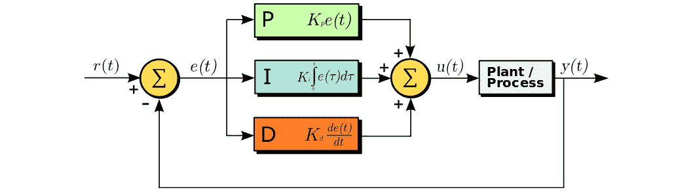

图 10.1 – PID 模块图

让我们通过*图 10.1*来观察一个简单的例子，即使用它来控制你家的温度。你家可能有一个允许你设定所需温度的恒温器。我们将你选择的温度称为**设定点**或*r(t)*。你家中的瞬时温度是**CV**或*y(t)*。现在恒温器的工作就是利用你家的加热器/冷却器来驱动家中的温度（CV）达到**设定点**。CV，*y(t)*，被反馈到减法模块以确定**误差**，*e(t) = r(t) - y(t)*，即家中的期望温度和当前温度之间的差异。然后**误差**被传递到 P、I 和 D 控制项，这些项各自乘以一个**增益**值（通常用*K*表示），然后相加以产生输入到加热器/冷却器的控制信号。你的加热器/冷却器有一定的功率容量，你的家有一定的空气体积。加热器/冷却器容量和家中的空气体积的组合决定了当你选择一个新的**设定点**时，家会多快加热或冷却。这被称为家的**过程**、**设备**或*传递函数*。这个过程代表了系统 CV 对**设定点**变化的响应，也称为*阶跃响应*。

下面的图表显示了一个系统的阶跃响应示例。在时间*t=0*时，**设定点**（由虚线表示）从 0 阶跃到 0.95。系统的响应在以下图中展示：

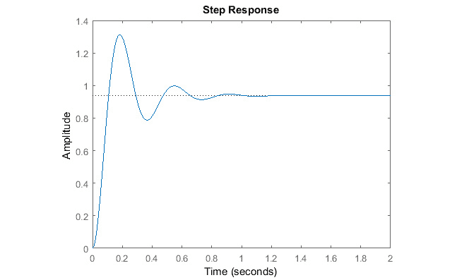

图 10.2 – 步进响应示例

我们可以看到，这个系统和控制器组合产生了一个响应，它将超过设定点并在其周围振荡，直到响应最终稳定在设定点值。

另一个与本书更相关的控制系统示例将是自动驾驶汽车的巡航控制系统。在这种情况下，汽车当前的速度是 CV，期望的速度是设定点，汽车和电机的物理动力学是过程。你将看到如何实现巡航控制器以及转向控制器。

现在，让我们了解 PID 控制中的比例、积分和微分控制术语的含义。

全油门加速！

你是否曾经想过在驾驶时如何决定踩油门踏板的力度？

哪些因素决定了你踩油门的力度？

–这是你的速度与你想更快速度的对比吗？

–这和您接近目标速度的速度有多快有关吗？

–你是否不断检查你的速度以确保你没有偏离目标速度？

当我们快速浏览接下来的几节内容时，考虑所有这些。

在我们开始讨论 P、I 和 D 控制术语之前，我们需要定义**增益**是什么。

**增益**是一个缩放因子，用于在总控制输入中对控制项进行加权或减权。

### 理解比例的含义

在巡航控制示例中，你试图匹配你的汽车速度到一个设定点速度。设定点速度和你的汽车当前速度之间的差异被称为**误差**。当汽车速度低于设定点时，误差为正，当它高于设定点时，误差为负：

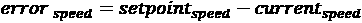

比例控制项只是将 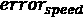 乘以一个称为比例**增益**的缩放因子：

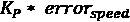

这意味着误差越大，对过程的控制输入就越大，或者在这种情况下，油门输入就越大。这说得通，对吧？

让我们用一些实际数字来验证这一点。首先，让我们定义油门从 0 到 100%的变化。接下来，让我们将其映射到一辆汽车的加速度上，比如特斯拉 Model X 的加速度，为 37 m/s²。*疯狂模式*！所以，100%的油门提供了 37 m/s²的加速度。

如果你的设定点速度是 100 km/h，而你从 0 km/h 开始，那么你当前的误差是 100 km/h。然后，如果你想以 100 km/h 的误差实现最大加速度，你可以将你的比例增益设置为 1：

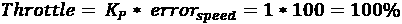

随着速度误差的减小，油门也会减小，直到你达到误差为零时的零油门输入。

等等！零油门意味着我们在滑行。如果没有摩擦、空气阻力等情况，这将非常有效，但我们都知道情况并非如此。这意味着你永远不会真正保持在目标速度，而会振荡在目标速度以下，给我们留下一个稳态偏差：


图 10.3 – 比例控制器中的稳态偏差

哦不——我们如何保持目标速度？别担心，我们有一个强大的积分器可以帮助我们提高速度。

### 理解积分项

介绍强大的积分器！PID 中的积分器项旨在解决系统中的任何稳态偏差。它是通过整合系统中的所有过去误差来做到这一点的。实际上，这意味着它在每个时间步长上累加我们看到的所有误差：

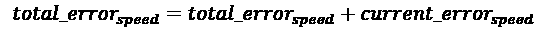

然后，我们用增益 *K*I 缩放总误差，就像我们处理比例项时做的那样。然后，我们将这个结果作为控制输入到系统中，如下所示：

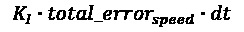

在你的定速巡航控制示例中，Model X 的速度只是短暂地达到了设定点速度，然后迅速下降到以下，因为比例输入变为零，空气阻力减慢了它的速度。这意味着如果你在时间上累加所有误差，你会发现它们始终是正的，并且继续增长。

因此，随着时间的推移，积分器项，`total_error`速度，变得越大。这意味着如果你选择 `K`I 适当，即使瞬时误差为零，油门命令也会大于零。记住，我们累加所有控制项以获得总油门输入。到目前为止，我们有 P 和 I 项，它们给我们以下结果：

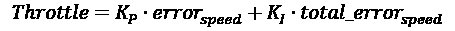

太好了！现在你正在围绕设定点振荡，而不是低于它。但你可能会问，*我们如何防止速度设定点的持续超调和欠调，并稳定在平滑的油门应用上？* 我想你永远不会问这个问题！

导数控制来救命！

### 导数项

你必须克服的最后难题是在接近设定点时调整油门，而不会超过它。导数项通过根据你接近设定点的速度调整油门来帮助解决这个问题。从误差的角度来看，这意味着误差的变化率，如下所示：

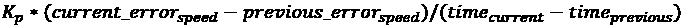

当先前的公式简化后，我们得到以下公式，其中 `d` 表示变化：

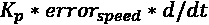

如果误差在减小——这意味着你正在接近设定点——导数项将是负的。这意味着导数项将试图减少你的总油门，因为油门现在由所有 P、I 和 D 控制项的总和给出。以下方程展示了这一点：

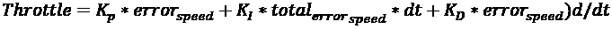

好吧，你现在知道 PID 的每个部分在实际情况中的含义了。真正的技巧是调整你的`K`P、`K`I 和`K`D 增益，使汽车的速度和加速度按照你的意愿行动。这超出了本书的范围，但本章末尾有一些很好的参考资料，可以了解更多关于这方面的内容。

接下来，你将了解一种更现代的控制形式，这种形式在今天的自动驾驶汽车中非常流行——MPC。

刹车！

你会称负油门为什么？

## MPC

**MPC**是一种现代且非常通用的控制器，用于 MIMO 系统。这对于你的自动驾驶汽车来说非常完美，因为你有多达油门、刹车和转向扭矩等多个输入。你也有多个输出，如相对于车道的横向位置和汽车的速度。正如你之前所学的，PID 需要两个单独的控制器（横向和纵向）来控制汽车。有了 MPC，你可以在一个漂亮的控制器中完成所有这些。

由于计算速度的提高，MPC 近年来变得流行，这允许进行所需的*在线*优化，以执行实时驾驶任务。

在你学习 MPC 做什么之前，让我们首先思考一下当你开车时，你的神奇大脑都在做什么：

1.  你选择一个目的地。

1.  你规划你的路线（航点）。

1.  你在遵守交通法规、你的车辆动力学和性能（*疯狂的驾驶模式，启动！*）、你的时间限制（*我迟到了一个改变一生的面试！*）以及你周围的交通状况的范围内执行你的路线。

### MPC 工作方式就像你

如果你真正思考一下你是如何驾驶的，你不断地评估你周围车辆的状态、你的车辆、到达目的地的时间、你在车道中的位置、你与前车之间的距离、交通标志和信号、你的速度、你的油门位置、你的转向扭矩、你的刹车位置，以及更多！同时，你也在不断地模拟基于当前交通状况你可以执行的多种操作——例如，*我的左边车道有辆车，所以我不能去那里*，*我前面的车开得很慢*，*我的右边车道没有车，但有一辆车正在快速接近*，*我需要赶到这个面试，我迟到了*。

你也在不断地权衡如果执行任何操作的成本，基于以下成本考虑：

+   迟到面试的成本：高！

+   违反法律的成本：高！

+   事故的成本：难以想象！

+   使用疯狂的驾驶模式的成本：中等！

+   损坏你的车的成本：*有什么比无限大还高？让我们选择那个！*

然后你迅速估算任何可能的操作的成本：

+   *在左边车道超车意味着我可能会撞到旁边的车，可能引发事故或损坏我的车，而且可能还错过我的面试。成本：天文数字！*

+   *我可以继续在这辆迟钝的汽车后面行驶。这将使我迟到*。成本：高！

+   *在右车道超车需要疯狂的加速，以确保接近的车辆不会撞到我*。成本：中等！

你选择上述选项中的最后一个，因为它基于你对每个考虑因素所赋予的成本，具有最低的模拟机动成本。

太好了，你已经选择了机动！现在你需要执行它。

你按下疯狂的按钮 5 秒钟，同时系紧安全带，直到感觉像一条响尾蛇，然后像《空手道小子》一样切换你的转向灯！你用白手紧握方向盘，然后全油门加速，想象着额外 35 匹马的力量把你推回座位。你同时转动方向盘，进入右车道，用肾上腺素和自信的笑容飞驰而过，看着之前接近的车辆在你身后消失在虚无中！

现在你对自己的机动感到无比满意，你开始整个过程，为下一个机动重复，直到你安全准时到达面试！你做到了！

### MPC 管道

MPC 采用与人类动态驾驶任务相似的方法。MPC 只是将驾驶任务形式化为数学和物理（少了些刺激和兴奋）。步骤非常相似。

建立如下约束：

1.  车辆的动态模型，用于估计下一个时间步的状态：

    +   最小转弯半径

    +   最大转向角度

    +   最大油门

    +   最大制动

    +   最大横向急动（加速度的导数）

    +   最大纵向加速度

1.  建立成本函数，包括以下内容：

    +   不在期望状态的成本

    +   使用执行器的成本

    +   顺序激活的成本

    +   使用油门和转向的成本

    +   横穿车道线的成本

    +   碰撞的成本

1.  接下来，模拟可能的轨迹和相关的控制输入，这些输入在下一个 *N* 个时间步遵守数学成本和约束。

1.  使用优化算法选择具有最低成本的模拟轨迹。

1.  执行一个时间步的控制输入。

1.  在新时间步测量系统的状态。

1.  重复 *步骤 3–6*。

每个步骤都有很多细节，你被鼓励通过查看章节末尾的“进一步阅读”部分中的链接来了解更多。现在，这里有几点快速指南供你思考。

**样本时间，TS**：

+   这是重复 MPC 管道 *步骤 3–7* 的离散时间步。

+   通常，TS 被选择，以确保在开环上升时间中至少有 10 个时间步。

**预测范围，N**：

+   这是你将模拟汽车状态和控制输入的未来时间步数。

+   通常，使用 20 个时间步来覆盖汽车的开环响应。

你还可以查看以下图表，它说明了构成 MPC 问题的许多你已学到的概念和参数：

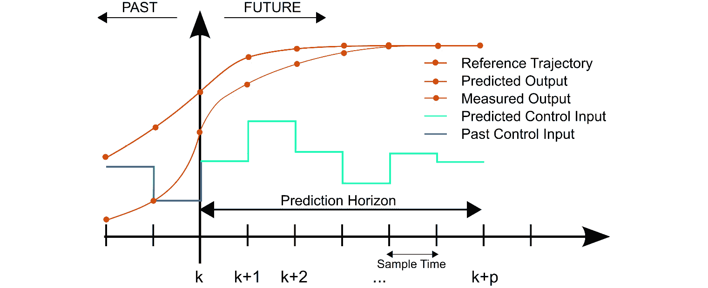

图 10.4 – 构成 MPC 问题的概念和参数

这里是对前面图表中显示的每个参数的简要描述：

+   **参考轨迹**是受控变量的期望轨迹；例如，车辆在车道中的横向位置。

+   **预测输出**是在应用预测控制输入后对受控变量状态的预测。它由系统的动态模型、约束和先前测量的输出所指导。

+   **测量输出**是受控变量的过去测量状态。

+   **预测控制输入**是系统对必须执行以实现预测输出的控制动作的预测。

+   **过去控制输入**是在当前状态之前实际执行的控制动作。

MPC 是一种强大但资源密集的控制算法，有时可以通过允许 MIMO 适应单个模块来简化你的架构。

这一次需要吸收的内容很多，但如果你已经走到这一步，你很幸运！在下一节中，我们将深入探讨你可以用来在 CARLA 中使用 PID 控制自动驾驶汽车的真正代码！

# 在 CARLA 中实现 PID

恭喜你来到了本章真正有趣且实用的部分。到目前为止，你已经学到了很多关于 PID 和 MPC 的知识。现在是时候将所学知识付诸实践了！

在本节中，我们将遍历 GitHub 上本章可用的所有相关代码：

[`github.com/PacktPublishing/Hands-On-Vision-and-Behavior-for-Self-Driving-Cars`](https://github.com/PacktPublishing/Hands-On-Vision-and-Behavior-for-Self-Driving-Cars)

你将学习如何在 Python 中应用 PID 的方程和概念，然后与 CARLA 进行接口。

首先，你需要安装 CARLA。

## 安装 CARLA

CARLA 项目在[`carla.readthedocs.io/en/latest/start_quickstart/`](https://carla.readthedocs.io/en/latest/start_quickstart/)提供了 Linux 和 Windows 快速入门指南。

对于 Linux，CARLA 文件将位于这里：

```py
/opt/carla-simulator/
```

在这个文件夹中，你可以找到一个`/bin/`文件夹，其中包含可执行的模拟器脚本，你可以使用以下命令运行它：

```py
$  /opt/carla-simulator/bin/CarlaUE4.sh -opengl
```

`–opengl`标签使用 OpenGL 而不是 Vulkan 来运行模拟器。根据你的系统设置和 GPU，你可能需要省略`–opengl`。你应该会看到一个看起来像这样的模拟器环境窗口弹出：

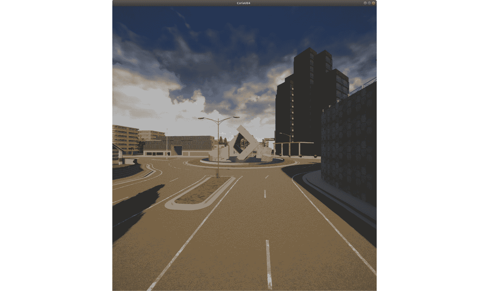

图 10.5 – CARLA 模拟器环境打开

对于本章，您将主要从以下位置的 `examples` 文件夹中工作：

+   Linux: `/opt/carla-simulator/PythonAPI/examples`

+   Windows: `WindowsNoEditor\PythonAPI\examples`

这个文件夹包含所有示例 CARLA 脚本，这些脚本教您 CARLA API 的基础知识。在这个文件夹中，您将找到一个名为 `automatic_control.py` 的脚本，这是本章其余部分您将使用的脚本的基础。

现在您已经安装并成功运行了模拟器，您将克隆包含 PID 控制器的 `Packt-Town04-PID.py` 脚本。

## 克隆 Packt-Town04-PID.py

您可以在 `Chapter10` 下的 [`github.com/PacktPublishing/Hands-On-Vision-and-Behavior-for-Self-Driving-Cars`](https://github.com/PacktPublishing/Hands-On-Vision-and-Behavior-for-Self-Driving-Cars) 找到本章的代码库。

您可以将整个仓库克隆到您机器上的任何位置。

然后，您需要将 `Packt-Town04-PID.py` 脚本链接到之前讨论过的 `examples` 文件夹中。您可以在 Linux 中使用以下命令：

```py
$  ln -s /full/path/to/Packt-Town04-PID.py /opt/carla-simulator/PythonAPI/examples/
```

现在您已经有了脚本，并且已经将其链接到 CARLA 中的正确位置，让我们来浏览一下代码以及它所做的工作。

## 浏览您的 Packt-Town04-PID.py 控制脚本

您的 `Packt-Town04-PID.py` 代码基于 `automatic_control.py` 示例脚本，并从 `/opt/carla-simulator/PythonAPI/carla/agents` 子文件夹中的相关代码片段拼接而成，具体包括以下脚本：

+   `behavior_agent.py`

+   `local_planner.py`

+   `controller.py`

+   `agent.py`

这是一种非常好的学习如何与 CARLA 模拟器交互以及学习 API 的方法，而无需从头开始编写所有内容。

### 查找 CARLA 模块

如果您现在查看 `Packt-Town04-PID.py`，您可能会注意到在常规导入之后，这个代码块：

```py
try:
    sys.path.append(glob.glob('../carla/dist/carla-*%d.%d-%s.egg' % (
        sys.version_info.major,
        sys.version_info.minor,
        'win-amd64' if os.name == 'nt' else 'linux-x86_64'))[0])
except IndexError:
    pass
```

这个块加载了一个包含 CARLA 代码的 egg 文件，该文件位于 `/opt/carla-simulator/PythonAPI/carla/dist/` 文件夹中。

### 相关类

之后，您可能会注意到代码被组织成以下类：

+   `World`：我们的车辆移动的虚拟世界，包括地图和所有演员（如车辆、行人和传感器）。

+   `KeyboardControl`：这个类响应用户按下的键，并有一些逻辑将转向、制动和加速的二进制开/关键转换为更广泛的值范围，这取决于它们被按下的时间长短，从而使汽车更容易控制。

+   `HUD`：这个类渲染与模拟相关的所有信息，包括速度、转向和油门。它管理可以显示几秒钟信息的通知。

+   `FadingText`：这个类被 `HUD` 类用来显示几秒钟后消失的通知。

+   `HelpText`：这个类使用 CARLA 使用的游戏库 `pygame` 显示一些文本。

+   `CollisionSensor`：这是一个可以检测碰撞的传感器。

+   `LaneInvasionSensor`: 这是一个可以检测到你跨越车道线的传感器。

+   `GnssSensor`: 这是一个提供 OpenDRIVE 地图内 GNSS 位置的 GPS/GNSS 传感器。

+   `CameraManager`: 这是一个管理相机并打印相机的类。

+   `Agent`: 这是定义游戏中的代理的基类。

+   `AgentState`: 这是一个表示代理可能状态的类。

+   `BehaviorAgent`: 这个类实现了一个通过计算到达目的地的最短路径来导航世界的代理。

+   `LocalPlanner`: 这个类通过动态生成航点来实现一个要跟随的轨迹。它还调用带有适当增益的`VehiclePIDController`类。这就是本章魔法发生的地方。

+   `VehiclePIDController`: 这个类调用横向和纵向控制器。

+   `PIDLongitudinalController`: 这个类包含了你一直在学习的用于定速巡航的 PID 数学。

+   `PIDLateralController`: 这个类包含了用于转向控制的 PID 数学，以保持你的车辆跟随由`LocalPlanner`类生成的航点。

此外，还有一些其他值得注意的方法：

+   `main()`: 这主要致力于解析操作系统接收到的参数。

+   `game_loop()`: 这主要初始化`pygame`、CARLA 客户端以及所有相关对象。它还实现了游戏循环，每秒 60 次分析按键并显示最新的图像在屏幕上。

### 设置世界

在`game_loop()`方法中，你可以找到设置世界地图的位置。它目前设置为`Town04`：

```py
selected_world = client.load_world("Town04")
```

### 车辆个性化

如果你是一个想要选择你的车型和颜色的汽车爱好者，你可以通过在`World()`类内的代码中这样做：

```py
blueprint=self.world.get_blueprint_library().filter('vehicle.lincoln.mkz2017')[0] 
        blueprint.set_attribute('role_name', 'hero')
        if blueprint.has_attribute('color'):
            color = '236,102,17'
            blueprint.set_attribute('color', color)
```

### 生成点

你可能想要更改的下一个东西是地图中车辆的生成点。你可以通过为`spawn_points[0]`选择不同的索引来完成此操作：

```py
spawn_point = spawn_points[0] if spawn_points else carla.Transform()
```

现在你已经完成了自定义并了解了类及其功能，我们将深入本章代码的核心——PID 控制器！

## PIDLongitudinalController

这是你的定速巡航，负责操作油门和刹车。你还记得我们之前刺激你的大脑并问一个负油门会被叫什么吗？好吧，这里的答案是刹车。所以每当控制器计算出一个负油门输入时，它将使用控制值激活刹车。

### 收益

这个增益类使用 CARLA 团队调整过的 PID 增益初始化：

```py
        self._k_p = K_P
        self._k_d = K_D
        self._k_i = K_I
```

这些值在以下代码中的`LocalPlanner`类中设置回：

```py
        self.args_long_hw_dict = {
            'K_P': 0.37,
            'K_D': 0.024,
            'K_I': 0.032,
            'dt': 1.0 / self.FPS}
        self.args_long_city_dict = {
            'K_P': 0.15,
            'K_D': 0.05,
            'K_I': 0.07,
            'dt': 1.0 / self.FPS}
```

### 增益调度

注意，根据高速公路和城市驾驶的不同，有不同的增益。增益根据汽车当前的速度在`LocalPlanner`中进行调度：

```py
   if target_speed > 50:
            args_lat = self.args_lat_hw_dict
            args_long = self.args_long_hw_dict
        else:
            args_lat = self.args_lat_city_dict
            args_long = self.args_long_city_dict
```

### PID 数学

现在是时候展示你一直等待的 PID 实现数学了！`_pid_control()` 方法包含了 PID 控制器的核心以及你在“控制器类型”部分的“PID”子部分中学到的计算：

1.  首先，我们计算速度误差：

    ```py
            error = target_speed – current_speed
    ```

1.  接下来，我们将当前误差添加到误差缓冲区中，以便稍后用于计算积分和导数项：

    ```py
            self._error_buffer.append(error)
    ```

1.  然后，如果误差缓冲区中至少有两个值，我们计算积分和导数项：

    ```py
            if len(self._error_buffer) >= 2:
    ```

1.  接下来，我们通过从当前误差值中减去前一个误差值并除以**采样时间**来计算导数项：

    ```py
                _de = (self._error_buffer[-1] - self._error_buffer[-2]) / self._dt
    ```

1.  接下来，我们通过将所有观察到的误差求和并乘以**采样时间**来计算积分项：

    ```py
                _ie = sum(self._error_buffer) * self._dt
    ```

    如果缓冲区中没有足够的内容，我们只需将积分和导数项设置为零：

    ```py
            else:
                _de = 0.0
                _ie = 0.0
    ```

1.  最后，我们通过将所有增益加权的 PID 项相加并返回值裁剪到±1.0 来计算控制输入。回想一下，这个数学计算如下：

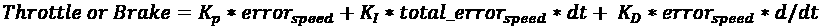

如果值是正的，则命令油门，否则命令刹车：

```py
        return np.clip((self._k_p * error) + (self._k_d * _de) + (self._k_i * _ie), -1.0, 1.0)
```

现在你已经了解了 PID 的基本数学，接下来我们将看到如何在横向 PID 控制器中实现这一点。

## PIDLateralController

这是你的转向控制，负责执行转向角度。

### 增益

这个类使用 CARLA 团队调校的 PID 增益进行初始化：

```py
        self._k_p = K_P
        self._k_d = K_D
        self._k_i = K_I
```

在 `LocalPlanner` 类中设置的值如下所示：

```py
        self.args_lat_hw_dict = {
            'K_P': 0.75,
            'K_D': 0.02,
            'K_I': 0.4,
            'dt': 1.0 / self.FPS}
        self.args_lat_city_dict = {
            'K_P': 0.58,
            'K_D': 0.02,
            'K_I': 0.5,
            'dt': 1.0 / self.FPS}
```

### 增益调度

注意，与纵向控制一样，根据高速公路和城市驾驶的不同，存在不同的增益。增益在 `LocalPlanner` 中根据当前车速进行调度：

```py
   if target_speed > 50:
            args_lat = self.args_lat_hw_dict
            args_long = self.args_long_hw_dict
        else:
            args_lat = self.args_lat_city_dict
            args_long = self.args_long_city_dict
```

### PID 数学

横向控制的数学计算略有不同，但基本原理相同。再次强调，数学计算在 `_pid_control()` 方法中。让我们看看如何进行：

1.  首先，我们在全局坐标系中找到车辆向量的起点：

    ```py
            v_begin = vehicle_transform.location
    ```

1.  接下来，我们使用车辆的偏航角在全局坐标系中找到车辆向量的终点：

    ```py
            v_end = v_begin + carla.Location(x=math.cos(math.radians(vehicle_transform.rotation.yaw)),
                                             y=math.sin(math.radians(vehicle_transform.rotation.yaw)))
    ```

1.  接下来，我们创建车辆向量，这是车辆在全局坐标系中的指向：

    ```py
            v_vec = np.array([v_end.x - v_begin.x, v_end.y - v_begin.y, 0.0])
    ```

1.  接下来，我们计算从车辆位置到下一个航点的向量：

    ```py
            w_vec = np.array([waypoint.transform.location.x -
                              v_begin.x, waypoint.transform.location.y -
                              v_begin.y, 0.0])
    ```

1.  接下来，我们找到车辆向量和从车辆位置指向航点的向量之间的角度。这本质上就是我们的转向误差：

    ```py
            _dot = math.acos(np.clip(np.dot(w_vec, v_vec) /
                                     (np.linalg.norm(w_vec) * np.linalg.norm(v_vec)), -1.0, 1.0))
    ```

1.  接下来，我们找到两个向量的叉积以确定我们位于航点的哪一侧：

    ```py
            _cross = np.cross(v_vec, w_vec)
    ```

1.  接下来，如果叉积是负的，我们调整 `_dot` 值使其为负：

    ```py
            if _cross[2] < 0:
                _dot *= -1.0
    ```

1.  接下来，我们将当前的转向误差追加到我们的误差缓冲区中：

    ```py
            self._e_buffer.append(_dot)
    ```

1.  接下来，如果误差缓冲区中至少有两个值，我们计算积分和导数项：

    ```py
            if len(self._e_buffer) >= 2:
    ```

1.  接下来，我们通过从当前误差值中减去前一个误差值并除以**采样时间**来计算导数项：

    ```py
                _de = (self._e_buffer[-1] - self._e_buffer[-2]) / self._dt
    ```

1.  接下来，我们通过求和所有已看到的误差并乘以采样时间来计算积分项：

    ```py
                _ie = sum(self._e_buffer) * self._dt
    ```

    如果缓冲区中不足够，我们只需将积分和导数项设置为 0：

    ```py
            else:
                _de = 0.0
                _ie = 0.0
    ```

1.  最后，我们通过求和所有增益加权的 PID 项，并返回值裁剪到±1.0 来计算控制输入。我们还没有看到转向的情况，但它与速度的工作方式相同：

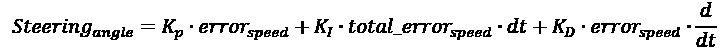

负的转向角度简单意味着*向左转*，而正的则意味着*向右转*：

```py
        return np.clip((self._k_p * _dot) + (self._k_d * _de) + (self._k_i * _ie), -1.0, 1.0)
```

现在你已经学会了如何在 Python 中实现 PID 控制，是时候看看它的工作效果了！

## 运行脚本

首先，你应该确保已经通过运行以下代码启动了 CARLA 模拟器：

```py
$  /opt/carla-simulator/bin/CarlaUE4.sh -opengl
```

然后在新的终端窗口中，你可以运行`Packt-Town04-PID.py`脚本，并观看魔法展开。运行脚本的命令如下：

```py
$  python3 /opt/carla-simulator/PythonAPI/examples/Packt-Town04-PID.py
```

你应该会看到一个新窗口弹出，其外观如下截图所示：

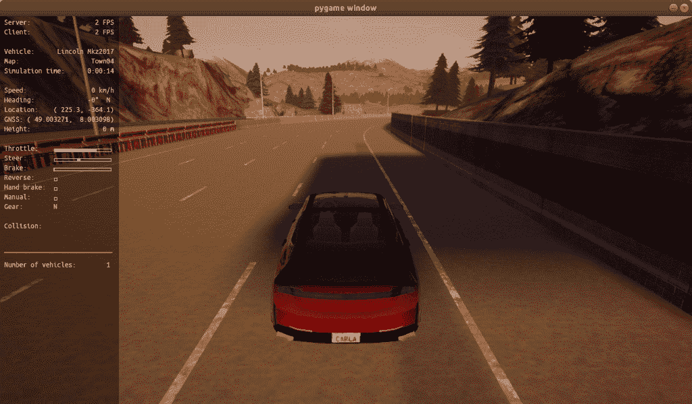

图 10.6 – Packt-Town04-PID.py 运行窗口

恭喜！你只用键盘和你的新知识就成功地让一辆车自己转向和加速！在下一节中，你将学习如何使用 C++应用 MPC 控制器。

# 一个 C++中的 MPC 示例

MPC 的完整实现超出了本章的范围，但你可以查看这个用 C++编写的示例实现[`github.com/Krishtof-Korda/CarND-MPC-Project-Submission/blob/master/src/MPC.cpp`](https://github.com/Krishtof-Korda/CarND-MPC-Project-Submission/blob/master/src/MPC.cpp)。

以下示例将指导你实现一个 MPC 模块，你可以用它来替代 PID 控制器进行横向和纵向控制。回想一下，MPC 是一个 MIMO 系统，这意味着你可以控制多个输出。

以下示例展示了构建 MPC 控制器所需的所有基本组件和代码：

1.  首先，使用以下代码将多项式拟合到你的**预测范围**航点上：

    ```py
    Main.cpp --> polyfit()
    ```

    使用以下代码来计算交叉跟踪误差：

    ```py
    Main.cpp --> polyeval()
    double cte = polyeval(coeffs, px) - py;
    ```

    使用以下代码来计算方向误差：

    ```py
    double epsi = psi - atan(coeffs[1] + 2*coeffs[2]*px + 3*coeffs[3]*px*px) ;
    ```

1.  现在，我们使用`MPC.cpp`来构建向量，以便将其传递给优化器。优化器将所有状态和执行器变量放在一个单一的向量中。因此，在这里，你将确定向量中每个变量的起始索引：

    ```py
    size_t x_start = 0;
    size_t y_start = x_start + N;
    size_t psi_start = y_start + N;
    size_t v_start = psi_start + N;
    size_t cte_start = v_start + N;
    size_t epsi_start = cte_start + N;
    size_t delta_start = epsi_start + N;
    size_t a_start = delta_start + N - 1;
    ```

1.  接下来，分配你成本的所有可调整权重：

    ```py
    const double w_cte = 1;
    const double w_epsi = 100;
    const double w_v = 1;
    const double w_delta = 10000;
    const double w_a = 7;
    const double w_delta_smooth = 1000;
    const double w_a_smooth = 1;
    const double w_throttle_steer = 10;
    ```

1.  之后，你可以根据这些权重建立你的成本函数。

    对于这个，你必须添加一个成本，如果你相对于参考状态处于相对状态。换句话说，添加一个成本，以表示不在期望路径、航向或速度上，如下所示：

    ```py
    for (int t = 0; t < N; t++) {
        fg[0] += w_cte * CppAD::pow(vars[cte_start + t], 2);
        fg[0] += w_epsi * CppAD::pow(vars[epsi_start + t], 2);
        fg[0] += w_v * CppAD::pow(vars[v_start + t] - ref_v, 2);
        }

    ```

    然后，你需要为执行器的使用添加一个成本。这有助于在不需要时最小化执行器的激活。想象一下，这辆车喜欢偷懒，只有当成本足够低时才会发出执行命令：

    ```py
    for (int t = 0; t < N - 1; t++) {
        fg[0] += w_delta * CppAD::pow(vars[delta_start + t], 2);
        fg[0] += w_a * CppAD::pow(vars[a_start + t], 2);
        }
    ```

1.  接下来，你需要为执行器的顺序使用添加成本。这将有助于最小化执行器的振荡使用，例如当新驾驶员笨拙地在油门和刹车之间跳跃时：

    ```py
    for (int t = 0; t < N - 2; t++) {
        fg[0] += w_delta_smooth * CppAD::pow(vars[delta_start + t                                    + 1] - vars[delta_start + t], 2);
        fg[0] += w_a_smooth * CppAD::pow(vars[a_start + t + 1]                                               - vars[a_start + t], 2);
        }

    ```

1.  接下来，添加一个在高速转向角度时使用油门的成本是个好主意。你不想在转弯中猛踩油门而失控：

    ```py
    for (int t = 0; t < N - 1; t++) {
        fg[0] += w_throttle_steer * CppAD::pow(vars[delta_start                                          + t] / vars[a_start + t], 2);

        }
    ```

1.  现在，建立初始约束：

    ```py
    fg[1 + x_start] = vars[x_start];
    fg[1 + y_start] = vars[y_start];
    fg[1 + psi_start] = vars[psi_start];
    fg[1 + v_start] = vars[v_start];
    fg[1 + cte_start] = vars[cte_start];
    fg[1 + epsi_start] = vars[epsi_start];
    ```

1.  现在我们已经做了这些，我们可以根据状态变量和`t+1`；即当前时间步，建立车辆模型约束：

    ```py
    for (int t = 1; t < N; t++) {
          AD<double> x1 = vars[x_start + t];
          AD<double> y1 = vars[y_start + t];
          AD<double> psi1 = vars[psi_start + t];
          AD<double> v1 = vars[v_start + t];
          AD<double> cte1 = vars[cte_start + t];
          AD<double> epsi1 = vars[epsi_start + t];
    ```

1.  然后，创建时间`t`的状态变量；即前一个时间步：

    ```py
          AD<double> x0 = vars[x_start + t - 1];
          AD<double> y0 = vars[y_start + t - 1];
          AD<double> psi0 = vars[psi_start + t - 1];
          AD<double> v0 = vars[v_start + t - 1];
          AD<double> cte0 = vars[cte_start + t - 1];
          AD<double> epsi0 = vars[epsi_start + t - 1];
    ```

1.  现在，你需要确保你只考虑时间`t`的驱动。因此，在这里，我们只考虑时间`t`的转向（`delta0`）和加速度（`a0`）：

    ```py
          AD<double> delta0 = vars[delta_start + t - 1];
          AD<double> a0 = vars[a_start + t - 1];
    ```

1.  接下来，你需要添加你试图跟随的航点线的约束。这是通过创建一个拟合航点的多项式来完成的。这取决于系数的数量。例如，一个二阶多项式将有三项系数：

    ```py
    AD<double> f0 = 0.0;
    for (int i=0; i<coeffs.size(); i++){
    f0 += coeffs[i] * CppAD::pow(x0, i);
    }
    ```

    使用相同的系数，你可以为汽车期望的航向建立约束：

    ```py
          AD<double> psides0 = 0.0;
          for (int i=1; i<coeffs.size(); i++){
    psides0 += i * coeffs[i] * pow(x0, i-1);
          }
          psides0 = CppAD::atan(psides0);
    ```

1.  最后，你需要为车辆模型创建约束。在这种情况下，可以使用一个简化的车辆模型，称为自行车模型：

    ```py
          fg[1 + x_start + t] = x1 - (x0 + v0 * CppAD::cos(psi0) * dt);
          fg[1 + y_start + t] = y1 - (y0 + v0 * CppAD::sin(psi0) * dt);
          fg[1 + psi_start + t] = psi1 - (psi0 + v0 * delta0 * dt / Lf);
          fg[1 + v_start + t] = v1 - (v0 + a0 * dt);
          fg[1 + cte_start + t] = cte1 - ((f0 - y0) + (v0 * CppAD::sin(epsi0) * dt));
          fg[1 + epsi_start + t] = epsi1 - ((psi0 - psides0) + v0 * delta0 / Lf * dt);

    }
    ```

太棒了！你现在至少有一个如何在 C++中编码 MPC 的例子。你可以将这个基本示例转换为你的控制应用所需的任何语言。你在控制知识库中又多了一件武器！

# 总结

恭喜！你现在已经拥有了一个自动驾驶汽车的横向和纵向控制器！你应该为你在本章中学到并应用的知识感到自豪。

你已经学习了两种最普遍的控制器，即 PID 和 MPC。你了解到 PID 非常适合 SISO 系统，并且非常高效，但需要多个控制器来控制多个输出。同时，你也了解到 MPC 适合具有足够资源在每一步实时不断优化的 MIMO 系统。

通过这种方式，你已经艰难地穿越了数学和模型的细节，并实现了你自己的 PID 控制器，在 CARLA 和 Python 中实现。

在下一章中，你将学习如何构建地图并定位你的自动驾驶汽车，这样你就可以始终知道你在世界中的位置！

# 问题

读完这一章后，你应该能够回答以下问题：

1.  什么控制器类型最适合计算资源较低的车辆？

1.  PID 控制器的积分项是用来纠正什么的？

1.  PID 控制器的导数项是用来纠正什么的？

1.  MPC 中的成本和约束有什么区别？

# 进一步阅读

+   控制理论：[`en.wikipedia.org/wiki/Control_theory#Main_control_strategies`](https://en.wikipedia.org/wiki/Control_theory#Main_control_strategies)

+   *城市交通中自动驾驶汽车跟踪的自调 PID 控制器*: [`oa.upm.es/30015/1/INVE_MEM_2013_165545.pdf`](http://oa.upm.es/30015/1/INVE_MEM_2013_165545.pdf)

+   调节 PID 控制器的 Twiddle 算法: [`martin-thoma.com/twiddle/`](https://martin-thoma.com/twiddle/)

+   *基于自适应 PID 神经网络的智能车辆横向跟踪控制*: [`www.ncbi.nlm.nih.gov/pmc/articles/PMC5492364/`](https://www.ncbi.nlm.nih.gov/pmc/articles/PMC5492364/)

+   *基于 MPC 的主动转向方法，用于自动驾驶车辆系统*: [`borrelli.me.berkeley.edu/pdfpub/pub-6.pdf`](https://borrelli.me.berkeley.edu/pdfpub/pub-6.pdf)

+   *用于自动驾驶控制设计的运动学和动力学车辆模型*: [`borrelli.me.berkeley.edu/pdfpub/IV_KinematicMPC_jason.pdf`](https://borrelli.me.berkeley.edu/pdfpub/IV_KinematicMPC_jason.pdf)
