# 4

# 审查预测和人工参与

RPA 和 IA 之间最大的区别之一在于，以前确定的自动化工作结果可能变得不确定。由于 ML 预测的不确定性，我们不再 100%确信数字工作者采取了正确的行动。了解 ML 算法表现如何以及降低 IA 的整体风险水平的主要方法之一是*对 ML 预测进行部分手动审查*。本章讨论了通过将**人工参与**（**HITL**）添加到自动化过程中来设计这种手动验证的两种不同方式。

在本章中，我们将涵盖以下主要内容：

+   为什么我们应该审查预测？

+   在 IA 的背景下，HITL 代表什么？

+   可以使用哪些标准来触发人工干预？

+   我们如何共享预测数据在预测审查员和 Blue Prism 之间？

# 技术要求

下载并导入 GitHub 上`ch4`文件夹中的三个`.bprelease`文件：[`github.com/PacktPublishing/Intelligent-Automation-with-Blue-Prism/tree/main/ch4`](https://github.com/PacktPublishing/Intelligent-Automation-with-Blue-Prism/tree/main/ch4)

*本章的第二个示例*也需要导入*第三章*（B18416_03.xhtml#_idTextAnchor048）的*示例 3*发布。GitHub 文件夹中还有一个 Excel 文件，它将作为*示例 2*的一部分下载。

# 为什么我们应该审查预测？

自动化爱好者不喜欢必须审查 ML 预测的想法。毕竟，结合 ML 和 RPA 的目的不是为了进一步减少人们在业务流程中的参与吗？在 IA 的背景下，ML 模型就像任何其他软件一样。它们不能永久使用。它们需要监控和更新，因为 ML 模型随着时间的推移而*漂移*是已知的，导致准确性下降。漂移可能由许多原因引起，例如底层输入数据特征的变化，或者模型未训练的新数据的暴露。不仅审查预测可以帮助检测漂移，而且还有一些 IA 特定的原因需要审查预测。

## 降低商业风险

当第一次将流程移入生产时，通常需要密切监控处理过程，并且只允许一小部分总工作量被处理。这些做法是管理将新事物部署到生产中固有的风险的方法。

在大多数情况下，引入 ML 会增加自动化流程的风险水平。尽管如此，我们仍然继续追求 IA，因为我们相信使用 ML 的好处超过了这些风险。审查 ML 预测并在必要时进行纠正，是减轻这种增加的商业风险的最直接方式之一，这种风险是基于持续、运营、个案处理的。

减少 IA 的商业风险还有其他方法，例如，通过故意选择下游保证人工审查的过程，或者选择可以容忍错误结果的用例。然而，这类风险缓解通常决定了哪些 IA 流程会被批准。它们不能在生产后用于操作层面的风险控制。

## 事先解决监管问题

自动化和人工智能在全球监管者和立法者心中占据核心位置。例如，巴西、中国和美国等国家正在积极制定立法，以规范社会中对人工智能的使用。例如，2023 年 10 月，拜登政府发布了一项行政命令，重点关注如何管理人工智能的风险。

欧洲在制定相关立法方面走在前列，有两个相关框架：目前正在开发的**欧盟人工智能法案**，以及已经生效的**通用数据保护条例**（**GDPR**）。**欧盟人工智能法案**将人工智能应用案例分为四个风险类别：最小、有限、高和不可接受。存在指导方针来定义哪些应用案例属于每个类别，并且有相应的立法来覆盖每个级别。例如，在**不可接受**风险类别下，使用人工智能寻找犯罪受害者是明确禁止的。法案的第 14 条讨论了人工监督。高风险系统必须设计成在人工智能系统使用期间，可以由**自然人进行监督**。虽然根据欧盟人工智能法案，很少有应用案例会被归类为高风险，但将人工监督纳入我们的 IA 解决方案设计作为一种预防措施是值得的。

**GDPR**的第 22 条规定，欧盟公民有权**不受仅基于自动处理的决定的影响**，以及有权**获得人工干预**。虽然欧盟人工智能法案和 GDPR 仅适用于欧盟，但其他国家可能会在其自己的 AI 立法中采用类似的规定。如果我们设计我们的流程，使得机器学习预测可以被人工审查（即人工监督），我们可以减轻未来可能出现的监管风险。

欧盟人工智能法案和 GDPR 都暗示，我们的 IA 流程中应该设计以下机制：

+   允许由人类验证机器学习预测

+   根据请求完全或选择性地禁用机器学习决策

本章重点介绍第一个要点，这是一种 HITL（人机交互）的形式。第二个要点将在后续章节中介绍。

# 在 IA 的背景下，HITL 是什么意思？

HITL 广泛地意味着人类应以某种方式与自动化互动。在传统的 RPA 中，可能需要人类输入的原因有很多。例如，可能需要人类输入以进行双因素认证，以便登录网站。

由于 IA 意味着将 ML 引入自动化过程，因此在此上下文中的人机交互特指某人**查看 ML 预测的结果，如有必要进行纠正，并将审查后的预测提供给 BP**。添加 HITL 来完成这一过程极大地影响了我们的流程设计。它需要确定以下事项：

+   应该使用哪些标准来触发自动化过程中的人工干预？

+   应该使用哪种用户界面来显示预测并接收关于预测是否正确的反馈？例如，这可以通过电子邮件、共享电子表格、网站等方式实现。

+   审查预测是否需要近乎实时完成以满足服务水平协议。

当面对一个需要审查的预测时，审查员必须决定以下事项：

+   是否接受或更改预测结果。

+   是否继续或暂停工作案例的自动化处理。

这些问题的答案将通过本章的示例进行说明。

# 可以使用哪些标准来触发人工干预？

记住，ML 预测将给出一个**预测值**，无论是数字、标签、图像还是生成的文本，以及一个**置信度分数**。一个明智的干预决策通常会考虑这两个因素，但仍有理由仅基于其中一个因素进行干预。

## 随机抽样

决定哪些工作案例应该手动审查的最简单方法是**通过随机抽样**：

1.  要使用随机抽样，选择一个您希望用于手动验证的目标百分比，例如，10%。

1.  在 ML 预测之后生成一个介于 1 到 100（包括 100）之间的随机数。如果随机数低于所选目标（本例中为 10），则自动化处理将停止，等待对预测的人工审查。

1.  在审查过程中，审查员可以纠正预测并允许工作案例继续，或者完全暂停自动化处理。

在一个实际案例中，IA 团队选择了 25%的随机抽样目标。随机抽样 25%案例进行手动审查的主要目的是跟踪预测准确性。尽管随机抽样并没有明确指出是为了降低风险而使用的，但它绝对可以用于这个目的。

随机抽样不使用任何预测或置信度分数。这是**随机抽样与阈值之间的主要区别**，这是一种不同的 HITL 触发器，将在本章后面讨论。请注意，如果我们将目标百分比设置为 100%，我们实际上使得每个预测都必须由人员进行审查。

让我们通过一个示例来看看如何实现随机抽样。我们将经历的四个高级步骤如下：

1.  检查示例的发布文件内容。

1.  了解如何在 BP 中生成随机数。

1.  理解如何通过随机采样触发 HITL 审查来定义使用随机采样的流程的流程。

1.  运行示例，在控制室中查看结果。

### 示例 1 – 随机采样

随机采样的概念很简单。首先，生成一个随机数。然后，检查随机数是否符合您的人工审查标准。尽管这个逻辑很简单，但在 BP 流程中实现随机采样需要使用许多 BP 功能。在此示例中，我们将查看使用单个工作队列、状态和延迟的单个随机采样实现。

此示例已基于 BP 的流程模板开发。我们的目标是检查和理解用于实现随机采样以供人工审查的 ML 预测的设计元素。第一步是导入发布文件。

#### 检查.bprelease 内容

在开始之前，让我们检查*示例 1*的`.bprelease`内容。验证是否已导入一个流程、一个工作队列和一个环境变量：

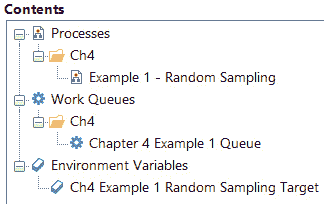

图 4.1 – 示例 1 的.bprelease 文件内容

环境变量名为`Ch4 Example 1 Random Sampling Target`的默认值为**33.33**，这意味着在此流程中，大约三分之一的 ML 预测将被选择进行人工审查。

接下来，让我们打开流程并检查与随机采样相关的 BP 阶段。

#### 生成随机数

在本节中，我们将了解随机采样逻辑是如何实现的。BP 没有直接生成随机数的方法。在 BP 中，大致有三种生成随机数的方法。第一种是在 DX 上下载具有随机数功能的新版发布（见[`digitalexchange.blueprism.com/dx/entry/3439/solution/utility---mathnet---random`](https://digitalexchange.blueprism.com/dx/entry/3439/solution/utility---mathnet---random)）。此 DX 资产需要从 NuGet 下载一个单独的`.dll`文件。第二种方法是在新对象中创建一个，并将随机数生成代码添加到*代码*阶段。第三种方法，即在此示例中使用的方法，是通过 PowerShell 的`Get-Random`函数。请注意，我仅使用 PowerShell 以保持`.bprelease`内容简单。首选的解决方案是在对象中实现它。

1.  在流程工作室中打开**示例 1 – 随机采样**流程的*Ch4*组。

1.  找到名为`Main Page`的块。所有流程的主要步骤都应该属于这里。让我们将注意力集中在包含执行随机采样的逻辑的`03 Random Sampling`页面上：

图 4.2 – 主页上的工作块中的随机采样

1.  打开 `03 随机抽样` 页面。双击 `Get-Random` 函数，并传入最小值和最大值 `1.0` 和 `100.0`。添加的小数点 `.0` 非常重要，因为它允许生成小数。如果省略，`Get-Random` 返回整数值。由于我们的随机抽样目标是小数，33.33，因此需要小数：

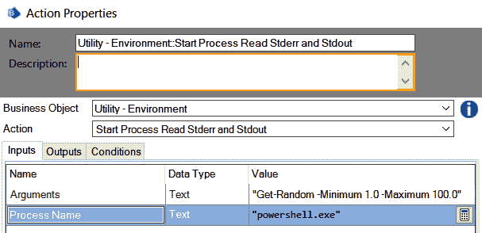

图 4.3 – 使用 PowerShell 的 Get-Random 生成随机数

1.  双击 *需要手动审查？* 决策阶段。在这里，我们将 PowerShell 生成的随机数与环境变量的值进行比较。如果比较是 `主页面`：

图 4.4 – 确定是否需要手动审查的标准

我们已经完成了对随机抽样逻辑的审查。接下来，让我们看看如何在等待 HITL 审查完成的同时，防止工作队列项目工作。

#### 推迟、选择和状态

`主页面` 包含三个重要的阶段，这些阶段构成了防止工作队列项目在待审期间继续进行的逻辑。在本例的这一部分，我们将检查这三个阶段——*检查状态*、*手动审查*和*将项目推迟至手动审查*：

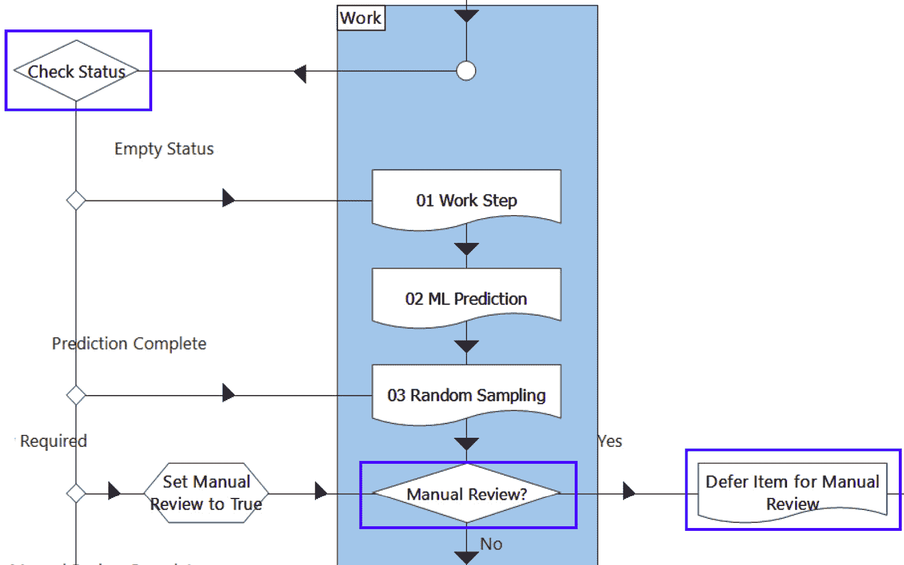

图 4.5 - 阻止项目在审查待定期间继续进行的阶段

1.  返回到 `主页面` 并双击 *手动审查？* 决策阶段。这个阶段检查在 `03 随机抽样` 页面上设置的标志。如果需要手动审查，执行将继续到 `推迟项目至手动审查` 页面。

1.  打开 `推迟项目至手动审查` 页面。这里只发生两件事。首先，当前工作队列项目的 *状态* 被设置为 **手动审查所需**。接下来，工作队列项目被推迟 10 分钟。10 分钟的推迟时间是任意的，可以根据您的喜好进行调整：

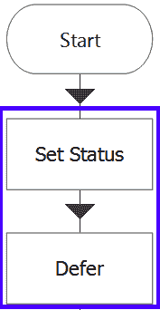

图 4.6 – 推迟项目至手动审查页面设置项目状态并推迟

1.  返回到 `主页面` 并双击 *检查状态* 选择阶段。在本例的上下文中，选择阶段主要用于不断推迟具有 **手动审查所需** 状态的项目，直到状态变为 **手动审查完成**：

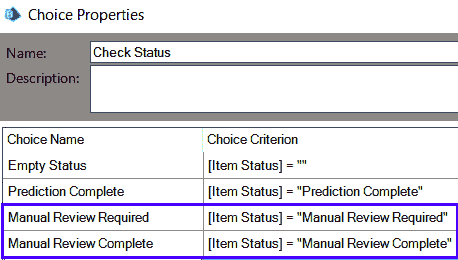

图 4.7 - 如果项目未被审查，状态检查将阻止推迟的项目继续进行

还要注意，第三个选项总是将手动审查标志设置为 **True**，以便将尚未审查的推迟工作队列项目再次推迟：

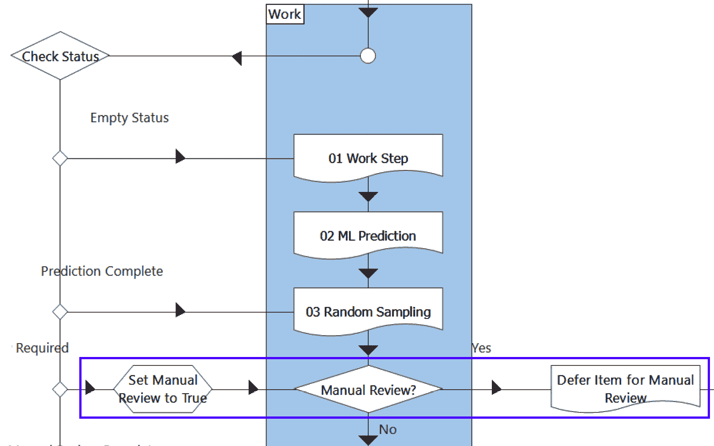

图 4.8 – 延迟持续到状态变为手动审查完成

如果手动审查标志为**False**（随机生成的数字大于或等于 33.33），或者如果工作队列项状态被更改为**手动审查完成**，自动化处理可以继续。

#### 运行流程

现在，让我们运行一次流程。该流程将九个项目加载到名为*第五章* *示例 1 队列*的工作队列中。由于我们的采样率为 33.33%，我们预计每次运行流程时，大约有三项被延迟以供 HITL 审查：

1.  从控制室运行名为**示例 1 – 随机抽样**的流程，在**Ch4**组中。你将看到每次做出预测时都会弹出 PowerShell 窗口。

1.  在**队列管理**下的**Ch4**组中点击**第四章** **示例 1 队列**。希望你会看到一些工作队列项已完成，而那些随机选择进行人工审查的项目已被延迟，状态设置为**手动审查所需**。具有**手动审查所需**状态的项目也有一个延迟时间，从现在起 10 分钟：

图 4.9 – 确认需要手动审查的项目已被延迟

我们已经完成了*示例 1*。在这里，我们看到了如何使用状态、选择和延迟来实现一种防止项目在手动审查之前被处理的*随机抽样*策略。我们还看到了如何通过 PowerShell 生成随机数。

在*示例 1*中，我们没有涵盖的一个问题是，如何实际更改项目的状态，以便在延迟后可以再次提取该项目进行处理。这一点将在本章的*示例 3*中进行讨论。

随机抽样的另一种策略是使用预测值和置信度分数来选择需要人工审查的案件。这被称为**阈值化**，将在下一节中讨论。

## 阈值化

阈值化使用*置信度分数*和有时使用*标签*来确定哪些预测需要人工审查。想法是选择置信度分数的阈值值。如果预测的置信度分数低于阈值，则将案件标记为需要人工审查，如果高于阈值，则自动化处理可以继续。

在实际的 IA 中，有许多使用阈值化的例子。在一种情况下，一家公司决定设置三个阈值范围。第一个阈值范围是 0%到 90%，选择完全停止自动化处理，转而采用手动处理。90%到 99.5%的置信度分数被标记为需要人工审查。得分高于 99.5%的工作项可以继续 IA 而无需任何审查。这是一个例子，说明我们不仅可以有一个阈值，还可以有多个阈值。

不仅可能存在多个阈值，不同的标签也可以有自己的阈值。在一个不同的实际 IA 用例中，有一个 ML 算法预测了超过 70 个类别。其中一些类别预测精度较高（> 90%），而其他类别预测精度较低（<75%）。IA 团队决定为低精度类别的预测设置较高的置信度分数阈值，以便使人工验证更有可能。对于高度精确的标签预测，置信度分数阈值设置为 0，允许完全自动化处理，因为没有东西会被标记为需要审核。

### 选择阈值值

阈值处理要求 IA 团队决定以下事项：

+   哪些标签（回归的数值范围）需要阈值处理？

+   需要多少个阈值区间？

+   阈值的截止点应该是多少？

如何设置阈值值没有简单的指导方针，因为它们与业务可以接受的风险程度密切相关。一种合理的方法是通过实验来估计在特定阈值水平下设置阈值所产生的错误预测数量。然后，量化错误预测的影响。

假设我们有一个从发票中提取发票 ID 的 NLP 模型。在测试了 10 张发票后，我们得到了以下结果：

| **#** | **置信度分数** | **发票 ID 是否正确** |
| --- | --- | --- |
| 1 | 87 | 是 |
| 2 | 57 | 否 |
| 3 | 46 | 否 |
| 4 | 67 | 否 |
| 5 | 78 | 是 |
| 6 | 93 | 是 |
| 7 | 72 | 是 |
| 8 | 53 | 是 |
| 9 | 62 | 是 |
| 10 | 43 | 否 |

表 4.1 – 从 10 张发票中尝试提取发票 ID 的结果

总体而言，该模型在这小样本集中正确提取发票 ID 的次数为 6/10 次（60%的时间）。IA 团队决定使用**阈值处理**并通过人工审核低置信度分数的预测来提高准确性。置信度分数高于阈值的预测将由 BP 自动处理，无需审核。**置信度分数的阈值值应该是多少？**

如果人工审核**总是**能正确提取出发票 ID（请注意，这并不总是情况），选择不同的阈值值会给我们以下结果：

| **置信度分数阈值** | **低于阈值的预测需要人工审核的数量** | **高于阈值的预测无需审核的数量** | **未审核处理案例的准确性** | **包括人工审核的所有案例的准确性** |
| --- | --- | --- | --- | --- |
| 40 | 0 | 10 | 6/10 = 60% | 6/10 = 60% |
| 45 | 1 | 9 | 6/9 = 66.7% | 7/10 = 70% |
| 50 | 2 | 8 | 6/8 = 75% | 8/10 = 80% |
| 55 | 3 | 7 | 5/7 = 71% | 8/10 = 80% |
| 60 | 4 | 6 | 5/6 = 83.3% | 9/10 = 90% |
| 65 | 5 | 5 | 4/5 = 80% | 9/10 = 90% |
| 70 | 6 | 4 | 4/4 = 100% | 10/10 = 100% |
| 75 | 7 | 3 | 3/3 = 100% | 10/10 = 100% |
| 80 | 8 | 2 | 2/2 = 100% | 10/10 = 100% |

表 4.2 – 置信度分数不同阈值水平的自动化部分准确性和整体准确性

对于置信度分数设置一个高阈值通常可以提高准确性，但也导致更多案例被标记为需要人工审查。看看前表中*80*的阈值值。我们可以看到，基于 10 个样本（第 5 列）有完美的准确性，但我们需要手动审查 10 个预测中的 8 个（第 2 列）。

设置低阈值允许更多案例通过 BP 自动处理；然而，需要采取行动的错误预测的数量也增加了。例如，如果阈值设置为*45*，只需要审查一个预测（第 2 列），但基于错误预测处理的案例占 30%（第 5 列）。

设置阈值值是在*所需准确性、基于错误预测处理案例的影响以及您希望不进行人工干预处理的案例数量之间进行权衡*。我们已经看到整体准确性如何与通过*表 4.2*的自动化案例数量相关。接下来，我们将讨论允许自动化基于错误预测处理案例的影响。

### 具有错误 ML 预测的案例自动化的影响

在提取发票 ID 的示例中，继续处理固有的风险性取决于许多因素：

+   一个错误提取的发票与真实的发票 ID 匹配的可能性有多大？

+   自动化完成后，是否需要进行人工审查，以便捕捉到更下游的 ML 预测错误？

+   在它持久化的系统中修改错误的发票 ID 有多难？是否需要在许多不同的地方进行修改？

+   发票 ID 会被提交到第三方系统吗？

商业和 IA 团队将需要根据列出的标准以及更多内容来评估需要多少人工审查。

在多标签分类案例中，每个标签也可以有其自己的风险程度。例如，如果发票的 NLP 模型也提取数值，将一个数字错误地标记为*价格*可能比错误地将一个数字标记为发票的*年份*风险更大。

应该仔细考虑所选的阈值值，通过评估使用错误预测继续处理的风险。不同类型的错误预测可能具有不同的风险特征，这意味着在许多情况下，*准确性不足以确定阈值*。

现在我们应该了解阈值是如何工作的，以及如何可能选择一个置信度分数的阈值值。接下来，让我们通过一个示例来实现 BP 中的阈值。在以下示例中，我们将执行三个高级步骤：

1.  检查示例的 Release 文件内容，并下载一个存储阈值标签和值的 Excel 文件。

1.  看看阈值逻辑如何在 BP 中实现。

1.  运行示例以在控制室中查看结果。

### 示例 2 – 阈值

假设我们为一家通过亚马逊、eBay 和沃尔玛等电子商务平台销售产品的公司工作。我们的公司使用 RPA 收集那些市场网站上留下的用户评论。作为改善客户关系和产品质量的倡议的一部分，公司希望确定用户反馈是否为正面。如果反馈是负面的，评论将被发送到客户服务和产品开发团队进行分析和跟进。

回想一下，在 *第三章*，*示例 3* 中创建的 Object 做了类似的事情。它使用 ML.NET 来检测用户评论中的 *有毒* 与非有毒情绪。随机抽样方案在这里不是一个好选择，因为我们希望更多地关注负面情绪而不是正面情绪。我们将改用阈值，以更频繁地审查可能为负面的评论。

在阈值方面，IA 团队与业务用户进行了一些测试，以确定阈值范围，并选择了以下内容：

| **标签** | **阈值** **区间 1** | **阈值** **区间 2** |
| --- | --- | --- |
| 无毒 | 0 <= 置信度分数 < 75 手动审查 | 75 <= 置信度分数 <= 100 允许自动化处理 |
| 有毒 | 总是手动审查 |  |

表 4.3 – 选定的阈值

在这个示例中，BP 流程的高级布局与我们在上一个示例中的随机抽样流程大致相同。区别主要在于我们处理阈值值的方式，因此我们的注意力将集中在那里。

#### 检查 .bprelease 内容并下载一个 Excel 文件

让我们熟悉一下发布的内容。有一个流程，一个工作队列和一个环境变量。名为 `Ch4 Example 2 Thresholds Excel File Full Path` 的环境变量存储了包含 *表 4.3* 中显示的阈值值的 Excel 文件的路径。默认情况下，它设置为 `C:/Users/Public/Ch4 Example 2 Thresholds.xlsx`。如果尚未下载，我们需要从 GitHub 下载此 Excel 文件。

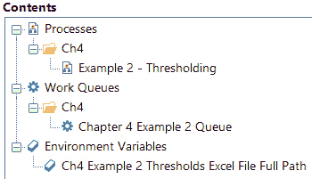

图 4.10 – 发布文件内容

1.  从 [`github.com/PacktPublishing/Intelligent-Automation-with-Blue-Prism/blob/main/ch4/Ch4%20Example%202%20Thresholds.xlsx`](https://github.com/PacktPublishing/Intelligent-Automation-with-Blue-Prism/blob/main/ch4/Ch4%20Example%202%20Thresholds.xlsx) 下载 Excel 文件。

1.  将 Excel 文件复制到 `C:\Users\Public` 文件夹，并确保文件名为 `Ch4 Example` `2 阈值.xlsx`。

1.  打开 Excel 文件。此文件存储了不同标签的所有阈值。根据 *表 4.3* 中选择的阈值，**非有毒** 标签的阈值设置为 *75*，**有毒** 标签的阈值设置为 *100*。*100* 表示所有内容都需要人工审核。虽然可以使用环境变量来存储阈值值，但如果存在多个标签，管理起来可能会变得困难：

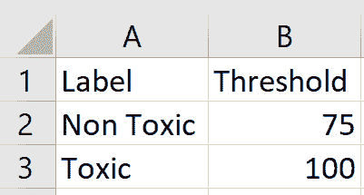

图 4.11 – 存储在 Excel 文件中的阈值值

接下来，让我们在流程工作室中查看流程并检查与阈值化相关的 BP 阶段。与延迟和状态相关的流程部分将不会在本章的 *示例 1* 中讨论。

#### 阈值化

在这里，我们将查看 BP 流程中与阈值化逻辑相关的区域。这包括一个将阈值 Excel 文件转换为集合、一个全局数据项和一个检查阈值值的决策阶段：

1.  在流程工作室的 *Ch4* 组中打开 **示例 2 – 阈值化** 流程。

1.  注意到有一个名为 `Convert Thresholds to Collection` 的页面。这个页面将 Excel 文件中保存的阈值映射到集合中。这个 `Threshold` 集合存储在 `Main Page` 上作为一个全局数据项：

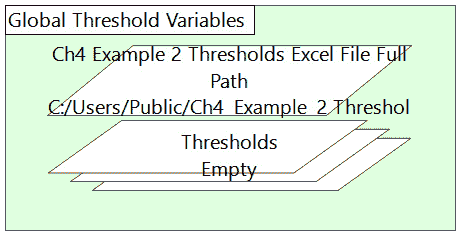

图 4.12 – Excel 阈值被转换为集合

1.  打开 `03 阈值化` 页面。有两点需要注意。首先，我们正在通过预测为这个工作队列项目运行所预测的标签来过滤 `Threshold` 集合。这允许我们按标签设置阈值。其次，在结束阶段之前有一个 *决策* 阶段，其中包含确定此项目是否需要人工审核的逻辑：

图 4.13 – 决策阶段的阈值化逻辑

#### 运行流程

*示例 2* 将 10 个静态用户评论加载到工作队列中。有一个有毒用户评论被正确标记为有毒。还有一个用户评论被预测为非有毒，但置信度低，需要 HITL 审核。

1.  在 *Control Room* 的 *Ch4* 组下运行名为 **示例 2 – 阈值化** 的流程。等待会话完成。

1.  在 **队列管理** 下的 **第四章 示例 2 队列** 中点击 **Chapter 4**。

1.  注意到有两个项目因为需要人工审核而被延迟：

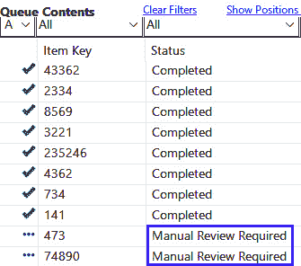

图 4.14 – 确认需要人工审核的项目已被延迟

我们已经看到如何将*随机抽样*和*阈值*设计到 BP 流程中。这两种方法都使用相同的基本设计结构，包括使用状态和延迟。在随机抽样和阈值之间进行选择是一个商业决策，而不是技术决策。

到目前为止，我们方便地忽略了审阅者如何将审阅过的预测数据提交回 BP。这是下一节的主题。

# 我们如何共享预测数据在预测审阅者和 BP 之间？

在前两个示例中，我们没有展示如何将纠正过的预测反馈到 BP 中，以便案件可以继续。为了实现这一点，我们需要一个在 BP 和审阅者之间共享数据的地方。有四种常见的方法可以实现这一点：

1.  通过将预测数据复制到共享文件夹位置

1.  通过程序化调用或 API 调用上传预测数据

1.  通过将预测数据存储在数据库中

1.  通过电子邮件或其他消息服务发送数据

上述列表并不全面；例如，可以使用 FTP。然而，使用共享文件夹和 API 调用是共享 BP 和审阅者之间纠正预测所需数据的最常见方式。

我们还需要考虑是否存在服务等级协议（SLA）的担忧，这意味着审阅必须在一定时间内完成，以确保其余的处理可以按时完成。如果是这样，我们可能希望选择具有内在通知功能的审阅方法，例如电子邮件或即时消息。

## 通过共享文件夹审阅预测

通过*共享文件夹*在人类和数字工作者之间共享数据是常见的 RPA 实践。然而，当使用共享文件夹来审阅机器学习预测时，设计变得更加复杂，因为需要考虑更多因素。以下是一些例子：

+   什么*文件格式*（用户界面）最合适？例如，包括纯文本文件、Excel 文件、HTML 文档等等。这取决于需要向审阅者展示多少种类型的数据。如果我们正在验证一段文本是否被正确标记，一个文本文件可能就足够了。如果我们有表格形式的输入数据，例如商店 ID、产品 ID、价格等等，Excel 可能更合适。如果我们需要向审阅者展示图像，我们可以考虑使用基于网络的界面。

+   每个文件中应该包含*多少预测*？是只有一个，还是我们可以将批量审阅合并在一起？这取决于审阅案例的数量、审阅过程的复杂性、服务等级协议（SLA）以及可供审阅预测的人数。

+   BP 如何知道审阅是否已经*完成*？

让我们通过扩展**示例 1 – 随机抽样**流程，包括共享文件夹作为界面，在审阅者和 BP 之间传输预测数据来探讨这些设计考虑因素。

### 示例 3 – 通过共享文件夹复制数据

在**示例 1 – 随机抽样**流程中，我们根据客户的特点，如职业类别和忠诚度计划中的积分数量，预测客户是否会流失。由于这是表格数据，我们将选择通过*Excel*来展示这些数据以供复查。

随机抽样率为 33.33%时，许多预测都需要进行复查。业务也认为审查单个案例并不简单。基于这两个因素，团队决定将预测**批量分成每个 Excel 文件五个**，以便将复查工作分散到多个复查员之间，同时避免让任何一位复查员一次性进行过多复查而感到压力。

我们这个示例的目标是看看我们如何构建一个涉及使用共享文件夹并将多个预测批量放入 Excel 文件的预测复查方案。从高层次来看，我们将进行以下六个步骤：

1.  检查示例的发布文件内容。

1.  看看需要复查的预测是如何首先写入临时文件夹中的 Excel 文件，以及一旦达到批量大小，如何将 Excel 文件移动到“准备复查”文件夹。

1.  看看复查员如何在 Excel 文件中复查预测，并通过将文件复制到“完成复查”文件夹来通知 BP 复查已完成。

1.  理解 BP 逻辑以识别并进一步处理已完成人工复查的项目。

1.  看看如果在会话结束前未达到完整的批量大小，如何复制临时文件夹中剩余的复查。

1.  运行示例，在控制室中查看结果。

#### 检查.bprelease 内容

此示例是预构建的，与*示例 1 – 随机抽样*中的流程等效，并增加了一些内容。在共同分析此示例时，我们将突出显示这些重要新增内容。

确认您已导入一个流程、一个工作队列和五个环境变量。其中五个环境变量之一，**Ch4 Example 3 Random Sampling Target**与*示例 1*中的相同。它存储了我们想要复查的预测百分比（**33.33**）。**Ch4 Example 3 Review Batch Size**存储我们想要写入每个 Excel 文件的预测数量（**5**）。其他三个环境变量是文件路径，用于在 BP 和复查员之间促进数据共享：

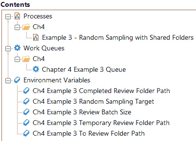

图 4.15 – 发布文件内容

#### 将 Excel 文件写入共享文件夹

五个环境变量中的两个是用于存储将展示给复查员的 Excel 文件的文件路径。**Ch4 Example 3 To Review Folder Path**是一个文件共享文件夹，*应该可供复查员访问*。流程将 Excel 文件复制到这个文件夹，表示需要复查预测。复查员应定期检查此文件夹，看是否有 Excel 文件在其中。

`Ch4 Example 3 Temporary Review Folder Path` 是一个由于将多个评审合并到一个 Excel 文件中而引入的复杂情况所需的文件夹。评审人员不需要访问此文件夹，因此它可以是 BP 可以写入的任何 *本地文件夹*。此临时文件夹的目的是防止评审人员在所有五个评审都写入文件之前打开和锁定 Excel 文件。每个预测将首先写入此临时路径，直到达到批量大小，之后 Excel 文件将移动到评审人员可以访问的文件夹。

重要提示

在将预测写入 Excel 文件时，我们包括所有输入数据，这些数据被输入到机器学习算法中。此外，我们还需要提供 *项目 ID*，以便我们可以将此预测映射回 BP 工作队列中的项目。需要通知评审人员不要修改电子表格中出现的 *项目 ID*。

接下来，让我们看看流程图：

1.  在流程工作室的 *Ch4* 组中打开 **Example 3 - Random Sampling with Shared Folders**。

1.  打开 `Defer Item for Manual Review` 页面。

1.  查看名为 *Do not Reset to Initial Value* 的块。在将不同工作队列项目之间的相同 Excel 文件进行批量写入时，需要两个在页面重新运行时不重置其初始值的 Data Items。**当前批量计数**跟踪已写入当前 Excel 文件中的预测数量。**Excel 文件名**存储一个包含运行时资源名称和时间的唯一文件名。在 Excel 文件名中包含运行时资源的名称是逻辑设计的重要部分，因为它允许数字工作者知道它在共享文件夹中创建了哪些文件。

图 4.16 – 两个未重置其值的数据项

1.  检查名为 `Writing the Temporary Excel file` 的块。块内的逻辑将一个预测写入一个 *临时* 文件。此临时文件应不可访问给评审人员：

图 4.17 – 将一个预测写入临时文件

*Create New Excel File?* 决策阶段的 *Yes* 路径用于创建新的 Excel 文件。*No* 路径用于将现有 Excel 文件写入以批量合并评审。这些都在 *临时* 文件夹中完成。

1.  查看紧随 *Writing the Temporary Excel File* 块之后的四个阶段。在将临时文件写入共享文件夹后，我们增加 `Current Batch Count` 并检查是否达到了所需的批量大小（存储为环境变量）。如果是这样，我们将文件从 `Ch4 Example 3 Temporary Review Folder Path` 移动到 `Ch4 Example 3 To Review Folder Path`，这是评审人员可以访问的共享文件夹：

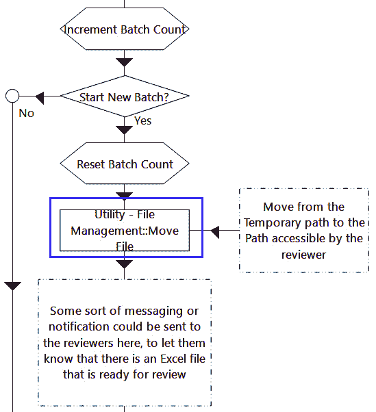

图 4.18 – 将文件从临时本地文件夹移动到可由审阅者访问的文件夹

#### 理解审阅者所做的工作

本节示例解释了期望审阅者执行的操作。我们在此处不会执行任何操作。审阅者应定期监控**Ch4 Example 3 待审阅文件夹路径**以查找新的 Excel 文件。审阅者应打开文件并将**标签**列（以下图中列 I）更改为正确的标签。如果他们认为预测是准确的，他们可以保留标签不变：

图 4.19 – 审阅者应打开 Excel 文件并编辑标签列

编辑并保存 Excel 文件后，审阅者应将文件剪切/粘贴到由**Ch4 Example 3 完成审阅文件夹路径**环境变量指定的路径。BP 流程将检查此文件夹，遍历所有 Excel 文件及其行，并将每个项目的状态更改为允许处理继续。

如果我们需要允许工作队列项目绕过 HITL 审阅，我们可以在控制室手动更改其**状态**并修改其**延期**时间到一个更早的**日期时间**。

#### 检查已审阅预测并更新项目状态

让我们了解检查已完成审阅的逻辑：

1.  访问流程的“主页面”。注意，在“获取下一个项目”之前有一个名为“检查已审阅预测”的页面：

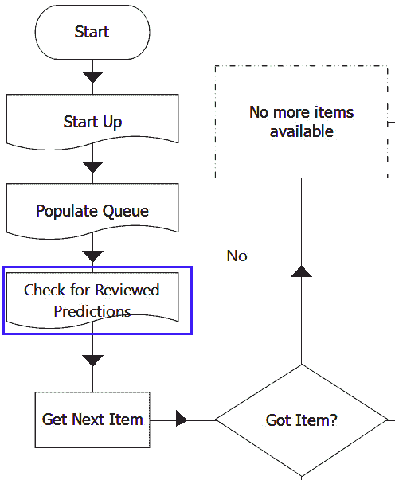

图 4.20 – 在处理工作队列项目之前检查已完成审阅的情况

1.  打开“检查已审阅预测”页面。此页面遍历**Ch4 Example 3 完成审阅文件夹**中的所有 Excel 文件并读取所有行。然后，它尝试根据项目 ID 来**锁定**每个项目，以便更新其**状态**。更新状态后，项目被解锁，允许它再次被工作队列选中。

1.  定位以下图中所示的四个阶段：

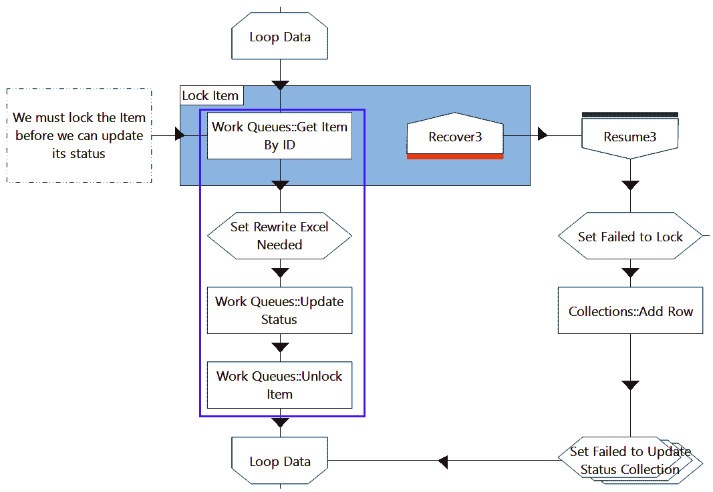

图 4.21 – 锁定项目，更新状态，然后解锁

如果我们成功更新了项目的**状态**，将设置一个**重写 Excel 文件所需**标志，表示流程需要从 Excel 文件中删除一些行（已审阅预测）。从完成后的 Excel 文件中删除一行意味着项目可以在审阅后继续处理步骤。

如果我们无法锁定项目，我们将设置一个不同的标志，`Failed to Lock`，表示我们遇到了这个 Excel 文件的问题。任何我们无法锁定的项目都将添加到一个新的集合中，用于跟踪目的。那些我们未能更新状态的项目将不会从 Excel 文件中删除，以便在未来的会话运行中再次进行检查。

图 4.22 – 将无法锁定到集合中的项目存储

1.  定位以下图中显示的两个阶段。如果`Failed to Lock`标志表示我们已经成功更新了此 Excel 文件的所有项目状态，则从文件夹中删除 Excel 文件：

图 4.23 – 如果我们成功更新所有五个预测的状态，则删除文件

1.  定位以下图中显示的六个阶段：

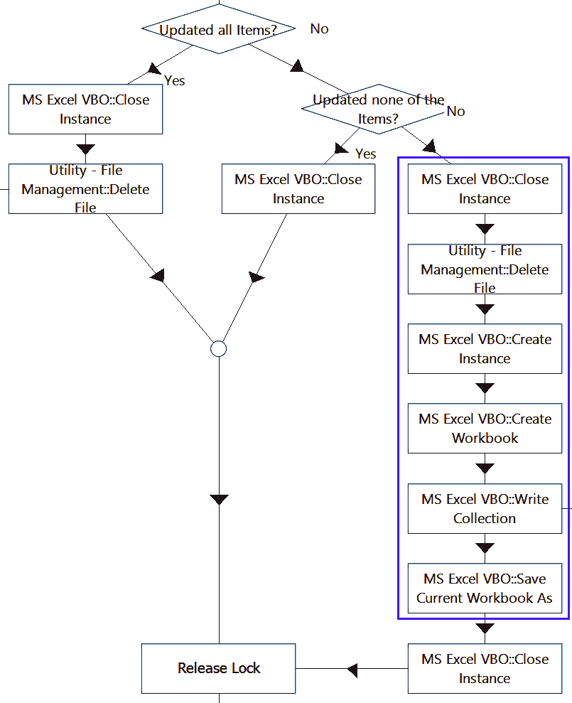

图 4.24 – 删除状态成功更新的 Excel 行

如果流程未能更新某些项目的状态，则覆盖 Excel 文件，使其仅包含那些失败的行（这些行已在*图 4.22*中单独保存）。这从 Excel 文件中删除了状态成功更新的预测。在下一个会话运行时，将执行此`检查已审查预测`页面，流程将尝试再次更新这些项目的状态。

#### 清理临时文件夹中的文件

Excel 文件可能会卡在`关闭``下`页面：

1.  打开`关闭下`页面。注意在结束前有一个`移动临时文件`页面。

1.  打开`移动临时文件`页面。此页面遍历临时文件夹中的所有文件，并且只有在它们是由这个特定的运行时资源创建的情况下才会移动它们。此文件夹中由其他运行时资源创建的文件将不会移动。这是通过在 Excel 文件名中检查完整的运行时资源名称来实现的。

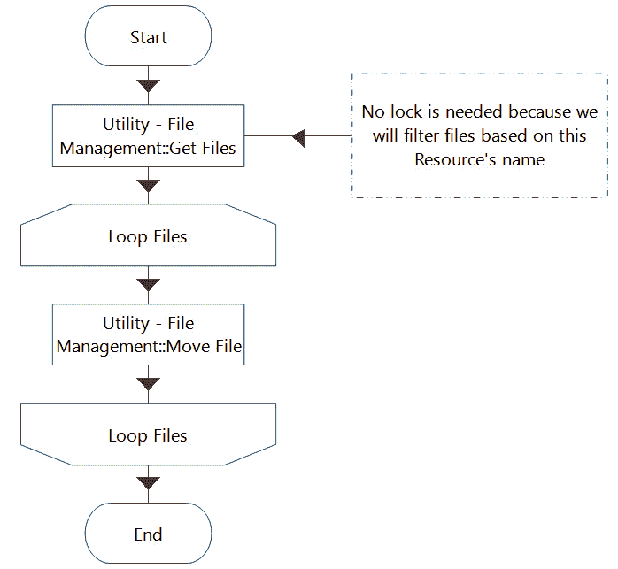

图 4.25 – 移动临时文件页面

#### 运行流程

我们现在已经看到了使用 Excel 和共享文件夹实现的 HITL 审查的示例。接下来，我们需要测试该流程。当运行时，将随机生成 30 名客户，算法将预测他们是否会流失。在 33.33%的随机抽样率下，我们预计大约需要手动审查 10 个预测。

重要提示

在测试**Example 3**时，**不要**在控制室和流程工作室之间混合运行。这是因为流程工作室会将`_DEBUG`添加到运行时资源名称的末尾。在`移动临时文件`和`手动审查项延迟`页面中，我们使用 Excel 文件名中的运行时资源名称。如果我们一次在流程工作室中运行一次，一次在控制室中运行，运行时资源名称将不会匹配，并且`移动临时文件`页面不会将一些 Excel 文件移动到审查文件夹。

1.  从控制室开始**Example 3 – 使用共享文件夹的随机抽样**流程的**Ch4**组。等待会话完成。

1.  打开控制室并点击**第四章** **Example 3 队列**。应该有许多项目正在等待手动审查。记下需要审查的项目数量。在以下图中，有七个：

图 4.26 – 计算等待手动审查的项目数量

1.  在 Windows 中打开对应于**Ch4 Example 3 To Review Folder Path**的文件夹。该文件夹中 Excel 文件的数量应该是**(需要审查的项目数量)/5*，向上取整。例如，如果你有七个需要手动审查的项目，我们应该有两个 Excel 文件。

1.  打开每个 Excel 文件，确保每个文件中（不包括标题）的累积行数等于需要审查的项目数量。根据*步骤 2*中的屏幕截图，我们的第一个文件应有五行，我们的第二个文件应有两行。

1.  将**Ch5 Example 3 To Review Folder Path**中的所有 Excel 文件剪切并粘贴到**Ch5 Example 3 Completed Review Folder Path**。这模拟了完成所有机器学习预测审查的过程。

1.  访问 BP 的**系统**区域。将**Ch4 Example 3 Random Sampling Target**环境变量从 33.33 更改为 0 并点击**应用**。这将在下一次会话运行时关闭随机抽样，这意味着 30 个新项目都不需要手动审查。

1.  等待所有延迟的工作队列项的延迟时间通过。

1.  再次从控制室运行流程。将创建一个新的包含 30 名客户的批次并对其进行预测。等待会话完成。

1.  打开控制室并点击**第四章** **Example 3 队列**。所有 60 个工作队列项应标记为完成，没有项目需要手动审查。

1.  在 Windows 中打开对应于**Ch4 Example 3 To Review Folder Path**、**Ch4 Example 3 Temporary Review Folder Path**和**Ch4 Example 3 Completed Review Folder**的每个文件夹。这三个文件夹都应该为空。

在这个例子中，我们展示了如何使用 BP 中的共享文件夹来实现 HITL 审查。由于预测输入数据的表格格式，我们选择了 Excel 作为审查预测的界面。多个预测审查被批量组合并保存到一个文件中。我们还设计了一个共享文件夹结构，以防止数字工人和人工审查员同时打开相同的 Excel 文件。

审查后，审查员将 Excel 文件手动移动到*完成*文件夹。BP 读取完成的 Excel 文件并更改工作队列项的状态，以便它们可以再次被提取进行处理。最后，我们还展示了如何将随机抽样环境变量设置为 0，完全关闭随机抽样。

# 摘要

RPA 和 IA 之间的关键区别在于 IA 使用机器学习算法。这使我们的过程从具有确定性结果转变为非确定性结果。随着自动结果的不可预测性增加，我们的业务风险也随之增加。

这导致了一个想法，即让人类重新进入循环，以验证和纠正一部分（不一定全部）的机器学习预测。这使我们能够持续衡量机器学习预测的准确性——鉴于准确性已知会随时间推移而漂移。它还为我们提供了一种操作上降低风险和规避未来监管风险的方法。

在现实生活中，有两种主要方法用于确定哪些预测需要审查。第一种是随机抽样，其中选择所有预测中固定百分比进行审查。随机抽样不会以任何方式查看预测值。接下来是阈值法，它查看置信度分数和有时预测标签。如果一个预测的置信度分数低于阈值值，它会被标记为需要审查。如果置信度分数高于阈值，则自动处理继续进行。

选择合适的阈值是一个复杂的话题。单个标签可以有多个阈值区间。我们也可以为不同的标签设置不同的阈值。通过实验和与业务用户讨论来设置阈值值是一种合理的方法。阈值值永远不会完美——在所需的准确性、基于错误预测处理案件的影响以及您希望不进行人工干预处理的案件数量之间必须做出权衡。

我们可以设计其他方案来确定哪些案件需要人工审查。例如，如果我们有固定数量的审查员和 SLA 来满足，我们可以有一个公式根据工作队列中挂起的项的数量来改变随机抽样率。然而，在我审查了超过 100 个实际的 IA 应用案例之后，我没有遇到比标准随机抽样和阈值法更复杂的。

提供了随机抽样和阈值法的示例，并讨论了它们的设计元素。在我们的设计中，我们使用了状态、延期、共享文件夹以及单个工作队列，以实现一个端到端的人机交互式任务（HITL）解决方案，用于审查机器学习预测。在下一章中，我们将从*单个*工作队列的设计转向，并讨论我们为何以及如何想要设计一个具有*多个*工作队列的智能代理（IA）流程。
