# 7

# IA 模板和实用工具 - IA 对象

成熟的 BP 开发团队很少从空白的流程设计画布开始他们的开发工作。相反，他们建立内部最佳实践，并将它们纳入一个标准模板库中，这些模板涵盖了他们遇到的大多数自动化场景。

在我与大四咨询团队、其他大型技术咨询公司、直接与客户合作，以及作为 SS&C 自动化 COE 成员的工作经验中，大多数现存的模板都是 BP 的**标准流程模板**的变体。这个标准模板在登录 BP 门户后即可获得，[`portal.blueprism.com/products/developer-jumpstart`](https://portal.blueprism.com/products/developer-jumpstart)。在这个网页上，您可以找到 BP 的官方模板以及如何使用它们的文档。

尽管围绕 IA 有很多“讨论”，但我还没有看到任何合作伙伴、客户甚至 BP 本身使用 IA 特定的模板。为了帮助填补这一差距，我开发了一些可以用于 IA 的模板，包括前几章中讨论的许多设计工作。本章的目标是介绍这些模板，并解释如何使用它们来启动您的 IA 开发。

在本章中，我们将讨论一个对象和三个流程模板：

+   IA 实用工具对象

+   一个单流程、单工作队列的**同步**审查模板

+   一个单流程、单工作队列的**异步**审查模板

+   一个三流程、三工作队列的**异步**审查模板

# 技术要求

从[`github.com/PacktPublishing/Intelligent-Automation-with-Blue-Prism/tree/main/ch7`](https://github.com/PacktPublishing/Intelligent-Automation-with-Blue-Prism/tree/main/ch7)下载并导入`.bprelease`文件。该发布包含五个流程和一个对象。验证它是否与以下图相符：

图 7.1 – 导入的发布内容

让我们先讨论对象。

# 对象 – 实用工具 – IA

此对象包含执行 IA 中常用任务的辅助函数。大多数操作使用**C#**代码阶段。此对象依赖于 BP 捆绑的标准**MS Excel VBO**和**实用工具 - 环境**对象。

接下来将讨论对象的操作及其与 IA 相关的目的。

## 范围内的随机整数

这将在一个范围内生成一个随机整数。提交一个下限（默认**1**）和一个上限（默认**100**）的范围值。返回的随机数包含范围值。此操作主要用于**随机抽样**。

## 范围内的随机小数

这将在一个范围内生成一个随机的小数。提交一个下限（默认**0**）和一个上限（默认**1**）的范围值。返回的随机数包含范围值。此操作主要用于**随机抽样**。

## 运行流程读取 Stdout Stderr 带超时

此操作需要导入**Utility - Environment**。

如果你还记得第二章，没有 BP 提供的操作可以启动流程，指定*超时*，并检索*Stdout*和*Stderr*作为数据项。我们不得不使用`Utility - Environment::Run Process Until Ended`并指定重定向文件来捕获 Stdout 和 Stderr。

此操作是**Run Process Until Ended**的包装器。此操作的输入与**Run Process Until Ended**相同。它执行文件重定向和临时文件管理逻辑，以便可以将 Stdout 和 Stderr 作为数据项返回。应使用此操作从 CLI 或 PowerShell 触发 ML 预测，而不是 BP 提供的内置选项。

## 文件转 Base64

此操作将文件（使用文件路径作为输入）转换为 Base64 格式。与`.html`文件中提供的版本相比，它具有额外的错误处理功能，可以转换需要上传到 API 的图像和文件。此操作适用于任何通用文件，而不仅仅是图像。

## 阈值 Excel 收集

此操作将包含标签和阈值值的 Excel 文件转换为集合。Excel 文件必须有两个列，标签在 A 列，阈值值（数值）在 B 列。Excel 文件的第一行应该是标签和阈值值的标题，但实际标题值没有限制。

此操作的输出是一个包含两个字段的集合。第一个字段是标签，第二个字段是阈值值。此操作需要导入**MS Excel VBO**。

此外，使用此操作会将标签和阈值存储在一个内部字典中，该字典由操作**通过标签获取阈值**使用，这将在下文中描述。

## 通过标签获取阈值

本操作的目的是为了提供快速查找阈值值的功能，因为可能会有数百个预测标签。在使用此操作之前，需要先使用一次**阈值 Excel 收集**操作。

要使用此操作，传递一个标签以获取其对应的阈值值。在集合中查找特定行最常见的方法是使用循环或`Utility - Collection Manipulation::Filter Collection`，当行数很多时，这并不高效。此操作通过查找标签并从内部字典中检索值来快速查找。如果找不到标签，将抛出异常。

## 对象概述

**Utility - 智能自动化**对象中有六个操作。代码阶段使用的语言是 C#。请记住，此对象只是一个起点。它可以，并且应该扩展到您 IA 解决方案所需的一些常用功能。现在，让我们看看使用此对象的三个流程模板。

# 处理模板

创建了**三个**流程模板，以涵盖绝大多数不同的 IA 设计。所有这些模板都是基于 BP 的标准流程模板，因此对于大多数开发者来说应该很熟悉。我已有意保持标准流程模板的逻辑尽可能不变，以便开发者可以将他们的开发精力集中在实现针对其特定用例的业务逻辑上。

重要提示

如果您不熟悉 BP 的标准流程模板，可以在门户的开发者快速入门页面上找到操作手册：[`portal.blueprism.com/system/files/2017-09/Process%20Template%201%20-%20Basic%20-%20Instructions.pdf`](https://portal.blueprism.com/system/files/2017-09/Process%20Template%201%20-%20Basic%20-%20Instructions.pdf)。在开始使用本章中描述的 IA 模板之前，了解如何使用标准模板非常重要。

两个模板是**单进程**和**单工作队列**设计。这些设计更适合刚开始使用 BP 或拥有有限可用许可证的团队。这两个模板的区别在于 HITL 审查是否需要在**近实时**（**同步**）完成，或者不需要（**异步**）。第三个模板具有**三进程**、**三工作队列**设计。尽管调度和许可证使用变得更加复杂，但它提高了可扩展性，简化了审计，并促进了已审查预测反馈给 ML 团队。

每个模板都在其对应的子节中进行讨论，并包含对其使用的说明。当通过流程工作室查看模板时，请注意以绿色字体显示的阶段。这些是需要您修改的区域——例如，添加针对您特定用例的逻辑。

## 单进程、单工作队列、同步审查流程模板

此模板为需要**近实时**HITL 审查的情况提供了一个简单、单会话的解决方案。让我们看看这个同步审查模板的重要细节，以便您能够在实践中成功实施它。

### 使用 IA 模板 1 - 同步审查

在本节中，我们将逐页浏览模板，并检查需要理解的内容和需要更改的内容，以便您的 IA 用例可以实施。不会讨论与标准流程模板相同的页面和细节。请记住，您需要使用**另存为**将模板保存到新的流程中才能使用它。不要直接编辑并保存模板。 

在整个流程图中，您会看到绿色的方块。这些绿色方块是为了文档和指导目的而添加到模板中的。请在使用过程中删除这些绿色方块，因为它们可能会影响异常处理。

下面的每个子标题都指的是流程工作室中的一个页面。请打开相应的页面并阅读它，以了解你需要进行哪些更改才能使用此模板。我们将总共涵盖 10 个页面：

1.  **主页面**：在这里，我们需要了解主要工作步骤，并从工作块中添加/删除页面以满足你的用例。

1.  **IA 数据**：此页面包含在 IA 解决方案逻辑中使用的的重要数据项。

1.  **启动**：这里有一些占位符区域，用于创建审阅的共享数据文件夹，并在需要时从 Excel 加载阈值值。

1.  **02 机器学习预测**：在此页面上，我们需要创建终止开关凭据，并修改逻辑以使用该凭据。我们还需要创建一个环境变量来记录机器学习模型版本，以便将其记录下来。最后，我们需要进行机器学习预测，并将预测和置信度分数存储在指定的数据项中。

1.  **03 随机抽样**：创建一个环境变量来存储随机抽样百分比，如果我们想使用随机抽样，则需要修改逻辑以使用该环境变量。

1.  **03 阈值**：如果你想使用阈值并且使用 Excel 存储阈值级别，请保持此页面不变。否则，在此处添加你的阈值逻辑。

1.  **04 编写共享审阅数据**：这里有一些占位符，你可以添加创建审阅数据所需的逻辑。

1.  **05 等待已审阅的预测**：添加逻辑以检查预测是否已被审阅。创建一个环境变量来存储轮询循环将等待的最大秒数。最后，添加逻辑将已审阅的预测保存到指定的数据项中。

1.  **06 检查审阅者异常**：此页面无需更改。它包含逻辑，如果审阅者认为项目不应由自动化处理，则会抛出业务异常。

1.  **07 使用机器学习预测的工作步骤**：此页面展示了如何获取已审阅的预测，以便在流程中进一步使用。如有需要，在此处添加额外的阶段。

打开`–` **同步审阅**组。让我们更深入地查看页面，从**主页面**开始。

#### 主页面

**主页面**包含高级流程流程 – 已添加到*工作*块中的六个阶段，以及一个*选择*阶段，用于控制如果项目被重试，则跳过 IA 相关阶段。以下列表包含你应该对模板进行的更改或对重要内容的解释：

1.  定位到*工作*块。如果你想使用阈值方案来确定预测是否需要人工审阅，请将*工作*块中的`03 随机抽样`页面替换为`03 阈值`页面。不需要的页面应该被删除。

1.  双击位于 *工作* 块左侧的 **检查状态** 选择阶段。您会看到有三个包含状态的数据项的检查。这些在 IA 解决方案逻辑中用于在阶段已完成时跳过阶段。

1.  查看与 IA 相关的操作步骤页面：`02 机器学习预测`、`04 编写共享审查数据`、`05 等待审查预测` 和 `06 检查审查员异常`。这些阶段应保持原样，因为它们对 IA 解决方案逻辑很重要。

1.  在 `01 工作步骤` 和 `02 机器学习预测` 之间添加更多页面，以添加业务逻辑。

1.  在 `07 使用机器学习预测的工作步骤` 页面之后添加更多页面，以添加业务逻辑。

1.  更新 **队列名称** 数据项的值。

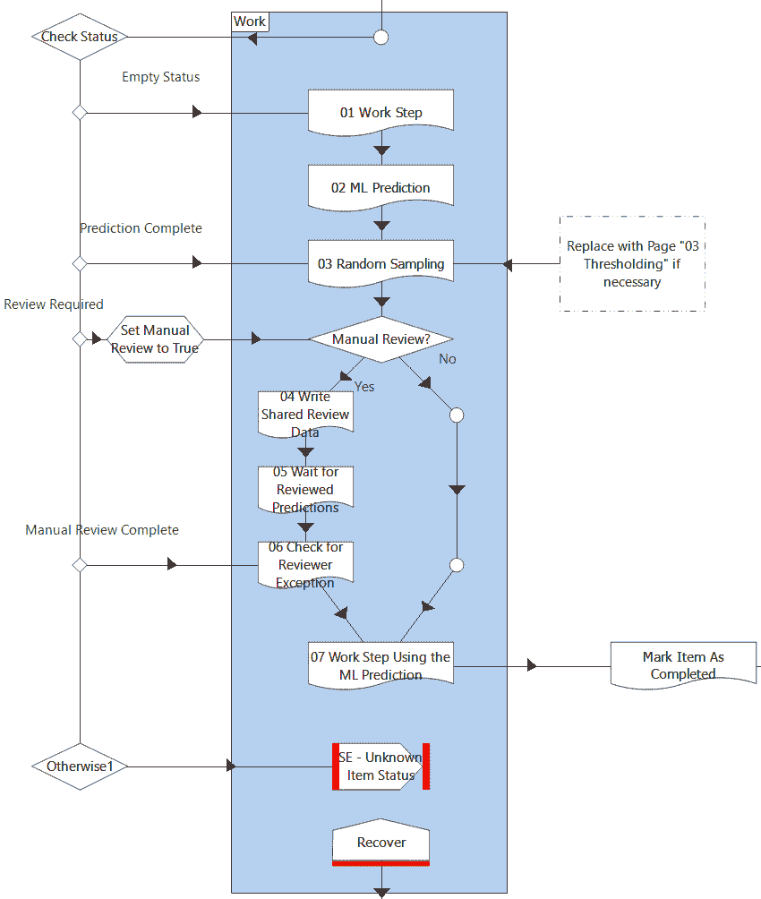

图 7.2 – 同步审查模板主页面上的工作块

#### IA 数据

此页面包含对 IA 逻辑重要的数据项。这里没有需要更改的内容，尽管出于样式原因可以更改初始值。以下列表解释了数据项及其在 IA 模板逻辑中的使用方式：

1.  查看名为 *IA 会话控制* 的块。在 *第六章* 中描述的三个会话变量都存在。这些会话变量使控制器在管理实时 IA 操作时具有更大的灵活性。

1.  查看名为 **手动审查所需标志** 的数据项。此数据项存储是否需要对当前项进行 HITL 审查。

1.  找到名为 *全局[项目数据]字段名称* 的块。此块包含五个数据项。存储在这些数据项中的值是将在当前 `预测` 中添加的 *字段名称*。这意味着 **项目数据.预测** 将在会话运行期间创建。由于不使用“点表示法”来访问这些集合字段，因此可以安全地更改初始值。

1.  查看名为 *全局 ML 状态* 的块。它包含三个数据项，用于存储状态文本。这些状态用于在 **主页面** 上跳过步骤，并简化控制室的管理。

1.  查看 `BE`。此数据项为审阅者提供了一种强制抛出 `BE` 的方式，并且模板将在选中用于工作后标记该项为业务异常。

图 7.3 – 同步审查模板的 IA 页面

#### 启动

已在绿色块的底部添加了两个占位符。可以在那里添加 IA 逻辑。以下列表包含您应更改模板或解释的重要内容的更改：

1.  在页面底部附近找到名为 *已创建共享数据文件夹* 的绿色块。应在此处添加阶段以添加与创建共享文件夹进行 HITL 审查相关的逻辑。

1.  如果未用于异常处理，则删除 *已创建共享数据文件夹* 块。

1.  在名为*加载阈值数据*的绿色块中找到。这是用于加载阈值数据的。如果它是一个 Excel 文件，可以使用**实用工具 - 智能自动化::阈值 Excel 到集合**操作。

1.  如果未用于异常处理，则删除*加载阈值数据*块。

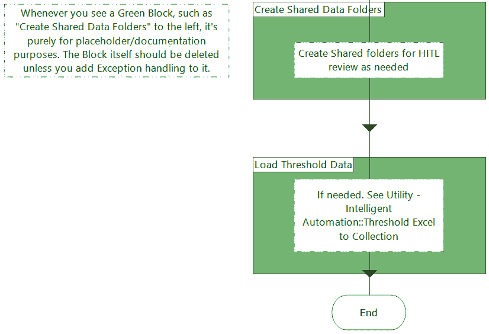

图 7.4 – 同步审查模板启动页面底部

#### 02 机器学习预测

此页面是实际机器学习预测步骤发生的地方，例如调用 API 网络服务或 CLI 程序。以下列表包含您应该对模板进行的更改或对重要内容的解释：

1.  注意到在*启动*之后有一个名为*终止开关*的块。要使用此终止开关，从 BP 的**系统** | **安全** | **凭据**区域创建凭据。确保凭据的权限设置正确。

1.  从**系统** | **进程** | **环境变量**中创建一个新的环境变量，其名称为*步骤 1*中的凭据名称，其值为凭据名称。

1.  将**终止开关凭据名称**数据项的**暴露**更改为**环境**，并选择在*步骤 2*中创建的环境变量。这将导致数据项重命名。

1.  将`获取终止开关凭据`操作更改为使用*步骤 3*中的数据项名称。

图 7.5 – 同步审查模板的 02 机器学习预测页面上的“终止开关”块

1.  在名为*预测*的橙色块中找到名为*Log [模型版本]*的阶段。其目的是记录用于进行预测的机器学习模型的版本。创建一个环境变量，其值为`Text`或`DateTime`模型版本。

1.  将**模型版本**数据项的**暴露**更改为**环境**，并选择在*步骤 5*中创建的环境变量。这将导致数据项重命名。

1.  将*Log [模型版本]*阶段更改为使用*步骤 6*中的环境变量数据项。确保**阶段日志记录**设置为**启用**。

1.  在名为*预测*的橙色块中找到占位符*注意*。将其替换为获取预测所需的实际逻辑。

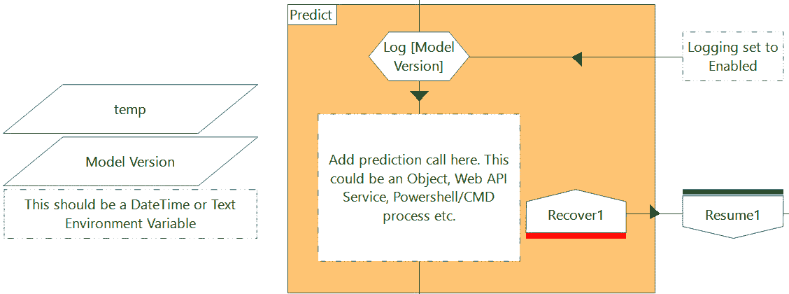

图 7.6 – 同步审查模板的 02 机器学习预测页面上的预测块

1.  编辑名为*设置[预测]和[置信度分数]*的绿色块中的`Multi Calc`阶段。将其更改为将实际预测保存到**预测**数据项中，置信度分数保存到**置信度分数**数据项中。

1.  如果未用于异常处理，则删除*存储预测结果*块。

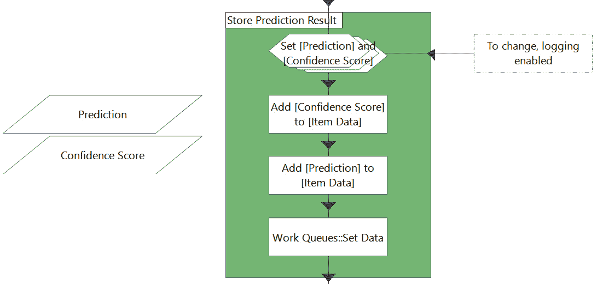

图 7.7 – 同步审查模板的 02 ML 预测页面上的存储预测结果块

1.  找到名为 *可选新 ML 模型评估* 的绿色块，该块连接到 *结束*。您可以将一个调用次级 ML 模型进行评估目的的过程链接到这里。有关如何集成的说明，请参阅 *第六章*，*示例 4*。如果不需要，请删除注释和绿色块。

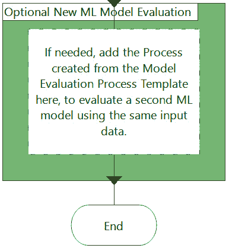

图 7.8 – 同步审查模板的 02 ML 预测页面上的可选新 ML 模型评估块

#### 03 随机抽样

此页面包含确定预测是否需要 HITL 审查的随机抽样逻辑。这可以在 **主页面** 上替换为 **03 阈值**，或完全用自定义逻辑替换。以下列表包含您应该对模板进行的更改或对重要内容的解释：

1.  从 **系统** | **进程** | **环境变量** 创建一个新的环境变量，其值为抽样率。建议使用介于 1 和 100 之间的十进制值。

1.  将 **随机抽样率** 数据项 **曝光** 更改为 **环境**，并选择在 *步骤 1* 中创建的环境变量。这将导致数据项被重命名。

1.  将 *Require Manual Review?* 决策阶段表达式更改为使用在 *步骤 2* 中重命名的数据项。

图 7.9 – 同步审查模板的 03 随机抽样页面

#### 03 阈值

此页面包含确定预测是否需要人工审查的阈值逻辑。如果您想使用 **阈值**，请从 **主页面** 删除 **03 随机抽样** 页面，并用此页面替换。将阈值加载到集合中所需的逻辑应该在 **启动页面** 上执行。只有当您不想使用来自 **实用工具 - 智能自动化** 对象的阈值动作时，才需要更改此页面。

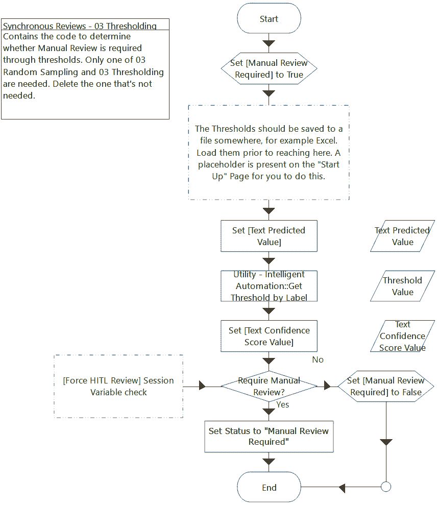

图 7.10 – 同步审查模板的 03 阈值页面

#### 04 编写共享审查数据

此页面应更改以包含创建审查人员所需共享数据的步骤，无论是上传数据到网站、FTP 还是共享文件夹。需要填充两个绿色块以包含您的自定义逻辑。以下列表包含您应该对模板进行的更改或对重要内容的解释：

1.  找到名为*数据创建逻辑*的绿色块，并插入插入所需持久化共享数据的逻辑。无论使用什么方法，都需要某种方式将其连接回工作队列中的**项 ID**。例如，**项 ID**可以是文件名、数据库记录或上传到 API 的字段的一部分。或者，您可以在**项数据**中存储共享位置的唯一标识符，以便以后进行检查。请注意，将原始预测和置信度分数作为评审数据的一部分可能会对评审员产生偏见。

1.  如果没有用于异常处理的用途，请删除*数据创建逻辑*块。

图 7.11 – 同步评审模板中 04 写入共享评审数据页面的“数据创建逻辑”块

1.  找到名为*检查共享数据真实存在性*的绿色块，并插入检查共享数据是否已成功持久化的逻辑。例如，你可以检查文件是否存在于正确的位置。这应该会导致设置`True`或`False`。

1.  如果没有用于异常处理的用途，请删除*检查共享数据真实存在性*块。

图 7.12 – 同步评审模板中 04 写入共享评审数据页面的“检查共享数据真实存在性”块

1.  找到**工作队列::设置数据**前的注释，靠近**结束**。用添加到**项数据**中唯一标识您创建的数据的逻辑替换此注释。这可以是数据库键、URL 或文件路径。这应该用于简化*步骤 3*中所需的逻辑，以验证共享数据是否存在于源处。

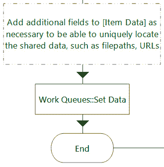

图 7.13 – 同步评审模板结束前的注释

#### 05 等待已评审的预测

对于*同步*评审，我们在继续到下一个队列项之前，想要轮询并等待评审到来。此页面包含检查已完成评审的逻辑，以及将已完成评审读回 BP 的逻辑。请注意，这里引入了一个新的异常类型，**评审员超时**。这个新的异常防止了作为基础 BP 流程模板异常处理逻辑一部分的会话终止。我们需要使用不是*系统异常*的东西，因为根据**标记项为异常**页面中的逻辑，三个连续的*系统异常*将终止会话。以下列表包含您应该对模板进行的更改或对重要内容的解释：

1.  将*轮询循环*块内的注释替换为检查评审是否完成的逻辑。这很可能涉及检查当前项目的**项目 ID**。

1.  使用表示此项目评审是否完成的表达式更改**评审完成？**决策阶段。

1.  从`Number`)允许的 HITL 评审中创建一个新的环境变量。

1.  将**最大超时秒数**数据项的**暴露**改为**环境**，并选择在*步骤 3*中创建的环境变量。这将重命名**最大超时秒数**数据项。

1.  将*继续检查？*决策阶段更改为使用*步骤 4*中重命名的数据项。

1.  注意，如果环境变量超时等待期超过，则会抛出新的异常类型*评审员超时*。

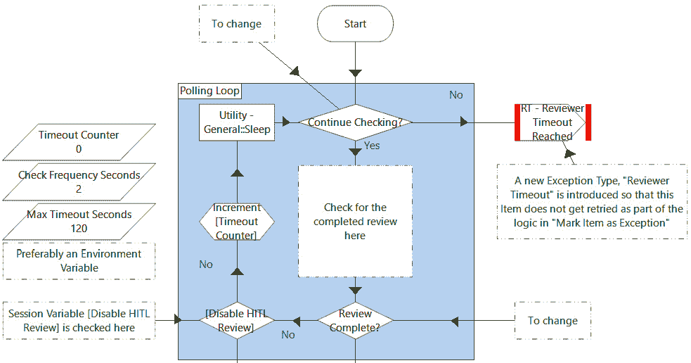

图 7.14 – 同步评审模板中 05 等待评审预测页面上的轮询循环块

1.  在名为*在[项目数据]中存储已评审预测*的绿色块中的*注释*中添加将已评审预测读回 BP 所需的逻辑。这可能是读取文本文件、数据库记录、网页中的文本等。

1.  将*设置[已评审预测]和[评审理由]*多计算阶段更改为将已评审预测值和纠正评审背后的理由保存到相应的数据项**已评审预测**和**评审理由**中。

1.  如果未用于异常处理，则删除*在[项目数据]中存储已评审预测*块。

![图 7.15 – 同步评审模板中 05 等待评审预测页面上的[项目数据]块中的已评审预测](img/B18416_07_15.jpg)

图 7.15 – 同步评审模板中 05 等待评审预测页面上的[项目数据]块中的已评审预测

#### 06 检查评审员异常

此页面检查评审员是否希望将此项目标记为*业务异常*。它检查已评审标签是否等于`BE`，这在`IA 数据`页面中定义。如果检测到`BE`（或标签已更改为何种状态），则会抛出*业务异常*。此页面不需要任何更改。

图 7.16 – 同步评审模板中 06 检查评审员异常页面

#### 07 使用 ML 预测的工作步骤

此页面演示了如何获取最新的预测，以便在会话期间稍后使用。首先，检查是否存在已评审的预测。如果存在，则使用该预测值。如果不存在，则使用原始预测。这些阶段明确设置了日志记录，以便我们可以追踪此项目是使用已评审还是非已评审的预测进行处理的。

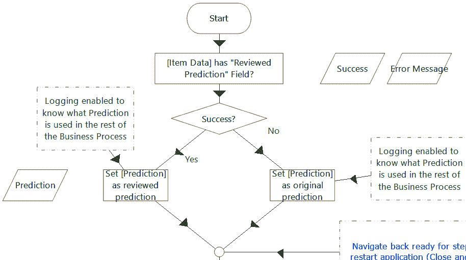

图 7.17 – 使用同步审阅模板的 ML 预测页面在 06 工作步骤上获取最终预测

我们已经完成了对第一个模板的查看，这个模板是用于同步或接近实时审阅的。作为一个高级总结，开发者需要提供以下逻辑：

+   做出生成预测和置信度分数的调用

+   为审阅者创建共享数据以查看

+   检查共享数据是否实际存在

+   检查人工审阅是否已完成

+   将人工审阅的预测读回到 BP

这一切都是针对您场景的特定逻辑。所有通用的 IA 解决方案逻辑都由模板处理。接下来，让我们看看单流程、单工作队列*异步*流程模板。在该模板中会有很多与这个模板相似之处。

## 单流程、单工作队列、异步审阅流程模板

此模板为那些我们不希望停止并等待 HITL 审阅的情况提供了一个*单一*会话解决方案。让我们看看这个*异步*审阅模板的细节，以便您可以在实践中成功实施它。

### 使用 IA 模板 2 – 异步审阅

在本节中，我们将逐页检查需要理解并更改的内容，以便您的 IA 用例得以实施。来自标准流程模板继承的页面和细节将不会讨论。这个模板和前一个模板之间有很多重叠，所以你会看到很多重复的内容。我决定保留这些重复内容，以便作为如何使用模板的完整参考。

以下每个子标题都指的是流程工作室中的一个页面。请打开相应的页面并阅读它，以了解您需要做出哪些更改才能使用此模板。我们将总共查看 11 个页面：

1.  **主页**：在这里，我们需要理解主要的工作步骤，并从工作块中添加/删除页面以满足您的用例。

1.  **IA 数据**：这个页面包含在 IA 解决方案逻辑中使用的 重要数据项。

1.  **启动**：这里有一些占位符区域用于创建审阅的共享数据文件夹，并在需要时从 Excel 加载阈值值。

1.  **02 ML 预测**：在这个页面上，我们需要创建终止开关凭证并修改逻辑以使用该凭证。我们还需要创建一个用于 ML 模型版本的环境变量，以便进行记录。最后，我们需要进行 ML 预测并将预测和置信度分数存储在指定的数据项中。

1.  **03 随机抽样**：如果我们想使用随机抽样来确定预测是否需要审阅，我们应该创建一个环境变量来存储随机抽样百分比，并修改逻辑以使用该环境变量。

1.  **03 阈值**：如果我们想使用阈值，并且我们使用 Excel 存储阈值，我们可以保持此页面不变。否则，您需要在此处添加您的逻辑。

1.  **04 编写共享审核数据**：这里为您提供了添加创建审核数据所需逻辑的占位符。

1.  **05 检查审核员异常**：此页面无需更改。它包含逻辑，如果审核员认为项目不应由自动化处理，则抛出业务异常。

1.  **06 使用 ML 预测的工作步骤**：此页面演示了如何获取已审核预测，以便在流程中进一步使用。根据需要在此处添加额外的阶段。

1.  **将项目推迟至手动审核**：此页面防止需要审核的项目过早地被**获取下一个项目**功能选中。项目推迟是为了防止会话运行进入无限循环。

1.  **检查已审核预测**：添加逻辑以遍历所有待审核的项目，以查看它们是否已被审核。您还需要添加逻辑以将已审核预测保存到指定的 Data Items 中。

在**Ch7 | IA 模板 2 – 异步审核**组中打开**异步审核**流程以开始。在整个流程图中，您会看到绿色块。这些绿色块是为了文档和指导目的而添加到模板中的。请在进行过程中删除绿色块，因为它们可能会影响异常处理。

#### 主页

**主页**包含高级流程图。在*工作*块中添加了四个阶段，以及一个选择阶段，用于控制如果项目重试，则跳过与 IA 相关的阶段。以下列表包含您应该对模板进行的更改或对重要内容的解释：

1.  注意，在每次**获取下一个项目**之前都有对`检查已审核预测`页面的调用。这些检查发生在*工作*块之外。

图 7.18 – 在异步审核模板的主页上检查在获取下一个项目之前的已审核预测

1.  如果您想使用阈值方案来确定预测是否需要人工审核，请定位到*工作*块，并将`03 随机抽样`页面替换为`03 阈值`页面。

1.  双击*检查状态*选择阶段，位于*工作*块左侧。您会看到有三个包含状态的 Data Items，这些状态在 IA 解决方案逻辑中用于跳过阶段。

1.  看一下`将项目推迟至手动审核`页面的位置。如果需要对项目进行人工审核，则该项目将被推迟。在**获取** **下一个项目**之前，会检查所有项目是否已完成审核。

1.  如果需要，在`01 工作步骤`和`02 ML 预测`之间添加更多页面。

1.  如果需要，在`06 使用 ML 预测的工作步骤`页面之后添加更多页面。

1.  更新`队列名称`数据项的值。

图 7.19 – 异步审查模板主页面上的工作块

#### IA 数据

此页面包含对 IA 逻辑重要的数据项。这里没有需要更改的内容，尽管出于样式原因可以更改初始值。以下列表解释了数据项及其在 IA 模板逻辑中的使用方式：

1.  查看名为*IA 会话控制*的块。在*第六章*中描述的三个会话变量存在。这些会话变量使控制器在管理实时 IA 操作时具有更大的灵活性。

1.  查看名为`Flag`的数据项。此数据项存储是否需要对当前项目进行 HITL 审查。

1.  找到名为*全局[项目数据]字段名称*的块。此块包含五个数据项。这些数据项中存储的值是*字段名称*，将被添加到当前**项目数据**中。例如，**预测项目数据字段名称**的初始值为**预测**。这意味着**项目数据.预测**将在会话运行期间创建。更改初始值是安全的，因为“点表示法”不用于访问集合字段。

1.  查看名为*全局机器学习状态*的块。它包含三个数据项，存储状态文本。这些状态用于在`主页面`上跳过页面，并在控制室中简化管理。

1.  查看名为**抛出异常审查文本**的数据项。其初始值设置为**BE**。此数据项为审查员提供了一种强制性地为正在审查的预测抛出**B**usiness **E**xception 的方式。审查员需要将“已审查预测”标签设置为**BE**，一旦模板被选中进行工作，该条目将被标记为业务异常。

#### 启动

在`启动`页面底部的绿色块中有两个占位符。以下列表包含您应该对模板进行的更改或对重要内容的解释：

1.  在页面底部附近找到名为*创建共享数据文件夹*的绿色块。此块旨在存放与创建共享文件夹进行 HITL 审查相关的逻辑。

1.  如果没有用于异常处理的用途，请删除*创建共享数据文件夹*块。

1.  找到名为*加载阈值数据*的绿色块。此块用于加载阈值数据。如果是 Excel 文件，可以使用**实用工具 - 智能自动化::阈值 Excel 到集合**操作。

1.  如果没有用于异常处理的用途，请删除*加载阈值数据*块。

#### 02 机器学习预测

此页面是实际机器学习预测步骤（如调用 API Web 服务或 CLI 程序）应发生的地方。以下列表包含您应该对模板进行的更改或对重要内容的解释：

1.  注意到在*开始*之后有一个*关闭开关*块。要使用此关闭开关，请从 BP 的**系统** | **安全** | **凭据**区域创建凭据。在凭据上设置适当的权限。

1.  从**系统** | **进程** | **环境变量**创建一个新的环境变量，其值为*步骤 1*中的凭据名称。

1.  将**关闭开关凭据名称**数据项的**曝光度**更改为**环境**，并选择在*步骤 2*中创建的环境变量。这将导致数据项重命名。

1.  将**获取关闭开关凭据**操作更改为使用*步骤 3*中的数据项名称。

1.  在名为*预测*的橙色块中找到名为*记录[模型版本]*的阶段。其目的是记录用于进行预测的机器学习模型的版本。从`文本`或`日期时间`模型版本创建一个环境变量，将其值作为其值。

1.  将**模型版本**数据项的曝光度更改为**环境**，并选择在*步骤 5*中创建的环境变量。这将导致数据项重命名。

1.  将*记录[模型版本]*阶段更改为使用*步骤 6*中的环境变量数据项。确保**阶段日志记录**设置为**启用**。

1.  在名为*预测*的橙色块中找到占位符*注释*。将其替换为获取预测所需的实际逻辑。

1.  编辑名为*设置[预测]和[置信度分数]*的多重计算阶段，位于名为*存储预测结果*的绿色块中。将其更改为实际预测保存到**预测**数据项，置信度分数保存到**置信度分数**数据项。

1.  如果未用于异常处理，则删除*存储预测结果*块。

1.  找到名为*可选新机器学习模型评估*的绿色块，该块连接到*结束*。您可以在此处链接一个进程，用于评估目的调用二级机器学习模型。有关如何集成的说明，请参阅*第六章*，*示例 4*。如果不需要，删除*注释*并将其绿色块化。

#### 03 随机采样

本页包含确定预测是否需要 HITL 审查的随机采样逻辑。这可以在`主页面`的`03 阈值`部分替换，或完全用自定义逻辑替换。以下列表包含您应该对模板进行的更改或对重要内容的解释：

1.  从**系统** | **进程** | **环境变量**创建一个新的环境变量，其值为采样率。建议使用介于 1 和 100 之间的十进制值。

1.  将**随机采样率**数据项的**曝光度**更改为**环境**，并选择在*步骤 1*中创建的环境变量。此数据项将被重命名。

1.  将*是否需要手动审查？*决策阶段表达式更改为使用在*步骤 2*中重命名的数据项。

#### 03 阈值

此页面包含确定预测是否需要人工审阅的阈值逻辑。如果你想使用阈值，请从`Main Page`中删除`03 Random Sampling`页面，并用这个页面替换它。将阈值加载到集合中所需的逻辑应该在`Start Up`页面执行。只有当你不想使用**Utility - Intelligent Automation**对象中可用的阈值动作时，才需要对此页面进行更改。

#### 04 编写共享审阅数据

此页面应修改为包含创建审阅者所需共享数据的步骤，无论是上传数据到网站、FTP、共享文件夹等。有两个绿色块需要填充你的自定义逻辑。以下列表包含你应该对模板进行的更改或对重要内容的解释：

1.  找到名为*Data Creation Logic*的绿色块，并插入持久化审阅者所需共享数据的逻辑。无论使用什么方法，都需要某种方式将其连接回工作队列中的**Item ID**。例如，**Item ID**可以是文件名、数据库记录或上传到 API 的字段的一部分。或者，你可以在**Item Data**中存储共享位置的唯一标识符，以便以后进行检查。请注意，将原始预测和置信度分数作为审阅数据的一部分可能会对审阅者产生偏见。

1.  如果没有用于异常处理的用途，请删除*Data Creation Logic*块。

1.  找到名为*Check for Real Presence of Shared Data*的绿色块，并插入检查共享数据是否已成功持久化的逻辑。例如，你可以检查文件是否存在于正确的位置。这应该会导致设置`True`或`False`。

1.  如果没有用于异常处理的用途，请删除*Check for Real Presence of Shared Data*块。

1.  在**Work Queues::Set Data**之前找到*Note*，靠近*End*。将这个*Note*替换为逻辑，以便在**Item Data**中添加唯一标识你创建的数据的字段。这可以是一个数据库键、一个 URL 或一个文件路径。这应该用于简化*步骤 3*中所需的逻辑，以验证共享数据是否存在于源处。

#### 05 检查审阅者异常

此页面检查审阅者是否希望将此项目标记为*业务异常*。它检查审阅的标签是否等于`IA Data`页面。如果检测到**BE**（或标签已被更改为何种名称），则会抛出*业务异常*。此页面不需要任何更改。

#### 06 使用 ML 预测的工作步骤

本页展示了如何获取最新的预测结果，以便在会话期间进一步使用。首先，检查是否存在已审查的预测。如果存在，则使用该预测值。如果不存在，则使用原始预测值。这些阶段明确设置了日志记录，以便我们可以追踪此项目是使用已审查的预测还是非审查的预测进行处理的。

#### 暂缓项目以进行人工审查

确定项目需要 HITL 审查后，需要暂缓该项目，以便审阅者有足够的时间采取行动。将`暂缓时间`数据项更改为适当的暂缓时间。想象一下队列中只有一个项目。暂缓时间需要设置得足够高，以免在单个会话运行中连续两次被选中；否则，会导致无限循环。

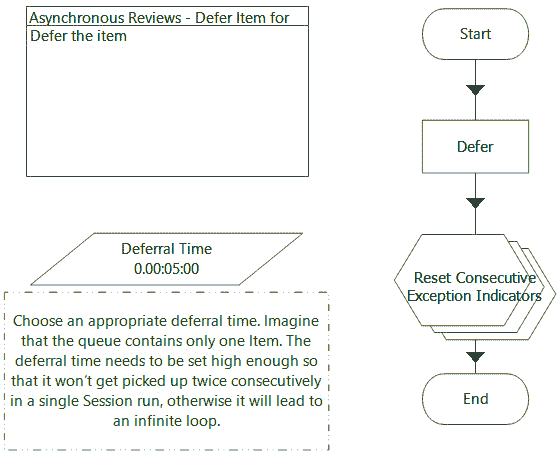

图 7.20 – 异步审查模板的暂缓项目以进行人工审查页面

#### 检查已审查预测

本页是同步和异步模板之间的主要区别。在这个异步模板中，此页在调用**获取下一个项目**之前，在*工作*块外部被调用。这允许其他项目在等待预测被审查的同时继续工作。下一个主要区别是我们必须对*所有待审查的项目*进行检查，而不是对当前项目进行检查。当前项目不存在，因为我们已经处于*工作*块外部。以下列表包含您应该对模板进行的更改或对重要内容的解释：

1.  用逻辑替换链接到*开始*的*备注*，以检索需要检查的所有记录。这可能是由数据库查询检索所有待审查的项目，或者获取预期存储完成审查内容的网络文件夹的内容。要检查的项目列表应保存在**所有待完成审查的项目**集合中。

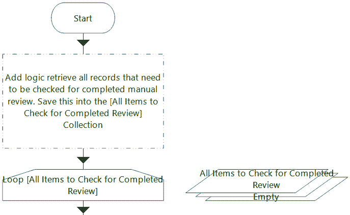

图 7.21 – 异步审查模板的检查已审查预测页面开始部分

1.  在循环内找到名为*设置[要检查的项目 ID]*的计算阶段。更改表达式，以便将我们正在检查的项目 ID 保存到`要检查的项目 ID`数据项中。

![图 7.22 – 更改设置[要检查的项目 ID]计算阶段](img/B18416_07_22.jpg)

图 7.22 – 更改设置[要检查的项目 ID]计算阶段

1.  用逻辑替换名为*检查完成审查*的块内的*备注*，以检查项目是否已完成审查。请注意，在此块中发生的任何异常都被屏蔽，以防止进程终止。

1.  在蓝色的*检查已完成审阅*块之后找到名为*Review Complete?*的决策阶段。将表达式替换为指示此项目的审阅是否完成的表达式。

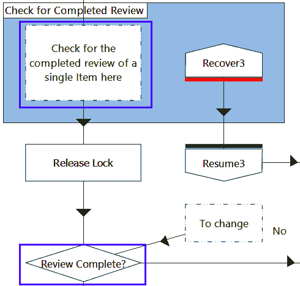

图 7.23 – 确定此项目的审阅是否完成

1.  将绿色块*在[数据]中存储已审阅预测*中的*注意*替换为将审阅预测读回到 BP 所需的逻辑。这可能包括读取文本文件、数据库记录、网页中的文本等。

1.  将*设置[已审阅预测]和[审阅理由]*多计算阶段更改为将审阅预测值和修正审阅背后的推理保存到各自的数据项中，即`已审阅预测`和`审阅理由`。

1.  如果未用于异常处理，则删除*在[数据]中存储已审阅预测*块。

![图 7.24 – 异步审阅模板中检查审阅预测页面上的[数据]块中存储的已审阅预测](img/B18416_07_24.jpg)

图 7.24 – 异步审阅模板中检查审阅预测页面上的[数据]块中存储的已审阅预测

我们已经完成了对第二个模板的查看。两个单流程、单工作队列模板之间的差异在以下表格中突出显示。

| **同步模板** **页面名称** | **异步模板** **页面名称** | **差异** |
| --- | --- | --- |
| `主页面` | `主页面` | 同步模板等待*当前*项目的预测审阅（如果需要）*在*工作*块内。异步模板在每个**获取下一个项目**之前检查*所有*项目的已审阅预测，*在*工作*块外。使用推迟。 |
| `IA 数据` | `IA 数据` | 无。 |
| `启动` | `启动` | 无。 |
| `02` `ML 预测` | `02` `ML 预测` | 无。 |
| `03` `随机抽样` | `03` `随机抽样` | 无。 |
| `03 阈值化` | `03 阈值化` | 无。 |
| `04 编写共享` `审阅数据` | `04 编写共享` `审阅数据` | 无。 |
| `05 等待` `已审阅预测` | `检查` `已审阅预测` | 异步模板必须循环通过多个项目。这发生在主*工作*块之外。同步版本仅在*工作*块内检查当前项目。 |
| `06 检查` `审阅者异常` | `05 检查` `审阅者异常` | 无。尽管编号不同，页面逻辑是相同的。 |
| `07 使用` `ML 预测` `工作步骤` | `06 使用` `ML 预测` `工作步骤` | 无。尽管编号不同，页面逻辑是相同的。 |
| N/A | `将项目` `推迟至手动审阅` | 只有异步模板有这个功能。当需要审阅时，使用推迟以防止**获取下一个项目**操作过于迅速，从而进入无限循环。 |

表 7.1 – 单进程、单工作队列模板之间的差异

接下来，让我们看看我们的最终模板，它被分为三个 BP 流程。

## 三进程、三工作队列、异步审查流程模板

我们的第三个模板是最复杂的，因为它被分为三个流程。第一个流程包含我们期望从传统 RPA 中得到的标准业务逻辑。在需要做出机器学习预测之前，数据被推入第二个工作队列，并且流程 1 中的项目执行被暂停。

第二个流程生成机器学习预测并确定是否需要 HITL 审查。如果需要审查，数据将被推入第三个工作队列。如果不需审查，队列 1 中的等效项目将被允许在流程 1 中继续自动化处理。

第三个流程创建共享审查数据并检查已完成审查。一旦项目成功审查，队列 1 中其等效项目将被允许在流程 1 中继续自动化处理。

整个模板是异步的，因为它被分为三个部分。这是我默认选择的新 IA 解决方案模板，除非有对会话数量的具体限制，或者有同步审查的需求。现在，让我们逐个查看每个“子模板”。

### 使用 IA 模板 3 – 01 – 业务逻辑

此流程与原始 BP 流程模板非常相似。让我们逐页查看差异。以下每个子标题都指的是流程工作室中的一个页面。请打开相应的页面并阅读，以了解您需要做出哪些更改才能使用此模板。我们将在第一个子模板中查看六个页面：

1.  `主页面`：添加和删除工作块中的页面以满足您的用例。**获取下一个项目**已添加标签过滤器，以防止等待机器学习预测和机器学习审查的项目被处理。

1.  `IA 数据`：此页面包含在 IA 解决方案逻辑中使用的 重要数据项。

1.  `02 推送至队列 2`：此页面包含将项目添加到工作队列 2 以进行机器学习预测的逻辑。它还会标记当前项目，以防止其被**获取下一个项目**操作选中。

1.  `03 检查审查员异常`：此页面无需更改。它包含逻辑，如果审查员认为项目不应该由自动化处理，则抛出业务异常。

1.  `04 使用机器学习预测的工作步骤`：此页面展示了如何获取已审查的预测，以便在流程中进一步使用。如有需要，请在此处添加额外的阶段。

1.  `解锁项目`：此页面解锁当前项目，以便在移除其标签后，**获取下一个项目**可以将其取走以进行进一步处理。

打开`主页面`。

#### 主页面

与标准流程模板相比，`主页`的一个主要变化是**获取下一项**阶段设置了*标签过滤器*。在*工作*块内部，在我们的工作步骤之后有一个页面将当前项推送到*工作队列 2*进行 ML 预测。我们还有一个页面检查审阅者是否想要为此项抛出业务异常。可以使用选择阶段跳过步骤，该阶段检查与 IA 相关的项状态。以下列表包含您应该对模板进行的更改或对重要内容的解释：

1.  双击每个**获取下一项**操作。可以看到有*标签过滤器*可以过滤掉等待 ML 预测或手动审查的项。

1.  注意到在*工作*块内部有一个名为`02 推送到队列 2`的页面，该页面链接到`解锁项`页面。在当前项被推送到队列 2 进行 ML 预测后，它会被标记并放回队列。这个标记防止它在 ML 预测完成前被**获取下一项**操作选中。

1.  定位到`03 检查审阅者异常`页面。此页面用于检查审阅者是否想要抛出业务异常。

1.  双击*工作*块左侧的*检查状态*选择阶段。可以看到我们可以根据项的状态跳过执行页面。

1.  修改包含队列名称**队列名称**和**队列名称 2**的数据项的值。

1.  如果需要，在`01 工作步骤`和`02 ML 预测`之间添加更多页面。

1.  如果需要，在`04 使用 ML 预测的工作步骤`之后添加更多页面。

#### IA 数据

此页面包含对 IA 逻辑重要的数据项。这里没有需要更改的内容，尽管出于样式原因可以更改初始值。如果更改，数据项*必须在其他两个模板中也有相应的更改*。这是为了在整个三个模板中保持**项数据**字段名称、状态和标签的一致性。以下列表解释了数据项及其在 IA 模板逻辑中的使用方式：

1.  找到名为*全局[项数据]字段名称*的块。此块包含四个数据项。存储在这些数据项中的值是将在当前**项数据**中添加的*字段名称*。例如，**预测项数据字段名称**的初始值为**预测**。这意味着**项数据.预测**将在会话运行期间创建。**队列 1 项 ID 项数据字段名称**的初始值为**队列 1 项 ID**。这意味着*队列 2*的项数据将有一个名为**项数据.队列 1 项 ID**的字段。由于“点符号”不用于访问集合字段，因此可以安全地更改初始值。

1.  查看全局 ML 状态块。它包含两个数据项，用于存储状态文本。这些状态用于在主页上跳过步骤和在控制室中简化管理。

1.  查看名为 *Global ML Tags* 的块。它包含两个数据项，用于存储标签文本。这些标签可以防止使用 **Get Next Item** 获取项目。

1.  查看名为 **Throw Exception Review Text** 的数据项。其初始值设置为 **BE**。此数据项为审阅者提供了一种强制抛出业务异常的方法，以便对正在审阅的预测进行审查。审阅者需要将“审阅预测”标签设置为 **BE**，一旦被选中进行工作，模板将标记该项目为业务异常。

#### 02 推送到 Queue 2

此页面将创建预测所需的数据输入到集合中，并将该集合作为项目数据提交到 *Queue 2*。它还标记当前项目，以确保在机器学习预测完成之前不会被 **Get Next Item** 拾取。以下列表包含您应该对模板进行的更改或对重要内容的解释：

1.  将绿色块中的 *Note* 阶段替换为填充 **Queue 2 Item Data** 集合的逻辑。此集合应包含进行机器学习预测所需的输入数据。

1.  在绿色块中查看我们如何在 *Queue 2 Item Data* 集合中添加 *Queue 1* 的当前 **Item ID**。这为 *Process 2* 和 *Queue 2* 提供了对 *Queue 1* 中等效项目的引用。

1.  如果没有用于异常处理的用途，请删除名为 *Build Queue 2 Item Data* 的绿色块。

1.  查看我们如何使用 **Add Tag “Waiting ML Prediction”** 动作将当前项目标记为 **Waiting ML Prediction**。

1.  查看我们如何将 *Queue 2* 的项目 ID 保存到 *Queue 1* 的 `Item Data` 中。这为 *Process 1* 和 *Queue 1* 提供了对 *Queue 2* 中等效项目的引用。

#### 03 检查审阅者异常

此页面检查审阅者是否希望将此项目标记为 *Business Exception*。它检查审阅的标签是否等于 `IA Data` 页面。如果检测到 **BE**（或标签已更改为何种状态），则会抛出 *Business Exception*。此页面不需要任何更改。

#### 04 使用 ML 预测的工作步骤

此页面演示了如何获取最新的预测，以便在会话期间进一步使用。首先，检查是否存在已审阅的预测。如果存在，则使用该预测值。如果不存在，则使用原始预测。这些阶段明确设置了日志记录，以便我们可以追踪此项目是使用审阅还是非审阅预测进行处理的。

#### 解锁项目

此页面解锁当前项目，以便将其放回队列中。此页面不需要任何更改。当前项目在其标签被删除之前不会再次被拾取。

现在，让我们看看 *Process 2* 的模板。

### 使用 IA 模板 3 – 02 – ML Prediction

此流程执行生成机器学习预测的步骤，并通过随机抽样或阈值确定是否需要人工审查。如果需要，它将被推入 *队列 3*。如果不需，则 *队列 1* 中的对应项目将被取消标记，以便继续处理。

以下每个小节标题都指的是流程工作室中的一个页面。请打开相应的页面并阅读它，以了解您需要进行的更改以使用此模板。我们将总共查看八个页面：

1.  **主页面**：在此处了解此流程的高级步骤；如果需要，可以在此处更换审查标准。

1.  **IA 数据**：此页面包含在 IA 解决方案逻辑中使用的 重要数据项。

1.  **启动**：如果使用阈值处理，此处有一个占位符来从 Excel 加载阈值值。

1.  **01 机器学习预测**：在此页面，我们需要创建终止开关凭据并修改逻辑以使用该凭据。我们还需要创建一个环境变量来记录机器学习模型版本。最后，我们需要进行机器学习预测并将预测和置信度分数存储在指定的数据项中。

1.  **02 随机抽样**：如果我们想使用随机抽样来确定是否需要对预测进行审查，我们应该创建一个环境变量来存储随机抽样百分比，并修改逻辑以使用该环境变量。

1.  **02 阈值处理**：如果我们想使用阈值处理，并且使用 Excel 存储阈值，我们可以保持此页面不变。否则，您需要在此处添加您的逻辑。

1.  **03a 更新队列 1 项目**：此页面包含更新等效 *队列 1* 项目的状态、标签和项目数据的固定逻辑。

1.  **03b 将数据推入队列 3 并更新队列 1 项目**：当需要 HITL 审查时，此页面将数据推入 *队列 3*，并更新等效 *队列 1* 项目的状态、标签和项目数据。

打开 `Ch7` | `IA 模板 3 – 3 流程 3 队列` 文件夹以开始，并导航到**主页面**。

#### 主页面

**主页面**上的此 *工作* 块包含四个页面和一个决策阶段。在**获取下一个项目**中不使用标签过滤器，也不使用项目解锁或延期。以下列表包含您应更改模板或解释的重要内容的更改：

1.  查看工作块中的**01 机器学习预测**页面。此页面包含进行机器学习预测的逻辑。

1.  查看**02 随机抽样**页面。如果您想使用阈值方案来确定是否需要对预测进行人工审查，请将其替换为**02 阈值处理**。

1.  双击左侧 *工作* 块中的 *跳过步骤？* 选择阶段。您会看到一个状态，**预测完成**，我们可以用它来跳过 *工作* 块中的阶段。

1.  更改包含队列名称**队列名称**、**队列名称 2**和**队列名称 3**的三个数据项的值。

1.  请注意，除非标记为异常，否则所有项目都会被标记为已完成。

#### IA 数据

此页面是一个包含对 IA 逻辑重要的数据项的中心位置。这里不需要更改，尽管可以更改初始值以改变样式。如果更改，*必须也在其他两个模板**IA 数据**页面的等效数据项中进行更改*。这是为了在整个三个模板中保持一致的**项目数据**字段名称、状态和标签。以下列表解释了数据项及其在 IA 模板逻辑中的使用方式：

1.  请注意，存在一个会话变量，**强制 HITL 审查**，可以强制所有经过预测的项目也进行人工审查。

1.  *全局所有队列的[项目数据]字段名称*块包含四个数据项。这些数据项中存储的值是将在当前**项目数据**中添加的*字段名称*。例如，**预测项目数据字段名称**的初始值为**预测**。这意味着**项目数据.预测**将在会话运行期间创建。*队列 2 项目 ID 项目数据字段名称*的初始值为**队列 2 项目 ID**。此文本将作为字段添加到推送到*队列 3*的数据中。

1.  请注意，*全局机器学习状态*块包含三个数据项，用于存储状态文本。这些状态用于在`主页面`上跳过步骤以及在控制室中简化管理。

1.  请注意，*全局机器学习标签*块包含两个数据项，用于存储标签文本。这些标签控制是否可以使用**获取下一个项目**在*队列 1*中检索项目。

#### 启动

此页面有一个占位符，您可以在其中添加逻辑将阈值数据加载到 BP 中：

1.  找到名为*加载阈值数据*的绿色块。这是用于加载阈值数据的。如果它是一个 Excel 文件，可以使用**实用工具 - 智能自动化::阈值 Excel 到集合**操作。

1.  如果未用于异常处理，请删除*加载阈值数据*块。

#### 01 机器学习预测

此页面是实际机器学习预测步骤（如调用 API Web 服务或 CLI 程序）应发生的地方。以下列表包含您应更改模板或解释的重要内容的更改：

1.  请注意，在*启动*之后有一个*终止开关*块。要使用此终止开关，请从 BP 的**系统** | **安全** | **凭据**区域创建凭据。在凭据上设置适当的权限。

1.  从**系统** | **进程** | **环境变量**创建一个新的环境变量，其值为*步骤 1*中的凭据名称。

1.  将**终止开关凭据名称**数据项的**暴露**设置为**环境**，并选择在*步骤 2*中创建的环境变量。这会导致数据项被重命名。

1.  将**获取关闭开关凭证**操作更改为使用*步骤 3*中的数据项名称。

1.  在名为*预测*的橙色块中找到名为*Log [模型版本]*的阶段。其目的是记录正在使用哪个版本的机器学习模型进行预测。从`文本`或`日期时间`模型版本创建一个环境变量作为其值。

1.  将`模型版本`数据项的**曝光**更改为**环境**，并选择在*步骤 5*中创建的环境变量。这将导致数据项被重命名。

1.  将*Log [模型版本]*阶段更改为使用*步骤 6*中的环境变量数据项。确保**阶段日志记录**设置为**启用**。

1.  在名为*预测*的橙色块中找到占位符*注释*。用实际需要的逻辑替换它以获得预测。

1.  编辑名为*存储预测结果*的绿色块中的多计算阶段*设置[预测]和[置信度分数]*。将其更改为实际预测保存在`预测`数据项中，置信度分数保存在`置信度分数`数据项中。

1.  如果没有用于异常处理的用途，请删除*存储预测结果*块。

1.  在名为*可选新机器学习模型评估*的绿色块中找到连接到*结束*的绿色块。您可以将一个进程链接到这里，以便用于评估目的的二级机器学习模型。有关如何集成的说明，请参阅*第六章*，*示例 4*。如果不需要，请删除注释和绿色块。

#### 02 随机采样

本页包含确定预测是否需要 HITL 审查的随机采样逻辑。这可以在**主页面**上替换为**02 阈值处理**，或者完全用自定义逻辑替换。以下列表包含您应该对模板进行的更改或对重要内容的解释：

1.  从**系统** | **进程** | **环境变量**创建一个新的环境变量，其值为采样率。建议使用介于 1 和 100 之间的十进制值。

1.  将`随机采样率`数据项**曝光**更改为**环境**，并选择在*步骤 1*中创建的环境变量。此数据项将被重命名。

1.  将*是否需要手动审查？*决策阶段表达式更改为使用*步骤 2*中重命名的数据项。

#### 02 阈值处理

本页包含确定预测是否需要人工审查的阈值逻辑。如果您想使用阈值，请从**主页面**中删除**02 随机采样**页面，并用这个页面替换它。将阈值加载到集合中的逻辑应该在**启动页面**上执行。如果不想使用**实用工具 - 智能自动化**对象中可用的阈值操作，则不需要对页面进行更改。

#### 03a 更新队列 1 项

仅当不需要人工审查预测时，此页才会执行。首先，锁定 *Queue 1* 的项目，并将预测和置信度分数添加到其项目数据中。然后，更新其状态为 **无需手动审查**。移除 **等待机器学习预测** 标签，允许 *Process 1* 通过 **获取下一个项目** 再次拾取它。此页无需任何更改。

如果此页未运行，则将运行 **03b 推送到队列 3**。

#### 03b 推送到队列 3 并更新队列 1 项目

此页包含将创建可审查预测所需的输入数据添加到集合中的逻辑。然后，将集合推送到 *Queue 3*。它还更新 *Queue 1* 中等效项目的数据，包括预测结果，并更新项目的状态以指示它需要 HITL 审查。以下列表包含您应更改模板或解释的重要内容的更改：

1.  将绿色块名为 *Build Queue 3 Item Data* 中的 *Note* 阶段替换为填充 `Queue 3 Item Data` 集合的逻辑。此集合应包含创建可审查预测所需的输入数据。

1.  查看名为 *Build Queue 3 Item Data* 的绿色块中的阶段。注意我们将当前 (*Queue 2* 的) `Item ID` 添加到添加到 *Queue 3* 的 `Queue 3 Item Data` 集合中。这是为了可追溯性。通过 `Queue 3 Item Data`，`Queue 1* 的 Item ID 已经有一个副本。

1.  如果未用于异常处理，则删除名为 *Build Queue 3 Item Data* 的绿色块。

1.  找到 **将 Queue 3 Item ID 添加到 [Queue 1 Item Data]** 操作。此操作，直到 **Work Queue::Set Data** 操作，用于更新 *Queue 1* 中的等效项目，包括置信度分数和预测。

1.  找到 **将 Queue 1 的状态更新为“手动审查所需”** 操作。此操作和接下来的两个操作将 *Queue 1* 的项目状态更改为 **手动审查所需**，移除 **等待机器学习预测** 标签，并添加 **手动审查** **所需** 标签。

接下来，让我们看看最终的模板，该模板用于创建审查数据并检查完成的审查。

### 使用 IA 模板 3 – 03 – HITL 审查

此第三个也是最后一个流程模板包含创建共享审查数据记录和检查已审查预测的逻辑。如果审查未完成，则将项目推迟。如果审查完成，则更新 *Queue 1* 的项目，以便它可以继续处理。以下每个子标题都指的是流程工作室中的一个页面。请打开相应的页面并阅读它，以了解您需要进行的更改。我们将总共查看六个页面：

1.  **主页面**: 理解高级流程步骤并更新包含队列名称的数据项的值。

1.  **IA 数据**: 本页包含在 IA 解决方案逻辑中使用的 重要数据项。

1.  **启动**：此页面有一个占位符区域，如果需要，可以创建用于审查的共享数据文件夹。

1.  **01 编写共享审查数据**：这里提供了占位符，您可以添加创建审查数据所需的逻辑。

1.  **02 检查已审查的预测**：添加逻辑以检查项目是否已审查。您还需要添加逻辑以将已审查的预测保存到指定的数据项中。

1.  **推迟**：选择合适的推迟时间，如果项目尚未审查，则推迟项目。

在**Ch7 |** **IA 模板 3 – 3 过程 3 队列**组中打开**03 – HITL 审查**过程以开始。导航到**主页**。

#### 主页

`队列名称`和`队列名称 3`数据项值。

#### IA 数据

此页面是一个中心位置，包含对 IA 逻辑重要的数据项。这里不需要更改，尽管初始值可以更改以适应风格原因。如果更改，其他两个模板的`IA 数据`页面中的数据项*也必须更改其等效项*。这是为了在整个三个模板中保持一致的`项目数据`字段名称、状态和标签。以下列表解释了数据项及其在 IA 模板逻辑中的使用方式：

1.  定位到页面底部的*IA 会话控制*块。这里有两个会话变量。`禁用 HITL 审查`用于禁用 HITL 审查要求，而`强制创建审查数据`强制项目重新创建其审查数据。

1.  *全局所有队列的[项目数据]字段名称*块包含四个数据项。这些数据项中存储的值是*字段名称*，将被添加到当前的`项目数据`中。例如，`已审查预测项目数据字段名称`的初始值为`Item Data.Reviewed Prediction`将在会话运行期间创建。

1.  请注意，*全局机器学习状态*块包含一个存储状态文本的数据项。此状态用于跳过*过程 1*和*队列 1*的主页上的步骤，并简化控制室的管理。

1.  请注意，*全局机器学习标签*块包含一个存储标签文本的数据项。此标签控制是否可以使用**获取下一个项目**在*过程 1*、*队列 1*中检索项目。

#### 启动

此页面在绿色块中有一个占位符，可以添加创建用于审查的共享文件夹的逻辑：

1.  定位到页面底部的绿色块*已创建的共享数据文件夹*。如果需要，这里应包含有关创建 HITL 审查所需共享文件夹的逻辑。

1.  如果未用于异常处理，则删除*已创建的共享数据文件夹*块。

#### 01 编写共享审查数据

此页面包含创建审查所需共享数据的步骤，无论是上传数据到网站、FTP、共享文件夹等。有两个绿色块需要填充您的自定义逻辑。以下列表包含您应该对模板进行的更改或对重要内容的解释：

1.  找到名为 *数据创建逻辑* 的绿色块，并插入持久化审查者所需共享数据的逻辑。无论使用哪种方法，都需要某种方式将其连接回工作队列中的`Item ID`。例如，`Item ID`可以是文件名、数据库记录或上传到 API 的字段的一部分。或者，您可以在`Item Data`中存储共享位置的唯一标识符，以便以后进行检查。请注意，将原始预测和置信度分数作为审查数据的一部分可能会对审查者产生偏见。如果您想向审查者提供原始预测标签和置信度分数，请向`IA 数据`页面上的 *全局[所有队列的项数据字段名称]* 块添加两个新的数据项以引用这些字段。

1.  如果未用于异常处理，则删除 *数据创建逻辑* 块。

1.  找到名为 *检查共享数据真实存在性* 的绿色块，并插入检查共享数据是否已成功持久化的逻辑。例如，您可以检查文件是否位于正确的位置。这将导致将`Shared Data Found?`数据项设置为`True`或`False`。

1.  如果未用于异常处理，则删除 *检查共享数据真实存在性* 块。

1.  找到`Item Data`之前的注释。这可能是一个数据库键、URL 或文件路径。这应用于简化*步骤 3*中所需的逻辑，以验证共享数据是否存在于源处。

#### 02 检查已审查预测

此页面检查当前项是否已审查。如果审查已完成，它将读取修订后的预测及其理由，并更新等效的 *队列 1* 项，以便继续处理。以下列表包含您应该对模板进行的更改或对重要内容的解释：

1.  将*[禁用 HITL 审查]*决策阶段之后的绿色 *注意* 阶段替换为检查此项是否已审查所需的步骤。这可能会涉及检查当前项的`Item ID`。

1.  将 *审查完成?* 决策阶段更改为表示此项审查是否完成的表达式。

1.  找到名为 *将已审查预测存储在[项数据]* 的绿色块，并添加将审查的预测读回到 BP 所需的逻辑。这可能包括读取文本文件、数据库记录、网页中的文本等。

1.  将 *设置[已审查预测]和[审查理由]* 多计算阶段更改，以便将审查的预测值和修正审查背后的推理保存在各自的数据项中，即`已审查预测`和`审查理由`。

1.  如果未用于异常处理，则删除 *将已审查预测存储在[项数据]* 块。

1.  找到**将[已审查预测]添加到[队列 1 项目数据]**操作。如果项目已成功审查，则执行此操作和接下来的两个操作。它们将审查预测和理由更新到队列 1 中等效的项目。

1.  找到**将队列 1 的状态更新为“手动审查完成”**操作。这个操作和下一个操作用于将队列 1 的项目状态更新为**手动审查完成**并移除**手动审查所需**标签。这允许队列 1 的项目继续其自动化流程。

#### 延迟

如果项目尚未审查，则将其延迟，以便审阅者有足够的时间采取行动。将 `延迟时间` 数据项更改为适当的延迟时间。想象一下队列中只有一个项目。延迟时间需要设置得足够高，以免在单个会话运行中连续两次被选中；否则，会导致无限循环。

我们已经完成了对构成最终模板的三个流程的审查。为了巩固我们所看到的，并进一步了解三个子模板之间是如何相互作用的，我提供了 `IA 数据` 页面的摘要。这将使您能够看到每个子模板中使用的哪些状态、标签和 `项目数据` 字段。

### 三进程模板的 IA 数据摘要

Y/N 表值表示数据项是否出现在模板的 `IA 数据` 页面上。

#### 项目数据字段名称

| **数据项名称** | **初始值** | **01 –** **业务逻辑** | **02 –** **机器学习预测** | **03 –** **HITL 审查** |
| --- | --- | --- | --- | --- |
| 预测项目数据字段名称 | 预测 | Y | Y | N* |
| 置信度项目数据字段名称 | 置信度 | N | Y | N* |
| 已审查预测项目数据字段名称 | 已审查预测 | Y | N | Y |
| 审查理由 | 审查理由 | N | N | Y |
| 审查数据创建项目数据字段 | 审查数据创建 | N | N | Y |
| 队列 1 项目 ID 项目数据字段名称 | 队列 1 项目 ID | Y | Y | Y |
| 队列 2 项目 ID 项目数据字段名称 | 队列 2 项目 ID | Y | Y | N |
| 队列 3 项目 ID 项目数据字段名称 | 队列 3 项目 ID | N | Y | N |

表 7.2 – 项目数据字段名称

*** 如果你想让审阅者知道原始预测和置信度** **分数，可以将这两个数据项添加到子模板 3 中。**

#### 状态

| **数据项名称** | **初始值** | **01 –** **业务逻辑** | **02 –** **机器学习预测** | **03 –** **HITL 审查** |
| --- | --- | --- | --- | --- |
| 预测完成状态 | 预测完成 | N | Y | N |
| 手动审查所需状态 | 手动审查所需 | N | Y | N |
| 手动审查不必要状态 | 手动审查不必要 | Y | Y | N |
| 手动审查完成状态 | 手动审查完成 | Y | N | Y |

表 7.3 – 状态

#### 标签

| **数据项名称** | **初始值** | **01 –** **业务逻辑** | **02 –** **机器学习预测** | **03 –** **HITL 审查** |
| --- | --- | --- | --- | --- |
| 等待机器学习预测标签 | 等待机器学习预测 | Y | Y | N |
| 手动审查所需标签 | 手动审查所需 | Y | Y | Y |

表 7.4 – 标签

#### 会话变量

| **数据** **项名称** | **初始值** | **01 –** **业务逻辑** | **02 –** **ML 预测** | **03 –** **HITL 审查** |
| --- | --- | --- | --- | --- |
| 强制 HITL 审查 | False | N | Y | N |
| 禁用 HITL 审查 | False | N | N | Y |
| 强制创建审查数据 | False | N | N | Y |

表 7.5 – 会话变量

# 摘要

在本章中，我们将迄今为止的所有开发和设计概念汇总并打包成可重用的模板。这些模板为创建一个管理 ML 复杂性和风险的 IA 解决方案提供了坚实的基础。首先，我们查看了一个包含 IA 特定动作的对象，这些动作在 BP 的默认 VBOs 中缺失。然后我们查看了两份单一流程、单一工作队列的模板。一个模板用于同步审查，而另一个模板用于异步审查。最后，我们查看了一个三部分流程模板，它将业务逻辑与 ML 预测和 HITL 审查分开。

这本书的 IA 解决方案设计部分到此结束。在下一章中，我们将探讨 IA 如何影响过程工作室之外的 BP 运营——例如，在控制室和系统设置中。我们还将推测 IA 如何影响 BP 的**机器人运营模型**（ROM）。ROM 是一个至关重要的主题，它是成功采用 IA 的基础。

# 第三部分：控制室和管理

本书这部分内容从对象和流程图转向了 BP 和 IA 更广泛的运营关注点。*第八章*讨论了 BP 的逻辑访问模型，由于 IA 可能需要的新用户角色，以及这些角色在 BP 软件中应拥有的权限。它还讨论了多团队环境以及如何限制这些新角色所能看到的范围。

*第九章*介绍了流行的 ML 部署方法。这些方法决定了我们如何更新和回滚 ML 模型以在 BP 中使用。它还介绍了一些 SQL 查询，可以用于从 BP 的会话日志表中提取 ML 审计数据。

BP 的**机器人运营模型**（ROM）是一种行业领先的方法，帮助业务实现自动化目标。尽管它不是一个技术产品，但毫无疑问，它是 BP 区别于其他 RPA 供应商的一个重要组成部分。*第十章*探讨了 ROM，并讨论了哪些领域将最受 IA 的影响。

本部分包含以下章节：

+   *第八章*，*LAM、用户角色和多团队环境*

+   *第九章*，*ML 部署和数据库操作*

+   *第十章*，*IA 对机器人运营模型的影响*
