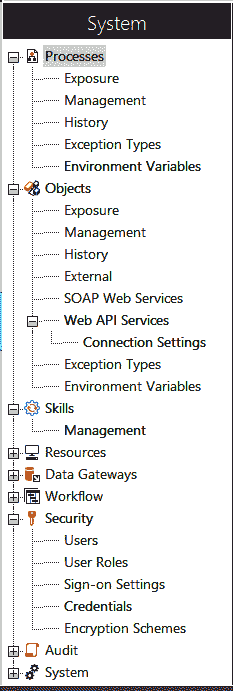
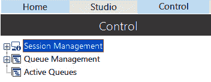
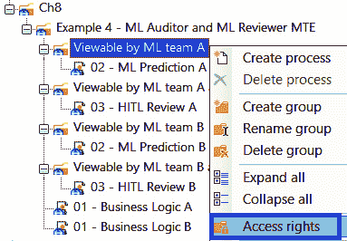
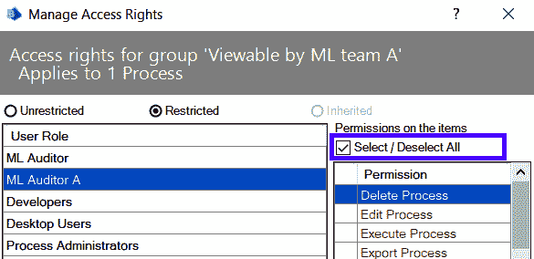
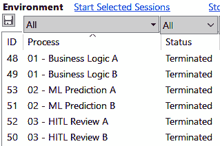
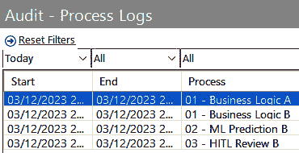
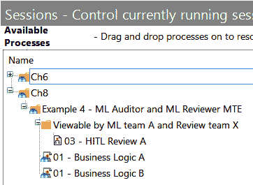
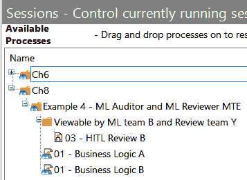

# LAM、用户角色和 MTE

**逻辑访问模型**（**LAM**）定义了哪些 BP**用户角色**应该存在，每个用户角色应该拥有哪些 BP**权限**，以及用户角色到权限映射如何根据其*环境*（例如，开发、UAT 和生产）而有所不同。LAM 允许 RPA 团队规划哪些用户角色需要用于日常运营，通常以电子表格的形式呈现。LAM 文档应进行版本控制，并作为 BP 环境可以对照的真相来源。它是安全性的重要部分，因为角色和权限之间的映射应根据最小权限原则进行。

随着我们从 RPA 过渡到 IA，我们会发现需要更多团队同事访问 BP 环境。这需要修改您现有的 LAM 文档，并添加新的用户角色。随着我们进入本章，我们将讨论哪些 IA 用户角色可能需要添加，它们应该拥有哪些权限，然后实际创建它们。我们还将探讨何时可以使用**多团队环境**（**MTEs**）来限制用户角色可以看到的数据范围。本章的最后一部分将探讨一个基于 LAM Excel 模板的*修订版 LAM 文档，包含 IA 新增内容*，可在 BP 门户上找到：[`portal.blueprism.com/documents/blue-prism-logical-access-model-lam-v70`](https://portal.blueprism.com/documents/blue-prism-logical-access-model-lam-v70)。

本章我们将涵盖以下主要内容：

+   IA 用户角色和权限

+   MTEs

+   更新的 LAM 模板

# 技术要求

在 GitHub 的`ch8`文件夹中下载并导入`.bprelease`文件：[`github.com/PacktPublishing/Intelligent-Automation-with-Blue-Prism/tree/main/ch8`](https://github.com/PacktPublishing/Intelligent-Automation-with-Blue-Prism/tree/main/ch8)。

重要提示

如果您按照时间顺序阅读这本书，到现在您已经导入 13 个已发布的流程。BP 试用版的许可证对已发布流程的数量有限制，为 15 个。本章的发布文件包含六个已发布的流程。如果您正在使用试用版，我建议您取消发布来自*Ch4*、*Ch5*和*Ch6*组的所有流程，以便导入本章的发布文件和未来的章节。

# IA 用户角色和权限

BP 自带一系列预定义的用户角色。然而，这些默认用户角色及其角色到权限映射是在 IA 开发之前制定的。IA 的出现导致需要考虑许多新的用户角色。以下是一些包括的内容：

+   **ML 审计员**：ML 审计员负责审计 ML 预测结果和 HITL 审查，因此他们需要查看和导出会话日志。

+   **ML 部署者**：ML 部署者更新正在使用的 ML 算法。这发生在由应用程序和业务逻辑更新引起的流程和对象更改之外。

+   **ML 审核员**：ML 审核员角色将修改与审核预测相关的会话变量。

重要提示

本章中展示的用户角色和权限列表基于 BP 7.x 版本中可用的内容。如果你使用的是旧版本 BP，你可能会拥有更少的权限。除非你使用的是低于 6.3 版本的 BP（MTE 介绍时），否则这不会影响本章的内容。

## ML Auditor

*ML Auditor* 角色用于查看和导出与 ML 相关的会话日志。与不经常发生的通用安全审计不同，ML 审计可能需要频繁进行。ML 审核员可能需要在每次 ML 算法部署后进行 *hypercare*，或者定期导出人工审核预测的结果。定期的 ML 审计是抵消模型衰减和数据漂移影响所必需的。让我们以一个例子创建这个 ML Auditor 角色。

重要提示

这些示例假设你正在使用 BP 原生身份验证，并且你以具有 *系统管理员* 角色的用户登录。如果你使用的是 Active Directory 身份验证或身份验证服务器，你可能会需要 IT 或 Hub 管理员的帮助来为你创建用户。 

### 示例 1 – 创建 ML Auditor 用户角色

在本例中，我们将执行四个高级步骤：

1.  创建 *ML Auditor* 用户角色。

1.  选择允许你查看和导出会话日志所需的最小权限集。

1.  创建具有 *ML* *Auditor* 角色的新用户。

1.  测试用户。

#### 创建 ML Auditor 用户角色

我们的第一步是创建用户角色本身：

1.  访问 **系统** | **安全** | **用户角色**。

1.  点击 `ML Auditor` 作为角色名称。

#### 将权限映射到 ML Auditor 用户角色

接下来，我们需要选择 *五个* 权限添加到我们新创建的用户角色中：

1.  点击一次新创建的 **ML Auditor** 角色以确保它被突出显示。在右侧面板的 **权限** 部分中，勾选以下五个权限：**对象工作室** | **查看业务对象定义**，**流程工作室** | **查看流程定义**，**资源** | **查看资源**，**系统管理员** | **审计 – 业务对象日志**，和 **系统管理员** | **审计 – 流程日志**。

1.  点击右下角的 **应用** 按钮以保存更改。

#### 创建具有 ML Auditor 用户角色的新用户

在测试新用户角色之前，创建一个用户并分配 *ML* *Auditor* 角色：

1.  访问 **系统** | **安全** | **用户**。

1.  在 **用户** 面板上的任何位置右键单击，然后选择 **创建用户** 或 **新建**。无论 **创建用户** 或 **新建** 出现在哪里，它们都会引导到相同的用户创建向导。

1.  输入用户名 `mlaudit`。选择一个密码，并重复输入两次。

1.  点击 **下一步**，直到到达选择用户角色的屏幕。

1.  选择 **ML Auditor** 用户角色，并点击 **完成**。

#### 测试新用户

要测试用户，我们需要登出，使用新用户登录，并验证用户只能导出和查看**会话日志**：

1.  从 BP 中登出。

1.  使用`mlaudit`用户和您选择的密码登录。

1.  验证您是否可以看到 BP 的**工作室**部分。打开任何流程或对象，并确认在流程和对象工作室内部您只有**读取访问**权限。

1.  访问 BP 的**控制**部分。验证只有**会话管理**可见，且无法看到任何队列或计划。

1.  访问 BP 的**系统**部分。验证只有**审计** | **进程日志**和**审计** | **对象日志**可见。

1.  点击**审计** | **进程日志**并将**今天**过滤器设置为**全部**。右键单击任何会话，并确认会话日志可查看。

1.  在会话日志仍然打开的情况下，点击**文件** | **导出整个日志…**。验证您是否能够将日志保存为文件。

我们已经完成了创建和测试**ML Auditor**用户角色的过程。尽管此用户无法在控制室中查看单个工作队列，但他们能够从**审计** | **进程日志**部分查看所有会话日志，无论它们属于哪个流程。我们将在本章后面的*MTE*部分探讨如何限制此用户角色可以查看的流程集。

## ML Deployer

此角色负责更新 BP 解决方案以使用更新的 ML 模型或端点。它不是用来首次部署 IA 解决方案的——这需要更广泛的范围的工作，可以通过不同的角色来完成。如果预计 ML 算法将定期作为维护或改进活动的一部分进行更新，则*ML Deployer*是相关的。这更有可能在内部开发算法时发生。ML 算法的更新通常独立于业务逻辑，作为 ML 模型自身生命周期的部分。将 IA 解决方案更新为使用新的 ML 模型最好是在不需要更改任何流程或对象图的情况下完成。

在这些场景下，有一个专门用于更新仅触及 ML 算法的 BP 区域的角色是有意义的——即**环境变量**、**技能**和**Web API 服务**。如果需要部署新算法是由于重大缺陷，ML Deployer 可能需要激活一个停止所有 ML 预测的**凭证**（开关）。默认情况下，BP 没有仅限于编辑这些 BP 区域的角色。在下面的示例中，我们将创建 ML Deployer 角色。

### 示例 2 – 创建 ML Deployer 用户角色

在本例中，我们将执行四个高级步骤：

1.  创建**ML Deployer**用户角色。

1.  给予它所需的最小权限集。

1.  使用**ML Deployer**用户角色创建用户。

1.  测试功能。

首先，让我们创建用户角色。

#### 创建 ML Deployer 用户角色

我们的第一步是创建用户角色本身。

1.  访问**系统** | **安全** | **用户角色**。

1.  将角色名称设置为 `ML Deployer`。

#### 将权限映射到 ML 部署器用户角色

接下来，我们需要选择 *七个* 权限以添加到我们新创建的用户角色中：

1.  在新创建的 **ML 部署器** 角色上单击一次，以确保它被突出显示。在右侧面板的 **权限** 部分中，勾选以下七个权限：**技能** | **导入技能**、**技能** | **管理技能**、**技能** | **查看技能**、**系统管理员** | **进程 – 配置环境变量**、**系统管理员** | **业务对象 – Web API 服务**、**系统管理员** | **业务对象 – Web 连接设置** 和 **系统管理员** | **安全 –** **管理凭据**。

1.  在右下角单击 **应用** 按钮以保存更改。

#### 创建具有 ML 部署器用户角色的新用户

在测试 *ML 部署器* 用户角色之前，创建一个新用户并将其分配给该角色：

1.  访问 **系统** | **安全** | **用户**。

1.  在用户面板上的任何位置右键单击，然后选择 **创建用户** 或 **新建**。无论 **创建用户** 或 **新建** 显示取决于您在哪里右键单击，但它们都会引导到相同的用户创建向导。

1.  输入用户名 `mldeploy`。选择一个密码，并两次输入。

1.  单击 **下一步** 直到您到达选择用户角色的屏幕。

1.  选择 **ML 部署器** 用户角色，然后单击 **完成**。

#### 测试新用户

为了测试用户，我们需要注销，以新用户身份登录，并验证我们只能更改 *环境变量*、*Web API 服务*、*技能* 和 *凭据*：

1.  从 BP 中注销。

1.  使用 `mldeploy` 用户和您选择的密码登录。

1.  访问 BP 的 **系统** 部分。

1.  确认只有 **进程** | **环境变量**、**对象** | **Web API 服务**、**对象** | **Web API 服务** | **连接设置**、**技能** | **管理** 和 **安全** | **凭据** 可以被选中。其他所有选项都应该变灰，表示该角色只能编辑这五个区域。

图 8.1 – ML 部署器可以访问的区域

我们已经完成了 *ML 部署器* 用户角色的创建。请记住，这个角色是为 ML 人员或数据科学家准备的，以便在他们对生产或测试（例如，使用 *示例 4* 中介绍的 *新模型评估流程模板*）部署新的 ML 算法时更新 BP IA 解决方案。初始部署应由不同的角色执行，因为 *ML 部署器* 用户不需要太多的 BP 培训或权限来部署他们的新算法。

这意味着几乎与 ML 相关的所有内容都应该作为环境变量参数化，包括 URL、模型版本和 ML 脚本的路径。如果它们作为环境变量存储，我们就不需要向用户角色添加对象工作室权限，并且对 BP 的使用进行培训可以保持在最低限度。然而，如果使用了 VB.NET 或 C# ML 库，如 ML.NET，我们可能还想授予用户角色**对象工作室**和**发布管理器**权限，并提供足够的培训，以便他们可以自己编辑对象。

## ML 审核员

我们的第三个用户角色是为那些审核预测的人准备的，尤其是如果他们是内部业务用户。他们需要修改会话变量以重新创建缺失的审核数据的权限，更改有关共享数据保存路径的环境变量，以及更新工作队列项的状态。这个角色与三个工作队列设计搭配使用时效果最佳，因为它允许我们通过 MTE 限制哪些流程可以访问。接下来，让我们创建**ML 审核员**角色。

### 示例 3 – 创建 ML 审核员用户角色

在本例中，我们将通过四个高级步骤进行操作：

1.  创建**ML 审核员**用户角色。

1.  给予它必要的最小权限。

1.  创建具有**ML** **审核员**角色的用户。

1.  测试功能。

首先，让我们创建用户角色。

#### 创建 ML 审核员用户角色

我们的第一步是创建用户角色本身：

1.  访问**系统** | **安全** | **用户角色**。

1.  将角色名称设置为`ML 审核员`。

#### 将权限映射到 ML 审核员用户角色

接下来，我们需要选择**四个**权限添加到我们新创建的用户角色中：

1.  点击一次新创建的**ML 审核员**角色以确保它被突出显示。在右侧面板的**权限**部分，勾选以下四个权限：**控制室** | **队列管理完全访问**，**流程工作室** | **查看流程定义**，**资源** | **控制资源**，和**系统管理器** | **流程 – 配置** **环境变量**。

1.  点击右下角的**应用**按钮以保存更改。

#### 创建具有 ML 审核员用户角色的新用户

在测试我们新的用户角色之前，我们需要创建一个用户并将其分配给该角色：

1.  访问**系统** | **安全** | **用户**。

1.  在**用户**面板上的任何位置右键单击，然后选择**创建用户**或**新建**。**创建用户**或**新建**显示取决于你右键单击的位置，但它们都指向同一个用户创建向导。

1.  输入用户名`mlreview`。选择一个密码，并重复输入两次。

1.  点击**下一步**，直到到达选择用户角色的屏幕。

1.  选择**ML 审核员**用户角色，并按**完成**。

#### 测试新用户

为了测试用户，我们需要注销，以新用户身份登录，并验证我们是否可以在**系统**设置下看到*环境变量*，查看*工作队列*，以及在控制室中查看*会话*：

1.  从 BP 注销。

1.  使用`mlreview`用户和您选择的密码登录。

1.  访问 BP 的**控制**部分。

1.  确认**会话管理**和**队列管理**可用。

图 8.2 – 会话管理和队列管理对 ML Reviewer 用户角色可用

1.  访问 BP 的**系统**部分。

1.  确认只能选择**流程** | **环境变量**。其他所有选项都应变为灰色。

如果您愿意，可以进一步验证 ML Reviewer 角色可以编辑单个队列项的状态，也可以编辑执行会话的会话变量。

我们已创建三个用户角色，可用于 BP 的 IA 目的。请记住，LAM 通常对不同环境有不同的权限。这里显示的示例是根据最小权限原则和*生产*环境设计的。如果需要，可以在较低环境中授予这三个用户角色额外的权限。

## 用户角色比较

下表总结了三个用户角色及其在生产环境中执行职责所需的最小权限集。标记为*Y*的表格单元格表示用户角色应该拥有该权限。*空*的表格单元格表示用户角色不需要该权限。表中未列出任何三个角色都不使用的权限。

| **权限** | **ML 审计员** | **ML 部署者** | **ML 审查员** |
| --- | --- | --- | --- |
| **控制室**： |
| 完全访问队列管理 |  |  | Y |
| **对象工作室**： |
| 查看业务对象定义 | Y |  |  |
| **流程工作室**： |
| 查看流程定义 | Y |  | Y |
| **资源**： |
| 控制资源 |  |  | Y |
| 查看资源 | Y |  |  |
| 技能： |
| 导入技能 |  | Y |  |
| 管理技能 |  | Y |  |
| 查看技能 |  | Y |  |
| **系统管理员**： |
| 审计 – 业务对象日志 | Y |  |  |
| 审计 – 流程日志 | Y |  |  |
| 业务对象 – 网络 API 服务 |  | Y |  |
| 业务对象 – 网络连接设置 |  | Y |  |
| 流程 – 配置环境变量 |  | Y | Y |
| 安全 – 管理凭证 |  | Y |  |

表 8.1 – IA 用户角色及其权限表

*ML Auditor*角色需要权限来导出会话日志，而*ML Reviewer*需要权限来编辑会话变量以运行会话。在前面的示例中，我们创建的角色可以查看多个流程的会话和会话日志，这是一个安全问题。在下一节关于 MTE 的部分，我们将看到如何进一步限制*ML Auditors*和*ML Reviewers*可以查看哪些流程。然而，我们无法使用 MTE 来限制*ML Reviewers*可以编辑哪些工作队列的项目状态。编辑 Web API 服务、技能、环境变量和凭证的*ML Deployers*也不从 MTE 中受益。

# MTEs

*查看流程定义*权限允许我们在 BP 的控制室部分看到流程。如果我们想查看会话日志或编辑会话变量，这是必需的。授予此权限允许用户角色查看控制室中发布的所有不受限制的流程。对于*ML Auditor*用户能够从所有流程中提取会话日志可能没问题，但我们不希望*ML Reviewers*能够为不属于他们负责的流程设置会话变量。MTE 允许我们设置限制，限制我们新创建的角色可以查看哪些流程和日志。

## ML Auditor 和 ML Reviewer 用户角色的 MTE

如果我们想按流程限制可以查看的内容，我们需要创建多个 ML Auditor 和 ML Reviewer 用户角色。我们还需要将我们的流程放入特定的*组*结构中，以便我们可以设置正确的*访问权限*。让我们通过一个示例来演示如何实现这一点。

### 示例 4 – ML Auditor 和 ML Reviewer MTE

假设我们有两个在生产中运行的 IA 解决方案，A 和 B，每个都由*三个*流程，*三个*工作队列 IA 模板从*第七章*创建。有两个 ML 团队（A 和 B）希望能够仅导出使用他们 ML 算法的 IA 解决方案的会话日志。我们还有两个 ML 审查团队（X 和 Y），他们可能需要编辑他们负责的解决方案的会话变量。

我们试图实现的内容列在以下表中：

| **IA 解决方案** | **BP 流程** | **哪个 ML 团队可以导出** **会话日志？** | **哪个审查团队能够编辑** **会话变量？** |
| --- | --- | --- | --- |
| A | 01 – Business Logic A | 无限制 | N/A |
| A | 02 – ML Prediction A | A | N/A |
| A | 03 – HITL Review A | A | X |
| B | 01 – Business Logic B | 无限制 | N/A |
| B | 02 – ML Prediction B | B | N/A |
| B | 03 – HITL Review B | B | Y |

表 8.2 – 示例 4 所需的 MTE 限制

让我们实施一个 MTE 结构，以实现前表中所示的内容。在这个示例中，我们将通过八个高级步骤进行：

1.  检查示例的发布文件内容。

1.  将*ML Auditor*角色克隆两次，一次为每个团队。

1.  为两个克隆的*ML* *Auditor*角色创建用户。

1.  将*ML Reviewer*角色克隆两次，一次为每个团队。

1.  为两个克隆的*ML* *审查员*角色创建用户。

1.  更改组的访问权限。

1.  运行每个流程一次。

1.  验证 MTE 是否按预期工作。

首先，让我们熟悉一下基于团队组结构的发布。

#### 验证发布内容

已准备了一个结构化的发布，以便配置*访问权限*。访问权限将按流程限制对会话日志和会话变量的访问。验证发布是否包含六个 BP 流程在组结构中，如下所示图像所示。

图 8.3 – MTE 的组结构

属于 IA 解决方案 A 的三个流程具有*A*后缀。同样，属于 IA 解决方案 B 的三个流程具有*B*后缀。**可由 ML 团队 A 查看**的组包含执行 IA 解决方案 A 的 ML 预测的流程。**可由 ML 团队 A 和审查团队 X 查看**的组包含执行 IA 解决方案 A 的 HITL 审查检查的流程。

**可由 ML 团队 B 查看**的组包含执行 IA 解决方案 B 的 ML 预测的流程。**可由 ML 团队 B 和审查团队 Y 查看**的组包含执行 IA 解决方案 B 的 HITL 审查检查的流程。

还有两个流程，**01-业务逻辑 A**和**01 - 业务逻辑 B**，它们都不在前面提到的两个组中。这些流程将对所有角色可见。我们的下一步是将*ML 审计员*用户角色克隆成两个新的角色。

#### 两次克隆 ML 审计员用户角色

为了授予两个组分别的访问权限，*可由 ML 团队 A 查看*和*可由 ML 团队 B 查看*，我们需要有两个单独的用户角色。在这里，我们将克隆在*示例 1*中创建的现有 ML 审计员角色，并将其重命名两次：

1.  访问**系统** | **安全** | **用户角色**。

1.  右键单击**ML 审计员**角色，然后选择**克隆**。

图 8.4 – 克隆现有的 ML 审计员角色

1.  将克隆的角色重命名为`ML` `审计员 A`。

1.  右键单击**ML 审计员**角色并**克隆**（即重复*步骤 2*）。

1.  将克隆的角色重命名为`ML` `审计员 B`。

现在我们应该有三个 ML 审计员角色 – 基础的*ML 审计员*角色（在这个例子中将不再使用），*ML 审计员 A*和*ML 审计员 B*。接下来，让我们为每个新的用户角色创建一个用户。

#### 创建两个 ML 审计员用户。

为了测试我们的用户角色，我们需要创建具有这些角色的新用户。

1.  访问**系统** | **安全** | **用户**。

1.  在**用户**面板上的任何位置右键单击，然后选择**创建用户**或**新建**。

1.  输入用户名`mlauditA`。选择一个密码，并输入两次。

1.  点击**下一步**，直到到达选择用户角色的屏幕。

1.  选择**ML 审计员 A**用户角色，然后点击**完成**。

1.  在**用户**面板上的任何位置右键单击，然后选择**创建用户**或**新建**。

1.  输入用户名 `mlauditB`。选择一个密码，并重复输入两次。

1.  点击 **下一步**，直到到达选择用户角色的屏幕。

1.  选择 **ML Auditor B** 用户角色，并点击 **完成**。

在创建 ML Auditor 用户后，我们将重复相同的步骤，除了 ML Reviewer 角色。

#### 两次克隆 ML Reviewer 用户角色

让我们复制在*示例* *3* 中创建的 ML Reviewer 角色两次：

1.  访问 **系统** | **安全** | **用户角色**。

1.  右键点击 **ML Reviewer** 角色，并选择 **克隆**。

1.  将复制的角色重命名为 `ML` `Reviewer X`。

1.  右键点击 **ML Reviewer** 角色，并 **克隆**（即重复 *步骤 2*）。

1.  将复制的角色重命名为 `ML` `Reviewer Y`。

现在，我们应该有三个 ML Reviewer 角色 – 基础 *ML Reviewer* 角色（在此示例中不再使用），*ML Reviewer X* 和 *ML Reviewer Y*。接下来，让我们为每个新的用户角色创建一个用户。

#### 创建两个 ML Reviewer 用户

为了测试我们的用户角色，我们需要创建具有这些角色的新用户：

1.  访问 **系统** | **安全** | **用户**。

1.  在 **用户** 面板上右键点击任何位置，并选择 **创建用户** 或 **新建**。

1.  输入用户名 `mlreviewX`。选择一个密码，并重复输入两次。

1.  点击 **下一步**，直到到达选择用户角色的屏幕。

1.  选择 **ML Reviewer X** 用户角色，并点击 **完成**。

1.  在 **用户** 面板上右键点击任何位置，并选择 **创建用户** 或 **新建**。

1.  输入用户名 `mlreviewY`。选择一个密码，并重复输入两次。

1.  点击 **下一步**，直到到达选择用户角色的屏幕。

1.  选择 **ML Reviewer Y** 用户角色，并点击 **完成**。

到目前为止，我们已经创建了四个新角色和四个用户。接下来，让我们修改组的访问权限，以限制每个新角色的可查看内容。

#### 修改组访问权限

在此步骤中，我们将为每个组设置特定的 *访问权限*。首先，我们将限制 *Viewable by ML team A* 组，使其只能由 *ML Auditor A* 用户角色查看。然后我们将限制 *Viewable by ML team B* 组，使其只能由 *ML Auditor B* 用户角色查看。

接下来，我们将限制 *Viewable by ML team A and Review team X* 组，使其只能由 *ML Auditor A* 和 *ML Reviewer X* 角色查看。最后，我们将限制 *Viewable by ML team B and Review team Y* 组，使其只能由 *ML Auditor B* 和 *ML Reviewer Y* 角色查看：

1.  访问 BP 的 **工作室** 部分。

1.  右键点击 **Viewable by ML team A** 组，并选择 **访问权限**。

图 8.5 – 右键点击 Viewable by ML team A 组并选择访问权限

1.  点击 **受限** 单选按钮。

1.  点击 **取消选择** **所有** 按钮。

1.  点击 **ML Auditor A** 角色。

1.  打开 **选择/取消选择** **所有** 复选框。

图 8.6 – 为 ML 审计员 A 角色勾选/取消勾选全部框

1.  点击**确定**以保存更改。此时，**可由 ML 团队 A 查看**组应仅由**ML 审计员** **A** 角色查看。

1.  右键单击**可由 ML 团队 B 查看**组，并选择**访问权限**。

1.  点击**受限**单选按钮。

1.  点击**取消选择** **全部**按钮。

1.  点击**ML 审计员** **B** 角色按钮。

1.  勾选**选择/取消选择** **全部**框。

1.  点击**确定**以保存更改。此时，**可由 ML 团队 B 查看**组应仅由**ML 审计员** **B** 角色查看。

1.  右键单击**可由 ML 团队 A 和审查团队 X 查看**组，并选择**访问权限**。

1.  点击**受限**单选按钮。

1.  点击**取消选择** **全部**按钮。

1.  点击**ML 审计员** **A** 角色按钮。

1.  勾选**选择/取消选择** **全部**框。

1.  点击**ML 审查员** **X** 角色按钮。

1.  勾选**选择/取消选择** **全部**框。

1.  点击**确定**以保存更改。此时，**可由 ML 团队 A 和审查团队 X 查看**组应仅由**ML 审计员 A**和**ML 审查员** **X** 角色查看。

1.  右键单击**可由 ML 团队 B 和审查团队 Y 查看**组，并选择**访问权限**。

1.  点击**受限**单选按钮。

1.  点击**取消选择** **全部**按钮。

1.  点击**ML 审计员** **B** 角色按钮。

1.  勾选**选择/取消选择** **全部**框。

1.  点击**ML 审查员** **Y** 角色按钮。

1.  勾选**选择/取消选择** **全部**框。

1.  点击**确定**以保存更改。此时，**可由 ML 团队 B 和审查团队 Y 查看**组应仅由**ML 审计员** **B** 和**ML 审查员** **Y** 角色查看。

我们已经完成了四个组的访问权限更改。现在，让我们在控制室中一次性运行所有六个流程以生成会话日志。

#### 一次性运行每个流程

在我们测试用户之前，我们需要在控制室中一次性运行六个流程中的每一个。访问 BP 的**控制**部分，并从**会话管理**部分一次性运行每个流程。只要创建了会话日志，会话运行成功或失败并不重要。

图 8.7 – 在控制室中一次性运行每个流程

#### 验证 MTE 是否正在运行

最后，让我们从 BP 注销，并使用我们新创建的用户重新登录。然后，我们将验证 MTE 是否正在限制访问，正如我们所期望的：

1.  从 BP 注销。

1.  使用`mlauditA`用户名和密码登录。

1.  访问 BP 的**系统** | **审计** | **流程日志**部分。

1.  确保您看不到**02 – ML 预测 B**和**03 – HITL 审查 B**的会话日志。

图 8.8 – ML 审计员 A 角色不应看到 ML 预测 B 和 HITL 审查 B

1.  从 BP 注销。

1.  使用`mlauditB`用户名和密码登录。

1.  访问 BP 的**系统** | **审计** | **流程日志**部分。

1.  确保您看不到**02 – ML 预测 A**和**03 – HITL 审查 A**的会话日志。

图 8.9 – ML 审计员 B 角色不应看到 ML 预测 A 和 HITL 审查 A

1.  从 BP 注销。

1.  使用`mlreviewX`用户名和密码登录。

1.  访问**控制** | **会话管理**。

1.  确认在**Ch8** | **示例 4 – ML 审计员和 ML 审查员 MTE** | **可由 ML 团队 A 和审查团队 X 组查看**以及无限制的父组中的两个流程中，仅可见**03 – HITL 审查 A**。

图 8.10 – ML 审查员 X 角色仅应看到 HITL 审查 A

1.  从 BP 注销。

1.  使用`mlreviewY`用户名和密码登录。

1.  访问**控制** | **会话管理**。

1.  确认在**Ch8** | **示例 4 – ML 审计员和 ML 审查员 MTE** | **可由 ML 团队 B 和审查团队 Y 组查看**以及无限制的父组中的两个流程中，仅可见**03 – HITL 审查 B**。

图 8.11 – ML 审查员 Y 角色仅应看到 HITL 审查 B

我们已经完成了示例，展示了如何使用*MTE*和组*访问限制*与*ML 审计员*和*ML 审查员*用户角色。我们看到了如何选择性地选择哪些流程会话和会话日志可供不同用户角色查看/导出。

此示例还突出了*三*个流程/三个工作队列设计的好处。通过将业务逻辑、ML 调用和 HITL 审查分离到不同的流程中，我们实现了更干净的 MTE 用户访问控制，从而增强了操作 IA 解决方案的整体安全性。

## MTE 限制

MTE 仅限制对流程、对象和资源的可见性。计划、工作队列、技能、凭证和环境变量不能通过 MTE 进行限制。这意味着 MTE 对*ML 部署员*角色无效。*ML 审查员*和*ML 部署员*角色都需要与环境变量交互，因此必须指示他们避免更改与其工作无关的环境变量。BP 中没有内置的方法来限制对这些内容的访问，因此我们必须依赖于文档化的操作程序和培训。

如果你想防止意外更改环境变量、凭证等，你需要想出一个外部解决方案，例如将那些数据保存在一个存储在具有单独访问控制位置的工作表中。

# 更新的 LAM 模板

三个新的 IA 用户角色、它们的权限和 MTE 推荐已添加到 BP 的 LAM 模板中。此修订后的模板可在 GitHub 上找到：[`github.com/PacktPublishing/Intelligent-Automation-with-Blue-Prism/blob/main/ch8/Blue_Prism_Logical_Access_Model_(LAM)_for_v7_IA.xlsx`](https://github.com/PacktPublishing/Intelligent-Automation-with-Blue-Prism/blob/main/ch8/Blue_Prism_Logical_Access_Model_(LAM)_for_v7_IA.xlsx)。

建议为开发、UAT 和生产环境设置*ML 部署员*角色。*ML 审查员*角色应仅存在于 UAT 和生产环境中，因为在开发期间审查 ML 预测可能没有意义。*ML 审计员*角色仅需要在生产环境中存在。

# 摘要

在本章中，我们探讨了三个可以添加到 BP 环境中以处理 IA 相关任务的全新用户角色 – *ML 审计员*、*ML 部署员*和*ML 审查员*。我们讨论了他们在 BP 内部应执行的任务，并提供了完成工作所需的最低权限集。

我们还看到，仅将用户角色映射到权限对于 ML 审计员和 ML 审查员角色是不够的。我们需要使用 MTE 来限制他们可以访问的流程，以减少安全担忧。最后，我们使用这三个新用户角色更新了 LAM 模板。此模板包括有关每个角色应在哪个环境中存在、每个角色应具有哪些权限以及如何配置 MTE 的建议。在下一章中，我们将探讨从 RPA 过渡到 IA 如何影响 BP 的技术操作，例如部署和维护。
