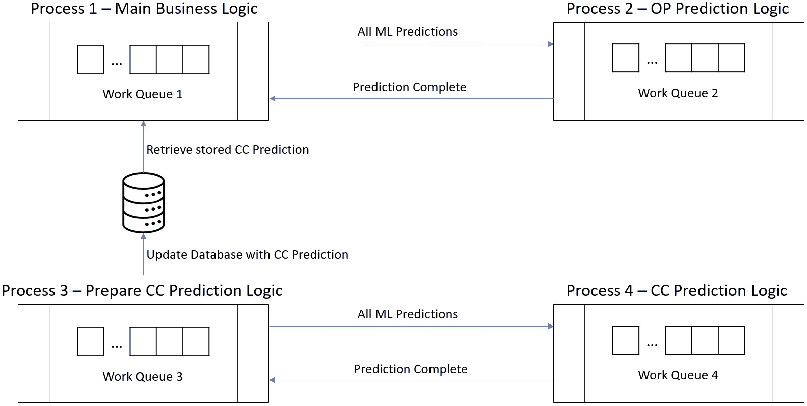
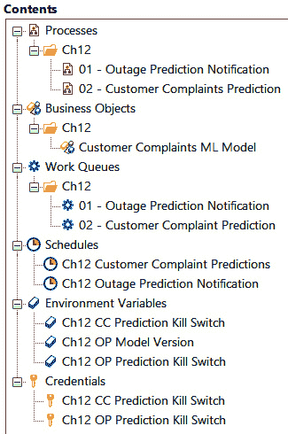
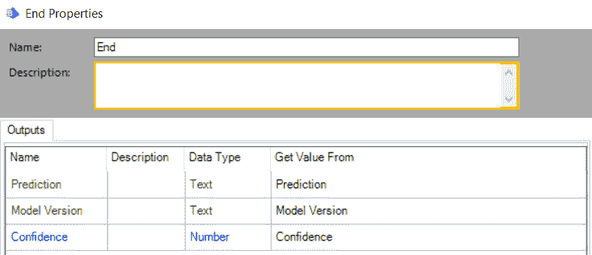
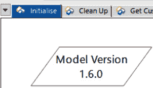
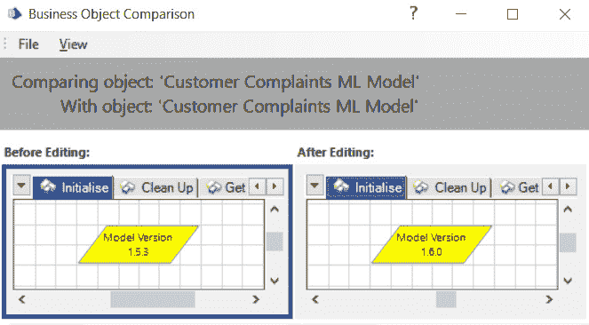
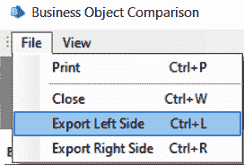
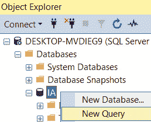

# 12

# 电力服务中断

在本章中，我们将再次查看一个基于真实用例的场景。本章中的示例将重点关注对持续 IA 解决方案操作重要的事后维护和机器学习模型部署活动。本章的目标是熟悉模型部署、回滚和通过 SQL 导出审计数据。

在这个场景中，我们是一家拥有现有机器学习模型并已投入生产的电力公司。该模型根据天气指标、日期和时间指标、当前电力基础设施的测量值和历史数据，预测电力网格的某些区域是否会发生停电。

IA 团队希望使用这个现有模型并构建一个新的模型用于新的自动化。首先，停电机器学习模型将定期调用以预测人口密集区域是否会发生停电。如果检测到潜在的停电，我们希望预测哪些客户最有可能拨打客户服务热线。客户投诉预测模型将作为本项目的部分开发。

一旦我们预测出哪些客户可能会拨打客户服务电话，我们将提前通过短信通知他们可能发生的停电情况。这个 IA 项目的目标是减少客户服务电话的数量，从而节省资金，减少电话排队等待时间，并提高客户满意度。建立这个新模型和自动化的提案已经得到了治理委员会的批准。

停电预测模型由一个独立的内部机器学习团队维护。决定在 IA 功能内部开发和维护客户投诉预测模型，因为必要的专业知识已经存在。

在本章中，我们将介绍以下主题：

+   机器学习模型背景信息

+   解决方案设计

+   处理模型部署

+   导出数据以供审计

# 技术要求

安装 SQL Server Management Studio [`aka.ms/ssmsfullsetup`](https://aka.ms/ssmsfullsetup) 以便您可以对 BP 数据库执行查询。SQL Server Management Studio 在*示例 4*和*示例 5*中使用。

# 机器学习模型背景信息

让我们分析两个机器学习模型（停电预测和客户投诉）的需求和特征。这些信息将帮助我们了解部署和回滚模型所需的程序。它还将帮助我们确定我们有哪些选项来捕获机器学习审计数据。

## 停电预测模型

**停电预测**（**OP**）模型已经在其他地方得到了应用，并由不同的内部团队管理。我们已经获得了使用他们机器学习端点进行 IA 解决方案的必要批准。

### 消费和部署方法

模型托管在内网中，并通过 HTTP API 调用。由于这是一个预存在的模型，部署方法已经确定。使用需要停机的**替换**部署方法。ML 团队将在模型维护时下线时通知我们。对于模型更新，API 端点将被**覆盖**，这意味着只能调用模型的最新版本。这意味着通过更改端点 URL 来回滚是不可能的。

### 预测量

在与项目利益相关者讨论后，我们决定将自动化重点放在四个区域。这将在项目的进一步阶段中扩展。我们决定每个区域的预测间隔为 30 分钟，从早上 6:00 到晚上 10:00。在这个时间范围之外向客户发送短信将不会有效。这总计每天对 API 的 112 次调用，这对 ML 团队来说是可接受的量。

### HITL 审查、界面和 SLA

由于专家之外的人无法审查预测，因此决定不需要审查。也没有 SLA 需要满足，因为这不是一个已经存在（也不是关键）的过程。目前，如果可能发生故障，客户不会被提前通知。然而，我们已经设定了一个目标，在从 OP 模型收到**潜在故障**预测后的 30 分钟内通知客户。

### ML 审计

虽然可以从 ML 团队请求服务器日志，但收到它们的提前期是未定义的，因为他们没有现有的程序或 SLA。因此，IA 团队决定在 BP 中保留对模型的 API 调用的副本。由于他们为公共服务工作，IA 团队意识到需要维护他们 ML 调用的审计跟踪。

我们已经收集了与 IA 解决方案相关的 OP 模型的相关信息。让我们接下来看看客户投诉模型。

## 客户投诉模型

**客户投诉**（**CC**）模型根据人口统计信息、账单数据、一天中的时间、过去的通话行为等预测客户是否可能拨打客户支持热线。该模型将由 IA 团队开发和维护。团队决定构建一个**二元分类**模型，使用回归或基于树的技巧来预测客户是**会拨打**还是**不会拨打**。这些技巧受到青睐，因为它们具有固有的某种程度可解释性。

### 消耗和部署方法

IA 团队决定将 CC ML 解决方案作为原生代码阶段部署，它将直接在数字工作者本身上运行。这将是由于所选算法的类型。

### 预测量

需要的预测数量取决于该地区住宅电表（客户）的数量。最大的地区大约有 10,000 名客户。假设从各个系统中收集模型输入数据并做出预测需要一分钟，那么在 30 分钟内处理 10,000 个预测将需要 334 名数字工作者，这是不可接受的。

为了将预测所需的时间降低到可管理的水平，IA 团队决定采用一个完全独立的 BP 流程来收集必要的数据输入。该流程将每周为目标区域内的每位客户生成预测。使用每周预测（而不是实时预测）被认为是一个合理的折衷方案，因为输入到模型中的客户数据并不经常改变。

每周的客户投诉预测结果将被保存到数据库中。如果预测到某个地区将出现故障，则保存的预测结果可以被发送短信的流程使用。

假设四个地区总共有 20,000 个住宅，每个地区处理需要一分钟。如果我们选择在非高峰时段（晚上 9:00 到早上 5:00）运行客户投诉预测流程，那么每周处理 20,000 个案例将需要 6 名数字工作者。在与业务用户讨论后，我们获得了在非高峰时段空闲的六名数字工作者上运行此 CC 预测的绿灯，从而提高了劳动力的整体利用率。

### HITL 审查、界面和 SLA

由于没有人真正知道如何预测某人是否可能拨打热线电话，因此不需要对预测进行人工审查。尽管我们自行设定了每周更新客户预测的标准，但也没有 SLA 来完成任务预测。

### ML 审计

需要进行审计。由于 ML 模型是从代码阶段运行的，因此日志必须保存到 BP 中。

我们已经完成了对两个 ML 模型的审查。让我们总结与 IA 解决方案相关的细节。这将告诉我们如何部署、回滚和检索 ML 日志以进行审计。

## ML 模型总结

以下表格提供了与解决方案设计和操作相关的 ML 模型特性的总结：

| **模型** | **部署方法** | **HITL 审查标准** | **HITL 审查界面** | **HITL 审查 SLA** | **ML 审计** |
| --- | --- | --- | --- | --- | --- |
| OP | 替换 API | N/A | N/A | N/A | 在 IA 解决方案中 |
| CC | 代码阶段 | N/A | N/A | N/A | 在 IA 解决方案中 |

表 12.1：ML 模型特性的总结

# 解决方案设计

由于两种 ML 模型都不可能进行**审查**，因此我们不需要考虑为**审查**设计单独的流程和工作队列。同样，由于两个 ML 模型是独立的，并且通过将客户投诉预测结果保存到数据库中**通信**，因此也不需要在两个 ML 模型之间**链接**工作队列项。

高级解决方案设计有两个主要候选方案。第一个潜在的设计如下所示图。在这个设计中，我们将解决方案的机器学习部分中的流程和工作队列分开。这导致了一个四流程、四个工作队列的设计。它允许独立扩展并对 ML 模型直接从 BP 用户界面进行针对性审计。这种第一个设计的缺点是需要大量的许可证和调度复杂性的增加。

图 12.1：潜在设计 1：将 ML 部分中的流程和工作队列分开

下一个潜在的设计是不将 ML 分成单独的流程和工作队列。以下截图展示了这种第二个设计的例子。使用这种设计，我们可能需要手动查询数据库以提取 ML 审计信息，或者将会话日志作为 CSV 导出并从那里过滤。

图 12.2：潜在设计 2：不要将 ML 部分中的流程和工作队列分开

让我们考虑需要单独*扩展*ML 预测的需求。对于 OP 模型，预测量很低，所以没有必要从主流程中独立扩展 ML。对于 CC 模型，瓶颈可能在于从各种 CRM、客户支持系统和计费系统中检索所有必要的输入数据。ML 部分只占总执行时间的很小一部分，并且客户与预测之间存在一对一的关系，因此没有必要单独扩展 CC 模型的预测。

接下来，让我们考虑*可审计性*需求。在这种情况下，没有必要对任何已审查的结果提供反馈，因为审查是不可能的。虽然客户支持团队可以通知 IA 团队是否有人在实际服务中断后打电话，但这是在 BP 之外发生的事情。

可能需要允许 IA 团队外部的人员访问会话日志以进行导出。从 BP 导出数据的替代方案是直接查询数据库。IA 团队预计不需要定期导出会话日志数据以进行 ML 审计，或检查特定会话或项目的 ML 日志，因此从 BP 用户界面执行导出操作的可能性很低。IA 团队决定通过 BP 数据库执行 ML 审计。选择的解决方案设计是*图 12.2*中更简单的一个。

# 处理模型部署

想象 IA 解决方案已经实施并已在生产中运行。我们收到来自 ML 团队的消息，表示由不同内部团队维护的 OP 模型将进行更新，并且将出现停机时间。回想一下，只有 OP 模型的一个版本是活跃的，并且不能调用以前的版本。让我们通过一个例子来看看在 OP 模型更新的那天，IA 团队需要做什么。

## 示例 1 – 故障预测模型部署

在此示例中，我们将通过部署 OP 模型的新版本到 BP 中所需的步骤。回想一下，OP 模型使用*替换*部署策略。此示例有七个高级步骤：

1.  导入.bprelease 样本（从同步审查模板创建）。

1.  运行流程一次以创建会话日志。

1.  退役计划。

1.  等待会话完成。

1.  更改存储模型版本的环境变量。

1.  恢复计划。

1.  使用新模型运行流程以创建会话日志。

### 导入发布版本

让我们导入基于*图 12.2*中设计开发的发布版本。

1.  从 GitHub 下载发布版本：[`github.com/PacktPublishing/Intelligent-Automation-with-Blue-Prism/blob/main/ch12/Ex_1_Outage_Prediction_Model_Deployment.bprelease`](https://github.com/PacktPublishing/Intelligent-Automation-with-Blue-Prism/blob/main/ch12/Ex_1_Outage_Prediction_Model_Deployment.bprelease)。

1.  将发布版本导入 BP。

1.  确保已导入两个流程、一个对象、两个工作队列、两个计划、三个环境变量和两个凭证。

图 12.3 – .bprelease 的内容

1.  访问 *系统* | *安全* | *凭证*。打开**Ch12 OP 预测关闭开关**凭证，并确保**01 – 故障预测通知**流程的*访问权限*已授予，以及正确的角色和资源。

1.  访问 *系统* | *安全* | *凭证*。打开**Ch12 CC 预测关闭开关**凭证，并确保**02 – 客户投诉预测**流程的*访问权限*已授予，以及正确的角色和资源。

导入后，我们需要运行流程一次以生成一些会话日志数据。

### 运行流程

从控制室执行流程一次以生成会话日志。虽然会话日志在此示例中不需要，但它们对于*示例 4*是必需的：

1.  从控制室运行**01 – 故障预测通知**流程一次。等待会话完成。

1.  打开 *控制* | *队列管理* | *Ch12* | *01 – 故障预测通知*。查看已创建四个项目，每个项目代表四个区域之一。

接下来，让我们开始部署新的 OP ML 模型。第一步是退役运行 OP 模型预测流程的计划，即*01 – 故障预测通知*。

### 退役计划

在发布中导入了两个计划。我们只需要退役*Ch12 停电预测通知*计划，因为那是运行调用 OP 预测模型的进程的计划。

在*控制* | *调度器*下，右键单击*Ch12 停电预测通知*计划并选择*退役*。即使有会话仍在执行，也应该能够退役。

图 12.4：退役 Ch12 停电预测通知计划

在退役计划后，我们需要确保没有活跃的会话正在运行**01 - 停电预测****通知**进程。

### 等待会话停止

在这里我们可以做几件事情，这取决于在 ML 模型下线之前我们有多少时间。如果 ML 模型很快就要下线，我们可以触发 OP 模型的关闭开关。这将阻止在调用 ML 算法之前执行。如果主页上的选择阶段设计正确，我们可以重试因触发关闭开关而被标记为异常的工作队列项。重试后，执行应恢复到 ML 预测被调用之前的点。如果我们拥有的时间超过当前项完成预期的时长，我们可以在所有正在进行的会话上请求停止。最后，如果我们有很多时间，我们可以等待所有会话完成：

1.  在*控制* | *会话管理*下，选择**01 – 停电预测通知**作为*进程*过滤器。确保所有其他过滤器都设置为**全部**。

图 12.5 – 过滤会话管理以查看 01 – 停电预测通知进程

1.  等待直到所有会话都运行完成，请求停止会话，或触发**Ch12 OP 预测关闭开关**。应该使用哪一个将取决于一个工作队列项的预期执行时间以及模型下线前的剩余时间。

现在，让我们假设已经过去了一些时间，并且我们已经收到通知，ML 部署已完成。下一步是修改**Ch12 OP 模型版本**环境变量，并取消退役计划。

### 将环境变量更新为新 ML 模型版本

由于 OP 模型只有一个版本，我们需要手动跟踪其更新时间。在这种情况下，我们需要更新一个`DateTime`环境变量。一旦模型版本更新，我们可以允许计划恢复。在*系统* | *进程* | *环境变量*下，编辑**Ch12 OP 模型版本**环境变量的值，使其使用当前日期和时间。

### 取消退役计划

现在我们等待 ML 团队通知我们新模型已准备好使用。一旦我们收到通知，我们可以取消退休计划，以便再次开始处理。在*Control* | *Retired Schedules*下，右键单击*Ch12 Outage Prediction Notification*计划，并*取消退休*它。

### 使用新模型运行流程

再次从控制室运行**01 – 停电预测通知**流程。此步骤仅用于为未来的示例生成会话日志。

我们已经完成了将新版本的 OP 模型部署到我们的 IA 解决方案中所需的步骤，这需要停机。现在让我们看看我们如何部署使用代码阶段的 CC 模型的新版本。

## 示例 2 – 客户投诉模型部署

假设 CC ML 模型对象已更新，并且这次部署不需要任何新的 DLL。请注意，部署前的模型版本（1.5.3）可以在**客户投诉 ML 模型**对象的`初始化`页面作为数据项找到。此外，请注意，返回预测结果的操作也返回了模型版本。这意味着我们不需要使用环境变量来存储模型版本。

图 12.6：CC ML 对象操作返回模型版本。

此示例有三个高级步骤：

1.  运行**02 – 客户投诉预测**流程一次以创建会话日志。

1.  通过导入对象来部署新模型。

1.  再次运行流程以创建会话日志。

我们的第一步是运行现有的流程一次以生成一些会话日志数据。这些数据将在*示例 5*中使用。

### 运行流程

从控制室运行流程一次以生成会话日志。从控制室运行**02 – 客户投诉预测**流程一次。这将创建 20 个项目（客户），他们属于四个区域之一。接下来，我们需要下载对象并验证模型版本已更新。

### 下载、检查模型版本并导入对象

在这种情况下，更新的模型以`.bpobject`文件的形式提供。我们需要下载它并验证模型版本与之前的版本（1.5.3）不同：

1.  从 GitHub 下载对象：[`github.com/PacktPublishing/Intelligent-Automation-with-Blue-Prism/blob/main/ch12/Ex_2_BPA_Object_Customer_Complaints_ML_Model.bpobject`](https://github.com/PacktPublishing/Intelligent-Automation-with-Blue-Prism/blob/main/ch12/Ex_2_BPA_Object_Customer_Complaints_ML_Model.bpobject)。

1.  将下载的对象导入 BP。

1.  在*Studio | Objects |* *Ch12*下，在对象工作室中打开**客户投诉 ML 模型**对象。

1.  在`初始化`页面，验证开发人员已将**模型版本**数据项从之前的版本（1.5.3）更新。

图 12.7：验证模型版本数据项已从 1.5.3 更改

我们已确认模型版本已更改。由于这是一个代码阶段部署，没有新的 DLL 文件，我们只需要导入新的对象文件。在对象导入之前进行的会话仍将使用旧的对象定义和先前的模型版本。在对象导入之后开始的新会话将使用更新的对象和模型版本。

如果你想更安全，可以在将其导入 BP 之前检查模型版本是否已更新。如果文件是`.bpobject`文件，您可以在任何文本编辑器中打开它并搜索*模型版本*。如果文件是`.bprelease`文件，您也可以执行类似的搜索。

图 12.8：可以通过在记事本中打开.bpobject 文件来查看模型版本

最后，让我们再次运行流程，以生成带有更新模型版本的会话日志。

### 使用新的机器学习模型

从控制室再次执行流程。这些会话日志对于*示例 5*是必需的。从控制室再次运行**02 – 客户投诉预测**流程。

我们已经完成了部署基于代码阶段的模型所需的步骤，该模型不需要复制任何新的`.dll`文件。这很简单，只需导入新的对象文件。接下来，让我们看看回滚此机器学习模型部署所需的步骤。

## 示例 3 – 回滚客户投诉模型部署

假设我们发现新的 CC 模型存在问题。让我们通过回滚到上一个版本进行练习。此示例有三个高级步骤：

1.  激活终止开关（可选）。

1.  查找并导入对象的前一个版本。

1.  运行一次**02 – 客户投诉预测**流程以创建会话日志。

如果有正在进行的会话，我们可以考虑打开终止开关，以防止对 CC 机器学习模型的任何进一步调用。

### 激活客户投诉模型终止开关（可选）

如果模型问题至关重要，我们可以选择性地触发终止开关，这样就不会再使用 CC 模型进行进一步预测。我们可以通过使凭证无效来激活终止开关。

1.  访问*系统* | *安全* | *凭证*。双击**Ch12 CC 预测终止****开关**凭证。

1.  打勾选择*标记为无效*复选框并按*确定*。

由于会话现在无法再使用 CC 模型，我们可以开始回滚程序。首先，让我们获取上一个对象的副本。

### 获取并导入上一个对象。

获取对象旧版本的方法有很多。您可以从以前的版本中检索它，并且只重新导入对象。您也可能在共享位置或版本控制系统中有一个副本。如果您没有以前对象的可用副本，我们可以通过 BP 中的*比较*功能将其导出。

重要提示

BP 客户支持通常会向客户提供数据库维护脚本。其中一些脚本会在对象和流程的历史版本超过一定天数时从`BPAAuditEvents`表中删除。这可能会阻止您使用*比较*功能。请与您的数据库团队联系，以确定是否正在使用此维护脚本。

1.  在*工作室* | *对象* | *Ch12*下，单击一次**客户投诉 ML 模型**对象。对象的版本历史将显示在右侧。

1.  按住*Ctrl*按钮并选择对象的两个最新版本。

图 12.9：选择对象的两个最新版本

1.  右键单击并选择*比较*。这会打开业务对象比较窗口。请注意，两个对象具有不同的模型版本。

图 12.10：打开对象比较窗口

1.  在*业务对象* *比较*窗口中，单击*文件* | *导出左侧*。

图 12.11：导出对象的上一版本

1.  将导出的对象保存到您选择的位置。

1.  将保存的对象重新导入 BP 并覆盖最新版本。

接下来，让我们运行流程以生成使用旧模型的会话日志。

### 使用旧 ML 模型

从控制室再次执行流程。这些数据将在*示例 5*中使用。从控制室再次运行**02 – 客户投诉预测**流程。

我们已经完成了查看如何部署 OP 和 CC 模型新版本的示例。我们还通过一个示例了解了如何使用代码阶段回滚 CC 模型。接下来，让我们看看 IA 需要的下一个主要持续任务，即导出数据以供 ML 审计。

# 导出数据以供审计

根据解决方案设计，提取与 ML 相关日志的最简单方法是从会话日志数据库表直接查询。让我们通过一个示例来看看应该使用什么查询以及请求从数据库提取 ML 日志后我们应该期望看到什么。在生产环境中，预计这些步骤将由数据库管理员执行。

重要提示

下面的 SQL 查询假设您正在使用`BPASessionLog_NonUnicode`表来存储您的日志。如果您使用 Unicode 日志，请在查询中将该表替换为`BPASessionLog_Unicode`。

## 示例 4 – 通过 SQL 导出 OP 模型数据

在这个例子中，我们将通过 SQL Server Management Studio 查询每次调用 *OP 模型* 所使用的输入、输出和模型版本。这个例子依赖于完成 *示例 1*，在那里我们执行了 **01 – Outage Prediction Notification** 流程两次，一次在部署前，一次在部署后。

我们期望看到 *四个* 具有较旧 `DateTime` 模型版本的会话日志记录和 *四个* 具有较新 `DateTime` 模型版本的会话日志记录：

1.  打开 SQL Server Management Studio 并连接到您的 BP 数据库服务器。

1.  在*对象资源管理器*（以下图像中的 IA）中右键单击您的数据库。选择*新建查询*。一个空的查询编辑器窗口将出现。

图 12.12：打开一个新的查询窗口

1.  将以下查询复制并粘贴到编辑器窗口中，并*执行*它：`SELECT * FROM (SELECT logid, stagename, LAG(result, 1, 0) OVER(ORDER BY logid) as modelversion, attributexml, startdatetime from BPASessionLog_NonUnicode WHERE stagename in ('Log [Model Version]', 'Set [Prediction] and [Confidence Score]') AND processname = '01 - Outage Prediction Notification') as tbl WHERE stagename = 'Set [Prediction] and [``Confidence Score]';`.

1.  确认您的结果看起来与*图 12*.*13*中显示的结果相似。*modelversion*列显示了**Ch12 OP 模型版本**环境变量的值。注意，前四行的*modelversion*与最后四行不同。*attributexml*列显示了您想要存储在*Set [Prediction] and [Confidence Score]* 多计算阶段的模型的其他任何输入和输出参数的值。

图 12.13：提取审计用 ML 会话日志的查询结果

我们已经完成了导出会话日志，这些日志告诉我们 OP ML 模型的版本、输入和输出。我们使用的查询来自*第九章*，并且可以由使用*第七章*中的 IA 模板开发的任何流程使用，只需进行一些修改。我们在这里做的唯一改变是修改了流程的名称。

现在，假设我们还想导出使用对象和代码阶段调用的 CC 模型的 ML 审计日志。我们会看到步骤和查询几乎完全相同。

## 示例 5 – 通过 SQL 导出客户投诉模型数据

在这个例子中，我们将通过 SQL Server Management Studio 查询每次调用 *CC 模型* 所使用的输入、输出和模型版本。这个例子使用了从 *示例 2* 和 *示例 3* 生成的会话日志，所以请确保先阅读那些示例。

我们期望看到返回 60 行数据，其中每一行代表一个客户。前 20 行是在机器学习模型更新之前的数据，应该显示模型版本*1.5.3*。接下来的 20 行是在更新机器学习模型之后的数据，应该显示模型版本*1.6.0*。最后的 20 行是在回滚模型之后的数据，应该显示模型版本*1.5.3*：

1.  打开 SQL Server Management Studio 并连接到你的 BP 数据库服务器。

1.  在*对象资源管理器*中右键点击你的数据库。选择*新建查询*。一个空的查询编辑器窗口将出现。

1.  将以下查询复制粘贴到编辑器窗口中，并*执行*它：`SELECT * FROM (SELECT logid, stagename, LAG(result, 1, 0) OVER(ORDER BY logid) as modelversion, attributexml, startdatetime from BPASessionLog_NonUnicode WHERE stagename in ('Log [Model Version]', 'Set [Prediction] and [Confidence Score]') AND processname = '02 - Customer Complaints Prediction') as tbl WHERE stagename = 'Set [Prediction] and [Confidence Score]';`。这个查询与*示例 4*中的查询唯一的区别是流程的名称已更改。

1.  验证查询返回了 60 行数据，其中前 20 行具有*modelversion* 1.5.3，接下来的 20 行具有*modelversion* 1.6.0，最后的 20 行再次具有*modelversion* 1.5.3。

我们已经完成了 CC 模型的机器学习审计日志的导出。由于它使用 IA 模板，我们只需要在查询中更改流程的名称。

# 摘要

在本章中，我们通过一个基于场景的例子，介绍了一家电力公用事业公司使用了两种不同的机器学习模型。第一个模型预测电网故障，它的 API 由内部机器学习团队托管和维护。第二个模型预测客户是否会拨打客户支持热线，由 IA 团队开发和维护。这个客户投诉模型通过代码阶段部署。通过分析两个机器学习模型的特点和需求，我们提出了一个解决方案设计，该设计没有将机器学习分割成单独的流程和工作队列。

接下来，我们专注于 IA 所需的两个关键任务。这些任务是部署新的机器学习模型和提取用于审计目的的机器学习特定数据。我们通过部署 OP 和 CC 模型的示例以及回滚 CC 模型进行了说明。最后，我们探讨了如何直接通过 SQL 提取机器学习会话日志数据用于审计目的。

虽然在机械上很简单，但思考所需的步骤，并练习如何部署和回滚机器学习模型，对于成熟的 IA 团队来说是必须的。机器学习在未来将受到越来越多的审查，不仅来自管理层，还包括法律系统。如果发现模型存在问题，我们需要能够快速回滚并找出哪些客户受到了机器学习预测的影响。

在下一章和最后一章中，我们将探讨更广泛的 BP 产品生态系统。我们将讨论四个额外的与 IA 相关的产品，以及它们如何为您的公司 IA 项目做出贡献。最后，我们还将讨论三个重要的 IA 趋势。
