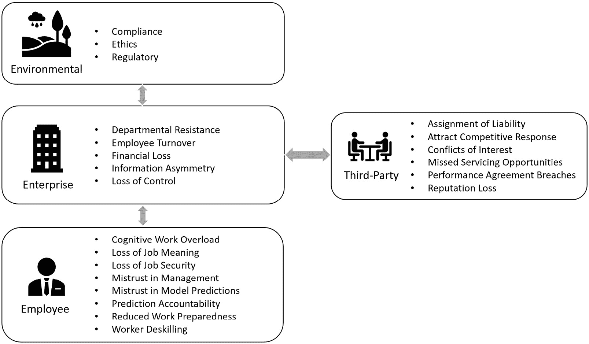
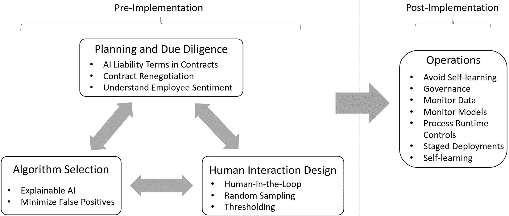

# 13

# 其他智能蓝宝石产品及未来人工智能趋势

在核心 BP RPA 软件之外，还有其他产品丰富了 BP 的人工智能产品组合。在本章中，我们将讨论这四种产品。我们本章的目标是了解产品的用途以及它们如何融入人工智能。我们还将介绍使用每个产品的概述步骤。最后，我们将探讨如果您想尝试这些产品需要采取的下一步行动以及如何获取更多信息。为了完成本书，我还会讨论我认为的人工智能的未来趋势。

我们将要讨论的四个 BP 产品如下：

+   解码器**智能文档****处理**（**IDP**）

+   文档自动化

+   决策

+   互动

# 解码器 IDP

**解码器** **IDP** 是一种提供 OCR、文档分类、实体提取、表格提取以及用于 HITL 校正和文档训练的 Web 界面的**文档处理**解决方案。解码器于 2020 年 6 月发布，自那时起一直持续升级，因此已经由许多其他公司进行了实战测试。如果您需要从扫描或计算机生成的（非手写）文档的图像中提取内容，您应该考虑使用解码器。

作为一位使用过解码器并且听取过使用过它的 BP 客户的反馈的人，它对于计算机生成的文档绝对值得考虑。它也适用于具有不同行数的表格的文档。目前不支持大量手写的表格（尽管在接下来将要讨论的下一个产品中是支持的）。

我看到一些 BP 客户和合作伙伴内部构建了功能较不全面的文档处理解决方案，这至少需要几个月的开发工作。解码器为您提供免费的文档处理解决方案，前提是您的公司拥有 BP 的**生产**或**业务关键**支持计划。

## 解码器与人工智能有何关联？

从文档中提取字段以便它们可以被 RPA 处理是人工智能最常见的使用案例之一，以至于每个主要的 RPA 供应商都有一个专门用于该任务的产品。

在幕后，解码器在多个地方使用机器学习。首先，解码器使用 OCR 引擎（Tesseract），它本身具有预训练的 ML 模型，用于识别文本。接下来，解码器可以训练**文档分类模型**以区分不同类型的文档。例如，您可能有一个电子邮件账户，该账户接收报价和发票作为附件。解码器可以帮助您区分这两种类型的文档，并使它们沿着不同的自动化处理路径开始。

Decipher 还可以训练特定于文档的模型以**提取预指定的实体**或从文档中提取**结构化数据**。预指定意味着您必须提前告诉 Decipher 您试图提取的内容，例如发票号码或总价。当您在网页 UI 中纠正实体预测时，您将看到您指定的确切字段。Decipher 还可以处理**半结构化数据**，这意味着具有固定位置字段的文档以及长度可变的表格项。

最后，还有一个可以提取**非结构化数据**的 NLP 插件。此插件需要安装 GPU。从查看插件的第三方许可声明来看，它使用 Keras 和 Tensorflow，这表明这里正在使用一些神经网络或深度学习模型。

Decipher 还附带一个可用于验证和纠正提取文档字段预测的**HITL 网页界面**。提取的字段与您预先指定的实体并排显示，以便轻松比较并做出修改。

## 使用 Decipher

您如何使用 Decipher 的高级视图如下：

1.  在 Decipher 网页界面中，定义您想要提取的**文档类型**，例如申请表、发票、财务报表等。

1.  对于之前定义的每种**文档类型**，指定您想要提取哪些**字段**和**表**。这两步操作只需进行一次，除非您需要更改要从文档中提取的字段。更改字段将导致需要重新训练整个 ML 模型以适应此文档类型。

1.  从 BP 发送一批图像或文档到 Decipher。这是通过**Decipher** VBO 的一系列操作完成的：**创建批次**、**将文件添加到批次**（必须在每个单独的文件上完成）和**提交批次**。

1.  Decipher 在后台处理文档，并尝试执行分类或提取。它根据模型置信度分数和默认的**阈值**值（用户可以更改）确定是否需要人工审查文档。

1.  用户检查是否有需要审查的文档。此检查可以通过 BP 流程、使用**有批次待验证**操作或访问 Decipher UI 并手动检查来完成。如果需要 HITL 审查，用户访问网页 UI 并纠正 Decipher 提取的内容。所做的更正将反馈到 ML 模型中，随着时间的推移提高准确性。

1.  在 BP 中，需要有一个流程来检查是否存在完成的批次，使用 **Decipher** VBO 动作 **获取下一个完成的批次**。完成的批次包含经过人工审查的文档，以及由于超过阈值要求而无需人工审查的文档。如果有完成的批次，我们可以通过使用 **获取文档** **数据** 动作循环遍历完成的批次文档的提取数据以供 BP 处理。

## 下一步

Decipher 可以直接从 BP Portal 下载：[`portal.blueprism.com/products/decipher`](https://portal.blueprism.com/products/decipher)。如果您还没有 Decipher 许可证，您需要向您的销售代表申请。

您还需要为新基础设施的安装准备 Decipher。最低要求列在这里：[`bpdocs.blueprism.com/decipher-2-2/en-us/getting-started/minimum-requirements.htm`](https://bpdocs.blueprism.com/decipher-2-2/en-us/getting-started/minimum-requirements.htm)。我注意到客户在使用 IDP 时提出的一个反对意见来自基础设施要求以及额外的依赖。Decipher 需要安装 RabbitMQ 消息代理，而一些 IT 团队可能没有准备或不愿意支持这一点。

对于试点或测试，可以在单个虚拟机上安装 Decipher 及其所有依赖项。对于生产部署，您可能还需要另外四个虚拟机，除非您愿意将一些 Decipher 组件一起托管，但这还没有考虑到高可用性和灾难恢复。Decipher 的基础设施成本应该提前考虑。虚拟机的大小也很棘手，因为您需要估计每小时要经过不同 Decipher 组件的页面数。大小指南可以在这里找到：[`bpdocs.blueprism.com/decipher-2-2/en-us/Guides/Architecture/sizing.htm`](https://bpdocs.blueprism.com/decipher-2-2/en-us/Guides/Architecture/sizing.htm)。

Decipher 使用确实需要一些培训。学习曲线不如常规 BP 那么陡峭，但您仍然应该预计在开始变得高效之前至少需要花费一周或两周的时间来尝试使用系统。有关 Decipher 的更多信息可以在 BP 文档网站上找到：[`bpdocs.blueprism.com/decipher-2-2/en-us/home.htm`](https://bpdocs.blueprism.com/decipher-2-2/en-us/home.htm)。最后，BP Portal 网站提供了与 Decipher 一起使用的模板和使用说明：[`portal.blueprism.com/products/developer-jumpstart`](https://portal.blueprism.com/products/developer-jumpstart)。

# 文档自动化

**文档自动化**（**DA**）是 BP 的第二种文档处理解决方案。在 SS&C（BP 的母公司）收购 BP 之前，DA 就在开发中。收购后，DA 被整合到 BP 的产品线中。从高层次来看，DA 用于提取**结构化**数据，或格式固定且文档字段位置不变的文档。它擅长处理低质量数字文档，并能处理手写文本。

我尚未在生产环境中使用 DA，但我已经阅读了内部培训材料。DA 的一个关键优势是它是一个完全**托管解决方案**，符合 HIPAA、SOC 2、GDPR 等标准。与 Decipher 不同，它没有基础设施方面的担忧。它也是一个经过验证的系统，拥有众多客户和数百万页已处理的文档。如果你担心将文件发送到公司外部，你可以在 DA 中指定数据保留期，这样超过一定日期的文件就会被从系统中清除。

DA 与 Decipher IDP 在以下方面有所不同：

+   DA 专门提取**手写**或**打印**的、在**低质量**数字格式中的数据。例如，使用标准 OCR 技术提取时准确度较低的扫描和传真文档。截至版本 2.2，Decipher 无法处理手写数据。

+   DA 专注于**结构化**文档，而 Decipher 可以处理结构化、半结构化和非结构化文档（带有 NLP 插件）。DA 不处理具有可变行数的表格文档。

+   DA 是一种**托管**服务，不能在本地安装。Decipher 由客户安装、托管和维护。

+   DA 有一个独立的许可模式，与 BP 的许可无关。它不是免费的。只要你在生产或业务关键 BP 支持计划下，Decipher 每月最多可处理 4,000 页，且是免费的。

+   DA 可以作为独立产品使用，无需 BP。DA 与 BP 之间的联系是通过 DX 上的连接器资产：[`digitalexchange.blueprism.com/dx/entry/9648/solution/chorus-document-automation`](https://digitalexchange.blueprism.com/dx/entry/9648/solution/chorus-document-automation)。Decipher 与 BP 紧密集成，不能在没有 BP 的情况下使用，除非你开发一些重大的自定义解决方案。

+   DA 不会为每种类型的文档训练单独的 ML 模型。Decipher 在产品中有一个循环，包括培训、（如有必要）纠正提取的数据、重新培训以及获取反馈。虽然 DA 有一个用于审查提取数据的 Web 界面，但它仅用于纠正数据。纠正不会用于改进你独有的模型。

+   从最终用户的角度来看，DA 更容易使用，因为许多机器学习概念不需要考虑。Decipher 需要培训，并且启动时间较长。

## 文档自动化与 IA 有何关联？

DA 与 Decipher 有类似的使用场景。您会使用它将文档转换为 CSV/JSON 格式，以便它们可以被 BP 进一步处理。区别在于 DA 擅长处理哪些类型的文档，使用通用 ML 模型（而不是适合您文档的特定模型），以及用户界面。DA 用于具有固定格式且可能已用笔迹填写的文档。

在幕后，DA 有一个专有的 AI 算法，该算法使用神经网络。这个模型是在超过 12 亿个数据点的由人类纠正的数据集上训练的。该模型在 DA 的所有企业客户中的平均准确率是 96%。

## 使用文档自动化

在高层次上，使用 DA 的步骤如下：

1.  在 DA 的 Web 界面中，定义您想从文档中提取的*字段*，例如，姓名、姓氏和地址。字段有一个“名称”和数据类型，例如，中等文本、单选一、签名等。

1.  定义一个*模板*。模板代表一个可以跨越多个页面的表单。将模板页面的示例上传到 DA，可以是图片或 PDF 格式。一旦上传模板文件，它将在 Web UI 中显示，并列出您已定义的所有字段。

1.  在模板图像上绘制您选择的字段所在的框。这就是您将哪些字段属于模板的过程。这也告诉 DA 在 x，y 坐标的大致位置应该查找以提取特定字段。

1.  将一批文档上传到 DA，通过 Web UI、API（DX 资产使用的是 API）或通过上传文档到云存储，如 AWS S3 或 Google Drive。

1.  提交批次并指定您想使用的模板。您也可以让 DA 为您选择模板。DA 使用对齐功能，如线条、徽标和模板中存在的字段的边界框，以找到最佳匹配的模板。

1.  DA 在后台处理文档。如果需要，它将选择最佳匹配的模板来使用。然后，它将根据定义的字段提取数据。

1.  （可选）通过 Web UI 将提取的数据与实际文档并排审查和纠正。

1.  对字段应用转换，例如日期格式化和大写。

1.  通过 Web UI 或 API 以 CSV 或 JSON 格式检索提取的数据。

## 下一步

这里有一个免费试用，您可以在此处注册：[`shreddr.captricity.com/accounts/signup`](https://shreddr.captricity.com/accounts/signup)。生产使用需要从销售代表处获取报价。由于它取决于许多因素，如您需要处理的页面数量以及您需要的 SLA，因此没有固定的定价。您还可以考虑使用专业服务来加速将用例投入生产。您的销售代表也可以帮助您。有关 DA 的更多信息，可以在文档网站上找到 [`bpdocs.blueprism.com/document-automation/en-us/home.htm`](https://bpdocs.blueprism.com/document-automation/en-us/home.htm)。

# 决策

**决策**（不要与决策阶段混淆）是一个允许开发者用机器学习模型调用替换复杂的决策和选择阶段逻辑的产品。如果您有复杂的嵌套 if-else 分支，可以考虑使用决策。

图 13.1 – 将复杂的决策和选择阶段逻辑转换为单个操作

它适合那些没有访问数据科学家，并且已经有一些 RPA 成功经验，但刚刚开始 IA 旅程的团队。决策将允许他们以某种形式尝试 IA，即使他们不熟悉训练新模型、部署它和审计预测的概念。

决策是一个 AutoML 解决方案，它从用户那里隐藏了机器学习生命周期的复杂性。用户只需通过 Web 界面定义模型的潜在输出和输入。然后决策生成输入的随机变体，并询问用户正确的预测应该是什么。经过几轮这样的操作后，就构建了一个机器学习模型。

决策不是一个独立的解决方案。它是一个通过另一个名为 **Blue Prism Hub** 的基于 Web 的产品安装和管理的 *插件*。如果您想尝试决策，您需要有一个作为先决条件的运行中的 Hub 安装。

我认为决策不适合用于有大量输入列（> 10）的用例。原因是通过 Hub 的 Web UI 逐个样本进行“训练”，有人手动查看输入并告诉决策预测应该是什么。大量的输入使得这个过程非常繁琐。我还认为决策必须与一个可行的替代方案竞争，即通过流程工作室简单地创建复杂的逻辑图。另一个需要考虑的问题是逻辑是否容易更改。想象一下，您需要向模型添加另一个输入，或者添加另一个预测输出可能性。这可能导致重新进行整个模型的“训练”过程，这可能非常耗时，因为它是通过 Web UI 完成的。修改流程图可能更容易一些。

## 决策与 IA 有何关系？

决策提供了一个直接的方法将 ML 模型部署到生产环境中。安装决策需要部署一个新的服务器，尽管您可以在 Hub 所在的服务器上共同托管它。模型作为基于 Web 的服务在 Windows 或 Linux 上运行。决策具有模型版本控制功能，这是多个先前章节中的重要主题。还有一个模型历史审计跟踪，它记录了所有预测的输入、输出、置信度分数和模型版本。

模型应具有表格输入。您不能使用图像、音频或提示输入。输出可以是数值的（回归）或分类的（分类）。虽然底层模型不是公开知识，但根据引用 scikit-learn 和 SciPy 的第三方认可，我预计它正在使用基于树的算法。基于树的算法也是为数不多的同时适用于回归和分类问题的算法之一，并且它们可以相对快速地进行训练。

## 使用决策

从高层次来看，使用决策的步骤如下：

1.  在 Hub 中创建一个新的决策模型。

1.  选择模型应预测的输出类型。这可以是数值或分类（标签文本）。如果是数值，您可以限制预测的数字范围。如果是分类，您可以定义标签列表。

1.  通过为每个变量指定一个标识名称和类型（数值或分类）来定义模型输入变量。

1.  现在输入和输出已经定义，我们可以添加固定规则。固定规则在 ML 模型使用之前运行。这允许您有一个混合决策策略，首先使用固定、硬编码的规则，然后是 ML 模型。

1.  如果模型输出是分类的，您需要为每个定义的预测标签手动创建一个数据样本。决策将循环遍历每个潜在的预测输出，并要求您创建一组导致该预测的输入。

1.  为每个输出创建一个数据样本后，决策开始展示输入数据的随机排列，并要求您选择正确的预测。这被称为决策的*训练*阶段。随着您进行更多此类操作，模型应该变得更加准确。当您觉得模型满足您的准确度要求时停止。

1.  到目前为止，我们有一个使用多个经过人类验证的数据点训练的模型。接下来，决策使用该模型，生成随机输入数据，并显示其预测和置信度。您有两个选择。首先，如果预测错误，您可以纠正预测。或者，您可以更改输入数据，使其导致决策的预测。这被称为决策的*校准*阶段。重复此步骤，直到您满意为止。

1.  保存模型并记下**模型 ID**。

1.  在您的 BP 图中，使用**实用 - 决策**VBO 和**获取预测**操作，并传入**模型 ID**（以及您的输入数据）。将返回预测输出和置信度。

## 下一步

决策功能对拥有生产或业务关键支持计划的客户可用。如果您的公司拥有这些计划之一，您可以通过您的销售代表请求决策许可证。许可证准备好后，您可以从这里下载 Decision：[`portal.blueprism.com/product/related-products/decision`](https://portal.blueprism.com/product/related-products/decision)。

假设您已经拥有 Hub，设置 Decision 并不复杂。在大多数情况下，只需要一个额外的服务器。然而，如果您还没有 Hub，您将需要为一个非常大的部署做好准备，因为 Hub 的基础设施设计和安装非常复杂，而 Hub 是 Decision 的先决条件。

关于 Decision 的更多文档可以在这里找到：[`bpdocs.blueprism.com/hub-interact/4-7/en-us/home-decision.htm`](https://bpdocs.blueprism.com/hub-interact/4-7/en-us/home-decision.htm)。

# Interact

Interact 是 BP Hub 的一部分产品。它是一个基于 Web 的 HITL 界面，它使人们（通常是业务用户）与其 BP 数字工作者之间的协作成为可能。通过 Interact，您可以设计用于向业务用户展示的 Web 表单并请求他们的输入。当业务用户提交 Interact Web 表单时，您可以执行各种操作，例如触发一个流程开始，或继续等待人工批准的流程。

## Interact 与 IA 有何关联？

如您所猜测的，Interact 是作为 ML 预测审查界面的好选择。它具有将审查数据推送到 Interact 表单的 BP 操作。表单可以分配给特定的 Interact 用户（称为审阅者），或一组审阅者。审阅者可以用正确的预测填写表格，并将其发送回 BP 进行进一步处理。它与 BP 企业产品紧密集成，因此您不需要使用可能脆弱的数据共享接口，例如共享文件夹中的 Excel 文件。

Interact 适用于数值和基于文本的输入和输出值。如果 ML 输入/输出有图像，则 Interact 无法在 Web UI 中显示图像，因此它将不起作用。Interact 还有自己的审计跟踪，记录了谁进行了审查以及他们的审查预测是什么。

## 使用 Interact

在高层次上，使用 Interact 作为审查 ML 预测的接口的步骤如下：

1.  创建一个 Interact 表单。表单必须与 BP 流程相关联。

1.  将已审查的预测数据推送到工作队列。这应该是一个新的队列，而不是原始流程中使用的队列。如果需要，为表单设置服务等级协议（SLA）。这将与 HITL 审查 SLA 相对应。

1.  如果您需要将表单拆分为多个页面，请向表单添加页面。

1.  在页面上添加所需的表单字段，如文本、文件上传和表格。所有这些字段都可以有默认值、范围以及限制可以输入的内容。

1.  保存表单。

1.  通过向表单添加 Interact 用户角色来部署表单。这会将 Interact 用户映射到他们可以访问和提交的表单。

1.  修改制作机器学习预测的流程，以使用**实用工具 – Interact API** VBO。一旦流程确定需要 HITL 审查，数字工作者应检索表单并使用输入数据和预测填写它。然后使用**提出提交**或**向角色提出提交**操作请求某人审查预测。工作队列项应存储由操作返回的**_requestId**数据项的引用。

1.  Interact 用户（审阅者）访问 Interact Web UI 并纠正提交。这将在步骤 2 中描述的新工作队列中创建一个新的条目。

1.  修改检查 HITL 评论的流程。使用**实用工具 – Interact API::获取提交**并输入**_requestId**。检索已审查的预测数据，并继续执行流程逻辑。

## 下一步

Interact 适用于拥有生产或业务关键支持计划的客户。如果您的公司拥有这些计划之一，您可以通过您的销售代表申请 Interact 许可证。许可证准备好后，您可以从这里下载 Interact：[`portal.blueprism.com/product/related-products/blue-prism-interact-premise`](https://portal.blueprism.com/product/related-products/blue-prism-interact-premise)。

安装 Interact 是一个相当复杂的过程，即使我们排除等式中的 Hub 部分。有关 Interact 的基础设施、硬件和软件要求的更多详细信息，请在此处查看：[`bpdocs.blueprism.com/hub-interact/4-7/en-us/installation/install-interact.htm`](https://bpdocs.blueprism.com/hub-interact/4-7/en-us/installation/install-interact.htm)。

BP 专业服务提供 Interact 加速器包，以获得 Interact 专家的指导。最困难的部分将是设计表单，以及安装，这两者都包含在此服务中。您可以联系您的销售代表获取更多信息。产品的学习曲线本身并不那么糟糕，但从基础设施角度来看设置 Interact 可能是一个多月的任务。有关 Interact 的更多信息，请在此处查看：[`bpdocs.blueprism.com/hub-interact/4-7/en-us/home-interact.htm`](https://bpdocs.blueprism.com/hub-interact/4-7/en-us/home-interact.htm)。

# 未来 IA 趋势

我相信在未来的几年里，三个广泛的 IA 趋势将会显现。第一个是将 AI 直接集成到 RPA 产品套件中的加速整合。接下来是通用、低认知 AI 任务的 LLMs 的广泛应用。第三个趋势是 IA 在伦理和安全方面的审查增加。

## 改进的 AI 产品集成

正如我们在本章中看到的，BP（以及其他 RPA 供应商）的产品套件中已经有许多与 AI 相关的产品。但随着 IA 的发展，我认为产品提供将发生以下变化：

+   将会有更多推动使用基于云的产品版本的趋势，更新的服务条款允许供应商捕获关于你流程流程的高级信息。大多数 RPA 供应商都希望开始训练自己的类似 LLM 的模型，并提供类似 Copilot 的产品功能。

+   用于 ML 审查和构建 ML 模型的 HITL 界面工具将变得更加紧密集成。在 BP 中，这将涉及 Interact 和 Decision。

+   添加数据和 ML 模型监控工具。

+   这可能还需要几年时间，但预计将推出实施通用 ML 可解释性技术（如 SHAP、LIME 和 ICE 图）的产品，这些技术可以自动与 ML 审计日志关联。这些可解释性技术将用于使用供应商的 ML 产品套件构建的模型，例如 Decision。这是因为许多这些技术需要与模型本身非常紧密的集成。一些需要服务器日志访问和访问原始训练数据。由于对在商业中使用 ML 的审查增加，这两点都将被需要。

## 使用 LLMs 实现 ML 的民主化

许多人认为，大型语言模型（LLMs）将导致基于聊天机器人的 IA 用例激增。虽然这可能成立，但我相信 LLMs 更大的增值在于它们使机器学习民主化，类似于低代码开发解决方案如何使软件开发的部分民主化。

LLMs 的出现使得公民开发者能够参与到机器学习的使用中，并开发他们自己的 IA 流程。在 LLMs 出现之前，我会把 ML 放在典型公民开发者的技能水平之上，但这种情况不会持续太久。虽然 LLMs 的使用案例仍然属于初中生可以完成的认知技能类别，例如数据提取和文本生成，但我们预计这会随着时间的推移而改善。随着 LLMs 变得更加强大，公民开发者将能够访问越来越强大的 AI。

尽管如此，总会有理由定制构建 ML 模型。当你的 AI 使用存在潜在审查时，使用数据和经过验证的技术堆栈构建定制模型将是有益的。LLMs 无法承受这种程度的审查，因为创建它们所需的数据集太大，难以理解。

## 人工智能伦理和安全

如第四章所述，各国政府目前正在形成他们对人工智能和人工智能助手（IA）的看法，以及这些如何与人类工人相关。大学和其他政策智库也在提出他们的意见，以帮助塑造人工智能政策。例如，2023 年 11 月，麻省理工学院发布了一系列政府政策简报，以帮助塑造人工智能的治理。这些简报可以在以下链接找到：[`computing.mit.edu/ai-policy-briefs`](https://computing.mit.edu/ai-policy-briefs)。虽然这些还没有成为完整的法规，但阅读它们可以让我们对未来可能发生的事情有所了解。以下是一些与本书直接相关的政策建议：

+   人工智能必须受到监管，可能由新成立的联邦机构负责。

+   必须开发人工智能系统的审计制度。一些高风险用例在使用前应进行审计，而低风险用例则可以进行事后审计。

+   人工智能系统应该是可解释的。

+   在责任方面，服务的最终提供者应承担责任，即使模型是建立在另一个基础模型之上。

这本书的撰写考虑到了对未来人工智能治理的广泛视角。人工智能助手（IA）必须在监管体系范围内实施，而这个体系正在我们说话的时候形成。IA 团队成员应自觉努力，跟上当地人工智能监管的最新发展，并调整内部实践以满足当地监管要求。

# 摘要

在本章中，我们探讨了四种额外的 BP 产品，可以帮助你在人工智能助手（IA）的旅程中。其中两款产品，*Decipher IDP*和*文档自动化*，专注于使用机器学习处理文档。文档自动化是一个托管解决方案，专注于从质量较差的手写扫描文档中提取数据，这些数据以固定、结构化的形式存在。Decipher 是一个自托管解决方案，它构建特定于您文档类型的机器学习模型。它可以对文档进行分类，并从结构化、半结构化和非结构化文档中提取数据。

*决策*是一个自动化机器学习（AutoML）产品，它将机器学习的复杂性隐藏在用户之外。它可以用来用单个机器学习调用替换复杂的决策和选择阶段逻辑。用户可以通过 Decision 在 Hub 上的 Web 界面快速创建模型。首先，指定预测输出应该是什么。然后定义输入。Decision 随后向用户展示不同的输入组合，并要求他们提供正确的预测。经过几次重复后，将构建一个模型。Decision 内置了人工智能最佳实践，如机器学习版本控制和审计跟踪。

*Interact*是 BP 解决人机协作的解决方案。通过 Interact，您可以通过 Hub 平台向用户（审阅者）展示网页表单。用户可以通过这些表单以多种方式与 BP Digital Workers 互动。例如，他们可以触发一个流程开始，或作为 ML 预测的审阅者。也可以定义审阅的 SLA。

最后，我们讨论了三个我认为将在未来几年发生的未来 IA 趋势。首先，供应商的产品将针对 IA 特定的关注点进行许多改进。其次，随着公民开发者能够在其业务流程中使用 ML，LLMs 将极大地扩展 IA 用例的数量。第三，关于 AI 使用的法规将开始改变我们的 IA 实践，因为它们将变得更加明确。

恭喜您完成这本书！希望其中的知识和例子能帮助您和您的公司在 IA 的道路上取得成功。作为最后的额外奖励，我在接下来的*附录*中包括了与我这本书相关的研究总结。虽然论文总结不是针对 BP 特定的，但信息对参与 IA 的每个人来说都应该是相关的，从开发者到顾问和自动化负责人。

# 附录

# IA 风险管理

本附录总结了我的 IA 论文研究的一部分。我的研究主要关注于*揭示 IA 对企业的风险*。这一研究的动机在于，我希望能够提高行业对这一研究不足且评价不高的主题的理解，我认为这对 IA 在全球范围内的采纳和成功至关重要。我还希望，了解 IA 的风险将迫使我们考虑如何应对这些风险，并减少自动化对社会可能产生的负面影响。

我的研究揭示了**36**个 IA 风险。这些风险被分为两大类：**社会组织**和**运营**。*社会组织*风险源于不同社会结构之间的关系。例如，这可能是企业与法律体系之间，或管理层与员工之间的关系。*运营*风险是指在 IA 运营过程中出现的问题。与社会组织风险相比，它们的范围更窄，且具有项目或技术性质。

我还研究了有哪些*缓解措施*可以用来对抗 IA 风险。这些风险缓解技术指导了本书的开发，并在可能的情况下被纳入到*可重用 IA 模板*中。您只需将模板作为您 IA 解决方案设计的起点，就可以利用许多风险降低措施。

# 社会组织 IA 风险

确定了四个组织结构。它们是*环境*、*企业*、*第三方*和*员工*。这些群体之间的冲突导致了 22 个 IA 风险。

图表附录.1 – 四个组织群体及其之间风险的产生

以下表格总结了 22 个风险：

| **社会-组织人工智能风险（22 个）** |
| --- |
| **环境风险（3 个）** | **描述** |
| 合规性 | 我们正在撰写关于在商业中使用人工智能的新法规。我们不仅必须遵守这些法规，第三方机器学习供应商也必须遵守。目前的法规大部分是相当近期的，法律本身有时可能比较模糊。 |
| 伦理 | 算法和用于训练它们的训练数据都可能存在偏见。除非明确允许，否则我们应该避免使用受保护的数据，例如种族起源、年龄或性别。特征也可能与敏感数据相关联；例如，一个地理区域可以与某些种族群体相关联。伦理的另一个方面是公司对待受人工智能影响员工的方式。 |
| 监管 | 未来的法律可能要求企业完全禁用算法决策，并在某些情况下提供仅限人类干预。一个谨慎的人工智能团队将规避风险，并实施禁用在人工智能中的机器学习的方法，即使目前还没有要求他们这样做。可解释人工智能也应被探索。 |
|  |
| **企业风险（5 个）** | **描述** |
| 部门抵制 | 经理人担心由于预算和人员编制的减少，人工智能将缩小他们的影响力范围。这可能导致整个部门对人工智能倡议的不合作。 |
| 员工流失 | 人工智能的采用可能导致高员工流失率。原因可能包括工作时间减少、压力增加和意识形态上的反对。 |
| 财务损失 | 基于错误的机器学习预测和未达到的机器学习 SLA 完成的工作可能导致财务损失。这可能来自法律赔偿或根据错误预测执行的不正确工作。 |
| 信息不对称 | 人工智能可以在公司内部创造权力不平衡。使用人工智能的业务单元可能拥有更多数据访问权限，并能更快、更准确地完成工作。这可能会加剧具有竞争文化的公司的问题。 |
| 失去控制 | 使用第三方供应商的机器学习服务可能导致失去控制。模型可能在没有事先通知的情况下更新，服务可能发生计划外的中断，从而阻止您满足服务水平协议（SLAs）。 |
|  |
| **员工风险（8 个）** | **描述** |
| 认知工作超负荷 | 简单的认知任务比复杂的任务更频繁地被自动化。随着时间的推移，许多简单的认知工作者任务可能会被自动化，只剩下困难的工作留给人们去做。这可能导致工作压力和认知超负荷的增加。 |
| 工作意义丧失 | 对员工有意义的可能成为自动化的目标。如果被自动化，人们的就业满意度可能会下降。 |
| 工作安全感的丧失 | IA 可以自动化基于知识的工作任务。这将导致更多人担心他们的工作。 |
| 对管理的信任缺失 | IA 可能在管理层和受 IA 影响的人之间培养不信任。 |
| 对模型预测的不信任 | 人们可能认为 ML 模型无法复制他们的知识。他们可能不相信模型的结果。这可能导致对 IA 努力的积极抵制或破坏。员工也可能决定手动完成案例，完全不使用 IA 流程。 |
| 预测问责制 | 公司应明确界定谁对错误的 ML 预测结果负责。 |
| 工作准备度降低 | 员工在查看高度自动化的工作案例细节方面花费的时间总体上较少。如果案例需要手动处理，则需要投入更多精力来跟上进度。这对于时间敏感的工作案例，如客户服务电话，可能很重要。 |
| 工人技能退化 | 决策是一种需要使用来维持的技能。如果人类的决策被自动化，由于使用频率较低，工人的技能水平可能会下降。在极端情况下，这可能会发生在多个工人身上，导致特定功能的决策技能永久丧失。 |
|  |
| **第三方** **风险（6）** | **描述** |
| 责任归属 | 当涉及 IA 的多个方面时，例如服务公司和云供应商，如果 IA 流程中出现问题，可能不清楚谁对损害负责。也可能无法证明第三方中有任何一方有过错。 |
| 吸引竞争反应 | 公开推广 IA 的使用可能导致竞争对手采取行动。例如，竞争公司可能开始投资他们自己的 IA 能力，或者利用这些信息以负面形象描绘您的公司。 |
| 利益冲突 | 为您开发算法的 ML 供应商可能将您的算法转售给其他人，或者在它对您的运营变得至关重要之后显著提高价格。 |
| 错过服务机会 | 当我们使用 AI 与客户（聊天机器人）交互时，它只能根据之前所见的内容形成响应。客户可能有的边缘情况和特殊请求无法得到服务，而如果人类是交互的一部分，这些情况本可以得到服务。 |
| 执行协议违约 | IA 可能要求现有的合同执行协议重新谈判。它向自动化流程引入了额外的故障点，例如服务器基础设施，这可能导致服务中断，并导致错过服务级别协议（SLA）。 |
| 声誉损失 | 由于错误的 ML 预测而执行的工作可能导致公司声誉受损。 |

表格附录.1 – 22 个社会组织 IA 风险

# 运营 IA 风险

将 14 项运营风险分为四个类别：*项目*、*流程*、*ML 模型*和*数据*。

图附录.2 – 四种操作风险类别

以下表格显示了操作风险的总结：

| **操作智能** **风险（14**） |
| --- |
| **项目** **风险（3**） | **描述** |
| 预测性能低 | IA 的预测可能不如现状准确。这可能导致自动化结果不佳。 |
| 低 **投资回报率**（ROI） | 由于需要额外的人工智能工程师、重新训练模型和监控模型等成本，IA 可能被认为比 RPA 提供更低的 ROI。 |
| 无法衡量的 ROI | 知识或决策工作的价值可能难以量化。这使得 IA 的 ROI 计算也变得困难。 |
|  |
| **流程** **风险（4**） | **描述** |
| 控制流程漂移 | 业务流程或逻辑路径的变化可能导致我们重建机器学习模型。想象一下，如果我们想处理新的案例类别，而案例类型由分类模型确定。这意味着模型需要预测新的标签，从而需要重新开发。 |
| 执行错误检测困难 | 基于错误的机器学习预测进行自动化可能导致下游处理中的错误。找到这些错误可能很困难。 |
| 对业务逻辑理解减少 | 如果高级人类决策被机器学习模型取代，可能会丢失业务流程的机构知识。 |
| 时间滞后效应 | 随着错误的机器学习预测而进行的下游工作可能导致大量错误处理。从错误预测发生时到发现时，以及在此期间所做的一切错误工作之间的差距被称为“时间滞后效应”。 |
|  |
| **机器学习模型** **风险（3**） | **描述** |
| 对抗攻击 | 机器学习算法可以广泛受到对抗攻击。这是当使用机器学习时出现的一种新攻击向量。对 IA 解决方案的 ML 模型进行的此类攻击可能导致自动化中执行不希望的工作。 |
| 性能下降 | 模型的预测准确性随着时间的推移而普遍降低是众所周知的。为了对抗这一点，模型需要被积极管理和更新。由于新技术和库的出现，模型和技术可能会变得过时，甚至被淘汰。 |
| 迁移学习偏差 | 迁移学习是指使用现有的机器学习模型作为基础，然后在上面构建定制的模型。这在 LLMs 中尤其受欢迎。然而，基础模型中存在的任何潜在问题也会出现在定制模型中。除非你完全停止使用基础模型，否则你可能无法解决这些问题。 |
|  |
| **数据** **风险（4**） | **描述** |
| 数据偏差 | 模型可能在现实生活中的数据上表现不佳，这是由于数据中的偏差造成的。数据偏差的类型包括历史偏差，它强化了特定群体的刻板印象；代表性偏差，某些人口在收集的数据中代表性不足；测量偏差，收集代理数据（例如，使用警察逮捕人数作为犯罪率的代理）；以及聚合偏差，当应该使用多个模型时，却开发了一个万能的机器学习模型。 |
| 数据漂移 | 用于训练模型的输入数据可能已经过时，不再代表当前的数据。这将使模型无法用于当前数据。 |
| 数据隐私与安全 | 由于缺乏专业知识、GPU 和 CPU 计算资源或预算，一些机器学习模型对商业来说难以实现。将数据发送到第三方模型会导致数据隐私问题，并增加数据泄露的风险。 |
| 数据质量 | 低质量的数据会导致性能较差的模型。“质量”是一个定义不明确的概念，但通常包括数据样本的数量、适当的数据结构、缺乏噪声或错误、拥有“完整”的数据以及具有高度相关的特征。 |

表格附录.2 – 14 个操作性的 IA 风险

# IA 风险缓解措施

在我的研究中发现了 15 种风险缓解技术。它们根据它们在 IA 项目中的应用时间被组织成四个类别。在*规划和尽职调查*、*算法选择*和*人机交互设计*下的技术可以在 IA 解决方案部署使用之前的规划和设计阶段使用。在*运营*类别下的技术是在实施后使用的，只要 IA 解决方案在生产中。

图附录.3 – 15 个风险缓解措施

下表展示了风险缓解措施的总结以及它们在本书中讨论或实施的位置：

| **风险缓解** **措施（15**） |
| --- |
| **规划和尽职** **调查（3**） | **描述** | **章节** **参考** |
| 合同中的 AI 责任条款 | 通过正式合同定义在不同情况下，谁对不正确的 IA 工作的结果负责。 | N/A |
| 合同重新谈判 | 当 IA 的使用从根本上改变了它们基于的前提时，与其他公司重新谈判合同。 | N/A |
| 理解员工情绪 | 通过调查员工了解他们对 IA 的看法。使用情绪细分作为优先考虑 IA 项目的标准。*第十章*，*IA 对机器人* *运营模型* 的影响 |
|  |
| **算法** **选择（2**） | **描述** |  |
| 可解释人工智能 | 优先使用本质上可解释的模型。这包括大多数基于树的模型。或者使用可以生成关于预测原因的解释的技术，例如 LIME 或 SHAP。 | *第十章**，人工智能对机器人*操作模型*的影响* |
| 最小化误报 | 将最小化误报作为所使用的机器学习算法的主要目标。 | N/A |
|  |
| **人机交互设计（3）** | **描述** | **章节参考** |
| 人在回路中 | 要求人类审查和审计机器学习模型做出的预测。这可能需要流程重构，以便将自动案例路由回人类进行验证。 | *第四章**，审查预测和人在*回路中* |
| 随机抽样 | 设置一个固定百分比的 IA 工作案例目标，这些案例将被发送给人类进行手动验证。 | *第四章**，审查预测和人在*回路中* |
| 阈值 | 使用机器学习模型的预测值和置信度分数来定义规则，确定何时需要人类对预测进行审查。 | *第四章**，审查预测和人在*回路中* |
|  |
| **操作（7）** | **描述** | **章节参考** |
| 避免自我学习 | 避免使用自我学习来自动改进机器学习模型。采用一种人类必须设计算法变更并在投入生产前签字的方法。 | N/A |
| 治理 | 通过将挑战编码到人工智能程序和文档中，治理机器学习的挑战。 | *第十章**，人工智能对机器人*操作模型*的影响* |
| 监控数据 | 将最近模型输入数据与训练数据进行比较。如果差异显著，则重建机器学习模型。 | *第十章**，人工智能对机器人*操作模型*的影响* |
| 监控模型 | 通过与基线数据进行比较来积极监控模型。在需要时更新模型。 | *第十章**，人工智能对机器人*操作模型*的影响* |
| 处理运行时控制 | 提供在人类决策和机器学习预测之间切换的方法。如果使用机器学习预测，提供启用和禁用人类验证的方法。 | *第六章**，可重用*人工智能组件* |
| 自我学习 | 通过实施自我学习自动改进机器学习模型。允许它们自动部署到生产中。注意与“避免自我学习”之前的*矛盾*；专家们在关于人类对模型改进的控制方面的建议上存在分歧。 | N/A |
| 分阶段部署 | 使用分阶段机器学习部署技术，以便快速部署更新后的模型，并在出现问题时快速回滚。 | *第九章**，机器学习部署和数据库操作* |

表格附录 3 – 15 项风险缓解措施及其在本书中的讨论位置

这项研究总结到此结束。IA（智能自动化）应成为整个公司范围内的**战略**和**转型**性倡议。这需要谨慎的变革和**风险控制**。但如果没有了解采用 IA 风险的基础工作，公司可能会犹豫是否真正转型自己。进行这项基础工作以揭示 IA 的风险，以及缓解这些风险的方法，是我对这个不断发展的领域的贡献。通过分享这些信息，我希望你们能够提供更好的 IA 解决方案，并催化整个行业对 IA 的采用。
