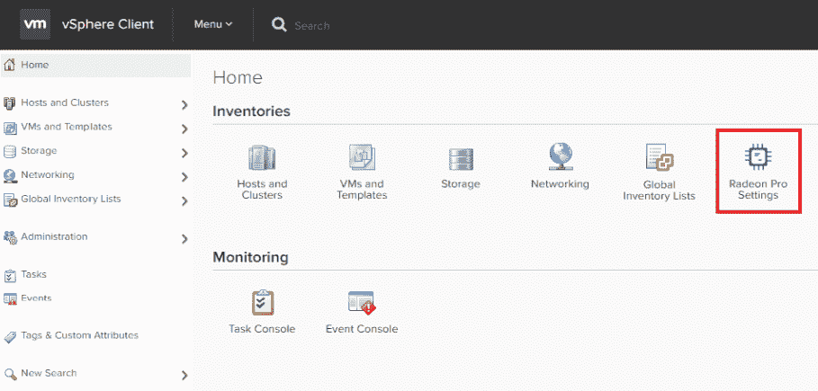

# vSphere 6.7 的机器学习能力

本书将简要介绍不同的 VMware 工具如何帮助客户获得智能自动检测和预测的好处。这一服务将使他们能够检测、可视化和排除异常、未来需求以及潜在的现代应用程序和基础设施问题——所有这些都不需要用户具备统计或算法专长。VMware 为用户提供对所有服务的健康和典型行为指标的统一可见性，无需用户协助，从而减少了故障排除时间。这些工具还将帮助预测，以了解未来的容量需求，并有效地最大化应用程序和基础设施效率。

本章简要介绍了如何通过使用不同的模式在 vSphere 环境中虚拟化 GPU，为特定用户群体创建配置文件，以及关于不同**NVIDIA 显卡**及其使用的信息。我们还将了解如何配置 vSphere 中的 NVIDIA GPU 以支持基于**机器学习**（**ML**）的工作负载，具有不同的用例，以实现特定的商业目标，同时降低成本。

本章我们将涵盖以下主题：

+   ML 与 VMware

+   不同使用 GPU 的模式

+   基于 NVIDIA GPU 的 ML

# 技术要求

您可以下载以下内容：

+   [VMware vSphere 6.7](https://my.vmware.com/en/web/vmware/info/slug/datacenter_cloud_infrastructure/vmware_vsphere/6_7)

+   [VMware vCenter Server 6.5 U1](https://my.vmware.com/web/vmware/details?downloadGroup=VC65U1&productId=676&rPId=28154)

+   [VMware Horizon 7](https://my.vmware.com/en/web/vmware/evalcenter?p=horizon-7&src=WWW_HrzOld_TopNav_DownloadFreeTrail)

# ML 与 VMware

**VMware** 在其大多数产品中广泛利用 AI 和 ML 技术。我们可以从 vSphere 6.7 新版本的功能以及**AppDefense**和**Workspace**等产品中看到这一点。这是将有助于实现未来自动驾驶数据中心愿景的一种智能。VMware 已经对其如何通过 NVIDIA GPU 的改进支持帮助客户在 vSphere 上运行自己的 ML 工作负载进行了性能基准测试。

对于 VMware 混合云愿景，ML 非常重要，因为 ML 有能力吸收大量数据，并利用它进行精确学习以及与最终用户一起使用。

# 基于 ML 的数据分析

机器学习正帮助客户从大量数据集中获取更好的细粒度信息。这将为企业带来巨大的竞争优势，因为客户能够从不同的来源整合他们的数据，这将帮助管理层在竞争对手之前做出重大决策。正如我们得到这个结果及其背后的相关原因，我们可以帮助客户获得准确且高效的数据。人工智能在我们日常生活中的潜力是巨大的。

我们每天都在机器学习方面有新的发展，机器学习将被进一步扩展。所有最大的公共云服务提供商都在他们的日常运营中使用基于机器学习的技巧。苹果、通用电气（GE）和博世（Bosch）也在收集大量数据，并应用机器学习技术来过滤出只有有用的数据。通用电气通过其工业互联网积累数据分析，苹果从其数百万最终用户那里获得了大量的消费者和健康数据，这帮助他们成为人工智能领域的主要参与者。

在现有的云技术中嵌入人工智能，正帮助企业和消费者增长，同时也创造了新的机会，利用所有相关信息来规划未来。我们正朝着智能基础设施迈进，其中人工智能使用机器来采纳人类智慧。人工智能基于基于规则的逻辑、决策树和方法，使其能够像人类一样行为。机器学习分析数据并提高重复性任务的表现。深度学习将帮助机器通过定位和检查各种选项以获得最佳结果或解决方案。

客户已经采用了云计算，现在正在嵌入机器学习技术和其能力，以扩展其动态性并向客户交付价值。客户获得了一个安全且可靠的环境，具有扩展和扩展的能力。作为回报，云服务提供商获得了忠诚的长期客户。每个云服务提供商在特定领域都比其他云服务提供商更好，从商业和人工智能的角度来看。这将为客户提供多样化的产品，为他们的独特需求提供专业化的智能。

虚拟机（VMware）将帮助客户获得智能基础设施，能够在混合云中提供可比较且安全的解决方案，以选择适合其独特业务需求的正确云服务提供商，例如安全、备份、灾难恢复、网络、存储、图形和具有基本计算资源的管理。

智能技术的良好例子是谷歌地图。当我们离开办公室参加会议时，在谷歌地图的指引下，我们能够通过人工智能识别替代路线，节省宝贵的时间。

# 使用虚拟化 GPU 进行机器学习

机器学习目前在研究和开发中被广泛使用，加速器如 GPU 的计算能力提升使得机器学习应用的快速采用成为可能。

设计师、工程师和建筑师是广泛的最终用户，他们经常使用 3D 图形进行广泛的用例，并期望他们的 IT 团队能够协助他们。他们使用高端图形工作站，实时处理汽车、制造组件和建筑物的 3D 模型。他们是制造、建筑、工程和建设、高等教育、公共部门、石油和天然气等行业的一部分。他们必须实时查看和控制这些丰富的二维和三维数据。像临床医生、工程师和办公室专业人士这样的高级用户群体代表了数百万用户，他们依赖于丰富的二维和三维图形来完成他们的工作。

随着全球工作力的足迹扩大，地理上分散的团队使用带有图形的虚拟桌面，无论何时何地，在任意工作站上都可以使用，组织正在不断发展。随着这些高级用户在野外工作，需要从他们的端点设备（如笔记本电脑、平板电脑和移动设备）的任何地方访问应用程序，他们需要与团队成员实时协作，同时降低数据丢失的风险，并完全符合规定。我们必须用 **虚拟桌面基础设施**（**VDI**）解决方案重新定义设计师和工程师的工作流程：


带有 NVIDIA GPU 的 VMware Horizon VDI

VMware VDI 解决方案与所有领先的 3D 应用工作站进行了认证——从端点到数据中心的世界级图形在任何设备上均可访问，同时降低运营成本。VMware Horizon 通过协议 Blast 确保，基于 NVIDIA GRID vGPU 技术提供安全、原生、3D 图形，从云端交付到任何端点设备，并从任何地点提供，同时降低运营成本。使用 NVIDIA GRID vGPU 技术在每台虚拟机上执行的图形命令直接传递到物理 GPU，无需在虚拟机管理程序层产生任何开销。

它有助于应用程序兼容性，因为应用程序可以访问与之前在他们的工作站上相同的显卡。NVIDIA GRID vGPU 使得 GPU 硬件能够进行时间切片，以提供最佳的共享虚拟化图形性能。

VMware、vSphere 和 VMware Horizon 确保高级用户、设计师和工程师能够获得与原生硬件相当且由 NVIDIA 和 VMware 认证的出色图形体验，适用于大多数重要的商业应用。

# GPU 使用模式

在 vSphere 上托管的虚拟机中运行的应用程序可以利用 GPU 处理能力以两种方式。

**vSphere DirectPath I/O** 是 vSphere 的固有功能，它利用配置到主机的 **虚拟化技术**（**VT**）启用处理器来提高虚拟机的性能。**通用输入输出**（**GPIO**）是英特尔/AMD CPU 的处理器功能，称为 I/O 内存管理单元，它分配直接内存访问传输和设备中断。这样，虚拟机能够绕过 VMkernel 并直接访问底层物理硬件。支持使用 DPIO 启用服务器硬件的 vMotion。

硬件辅助 I/O MMU 虚拟化在英特尔处理器中称为 **英特尔定向 I/O 虚拟化技术**（**VT-d**），在 AMD 处理器中称为 **AMD I/O 虚拟化**（**AMD-Vi** 或 **IOMMU**）。这是芯片组的一项功能，它帮助虚拟机直接访问硬件 I/O 设备，如网卡、存储控制器和 GPU。

NVIDIA GRID GPU 支持虚拟化 vGPU，这是在虚拟化环境中多个用户共享单个物理 GPU 的能力。对于 Horizon View 虚拟桌面，有三种基于硬件的图形加速配置可能。vGPU 提供最佳的性能和兼容性选项。

# 比较机器学习工作负载和 GPU 配置

我们可以通过使用三个不同的 GPU 配置来测试相同的机器学习工作负载；这些配置如下：

+   在 vSphere 上使用 DirectPath I/O 的 GPU

+   vSphere 上的 GRID vGPU

+   纯金属主机上的原生 GPU

我们已经测试并发现，虚拟化层（DirectPath I/O 和 GRID vGPU）为测试的机器学习应用引入了仅 4% 的开销。学习时间可以通过使用不同配置的两个虚拟机与特定模型进行比较。

带有和没有 GPU 的两个虚拟机的 VM 资源以及操作系统：

+   **NVIDIA GRID 配置**：1 个 vGPU，12 个 vCPUs，60 GB 内存，96 GB SSD 存储，CentOS 7.2

+   **无 GPU 配置**：无 GPU，12 个 vCPUs，60 GB 内存，96 GB SSD 存储，CentOS 7.2

让我们看一下以下表格：

| **MNIST 工作负载** | **1 vGPU（秒）** | **无 GPU（秒）** |
| --- | --- | --- |
| **标准化学习时间** | 1.1 | 10.01 |
| **CPU 利用率** | 9% | 45% |

如前表所示，vGPU 将训练时间缩短了 10 倍，CPU 利用率也下降了 5 倍。机器学习可以参考以下两个组件：

+   从 TensorFlow 库派生出的卷积神经网络模型。

+   **加拿大高级研究学院**（**CIFAR**）-10 数据集定义了图像数据集，我们利用这些数据集在机器学习和 IT 视觉算法中。

# DirectPath I/O

首先，我们关注从单个 GPU 到四个 GPU 的扩展过程中的 **DirectPath I/O**（**DPIO**）透传模式：

| **CIFAR-10** | **1 GPU** | **2 GPUs** | **4 GPUs** |
| --- | --- | --- | --- |
| **相对于 1 GPU 的每秒标准化图像数（千）** | 1.1 | 2.01 | 3.77 |
| **CPU 利用率** | 23% | 41% | 73% |

每秒处理的图像数随着服务器上 GPU 数量的增加而提高。一个 GPU 几乎用于将数据归一化到每秒 1,000 张图像，并且随着 GPU 数量的增加而进一步增长。通过在两种模式下配置一个 vGPU/VM，可以比较 DPIO 和 GRID vGPU 模式的性能：

| **MNIST 工作负载****（数值越低越好）** | **DPIO** | **GRID vGPU** |
| --- | --- | --- |
| **每秒归一化训练时间** | 1.1 | 1.03 |
| **CIFAR-10 工作负载****（数值越高越好）** | **DPIO** | **GRID vGPU** |
| **每秒归一化图像数** | 1.1 | 0.83 |

DPIO 和 GRID 模式 vGPU 的性能与一个 vGPU/VM 大致相同。我们可以在 DPIO 中配置具有主机上所有可用 GPU 的虚拟机，但在 GRID vGPU 模式下，虚拟机最多只能配置一个 GPU。我们可以区分运行相同作业的四个虚拟机和在 DPIO 模式下使用四个 GPU/主机的一个虚拟机：

| **CIFAR-10 工作负载** | **DPIO** | **DPiO (四个虚拟机)** | **GRID vGPU (四个虚拟机)** |
| --- | --- | --- | --- |
| **每秒归一化图像数（数值越高越好）** | 1.1 | 0.96 | 0.94 |
| **CPU 利用率** | 73% | 69% | 67% |

我们应该在多 GPU DPIO 模式下配置具有低延迟或需要更短训练时间的虚拟机。由于它们专门用于特定的虚拟机，在此期间其他虚拟机将无法访问主机上的 GPU。我们可以通过在 GRID vGPU 模式下配置 1-GPU 来利用具有较长延迟或学习时间的虚拟机，并享受虚拟化优势。

# 虚拟环境中 GPU 的可伸缩性

Horizon 和 vSphere 支持 vGPU，vGPU 带来了广泛的 API 支持和原生 NVIDIA 驱动程序的极致可伸缩性。NVIDIA GRID GPU 基于 NVIDIA Kepler GPU 架构。NVIDIA GRID GPU 支持在虚拟化环境中为多个用户共享单个物理 GPU 的 vGPU 功能。Horizon 将自动在具有所需 GPU 的计算和存储资源池之间负载均衡启用 vGPU 的虚拟桌面，即使不同的池使用不同的用户配置文件也是如此。如果我们创建两个链接克隆池，一个具有 K120Q 配置文件，另一个具有 K220Q，Horizon 将将第一个配置文件放在具有 K1 卡的主机上，而将后者放在 K2 上，无需任何努力。vGPU 配置文件赋予专用图形内存。GPU 管理器分配内存大小以满足每个用户的特定需求。

ESXi 主机可以高达最多 16 个基于物理 GPU 的图形，供不同的虚拟机/用户共享。

Horizon 提供三种类型的图形加速：

+   虚拟共享图形

+   虚拟共享透传图形

+   虚拟专用图形

+   总内存（包括易失性和非易失性内存）不能超过每个虚拟机的最大内存限制（6,128 GB）

# 在虚拟机内部容器化 ML 应用程序

**vSphere 集成容器**架构提供了两种容器部署模型：

1.  **虚拟容器主机**：vSphere 集成容器利用 vSphere 的原生结构来提供容器。它扩展了 vSphere 的可用性和性能能力（DRS、HA、vMotion），以支持容器化工作负载。容器镜像可以用作虚拟机，开发者也可以将其作为 Docker API 消费。

1.  **Docker 容器主机**：开发者可以按需自行配置 Docker 容器主机，并将它们用作开发沙盒来重新打包应用程序。这种架构补充了敏捷开发实践和 DevOps 方法，如**持续集成**（**CI**）和**持续部署**（**CD**）。

重新架构与数据和其他应用程序组件/逻辑紧密耦合的内部应用程序将非常昂贵且耗时，因此在不改变应用程序设计的情况下重新打包应用程序可以节省成本。重新打包应用程序的学习曲线很小。

vSphere 集成容器提供了一个选项，可以通过使用 Docker 命令行界面来实例化 Docker 镜像，然后将容器镜像作为虚拟机部署，而不是在 Docker 主机上作为容器部署，这样我们就可以在不重新架构应用程序的情况下获得打包应用程序作为容器的优势。这种方式，我们保持了虚拟机的隔离性。vSphere 集成容器是无需任何新基础设施/专用硬件或无需实施新工具的理想解决方案，用于应用程序重新打包。

重新打包的容器化应用程序可以与其他运行传统或容器化应用程序的虚拟机一起运行。vSphere 集成容器在基础设施级别具有高可用性，无需开发者干预即可支持重新打包的容器。我们还可以利用核心 vSphere 功能，如**vSphere 高可用性**和**vSphere vMotion**。

# vGPU 调度和 vGPU 配置文件选择

GPU 默认支持等量共享，并且必须根据客户需求配置固定份额。

我们可以使用以下两种选项来配置 GPU：

+   **等量共享调度器**：物理 GPU 在同一主机上运行的虚拟桌面之间共享。随着虚拟 GPU 被添加或从 GPU 中移除，处理周期的份额会发生变化，而虚拟 GPU 的性能取决于其他虚拟 GPU 是否正在运行或停止。

+   **固定份额调度器**：无论虚拟 GPU 是否被添加到或从 GPU 中移除，每个 vGPU 都会分配物理 GPU 处理周期的固定份额。即使其他虚拟 GPU 正在运行或停止，这将是恒定的。

在 vSphere 上配置 NVIDIA GRID vGPU 可以使用各种选项来配置 vGPU 配置文件，该配置文件定义了每个虚拟机可以使用的 GPU 内存以及可以共享单个 GPU 的最大虚拟机数量。

**vGPU 配置文件**提供了一系列具有不同缓冲内存帧大小和头数虚拟 GPU。用户数量将由特定配置文件中附加到每个配置文件的 GPU 的帧缓冲区划分来定义，而头数表示支持的显示器数量，而所有配置文件的最大分辨率将保持一致。以 Q 结尾的 vGPU 配置文件必须遵循与 NVIDIA Quadro 卡相同的认证流程，用于专业图形应用程序。我们可以与这些应用程序获得 100%的兼容性和性能。您可以参考此链接以获取认证应用程序列表：[`www.nvidia.com/en-us/design-visualization/solutions/virtualization/`](https://www.nvidia.com/en-us/design-visualization/solutions/virtualization/)。

# 高级用户和设计师配置文件

我们可以使用**NVIDIA Grid**和**Horizon**将最苛刻的终端用户迁移到数据中心。我们可以通过移动性、易于管理、集中式数据和安全、灾难恢复保护以及其他虚拟化优势来帮助这些用户。我们可以通过将它们依次连接到桌面来将这些用户与其工作站绑定。尽管**虚拟专用图形加速**（**vDGA**）透传允许以 1:1 的比例远程访问工作站，但成本较高且没有进行任何资源优化，现在，我们可以混合工作站用户和任务/知识用户以实现更好的资源优化。我们在设计具有所需兼容性和性能的解决方案时有很多选择。通过利用 NVIDIA 平台，我们可以通过认证的软件和硬件获得高质量的设计应用程序体验。配置文件的选择取决于主要应用程序的要求，基于这些要求，我们可以选择合适的 Quadro 认证 vGPU 配置文件以满足最终用户的需求。

# 知识和任务用户配置文件

任务工作者大多需要**软 3D**，这是一个适用于图形密集度较低的应用程序的基于软件的 3D 渲染器。他们不需要，或从基于硬件的 3D 加速中获得明显的优势。软 3D 是 Horizon 的标准组件。

办公人员和高管属于此配置文件，主要使用 Microsoft Office、Adobe Photoshop 和其他非专业终端用户应用程序。**虚拟共享图形加速**（**vSGA**）解决方案可以通过为跨 GPU 的用户提供高水平的整合来优化此用例的性能。vSGA 不提供广泛的图形 API 支持，因为对于知识工作者来说，始终考虑基于 vGPU 的解决方案会更好。

# 使用 vGPU Manager 向集群添加 vGPU 主机

我们必须安装 NVIDIA GPU 管理器**vSphere 安装包**（**VIB**），因为 NVIDIA VIB 包含主机识别 GPU 所必需的驱动程序。这将为您提供**vGPU 管理器**。在安装受支持的 vCenter 和 ESXi 版本之前，ESXi 主机的 BIOS 电源和性能设置应设置为高性能策略。ESXi 主机通过 vCenter 进行管理，并配置 NTP 和 DNS。

vGPU 管理器 VIB 在虚拟机管理程序中加载的方式与驱动程序相同。vGPU 管理器可以为每个物理 GPU 分配多达八个用户。M60 可以设置为每张卡 32 个用户。此集群必须具有具有 NVIDIA Tesla M60 vGPU 的主机。这是为了优化 GPU 资源的分配。

# 使用 NVIDIA GPU 的机器学习

机器学习帮助计算机以一种用户友好的方式在没有明确编程的情况下工作，因此任何人都可以在日常生活中学习并利用它，例如在健康、研究、科学、金融和智能系统中：


在 NVIDIA GRID vGPU 中分配 GPU

# Horizon 中的池和农场设置

我们必须像在 Horizon 中配置普通农场一样配置一个 3D 农场：

1.  以我们以前在 Horizon 中配置池的方式配置此池，直到我们达到桌面池设置部分。

1.  在添加桌面池窗口中滚动到远程显示协议部分。

1.  在 3D 渲染器选项中，我们必须在以下两个选项中选择两个：

    1.  对于 vSGA 选择硬件或自动。

    1.  对于 vDGA 或 MxGPU 选择硬件。

1.  在桌面池设置中将默认显示协议设置为 PCoIP，并允许用户在 3D 渲染器下拉菜单中选择“否”以选择 NVIDIA GRID VGPU。

1.  要启用 NVIDIA vGPU，请为虚拟机启用 vGPU 支持：


1.  关闭虚拟机。

1.  在导航器窗口中单击 VM。选择“管理”选项卡和“设置”。单击编辑按钮：


1.  单击“新 PCI 设备”栏，选择“共享 PCI 设备”，然后添加以继续：


1.  现在显示 NVIDIA GRID vGPU 设备已添加。

1.  使用 GPU 配置选择栏配置 GPU，然后单击“确定”完成配置。

# 配置硬件加速图形

我们可以通过三种方式使用 VMware Horizon 配置加速：

+   虚拟共享图形

+   虚拟专用图形

+   虚拟共享直通图形

# 虚拟共享图形加速

vSGA 是支持 DirectX 和 OpenGL 的驱动程序。vDGA 配置确实使用了原生显卡驱动程序。SVGA 或 VMware SVGA 3D 是包含在 Windows 虚拟桌面 VMware Tools 中的符合 VMware Windows Display Driver Model 的驱动程序。此 3D 图形驱动程序可以安装在 Windows 上用于 2D/3D，也可以用于 3D 和 vSGA 软件。

VMware SVGA 3D 可以配置为 2D/3D 软件和 vSGA 部署，并且可以通过软件或硬件加速快速在虚拟桌面之间切换，而无需更改现有配置。vSGA 支持具有硬件加速图形配置的 vMotion。通用驱动程序无需进一步配置即可跨平台工作：


服务器的物理 GPU 被虚拟化，并通过 vSGA 技术与其他位于同一主机服务器上的虚拟机共享。我们必须在虚拟机管理程序中集成特定的驱动程序，所有虚拟机都将利用 VMware vSGA 3D 驱动程序。vSGA 在少数没有所需 API 支持的应用程序中具有性能限制，并且对 OpenGL 和 DirectX 的支持有限。

# 在虚拟机中配置 vSGA 设置

在 vSphere 和 View Pool 设置中存在三个现有的 3D 设置。我们可以通过 vSphere 启用或禁用 3D，将 3D 设置设置为自动。如果我们更改 3D 配置，则视频内存将恢复到默认值 96 MB，因此在更改视频内存之前请务必确认。这些配置具有以下选项：**自动**（默认），**软件**，和**硬件**：

1.  启用 3D 支持。

1.  将 3D 渲染器设置为**自动**或**硬件**。

1.  决定 3D 视频内存。默认情况下为 96 MB，但最小可以是 64 MB，最大可以是 512 MB：


# vGPU 的虚拟机设置

现在我们将设置 vGPU 的虚拟机设置，以下截图将展示：


前面的图像将根据应用需求提供多种配置选项，并包含所有安全措施。

1.  选择要配置的虚拟机并点击“编辑设置”。首先，添加一个共享 PCI 设备，然后选择 NVIDIA GRID vGPU 以在虚拟机上启用 GPU 直通：


1.  从 GPU 配置文件下拉菜单中选择所需的配置文件：


GPU 配置文件字符串 4q 通知帧缓冲区（VRAM）的大小（以 GB 为单位）和所需的 GRID 许可证。

VRAM 0,1 分别通知 512 MB，1,024 MB，依此类推。GRID 许可证类型如下：

+   GRID 虚拟 PC vGPU 用于商业桌面计算通知使用*b*：

+   GRID 虚拟应用 vGPU 用于远程桌面会话主机通知使用*a*：

+   Quadro **虚拟数据中心工作站**（**vDWS**）针对工作站特定的图形特性和加速功能，例如最多支持四个 4K 显示器和针对专业应用的认证驱动程序，通过*q*通知：


在创建虚拟机时点击“保留所有内存”。我们可以管理端到端 NVIDIA 虚拟 GPU 解决方案，如 Quadro vDWS 和**NVIDIA GRID 虚拟 PC**（**vPC**），在主机、客户机或应用层对其整个基础设施实现完整的 vGPU 可见性。这有助于我们更加灵活和快速响应，从而为终端用户带来更好的 VDI 体验。

我们可以从高端虚拟工作站到企业虚拟工作空间提供更好的用户体验，这些工作空间购买成本低、部署简单、运行高效。

使用基于 Pascal 架构的 GPU 以及 Quadro vDWS 软件的工程师、设计师、内容创作者和建筑师能够体验到在任意虚拟工作站或笔记本电脑上运行加速图形和计算（CUDA 和 OpenCL）工作负载的最佳效果。

知识工作者使用 Windows 10、Office 365 和 YouTube 等程序，这些程序需要图形加速，以便通过搭载 NVIDIA Pascal™架构 GPU 的 NVIDIA GRID™虚拟 PC 获得更好的虚拟桌面用户体验。NVIDIA NVENC 通过将 H.264 视频编码从 CPU 卸载到 Linux 虚拟工作站用户，从而提供更好的性能和用户密度，这是一个繁重的计算任务。Horizon 为用户提供了一个单一的平台，可以发布所有类型的桌面（Windows 和 Linux）和应用程序，根据用户的图形需求。

# GRID vPC 和 GRID vApps 功能

NVIDIA GRID 提供了基于特定用例的软件版本：

+   **NVIDIA GRID 虚拟应用程序（vApp）**：我们可以用它进行应用程序虚拟化或基于 RDSH 的应用程序发布。

+   **vPC**：它非常适合提供标准桌面应用程序、浏览器和多媒体的虚拟桌面。

+   **NVIDIA GRID 虚拟工作站（vWS）**：这对于使用 CATIA、S、3DExcite、Schlumberger Petrel 或 Autodesk Maya 等强大 3D 内容创建应用程序的科学家和设计师来说将非常有价值。vWS 仅支持这一 NVIDIA Quadro 驱动程序。

NVIDIA GRID 软件版本可以以年度订阅、永久许可或与支持相结合的方式购买。高可用性许可服务器确保用户即使在主许可服务器离线的情况下也能不间断地工作；然后，辅助许可服务器将为客户端提供许可服务。

在基于 Pascal 架构的这次发布中，NVIDIA 虚拟 GPU 解决方案和搭载 Maxwell 架构的 GPU（NVIDIA® Tesla® M60、M6 和 M10）得到支持。NVIDIA 虚拟 GPU 解决方案将在所有搭载 Tesla P40 以及始终推荐的 P6（刀片）GPU 上得到支持，前提是拥有适当的软件许可。

即使您拥有搭载 Maxwell 架构的 GPU 并使用 NVIDIA GRID 解决方案，我们也需要 Pascal 架构的 GPU 才能从性能提升、增加的帧缓冲区、更大和更细粒度的配置文件大小、更大的系统内存、在同一个 GPU 上运行虚拟化图形和计算工作负载的能力以及利用新的任务调度器中受益。

特性如简化管理和监控，有助于在应用层监控和集成方面在 NVIDIA GRID 软件发布和 GRID Management SDK 2.0 上同时工作在 Maxwell 和 Pascal 卡上。我们必须为特定的工作负载选择推荐的 Pascal/Maxwell 板。

我们可以为商业客户推荐 P40 或 M60。P40 提供最高性能、更大的内存和更易于管理，并支持图形和计算（CUDA 和 OpenCL）的虚拟化。当从 M60 或 K2 或基于 Skylake 的服务器升级时，建议使用 P40。M60 将继续提供，并提供异构配置文件和更大的 OEM 服务器支持。

对于密度驱动的部署的客户，建议使用**M10**，而对于运行日常图形加速应用的知識工作者，建议使用 M10。对于高密度刀片服务器部署，建议在 M6 之后使用 P6。

# GRID vWS 到 Quadro vDWS

我们可以利用 Quadro/GRID 功能，并将其与 VMware 虚拟工作站/PC/虚拟应用解决方案进行比较。NVIDIA GRID vWS 现在是**NVIDIA Quadro 虚拟数据中心工作站**或**Quadro vDWS**。GRID 品牌将用于描述 PC 体验，并将有两个版本：NVIDIA GRID vPC 和 NVIDIA GRID vApps。虽然这两个软件版本曾经被称为 NVIDIA GRID 软件平台，但它们现在将被称为**NVIDIA 虚拟 GPU 解决方案**。

MxGPU 是一种 GPU 虚拟化技术，内置硬件引擎负责虚拟机调度和管理。它根据应用程序的要求利用底层 SR-IOV 协议。处于直通模式的 GPU 不能虚拟化，因此首先运行脚本以禁用直通模式。如果 MxGPU 已启用且 vCenter 可访问，则使用插件进行配置而不是脚本。vDGA 可以通过提供对物理 GPU 的直接直通，帮助用户获得不受限制和专用的单 vGPU 访问。使用 MxGPU 设备在虚拟机上安装驱动程序的步骤与 vDGA 下的常规直通设备相同。

在使用 MxGPU 和 vDGA 时配置虚拟机：

1.  对于具有大 BAR 大小的设备，例如 Tesla P40，我们必须在虚拟机上设置配置参数：

    +   `firmware="efi"`

    +   `pciPassthru.use64bitMMIO="TRUE"`

    +   `pciPassthru.64bitMMIOSizeGB="64"`

1.  向特定虚拟机添加 PCI 设备，并选择所需的 PCI 设备以启用 GPU 直通：


1.  通过主页上的管理员账户登录 vSphere Web Client，点击 Radeon Pro 设置。转到数据中心，并管理特定数据中心中的所有 MxGPU 主机。

1.  我们可以在 vSphere Client 插件上安装 Radeon Pro Settings，使用 MxGPU：



VMware 支持 AMD 和 NVIDIA 图形卡。我们可以从供应商网站下载适当的 VMware 图形驱动程序来使用图形卡或 GPU 硬件。我们还可以将 PCI 设备添加到单个虚拟机以及多个虚拟机中。

1.  要使用命令一次性为多个虚拟机添加 PCI 设备，请执行以下操作：

    1.  浏览到 AMD FirePro VIB 驱动程序并安装 AMD VIB 实用程序：`cd /<path_to_vib from ssh>`。

    1.  编辑`vms.cfg`：`vi vms.cfg`。

1.  按*I*键，并将`.*`实例更改为与需要 GPU 的 VM 名称匹配，例如将`*MxGPU*`更改为包含 MxGPU 的 VM 名称：`.MxGPU`。

1.  通过按*Esc*键保存并退出，输入`:wq`并按*Enter*键。

1.  将虚拟功能分配给 VM：

```py
sh mxgpu-install.sh –a assign 
Eligible VMs:
WIN10-MxGPU-001
WIN10-MxGPU-002
WIN8.1-MxGPU-001
WIN8.1-MxGPU-002
These VMs will be assigned a VF, is it OK?[Y/N]y
```

1.  按*Enter*键并选择保留所有客户内存（全部锁定）。

1.  使用 MxGPU 脚本重新启动系统以自动分配**虚拟功能**（**VF**）。

我们应该验证所有 VF 是否已填充在设备列表中。这样，我们可以通过使用脚本自动分配 VF。

# 摘要

对于像 CAD/CAM、诊断成像、分子设计和太空探索等应用程序的远程计算解决方案，证明是难以实现的。NVIDIA GRID vGPU 技术和 VMware、vSphere 和 Horizon 虚拟化软件为设计工程师、科学调查人员和数据探索者提供了成本效益的解决方案。

Horizon 提供基于软件的图形加速，这对于基本使用是足够的，但基于硬件的图形加速有不同组合的 GRID 图形卡与服务器配置，可以用来满足广泛的先进用户需求并在预算内完成。我们可以将 GPU 配置为两种模式：

+   DirectPath I/O 透传模式

+   GRID vGPU 模式

虚拟化 GPU 的共享访问使沉浸式 3D 图形应用程序可以从远程设备访问。这种解决方案消除了对专用图形工作站的需求，提高了安全性，并使用户摆脱了办公室的束缚。

下一章将介绍以提供最终用户自由和基于基于 ML 算法的策略操作的全控制权给管理员/服务提供商的托管应用程序的策略，这将也有助于提高最终用户体验。

# 进一步阅读

+   [VMware 文档](https://www.vmware.com/support/pubs/)

+   [VMware 兼容性指南](https://www.vmware.com/resources/compatibility/search.php)

+   [vSphere 6.0 配置最大值指南](https://www.vmware.com/pdf/vsphere6/r60/vsphere-60-configuration-maximums.pdf)

+   [VMware vCenter Server 数据表](http://www.vmware.com/files/pdf/products/vCenter/VMware-vCenter-Server-Datasheet.pdf)

+   *VMware vSphere* 数据表，请参阅 [`www.vmware.com/files/pdf/vsphere/VMW-vSPHR-Datasheet-6-0.pdf`](http://www.vmware.com/files/pdf/vsphere/VMW-vSPHR-Datasheet-6-0.pdf)

+   *VMware Horizon 7* 数据表，请参阅 [`www.vmware.com/files/pdf/products/horizon/vmware-horizon-7-datasheet.pdf`](http://www.vmware.com/files/pdf/products/horizon/vmware-horizon-7-datasheet.pdf)

+   每个解决方案组件的多站点部署最佳实践，请参阅 [`www.vmware.com/content/dam/digitalmarketing/vmware/en/pdf/techpaper/vmware-horizon-7-enterprise-edition-reference-architecture-multi-site.pdf`](https://www.vmware.com/content/dam/digitalmarketing/vmware/en/pdf/techpaper/vmware-horizon-7-enterprise-edition-reference-architecture-multi-site.pdf)

+   NVIDIA vGPU 部署指南针对 VMware Horizon 7.x，请参阅 [`images.nvidia.com/content/pdf/vgpu/guides/vmware-horizon-vsphere-deployment_guide.pdf`](https://images.nvidia.com/content/pdf/vgpu/guides/vmware-horizon-vsphere-deployment_guide.pdf)

+   准备 NVIDIA GRID vGPU 功能——VMware 文档，请参阅 [`docs.vmware.com/en/VMware-Horizon-7/7.6/horizon-virtual-desktops/GUID-AB1B6311-DB31-4982-ACDF-0E1A5ED3B17D.html`](https://docs.vmware.com/en/VMware-Horizon-7/7.6/horizon-virtual-desktops/GUID-AB1B6311-DB31-4982-ACDF-0E1A5ED3B17D.html)

+   在 Horizon Administrator 中配置桌面池，以及完整信息和详细步骤，请参阅 [`www.vmware.com/content/dam/digitalmarketing/vmware/en/pdf/products/horizon/grid-vgpu-deployment-guide.pdf`](https://www.vmware.com/content/dam/digitalmarketing/vmware/en/pdf/products/horizon/grid-vgpu-deployment-guide.pdf)
