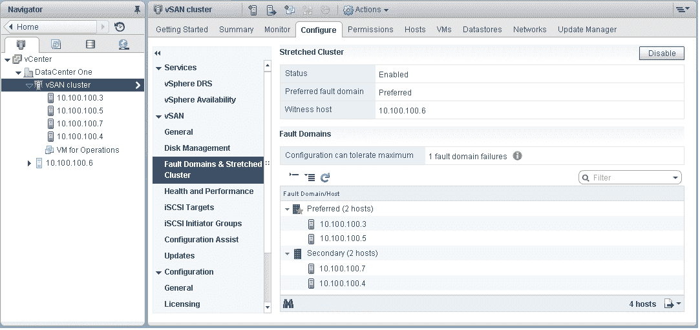
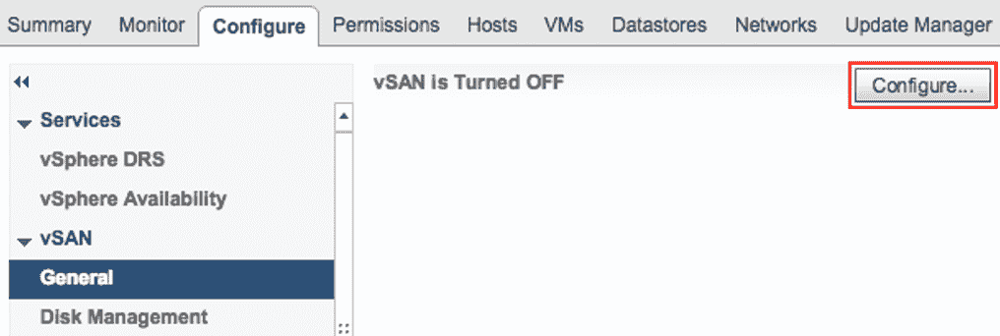
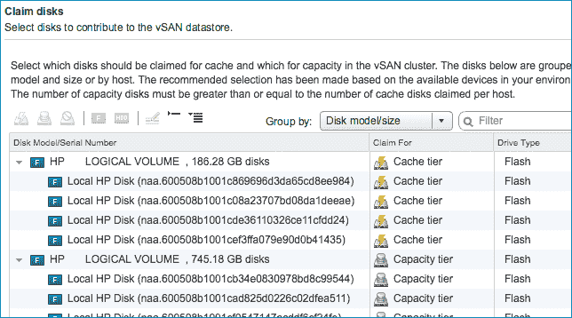
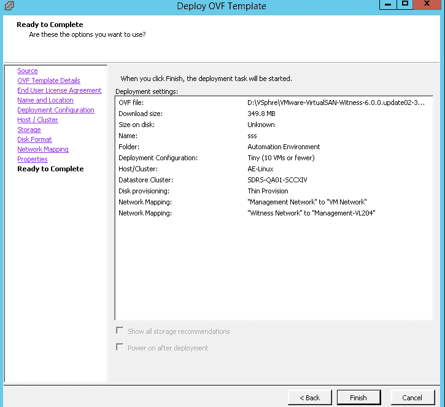
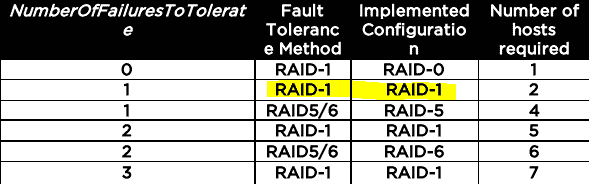

# 使用 vSAN 高级分析进行主动措施

本章将简要介绍**虚拟存储区域网络**（**vSAN**）设计建议，以及所有监控选项，通过这些选项您的客户可以评估、推荐和设计他们的环境。这将帮助他们通过智能策略自动化操作来实现不同的业务目标。

我们将学习如何根据机器学习算法配置策略操作，并了解通过主动解决客户问题如何提升最终用户体验。我们还将学习如何优化**超融合基础设施**（**HCI**）以实现客户业务目标。

本章将涵盖以下主题：

+   vSAN 上的应用可伸缩性

+   智能监控

+   弹性集群中的**高可用性**（**HA**）配置

+   基于**存储策略管理**（**SPBM**）的 vSAN 策略设计

# 技术要求

您可以从[`my.vmware.com/web/vmware/details?downloadGroup=VC65U1&productId=676&rPId=28154`](https://my.vmware.com/web/vmware/details?downloadGroup=VC65U1&productId=676&rPId=28154)网站下载 VMware vCenter Server 6.5 U1。[.](https://my.vmware.com/web/vmware/details?downloadGroup=VC65U1&productId=676&rPId=28154)

# vSAN 上的应用可伸缩性

VMware vSAN 可以支持容器和基于更新后的 vSphere Docker 卷驱动程序的下一代应用，该驱动程序通过 Docker API 提供原生支持。这使得 Docker 可以在 vSAN 之上构建，并利用 vSAN 经过验证的持久化存储功能。此驱动程序更新具有新功能，包括对多租户、SPBM、克隆和快照的支持。VMware 有一个“API 优先”的原则，所有管理功能都可通过 API 访问，这些 API 是成千上万的企业客户使用的 vSphere API 的扩展，他们使用这些 API 来自动化他们的操作。

应考虑以下参数以确定应用数据应存储的存储层：

+   **每秒 I/O 操作数**（**IOPS**）要求

+   MBps 要求

+   容量要求

+   可用性要求

+   延迟要求

+   考虑任何现有的服务级别协议（SLA）

+   考虑数据在信息生命周期中是否可能在存储层之间移动

这些详细信息可用于将应用程序和服务移动到具有匹配特性的设计存储层。

# 存储和网络评估

对 vSAN 管理的整体方法可以对基础设施产生显著积极影响。它与 vRealize Operation 集成，并通过提供更多关于资源的深入信息来补充它。以下 VMware 推荐从三个不同的角度看待业务挑战：

+   **组织建议**：采用以服务为中心的方法，如提供一系列服务和级别，来制定虚拟化策略。

+   **操作建议**：重点关注流程定义和改进，特别是在资源分配、系统监控和问题管理领域。研究和评估虚拟基础设施监控工具。

+   **技术建议**：在类似系统中实施一致的配置，进行微小的网络调整，以在竞争和备份窗口期间显著提高网络性能，并配置虚拟机以利用虚拟化的好处。

# 存储设计策略

评估摘要基于**VMware 健康分析器**（**vHA**）检查点和记录的 vSAN 最佳实践。我们将在下一节中查看一些建议。

# VMware 最佳实践建议

以下是一些 VMware 的最佳实践，以及存储设计策略的建议：

+   在 vCenter 控制台中验证我们是否已正确设置了存储策略：

    +   默认规则设置应默认修改。应根据您的需求应用策略。

    +   **策略设置**：在配置期间，强制预配应设置为 true。

    +   对象空间预留（%）应设置为 100%。

**理由**：vSAN 中的虚拟机存储策略可能会影响在 vSAN 数据存储上运行的虚拟机的性能。这包括每个对象的磁盘条带数、闪存读取缓存预留（%）、容忍故障数和对象空间预留（%）参数。

VMware 建议您采用默认策略，即容忍一次故障和一条磁盘条带。我们可以根据客户需求更改策略，也可以更改配置。我们必须为每个额外的容忍故障更新策略。需要*2n+1*个主机来满足策略，其中*n*是容忍故障的数量。

+   验证虚拟机是否均匀分布在 vSAN 节点上。正如磁盘资源应通常均匀分布在 vSAN 主机上一样，为了获得最佳性能，虚拟机也应相对均匀地分布在那些主机上。

**理由**：这减少了由于单个主机上虚拟机不平衡而影响性能的可能性，这可能导致 vSAN 网络饱和。vSphere 的**分布式资源调度器**（**DRS**）可以通过监控和根据需要平衡虚拟机来帮助磁盘资源分配。

+   存储控制器的设置应配置正确以获得最佳性能。

**理由**：vSAN 中的虚拟机存储策略可能会影响在 vSAN 数据存储上运行的虚拟机的性能。控制器队列深度低可能会在重建/同步期间影响生产虚拟机的可用性，因此 vSAN 需要至少 256 的最小队列深度。vSAN 的 VMware 兼容性指南已更新，仅包括满足此要求的适配器。然而，某些具有较旧固件的适配器可能仍然人为地限制了队列深度。控制器应禁用缓存。如果不可能这样做，则将读取缓存设置为 100%。如果控制器未设置为直通模式，则将每个磁盘作为其自身的设备呈现。不要将驱动器配置为一个大型 RAID 卷。

+   除非绝对必要，否则请避免使用闪存读取缓存策略预留。

**理由**：vSAN 允许为虚拟机使用自定义策略。策略选项之一，闪存读取缓存预留（%），允许预留读取缓存。除非绝对必要，否则不要设置此策略选项。这些预留将读取缓存的一部分分配给基于容量磁盘大小的对象（250 GB 磁盘的 10%为 25 GB）。如果不节约使用，缓存预留会迅速减少可用的缓存和 vSAN 的有效性。

+   我们应将磁盘上的文件格式升级到 3.0。

**理由**：为了在 vSphere 中使用 vSAN 的全部功能，请确保升级磁盘上的文件格式。在从版本 5.5 升级到版本 6.7 的 vSAN 升级过程中，可以保持磁盘上的格式版本，即 1.0，但无法使用许多新功能。vSAN 支持两种磁盘格式。

+   vSAN 应使用最优的 **非易失性内存表达**（**NVMe**）E 类磁盘。请确认您正在使用受支持和高性能的 **固态硬盘**（**SSD**）以获得最佳性能。

**理由**：所有写入首先命中 vSAN 中的 SSD。vSAN 读取缓存命中来自 SSD，因此 SSD 的性能是 vSAN 总体性能的关键因素。

我们还可以使用 SSD 代替磁碟作为容量层。VMware 兼容性指南通过根据性能将它们分成不同的组来帮助客户选择正确的 SSD，如下所示：

+   **A 类**：每秒 2,500–5,000 写入

+   **B 类**：每秒 5,000–10,000 写入

+   **C 类**：每秒 10,000–20,000 写入

+   **D 类**：每秒 20,000–30,000 写入

+   **E 类**：每秒 30,000+ 写入

VMware 始终建议使用满足应用程序性能需求的闪存驱动器以获得最佳性能。根据最佳实践，在应用容错策略之前，我们必须考虑预计使用的 10% 的 **硬盘驱动器**（**HDD**）容量。

# 网络设计策略

vSAN 需要一个 VMkernel 网络配置来同步和复制活动。这个端口组通常应该是专用和隔离的，用于 vSAN 流量。然而，如果使用 10 千兆网络接口，它可以共享。1 千兆网络需要为端口组分配一个专用的**网络接口卡**（**NIC**）。

以下是与 vSAN 网络配置相关的重大决策点：

+   **网络速度要求**：所有闪存 vSAN 配置（包括高级和企业版）仅适用于 10 千兆以太网网络上行链路。要实现最高性能（IOPS），需要 10 千兆网络。VMware 建议使用 10 千兆以太网连接（MTU 9000）用于所有配置的 vSAN。

+   **要使用的虚拟交换机类型**：vSAN 支持 vSphere 标准虚拟交换机配置和分布式交换机配置。分布式交换机允许使用网络 I/O 控制来优先处理带宽。它允许接口共享，并在争用场景中优先级处理性能水平。VMware 建议为 vSAN 端口组使用**vSphere 分布式交换机**（**VDS**）。

+   **巨帧**：vSAN 支持在 vSAN 网络传输中使用巨帧。VMware 建议为 vSAN 使用巨帧，但前提是底层物理环境已经配置为支持它们。

+   **业务连续性和灾难恢复**（**BC/DR**）和团队考虑因素：在任何环境中，网络故障发生时，BC/DR 都是至关重要的。vSAN 支持网络卡的团队配置，以增强网络的可用性和冗余。VMware 建议在环境中使用基于物理适配器负载的路由的主动/主动冗余配置进行团队配置。空闲的网络卡不会等待故障发生，并在这种配置中聚合带宽。

# VMware 最佳实践建议

以下是与网络设计策略相关的 VMware 最佳实践和建议：

+   我们应该在各种**外围组件互连**（**PCI**）总线上分配端口组的 VMNIC，以增强可用性

**理由**：在 PCI 总线上分配端口组的 VMNIC 可以防止与特定 PCI 总线相关的故障。您需要将来自不同 PCI 总线的 VMNIC 进行团队配置，以提高从组件故障中恢复的容错能力。

+   一致地配置网络接口卡（NIC）、物理交换机速度和双工设置

**理由**：错误的网络速度和双工设置可能会影响性能。必须检查网络适配器（VMNIC）和物理交换机的设置，并正确设置。如果您的物理交换机已配置为特定的速度和双工设置，我们必须强制网络驱动程序使用相同的速度和双工设置。网络设置应设置为自动协商，而不是强制设置为千兆链路。我们可以从 vSphere 客户端设置网络适配器的速度和双工设置，但需要重启才能使更改生效。

+   始终建议使用 10 千兆或更快的网络与 vSAN 一起使用

**理由**：小型 vSAN 部署可以在 vSAN 集群中的 ESXi 主机之间使用 1 千兆以太网链路时表现良好，但大多数部署将需要 10 千兆或更快的链路。VMware 建议使用至少 10 千兆的链路以获得最佳数据存储性能。

+   **网络 I/O 控制**（NIOC）的份额配置确保至少有 8 千兆比特的带宽可供 vSAN 流量使用，以避免争用。在使用 NIOC 的同时，我们将使用 vSAN 预留。

**理由**：VMware 建议为特定的用例预留 vSAN 资源，但主要是为了物理网络的环保条件，从而减少实际带宽。这可以在物理 NIC 和物理网络之间进行调度。预留确保 vSAN 网络流量不会被其他流量类型消耗。NIOC 可以将预留的带宽重新分配给其他系统流量类型（管理、**互联网小型计算机系统接口**（iSCSI）、**容错**（FT）、vMotion 等），但不能分配给 VM 流量。即使有最小量的管理流量，VM 流量也不会出现任何拥塞。

+   多播网络已启用，以实现高效操作，因为一个多播组不包含任何网络分区

**理由**：vSAN 需要使用**互联网组管理协议**（IGMP）嗅探的多播网络。我们应该通过运行网络发现命令来验证网络基础设施是否支持这一要求。基础设施将需要为 vSAN 网络配置嗅探器载体，或者在某些环境中默认使用的 VLAN 或端口上显式禁用 IGMP 嗅探。处理 vSAN 流量的所有物理交换机和路由器，以及第二层路径和第三层（可选）路径，都应该启用多播。VMware 建议使用第二层多播，因为它配置和操作简单。

# VMware 的客户体验改进计划/vSAN ReadyCare

我们已经添加并开发了一些增强功能，这些功能是基于过去 6-12 个月内客户反馈的。VMware 检索有关客户环境中部署的 VMware 解决方案的技术数据，以及其他与客户 VMware 许可证密钥集成的服务。

根据 VMware 产品或服务的性质和客户选择的参与程度，积累的技术数据包括以下所有或部分数据：

+   配置数据提供有关 VMware 解决方案配置的信息，以及部署在客户环境中的相关产品，如 VMware 产品的版本、配置细节以及与 VMware 产品/服务相关的应用程序/硬件配置

+   产品特性特定数据，提供有关 VMware 工具在客户数据中心中如何使用的信息，包括用户界面活动和与第三方工具的集成

+   性能数据有助于测量各种 VMware 产品特性的性能，如可用性/可伸缩性/安全性，以及用户界面和 API 集成的响应时间

+   从初始部署到生产阶段由 VMware 产品产生的产品日志数据，例如过去系统事件的日志和特定时间段内不同的系统状态，不包含客户的应用数据/内容

VMware 定期更新所有这些信息，通过**客户体验改进计划**（**CEIP**）反映其产品/服务的变更，我们始终建议我们的客户定期浏览此网页（CEIP）以保持最新：[`www.vmware.com/in/solutions/trustvmware/ceip.html`](https://www.vmware.com/in/solutions/trustvmware/ceip.html)。

我们现在将看到如何使用机器学习技术收集日志和进行监控。

# 智能监控

vSAN 环境监控对于成功的部署至关重要。我们必须遵循以下监控实践：

+   一般监控实践

+   vSAN 健康检查插件

+   vSAN 观察者

+   VMware vRealize Operations Manager 监控

+   监控设计

# 一般监控实践

vSAN 支持通过 VMware vSphere Web 客户端、HTML 5 客户端和 vSAN 管理 API 监控数据存储。vSphere Web 客户端监控不同的对象，如集群和数据存储。

没有对基础设施的有效控制，虚拟机或 ESXi 主机蔓延可能会迅速降低虚拟化的投资回报。改进的领域包括评估工作负载以确定性能指标，然后可以使用这些指标创建针对特定虚拟机的 vSAN 策略，以更好地适应工作负载。对于大于缓存磁盘大小的写密集型工作负载，采用两个节点的条带策略可能会提高性能。我们可以最小化由操作团队在出现性能相关问题的虚拟机上花费的故障排除时间。

# vSAN 健康检查插件

vSAN 健康检查插件是一种简单的方法来检查 vSAN 集群的健康状况。它默认包含在安装中。健康检查的技术建议如下：

| **优先级** | **组件** | **推荐操作项** |
| --- | --- | --- |
| P1 | vSAN | 验证 vSAN 固件和驱动程序版本。 |
| P2 | vSAN 网络 | 将端口组的 VMNIC 分布在不同的 PCI 总线上，以提供更大的冗余。 |
| P3 | vSAN 网络 | 一致地配置网络接口卡（NIC）、物理交换机速度和双工设置。对于 1 千兆位 NIC，设置为自动协商。 |
| P3 | vSAN | 确认您已正确设置存储策略。 |
| P3 | vSAN | 确认虚拟机在 vSAN 节点上均匀分布。 |

VMware 建议使用健康检查插件，以便轻松监控 vSAN 集群。

# vSAN Observer

vSAN Observer 对磁盘组进行深入监控，显示组层和磁盘层的汇总视图，并监控 vSAN 物理磁盘层的延迟。它读取缓存命中率、驱逐和性能以及其他参数，如大小、磁盘类型、制造商、型号、本地/非本地等。vSAN Observer 是 Ruby vSphere Console（RVC）的一部分，它支持在 Windows 平台上使用 vCenter Server 证书，并提供网络、基于内容的读取缓存（CRBC）和 vSAN 稀疏统计。以下工具/数据可以帮助您的客户解决与 vSAN 相关的问题：

+   vSAN 配置

+   vSAN 健康监控

+   vSAN 磁盘统计

+   vSAN 性能统计

+   观察者

vSAN Observer 建议您部署 vCenter Server 虚拟机并在新部署或远程 vCenter Server 虚拟机上运行观察会话，以增加数据收集时间超过默认值（2 小时）。

vSAN Observer 用户界面显示以下性能细节：

+   物理磁盘层的统计

+   详细的物理磁盘组信息

+   CPU 使用率统计

+   vSAN 内存池的消耗

+   vSAN 集群中物理和内存对象的分布

# vRealize Operations Manager 监控

当服务中断持续增加且 IT 团队越来越渴望在短时间内找到中断问题时，业务可能会受到严重影响。日志已成为关键的信息来源，并且需要用于解决 IT 运营问题。然而，由于 IT 环境的日益复杂，日志的数量和大小也在增长。

随着客户对成本越来越敏感，VMware Cloud 服务之一的 Log Intelligence 通过提供公共和私有云基础设施的宝贵见解，帮助客户克服这些挑战。Log Intelligence 提供快速 IT 故障排除，跨多个云的深度操作可见性，包括 VMware Cloud on AWS，以及集中日志管理。VMware 建议使用 vRealize Operations Manager 安装和监控 vSAN，这有助于在环境中全面监控 vSAN。

# 影响业务成果的挑战

以下是一些影响业务成果的挑战：

+   **缺乏可见性**：没有通过单一视角实现系统级可见性的 IT 团队，在手动审查日志上花费大量时间，阻止他们花时间在更战略性的任务上。

+   **被动故障排除**：由于触发警报的孤立指标，IT 团队在识别和解决问题上花费太多时间，增加了时间、成本和停机时间。

# 商业效益

Log Intelligence 是一项服务，提供快速 IT 故障排除，在公共和私有云环境中实现深度操作可见性，以及集中式日志管理，使 IT 团队能够更有效地解码和解决问题。

以下是一些好处：

+   **最小化成本**：帮助客户提高性能，创建更快的故障解决方法，从而在公司的收入和支出方面节省资金。

+   **预防停机**：从被动机制转向发现潜在问题并跟踪日志值超出正常操作的日志值的基础设施，防止未来的停机。

+   **节省时间**：使用集中式日志管理工具自动收集和组织信息。

# 技术问题

技术问题，如监控和主动支持以减少解决时间，如下：

+   **对 SDDC 环境的洞察不足**：IT 管理员通常对其组织的云环境，特别是其应用团队在公共云中部署的工作负载，没有良好的可见性。

+   **被动性能故障排除**：传统的日志管理工具依赖于原始的性能指标，通常在性能阈值超过时仅向管理员发出警报。此外，它们不提供日志文件中的额外见解用于故障排除和根本原因分析。

# 技术解决方案

Log Intelligence，一款 SaaS 服务，易于上手和使用。IT 管理员可以使用它来收集和分析各种类型的机器生成日志数据。通过日志分析，Log Intelligence 可以连接到基础设施和应用，实现企业级可见性。

Log Intelligence 提供了一个直观的基于 GUI 的界面，使 IT 管理员能够轻松运行简单的交互式搜索，以及进行深度分析查询，以快速洞察，提供即时价值和改进的 IT 效率。

# Log Intelligence 优势

让我们来看看 Log Intelligence 的一些优势：

+   **立即产生价值**：Log Intelligence 从公共和私有云环境中提供自动数据收集，并通过帮助客户高效地摄取通用日志收集和分析，以及提供直观、有趣的事件，实现立即产生价值。

+   **成本节约**：它通过快速故障排除中的索引和分组创新方法，帮助客户减少升级支持请求的解决时间，在虚拟和云部署中实现快速故障排除。

+   **提高生产力**：它有一个包含所有相关信息的单一日志管理控制台，这有助于用户在组织中创新新事物

我们现在将了解在弹性集群部署期间可以使用的不同配置参数。

# 弹性集群中的 HA 配置

VMware vSAN 有在集群中部署两个 ESXi 主机并带有远程见证设备的选项。我们可以为 vSAN 定义特定的 vSphere HA 行为来验证虚拟机的单个状态。如果虚拟机的组件可以从定义的分区访问，vSphere HA 可以指定特定的虚拟机故障转移操作。

以下为集群设置的截图：



启用 HA 的 vSAN 弹性集群在集群设置中有以下配置：

| **vSphere HA** | 配置**参数** |
| --- | --- |
| 主机监控 | 是 |
| 主机硬件监控 - 虚拟机组件保护：防止存储连接丢失 |  否，默认 |
| 虚拟机监控 | 否，默认 |
| 入场控制 | 启用 |
| 数据存储心跳 | 使用定义的列表中的数据存储将禁用数据存储心跳，但不需要从该列表中选择任何数据存储 |

要配置策略以启用 HA，请按照以下步骤操作：

1.  前往 HA 设置（已启用 HA）并配置主机服务器和见证主机上的静态路由

1.  将见证虚拟机的 vSAN VLAN 添加到数据中心 ESXi 主机的 vSAN 网络中

1.  vSAN 的流量已启用对 VMkernel 端口组的流量

1.  通过在集群中所有 ESXi 主机上执行`esxcfg-route –a`命令来添加静态路由，这些主机跨越数据站点和见证主机

1.  使用`esxcli`命令添加静态路由，如下所示：

```py
esxcli network ip route ipv4 add –n <remote network> -g <gateway to use>
```

# 双节点集群

由于 vSAN 至少需要三个主机来确保所有组件都受到保护，因此无法使用 vSAN 配置双节点集群。

可以通过配置向导配置带有见证的双节点集群。这对于较小的环境来说很好。VMware 为双节点配置引入了**见证流量分离**（**WTS**），并也支持弹性集群中的此功能。大多数弹性 vSAN 客户通过通过 CLI（`esxcli`）配置（见证）来利用此功能。我们只需使用以下命令为见证流量标记**VMKernel NIC**（**vmknic**）：

```py
esxcli vsan network ip set -i vmk<X> -T=witness
```

# vSAN 集群的见证设备

VMware 有一个 vSAN 见证设备，它基本上是一个运行在虚拟机中的 ESXi 实例，充当见证。与正常 vSAN 集群中的主机或 vSAN 弹性集群数据中心部分的主机相比，见证主机需要的容量、带宽和性能更低。见证设备存储虚拟机的见证组件，并在发生故障或脑裂情况时负责对象法定人数，以确保所需的虚拟机可用。

小型环境中的见证设备配置如下：

+   小型（10 个虚拟机或更少：应用程序/域控制器/文件和打印服务器）

+   两个 vCPU，8 GB vRAM

+   8 GB ESXi 启动磁盘，一个 10 GB SSD，一个 15 GB HDD

+   支持最多 750 个见证组件

# 配置 vSAN 集群

所有在 VMware HCL 中提到的 VMware vSAN 认证服务器都可以被认为是 vSAN 集群的一部分，该集群利用磁盘和闪存盘作为容量和缓存层。通过减少对较慢磁盘的访问，将 70% 的可用缓存分配用于存储频繁读取的磁盘块，而剩余的 30% 可用缓存分配给写入。应合并多个写入并顺序写入以增强磁盘性能：

1.  选择主机服务器所在的集群。

1.  在右侧点击 配置... 选项来管理所有由 vSAN 驱动的数据存储：



1.  在虚拟存储区域网络（Virtual SAN）下找到配置 vSAN 的选项。

1.  前往配置页面。

1.  然后，转到从数据存储空间声明磁盘，然后选择**手动**：



1.  故障域 & 扩展集群：配置两个主机 vSAN 集群。

1.  确认 vSAN VMkernel 网络适配器上的网络有效。

1.  验证每个服务器都显示所有磁盘。

1.  将磁盘折叠到它们的逻辑驱动器。然后，将 SSD 设置为缓存层，将 HDD 设置为容量层。

1.  选择故障域和首选故障域以及次要故障域。

1.  点击下一步继续。

1.  选择选择见证虚拟机的选项。

1.  将见证虚拟机主机的容量和缓存层进行映射。然后，部署见证虚拟机以监控 vSAN 集群：



1.  点击完成以完成 vSAN 配置。现在应该可以看到磁盘。

1.  登录到主机服务器并输入以下命令：

```py
localcli vsan cluster get
```

1.  验证集群显示为健康状态。

1.  在 集群 | 监控 | VSAN 下，运行健康检查以确认配置正确。

我们已经介绍了如何配置 vSAN 集群以及如何执行健康检查监控。现在，我们将了解我们可以通过 SPBM 配置的各种策略。

# 使用 SPBM 的 vSAN 策略设计

vSphere 中的存储类定义映射到通过 vSAN SPBM 定义的策略，以实现不同级别的**服务级别协议**（**SLAs**）和**服务质量**（**QoS**），并可以利用这些高级 vSAN 数据服务功能（如去重、压缩和校验和）的优势。如果没有特定的用例，建议使用通用策略。

首先评估以下不同的应用程序需求：

+   每个虚拟磁盘的 I/O 性能和您的工作负载配置文件

+   您工作负载的工作集

+   vSphere 的额外缓存热添加功能需要重新填充缓存

+   特定应用程序的最佳实践，例如块大小

# 基于业务目标定义策略

vSAN 通过使用存储感知的 vSphere API 将存储参数集成到 vCenter 服务器中。SPBM 进一步帮助定义以虚拟机为中心的策略，这些策略基本上是基于可用的存储功能以及各种策略（带有配置参数）存储虚拟机存储预配需求的结构。

这些内容如下：

+   每个对象的磁盘条带数（性能）：默认值 = 01，最大值 = 12

**备注**：通过定义硬盘的数量，RAID 0 条带配置可以增强虚拟机磁盘的性能。

+   闪存读取缓存预留（%）（性能）：默认 % = 0，最大 % = 100

**备注**：我们可以专门为虚拟机利用此配置，这些虚拟机必须存在读取 IOPS 问题。这需要解决，但根据 VMware 最佳实践，不应推荐预留。

+   可容忍的故障数，FTT（冗余）：默认值= 01，最大值 = 03

**备注**：FTT（故障容忍数）决定了存储对象可以容忍的主机、磁盘或网络故障数量。当创建*n+1*个磁盘副本并且需要*2n+1*个主机或故障域参与存储镜像时，我们可以容忍*n (0, 1, 2, 3)*个故障。如果我们有至少四个节点或故障域，并且使用擦除编码，我们可以容忍一个故障；如果至少有六个主机或故障域，我们可以容忍两个故障。如果磁盘大小大于 16 TB，最大值为 1。

这些参数在“配置”界面中进行配置：

+   故障容忍方法（性能/容量）：默认 = RAID 1（镜像）-性能

**备注**：RAID 1 可以通过使用镜像实现良好的性能来处理故障容忍，而 RAID 5/6 通过使用奇偶校验块以极大的空间效率帮助实现故障容忍。RAID 5/6 仅在所有闪存 vSAN 集群上可用，并且当可容忍的故障数（FTT）设置为`1`或`2`时。1 个 FTT 的值表示 RAID 5 配置，2 个 FTT 的值表示 RAID 6 配置。

+   对象的 IOPS 限制（性能）：默认 = 0

**备注**：磁盘 IOPS 的限制是通过使用定义的大小计算 I/O 的数量。默认情况下，它使用 32 KB 作为基本大小，因此 64 KB 的 I/O 将代表 2 个 I/O。通过将限制设置为`0`来定义无限制策略。

+   禁用对象校验和（覆盖策略）：默认 = 否

**备注**：此设置确定是否对写入卷的数据进行校验和计算。校验和计算和错误纠正将在后台执行。

+   强制预配（覆盖策略）：默认 = 否

**备注**：如果强制预配不会遵守可用资源，则它将覆盖当前策略。

+   对象空间预留（厚预配 %）：默认值 = 0，最大 = 100

**备注**：它将在 VM 创建时帮助一定比例的厚配置存储对象，而其余的存储对象是薄配置的。当预期的存储量已经用对象填满时，它将有助于减少重复的磁盘增长操作任务。

# 带 RAID 配置的 FTT 策略

策略是根据应用程序要求配置的，并根据可用的对象应用。以下表格列出了在不同场景中应用的 FTT 策略选项：



**RAID-1**将在主机服务器上的**容错方法**中使用。如果我们不使用主机 HBA 模式，那么我们将不得不将单个磁盘作为 RAID 0 进行 RAID。有时，网络上的 RAID 5 和 RAID 6 也被称为擦除编码。这是在线完成的，因此不需要后处理。擦除编码将**RAID5/6**条带分布到多个主机上，没有任何开销或数据局部性需求。**RAID-5**需要至少**4**个主机集群，具有 3+1 逻辑，并且必须在不丢失数据的情况下承受一个节点故障。这减少了磁盘容量消耗。擦除编码可以保证容量减少。此策略可以使用 SPDM 系统在单个**虚拟机磁盘**（**VMDK**）文件/磁盘上执行。

# 摘要

vSAN 性能和健康服务有助于对已知问题进行更新的健康检查，并为最终用户提供可见性。它不会帮助用户从客户站点收集日志并将它们发送以供支持，以便开发团队在最终用户提交支持票据后获得事件。相反，它有助于数据，这些数据有助于工程团队增强 VMware 产品和相关服务，解决问题，并在实施 VMware 解决方案时推荐最佳实践。

在下一章，第三章，*使用 Workspace One Intelligence 进行安全*，我们将了解客户如何越来越受到压力，需要提供更多关于其组织和用户行为的智能洞察，以提供最佳的 IT 服务。拥有不同工具和系统，这些系统在**移动设备管理**（**MDM**）、PC 和其他第三方系统中存储这些有洞察力的数据，导致数据碎片化，以及训练过程中的不一致性，以及最终用户体验。

# 进一步阅读

+   *VMware Virtual SAN 设计和规模指南*，在[`www.vmware.com/files/pdf/products/vsan/VSAN_Design_and_Sizing_Guide.pdf`](https://docs.vmware.com/en/VMware-vSphere/6.7/vsan-671-planning-deployment-guide.pdf)

+   *VMware Virtual SAN 健康检查插件指南*，在[`www.vmware.com/files/pdf/products/vsan/VMW-GDL-VSAN-Health-Check.pdf`](http://www.vmware.com/files/pdf/products/vsan/VMW-GDL-VSAN-Health-Check.pdf)

+   *vSphere 6.0 配置最大值指南*，请参阅[`www.vmware.com/pdf/vsphere6/r60/vsphere-60-configuration-maximums.pdf`](https://www.vmware.com/pdf/vsphere6/r60/vsphere-60-configuration-maximums.pdf)

+   *来自 VMware vSphere 文档中的 vSphere Storage 指南的 Virtual SAN 文档*，请参阅[`www.vmware.com/support/pubs/vsphere-esxi-vcenter-server-pubs.html`](https://www.vmware.com/support/pubs/vsphere-esxi-vcenter-server-pubs.html)

+   *VMware Virtual SAN 部分，来自 VMware vSphere 6.0 性能最佳实践的文档*，请参阅[`www.vmware.com/files/pdf/techpaper/VMware-PerfBest-Practices-vSphere6-0.pdf`](http://www.vmware.com/files/pdf/techpaper/VMware-PerfBest-Practices-vSphere6-0.pdf)

+   *针对网络性能不佳的解决方案，来自 vSphere Monitoring and Performance vSphere 6.0 部分*，请参阅[`pubs.vmware.com/vsphere-60/topic/com.vmware.ICbase/PDF/vsphere-esxi-vcenter-server-60-monitoring-performance-guide.pdf`](https://pubs.vmware.com/vsphere-60/topic/com.vmware.ICbase/PDF/vsphere-esxi-vcenter-server-60-monitoring-performance-guide.pdf)
