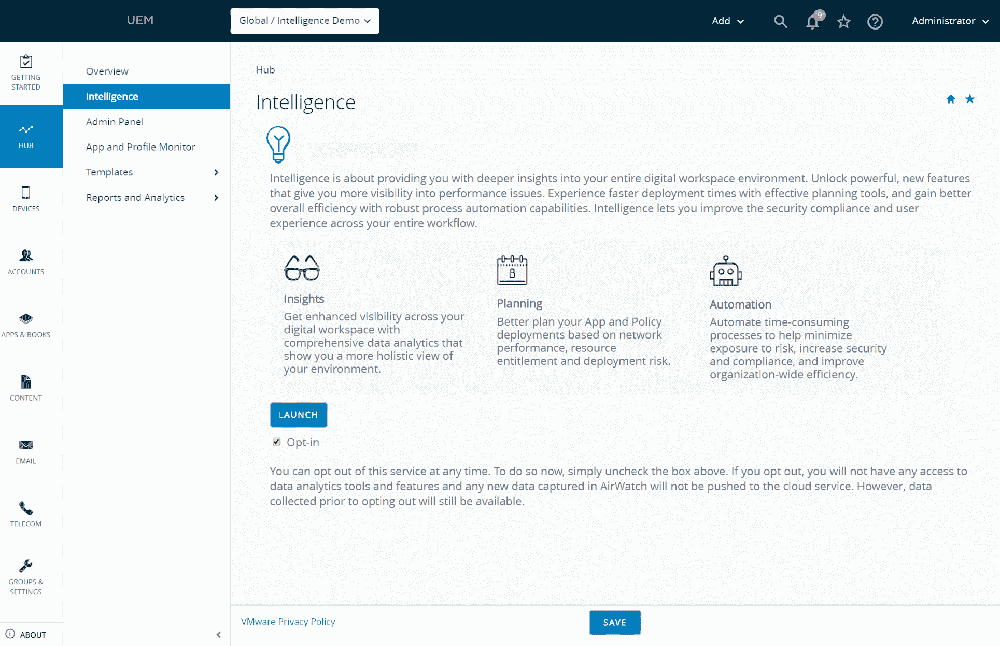
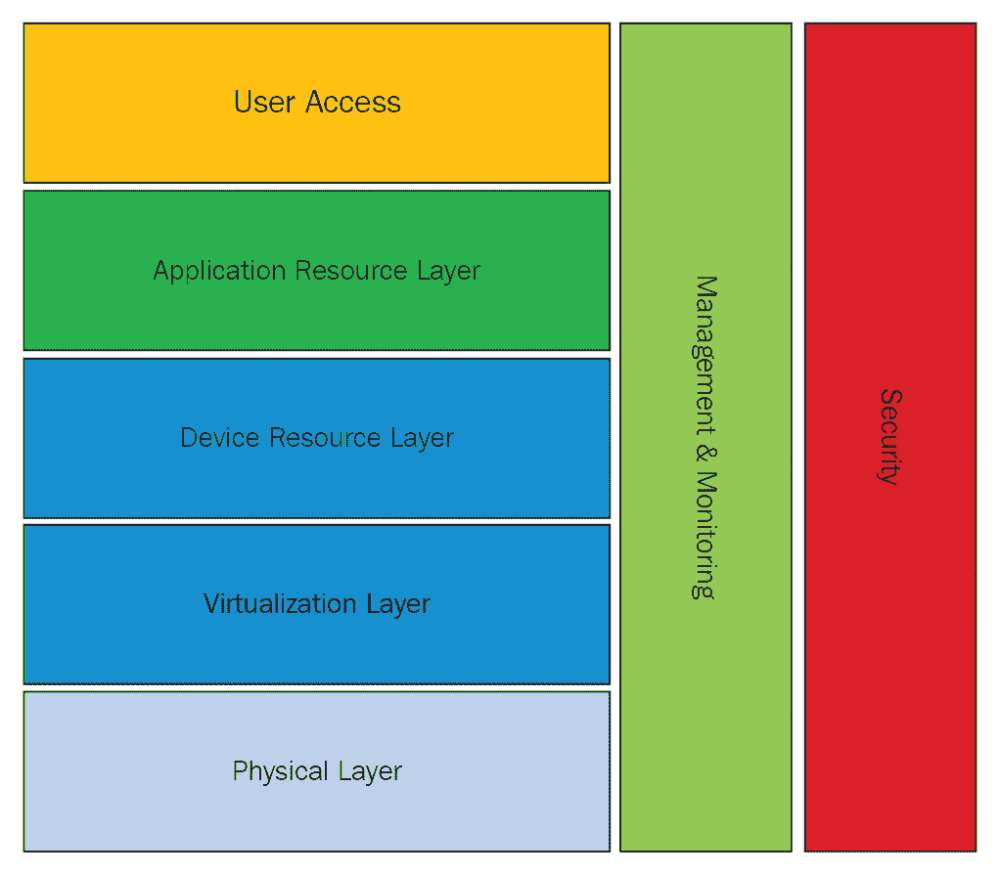
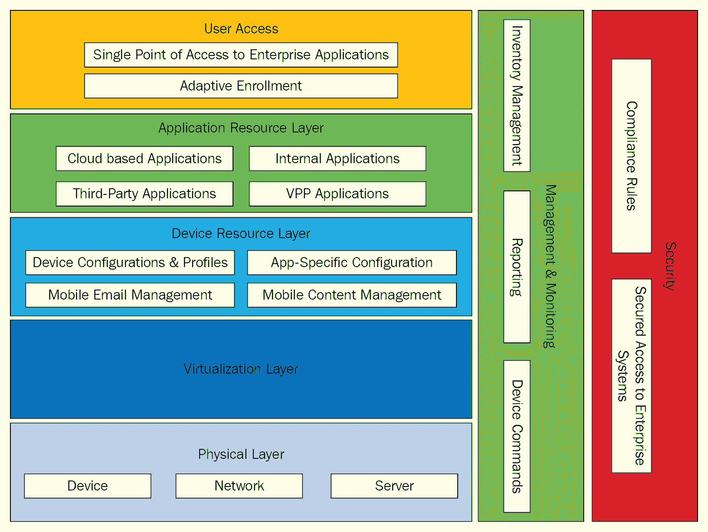
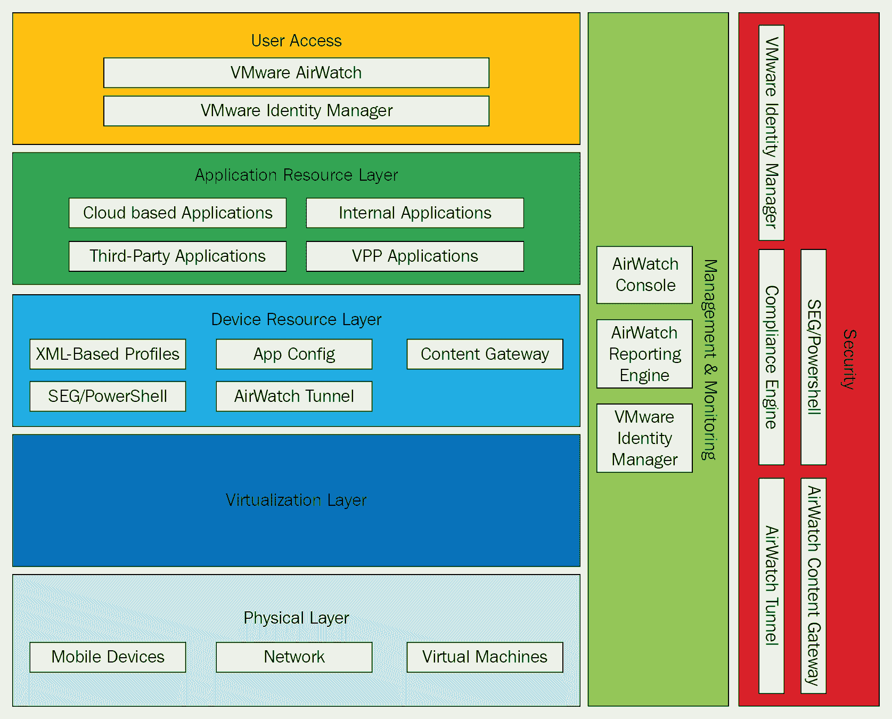

# 使用 Workspace ONE Intelligence 的安全性

本章将详细讨论 VMware Workspace ONE 及其创新的方法来保护应用程序、数据、端点和网络。它可以通过其智能分析引擎管理应用程序和设备的访问权限，并通过集成第三方工具为最终用户提供端到端的安全保障。

我们将学习如何通过高级分析来保护客户的数字工作空间，以及如何创建智能策略来检测、保护和修复他们的应用程序免受威胁。我们还将学习如何设计一个符合客户政策和 Workspace ONE Intelligence 用例的解决方案。

本章我们将涵盖以下主题：

+   Workspace Intelligence 概述及其商业目标

+   集成深入洞察、智能规划和智能自动化

+   概念和逻辑设计要求

+   Workspace Intelligence 的用例

+   Workspace ONE Intelligence 信任网络和 Workspace ONE AirLift 概述

# 技术要求

您可以下载 VMware Workspace ONE Intelligent Hub [`my.workspaceone.com/products/VMware-Workspace-ONE-Intelligent-Hub`](https://my.workspaceone.com/products/VMware-Workspace-ONE-Intelligent-Hub)

# Workspace ONE Intelligence

Workspace ONE Intelligence 具有利用 Workspace ONE 平台的能力，通过基于数据的行动和单一存储库的解决方案来更好地解决问题。用户希望在任何设备上从任何地方访问他们的企业数据和应用程序。在当前环境中，安全工具无法以主动的方式处理最终用户的需求和安全风险。由于始终变化的边界（最终用户设备的地理位置）导致巨大的网络安全威胁并复杂化管理任务，客户无法完全了解设备、应用程序和用户数据。

每个组织都必须照顾好他们的员工，同时不妥协安全。员工的生产力会受到应用程序执行问题和服务的非正常运作的影响。频繁更改应用程序访问权限会通过降低权限来影响它。我们必须找到一种方法来绕过安全和用户的生产力，通过使用智能数据分析自动化来避免复杂的管理流程。我们还需要一个解决方案来应对频繁变化的威胁领域，该解决方案可以与所有相关服务集成，并在当前的数字工作空间系统中提供安全方面的保障。

Workspace ONE Intelligence 是建立在 Workspace ONE 平台之上的云服务，它通过提供出色的图形、用户界面工具和智能流程，帮助客户从单一的真实来源做出数据驱动的决策。Workspace ONE Intelligence 通过收集、检查和连接设备、应用程序和用户数据，按需过滤和查找**关键绩效指标**（**KPIs**）。一旦获取所需的数据信息，它就可以利用内置的规则引擎来自动化基于广泛指标的策略。客户可以定义规则，根据上下文进行智能修复操作。可以采用 AI 和 ML 技术来建议行动和为整个数字工作空间系统进行未来规划，而不会影响最终用户的生产力。

移动云时代的网络安全需要一套全面的 企业安全策略和方法。Workspace ONE Intelligence 合规引擎持续监控设备并执行升级操作，以防止违规行为。

# Workspace ONE Intelligence 的业务目标

Workspace ONE Intelligence 将帮助客户处理以下业务目标：

+   它帮助管理员在应用程序部署的不同阶段获得端到端可见性，从与地面上的最终用户进行应用程序互动并获得良好响应，到快速解决问题、最小化支持电话和提升用户生产力。

    以下截图显示了从单一控制台提供的端到端可见性：

+   它通过提供用户所需的内容并降低硬件和软件的资本支出（这些支出随着洞察力对资源利用率的可见性而减少），帮助组织更好地利用资源。

+   它可以通过识别不合规的系统并自动基于最终用户行为自动化访问控制规则，使用当前的安全补丁快速找到并修复所有类型的漏洞。

Workspace ONE Intelligence 通过利用 Workspace ONE 平台，在三个重要领域提供帮助。

# 集成深度洞察

集成洞察意味着能够全面了解客户的数字工作空间，并拥有细粒度的洞察力，这些洞察力有助于数据驱动的业务策略：

+   Workspace ONE Intelligence 将所有硬件（系统）、应用程序和最终用户数据在单一平台上相互结合和连接，以获得对数字工作空间系统的全面可见性。

+   客户可以实时做出决策，解决最终用户的问题，并避免所有安全风险。

+   客户可以运行或定义定制报告，以基于历史数据获得验证数据，并将这些洞察力用于与其他相关决策。

+   根据他们的业务需求，客户必须保持对其关键数据的投资。他们可以积极思考所有即将出现的安全漏洞、应用路线图、硬件注册、应用生命周期以及未来的补丁时间表。

客户可以从一个控制台看到完整的数字工作空间系统，包括搜索和查询系统以分析数据、识别模式、检测异常行为的能力。他们可以使用预定义的仪表板和过去的数据，为完整的系统做出基于准确数据决策。

我们将获得与以下属性/参数相关的关键信息：

+   应用生命周期

+   应用消耗

+   应用承诺

+   用户承诺

+   设备类型

+   操作系统部署

+   应用描述

+   应用订阅

客户可以运行报告以查找存在补丁漏洞的系统，监控整个系统中的关键 Windows 安全状态，包括监控应用发布的安装阶段，或在 Workspace ONE Intelligence 平台上获取软件和设备清单。

# 智能规划的应用分析

客户可以更好地利用整个环境中的软件开发生命周期，并快速解决事件，最小化支持电话，并增强最终用户的使用便捷性。

智能商业分析以实现最大生产力：

+   客户可以看到实时应用操作，这有助于他们立即对为最终用户造成问题的议题做出决策。他们可以先解决所有关键问题，然后根据最终用户的需求定义应用升级时间表。我们可以通过在系统、地理边界、连接状态或应用版本层面全天候监控应用利用率，获得应用过程的 360 度视图。客户可以获取有关各种用户群体应用消耗的详细分析，包括所有相关数据。

+   客户可以在其系统中量化应用消耗和使用情况，并识别最常使用和易于计算投资回报率（ROI）的应用。这将帮助决策者更好地理解移动性如何通过从应用部署的每个阶段到端到端的可见性帮助最终用户。

+   客户可以在其应用中找到关键流程或操作，并将它们与重要的业务参数相关联。

+   Workspace ONE Intelligence 的客户可以为其自建应用获得自动化的好处。

Workspace ONE Intelligence 协助基于策略的应用部署。策略通过推荐上下文作为参数定义，通过检测问题的根本原因来监控应用性能，并通过所需和测试过的补丁来增强应用交付。

Workspace ONE Intelligence 的价值主张如下：

+   资产生命周期更新的准确计划

+   应用许可更新和升级

+   操作系统第一天支持

+   定制设备和应用程序配置

+   根据工作领域定义安全策略基线

# 由决策引擎驱动的智能自动化

客户可以通过自动化定义的工作流程利用决策引擎来提高组织内的利用率：

+   客户可以配置预定义的自动化，以智能方式管理数字工作空间。

+   客户可以通过创建基于这些策略中配置的参数触发的策略来自动化操作和安全流程。基于上下文的策略通过避免手动工作来提高自动化过程。

+   客户可以构建与上下文相关的修复流程规则，以帮助自动化，从而提高最终用户的生产力和易用性。

+   客户可以创建基于上下文的规则，这些规则与客户环境相关，并通过自动化工作流程，这些工作流程可以集成通过 REST API 与第三方应用程序（如 ServiceNow 和 Slack）。

Workspace ONE Intelligence 通过创建基于多个指标的自动化移动规则，在系统中拥有智能任务引擎。它将有助于根据安全策略构建上下文工作流程，以进行智能修复移动，并确保合规性。Workspace ONE Intelligence 可以与第三方 API 层集成，创建可以利用客户特定要求的工作流程，如下所示：

+   检测具有高安全威胁的动作，并获得所需的访问控制，而无需任何手动干预

+   智能应用程序发布周期可以在部署前检测问题

+   通过自动化数据发现来定义所需的系统状态

+   集成第三方应用程序来自动化业务任务

自动化工作流程利用第三方服务以避免应用程序安装失败。

# 设计要求

客户必须实施企业级计划，以通过移动设备为用户提供灵活且强大的企业系统访问权限，如下所示：

+   从任何设备、任何地点为员工提供安全的移动电子邮件访问

+   向特定员工提供安全内容，以增加现场工作效率

+   为中央 IT 提供一层安全和监督，并确认企业系统访问是以预期和可信的方式进行

在确定适当的设计解决方案时，设计元素可能有多个选项。在这种情况下，以下按优先顺序排列的设计质量用于确定最佳设计解决方案：

| **设计质量优先级****（从高到低考虑）** | **描述** |
| --- | --- |
| 可用性 | 实现高可用性操作的能力 |
| 可管理性 | 灵活性、可扩展性和易于操作 |
| 性能 | 环境的性能 |
| 恢复性 | 从影响可用性的意外事件中恢复的能力 |
| 安全 | 整体基础设施安全以及符合监管政策 |

# 概念设计

VMware 平台为客户由多个相互连接的层组成，每个层都提供功能以满足业务需求。我们将在以下图表中详细说明每一层：

每个单独的层都提供特定的功能，以提供整体最终用户计算解决方案：

+   **用户访问**：这是所有移动应用程序和资源的单一接口

+   **应用资源层**：这些是向用户提供应用资源的必要组件

+   **桌面资源层**：这些是向用户提供设备资源的必要组件

+   **虚拟化层**：应用程序在虚拟机上的管理程序上托管

+   **物理层**：这是运行工作负载所使用的物理基础设施

除了水平层之外，还有两个垂直层与五个水平层中的每一个交互：

+   **管理**：管理已配置基础设施所需的组件

+   **安全**：用于确认已配置的工作负载和基础设施符合客户定义的策略的组件

以下项目被确定为工作环境的关键业务驱动因素：

| **业务驱动因素** | **描述** |
| --- | --- |
| 安全 | 确认未管理的设备无法访问企业系统 |
| 员工效率 | 为员工提供对企业系统的移动访问 |
| 成本节约 | 通过减少基于移动性的 IT 硬件支出来实现成本节约 |

我们现在将讨论水平层：

+   **用户访问**：用户门户提供了用户开始的一致接口。门户核心功能如下：

    +   **企业应用单点访问**：这是用户能够从目录中选择项目，并按需快速部署、修改或退役的能力

    +   **自适应注册**：这是基于请求的应用程序的安全状态进行的设备注册

以下图表详细描述了各种业务驱动因素及其用例：

+   **应用资源层**：**应用资源层**向用户提供应用资源。这些资源包括以下内容：

    +   **基于云的应用**

    +   **第三方应用**

    +   **内部应用**

    +   **VPP 应用**

+   **设备资源层**：**设备资源层**提供以下功能：

    +   **设备配置与配置文件**

    +   **移动电子邮件管理**

    +   **应用特定配置**

    +   **移动内容管理**

+   **虚拟化层和物理层**：**虚拟化层**在虚拟机中托管所有应用程序。**物理层**为 AirWatch **企业移动管理**（**EMM**）平台提供物理组件。以下包括以下内容：

    +   **设备**：呈现给用户的物理设备

    +   **服务器**：托管虚拟化工作负载的物理服务器

    +   **网络**：包括交换机、路由器和 WAN 链路在内的物理网络基础设施，这些是各种组件互连所需的

+   **管理与监控**：由于终端用户平台动态性的原因，管理是一个关键组件。管理垂直层与平台的所有五层交互，以实现整个堆栈的管理效率和主动性。垂直管理提供以下组件：

    +   **库存管理**：从单个管理界面管理和查看设备的能力

    +   **报告功能**：报告一组设备或配置的能力

    +   **设备命令**：根据需要向用户设备推送命令的能力

+   **安全**：安全垂直层与所有层交互，以实现满足安全要求。安全垂直层提供以下内容：

    +   **合规性规则**：确认设备是否按预期行为的能力

    +   **对企业系统进行安全访问**：确保对企业系统（电子邮件、内容和数据服务器）进行安全访问的能力

本节在概念设计的基础上，通过添加作为解决方案核心的逻辑组件来构建。逻辑设计反映在以下图表中，以下子节讨论每个组件：

本节从高层次讨论构成前面图表设计的逻辑组件：

+   **用户访问**

    +   **VMware AirWatch** 提供了所需的注册和数据流程，以提供统一的用户访问状态。

    +   **VMware Identity Manager** 提供身份验证策略，并查询现有的身份验证源以进行授权。客户利用**VMware Identity Manager**根据用户的网络来源执行多因素身份验证。一旦身份验证成功，**VMware Identity Manager**向用户提供其可访问资源的目录。

+   **应用程序资源层**

    +   **基于云的应用程序**（**软件即服务**（**SaaS**）**模式**）在**VMware Identity Manager**门户上配置并呈现为目录项。访问客户门户的用户从他们的目录中选择应用程序。

    +   **第三方应用程序**是在特定操作系统应用商店中可用的应用程序，例如 iOS 应用商店和 Google Play 商店。

    +   **内部应用程序**是指客户内部开发的应用程序。**VMware AirWatch** 允许管理员直接将这些应用程序推送到设备。

    +   **VPP 应用程序**是通过 Apple 批量购买计划购买的。

+   **设备资源层**

    +   **基于 XML 的配置文件**：**VMware AirWatch**利用基于 XML 的配置文件来强制实施限制并推送配置。

    +   **SEG/PowerShell**：客户将利用**SEG/PowerShell**来确保其端点运行的邮件应用程序的移动访问安全。该系统利用邮件合规性规则，为管理员提供对移动电子邮件访问的可见性，并启用一致的设备安全状态。

    +   **应用配置**：VMware AirWatch**与**应用配置**标准集成，允许针对特定用例进行应用程序特定的配置。

    +   **AirWatch 隧道**：VMware **AirWatch 隧道**确保对企业系统（如内部网站）的访问安全。

+   **VMware AirWatch 内容锁**：这确保了对后端内容源的访问安全。该服务器组件确认只有注册的、安全的设备才能访问敏感的内部数据。

+   **移动设备**：以下设备平台已被客户选中：

    +   Apple iOS

    +   Android

    +   Windows 10

+   **网络**：本系统使用现有物理网络。详细的网络连接在 VMware Workspace ONE 设计和部署服务工程规范中概述。

+   **虚拟机**：本系统使用现有的虚拟机基础设施。

# Workspace ONE Intelligence 的前十大用例

Workspace ONE 消除了访问云、移动和 Windows 应用程序的猜测。IT 可以放心，无论是**自带设备**（**BYOD**）还是企业拥有的设备都是安全的，并且可以通过简单易用的条件访问设置来保护网络。管理者无需担心员工的生产力，因为安全的应用程序，包括邮件、日历、文档和社交媒体，都能确保员工的工作不间断。并且，员工通过实时应用程序交付和自动化永远不会错过任何一点。

# 识别和缓解移动操作系统漏洞

**客户挑战**：发现已知漏洞，如 Spectre 或 Meltdown。每个制造商都迅速发布操作系统更新，但制造商在实施修复方面的做法各异。每个操作系统都有自己的更新计划和版本；iOS 使用操作系统版本，而 Android 使用安全补丁。IT 管理员无法确定受影响的移动设备并在整个环境中部署修复。

Workspace ONE Intelligence 可以帮助快速评估和报告威胁或漏洞的影响，并将这些报告与组织内的管理层和 IT 团队共享。它通过创建所有设备中具有过时操作系统版本（iOS）或旧安全补丁日期（Google）的视觉表示，轻松识别具有已知漏洞的资产。它通过组织组、设备类型或型号对数据进行分段，以查看哪些设备过时程度最高且最易受攻击。它利用自动化来针对易受攻击的设备，并添加强制操作系统更新（仅限 iOS 受监督设备）的操作，通过电子邮件或 Slack 通知最终用户，通知最易受攻击设备的 InfoSec 团队，将设备移动到具有更严格访问要求的组织组，并监控 Android 和 iOS 上已修补或升级的设备数量。

**主要优势**：这提高了组织内的安全卫生，增加了合规性，并增加了 IT 运营和 InfoSec 团队之间的协作。

# Windows 10 操作系统更新和补丁的洞察

**客户挑战**：客户请求一个列表，列出没有安装特定 KB 的设备，这些设备风险最高（严重安全或关键 Windows 更新）。

Workspace ONE Intelligence 可以帮助客户为所有当前没有安装关键 KB 的设备创建实时仪表板，并可以通过型号或操作系统版本对数据进行隔离，以识别具有风险的操作系统版本。自动化将帮助通知用户其设备的所有更新，并将监控所有 Windows 10 设备是否已修补或升级。

**主要优势**：客户可以节省时间，提高用户体验，并更好地保护他们的端点。

# 预测 Windows 10 戴尔电池故障并自动化更换

**客户挑战**：用户正在使用需要全天充电的 Windows 端点，这有时会影响最终用户的生产力，因为它们限制了他们的移动性。

Workspace ONE Intelligence 可以通过限制这些用户的移动性来帮助他们。客户需要一个能够监控电池健康不佳的 Windows 10 戴尔设备以及电池整体寿命报告或仪表板的解决方案。它应该向最终用户提供关于电池寿命的可见性。众所周知，随着电池寿命的减少，最大充电容量会降低。它可以在 Workspace ONE UEM 中创建一个工作流程，为电池寿命不佳的设备添加标签。它还将帮助报告，并创建带有设备信息的 ServiceNow 工单以订购新电池。然后，它将通过自动化所有手动任务，通过 Slack 或电子邮件通知员工更换电池。

**主要优势**：自动化将减少与用户生成支持工单或电话相关的成本，并通过延长设备使用寿命来提高员工体验和生产力。

# 识别不受支持的操作系统版本和平台

**客户挑战**：对于 IT 来说，一个重大挑战是了解有多少用户拥有组织不再支持的设备，这些设备可能存在安全风险。对于 IT 来说，另一个挑战，特别是对于正在构建自己应用程序的组织来说，是缺乏对组织内设备和操作系统分布的可见性。

Workspace ONE Intelligence 可以帮助识别那些无法升级到最新操作系统且面临最新安全威胁的旧设备，并在仪表板上创建报告或小部件，以识别潜在的淘汰候选设备。它提供了用户中最受欢迎的设备类型的可见性，向员工推荐新硬件，并轻松地将设备和操作系统版本采用情况传达给应用开发者，以确保他们为最受欢迎的设备/操作系统组合构建，并最大化其内部应用程序的采用率。它根据使用情况快速确定哪些设备和操作系统版本将停止支持。

**主要优势**：这可以优化开发工作，按地理区域了解用户需求，节省时间，并提高生产力。

# 跟踪操作系统升级进度

**客户挑战**：每年，苹果和谷歌都会发布新的主要操作系统更新，这些更新包括新的 UEM 功能以实现更好的管理，以及管理员希望其最终用户掌握以提高生产力的新可用性功能。当发布主要操作系统时，管理员需要近乎实时的可见性，了解操作系统版本被采用的情况，以便他们可以预测他们需要试点新功能的时间有多长，以及确定部署新 UEM 功能（例如，安全策略）到所有设备的好时机。

Workspace ONE Intelligence 可以帮助创建仪表板来监控旧版和新版操作系统的采用情况，同时监控报告最新操作系统版本的设备数量的增加，以及报告先前版本的设备数量的减少。它还逐年比较不同供应商的操作系统采用情况，并预测主要操作系统发布将何时达到其大多数设备。

**主要优势**：这有助于就整个环境做出明智的决定，为应用开发者提供定量洞察，并根据操作系统分布优先考虑功能开发。

# 监控设备利用率或使用情况

**客户挑战**：在商业用例中，设备具有单一或多用途，它们要么由一组用户共享，如在零售店，要么专门为一名用户使用，例如航空公司的电子飞行包。在两种情况下，IT 都需要可见性来确保所有这些资产都处于在线和活跃状态。在零售业，设备不活跃的商店很可能是被盗。航空飞行员没有设备就无法飞行，因此应该几乎没有不活跃的设备。

Workspace ONE Intelligence 可以帮助 IT 团队了解哪些商店的设备最不活跃以及它们的位置，并使用自动化通知商店经理可能被盗的设备。它还可以创建工单（ServiceNow）并将需要更新的设备部署到正确的位置，并使用仪表板监控组织或每个地点最常用的设备类型。它还使用智能在购买新设备时做出数据驱动的决策。

**主要优势**：这有助于提高商店性能，提高组织内的效率，并优化资源。

# 提高 Windows 10 设备的合规性

**客户挑战**：IT 团队必须协作，快速识别 Windows 10 PC 在任何时刻的设备状态。他们必须安装多个代理来获取基本的操作系统和型号信息，或者报告更细粒度的设备状态，如 BIOS 版本和安全启动状态。

Workspace ONE Intelligence 可以帮助只需要一个代理来收集和报告 IT 团队关心的所有众多设备状态，并了解高风险设备。查询整个环境以识别最危险的设备，如过时的 BIOS 版本、安全启动禁用、TPM 芯片禁用、防火墙禁用、防病毒软件禁用和 BitLocker 加密的笔记。它可以按操作系统版本、地区和型号对这些设备进行排序和分段，并创建自动隔离高风险设备以及移除对敏感数据源访问的规则。它通过推送安全策略来执行自动化，以加强合规性：移除对 VPN/Wi-Fi 的访问、重新启用 BIOS 设置，并将设备移动到拥有较少权限和应用程序访问权限的组织组。

**主要优势**：这可以节省时间，因为不需要从不同来源汇总多个报告；提高整个环境的合规性；并提高 IT 运营效率。

# 综合移动应用程序部署可见性

**客户挑战**：作为一名 IT 管理员，部署应用程序更新对于满足业务和安全需求至关重要。有时，部署应用程序的机会非常有限。在零售业，只能在午夜进行；对于安全来说，越快越好；而对于 24 小时医疗工作者来说，可能没有合适的时间推送更新。

Workspace ONE Intelligence 可以帮助根据使用模式确定部署应用程序的最佳时间，并准确报告部署进展情况。它还向应用开发团队、管理层和帮助台提供任何应用程序的全方位视图，以实时提供有关应用程序采用和参与度的信息。它通过快速检测部署问题或应用程序采用不佳的根本原因，深入了解每个设备制造商、型号或操作系统版本的应用程序性能。旧版应用程序的设备可以收到更新到最新版本的提醒，当用户基数较低时，应用程序开发者可以停止维护旧版本。它利用自动化操作来修复问题，例如，如果新版本不稳定，则通知商店经理重新部署应用程序的先前版本。

**主要优势**：这可以减少与用户生成支持工单或电话相关的成本，并提高员工体验和生产力。帮助开发者优先考虑功能，并深入了解可以退役的旧版应用程序。

# 跟踪生产力应用程序的迁移和采用情况

**客户挑战**：IT 部门通常会根据用户反馈和许可成本评估生产力应用程序，并经常将最终用户从一种生产力应用程序迁移到另一种。IT 部门的挑战在于了解迁移的进展情况以及用户是否正在采用新的生产力应用程序，以达到淘汰旧解决方案的目标，例如，从 WebEx 迁移到 Skype 再到 Zoom。

Workspace ONE Intelligence 可以帮助快速确定哪些设备安装了哪些生产力应用程序，并监控每个应用程序在每个位置或组中的普及率。它确定一个位置或组是否已完成对新应用程序的迁移，并根据使用和采用情况使用自动化通知用户需要迁移到新应用程序。它根据使用模式确定部署应用程序的最佳时间，并准确报告部署进展情况。它还向应用开发团队、管理层和帮助台提供任何应用程序的全方位视图，以实时提供有关应用程序采用和参与度的信息。它通过快速检测部署问题或应用程序采用不佳的根本原因，深入了解每个设备制造商、型号或操作系统版本的应用程序性能。旧版应用程序的设备可以收到更新到最新版本的提醒，当用户基数较低时，应用程序开发者可以停止维护旧版本。它利用自动化操作来修复问题，例如，如果新版本不稳定，则通知商店经理重新部署应用程序的先前版本。

**主要优势**：这可以优化资源，降低风险，提高合规性，提高员工体验，并提高 IT 运营效率。

# 采用内部移动应用程序

**客户挑战**：组织在构建和维护内部应用程序上投入了大量资金，但他们无法了解有多少应用程序被使用以及如何使用。

Workspace ONE Intelligence 可以帮助**业务线**（**LOB**）所有者轻松监控他们负责的应用程序的使用和参与度，并可以使用应用详细仪表板中可用的实时和历史数据优先考虑功能开发。它轻松确定为什么应用程序未被使用，并排除任何性能或兼容性问题。强制使用的最少使用应用程序可以采取采用补救行动计划；那些非关键的应用程序可以被淘汰，资源可以重新分配到更重要的项目上。

**主要优势**：这将优化资源，提高用户体验，提高生产率，并最大化开发者的努力。

# Workspace ONE Trust Network

Workspace ONE Trust Network 为顾客提供了一种广泛且新的安全方法来保护他们不断发展的数字工作空间。顾客可以创建符合要求的跨组织安全流程，从员工、应用程序、端点和网络，利用新功能来防御、识别和恢复基于信任和验证框架的网络安全风险。

Workspace ONE Trust Network 内置了在 Workspace ONE 平台上开发的安全功能，它们与第三方安全合作伙伴服务集成，以在整个数字工作空间提供安全保护。

Workspace ONE Trust Network 提供以下服务：

+   客户可以配置数据加密和应用黑名单的规则。它可以监控威胁，例如恶意软件和恶意应用，并通过其类似访问控制的特性来帮助修复。

+   最终用户可以利用自助应用程序目录和单点登录到应用程序，以提高效率和跨所有应用程序的多因素身份验证，这将有助于应用程序保护。

+   它有助于对安全威胁进行端到端监控，例如操作系统漏洞、身份验证问题和基于应用程序的攻击。它可以通过在短时间内擦除、隔离和打补丁来自动化对风险的应对措施。

+   它可以通过隔离和修复根本原因来识别可疑的应用程序或文件以及攻击。

+   它具有数据丢失预防组件，具有端到端可见性，并使用其数据分析引擎防止未经授权的数据传输。

我们将通过数据分析获得有价值的数据，并通过自动化数据过滤来避免验证和检查过多数据。

数字工作空间是一个创新领域，通过将第三方安全工具与 Workspace ONE 集成，提高了最终用户体验。

# Workspace ONE AirLift

Workspace ONE 可以通过基于云的服务、智能数据分析自动化提供端用户设备生命周期管理任务。VMware 数字工作空间是唯一适用于所有用例和端点设备不同阶段的统一端点管理解决方案。

Workspace ONE 可以通过以下功能帮助客户转换 Windows 10 管理：

+   客户可以通过零接触入职（Zero-Touch Onboarding）为新员工提供第一天的工作效率，并提高生产力。

+   客户可以通过云驱动的策略实时配置，从固件到操作系统/应用程序层。Workspace ONE 可以与 Dell Client Command Suite 集成，以实现空中 BIOS 配置。

+   Workspace ONE Intelligence 可以在客户网络实时或离线打补丁，确保它们始终保持最新并受到高严重性漏洞的保护。

+   这是一个完全基于 Web 的解决方案，具有对等 Win32 应用程序分发，无需服务器占用。

+   它具有与 Microsoft **系统中心配置管理器** (**SCCM**)的 AirLift 共管理和共存功能，通过协助任何**PC 生命周期管理** (**PCLM**)任务，同时也支持使用 Windows 10 版本的当前 SCCM 部署。

# Workspace ONE 平台更新

客户正在使用多个平台，如 Windows 10 和 macOS，因此他们需要在所有平台上进行定期和安全的应用程序交付。Workspace ONE 为所有应用程序提供安全、生命周期管理和引人注目的功能，无论操作系统平台如何，无论是在移动端还是桌面端。这些功能帮助 IT 团队以最大可用性提供更好的安全性。

# 扩展 Win32 应用程序交付

即使大多数组织正在采用操作系统中立的应用程序，Windows 应用程序仍然是任何数字工作空间的重要组成部分。Workspace ONE 从单个控制台结合了应用程序和桌面配置，该控制台托管在本地私有云或云服务提供商（公共云）中。VMware Horizon Cloud on Microsoft Azure VDI 是 VMware 对 Microsoft Azure 上发布的应用程序支持的扩展。

客户可以使用 VMware 软件定义数据中心工具（如 NSX、**虚拟存储区域网络** (**vSAN**)和 vSphere）管理本地桌面和应用程序到云，跨越亚马逊数据中心网络，超越区域边界。他们可以利用 Horizon 7 **云 Pod 架构** (**CPA**)跨 AWS Pod，以单个 Horizon 7 管理控制台支持跨本地和基于云的基础设施的用户源，进行日常操作。

# 简化的 macOS 采用

Workspace ONE 的 macOS 客户端为用户提供了一个统一的平台，即使用户将迁移到不同的操作系统平台。用户可以从 macOS 上使用所有应用程序，包括虚拟 Windows 应用程序。

# 扩展 Microsoft Office 365 (O365)应用程序的安全性

Workspace ONE 将 Intune 应用保护规则扩展到 Microsoft Graph，以提供 IT O365 特定的安全功能，例如数据丢失预防控制和持续设备风险监控，如果检测到威胁，则会动态断开 O365。客户将确保关键业务数据的安全，因为他们的最终用户正在使用 Office 365 进行日常使用，这可以轻松地与其他关键应用程序集成。

# 带有智能工作流的 VMware Boxer

客户可以使用由基于上下文的移动和 VMware Boxer 安全电子邮件中的准确理解驱动的移动流，帮助他们的最终用户在移动设备上管理内容。用户可以在 Boxer 应用程序中，通过自动化工作流，在多个后端业务流程（如 Salesforce、Concur 和 Jira）中完成工作。他们拥有带有自动化工作流功能的 Boxer 工具，可以设计预定义的连接器与第三方服务，以帮助用户在 Boxer 中提高生产力。

# 坚固型设备的扩展管理

坚固型设备需要在现场进行远程管理和智能修复，这两者对于实现最大可用性都至关重要。Workspace ONE 通过支持 Android 设备的电池管理，帮助客户实现最大化的正常运行时间。客户可以修复一个定义明确的条款，例如电池或内存级别、网络连接性，或触发特定操作的时间，例如强制退出关键任务应用程序或备份文件。

客户可以从坚固的设备中检索电池健康、循环计数和识别信息，以识别不良电池并在其表现不佳之前更换它们。

Workspace ONE 已开发了一个广泛的 API 框架，该框架与现有的企业系统和服务以及第三方应用程序集成。Workspace ONE API 框架允许外部程序调用核心 Workspace ONE 产品功能，扩展安全措施并加强整体企业基础设施。Workspace ONE 架构集成了 RESTful 和**Windows Communication Foundation**（**WCF**）**Simple Object Access Protocol**（**SOAP**）企业 API，以实现自动化、实时事件通知到集成解决方案。

# 摘要

Workspace ONE Intelligence 具有智能统一端点管理功能，可提供对数字工作空间的深入理解，并支持自动化交付。客户可以通过这些功能增强其安全性、合规性和最终用户的生产力。Workspace ONE Intelligence 协助基于数据的决策，通过数字工作空间分析提供数字工作空间系统中的所有关键数据信息。

没有任何工具，仅凭大量数据聚合来管理移动工作环境是不可能的。在没有所有设备、应用程序和最终用户可见控制台的情况下，在数字工作空间中进行数据驱动的决策是一项艰巨的任务。手动任务是对用户需求和外部行为的被动反应，而不是主动的。

在下一章中，您将了解 VMware 如何通过将其 VMware vRealize Suite 组件中的高级分析注入到其客户的数据中心以及运行在 vSphere 上的公共云中，从而帮助客户自动化数据中心和公共云，以基于意图管理 IT 运营。
