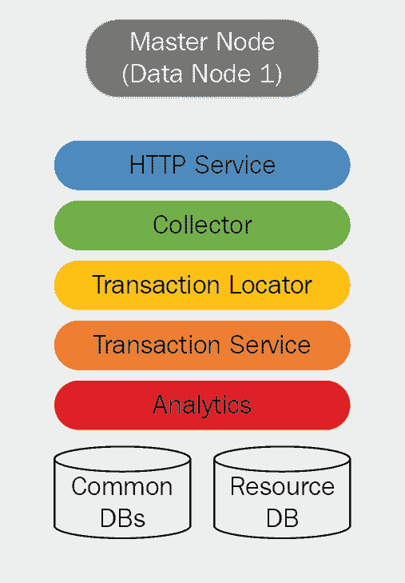
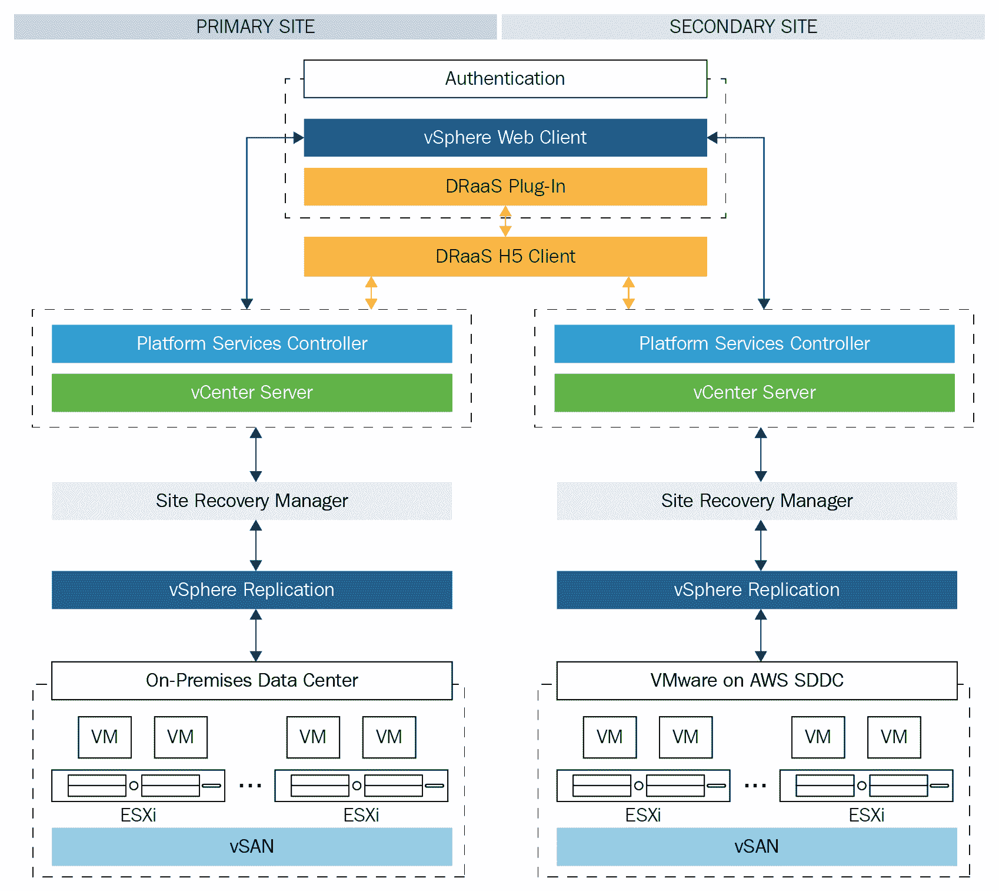
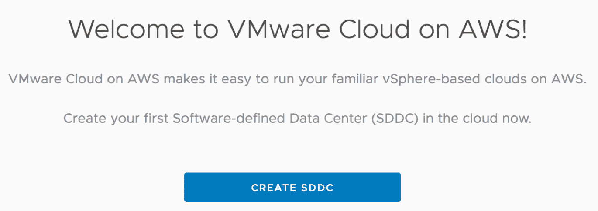
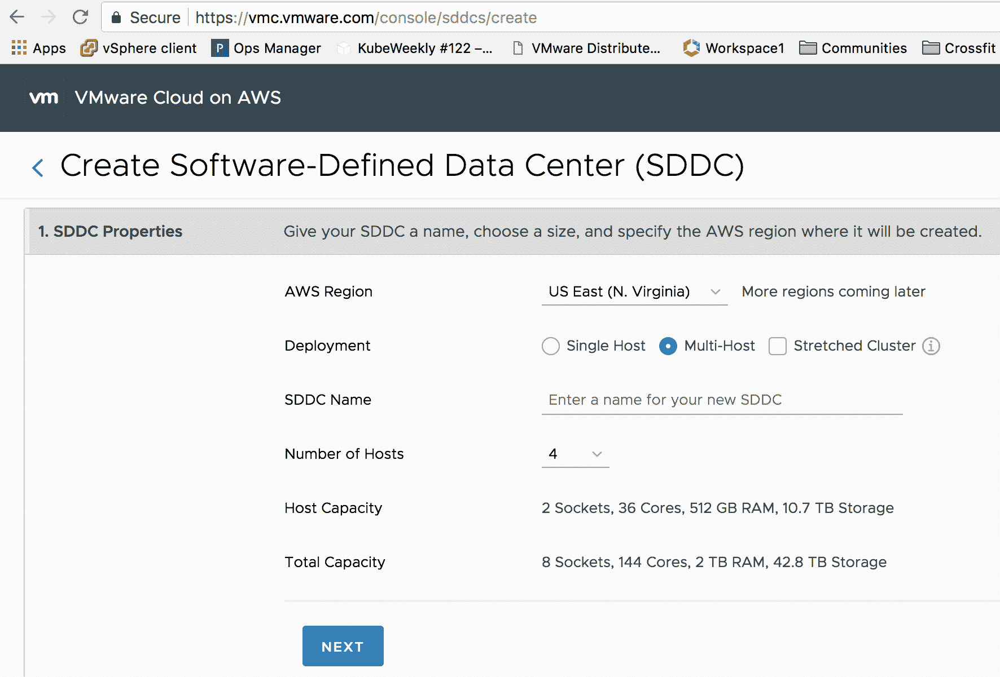
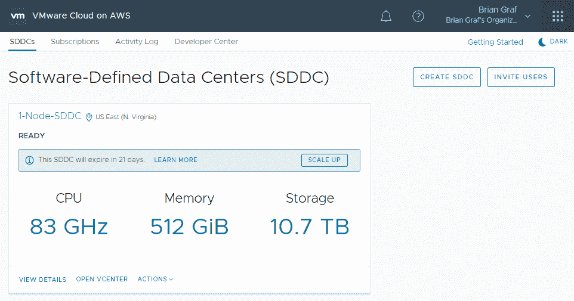
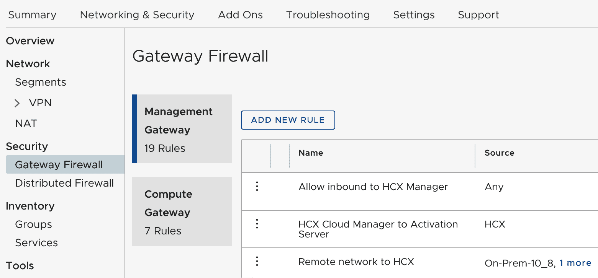
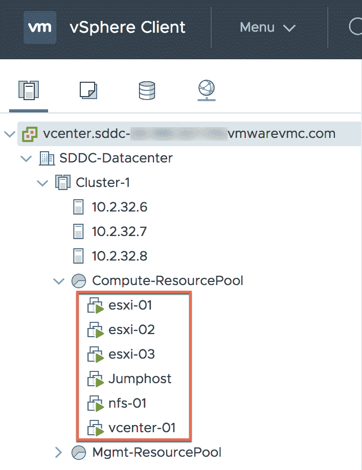
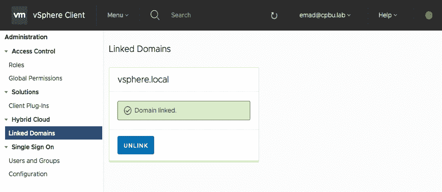
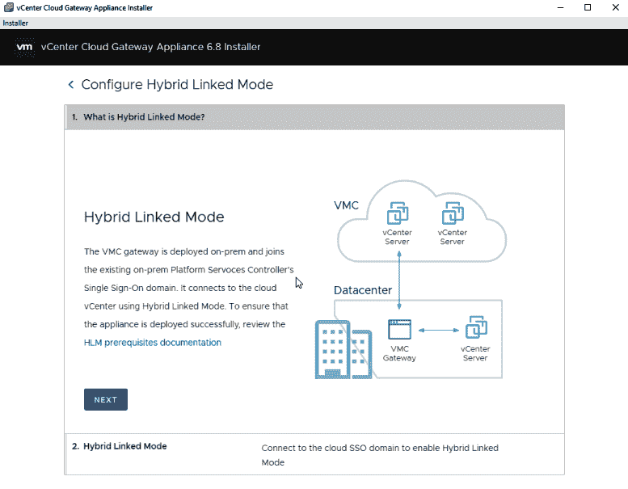
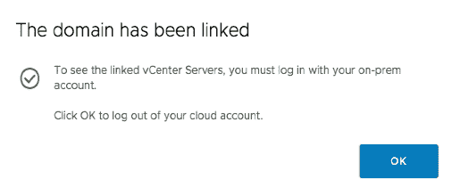

# 第四章：使用 VMware vRealize Suite 进行主动操作

在本章中，我们将关注 VMware 如何通过将高级分析注入解决方案，以意图为基础管理 IT 操作，帮助客户自动化基于 vSphere 的数据中心和公有云。vRealize Operations 的容量分析引擎利用机器学习技术，根据过去趋势分析主动提醒您关于未来事件。

我们将了解 vRealize Suite 中的不同分析引擎，以及 vRealize 工具如何在不同的云环境中工作。此外，我们还将学习通过降低**总拥有成本**（**TCO**）来在 vSphere 上自动化容器，并通过更好的优化提高投资回报率。

本章我们将涵盖以下内容：

+   统一端到端监控

+   **软件定义数据中心**（**SDDC**）之旅中的智能操作分析

+   vRealize Operations 架构和容量规划

+   VMware 容器管理服务

+   VMware Cloud on AWS 的实施计划

# 技术要求

请参阅此链接了解 VMware Cloud on AWS [`cloud.vmware.com/vmc-aws`](https://cloud.vmware.com/vmc-aws)。

# 统一端到端监控

监控解决方案应收集和监控端到端的服务级别和基础设施级别的关键绩效指标（KPI），例如事务响应时间和服务可用性，并对偏差发出警报。它可以理解和映射端到端服务的所有组件，例如应用程序和应用程序组件，并监控所有应用程序平台组件的性能和可用性，例如 Web 服务器、应用程序服务器、消息总线数据库。我们应该通过监控所有虚拟和物理基础设施组件的性能和可用性来理解和映射所有虚拟和物理基础设施组件，包括虚拟机、服务器、存储和网络。我们可以通过识别警报的根本原因来结合和关联所有这些参数，并通过生成警报。IT 运维团队能够根据其角色在可定制的仪表板上获取所有信息，并具有所有报告功能。它应该为分析能力添加预测元素，以防止业务中断。

# 智能操作分析

虚拟环境的动态性和复杂性要求从整体角度出发，与应用程序和其他基础设施部分进行基本关联。它需要一种新的数据管理和分析技术（为物理基础设施设计的工具不适合虚拟环境的动态和去中心化特性）。

操作分析包括两个关键领域：

+   性能分析帮助客户通过以下方式在 IT 操作中采用主动方法，以实现更快的问题检测和解决：

    +   基于自动学习、近实时基准调整、统计和趋势算法的主动控制服务性能和可用性

    +   服务影响分析和优先级排序

    +   问题隔离和根本原因分析

+   容量分析通过当前和历史数据分析、模拟以及实现假设情景的能力，实现预测方法：

    +   中长期配置的容量规划和预测

    +   预测警报

    +   通过自动化配置和扩展实现近实时的容量优化

# vRealize Operations Manager 架构

vRealize Operations Manager 收集和分析企业内部多个数据源的信息。vRealize Operations Manager 使用高级分析算法来学习和识别它所监控的每个对象的正常行为。这些信息通过视图、报告和仪表板呈现给用户。

用户界面允许用户以徽章、警报、图表和报告的形式访问分析结果。

vRealize Operations Manager 可以作为**虚拟设备**（**vApp**）下载并作为 VM 运行。它将被配置为在完整的 vRealize Operations Manager 集群设计中执行以下角色之一：

+   **主节点**：集群中的关键第一个节点，或者在小型部署架构中将是单个独立节点

+   **主副本节点**：用于高可用性的可选实例

+   **数据节点**：用于可扩展性目的

+   **远程收集节点**：有助于克服数据收集问题，例如网络中的网络性能不佳

vRealize Operations Manager 提供两种不同的部署模型：

+   预配置的 vApp

+   作为 Windows 或 Linux 可安装包

客户可以选择 vApp 模型以简化部署。

# 应用架构概述

我们将了解 vRealize Operations Manager 的逻辑节点架构及其所有功能：

**HTTP 服务**是主要的产品 UI。它支持主要产品 UI、管理员 UI 和套件 API。这解释了 vRealize Operations Manager 如何计算压力，以及压力是如何用于推荐大小、剩余容量和剩余时间的容量规划计算的。这提供了足够的细节，让人们可以理解 vROps 如何计算这些值，可以在它们合理时进行辩护，可以识别出数据异常导致应被推翻的建议，并解释了 vROps 中可调整参数背后的概念。

# 容量规划

压力是衡量过去一个月最糟糕时刻因规模不足而导致的性能问题严重程度的指标。这是一种处理需求高峰和波动的智能方式，它考虑了资源运行的热度和连续期间运行的时间。

**总容量与可用容量**：总容量是原始容量。可用容量是我们为了规划目的而假定的容量，考虑到宿主故障并减去一些安全余量以确保安全。

*总容量 – 缓冲区（高可用性和通用）= 可用容量*。您可以在 vROps UI 的“分析 | 剩余容量”中看到这一点。

容量定义了压力区域。对于压力计算，我们是使用总容量还是可用容量？这取决于我们是否想了解实际发生了什么（总容量），还是我们正在为未来规划并希望更加谨慎（可用容量）。

对于实际的压力计算，我们使用总容量作为容量。在规划和寻找建议的合适规模时，我们希望谨慎行事，因此我们进行压力计算，其中容量是可用容量，考虑到可能的宿主故障和一些安全余量，在什么容量下我们几乎避免了性能问题，而没有浪费资源。

# 关键成功因素

以下为关键成功因素：

+   提高平均修复时间（**MTTR**）和运营效率，以防止严重的服务影响

+   实施统一的端到端监控

+   将持续容量和性能管理与基于策略的自动化修复相结合，以动态优化性能和容量使用，并迅速修复性能问题

+   引入运营分析以增强实时可见性，并提供基于基础策略的自动化修复能力，用于问题隔离和故障排除

+   通过警报和改进**平均故障间隔时间**（**MTBF**）以及高级主动和自动化能力来引入主动问题检测

+   实现对容量、性能和可用性的全面主动控制

+   采用预测分析能力以实现主动问题识别和解决

+   日日常性能、容量和可用性问题主要是由自适应流程自动化管理的

# VMware 的 Kubernetes 解决方案

Kubernetes 是企业采用的容器编排器，但将 Kubernetes 运行在生产环境中并非易事。企业需要一个支持多云环境并具有网络服务、安全、策略、持久性、监控和数据分析的全面解决方案。随着容器使用量的增加，客户需要编排工具来管理操作，例如扩展和缩减、调度容器和处理故障，以便运行和管理这些容器。Docker Swarm 和 Mesosphere 等容器编排工具可用，但最被接受的是名为 Kubernetes 的开源系统。Kubernetes 为运行容器化应用提供了完美的解决方案，但在生产环境中运行 Kubernetes 仍然是一项复杂的任务。生产能力（如存储、网络、安全、多租户和持久性）需要更多增强和补充工具，以可靠地部署、维护、扩展、监控和自我修复底层基础设施。

# Pivotal Container Service 和 VMware Kubernetes Engine

VMware 有 **Pivotal Container Service** (**PKS**)，这是 VMware、Pivotal 和 Google 联合开发的产品，它可以在 VMware SDDC 堆栈以及公共云提供商（如 **Google Cloud Platform** (**GCP**)）上部署和管理企业级 Kubernetes。VMware PKS 帮助企业在 vSphere 和公共云上运行 Kubernetes。它极大地简化了 Kubernetes 的部署和操作，以便您可以轻松地大规模运行容器。我们可以帮助客户使用 PKS，使他们能够快速在其现有的 vSphere 环境中设置和管理 Kubernetes 服务。客户正在寻找一个简单的 Kubernetes 解决方案，通过帮助他们处理第一天和第二天的一切需求，消除设置和维护平台的长步骤。他们还要求解决方案在网络、存储、安全和多租户领域提供加固的生产能力。

**VMware Kubernetes Engine** (**VKE**) 是一款企业级 **Kubernetes as a Service** (**KaaS**) 产品，提供易于使用、默认安全且成本效益高的 Kubernetes。VKE 将首先在 AWS 上推出。

Forrester 对混合云监控和管理提供商进行了 31 项标准的评估；以下是一些：

+   必须具备跨工作负载的多云管理核心能力

+   必须支持至少 AWS、Azure 和基于 vSphere 的云

+   必须作为独立工具销售

容器作为容器为开发者提供了一个简单、轻量级且可移植的方式来打包和部署应用程序，在各种主机或云环境中。由于这些好处，预计容器在未来的几年中将呈指数级增长。容器不是一项新技术，但一家名为 Docker 的公司成功推广了这项技术，Docker 现在是众所周知的容器格式。

# SDDC 旅程阶段

VMware 定义了以下 SDDC 旅程阶段：

+   **成本中心**：IT 作为成本中心运营。重点是通过对 IT 效率的改进，通过统一的架构和通过虚拟化基础设施来降低资本支出（CapEx）和运营支出（OpEx）。

+   **服务提供商**：通过提供安全、高可用性和弹性的 IT 服务来满足业务需求和服务水平要求，IT 成为服务提供商。

+   **业务伙伴**：通过自动化基础设施和应用的交付，IT 转型为业务伙伴，从而实现更快的交付时间，更响应的 IT 服务，并缩短上市时间。

此数据中心虚拟化和标准化的能力成熟度有三个阶段：

+   计算虚拟化、业务关键应用的虚拟化、大数据应用支持

+   软件定义存储、网络虚拟化、扩展到混合云、数据中心迁移

+   在混合、异构数据中心中进行管理

以下能力至关重要：

+   **财务模型和测量**：对资产及其基础设施容量成本的认识和理解

+   **流程和控制**：IT 流程适应了虚拟化，但主要是手工的，具有临时的跨过程集成

+   建立标准操作程序以保持操作的连续性

+   关注有限的、持续的改进

# VMware 基于容器的服务

这需要以下 VMware SaaS 和第三方产品：

+   部署网络虚拟化基础（NSX-T）

+   部署和运行容器化工作负载（VMware Pivotal Container Service）

提供此服务需要以下先决条件：

+   **部署 NSX-T（虚拟设备）基础**：

    +   虚拟设备虚拟化 CPU 容量的最低要求（GHz）是必须提供足够的 CPU 容量来部署 NSX Manager 和 NSX Controllers

    +   虚拟设备虚拟化 RAM 容量的最低要求（GB）是必须提供足够的内存容量来部署 NSX Manager 和 NSX Controllers

    +   **网络时间协议**（**NTP**）必须设置并验证时间正确。

    +   必须配置 DNS 并测试正向、反向、短名和长名解析。

    +   必须配置共享存储。必须有足够的存储容量来部署 NSX Manager 和 NSX Controllers。

    +   **最大传输单元**（**MTU**）大小：1700（最小）

# 在 ESXi 上部署用于网络虚拟化的 NSX-T 和在私有云中部署 PKS

根据 VMware 标准架构在客户环境中实施和验证基于 NSX-T 的网络虚拟化解决方案。该服务包括对平台先决条件的技术验证，使用 NSX-T 部署网络虚拟化，以及为客户的功能测试。

以下表格显示了与 NSX-T 相关的所有组件的安装和配置：

| **规格** | **描述** |
| --- | --- |
| 部署和配置的 NSX Edge VM | 部署并配置为传输节点的 NSX Edge VM |
| 配置的逻辑交换机 | 已配置的逻辑交换机 |
| NSX-T 层 0 逻辑路由器实例（s） | NSX 层 0 逻辑路由器提供在逻辑网络和物理网络之间使用静态或动态路由**边界网关协议**（**BGP**）对等连接的进出网关服务 |
| VMware ESXi™ 传输节点配置的主机 | 准备好的 ESXi 主机，已注册到 NSX-T 管理平面，并配置为传输节点 |

# 部署 NSX-T 基础架构

**基础 VMware NSX-T 部署**：这包括准备工作、部署和验证 NSX Manager 和 NSX Controllers：

| **规格** | **描述** |
| --- | --- |
| 数据中心位置（s） | 这意味着 NSX-T 组件的数据中心部署。 |
| NSX Manager 实例 | 安装并配置了 NSX-T Manager 设备。 |
| NSX Controllers | NSX-T Controllers 已安装并关联到 NSX Manager。对于每个 NSX Manager 实例，将形成一个包含三个 NSX Controllers 的控制集群。 |

# 部署和运行容器化工作负载

**在私有云中部署 PKS**：部署 PKS 平台以帮助客户创建用于提供 Kubernetes 工作负载的私有云环境。

以下表格显示了与 PKS 相关的所有组件的安装和配置：

| **规格** | **描述** |
| --- | --- |
| 将 Pivotal Operations Manager 部署到 vSphere | 这意味着在单个数据中心内部署 Pivotal Operations Manager。 |
| 配置 Pivotal Operations Manager | 这是指配置 Pivotal Operations Manager 实例。 |
| 安装 PKS | 这是指在单个 Pivotal Operations Manager 中部署 PKS 组件。 |
| 配置 PKS | 这是指在 vSphere 中配置 PKS，连接到现有的 NSX-T 对象，Kubernetes 集群规模计划，**用户账户和身份验证**（**UAA**），任务，syslog，资源配置和 stemcells。 |
| 使用 PKS 创建 Kubernetes 集群 | 这是指使用 PKS 命令行界面根据定义的集群规模计划创建 Kubernetes 集群。 |
| 在 vSphere 中安装和配置 Harbor 容器注册库 | 这意味着使用**o****pen** **virtualization** **application** （**OVA**）安装 Harbor 容器注册库实例，不进行复制，以便单个实例可以为多个集群提供服务。VMware 将协助配置 Harbor 与 Kubernetes 集群节点和其他环境之间的证书，以启用向 Harbor 推送和拉取容器镜像。 |
| NSX-T 为 PKS 集成做准备 | 这意味着创建 NSX-T 对象以用于 PKS 集成。 |
| 逻辑交换机 | 为 PKS 管理网络和服务网络创建了逻辑交换机。 |
| 外部访问 IP 池 | 配置 IP 池以提供为 PKS 创建的每个 Kubernetes 集群的负载均衡地址空间。网络还将提供 Kubernetes API 访问和 Kubernetes 公开服务的 IP 地址。 |
| IP 块 | IP 块配置用于通过**容器网络接口**（**CNI**）分配地址空间给 Kubernetes pods。 |
| NSX-T 一级逻辑路由器实例 | 这些是一级逻辑路由器，一个专门用于 PKS 管理组件，另一个专门用于 Kubernetes 集群节点。 |
| PKS 和 NSX-T 集成 | 这意味着在 vSphere 上配置 PKS 以与 NSX-T 集成。 |

# VMware Cloud on AWS

VMware Cloud on AWS 是一个基于 vSphere 的云服务。该服务将 VMware 企业级 SDDC 软件带到 AWS 云中。它由 VMware 提供、销售和支持，作为一个按需、弹性可扩展的服务，利用 AWS 的全球足迹和服务范围。

除了 VMware vCenter Server®管理和优化外，它还提供了一个全云解决方案，该方案运行在下一代、弹性、裸机、AWS 基础设施上。

这将有助于快速部署安全的企业级 AWS 云资源，这些资源在操作上与基于 vSphere 的云保持一致。这将导致一个完整的交钥匙服务，该服务与本地私有云和高级 AWS 服务无缝运行。

此外，新功能使新的功能得以实现，从而彻底改变商业功能：

+   **VMware Cloud on AWS 灾难恢复**：这是一项按需附加服务，有助于降低成本、简化灾难恢复策略并加快生产环境的上线时间。

+   **VMware** **混合云扩展**（**HCX**）：通过提供零停机时间迁移的批量迁移功能，有助于加速云的采用。此解决方案具有多站点感知、WAN 优化和安全性，以便尽可能快速地将迁移到 VMware Cloud on AWS。

# VMware Cloud on AWS 与本地 vSphere 不同

VMware Cloud on AWS 在 Amazon 的裸金属硬件上运行 vSphere，并具有其云自动化引擎。VMware 管理员可以访问所有必要的接口，包括基于 HTML5 和 Flash 的 VMware vSphere Web 客户端，以及所有需要的 API 集成。这是一个 VMware 管理的服务，**基于角色的访问控制**（**RBAC**）将正常工作。

以下是与特定用户配置文件相关的配置：

+   VMware 管理 VMware Cloud on AWS 环境，因此将权限分配给 `cloudadmin@vsphere.local` 以供用户访问。这可能会与需要访问 `administrator@vsphere.local` 环境的产品产生不兼容性。

+   用户应将工作负载放置在“工作负载”文件夹中，因为其他文件夹权限被拒绝。

+   网络配置通过 VMware Cloud on AWS 用户界面进行，因为 NSX 用户界面不可用。

+   VMware Cloud on AWS 是一个托管环境，因此所有升级和维护程序都由 VMware 执行。

# VMware Cloud on AWS 实施计划

VMware Cloud on AWS 的好处是它是一个可按需部署的架构化解决方案。确保成功连接现有的本地环境到 VMware Cloud on AWS 是相当困难的。

当前本地安装、软件版本和配置决定了成功连接到 AWS 实例上的 VMware Cloud 所需的步骤。本节讨论了 VMware 推荐的实施路径。

以下图显示了评估环境以连接到 VMware Cloud on AWS 环境所需的步骤。以下是基于标准流程的流程图，从身份验证开始：

# VMware Cloud on AWS 的实施计划

使用以下实施计划配置本地环境以支持 VMware Cloud on AWS 连接。完成后，该环境是一个完全配置的混合云，可用于定义的使用案例。

以下是步骤的摘要：

|  | **操作** | **影响** | **必需** | **VM 停机时间** |
| --- | --- | --- | --- | --- |
| 1 | 在 AWS 上创建 VMware Cloud 账户并将其链接到客户 Amazon 账户详情 | 无；时间表取决于账户的创建 | 是 | 否 |
| 2 | 在 VMware Cloud on AWS 中创建 SDDC 数据中心 | 无 | 是 | 否 |
| 3 | 执行本地 vSphere 升级（如果需要） | vSphere 已升级，因此 VM 可能需要停机，如需升级帮助，请联系您的 VMware 销售代表获取有关 VMware vSphere 升级服务的详细信息 | 是（如果版本早于 6.0U3） | 是（如果需要升级） |
| 4 | 本地与 AWS 之间的 VPN 连接 | 创建 VPN 隧道所需的网络更改 | 是 | 否 |
| 5 | 在环境中测试混合链接模式 | 无 | 建议（如果支持混合链接模式） | 否 |
| 6 | 用例配置 | 取决于正在设计的用例 | 否 | 取决于正在设计的用例 |
| 7 | 创建或迁移工作负载 | 冷迁移时的虚拟机停机时间 | 否 | 取决于是否需要冷迁移 |

# 配置 AWS 上的 VMC 的详细初始步骤

配置 AWS 上的 VMC 的详细初始步骤如下：

1.  登录到 VMware Cloud on AWS

1.  邀请用户加入云实例

1.  将凭据链接到 Amazon 账户

1.  创建 AWS 上的 VMware Cloud SDDC 数据中心

    此步骤包括在 AWS 实例上的 VMware Cloud 中创建数据中心。在此过程中，客户将被要求提供配置的详细信息，包括名称、规模、数据中心位置，最重要的是，IP 地址子网信息。在不重新部署 SDDC 的情况下，无法更改 IP 地址的详细信息，因此请确保指定正确的地址。

1.  本地 vSphere 环境升级：

    vSphere 的环境升级必须在此点进行，以确保与 VMware Cloud on the AWS 实例的功能兼容。此过程可能需要一些时间，但请验证所有功能是否兼容。环境必须达到 vSphere 6.0 更新 3 或更高版本才能得到支持，但最好使用 vSphere 6.5 以利用混合链接模式和其它功能。

# 安装、配置和操作程序

以下部分描述了安装、配置和操作 VMware Cloud on AWS 环境的一些基本程序。

以下是对新 VMware Cloud on AWS 环境的基本测试：

1.  登录到测试控制台：

    1.  打开一个网页浏览器

    1.  导航到[`vmc.vmware.com/`](https://vmc.vmware.com/)

    1.  使用您的 VMware Cloud on AWS 凭据登录

1.  创建一个 SDDC：

    1.  点击“创建 SDDC”：

1.  1.  根据提示填写详细信息以配置您的数据中心：

1.  邀请用户：

    1.  点击“邀请用户”：

1.  1.  邀请两个或更多用户到服务

1.  调整防火墙规则：

    1.  选择已创建的 SDDC

    1.  点击“网络信息”选项卡

    1.  通过 VMC 控制台调整防火墙规则，允许从您的内部网络（或您公司的适当安全策略）访问：

1.  登录到 vCenter Server 实例：

    1.  选择已创建的 SDDC

    1.  点击“连接信息”选项卡

    1.  使用指定的凭据登录到 VMware vSphere Web Client™ (HTML5)

以下表示测试 VMware Cloud on AWS 的基本工作流程：

1.  使用 vSphere Web Client (HTML5)的 OVF 部署功能创建虚拟机：

    1.  前往工作负载资源池

    1.  部署 OVF 创建虚拟机：

1.  创建本地内容库：

    1.  如果您还没有，请在本地数据中心创建一个内容库。

    1.  将您的模板、ISO 图像和脚本添加到内容库。所有 `.vmtx` 模板都转换为 OVF 模板。

    1.  发布您的内容库。

    1.  在您的 VMware Cloud on AWS SDDC 中创建一个内容库，该库订阅了您从本地数据中心发布的库。内容从您的本地数据中心同步到 VMware Cloud on AWS 中的 SDDC。

1.  创建虚拟机并使用 ISO 引导操作系统：

    1.  将 ISO 上传到内容库

    1.  创建虚拟机并从内容库挂载 ISO

    1.  然后启动虚拟机

1.  在虚拟机上执行基本虚拟机操作：

    1.  迁移虚拟机

    1.  克隆虚拟机

    1.  使用 VMware vSphere vMotion® 迁移虚拟机

    1.  快照虚拟机

1.  使用 vSphere Web Client（不是远程控制台）连接到您的虚拟机

1.  使用 vSphere Web Client（HTML5）创建逻辑网络：

    1.  前往全局清单列表

    1.  前往逻辑网络

1.  将之前创建的虚拟机分配到该逻辑网络，然后开启虚拟机并编辑虚拟机设置

1.  创建一个规则，允许 `sddc-cgw-network-1` 上的虚拟机访问互联网：

    1.  在计算网关上创建新的防火墙规则

    1.  从您的虚拟机向互联网上的已知 IP 地址进行 ping 操作

# 混合链接模式测试功能

本节描述了混合链接模式测试功能。要测试混合链接模式，请执行以下步骤：

1.  使用连接信息选项卡中指定的凭据登录云 vCenter Server 实例。

1.  通过单击菜单 | 管理员进入混合链接模式配置。

1.  在混合云下，单击链接域：

1.  按屏幕上的步骤配置混合链接模式：

1.  将本地身份源（Active Directory 或 Open LDAP）添加到云 vCenter Server 实例。

1.  授予云 vCenter Server 访问本地 Active Directory 组（在先决条件中指定的组）的权限：

1.  链接到本地单点登录域（您将收到登出提示）。

1.  使用本地 Active Directory 组中的 Active Directory 用户登录云 vCenter Server 实例。本地和 VMC vCenter Server 清单都应可用。

1.  在本地和云 vCenter Server 实例中执行虚拟机操作：

    1.  创建和删除虚拟机

    1.  开启和关闭虚拟机电源

    1.  快照虚拟机

    1.  克隆虚拟机

    1.  迁移虚拟机

目前不支持在本地和云 vCenter Server 实例之间进行 vSphere vMotion。

# 支持和故障排除

对于您的 VMware Cloud on AWS 环境的帮助和支持，有几种选择。本节将简要介绍一些已知问题和解决方案，以帮助您解决问题。

对于您的 VMware Cloud on AWS 环境的帮助和支持，有几种选择。

1.  在您联系 VMware 寻求支持之前，请准备好您的 SDDC 支持信息：

    1.  登录 VMC 控制台，网址为[`vmc.vmware.com`](https://vmc.vmware.com)

    1.  点击 SDDC 卡片上的“查看详细信息”

    1.  点击“支持”以查看支持信息

1.  选择获取帮助或支持的方法：

    +   +   **聊天**：点击聊天图标，然后点击“新建对话”。在聊天窗口中输入您的消息。您可以通过将图片拖入聊天窗口来包含图片。目前，聊天服务时间为周一至周五，美国太平洋标准时间上午 6 点至下午 6 点。

        +   **在 My VMware 上提交支持请求**：点击帮助图标，然后点击 My VMware。您将被直接带到提交支持请求的表单。

            +   **查看上下文帮助**：点击帮助图标。在帮助主题标题下浏览主题或在该字段中输入问题或关键词以搜索可用主题。

        +   **在论坛中提问**：点击帮助图标，然后点击社区论坛。您可以在这些论坛中发布问题和与其他用户讨论产品。

# 摘要

vRealize 工具可以自动将所有 IT 数据和事件关联到一个统一的视图中，并使用预测分析帮助客户通过在问题影响业务之前主动识别和修复问题，从而提高性能并避免中断，获得 IT 环境的完整视图。客户可以在单一解决方案中监控性能、优化其基础设施容量，并执行日志分析，同时对其应用程序和基础设施获得全面的可见性。

vRealize Operations Insight 通过帮助客户使用专为 SDDC 设计的管理工具来准备存储和网络虚拟化，为 SDDC 提供了一个入门途径。使用 vRealize Suite，虚拟化客户有一个解决方案可以完成所有工作，包括 vSphere、容器管理、合规性、日志分析、存储和网络可见性、应用程序依赖关系映射以及操作系统监控。

在下一章（第五章），我们将探讨带有 AppDefense 的基于意图的清单，我们将探索 VMware AppDefense，它使组织能够应对在本地到公共云之间保持数据安全的相关挑战。这是一个数据中心端点安全解决方案，它将威胁检测和响应直接嵌入到应用程序和数据所在虚拟化层的内核中。

# 进一步阅读

+   有关账户创建、链接和邀请过程的详细信息，请参阅[`docs.vmware.com/en/VMware-Cloud-on-AWS/services/com.vmware.vmc-aws.getting-started/GUID-9CAB2B3E-42D5-44A1-9428-E8FFD22BDD01.html`](https://docs.vmware.com/en/VMware-Cloud-on-AWS/services/com.vmware.vmc-aws.getting-started/GUID-9CAB2B3E-42D5-44A1-9428-E8FFD22BDD01.html)上的*VMware Cloud on AWS 文档*。

+   对于测试，必须满足 [`docs.vmware.com/en/VMware-Cloud-on-AWS/services/com.vmware.vmc-aws.getting-started/GUID-BE75F0F1-2864-4926-97FE-37E635471C43.html`](https://docs.vmware.com/en/VMware-Cloud-on-AWS/services/com.vmware.vmc-aws.getting-started/GUID-BE75F0F1-2864-4926-97FE-37E635471C43.html) 中列出的以下先决条件

+   如果满足先决条件，则支持混合链接模式；有关详细信息，请参阅 [`docs.vmware.com/en/VMware-Cloud-on-AWS/services/com.vmware.vmc-aws.getting-started/GUID-BE75F0F1-2864-4926-97FE-37E635471C43.html`](https://docs.vmware.com/en/VMware-Cloud-on-AWS/services/com.vmware.vmc-aws.getting-started/GUID-BE75F0F1-2864-4926-97FE-37E635471C43.html) 中的指南

+   关于网络配置的详细信息，请参阅配置管理网关网络 [`docs.vmware.com/en/VMware-Cloud-on-AWS/services/com.vmware.vmc-aws.getting-started/GUID-3A7090C5-836C-4DBA-9E69-A4A1D9B6F139.html`](https://docs.vmware.com/en/VMware-Cloud-on-AWS/services/com.vmware.vmc-aws.getting-started/GUID-3A7090C5-836C-4DBA-9E69-A4A1D9B6F139.html)

+   请参阅 *VMware Cloud on AWS 入门指南* 中的 *部署软件定义数据中心* 部分 [`docs.vmware.com/en/VMware-Cloud-on-AWS/services/com.vmware.vmc-aws.getting-started/GUID-BC0EC6C5-9283-4679-91F8-87AADFB9E116.html`](https://docs.vmware.com/en/VMware-Cloud-on-AWS/services/com.vmware.vmc-aws.getting-started/GUID-BC0EC6C5-9283-4679-91F8-87AADFB9E116.html)

+   关于升级 vSphere 环境的详细信息，请参阅 vSphere 文档中心中的 *VMware vSphere 升级指南*，链接为 [`docs.vmware.com/en/VMware-vSphere/index.html`](https://docs.vmware.com/en/VMware-vSphere/index.html)
