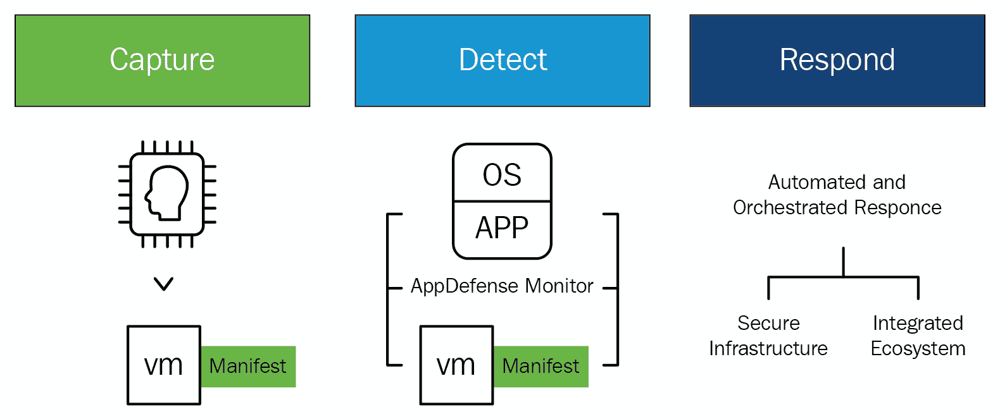
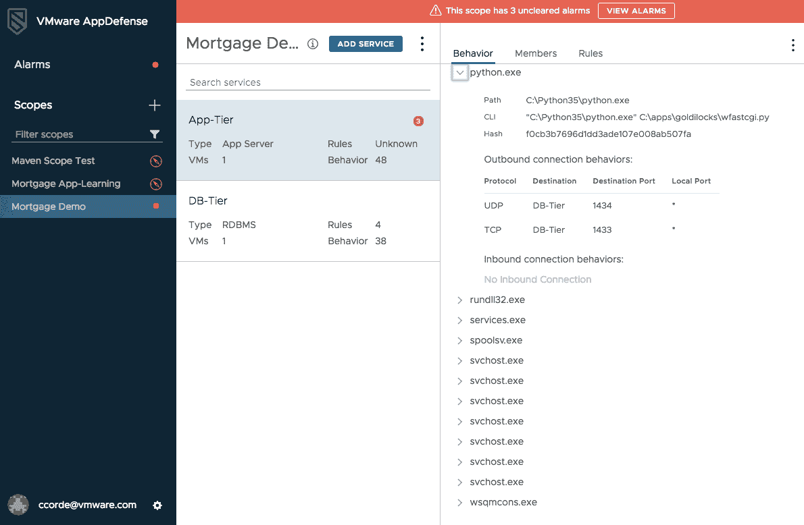

# 基于 AppDefense 的意图清单

本章将介绍您可以使用的方法来托管应用程序，以便您可以为最终用户提供自由度，并为管理员提供完全的控制权。您将通过使用 AppDefense 来了解业务价值，AppDefense 利用机器学习为在虚拟机中运行的应用程序创建一个基于意图的清单。它可以通过与预期状态进行比较的算法，正确地保护应用程序免受恶意行为的侵害。

在阅读完本章后，您将学会如何通过定义以应用为中心的策略来检测、保护和实施应用程序的期望状态，从而在安全运营中心（SOC）中获得相关警报。这将帮助您基于精确的决策引擎设计一个**安全运营中心（SOC**），而不是进行猜测。

在本章中，我们将涵盖以下主题：

+   VMware 在应用程序安全方面的创新

+   SOC 的应用程序中心警报

+   AppDefense 和 NSX

# 技术要求

您可以从[`my.vmware.com/web/vmware/details?downloadGroup=APPDEFENSE-211&productId=742&rPId=31142`](https://my.vmware.com/web/vmware/details?downloadGroup=APPDEFENSE-211&productId=742&rPId=31142)下载适用于铂金版的 VMware AppDefense 插件 2.1.1。

# VMware 在应用程序安全方面的创新

问题在于客户正在采用的安全策略，这些策略用于保护数据中心端点。我们特别指的是数据中心内托管应用程序的端点，而不是终端用户端点，如笔记本电脑或手机。

传统的保护应用程序的方法是监控端点以寻找已知的威胁签名。想想看防病毒软件。AV 软件有一个庞大的已知恶意软件签名数据库，它使用这个数据库在端点上识别威胁。

这种方法的问题在于，如果安全解决方案之前没有见过这种威胁，就没有签名可以匹配，因此，这种威胁会被忽略。这意味着任何全新的（或零日）威胁都将无法被检测到。

近年来，为了解决识别未知威胁的问题，基于机器学习的端点威胁检测方法变得更加突出。其理念是通过尽可能多地聚合环境中的数据，可以使用机器学习和 AI 算法来区分正常行为和威胁。这种方法的问题在于噪声。这些解决方案从环境的许多不同角落收集了如此多的数据，以至于它们难以准确检测威胁。因此，它们往往会产生大量的误报：

应用程序安全必须随着现代开发实践的速度而发展，VMware 已经开发了一种独特的解决方案来解决这个问题。与传统的安全解决方案不同，这些解决方案侧重于追逐威胁，VMware AppDefense 利用其在虚拟机管理程序中的位置来学习应用程序的预期状态，并立即对偏离该状态的情况做出响应。这种级别的应用程序可见性导致更准确的安全策略和更快的修复，简化了恶意行为的预防。这一结果成为 IT 和安全团队的一个共同事实来源，使他们能够轻松地在合规性、安全事件调查和事件响应上进行协作。

AppDefense 通过收集虚拟机的清单和来自自动化和配置工具（如 vCenter、Puppet 和 Ansible）的应用程序详细信息来构建上下文，以便理解特定机器和应用程序的意图。然后，它监控虚拟机、操作系统、进程和应用程序的行为，并将这些信息与配置期间定义的意图相关联。AppDefense 通过使用机器学习，创建一个蓝图，基于已知的好行为，说明机器和应用程序应该如何运行和通信。

一旦建立了蓝图，它就被存储在虚拟机的安全分区中。AppDefense 监控任何更改，检测并防止任何偏离预期、已建立的状态，确保应用程序、基础设施和操作系统的完整性。当检测到威胁时，它可以通过各种能力以及通过 NSX Data Center 进行执行和遏制来原生响应。

# 数字治理和合规性

VMware 政府解决方案使客户能够通过数据中心转型方法安全地现代化政府 IT，加强网络安全，并在基础设施、云、应用程序和端点之间简化操作。政府客户可以使用 VMware 解决方案创新 IT，以产生更大的影响，并部署以数字优先的愿景来实现使命目标。

新技术始终是客户以更好的方式提供相同服务的关键推动力。IT 现代化现在是网络安全解决方案的一个基本组成部分。IT 正在比以往任何时候都更加努力地工作，以满足对基础设施日益增长的需求，以开发成本高昂、效果不佳的系统，这些系统能够支持遗留投资和下一代应用程序。

VMware 通过扩展在计算虚拟化方面的投资到存储、网络和管理，提供了一个安全、实用和准确的方法来现代化数据中心 IT 运营的基础。现代政府数据中心是软件定义的、虚拟化的和集中的，为用户提供运行当今动态服务的可用性、可扩展性和运营效率。VMware 的 SDDC 架构利用全球一致的基础设施，实现应用程序和工作负载在本地、私有和公共云之间的无缝迁移，使客户能够以灵活性运营真正的混合云环境。这最终将在公共云和本地云之间跨越共同的基础设施和管理环境。

# 智能政府工作流程与自动化

IT 正在创新其交付和应用支持的方式，以跟上移动创新，并更好地响应对灵活访问政府资源和服务的内部需求。从锁定和加固的移动方法转向，客户正在利用虚拟化和云技术，将正确的应用和生产力解决方案在正确的时间交到正确的用户手中。VMware 数字工作空间解决方案通过安全、远程访问资源和数据，使政府工作人员能够更有效地服务于公民，跨越设备、地点和应用。它通过在任务计划中实现应用和 IT 服务交付的转型，提高了生产力和影响力。

作为移动工作力的基础，VMware 数字工作空间代表了应用和 IT 服务交付及消费方式的根本转变。基于软件定义的架构，数字工作空间将应用与操作系统隔离开来，实现了 Windows、云原生、Web 和移动应用的敏捷、空中交付和管理。补充微软对 Windows 10 的管理方法，VMware 数字工作空间解决方案抽象化设备和应用生命周期管理，以支持空中传输的 Windows 10 PC 和应用程序。一个企业级安全的应用程序目录，基于基于身份的访问和统一端点管理，为用户提供类似消费者的工作体验，同时不牺牲数据安全或合规性。它提供了额外的安全功能，包括对所有端点的全面可见性和管理，如 macOS 和 Windows 桌面和笔记本电脑设备，设备和数据级别的加密，细粒度的**数据丢失预防**（**DLP**）策略，以及自动合规性监控，以进一步保护数据并防止数据丢失。

# 转型网络和安全

客户必须通过减少总体威胁攻击面来加强网络安全。他们通过转型 IT 基础设施和治理来实现这一点。应用程序和数据正生活在越来越扩展和分布的 IT 环境中；最终用户不再被整齐地包含在边界防火墙后面，攻击者比以往任何时候都更聪明，因此网络安全努力必须不仅仅绑定核心基础设施，还要扩展到云、用户的身份和他们的设备。VMware 通过采用多层、软件定义的网络安全方法，帮助客户跟上不断变化的网络安全需求，增强了用户、应用程序和数据之间交互的可见性和控制。

网络虚拟化通过在虚拟机管理程序中嵌入网络并启用微分段，减少了物理网络环境固有的风险和低效，确保网络、安全和自动化策略遵循单个工作负载或应用程序，从而降低了基础设施的攻击面。这一抽象层还为 IT 提供了平台，以便插入额外的第三方服务以提供更高级别的安全保护，并在工作负载级别提供加密数据的理想位置。

在高度分布的计算环境、更大的跨组织防御协作和更严格的隐私法规，如**通用数据保护条例**（**GDPR**）的情况下，组织必须适应无边界计算。VMware 通过在虚拟化基础上构建并转向分层、分段和策略驱动的安全架构来帮助 IT 转型安全。VMware 解决方案与传统安全措施协同工作，以减少攻击面并防止威胁的横向移动。

# VMware 方法的企业成果

VMware 帮助客户转型政府数据中心，以提高效率、扩展到云并支持共享服务。VMware 的方法是利用虚拟化和**超融合基础设施**（**HCI**）来构建一个敏捷、以服务为导向的数据中心，通过以下方法实现标准化、集中化和混合云就绪：

+   减少数据中心占地面积、硬件和运营成本，以优化数据中心

+   仅使用所需资源构建一流的私有云，并双向扩展到公共云

+   在多个组织中整合 IT 系统、功能和服务的共享服务模型

+   支持云原生应用程序开发和平台，以及传统应用程序

+   通过更快、按需交付 IT 资源来提高效率、敏捷性和 IT 服务水平

+   将节省的资金重新投资于应用程序开发和敏捷性

以下是为不同用例提供的 VMware 解决方案方法：

+   通过一个全面和现代的安全平台减少总威胁攻击面：

    +   **VMware 方法**：通过在应用程序基础设施和终端点上应用一个无处不在的软件层，实现一个软件定义的安全和治理框架，这些终端点独立于底层物理基础设施：

        +   将安全功能从底层物理基础设施中解耦，并将保护措施更靠近整个 IT 环境中的数据/工作负载

        +   在数据中心和云基础设施中嵌入内在安全

        +   降低风险并改善安全态势

        +   降低操作复杂性

+   通过物联网提供服务和保护：

    +   **VMware 方法**：VMware 提供企业级物联网设备管理和监控解决方案，解决机构在将物联网用例从边缘到云端的上线、管理、监控和安全方面面临的挑战。只需一个控制台即可配置、安全、管理和监控物联网基础设施。VMware 方法的好处如下：

        +   简化复杂性

        +   提高可靠性

        +   转变安全

        +   加速创新并加快投资回报率

+   构建新的能力、运营模式和包括以下内容的服务：

    +   智慧建筑

    +   **国防**：改善资产跟踪和供应链管理；网络中心战，通过摄像头、红外传感器、探测器、无人机和卫星提供战场共享感知

    +   **车队遥测**：使用传感器远程监控车队内车辆的位置、性能和行为

    +   监测天气和大气条件

    +   提升安全和公共卫生

    +   智慧城市

+   开发电子政府和安全框架以实现数字公民：

    +   **VMware 方法**：VMware 通过自动化 IT 基础设施的每一层，帮助政府通过从数据中心到终端用户设备的数字化来现代化 IT。这种抽象使得在整个生命周期中，可以通过编程方式全面可见和控制系统组件，增强安全性、提高效率并支持现在和未来的现代框架：

        +   提高公共服务交付的成本和质量

        +   提供新的功能

        +   加快创新

        +   维护公民信任、数据安全和隐私

+   采用零信任安全模型：

    +   **VMware 方法**：使软件定义网络能够分割和隔离网络，并控制数据中心内的横向移动。它将网络嵌入到虚拟机管理程序层，将网络、自动化和安全服务附加到由策略驱动的、与工作负载或应用程序同步的工作流程中，从而实现一种分层、深度防御的安全方法：

        +   将网络保护扩展到应用程序和数据

        +   确保安全策略与应用程序同步

        +   通过自动化和编排跨单个工作负载系统地执行策略

        +   在网络中行使最小权限和单元级信任的能力

        +   包含攻击的横向传播

        +   减少错误和低效

# 使用 AppDefense 进行全球扩展

AppDefense 基于机器学习技术进行威胁检测和响应解决方案。客户信任数字信息，但任何数据泄露都会影响他们的消费者信心，以及他们的声誉。数据对于组织在当今市场保持竞争力至关重要，因此数据安全不能被妥协。

AppDefense 帮助组织解决与保护其数据安全相关的一些挑战。它是一个数据中心端点安全解决方案，将内置的威胁检测和响应解决方案嵌入到 vSphere 内核中，包括主机应用程序和相关数据。它整合了每个端点上的所有所需服务的正确状态的信息。它还可以在发生时检测到未经授权的更改。

以下是一个 AppDefense 仪表板截图，其中包含三个未清除的警报：

VMware AppDefense 专注于通过消除对整个环境进行钻探的需要，追逐可能构成威胁的**已知**或**未知**错误行为，来验证端点的**已知正确**参数。通过最小化误报的发生，安全团队能够以充分的信心将异常检测为真正的威胁。AppDefense 位于攻击面之外，因此它本身不会被破坏。

# 针对安全运营中心的应用程序中心警报

AppDefense 会发出一个智能警报，这对环境来说非常重要。只有带有自动响应的受信任警报才能让安全团队能够专注于从他们的环境中寻找和摧毁威胁，而不是从错误的数据中寻找威胁。安全运营中心（SOC）可以使用这个工具来有信心地检测威胁，并自动响应威胁。**首席信息安全官**（**CISO**）组织分为安全架构师和安全运营。安全架构师负责制定用于保护特定应用程序的政策，而安全运营负责实际监控和识别环境中的威胁。

安全架构师审查新应用程序并确定它们应该如何受到保护。今天，他们对应用程序的组成、应该（或不应该）运行哪些进程以及它们应该如何通信（以及与谁通信）了解非常有限，他们甚至不知道该去找谁解答他们的问题。审查过程可能需要数月，而且，他们使用的政策通常是通用的，重点是确保应用程序已打补丁并且日志被监控。

使用 AppDefense，架构师从一开始就能获得应用程序预期状态和行为的可信清单，这使他们能够定义特定于应用程序的政策，从而在应用程序最终部署时为 SOC 去除猜测工作。这使得审查过程更加有效、更少手动操作，并且速度更快，这对于组织转向更敏捷的应用程序开发方法尤为重要。

一旦应用程序部署，检测应用程序是否受到损害的任务就落在了 SOC 上。今天，他们面临着大量的误报和噪音，需要从中找出合理的解释。如果他们发现问题，补救措施是手动且劳动密集型的。使用 AppDefense，当收到有关出现问题的警报时，SOC 可以相信该警报是合法的。此外，他们可以自动化补救措施，以便快速有效地消除威胁，最大限度地减少对环境的损害。

# 转变应用程序安全准备

在 DevOps 环境中，应用程序的开发、更改和销毁都非常迅速。带有增强功能的应用程序代码经常更改，这使得安全团队很难定期更新/了解应用程序中的新修订。客户不能冒险让关键数据受到损害，这可能会损害他们的宝贵声誉。客户必须确保所有平台上的安全服务紧密保护他们的网络、应用程序和数据中心端点位置。

几乎任何拥有计算机的人都可以对特定组织发起攻击，并且每天都有新的威胁类型被开发出来。我们无法持续关注威胁以破坏与 IT 安全相关的所有挑战。

CISOs 负责保护动态和分布式 IT 环境中驻留的应用程序和数据。客户必须选择新的云原生应用程序开发流程，并且还必须实施加强其商业目标的安全措施。

AppDefense 通过确保“良好”而不是“追逐不良”的方式来保护应用程序。AppDefense 通过其目标理解应用程序行为，并对照应用程序期望状态进行检查。当应用程序被操纵时，AppDefense 会自动响应。这是一个简单而强大的工具，通过提供更多上下文和控制来缩小攻击面。

AppDefense 也可以在容器环境中工作，并帮助客户在任何平台、跨区域边界上保护他们的应用程序。AppDefense 为数据中心应用程序提供基础层保护。AppDefense 是唯一一个可以跨所有平台，以一致的方法发现上下文、定义带有警报的规则和补救措施的解决方案。客户可以通过集成容器支持，在所有应用程序中启动最小权限执行。

# 与开发者、安全和运维团队一起创新 IT 安全

安全团队可以使用 AppDefense 为经常进行应用程序开发和部署的客户建立安全审查流程。

由于终端用户需求不断变化，应用程序和基础设施今天扩展得更快。这将挑战安全团队在应用程序定期被重写和重新部署时，放弃传统的、手动的方式去调查和管理变更。安全团队应该了解应用程序的意图，并为其期望状态定义安全策略。

我们通过将其集成到 CI/CD 管道中，使用配置工具和自动化框架来使用 AppDefense。我们可以通过维护一个与按需应用程序团队保持同步的预期状态的可信映射，通过实时监控来定义期望状态，以支持 DevSecOps 方法。

# 容器化应用程序的最小权限安全

AppDefense 提供了一个 API，使容器安全合作伙伴能够集成到平台中。AppDefense 可以从容器编排系统中获取工作负载上下文，并且还可以配置由容器安全供应商执行的政策。

Aqua Security 是可以与 AppDefense 容器生态系统集成的第三方工具之一；它通过调查和执行行为，为容器执行时提供运行时保证。AppDefense 与 Aqua Security 将帮助容器运行时配置文件，以便 VMware 可以在整个数据中心管理/维护安全范围，并且 Aqua 还会将引人注目的警报传输到 AppDefense 控制台，用于管理和解决。通过集成到可以扩展到混合云模型的容器安全解决方案中，容器自带自动化引擎和定义了期望状态的技术。

AppDefense 支持运行在所有平台上的 VMware vCenter 库存，如虚拟服务器、裸金属服务器和任何云环境中的容器工作负载。AppDefense 通过欧洲基于数据中心的支持，支持欧洲客户的数据本地化政策。

**通用数据保护条例**（**GDPR**）（法规[EU] 2016/679）是一项建立和合并欧盟内个人数据隐私权的法规。GDPR 还关注个人数据超出欧盟区域边界的出口。GDPR 的第一个目标是控制个人数据，如个人的姓名、地址和国民身份证号码，这是一项基本权利，并通过协调所有欧盟国家的数据保护规定，使全球商业的监管环境易于理解。

欧洲联盟的通用数据保护条例（GDPR）扩大了当前欧盟数据保护法律的适用范围，涵盖了处理个人欧盟数据的非欧盟组织。数据保护批准的协调应使非欧盟组织更容易遵守严格的数据保护合规当局，并对不遵守规定实施最高惩罚。VMware 将与欧盟的 GDPR 保持一致。

VMware 可以通过在其标准合同条款内构建合规框架来应对从欧盟出口个人数据的问题。我们可以在当前欧盟法律下，根据需要为客户提供高水平的保护。VMware 的标准合同条款包括全球范围内 VMware 及其子公司之间个人数据流动的内部共识。VMware 的客户依赖于 VMware 在安全港计划下的认证，以及 VMware 处理客户个人数据的方式。VMware 的内部标准合同条款可由其任何客户使用。

VMware 帮助客户在数据安全方面与 GDPR 保持一致，以便客户可以与隐私专家交流想法，并通过支持预期法律来执行业务流程。

AppDefense 是一款具有许多优点的基于云的安全工具，但为了性能和数据本地化，拥有本地数据中心非常重要。欧洲客户必须遵守有关数据本地化的监管合规。AppDefense 服务将仅从位于欧洲的本地数据中心向欧洲客户提供服务。AppDefense 已推出一项关键的云安全服务，以最大化全球拥有区域数据中心的客户。

印度政府也有这样的政策，他们只能从在印度设有数据中心的公司获取云服务。

AppDefense 收集和利用终端用户和业务数据，从合规的角度来看。它还适用于不同的全球数据法律/法规。AppDefense 收集客户电子邮件地址进行身份验证，然后将其放入服务中进行检查，以查找个人信息。AppDefense 还从客户受保护的应用程序中获取主机名、IP 地址和进程信息。所有这些关键数据从合规角度来看都至关重要。AppDefense 支持托管在不同类型云中的应用程序。

# 带有 AppDefense 的增强安全性

客户正在更新其数据中心的基础设施，并且正在努力解决所有严重的安全漏洞，而无需额外花费任何费用。AppDefense 与 VMware NSX 结合，将通过微分段增强网络安全，并保护服务器免受未知威胁。

大多数安全漏洞无法通过单一产品（只能处理单个问题，而没有完整的解决方案）或工具来解决，因为这些产品更基础、更具架构性。AppDefense 通过在 vSphere 内核中植入 AppDefense，使安全成为网络和应用架构中业务运行的一个固有部分。安全是数据中心端点的原生部分，由应用程序组成。AppDefense 帮助其客户应对安全模型中安全事件点日益频繁和成本上升的问题，这些模型主要关注未识别的威胁。AppDefense 传达了一种基于目的的安全模型，该模型确定应用程序应该做什么——已知的正确。将其与黑客将要做的事情——已知的错误进行比较。

# AppDefense 和 NSX

AppDefense 为在 vSphere 环境和各种云环境中运行的应用程序提供保护。NSX 和 AppDefense 相互补充，但 NSX 不是 AppDefense 服务的强制性要求。如果 AppDefense 与 NSX 集成，可以利用自动隔离受损害的数据中心端点等自动化响应技术。AppDefense 在一种新的安全模型中表现出色，该模型具有原生、基于目的和应用中心的方法。AppDefense 将为计算执行与 NSX 为网络执行相同的任务，通过为业务应用程序创建最小权限环境。我们可以监控运行中的应用程序与其期望状态，并可以通过自动响应尝试利用应用程序的攻击来调查它们。

AppDefense 具有独特性，因为它位于虚拟机管理程序内核中，以便更好地解释数据中心端点的期望状态和行为。它实时监控端点，以检测从*已知正确*状态的不批准更改。当检测到应用程序的威胁时，AppDefense 使用 vSphere 与 NSX 进行自动化响应。

AppDefense 补充了多种安全解决方案，但它与两种主要的端点安全解决方案竞争，如下所示：

+   基于签名的传统产品（防病毒软件、反恶意软件、入侵防御系统等）

+   新一代端点安全（**端点检测与响应**（**EDR**）、机器学习、行为分析等）

与之前解决方案相比，AppDefense 通过识别应用程序期望状态与可能警告之间的偏差而不断发展，同时它也具备自动化响应能力，这些能力可以与其他安全工具在多个方面进行集成。

VMware 从数据中心到终端用户，协助客户使用安全和数据保护功能。通过识别潜在的数据保护漏洞，确保客户环境端到端的安全：

+   **数据访问和数据传输（使用 VMware NSX）**：创建安全策略以防止数据在未经批准的网络中移动

+   **数据访问（使用 Horizon 和 Workspace ONE）**：创建策略引擎以实施基于角色的数据访问，并进行身份检查和验证

+   **数据存储（使用 VMware vSphere 和 vSAN）**：启用数据加密

+   **数据删除（使用 VMware vSphere 和 AirWatch）**：擦除数据，包括单个数据

AppDefense 与微软的基于虚拟化的安全工具（**VBS**），如 Device Guard、Credential Guard 和 AppLocker 不同，因为这些工具仅针对 Windows 构建，且不支持 Linux 工作负载。此外，这些解决方案都没有设计用于检测和响应数据中心端点的威胁。VBS 使用虚拟机管理程序来帮助保护内核和其他操作系统部分。AppDefense 专注于应用程序。保护应用程序意味着保护应用程序组件的完整性和行为，而不仅仅是操作系统。即使 VBS 不存在或未启用，AppDefense 也提供操作系统保护。AppDefense 还向安全运营中心（SOC）提供检测和响应任何妥协的能力。Device Guard 专注于白名单，指定哪些可执行文件可以在机器上运行。它不执行行为白名单。它不采取以应用程序为中心的视角来创建、更新和监控这些策略。它不支持自动化响应集成。所有这些都是提供高效用于 SOC 的解决方案的必要组成部分。AppLocker 是较老的应用程序白名单解决方案，专注于终端用户端点，并遭受了传统白名单所具有的所有问题。关于何时使用 AppLocker 而不是 Device Guard，存在很大的混淆。

AppDefense 为应用程序执行白名单和行为分析。传统的白名单基于监控和验证允许安装在机器上的内容。然而，这种方法忽略了行为组件。机器允许做什么？AppDefense 将其方法中的这两个组件结合起来，以确定应用程序的预期状态。AppDefense 还从整体上看待应用程序的行为，而不仅仅是关注单个数据中心端点。AppDefense 在云中存储虚拟机清单、机器名称、预期的进程行为、预期的网络流和安全警报。AppDefense 保存有关客户数据中心环境和安全状态元数据。AppDefense 不会在云中存储任何应用程序数据，也不处理来自客户的实际应用程序数据。存储的唯一数据是维护基础设施安全态势所需的数据。

我们保护存储在云中的信息，因为我们非常重视 AppDefense 服务的安全性。该服务由 VMware SOC 管理并保护，该团队同样负责管理 VMware 所有云服务的安全以及 VMware 的本地数据中心。AWS 中的任何配置更改或行为都由 SOC 密切监控，并需要经过授权的变更控制流程。所有数据都通过加密隧道发送到 AppDefense 服务，并且存储的所有数据都进行了加密。

AppDefense 使用第三方服务提供商，并利用精选的少数第三方 SaaS 服务。所有第三方供应商都经过内部安全和法律团队审查，并与 VMware 签订了数据隐私协议。

AppDefense 作为 SaaS 服务进行管理，客户通过使用 AppDefense 获得以下好处：

+   安全团队不需要部署、管理和维护软件，这不是他们的核心专长。

+   客户可以受益于 vSphere 安装基础的集体知识。这意味着我们可以从不同租户的大量机器上运行的行为建立基线，以便更快地识别异常和安全威胁。

+   云交付模型使我们能够定期更新和更改一些异常检测逻辑，而无需要求客户安装和管理软件更新。

+   将服务作为云服务提供，允许客户从单一位置管理其环境的安全态势。

AppDefense 理解应用程序的预期状态，应用程序的预期状态包括构成应用程序的 VM、服务和二进制文件等信息，以及与核心应用程序共存的其它软件，如安全和管理系统软件。它还包括行为信息，如各种进程之间的网络交互。AppDefense 还与 vRealize Automation、Puppet 等配置系统集成，以获取预期状态的信息。然后，它通过运行时发现行为来增强这些信息，以创建全面和验证的预期状态。如果 VM 使用 vMotion 在主机或集群之间移动，AppDefense 策略也会随之移动，类似于 NSX。AppDefense 的管理域边界是 vCenter，因此目前不支持在 vCenters 之间移动 VM。

可能会创建误报的预期应用程序更改有两种形式：软件更新和学习期间未表现出的行为。为了限制误报，请执行以下操作：

+   我们建议为应用程序设置一个延长和可变的学习期

+   我们支持通配符，并执行智能和自动通配符匹配

AppDefense 不会在端点或主机上消耗大量系统资源，因为它出奇地轻量级，在主机上消耗的资源最少。AppDefense 使用简单的方法来理解应用程序的预期状态并监控变化，而不是依赖于复杂的算法和计算，这是其他下一代端点安全解决方案通常的工作方式。AppDefense 与**安全信息和事件管理**（**SIEM**）和其他下一代安全解决方案集成，因为它是一个开放平台，允许 SIEM 和其他安全系统消费其警报和应用程序上下文信息，以及利用其自动响应功能。

AppDefense 通过集成 DevOps 自动化工具以获取可信的预期状态数据，与配置管理工具、编排引擎和云管理门户集成。您还可以与 vRealize Automation 集成，并添加对 Puppet 等工具的支持，以实现自动化配置和编排。

# 详细的实施和配置计划

以下部分涵盖了 AppDefense 成功部署所需的组件和步骤。将被 AppDefense 保护的目标应用程序环境需要具备以下条件：

+   至少两个运行 ESXi 6.5a 或更高版本的 ESXi 主机

+   管理 ESXi 主机的 vCenter 6.5+

+   VM 硬件版本 13

+   AppDefense 设备 OVA 的 IP 地址以及到互联网的 HTTPS 连接

+   至少一个在 Windows Server 2012 或 2016 64 位上运行的类似生产的应用程序

+   优先选择的应用程序应该是分布式的（例如，Web-App-DB）

+   NSXv 6.3 或更高版本

+   vRA 7.2 或更高版本

# AppDefense 部署的环境准备

AppDefense 部署的环境准备如下：

+   **第一阶段**：

    +   安装 vCenter

    +   安装 ESXi 主机

    +   安装 NSX Manager

    +   安装 vRealize Automation

**安装和部署 AppDefense 组件**：应用程序和基础设施团队负责安装和支持 AppDefense 平台组件，并选择目标应用程序。应用程序团队还负责为目标应用程序提供测试，并模拟对已部署应用程序的标准更改。

+   **第二阶段**：

    +   提供 AppDefense 登录

    +   下载 AppDefense 设备

    +   部署 AppDefense 设备 OVA

如果满足以下条件，AppDefense 部署将成功：

+   +   AppDefense 在环境中成功部署（所有组件）

    +   AppDefense 已成功连接到所有外部组件（vCenter、NSX 和 vRA）

    +   从 vCenter 可见的虚拟机库存可以从 AppDefense 管理控制台访问

    +   描述的关键工作流程应成功完成

它从捕获虚拟机的预期目的、状态和行为开始。在这里，我们利用 vSphere 的独特属性，即应用程序可见性。虚拟机管理程序允许您看到运行时状态（VM 中正在运行的内容）和配置状态（最初在那里配置的内容）。

+   **第三阶段**：

    +   部署一个 AppDefense Manager 实例

    +   复制 UUID 和 API-KEY

    +   修改`application.properties`文件

    +   验证 AppDefense 设备连接性

    +   验证 NSX Manager 连接性

    +   验证 vRealize Orchestrator 连接性

**通过配置 AppDefense 组件完成 AppDefense 部署**：这些解决方案的所有技术要求（IP 地址、DNS、虚拟机、NTP 等）都需要满足。客户必须通过审查其环境中的允许行为准则、配置保护策略、监控受保护的应用程序以及使用 VMware 提供的工具、内部工具或手动触发违规来帮助实施团队。将带有 AppDefense 的测试应用程序运行和保护将根据当前和即将到来的安全威胁定期评估。

+   **第四阶段**：

    +   在 ESXi 主机上安装主机模块

    +   在应用程序服务器上部署客户机模块

    +   启用客户机完整性

    +   验证应用程序服务器显示为就绪状态

**创建具有基础检测和响应功能的应用程序范围**：AppDefense 的核心是定义应用程序的预期状态。预期状态包括应用程序的组成、进程级、入站和出站连接行为，以及它们在更广泛的应用程序上下文中的关系，因为这些应用程序根据客户需求用于连接或集成。在部署期间将使用这些方法之一来创建预期状态。

+   **第 5 阶段**:

    +   在 AppDefense 中为应用程序创建一个范围

    +   在 AppDefense 中为应用程序创建服务

    +   验证捕获过程已运行几周

**创建应用程序范围**：您可以使用来自 vRealize Automation 的基础设施蓝图来创建 AppDefense 中的服务和应用程序范围/组合，您还可以在 AppDefense 中手动定义应用程序组合。

+   **第 6 阶段**:

    +   创建多机蓝图

    +   在蓝图上使用范围和服务标记虚拟机

    +   验证 AppDefense 中的范围创建

**验证和保护模式**：我们可以在应用程序上运行 AppDefense 发现模式几周，以自动学习应用程序行为。您还可以修改和验证应用程序的预期状态（允许的行为）。

+   **第 7 阶段**:

    +   验证行为

    +   根据需要添加/修改/删除行为

    +   将操作更改为验证和保护

    +   观察警报日志中的默认规则违规

**修复测试**：测试自动和手动工作流程以执行以下修复操作：

+   +   挂起

    +   关闭电源

    +   快照

    +   阻止和警报

    +   检测测试和事件调查

    +   通过触发未授权行为进行预期状态偏差测试

    +   事件调查

    +   带有详细通知的警报

    +   配置事件

+   **第 8 阶段**:

    +   修改关闭电源的规则

    +   触发未授权行为

    +   验证日志中的关闭电源和相关的警报

    +   修改挂起的规则

    +   触发未授权行为

    +   验证日志中的挂起和相关的警报

    +   修改阻止和警报的规则

    +   触发未授权行为

    +   验证日志中的区块和警报以及相关的警报

    +   修改快照规则

    +   触发未授权行为

    +   验证日志中的快照和相关的警报

**使用 NSX Manager 进行修复测试**:

+   +   创建和更新预期状态的简便性

    +   事件响应自动化的简便性

    +   当使用预期状态的偏差作为安全或合规事件信号时，低噪声与信号比

    +   隔离

    +   保护策略的配置

+   **第 9 阶段**:

    +   修改隔离的规则

    +   触发未授权行为

    +   验证 NSX AppDefense 安全标签已应用

    +   验证 NSX AppDefense 安全组包含

    +   验证 NSX AppDefense 安全策略已应用

    +   验证虚拟机无法再进行通信

# 摘要

数字化转型有潜力彻底改变政府与公民/选民的联系方式、保护敏感信息以及实现组织使命的方式。然而，改革政府的业务是一个复杂的任务。主要障碍包括孤立的遗留系统、应用程序和流程；资金和人才短缺；复杂的采购流程以及文化冲突。尽管存在这些普遍的挑战，政府领导人认识到，数字化转型是服务数字时代公众的必要手段。VMware AppDefense 有助于加强基础设施和端点之间的数据安全，通过降低网络安全风险来保护敏感公民数据和隐私。

在下一章，第六章，*基于机器学习的智能日志管理*中，你将了解 vRealize 工具如何自动将所有 IT 数据和事件关联到一个统一的视图，并呈现 IT 环境的完整图景，你还将使用分析来预测并为客户提供服务。我们还将通过使他们能够主动识别和修复问题，在这些问题影响业务之前提高性能并避免中断。
