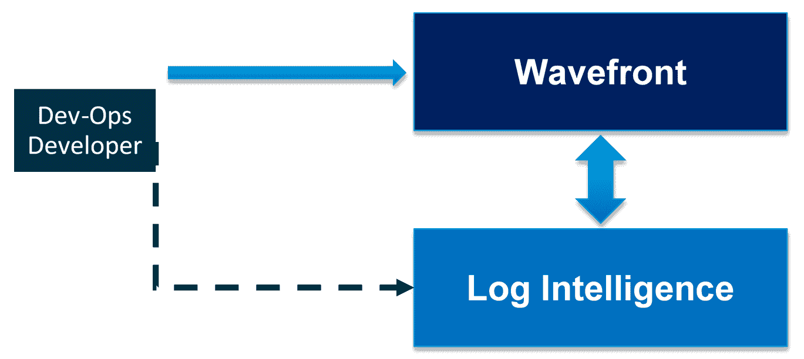

# 基于机器学习的智能日志管理

在本章中，我们将探讨 vRealize Log Insight 的架构及其工作原理。我们还将讨论智能数据摘要的发生及其将相似消息聚类的功能。vRealize Log Insight 还具有自动模式提取功能。它具有通过索引和智能分组在物理、虚拟和云环境中进行快速故障排除的能力，这有助于通过精确的根本原因分析快速找到解决方案。

我们将学习如何通过将 vRealize Log Insight 与第三方工具集成，利用 vRealize Log Insight 进行自动修复，以及索引和消息分组背后的逻辑。

本章我们将涵盖以下主题：

+   使用 vRealize Log Insight 的智能日志管理

+   云运维阶段

+   **VMware vRealize Network Insight**（**vRNI**）

# 技术要求

您可以下载以下内容：

+   VMware vRealize Log Insight 4.6.2，请访问[`my.vmware.com/web/vmware/details?downloadGroup=VRLI-462&productId=676&rPId=28154`](https://my.vmware.com/web/vmware/details?downloadGroup=VRLI-462&productId=676&rPId=28154)

+   VMware vRealize Operations Manager 6.7.0，请访问[`my.vmware.com/web/vmware/details?downloadGroup=VROPS-670&productId=676&rPId=28154`](https://my.vmware.com/web/vmware/details?downloadGroup=VROPS-670&productId=676&rPId=28154)

+   VMware vRealize Network Insight 4.0.0，请访问[`my.vmware.com/web/vmware/details?downloadGroup=VRNI-400&productId=832&rPId=29784`](https://my.vmware.com/web/vmware/details?downloadGroup=VRNI-400&productId=832&rPId=29784)

+   日志智能，请访问[`cloud.vmware.com/log-intelligence`](https://cloud.vmware.com/log-intelligence)

# 使用 vRealize Log Insight 的智能日志管理

对于 VMware 客户来说，了解全面的云管理平台产品至关重要，这也是自动化和简化数据中心运营努力的一部分。

我们可以使用 vRealize Log Insight 作为单一解决方案来规划日志管理解决方案。我们应该了解更大、更具战略性的 SDDC 管理故事。日志管理是一个点解决方案，它融入更大的图景并提升讨论。Log Insight 可以通过大量可用的内容包进行扩展。与其他解决方案不同，随着数据量的增长，它不会额外收费。

# 日志智能价值主张

VMware vRealize Operations 和 vRealize Log Insight 帮助云服务提供商在物理、虚拟和云基础设施上提供服务。两者可以一起在简单、易于使用的统一控制台中关联来自应用程序到存储的结构的和非结构化数据。这是通过提供对性能、容量和配置的控制来实现的，有助于进行基于策略配置的主动行动。vRealize Log Insight 通过基于智能分组和具有创新搜索能力的实时日志管理为 vRealize Operations 增加价值，以快速解决和增强操作分析。

以下表格显示了 VMware Cloud on AWS 功能的**日志智能**（**LInt**）核心：

| **VMC on AWS + LInt 功能** | **LInt 对 VMC 的核心** | **LInt 30 天免费试用** | **LInt 付费（每月每 GB 价格）** |
| --- | --- | --- | --- |
| 审计日志收集 | 无限制 | 无限制 | 无限制 |
| 非审计日志收集 | 1 GB/天 | 无限制 | 按需/客户选择级别 |
| 日志保留 | 7 天 | 30 天 | 30 天 |
| 审计日志内容 | 可用 | 可用 | 可用 |
| 可视化（仪表板） | 可用 | 可用 | 可用 |
| 搜索并保存查询 | 可用 | 可用 | 可用 |
| 长期归档 |  | 可用 | 可用 |
| 警报 |  | 可用 | 可用 |
| 通知 |  | 可用 | 可用 |
| 事件转发 |  | 可用 | 可用 |
| 非审计日志内容 |  | 可用 | 可用 |
| 外部 Web 钩子 |  | 可用 | 可用 |

使用**Wavefront**和**日志智能**进行端到端 DevOps 故障排除，能够根据上下文（时间、来源和自定义标签）进行跨启动，并从日志中提取指标。

以下图表显示了 Wavefront 和日志智能之间的数据流动流程：

开发团队在经过广泛的过滤后从日志分析工具中获得精确数据，并将这些数据推送到**Wavefront**仪表板以获得所需输出，这将帮助他们提升应用能力。这是一个持续循环，三者紧密集成以实现最终共同目标。

日志智能指标具有以下功能：

+   提供关键错误数量以及与之相关的警告数量

+   使用 Wavefront 作为集中式警报仪表板

+   将日志中引发的警报转发到 Wavefront

+   与日志关联相关的警报跨启动

+   应用感知关联和跨启动

+   指标和日志内容

Wavefront 是一个专为处理现代云应用速度和动态性高规模而设计的云原生指标监控和分析平台。运行真正的云原生应用（如 Box 等）的 DevOps 和开发团队使用 Wavefront 来监控他们的云服务。Wavefront 具有达到 **前所未有的规模** 的能力。Wavefront 平台从分布式应用、容器、微服务、混合公共云基础设施，甚至商业数据中收集指标。一旦指标数据进入 Wavefront 时间序列数据库，我们就可以通过 Wavefront 查询语言的形式应用强大且灵活的分析。

工程师使用 Wavefront 以前所未有的规模了解其云服务和分布式应用的性能。我们能够即时了解所有云服务。我们可以更快地排除故障，并使用 Wavefront 主动警报和检测异常的领先指标。我们能够即时访问并统一可见性，这推动了代码发布的敏捷性，使一切都能保持相同的可见性。一旦 Wavefront 进入一个组织，其采用就会在数百名工程师中传播，从而实现自助服务方法。

Wavefront 实现简单，易于通过其分析引擎 Wavefront 查询语言进行扩展，该语言在 Wavefront 查询语言中包含超过 100 个分析函数。它很容易通过分析驱动的可见性自定义仪表板，覆盖云应用和基础设施。Wavefront 的定价是根据 vRealize Operations Manager 的摄入率和每台主机来定义的。客户可以清楚地看到指标速率消耗，根据需要调整，并且无需任何隐藏成本即可用于预算。Wavefront 数据源是通过集成开源代理、API、代码库和事件、日志中的指标以及其他工具（DevOps 等）进行原生指标摄入的。它可以轻松扩展到每秒 4,000,000 个 **数据包**（**pps**）。它已在数千名开发/DevOps 团队中的工程师中得到企业级采用。Wavefront 已经证明了其 SaaS 提供方案，并且已成功集成到 Box、Lyft、Intuit、Workday 等流行的 SaaS 应用程序中，覆盖了数千名开发者。

Wavefront 支持容器技术，如 Docker、**Pivotal Container Service**（**PKS**）、Kubernetes 和 **Elastic Container Service**（**ECS**），无需额外配置。容器指标可以无问题地添加和扩展，而不会出现任何性能下降。它是从头开始构建以进行扩展的。绿色客户也可以利用 Wavefront 的 LInt/Insight，而非绿色客户可以选择将日志转换为其他日志工具的指标。

Wavefront 不是一个**访问策略管理器**（**APM**）工具，但它像任何其他 APM 工具一样摄取 APM 指标。它还支持与其他任何长期趋势数据源的相关性。它还支持使用开源库进行代码检测，提供应用程序可见性（StatsD、Micrometer 和 DropWizard），并且对于大规模的微服务和动态自定义应用程序来说非常理想。Wavefront 可以补充现有的 APM 工具。它支持使用 Holt-Winters 和**自回归积分移动平均**（**ARIMA**）预测算法进行预测预测。它还可以与超过 125 个应用程序集成，并支持 Azure、GCP 和 AWS。

# 日志智能对服务提供商的关键优势

LInt 对服务提供商的关键优势如下：

+   积极识别和修复新兴的性能、能力和配置问题，实现最高级别的可用性。

+   持续监控和自动能力管理优化稀缺的基础设施资源。

+   在单个控制台中，对多个租户、应用程序、计算、存储和网络具有全面的可见性。

+   它具有自动执行 IT 政策、配置标准和法规要求的功能。

+   根据环境的操作特性进行工作负载平衡，以实现工作负载的最佳放置。

+   **自定义数据中心**（**CDCs**）允许服务提供商将来自一个或多个 vCenter 环境的宿主、集群和数据中心组合起来，并将这些 CDCs 映射到单个租户，以创建目标逻辑分组，提供全面的能力管理、规划和所有分析徽章的支持。

+   它通过缩短故障排除时间、提高**平均修复时间**（**MTTR**）和减少人工努力，降低了运营支出并提高了运营效率。

VMware Cloud on AWS 的日志智能提供了对 VMware Cloud on AWS、AWS 和本地 SDDC 的基础设施和应用程序日志的统一可见性。VMware Cloud on AWS 通过日志智能支持其原生审计日志，以实现更快的监控结果和故障排除，作为基于自定义触发器/仪表板的实时异常警报的核心服务，以可视化趋势和有效的自定义警报通知。它将在日志中提供高性能的搜索功能，以支持从单一控制台对广泛的应用程序进行根本原因分析。

# 审计日志示例

VMC 客户可以使用探索日志的日志智能功能在日志智能选项卡中查看审计日志示例。以下为 VMC 和日志智能选项卡的示例视图，以及 VMC 审计日志信息的示例：

+   虚拟机创建；虚拟机删除；虚拟机修改；防火墙规则创建

+   防火墙规则删除；防火墙规则修改；NAT 规则创建；NAT 规则删除

+   创建 IPSec VPN；删除 IPSec VPN；修改 IPSec VPN；登录失败次数

+   虚拟机启动失败；创建逻辑网络；删除逻辑网络

以下截图显示了日志智能仪表板：

vRealize Operations 和 vRealize Log Insight 可用于管理服务提供商、私有或公共云上的工作负载，包括 vCloud Air。**VMware VRealize Business**（**vRB**）运营和 vRealize Log Insight 作为 vApps 提供，并将在任何安装/认证的 vSphere 硬件基础设施上运行。

**VMware 集成 OpenStack**（**VIO**）是包含适配器以集成 VMware 计算、网络和存储虚拟化解决方案的 OpenStack 版本。VIO 有多个用例，不仅包括基本的开发者对基础设施资源的访问。vRealize Operations 和 vRealize Log Insight 可以与 OpenStack 一起使用，以在部署开放 API 集时使用 OpenStack。VIO 用于依赖开放 API 的 Web 规模应用程序，需要一个管理解决方案来确保 SLA 和持续的基础设施管理。我们将在下一节中介绍云运营阶段，这将解释我们如何通过最佳服务来简化云运营流程以节省更多 OpEx。

# 云运营阶段

随着客户向云迁移，VMware 提供了一套最佳实践来组织、运营和衡量成功。目标是让客户能够访问最佳实践，以便他们能够充分利用这一转型。

财务透明度、流程成熟度、组织设置和技术实施是旅程每个阶段成功的关键因素。

VMware 为进入 VMware 云计算之旅定义了以下阶段：

+   标准化

+   服务代理

+   战略合作伙伴

以下各节将描述这些阶段。

# 标准化

我们可以将这一阶段与服务器整合相结合，并强调一个服务目录，最终用户可以从任何地方、任何时间、任何设备按需访问云解决方案。这将有助于快速部署各种用户和应用程序的服务，无论其领域如何。服务目录通过帮助业务用户在云环境中更高效、更有生产力地完成日常任务，协助业务用户。

在这个阶段，我们需要以下功能：

+   **TCO/ROI**：对其运营成本和资产价值的清晰可见性及其能力

+   **业务和 IT 用户**：云计算的专业技能

+   应将 IT 流程与所有合规性自动化

+   持续创新与持续改进

+   基于自助按需配置门户的应用程序配置

+   无缝适配基于 SaaS 的应用程序

+   基于预测分析的智能运营

# 服务代理

我们必须首先设计一个通用的平台，用于服务驱动的云部署。IT 将作为服务代理，在云环境中提供业务服务。IT 可以通过增加外部容量来内部和外部托管云环境，或为业务用户提供基于供应商的 SaaS 应用程序的访问。这样，IT 可以最小化开发和配置时间，并通过提高服务质量和服务敏捷性更好地协助业务目标。

在这个阶段，我们需要以下能力：

+   定义应用程序生命周期并设计支持持续开发流程的应用程序

+   以按使用付费的模式提供服务

+   通过将所有工具集成到单个界面中来自动化大部分操作任务

+   通过展示/计费工具对 IT 基础设施/应用程序的使用进行计量

+   将资本支出和运营支出分开

+   将基于项目的做法转变为基于需求的以实现成本优化

+   将所有 IT 运营流程集成以获得单一、统一的控制台

+   设计按需服务和开发流程

+   服务级别协议（SLA）应与业务目标紧密一致

+   服务通过定制的服务目录定义和提供

+   在区域边界之外设计云级灾难恢复

# 战略合作伙伴

客户希望在最终阶段拥有高效、可扩展的云，其云环境具有混合能力。IT 可以作为服务通过自动化、基于策略的治理和控制来消费，覆盖整个云环境。

这也将有助于通过预测和自愈操作工具能力支持的零接触操作。应用程序的移动性和设备无关的访问是云计算的完美用例。

现在，IT 正作为任何组织的战略合作伙伴，通过以下方式提高其业务目标：

+   在满足市场需求方面提供按需帮助

+   通过减少总拥有成本（TCO）提高利用率

+   提高服务质量（QoS）将增加稳定性

+   预算和服务应相互一致

+   资源优化将提高业务敏捷性和效率

+   基于预测分析和主动行动的持续创新

+   在混合云环境中提高应用程序的适应性

+   在私有云和公共云之间实现单视图管理

+   跨不同地理区域的服务级别灾难恢复

+   智能修复和自愈过程

# 日志洞察的用户界面

日志洞察有两个用于日志监控和分析的界面：

+   仪表板：仪表板是日志洞察吸收的日志数据的 GUI，并包含内容包以实现更好的定制，每个仪表板有一个或多个小部件。小部件根据预构建或用户创建的查询进行定制，并附带图表来表示日志数据。

+   交互式分析：这将帮助管理员检查日志消息、定位问题区域，并从事根本原因分析。vSphere 内容包包含有关特定事件日志数据的自定义仪表板。这些仪表板将通过特定事件（如 **分布式资源调度器**（**DRS**）/HA、vMotion、安全性和不同的性能参数）提供高级概述信息。内容包通过允许快速查看环境中的问题区域来累积和显示 vSphere 环境中的相关日志数据，以找到可能的关联原因，找到根本原因，并解决问题。

内容包是 vRealize Log Insight 的只读插件，为特定事件类型（如日志消息）提供预定义的数据信息，以以特定格式提供数据，便于运维团队理解。

内容包应该回答诸如“产品/应用程序是否健康？”等问题。此外，内容包应该加深对产品/应用程序工作原理的理解。

内容包包含可以从 VRealize Log Insight 的仪表板或交互式分析页面保存的信息。这包括以下内容：

+   查询

+   字段

+   聚合

+   警报

+   仪表板

+   代理组

+   设置说明

Log Insight 能够执行实时日志管理，以在物理、虚拟和云环境中获得洞察。与 vRealize Operations Manager 紧密集成，Log Insight 提供了在动态混合云环境中主动启用服务级别和运营效率所需的运营智能和企业级可见性。

Splunk Enterprise 是 Log Insight 的竞争性解决方案，具有类似的日志管理和运营智能。Splunk Enterprise 是一种通用日志管理解决方案，密切关注机器数据以提供洞察（Splunk 称为 *运营智能*）。与 vRealize Log Insight 相比，Splunk 的性能受损，在执行搜索查询所需的时间和显示搜索结果所需的时间方面远远落后于 Log Insight。

# 索引性能、存储和报告导出

Splunk Enterprise 提供了一个分布式管理控制台，允许管理员查看有关整体 Splunk 基础设施的信息。它可以收集来自几乎任何来源的数据，并提供从网页、**命令行界面**（**CLI**）和应用程序输入数据的多个选项。管理员还可以配置高级归档和数据退役策略。

然而，当执行网络密集型操作时，Splunk 会变得远程不可访问，并且在控制台上查看报告和仪表板时存在多个问题。

vRealize Log Insight 与 vRealize Operations Manager 紧密集成，为 VMware 虚拟基础设施提供深入洞察。集成的网络负载均衡器增强了集群的可用性，有助于构建强大的解决方案。历史日志数据可以存档到 NFS 服务器，但功能有限。

# 用户体验

Splunk Enterprise 提供了一个统一的用户控制台用于日志管理。Splunk Enterprise 可以通过两种身份验证方法之一访问：使用**轻量级目录访问协议**（**LDAP**）身份验证或通过专有 Splunk 身份验证。Splunk 提供了多种可视化结果选项，包括报告、图表和仪表盘，但仪表盘中的饼图不显示图例值。XML 仪表板可以转换为 HTML 仪表板，但一旦创建仪表板，管理员就无法修改要显示的结果的日期和时间。此外，在配置警报的**简单邮件传输协议**（**SMTP**）服务器时，Splunk 不验证 SMTP 服务器详细信息；每次安排 PDF 报告时，它都需要与 Splunk 服务器进行测试连接。

VMware vRealize Log Insight 是一款真正简化的日志管理工具。Log Insight 简化了结果可视化、新字段提取和从搜索页面本身更改日期/时间标准。与 Splunk Enterprise 不同，Log Insight 还允许修改预配置仪表板的日期和时间值。然而，当任何已保存查询或图表的字段定义更改时，它将停止更新相应的结果。Log Insight 与 vRealize Operations Manager 无缝集成，但发送到 Operations Manager 的警报不会显示严重级别。Operations Manager 中显示的所有警报都与普通信息警报相同。这可能会给试图识别关键或重要问题的管理员造成问题。

以下截图显示了包含所有警告的仪表板：

我们通过将小部件与其他小部件链接，打开交互式分析界面，并通过查询和筛选出与特定客户相关的信息。我们还可以通过点击仪表板来链接多个仪表板，这将显示仪表板列表，以便进一步细化如何查看日志集，因为我们通过主机名小部件在 vSphere 内容包通用概述仪表板中按仪表板链接获取所有 vSphere 事件的仪表板。我们还可以在特定小部件上选择另一个仪表板，这将显示包含特定信息或问题区域的内容包所选主机的仪表板列表。

我们通过配置查询过滤器信息和时间范围来适配交互式分析。通过点击交互式分析，我们将重置概述图表和查询到默认状态。我们首先会在交互式分析页面的顶部看到概述图表，这是一个日志数据的图形界面。这是基于图表类型、查询和选择的累积函数。搜索框和查询构建器帮助用户过滤和定位相关日志信息。如果用户从仪表板视图的部件转换而来，查询标准将自动输入。底部视图显示单个日志事件。

它显示了与指定时间范围内持续存在的日志消息相关的字段。Log Insight 从日志数据中提取一个子集作为数据库中的列。这有助于查询非结构化日志数据。我们可以在字段视图中查看与特定事件相关的字段。包含在索引中或手动提取的字段是静态的。这些字段数据可以通过代理解析器、内容包字段、syslog 字段或手动提取的字段进行提取或包含。通过点击字段，在字段视图中显示一个迷你图表。

# 事件

吸收的日志事件可以在交互式分析中显示。默认情况下，所有日志事件都会显示，即使没有添加过滤器，也会根据以下条件提供基于事件的详细信息：

+   一旦日志消息到达 Log Insight 服务器，它就会被标记时间。

+   日志消息具有相关的字段，可以创建快速高效的查询，例如，hostname 和 appname 都在 syslog RFC 兼容字段中。

+   字段也可以通过内容包和第三方工具集成包含，例如 VMware 集成中添加的 `vmw_datacenter`、`vmw_object_id` 和 `vmw_vcenter` 字段。我们可以对这些字段进行查询以获取特定的日志消息。

**由 Log Insight 交互式分析创建的查询**：

+   **创建查询**：Log Insight 在搜索日志消息时辅助使用普通英语单词。我们还可以通过利用正则表达式来创建查询：

+   选择时间范围：

    +   通过列出所有选项来探索时间范围下拉菜单。

    +   检查最新的 24 小时数据：

我们可以仅显示那些时间戳在所选时间范围内的日志事件。客户端网络浏览器中设置的时间区域发现可见的日志消息。事件列表将根据最后 24 小时的日志消息进行修改。

日志消息输出与过滤器中匹配的值和运算符相关。

以下是一些获取所需输出的过滤器选项：

+   运算符管理过滤功能，就像我们以前在仪表板上做的那样。具有数值的字段，如延迟数字，有额外的运算符，如 <、> 或 =。

+   当创建两个或更多过滤器时，我们有匹配所有或匹配任何值的选项。

+   我们可以通过点击下拉箭头并滚动到所需的字段来选择一个新的字段。我们还可以在搜索框中输入过滤器，Log Insight 将根据输入的单词匹配结果。默认情况下，新过滤器有一个文本字段。

Log Insight 利用查询中的 globs。`*` 帮助匹配各种字符。`?` 仅支持一个字符，而使用 `fail*` 可以返回（failed、failure 或 failing）作为输出，但 `erro?` 主要会返回错误作为输出。Log Insight 将验证与我们输入的值相对应的匹配。`OR` 约束可用于单个过滤器行的多个值，例如包含 `esx-03a OR esx-01a` 的文本。

**累积函数**：我们还可以使用累积函数来管理 Log Insight 中操作概述图表的数据。默认的累积函数是按时间统计事件的数量，它显示在搜索框上方，点击下拉菜单将提供更多函数。可以在图表中包含多个函数。这有助于以两种不同的方式显示单个事件。概述图表将修改并添加控制台中主机名的唯一计数作为线条。每个列和线条都会展示信息。列将显示特定时间框架内事件的数量。线条可以提供在指定时间框架内具有匹配错误日志的主机名的数量视图。我们将按主机名和事件分组结果，信息将通过显示时间范围和特定主机名的事件计数来显示。还有其他图表可供使用，Log Insight 默认会自动选择最适合数据集的图表。我们可以手动选择图表以以不同的方式显示数据。

现在，我们将探索 vRealize Network Insight 工具，该工具提供关于所有网络数据包的端到端可见性以及它们如何从一个对象传输到另一个对象的信息，同时还提供预测分析以实现更好的规划和设计。

# VMware vRealize Network Insight

VMware vRealize Network Insight 为客户提供软件定义网络和安全的智能操作。它帮助客户在不同的云基础设施上构建高效、始终在线且安全的网络基础设施。我们可以规划、设计和部署微分段，以实现虚拟和物理网络的可见性。它在管理 VMware NSX 部署方面非常有用，并且作为 VMware Network Insight 服务提供。vRNI 定期（平均每 5 到 10 分钟）以只读方式轮询第三方设备。使用的协议包括 **Secure Shell** (**SSH**)、**简单网络管理协议** (**SNMP**) 和 **表示状态转换** (**REST**)。

vRNI 管理员必须使用在这些设备上预先定义的只读凭据配置 vRNI 数据源接口。此外，vRNI 必须能够访问这些设备，在这些设备上没有防火墙和其他类型的网络安全限制（特定于这些协议）。特别是，SNMP 通常配置为高度限制。在大多数情况下，vRNI 代理节点，其中执行 SNMP 只读请求，通常位于本地，在同一层 2 管理网络内，与它需要轮询的第三方设备相同。

vRNI 不是实时轮询这些设备，也不是监听或收集 SNMP 陷阱或日志数据。vRNI 是一个基于时间的分析产品，并且再次每 5-10 分钟（取决于设备和用例）轮询数据，以支持该产品提供的用例。以下显示了为 vRNI 仪表板收集数据的各种方式：

+   **SSH**：vRNI 使用 SSH 2.0 版本来访问第三方数据源。默认情况下，第三方设备每 10 分钟轮询一次（除了 Brocade VDX，每 15 分钟轮询一次）。不维护持久会话。

+   **REST**：vRNI 还使用数据源提供的 REST API。默认情况下，第三方设备每 10 分钟轮询一次。不维护持久会话。

+   **REST/SSH 用户凭据和权限**：vRNI 需要只读的第三方设备凭据（密码）来访问 REST 和 SSH 数据。这些密码在 vRNI 用户界面配置第三方数据提供者时添加。

+   **SNMP**: vRNI 使用 SNMP 从第三方设备（交换机、路由器、防火墙等）收集指标信息。第三方设备必须启用 SNMP 并且可以从 vRNI 访问。vRNI 每五分钟查询一次设备以收集指标信息。

根据使用的 SNMP 版本的确切版本，需要不同的参数：

+   **SNMP 版本 2C**：需要在交换机上配置 SNMP 社区字符串

+   **SNMP 版本 3**：需要授权轮询交换机上 SNMP 服务的用户的全部凭据

# 支持的数据源

以下表格总结了 vRNI 当前支持的数据源：

| **数据源** | **版本/型号** | **描述** |
| --- | --- | --- |
| AWS（仅限企业许可证） | 不适用 | 它通过 HTTPS 连接到 AWS。 |
| Arista 交换机 | 7050TX、7250QX、7050QX-32S、7280SE-72 | 它通过 SSH v2 和 SNMP 连接到 Arista 交换机。 |
| Brocade 交换机 | VDX 6740、VDX 6940、MLX、MLXe | 它通过 SSH v2 和 SNMP 连接到 Brocade 交换机。 |
| Check Point 防火墙 | R80 | 它通过 HTTPS/REST 连接到 Check Point 防火墙。 |
| Cisco **自适应安全设备**（**ASA**） | 5x 系列（无 FirePower）ASA 操作系统版本 9.4 | 它通过 SSH v2 和 SNMP 连接到 ASA 设备。 |
| Cisco Catalyst | 3000、3750、4500、6000、6500 | 它通过 SSH 和 SNMP 连接到 Cisco Catalyst 交换机。 |
| Cisco Nexus | 5000，6000，7000，9000，VSM N1000 | 它通过 SSH v2 和 SNMP 连接到 Cisco Nexus 交换机。 |
| Cisco **统一计算系统** （**UCS**） | B 系列刀片服务器，C 系列机架服务器，机箱，Fabric 互连 | 它通过 HTTPS 连接到 UCS Manager，通过 SSH 连接到 UCS Fabric Interconnect 以获取信息。它还连接到 UCS 上的 SNMP 服务。 |
| Dell 交换机 | PowerConnect 8024，FORCE10 MXL 10，FORCE10 S6000，S4048，Z9100 | 它通过 SSH v2 和 SNMP 连接到 Dell 交换机。 |
| HP | HP OneView 3.0 | 它通过 HTTPS/REST 连接到 HP OneView Manager。 |
| HP | HP Virtual Connect Manager 4.41 | 它通过 SSH v2 连接到 HP Virtual Connect Manager。 |
| Infoblox | Infoblox | 它通过 REST 连接到 Infoblox。 |
| Juniper 交换机 | EX3300，QFX 51xx 系列（JunOS v12 & v15，不含 QFabric） | 它通过 Netconf 或 SSH v2 和 SNMP 连接到 Juniper 交换机。 |
| Palo Alto Panorama | 7.0.x，7.1.x，8.0 | 它通过 HTTPS/REST 连接到 Panorama。 |
| VMware NSX | 6.4, 6.3（至 6.3.5），6.2（至 6.2.9），6.1（至 6.1.7），6.0 | 它通过 SSH v2 和 HTTPS 连接到 VMware NSX。 |
| VMware NSX T | 2.0 | 它通过 HTTPS 连接到 VMware NSX T。 |

所有 REST API vRNI 使用以下：

| **API** | **描述** |
| --- | --- |
| `/api/v1/sessions` | 它通过 API 创建一个会话。这相当于登录。此操作将安全上下文中提供的用户凭据交换为用于后续调用身份验证的会话标识符。为了验证后续调用，客户端应包含会话密钥。 |
| `/api/v1/version` | 它获取 Log Insight 安装的版本。 |
| `/api/v1/content/contentpack/${id}` | 它获取具有给定 ID 的 vRNI 内容包的详细信息。 |
| `/api/v1/alerts` | 它获取与该用户对应的警报列表。 |
| `/api/v1/events` | 它获取在查询时间范围内发生的与内容包警报匹配的事件列表。 |

# 摘要

在本章中，我们学习了 LInt 如何作为核心服务访问 VMware Cloud on AWS 审计日志，以便更快地进行监控和故障排除，并基于自定义触发器的异常实时警报。它还将为您提供自定义仪表板，以可视化趋势，并针对自定义警报进行有效通知，在日志中进行高性能搜索以更快地进行根本原因分析。我们了解了它如何提供跨各种应用程序的单个控制台，例如 VMware Cloud on AWS、基于云的应用程序和基于原生 AWS EC2 的应用程序，以及 Wavefront 集成以实现更快的

使用日志和指标进行故障排除。我们看到了如何通过识别基础设施和应用程序中的异常来快速确定本地 SDDC 环境的健康状态，并通过 VMware SDDC 解决方案（如 vCenter 和 NSX）的即插即用仪表板加速故障排除。

在下一章中，我们将通过使用 vRealize Automation 来探索**机器学习即服务**（**MLaaS**）。ML 工作流程包括数据清洗、模型选择、特征工程、模型训练和推理。生产 ML 环境总是复杂难建且难以维护，因为每个 ML 过程可能都需要对硬件和软件进行定制。我们可以通过配置所需的操作系统和应用程序堆栈，并自动部署硬件资源（例如**负载均衡器即服务**（**LBaaS**）和**网络即服务**（**NaaS**）），将它们提供给不同的租户，从而消除这种复杂性。
