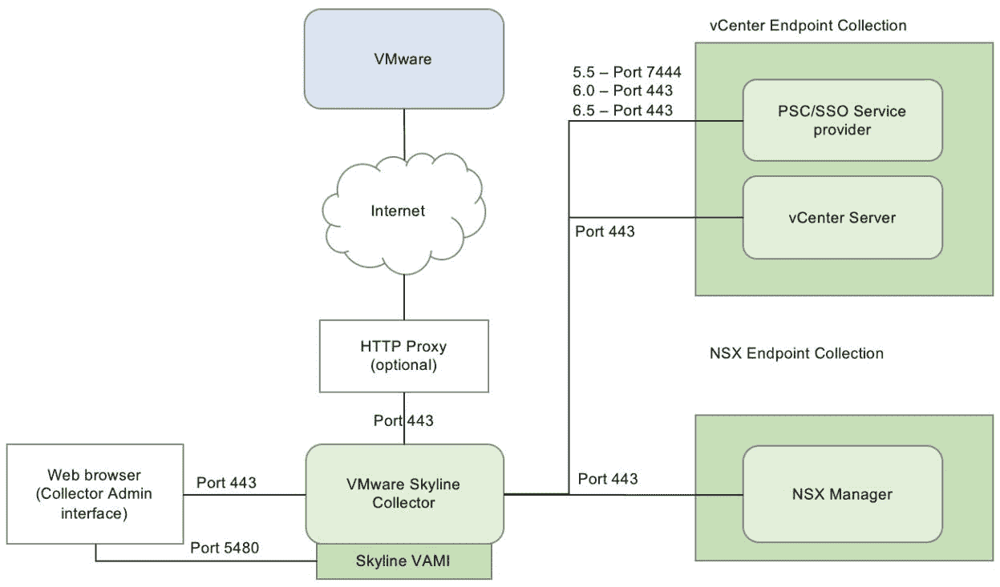
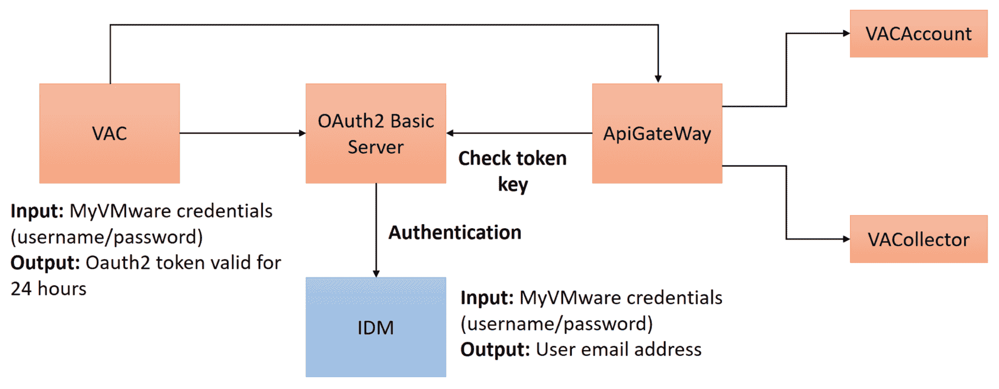
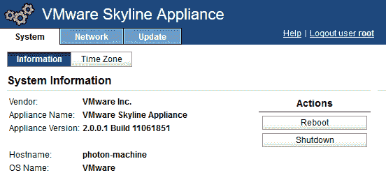
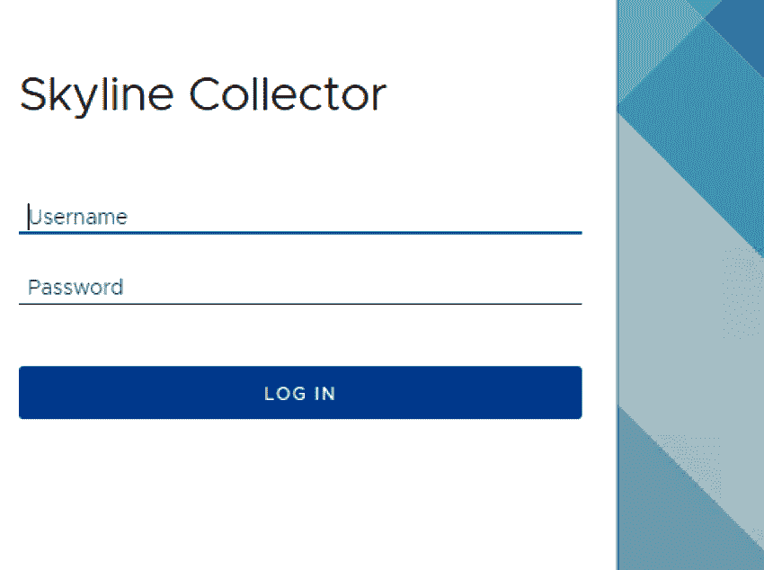
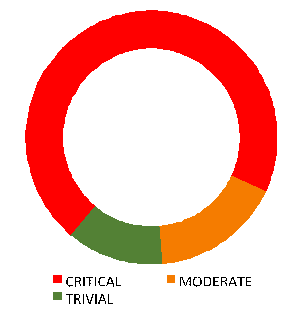
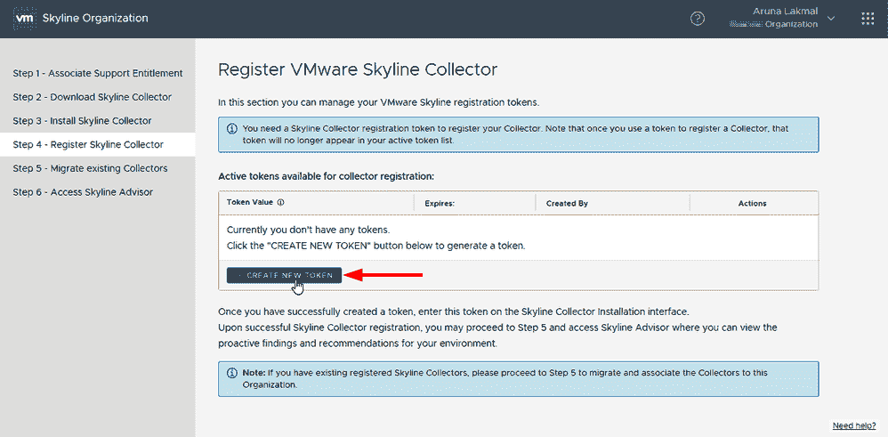
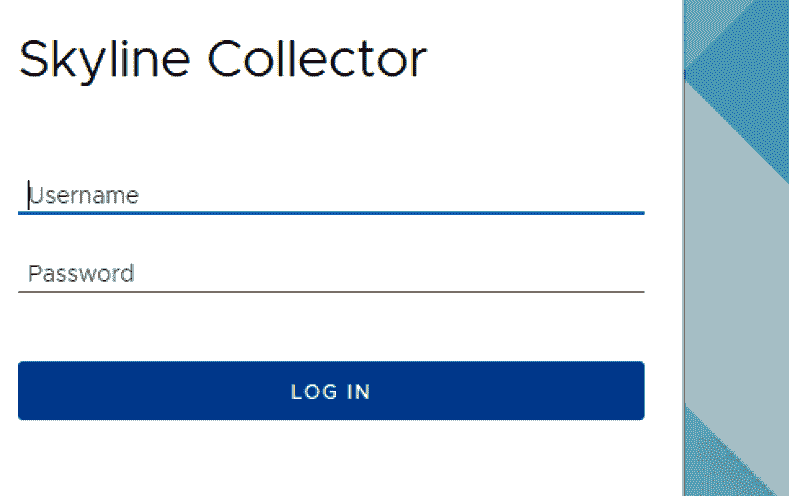

# 基于 ML 的 Skyline 规则引擎

本章将向您展示 VMware Skyline 如何从客户那里收集信息，并使用机器学习技术创建智能规则引擎。这被用于监控异常行为，然后拉响警报以启用主动支持。

您将学习如何创建策略和规则以避免未来事件并最小化停机时间，您还将了解 Skyline 工具的功能和配置。此工具能够自动化监控和管理，以防止未知威胁的攻击。

在本章中，我们将涵盖以下主题：

+   主动支持技术

+   Skyline 收集器概述

+   客户体验改进计划

# 技术要求

您可以从 [`my.vmware.com/web/vmware/details?downloadGroup=SKYLINE10&productId=790&rPId=26633`](https://my.vmware.com/web/vmware/details?downloadGroup=SKYLINE10&productId=790&rPId=26633) 下载 VMware Skyline 收集器 2.0.0.2。

# 主动支持技术 – VMware Skyline

VMware 全球服务构建了一个名为 Skyline 的智能支持引擎，无需任何人工努力或妥协安全策略即可收集与客户特定的 VMware 产品相关的数据。它聚合并分析这些数据，以帮助支持团队快速解决问题并采取措施预防即将出现的问题。

我们可以从部署和使用的角度获得客户环境中 VMware 产品的全面 360 度视图。我们可以通过提供更多信息并允许他们与所有客户端点互动来概述已知和未知的问题。Skyline 对于在 VMware 基础设施上运行的至关重要的应用程序是必要的，该基础设施全年 24/7 可用，并且高度优化以从其资源中获得最大性能。客户希望快速解决问题和建议，并拥有所有支持数据分析以在客户环境中产生问题之前识别问题的数据。Skyline 可以通过其智能支持系统处理所有这些要求，该系统帮助支持工程师了解有关特定客户 VMware 产品部署的信息和数据。

如果我们像客户一样了解他们的环境，那么我们就能提前提出关于未来可能发生的问题的主动、规范和预测性建议。这也有助于支持团队处理他们的反应性支持案例，因为这些案例可以更快地解决，帮助客户更快地回到业务中。VMware Skyline 由三个技术组件（收集器、规则引擎和顾问）组成。全球服务拥有创新的新支持功能。

使用 VMware Skyline 提供的主动支持具有许多好处，包括以下内容：

+   定制的支持体验将加深与客户的联系

+   了解客户使用情况将使应用采用和价值实现通过客户成功计划

+   更快、更高品质的支持解决

+   为特定客户实施提供最佳设计、配置和软件版本

+   通过提供持续的增量价值，提高了可靠性，并具有高级预警系统

+   **支持请求**（**SR**）偏转以在发生之前修复已识别的错误

+   缩短了解决时间；也就是说，数据是主动收集的，并提供了解决方案，以便更快地进行诊断和解决

+   通过提供持续的增量价值，保护了在**支持和订阅服务**（**SnS**）预订中的大量资金

+   增加总交易规模和补偿，并将客户从生产支持升级到高级服务

+   改进工具和技术

+   了解客户环境

# 收集者、查看者和顾问

Skyline 收集器帮助在接近实时的情况下收集有关更改和事件详情，并且与客户环境隔离，因为收集器中不保存任何特定客户数据。VMware Skyline 数据由 VMware 支持团队根据需要访问。

VMware Skyline Advisor 将是一个面向客户的自助式仪表板，作为 SaaS 应用程序提供给客户。这将提供有关已识别警报和建议操作的详细分析，以便客户可以配置智能修复。顾问可以利用并与查看器连接，以充分利用基于策略的分析引擎，该引擎由支持智能库、产品信息和分析内部客户特定产品部署数据的逻辑组成。这用于获取建议和详细报告，可以与客户分享。它与 VMware 验证设计、最佳实践和 **知识库** (**KB**) 文章良好集成，以发送警报、识别故障和问题以及任何偏离推荐设计的情况。然后，它通过支持工程师的支持协助启动修复过程，或者可以通过自助步骤解决故障和问题。Skyline 有一个单独的收集器实例来收集和传输与 VMware 产品相关的信息回 **VMware 分析云** (**VAC**) 基础设施。拥有活跃产品支持的客户可以使用 Skyline 收集器。它可以使用机器学习引擎分析与特定信息（如故障）相关的更改、活动和模式。Skyline 策略引擎支持智能库、产品信息和相关逻辑，以分析与 VMware 产品相关的客户内部数据流。如果客户未遵循 VMware 验证设计实践进行配置或补丁管理，它将发送通知。所有识别的问题都会输入到分析引擎中，该引擎有数百个检测策略，帮助我们为多个客户纠正同一类问题。

VMware Skyline 在客户环境中收集有关 vSphere 和 NSX 的信息**。**它可以分析来自 vSphere 和 NSX 的遥测信息。我们计划在未来快速添加对更多 VMware 技术的支持，vSAN 就是我们的下一个路线图项目。最终，整个产品堆栈都将可在 VMware Skyline 上使用。随着时间的推移，我们的洞察力将不断提高，增加更多预测性建议以减少停机时间和性能问题。随着规则引擎在范围和复杂性上的发展，VMware Skyline 将不断成熟，因此对客户的价值将持续增长。客户还可以添加和删除单个产品部署以进行收集。Skyline 通过 VMware 管理访问计划免费提供给具有 vSphere 和 NSX 境内环境的 premier 支持客户（关键任务、医疗关键和业务关键）。

# 发布策略

VMware 的计划是提供增量收益，并扩大产品和解决方案意识的范围，以推动在开发和发布路线图中引入客户自助服务机会。

这将帮助我们快速增加价值，因为我们将为支持工程师引入 VMware Skyline Viewer，该工具将在与客户的主动和被动支持互动中使用。我们计划将 VMware Skyline Advisor 工作台提供给各个支持团队以及产品工程团队，以便他们能够积极参与新规则和分析的创建，随着我们自动检测已知问题或建议的能力的扩展。VMware Skyline 还将为未来拥有生产支持和 Premier Support Services 的客户提供额外的支持服务能力，以自助解决方案的形式提供。

VMware Skyline 符合全球服务部门的整体愿景，因为 VMware 致力于为客户提供最佳级别的支持，正如我们高客户满意度和**净推荐值**（**NPS**）所体现的那样。随着竞争试图缩小这一差距，我们进行创新。VMware Skyline 是我们那些在被动和主动支持方面使我们在竞争中领先的创新之一。没有其他全栈软件公司提供这种级别的功能。VMware Skyline 专注于转变客户体验，而我们实现这一目标的关键方式是通过建立客户亲密关系。如果我们了解并理解客户在做什么，我们就可以更积极地与他们互动，以便提供帮助和指导。

VMware Skyline 可以在非常大的客户环境中分阶段推出，也可以在初始推出期间进行。最好是从单个 vCenter 收集数据，让客户对我们提供的价值进行反馈，然后逐步增加。在现实世界中，我们可能会遇到一些我们在测试中永远不会遇到的可扩展场景，我们可以通过一个有计划的采用计划来识别这些场景。我们不推荐对初始企业软件部署采取任何激进的策略。收集器会附着到 vCenter 上。它也可以连接到多个 vCenter，但它始终可以根据每个 vCenter 进行分割。非常大的、多 vCenter 的环境也将需要为每个位置设置多个收集器。从后端来看，数据是相互关联的，因此我们知道它们都来自同一个客户。

在任何时间点，客户都可以选择退出**客户体验改进计划**（**CEIP**）。客户可以从操作中注销 Skyline 收集器并从其环境中禁用所有 Skyline 功能。收集的数据将保留 13 个月，用于客户可识别信息，对于其他收集的数据，最多保留四年。产品相关数据将保存并用于不同的流程，同时确保这些数据的安全性和端到端安全性。我们可以根据需要管理数据并去标识化。我们可以在存储和传输过程中加密数据，以及所有类型的物理安全，如防火墙、HIPS、IDS 等。我们还可以为此数据设计数据备份、灾难恢复和其他安全流程，并进行适当的审计。VMware 负责管理收集的数据，以提供更好的技术支持，以及产品增强。

我们必须满足条件才能访问 VMware Skyline 产品使用数据。这包括完成产品使用数据政策的培训，承认你对如何使用这些数据的责任，并提交一个正式请求，以识别我们预期使用的其他详细信息。该流程将继续由我们的经理进行审查，在特殊情况下，由数据受托人进行审查。如果您的请求获得批准，则可以在批准的系统（s）上配置您的访问权限。我们计划将请求流程扩展到企业身份访问管理系统。这将是我们可以与客户分享的面向外部的网站的一部分。

客户可以通过以下简单步骤下载 Skyline 收集器：

1.  点击[`my.vmware.com/web/vmware/details?downloadGroup=SKYLINE10&productId=790&rPId=26633`](https://my.vmware.com/web/vmware/details?downloadGroup=SKYLINE10&productId=790&rPId=26633)链接访问 VMware Skyline 下载网站：

1.  使用您的凭据登录 Skyline 收集器：

1.  一旦您接受了 Skyline 的隐私政策，您就可以开始安装收集器设备。

1.  使用 My VMware 凭据和权限账户信息填写几个简单的配置网页，以注册收集器并学习基本设置。

# Skyline 收集器概述

Skyline 收集器以虚拟设备的形式提供，可以从客户环境中收集关于 vSphere 和 NSX 的关键信息，以便支持团队能够提供更好的支持。

注册后，客户将享有以下好处：

+   通过 CEIP 获得更好的支持。

+   使用这种明确的方法，客户的数据将安全可靠。

+   VMware 的 My VMware 客户门户将验证客户的身份有效性。

+   My VMware 客户账户将与 Skyline 收集器设备集成。

+   客户账户验证后，客户将有权使用 Skyline 服务。

+   通过客户直接连接到 VMware 的技术支持服务，改善了客户支持体验

# Skyline Collector 的要求

安装 Skyline Collector 有一些系统先决条件，包括硬件和软件配置。

软件要求如下：

+   vCenter Server，6.0 或更高版本

+   ESXi，v6.0 或更高版本

+   NSX for vSphere，6.1 或更高版本

我们可以在满足所需最低系统先决条件的任何系统上部署 Skyline Collector。以下是 Skyline Collector 虚拟设备的先决条件：

| **vCPUs 数量** | **内存** | **磁盘空间** |
| --- | --- | --- |
| 2 | 8 GB | 87 GB（如果为精简配置，初始为 1.1 GB） |

# 网络需求

外部网络连接要求如下：

| **机器** | **连接到** | **连接类型** | **协议** | **端口** |
| --- | --- | --- | --- | --- |
| VMware Skyline Collector | `vcsa.vmware.com` | HTTPS | TCP/IP | `443` |
| VMware Skyline Collector | `vapp-updates.vmware.com` | HTTPS | TCP/IP | `443` |

大多数客户希望数据被清理，VMware 为用户提供了一个内部日志清理脚本。它从客户日志中移除 IP 地址、主机名等，取而代之的是添加一个占位符，并向客户提供密钥，以便将 IP 地址和主机名与日志中插入的名称关联起来。此功能需要包含在 Skyline 设备中，以便客户的主机和 IP 数据不会传输。如果客户不是所有数据都需要清理，他们可能希望对不同的数据有一些控制（例如单选按钮或复选框）。以下表格总结了 Skyline 操作所需的所有端口和协议：

| **机器** | **连接到** | **连接类型** | **协议** | **端口** |
| --- | --- | --- | --- | --- |
| VMware Skyline Collector | vCenter Server | HTTPS | TCP/IP | `443` |
| VMware Skyline Collector | **平台服务控制器**（**PSC**）/**单一登录**（**SSO**）服务提供商 5.5 | HTTPS | TCP/IP | `7444` |
| VMware Skyline Collector | PSC/SSO 服务提供商 6.0 / 6.5 | HTTPS | TCP/IP | `443` |
| VMware Skyline Collector | NSX Manager | HTTPS | TCP/IP | `443` |
| Web 浏览器 | Skyline Collector 管理界面 | HTTPS | TCP/IP | `443` |
| Web 浏览器 | Skyline Collector **vCenter 服务器管理接口**（**VAMI**） | HTTPS | TCP/IP | `5480` |

Skyline Collector 可以使用不同的网络连接来获取和传输相关数据。以下图表说明了端口的工作方式：

# Skyline Collector 用户权限

Skyline Collector 的管理账户将验证并登录到 Skyline Collector 管理界面，然后注册应用程序以管理收集端点。管理账户的密码将在部署开始和收集器注册时定义。当用户被通知有挂起的更新时，Skyline Collector 的 root 用户将用于通过 VAMI 接口访问`https://<Skyline_Collector_Appliance_IP_Address>:5480`进行更新。

Skyline Collector 需要具有只读用户访问权限来连接到安装在客户场所的 VMware 产品（带有许可信息），以便它可以收集数据并将其与其相应的部署关联起来。

它需要在所有相关的 vCenter Server 实例中有一个用户账户，并具有以下权限：

+   收集器可以与默认的 vCenter Server 集成，具有内置的只读访问权限

+   需要**全局**|**许可权限**

Skyline Collector 需要具有审计员（或与 API 相同的访问权限）的只读访问权限，以便向 NSX Manager 发送查询。以下图表显示了认证过程的工作原理：

Skyline Collector 以**开放虚拟化设备**（**OVF**）格式提供，可以通过 vCenter 控制台中的 OVF 部署向导进行安装。虚拟设备由预配置的 VM 组成，其中预装了客户操作系统、应用程序和其他相关软件。我们可以在安装后通过包含与设备关联的 IP 地址或主机名，通过网页浏览器访问收集器管理界面。

**集成客户端插件**：客户端插件通过 vSphere Web Client 提供对收集器控制台和其他 vSphere 功能的访问。此插件还通过 vSphere Web Client 使用 Windows 会话身份验证帮助安装其他虚拟设备。

**Skyline Collector 设备**：我们可以开启收集器设备，然后访问管理界面并获取收集器设备的 IP 地址，以便探索收集器控制台：

在为特定客户环境配置之前，Skyline Collector 应该进行注册。

# VMware Skyline Collector 管理界面

在启动 Skyline Collector 设备后，我们可以获取该设备的 IP 地址。这可以通过以下方式完成：

1.  作为管理员，登录到 vSphere Web Client

1.  右键单击收集器虚拟设备并选择电源。然后，点击开启

1.  在虚拟设备启动后，我们可以通过刷新 vSphere Web Client 中的摘要选项卡来查看收集器设备的 IP 地址

1.  通过网页浏览器浏览到`https://<Collector_Appliance_IP_Address>`

**Skyline Collector 管理员界面**：由于收集器证书与环境的主机名/IP 地址不匹配，我们首次连接时会出现浏览器安全警告。首先，我们必须使用默认用户名和密码登录：

我们默认的用户名是`admin`，密码也是`default`。密码应至少包含八个字符，包括一个大写字母、一个特殊字符、一个数字和一个小写字母。

在为管理员账户输入新密码后，请点击“更改”。更改密码后，我们必须再次登录 Skyline Collector 管理员界面；我们将看到“您的密码已更改成功！”的屏幕。

连接始终是单向的，从 Skyline Collector 向外连接到 VAC 或 Photon OS 更新库服务。我们有两种方法将数据返回到 Skyline Collector 设备。这可以通过 Photon OS VAMI 界面进行产品更新/补丁等操作，以及通过清单更新，我们可以发布一个更新的清单，描述已收集的数据、收集间隔等。设备会定期检查清单更新，当有更新可用时，它会下载新的清单以利用其当前配置。收集器必须通过互联网将加密数据上传到 VMware。如果收集器需要 HTTP 代理来访问互联网，请将开关切换到“是”并配置代理管理员所需的设置。点击“测试连接性”以验证网络的连接性，然后点击“继续”。

首次登录时，收集器不会被注册。要配置数据收集，需要注册收集器。首次登录时，注册向导将自动出现。

# 使用 My VMware 账户链接

我们可以在注册 Skyline Collector 并初始化其过程中参与 CEIP。Skyline Collector 数据在 CEIP 的支持和产品改进方面得到了广泛的应用：

然后，选择“同意并继续”。收集器注册需要一个连接到活动 VMware 生产支持或高级服务支持的 My VMware 活动账户。输入您的 My VMware 账户电子邮件、密码和权益账户 ID。准备好后，选择“链接账户”：

一旦收集器成功验证了您的凭据，请点击**继续**。如果客户在 My VMware 账户登录时遇到问题，请访问[`my.vmware.com`](https://my.vmware.com)重置账户凭据。您可以从系统状态页面的概览部分获取 Skyline Collector 和所有相关数据端点的健康报告。我们可以通过收集器部分通过重启、停止或注销来管理收集器服务。它还将显示用于注册过程的 Skyline Collector ID 和 My VMware 用户。Skyline Collector ID 是每个 Skyline Collector 实例的特定标识符，用于识别数据传输回 VMware：

我们还可以自定义 Skyline Collector 的名称，以便我们可以识别与 Skyline Collector 实例关联的权益编号和支持类型（生产/高级服务）；这样，我们可以连接到 VMware 全球支持服务团队。此权益账户将 Skyline Collector 数据连接到其相应的支持请求。这些权益账户可以通过[`my.vmware.com`](https://my.vmware.com)访问和驱动，Skyline Collector 日志活动可以通过管理界面实时显示。

# 管理端点

Skyline Collector 与 vCenter Server 集成，每个 vCenter 实例将配置三个端点。这些端点在系统状态选项卡中显示，包括所有端点的健康状态：

以下数据是从 vCenter 端点收集的：

+   VC_CHANGES 端点获取 vCenter 拓扑和配置数据

+   VC_EVENTS 端点获取 vCenter 事件相关数据

+   VC_HOSTS 端点从 vCenter Server 获取 ESXi 事件数据

Skyline Collector 与 NSX Manager 集成，每个 NSX Manager 都配置了三个端点：

以下是对每个端点的描述：

+   NSX 端点获取 NSX 产品和配置相关数据

+   NSX_TELEMETRY 端点获取 NSX 操作参数，如 CPU、内存和磁盘

+   NSX_EVENTS 端点获取 NSX 事件相关数据

所有端点将显示与 Skyline Collector 集成的相关 VMware 产品实例以及关联的账户，该账户读取由特定收集端点检索的所有最近和过去的数据。所有活动收集端点将以绿色显示，而出现故障的被动端点将以红色显示。

# 配置 VMware Skyline Collector 管理界面

所有管理操作都可以通过点击 VMware Skyline Collector 管理界面上方的配置来完成。

我们可以添加/删除用于数据收集的 vCenter Server，也可以添加/删除用于数据收集的 NSX Manager。我们可以从同一控制台配置自动升级并设置收集器的名称。此控制台还有助于配置 Active Directory 身份验证，并且 NSX for vSphere 必须设置具有这些权限的账户。

# 自动升级

VMware Skyline 收集器具有自动升级虚拟设备的能力。自动升级将按照计划检查和安装更新。正如我们在 VMware Skyline 收集器注册阶段所提到的，我们可以获取电子邮件通知。每次自动升级后，选择设置升级。

您可以转到配置以启用和保存我们已配置的自动升级设置：

您必须启用“启用收集器自动升级”选项或遵循以下步骤，使用 VAMI 将 Skyline 收集器设备更新到最新版本：

1.  打开网页浏览器并浏览到`https://Skyline_Collector_IP_address:5480`：

1.  使用 root 用户名和密码登录：

1.  选择 更新

1.  选择**检查更新**

1.  如果有新的更新可用，选择**安装更新**

# CEIP

参与 VMware CEIP 是必要的，并且是 VMware Skyline 的一部分。作为初始 Skyline 收集器注册过程的一部分，必须加入此程序。Skyline 收集器会将数据发送回 VMware，以支持与特定产品实例连接的相关产品端点，以便通过 CEIP 快速支持，这包括在初始配置期间或在安装后的配置页面中。客户可以通过注销流程选择退出此程序。

# 收集的信息类型

VMware 产品/服务的技术数据包括以下内容：

+   **配置数据**：从设计和配置的角度来看，每个客户的基础设施都是独特的，即使使用相同的 VMware 产品和服务的。它们有自己的用例，根据其业务目标，数据包含有关产品的版本/版本、部署相关信息、设置以及连接到这些产品和服务的所有设备的日志数据。

+   **功能相关数据**：客户以各种方式部署具有其功能的产品，以便客户可以针对其各自的客户领域实现特定的业务案例。

+   **性能数据**：这包括有关产品和服务的所有相关信息，以及所有相关的支持报告，例如性能和扩展参数、用户界面的响应时间以及 API 调用相关信息。

+   **产品日志数据**：它们有与从安装阶段到生产阶段的产品产生的相关产品日志。这些日志包含有关系统活动的详细信息。这还将有助于实时生产数据的实际状态，不包括最终客户应用程序数据。

# 产品使用数据利用

与产品相关的数据在得到适当客户通知的情况下，被安全地管理和用于某些内部场景。这也得到了信息治理执行委员会的同意和接受。与产品相关的数据可用于不同的目的，包括以下内容：

+   **产品部署报告**：我们可以将客户的实际产品采用情况与购买的产品许可证相关联。账户经理只能评估此报告，以便他们可以与客户进行富有成效的讨论，并通过增强其设计和设置，以最佳方式使用购买的产品。

+   **SDDC 分析**：这用于分析 SDDC 产品在客户基础中的部署。这可以用来识别符合特定 SDDC 部署标准的客户，这些信息可以提供给 VMware 高级管理层。

+   **针对新 SDDC 产品发布的客户倡导调查**：这用于识别已部署新 SDDC 产品发布的客户。这些客户可以通过高级管理层联系，以请求他们对特定客户调查的回答。

+   **客户支持**：技术支持工程师可能使用 VMware 许可证密钥和派生的客户 ID 值来联系客户，以便帮助解决特定的支持请求或根据产品使用数据的分析，主动提供客户可能遇到的支持问题的建议。

+   **客户档案和高级分析**：这用于分析客户与 VMware 的互动，以便创建客户档案和高级分析模型。这些必须仅提供给 VMware 管理层，并需要产品使用数据受托人的批准。

我们可以在产品文档中找到关于 VMware Skyline 部署架构的详细信息，特别是在包含内部防火墙的客户环境中，这些防火墙将客户网络的不同部分隔离开来，每个部分都包括 VMware 产品。这涵盖了客户网络内部和通往互联网/VAC 目的地的通信的方向连接和网络端口要求。我们不会记录收集器的北向和南向 API，这些 API 用于与它们收集的产品以及 VMware Cloud 进行通信。我们用于将数据传输回 VAC 的 API 可以在 VAC confluence 页面上找到。

VMware Skyline 旨在实现数据单向返回到 VMware，并确保架构已开发以允许向收集器返回闭环反馈以及返回到产品。连接始终是从 Skyline 收集器向外到 VAC 或 Photon OS 更新库服务单向的。我们有两种方法向 Skyline 收集器设备提供返回数据：

+   通过 Photon OS VAMI 接口，用于产品更新/补丁等。

+   通过显式更新，我们可以发布一个更新的清单，例如描述收集了哪些数据、以什么间隔等。

设备定期检查清单更新，当有更新可用时，它会拉取新的清单以利用其当前配置。系统将尝试识别主机或虚拟机级别是否启用了**分布式防火墙**（**DFW**）规则，以便更好地在出现连接问题时进行故障排除。Skyline 收集器使用安全的协议通过 HTTPS 或 SSH 将收集到的产品使用数据传输回 VMware。加密算法用于将 Skyline 收集器数据传输回 VMware。

Skyline 会随着时间的推移自动从产品 API 和客户的库存中提取遥测信息，以便我们可以识别变化、模式和趋势。这将帮助我们缩短解决问题的时间，并在问题变成服务可用性、性能或补丁/安全问题时提前发现。Skyline 收集的数据存储在美国的 VAC 中，这些 VAC 仅由 VMware 运营。Skyline 使用协议和加密的快照。通过 TLS 1.2 进行上游加密，使用加密套件`TLS_RSA_WITH_AES_128_CBC_SHA256`。根据政策指南，收集的数据在 VAC 和**操作摘要报告**（**OSRs**）中保留 13 个月。

# 摘要

VMware Skyline 能够显著改变我们对客户环境的可见性的突破性功能具有许多好处。如果我们了解并理解我们的客户在做什么，我们可以更积极地与他们互动，以提供帮助和指导。我们可以开始关注支持他们的核心问题，这样我们就不仅依赖于客户描述的症状。这推动了我们在建立和加强这些关系时的信心。在 VMware Skyline 的核心是关注改变客户体验，而我们能够做到这一点的关键方式是通过建立客户亲密感。我们可以开始关注这些可靠数据下的客户核心问题，而不是仅仅依赖于症状或客户的输入。

下一章，第九章，*使用 vRealize Code Stream 的 DevOps*，将为您提供一套详细的架构设计，该设计使得应用和平台能够在 VMware vRealize Automation 私有云平台上部署，并使用**持续集成**（**CI**）和**持续****交付**（**CD**）流程，以及**VMware vRealize Code Stream**（**vRCS**）和其他行业标准产品。架构设计建议将基于 VMware vRA/vRO/vRCS 产品参考架构和行业最佳实践，以及客户特定的需求和业务目标。
