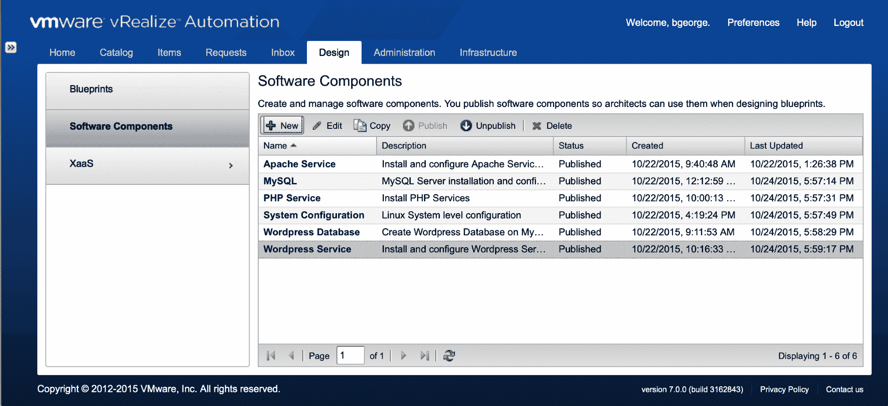
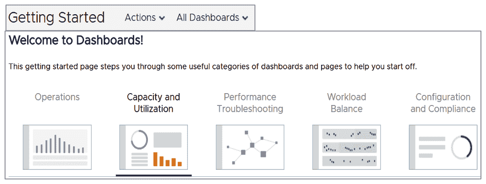
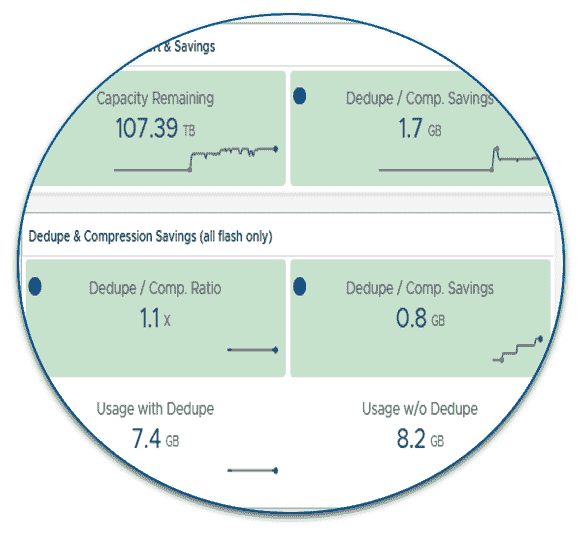
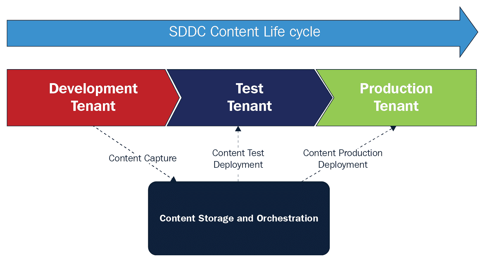
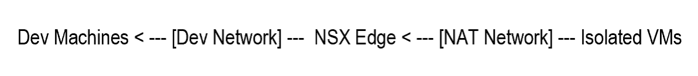
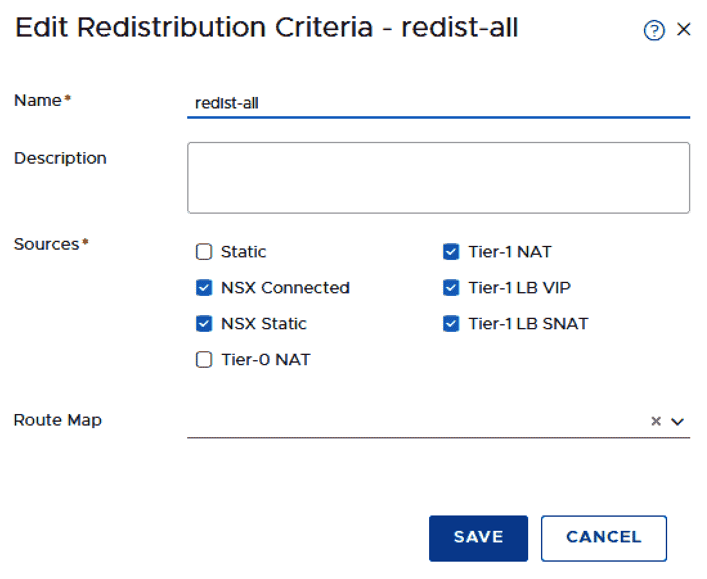
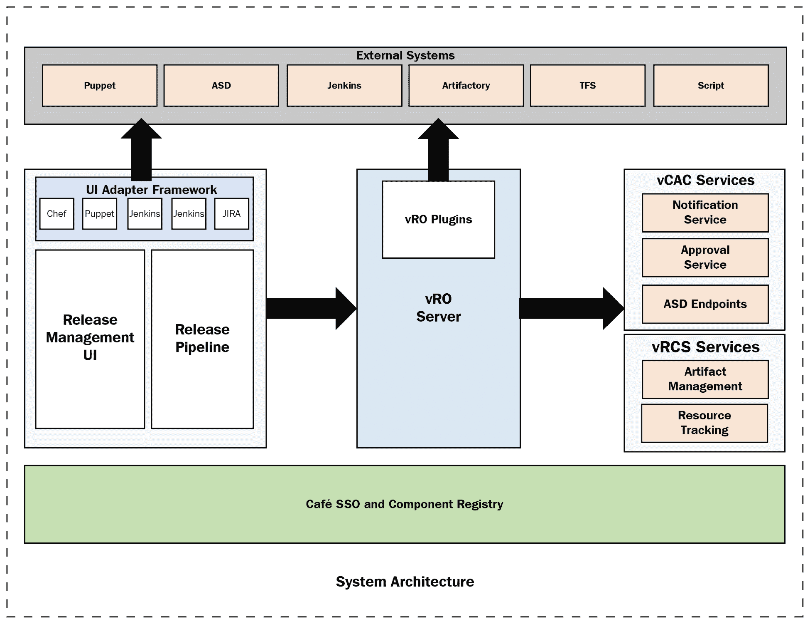
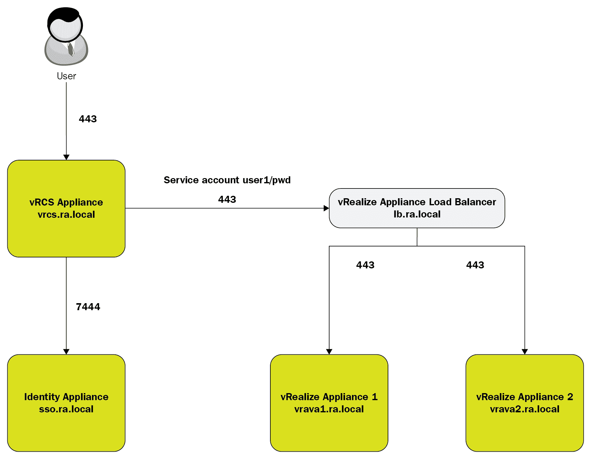

# 使用 vRealize Code Stream 进行 DevOps

DevOps 运营模型及其支持 CI/CD 工具集的实施方法正在改变 IT 资源的角色和责任，以及传统的设计、交付和运营流程。本章将使您能够进行必要的流程变更，以采用 DevOps。我们将探讨最高优先级的流程，以转换并应用技术，比较和对比传统运营模型、流程和团队结构与 DevOps 所需的战略运营模型之间的关键差异。我们还将介绍**VMware vRealize Code Stream**（**vRCS**）及其在 DevOps 发布流程和持续应用交付中的编排。

您将了解私有云的 DevOps 云运营模型，该模型通过利用 VMware 云自动化服务以及如 Puppet 之类的配置管理工具，使开发者能够无缝地部署、配置和管理生产就绪的应用程序，从而加速 DevOps 操作。您还将了解与**VMware Kubernetes Engine**（**VKE**）的 CI/CD。

在本章中，我们将涵盖以下主题：

+   应用开发生命周期

+   使用 vRealize 进行自动化

+   vRCS

# 技术要求

您可以从[`my.vmware.com/web/vmware/info/slug/infrastructure_operations_management/vmware_vrealize_code_stream/2_x`](https://my.vmware.com/web/vmware/info/slug/infrastructure_operations_management/vmware_vrealize_code_stream/2_x)下载 VMware vRealize Code Stream，以及从[`www.vmware.com/download/eula/wavefront-terms-of-service.html`](https://www.vmware.com/download/eula/wavefront-terms-of-service.html)下载 VMware Wavefront。

# 应用开发生命周期

为了理解应用转型，了解应用开发生命周期中发生的变化是很重要的。当变化的速度较慢时，应用开发总是有一个预先确定的计划，并有一个有限的目标。应用的设计是在事先经过深思熟虑并达成一致，包括捕捉所有用户的需求。然后，一系列步骤随之而来，包括制定计划、测试应用的功能、测试应用是否能够高效且正确地运行到适当的规模（非功能性测试），以及用户验收测试，以确保应用按照预期的方式构建，最终以最终格式上线。

一些现代应用的变化速度很快，加上它们在本质上可能非常实验性，这意味着瀑布式方法（在前期完全理解最终应用设计）根本不起作用。相反，应用开发、应用设计、用户甚至客户测试都在快速迭代中进行，这意味着应用是在持续的反馈循环中发展的。开发团队通常被分配到单个组件，因此没有每个人都必须遵守的受控状态的概念。开发是在同时进行的流中进行的，频繁的代码检查以确认整体功能。

我们可以将这些结果应用于 CD、DevOps 和敏捷等术语。虽然这些原则可以应用于传统应用架构，但它们最适合云基础的应用工具、平台和架构。需要注意的是，这个领域有几种模型，尽管广泛实践，但仍在不断发展。

一个非常重要的事情是要意识到敏捷和 DevOps 不是瀑布方法的替代品。客户将使用这两个学科，它们取决于应用开发需求。将敏捷开发原则应用于关键任务的传统应用可能会产生严重的后果，反之亦然，你可以使用尽可能多的云技术，但如果应用开发采用本质上是探索性的瀑布方法，将从根本上削弱有效交付的能力。

# CD 管道

DevOps 通过以下程序帮助 CD 管道流程：

+   **计划**：我们首先需要规划和定义软件发布周期；用户定义的使用案例；敏捷计划行动；以及一个适当的待办事项和问题的跟进计划。

+   **代码**：这是通过一系列相关工具和流程来定义的，使我们能够编写脚本，并对其进行评估和测试。它还有助于遵循定义的安全和合规性指标。

+   **提交**：这可以帮助我们定义与代码评估、合并和执行相关的程序及其相关工具，并与其主源代码仓库一起执行。这个堆栈还帮助维护源控制，进行日常测试，按需执行，以及主动扫描代码。

# 持续集成（CI）管道

持续集成（CI）管道提供流程、实践和工具，以帮助自动化源代码仓库中每个代码提交的构建和测试。这包括自动化的安全和合规性测试以及日志记录。

自动化单元、功能、安全和合规性测试的过程、实践和工具，记录结果，并获得批准将工件提升到流程的下一阶段。

艺术品存储库由服务和活动组成，这些服务和活动对于维护与相关可交付艺术品相关的版本、提升、治理和政策控制等所需达到的预期最终状态是必要的。一般而言，这些艺术品是从源代码转换为二进制包的，尽管可能存在其他转换。

我们持续开发和更新软件，以便可以通过 CD 按需将软件发布到生产环境中。

配置由服务和活动组成，这些服务和活动对于实现自动化幂等和便捷的应用程序部署到静态和按需混合云基础设施的预期最终状态是必要的。设计和实现将与预定义的 SDLC 流程保持一致，包括适当的艺术品源代码管理（例如，Puppet 模块、Chef 食谱、部署蓝图等）。

控制栈由服务和活动组成，这些服务和活动对于管理推荐用于操作由该基础设施部署的应用程序的工具链，以实现所需的最终状态是必要的。这还将包括 SDLC 流程、工具、集成和操作，这些操作对于维护特定客户定义的服务级别协议是必需的。

反馈栈允许您在需要时获取自动反馈，例如警报、审计报告、测试报告和部署流程报告。

# 规划

为了实现持续成功的商业成果，VMware 与客户合作评估、推荐和记录必要的变更，以实现最佳交付流程。这项协作努力基于以下服务基础领域的行业最佳实践：

+   **软件开发生命周期** (**SDLC**)

+   **源代码管理** (**SCM**)

+   **持续集成** (**CI**)

+   **艺术品存储库** (**AR**)

+   **持续交付** (**CD**)

+   **混合云配置** (**HCP**)

+   **配置管理** (**CM**)

+   **持续运营管理** (**COM**)

# SDLC

SDLC 基础由服务和活动组成，这些服务和活动对于实现人员角色、工具链和流程的最佳对齐，以实现客户期望的软件交付生命周期管理的最终状态是必要的。

# SCM

SCM 基础由服务和活动组成，这些服务和活动对于在管理和版本控制软件源艺术品方面实现所需的最终状态是必要的。源艺术品包括，但不仅限于，应用程序源代码、文档、配置信息和流程控制流配置。

# CI

持续集成（CI）包括实现自动化构建、测试和可交付（即二进制）工件创建所需的服务和活动。CI 流程通过使用 Jenkins、Gerrit Triggers 和 vRA 等工具，在开发者使用这些工具构建软件的同时，提供快速反馈，以辅助应用程序的构建和验证测试。

# AR

VMware 和客户合作定义和细化将源代码转换为客户可交付工件的过程和活动。这包括评估和重新调整活动以及相关的关键责任角色、职责和所需技能集，关键交互和交接，这些都与支持服务定义过程有关，包括商定的用例和业务成果。

AR 基础包括实现维护版本、提升、治理和政策控制相关可交付工件所需的服务和活动。一般而言，这些工件是从源代码转换为二进制包的，尽管可能存在其他转换。

# 发布管道自动化（CD）

CD 包括实现自动化治理和发布政策所需的服务和活动，涉及可交付工件。这包括提供必要的工具和集成，以编排手动门控的组织决策处理和自动化交付流程。

# CM

CM 基础包括实现自动化、幂等和便捷地将应用程序部署到静态和按需混合云基础设施所需的服务和活动。设计和实现将与商定的 SDLC 流程保持一致，包括适当的源工件管理（例如，Puppet 模块、Chef 食谱、部署蓝图等）。

# HC

HC 基础包括实现自动化资源分配以实现应用程序部署到混合云所需的服务和活动。在此背景下，混合云可能包括以下内容：

+   VMware vCloud Air、Linux 容器、AWS 和其他异构云平台

+   原地虚拟化/云和物理基础设施

此基础服务涉及提供自动化基础设施服务（即计算、网络和存储）配置所需的所有可交付工件部署的工具和集成。设计和实现将与商定的 SDLC 流程保持一致，包括适当的源工件管理（例如，配置蓝图、工作流脚本等）。

# COM

COM 基础设施包括实现服务基础设施操作所需工具链以及该基础设施部署的应用程序所需的服务和活动，以实现预期的最终状态。这包括整合必要的流程、工具、集成和活动，以维护客户所承担或合理期望的任何**服务级别协议**（**SLA**）。

# 反馈

当发生错误时，需要对规划堆栈进行反馈。这包括错误报告和软件功能缺陷，包括操作系统及其底层基础设施所需的任何更改，所有这些都应该被跟踪以供编码堆栈处理。然后，周期继续。然后，这种反馈进入规划堆栈，我们再次开始迭代。我们始终希望确保所有堆栈都能良好地协同工作，并为我们提供预期的结果。我们的各种流程可以持续更新和改进，以跟上工具链、堆栈处理的代码类型以及结果应用程序托管的基础设施的变化和更新。

# 请求满足

vRealize Automation 通过统一的 IT 服务目录帮助用户请求和管理各种 IT 服务，该目录跨越混合云。

以下是为软件部署的目录截图：

它可以提供程序性访问，以支持基于 DevOps 模型的软件按需交付。

# 变更管理

vRO 具有内部版本控制系统，可以自动跟踪更改。它具有 API 接口，可以与 Jenkins 等第三方工具集成，并且还有一个审计日志，帮助用户审查更改和访问。vRA 可以通过集成 Active Directory 为审批流程提供自动化，还可以配置为备用审批人，以确保满足变更管理和业务需求。

# 发布管理

应用程序的发布流程已经发生了根本性的变化，这要求新的工具能够跟上其步伐。第一个变化是容器和微服务的兴起。它们使代码推送更快，但这是以增加复杂性为代价的。与您虚拟化环境中的 100 个指标相比，现在您需要以高速跟踪数千个指标。旧式工具无法跟上这些规模和变化，并且会失败。CD 和 DevOps 正在被大型企业采用，因此工程团队现在每天多次将代码推送到生产环境中，从而推动了持续监控的需求。DevOps 已成为主流，尽管操作团队使用的工具仍然碎片化，从而减缓了故障排除服务的速度。

# 合规管理

客户期望数据中心符合规范，因为这是其 IT 的延伸。公共部门、金融和医疗保健等高度监管的行业在未获得合规认证的情况下不能使用该基础设施。运行混合云或公共云基础设施的客户依赖合规认证而非独立审计来确保适当的安全控制措施到位。一系列高调的安全漏洞、法庭案件和全球立法变化提高了人们对在云中运行的复杂性和风险的意识。打开浏览器，访问[`marketplace.vmware.com`](https://marketplace.vmware.com.).

**VMware Cloud**（**VMC**）在 AWS 上正在实施合规认证和框架，首先针对**云安全联盟**（**CSA**）和**通用数据保护条例**（**GDPR**），然后是**国际标准化组织**（**ISO**）、**安全运营中心**（**SOC**）、**健康保险可携带性和问责法案**（**HIPPA**）、**支付卡行业**（**PCI**）、**联邦风险授权和管理工作计划**（**FedRAMP**）和**刑事司法信息服务**（**CJIS**）。现有的安全认证适用于云计算，应予以强烈考虑。云服务将应用强制性的政策、安全、战略和合规原则，即使是最低要求的使用案例也必须遵循。

# 事件管理

事件本质上是指任何如果未得到妥善处理，可能导致客户升级的问题。我们可以通过实施客户事件管理流程来避免许多升级。我们在任何地理区域都没有定义客户升级流程。我们的客户关系管理方法必须演变，强调预防升级的重要性。作为回应，我们可以计划识别事件、跟踪它们并解决它们以避免升级。在此过程中，管理层监督和指导应有助于管理者在这些问题成为升级之前解决它们。沟通是主要焦点。通信协议必须定义谁、什么和何时。对客户的响应必须在获得客户满意度的成本和投资成本之间取得平衡。我们可以在升级发生之前更好地管理客户期望和问题。此流程的目的是突出那些可能早期升级的问题，以便管理层和执行层能够及时采取行动，要么防止升级发生，要么在升级发生时减轻其严重性。DevOps 团队现在作为二级支持，而在此之前，他们作为三级支持介入。

# 事件管理

DevOps 团队必须根据客户的要求，使用 vRealize 工具监控和管理所有应用程序，包括计算、存储、网络、虚拟机 (VMs)、容器等，并获得与应用程序相关事件的临界警报。

# 容量管理

自定义配置文件允许您通过根据您创建的规范自动进行容量计算来扩展容量规划的功能。选择一个已承诺的项目将改变我们的容量数字，因为它假定资源已被承诺。如果我们不希望这些数字改变，那么我们可以返回并从“容量和利用率仪表板”中选择一个计划。维护模式允许我们防止计划中的停机时间影响容量规划。

解决方案必须提供主动确定虚拟环境容量问题和风险的能力。它必须提供容量趋势、需求预测以及未来项目的假设影响分析：

将为测试和开发团队创建一个自定义仪表板。目的是在 vSphere 基础设施中提供对测试和开发虚拟机的特定视图，重点关注工作负载、剩余容量和可回收容量。以下组件将构成测试和开发仪表板：

+   开发虚拟机概述，显示服务器和工作站虚拟机的健康、风险和效率

+   虚拟机工作负载热图，以颜色编码显示所选类型的虚拟机

+   过去一周中磁盘空间容量剩余百分比最低的虚拟机：

+   空闲虚拟机和利用率最低的虚拟机，如果利用率指数变为 1，则标记为空闲

+   可回收容量显示可以回收的资源百分比

+   关闭电源的虚拟机和标记为已开启电源的虚拟机

# Wavefront 仪表板

Wavefront 是一个以指标驱动的监控和分析平台。运行云原生应用的企业的 DevOps 和开发团队，如 Box、Lyft、Intuit 和 Workday，使用 Wavefront 来监控达到惊人规模的云应用性能。Wavefront 平台收集和分析在 VMware Cloud on AWS、AWS 容器、微服务、云基础设施以及甚至业务数据上运行的分布式应用的指标。一旦指标数据进入 Wavefront 时间序列数据库，Wavefront 客户就可以应用强大的灵活分析，形式为 Wavefront 查询语言。开发团队使用它以前所未有的规模监控他们的云服务和分布式应用性能。他们可以更快地解决问题，并使用即时访问和统一可见性来主动警报和检测异常的领先指标，统一可见性通过使所有云服务、基础设施和工具具有相同的可见性来加速代码发布。开发团队可以即时看到所有云服务的可见性。Wavefront 覆盖数百名工程师，实现自助服务方法，并赋予团队创新的能力，因为 Wavefront 在数字环境中提供可见性（数字服务是业务）。业务决策与应用代码交付同步，这有助于每个人在统一可见性的帮助下更快地移动。

Wavefront 提供多种数据摄取方式。我们可以直接从 AWS（APIs、CloudWatch 和 CloudTrail）检索数据，并可以从日志中创建指标。

Wavefront 与 DevOps 和开发团队的关键区别如下：

+   Wavefront 允许您应用高级指标和查询驱动的分析。有超过 100 种数学变换可供您与指标数据一起使用。我们可以通过分析更快地解决问题。作为 SaaS 分析平台，Wavefront 提供大规模和高可用性。

+   它提供可定制的仪表板，帮助 DevOps 团队在生产中拥有代码的所有权。仪表板可以一键共享和导出。

+   智能警报和主动监控有助于快速检测领先指标或迅速聚焦于异常情况，我们可以通过它们期望的形状或时间，或通过我们定义的任何条件来隔离问题。

一旦 Wavefront 进入一个组织，其采用范围将扩展到数百名开发者，实现自助服务方法，并赋予他们以协作方式创新的能力。与代码发布同步的业务决策有助于 SaaS 业务加速发展。由于 Wavefront 通常在领先的 SaaS 企业中采用，并且由于他们的云服务是他们的生命线，这有助于业务领导者做出基于分析的商务决策。这些决策与云服务代码交付同步，帮助每个人更快地移动。

Wavefront 集成允许您从任何数据源收集、分析和利用数据，并将重要事项分类。Wavefront 集成通过完整的 RESTful API 和用户界面加速这一过程。来自单个工具的数据可以与其他层级相关联。Wavefront 在这些功能上具有非常高的独特性。跨层级的强大关联帮助我们赢得点工具和指标平台的胜利。Wavefront 平台提供 RESTful API 以实现可扩展性。Wavefront API 可以与开发人员或 DevOps 工具选择的任何工具集成，并使集成变得简单。例如，Lyft 希望保留他们的 Grafana 仪表板，并使用 Wavefront 作为最可扩展的后端时间序列数据库。

# 通过监控人们的工作方式来获得洞察

我们必须监控人们的工作方式，以便更好地了解业务和运营是否顺利进行。收集指标和监控人员总是很困难，而且我们不能强迫人们自行生成指标。因此，通过像 Slack 这样的协作解决方案以及 Wavefront 这样的 SaaS 指标监控解决方案，跟踪和监控人们的兴趣和活动变得更容易，并从中获得洞察。Wavefront 允许您应用高级指标和基于查询的分析。有超过 100 种数学变换可用于处理指标数据。我们可以使用 Wavefront 更快地解决问题，它是一个具有巨大规模和高可用性的 SaaS 分析平台。它提供可定制的仪表板，有助于 DevOps 团队对生产中的代码负责。他们的仪表板具有一键智能警报和主动监控功能，我们可以通过其期望的形状或时间，或任何已定义的条件来隔离问题。

# 使用 vRealize 进行自动化

vRA 可以设计成分布式和高度可用的架构，以提供多角色服务。通过将其与具有高可用性模式的 VMware Identity Manager 集成，可以在 vRA 安装向导中配置这种高度可用的架构，以实现**单点登录**（**SSO**）。它将与嵌入的 vRA 设备 PostgreSQL 内部数据库集群，因为外部 PostgreSQL 选项不再可用。它还具有集群嵌入的 vRO 服务和工作流及扩展性的高可用性。它通过访问 Microsoft Active Directory 服务器来执行用户的身份验证和 Active Directory 组成员枚举。这提供了一个规定的参考架构设计，允许 SDDC 内容生命周期解决方案。该解决方案解决了以下三个主要目标：

+   在不同环境之间自动传输 vRO 和 vRA 内容

+   vRO/vRA 内容存储和版本控制，包括回滚

+   通过自动化减少测试 vRO/vRA 内容合规性所需的时间和精力

这已被设计为允许经过身份验证的用户在 vRA 环境之间同步内容。项目中定义的服务如下：

+   内容包的创建

+   在测试/验证环境中测试包

+   将包部署到部署的目标环境中

+   端点管理（添加/删除）

以下图表显示了**SDDC 内容**的**生命周期**：

以下是一些组件：

+   **生产租户**是生产 vRA 租户端点。vRA 和 vRO 内容部署到这个端点，以便最终用户可以消费。

+   **vRO** 通过工作流提供捕获、测试和发布内容的编排功能。

+   **工作流**组织成一个 vRCS 管道，代表内容生命周期，允许内容通过开发、测试并进入生产。

+   **Xenon** 提供内容存储功能。SDDC 内容在捕获后存储在存储库中，并在其生命周期中进行版本控制。

+   **配置**用于托管解决方案服务的虚拟机基于建议部署支持多达 100 个管道和多达 30 个同时管道执行的架构。

# 部署基础设施即代码

我们需要配置 vRA 和 NSX，这将允许从开发环境中使用隔离的虚拟机网络。

所需解决方案的网络布局如下：

NSX Edge 将提供**源网络地址转换**（**SNAT**）路由，以便隔离的虚拟机可以访问此布局中的外部开发网络资源。它还将提供**目标 NAT**（**DNAT**）端口转发，以便开发机器能够通过在此布局中指向 NSX Edge 来访问目标隔离虚拟机上的特定服务。此设计还将利用 vSphere 链接克隆技术来最小化存储需求。vRA 配置将采用以下蓝图结构：

+   **基础 Windows 映像**：这将提供一张空白 Windows 映像，通过 vRA 可以访问。

+   **基础 Linux 映像**：这将提供一张空白 Linux 映像，通过 vRA 可以访问。

+   **Windows 链接克隆组件**：这将是基于从基础 Windows 映像和特定快照实例化的虚拟机之上的链接克隆蓝图。这代表要提供的实际隔离虚拟机。

+   **Linux 链接克隆组件**：这将是基于从基础 Linux 映像和特定快照实例化的虚拟机之上的链接克隆蓝图。这代表要提供的实际隔离虚拟机。

+   **多机蓝图**：这将是一次性提供的组件蓝图集合：

为了正确提供机器，应包括以下组件：

+   **外部网络配置文件**：这是从外部开发网络中子网的定义，包括路由和 DNS 解析的详细信息：

+   **集群预留**：需要一个专门的预留来限制资源使用仅限于单个数据存储（以便链接克隆工作），以及将网络端口组映射到外部网络配置文件。

+   **NAT 网络配置文件**：这是隔离虚拟机将在 NSX Edge 后面使用的子网的定义。这是一个将稍后复制到多机蓝图组件分配的模板：

+   **预留策略**：这将是一个专门的预留策略，确保所有蓝图都将仅针对创建的指定集群预留。

+   **机器前缀**：这仅用于区分由多机蓝图配置的机器。

# vRealize Code Stream

vRealize Application Services 旨在建模应用程序并自动化其配置。vRCS 旨在建模应用程序发布过程。这两者是互补的：Code Stream 依赖于与**虚拟现实即服务**（**vRAAS**）、脚本、Puppet 等的集成来部署代码。Code Stream 允许我们将整个发布过程和构建在不同阶段和/或环境（功能测试、负载测试、系统集成测试、预发布和最终生产）中的推广过程进行编码或建模。这包括不仅通过脚本或其他工具触发应用程序部署，而且在决定将构建推广到下一阶段之前触发测试并查看测试结果。

它还支持在阶段中创建手动任务，用于处理目前尚未自动化的操作。这实际上是一个流程编排工具，而不是应用部署或配置解决方案。Code Stream 允许我们触发单个工件（`.jar`、`.war`、配置文件等）的部署，而与 vRAAS 不同，后者迫使我们重新部署整个堆栈，包括底层机器。一个 Code Stream 设备可以处理大约 100 个并发管道执行。Puppet、Chef 和其他配置管理工具不是 Code Stream 的直接竞争对手。这些工具通常用于配置和部署软件，但 Code Stream 完全是关于建模发布过程。Code Stream 的核心价值实际上是将配置管理、基础设施配置以及持续集成和测试与审批系统结合起来，以自动化整个发布过程。

这有几个技术优势：

+   Code Stream 可以自动化和加速任何类型软件的生命周期。这包括应用程序（传统和云原生）、以及基础设施和 IT 内容（蓝图、工作流、脚本、模板等）。

+   代码流不指定特定的发布模型或工具集。它可以模拟刚开始的公司发布过程，并将大部分手动任务转换为 100%自动化的发布模型。因此，它适应组织的成熟度水平，并允许他们逐步向更自动化的模型过渡。

+   代码流允许团队将代码提供和部署到私有云以及公共云。代码流可以利用 vRA 的集成蓝图或与其他提供解决方案（如 Cloud Foundry）一起工作。

+   VMware 从基础 SDDC 到管理/提供层 vRA，再到代码流提供的发布自动化功能，提供最佳的全栈和完全集成解决方案。因此，虽然所有产品都可以独立使用（无供应商锁定），但当它们一起使用时，客户将拥有一个无与伦比的平台，帮助他们变得更加敏捷。

我们可以在没有 vRA 的情况下安装代码流，因为将两个产品部署在一起以获得自动化提供和发布自动化完全集成解决方案的好处是肯定存在的。代码流支持两种部署模式：

+   独立模式，在虚拟设备上仅启用代码流功能。管理员可以选择配置代码流，通过外部 vRA 设备提供机器。

+   统一模式，在同一个设备上同时启用代码流和 vRA 功能。vRA 还需要一个单独的 Windows 服务器来提供 IaaS 功能。此配置不是生产支持的配置。

Jenkins 是一个构建自动化工具，它促进了持续集成（CI），这是一种开发实践，要求开发者每天将代码集成到共享源代码库（如 Git）中几次。每次提交都会通过自动构建进行验证，使团队能够及早发现问题。任何 CI 工具的核心都是一个自动化构建和与构建相关的活动（如预构建或后构建运行的测试）的作业。

发布自动化工具，如代码流，专注于模拟和自动化更广泛的发布过程，直至生产，这通常包括持续集成（CI）以及提供、变更管理和监控等其他工具类别，并且通常，人们为此进行一些手动任务和/或审批。公司通常使用发布自动化工具来努力实现持续交付（CD），这是一种每次良好的构建都可能推送到生产的实践。CD 是 CI 的超集，涉及更多工具和更多团队——不仅仅是开发团队，还包括运维和发布团队。发布自动化或 CD 工具的核心是管道，它模拟一个过程，包括诸如审批等业务结构。

Jenkins 是一个可扩展的工具，可以定制以超越基本的构建和测试，以编排发布过程中的其他活动。我们可以定制 vRO 工作流来完成 vRA 的一些功能，但最终我们可能会编写大量的逻辑，使得基于工作流解决方案的维护变得困难。同样，在 Jenkins 之上的定制解决方案也可能出现这种情况：它们可能最初工作良好，但随着时间的推移管理起来越来越困难，尤其是在尝试管理更多应用程序时。这就是构建与购买方法典型的缺点。Jenkins Enterprise 具有管道组件以实现发布自动化。它仍然缺乏一些关键功能，如手动任务和审批以及管道中步骤之间轻松传递变量，这些通常是顶级发布自动化供应商提供的。

由于以下原因，Code Stream 仅作为独立产品提供：

+   它不符合 vCloud 或 vRealize 等套件的所有要求和预期功能。例如，它不支持本地化、高可用性或无人值守安装。

+   它需要快速演进，并比现有套件遵循更频繁的发布节奏。

+   它与 vRA 共享一些常见服务，但可以在不使用 vRA 的情况下部署，这样不使用 vRA 的发布工程师或 DevOps 团队仍然可以拥有一个轻量级的持续交付解决方案。

# 管道自动化模型 – 任何类型软件的发布流程

vRealize Code Stream 被希望自动化其发布或持续交付（CD）流程的客户所使用。vRealize Code Stream 通过降低运营风险，允许开发者和运维团队能够更频繁地发布软件。它基于集成和扩展而非完全替换的原则设计，这样我们就可以在软件开发生命周期（SDLC）中使用现有工具。这将帮助开发者利用他们在工具和技能上的现有投资。在撰写本书时，vRealize Code Stream 有三个主要功能：

+   管道自动化

+   艺术品管理

+   发布仪表板

它将提供基于全面集成框架的 RESTful API 和功能。以下是一些手动任务的示例：

+   **审批流程**：Code Stream 拥有自己本地的审批流程能力，该能力与其他 vRealize 产品共享。审批流程可以在管道执行过程中的任何阶段添加人工监督。此外，Code Stream 还可以利用 vRO 插件调用工单票务系统来协调审批流程。

+   **建模手动任务**：需要手动执行的任务通常需要通过工单票务系统向任务所有者发送某种类型的通知。Code Stream 利用 vRO 工作流和插件与现有的系统（如 BMC Remedy **IT 服务管理**（**ITSM**）、HP 服务管理器、ServiceNow 等）集成。

# vRCS 部署架构

本章描述了 vRCS 推荐的部署拓扑。vRCS 可以利用 vRA 进行 VM 配置。有几种可能的部署方式：

+   vRCS 和 vRA 在同一单个设备上（推荐用于小型 POC，其中 vRCS 和 vRA 都是实验室/评估系统）

+   vRCS 和 vRA 部署在两个独立的设备上（推荐用于大型 POC 或生产环境）

+   vRA 在两个独立的设备上部署且启用 HA（推荐用于大型 POC 或生产环境）

+   作为外部实体部署的 Artifactory

vRCS 不支持连接到外部 vRO，也不支持其自己的 HA 设置，但它可以与外部 vRA 的 HA 设置集成以进行 VM 配置：

+   vRCS 和 vRA（vRA）在同一单个设备上

+   vRCS 和 vRA 在两个独立的设备上

+   vRA 在两个独立的设备上部署且启用 HA（推荐用于大型 POC 或生产环境）

+   作为外部实体部署的 Artifactory

在配置部署时请注意以下事项：

+   如果 vRCS 和 vRA 的部署在同一设备上，可能会锁定整个设备。由于 vRA 的 HA 设置有自己的 SSO 服务器，并且没有身份联合支持，vRCS 必须使用共享用户账户来访问 vRA。

+   请将 vRA 端点配置为共享账户，而不是每个用户会话。vRCS 与**高级服务设计器**（**ASD**）表单集成，vRCS 1.2 附带了一个名为 ASD 的新插件。此插件仅适用于内部 vRA。

# 系统架构

vRCS 架构描述了与系统架构相关的各种组件。vRCS 和 vRA 可以在同一设备上运行，前提是拥有适当的许可证。vRCS 需要配置端点，以便它可以与任何外部产品或服务部署集成。即使 vRA 和 vRCS 在同一设备上，vRCS 也需要从 vRA 获取端点，以便与 vRA 进行 VM 配置通信。

vRCS 可以通过两种方式与 vRA 交互：

+   共享账户（使用单个共同用户）

+   每个用户会话（SSO）：

用户可以访问以下端口：

| **服务器角色** | **端口** |
| --- | --- |
| vRCS/vRA 设备 | `443` |
| vRA 身份设备 | `7444` |

下图表示了 vRCS 通信工作流程：

除了用户所需的端口外，管理员还需要访问以下端口：

| **服务器角色** | **端口** |
| --- | --- |
| vRA 身份设备 | `5480` |
| vRCS/vRA 设备 | `5480` |
| **服务器角色** | **入站端口** | **服务/系统出站端口** |
| vRCS/vRA 设备 | `443`SSH: `22`VAMI: `5480` | 身份 VA: `7444` |
| vRA 身份设备 | `7444`SSH: `22`VAMI: `5480` | LDAP: `389`LDAPS: `636` |

# 将 vRCS 与外部独立 vRA 集成

vRCS 可以与现有的 vRA 集成以进行虚拟机配置。因此，需要创建一个端点，以便可以指定与外部 vRA 端点相关的详细信息。此端点将在添加阶段任务时列在配置类别下。此端点可以支持共享账户和每个用户会话选项。如果外部 vRA 和 vRCS 链接到同一个 SSO 服务器，则每个用户会话和共享账户选项都受支持。然而，如果外部 vRA 有自己的 SSO 服务器，则仅支持共享账户选项。这是因为两个 SSO 服务器之间的身份联合不支持。

用户需要访问以下端口：

| **服务器角色** | **端口** |
| --- | --- |
| vRCS | `443` |
| vRA 设备 | `443` |
| vRA 身份设备（Code Stream） | `7444` |

除了用户所需的端口外，管理员还需要访问以下端口：

| **服务器角色** | **端口** |
| --- | --- |
| vRCS | `5480` |
| vRA 设备 | `5480` |
| **服务器角色** | **入站端口** | **服务/系统出站端口** |
| vRCS | `443`SSH: `22`VAMI: `5480` | 身份 CS VA: `7444`vRA VA: `443` |
| vRA 设备 | `443`SSH: `22`VAMI: `5480` | 身份 vRA VA: `7444` |
| vRA 身份设备（Code Stream） | `7444`SSH: `22`VAMI: `5480` | LDAP: `389`LDAPS: `636` |

# 摘要

Code Stream 提供了对任何类型软件（应用程序、蓝图、工作流、配置文件、Puppet 规范、Chef 配方等）发布过程的建模和可视化的能力。所有利益相关者（开发者、运维团队、发布工程师等）都可以前往一个中心位置跟踪应用程序和软件发布的状态。用户不仅可以查看历史记录，还可以确切地看到构建和发布失败的确切位置。Code Stream 和 vRA 使用相同的交付平台（相同的虚拟设备）并共享许多共同的服务，包括捕获 IT 在努力解决或花费大量时间解决的问题，并通过 vRCS 和 vRA 自动化这些问题。

与获取、集成和管理不同解决方案以实现供应和发布自动化相比，客户可以受益于单一解决方案。通过集成到如 JFrog Artifactory 这样的工件存储库，Code Stream 可以管理和跟踪由新版本生成的大量工件版本，并跟踪它们在各种环境中的部署。随着公司更频繁地发布新应用程序版本，部署错误工件版本并破坏生产的风险显著增加。为了帮助客户对其所有不同的存储库（如 Yum、NuGet、Nexus 等）有可见性并将它们整合到一个地方进行故障排除和安全审计，跟踪哪些工件部署在哪里非常重要。Code Stream 可以为 Java/Linux 和.NET/Windows 商店及其相应的工具集工作。某些发布管理工具（例如，Octopus、Microsoft Release Manager 和 Chef Delivery）仅支持一种技术或针对一种技术或某些工具集进行优化。Code Stream 不指定任何特定的工具集，这意味着它可以支持企业中使用不同技术的不同团队。实际上，它甚至可以用于非应用程序软件的生命周期：脚本、工作流、蓝图等。

在下一章，第十章，*使用机器学习改造 VMware IT 运营*中，我们将了解如何从单个控制台管理不同的云模型以及数据中心运营方法的阶段性转型。我们还将了解如何使用基于机器学习的解决方案设计可扩展的基础设施，以在统一平台上托管旧的和新的云原生应用程序。

# 进一步阅读

+   *DevOps 和敏捷开发—VMware*，请访问 [`www.vmware.com/content/dam/digitalmarketing/vmware/en/pdf/solutionoverview/vmware-devops-agile-development-white-paper.pdf`](https://www.vmware.com/content/dam/digitalmarketing/vmware/en/pdf/solutionoverview/vmware-devops-agile-development-white-paper.pdf)

+   *vRealize Code Stream Management Pack for IT DevOps—VMware*，请访问 [`www.vmware.com/files/pdf/products/vrealize/vmware-vrealize-code-stream-management-solution-brief.pdf`](https://www.vmware.com/files/pdf/products/vrealize/vmware-vrealize-code-stream-management-solution-brief.pdf)

+   *DevOps-Ready IT：vRealize Automation Blueprints 的持续交付*，请访问 [`blogs.vmware.com/management/2016/05/devops-ready-it-continuous-delivery-of-vrealize-automation-blueprints.html`](https://blogs.vmware.com/management/2016/05/devops-ready-it-continuous-delivery-of-vrealize-automation-blueprints.html)

+   *vRealize Code Stream | 应用程序发布自动化*，请访问 [`www.vmware.com/in/products/vrealize-code-stream.html`](https://www.vmware.com/in/products/vrealize-code-stream.html)

+   *vRealize Code Stream 文档——VMware Docs*，在[`docs.vmware.com/en/vRealize-Code-Stream/index.html`](https://docs.vmware.com/en/vRealize-Code-Stream/index.html)

+   *使用云自动化从零到 DevOps 英雄*，在[`blogs.vmware.com/management/2018/10/devops-hero-with-cloud-automation.html`](https://blogs.vmware.com/management/2018/10/devops-hero-with-cloud-automation.html)

+   *vRealize Code Stream——VMware*，在[`code.vmware.com/web/sdk/2.2.0/vrealize-code-stream`](https://code.vmware.com/web/sdk/2.2.0/vrealize-code-stream)

+   *vSphere 集成容器概述——针对 DevOps 管理员——VMware vSphere*，在[`vmware.github.io/vic-product/assets/files/html/1.1/vic_dev_ops/overview_of_vic_devops.html`](https://vmware.github.io/vic-product/assets/files/html/1.1/vic_dev_ops/overview_of_vic_devops.html)
