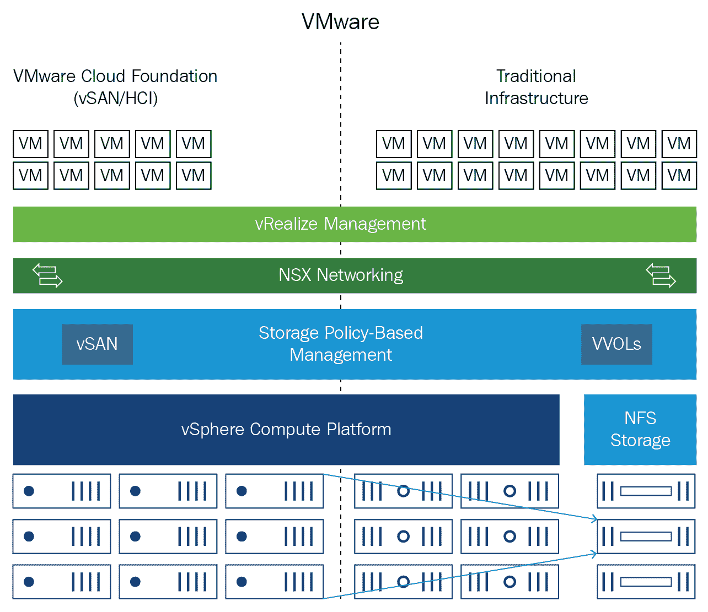
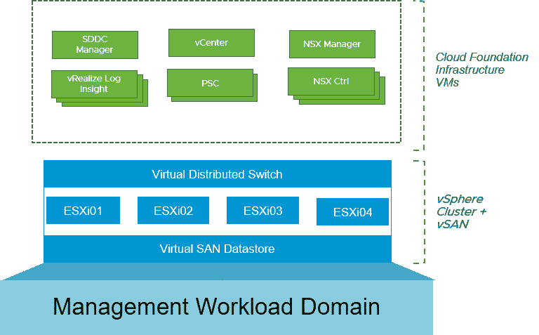

# 第十章：使用机器学习转型 VMware IT 运营

本章将帮助您了解 VMware 云自动化运营转型如何创建和实施生命周期方法来管理和交付基于 SDDC 的服务，以帮助客户过渡到服务提供商组织。这项服务侧重于优化组织和流程能力，以支持**软件定义数据中心**（**SDDC**）概念，实现这些以模块化格式提供的技术全部功能，并通过技术、人员和流程的集成来提供真正的商业效益。

这种基于服务的方法针对的是既有 VMware 基础设施经验的新客户和现有客户，但他们可能没有云自动化解决方案中产品的经验，或者没有基于 SDDC（软件定义数据中心）提供服务的经验。云自动化服务的运营转型通常是大型项目中的一个关键步骤。

在本章中，我们将学习如何从单个控制台管理云模型，并通过设计可扩展的基础设施在不同阶段转型数据中心运营，以运行遗留和新的云原生应用。我们将利用 SDDC 方法中的机器学习技术来完成这项工作。

在本章中，我们将涵盖以下主题：

+   商业和运营挑战概述

+   转型 VMware 技术支持运营

+   虚拟数据中心

# 商业和运营挑战概述

我们正试图推动应用管理转型，通过 VMware 解决方案使生活更轻松。我们可能会遇到管理应用时出现的一些问题，例如遗留的配置、复杂且耗时的更新，以及必须管理用于应用交付的单独解决方案。VMware 在管理应用方面采取了不同的方法。我们有方法可以将一个应用部署到多个桌面，从而节省大量时间和存储成本。我们可以在几秒钟内以规模交付应用。我们可以隔离应用以消除应用冲突的障碍。应用可以在任何设备和一个门户上使用。我们甚至可以改变您监控应用程序以获得更好性能的方式。

VMware 云操作和利益相关者希望分析本地私有云基础设施服务的消耗情况，与他们的客户不同功能组相关联，以确定当前趋势、未来需求和预算合规性。客户的云操作和利益相关者必须向客户收取所消耗的资源费用。客户的利益相关者希望获得一个精确的成本视图，这些成本是提供单位 IaaS 资源所需的，更好地了解其组成部分的负载成本，并提供运行 IaaS 的**总拥有成本**（**TCO**）。客户获得运行 IaaS 基础设施的总资本支出和运营支出，因此他们希望将这些成本分配到构成服务的底层资源上。这些资源包括 CPU、RAM、存储、操作系统、许可证和人力。客户的私有云操作团队、云管理员和指定的业务所有者必须通过深入了解云基础设施如何分配给业务单元，以及分配和未分配资源的成本，如 CPU、RAM 和存储的成本，来实现基于成本的分析和决策。他们希望按资源类型分析分配和未分配的基础设施成本。云管理员还希望确定现有基础设施上是否有可用于运行虚拟机的硬件，为即将到期或结束支持的旧服务器组创建报告，并创建自动报告以向利益相关者展示可能需要采购的新基础设施。

云操作和业务所有者希望分析本地私有云基础设施服务的消耗情况，与客户的业务功能组相关联，以确定当前趋势、未来需求和预算合规性。云操作团队希望向客户收取所消耗的资源费用。他们希望使用 vRA 软件向消费者提供私有云服务。私有云资源托管在客户的数据中心，这就是为什么业务利益相关者要求制定最佳定价策略，以衡量私有云资源的商业价值，即投资回报率。

一个 IT 开发和运营团队需要快速提供新的应用程序及其几乎每年都要进行的持续更新。这些应用程序包括 Oracle 企业资源规划等完全功能的应用程序，以及与各种 SaaS 应用程序集成的本地应用程序，如 My VMware 门户。新软件实例的修改和测试速度慢，且大多因人工流程而容易出错。开发团队在项目期间通常需要一个应用程序开发实例和一个应用程序测试实例，为期几周。即使在应用程序部署后，他们还需要额外一周的时间进行纠正，才能将应用程序投入生产。这将使业务等待新应用程序。

云管理员对客户负责特定服务的定义、设计、部署、持续维护和支持，并与架构师和开发者合作，最大限度地提高自动化水平以支持服务并管理其性能。他还要对服务的服务管理交付负责。

# 没有服务所有者对运营团队带来的挑战

我们缺乏一个单一的客户联系点，这为客户联系 IT 创造了不同的、个体的渠道，可能会影响客户体验。它也无法提供服务的整体、端到端愿景，导致客户对服务的理解不足，以及对客户需求的调整。这种方式，所有权在不同人之间分散，可能导致服务生命周期阶段或不同利益相关者之间的断裂，或者让不同人之间出现重复。它还由于缺乏单一的责任点而倾向于指责，最终导致缺乏明确承诺发展服务并更广泛地推广云的被动管理。它还将缺乏整体愿景，因为相同的服务可能在企业内以不同的方式提供，使得标准化更难转向服务的主动管理。

# 具有服务所有者的解决方案

一旦服务所有者被提名，我们就会拥有清晰的所有权，并有一个单一的责任点。它将通过在 IT 和客户之间促进责任，确保持续交付和服务的持续改进，从而转变为组织内服务一致交付的持续方法，这样他们就可以专注于服务的端到端质量，其与客户需求和 IT 战略的一致性，以及其未来的演变。它还将推动服务的主动管理和优化。

# 服务所有者的职责

服务所有者负责整体服务定义和以下云服务提供的交付：

+   在客户的新服务需求下，召集所有必要的 IT 利益相关者来定义服务范围、目标、SLA 等

+   管理开发和增强工作，并与云服务架构师合作

+   通过对服务的整体愿景，改进服务以及扩大需求

+   持续监控并报告其云服务产品在服务级别上的达成情况

+   定义 KPI 和报告，这对于管理实时服务是必要的

+   与客户保持活跃的对话，以预测并采取必要的行动来关注服务性能

+   负责服务台培训，根据对服务和客户目标的理解，将新服务或变更的服务投入生产

+   与支持团队紧密合作，定义最佳流程，并确保支持团队能够得到支持

+   对管理服务门户信息、参数和特性负责

+   确保客户在门户中拥有正确的信息，并在新服务或服务变更的情况下能够理解他们所接受的服务

+   协助云服务产品的服务成本和财务模型，对于服务成本负责

+   与包括财务和客户在内的适当利益相关者建立正确的成本模型，并教育客户如何驱动客户的消费行为

# 转型 VMware 技术支持运营

VMware 正在 Workspace One 中创新智能功能，以获取客户洞察并增强安全性。通过使用机器学习，身份管理将监控用户行为、软件性能和硬件信息。商业应用将带有 AI 功能。VMware Skyline 将帮助节省时间，因为收集产品数据、事件和条件以及识别问题将更快，从而实现更快的**问题解决时间**（**TTR**）。最初影响最大的领域将是围绕问题识别，以及支持工程师找到报告问题的答案所需的时间，同时发送用于支持调查的产品数据。VMware Skyline 将确保遵循**VMware Validated Designs**（**VVDs**）。所有与高级支持服务团队相关的支持工程师将负责理解 VMware Skyline 的价值和好处，并将其纳入日常对话中，通过鼓励客户下载和安装收集器来推动客户采用。随着查看器的可用，支持工程师在工作处理 VMware Skyline 客户的支持请求时也需要积极使用它。**支持账户工程师**（**SAEs**）和**支持账户经理**（**SAMs**）可以使用**运营摘要报告**（**OSR**）进行更具影响力的对话，增强并拓宽这些通话的焦点，使其更具前瞻性。它将帮助总结已识别的变化以及修复已识别任何潜在问题的建议。将汇编与客户审查相关的相关**知识库**（**KB**）文章、现场警报和安全问题。

客户成功仪表板将使用 VMware Skyline 数据来突出客户从 VMware 产品和服务的最大价值实现机会。客户成功团队成员将负责理解 VMware Skyline 的价值和好处，并将其纳入日常对话中，以推动客户采用。客户成功团队可以利用 VMware Skyline 数据，因为它将提供产品使用数据，这将作为客户健康评分的关键输入。它将提供购买与部署数据（应用采用）以及通过客户健康检查报告提供健康信息，该报告可供服务团队使用。这份报告目前应每季度运行一次。

Skyline 还将提供有关产品版本的关键信息，以确保在升级之前产品的兼容性。它还将提供硬件信息，以显示与 VMware 产品的当前状态兼容性，以及一个站点配置文件，它将为 VMware 产品提供客户环境的拓扑视图。这是一个允许顾问与客户互动并提供建议的工具，以便实施团队能够继续推动所有执行计划和这些建议的实施。

实施团队能够查看客户发送回的 VMware Analytics Cloud 中的传入数据，但服务团队必须在请求以原始格式访问数据之前完成数据隐私培训。VMware Skyline 对客户来说应该是无缝的，并且没有额外的成本，因为它包含在他们的支持订阅中。在 VMware Skyline 上的客户将能够更快地解决反应性支持案例，从而更快地回到业务中。通过主动、预测和指导性建议，可以更快地解决反应性支持问题，这将提高环境的整体性能和健康。整体环境健康将包括改进的可靠性、可伸缩性、配置、设计合规性和跨产品建议。

许多客户依赖与 VMware 授权服务提供商的合作关系来管理和支持他们的 VMware 部署，因此合作伙伴应纳入 VMware Skyline 计划，以利用这项技术在联合支持过程中。vSAN 支持分析构建可伸缩的支持机制，以利用 CEIP 框架。收集到的各种数据允许健康检查团队快速测试现有健康检查的改进以及新的健康检查的准确性。vSAN 兼容性指南团队确定问题的常见原因，而工程团队修复尚未报告或升级的问题。

支持团队可以通过缩短整体解决时间和提升客户支持体验来快速解决问题。产品管理团队能够通过更好地理解客户如何配置他们的环境来更好地优先考虑功能，而产品开发团队则需要优先考虑额外的配置辅助功能，以修复最常见的配置问题。这将为生产支持客户所利用，并用于反应性支持目的。vSAN CEIP 数据通过 SSL（HTTPS）协议从 vCenter Server 传输。这将利用为 vCenter Server 配置的代理。CEIP 数据传输到`https://vcsa.vmware.com`。由于独特信息复杂，vSAN 目前正使用 CEIP 数据进行配置、健康和性能遥测。

# SDDC 服务

通过一系列模块化服务组件实现 SDDC，这些组件逐步构建组织能力以定义、设计、开发和发布云服务，并通过它们发布的目录来管理服务。这些模块化服务可以单独交付，也可以作为一系列按顺序构建的模块，这些模块逐渐建立在彼此的结果之上。这些组件从需求识别开始，然后开发可重复的过程，并通过对这些过程与用例的验证来实施。

# 服务目录管理

此服务通过设计、管理和运营客户云服务目录以满足可用性、服务发布和自助服务业务需求，从而提高了发布云服务对用户和商业自助服务的可预测性。它还提供了将已同意的服务用例发布到云服务目录，以验证正确的操作流程，支持以服务/租户为中心的角色、责任和技能集启用指南，使客户能够管理和交付服务目录的能力。

# 服务设计、开发和发布

这通过将客户云服务的设计、开发和发布过程应用于云基础设施，提高了构建和发布云服务的运营能力。通过实例化已同意的服务用例来验证和细化服务设计、开发和发布过程。该流程是为基于冲刺的敏捷服务开发设计的，但通过假设单一的开发周期，该流程仍可用于传统的瀑布式服务开发方法。

# 云业务管理操作

通过详细报告，云业务管理服务可以启用以实现更好的 TCO 和 ROI，并快速做出业务决策，帮助云服务所有者找出整体端到端特定云服务每单位成本，包括以下内容：

+   云服务成本

+   定价

+   反映报告

# 服务定义和自动化

这是一种通过使用经过验证的方法来发现、评估和开发服务自动化路线图，从而全面定义客户云服务自动化和配置路线图的方法。此服务为客户提供了清晰且可操作的路由图，以在他们的云环境中实施自动化配置和部署能力。它提供了一个服务定义框架、流程和一系列可重用模板，以实现客户对已同意服务用例的全面定义，并提供以服务/租户为中心的角色。

# NSX for vSphere

我们首先需要了解当前的部署情况和未来的期望，以及所有与在不同地区托管在公共云中的应用程序（包括订阅详情）相关的信息。我们应该收集有关虚拟网络/**虚拟私有云（VPCs**）的信息，包括每个 VPC/VNET 中生成的所有虚拟机。我们必须设计一个网络，使用 NSX 为 PaaS 服务（如 API 管理器）提供支持，以及本地环境，并且不能将本地环境与公共云环境分开管理。我们必须建议在两种环境中托管应用程序、数据库和 Web UI，并通过专用的高速路由/直接连接连接连接到公共云。

**虚拟云网络（VCN**）是数字时代的网络模型。它也是 VMware 对网络未来的愿景，使客户能够从边缘到边缘连接和保护应用程序和数据，无论它们位于何处。它允许客户采用云网络布线作为连接分布式世界中一切事物的软件定义架构。它是一个无处不在的软件层，为用户提供用户、应用程序和数据之间交互的最大可见性和上下文。虚拟云网络是下一代网络服务消费技术的类别，正在被越来越多地采用于 IT，以提供帮助统一超分布式世界的数字布线。

ESXi 主机为 vSphere 上的 NSX 准备，以下值：

| **最大传输单元（MTU**） | 9000 |
| --- | --- |
| **段 ID** | 5000–7999 |
| **团队模式** | 源 MAC 地址 |
| **传输区域** | 1—包括所有集群 |

NSX 正在从数据中心扩展到边缘，因为实现 VCN 需要一个相当强大的产品组合。NSX 数据中心是数据中心网络的最佳端到端一致平台。NSX 云正在将数据中心网络扩展到公共云，包括 AWS 上的 VMC、本地的 Azure 支持以及与**Pivotal Container Service（PKS**）的容器/Kubernetes 支持。我们打算提供控制、策略和自动化，这些控制、策略和自动化位于数据中心，以保持一致性，将它们提供给客户正在运行的云环境。

NSX 混合连接将有助于提供应用程序和网络混合性和移动性。通过**vRealize Network Insight（vRNI**）提供的强大网络洞察和发现将推动物理、虚拟和云环境中的安全性和网络优化。以下图示了一个基于传统 VMware vSphere 的基础设施和一个基于**VMware Cloud Foundation（VCF**）（HCI/VSAN）的虚拟基础设施，两者都集成了**NFS 存储**：

SDDC 分层方法

如果我们在本地使用 NSX，我们可以使用交换机端口分析仪、**IP 流信息导出**（**IPFIX**）等本地功能。在这里，我们可以使用 Traceflow 来窥视数据包的流动情况。一旦我们开始迁移到云端，这就会变得复杂。这是因为有一个底层网络，它不由客户运营。骨干网络属于 AWS 或 Azure，因此我们希望从这样的工具中获得的是跨所有云账户和用户的端到端、实时操作可见性。

每个公共云提供商都有创建和实例化安全组的不同方式，管理所有这些可能会变得困难。客户现在运营云，因为每个团队都会创建自己的 VNET，并且在该 VNET 的安全策略在部署前会手动讨论。每当需要运行新事物时，都会提出一个工单。他们通常会创建安全组，并将这些安全组附加到本地环境中的虚拟机上。

每当创建一个新的虚拟机时，该虚拟机会继承与它关联的安全组所基于的一组限制。在下面的图中，我们可以看到如何配置了一个基于 VSAN 的四节点集群，并使用分布式交换机来托管所有管理虚拟机，例如**SDDC 管理器**、**vCenter**、**NSX 管理器**、**vRealize Log Insight**设备、**PSC** 控制器和 **NSX** 控制器：

工作负载集群

vRA 简化了应用程序部署流程，该流程消耗网络并包含定义蓝图，这允许自动部署新网络。NSX 是网络的未来，我们准备好帮助客户在数字化转型中前进。我们有一种强大的技术，我们相信在数字时代网络将如何发展。VMware 正在解决关于多云、多应用框架和现代应用程序构建的关键客户需求，并使一致的网络和安全策略能够跟随应用程序和数据在整个 IT 环境中。NSX 是网络的未来，我们很兴奋能帮助我们的客户在数字化转型中前进。vCenter 服务器和 Active Directory 服务器被添加到排除列表中，以避免任何人为错误，并且始终可用。为该环境创建了以下安全组、策略和规则。

# 优先级建议

ESXi 主机的物理配置规范列出了 ESXi 主机的特性，可以在部署和测试期间按照 VMware 最佳实践使用。每个系统的配置和组装过程是标准化的，所有组件在每个 ESXi 主机上以相同的方式安装。标准化 ESXi 主机的整个物理配置对于提供易于管理和支持的基础设施至关重要，因为标准化消除了可变性。您可以在所有集群成员中部署具有相同配置的 ESXi 主机，包括相同的存储和网络配置。例如，一致的 PCI 卡插槽位置，特别是对于网络控制器，对于物理到虚拟 I/O 资源的准确对齐至关重要。相同的配置确保了虚拟机存储组件在存储和计算资源之间的平衡。以下是我们提到的建议及其优先级。

# 优先级为 1 的建议

以下约束属于优先级为 1 的建议：

+   在所有集群上启用 HA 准入控制。原因：始终保护运行中的工作负载。

+   在某些集群中增加主机数量以分析各种场景。原因：在某些集群中，由于硬件故障，可能没有足够的 ESXi 主机来运行所有现有的虚拟机。

+   使用资源池，既为**站点恢复管理器**（**SRM**）故障转移的虚拟机保留资源，又确保在争用事件期间公平访问资源。原因：保护工作负载。

+   从集群中的虚拟机中移除 CPU 预留。原因：在 ESXi 主机故障的情况下，虚拟机重启可能会失败。配置没有提供任何真正的益处。

+   确保所有 ESXi 主机上的**网络时间协议**（**NTP**）配置正确，并且 NTP 服务器已启动。原因：在任何 IT 环境中，准确的时间维护都是必不可少的。

+   使用基于物理 NIC 负载均衡算法的路由进行虚拟机网络。原因：最大限度地利用可用的网络带宽，保护工作负载。

+   调查 vSphere 5.1 加固指南中的所有 3 级建议。除非有特定原因不应用安全建议，否则应应用所有建议。原因：提高安全性。

+   对于具有 RDM 的特定虚拟机案例，将虚拟机配置文件和`.vmdk`文件放置在其自己的数据存储上，并创建包含数据存储和 RDMs 的 SRM 保护组。原因：确保这些特定虚拟机可以成功且独立于其他虚拟机恢复。

+   深入了解虚拟机的恢复优先级和依赖关系，并适当配置 SRM。原因：增加信心，以便在灾难恢复事件中，虚拟机可以正确且在预期时间内恢复。服务通常有首选的启动顺序，在灾难恢复故障转移期间也应遵守。

+   在 SRM 中，根据需要配置 1:1 的数据存储到保护组映射。原因：这消除了向 ESXi 主机添加新 LUN 时出现的问题，以及在一致性组重新同步期间可能无法进行灾难恢复的情况。它将允许同时启动多个恢复组，并允许测试或故障转移特定服务，而不是每个受保护的虚拟机。这增加了复杂性，但为灾难恢复计划引入了大量智能和意识。

+   在灾难恢复事件中，预先确定 50%的银色虚拟机的恢复列表。原因：在灾难恢复事件中消除混淆，并允许在受控条件下测试灾难恢复计划。

+   在恢复计划中引入基于服务的方法，以便根据需要测试和恢复单个服务。原因：这为灾难恢复带来了面向服务的方法，并允许测试或故障转移特定服务，而不是每个受保护的虚拟机。这增加了复杂性，但为灾难恢复计划引入了大量智能和意识。

+   定期进行测试恢复，以增加对灾难恢复按预期运行的信心。原因：增加信心，以便在灾难恢复事件中，虚拟机可以正确且在预期时间内恢复。

+   使用最佳实践推荐配置所有虚拟化 Microsoft SQL Server 集群。原因：确保集群的稳定性并移除影响性能的配置。

# 优先级为 2 的推荐

以下限制属于优先级为 2 的推荐：

+   CPU 利用率通常较低，因此考虑增加每个 ESXi 主机的 RAM 量。原因：这会导致更高的整合比率，而不会影响 CPU 性能。

+   确定是否需要严格执行 1vCPU: 4 GB RAM RU 模型。原因：可能造成计算资源的浪费。可能导致更高的整合比率。

+   不要让完全备份作业与防病毒扫描重叠，以限制对 ESXi 主机 CPU 利用率的冲击。原因：减少 ESXi 主机的 CPU 负载需求，否则可能会导致虚拟机和服务性能下降。

+   将虚拟机的防病毒扫描分散到多个时间窗口，以限制对 ESXi 主机 CPU 利用率的冲击。原因：减少 ESXi 主机的 CPU 负载需求，否则可能导致虚拟机和它们上运行的服务性能下降。

+   为每个 vCenter 服务器配置 DRS 规则。原因：始终保护 vCenter 服务器虚拟机。

+   为每个 vCenter 服务器配置内存预留。原因：始终保护 vCenter 服务器虚拟机。

+   将每个 vCenter 服务器的 HA 重启优先级配置为高。原因：始终保护 vCenter 服务器虚拟机。

+   识别并配置所有 ESXi 主机的辅助 NTP 服务器。原因：当前实现中存在单点故障。准确的时间记录是任何 vSphere 实现的重要组成部分。

+   调查使用主机配置文件或 PowerShell 脚本来检查和修复 ESXi 主机配置差异的使用情况。一旦确定了解决方案，就进行定期检查以确保 ESXi 主机配置的一致性。原因：这确保了所有 ESXi 主机具有标准构建和配置，从而简化了故障排除。

+   自动化故障转移虚拟机的资源池预留，并自动化资源池共享，以确保在争用时公平共享集群资源。原因：保护工作负载。

+   修改 vCenter 服务器设置，以便任务和事件在 180 天后（或任务和事件需要在虚拟应用设备中保留多长时间）被截断。原因：这可以防止 SQL Server 数据库变得过大，这可能导致性能问题。

+   使用**vSphere 分布式交换机**（**VDS**）进行所有 ESXi 主机的网络配置。原因：它更容易配置，并且更简单。为所有 ESXi 主机提供更一致的网络安全配置。

+   修改 HP 虚拟连接环境中虚拟网络接口卡（vNICs）的网络带宽配置，以最大化网络带宽的整体使用。原因：更有效地使用所有可用的网络带宽。

+   配置多 NIC vMotion。原因：通过更有效地利用网络带宽，这可以加快 vMotion 事件。

+   识别所有需要为授权目的指定特定 MAC 地址的虚拟机。将此 MAC 地址硬编码到虚拟机配置中。修改所有分布式端口组，使伪造传输和 MAC 地址更改设置为拒绝。原因：这提高了 vSphere 环境中的安全性。

+   配置 SSO 管理员组，并将适当的 Active Directory 账户添加到其中。原因：提高了安全性和可审计性。

+   从 vCenter 服务器中的`admin@system`域账户中移除权限。原因：提高了安全性和可审计性。

+   在 SSO 中修改密码过期超时以满足本地安全策略。原因：提高了安全性。

+   将所有 ESXi 主机添加到 Active Directory 中。使用`ESX Admins`组（或创建自己的组并适当配置）并填充 Active Directory 用户账户。配置适当的 SSH 和 ESXi shell 超时。修改所有 ESXi 主机的 root 密码，使其长且复杂。将密码存储在安全位置。培训员工使用 Active Directory 账户连接到 ESXi 主机，而不是 root 账户。原因：提高安全性和可审计性。

+   创建数据存储集群并添加适当的数据存储。以手动模式配置存储 DRS 设置，禁用 I/O 测量。原因：使虚拟机的放置任务变得不那么复杂。

+   在所有数据存储上启用存储 I/O 控制，并对所有虚拟机和运行在其上的工作负载进行全面分析。为托管应用程序配置虚拟机的特定最佳实践。原因：保护工作负载。

+   确保所有虚拟机都安装并运行了最新的 VMware 工具。原因：提高性能、安全性、兼容性和可管理性。

+   识别所有配置了超过 4GB RAM 且运行的操作系统不支持超过 4GB 使用的虚拟机。原因：减少计算资源浪费。允许有更高的整合比率。

+   升级到更近版本的 vSphere。原因：利用新软件功能，提高性能水平，并包括对更新硬件的支持。

+   升级到**vRealize Operations Manager**（**vROP**）6.7。原因：利用显著改进的架构。

+   识别并实施 vROP 仪表板的用例。原因：利用 vROP 中可用的大量指标，提供对 vSphere 平台的深入可见性，并以易于消费的方式可视化。

+   识别如何将 vRealize Operations Manage 集成到整体监控解决方案中。原因：提高对 vSphere 环境的监控。消除使用 vCenter Server 警报的需要，这些警报在功能上不如 vROP。

# 优先级为 3 的建议

以下约束属于优先级为 3 的建议：

+   只在绝对必要时使用具有大量 vCPUs 的虚拟机。原因：减少整合比率，当虚拟机超过**非一致性内存访问**（**NUMA**）边界时增加复杂性，并可能影响性能。

+   使用 HA 重启优先级在物理主机故障时首先将重要的虚拟机恢复在线。原因：通常首选智能重启虚拟机。

+   改变主机容量计算的方式。原因：现有方法复杂且易出错，可以通过 vROP 自动化并以仪表板格式呈现。

+   减少每个 vCenter Server 的虚拟数据中心数量。原因：消除不必要的复杂性。

+   调查将青铜和银色集群合并。原因：可能提供更大的整合比率，同时也降低了环境的复杂性。

+   将服务器 OEM 的**vSphere 安装包**（**VIB**）仓库添加到 vCenter 更新管理器，以便通过 vCenter 更新管理器更新服务器 OEM 特定的软件和驱动程序。原因：这为 vCenter 更新管理器增加了额外的补丁功能。

+   配置巨帧以启用更快的 vMotion 事件。原因：为了启用更快和更高效的 vMotion 事件，这允许 ESXi 主机更快地疏散。

+   确保所有 ESXi 主机都正确授权。原因：这减少了在 DR 场景中需要授权主机的需求，并确保在需要时 ESXi 主机以适当的配置连接到 vCenter 服务器。

+   配置 SSO 默认域配置功能以允许更简单的登录。原因：简化用户登录。

+   在 SSO 中将本地操作系统作为身份源移除。原因：提高安全性和可审计性。

+   为模板和 ISO 创建专用数据存储。原因：消除在虚拟机部署期间或访问 ISO 镜像时可能出现的性能问题。

+   移除配置和运行中的操作系统类型不匹配。原因：提高虚拟机与 VMware Tools 之间的兼容性。

# 虚拟数据中心

每个 vCenter 服务器将有四个虚拟数据中心，与各种网络区域相关。虚拟数据中心结构是一个管理边界，但不需要创建多个实例，如果没有完全隔离各种 vCenter 结构的需求。四个虚拟数据中心仅用于放置**vSphere 分布式交换机**（**VDS**）。ESXi 主机和网络需要在新的单个虚拟数据中心中重新创建。这项活动应仅在有充分研究和规划的情况下进行。

以下是对虚拟资源的配置建议：

+   **每主机虚拟机密度**：运维团队确保他们在不同的集群上运行所有必需的虚拟机，并且不会过度承诺内存。他们还可以决定使用每个主机最多 90%的可用内存容量。他们在扩展虚拟机时使用资源单位的概念，每个 RU 相当于 1 个 vCPU 和 4GB RAM。

+   **整合比率建议**：他们有一个一般规则，即 vCPU 与 pCPU 的比例应小于 3:1。这个比例通常有助于 ESXi 主机上的 RU 限制。这个比例应结合每个虚拟机的特定应用、CPU 配置和利用率以及虚拟机所在 ESXi 主机的性能指标来指导。整合比率和 vCPU:pCPU 比率可能受到以下参数的影响：

    +   **工作负载感知**：并非所有工作负载都是相同的；一个 4vCPU 虚拟机不会与另一个配置相同的 4vCPU 虚拟机具有相同的表现特性。

    +   **虚拟机配置**：由于 RU 模型的限制，可能会有不必要的额外开销，这会影响整体整合比率。通常，最佳实践是虚拟机应仅配置所需的资源，以减少具有多个 vCPU 的虚拟机对称多处理带来的负面影响。由于 RU 模型是固定模型，对 RAM 需求增加的虚拟机必须配置更多的 vCPUs，即使这些 vCPUs 不是必需的。

    +   **ESXi 性能指标**：保持固定的 CPU 整合比率通常不推荐。相反，考虑前述详细考虑因素以及两个重要的 ESXi 主机指标，将有助于更深入地理解潜在的整合比率。

    +   **CPU 就绪率**：虚拟机准备运行但无物理 CPU 可用于调度请求的时间百分比。一般来说，应避免超过 10 的值。

    +   **仪表板和超级指标**：vROPs 可用于创建强大且信息丰富的仪表板。始终需要确定用例，如下所示：

        +   **容量规划仪表板**：RU 计算是通过从单个集群获取数字并使用电子表格来确定容量来完成的。创建仪表板并使用指标/超级指标来确定对客户而言“完整”的含义将减少所需的手动任务。这也可以与警报结合使用，提供关于集群容量的主动警告。

        +   **RU 模型仪表板**：包含受 RU 模型影响的指标仪表板；CPU 或内存的未充分利用，以及受**对称多处理**（**SMP**）影响的 ESXi 主机指标。我们可以确定仪表板的使用案例并按需创建它们。

vROPs 拥有强大的警报引擎，可以基于动态或静态症状阈值。有许多来自 VMware 和第三方合作伙伴的现成警报，它们为 vROPS 创建了解决方案适配器。始终需要解决由 vROPS 产生的初始警报数量，因为这既是识别和修复识别出的问题的机会，也是调整现有警报和症状以及/或创建更适合环境的新的症状和警报的机会。可以使用自定义组和配置文件来创建细粒度的监控方法。生产 SQL 集群的指标可能与非生产文件服务器大相径庭。使用自定义组和配置文件可以使警报针对特定环境进行微调。这可以确定如何实现 vSphere 环境的警报，并确定 vROPS 是否能够满足这些要求，如果是，则按需进行配置。

# 使用 vRealize Suite 的 IaaS 解决方案

vRA 包含多种分组机制。管理员可以使用这些分组结构来组织计算基础架构，以及创建业务级别的分组来划分服务、资源和用户。

今天，应用程序正在全球混合 IT 基础设施中运行。我们必须将私有数据中心扩展到公共云以及容器中。还可以通过连接物联网服务提供商来扩展。NSX 是一个统一的网络和安全平台，适用于所有先前技术或基础设施，允许客户连接、保护并运营，以便在任何应用程序托管的地方提供服务。它包含一个内置的安全引擎，通过微分段来分割网络，并加密传输中的数据。

当我们谈论云时，我们基本上希望通过一个工具来配置和管理混合网络环境。我们不希望每个云管理系统都在孤岛中运行，对于本地部署也是如此，它应该对当前的工作负载所在位置以及未来将迁移到何处视而不见。我们应该能够将安全策略与工作负载一起迁移，无论它们托管在何处。

开发者不希望我们参与开发路径，但我们不能让开发者离开这些新技术。运维团队必须帮助开发团队熟悉这些新工具。IT 管理员有责任设置防火墙并确保没有安全漏洞。开发者不需要负责创建安全策略，他们只需消费由 IT 管理员设计的安全组即可。目标是拥有一个云配置解决方案，Devops 团队的工作量最小。我们必须为应用程序提供一致的联网和安全。

NSX Cloud 是 NSX 功能在公共云中的扩展，并不是一个独立的产品。当我们为我们的本地环境加载 NSX 时，我们已经有 90% 的 NSX Cloud 所需的功能。NSX 已经通过我们的逻辑网络结构抽象了物理/本地网络。现在，通过 NSX Cloud 提供对所有云中所有流量流的可见性，我们就可以在公共云中复制同样的功能。我们无法保护我们看不到的东西。开发者创建新的虚拟机时，IT 管理员需要有一个仪表板和一些类型的用户界面，使他们能够看到这些信息。我们必须设计一个统一的、一致的本地和公共云安全策略，以便我们能够提供高级 L2/L3 网络功能；或者如果我们正在为本地网络创建逻辑拓扑，那么可以从本地到云端口网络拓扑。管理和操作需要一个单点玻璃式的管理界面，因为这是我们想要为 NSX Cloud 实现的核心。我们使用的部署流程或工作负载，例如 Ansible 或我们用于开发者部署工作流程的任何其他工具，都不会因为使用 NSX 而改变。这是我们看到 Azure 和 AWS 以及每个公共云提供商所提供的关键价值主张之一。然而，它们都附带一些限制（特别是在规模上），这正是 NSX 区分自己的地方。显然，我们不想被锁定在某个公共云提供商的产品中。

# 商业级管理和组织分组

NSX 帮助客户配置多层安全。NSX 防火墙将提供主要安全，由 NSX 管理的 AWS 安全组将提供第二层安全。它可以完全配置到每个 VPC，并带有排除列表。它为测试/开发中的虚拟机部署/拆除提供了敏捷性，同时保持生产 VPC 的结构完整性，以实现两者的最佳结合。

在某些环境中，我们可能会说 VPC 需要完全上线。在某些环境中，有些虚拟机有代理，而有些没有代理是可以接受的。这是一个典型的测试和开发环境，或者是一个已经运行虚拟机的棕色地带环境，我们可能不想在所有虚拟机上安装代理，但这并不意味着它们可以被隔离。

如果我们有一个生产 VPC，并且其中有一个安装了代理的虚拟机正在运行，并且有人设法进入并安装了一个恶意虚拟机，那么我们有可能检测到它并将其隔离。

我们有一个网关在那里，它不断地轮询 VPC/VNET 内部正在创建的新资源。网关期望虚拟机中的代理来注册自己，如果没有，网关会将虚拟机移动到隔离安全组。我们可以通过使用默认的隔离策略设置来实现这一点。由于代理不存在，NSX **公共云网关**（**PCG**）无法推送任何策略到那里，但这并不意味着 NSX 无法控制虚拟机本身。NSX 可以与云提供商通信并将此虚拟机移动到隔离状态。这就像增加了一个安全层，如果我们有一个运行的代理，PCG 可以推送策略并管理虚拟机。如果代理不存在，PCG 可以将整个虚拟机移动到隔离状态。由于 PCG 是执行此任务的一方，我们不必担心与本地系统的连接丢失。PCG 被分配了**身份和访问管理**（**IAM**）角色，这使得它可以与云库存通信。这是受专利保护的，我们不需要管理员权限来做任何这些。我们可以向客户提供云权限模板，其中他们可以为 NSX Cloud 中的每个组件分配角色和权限。PCG 将被赋予必要的角色，以便能够与云库存管理器通信并将特定资源移动到隔离状态。

我们需要一个具有本地安全组的代理来获得无代理解决方案。如果 AWS、Azure 和本地部署都采用相同的工作方式，那么我们就可以轻松地做到这一点。一个单一的政策就足以适用于所有这些环境，但这并不是实际情况。我们可以在 Azure 中为每个虚拟机应用一个安全组，我们可以在 AWS 中有五个嵌套的安全组。我们无法在 Azure 中嵌套安全组，因为我们还必须在 Azure 中为 VNET 编写第三个安全组。我们现在谈论的是安全组爆炸，但在 NSX Cloud 中我们没有遇到这些问题。在 AWS 中我们不能有一个*拒绝*规则，因为我们只能有一个*允许*规则。如果我们说不要允许特定实例的 web-web 层通信，它不会接受。任何不属于*允许*规则的东西都会被隐式拒绝。

我们还没有看到在代理上进行加密的任何强大用例，但我们确实为所有任务定义了以下基于角色的用户：

+   VPC 应该被管理（云管理员）

+   标记虚拟机（开发者）

+   添加代理（开发者）

然而，如果我们需要在公司内不同群体或部门之间提供额外的隔离，或者需要特定租户的品牌标识，可以配置多个租户。每个租户都可以拥有专用的网络组，或者如果需要，可以共享网络组资源。他们有两个或三个订阅，在这些订阅中有大量的虚拟机，而其他场景可能有多个订阅。VMware IT 的工作是管理 AWS 和 Azure 账户。这里的每位员工都有自己的 AWS/Azure 账户，但责任在于 IT 确保我们通过移除多个安全接触点，从一个安全接口出发。将安全组分配给 VPC 和 VNET 的问题在于，这必须为每个 VPC/VNET 手动/静态完成。作为 IT 管理员，我们有两种方法来处理这个问题：让用户为工作负载创建 VPC，或者对它们施加安全限制。但在这里，安全更像是一种事后考虑。如果我们正在寻找所有 VPC 和 VNET 的安全组整合，那么我们需要一定程度的抽象。如果我们想要一个可以跨越环境的网络安全组，那么我们需要一个像 NSX 这样的工具。我们可以在 NSX-T 环境中使用 NSGroups 创建 NSX 安全策略。NSGroups 可以通过动态属性创建，例如虚拟机名称、虚拟机的位置、它运行的 VNET、它运行的区域等。它也可以基于用户定义的自定义标签，例如应用程序正在运行的内容等。NSX 可以了解这些标签，将它们带回 NSX Manager，并根据这些标签创建一些安全组并将它们应用到 NSX Manager。

Azure 存在其他限制，例如我们每个虚拟机只能有一个网络策略组（NSG），但与 NSX Cloud 相比，我们不会遇到任何此类问题。我们可以使用 NSX 的任何超集 NSGs。虚拟机可以根据元数据和虚拟机名称成为多个安全组的一部分。策略可以基于属性，而不是基于虚拟机或接口虚拟机，并且对安全组堆叠的数量没有限制。策略可以更动态地定义，而不是静态地定义到特定的虚拟机、入站或出站访问列表等。

# vRA 部署

vRA 虚拟设备基于 SUSE Linux。该设备运行常见服务，例如授权、审批、通知以及组件注册服务，这允许分布式系统中的其他服务被发现。该设备还具备几个集成点，用于与**轻量级目录访问协议**（**LDAP**）和 vCenter Orchestrator 接口。vRA 设备还包含一个嵌入式的 Postgres 数据库。

服务目录包含所有配置的服务和目录项。这是一个通用目录，可以被 vRA 和其他解决方案，如应用总监，用来填充项目和服务的条目，例如机器蓝图、应用服务和基于 vRealize Orchestrator 工作流的服务。最常见的服务由 vRA 虚拟设备托管。高级服务设计器（自定义服务设计器）将 vCenter Orchestrator 工作流作为目录项暴露，IaaS 组件是 Windows 组件，它处理与预留、蓝图、端点、工作流等功能相关的功能。以下配置将在 vRA 虚拟设备中启动：

+   组件注册表-服务，允许其他服务被发现

+   认证-用户认证

+   授权-控制访问

+   审批-审批策略

# vRA 设备通信

以下是通过 vRealize 组件监听的入站端口的列表：

| **端口** | **协议** | **注释** |
| --- | --- | --- |
| `22` | TCP |   SSH |
| `80` | TCP | 重定向到`443` |
| `111` | TCP, UDP |  RPC |
| `443` | TCP |   访问 vRealize Automation 控制台和 API |
| `5480` |  TCP |   访问 Web 管理 UI |
| `5488`, `5489` | TCP |  管理 |
| `7444` | TCP |                                      通过 HTTPS 的 SSO |
| `8230`, `8280`, `8281` |  TCP |                          内部 vRealize Orchestrator 实例 |

以下表格显示了出站端口的列表：

| **端口** | **协议** | **注释** |
| --- | --- | --- |
| `25`, `587` | TCP, UDP | SMTP 用于发送通知电子邮件 |
| `53` | TCP, UDP | DNS |
| `67`, `68`, `546`, `547` | TCP, UDP | DHCP |
| `80` | TCP | 用于获取更新的可选 |
| `110`, `995` | TCP, UDP | POP 用于接收通知电子邮件 |
| `143`, `993` | TCP, UDP | IMAP 用于接收通知电子邮件 |
| `123` | TCP, UDP | 直接使用 NTP 同步而不是使用主机时间 |
| `443` | TCP | 通过 HTTPS 的 IaaS 管理器服务 |

IaaS 组件安装在 Windows 主机上，包括模型管理器、管理界面、执行管理器和数据库。与 vRA 一起安装的模型管理器包括从 VMware 可用的所有默认模型。

模型是一组构成配置过程元素的集合，包括数据模型、逻辑、事件定义、安全性和**分布式执行管理器**（DEM）与外部系统通信的规范。数据库存储配置、工作流以及 vRA 环境中所有对象的信息。

vRA 有一个 vRA 设备和 IaaS 组件。身份设备是一个基于 Linux 的虚拟设备，为 vRA 提供单点登录功能。vRA VA 也是基于 Linux 的，提供用户界面和几个常见服务。IaaS 组件安装在 Windows 主机上，包含处理和执行请求的工作流的管理服务、代理、模型管理器和执行管理器。

# 作为身份服务一部分运行的服务

以下是在身份服务中运行的服务：

+   **VMware 目录服务**：由于 VMware 目录服务本身就是**单点登录（SSO**）安装的一部分，因此此服务将始终在与其他 SSO 服务相同的机器上运行。没有将其作为远程服务运行的选项。"vmdir"是 VMware 目录服务。

+   **VMware KDC 服务**：这是一个 Kerberos KDC，可以帮助为**VMware 证书授权机构（VMCA**）服务生成票据，该服务是一个符合 x.509 标准的证书授权机构。VMCA 服务依赖于它来正确运行。它还支持证书的颁发和撤销。身份管理服务负责接收认证请求并将它们路由到定义的目录或身份源。这是一个重要的步骤，以便全球支持服务知道认证过程中出现的任何错误大多会在这里发生。

+   **VMware 安全令牌服务**：**安全令牌服务（STS**）负责在验证用户的身份后颁发安全令牌。此服务运行 Tomcat 服务器。此服务负责在用户认证后颁发令牌。与这些服务相关的所有日志都位于已识别设备上的`/storage/log/vmware`目录中。

用于与 vRA 组件通信的 API 接口与身份管理服务和**简单对象访问协议（SOAP**）接口。vRA VA 和 IaaS 组件的接口都使用 HTTPS 的**表示状态转移（REST**）。客户可以使用 API 构建自己的 vRA 接口。

通过创建不同的资源服务层级并使用预留策略，可以进一步将分配给特定组的资源进一步细分。每个租户内可以创建多个业务组。业务组可以共享来自同一织物组的资源，或者利用不同的织物组以实现组间资源的更大隔离。如果我们需要在公司内不同组或部门之间提供额外的隔离，或者需要特定租户的品牌，则可以配置多个租户。每个租户都可以拥有专用的织物组，或者如果需要，可以配置共享的织物组资源。vRA 支持时区、欧洲日期格式和主要货币。

CF 的真正美之一是它围绕工作域提供的自动化，以及它如何使部署和扩展工作域变得非常容易。此外，通过删除工作域，它还使得回收容量变得非常容易。从配置物理服务器到配置交换机上的 VLAN 和 IP 地址，再到部署 vSphere、设置 vSAN 以及部署和配置 NSX，所有事情都完成了。工作域之间存在一些共享方面，其中之一就是我们有一个运行着两个用户定义的 VI 工作域的管理域。

在配置 VDI 工作域之前，审查 SDDC Manager 中**虚拟桌面基础设施**（**VDI**）的全局设置是个好主意。这些设置允许管理员定义桌面和 Horizon 服务器的命名、大小和 AD 放置。NSX 还为 VDI 工作域提供微分段。已经自动创建了 26 个规则集，以提供 VDI 组件的微分段。

# 一个完整的解决方案，能够达到预期的效果

运营团队在创建新的虚拟机以及手动部署应用程序时将涉及大量工作，这存在人为错误的风险。我们必须将整个基础设施迁移到私有云，并自动化端到端流程，以提高运营团队的解决时间。

运营团队利用由 vRealize 套件驱动的 VMware 内部私有云来提供 IaaS，包括计算、存储和网络资源，以在这些服务之上交付所有应用程序。他们能够实现完全自动化的管理功能，以控制他们的应用程序开发生命周期流程。vRealize 解决方案是可扩展的，可以利用自动化脚本来集成第三方工具，例如负载均衡器、监控代理和代码库。

以前，开发者通常需要调用运营团队来创建新的应用程序实体，这需要几周的时间来配置，但现在开发者和技术测试人员可以通过自助门户来获取新的或管理他们的应用程序景观，以定制他们的需求。在环境配置和测试完成后，开发者将获得一个包含登录详情和用于监控环境不同指标的 Web 控制台的应用程序实体链接。他们现在将在几小时内获得完全运营和测试的服务。

# 摘要

VMware 运维团队通过 vRA 为他们所有的应用程序及其配置创建了模板。这个自动化工具将端到端应用程序部署时间从几周缩短到 36 小时。我们在第一年后将整个周期缩短到不到 24 小时。自动化不仅有助于快速部署，还能在重复任务中保持一致性。我们可以通过自动的、预定义的政策快速构建开发和测试实验室，从而避免任何人为错误。VMware 工程师现在可以将其时间用于新的开发，并帮助他们的运维团队变得更加敏捷。员工可以通过自助门户发起和执行他们的任务。这意味着应用程序可以在几小时内部署，因此开发团队有更多时间用于新项目。这提高了 VMware 开发者的效率，也降低了由于恶意代码和积压工作带来的安全风险。基于 VMware 私有云的 IaaS 还有助于在年度节省资本支出（CapEx）和运营支出（OpEx）成本。VMware 能够降低成本并提高对最终客户的服务质量。他们更加关注产出和快速响应，以实现服务敏捷性，从而改善客户体验。我们对我们的自动化交付流程感到满意，但我们也可以通过使用混合云模型，基于 VMware 软件定义服务开发其他流程。我们必须通过定期升级 IT 服务以满足业务需求，在这个市场上保持竞争力。

在下一章，第十一章，*物联网网络转型*，我们将了解 VMware Pulse IoT 在不同领域（如健康、研究、科学和零售）的应用案例。我们将学习从数据中心到云再到边缘设备的应用和数据利用，通过物联网网络转型来理解如何管理和处理边缘设备上的大量数据。
