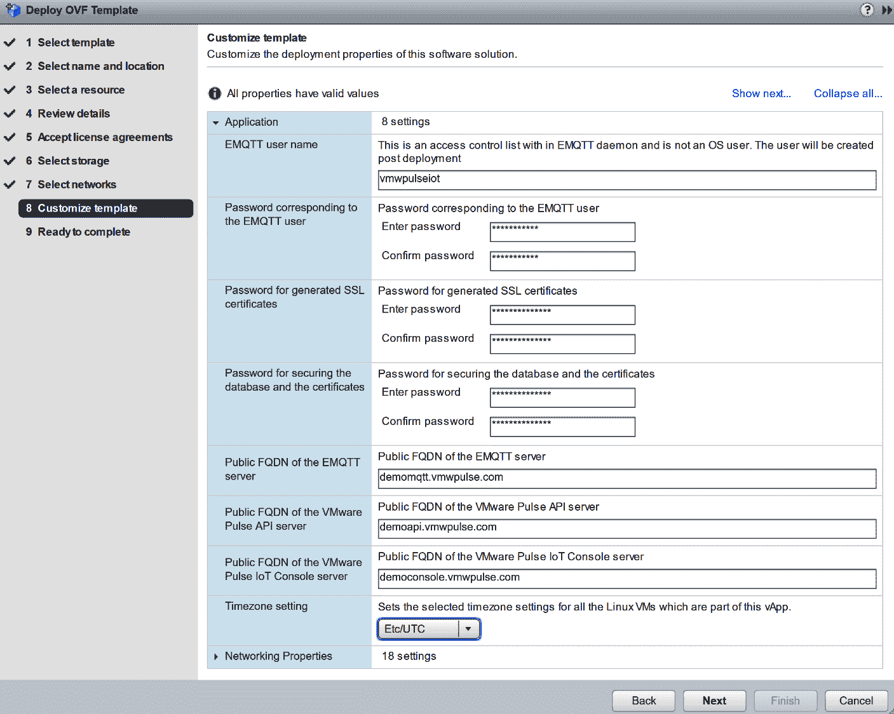
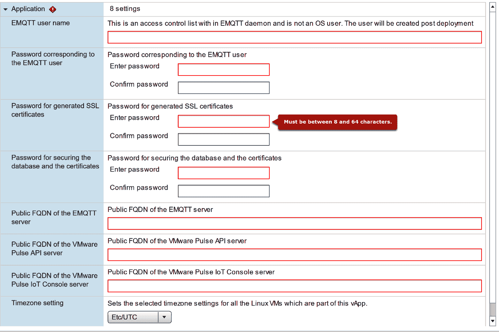
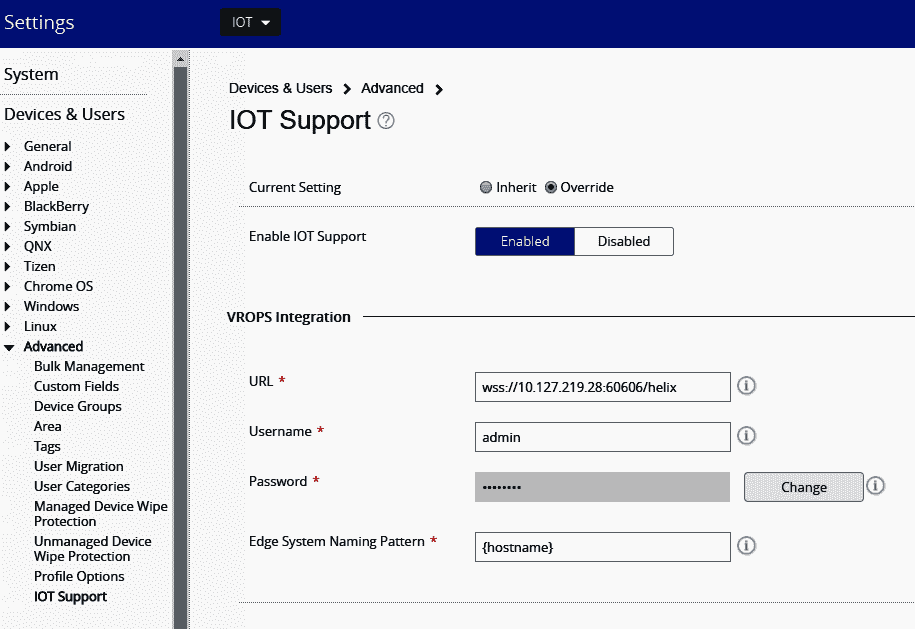
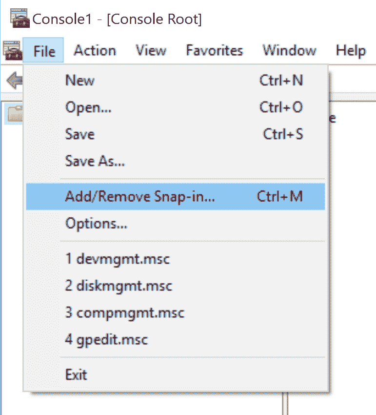
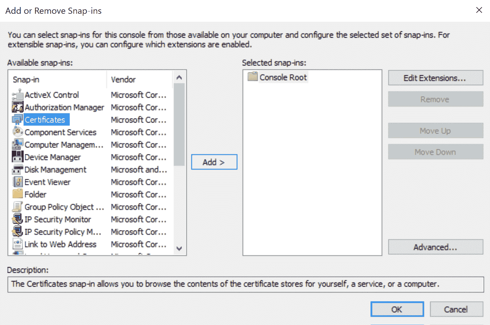
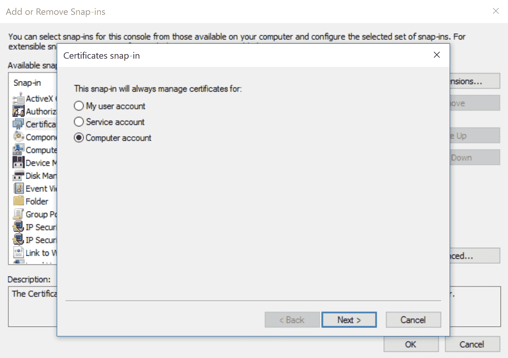
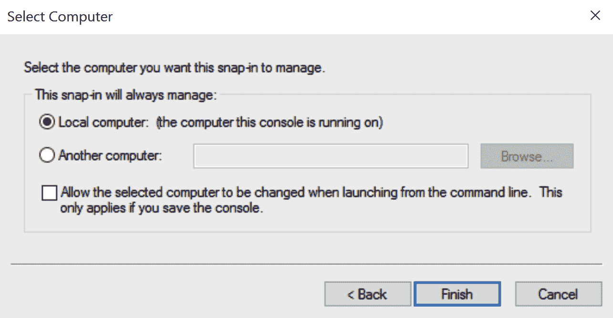
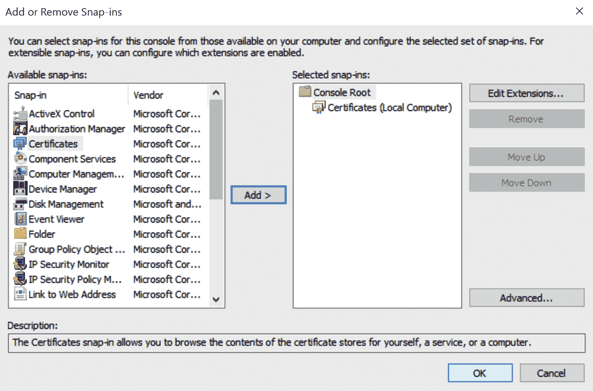
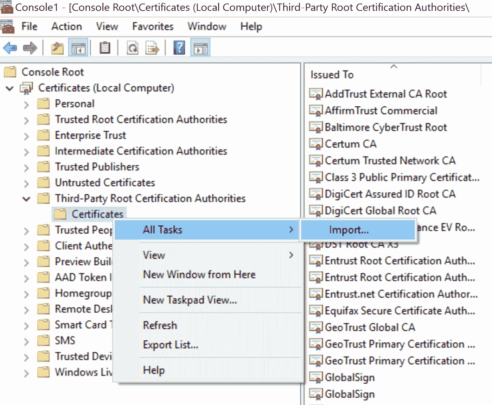
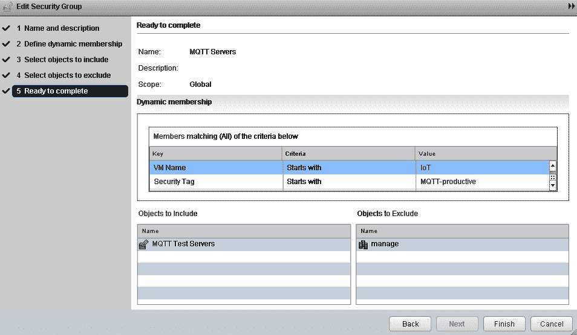

# 物联网网络转型

本章将简要介绍**软件定义数据中心**（**SDDC**）如何跨越多个数据中心并进入混合服务提供商，无论物理基础设施如何，都可以拥有分布式的数据和应用程序。数字化转型正在改变商业模式，**物联网**（**IoT**）在这一转型中发挥着关键作用。商业增长正在加速，探索以现代数据中心快速将新产品和服务推向市场的方法，这种数据中心可以提供推动创新和增长所需的敏捷性、安全性和可扩展性。我们将了解客户在物联网实施中寻找的核心需求。

我们将了解为什么物联网（IoT）对健康、研究、科学和零售客户如此关键，因为他们的应用和数据将从数据中心到云再到边缘设备得到利用。我们还将通过了解如何在边缘设备上管理/处理大量数据，以及 VMware Pulse IoT 在不同垂直领域的用例，来探讨物联网网络转型的变化。

我们将涵盖以下主题：

+   物联网和机器学习（ML）

+   物联网需要混合云来超越区域边界进行管理

+   分布式网络

+   虚拟云网络下的安全

+   VMware Pulse IoT Center

# 技术要求

您可以从[`my.vmware.com/web/vmware/details?downloadGroup=PULSE_IOT_110&productId=751&rPId=23122`](https://my.vmware.com/web/vmware/details?downloadGroup=PULSE_IOT_110&productId=751&rPId=23122)下载 VMware Pulse IoT Center 1.1.0，以及从[`my.vmware.com/en/web/vmware/info/slug/networking_security/vmware_nsx_t_data_center/2_x`](https://my.vmware.com/en/web/vmware/info/slug/networking_security/vmware_nsx_t_data_center/2_x)下载 VMware NSX-T Data Center。

# 物联网

物联网用例存在于大多数行业中。它们可能对我们不明显，甚至可能对客户也不明显。物联网是一个工具，企业使用这个工具来实现更好的结果。他们在处理依赖于物联网工具的模式时是一致的：*摄取*、*分析*和*参与*。物联网解决方案*摄取*来自传感器和设备的数据，分析组件然后使用这些数据得出结论（*分析*），结果触发动作，使企业能够*参与*与基础设施或其客户的互动。

企业使用*摄取*、*分析*、*参与*来不断改进他们的产品和服务；这种主动或被动的反馈可能来自人类、计算机、卡车或生产线。市场上观察到的物联网用例可以分为三个高级 IT 价值管理目标：

+   持续客户参与

+   数字参与

+   新商业模式

让我们来看看一些这些用例：

+   治疗依从性允许医疗机构通过使用智能药盒来监控患者是否遵循他们的治疗方案

+   在保险行业中，智能检查允许使用无人机和图像识别来检查损坏

+   矿业公司使用预测性维护来安排重型基础设施的预防性维护，因为维护直接影响生产力

+   想象一下给你的车添加一个新的运动驾驶模式，就像在苹果商店或谷歌应用商店购买应用一样——这就是软件功能交付在汽车领域可以实现的

+   基于风险的定价推动汽车保险，使保险公司能够根据连接到车载计算机的设备测量的个人驾驶习惯来定价保险

+   自动结账，正如亚马逊和沃尔玛正在试验的，允许顾客购物无需排队

+   智慧城市在最近一段时间内一直是新闻的焦点。这些城市能够实现高效的能源消耗和更安全的道路

在每个用例中，都明显体现了“摄取、分析、参与”的理念。

# VMware Pulse

VMware Pulse IoT Center 是一个安全的企业级物联网设备管理和监控解决方案。您可以从边缘到云，管理、监控和确保物联网用例，弥合 IT 和 **操作技术**（**OT**）组织之间的差距，并通过 Pulse IoT Center 简化物联网设备管理。Liota Agent 在边缘系统中启用数据编排，自动检测边缘系统，并将边缘系统映射到连接的设备上，从而实现自动上载和配置**空中传输**（**OTA**）。它收集关于基础设施健康状况的遥测数据，并实时以高精度检测异常。它通过配置规则以灵活的包组合升级，管理任何边缘类型的软件 OTA 以及连接的端点。

通过创建分段的数据流，使用网络虚拟化提供对所有事物的完全可见性，它为物联网事物、网络、数据和人员提供安全性。我们首先必须发现客户痛点，这些痛点阻碍了他们的业务增长，并减缓了他们的整体流程。

# 与 VMware Pulse 相关的查询

以下是与 VMware Pulse 相关的查询

使用以下探询问题发现客户痛点，这些问题适用于大多数客户：

+   在设备 OTA（固件/软件更新）方面面临安全挑战

+   寻找远程、无人操作的物联网设备，例如，位于海洋中的油井平台

+   从测试到公司范围内实施的转变中遇到困难

+   寻找在本地部署物联网管理解决方案的选项，并拥有更多数据隐私控制权

+   网络中正在快速添加新的端点

+   IT 对物联网部署没有可见性或控制权

+   在物联网设备方面面临合规性挑战

+   有太多不同的专有管理工具

+   从连接的物品/硬件中获取指标面临的挑战

+   IT 需要一个允许与 OT 协调进行更改的解决方案

城市采用物联网解决方案的发现问题：

+   智慧城市或市政物联网项目包括哪些内容？

+   我们是否有计划增加摄像头监控以保护公民？

+   我们计划如何监控、管理和保护诸如摄像头和道路传感器之类的设备？

这里有一些针对采用物联网项目的医院的调查问题：

+   每年有多少医疗设备丢失？（据统计，大约 30%）

+   我们是否了解连接到我们网络的所有事物（硬件）以及它们是否安全？

+   我们是否考虑过跟踪我们的设备？这将解决一些关于它们位置和状态的知识痛点吗？

+   如果我们能监控我们的患者和医生的位置，我们能否利用这些信息来提高患者护理的质量？

+   目前医疗设备的预防性维护是如何进行的？

这里有一些针对采用物联网技术的设备制造公司的调查问题：

+   我们今天提供预防性维护服务吗？我们是如何做的？

+   我们如何确保我们用于机器（车辆等）内部的技术工作准确并报告正确数据？我们是如何保护它的？

+   我们能否为我们的客户更新软件设备 OTA？您是否给了我们的客户自己这样做的能力？

+   我们是否有智能工厂或工业 4.0（自动化和数据交换在制造技术中的当前趋势被称为第四次工业革命）项目？

+   实施工业 4.0 的最大障碍是什么？

+   如果我们能帮助监控、管理和保护异构物联网环境，会怎样？

+   如果我们能与 OT 合作以确保物联网项目得到管理和保护，会怎样？

# Pulse IoT Center 基础设施管理蓝图

OVA 基本上是一个包含三个**虚拟机**（**VMs**）的 vApp，这些虚拟机运行 Ubuntu 服务器。默认情况下，这些虚拟机的命名如下：

+   `mqttbroker`：这安装了来自`http://emqtt.io`的 EMQTT 代理

+   `iceapi`：这预装了 VMware Pulse IoT API 和 PostgreSQL

+   `iceconsole`：这包含带有所有依赖项的 VMware Pulse IoT Console

在部署期间，OVAs 将需要一些特定于应用程序的属性来帮助初始化自身。这些属性基本上用于配置每个虚拟机中的应用程序。

# 部署和配置 OVA

OVA 可以通过 vSphere 使用 vSphere UI 中的“部署 OVF 模板”或使用命令行中的 OVF 工具进行部署。在第一次启动虚拟机之前，请确保为主机启用了客户端操作系统定制，以便为每个客户端操作系统注入正确的系统和网络设置。

客户端操作系统定制向导如下所示：



部署还会要求输入一些属性，以帮助设备在一定程度上进行配置。添加一个 EMQTT 凭据（用户名、密码），以便在 VM 首次启动时，代理启动时使用此预置用户。这不是系统用户，而是客户端可以用来连接到代理的 EMQTT 用户。只能通过此选项配置一个用户名和密码。任何额外的用户都必须在登录到`mqttbroker` VM**.**后从命令行创建。用户名和密码长度应在 8 到 64 个字符之间。建议您将用户名保持为纯字母数字。此密码不用于任何内置的 Linux 用户账户。

同样，向导会要求输入物联网 API 和物联网控制台的密码。物联网 API 的密码将用于保护数据库和生成的证书。物联网控制台的密码仅用于生成的证书。用户名和密码长度应在 8 到 64 个字符之间。建议您将用户名保持为纯字母数字。此密码不用于任何内置的 Linux 用户账户。

我们可以使用 VMWare Pulse IoT API 和控制台作为输入，通过使用 MQTT 代理的公共 DNS 名称来生成 SSL 证书。这些值在证书生成过程中使用。该名称将包含在生成的 SSL 证书的 CN 和 SAN 部分。因此，在继续部署之前，有必要冻结域名，以防您需要继续使用带有自签名证书的服务器。

例如，以下是一些部署的功能：

+   EMQTT 用户名和密码为`vmwareiot`和`vmwareiot`

+   物联网 API 数据库和证书的密码

+   物联网控制台证书的密码

+   EMQTT 服务器的公共 FQDN：`demoemqtt.vmwpulse.com`

+   VMware Pulse API 服务器的公共 FQDN：`demoapi.vmwpulse.com`

+   VMware Pulse IoT 控制台服务器的公共 FQDN：`democonsole.vmwpulse.com`

+   时区设置可以保留为默认设置

通过导入向导配置的设置如下所示：



我们将学习关于特定于 Pulse IoT 中心的产品的安装和配置。部署需要按照以下顺序进行，以解决依赖关系：

+   VMware Pulse 设备管理套件

+   带有 Helix 适配器支持的 VROPs 套件

+   EMQTT 代理

+   VMware Pulse IoT 中心控制台（UI）

+   VMware Pulse IoT 中心 API 服务器

+   支持单点登录（**SSO**）的 vIDM

在部署 VMware Pulse IoT 中心组件之前，请确保在部署基础设施中所有计算和网络资源都可用，无论是 VMware OneCloud 还是 VMware vCenter。OVAs 默认没有启用防火墙或 iptables 规则，留待部署团队根据需要添加额外的安全强化或加固。

# 配置物联网支持

`projectice`是一个没有`sudo`权限的标准 Linux 用户，用于运行 VMware Pulse IoT Center 组件。VMware Pulse IoT Center 控制台、Hazelcast 和 VMware Pulse IoT Center API 服务器作为系统服务在此账户下运行。服务作为守护进程运行，以支持系统重启时的自动重启。此账户未设置密码，因此，只能通过另一个登录会话使用`sudo`或`su`进行本地登录。此用户仅限于 Pulse IoT API 的虚拟机和 Pulse IoT 控制台的虚拟机。EMQTT 代理虚拟机没有此用户。同时存在 root 账户，默认密码为`vmware`。所有默认密码在首次登录时都需要更改。

在安装之前，需要满足以下先决条件：

+   SSL 证书。

+   API、控制台服务器和 EMQTT 代理的有效域名。该名称应反映在 SSL 证书的通用名称和 SAN 中。

+   在启动虚拟机之前，在虚拟机上启用“来宾操作系统自定义”，以确保虚拟机配置了正确的主机名和网络设置。

+   虚拟机托管环境，如 vCloud 或 vSphere。

# OVA 中的虚拟机

`iceadmin`是一个具有`sudo`权限的管理员用户，主要用于 VMware Pulse IoT Center 组件的配置和管理。VMware Pulse IoT Center 组件通常是系统服务，`iceadmin`账户将根据需要用于安装/启动/停止/重启服务。这种服务管理需要一个具有管理员权限的用户。此账户的默认密码是`vmware`，不带引号。

安装后，需要在“设置”|“设备与用户”|“高级”|“IoT 支持”中启用 IoT 支持：



此部分应在安装 IoT API 服务器之后进行配置。VMware Pulse IoT API 注册来自 VMware Pulse Device Management Suite 的通知，以加快资源刷新的速度，而不是依赖于同步间隔。这有助于 Pulse IoT API 保持资源的合理精度。以下事件发生时，这些通知将从 VMware Pulse Device Management Suite 发送到 Pulse IoT API：

+   新设备已注册

+   设备已注销

+   设备更改其组织组

VMware Pulse Device Management Suite 和 Pulse IoT API 仅在设备属性更改标志在事件部分启用时，才尊重设备的属性更改通知，例如资产编号、设备友好名称、组织组 ID、用户电子邮件地址、所有权、操作系统、电话号码或设备 MCC。VMware Pulse Device Management Suite 仅支持组织组更改，这是在同一 OG 树内完成的，即在其子 OG 中。该事件在一段时间后通知给监听器。

在 Windows 服务器上安装 Pulse 设备管理套件控制台时，VMware Pulse 设备管理套件安装程序建议您启用 TLSv1.2。请确保启用 TLSv1.2，或者如果错过了此步骤，请按照之前概述的手动步骤执行。始终确认以下键已持久保存在注册表中。这是设备通知被通知到 VMware Pulse IoT API 服务器所必需的注册表条目。

检查以下 Pulse 设备管理套件物理服务器中的注册表键：

```py
"HKEY_LOCAL_MACHINE\\SYSTEM\\CurrentControlSet\\Control\\SecurityProviders\\SCHANNEL\\Protocols
 TLS 1.2 Client"
 Value name : DisabledByDefault
 Type : DWORD (32-bit) value
 Value : 0
 Value name : Enabled
 Type : DWORD (32-bit) value
 Value : 1
```

使用此注册表文件创建注册表中的设置，如果它们缺失。只需在 Windows 服务器上作为管理员用户右键单击文件并选择合并。如果 Pulse IoT API 使用自签名证书安装，请确保按照以下步骤将自签名证书的根 CA 证书添加到安装 Pulse 设备管理套件的计算机上 Windows 系统证书存储中的受信任根证书：

1.  从文件菜单中选择添加/删除插件...：



1.  从可用插件中选择证书，然后点击添加>：



1.  选择计算机账户并按下一步：



1.  确保已选择本地计算机。点击完成并按确定：



1.  在第三方受信任根证书颁发机构下的证书节点处，右键单击以导入证书：



1.  按照导入向导保存从浏览器保存的私有 CA 证书：



这将帮助在 Pulse 设备管理套件对 Pulse IoT API 进行 SSL 调用以发送通知时，SSL 验证成功。仅添加证书不会允许 SSL 调用成功，除非 VMware Pulse 设备管理套件 API 用于连接 Pulse IoT API 的主机名与为 Pulse IoT API 服务配置的实际证书相匹配。

VMware Pulse 设备管理套件需要连接到以下：

+   VMware Pulse IoT API 服务器，用于发送通知

+   VIDM（如果已配置）

如果通过 Windows 虚拟机内部路由可用，VMware Pulse 系统在`%SystemRoot%\drivers\etc\hosts`文件中为使用外部 DNS 名称的任一机器添加一个别名以避免往返。DNS 名称对于 SSL 验证发生很重要，因为每个这些服务器都是通过 HTTPS 调用的。

从 IOT 发布工件中的链接下载基于 VROPs 6.6 构建的 VMware Pulse 操作分析后端版本。要登录 VM，root 用户的默认密码将为空。因此，只需按*Enter*键，并在首次登录时设置新密码。此登录应从部署 OVA 的终端控制台进行。默认情况下禁用了 SSH。一旦部署并开机，请访问`https://<IP 地址>`上的 vROPs 实例 Web UI，它将引导您完成 vROps 的基本安装步骤。您可以选择安装/快速安装，并为 vROPs 实例提供密码。您将需要获取许可证密钥才能使用 vROPs。

# VMware Pulse 的物联网用例

企业考虑和实施物联网解决方案的主要动机是通过识别客户特定的物联网用例来提高业务生产力和内部效率。在考虑物联网用例时，我们关注可衡量的目标，以展示生产力和效率的提高。无论我们注意到哪里产生数据，我们都有数据摄取的能力。这可能是尚未解决的问题，因此企业还没有对数据进行任何操作。然而，当我们观察到摄取数据的机会时，我们应该考虑分析这些数据，并使用这些结果与客户或基础设施进行互动。

在边缘系统上安装 Liota 代理以启用数据编排，自动检测边缘系统并安装和配置 OTA，并将边缘系统映射到连接的设备。我们可以监控和收集关于基础设施健康状况的遥测数据，以高精度实时检测异常，并在可能的情况下设置规则以自动修复 OTA。

我们还可以管理任何边缘类型和连接端点的软件 OTA，设置规则以灵活的包组合自动升级/修复，并设置规则以自动修复 OTA。我们可以在物联网的各个方面进行安全防护——事物、网络、数据、人员，通过网络虚拟化创建分段数据流，并对所有事物拥有完全的可见性。

根据用例需求、环境和所需的坚固能力选择网关/服务器；我们具有选择 VMware IoT edge 运行在哪种硬件上的灵活性。

VMware Pulse IoT edge 通过使用我们信任的技术在边缘进行数据分析，支持新的分布式物联网架构。接下来，我们将深入探讨一些用例。

# 为联网汽车提供动力（汽车行业）

+   **业务问题**：客户在软件相关的联网汽车召回成本上升方面遇到困难。

+   **用例**：OTA 更新，运营分析。

+   **客户收益**: 通过部署安全补丁、组件升级和新服务 OTA 和实时更新，管理这些汽车的头单元和 ECU。从车辆组件收集遥测数据，并在实时分析以检测异常，并发出管理员定义的命令和警报。降低召回率并提高汽车的保修期，以增强客户满意度和长期忠诚度。

# 娱乐、公园和度假村

+   **业务问题**: 客户在其所有物业中部署了可穿戴设备和其它传感器，以更好地跟踪客户行为、减少等待时间并优化客户体验。然而，他们发现难以应对其物联网部署的碎片化和异构生态系统，这导致管理和运营成本上升。

+   **用例**: 资产跟踪、OTA 更新到 RFID 基础设施、运营分析。

+   **客户收益**: 通过提供一种远程监控设备并交付 OTA 更新的方法，降低维护这些连接设备和基础设施的成本。确保所有连接设备都安装了最新的安全补丁和固件更新。为所有访客提供黄金标准的客户体验，最大化可持续性，并提高整体的工作效率和运营效率。

# 智能医院（医疗）

医生希望通过解读数据并主动检测和治疗医疗问题，收集关键信息并在护理点实时访问患者的生命体征、诊断和影像。

+   **业务问题**: 客户的目标是提高患者、人员和设备管理的效率并消除错误。通过实施 RFID 跟踪，可以实现对所有参与者和设备的定位识别，从而实现这一目标。

+   **用例**: 资产跟踪、OTA 更新到 RFID 基础设施、运营分析。

+   **客户收益**: 管理、监控和保障作为 RFID 标签连接点的网关。实时提供 OTA 安全补丁。通过实时运营分析帮助深入了解设备生命周期。提高患者、人员和设备管理效率，消除错误，并在处理、资源配置和设备使用方面实现改进。

# 智能监控（高等教育）

+   **业务问题**: 大学希望提高校园内学生和员工的安全。大学计划部署 V5 系统智能摄像头，这些摄像头可以检测枪声、嗅到硫磺味等，以实时预防性地检测公共骚乱，如枪击和暴乱。

+   **用例**: 运营分析、资产跟踪、OTA 更新。

+   **客户收益**：管理、监控和保障作为 RFID 标签连接点的网关。提供实时 OTA 安全补丁。通过实时操作分析帮助深入了解智能摄像头设备生命周期。使校园对员工和学生更安全，并极大地改善应急响应。

# 智能仓库（零售行业）

客户希望通过自动化流程控制，以增加可见性并快速与供应商整理来料，为工人提供实时、免提的复杂组装说明访问。

+   **业务问题**：客户希望通过使用机器人来减少由于人为错误和疲劳导致的故障，从而在店内提高配送和发货流程的效率。他们将从管理配送中心和零售店的机器人开始，一个机器人用于扫描货架并识别缺货商品，另一个机器人用于为顾客寻找店内取货点。

+   **用例**：资产跟踪。

+   **客户收益**：管理、监控和保障所有部署的机器人，为所有业务单元的物联网项目提供一站式解决方案。在单一视图中管理所有物联网用例，并采用一致的方式管理和监控所有连接的设备。

# 火车互联网（交通和物流）

+   **业务问题**：客户希望通过能够维护他们的设备来消除/减少停机时间。

+   **用例**：实时设备监控，OTA 更新。

+   **客户收益**：实时监控物联网网关和连接的空气压缩机，以确定设备是否离线。向合作伙伴的网关提供操作系统和软件更新。

客户将拥有一个系统来远程监控空气压缩机和其它设备，通过与 VMware 合作将提高效率并降低成本。

# 金融行业

+   **业务问题**：创建未来的银行并改善数百个零售银行（如识别到达的客户和预测他们可能需要的服务）的客户体验。此外，分行经理每天在银行关闭前必须完成一系列任务（如保险库、出纳员抽屉等），但目前没有可靠的方法来确认每一步都已完成。

+   **用例**：实时设备监控，OTA 更新。

+   **客户收益**：远程管理和监控物联网基础设施（网关、传感器、信标、摄像头等），确保设备在线且安全。Pulse 提供了一个单一控制台来管理实现未来银行所需的多种物联网设备，并确保银行运营不受干扰。

# 智能天气预报

+   **业务问题**：客户希望使用物联网部署传感器以获取有关天气和季节性模式的更丰富数据，以便向公众以及进行研究。该局正在部署数千个气象监测站点，由于它们位于偏远、无人值守的地点，因此无法轻松集中管理或保护。

+   **用例**：单点管理、监控/警报、OTA 更新。

+   **客户收益**：为存在于多个气象监测站点的网关设备和相应传感器提供一个安全中央控制点。实时提供 OTA 安全补丁。通过实时运营分析帮助深入了解智能摄像头设备生命周期。能够成功从所有传感器获取标准化图像和集中化数据，为公众、气象科学家和国际合作伙伴提供气象监测、预报、趋势和警报。

# 物联网数据中心网络安全

物联网流量与数据中心网络流量不同，因为通信变得数字化，控制实例成为从本地数据中心到云的控制中心。

有三个新的大规模横向（东西向）流量区域：

+   **边缘计算**：即连接自动售货机的局域网

+   **数据中心内部**：不同应用程序、存储和数据库之间的不同目的（计费、分析、控制）

+   **跨数据中心**：数据中心中不同客户的应用程序之间的交互（订单、制造、运输）

带有新路径和新内容的新流量具有大量东西向敏感私有数据，而今天的应用程序被分散到数百个要么相同（负载均衡）要么互补（工艺链）的实例中，而每套数据收集都将由数据中心的不同应用程序多次（随时间）处理。它们的东/西向流量高度动态，因为应用程序实例的来去。这些应用程序经常更新，其中大部分敏感数据被处理和存储。我们应该准备自己，以防止、检测和在高动态环境中遏制漏洞。

我们可以应用以下策略和主动措施来避免任何安全漏洞：

+   **分布式防火墙（DFW）**：通过在接口处对每个实例进行微分段来保护和过滤每个实例。人们无法伤害他们无法触及的东西。

+   **客户内省**：观察每个实例中的数据和行为，通过发现症状并防止其执行来检测数据泄露或潜伏的恶意软件。

+   **网络内省**：在空中观察第 7 层网络流量以保护宝贵数据，并通过在跨越层级时关闭口袋来保护实例。随着我们将数据中心从购物中心转变为监狱，我们必须通过一个引擎自动化或失败整个流程，以获得并维持一致性。

+   **自动化修复**：我们发现被入侵的实例并通过进行客户内省立即将其隔离。

+   **自动化一致视角**：允许 OPS 从声明性视角在整个孤岛之间拥有整体视图。

# NSX 分布式防火墙

我们可以通过解耦网络和安全来在每个 vNIC 上部署逻辑防火墙。每个 vNIC 上的防火墙实例尽可能接近嵌入在虚拟机管理程序中的任何类型的 vSwitch，但不属于虚拟机。我们不会将流量从源移动到检查点，而是将检查点移动到流量的源，与网络基础设施无关，不影响服务器细粒度保护。

在 vNIC 上的分布式防火墙是正确的位置，并且完全集成以最有效地应用策略。集成意味着无论我们在哪里，无论我们走向何方——即使我们偏离轨道或改变方向——它仍然有效，因为它集成在虚拟机管理程序中。集成还意味着作为驾驶员或乘客，我们不需要承担责任来穿上我们的保护，我们无法忘记或避免它，因为它集成在虚拟机管理程序中。集成还意味着它在物理和功能上与一些传感器集成，并在正确的时间触发安全气囊。NSX DFW 通过基于 vCenter/活动目录规则集的抽象和自动化来定义服务组合器中的自动化。

# 自动化的先决条件

数据的动态来源代表系统和抽象层的状态和变化，抽象层将在更高层次上定义以响应条件和变化。我们使用 vCenter 和活动目录来表示特定解决方案中服务器和用户的信息。NSX 管理器中的服务组合器动态地将服务定义和 FW 规则转换为接口规则集，并将它们推送到下级。

我们拥有用于抽象的必要数据的 vCenter。NSX DFW 服务组合器帮助客户立即对变化做出反应，并在每个强制性和战术性动作中声明策略。管理员无法远程控制每个组件的动作，而是定义一个策略——一系列抽象规则和措施——以控制和遵循合规政策：



控制器反过来负责将策略转换为战术动作，并协调它们，同时保持监督，特别是在情况变化时，它们特别负责立即改变战术。数据中心中的每个组件都扮演其个别角色，这是由控制器分配的。我们应该从本地数据中心的视角自动化数据中心之间的流量以及所有 N/S 流量，或者，数据中心之间的流量是 N/S 流量。

如果部署或更改因必要的 N/S 防火墙规则集的更改而无法立即上线，那么自动化本地数据中心是没有意义的。N/S 防火墙可能会消耗其规则中的 VMware 对象，因为这些对象是动态的，当实例到来或离开时，不会触及 N/S 防火墙的规则集进行日常更改。NSX 安全组可以被第三方防火墙动态消耗，这些防火墙会自动更改其规则集对象。

# 混合云以实现规模和分布

物理视角难以管理，需要在数据中心之间进行逻辑、连贯的操作。本地数据中心的本地数据流可能不够大且冗余，无法扩展计算，这些计算可以分散到多个数据中心。

随着更多 N/S（以及 E/W）流量进入数据中心，物联网就绪的数据中心必须遵循特定的安全和可扩展性实践。我们还需要更多的数据中心间流量，以便第三方工具集成，以实现以下目标：

+   微分段

+   声明式管理

+   集成自动化

+   分布式扩展

+   SDDC 以实现一致的管理

通过虚拟化所有移动部件，我们可以实现端到端的自动化。

# 摘要

物联网（IoT）领域为联盟解决方案提供许多独特价值的新领域打开了大门。物联网有多种形式，例如智能恒温器、一个可穿戴的医疗设备，它可以监测患者的生命体征，或者一个智能自动售货机，它可以记住顾客喜欢的饮料。物联网是网络世界与物理世界交汇的地方。任何物联网解决方案都需要结合连接性、移动通信、管理、基础设施和安全，以及应用程序的生命周期。

客户需要一个基础设施，他们可以在其上构建物联网解决方案；然后他们需要在那个基础设施上配置和管理数百万个事物。这些事物会产生大量数据，因此客户还需要收集、存储和分析数据，从中获得有意义的见解，然后将这些见解转化为有价值的行动。我们通过提供物联网基本要素来实现这一点，使我们能够实现三个主要业务成果。

以下三个业务目标是：

+   管理数百万事物就像管理一个事物一样简单

+   利用相关数据将事物付诸行动

+   将物联网变为商业现实

在下一章中，我们将通过评估当前的内存大数据平台来学习如何利用现代大数据平台中的共享存储。我们将探讨大数据应用（如 Hadoop）如何适合虚拟化，作为这些平台内存功能的一部分，使它们减少对 I/O 和存储协议的依赖，这样我们就可以利用虚拟化的共享存储和基本的 VMware vSphere 功能来设计一个高度可用和面向性能的大数据平台架构。
