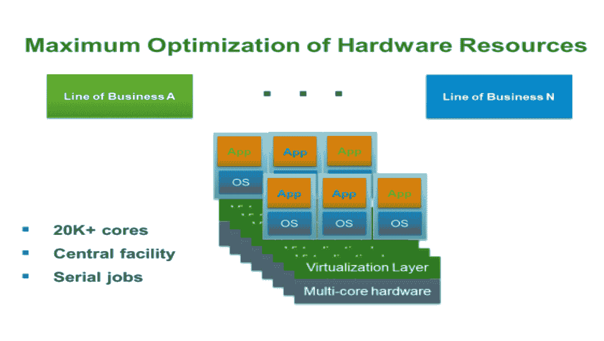
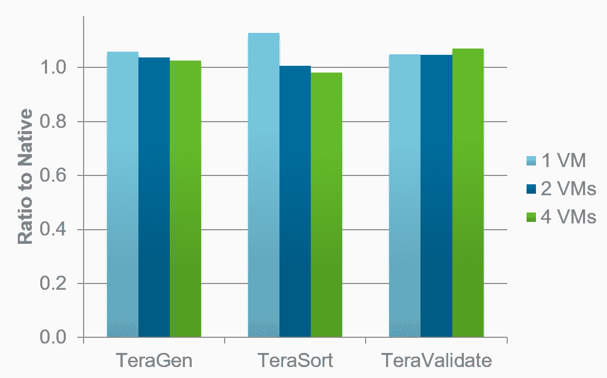
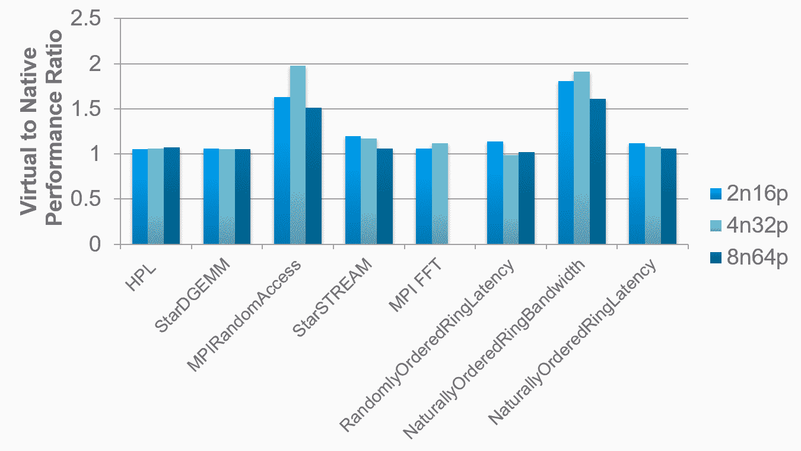
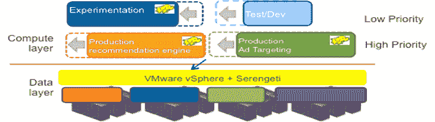
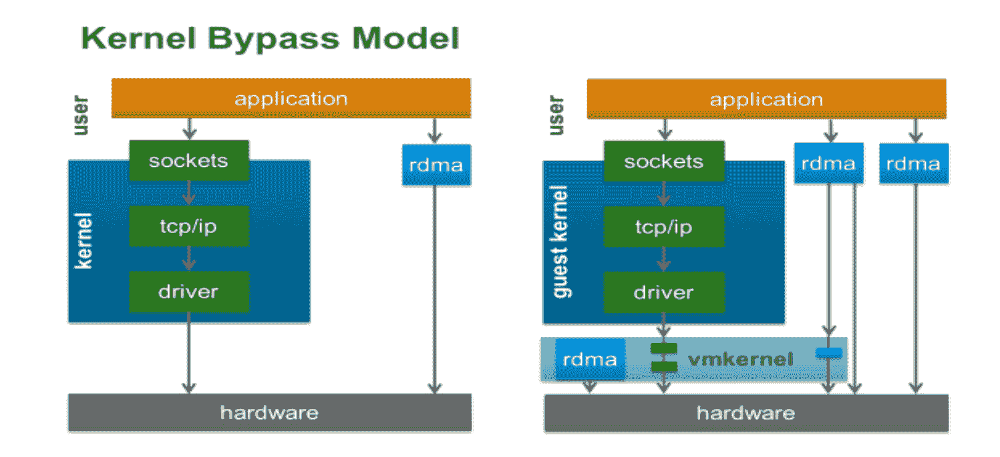

# 高性能计算

在本章中，我们将了解可以增强**高性能计算**（**HPC**）环境生产力的虚拟化特定方面。我们将关注 VMware vSphere 提供的能力，以及虚拟化如何提高科学生产力。

我们将探讨 vSphere 功能，例如**单根 I/O 虚拟化**（**SR-IOV**）、**远程直接内存访问**（**RDMA**）和 vGPU，以构建和满足研究、计算、学术、科学和工程工作负载的需求。

本章涵盖了以下主题：

+   虚拟化 HPC 应用

+   保证资源的多租户

# 技术要求

您可以从[`my.vmware.com/en/web/vmware/info/slug/datacenter_cloud_infrastructure/vmware_vsphere/6_7`](https://my.vmware.com/en/web/vmware/info/slug/datacenter_cloud_infrastructure/vmware_vsphere/6_7)下载 vSphere Scale-Out。

# 虚拟化 HPC 应用

本章描述了 VMware 在支持 HPC 应用方面的工作。第一部分详细描述了客户在使用 HPC 环境中的虚拟化所识别出的许多价值。第二部分展示了在 HPC 环境中部署虚拟化的几个示例，第三部分讨论了性能的各个方面，从检查性能的一些核心方面开始，然后转向吞吐量应用和并行分布式**消息传递接口**（**MPI**）应用的性能。还包括指向一些技术出版物，这些出版物将对考虑虚拟化其 HPC 工作负载的人感兴趣。

大多数 HPC 系统都是集群，它们是通过某些互连（如以太网或**InfiniBand**（**IB**））连接的计算节点集合。集群的大小可以从几个节点到数万个节点不等。HPC 集群的存在是为了运行 HPC 作业，而这些作业在集群中的放置由**分布式资源管理器**（**DRM**）处理。DRM 是中间件，它为 HPC 用户提供了一种在负载均衡的方式下将他们的 HPC 作业启动到 HPC 集群上的能力。

用户通常使用命令行界面来指定他们想要运行的工作或作业的特征，然后 DRM 将这些请求排队并调度作业在集群中负载最低、配置适当的节点上运行。有许多 DRM 可供选择，包括开源和商业的。例如包括 Grid Engine（Univa）、LSF（IBM）、Torque、**可移植批处理系统**（**PBS**）和 Slurm。DRM 也被称为批处理调度器。IB 是一种高带宽、低延迟的互连，常用于 HPC 环境中以提升代码/应用程序/作业的性能以及提高文件系统性能。IB 不是以太网，它不使用 TCP 或任何标准网络堆栈，并且目前只能通过 VM 直接路径 I/O（透传模式）在虚拟环境中使用。

本章的目的是不解释虚拟化是如何工作的。x86 虚拟化从 20 世纪 90 年代末在斯坦福大学发明时使用纯软件方法发展到目前的情况，即英特尔和 AMD 都相继增加了对虚拟化的更多硬件支持，如 CPU、内存和 I/O。这些硬件增强功能以及日益复杂的虚拟化软件，大大提高了对不断增长的工作负载的性能。这是一个重要观点，因为 HPC 人员经常听说，当 HPC 应用程序虚拟化时，其性能非常差，有些情况下甚至运行得非常好，甚至在大多数情况下非常接近原生性能。大规模整合不适合 HPC 环境，因此虚拟化对 HPC 的价值可以在其他地方得到利用。

现在我们将学习客户和我们自己研究确定的 HPC 虚拟化用例。由于 HPC 包括如此广泛的工作负载和环境，其中一些可能比其他一些更符合特定客户的需求。HPC 集群在所有主机上托管单个、标准的操作系统和应用程序堆栈，因为一致性使我们能够通过限制这些环境中的不同用例选项来轻松调度作业，例如需要从单个共享资源中服务的多个用户组。由于这些传统集群无法满足多个组的需求，它们鼓励在组织内创建分散的专用*计算岛*，这既低效又昂贵。

# 带有保证资源的多租户

客户希望利用现有的硬件和软件投资，例如在虚拟机管理程序或物理硬件上，以及直接部署到公共云的可行性。我们可以通过一个能够跨多个平台和多个云管理的服务自动化解决方案来解决这个问题以及相关的服务。该解决方案可以通过其自动化工具抽象核心任务来自动化所有手动过程的服务配置，然后管理这些自动化的访问和控制。自动化只有在将其与策略链接时才非常有用。基于策略的控制和治理为我们提供了控制驱动云解决方案的自动化应用的能力。云服务门户和目录为最终用户提供自助、按需访问授权服务。

所有现代 x86 系统都是**非一致性内存访问**（**NUMA**）系统，这意味着内存直接连接到系统中的单个 CPU 插槽。这意味着从本地插槽访问内存可以非常快，但访问连接到另一个插槽的内存将会较慢，因为请求和数据必须通过插槽之间的通信路径进行传输。这就是为什么它被称为非一致性内存访问。有时，工作负载在虚拟环境中比在裸机环境中运行得更快。这尤其适用于吞吐量工作负载，通常是由于 NUMA 效应。重点不在于虚拟化可以比裸机运行得更快，而在于虚拟化的性能对于某些高性能计算（HPC）工作负载来说可以接近裸机性能。实时迁移可以用来提高 HPC 环境的效率和灵活性。它还可以用来提高弹性。在传统的裸机 HPC 环境中，作业是静态放置的。考虑以下场景：应用程序 C 必须被调度，但目前没有足够的资源节点可供其运行。

在裸机环境中有两个选择：

+   应用程序 C 可以在队列中等待，直到应用程序 A 或 B 完成

+   可以终止应用程序 A 或 B 来为应用程序 C 腾出空间

这两种选项都会降低集群的工作吞吐量。在终止作业的情况下，如果运行的应用程序是昂贵的独立软件供应商的应用程序，那么工作量的损失可能会非常昂贵。在虚拟环境中，解决方案是使用实时迁移来移动工作负载，为应用程序 C 腾出空间。这种方法主要适用于这些作业相对长时间运行的环境。

让我们看看实时迁移的另一种用途：提高集群的整体吞吐量。考虑裸机环境中运行的两个作业。当第三个作业启动时，它可能比用户预期的消耗更多内存。这将导致系统上的其他作业绑定到交换空间，从而以负面方式影响这些作业的整体性能。**动态资源调度器（DRS**）可以在虚拟环境中解决这类情况：当第三个作业开始消耗所有可用内存时，DRS 可以将过载的虚拟机转移到负载较少的其他机器上，并帮助作业以期望的性能继续运行。

这种对特定组或部门资源使用保证的缺乏是裸机环境集中化的另一个障碍。例如，一个大型计算岛的所有者通常不愿意将他们的硬件资源捐赠给共享池，如果他们不能保证在需要时至少可以访问那些资源。DRS 提供了满足这一需求的能力。快照可以用来保存正在运行的虚拟机的状态，以防止硬件故障；当机器失败时，虚拟机被恢复，应用程序从快照被捕获的点继续执行。

在概念上，这与 HPC 中使用的检查点机制相似，但不同的是，我们不是从正在运行的操作系统提取进程的状态，这通常受到各种限制，而是利用虚拟机和底层虚拟平台之间存在的干净抽象。更高级的弹性方案（主动高可用策略）将使用底层系统的遥测数据来预测即将发生的硬件故障，然后主动将工作负载从可疑的主机迁移到其他主机，以避免应用程序中断。例如，一个运行重要作业的系统上的风扇故障或检测到的软内存错误率的增加，这可能会表明即将发生的硬内存错误概率增加。

尽管这种方法可能不会消除检查点的需要，但它可能会减少这种需要。更频繁的检查点操作和从检查点更频繁的恢复可以增加集群上的整体作业吞吐量。

# 关键用例 - 统一

一些管理人员的愿望是将他们的 HPC 工作视为*仅仅是另一种工作负载*，并从部分虚拟和部分物理基础设施转向全部虚拟基础设施，以获得更大的灵活性和可管理性。这是一个我们金融服务客户所做的部署的简单例子。在这种情况下，中央 IT 部门创建了一个共享的计算资源，可以向组织内的不同业务线出租虚拟集群。需要一段时间访问集群的组将收到一组虚拟机，而不是用于指定时间段的物理机器。

组织从中获得的益处如下：

+   **业务线**（**LOBs**）在需要时获得所需的资源

+   集群和集群节点可以根据 LOB 的应用需求进行规模调整（例如，大多数进程运行仅消耗每个作业的单个 CPU；它们是串行（不是并行）作业）

+   中央 IT 团队能够从可用的硬件中提取最大价值

+   硬件足够灵活，可以在各种作业之间共享，同时用户/工作负载之间保持安全合规

+   可以通过策略强制执行 LOB 之间的相对优先级，以确保（例如）具有硬截止日期的组获得底层硬件资源的更高*公平份额*：

为了在 vSphere 上为 HPC 应用程序实现最佳性能，配置平台级（有时是客户机级）调整以获得某些好处。由于 HPC 应用程序（与大多数企业应用程序不同）对延迟敏感，因此需要进行调整。这种敏感性可能存在于存储、网络或通信互连中。

虽然 VMware 的目标是为任何应用程序提供出色的即插即用性能，但 HPC 工作负载对我们来说相对较新，因此需要进行一些调整。我们已经开始通过配置 vCenter 高级虚拟机参数来自动设置一些可调整参数，我们打算在这些参数中运行对延迟敏感的工作负载。随着时间的推移，这种自动调整将变得更加全面。

客户最初的**网络文件系统存储**（**NFS**）基准测试体验直接指向了一些存储延迟问题。通过调整任何 NFS 数据传输背后的网络堆栈，我们能够直接提升应用性能，正如在裸机环境中所见。默认情况下，网络通过在企业环境中高效地通过大量数据来优化吞吐量。这意味着，当数据包到达时，它们可能不会立即被处理。

通常，在系统醒来并处理整个批次之前，允许少量消息积累。这减少了 CPU 的负载，但会减慢消息传递。在数据到达是性能瓶颈的情况下，更合理的是花费更多的 CPU 周期来及时处理每个到达的数据包。这在 HPC 工作负载中通常是这种情况。虚拟和物理网络设备都应该关闭合并，以实现这一变化。

在**传输控制协议**（**TCP**）堆栈的更高级别存在另一个合并级别（在客户机内禁用**大接收卸载**（**LRO**））——它应该被关闭。我们评估了一些实验的结果，以查看虚拟化引入的额外内存抽象级别是否对 HPC 应用程序性能有任何影响。

特殊情况是那些几乎没有空间数据局部性的应用程序。这包括那些无法有效使用其缓存的应用程序，因为它们不以常规方式访问内存，例如随机访问基准测试。除非在特殊情况下，通过在客户操作系统中使用大页面可以大大减少开销，否则它不会受到影响。关闭 EPT（AMD 上的 RVI）并恢复基于软件的页表方法也可以在这种特殊情况下有所帮助。由**国家安全局（NSA**）创建，它甚至更新随机内存位置时也没有局部性。

这些工作负载会引发大量的**翻译查找缓冲区（TLB**）缺失。由于页表缓存中的缺失频繁发生，如果该操作缓慢，应用程序可能会变慢。实际上，英特尔和 VMware 创建的 EPT 和 RVI 技术，尽管在硬件中实现，但在处理 TLB 缺失方面比 VMware 开发的较老**影子页表**方法要慢。通过使用更大的页面可以减少 TLB 缺失，因此在这些情况下关闭 EPT 或 RVI 可能会有所帮助。

事实是，EPT 和 RVI 在绝大多数情况下表现良好，但保持这个问题在心中是有益的。**高性能 LINPACK（HPL**）像其他高性能计算（HPC）应用程序一样很好地使用缓存，并获得了更好的性能。我们可以看到，对于这种应用程序类型，性能是一致的优秀。

这是针对运行需要大量线程的应用程序且虚拟机将跨越主机内多个 CPU 插槽的高性能计算（HPC）客户的虚拟化平台的一个重要方面。

ESXi 已经对**NUMA（非一致性内存访问**）有感知，这意味着当它运行虚拟机时，它会小心地将执行线程放置在托管虚拟机内存的相同插槽上，以便所有内存访问都是本地的。当一个虚拟机跨越两个插槽时，我们将类似的线程分布在两个插槽上，然后在本地插槽上分配内存以提供最佳性能。因此，即使虚拟机足够大，可以跨越多个插槽，它也不会看到底层硬件的 NUMA 特性。我们引入了 vNUMA，使 NUMA 拓扑对客户操作系统可见，然后可以根据这些信息进行自己的优化。这在性能方面可能非常重要。

# 高性能计算集群性能

**标准性能评估公司 OpenMP（SPECOMP**）是针对在多个节点上运行的**多线程应用程序**的知名高性能计算（HPC）基准测试套件。每个基准测试（例如，Swim）都列在 x 轴上。

对于每个基准测试，有三个比较对：一个用于 16 个 vCPU 虚拟机，一个用于 32 个 vCPU 虚拟机，一个用于 64 路虚拟机。默认-16 表示没有 vNUMA 支持的 16 路虚拟机的性能，而 vNUMA-16 表示相同的 16 路虚拟机，但启用了 vNUMA。

**与原生相比的比率**，越低越好：

图表显示了运行时间，所以越低越好。我们可以看到，在从默认值切换到 vNUMA 时，几乎所有情况下都会出现显著的运行时间下降。这对于需要广泛虚拟机的 HPC 用户来说是一个非常重要的功能。这些图表显示了在 ESXi 上运行的多种生命科学工作负载的已发布性能结果。

他们表明，这些以吞吐量为导向的应用程序在虚拟化时通常低于 5%的惩罚。来自客户的最新报告表明，这一类应用程序（吞吐量），不仅包括生命科学，还包括金融服务、**电子设计自动化**（**EDA**）芯片设计者和数字内容创作（电影渲染等），其性能下降都远远低于 5%。要实现这些结果，需要平台调整而不是应用程序调整。

我们有来自 EDA（芯片设计）客户的结果报告，他们在裸金属 Linux 节点上首先运行了他们 EDA 作业的一个实例。然后，他们在 ESXi 上运行了相同的 Linux 和相同的作业，并比较了结果。他们看到了 6%的性能下降。我们相信，通过额外的平台调整，这个数字会更低。

然后，他们进行了第二次测试，将四个应用程序实例在一个 Linux 实例中运行与四个运行相同作业的虚拟机进行了比较。因此，在这两种情况下，我们都有相同的工作负载。在这个配置中，他们发现虚拟作业比裸金属作业提前 2%完成。

HPCC 性能比率（越低越好）：

这种加速通常源于 NUMA 效应和操作系统调度效应。Linux 实例必须在四个作业实例之间进行资源平衡，并且还必须处理与这是一个多插槽系统相关的 NUMA 问题。

虚拟化将帮助我们获得以下优势：

+   每个 Linux 实例只需处理一个作业

+   由于 ESXi 调度器的 NUMA 意识，每个虚拟机将被调度到插槽上，这样 Linux 实例就不需要承受处理 NUMA 问题的潜在低效。

我们不必担心多个 Linux 实例和虚拟机消耗更多内存：**透明页面共享**（**TPS**）可以缓解这一点，因为虚拟机管理程序将在虚拟机之间找到公共页面并在可能的情况下共享它们。

# 标准的 Hadoop 架构

让我们了解一个标准的 Hadoop 架构：

+   **Hadoop 文件系统**（**HDFS**）：一个分布式文件系统，在 Hadoop 集群中连接到计算节点的本地磁盘上实例化

+   **地图**：将应用于从 HDFS（并行）读取的每一块数据的令人尴尬的并行计算

+   **减少**：将映射结果组合起来执行最终计算的阶段

最终结果通常存储回 HDFS。Serengeti（开源项目）的好处提供了部署便利性、多租户和可扩展性，可以向上或向外扩展。BDE 允许从 vRealize 蓝图触发 Serengeti，使得自提供指定大小的 Hadoop 集群变得容易：

前面的图显示了虚拟化的 Hadoop 环境。本地磁盘作为 VMDK 提供给虚拟机、Map 和 Reduce 任务，这些任务在每个 Hadoop 集群节点上运行。

我们方法的新一代是其中有两种类型的 VM：计算节点和数据节点。数据节点负责管理连接到主机的物理磁盘和 HDFS。计算节点运行 Map 和 Reduce 任务。计算节点和数据节点之间的通信通过快速的 VM-VM 通信进行。

# 标准测试

这些测试是在一个 32 节点（主机）集群上运行的，该集群具有本地磁盘和 10 Gbps 以太网互连**。**最重要的点是运行了四种配置，每种配置都解决了相同的问题：

+   **配置 1**：一个 32 个主机的物理集群

+   **配置 2**：一个 32 个 VM 的虚拟集群

+   **配置 3**：一个 64 个 VM 的虚拟集群（每个主机有两个 VM，每个 VM 使用一半的硬件）

+   **配置 4**：一个 128 个 VM 的虚拟集群（每个主机有四个 VM，每个插槽上有两个，每个 VM 拥有四分之一的硬件资源）

我们使用常见的基准测试来评估 Hadoop 性能的各个方面。以下是虚拟运行时间与本地/物理/裸机运行时间的比率：

+   **TeraGen**：6%，4%，3%

+   **TeraSort**：13%，1%，-1%

+   **TeraValidate**：5%，5%，7%

通常，将问题分解成更小的部分并运行更多的 VM 可以使性能更接近本地。

在 MPI 应用程序中发现了广泛的延迟敏感性。**粒子网格 Ewald 分子动力学**（**PMEMD**）的应用程序是一个分子动力学代码，其中超过 40% 的 MPI 数据传输涉及单字节长度的消息。与此相比，**格子玻尔兹曼磁流体动力学**（**LBMHD**）代码的所有消息大小都大于 1 MB。第一个应用程序对互连延迟非常敏感，而第二个则不敏感，而是带宽限制。

每个应用程序都有其自己的与其他应用程序的进程流程的通信模式。进程/处理器编号显示在 *x* 和 *y* 轴上。在 *(x, y)* 处的数据点越暗，*x* 和 *y* 进程之间的数据传输就越多。PMEMD 模式显示每个进程与可用进程范围内的所有进程进行通信，但与附近/相邻进程的通信更多。有些算法中，显示的模式将是整个模式上的深色区域，表示所有进程之间有强烈的通信。

在 HPC 裸机环境中，绕过内核以获得最低延迟下的最佳带宽是很常见的，这对于许多 MPI 应用程序来说很重要。而不是使用标准的 TCP 网络堆栈（这会增加开销），**远程直接内存访问**（**RDMA**）设备，例如 IB，允许直接从应用程序启动和终止传输，而不使用主机 CPU 来传输数据：

我们可以为我们的虚拟环境选择模拟方式。我们可以通过 VM 直接路径 I/O 使硬件设备，如 IB，直接对虚拟机可见（前图中最右侧的**rdma**框），这将允许应用程序通过使用 ESXi 直接访问硬件，就像裸机案例一样。VM 直接路径 I/O 左侧的**rdma**框代表了 VMware 内部开发 vRDMA 设备的工作，这是一个虚拟化 RDMA 设备。

此设备将继续允许直接应用硬件访问进行数据传输，同时继续支持执行快照和使用 vMotion 的能力。这代表了一项持续的工作，将使 RDMA 方法可用于 ESXi 本身以及 ESXi 服务，如 vMotion、vSAN 和 FT。我们已经展示了使用 RDMA 传输的 vMotion 在性能上的显著提升。

# 英特尔测试了各种 HPC 基准测试

**高性能计算集群**（**HPCC**）：

HPC 挑战基准测试是多个基准测试的组合，用于测试各种属性以及 HPC 系统的性能。STAR-CD 是一种用于缸内分析的**计算流体动力学**（**CFD**）代码。这些是负责在多个节点上多进程运行的**消息传递接口**（**MPI**）代码。结果是在几个配置的小集群中：2 节点，16 个进程；4 节点，32 个进程；8 节点，64 个进程（在 HPC 领域，“节点”意味着“主机”）。即使对于这个旧配置，我们也展示了与原生环境的优秀一致性。英特尔应该关闭 EPT 或使用大页面大小以获得更好的 MPIRandomAccess。我们尚未探索自然排序的环形带宽以了解那里的问题。

HPCC 代表一套应用，例如覆盖 HPC 需求范围的基准测试。我们做得如此之好是非常积极的，即使这确实是在非常低的规模上。在我们查看 STAR-CD 的结果之前，查看应用程序的消息特性是有用的。

MPI 应用程序在进程之间执行两种类型的通信：

+   **P2P**：单个进程从另一个进程发送或接收数据

+   **集体操作**：许多进程共同参与，以某种模式之一传输数据

STAR-CD 交换的大多数 P2P 消息在 1 KB - 8 KB 范围内。我们将这些定义为中等大小的消息。随着节点数量的增加，更多的这些消息移动到 128 B-1 KB 范围内。这意味着随着节点数量的增加，互连延迟成为一个更重要的因素。对于集体操作，Star-CD 有一个非常明显的延迟敏感性，因为几乎所有消息都落在 0 - 128 B 范围内。

这两个图表的 y 轴是不同的。Star-CD 比集体操作更频繁地使用 P2P 消息。因此，尽管集体操作非常延迟敏感，但由于集体操作并不代表 STAR-CD 传输消息的大多数，延迟开销的整体影响可能有所减少。结果显示，使用 STAR-CD 运行 A 类模型（梅赛德斯汽车车身）时，速度慢了 15%，使用了 8 个节点和 32 个进程在双插槽节点上。

这对许多 HPC 用户来说是一个显著的减速，这就是我们继续在平台上表征和减少延迟开销的原因。我们下一组的结果是使用 VM 直接路径 I/O 与 QDR（每秒 40 吉比特）IB 和 ESXi。

在广泛的报文大小范围内，裸金属和虚拟化使用两种不同的传输机制：发送和 RDMA 读取。我们在虚拟情况下提供等效的带宽。

裸金属和虚拟环境在广泛的报文大小范围内**混合运行时间**（HRT，作为内核运行的运行时间）的延迟不同，并取决于许多因素。这些结果是通过 RDMA 读取操作生成的。使用**四倍数据速率**（**QDR**）（每秒 40 吉比特）IB 和 ESXi，虚拟化引入了大约 0.7 微秒的额外延迟，在最小报文大小上这是显著的，而对于较大的报文则不那么显著。

当在相同硬件上使用发送/接收操作时，ESXi 的延迟开销降至大约 0.4 微秒，并且对于大于 256 字节的报文大小，这种差异消失了。再次强调，这些开销对性能的影响将完全取决于感兴趣的具体应用的消息特性。用于计算的 GPU，称为**通用 GPU**（**GPGPU**），有令人鼓舞的结果。客户可能对英特尔在这一领域的加速产品，英特尔至强 Phi 感兴趣。

平台必须适当调整以支持这些应用所需的延迟，这是至关重要的。我们在平台上什么工作得好，什么工作得不好方面非常透明，以便客户能够准确了解虚拟化 HPC 工作负载和环境的值和挑战。

# 摘要

在本章中，我们讨论了虚拟化的特定功能，这些功能增强了 HPC 环境的成果。我们关注了超越通用虚拟化平台独特功能的特点，并探讨了虚拟化如何提高科学生产力。虚拟化对特定模拟或计算运行时间的影响可能不同，但计算部署的整体性能具有最佳吞吐量。

本书将帮助您将客户的运营目标与他们的商业目标对齐。读者将学习到 IT 组织如何通过解决关键商业问题，为他们的企业提供安全且灵活的数字基础，从而实现运营和商业目标。他们还将学习到 VMware 产品如何帮助客户向企业提供一致且稳定的 IT 性能。VMware 建议利用即插即用的超融合、虚拟化资源，以加速完全虚拟化基础设施的部署。

读者现在应该了解一个完全虚拟化的基础设施如何帮助他们加速部署，统一和简化操作、监控和 IT 管理，同时提高扩展能力。软件定义的基础设施使我们能够统一并简化操作、监控和 IT 管理，同时提高可扩展性。本书中提到的所有解决方案都采用了软件定义的方法来构建私有云，这种方法通过通用硬件将虚拟化扩展到整个数字基础设施（计算、存储和网络），这些硬件可以通过通用的现有工具和技能集进行管理。
