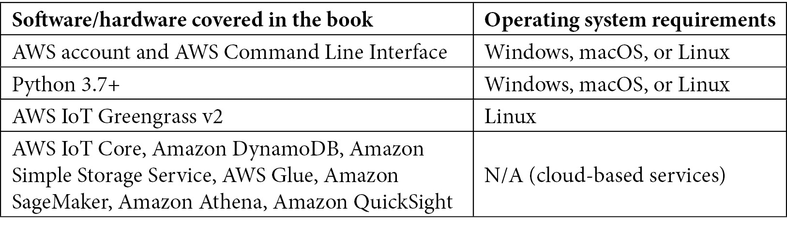

# 前言

**物联网**（**IoT**）已经改变了企业思考世界和与世界互动的方式。传感器可以测量高容量工业制造操作的绩效或偏远岛屿的日常环境健康。物联网使得能够在各种精度水平上研究世界，并在任何地方实现数据驱动决策。**机器学习**（**ML**）和弹性云计算加速了我们理解和分析物联网产生的海量数据的能力。通过边缘计算，数据分析和机器学习模型可以在数据生成的地方本地处理信息。

本书将教会你如何结合边缘计算和机器学习技术，以实现下一代网络物理结果。你将从发现如何使用来自亚马逊网络服务的软件，如 AWS IoT Greengrass，在边缘设备上创建软件应用程序开始。随着你的进步，你将学习如何从边缘到云处理和流式传输物联网数据，并使用亚马逊 SageMaker 对其进行训练。本书还展示了如何优化这些模型，并在边缘运行以实现最佳性能、成本节约和数据合规性。

在本书结束时，你将能够确定自己的物联网工作负载，将机器学习的力量带到边缘，并在生产环境中运行这些工作负载。

# 本书面向对象

本书面向负责将分析和机器学习支持的软件解决方案交付到边缘的物联网架构师和软件工程师。希望学习和构建物联网解决方案的亚马逊网络服务用户会发现本书很有用。要充分利用本书，需要具备在 Linux 上运行 Python 软件的中级经验。

# 本书涵盖内容

*第一章*，《利用机器学习的数据驱动边缘简介》，介绍了边缘的概念以及机器学习在边缘运行时的独特价值。它提供了消费者和工业环境中用例的高级概述。它为将指导本书动手活动的虚构场景设定了背景。

*第二章*，《边缘工作负载基础》，概述了设计边缘解决方案的关键考虑因素，并介绍了 AWS IoT Greengrass 的使用。

*第三章*，《构建边缘》，深入探讨了通过更高级的 AWS IoT Greengrass 使用来构建边缘解决方案的下一级细节，用于编写业务逻辑的软件组件。

*第四章*, *将云扩展到边缘*，介绍了如何使用原生云连接构建边缘解决方案，并通过互联网将软件部署到远程设备。它还介绍了 AWS 提供的软件组件，用于抽象化边缘功能的一般需求。

*第五章*, *从边缘摄取和流式传输数据*，介绍了如何对物联网工作负载进行数据建模以及为什么这很重要。它还介绍了在边缘收集、摄取和处理数据流的多种架构模式和反模式。

*第六章*, *在云上处理和消费数据*，解释了物联网与大数据技术的集成如何使云上实现高容量复杂数据处理。它还深入探讨了如何将数据处理设计模式从边缘扩展到云，以解锁高级用例。

*第七章*, *边缘的机器学习工作负载*，介绍了在物联网工作负载背景下机器学习的概念。它还深入探讨了机器学习工作流程的不同阶段，以及适用的设计模式和反模式。

*第八章*, *边缘的 DevOps 和 MLOps*，解释了如何利用 DevOps 和 MLOps 的概念来支持物联网工作负载，以实现从云到边缘的敏捷开发实践。

*第九章*, *大规模车队管理*，介绍了使用云原生物联网工具链进行车队管理的概念。它还深入探讨了在现实世界中大规模接入物联网设备的不同场景和机制。

*第十章*, *使用 AWS Well-Architected Framework 审查解决方案*，通过 AWS 多角度审查框架的关键教训和步骤总结，结束本书。它还针对从本书中学到的经验，为物联网架构师提供下一步行动的建议。

为了充分利用这本书

您需要一个运行 Windows、macOS 或 Linux 的个人电脑。这台电脑在终端中使用 AWS 命令行界面，通过网页浏览器使用 AWS 管理控制台。第二个基于 Linux 的系统充当边缘设备，并托管运行 AWS IoT Greengrass 的边缘解决方案。这个第二个系统可以是本地或远程的虚拟机，或者是一个实际的设备，如 Raspberry Pi。为了获得真实的物联网体验，我们建议使用带有 SenseHAT 扩展板的 Raspberry Pi 3B（或更高版本）来完成本书的动手实践部分。如果您没有硬件设备，可以使用 Ubuntu Linux 虚拟机。最终，您可以在有或没有第二个设备的情况下完成所有动手步骤。

使用 AWS 提供的云服务确实会产生一些费用。您需要访问 AWS 账户或自己创建一个。完成所有动手实践部分可能会产生高达 25 美元（USD）的账单。您可以选择跳过机器学习训练步骤以降低费用至 5 美元以下。



在本书编写时，AWS IoT Greengrass v2 不支持 Windows 安装。与边缘解决方案相关的动手实践部分仅适用于 Linux，不适用于 Windows。

**如果您正在使用本书的数字版，我们建议您亲自输入代码或从书的 GitHub 仓库（下一节中提供链接）获取代码。这样做将帮助您避免与代码复制和粘贴相关的任何潜在错误。**

# 下载示例代码文件

您可以从 GitHub 下载本书的示例代码文件，网址为 [`github.com/PacktPublishing/Intelligent-Workloads-at-the-Edge`](https://github.com/PacktPublishing/Intelligent-Workloads-at-the-Edge)。如果代码有更新，它将在 GitHub 仓库中更新。

我们还提供其他代码包，这些代码包来自我们丰富的书籍和视频目录，可在 [`github.com/PacktPublishing/`](https://github.com/PacktPublishing/) 找到。查看它们吧！

# 下载彩色图片

我们还提供了一个包含本书中使用的截图和图表的彩色图片 PDF 文件。您可以从这里下载：

`static.packt-cdn.com/downloads/9781801811781_ColorImages.pdf`

# 使用的约定

本书中使用了多种文本约定。

`文本中的代码`：表示文本中的代码单词、数据库表名、文件夹名、文件名、文件扩展名、路径名、虚拟 URL、用户输入和 Twitter 账号。以下是一个示例：“要使用 Amazon SageMaker Debugger，您必须使用三个额外的配置参数增强 `Estimator`：`DebuggerHookConfig`、`Rules` 和 `ProfilerConfig`。”

代码块按照以下方式设置：

```py
#Feature group name
weather_feature_group_name_offline = 'weather-feature-group-offline' + strftime('%d-%H-%M-%S', gmtime())
```

当我们希望您注意代码块中的特定部分时，相关的行或项目将以粗体显示：

```py
@smp.step
def train_step(model, data, target):
       output = model(data)
       long_target = target.long()
       loss = F.nll_loss(output, long_target, reduction="mean")
       model.backward(loss)
       return output, loss
    return output, loss 
```

任何命令行输入或输出都按照以下方式编写：

```py
$ git clone PacktPublishing/Intelligent-Workloads-at-the-Edge-
```

**粗体**：表示新术语、重要单词或屏幕上看到的单词。例如，菜单或对话框中的单词以**粗体**显示。以下是一个示例：请记住，当您在训练集群中使用多个实例时，所有实例应位于相同的**可用区**。 

小贴士或重要注意事项

看起来像这样。

# 联系我们

读者反馈始终受到欢迎。

**一般反馈**：如果您对本书的任何方面有疑问，请通过 customercare@packtpub.com 发送电子邮件，并在邮件主题中提及书名。

**勘误**：尽管我们已经尽最大努力确保内容的准确性，但错误仍然可能发生。如果您在这本书中发现了错误，我们将不胜感激，如果您能向我们报告，我们将非常感谢。请访问 [www.packtpub.com/support/errata](http://www.packtpub.com/support/errata) 并填写表格。

**盗版**：如果您在互联网上发现任何形式的我们作品的非法副本，我们将不胜感激，如果您能提供位置地址或网站名称，我们将非常感谢。请通过 copyright@packt.com 联系我们，并提供材料的链接。

**如果您有兴趣成为作者**：如果您在某个领域有专业知识，并且有兴趣撰写或为书籍做出贡献，请访问 [authors.packtpub.com](http://authors.packtpub.com)。

# 分享您的想法

一旦您阅读了《边缘智能工作负载》，我们很乐意听到您的想法！请点击此处直接进入此书的亚马逊评论页面并分享您的反馈。

您的评论对我们和科技社区都非常重要，并将帮助我们确保我们提供高质量的内容。
