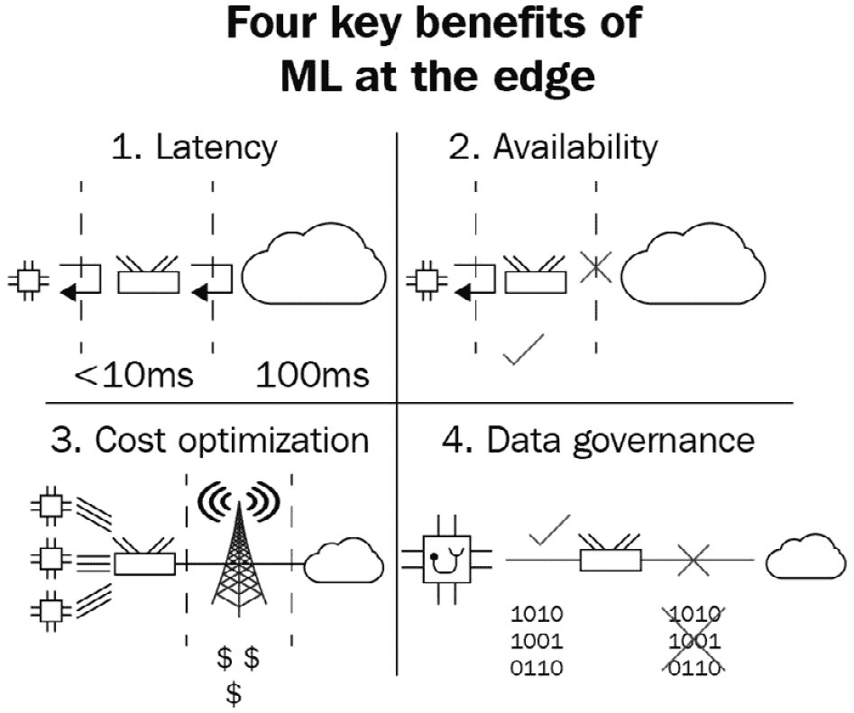
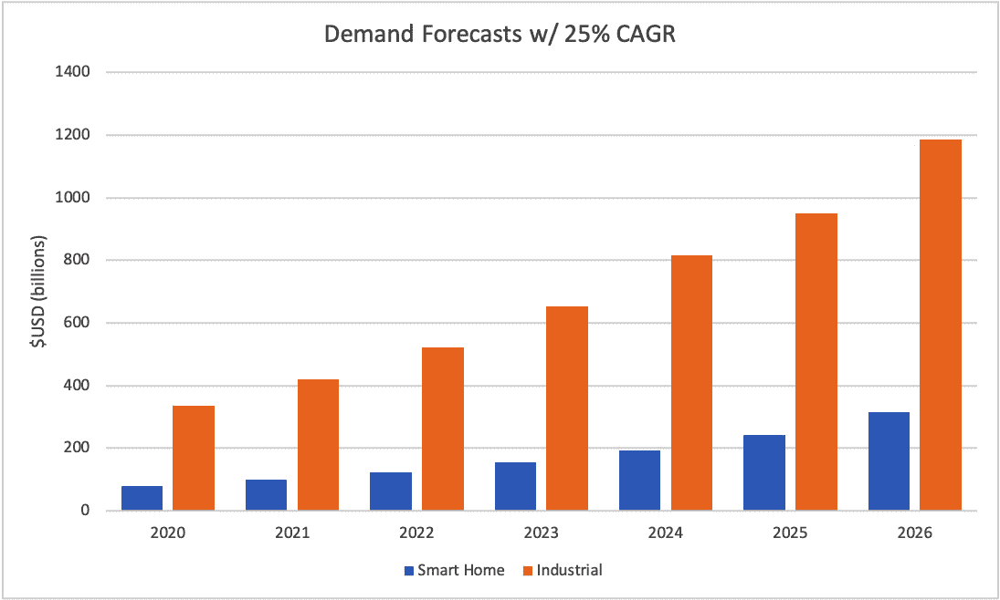
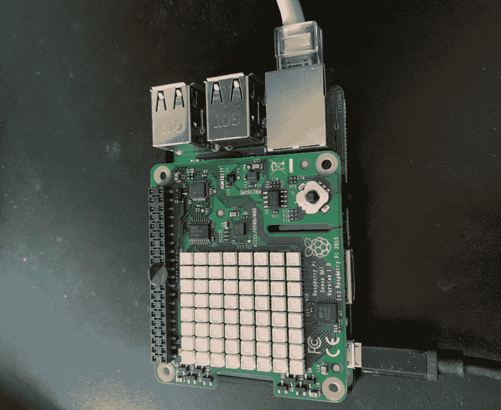

# 第一章：*第一章*：机器学习驱动的边缘数据驱动介绍

本书的目的在于分享针对在**边缘**（计算拓扑中与模拟接口数字和相反方向最近的空间）运行的解决方案的**端到端**（**E2E**）开发的规范性模式。具体来说，本书专注于那些**机器学习**（**ML**）技术带来最大价值的边缘用例，并教你如何使用**亚马逊网络服务**（**AWS**）提供的现代工具开发这些解决方案。

在本章中，你将了解实现网络物理结果的基础、挑战、角色和工具，这些工具是交付这些结果所共有的。本章简要介绍了智能家居和工业**物联网**（**IoT**）环境，并设定了贯穿本书的实践项目的场景。它将描述机器学习如何改变我们加速决策的能力，使其超越云。你将了解你将使用 AWS 服务（如**AWS IoT Greengrass**和**Amazon SageMaker**）构建的端到端项目的范围。你还将了解在进入第一手实践章节*第二章*，“边缘工作负载基础”之前需要满足哪些技术要求。

本章将涵盖以下主题：

+   活在边缘

+   将机器学习带到边缘

+   完成工作的工具

+   智能家居和工业物联网的需求

+   设定场景：现代智能家居解决方案

+   实践前的必备条件

# 活在边缘

**边缘**是计算拓扑中与模拟接口数字和相反方向最近的空间。第一代计算系统的边缘，例如 1945 年的**电子数值积分器和计算机**（**ENIAC**）通用计算机，仅仅是用来输入指令和接收打印输出的接口。除非直接站在它们面前，否则无法访问这些接口。随着 20 世纪 70 年代远程访问大型机计算的出现，计算的边缘进一步扩展到桌面上的公共终端，并通过同轴电缆连接到大型机。用户可以从实验室或工作站方便地访问本地大型机的公共资源，利用文字处理器或电子表格等高级功能完成工作。

人类使用边缘进行计算的发展随着计算能力的增加和尺寸、成本的降低而继续。我们每天使用的设备，如个人电脑和智能手机，为我们提供了无数的结果。一些结果完全在边缘（设备上）提供，但许多工作只有在连接到互联网时才能完成，并消耗远程服务。人类边缘工作负载通常是多样化的、多用途的，并处理各种动态性。我们不可能列出我们可以用智能手机及其网络浏览器做的一切！这些边缘的例子都有一个共同点，即人类既是计算任务的操作者也是接收者。然而，边缘不仅仅是人类和硅之间的接口。

边缘的另一个重要历史趋势是自主功能。我们设计计算机器来感知和行动，然后将它们部署在可能完全没有人类交互的环境中。自主边缘的例子包括在制造业装配中使用的机器人、卫星和气象站。这些边缘工作负载与人类驱动的负载不同，它们往往高度专业化、单用途，并且处理很少的动态性。它们执行一组特定的功能，持续执行这些功能，直到过时。以下图表提供了一个关于人类驱动界面和边缘自主机器随时间推移的简单历史：

![图 1.1 – 从 1950 年到 2020 年边缘网络物理接口的时间线]

![图片 B17595_01_001.jpg]

![图 1.1 – 从 1950 年到 2020 年边缘网络物理接口的时间线]

在今天无线通信、微控制器和微处理器、电气效率和耐用性的技术进步中，边缘可以无处不在。你们中的一些人可能正在海拔 10 **km** 的电子阅读器上阅读这本书，这是一种边缘设备，以 900 **kph** 的速度巡航。旅行者 1 号航天器是最远的边缘解决方案，在撰写本文时，距离地球 152 **AU** 仍在继续运行！这里的趋势是，随着时间的推移，通往边缘以及边缘本身的能力范围将继续增长，这条路径的长度（以及路径上的点数！）以及这些能力可以部署的偏远程度也将增加。以下图表说明了实体、计算能力和能力在计算拓扑结构中的扩展规模：

![图 1.2 – 从云到传感器的计算规模示意图]

![图片 B17595_01_002.jpg]

图 1.2 – 从云到传感器的计算规模示意图

我们的世界充满了传感器和执行器；随着时间的推移，越来越多的这些设备正在加入物联网。**传感器**是任何从我们的模拟世界获取测量值并将其转换为数字数据的组件。**执行器**是任何接受一些数字命令并将一些力量或变化应用于模拟世界的组件。有如此多的信息需要收集、推理和采取行动。以下原因使得开发边缘解决方案成为一个令人兴奋的前沿领域：

+   在我们今天的世界中，有大量的可能性和问题需要解决。我们需要更多的创新和解决方案来解决全球问题，例如联合国（**UN**）定义的 17 个可持续发展目标。

+   开发边缘解决方案的成本因素在下降，这降低了实验的门槛。

+   将解决方案开发置于任何有学习愿望的人可触及之处的工具正在成熟并变得更容易使用。

本书将教你如何使用现代边缘到云技术来开发边缘解决方案的软件，包括如何编写与物理传感器和执行器交互的软件，如何与其他本地设备和云交换数据，以及如何在边缘从先进的机器学习技术中获得价值。比“如何”更重要的是“为什么”——换句话说：*我们为什么以这种方式构建解决方案？*本书还将解释构建良好架构的解决方案的架构模式和技巧，这些解决方案将超越特定技术和工具的时代。

实施细节，如编程语言和框架，随着流行度、必要性和技术突破而出现和消失。我们构建什么以及我们为什么以特定方式构建它们的模式经得起时间的考验，并将为你的许多未来项目提供服务。例如，1995 年*设计模式：可重用面向对象软件元素*由*Gamma*、*Helm*、*Johnson*和*Vlissides*所著，尽管作者当时使用的工具已经发展，但至今仍在引导软件开发者。我们，作为作者，不能将自己与这些伟大的思想家或他们的优秀书籍相提并论，但我们将其作为我们如何撰写本书的一个例子。

## 边缘解决方案的常见概念

为了本书的目的，我们将扩展边缘的定义，将其定义为任何在云、数据中心和互联网骨干之外运行的物理-数字解决方案的组件。边缘解决方案的例子包括控制家庭中智能灯泡的无线电开关、在采矿地点记录拖拉机拖车的工作周期和发动机遥测数据的传感器、为地铁通勤者提供通道的旋转门、在大西洋中漂流的气象浮标、使用新**增强现实**（**AR**）游戏中的摄像头的智能手机，当然还有旅行者 1 号。在数据中心运行以保持服务器冷却的环境控制系统仍然是边缘解决方案；我们的定义旨在突出那些远离全球计算拓扑**重力**的组件。以下图表显示了在此计算拓扑中，距离数据中心重力更远的地方发生的计算示例：

![图 1.3 – 不同距离的边缘示例

![img/B17595_01_003.jpg]

图 1.3 – 不同距离的边缘示例

**物理-数字解决方案**是指将硬件和软件结合在一起，以实现数字世界与模拟世界的互操作。如果模拟世界是我们可以测量现实并对其施加变化的属性集合，那么数字世界就是我们关于现实的捕获信息，我们可以存储、传输和对其推理。物理-数字解决方案可以是自包含的或闭环的，例如工业制造车间中的**可编程逻辑控制器**（**PLC**）或家庭中的数字恒温器。它可能自主执行某些任务，或者在本地行为者（如人或开关）的指导下执行。

因此，**边缘解决方案**是物理-数字解决方案的特定扩展，它意味着在某个时间点与其他实体进行通信或信息交换。它也可以在本地行为者或远程行为者（如网络服务器）的指导下自主运行。传感器为了满足需要提供数据的个人或作为输入驱动 PLC 或服务器上运行的代码来做出决策，从而提供自主功能。对寒冷的反应的模拟、人类故事是“我感觉冷，所以我将点燃火来取暖”，而数字故事可能看起来像以下在本地控制器上运行的伪代码来切换暖气：

```py
if( io.read_value(THERMOMETER_PIN) < LOWER_HEAT_THRESHOLD ) {
     io.write_value(FURNACE_PIN, HIGH);
}
```

我们将进一步定义边缘解决方案，使其具备一定的计算能力，例如微控制器或微处理器来执行指令。这些解决方案至少包含一个传感器或执行器，用于与物理世界进行接口。边缘解决方案将在某个时间点与网络或物理世界中的另一个实体进行交互，例如人或其他机器。

根据这个定义，你现在最近的是什么边缘解决方案？

传感器、执行器和计算能力是边缘解决方案的最基本构建块。我们感兴趣开发的解决方案具有更多的复杂性。作为物联网架构师，你的责任是确保边缘解决方案安全、可靠、性能良好且成本效益高。良好架构的高标准意味着你需要精通网络、密码学、电气工程和操作系统等基础知识。今天的实际生产边缘解决方案集成了处理实时信号、通过多种传输媒体在系统之间通信、编写具有冗余故障恢复的固件更新以及自我诊断设备健康等功能。

所有这些都可能让人感到不知所措，而现实是，为边缘构建解决方案既复杂又繁琐。在实践中，我们使用专门定制的工具和耐用的模式，将投入的努力集中在创新和解决问题上，而不是从头开始和重新发明轮子。本书的目标是从功能性结果开始，逐步构建到端到端解决方案的全景图。沿途的学习将帮助你在构建下一个解决方案的旅程中受益。虽然本书没有涵盖该领域的每个主题，但我们将会抓住每一个机会，突出更多的教育资源，帮助你超越所涵盖的焦点领域。这就是边缘解决方案构建的全部内容！接下来，让我们回顾一下机器学习是如何融入其中的。

# 将机器学习带到边缘

**机器学习**是一项令人难以置信的技术，正在解决当今的问题。训练计算机处理大量信息的能力，用于分类新的输入和预测结果，与人类大脑所能完成的能力相媲美，在某些应用中甚至超过了人类大脑。因此，*机器学习定义了开发人工智能（AI）的机制*。

云端提供的强大计算能力显著缩短了训练机器学习模型所需的时间。数据科学家和数据工程师可以在数小时内而不是数天内训练生产模型。机器学习算法的进步使得模型本身变得更加便携，这意味着可以在计算和内存配置较小的计算机上运行模型。交付便携式机器学习模型的影响不容小觑。

在边缘运行机器学习模型有助于我们作为架构师提供最佳的边缘解决方案设计原则。通过在边缘托管一个便携式模型，与整个解决方案的邻近性带来了以下四个关键优势，具体如下：

+   第一，这意味着解决方案可以通过不等待远程服务器的往返延迟来最大化对依赖于机器学习推理结果的能力的响应速度。对即将发生故障的引擎发出的无数信号的延迟可以缩短到 10 毫秒（**ms**）而不是 100 毫秒。这种延迟程度可能决定了安全运行和灾难性故障之间的区别。

+   第二，这意味着解决方案的功能不会因网络拥塞而中断，并且可以在边缘解决方案与公共互联网断开连接的状态下运行。这为机器学习解决方案独立于云服务运行开辟了可能性。无论连接是否可用，都可以检测并预防即将发生的引擎故障。

+   第三，每次我们都可以使用机器学习模型在本地处理数据，并减少最终需要存储在云中的数据量，这样我们也能在传输过程中获得成本节约的好处。想象一下昂贵的卫星互联网服务提供商合同；在这种传输介质中，物联网架构师只想传输绝对必要的、以降低成本的数据。

+   第四，本地数据处理的好处还包括它使得必须符合法规、数据必须存储在本国或关注隐私问题（如医疗数据）的应用场景成为可能。用于挽救生命的医院设备可能需要尽可能多的智能监控，但运行时数据可能法律上不允许离开现场。

下图展示了这四个关键优势：



图 1.4 – 边缘机器学习的四个关键优势

想象一个可以携带机器学习模型的水下无人机，该模型可以对视频流中的图像进行分类。无人机可以在没有任何网络连接的情况下操作并对其图像进行推理，并且可以丢弃任何没有价值的图像。例如，如果无人机的任务是只带回独角鲸的图像，那么无人机不需要大量的存储空间来保存每个视频片段以供后续分析。无人机可以使用机器学习来分类独角鲸的图像，并且只保留那些回家的图像。随着存储成本的持续下降，但在宝贵的物料清单和空间考虑因素中，如这种边缘解决方案，携带一个可携带的机器学习模型最终可能导致显著的成本节约。

下图说明了这个概念：


图 1.5 – 潜水无人机概念示意图，处理照片并仅存储那些本地机器学习模型识别出主体为独角鲸的照片

本书将教授您从边缘解决方案常见的机器数据类型中训练机器学习模型的基础知识，以及如何将这些模型部署到边缘以利用结合机器学习能力和在边缘运行的价值主张。我们还将教授您在边缘操作机器学习模型，这意味着分析模型性能，以及如何设置基础设施以部署在云中重新训练的模型更新。

本书课程范围之外是对推动机器学习和人工智能领域的机器学习驱动的数据科学的全面深入研究。您不需要在该领域具有专业知识就能理解机器学习驱动的边缘解决方案的模式。了解如何使用软件中的**输入/输出**（**I/O**）缓冲区读取和写入数据就足以使用本书中使用的机器学习工具。

接下来，让我们回顾一下我们需要构建和使用的具体工具。

# 完成任务的工具

本书专注于 AWS 提供的工具，以在边缘提供基于机器学习的解决方案。AWS 以 2015 年推出的 AWS IoT Core 服务为起点，建立了一套物联网服务，以帮助开发者构建受益于云能力的网络物理解决方案。这些服务范围从边缘软件，如微控制器的 FreeRTOS 实时操作系统，到使用物联网核心和物联网设备管理的设备编队**指挥与控制**（**C2**），以及通过物联网 SiteWise 和物联网事件等服务从数据中提取可操作见解的分析能力。物联网服务与亚马逊的机器学习服务套件很好地相互作用，使开发者能够使用亚马逊 SageMaker 等服务摄取大量数据，用于训练机器学习模型。AWS 还使将训练好的模型作为端点托管起来以对实时数据进行推理或将这些模型部署到边缘进行本地推理变得容易。

您需要三种软件工具来创建和操作在边缘的有目的、智能的工作负载。接下来，我们将通过其一般能力和我们使用的具体工具（由 AWS 提供，用于构建本书中的项目）来定义每种工具。任何**信息技术**（**IT**）都总是有更多的复杂性，但就我们的目的而言，这些是本书将重点关注的三种主要工具类型，以便将智能带到边缘。

## 边缘运行时

第一款工具是一个用于编排您边缘软件的运行时。运行时会执行您的代码，并处理来自和您的代码之间的本地事件。理想情况下，这个运行时是自我修复的，这意味着如果任何服务失败，它应该通过故障转移或重启服务来自动恢复。这些本地事件可以是触发某些代码运行的硬件中断，定时事件从模拟传感器读取输入，或将数字命令转换为改变连接的执行器（如开关）的状态。

本书的主角是 AWS 服务**IoT Greengrass**。这是我们将会用到的第一种工具：边缘软件的运行时。IoT Greengrass 定义了一个打包的运行时，用于编排边缘软件解决方案，以及一个网络服务，用于管理运行在网关等设备上的边缘部署的集群。在 2020 年，AWS 发布了 IoT Greengrass 的新版本，即版本 2，它将边缘软件包重新架构为一个 Apache 2.0 许可证下的开源 Java 项目。在这个版本中，开发者获得了一个新的软件开发模型，用于编写和部署链接组件，使他们能够专注于构建业务应用程序，而不是担心复杂边缘到云解决方案的基础设施。我们将在下一章深入探讨 IoT Greengrass 的更多细节，并开始使用它构建我们的第一个应用程序。

以下图表说明了物联网 Greengrass 在边缘和云中发挥的作用：

![图 1.6 – 物联网 Greengrass 在边缘和云中发挥作用的示意图]

![img/B17595_01_006.jpg]

图 1.6 – 物联网 Greengrass 在边缘和云中发挥作用的示意图

## ML

第二款工具是一个机器学习库和模型。库规定了如何读取和消费模型，以及本地代码如何调用模型，也称为*进行推理*。模型是训练作业的输出，它将智能打包到一个更简单的框架中，用于将新的输入转换为推理。我们需要一个工具从一组称为训练集的数据中训练一个新的模型。然后，该训练模型将被打包并部署到我们的边缘运行时工具。边缘解决方案将需要相应的库和代码，这些代码知道如何处理新数据以对模型进行操作，从而得出推理。

我们第二种工具，即机器学习库和模型，由亚马逊 SageMaker 提供。SageMaker 是亚马逊为机器学习开发者提供的服务套件。包括用于准备数据以用于训练的服务、使用内置或自定义算法构建模型、调整模型以及将模型作为**应用程序编程接口**（**API**）端点管理或部署到任何需要运行的地方的服务。您甚至可以在没有任何先前经验的情况下训练一个模型，SageMaker 将分析您的数据集，选择一个算法，构建一组调整后的模型，并告诉您哪个模型最适合您的数据。

对于某些人工智能用例，例如预测数值序列和将人类手写文本解释为文本，亚马逊提供专门构建的服务，这些服务已经解决了训练机器学习模型的繁重工作。请注意，数据科学的教授超出了本书的范围。我们将使用在物联网解决方案中常见的流行机器学习框架和算法来交付结果。当我们使用框架和算法时，我们将提供理由，以便让您了解我们选择它们的过程。我们将在*第四章*“将云扩展到边缘”中介绍将机器学习资源部署到边缘的概念，并在*第七章*“边缘的机器学习工作负载”和*第九章*“大规模车队管理”中深入了解机器学习工作负载。

## 与边缘通信

第三种工具是与边缘解决方案通信的方法论。这包括将软件和更新部署到边缘硬件以及交换双向数据的机制。由于本书涵盖的边缘解决方案是与云交互的，因此需要一种在边缘和云之间传输数据和命令的方法。这可以是任何数量的**开放系统互联**（**OSI**）模型第 7 层协议，在物联网中的常见例子包括**超文本传输协议**（**HTTP**）、**消息队列遥测传输**（**MQTT**）和**约束应用协议**（**CoAP**）。

AWS 物联网服务套件满足这些需求，并在边缘运行的物联网 Greengrass 解决方案与我们将要在 Amazon SageMaker 中使用的机器学习能力之间充当桥梁。物联网核心是一项提供可扩展设备网关和消息代理的服务，适用于 HTTP 和 MQTT 协议。它将处理云连接、身份验证和授权，以及边缘和云之间消息的路由。"物联网设备管理"是一项用于大规模操作设备群的服务。它将帮助我们定义将运行相同软件解决方案的逻辑设备分组，并部署更新到我们的设备群。本书的大部分章节都将依赖于这些工具，并且重点关注在*第八章*，*边缘的 DevOps 和 MLOps*，以及*第九章*，*大规模设备管理*中的设备群管理规模。

在考虑这些工具的基础上，我们将接下来探讨那些具有机器学习能力的边缘到云解决方案需求最大的市场、人物角色和用例。

# 智能家居和工业物联网的需求

市场趋势和分析指出，物联网行业，尤其是工业物联网领域，将迎来快速增长。2020 年*Mordor Intelligence*报告《智能家居市场 – 增长、趋势、COVID-19 影响及预测（2021-2026）》预测智能家居市场将从 2020 年的 790 亿美元（**USD**）增长到 2026 年的 3130 亿美元。同样，2019 年*Grand View Research*报告《工业物联网市场规模、份额及趋势分析报告 – 按组件（解决方案、服务、平台）按最终用途（制造、物流与运输）按地区及细分预测，2019-2025》预测工业物联网市场将从 2018 年的 2140 亿美元增长到 2025 年的 9490 亿美元。在这两项研究中，估计的**复合年增长率**（**CAGR**）约为 25-30%。这意味着新产品、解决方案和服务在商业和最终消费者中取得成功的机会很大。

您可以在此处看到智能家居和工业物联网的市场预测图：

![图 1.7 – 智能家居和工业物联网的市场预测]



图 1.7 – 智能家居和工业物联网的市场预测

需要牢记的是，预测只是预测而已。只有当发明家和问题解决者，例如您和我，感到兴奋并创造出东西时，那些预测才会成为现实！理解智能家居和工业物联网解决方案未来的关键在于它们如何受到完整边缘到云模式的价值主张和本地机器学习推理的影响。我们可以反思将机器学习带到边缘的关键好处，看看这些市场的解决方案如何为创新做好准备。

## 智能家居应用案例

在智能家居解决方案中，功能标准是围绕环境监测（温度/电力消耗/发光），自动化状态变化（早上打开并在晚上关闭），以及引入以前不可能的便利性（在你回家的路上打开空调）。

使用该产品的首要人物是居住在部署解决方案的住宅中的最终消费者。次要人物是业主的客人、宠物、公用事业和家庭安全服务提供商。在产品设计层面，主要利益相关者是物联网架构师、安全工程师、设备制造商和数据科学家。智能家居产品在利用云中托管的人工智能和机器学习的力量时，已经探索并取得了关键的成功。

将机器学习能力部署到边缘，以下三种方式可以造福智能家居用例：

+   **语音辅助界面**：智能语音助手，如亚马逊的 Alexa，依赖于云来执行语音到文本的流程，以便处理命令并生成音频响应。在边缘运行语音识别模型可以帮助在网络不可用的情况下为消费者保留一些常用命令。为识别说话者并将其纳入响应中训练模型，可以增加个性化因素，并使这些语音助手感觉更加可信。

+   **家庭安全**：传统上，识别安全漏洞依赖于二进制传感器，如被动红外传感器用于检测运动或磁接近以检测门窗是否打开。这种简单的机制可能导致误报和未检测到的真实安全事件。智能安全的下一级别将需要复杂的事件检测，该检测分析来自训练模型的多元输入和置信度分数。本地模型可以自动评估消费者是否在家或外出，解决方案可以使用这一点来校准对事件的敏感性并升级事件通知。视频摄像头流是高数据率用例的典型例子，通过本地处理确定哪些片段上传到云端进行存储和进一步处理，这可以显著降低使用成本。

+   **可持续性和便利性**：简单的恒温器只能识别温度阈值被突破时的情况，并通过启动锅炉或空调系统来做出反应。传统的智能家居自动化通过读取天气预报、建立家中人员出勤的时间表，并遵守经济运行规则来改进这一点。机器学习可以通过分析更广泛的各种输入，通过推荐引擎确定如何最可持续地实现个人舒适目标，从而更进一步。例如，一个机器学习模型可能会识别并告诉我们，对于你特定的住宅，在晚上最可持续的降温方式是分 5 分钟连续运行 2 小时空调，而不是一次性运行 30 分钟。

## 工业用例

在制造、电力和公用事业以及供应链物流等工业领域，创新的共同点是创造有利可图的新的商业模式和降低现有商业模式的成本。为了通过 IT 世界进行创新，可以通过更好地理解客户需求和业务产生的运营数据来测试新的假设，从而实现这些目标。这种理解来自于使用更多已经收集到的现有数据，以及获取新的数据流，以解决导致有价值的新机会的假设。

根据 2015 年麦肯锡全球研究院的报告《释放物联网的潜力》，只有 1%的企业物联网传感器收集的数据被检查。使用数据的挑战在于使其对能够从中获得价值的人和系统可访问。当数据在边缘被摄取但存储在无法承担将其运送到云端进行分析的本地孤岛中时，数据几乎没有价值。这就是今天边缘解决方案可以通过本地计算和机器学习将数据转化为可操作见解的地方。

这里是工业物联网设置中边缘机器学习的三个用例：

+   **预测性维护**：工业企业在昂贵机械上进行投资和部署以执行工作。这种机械，如金属板材冲压机、**计算机数控**（**CNC**）路由器或挖掘机，在需要进行维护操作或更糟糕的是在工作时发生故障之前，只能以最佳状态运行有限的周期数。在保持机械处于最佳状态的同时，最大限度地减少停机时间和不必要的维护费用，是工业物联网和边缘解决方案的主要用例。通过在边缘训练模型并部署它们进行预测性维护检测，不仅可以帮助企业避免昂贵的停机事件，而且通过确保在没有高速或持续网络访问的远程环境中平稳运行，利用了本地机器学习的优势。

+   **安全和安保**：员工的身体安全和安保应该是任何企业的首要关注点。安全第一，这是当然的。机器学习驱动的边缘解决方案通过如**计算机视觉**（**CV**）模型等应用提高了工作场所的安全标准，这些模型可以检测到员工在没有必要的安全设备（如安全帽或安全背心）的情况下即将进入危险环境。类似解决方案也可以用来检测未经授权的人员进入（或试图进入）受限区域。当涉及到人类安全时，延迟和可用性至关重要，因此在边缘运行一个完全功能的解决方案意味着将机器学习能力与之一起带来。

+   **质量保证**：当人工操作员在生产线检查组件或成品时，他们会根据训练过的参考（每一批饼干都应该像这块饼干一样好吃）、与规格（厚度、光泽、铝箔强度）的比较，或人类感知（这两块木头是否有合理的相似木纹可以一起使用？）来了解哪些质量方面需要检查。机器学习创新了制造商如何捕捉人类质量检查员的直觉，以增加其操作规模和精度。通过在制造环境中部署如摄像头和计算机视觉模型等传感器，每次都可以对每个组件或最终产品（而不是任意样本）进行具有统计一致性的评估。这也为**质量保证**（**QA**）团队带来了好处，因为它将重点从检查重复性高且依赖于快速主观分析的任务转移到检查解决方案性能上。换句话说，我宁愿检查来自机器学习解决方案的 10,000 个通过检查的样本，而不是检查这 10,000 个样本中的每一个。在边缘运行这样的解决方案可以实现减少发送到云的整体数据量和最小化解决方案产生结果延迟的关键好处。

这些智能家居和工业领域的用例突出了使用机器学习驱动的边缘解决方案所能获得的益处。如果更多开发者将创新的新边缘解决方案付诸实践，那么对物联网市场增长的预测更有可能成为现实！让我们回顾一下智能家居解决方案（以及为某位潜在的建造者提供的免费产品想法），这将推动本书中的实践材料。

# 设置场景：现代智能家居解决方案

您将在本书的章节中构建的解决方案是一个模拟现代智能家居解决方案网关设备的解决方案。这意味着我们将使用智能家居中心的环境来收集传感器数据，分析并处理这些数据，并根据检测到的事件、日程安排和用户命令控制本地设备。我们选择智能家居环境作为本书解决方案的基础，因为它易于理解，我们预计许多读者都阅读过或亲自与智能家居控制器互动过。这使得我们能够将智能家居环境作为隐喻，快速通过实践章节，并进入精彩内容。如果您在本书中学习到的技能的目标扩展到其他领域，如工业物联网，请不要担心；本书中使用的科技和模式适用于智能家居环境之外。

现在，在我们深入探讨推动我们新智能家居产品的场景时，是时候戴上您的想象力帽子了！想象一下，您是 *Home Base Solutions* 的员工，这是一家专注于将新的智能家居设备推向市场的公司。*Home Base Solutions* 为首次使用智能家居产品的客户或寻求通过更换较旧的智能家居系统获得更好服务的经验丰富的客户提供最佳功能。

在下一个假日季节，*Home Base Solutions* 希望发布一款新的智能家居中心，为顾客提供他们之前未曾见过的产品：一款包含用于监控现有大型家电（如炉子或洗碗机）的传感器的产品，并使用机器学习（ML）向业主推荐何时需要维护。当机器学习模型检测到附加的设备监控套件数据中的异常时，会提供维护建议。即使公共互联网连接中断或拥堵，此功能也必须继续工作，因此机器学习组件不能仅在一个云服务器上运行。

您可以在此处看到 *Home Base Solutions* 设备监控套件的插图：

![Figure 1.8 – Whiteboard sketch of the Home Base Solutions appliance monitoring kit]

![img/B17595_01_008.jpg]

图 1.8 – Home Base Solutions 设备监控套件的白板草图

您在公司中的角色是物联网架构师，这意味着您负责设计描述端到端（E2E）、边缘到云的数据采集、摄取、存储、分析和洞察的软件解决方案。设计如何实现公司愿景，在中心产品中本地集成机器学习技术，以便没有对任何远程服务的持续运行硬依赖，这取决于您。

作为架构师，这也意味着你需要负责选择工具并设计如何操作这些设备的生产车队，以便客户服务和车队运营团队能够大规模管理客户设备。你不需要成为机器学习（ML）的**主题专家**（SME），这将是你的团队数据科学家介入的地方，但你应该设计一个与向机器学习训练作业提供数据以及运行在中心设备上的构建模型兼容的架构。

在研究了几周可用的软件技术、工具、解决方案供应商和云服务供应商之后，你决定尝试使用以下架构并通过 AWS 进行测试：


图 1.9 – 器件监控套件解决方案架构图

这有点复杂，对吧？如果这一切现在还让你感到困惑，请不要担心。我们将用本书的其余章节深入探讨这些工具，从入门级别介绍它们，介绍在生产中使用的模式，以及如何将它们结合起来以产生结果。每一章将专注于一个组件或子部分，随着时间的推移，我们将朝着这个整体概念努力。以下是对各个组件及其关系的分解：

1.  由智能家居中心设备控制的传感器和执行器，例如灯光及其开关或调光器。这些将通过 Raspberry Pi Sense HAT、与 Raspberry Pi 兼容的自己的硬件模块或通过软件组件进行模拟。

1.  *Home Base Solutions*创新家用电器监控套件。这些套件的数据流将在本书中作为软件组件实现。

1.  在智能家居中心设备上运行的流缓冲区，用于处理家用电器的运行时数据。

1.  存储在中心设备上的机器学习模型（每个家用电器一个），用于调用从家用电器监控套件流出的传入遥测数据。

1.  所有这些都是在运行在*Home Base Solutions*中心设备及其由 IoT Greengrass Core 软件部署和运行的组件的边缘软件解决方案中实现的。

1.  在物联网 Greengrass 边缘解决方案内部运行的组件通过 MQTT 消息和 AWS IoT Core 服务与 AWS 云交换消息。

1.  AWS IoT Core 的规则引擎使云解决方案的云侧能够执行**提取-转换-加载**（ETL）操作和消息转发。

1.  家用电器监控数据存储在 Amazon **简单存储服务**（S3）。

1.  Amazon SageMaker 使用家用电器监控数据作为训练和重新训练机器学习模型的输入。

1.  物联网 Greengrass 的云服务，利用物联网设备管理（IoT Device Management）的本地功能，如组和作业，将代码和资源部署到智能家居中心设备车队。

1.  训练好的机器学习模型作为资源部署回边缘进行本地推理。

1.  一种本地反馈机制，例如**发光二极管**（**LED**）或扬声器，向客户发出信号，表明已检测到异常，并建议进行维护活动。

1.  一种网络反馈机制，例如向移动应用程序推送通知，向客户发出维护活动的信号，并提供有关异常事件的更多上下文信息。

1.  客户支持和车队运营团队使用一系列工具，如车队中心、设备守护者和云监控，来监控客户设备的健康状况。

到本书结束时，您将构建整个解决方案，并拥有将类似解决方案应用于您自己的业务需求所需的技能。架构的模式和整体形状保持一致。具体设备、网络和结果实现的细节则因项目而异。

# 实践前的准备

为了跟随本书的实践部分，您需要访问两台计算机系统。

注意

在撰写本文时，AWS IoT Greengrass v2 不支持 Windows 安装。与边缘解决方案相关的实践部分是针对 Linux 的，不支持在 Windows 上运行。

## 系统 1：边缘设备

第一个系统将是您的**边缘设备**，也称为网关，因为它将作为一个或多个设备和解决方案的云组件的代理。在物联网 Greengrass 术语中，这被称为**Greengrass 核心**。此系统必须运行 Linux 操作系统的计算机，或 Linux 系统的**虚拟机**（**VM**）。AWS IoT Greengrass **版本 2**（**v2**）的运行时软件在撰写本文时依赖于 Linux。本书的建议是使用运行最新版本 Raspberry Pi OS 的树莓派（硬件版本 3B 或更高）。合适的替代方案包括 Linux 笔记本电脑/台式机、运行 Linux 镜像的虚拟化产品，如 VirtualBox，或云托管的 Linux 实例，如 Amazon **弹性计算云**（**EC2**）、Azure 虚拟机或 DigitalOcean 滴答。

我们首选树莓派，因为它提供了与物理传感器和执行器交互的最简单方式。毕竟，我们正在构建一个物联网项目！因此，我们将为使用虚拟环境来完成实践部分的读者提供代码示例，以模拟传感器和执行器的功能。用于覆盖传感器和执行器用例的推荐扩展套件是**树莓派传感器 HAT**。市面上有许多与树莓派兼容的扩展板和模块套件。本书中的用例可以根据需要完成或修改，以适应您所拥有的设备，尽管我们不会涵盖软件示例之外的替代方案。

您可以在此处看到带有 Sense HAT 扩展板的树莓派 3B 的视觉表示：



图 1.10 – 配有 Sense HAT 扩展板的 Raspberry Pi 3B

为了降低解决方案的物料清单（BOM）成本，我们将边缘通信的边界设置在网关设备本身。这意味着在本书的解决方案中，没有设备通过无线方式与网关通信，尽管在智能家居产品的实际应用中可能会使用某种无线通信方式。

如果你正在使用本节中概述的推荐组件，你将能够访问一系列传感器、按钮和反馈机制，这些机制模拟了智能家居网关设备与家中安装的连接设备之间的互操作性。从这个意义上说，设备之间的通信和智能家居中心之间的通信成为与这里展示的软件设计模式正交的实现细节。

## 系统 2：指挥与控制（C2）

第二个系统将是你的 C2 环境。这个系统可以是基于 Windows、Mac 或 Unix 的操作系统，你将在这个系统上安装和使用 **AWS 命令行界面**（**AWS CLI**）来配置、更新和管理你的边缘解决方案。IoT Greengrass 支持本地开发周期，因此我们将直接使用边缘设备（或通过第二个系统的 **Secure Shell**（**SSH**））开始，然后在后面的章节中专门使用 C2 系统进行远程操作。

这里是一个简单的需求列表：

+   一个 AWS 账户

+   AWS 账户中具有管理员权限的用户

+   第一个系统（边缘设备）：

    +   基于 Linux 的操作系统，如 Raspberry Pi OS 或 Ubuntu 18.x

        +   推荐：Raspberry Pi（硬件版本 3B 或更高）

        +   必须是 Armv7l、Armv8 (AArch64) 或 x86_64 架构

    +   1 `80`、`443` 和 `8883`

    +   通过包管理器安装和升级软件包的 `sudo` 访问权限

    +   （可选）Raspberry Pi Sense HAT 或等效的传感器和执行器扩展模块

+   第二个系统（C2 系统）：

    +   基于 Windows、Mac 或 Unix 的操作系统

    +   键盘和显示器

    +   已安装 Python 3.7+

    +   已安装 AWS CLI v2.2+

    +   可以在 TCP 端口 `80` 和 `443` 上访问公共互联网的网络连接

        注意

        如果你为这个项目创建新的 AWS 账户，你还需要一张信用卡来完成注册过程。如果你的公司的 AWS 管理员提供了新的开发者账户或沙盒账户，建议使用新的开发者账户或沙盒账户。不建议在生产服务运行的任何账户中尝试新的项目。

所有这些都可以说是：如果你有一台笔记本电脑和一块 Raspberry Pi，你很可能已经准备好继续了！如果你只有一台笔记本电脑，你仍然可以通过本地 VM 完成所有动手练习，而无需额外费用。

注意

Python 和 AWS CLI 的安装说明因操作系统而异。本书不涵盖这些工具的设置。有关安装和配置信息，请参阅[`www.python.org`](https://www.python.org)和[`aws.amazon.com/cli/`](https://aws.amazon.com/cli/)。

# 摘要

你现在应该已经有一个关于计算拓扑边缘和边缘解决方案组件（如传感器、执行器和计算能力）的工作定义。你应该能够识别机器学习技术对于在边缘运行的智能家居和工业用例的价值主张。我们创建了一家虚构公司，规划了一个新产品发布，并在本书的其余部分描述了您将交付的整体解决方案架构。

在下一章中，你将通过学习如何使用 AWS IoT Greengrass 在你的边缘设备上编排代码来迈出开发边缘解决方案的第一步。如果你的两个动手实践系统的先决条件已经准备好，并且你的 AWS 账户已经设置好，那么你就准备好了！

# 知识检查

在进入下一章之前，通过回答以下问题来测试你的知识。答案可以在本书末尾找到：

1.  网络物理解决方案和边缘解决方案之间的区别是什么？

1.  在它被发明的时候，汽车是一个自给自足的机械实体，不是一个网络物理解决方案或边缘解决方案。在汽车发展的某个阶段，它开始符合网络物理解决方案的定义，然后又符合边缘解决方案的定义。今天我们可以找到哪些符合我们边缘解决方案定义的汽车特征？

1.  电话一直是网络物理解决方案吗？为什么是或不是？

1.  边缘解决方案的常见组件有哪些？

1.  在边缘交付智能工作负载时，需要哪三种主要工具？

1.  使用在边缘运行的机器学习模型，可以实现边缘到云工作负载的四个关键好处是什么？

1.  任何智能家居解决方案的核心人物是谁？

1.  你能否为智能家居垂直领域再找到一个与机器学习边缘解决方案的另一个关键好处相关联的使用案例？

1.  任何工业解决方案的核心人物是谁？

1.  你能否为任何工业垂直领域再找到一个与机器学习边缘解决方案的另一个关键好处相关联的使用案例？

1.  机器学习边缘解决方案的物联网架构师通常是否负责部署的模型的性能准确性（例如，预测的置信度分数）？为什么是或不是？

# 参考文献

查看以下资源，以获取本章讨论的概念的更多信息：

+   *Erich Gamma*，*Richard Helm*，*Ralph Johnson*，和*John Vlissides*。1995 年。*设计模式：可重用面向对象软件元素*。*Addison-Wesley Longman Publishing Co., Inc.，USA*：

+   *智能家居市场 – 增长、趋势、COVID-19 影响和预测（2021-2026）*：

    [`www.mordorintelligence.com/industry-reports/global-smart-homes-market-industry`](https://www.mordorintelligence.com/industry-reports/global-smart-homes-market-industry)

+   *《工业物联网市场规模、份额和趋势分析报告，按组件（解决方案、服务、平台），按最终用途（制造、物流和运输），按地区，以及预测，2019-2025*：

    [`www.grandviewresearch.com/industry-analysis/industrial-internet-of-things-iiot-market`](https://www.grandviewresearch.com/industry-analysis/industrial-internet-of-things-iiot-market)

+   *释放物联网的潜力*：

    [`www.mckinsey.com/business-functions/mckinsey-digital/our-insights/the-internet-of-things-the-value-of-digitizing-the-physical-world`](https://www.mckinsey.com/business-functions/mckinsey-digital/our-insights/the-internet-of-things-the-value-of-digitizing-the-physical-world%0D)

+   *《17 项目目标》，联合国网站：

    [`sdgs.un.org/goals`](https://sdgs.un.org/goals)
