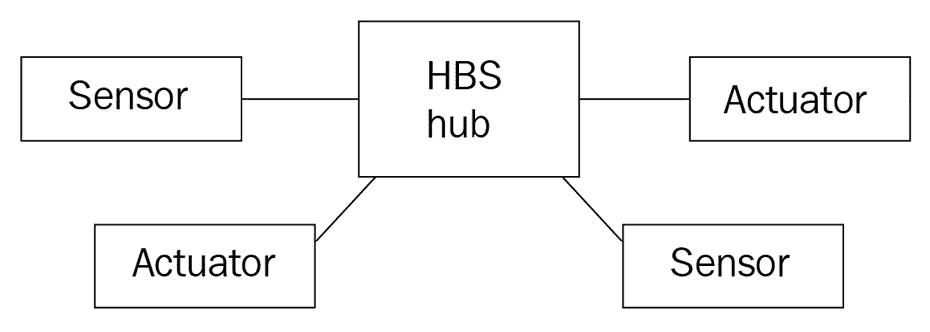
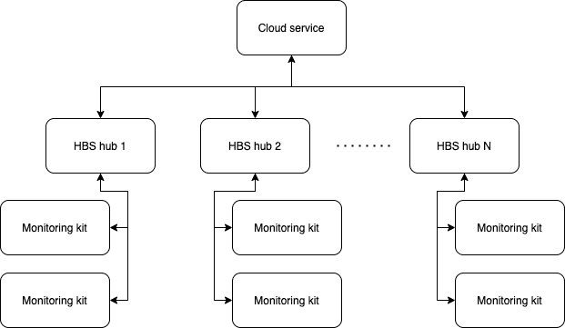
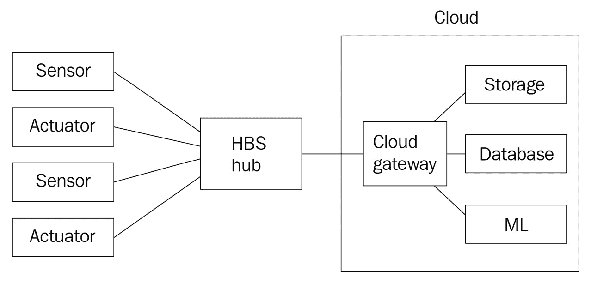
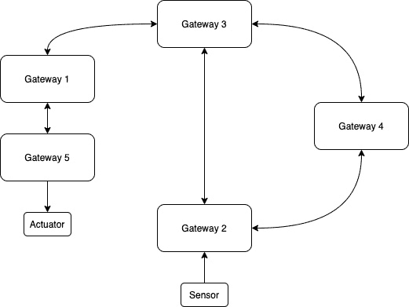
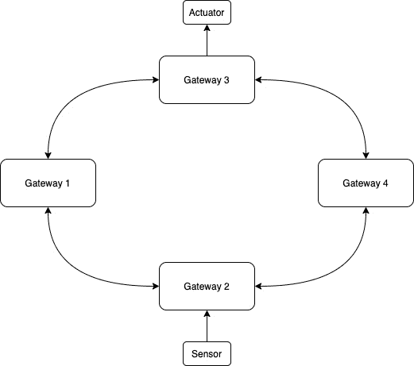
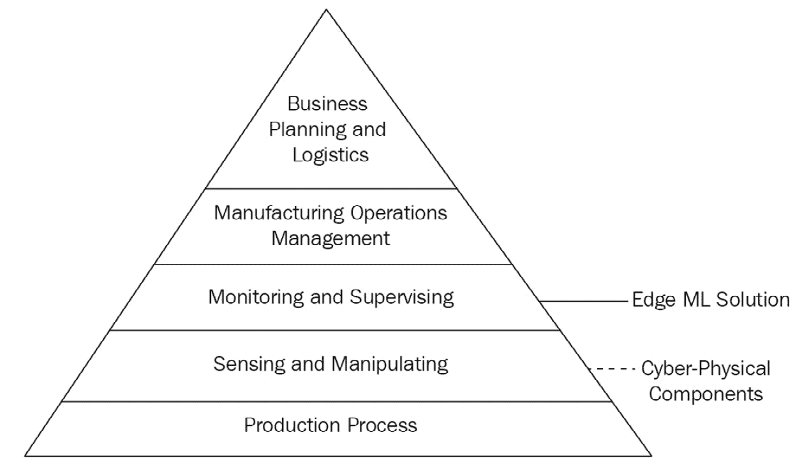
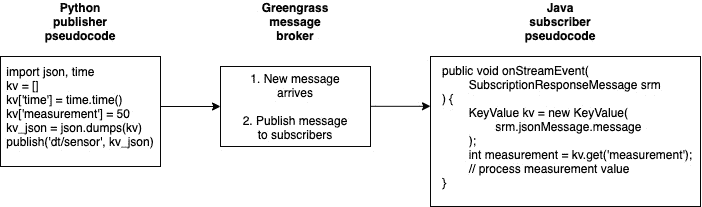
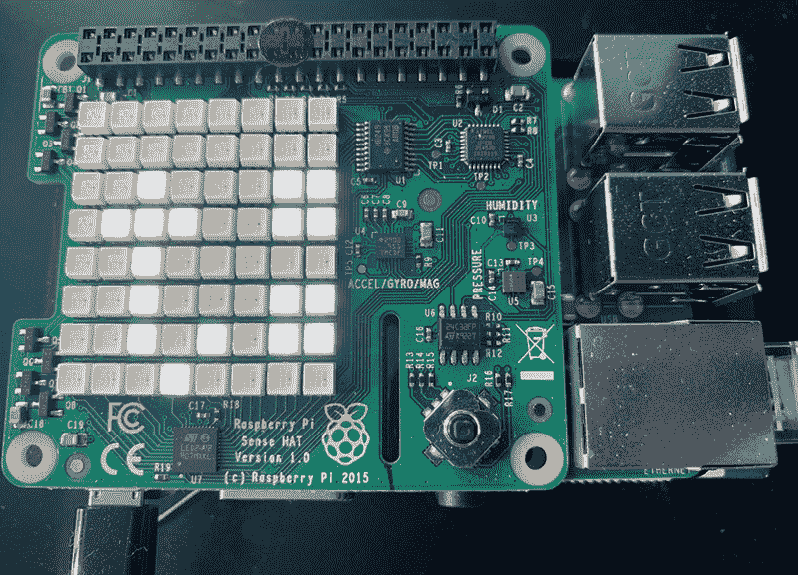
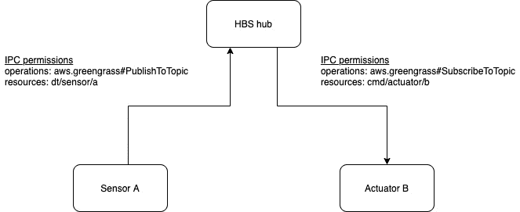

# *第三章*：构建边缘

在本章中，你将了解**边缘**解决方案的概念，例如网关，以及如何使用**AWS IoT Greengrass**作为强大的边缘设备与物理接口和叶子设备进行交互。本章的目标是开始使用 IoT Greengrass 编写和部署软件组件，以建立熟练度。这部分内容是本书许多动手实践项目的基础，也是理解我们如何构建边缘解决方案的关键。

我们将向您介绍 IoT Greengrass 开箱即支持的多种协议，并讨论构建边缘解决方案时常用的协议。此外，我们将回顾几个安全最佳实践，以便您学习如何保护您的边缘工作负载免受威胁和漏洞的侵害。本章以一个动手活动结束，该活动将连接您的第一个两个设备功能作为组件，无论您使用的是实际硬件还是一对模拟器。

在本章中，我们将涵盖以下主要主题：

+   探索边缘拓扑

+   审查常见标准和协议

+   边缘安全

+   连接第一个设备 – 在边缘感知

+   连接第二个设备 – 在边缘执行操作

# 技术要求

要完成本章的动手练习，您需要完成*第二章*中*边缘工作负载基础*的步骤，以确保您的边缘设备已设置好运行 IoT Greengrass Core 软件，并安装了`greengrass-cli`组件。

如果您还没有这样做，为了方便使用，您可能需要从书的 GitHub 仓库中克隆本章的资源。在*连接第一个设备 – 在边缘感知*部分中包含了一个步骤，允许您在[`github.com/PacktPublishing/Intelligent-Workloads-at-the-Edge/tree/main/chapter3`](https://github.com/PacktPublishing/Intelligent-Workloads-at-the-Edge/tree/main/chapter3)克隆仓库。如果您想提前浏览资源，现在就可以执行此步骤：

```py
git clone https://github.com/PacktPublishing/Intelligent-Workloads-at-the-Edge-
```

作为提醒，本书的动手步骤是以**树莓派**和**Sense HAT**扩展板为背景编写的。对于那些使用其他基于 Linux 的系统作为边缘设备的您，GitHub 仓库中包含了替代技术资源，并提供了如何替换它们的指导。

# 探索边缘拓扑

针对边缘构建的解决方案形态各异，大小不一。解决方案中包含的不同设备数量从一到多个不等。网络布局、计算资源和预算允许将驱动您的架构和实施决策。在一个边缘**机器学习**（**ML**）解决方案中，我们应该考虑运行 ML 模型的需求。ML 模型在为特定设备实例定制构建时工作得更准确，而不是一个模型支持同一设备的多个物理实例。这意味着随着边缘 ML 工作负载支持的设备数量增加，边缘所需的 ML 模型和计算资源数量也将增加。在架构边缘 ML 解决方案时，需要考虑四种拓扑结构：星型、总线型、树型和混合型。以下是每种拓扑结构的描述：

+   **星型拓扑**：**家庭基站解决方案**（**HBS**）中心设备和应用监控套件代表了边缘 ML 解决方案中的一种常见模式，称为**星型拓扑**。应用监控套件是单一用途的设备，它们将遥测数据报告回中心设备。这为套件的成本优化创造了几个优势，因为它们不需要捆绑所有必要的硬件来独立直接与云解决方案通信。它们也不需要任何计算能力或本地存储来运行它们自己的 ML 模型。星型拓扑中的中心设备在某种程度上充当服务器，因为它可以与套件交换数据，并代表它们执行更重的计算和存储任务。例如，叶设备或软件组件直接向其他实体发送消息，并将它们路由到正确的目的地。以下图表显示了在星型拓扑中运行的 HBS 产品设计示例：



图 3.1 – 带有中心设备和设备的星型拓扑示例

+   **总线拓扑**：在总线模式中，拓扑中的所有节点都连接到一条单独的共享线，这意味着一个实体发布的消息可以被共享总线的所有实体接收。总线模式源于计算机网络的历史，当时设备被用来物理地接入网络线路，每个设备都扩展了总线。虽然现在我们通常不将这种模式视为物理布线，但在边缘机器学习解决方案中，总线模式有一个逻辑应用。在一个解耦的解决方案中，例如我们正在构建的解决方案，一个实体，如软件组件或叶设备，可以通过使用主题地址发布消息，而无需指向任何其他特定实体。主题地址并不严格标识其他实体；其他实体需要订阅这样的主题地址，以便获取消息的副本。这样，中心设备在技术上是一个星形拓扑的中心；然而，实际上连接的实体之间相互交互的方式更像是总线。以下图示说明了总线概念，在一个平行宇宙中，HBS 通过设备监控套件、运行机器学习推理的本地服务器和连接到中心的总线灯来提供工业设备的监控：

![图 3.2 – 逻辑总线拓扑的示例

![img/Figure_03_02.jpg]

图 3.2 – 逻辑总线拓扑的示例

+   **树形拓扑**：虽然对于任何边缘机器学习解决方案来说，在功能上独立运行是一种好的做法，但我们不能忽视将我们的解决方案与更广泛的网络和云服务桥接的好处。在树形拓扑中，我们的中心设备只是树形图中节点的一个层次，其中集中式服务与我们的枢纽群进行通信。然后，每个枢纽负责特定数量的运行在本地星形模式下的叶设备和组件。在规模上管理我们的 HBS 产品需要我们考虑整个枢纽群。以下图示显示了云服务协调我们的枢纽群、HBS 枢纽设备群以及每个枢纽支持的本地设备监控套件之间的关系：



图 3.3 – 管理连接的枢纽群的总线拓扑示例

+   **混合拓扑**：如果我们的产品设计或中心设备预算不允许在边缘运行机器学习工作负载，而只是代表套件处理云连接，这将需要**混合**拓扑。在混合拓扑中，中心设备可能仅集中足够的资源以建立云连接，并在套件和云服务之间来回路由消息。在这里，混合定义了在云中运行进一步计算工作负载（如我们的机器学习推理）的额外拓扑复杂性。在这种情况下，基于云的机器学习工作负载对传入的遥测数据进行推理时，需要将一些设备消息子集传输到云。某些场景可能会选择减少中心设备的物料清单，以换取基于云的机器学习解决方案。当流量量处于较低端或当机器学习工作负载数量超过在单个网关设备上合理运行的数量时，这是有意义的。以下图显示了我们的虚构产品设计作为混合拓扑的修改示例：



图 3.4 – 带有远程计算和存储资源的混合拓扑示例

在研究网络拓扑时，有两个额外的模式是常见的，即网状和环形拓扑：

+   在**网状拓扑**中，节点可以与其他节点形成一对一或多对一的关系，并通过该连接网络交换信息以到达信息的目的地：



图 3.5 – 网状拓扑，其中网关 2 上的传感器穿越网状结构以到达网关 5 的执行器

+   在**环形拓扑**中，节点最多有两个相邻连接，并通过环形交换信息，直到达到目的地：



图 3.6 – 环形拓扑，其中从网关 2 读取的传感器数据通过相邻网关传输，以到达网关 3 的执行器

这些模式强调了去中心化，其中节点直接相互连接。虽然这些模式在物联网解决方案的更广泛范围内有其时间和地点，但在边缘机器学习解决方案中它们很少使用，在这些解决方案中，网关或中心设备以及云服务通常是最佳实践或直接要求。

当决定解决方案架构的特定拓扑时，首先考虑边缘的所有设备是否被同等加权，或者它们是否会与一个中心节点，如网关进行通信。针对边缘机器学习解决方案的消费产品设计倾向于在单独考虑边缘时采用星形模式。一个好的边缘解决方案应该能够在任何外部链接到更大的树形或混合拓扑被切断的情况下，仍然以星形模式运行。我们使用星形模式来实现 HBS 产品，因为中心设备将运行我们所需的任何和所有机器学习运行时工作负载。

物联网 Greengrass 被设计为作为星形实现的中心，并连接到 AWS 云的更大树形或混合拓扑。解决方案架构师可以选择运行物联网 Greengrass 的网关设备执行多少或多少计算工作。在下一节中，我们将回顾在边缘和边缘与云之间交换消息所使用的协议。

# 检查常见标准和协议

协议定义了与边缘解决方案交换消息的规范。这意味着消息的格式，它在线上的序列化方式，以及解决方案中两个参与者之间通信的网络协议。标准和协议帮助我们按照最佳实践进行架构，并在选择实现时进行快速决策。在深入研究边缘解决方案中使用的常见协议之前，首先，让我们回顾在信息技术和运营技术中使用的两个架构标准，以了解物联网 Greengrass 如何融入这些标准。使用这些标准作为基线将有助于设定协议使用的上下文以及消息如何在边缘解决方案中穿越这些模型。

## OSI 模型中的物联网 Greengrass

**开放系统互联**（**OSI**）模型定义了一个由七个网络通信层组成的堆栈，描述了每个层之间设备交换信息的目的和使用的媒体。在堆栈的顶部是第七层，即*应用层*，在这里定义了高级 API 和传输协议。在底部是第一层，即*物理层*，在这里使用电和无线电信号通过物理媒体传输数字位。以下是一个 OSI 模型的图示，展示了物联网 Greengrass 如何与各个层相匹配：

![图 3.7 – 带有物联网 Greengrass 层交互覆盖的 OSI 模型

![img/Figure_03_07.jpg]

图 3.7 – 带有物联网 Greengrass 层交互覆盖的 OSI 模型

在这里，你可以观察到我们的运行时编排器，物联网 Greengrass，从第四层运行到第七层。在物联网 Greengrass Core 软件中使用了高级应用程序和传输协议，用于通过 HTTPS 和 MQTT 等协议与应用程序消息与 AWS 云和本地设备进行交换。此外，核心软件中捆绑的库负责 TCP/IP 堆栈中的传输层通信，但随后将 OSI 模型中的进一步传输转交给主机操作系统。

注意，虽然物联网 Greengrass Core 软件从第四层运行到第七层，但部署到你的边缘解决方案的软件组件可能达到第一层。例如，任何物理连接到物联网 Greengrass 设备的传感器或执行器都可以通过在组件中运行的代码访问，通常使用低级库 API。

## ANSI/ISA-95 中的物联网 Greengrass

**美国国家标准协会/国际自动化协会标准 95**（**ANSI/ISA-95**）定义了企业控制系统之间接口关联的过程。此标准用于企业及工业解决方案架构中。它描述了另一个分层体系；这一层是系统控制的层级，并建议在此层级上做出决策的时间尺度。以下图表展示了物联网 Greengrass 和边缘机器学习解决方案如何融入整体图景：



图 3.8 – 在 ISA-95 模型上叠加物联网 Greengrass 层交互

在这里，你可以观察到物联网 Greengrass 主要适用于第三层，即控制系统的*监控与监督*层，以促进设备遥测数据的向上聚合、向下分发命令，并在监督职能中处理一些决策。物联网 Greengrass 适用于任何类型的边缘解决方案，无论是消费级产品还是促进工业机械的运行。虽然我们的 HBS 产品示例不是一个工业用例，但同样的模式适用，即我们的中心设备作为传感器监控设备的网关。

现在你已经了解了物联网 Greengrass 如何融入这些层级，我们可以回顾一下在相关层级中使用的常见协议。

## 应用层协议

应用层通信的例子包括从 API 请求数据、发布传感器遥测数据或向设备发送命令。这类数据与解决方案本身以及服务于解决方案结果的业务逻辑相关。例如，OSI 模型的其他层，如传输层或网络层，在部署的传感器报告环境温度为 22°C 时不会做出决策。只有你的解决方案运行的应用程序可以使用这些数据，并通过与应用层交互发送或接收这些数据。

在边缘和云之间进行通信时，最流行的应用层协议是用于请求-响应交互的**HTTPS**。IoT Greengrass 使用 HTTPS 与 AWS 云服务进行交互，用于获取元数据和下载组件资源，例如组件配方和代码以及训练好的机器学习模型等资源。此外，运行在边缘的自定义组件可能也会使用 HTTPS 与其他 AWS 服务、本地系统和其他远程服务器的 API 进行交互。

为了在边缘和云之间以及边缘解决方案内部交换消息，通常使用双向消息协议（也称为*发布-订阅*或*pubsub*），如 MQTT 或 AMQP。这些协议的优点如下：

+   它们使用有状态的连接来最小化握手连接的频率。

+   流量可以双向流动，无需任一端负责启动新的交换。

+   它们为每条消息提供最小的开销，这使得它们非常适合受限设备。

+   边缘的客户端可以发起这些连接，从而消除了网络防火墙规则需要允许入站连接的需求。

IoT Greengrass 使用 MQTT 协议以客户端-代理模型打开与 AWS IoT Core 服务的连接，以便将本地设备上传的消息传递到云中，从云中接收命令并将它们传递给本地设备，并在断开连接一段时间后同步状态。此外，IoT Greengrass 还可以作为通过 MQTT 连接到它的其他本地设备的代理。以下是一个 IoT Greengrass 设备（如 HBS 网关设备）作为客户端和代理的示意图：

![图 3.9 – HBS 网关同时作为 AWS IoT 的客户端和本地设备的服务器

![img/Figure_03_09.jpg]

图 3.9 – HBS 网关同时作为 AWS IoT 的客户端和本地设备的服务器

接下来是消息格式协议，它描述了数据在通过应用层协议发送时的结构化方式。

## 消息格式协议

如果一个消息协议，例如 MQTT，规定了如何建立连接以及如何交换消息，那么一个*消息格式协议*就规定了交换消息的形状和内容。你可以将电话作为类比。电话听筒代表了语音在两个方向上的发送方式，但参与者两端所说的语言必须被理解，这样说话才有意义！在这个类比中，MQTT 代表了电话本身（抽象掉了公共电话交换网络），而消息格式协议就是两端人们所说的语言。

对于任何两个相互交换数据的参与者，这些数据要么以二进制形式传输，要么会经过序列化和反序列化的过程。在边缘解决方案中常用的常见消息格式协议包括**JavaScript 对象表示法**（**JSON**）、Google **协议缓冲区**（**protobuf**）和**二进制 JSON**（**BSON**）。这些格式使得设备、边缘组件和云解决方案之间的互操作性变得更容易。在包含多种编程语言的架构中，这一点尤为重要。消息格式是一种抽象手段，对于构建解决方案至关重要。通过使用可序列化的消息格式协议，以下图显示了用 Python 编写的组件如何与用 Java 编写的组件交换消息：



图 3.10 – 使用 Greengrass 组件进行序列化和反序列化的示例

你可以将所有消息都发送为二进制数据，但每个接收者都会产生额外的开销，需要确定如何处理这些数据或实施严格的发送约定。例如，一个只发送摄氏度数值测量的传感器设备可以直接发送二进制数据。如果该系统永远不会改变，添加注释和序列化的价值有限。接收端可以硬编码来了解如何处理它，从而节省元数据、结构和带宽的开销。这对于刚性、静态系统以及传输成本必须是最优化的优先级的情况是有效的。

不规则数据，如图像、视频和音频，通常以二进制有效载荷的形式发送，但会附带一个头部来指示数据的类型。在一个 HTTP 请求中，*Content-Type*头部将包括一个值，如*text/HTML*或 MIME 类型如*video/MP4*。这个头部告诉接收者如何处理该消息的二进制有效载荷。

物联网 Greengrass 为组件提供的**进程间通信**（IPC）功能，以支持它们之间消息的交换，支持 JSON 消息格式以及原始二进制格式。在本章中，你将构建两个组件，它们使用 IPC 将 JSON 消息从一个组件传递到另一个组件。

注意

由于物联网 Greengrass 没有规定与边缘设备和系统交互的任何特定协议，你可以轻松实现包含与任何设备或任何协议交互的库的组件。

关于协议的关键要点是，我们可以使用与良好架构模式相同的或类似的通用协议。它们经过实战检验，文档齐全，易于实现，并防止我们陷入实现细节的循环中，我们的时间本可以更好地用于交付成果。在下一节中，我们将从高层次概述边缘机器学习解决方案的安全威胁以及缓解这些威胁的最佳实践和工具。

# 边缘安全

随着物联网安全成为热门话题并频繁成为头条新闻，你的边缘机器学习解决方案中的安全性必须是你的首要任务。HBS 的领导层永远不会希望看到他们的公司或产品名称因黑客攻击设备的故事而出现在新闻中。最终，安全性是关于与你的客户建立和维护信任。你可以使用如 STRIDE 这样的威胁建模练习来分析你的边缘系统中原子操作者，如端设备、网关和软件组件，以推理最坏情况场景和防止这些场景的最小可行缓解措施。在本节中，我们将介绍常见的安全威胁以及缓解它们的最佳实践。

## 端设备到网关

让我们从我们的边缘机器学习解决方案的终端部分开始，包括监控套件本身及其与中心设备的连接。这个部分的极端情况是，一个不健康的设备被错误地报告为健康。如果客户安装了产品，但它未能完成其宣传的功能，这将失去所有客户对产品的信任。为了缓解这种情况，监控套件的传感器读数必须是真实的。这意味着我们必须防止中心设备从欺骗套件接收虚假测量值。

在这里，最佳实践是使用只有套件和中心设备才能理解的某种形式的秘密材料。秘密可以是对称加密模型中的预共享密钥，也可以是非对称加密模型中的公钥和私钥对。如果套件可以使用秘密对发送到中心设备的测量结果进行签名，那么只有中心设备可以读取它们，并且它会理解这些结果只能来自与之配对的设备。同样，监控套件只会对消息采取行动，例如请求更新固件，如果这些消息是由它识别的配对中心设备签名的秘密。

为我们监控套件和中心设备之间的配对过程设计一个安全的设计模式，是将手动步骤任务分配给客户，例如按下物理按钮。这与称为**Wi-Fi 保护设置**（**WPS**）的 Wi-Fi 配对方法类似。如果客户必须手动启动配对过程，这意味着攻击者更难与套件或中心设备建立通信。如果攻击者能够物理访问客户的场所并使用自己的设备进行配对，这将是一个更大的安全漏洞，会损害我们未来的产品。

物联网 Greengrass 提供了一个名为*秘密管理器*的组件来帮助处理这种情况。秘密管理器组件可以通过 AWS Secrets Manager 服务从云中安全地检索秘密材料。您可以将工作流程构建到您的边缘解决方案中，例如监控套件的配对过程，以在您的设备之间建立可加密验证的关系。

## 网关设备

以下风险和缓解措施列表专注于运行物联网 Greengrass Core 软件的网关设备：

+   **安全连接到云端**：那么，您如何确保核心设备与云服务（如 AWS IoT Core）之间的连接是安全的呢？在这里，最坏的情况是交换的消息已被访问、篡改或发送到伪造的端点。最佳实践，也是物联网 Greengrass 内置的做法，是使用**公钥基础设施**（**PKI**）和相互验证。PKI 通过生成私钥和公钥证书来实现非对称加密。接收者使用公钥证书来验证发送者的消息是真实的。在相互验证模型中，连接的两端都使用这种结构在握手过程中证明对方的真实性。包含**可信平台模块**（**TPM**）的设备，其中包含安全存储的私钥，可以在不暴露私钥的情况下为 PKI 生成证书。

+   **入站网络连接**：网络上的任何设备都可能容易受到接收传入连接请求的影响。最坏的情况是，攻击者获得对系统的远程访问权限，并开始探测系统或执行代码。建立连接的最佳实践是拒绝入站发起的连接，并依赖出站、客户端发起的连接。

+   **启动篡改**：那么，如果设备在制造和客户收到它之间被物理修改，会发生什么情况呢？恶意代码可能会被加载到设备上，在客户收到设备并加入网络时执行。为了防止对设备的任何篡改，请使用 TPM（可信平台模块）设计您的硬件平台（或构建在现有平台之上，这些平台使用 TPM），TPM 可以用来验证加密磁盘在启动序列之间没有被修改。

## 边缘组件

接下来，我们将继续讨论在物联网 Greengrass Core 设备上运行的边缘解决方案组件：

+   **磁盘上的组件完整性**：那么，如果攻击者在组件部署到核心设备之后能够访问组件工件，会发生什么情况呢？最坏的情况是，有价值的知识产权被窃取或修改以改变组件行为。在物联网 Greengrass 中，所有组件资源，如工件和食谱，都存储在磁盘上作为 root。组件用于文件 I/O 的工作目录属于物联网 Greengrass 配置中的默认组件系统用户或部署期间指定的覆盖用户。最佳实践是限制除了解决方案组件所需之外的其他系统用户对 root 和组件系统用户访问的保护。如果需要在设备上使用额外的系统用户，他们不应属于与您的组件用户相同的组，也不应有权限提升到 root 配置的权限。

+   `RequiresPrivilege`标志然后对核心设备拥有完全访问权限。物联网 Greengrass 通过在您上传和注册组件时计算摘要（即，用于断言有效载荷真实性的数学求和）来防止这种攻击。核心设备将验证摘要与组件工件进行比较，如果工件被篡改，则失败。

+   **模型中毒**：那么，如果一个攻击者破坏了基于模型的决策过程，会发生什么？例如，一个使用本地机器学习模型来检测异常存在活动的摄像头输入，每周会使用新数据重新训练。如果攻击者理解了重新训练的循环，他们可以通过在一段时间内用有意的训练数据中毒来改变异常阈值以获得优势。为了减轻模型中毒，使用**人工审核验证**来批准用于训练的新标记数据。人工审核验证意味着你有一个机制让你的专家审查异常结果、标记结果或结果子集，作为模型质量保证。此外，你可以使用静态批准的训练数据集来测试后续模型的原始成功基准。

+   `*`通配符，或敏感主题，用于明确批准。

因此，本节介绍了一些高风险安全威胁和 IoT Greengrass 提供的内置缓解措施，以及你可以实施的一些最佳实践。边缘安全既复杂又复杂。你可以使用威胁建模来识别最坏的情况，并实施最佳实践来缓解这些威胁。在下一节中，你将继续作为 HBS 物联网架构师的角色，通过使用提供简单传感器到执行器流的组件来连接两个设备。

# 连接你的第一个设备——边缘感知

在本节中，你将部署一个新的组件，该组件提供了你的边缘解决方案的第一个感知能力。在我们的 HBS 设备监控套件和中心设备的情况下，这个第一个组件将代表设备监控套件的传感器。传感器将测量到的温度和湿度报告给中心设备，该设备连接了一个**供暖、通风和空调**（**HVAC**）设备。传感器数据将通过 IoT Greengrass 的 IPC 功能写入本地主题。稍后的章节将部署另一个组件，该组件将消费这些传感器数据。

如果你使用 Raspberry Pi 和 Sense HAT 作为你的边缘设备，温度和湿度测量将从 Sense HAT 板获取。对于任何其他项目配置，你将使用软件数据生产者组件来模拟新数据的测量。两个路径的组件定义都可在 GitHub 仓库的`chapter3`文件夹中找到。

组件的两个版本都为 Python 3 运行时编写，并使用 Python 虚拟环境定义，以隔离依赖项。你将使用`greengrass-cli`部署其中一个，以创建一个新的本地部署，该部署与组件合并。本章涵盖了有关如何安装从 Sense HAT 读取和写入的组件的步骤。数据生产者和消费者组件的任何程序差异都在 GitHub 仓库的`README.md`文件中进行了说明。

## 安装传感器组件

安装此组件就像安装*第二章*中的`com.hbs.hub.HelloWorld`组件一样，*边缘工作负载基础*。你将使用 IoT Greengrass CLI 通过`deployment`命令合并一个预定义的组件：

1.  在你的中心设备（树莓派）上，克隆包含书籍配套资源的 Git 仓库：

    ```py
    cd ~/ && git clone https://github.com/PacktPublishing/Intelligent-Workloads-at-the-Edge-.git
    ```

1.  切换到克隆的`chapter3`文件夹：

    ```py
    cd Intelligent-Workloads-at-the-Edge-/chapter3
    ```

1.  创建一个部署，包括`com.hbs.hub.ReadSenseHAT`组件（或在除树莓派以外的硬件上工作，请使用`com.hbs.hub.ReadSenseHATSimulated`）：

    ```py
    sudo /greengrass/v2/bin/greengrass-cli deployment create --merge com.hbs.hub.ReadSenseHAT=1.0.0 --recipeDir recipes/ --artifactDir artifacts/
    ```

1.  你可以在日志文件中监控部署的进度：

    ```py
    sudo tail -f /greengrass/v2/logs/greengrass.log
    ```

1.  当部署的日志停止更新时，你可以验证该组件是否已成功安装：

    ```py
    sudo /greengrass/v2/bin/greengrass-cli component list
    ```

1.  你应该会看到`com.hbs.hub.ReadSenseHAT`。

现在组件已经安装，让我们来审查这个组件。

## 审查传感器组件

让我们回顾一些来自这个传感器组件的有趣部分，以便你更好地了解这个组件中正在发生的事情。在本节中，我们将回顾一些亮点，从配方文件开始。

### IPC 权限

在`com.hbs.hub.ReadSenseHAT-1.0.0.json`部分，我们使用配置中的新概念`accessControl`。此配置定义了组件允许使用的 IoT Greengrass 功能。在这种情况下，配方定义了一个使用 IPC 并将消息发布到任何本地主题的权限。操作是`aws.greengrass#PublishToTopic`，资源是`*`通配符，意味着组件被允许发布到任何主题。在稍后的部分，你将观察到这里定义的不同权限，用于订阅 IPC 并接收此组件发布的消息。以下是显示`accessControl`配置的配方文件的相关部分：

com.hbs.hub.ReadSenseHAT-1.0.0.json

```py
  "ComponentConfiguration": {
    "DefaultConfiguration": {
      "accessControl": {
        "aws.greengrass.ipc.pubsub": {
          "com.hbs.hub.ReadSenseHAT:pubsub:1": {
            "policyDescription": "Allows publish operations on local IPC",
            "operations": [
              "aws.greengrass#PublishToTopic"
            ],
            "resources": [
              "*"
            ]
          }
        }
      }
    }
  },
```

在前面的 JSON 片段中，你可以看到此组件的默认配置包括`accessControl`键。`accessControl`的第一个子键用于描述我们设置的哪个系统权限。在这个场景中，权限是针对`aws.greengrass.ipc.pubsub`系统的。下一个子键是一个唯一的策略 ID，必须在所有组件中都是唯一的。最佳实践是使用*组件名称，系统名称或缩写，以及一个计数器*的格式，所有这些通过冒号字符连接。操作列表仅包括一个发布消息的权限，但它也可以包括订阅的操作。最后，资源列表表示允许执行先前操作的确切主题列表。在这个场景中，我们使用`*`通配符以简化；然而，为了观察最小权限原则，更好的做法是穷尽性地列出主题。

### 多个生命周期步骤

在简单的`"Hello, world"`组件中，只有一个生命周期步骤在运行时调用 shell 脚本。在这个组件中，你可以看到我们正在使用两个不同的生命周期步骤：安装和运行。每个生命周期步骤在物联网 Greengrass 组件生命周期中的不同事件进行处理：

+   **Bootstrap**步骤在组件首次部署或组件新版本部署时评估。当你想要 Greengrass 或设备重启时，应该在 Bootstrap 生命周期中包含说明。这个组件不需要任何重启，所以我们将其排除在配方之外。

+   **Install**步骤将在组件每次启动时运行，例如，在设备重启和 Greengrass 重启组件之后。在这里，你应该包括在主组件代码开始之前安装或配置依赖项的说明。

+   `Bootstrap`和`Install`脚本已成功完成。使用`Run`步骤运行应用程序或一次性活动。

+   另一种生命周期步骤是配方中的`Run`或`Startup`，但不一定是两者都使用。

    注意

    物联网 Greengrass Core 软件支持多个生命周期事件，以便灵活使用组件配方模型和组件依赖图。这些生命周期事件的完整定义可以在章节末尾的*参考文献*部分找到。`Run`、`Install`和`Startup`生命周期事件在组件配方中最常用。

让我们更详细地看看这个配方的生命周期步骤：

com.hbs.hub.ReadSenseHAT-1.0.0.json

```py
"Lifecycle": {
        "Install": {
          "RequiresPrivilege": true,
          "Script": "usermod -a -G i2c,input ggc_user && apt update && apt upgrade -y && apt install python3 libatlas-base-dev -y && python3 -m venv env && env/bin/python -m pip install -r {artifacts:path}/requirements.txt"
        },
        "Run": {
          "Script": "env/bin/python {artifacts:path}/read_senseHAT.py"
        }
      }
```

在这个配方中，我们使用`Install`步骤来执行需要提升权限的系统级更改，例如确保 Python 已安装。`Install`步骤使用`pip`安装由我们的组件工件中`requirements.txt`文件定义的任何 Python 库。最后，`Run`步骤调用 Python 来启动我们的程序。

### 虚拟环境

在这个 Python 组件中，我们使用 Python 3 的一个特性，即虚拟环境。虚拟环境允许你指定在解释代码时使用的 Python 运行时的显式版本。我们使用它来本地安装任何依赖库，这样依赖项和运行时就不会与系统级 Python 冲突。这强化了将隔离应用于我们的组件的最佳实践。相对调用`env/bin/python`告诉脚本使用虚拟环境的 Python 版本，而不是系统级别的`/usr/bin/python`。

此组件使用`requirements.txt`文件来存储有关使用的 Python 包及其版本的信息。要求文件作为组件的工件存储，与 Python 代码文件一起。由于它是一个工件，所以`pip`命令必须使用由物联网 Greengrass 提供的`{artifacts:path}`变量来在磁盘上定位此文件。

我们可以通过以下两种方式之一为我们的组件实现更好的隔离：

+   **系统级 Python 运行时管理**：我们可以采用更具体的方法将 Python 运行时加载到设备上，并引用该组件所需的版本。使用在引导脚本中安装的系统级 Python 3 运行时有风险，因为另一个组件可能会稍后安装不同的 Python 3 运行时。最佳实践是使用更多组件作为依赖项来安装我们组件所需的每个特定运行时。这样，一个如本组件这样的组件可以依赖于安装 Python 3.7 的组件，另一个组件可以依赖于安装 Python 3.9 的组件，而不会相互冲突。

+   **容器化**：容器是一种技术，用于强制执行比 Python 虚拟环境更严格的进程和依赖项隔离。我们可以在包含 Python 运行时、系统包和 Python 库的 Docker 容器中构建和部署我们的传感器组件，并在调用 Python 代码之前在容器环境中执行任何额外的自定义步骤。这将实现最佳级别的隔离；然而，这也增加了开发和复杂性的成本，并且需要更多的总磁盘空间来达到这种隔离级别。对于生产环境，作为物联网架构师，您需要负责权衡为了额外的开销，需要多少隔离是合理的。

由于这个 HBS 项目是一个原型，并且我们使用的是预装了 Python 3 的 Raspberry Pi 设备，因此只需确保已安装 Python 3 就在可接受的风险范围内。对于每个组件使用容器进行综合隔离的方法可能适用，但在这一原型阶段，使用 Python 虚拟环境这种更轻量级的方法就足够了。

### Unix 设备的权限

读取 Sense HAT 设备数据的代码使用 Sense HAT Python 库从 Unix 内核暴露为设备接口的设备文件中读取值。这些设备文件，如`/dev/i2c-1`和`/dev/input/event2`，仅限于`i2c`和`input`等系统用户组。root 用户可以访问这些设备，以及 Raspberry Pi 和默认的`pi`用户。我们的默认组件用户`ggc_user`不在这组中；因此，以`ggc_user`身份运行的代码将无法访问这些设备接口的值。有三种方法可以解决这个问题，如下列所示：

+   首先，您可以使用系统命令，如`usermod -a -G i2c,input ggc_user`，将`ggc_user`添加到`i2c`和`input`组中。

+   其次，您可以在组件配方中的`Run`脚本中将`RequiresPrivilege`标志设置为`true`。

+   第三，你可以通过添加`--runWith COMPONENT:posixUser=USERNAME`标志来覆盖组件在部署时应该运行的系统用户。（这可以通过在生产组件的部署组件中进行配置更改来实现，这部分内容在*第四章*，*将云扩展到边缘*中有所介绍。）

最佳实践是更新`ggc_user`组件用户所在的组。这减少了我们在 IoT Greengrass 组件中使用特权访问的频率，并通过将需求捆绑在我们的配方文件中来维护我们的隔离原则。以`pi`用户运行组件并不坏；然而，作为一个开发者，你不应该假设这个用户会在每个设备上存在并且拥有必要的权限，仅仅因为他们是操作系统的默认设置。为了方便，这里有一个设置`ggc_user`用户权限的生命周期步骤片段：

com.hbs.hub.ReadSenseHAT-1.0.0.json

```py
"Lifecycle": {
  "Install": {
    "RequiresPrivilege": true,
    "Script": "usermod -a -G i2c,input ggc_user && apt update && apt upgrade -y && apt install python3 libatlas-base-dev -y && python3 -m venv env && env/bin/python -m pip install -r {artifacts:path}/requirements.txt"
  },
```

这涵盖了在组件配方文件中使用的有趣的新功能。接下来，让我们深入探讨代码中的重要部分。

### 记录日志

监控组件的一个重要部分是记录重要事件。这些行设置了一个日志记录器对象，你可以在整个 Python 代码中使用它。这应该是每个应用程序的标准做法：

read_senseHAT.py

```py
logger = logging.getLogger()
handler = logging.StreamHandler(sys.stdout)
logger.setLevel(logging.INFO)
logger.addHandler(handler)
```

当为 IoT Greengrass 构建 Python 应用程序时，你可以复制这些行到引导日志中。请注意，你的日志记录器将捕获`INFO`级别或更高优先级的日志。除非你将级别设置为`logging.DEBUG`，否则调试日志将不会被捕获。你可能根据你在开发生命周期中的位置设置不同的日志级别，例如在测试阶段使用`DEBUG`，在生产阶段使用`INFO`。你可以通过组件级别的配置设置日志级别，并在特定部署中覆盖它。

### 从 Sense HAT 读取

在`build_message`函数内部有一些简单的代码用于初始化 Sense HAT 接口并读取其温度和湿度传感器的值。这些值代表我们 HBS 设备监控套件测量的值，该套件连接到一个虚构的 HVAC 设备：

Read_senseHAT.py

```py
sense = SenseHat()
message = {}
message['timestamp'] = float("%.4f" % (time.time()))
message['device_id'] = 'hvac'
message['temperature'] = sense.get_temperature()
message['humidity'] = sense.get_humidity()
```

这段代码构建了一个新的对象，称为`message`，并将子属性设置为从 Sense HAT 库获取的值。代码还设置了一个简单的设备 ID 字符串，并生成了当前的时间戳。

### 发布消息

接下来，我们将介绍`publish_message`函数内部的关键代码行：

read_senseHAT.py

```py
publish_message = PublishMessage()
publish_message.json_message = JsonMessage()
publish_message.json_message.message = message
request = PublishToTopicRequest()
request.topic = topic
request.publish_message = publish_message
operation = ipc_client.new_publish_to_topic()
operation.activate(request)
future = operation.get_response()
try:
    future.result(TIMEOUT)
    logger.info('published message, payload is: %s', request.publish_message)
except Exception as e:
    logger.error('failed message publish: ', e)
```

这些代码行准备消息和将要通过 IPC 服务作为新的发布操作与 IoT Greengrass 的 IPC 服务通信的请求。这段代码在需要将消息发布到在 HBS 中心设备上运行的其它组件的任何后续组件中看起来都很熟悉。

现在我们已经浏览了传感器应用程序的源代码，让我们检查日志文件中你正在测量的值。

### 测试传感器组件

要检查从传感器采集的值，您可以跟踪此组件的日志文件。如果您正在使用`ReadSenseHATSimulated`组件，请确保检查那个日志文件。

跟踪日志文件：

```py
sudo tail -f /greengrass/v2/logs/com.hbs.hub.ReadSenseHAT.log
2021-06-29T01:03:07.746Z [INFO] (Copier) com.hbs.hub.ReadSenseHAT: stdout. published message, payload is: PublishMessage(json_message=JsonMessage(message={'timestamp': 1624928587.6789, 'device_id': 'hvac', 'temperature': 44.34784698486328, 'humidity': 22.96312713623047})). {scriptName=services.com.hbs.hub.ReadSenseHAT.lifecycle.Run.Script, serviceName=com.hbs.hub.ReadSenseHAT, currentState=RUNNING}
```

您应该会在日志文件中观察到带有温度和湿度测量的新条目。这些值正在被记录，并且通过 IPC 发布给任何正在监听它们的其他组件。您目前还没有其他组件在监听 IPC，所以现在是继续到第二个组件的绝佳时机。

# 连接第二个设备 – 在边缘执行

之前部署的组件充当传感器，从虚构的设备监控套件读取值，并通过 IoT Greengrass IPC 在本地主题上发布这些值。下一步是创建一个执行器组件，该组件将对这些发布的测量值做出响应并采取行动。您的执行器组件将通过 IPC 订阅相同的本地主题，并将传感器读数渲染到 Sense HAT 板上的 LED 矩阵。对于不使用带有 Sense HAT 模块的 Raspberry Pi 的项目，模拟执行器组件将把测量值写入文件作为概念验证。

## 安装组件

与之前的安装类似，您将创建一个部署，该部署将与新组件合并。请参考前面的步骤以获取源文件的位置和部署完成的验证步骤。对于不使用带有 Sense HAT 模块的 Raspberry Pi 的项目，您将部署`com.hbs.hub.SimulatedActuator`组件。

创建一个部署以包含`com.hbs.hub.WriteSenseHAT`组件：

```py
sudo /greengrass/v2/bin/greengrass-cli deployment create --merge com.hbs.hub.WriteSenseHAT=1.0.0 --recipeDir recipes/ --artifactDir artifacts/
```

一旦部署，您应该开始在 LED 矩阵上看到以`t: 40.15 h:23.79`格式的消息出现。这些是您的传感器组件报告的温度和湿度值。以下照片显示了 LED 矩阵滚动显示输出消息的快照：




图 3.11 – Sense HAT 滚动显示报告的传感器值的照片

如果在任何时候您厌倦了在设备上看到滚动消息，您可以通过以下方式简单地使用新的部署移除`com.hbs.hub.WriteSenseHAT`组件：

```py
sudo /greengrass/v2/bin/greengrass-cli deployment create --remove com.hbs.hub.WriteSenseHAT 
```

继续阅读以了解此组件的结构。

## 检查执行器组件

让我们回顾一下此组件与传感器组件之间有趣的不同之处。

### 配方文件差异

从配方文件开始，有一个关键的不同之处需要注意。以下是我们将要审查的配方文件片段：

com.hbs.hub.WriteSenseHAT-1.0.0.json

```py
"accessControl": {
        "aws.greengrass.ipc.pubsub": {
          "com.hbs.hub.WriteSenseHAT:pubsub:1": {
            "policyDescription": "Allows subscribe operations on local IPC",
            "operations": [
              "aws.greengrass#SubscribeToTopic"
            ],
            "resources": [
              "*"
            ]
          }
        }
      }
```

在 `com.hbs.hub.WriteSenseHAT` 的配方中，`accessControl` 权限指定了不同的操作，`aws.greengrass#SubscribeToTopic`。这与我们在传感器组件中定义的相反（`aws.greengrass#PublishToTopic`）。此权限允许组件在 IPC 上设置主题订阅并接收由其他 IPC 客户端（如传感器组件）发布的消息。以下图表显示了发布传感器和订阅执行器之间 IPC 权限的对比：



图 3.12 – 传感器和执行器的 IPC 权限

此外，资源列表使用 `*` 通配符来表示组件可以订阅任何本地主题。遵循生产解决方案的最小权限原则，此资源列表将指定组件允许发布或订阅的显式主题列表。由于这个中心设备是原型，通配符方法是可以接受的。每个读取和写入组件都接受参数来覆盖用于你自己的实验的本地主题（请查看 `main()` 函数以了解更多信息）。由于任何主题都可以作为覆盖传递，这是使用通配符资源与组件权限的另一个原因。回想一下，这对于开发和测试是可以的，但对于生产组件的最佳实践将是详尽地指定允许发布和订阅的主题。

菜单文件剩余部分基本上是相同的，只是在组件名称和 `Run` 脚本中调用的 Python 文件名称上有所不同。此外，请注意，我们向 `ggc_user` 添加了一个新用户组；`video` 组允许访问 LED 矩阵。接下来，让我们回顾一下该组件 Python 文件中有趣的新代码行。

### 在 IPC 上接收消息

在 `scrolling_measurements.py` 中编写的业务逻辑是接收通过 IPC 的消息并将消息写入 LED 矩阵。以下是一些重要部分，你需要熟悉：

scrolling_measurements.py

```py
class StreamHandler(client.SubscribeToTopicStreamHandler):
    def __init__(self):
        super().__init__()
    def on_stream_event(self, event: SubscriptionResponseMessage) -> None:
        try:
            message = event.json_message.message
            logger.info('message received! %s', message)
            scroll_message('t: ' + str("%.2f" % message['temperature']))
            scroll_message('h: ' + str("%.2f" % message['humidity']))
        except:
            traceback.print_exc()
```

在这个选择中，你可以观察到定义了一个新的本地类，称为 `StreamHandler`。`StreamHandler` 类负责实现以下 IPC 客户端订阅方法的行为：

+   `on_stream_event` 是定义当新消息到达时应该做什么的处理程序。

+   `on_stream_error` 是定义当订阅遇到错误时应该做什么的处理程序。

+   `on_stream_close` 是定义在订阅关闭时如何清理任何资源的处理程序。

由于传感器组件正在以 JSON 格式发布消息，你可以看到使用`event.json_message.message`很容易获取该有效载荷的值。在此之后，`on_stream_event`处理程序检索`temperature`和`humidity`键的值，并将一个字符串发送到`scroll_message`函数。以下是该函数的代码：

scrolling_measurements.py

```py
def scroll_message(message):
    sense = SenseHat()
    sense.show_message(message)
```

就这些！你可以看到使用 Sense HAT 库是多么容易。该库提供了将 LED 矩阵操纵成滚动文本墙的逻辑。如果滚动文本消息过于具体，库中还有其他函数，可以提供对 LED 矩阵的更精细控制。你可能想要渲染一种纯色、一个简单的位图或创建一个动画。

注意

在这对组件中，通过 IPC 传输的消息使用 JSON 规范。这对于可以使用 JSON 库的设备软件来说是一个干净的默认设置，因为它减少了我们在有线传输中序列化和反序列化消息时需要编写的代码。此外，使用 JSON 有效载荷将减少与通过 AWS IoT Core 服务交换消息的组件的代码。此服务也默认使用 JSON 有效载荷。然而，IoT Greengrass 的 IPC 功能和 AWS IoT Core 服务都支持发送带有二进制有效载荷的消息。

在 HBS 中心设备及其设备监控套件的情况下，Raspberry Pi 及其 Sense HAT 板在代表我们原型模型中的两种设备时都承担双重任务。要求客户审查连接到任一设备的屏幕上的滚动文本是不切实际的。实际上，解决方案只会通知客户有重要事件发生，而不会在每次进行测量时发出信号。然而，这种传感器和执行器通过 IPC 主题和消息的解耦接口进行通信的模式，展示了我们将在这本书中构建的其余边缘解决方案中使用的核心概念。

# 摘要

在本章中，你学习了在构建边缘机器学习解决方案中常见的拓扑结构以及它们如何与影响架构决策的约束和要求相关联。你了解了在边缘和云之间交换消息时使用的常见协议，以及为什么今天使用这些协议。你学习了如何评估边缘机器学习解决方案的安全风险以及减轻这些风险的最佳实践。此外，你交付了第一个多组件边缘解决方案，该解决方案使用解耦接口将传感器读数映射到执行器。

现在你已经了解了为边缘构建的基础知识，下一章将介绍如何使用云服务和远程部署工具为边缘构建和部署。此外，你将使用预编译的模型部署你的第一个机器学习组件。

# 知识检查

在继续下一章之前，通过回答这些问题来测试你的知识。

答案可以在本书末尾找到：

1.  在边缘解决方案中常见的三种网络拓扑是什么？HBS 集线器设备和设备监控套件实现了哪一种？

1.  对错判断：物联网 Greengrass 在 OSI 模型中的物理层（即第 1 层）运行。

1.  使用发布/订阅模型交换消息的好处是什么？

1.  对错判断：物联网 Greengrass 可以同时作为消息客户端和消息代理。

1.  消息如`{"temperature": 70}`是结构化数据还是非结构化数据的例子？它是可序列化的吗？

1.  从相机捕获的图像数据是结构化数据还是非结构化数据的例子？它是可序列化的吗？

1.  如果你的家庭网络路由器被攻击者入侵但仍然正常处理流量，你认为最坏的情况会是什么？

1.  验证两个网络设备之间真实性的缓解策略是什么？

1.  为什么在网关设备上通过权限提升保护 root 访问很重要？

1.  将每个边缘组件包裹在容器中是否有任何缺点？

1.  物联网 Greengrass 提供了哪些功能以允许组件交换消息？

1.  有什么方法可以使你在本章中部署的传感器和执行器解决方案更加安全？（提示：查看配方文件！）

1.  如果你需要一个第三方组件来在发送消息到执行器之前解释传感器结果，你将如何重新设计传感器和执行器解决方案？

# 参考文献

请参考以下资源以获取本章讨论的概念的更多信息：

+   *STRIDE 威胁模型*：[`docs.microsoft.com/en-us/previous-versions/commerce-server/ee823878(v=cs.20)?redirectedfrom=MSDN`](https://docs.microsoft.com/en-us/previous-versions/commerce-server/ee823878(v=cs.20)?redirectedfrom=MSDN)

+   *OSI 模型*：[`en.wikipedia.org/wiki/OSI_model`](https://en.wikipedia.org/wiki/OSI_model)

+   *ISA95，企业控制系统集成*：[`www.isa.org/standards-and-publications/isa-standards/isa-standards-committees/isa95`](https://www.isa.org/standards-and-publications/isa-standards/isa-standards-committees/isa95)

+   *PEP 405 -- Python 虚拟环境*：[`www.python.org/dev/peps/pep-0405/`](https://www.python.org/dev/peps/pep-0405/%20%0D)

+   *开放容器倡议*：[`opencontainers.org/`](https://opencontainers.org/)

+   Docker：[`www.docker.com/`](https://www.docker.com/)

+   *AWS IoT Greengrass 组件配方参考*：[`docs.aws.amazon.com/greengrass/v2/developerguide/component-recipe-reference.html`](https://docs.aws.amazon.com/greengrass/v2/developerguide/component-recipe-reference.html)
