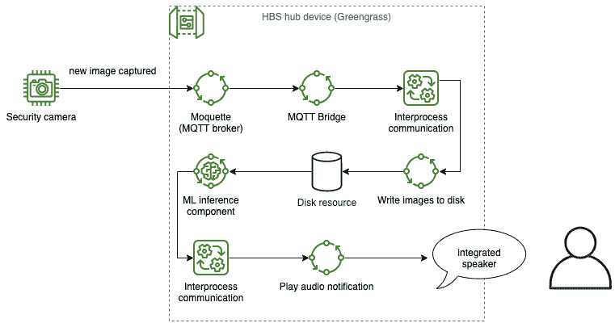

# 第四章：*第四章*：将云扩展到边缘

在本章之前的材料中，所有开发步骤都是在您的设备上本地执行的。本地开发对于学习工具和快速原型设计很有用，但并不代表您通常如何操作生产设备。在本章中，您将把您的中心设备视为实际部署在现场，并学习如何使用云作为部署引擎远程与之交互。

而不是在设备上编写组件，您将学习如何使用**Amazon Web Services (AWS) IoT Greengrass**同步云资源，如代码、文件和**机器学习**（**ML**）模型，到边缘，并通过部署更新设备。您在本章中学习的工具、模式和技能对于您将云扩展到边缘并练习如何管理边缘 ML 解决方案的目标至关重要。您将连接一个新的客户端设备到您的中心设备，并学习如何建立与云解决方案的连接。最后，您将部署您的第一个真正的 ML 模型到边缘。到本章结束时，您将熟悉将组件和资源推送到边缘设备，就像您为生产车队所做的那样。

在本章中，我们将介绍以下主要主题：

+   远程创建和部署

+   将日志存储在云端

+   在边缘和云之间同步状态

+   部署您的第一个机器学习模型

# 技术要求

要完成本章的动手实践步骤，您应该拥有一个符合“动手实践先决条件”部分中定义的硬件和软件要求的中心设备*第一章**，即《使用机器学习的数据驱动边缘简介*》，该设备应加载**AWS IoT Greengrass**核心软件，如*第二章**中定义的步骤所示，《边缘工作负载基础*》。您还需要访问您的**指挥与控制**（**C2**）系统，通常是带有网络浏览器的 PC 或笔记本电脑，以及访问 AWS 管理控制台。

本章步骤中提供的资源可在 GitHub 仓库的`chapter4`文件夹中找到，网址为[`github.com/PacktPublishing/Intelligent-Workloads-at-the-Edge/tree/main/chapter4`](https://github.com/PacktPublishing/Intelligent-Workloads-at-the-Edge/tree/main/chapter4)。

# 远程创建和部署

到目前为止，您一直通过网关设备直接在 IoT Greengrass 解决方案上使用 IoT Greengrass **命令行界面**（**CLI**）进行交互。从现在开始，您将学习如何通过使用 AWS 云从您的 C2 系统（笔记本电脑或工作站）与 IoT Greengrass 设备交互。CLI 和本地开发周期非常适合学习 IoT Greengrass 的基础知识以及组件开发的快速迭代。对于生产解决方案的最佳实践是不将 Greengrass CLI 组件部署到您的设备上并在本地安装新组件，因此接下来您将学习如何打包您的组件，将它们存储在 AWS 中，并完成对网关设备的远程部署。

## 从云中加载资源

组件可以包括由配方文件定义的任意数量的工件，并且这些工件必须存储在 Greengrass 设备可以访问的地方。工件可以是任何类型的静态资源：如图像或文本这样的二进制数据，Python 源代码或编译的**Java ARchive**文件（**JARs**），容器化代码如 Docker 容器，以及组件工作所需的任何其他副本，这里的重点在于**静态**和**副本**。工件是设备使用的资源，是其他部署该组件的每个设备都使用的副本。它们也不打算在部署后在设备上更改。

组件使用的另一种资源是**动态资源**。动态资源作为针对设备特定的配置或运行时消耗的内容被加载。动态资源可能是短暂的，因为它们只存在于设备在线或组件运行期间。动态资源的例子包括在代码中引用的秘密，如**应用程序编程接口**（**API**）密钥，基于设备的**标识符**（**ID**）或其他元数据的设置行为，以及任何叶设备（那些在解决方案终端点的设备，如**Home Base Solutions**（**HBS**）设备监控套件）与 Greengrass 设备（如 HBS 网关设备）之间的通信通道，软件组件，以及云。

在本章的第一个动手操作部分，您将熟悉配方如何定义静态资源作为工件，并使用自定义组件执行您的第一次远程部署。本章的后续部分将介绍动态资源的实现。

## 打包您的组件以进行远程部署

在 IoT Greengrass 上本地部署和远程部署之间的主要区别在于组件资源来自哪里。在您的本地开发生命周期中，您是在中心设备本身上编写文件，并指向包含配方和工件文件的文件夹。对于远程部署，您必须使用 **Amazon Simple Storage Service** (**Amazon S3**) 将您的文件存储在 AWS 云中，并更新您的配方以指向 S3 对象位置。在接下来的步骤中，您将更新 IoT Greengrass 设备的权限模型，以便能够从 S3 读取对象，使用 AWS CLI 将组件打包到 S3，并创建一个新的远程部署到您的中心设备。

### 更新 IoT Greengrass 权限

在您在中心设备上初始设置 IoT Greengrass 时，在 **AWS 身份和访问管理** (**AWS IAM**) 服务中创建了一个新角色，IoT Greengrass 核心服务使用该角色来获取与任何 AWS 服务交互的授权。在 AWS 中，AWS IAM 服务是定义所有用户、组、策略和角色的地方，这些用户、组、策略和角色授予了对您账户中资源和服务 API 的访问权限。

我们在 AWS 中定义的一个 `idtgg` 用户，用于最初配置您的中心设备。一个 **策略** 记录了我们附加到身份的允许和拒绝权限集合。一个 **角色** 是权限的界面，授权用户可以假定以获得那些指定的权限。用户可以通过三种方式获得授权的权限。策略可以直接附加到用户或从他们所属的组继承。策略还可以附加到用户假定的用于临时会话的角色，让用户在遵循 **最小权限原则** (**POLP**) 的前提下执行特定的基于会话的任务。通过使用角色，我们可以定义用户为完成特定任务而可以获得的抽象权限集合，以遵循限制权限范围的最佳实践。以下是一个用户（一种安全主体类型）、角色、策略以及用户通过假定角色所获得的权限之间关系的简单说明：


图 4.1 – IAM 用户从角色获取临时权限和凭证

对于用户、策略和角色的现实世界类比是，当您的朋友不在家时暂时把他们的家门钥匙给您，以便您可以为他们的植物浇水或喂他们的猫。您可以将角色视为“可以进入我家的人”，而家门钥匙是授予他们家访问权限的策略。通过把钥匙托付给您，您的朋友在您作为用户的情况下授予了一个临时的角色进入他们的家。当您的任务完成并且您的朋友回家后，您归还钥匙，从而结束在该角色下的会话。在数字世界中，您作为用户有自己的钥匙（例如公共证书），用于识别您。角色及其策略授予您的钥匙临时访问资源的权限，而不是给您唯一的钥匙！

IoT Greengrass 的安装过程创建了一个名为`GreengrassV2TokenExchangeRole`的新角色，并附加了一个名为`GreengrassV2TokenExchangeRoleAccess`的策略，该策略授予访问与 AWS IoT Core 服务交互的 API 以及将日志写入 Amazon CloudWatch 的权限。默认情况下，并且作为最佳安全实践，此策略不包括对存储在 S3 中的对象的访问权限。作为解决方案开发者，您需要描述您的设备应该能够访问哪些 S3 对象，并将该配置作为新策略添加到角色中。

注意

在本章的剩余部分，包含 AWS CLI 命令和简单的文件系统管理命令（如创建新目录或文件）的步骤将以 Unix 格式编写，适用于 macOS 和 Linux 系统。如果您在使用 AWS CLI 时遇到 Windows 特有的差异，例如将本地文件作为输入引用，请参阅[`docs.aws.amazon.com/cli/latest/userguide/`](https://docs.aws.amazon.com/cli/latest/userguide/)的 AWS CLI 文档。

在接下来的步骤中，您将使用 AWS CLI 在 S3 中创建一个新的存储桶，一个授予对该 S3 存储桶中对象读取权限的新策略，然后将该新策略附加到 IoT Greengrass 设备使用的角色。按照以下步骤操作：

1.  从您的 C2 系统中，打开终端（或在 Windows 上运行`cmd.exe`/PowerShell）。

1.  使用 AWS CLI 通过运行以下命令打印出您的 12 位账户 ID：`aws sts get-caller-identity --query 'Account'`（输出应如下所示：`012345678912`）。

1.  在您的账户中创建一个新的 S3 存储桶。S3 存储桶名称在 AWS 中共享一个全局命名空间。命名存储桶的一个好习惯是包含您的 AWS 账户 ID 作为唯一的字符串。如果存储桶名称已被占用，您可以在名称中添加唯一的文本（例如您的首字母缩写）直到找到一个未被占用的名称。使用上一步骤中的账户 ID 并替换 12 位账户 ID 占位符。如果您不是使用默认的`us-west-2`，请确保更新区域。输出应如下所示：`aws s3 mb s3://012345678912-hbs-components --region us-west-2`。

1.  从现在开始，我们将把这个存储桶名称称为 `REPLACEME_HBS_COMPONENTS_BUCKET`。当你在文件中看到带有 `REPLACEME_HBS_COMPONENTS_BUCKET` 占位符的命令或文本时，你需要将其替换为你自己的存储桶名称，例如：`012345678912-hbs-components`。

1.  接下来，您将创建一个本地文件来存储授予您新存储桶中对象读取访问权限的新策略的内容。您可以在本书的 GitHub 仓库中找到此文件的模板，位于 `chapter4/greengrass_read_s3.json` 路径，并更新 `REPLACEME_HBS_COMPONENTS_BUCKET` 占位符。如果您自己创建文件，请将其命名为 `greengrass_read_s3.json` 并添加以下内容（记得替换占位符！）:

    ```py
    {
      "Version": "2012-10-17",
      "Statement": [
        {
          "Effect": "Allow",
          "Action": [
            "s3:GetObject"
          ],
          "Resource": "arn:aws:s3:::REPLACEME_HBS_COMPONENTS_BUCKET/*"
        }
      ]
    }
    ```

1.  使用此文档作为其来源在 IAM 中创建一个新的策略：`aws iam create-policy --policy-name GreengrassV2ReadComponentArtifacts --policy-document file://greengrass_read_s3.json`。

1.  将策略添加到 IoT Greengrass 使用的 IAM 角色中。将 `--policy-arn` 参数的值替换为上一个命令输出的 `arn` 值，如下所示：`aws iam attach-role-policy --role-name GreengrassV2TokenExchangeRole --policy-arn arn:aws:iam::012345678912:policy/GreengrassV2ReadComponentArtifacts`。

现在，您的 IoT Greengrass 设备，例如 HBS 网关设备，可以读取存储在您的 S3 存储桶中的组件文件。让我们再了解一下网关设备和 AWS 资源之间安全模型的一个要素。

之前，我们描述了 AWS IAM 中用户、角色和策略之间的关系。您的设备在 AWS IAM 中没有作为用户的任何身份，那么它们是如何假定角色的呢？答案是 AWS IoT Core 中的一个功能，称为 **凭证提供者服务**。您的设备在 AWS IoT Core 中使用 **X.509** 私钥和公钥证书配置了身份。凭证提供者服务是连接设备展示其已注册的公钥证书以换取具有通过 IAM 角色授予的权限的临时 AWS 凭证的机制。

这里是一个序列图，展示了您的 HBS 网关设备获取权限并最终在 S3 中读取对象的路径：

![图 4.2 – 获取临时凭证的序列图

![img/B17595_04_02.jpg]

图 4.2 – 获取临时凭证的序列图

随着您的边缘解决方案添加与更多 AWS 服务交互的功能，您必须使用您刚刚完成的过程为这些服务添加权限。对于与 AWS 交互的自定义组件也是如此，因为所有组件都通过设备的配置 IAM 角色获取权限。随着您账户中不同边缘解决方案数量的增加，最佳实践是为每组不同的设备创建不同的 IAM 角色。例如，每个 HBS 枢纽将具有相同的解决方案，可以共享一个定义访问 AWS 权限的公共角色。对于 HBS 的下一个使用物联网 Greengrass 的项目，最好的做法是为该项目的设备创建一个新的角色，而不是向同一个 IAM 角色添加更多权限。

注意

AWS IoT 为您的设备定义的角色数量有一个区域配额。截至本文撰写时，配额为 100。这意味着您不想为每个 Greengrass 设备创建一个独特的角色，因为随着您扩展规模，您将很快达到最大配额。在 AWS 上的生产解决方案中，一个最佳实践是每个生产解决方案使用一个 AWS 账户，例如维护 HBS 的枢纽设备舰队。不同的产品线可以部署在单独的 AWS 账户中，从而增加可使用的角色总数。

在添加了新权限后，您可以继续到下一节，在那里您将打包一个新的组件并在物联网 Greengrass 的云服务中注册它。

### 在物联网 Greengrass 中注册组件

为了将组件远程部署到您的中心设备，您必须首先在物联网 Greengrass 的云服务中注册该组件。您将提供一个配方文件作为 API 的输入，就像您在使用设备上的本地物联网 Greengrass CLI 时做的那样。配方文件将定义组件使用的所有工件的位置。这些工件必须上传到 S3 存储桶，例如在上一步骤中创建的那个。当物联网 Greengrass 处理您的配方文件时，它将在您的账户中注册一个新的组件，然后可以在未来的任何设备部署中引用它。

注册组件的第一步是将您的工件文件添加到 S3 存储桶。只有在这种情况下，您才能知道这些文件在 S3 中的地址，以便能够更新可以引用它们的配方。在本节中，您将上传一个 ZIP 存档作为工件，然后在配方文件中替换工件路径，然后使用 AWS **软件开发工具包**（**SDK**）在您的账户中注册组件，如下所示：

1.  从书籍的 GitHub 仓库中，通过运行以下命令切换到`第四章`：`cd chapter4`。

1.  使用 AWS SDK 通过运行以下命令上传工件文件：`aws s3 cp artifacts/com.hbs.hub.HelloWithConfig/1.0.0/archive.zip s3://REPLACEME_HBS_COMPONENTS_BUCKET/artifacts/com.hbs.hub.HelloWithConfig/1.0.0/archive.zip`。

1.  编辑`recipes/com.hbs.hub.HelloWithConfig-1.0.0.json`文件，并将**统一资源标识符**（**URI**）键的值替换为您在 S3 上的工件路径（上一步中的最后一个参数）。填写完毕后，它应该看起来像这样：

    ```py
    "Artifacts": [
      {
        "URI": "s3://012345678912-hbs-components/artifacts/com.hbs.hub.HelloWithConfig/1.0.0/archive.zip",
        "Unarchive": "ZIP",
    ```

1.  现在您的工件已存放在 S3 上，配方文件也已更新，您可以使用 AWS SDK 将新组件注册到 IoT Greengrass 的云服务中。响应中将是`aws greengrassv2 create-component-version --inline-recipe fileb://recipes/com.hbs.hub.HelloWithConfig-1.0.0.json`。

1.  前面的命令会返回一个状态，例如`componentState=REQUESTED`，表示 IoT Greengrass 正在采取措施注册您的新组件。要检查组件注册的状态，请运行以下命令（将`--arn`参数替换为上一步输出的值）：`aws greengrassv2 describe-component --arn arn:aws:greengrass:us-west-2:012345678912:components:com.hbs.hub.HelloWithConfig:versions:1.0.0`。

当组件在服务中注册后，您将看到此命令的响应，其中`componentState`值现在显示为`DEPLOYABLE`。这意味着组件现在已准备好包含在新部署到设备中。在继续部署之前，让我们看一下 IoT Greengrass 现在存储的配方文件，可以使用以下命令查看（将`--arn`参数替换为上一步中您的组件的 ARN）：`aws greengrassv2 get-component --arn arn:aws:greengrass:us-west-2: 012345678912:components:com.hbs.hub.HelloWithConfig:versions:1.0.0 --query "recipe" --output text | base64 --decode`。您可能会注意到配方文件看起来并不完全像您发送给 IoT Greengrass 的那个。以下是现在的`Artifacts`对象看起来像这样：

```py
"Artifacts":[{"Uri":"s3://012345678912-hbs-components/artifacts/com.hbs.hub.HelloWithConfig/1.0.0/archive.zip","Digest":"wvcSArajPd+Ug3xCdt0P1J74/I7QA2UbuRJeF5ZJ7ks=","Algorithm":"SHA-256","Unarchive":"ZIP","Permission":{"Read":"OWNER","Execute":"OWNER"}}]
```

这里新增的是`Digest`和`Algorithm`键。这是 IoT Greengrass 的安全特性。当您的配方被注册为服务中的组件时，IoT Greengrass 会计算配方中引用的每个工件文件的`SHA-256`哈希值。其目的是确保任何 IoT Greengrass 设备最终下载的工件在使用前未被修改。这也意味着您在注册组件后不能更改存储在 S3 上的工件文件。要更新任何工件，您需要注册组件的新版本并部署新组件版本。

与之前章节中本地开发的组件相比，这个组件还有两个差异：使用解压缩路径和工件权限。以下是此配方文件中关键差异的快照：

```py
"Lifecycle": {
  "Run": "cd {artifacts:decompressedPath}/archive && ./hello.sh"
},
"Artifacts": 
  {
    "URI": "s3://REPLACEME_HBS_COMPONENTS_BUCKET/artifacts/com.hbs.hub.HelloWithConfig/1.0.0/archive.zip",
    "Unarchive": "ZIP",
    "Permission": {
      "Execute": "OWNER"
```

在`Lifecycle`对象中，你可以看到运行脚本，它引用了`artifacts:decompressedPath`变量。这个变量指向 Greengrass 自动解压缩你的归档工件所在的目录。文件被解压缩到与归档相同的子目录中——在这个例子中，是`archive/`。我们知道我们的`hello.sh`脚本将引用同一归档中的相邻`config.txt`文件。我们必须告诉运行脚本更改目录到解压缩路径，然后运行脚本，以便在正确的目录上下文中找到`config.txt`文件。

对于你的工件，最佳实践是从由 IoT Greengrass 下载或解包的`artifacts`目录中消费它们，并使用组件的工作目录，在配方中作为`work:path`提供，用于你的组件将要写入数据的文件。`work`目录是任何生命周期脚本的默认上下文，这就是为什么我们在运行脚本工件之前包括一个更改目录命令。

另一个新加入的是`Permission`对象，我们可以看到我们正在将`Execute`属性设置为`OWNER`值。默认情况下，解包的工件和文件对组件的所有者（如默认的`ggc_user`）具有`Read`文件系统权限。这意味着我们的`archive.zip`文件中的脚本文件在没有更改文件权限的情况下是不可执行的。对于任何工件使用`Permission`对象，我们可以将`Read`和`Execute`文件系统权限设置为`NONE`、`OWNER`或`ALL`（所有系统用户）。这也与为什么工件是写保护的有关。工件旨在作为只读资源被组件或不应更改而不修改组件定义的可执行文件使用。

在下一节中，你将部署你新注册的组件到你的设备上。

### 远程部署组件

现在你的组件现在可在 IoT Greengrass 服务中使用，是时候从你的 C2 系统使用 AWS CLI 开始远程部署到你的 HBS 网关设备了。这种从远程系统使用 IoT Greengrass 云服务进行的部署是你将更新部署到设备的标准方式。这不一定总是从你的开发笔记本电脑上的手动步骤，但我们将更详细地介绍生产管道的更多细节，见[*第八章*，*边缘的 DevOps 和 MLOps*。

在本地开发周期中，你部署组件的唯一设备是本地设备。通过物联网 Greengrass 的云服务进行部署是您指定多个目标设备的方式。这类部署是您扩大管理任何规模机群的能力，这些机群都应该运行相同组件的方法。部署还将指定部署和成功标准，例如通知设备的速率、它们报告成功部署所需的时间、等待组件发出准备更新信号的时长，以及部署失败时应该采取的措施。

在以下步骤中，您将编写一个文件，告知物联网 Greengrass 有关您的部署细节，启动部署，然后验证部署的成功：

1.  在初始物联网 Greengrass 核心软件安装中，您需要将`hbshubprototypes`设备组 ARN 作为参数。以下命令将获取您将在下一步中使用的设备组 ARN：`aws iot describe-thing-group --thing-group-name hbshubprototypes --query "thingGroupArn"`。

1.  编辑 GitHub 仓库中的`chapter4/deployment-hellowithconfig.json`文件，并将`targetArn`的值替换为上一步输出的设备组 ARN。编辑文件后，它应该看起来像这样：

    ```py
    {
      "targetArn": "arn:aws:iot:us-west-2:012345678912:thinggroup/hbshubprototypes",
      "components": {
        "aws.greengrass.Cli": {
          "componentVersion": "2.4.0"
        },
        "com.hbs.hub.HelloWithConfig": {
          "componentVersion": "1.0.0"
        }
      }
    }
    ```

1.  使用以下部署配置启动对新包含中心设备的组的新部署：`aws greengrassv2 create-deployment --cli-input-json file://deployment-hellowithconfig.json`。

1.  之前的命令启动了部署过程。要检查特定设备（如您的`hbshub001`设备）的部署状态，可以使用以下命令：`aws greengrassv2 list-effective-deployments --core-device-thing-name hbshub001`。

1.  为了验证您的设备上组件是否按预期运行，您可以登录或使用`sudo less /greengrass/v2/logs/com.hbs.hub.HelloWithConfig.log`如下：

    ```py
    2021-07-27T20:19:07.652Z [INFO] (pool-2-thread-91) com.hbs.hub.HelloWithConfig: shell-runner-start. {scriptName=services.com.hbs.hub.HelloWithConfig.lifecycle.Run, serviceName=com.hbs.hub.HelloWithConfig, currentState=STARTING, command=["./hello.sh"]}
    2021-07-27T20:19:07.685Z [INFO] (Copier) com.hbs.hub.HelloWithConfig: stdout. Hello from Zimbabwe!. {scriptName=services.com.hbs.hub.HelloWithConfig.lifecycle.Run, serviceName=com.hbs.hub.HelloWithConfig, currentState=RUNNING}
    2021-07-27T20:19:07.699Z [INFO] (Copier) com.hbs.hub.HelloWithConfig: Run script exited. {exitCode=0, serviceName=com.hbs.hub.HelloWithConfig, currentState=RUNNING}
    ```

到目前为止，您已经使用物联网 Greengrass 完成了对您的中心设备的第一次远程部署！整个过程与本地开发并没有太大的不同。我们需要将我们的工件上传到云服务，如 S3，更新配方文件以指向这些新的工件位置，并在将其包含在部署中之前注册组件。部署本身还有一些更多选项，用于指定目标设备、扩展到机群的行为，以及成功或失败的标准和行为。

每个事物组与一个部署有一个 1:1 的映射，该部署代表了该组中每个设备应使用的最新配置。当你想要向一组设备部署更改时，你将创建部署的修订版而不是启动全新的部署。修订版仍然需要一个类似于本节中使用的部署配置，并期望对所有组件和配置的明确定义，这意味着它不是对最后已知部署的修正。

你可以在多个事物组中包含一个设备，其中每个事物组定义了一个独特的配置和组件的部署。例如，你可以定义一个监控组件的事物组，这些组件将应用于所有 HBS 设备，并与指定基于设备类型的企业逻辑组件的事物组配对，例如我们的智能家居中心。属于多个事物组的设备将接收到每个组的部署通知，并将从所有组中合并组件图。以下是如何使用事物组有效地管理跨设备群组部署的组件以构建聚合解决方案的说明：

![图 4.3 – 在组部署中聚合组件的示例]

![图片 B17595_04_03.jpg]

图 4.3 – 在组部署中聚合组件的示例

如前所述，你的部署配置可以指定是否允许组件有一个选项来表示它们已准备好重启或更新。以这种方式让组件与部署行为交互的价值是防止组件突然终止导致数据丢失或业务流程中断。组件必须包含使用 IoT Greengrass `SubscribeToComponentUpdates`函数的使用。

组件可以通过使用`DeferComponentUpdate`命令通过 IPC 发布消息来响应组件更新事件并请求延迟。对于组件使用`SubscribeToValidateConfigurationUpdates`和相应的`SendConfigurationValidityReport`功能来验证配置更改请求也有类似的操作。你可以从本章末尾的*参考*部分了解更多关于这些功能的信息。

随着你第一次远程部署完成，并对 IoT Greengrass 的部署服务有了更好的理解，让我们通过启用将本地日志发布到云中来简化远程故障排除你的中心设备和其组件。

# 在云中存储日志

边缘解决方案从云中加载资源以进行引导、配置以及通常使本地解决方案为运行时做好准备。设备和解决方案的健康状况也应报告给云，以协助生产操作。默认情况下，您的 HBS 中心设备会与云 IoT Greengrass 服务进行交互，以报告连接状态和最近部署的结果。要获取来自边缘解决方案的更多遥测数据，例如日志和指标，您需要部署额外的组件。在本节中，您将部署一个管理组件，该组件将组件日志发送到 Amazon CloudWatch，这是一个用于存储和查询日志的服务。

将我们中心设备的日志存储在云中是一种最佳实践，并使我们能够单独对设备进行分类，而无需与设备建立实时连接或亲自在设备前。毕竟，这些设备可能位于相当偏远的地方，如阿拉斯加苔原，或者只在预定时间上线，例如 *第一章* 中提到的 *利用机器学习的数据驱动边缘介绍* 的海豚研究潜水器。

将日志存储在云中的另一个好处是，您可以在设备群中运行查询，以发现有关群集性能的见解。例如，在 24 小时期间对每个设备日志行数的简单计数可能会发现 *健谈* 设备的异常，其中存在异常数量的活动，这可能意味着设备正在处理异常数量的数据或资源争用。以下是我们群集中日志活动的直方图可能会表明您的运营团队需要分类的问题：

![图 4.4 – 基于日志活动的样本直方图，显示设备异常]

](img/B17595_04_04.jpg)

图 4.4 – 基于日志活动的样本直方图，显示设备异常

由于在边缘解决方案中存储日志是一个常见的用例，并且在更广泛的云应用开发范围内也是如此，因此 IoT Greengrass 提供了一个管理组件，以便轻松摄取您的组件日志。这个名为 `aws.greengrass.LogManager` 的管理组件由 AWS 编写和维护。管理组件预计将满足物联网架构师的常见需求，但被视为可选功能，您需要在部署时引入。

注意

在撰写本文时，`aws.greengrass.LogManager` 管理组件的最新版本是 *2.2.0*。您可能需要根据您开始本书时安装的 IoT Greengrass 核心软件的最新版本来更新版本。对于 *第二章* 中 *边缘工作负载基础* 的步骤，使用了 IoT Greengrass 核心软件版本 *2.4.0*，它与 `LogManager` *2.2.0* 兼容。您可以在本章末尾的 *参考文献* 部分的 *AWS 提供的组件* 文档链接中查看最新的依赖信息。

在以下步骤中，您将修改 `hbshubprototypes` 组的部署，以包括 `aws.greengrass.LogManager` 管理组件。`LogManager` 组件的配置将指定上传日志文件的目标组件。然后，您将使用 AWS CLI 运行一个简单的查询以验证日志文件是否正在存储。按照以下步骤操作：

1.  编辑 `chapter4/deployment-logmanager.json` 文件，将占位符替换为您的账户 ID。此部署添加了 `LogManager` 组件。请记住，由于在部署列表中没有指定其他组件（例如在前面部分添加的 `com.hbs.hub.HelloWithConfig`），它们将从设备中删除。我们将为此部署删除 `HelloWithConfig`，以便在将其添加回时查看日志文件的运行时输出。您需要做的只是更新 `targetArn` 属性以替换账户 ID 占位符并保存文件。

1.  创建一个新的部署修订版，并传入此新的部署配置文件，如下所示：`aws greengrassv2 create-deployment --cli-input-json file://deployment-logmanager.json`。

1.  编辑 `chapter4/deployment-logmanager.json` 文件，再次添加 `HelloWithConfig` 组件。我们这样做是为了重新部署组件，以便将运行时输出写入日志，然后将其上传到云端。将以下加粗的行添加到 `components` 对象中并保存文件：

    ```py
    {
      "targetArn": "arn:aws:iot:us-west-2:0123456789012:thinggroup/hbshubprototypes",
      "components": {
        "aws.greengrass.Cli": {
          "componentVersion": "2.4.0"
        },
        "com.hbs.hub.HelloWithConfig": {
          "componentVersion": "1.0.0"
        },
        "aws.greengrass.LogManager": {
    ```

1.  使用之前的相同命令创建一个新的部署修订版，如下所示：`aws greengrassv2 create-deployment --cli-input-json file://deployment-logmanager.json`。

1.  此部署完成后，您将在 5 分钟内开始在 CloudWatch 日志中看到日志，因为 `LogManager` 的配置指定了 `periodicUploadIntervalSec` 参数为 `300` 秒。

1.  使用以下命令检查带有前缀 `/aws/greengrass/` 的新日志组的状态：`aws logs describe-log-groups --log-group-name-prefix "/aws/greengrass/"`。

1.  当您看到如下响应时，您就知道日志正在写入 CloudWatch：

    ```py
    {
        "logGroups": [
            {
                "logGroupName": "/aws/greengrass/UserComponent/us-west-2/com.hbs.hub.HelloWithConfig",
                "creationTime": 1627593843664,
                "metricFilterCount": 0,
                "arn": "arn:aws:logs:us-west-2:012345678912:log-group:/aws/greengrass/UserComponent/us-west-2/com.hbs.hub.HelloWithConfig:*",
                "storedBytes": 2219
            }
        ]
    }
    ```

1.  您可以查询日志组以查看存储此组件日志的设备，如下所示：`aws logs describe-log-streams --log-group-name /aws/greengrass/UserComponent/us-west-2/com.hbs.hub.HelloWithConfig`。

1.  如以下代码片段所示，响应将显示以 `/DATE/thing/THING_NAME` 格式命名的日志流：

    ```py
    {
      "logStreams": [
        {
          "logStreamName": "/2021/07/29/thing/hbshub001",
    ```

1.  将日志组名称插入到 `filter-log-events` 命令中，以查看 `HelloWithConfig` 组件的日志输出，如下所示：`aws logs filter-log-events --log-group-name /aws/greengrass/UserComponent/us-west-2/com.hbs.hub.HelloWithConfig --filter-pattern stdout`。

    输出如下：

    ```py
    {
        "events": [
            {
                "logStreamName": "/2021/07/29/thing/hbshub001",
                "timestamp": 1627579655321,
                "message": "2021-07-29T17:27:35.321Z [INFO] (Copier) com.hbs.hub.HelloWithConfig: stdout. Hello from Zimbabwe!. {scriptName=services.com.hbs.hub.HelloWithConfig.lifecycle.Run, serviceName=com.hbs.hub.HelloWithConfig, currentState=RUNNING}",
                "ingestionTime": 1627593843867,
                "eventId": "362…"
    }
        ]
    }
    ```

您可以从这一系列说明中了解如何包含`LogManager`组件，该组件会自动将您的组件日志文件发送到云端，以及如何使用 Amazon CloudWatch Logs 服务查询日志。IoT Greengrass 通过查询日志组或通过查询代表单个设备组件的日志流，使得跨设备群组轻松地对单个组件的日志文件进行分类。为了获得更强大的日志分析工具，您可以探索 Amazon CloudWatch Logs Insights，用于对日志组进行聚合查询，或者将日志流式传输到索引查询工具，如**Amazon Elasticsearch**。

## 合并组件配置

现在是介绍如何在部署时合并组件配置的好时机，您可以在部署中使用`logmanager.json`看到我们正在这样做。如果您还记得在*第二章*“编写您的第一个组件”部分中的早期配方创建，即“边缘工作负载基础”，配方可以定义一个`ComponentConfiguration`对象，该对象指定了组件在运行时将使用的默认设置。我们使用它来定义一个默认的`World!`文本，并将其传递给`HelloWorld`组件。这种组件配置也可以在部署到一台或多台设备时定义，以覆盖这些默认设置。当设置不同设备组的配置时，这很有用，例如，告诉所有我们的原型设备使用详尽的调试级别日志记录，而我们的生产设备使用警告级别日志记录以节省成本。以下是该实践效果的说明图：


图 4.5 – 覆盖设备群的配置

部署可以使用两个属性中的任何一个来定义组件配置，即`reset`和`merge`。`reset`属性告诉组件将配置恢复到给定配置键的默认值。`merge`属性告诉组件为给定的配置键应用新的配置，而不影响其他配置键的现有值。在同一个配置键上同时使用`reset`和`merge`属性将始终首先重置值，然后合并新值。这可以用于恢复默认值的树，然后合并树中单个节点的更新。

如果您检查`deployment-logmanager.json`文件，您可以看到我们正在使用的部署时配置合并，以告诉`LogManager`组件要做什么。以下是`merge`对象的格式化版本：

```py
{
  "logsUploaderConfiguration": {
    "systemLogsConfiguration": {
      "uploadToCloudWatch": "true",
      "minimumLogLevel": "INFO",
      "diskSpaceLimit": "10",
      "diskSpaceLimitUnit": "MB",
      "deleteLogFileAfterCloudUpload": "false"
    },
    "componentLogsConfigurationMap": {
      "com.hbs.hub.HelloWithConfig": {
        "minimumLogLevel": "INFO",
        "diskSpaceLimit": "10",
        "diskSpaceLimitUnit": "KB",
        "deleteLogFileAfterCloudUpload": "false"
      }
    }
  },
  "periodicUploadIntervalSec": "300"
}
```

在部署中没有设置任何合并配置的情况下，这里使用的版本 2.2.0 的`LogManager`组件实际上并不做任何事情。您必须在部署时提供一些配置，才能将任何日志发送到云端。

在前面的示例中，有一个`logsUploaderConfiguration`配置键，它有两个子节点和一个间隔属性。`systemLogsConfiguration`节点指示`LogManager`组件将系统日志（如`greengrass.log`）上传到 Amazon CloudWatch IoT Greengrass。`componentLogsConfigurationMap`节点告诉`LogManager`组件如何选择性地上传其他组件的日志。您可以看到，我们正在定义一个`com.hbs.hub.HelloWithConfig`组件以包含到云中发送日志。您将为每个组件添加一个对象到这个列表中，以明确捕获日志。这里概述了两个最佳实践：

+   以编程方式生成您的部署配置，并根据该部署中包含的其他组件构建`LogManager`配置。在构建过程中检查您的部署中包含的组件的脚本可以在将其传递给`CreateDeployment` API 之前更新`LogManager`的`componentLogsConfigurationMap`节点。

+   创建一个事物组，例如`CommonMonitoringTools`，将所有您的 Greengrass 设备放入其中，并在`systemLogsConfiguration`节点中设置一个组级部署配置以捕获系统日志。您的所有设备随后将包含此组件和配置，从而实现默认行为以上传系统日志。然后，代表您的应用程序组件的单独事物组部署将合并`componentLogsConfigurationMap`节点的`LogManager`配置，以指定该应用程序组件的日志。这是因为来自两个不同事物组的两个部署可以在单个设备上堆叠，从而有效地合并单个组件的配置。*图 4.3*和*图 4.5*共同说明了这一概念。

最后关于配置管理的注意事项是解决前面格式化后的`deployment-logmanager.json`之间的差异。在撰写本文时，IoT Greengrass 部署 API 仅接受配置作为字符串对象，因此配置必须定义为 JSON，然后作为单个字符串发送到部署 API。当手动编写部署文件时，这会更不方便，但在以编程方式构建部署时，这是一个简单的附加步骤。在这种情况下，可以使用**YAML Ain't Markup Language**（**YAML**）格式而不是 JSON 来定义您的部署文件，因为 YAML 规范具有构建多行输入的语法支持。

现在，您已经有一个功能齐全、可管理的组件，可以将中枢的日志文件存储在云中，以便远程诊断您的边缘解决方案。您知道如何通过合并新的配置更改到配置中，向`LogManager`组件添加更多组件。通过这个过程，您了解了 IoT Greengrass 的组件配置系统，这将帮助您在创建新组件和构建由多个组件协同工作的部署时提供服务。在下一节中，您将学习如何使连接到您的中枢的叶设备交换消息并与云同步状态。

# 在边缘和云之间同步状态

如果 HBS 中枢设备被制成实际产品，它将通过网络协议与本地设备连接，并代理遥测数据和命令与云服务交互。在前一章中，我们使用运行在中枢设备上的组件来与**树莓派 Sense HAT**上的本地硬件接口进行交互。

当中枢设备通过串行接口与硬件通信时，这很有意义，但当通过网络通信时，那些设备监控套件实际上并不是在枢纽设备上运行的软件组件，它们使用**Greengrass IPC**接口交换消息。相反，它们可能使用网络协议，如**消息队列遥测传输**（**MQTT**），通过 Wi-Fi 或蓝牙与枢纽设备交换消息。

在本节中，您将部署新的管理组件，通过 MQTT 连接到叶设备，并将叶设备的遥测状态同步到云。

## 设备阴影简介

通过同步状态，我们指的是保持两个系统与最新值保持一致的结果。当与边缘和云一起工作时，我们必须承认并处理这样一个现实：边缘解决方案可能目前尚未连接到云服务。我们的叶设备和中枢设备可能正在使用尚未报告给云的已获取遥测数据。一旦中枢设备恢复与云的连接，就必须有一种机制来协调边缘和云的当前状态。

例如，如果我们的中枢设备因网络中断而与云断开连接，叶设备将获取新的遥测数据，并且来自云服务的新的远程命令可能已在客户的移动应用程序中排队。当连接恢复时，需要更新设备状态，以便一切都能同步。为此，AWS IoT Core 提供了一种名为**设备阴影**的服务，该服务作为设备和云之间的同步机制。IoT Greengrass 通过一个管理组件在边缘提供这种设备阴影服务。

设备影子是一个 JSON 文档，它总结了报告数据的当前状态和期望状态。通常这意味着设备负责更新报告的数据，而系统中的其他参与者则使用期望状态来指导设备。假设我们的中心设备应该将来自某个设备监控套件的最新温度测量值通知云。再假设客户的移动应用程序可以发送一个命令来重启监控套件，作为故障排除的一种形式。以下图表说明了这些消息如何在设备影子中存储，并在从网络中断事件恢复后进行协调：

![图 4.6 – 网络中断后同步的影子消息流

![img/B17595_04_06.jpg]

图 4.6 – 网络中断后同步的影子消息流

设备影子对于我们的边缘机器学习工作负载也非常有用，因为运行推理任务的组件可以订阅影子服务报告的变化，或者甚至注册自己的影子，以便与云和其他在 Greengrass 设备上运行的组件交换状态和命令。

在*第三章*的“连接您的第一个设备：边缘感知”和“连接您的第二个设备：边缘执行”部分中，您在“构建边缘”部分实现了 IPC，以便组件能够实时交换信息。影子可以通过定义同步状态文档来提升您的边缘解决方案，这些文档也可以通过 IPC 进行通信，甚至与云同步。这为一些有趣的使用案例打开了大门，进一步让您作为架构师专注于解决业务问题，而无需同时设计数据交换机制。以下是一些边缘组件运行的机器学习工作负载如何从使用影子中受益的例子：

+   **报告和缓存应用程序状态**：您的机器学习推理组件可以在每次使用机器学习模型处理新数据时创建一个本地影子，以存储最新的推理结果。如果模型被训练来报告在新的数据中检测到异常时，本地影子可以存储最新的异常分数和置信度评级。这样，设备上的其他组件可以订阅影子中的变化，并根据机器学习组件的输出改变其行为。这看起来可能类似于通过 IPC 发布更新，但这里的关键区别是，组件可以从影子中获取值，无论它们是否与机器学习组件上次发布异常分数时同时运行。从这个意义上说，影子被用作缓存机制，帮助我们解耦我们的边缘解决方案。

+   **向组件发送命令**：即使组件当前未运行，也可以使用阴影来指示组件的新命令或期望的行为。例如，如果组件在命令本应发送给它的时间崩溃或处于某种其他恢复状态，将此命令放入阴影中可以确保它在组件下次进入运行状态时被传递。结合将阴影同步到云 AWS IoT Core 服务，这使其他应用程序和设备能够以弹性方式与边缘的组件交互。

现在我们已经介绍了与阴影的状态同步，让我们继续进行将此功能部署到您的解决方案中的实际步骤。

## 部署状态同步组件的步骤

IoT Greengrass 提供了一些分离的托管组件的功能，用于连接叶设备、存储阴影和将消息同步到云。这些组件分别是`aws.greengrass.clientdevices.mqtt.Moquette`）、`aws.greengrass.ShadowManager`）和`aws.greengrass.clientdevices.mqtt.Bridge`）。

以下图示说明了此解决方案的架构以及这些组件如何协同工作以实现设备的状态同步：


图 4.7 – 使用托管组件的消息流示例

通过遵循本节的下一步，您将创建一个新的部署，使所有这三个托管组件能够在您的 C2 系统上启动一个新的独立应用程序，该应用程序通过 MQTT 连接到您的网关设备，并观察使用这些功能在边缘和云之间如何同步状态。按照以下步骤进行：

1.  在 AWS IAM 中更新您的 Greengrass 角色，以允许使用 AWS IoT Core 的设备阴影 API。这些步骤是针对 AWS IAM 的，代表了一种常见的流程，用于准备您的 Greengrass 设备使用新 API。然后，执行以下操作：

    1.  从`chapter4`目录中，创建一个新的 IAM 策略，如下所示：`aws iam create-policy --policy-name greengrass-use-shadows --policy-document file://greengrass_use_shadows.json --description "允许 Greengrass 核心与 AWS IoT Core 设备阴影交互"`。

    1.  从`create-policy`命令的响应中复制策略 ARN，并在下一个`attach-role-policy`命令中使用它。它看起来像这样，但用您的账户号替换：`arn:aws:iam::01234567890:policy/Greengrass-use-shadows`。

    1.  将新策略附加到您的 Greengrass IAM 角色，将上一个步骤中的`policy-arn`参数替换为您自己的，如下所示：`aws iam attach-role-policy --role-name GreengrassV2TokenExchangeRole --policy-arn arn:aws:iam::01234567890:policy/Greengrass-use-shadows`。

1.  编辑`deployment-syncstate.json`文件以更新您的账户 ID 的`targetArn`属性。保存文件。

1.  使用`deployment-syncstate.json`文件创建一个新的部署。在继续下一步之前，请确认部署已完成且成功。您可以使用`list-effective-deployments` AWS CLI 命令验证或检查在 AWS IoT Greengrass 管理控制台中的状态，该控制台位于[`console.aws.amazon.com/iot`](https://console.aws.amazon.com/iot)。

1.  启动`本地设备`客户端以通过 MQTT 连接到您的网关设备。从 GitHub 仓库的`chapter4/apps`目录中，运行以下命令：`./client.sh`。

`apps/client.sh`脚本使用您的 AWS 凭据在 AWS IoT Core 中注册一个新设备，下载生成的`x.509`私钥和证书，并将设备添加到 Greengrass 核心关联设备列表中。然后，它安装 AWS IoT Device SDK for Python 并启动一个 Python 应用程序，该应用程序在本地网络上发现您的网关设备并与之连接，以通过 MQTT 交换消息。运行此应用程序的目的是演示 Greengrass 如何支持本地设备的消息交换。

注意

如果您的 C2 笔记本电脑与您的网关设备不在同一网络中，您可以在您的网关设备上运行客户端应用程序。但是，您需要更新在网关设备上配置的`idtgg` AWS 用户的权限，因为它还没有必要的权限。返回 AWS 管理控制台中的 IAM，找到名为`Provision-IDT-Greengrass`的用户组，通过附加策略添加新的权限，并选择名为`AWSIoTFullAccess`的策略。然后，您可以使用那里现有的凭据在您的网关设备上运行`client.sh`应用程序，这些凭据可以在*第二章*的*边缘工作负载基础*中找到。

`client.sh`应用程序将在一个专门用于设备影子通信的主题上发布新消息。主题地址是`$aws/things/localdevice/shadow/update`。客户端报告一个随机生成的温度值，就像它是本地网络上的另一个传感器一样。您可以使用 AWS IoT Core 管理控制台在[`console.aws.amazon.com/iot`](https://console.aws.amazon.com/iot)验证这些消息是否已上传到云端。导航到`$aws/things/localdevice/shadow/update/accepted`主题以查看发布的结果。以下是一个示例：

![图 4.8 – AWS IoT Core 控制台接受的影子更新的截图

![图 4.8 – AWS IoT Core 控制台接受的影子更新的截图

图 4.8 – AWS IoT Core 控制台接受的影子更新的截图

您也可以通过这个测试客户端与本地设备应用程序进行交互。您可以向本地设备发送一个新的期望状态，并且它将合并命令到下一个报告消息中。使用 MQTT 测试客户端在`$aws/things/localdevice/shadow/update`主题上发布一条消息，内容如下：`{"state":{"desired":{"valve":"open"}}}`。您应该在您的订阅和在`client.sh`应用程序的标准输出中看到，现在报告状态中的阀门是打开的，而不是期望状态。这意味着本地设备通过 Greengrass 接收到了命令，处理了该命令，并相应地更新了其报告状态。

您可以通过在 MQTT 测试客户端中发布更多消息到期望状态来继续实验。实际设备会对期望状态做出一些响应，但此应用程序只是将命令从期望状态复制到报告状态，以模拟处理事件。

为了演示 MQTT 桥接管理组件的功能，`client.py`应用程序也在`dt/localdevice/heartbeat`地址的另一个主题上发布心跳消息。这样做的原因是，当使用影子主题时，影子管理器组件实际上为我们处理了所有状态同步。对于任何其他主题和数据发布，例如这个心跳行为，我们必须使用 MQTT 桥接组件将消息从边缘传输到云（或反之亦然）。使用 MQTT 测试客户端订阅`dt/localdevice/heartbeat`以查看这些消息在云中到达。

尝试一些有趣的事情，比如暂时将您的中心设备离线，并重复之前的步骤，但将阀门期望状态设置为`关闭`。这将演示当 Greengrass 设备下次上线时，影子服务消息是如何缓冲以供发送的。在您的中心设备上，断开网络连接（无论是通过拔掉以太网电缆还是禁用 Wi-Fi）。您应该不会在 MQTT 测试客户端的影子或心跳主题上看到任何消息到达。在 MQTT 测试客户端中发布一条新消息，例如`{"state":{"desired":{"valve":"open"}}}`，然后恢复网络连接。您将看到，一旦中心设备重新建立连接，本地设备将接收到新的命令，以及心跳消息的恢复。

## 扩展管理组件

部署的示例使用 AWS 管理的组件，通过 MQTT 代理为本地设备建立连接，在边缘和云之间发送和接收消息，并与设备的影子服务同步状态。您可以通过合并进一步的配置更新来为您的用例配置这些组件。让我们检查此部署中使用的配置，然后回顾一些更多选项和最佳实践。

注意

对于本节中审查的任何配置 JSON，本书使用的是一种美观打印格式，这与您在实际上部署的文件中看到的格式不匹配，其中 JSON 根据 API 要求进行了字符串化和转义。这是为了在书籍格式中方便和易于阅读而进行的。

### 阴影管理器

在`deployment-syncstate.json`文件的`aws.greengrass.ShadowManager`组件配置中，我们必须明确指定哪些设备阴影将在边缘和云之间保持同步。我们使用的配置定义了名为`localdevice`的设备阴影，该设备阴影与`apps/client.sh`应用程序的客户端 ID 相匹配。以下是实现该配置的配置示例：

```py
{
  "synchronize":{
    "shadowDocuments":[
      {
        "thingName":"localdevice",
        "classic":true,
        "namedShadows":[]
    ]
  }
}
```

**经典阴影**是 AWS IoT Core 中任何设备的根级阴影。**命名阴影**是属于设备的子项，一个设备可以有任意数量的附加子阴影来帮助**关注点分离**（**SoC**）。在这种情况下，仅使用经典阴影就足够了。

对于您希望 Greengrass 解决方案保持同步的每个设备，您需要配置来指定该设备在`shadowDocuments`列表中，其中`thingName`是您用于通过 MQTT（AWS IoT Core 根据物联网的命名约定定义了许多资源和服务 API，将设备表示为*事物*）连接的设备名称。

您的 Greengrass 核心设备本身是在 AWS IoT Core 中注册的事物，可以使用经典和命名阴影。这些阴影可以用来表示中心设备本身的状态，或者用于中心设备上的组件与某些期望的命令进行协调；例如，将期望状态发送到中心设备的阴影以进入低带宽状态可能会被设备上运行的任何组件捕获并相应地执行。为您的 Greengrass 核心设备启用阴影同步需要在`shadowDocuments`属性之外进行单独的配置。以下是一个示例：

```py
{
  "synchronize":{
    "coreThing":{
      "classic":true,
      "namedShadows":[
        "CoreBandwidthSettings",
        "CorePowerConsumptionSettings"
      ]
    },
    "shadowDocuments":[ ... ]
}
```

本节涵盖了您需要了解的 AWS IoT Core 中阴影的相关知识以及如何配置阴影管理器组件。接下来，让我们回顾 MQTT 桥接组件。

### MQTT 桥接

`aws.greengrass.clientdevices.mqtt.Bridge`组件负责在 Greengrass 支持的三个消息通道之间中继消息。这三种消息通道如下所示：

+   组件用于消息的本地 IPC 主题

+   Moquette MQTT 代理组件启用的本地 MQTT 主题

+   使用 AWS IoT Core 的云 MQTT 主题

配置 MQTT 桥接功能使您能够创建消息流，从一个通道的主题跨越边界到另一个通道的主题——例如，将发布在`dt/device1/sensors` IPC 主题上的消息复制到`dt/sensors/all` AWS IoT Core 主题，以便进行云摄入。

与影子管理组件类似，必须在组件的配置中显式定义源和目标主题的每个映射。为了使来自`client.sh`应用程序的心跳消息到达云端，我们在 MQTT 网桥中使用了以下配置：

```py
{
  "mqttTopicMapping": {
    "ForwardHeartbeatToCloud": {
      "topic": "dt/localdevice/heartbeat",
      "source": "LocalMqtt",
      "target": "IotCore"
    }
}
```

而不是为每个使用心跳模式的设备创建一个映射，你可以使用 MQTT 通配符并将主题更新为`dt/+/heartbeat`。最佳实践是为每个预期的设备显式定义一个映射，除非你有设备可能在多个网关设备之间迁移且无法具体预测哪些设备可能会发布的情况，否则应避免使用通配符。通配符非常适合简化手动输入的配置和可读性，但会引入不可预见行为的风险。通配符也不支持用于 IPC 的`Pubsub`类型主题。

这里是另一个使用 MQTT 网桥允许从其他 AWS IoT Core 设备或应用程序直接向运行在 Greengrass 核心上的组件发送命令的示例。这个示例的目的是展示我们如何更新所有基于机器学习的组件的设置，以调整推理活动中模型的使用率。订阅了 IPC 主题的组件可以接收更新，而无需进行完整的 Greengrass 部署：

```py
{
  "mqttTopicMapping": {
    "RemoteUpdateMLComponents": {
      "topic": "cmd/ml-components/inferenceRate",
      "source": "IotCore",
      "target": "Pubsub"
    }
}
```

你现在已经完成了部署用于在边缘和云端之间来回移动消息的管理组件。这个功能为本地设备通过中心设备相互通信、组件与云服务交互以及任何其他本地设备、组件和云之间交换消息的组合创建了一条路径。你还学习了 AWS IoT Core 和设备影子服务如何同步基于底层消息系统的本地设备和组件的状态。这些工具使你能够在不编写任何代码或管理消息需求的基础设施的情况下，根据任何类型的消息要求构建边缘机器学习解决方案。

在下一节中，你将使用预构建的模型、推理代码和用于对推理结果采取行动的自定义组件的组合来部署你的第一个机器学习模型。

# 部署你的第一个机器学习模型

现在你已经熟悉了远程部署和从云端加载资源，是时候将你的第一个基于机器学习的功能部署到边缘了！毕竟，一个使用机器学习模型的组件就像我们部署的其他组件一样。它是由托管在云端的依赖项、运行时代码和静态资源组合而成的。

## 审查机器学习用例

在这种情况下，依赖项是用于 `OpenCV`（一个用于计算机视觉（**CV**）用例的开源库）和 **深度学习运行时**（**DLR**）的包和库，运行时代码是使用 DLR 的预配置推理代码样本，静态资源是预配置的图像分类模型存储和一些示例图像。本例中部署的组件全部由 AWS 提供和管理。

您将部署的解决方案模拟了我们 HBS 设备中心的使用案例，该中心作为我们客户家庭安全故事的一部分执行简单的图像分类。

假设一个附加设备，HBS 客户可以为其中心购买的是一款安全摄像头，当有人接近前门时，它会通知客户。摄像头设备会定时拍照或与运动传感器配对，并将该图像作为文件存储在中心设备上。然后，中心设备使用本地机器学习模型对该图像进行推理，以识别是否检测到任何人。如果是这样，可以在中心设备上播放音频通知或将文本通知发送给客户。以下是解决方案及其各部分的示意图：



图 4.9 – 通过摄像头识别的受识别主题的音频通知示例架构

今天，这种安全功能在市场上有很多产品。然而，尚未普及的是在边缘执行机器学习推理。这提供了一个关键的区别机会，因为通过节省图像传输到云端的带宽和节省在云端运行机器学习推理的计算成本，**总拥有成本**（**TCO**）会降低。即使客户的互联网服务中断，安全解决方案也能保持运行，并且不依赖于云服务的可用性。处理和通知延迟也有实际的好处，以及一个吸引客户的隐私故事，因为任何图像数据都保留在本地。

本用例演示了我们已在 *第一章* 中介绍的数据驱动边缘机器学习的四个关键优势：延迟、可用性、成本和治理。

## 部署机器学习工作负载的步骤

本节所需采取的步骤相当简单，多亏了 AWS 提供的托管组件。需要从 AWS 目录部署三个组件，以及一个额外的自定义组件来处理推理结果。由于目标原型硬件 Raspberry Pi 和 Sense HAT 不包括任何摄像头接口，我们将依赖托管组件中提供的示例图像来模拟传感器。一个自定义组件作为我们的执行器，它将在**发光二极管**（**LED**）上显示推理结果。

注意

如果您不使用目标 Raspberry Pi 和 Sense HAT 硬件，您必须修改步骤以使用 `com.hbs.hub.ScrollMessageSimulated` 组件。或者，您可以使用 AWS IoT Core 管理控制台（在第 *5 步* 中介绍）查看推理结果，任何连接到 AWS IoT Core 的其他 MQTT 客户端（订阅在第 *5 步* 中标记的主题），或查看推理组件日志（在设备本地或将这些日志添加到 `LogManager` 配置中）。

以下步骤将机器学习解决方案部署到中心设备：

1.  将 Raspberry Pi 更新为安装 OpenCV 依赖项。我们在这里通过手动安装依赖项来简化步骤，而不是增加示例的复杂性（更多内容将在步骤之后介绍）。其他目标平台可能只需要安装 `glibc`，而托管组件将根据需要安装依赖项。打开到您的 Pi 的 `ssh` 连接或直接在设备上打开终端程序。运行以下命令：`sudo apt-get install libopenjp2-7 libilmbase23 libopenexr-dev libavcodec-dev libavformat-dev libswscale-dev libv4l-dev libgtk-3-0 libwebp-dev`。

1.  在您的 AWS 账户中从书籍仓库的源创建一个新的自定义组件，用于 `com.hbs.hub.ScrollMessage` 组件。这些步骤与 *在 IoT Greengrass 中注册组件* 部分的 *1-4 步骤* 相同。将此组件的 `archive.zip` 文件上传到 S3，编辑配方文件以指向 S3 中的工件，然后注册新的自定义组件。

1.  编辑 `deployment-ml.json` 文件以更新 `targetArn` 属性，如过去章节中所述。保存文件。

1.  使用 `deployment-ml.json` 文件创建一个新的部署，如下所示：`aws greengrassv2 create-deployment --cli-input-json file://deployment-ml.json`。

1.  当部署完成时（在 Pi 上安装捆绑的 DLR 依赖项可能需要几个小时），您应该开始在您的 Sense HAT LED 矩阵上看到新的推理结果。对于不使用带有 Sense HAT 的 Raspberry Pi 的读者，您可以使用 AWS IoT Core 管理控制台查看结果。登录到 [`console.aws.amazon.com/iot`](https://console.aws.amazon.com/iot)，导航到 `ml/dlr/image-classification` 机器学习推理主题。

如果您使用 AWS IoT Core 控制台或 MQTT 客户端检查推理结果，它们应该看起来像这样：


图 4.10 – AWS IoT Core 中推理结果的截图

您现在已将第一个机器学习工作负载部署到边缘！此工作负载将以 10 秒的间隔持续运行，并将处理在中心设备上找到的文件 `/greengrass/v2/packages/artifacts-unarchived/component-name/image_classification/sample_images/cat.jpeg`。有几种方法可以扩展此示例以供您自己的测试和使用案例，例如以下方法：

+   使用`aws.greengrass.DLRImageClassification`组件指定处理图像的来源位置——例如，您可以使用`ImageDirectory`参数指定一个新目录，并使用`ImageName`参数指定一个文件名。然后，您可以创建一个包含您自己的图像作为工件的自定义组件，并在此路径下通过该文件名旋转它们，以查看分类引擎识别的内容。

+   使用`aws.greengrass.DLRImageClassification`组件指定一个摄像头作为要分类的图像的源。对于在 Raspberry Pi 设备上进行原型设计，您可以连接一个**通用串行总线**（**USB**）摄像头或**Raspberry Pi Camera Module v2**。有关如何设置组件以使用摄像头的更多详细信息，请参阅本章末尾的*参考*部分。

+   **对特定分类结果类型的事件进行升级**：当前工作负载报告了指定主题上的所有推理结果。您可以修改订阅这些结果的定制组件，并且仅在推理结果中检测到人类时更新执行器。或者，您可以在另一个预留用于警报的主题上发布消息，并配置 AWS IoT Core 和**Amazon Simple Notification Service**（**Amazon SNS**）在检测到人类时向您发送警报。对于这些事件，您可能还希望将检测到的图像存储起来以供将来参考。

+   **部署对象检测工作负载**：本示例演示了将源图像中的主要对象进行分类的使用场景。另一种使用场景是列出源图像中检测到的所有对象。AWS 还提供了用于对象检测工作负载以及运行在 DLR 或 TensorFlow 框架上的 CV 用例的托管组件。

+   **通知新图像可用**：托管组件设计了一个间隔模式来处理源图像与 ML 模型的匹配。您可以设计一个变体，订阅本地 IPC 主题，并等待另一个组件的通知，表明需要进行推理，并可以在消息中指定文件路径。

如在 Raspberry Pi 上安装依赖步骤中所述，这些步骤采取了一种捷径，并不反映我们解决方案设计的最佳实践。与其手动在设备上安装依赖项，不如使用 IoT Greengrass 来安装那些缺失的依赖项。本节本可以向您介绍如何分叉 AWS 托管组件，以便在安装生命周期步骤中添加更多依赖项，但考虑到本练习的目的，认为这不是一个有价值的偏离。

此外，`aws.greengrass.DLRImageClassification`托管组件的默认行为是将推理结果发布到 AWS IoT Core 上的云主题，而不是 IPC 上的本地主题。对于将所有活动报告到云的工作负载，这是期望的行为。然而，鉴于本书中概述的最佳实践，在本地执行数据分析并解耦我们的组件，我们更倾向于在本地 IPC 主题上发布，并让另一个组件决定哪些消息需要升级到云。

这不能通过简单地更新组件的 2.1.3 版本中定义的配置来实现。再次强调，为了本练习的目的，将组件分叉以替换云发布为本地发布并不被认为是有价值的，因此云发布行为保持不变。

随着您的第一个基于机器学习的作业部署完成，您现在已经了解了机器学习组件是如何作为依赖项、代码和静态资源的组合部署到边缘的。

在本节中，您部署了三个组件作为解耦的依赖项、运行时和模型集，再加上一个作用于您机器学习模型推理结果的定制组件。综合来看，您已经拥有了扩展这些组件以提供您自己的图像分类和目标检测工作负载的所有基础知识。接下来，让我们总结一下本章您所学到的一切。

# 摘要

本章向您介绍了将组件远程部署到 Greengrass 设备的关键差异，如何使用 AWS 提供的托管组件加速您的解决方案开发，以及如何在原型中心设备上部署您的第一个机器学习作业。到目前为止，您已经拥有了开始编写自己的组件和设计边缘解决方案所需的所有基础知识。您甚至可以扩展托管机器学习组件，以开始一些基本的计算机视觉项目。如果您今天在业务中使用的是作为容器化代码训练的机器学习模型和推理代码，您现在就可以开始将它们作为定制组件部署到边缘。

在下一章（*第五章**Chapter 5*），*从边缘摄取和流式传输数据*，您将了解数据如何在边缘的规范性结构、模型和转换中移动。在边缘正确处理数据对于增加边缘机器学习解决方案的效率、弹性和安全性至关重要。

# 知识检查

在进入下一章之前，通过回答以下问题来测试您的知识。答案可以在书的末尾找到：

1.  有哪些例子可以区分边缘组件的静态资源和动态资源？

1.  您的组件工件存储在哪里，以便它们可以被您的配方文件引用？

1.  您能否修改已包含在已注册的定制组件中的云存储工件？

1.  为什么您不能写入通过部署加载到边缘设备的工件文件？

1.  对或错：边缘设备可以属于云 AWS IoT Core 服务中的多个事物组，并且每个事物组可以有一个与之关联的激活 Greengrass 部署。

1.  你能想到一个用例，其中一个边缘设备可以接收来自多个事物组的部署吗？

1.  对或错：单个部署可以重置组件的配置并应用新配置的合并。

1.  以下哪个管理组件负责部署本地 MQTT 代理并连接叶设备？

    MQTT 代理桥接/Moquette/设备影子

1.  以下哪个管理组件负责在边缘和云之间同步状态？

    MQTT 代理桥接/Moquette/设备影子

1.  以下哪个管理组件负责在 MQTT、IPC 和云等通信渠道之间中继消息？

    MQTT 代理桥接/Moquette/设备影子

1.  你如何设计从本地 IoT 传感器到运行机器学习推理的应用程序的数据流，并通过连接的扬声器播放警报声音？考虑不同的通信渠道和我们的最佳实践——解耦服务。试着在纸上勾勒出来，就像你正在向同事提出设计方案一样。

# 参考文献

查看以下资源，以获取有关本章讨论的概念的更多信息：

+   *使用 TensorFlow Lite 在相机图像上执行样本图像分类推理*：[`docs.aws.amazon.com/greengrass/v2/developerguide/ml-tutorial-image-classification-camera.html`](https://docs.aws.amazon.com/greengrass/v2/developerguide/ml-tutorial-image-classification-camera.html)

+   *AWS 提供的组件*：[`docs.aws.amazon.com/greengrass/v2/developerguide/public-components.html`](https://docs.aws.amazon.com/greengrass/v2/developerguide/public-components.html)

+   OpenCV 网站：[`opencv.org/`](https://opencv.org/)

+   *AWS IoT 设备影子服务*：[`docs.aws.amazon.com/iot/latest/developerguide/iot-device-shadows.html`](https://docs.aws.amazon.com/iot/latest/developerguide/iot-device-shadows.html)

+   *DLR：机器学习模型的紧凑型运行时*：[`neo-ai-dlr.readthedocs.io`](https://neo-ai-dlr.readthedocs.io)

+   TensorFlow 网站：[`www.tensorflow.org/`](https://www.tensorflow.org/)
