# 第七章：*第七章*: 边缘的机器学习工作负载

边缘计算的增长不仅是由计算效率高的硬件设备的进步推动的，也是由十年前仅在云（或本地基础设施）上可用的不同软件技术的出现推动的。例如，想想智能手机、智能手表或个人助理，如**亚马逊 Alexa**，它们将强大的硬件和软件能力带给消费者。使用面部识别解锁手机或车库门、与 Alexa 使用自然语言进行对话或驾驶自动驾驶汽车已经成为新常态。因此，基于从周围环境持续学习而构建智能的物理-数字系统对于当今世界各种工作负载来说已经成为关键。

重要的是要认识到，大多数顶级科技公司（如*苹果*、*亚马逊*、*谷歌*和*Meta*，前称*Facebook*）都使用**机器学习**（**ML**）并通过他们的产品使消费者更容易接触到它。这也不是一项新技术，它已经被金融、医疗和工业等领域的行业使用很长时间了。在本章中，我们将关注如何利用机器学习能力为任何**物联网**（**IoT**）工作负载提供支持。

我们将继续致力于连接的枢纽解决方案，并学习如何在**边缘**（即**Greengrass**设备）上开发机器学习能力。在前几章中，你已经学习了如何在边缘处理不同类型的数据，现在，是时候学习不同的机器学习模型如何对数据进行推理，以在边缘得出智能见解。

在本章中，我们将涵盖以下主题：

+   定义适用于物联网工作负载的机器学习

+   在云中设计机器学习工作流程

+   实践机器学习工作流程架构

# 技术要求

本章的技术要求与在*第七章*“边缘工作负载基础”中概述的要求相同。详见该章节中的完整要求。

# 定义适用于物联网工作负载的机器学习

机器学习技术不再是未来的技术——在过去的几十年里，它已经改变了数百万人的生活方式。那么，什么是机器学习？

“机器学习是研究计算机在没有明确编程的情况下学习能力的领域。”

– 亚瑟·塞缪尔，1959 年

让我们看看一些来自**消费者**和**工业**领域的真实世界机器学习应用物联网工作负载的例子。

首先，这里有一些来自消费者领域的例子：

+   能够识别你的日常习惯并提供与健身或生产力相关的建议的智能手机或智能手表

+   可以以自然方式与之互动的个人助理（如 Alexa、Google 和 Siri），用于控制灯光和**供暖、通风和空调**（**HVAC**）等不同需求

+   可以监控您的周围环境并检测意外行为或威胁的智能摄像头

+   可以通过其视觉属性、车牌或甚至驾驶员的面部识别您的汽车的智能车库

+   能够持续变得更聪明，以识别交通中的驾驶模式、物体和行人的自动驾驶汽车

这里有一些来自工业领域的例子：

+   能够更好地优化**总体设备效率**（**OEE**）的智能工厂

+   在不同的工业工厂、仓库或工作场所提高工人的安全和生产力

+   使用**计算机视觉**（**CV**）或音频进行实时**质量控制**（**QC**）以识别缺陷

+   改善供应链以减少浪费并提高客户体验，例如从 Amazon.com 进行 1 小时或 15 分钟的送货（使用无人机）

为了构建上述能力，客户使用了不同的机器学习框架和算法。为了简洁起见，我们不会涵盖今天存在的每一个机器学习框架。我们认为这是数据科学的一个领域，它不适合物联网实践者的日常职责。但如果你有兴趣深入了解，有许多关于机器学习/人工智能（**AI**）的书籍。因此，本章的重点将是学习一些关于机器学习系统历史和核心概念的知识，以及将机器学习与物联网和边缘工作负载集成的途径。

## 机器学习的历史是什么？

现在，作为人类，我们可以通过声音、视觉或触觉与各种机器（从手机到自动驾驶汽车）进行交流。没有机器学习技术的采用，这是不可能的。这只是开始，未来几年机器学习将变得更加易于访问，以不同的方式改变我们的生活。您可以通过这篇由《福布斯》杂志发表的文章快速了解这项令人惊叹的技术的历史：[`www.forbes.com/sites/bernardmarr/2016/02/19/a-short-history-of-machine-learning-every-manager-should-read/?sh=1ca6cea115e7`](https://www.forbes.com/sites/bernardmarr/2016/02/19/a-short-history-of-machine-learning-every-manager-should-read/?sh=1ca6cea115e7)。

在研究界之外，像 Amazon.com、Google 和其他技术公司也在 20 世纪 90 年代末开始采用机器学习技术。例如，Amazon.com 使用机器学习算法来了解其客户的阅读偏好，并建立了一个模型来通知他们发布的新书，这些新书符合他们的兴趣或类型。Google 将其用于搜索引擎，Microsoft 用于识别电子邮件中的垃圾邮件，等等。从那时起，这项技术已被许多其他行业用于各种用例。

现在我们已经对机器学习的背景有所了解，让我们现在尝试理解机器学习的基础。

## 机器学习系统有哪些不同类型？

与分布式数据系统类似，其中存在不同类型的技术来处理不同类型的数据，机器学习系统也有不同的种类。如果我们将它们分类到更广泛的类别中，区别可以这样描述：

+   **监督式机器学习（SML）**—在这种机器学习方法中，模型使用标记的数据集进行训练，并需要人类监督（或教师）。例如，让我们考虑一个场景，我们需要一个连接的枢纽解决方案来识别可能入侵您场所的不同对象，如猫、狗、人类（或季节性鸟类？）。因此，需要由人类（或人类）对图像进行标记，然后在模型准备好（即，模型）预测结果之前，使用分类算法在该数据上对模型进行训练。在下面的屏幕截图中，您可以看到一些对象已经标记，而其余的尚未标记。因此，人类需要做好标记工作，以便模型有效：


图 7.1 – 一个标记的图像分类训练集

训练的长度以及数据量和质量将决定模型的准确性。

+   **无监督式机器学习（UML）**—在这种机器学习方法中，模型使用未标记的数据集进行训练，并且不需要人类监督（或自我教学）。例如，让我们考虑你场所上的一个新入侵者，如鹿、狼（或老虎？），你希望模型将其检测为异常并通知你。在下面的屏幕截图中，您可以看到没有任何图像被标记，模型需要自己找出异常：

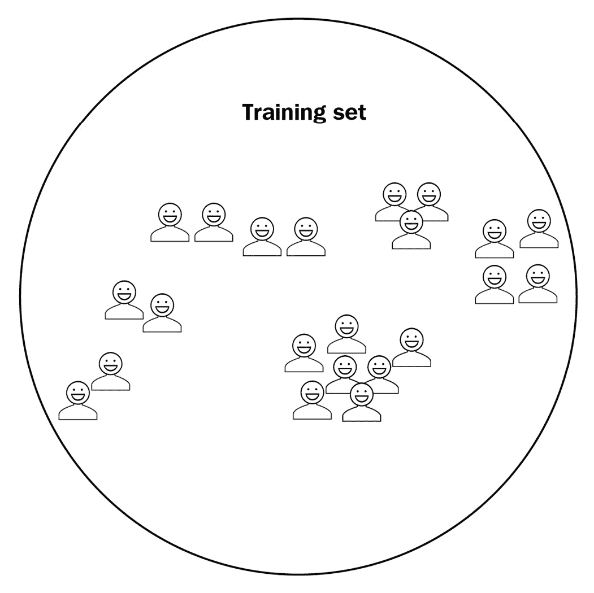

图 7.2 – 一个未标记的图像分类训练集

考虑到训练数据集中没有鹿、狼或老虎的图片，模型需要足够智能，能够使用如**随机森林**等算法将其识别为**异常**（或新颖性检测）。

+   **半监督式机器学习（SSML）**—在这种机器学习方法中，模型使用的是混合了未标记和标记数据的集合（想想按需教学，你需要自己学习大部分内容）。让我们考虑一个场景，你收集了在家举办的派对上的客人照片。不同的客人在不同的照片中出现，其中大多数未标记，这是算法的无监督部分（如**聚类**）。现在，作为派对的主持人，如果你在数据集中一次性标记了独特的人物，机器学习模型可以立即在其它照片中识别出这些人物，如下面的图所示：

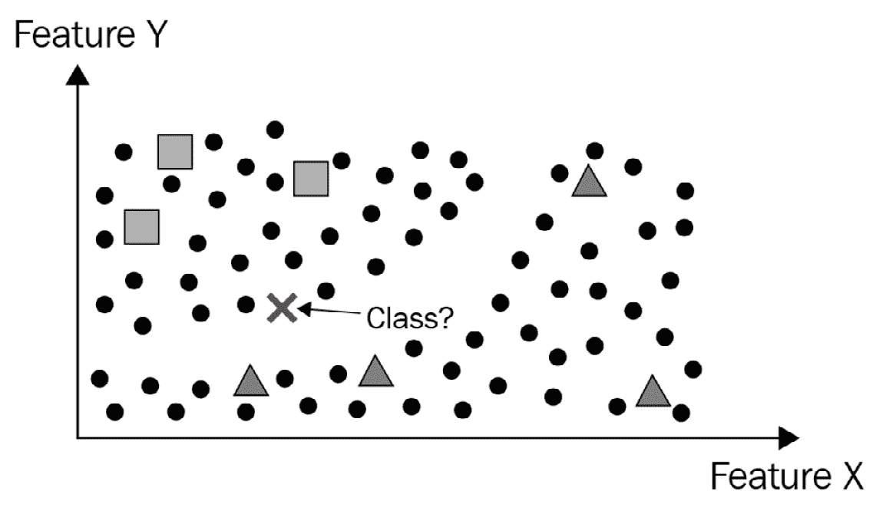

图 7.3 – SSML

这可能非常有用，如果你想要搜索个人或家庭的照片并与他们分享（谁在乎其他家庭的照片呢？）

+   **强化学习（RL）**—在这种机器学习方法中，模型被训练在环境中做出一系列决策并最大化长期目标。模型通过试错法的迭代过程进行学习。一个物理或虚拟设备等代理使用此模型在给定环境状态下采取行动，达到新的状态。这使得代理有资格获得奖励（正面或负面），代理将继续迭代这个过程，直到它导致最优化长期奖励。代理从初始状态到最终状态的全部生命周期被称为一个**剧集**。

    例如，使用 RL，你可以训练一个机器人拍摄你家中举办的派对上所有宾客的照片。机器人将保持在特定的轨道上，并从该环境中捕捉图像。如果它保持在轨道上并捕捉到可接受的图像，它将获得正面奖励；如果它偏离轨道或捕捉到扭曲的快照，它将获得负面奖励。随着它继续迭代这个过程，最终它将学会如何最大化其长期目标，即捕捉到辉煌的图像。以下图表反映了这个 RL 过程：

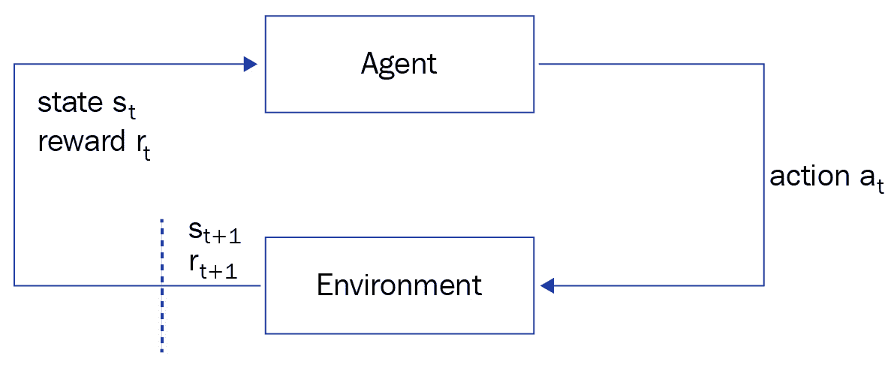

图 7.4 – RL

我们在前面图表中解释了机器学习的一个更广泛的类别；然而，有许多框架和算法超出了本书的范围。因此，在下一节中，我们将重点关注最常见的一些，这些可以应用于物联网和边缘工作负载生成数据。

## 物联网工作负载的机器学习分类法

机器学习在物联网中最常见的三个应用领域是分类、回归和聚类，如下所示：

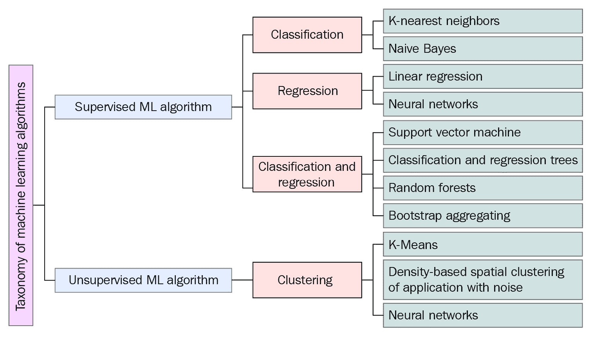

图 7.5 – 机器学习算法的总结分类法

让我们更详细地讨论前面图表中的命名法，如下所示：

+   **分类**—分类是一种监督学习技术，你从一组观察到的值开始，并从未知数据中得出一些结论。在现实世界中，分类可以用于图像分类、语音识别、药物分类、情感分析、生物识别识别等。

+   **回归**—回归是一种监督学习技术，你可以预测一个连续值。预测是通过估计因变量（*Y*）与一个或多个自变量（*X*）之间的关系，使用最佳拟合直线来实现的。在现实世界中，回归可以应用于预测明天的温度、能源利用价格、金价等。

+   **聚类**——聚类是一种 UML 算法，你可以将未标记的数据点分组。这通常用于统计分析。数据集中未标记数据点的分组是通过识别具有共同属性和特征的数据点来实现的。在现实世界中，这个算法可以应用于市场细分、医学成像、异常检测和社会网络分析。

在本章的动手实验室部分，你将学习如何使用分类算法来分类对象（例如汽车和宠物）。

## 为什么机器学习今天可以在边缘访问？

我们已经在*第六章*中向您介绍了边缘计算的三个定律：*物理定律*（对延迟敏感的使用案例）、*经济定律*（对成本敏感的使用案例）和*土地定律*（对数据敏感的使用案例）。基于这些定律，我们可以识别当今世界中的各种使用案例，特别是与物联网和边缘相关的情况，在这些情况下，在设备或网关本地处理和生成数据洞察是非常有意义的，而不是持续将其发布到云端。

然而，限制是这些边缘设备或网关上可用的有限资源（例如**中央处理器**（**CPU**）、**图形处理器**（**GPU**）、内存、网络和能源）。因此，建议利用云的计算能力，使用首选框架（例如**MXNET**、**TensorFlow**、**PyTorch**、**Caffe**或**Gluon**）构建和训练机器学习模型，然后将模型部署到边缘进行推理。

例如，如果在一个智能家居中产生了大量由婴儿啼哭、狗吠或周围建筑噪音产生的嘈杂数据，机器学习模型可以将其识别为嘈杂数据，在本地触发任何指定的操作——例如提醒检查婴儿或宠物——但避免将这些数据点发布到云端。这样，大量间歇性数据可以在现场本身被过滤掉，这些数据对长期价值较小。

边缘机器学习是一个不断发展的领域，今天有来自不同供应商的许多新兴框架和硬件产品可供选择，其中一些列在下面的表格中。

这里列出了边缘常见的机器学习框架：


图 7.6 – 在边缘常见的机器学习框架

这里列出了在边缘执行机器学习常见的硬件堆栈：


图 7.7 – 在边缘执行机器学习常见的硬件堆栈

您已经在本书的不同实验室中使用了树莓派作为底层硬件。在*动手实践机器学习架构*部分，您将学习如何在云中训练基于 Apache MXNET 的机器学习模型，并在边缘进行推理部署。有了这个背景，让我们讨论如何开始构建边缘机器学习应用。

# 在云中设计机器学习工作流程

机器学习是一个**端到端**（**E2E**）的迭代过程，由多个阶段组成。正如我们在本书的其余部分解释的不同阶段，我们将与**跨行业数据挖掘标准流程**（**CRISP-DM**）联盟提供的一般指南保持一致。CRISP-DM 参考模型于 1996 年底由三位新兴数据挖掘市场的先驱提出，并在多个行业细分市场的组织和供应商的参与下不断演变。以下图表显示了 CRISP-DM 参考模型的不同阶段：

![图 7.8 – CRISP-DM 参考模型阶段（重绘自 https://www.the-modeling-agency.com/crisp-dm.pdf）]

![img/B17595_07_08.jpg]

图 7.8 – CRISP-DM 参考模型阶段（重绘自 https://www.the-modeling-agency.com/crisp-dm.pdf）

此模型仍被视为一个基线，是一个成功进行数据挖掘项目的证明工具，因为其应用是中立的，并且适用于广泛的机器学习管道和工作负载。以先前的参考模型（*图 7.5*）为基础，机器学习项目的生命周期可以扩展到以下活动：

![图 7.9 – 机器学习项目生命周期]

![img/B17595_07_Table3.jpg]

图 7.9 – 机器学习项目生命周期

上述机器学习活动的流程可以直观地表示如下：

![图 7.10 – 端到端机器学习流程]

![img/B17595_07_10.jpg]

图 7.10 – 端到端机器学习流程

在下一节中，我们将通过使用您连接家居中的图像分类场景来详细阐述这些概念。

## 业务理解和问题界定

第一个阶段是从用例反向工作，从业务角度理解需求。一旦这一点明确，业务背景就会转化为技术需求（例如对机器学习技术的需求），以实现所需的企业成果。这个概念听起来熟悉吗？如果是的话，恭喜您——您已经能够将*第六章*中介绍的**领域驱动设计**（**DDD**）的概念与这些概念联系起来，*在云上处理和消费数据*。机器学习能力可以被视为另一个有自己一套通用语言的边界上下文。

但使用机器学习解决问题可能会有所不同，以下是从谷歌研究总监彼得·诺维格（Peter Norvig）那里摘录的关于这一点的精彩引言：

"机器学习改变了你对问题的思考方式。焦点从数学科学转向自然科学，通过进行实验和使用统计学方法，而不是逻辑，来分析其结果。"

一个组织需要清楚地确定他们试图解决的商业问题是否是机器学习问题。如果问题可以使用传统的编程方法解决，那么构建机器学习模型可能就是过度了。例如，如果你计划根据历史数据预测特定季度的未来收入，传统的分析方法可能就足够了。但如果你开始考虑其他变量的预测，如天气、竞争对手的活动、促销、经济状况，这更适合机器学习问题。所以，作为一个经验法则，始终尝试用以下问题开始你的机器学习之旅：

+   *我的组织或产品面临什么问题？*

    让我们考虑一个场景，你试图解决的问题是保护你的家人、宠物和邻居免受停车空间周围来车的影响。

+   *使用机器学习或经典分析方法解决这个问题是否合适？*

    在这种情况下，需要一个连接的**家庭基站解决方案**（**HBS**）中心来识别车辆接近或离开区域时停车空间中的任何生物。这个问题不能使用经典的分析方法来解决，因为你不会为该区域的每个访客、邻居或送货卡车提供时间表。因此，中心可以使用运动传感器检测车辆（的）移动，从周围环境（使用安装的摄像头）捕获不同的图像，并运行实时推理来检测其周围的任何物体。如果发现物体，它将实时警告司机、孩子或宠物，从而避免事故。

    以前，计算机视觉（CV）模型依赖于原始像素数据作为输入，但由于物体背后的不同背景、光照、相机角度或焦点等几个其他因素，这被发现效率低下。因此，图像分类显然是一个机器学习问题。

+   *如果是机器学习问题，我是否有足够数量和质量的数据？*

    考虑到这里的对象是通用的——例如人类、猫或汽车——我们可以依赖公共数据集，如**Caltech-256**。这个数据集包含 256 种不同类型的超过 30,000 张图像。

    这通常是我们遇到的最常见问题：*多少数据足够用于训练？* 这真的取决于。

    对于基本的线性模型，您至少需要有几千个数据点，对于神经网络（如前面提到的图像分类）则需要数十万个。更多高质量的数据使模型能够更智能地预测。如果您数据较少或数据质量较差，建议首先考虑专用的 AI 服务非机器学习解决方案。我经常引用，有数据，总是“垃圾输入=垃圾输出”。因此，如果您有可疑的数据质量，对经典分析方法或机器学习过程的价值较小。此外，机器学习过程成本更高，因为您将浪费大量时间和资源，并因训练性能可疑的模型而承担成本。

现在，让我们假设您已经满足了前面的要求，并确定您试图解决的问题确实是一个机器学习问题。在这种情况下，您可以选择以下最佳实践来总结问题框架：

1.  将机器学习问题表述为一系列问题，每个问题都有相应的输入和期望的输出。

1.  为项目定义可衡量的性能指标，例如准确性、预测或延迟。

1.  确立项目的成功定义。

1.  制定数据来源和数据标注的策略。

1.  从简单开始——构建一个易于解释、测试、调试和管理的模型。

## 数据收集或集成

在这个端到端机器学习流程中，您将确定一个数据集，该数据集将作为输入提供给机器学习管道，并评估收集该数据的方法。在前面的章节中，您已经了解到对于不同的物联网用例，AWS 提供了多种方法来批量或实时地摄取原始数据。在其他现实场景中，如果您在云平台或数据中心中有来自物联网设备和信息技术系统的**PB**（PB）的历史数据，有多种方法可以将这些数据传输到云中的数据湖，如下所示：

+   通过公共互联网传输

+   通过使用从您的数据中心到 AWS 的专用光纤通道设置在私有网络上传输

+   使用硬件设备如 AWS Snowball、AWS Snowmobile 或 AWS Snowcone 进行迁移，因为它比通过公共互联网传输所需时间更短。

    有趣的事实

    通过雪设备传输数据与您将包裹退回 Amazon.com 的方式非常相似！您会得到带有 E-link 屏幕的硬件，充当退货标签，数据可以加载并运回 AWS 数据中心。如果您有**EB**（EB）的数据，AWS 甚至可以为您提供一辆用于数据传输的卡车，称为 AWS Snowmobile。请参阅 AWS 文档，*如何开始使用 AWS Snow Family* ([`docs.aws.amazon.com/snowball/index.html`](https://docs.aws.amazon.com/snowball/index.html))，以了解所需的步骤。

再次，考虑开发一个用于识别驶向停车位区域的车辆机器学习模型的场景。在这里，您可以使用来自公共数据仓库（如**Caltech**）的训练数据集，因为您主要需要用于分类的通用图像，包括孩子、宠物以及移动物体，如汽车和卡车。将有两个数据集在范围内，如下所示：

+   **训练数据集**—Caltech 的公共数据集，将托管在数据湖上（**Amazon Simple Storage Service**（**Amazon S3**））

+   **推理数据集**—在实时中心生成

以下代码可以启用从公共数据仓库下载两个数据集：

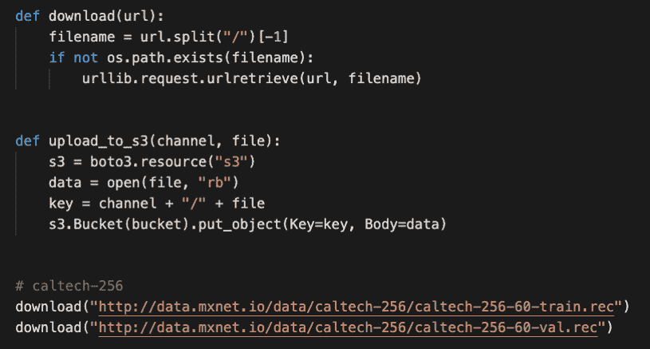

图 7.11 – 数据理解

对于一个公共数据集不可用的不同用例，您的组织需要拥有足够数量且质量最优的数据点。

这里提供了该阶段最佳实践的总结：

+   定义您将用作机器学习管道输入的各种数据源

+   确定要用于管道输入的数据形式（即，原始数据与转换数据）

+   使用数据血缘机制确保数据位置和来源被编目，如果需要进一步处理的话

+   使用不同的 AWS 管理服务来收集、存储和处理数据，无需额外繁重的工作

## 数据准备

**数据准备**是管道中的关键步骤，因为如果底层数据未经清理、整理和验证，机器学习模型无法表现最佳。在物联网工作负载中，由于边缘设备与人类在物理环境中共存（而不是托管在物理数据中心），产生的噪声数据量可能很大。此外，随着数据集从连接的生态系统持续增长，通过模式比较进行数据验证可以帮助检测新获得的数据集中的数据结构是否发生变化（例如，当某个特征被弃用时）。您还可以检测数据是否开始漂移——也就是说，传入数据的潜在统计信息与用于训练模型的初始数据集不同。漂移可能由于数据的潜在趋势或季节性或其他因素引起。

因此，一般建议从一个小型、统计上有效的样本开始数据准备，可以通过不同的策略（如下所示）迭代改进：

+   检查数据异常

+   检查数据模式的变化

+   检查不同数据集版本的统计数据

+   检查数据完整性，等等

AWS 提供了多种方法来帮助你大规模地准备数据。你已经在*第五章*，“从边缘摄取和流式传输数据”中玩过**AWS Glue**。如果你还记得，AWS Glue 允许你管理数据生命周期，例如发现、清理、转换和编目。一旦数据处理完成，数据质量达到所需标准，就可以将其作为机器学习过程的输入。

在本章中，我们向您介绍了一个不同的问题陈述，即处理非结构化数据集（即图像）。考虑到你正在使用一个已经标记的公共数据集，你将只将数据集分成训练集和验证集。数据科学家最常用的方法是将可用数据分成训练集和测试集，这通常是 70-30（%）或 80-20（%）。

以下代码可以启用从公共数据存储库中拆分两个数据集：

![图 7.12 – 数据准备![图 7.12 – 数据准备图 7.12 – 数据准备在现实世界中，你可能没有干净或标记好的数据。因此，你可以利用像**Amazon SageMaker Ground Truth**这样的服务，它具有自动标记数据（如图像、文本、音频、视频）的内建能力，同时可以轻松访问公共和私人的人类标记者。如果你缺乏内部机器学习技能或者对雇佣数据科学专业人士的成本敏感，这将非常有用。Ground Truth 使用机器学习模型自动标记原始数据，并以极低成本生成高质量的训练数据集。但如果模型无法自信地标记数据，它将把问题转交给人类来解决。数据准备的一个方面是理解你的数据集中的模式。本阶段最佳实践的总结如下：+   通过发现和转换来分析你的数据。+   选择合适的工具来完成合适的工作（例如数据标记与调整）。+   从数据组成中理解模式。# 数据可视化和分析在这个阶段，你可以通过各种分析和可视化工具继续数据探索，以评估数据在分析后的适合度，用于机器学习训练。你可以继续利用像 Amazon Athena、Amazon Quicksight 等在*第六章*，“在云上处理和消费数据”中介绍的服务。## 特征工程（FE）在这个阶段，作为物联网专业人士，您的责任非常有限。这是数据科学家将确定数据集中可用于训练 ML 模型的独特属性的地方。您可以将行视为观测值，将列视为属性（或属性）。作为数据科学家，您的目标是识别在解决特定业务问题（即特征）中起作用的列。例如，在图像分类中，汽车的颜色或品牌不是确定其为车辆的关键特征。这个过程，即选择和转换变量以确保创建优化的 ML 模型，被称为 **FE**。因此，FE 的关键目标是整理数据，使其以 ML 算法可以用来提取模式和推断更好结果的形式。让我们按以下方式分解 FE 的不同阶段：+   **特征创建**，以识别与特定问题相关的数据集属性，例如图像的像素高度和宽度+   **特征转换**，用于数据兼容性或质量转换，例如将输入调整到固定大小或将非数值数据转换为数值数据+   **特征提取**，确定一组提供最大价值的特征+   **特征选择**，通过观察相关阈值方差来过滤数据集中的冗余特征如果数据集中的特征数量与它可以生成的观测值相比变得非常大，ML 模型可能会遭受称为 **过拟合** 的问题。另一方面，如果特征数量有限，模型可能会做出很多错误的预测。这个问题被称为 **欠拟合**。换句话说，模型在测试数据上训练得很好，但无法将泛化应用于新的或未见过的数据集。因此，特征提取可以帮助优化一组特征，这些特征足以生成原始集的全面版本。除了减少过拟合风险外，特征提取还可以通过数据压缩和精度改进来加速训练。不同的特征提取技术包括 **主成分分析**（**PCA**）、**独立成分分析**（**ICA**）、**线性判别分析**（**LDA**）和 **典型相关分析**（**CCA**）。AWS 提供了多种方式，以帮助您以迭代的方式在您的数据集上进行大规模的特征工程（FE）。例如，Amazon SageMaker 作为一项托管服务，提供了一个托管 **Jupyter** 笔记本环境，您可以在其中使用 scikit-learn 库进行 FE。如果您的组织已经投资于 **提取、转换、加载**（**ETL**）框架，如 AWS Glue、**AWS Glue DataBrew**，或托管 Hadoop 框架，如 **Amazon Elastic MapReduce**（**Amazon EMR**），数据科学家可以在那里进行 FE 和转换，在利用 SageMaker 训练和部署模型之前。另一个选项是使用**Amazon SageMaker Processing**。此功能提供了一个完全管理的环境，用于在规模上运行分析作业以及模型评估，同时满足各种安全和合规要求。下面是这个阶段最佳实践的总结：+   评估数据集中符合*特征*范式的属性+   考虑对解决当前问题有用的特征，并删除冗余的特征+   建立一个迭代机制来探索新的特征或特征组合## 模型训练这一阶段的关键活动包括选择适合您问题的机器学习算法，然后使用前期预处理的数据（即特征）来训练模型。我们已经在“机器学习与物联网工作负载的分类”部分向您介绍了最常用于物联网工作负载的机器学习算法。让我们更深入地探讨这些算法，如下所示：+   **分类**——分类可以以两种方式应用；即二分类或多分类。二分类在您有两个组或类别的观察值时很有用，例如狗与猫，或电子邮件是否为垃圾邮件。多分类包括两个以上的组或类别，如一组花朵——玫瑰、百合、兰花或郁金香。不同的分类技术包括决策树、随机森林、逻辑回归和朴素贝叶斯。+   **回归**——分类用于预测离散值，而回归用于预测连续变量。回归可以以三种方式应用：*最小二乘法*、*线性*或*逻辑回归*。+   **聚类**——*K-means*是一个非常流行的聚类算法，通常用于将组分配给未标记的数据。此算法速度快且可扩展，因为它使用一种方法通过计算数据点与每个组中心之间的距离来分配每个组。在前面提到的停车位安全场景中，我们正在使用多类分类算法，因为我们期望模型能够对多个类别的对象进行分类，例如人类（特别是儿童）、汽车和动物（如猫、狗和兔子）。AWS 服务如 SageMaker 负责创建和管理训练所需的基础设施的重型工作。您可以选择不同类型的实例，例如启用 CPU 或 GPU 的实例。在下面的示例中，您只需指定实例类型为`ml.p2.xlarge`，以及其他所需的参数，如`volume`和`instance_count`，SageMaker 将完成其余工作，使用估算器接口来实例化和管理基础设施：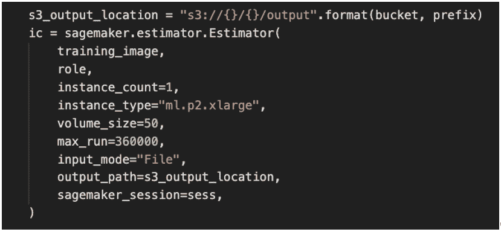

图 7.13 – 机器学习训练基础设施

在本章中，您将使用**MXNet 框架**，但 SageMaker 允许使用大多数其他机器学习框架，如 TensorFlow、PyTorch 和 Gluon 来训练您的模型。

请注意，模型优化是机器学习的一个关键方面，您需要使用不同参数集训练模型，以确定性能最佳的一个。SageMaker 超参数调优作业帮助使用贝叶斯优化或随机搜索技术来优化模型。正如以下示例所示，模型正在使用批大小和形状等超参数进行训练，以解决您的业务问题：

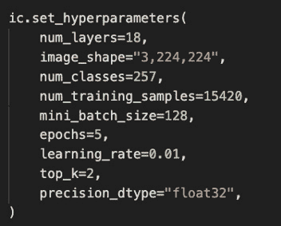

图 7.14 – 机器学习训练参数

为了使组织在机器学习方面的新手更容易且成本效益更高地进行模型训练，SageMaker 支持自动模型调优（通过**自动飞行**），以自动代表您执行这些操作。您还可以使用自定义机器学习算法作为容器镜像，并使用 SageMaker 进行训练。例如，如果您已经有一个自制的图像分类模型，它不使用任何 SageMaker 支持的机器学习框架，您可以使用您的模型作为容器镜像，并在 SageMaker 中重新训练它，而不需要从头开始。SageMaker 还提供监控和调试功能，允许清晰地查看训练指标。

本阶段最佳实践的总结如下：

+   为您的数据选择合适的算法和训练参数，或者让托管服务为您选择这些参数

+   确保数据集被分割成训练集和测试集

+   应用增量学习以构建最优化模型

+   监控训练指标以确保模型性能不会随时间退化

## 模型评估和部署

在这个阶段，模型被评估以确定它是否解决了业务问题。如果没有，您可以构建多个具有不同业务规则或方法（例如不同的算法、其他训练参数等）的模型，直到找到满足业务关键绩效指标的最优模型。数据科学家在测试模型（们）针对实际应用时，常常在这个阶段发现其他业务问题的推论。为了评估模型，它可以与*历史数据*（即离线评估）或*实时数据*（即在线评估）进行测试。一旦机器学习算法通过评估，下一步就是将模型（们）部署到生产环境中。

物联网/边缘工作负载的场景可能会变得有些棘手，尤其是当你的用例主要涉及在边缘进行离线处理和推理时。在这种情况下，你无法访问云的规模，因此最佳实践通常是进一步优化模型。**SageMaker Neo**在这种情况下可能很有用，因为它允许你一次训练模型，然后在云中的任何地方或边缘运行。使用这项服务，你可以在大多数常见的框架（如 MXNET、TensorFlow、PyTorch、Keras）中编译模型，并在你选择的平台（如英特尔、NXP、NVIDIA、苹果等硬件）上部署优化版本。以下代码有助于根据不同的参数（如操作系统和架构）优化模型：

![Figure 7.15 – 使用 SageMaker Neo 优化模型

![img/B17595_07_15.jpg]

Figure 7.15 – 使用 SageMaker Neo 优化模型

SageMaker Neo 的工作方式是，其编译器在底层使用 ML 模型来为相应的边缘平台或设备上的模型应用最佳性能。Neo 可以将模型优化到比非优化模型快 25 倍，且精度不受损失，并且所需的内存占用仅为非优化模型的十分之一。但这是如何实现的呢？让我们继续探索，如下所示：

+   Neo 具有编译器和运行时组件。

+   Neo 编译器有一个**应用程序编程接口**（**API**），可以读取使用各种框架开发的模型。一旦读取操作完成，它将框架特定的函数和操作转换为框架无关的中间表示。

+   转换完成后，它开始执行一系列优化。由于这种优化的结果，生成了二进制代码，并将其持久化到共享对象库中，同时模型定义和参数存储在单独的文件中。

+   最后，Neo 运行时 API 可以加载并执行此编译模型，以提供所需性能提升。

如你所想，这种优化对资源受限的边缘设备来说非常强大。以下截图以图解方式表示了如何在生产环境中部署优化模型。在本章的“动手实践 ML 架构”部分，你将学习如何使用 SageMaker Neo 部署训练的模型：

![ Figure 7.16 – 为硬件优化 ML 模型

![img/B17595_07_16.jpg]

Figure 7.16 – 为硬件优化 ML 模型

模型部署后，你需要监控性能指标随时间的变化。这是因为模型在实际数据开始与用于训练模型的数据不同时，其功能可能会变得不那么有效是很常见的。SageMaker 模型监控服务可以帮助检测偏差，并提醒数据科学家或 ML 操作员采取补救措施。

这里是这个阶段最佳实践的总结：

+   评估模型性能是否符合业务目标

+   确定您的模型所需的推理方法（离线与在线）

+   在云上部署模型，使用自动扩展选项，或在边缘使用针对特定硬件的优化

+   监控生产中的模型性能，以识别漂移并执行修复

## 机器学习设计原则

现在你已经了解了机器学习工作流程中的常见活动，让我们总结前述章节中解释的步骤设计原则，如下：

+   从用例逆向工作，以确定是否需要机器学习或可以使用经典分析方法解决的问题。

+   收集足够数量和高质量的数据，以构建准确的机器学习模型。

+   进行性能分析以了解数据关系和组成。记住：*垃圾输入=垃圾输出*，因此数据准备在机器学习过程中至关重要。

+   以一小组特征（即属性）开始，解决特定的业务问题，并通过实验进行演变。

+   考虑使用不同的数据集进行训练、评估和推理。

+   评估模型的准确性，并继续迭代，直到它对业务问题最优化。

+   确定模型是否需要在实时（在线）或历史（离线）数据上进行推理。

+   在云上或边缘托管模型的多个变体，并针对实际数据确定最优化的一种。

+   持续监控已部署模型的指标，以进行准确性、修复和改进。

+   利用托管服务来减轻管理底层基础设施的繁重工作。

+   尽可能自动化管道的不同活动，如数据准备、模型训练、评估、托管、监控和警报。

## 物联网工作负载的机器学习反模式

与任何其他分布式解决方案类似，基于机器学习的物联网工作负载也有反模式。以下是一些例子：

+   **不要把所有的鸡蛋放在一个篮子里**——端到端机器学习过程包括许多活动，因此需要以下不同角色：

    +   *数据工程师*——用于数据准备、设计 ETL（或 ELT）流程

    +   *数据科学家*——用于构建、训练和优化模型

    +   *开发运维（DevOps* 或 *MLOps）工程师*——用于构建具有操作和监控机制的可扩展和可重复的机器学习基础设施

    +   *物联网工程师*——用于构建从物联网网关到不同后端服务的云到边缘部署管道

    总结来说，期望单一资源在规模上执行所有这些活动将导致项目失败。

+   **不要假设需求；保持一致**——有大量工具可用于分析和机器学习目的，每个工具都有其优缺点。例如，考虑以下：

    +   **R** 和 **Python** 都是开发机器学习系统的流行编程语言。一般来说，业务分析师或统计学家会倾向于使用 R 或其他商业解决方案（如 **MATLAB**），而数据科学家会选择 Python。

    +   同样，数据科学家可能有自己的首选机器学习框架，例如 TensorFlow 而不是 PyTorch。选择不同的语言或框架会产生下游影响——例如，边缘硬件可能需要支持用于推理机器学习模型的相应版本或库。

    因此，对于所有参与机器学习活动的不同角色来说，保持对业务和技术要求的统一至关重要。

+   **规划技术债务**—由于机器学习系统依赖于通常由于噪声而不太可靠的物联网来源的数据，因此它们容易积累技术债务。这也可能由于对其他上游数据不一致的依赖而发生。例如，考虑以下情况：

    +   如果任何特征（或几个特征）的组成发生实质性变化，它将导致模型在现实世界中的行为不同。这个问题也被称为**训练-服务偏差**，即你在训练和服务管道中处理数据的方式存在差异。

    +   机器学习工作负载与传统 IT 系统不同的原因是，只有通过在单元测试中使用小样本的真实数据，才能确定其行为。

因此，监控模型的准确性、根据收集到的数据知识迭代优化并重新部署是关键。

# 实践机器学习架构

在本节中，你将在一个连接的 HBS 节点上部署一个解决方案，这将要求你在云端构建和训练机器学习模型，然后将它们部署到边缘进行推理。以下截图显示了实验室的架构，其中突出显示了你需要完成的步骤（1-5）：

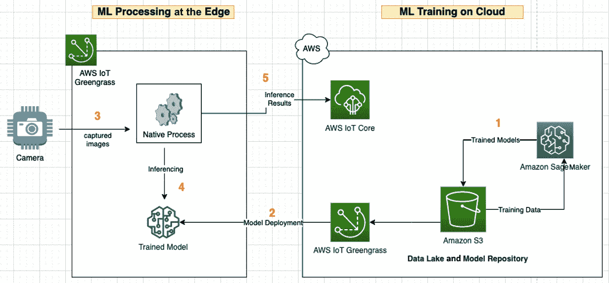

图 7.17 – 实践机器学习架构

你的目标包括以下内容，这些内容在先前的架构中以不同的步骤突出显示：

+   使用 Amazon SageMaker 构建机器学习工作流程

+   使用 AWS IoT Greengrass 将机器学习模型从云端部署到边缘

+   在边缘执行机器学习推理并可视化结果

以下表格显示了你在实验室中将要使用的组件列表：


图 7.18 – 实践实验室组件

## 构建机器学习工作流程

在本节中，你将使用 Amazon SageMaker Studio 构建、训练和测试机器学习模型。

注意

使用 Amazon SageMaker 训练模型将产生额外的成本。如果你想要节省这部分成本，请使用 GitHub 上为你平台提供的已训练机器学习模型，并跳到下一节，即从云端部署模型到边缘。

Amazon Sagemaker Studio 是一个基于 Web 的**集成开发环境**（**IDE**），它为数据科学家（或 ML 工程师）提供了一个一站式商店，用于所有 ML 相关事务。为了训练模型，你将使用 Caltech 提供的公共数据集，该数据集包含 256 个物体类别中超过 30,000 张图片。让我们开始。按照以下步骤操作：

1.  请导航到**Amazon SageMaker**控制台，并从左侧面板选择**SageMaker Domain Studio**。如果你第一次与工作室交互，你将需要完成一次性的设置。请选择**快速设置**，点击**提交**，选择**默认 VPC 及其子网（s）**，然后点击**保存并继续**。

1.  设置工作室需要几分钟时间。请等待状态显示为**Ready**，然后点击**启动应用** -> **工作室**。

1.  这应该会为你打开 SageMaker Studio（也称为 Jupyter 控制台）。如果你是 Jupyter 的新手，可以将它视为类似于 Eclipse、Visual Studio 等用于开发分布式应用的 IDE。

1.  请使用左上角的**上传文件**按钮，从`chapter7/notebook`文件夹上传`Image-Classification*.ipynb`和`synset.txt`文件。

1.  双击打开 Jupyter 笔记本，并选择 Python 运行时和内核，如下面的截图所示：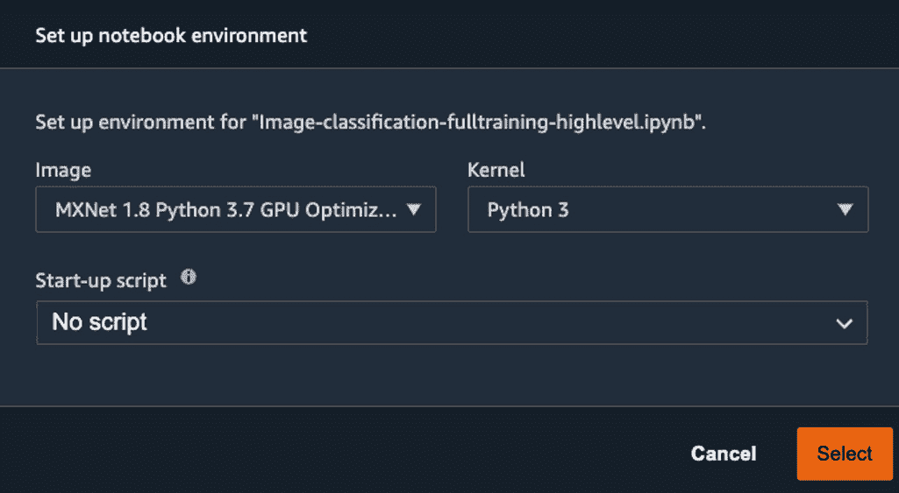

    图 7.19 – Jupyter 笔记本内核

1.  选择内核是一个关键步骤，因为它为你提供了训练 ML 模型所需的适当运行时。更新内核（右上角）以选择用于训练 ML 模型的 GPU 运行时。由于你将处理图像，因此 GPU 运行时更合适。选择内核后，Jupyter 笔记本将具有以下内核和配置：

    图 7.20 – 选择内核

1.  现在，请慢慢浏览代码。请确保阅读代码前的文本，以便更好地理解每个这些块的功能。

1.  点击与代码块相邻的`*`)。星号表示代码仍在运行。请在继续之前等待它消失：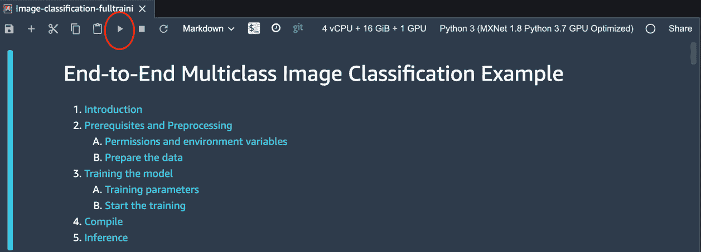

    图 7.21 – 运行步骤

1.  如果你完成所有步骤直到最后，你将能够完成以下步骤：

    1.  下载训练数据集

    1.  准备和预处理数据

    1.  将数据集拆分为训练样本和测试样本

    1.  使用适当的框架和参数训练模型

    1.  优化边缘硬件上的模型

    1.  在 Amazon S3 存储库上托管模型工件

    模型训练可能需要 10 分钟才能完成。训练完成后，你将拥有一个使用 MXNet 框架训练的 ML 模型，该模型能够对 256 个不同的物体进行分类。

1.  请导航到 S3 存储桶（`sagemaker-<region>-<accountid>/ic-fulltraining/`）。复制 S3 的`DLR-resnet50-*-cpu-ImageClassification.zip`文件，因为您将在下一节中使用它。

现在模型已经在云端训练，您将使用 Greengrass 将其部署到边缘进行近实时推理。

## 从云端到边缘部署模型

作为物联网从业者，将模型从云端部署到边缘是您将主要参与的步骤。这是过渡点，ML 或数据科学团队提供了一个需要推送到边缘设备集群的模型。虽然在现实世界中可以使用**持续集成/持续部署（CI/CD）**管道自动化这些步骤，但您将手动进行以详细了解该过程。

与您在前面章节中创建的用于在边缘部署不同过程（如发布者、订阅者、聚合器）的组件类似，部署 ML 资源需要相同的方法。我们将创建一个包含在上一节中训练的 ML 模型的组件。我们将继续使用 AWS 控制台以保持一致性。

注意

Greengrass 提供了一个示例图像分类模型组件，您在*第四章*，“将云扩展到边缘”中已经尝试过。在这里，您正在学习如何使用您自定义的资源修改现有的模型组件。在现实世界中，您甚至可能需要从头开始创建一个新的模型组件，您可以遵循类似的过程。

让我们开始。按照以下步骤进行：

1.  请导航到`chapter7/recipe`文件夹。现在，让我们更新食谱以指向训练好的模型。请将 URI（带有箭头标记）替换为在*构建 ML 工作流*部分的*步骤 10*中复制的 S3 URI，如图中所示。如果您跳过了前面的部分并使用了 GitHub 上的训练模型，请手动将模型上传到您选择的 S3 存储桶，并相应地更新食谱中的 S3 URI：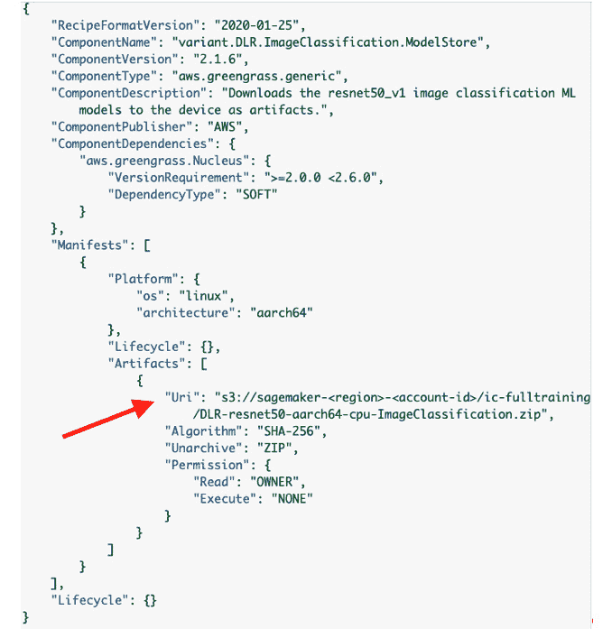

    图 7.22 – 配置食谱

1.  点击**创建组件**以完成模型资源的创建。此模型应出现在**组件**页面上的**我的组件**标签页中。

1.  现在，您需要创建一个推理组件。这是触发边缘上的模型并发布结果到云的资源。

    注意

    Greengrass 提供了一个示例图像分类推理组件，`aws.greengrass.DLRImageClassification`，您已经在*第四章*，“将云扩展到边缘”中尝试过。在这里，您正在学习如何使用相同的推理组件与您的自定义机器学习模型一起工作。在现实世界中，您可能需要创建一个新的推理组件，从头开始，并使用修改后的清单文件，就像您刚才对模型所做的那样。

1.  在 `variant.DLR.ImageClassification.ModelStore`：通过 SageMaker 训练的机器学习模型。您可以从 `aws.greengrass.DLRImageClassification` 中选择此选项：机器学习模型的推理脚本。您可以从 `variant.DLR` 中选择此选项：机器学习推理所需的运行时。您可以从 **公共组件** 选项卡中选择此选项。

1.  在 **选择组件** 页面上，确保选择了以下屏幕截图所示的组件，然后点击 **下一步**：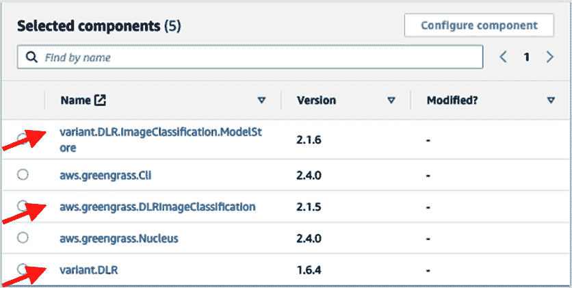

    图 7.23 – Greengrass 组件依赖关系

1.  在 `aws.greengrass.DLRImageClassification` 组件上。这将启用 **配置组件** 选项；点击它。

1.  使用以下配置更新 **合并配置** 部分（右侧面板）并点击 **确认**：

    ```py
    {
      "InferenceInterval": "5"
    }
    ```

1.  在以下屏幕中保持所有其他选项为默认设置，并选择 **部署**。

现在，让我们继续下一节。

## 在边缘执行机器学习推理并验证结果

因此，到目前为止，模型已在 Greengrass 上构建、训练和部署。要推理的图像存储在以下目录中：


图 7.24 – Greengrass 中心上的图像目录

与猫图像类似，您还可以部署其他图像（如狗、人类等），并配置推理组件对它们进行推理。

让我们可视化从边缘发布到云端的推理结果。这些结果对于评估模型是否在预期的准确率水平上运行至关重要。我们将按以下步骤进行：

1.  首先，让我们检查组件状态是否显示为正在运行，并检查 Greengrass 日志以验证没有异常。我们将需要以下代码来完成此操作：

    ```py
    sudo /greengrass/v2/bin/greengrass-cli component list
    sudo tail -100f /greengrass/v2/logs/greengrass.log
    sudo tail -100f aws.greengrass.DLRImageClassification.log
    ```

1.  如果没有错误，请导航到 AWS IoT 控制台，选择 **测试**，然后选择 **MQTT 测试客户端**。

1.  在 `ml/dlr/image-classification` 下。点击 **订阅** 查看结果，结果应该看起来像这样：

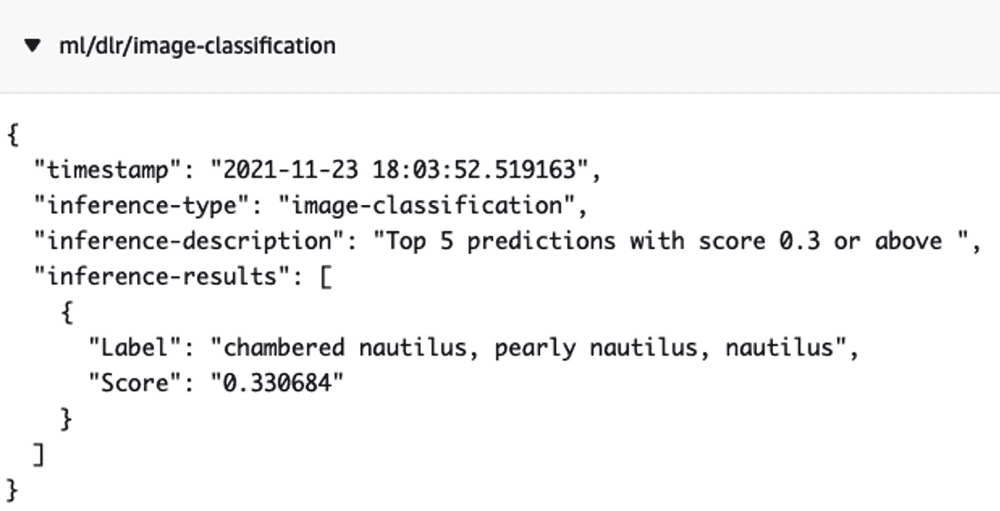

图 7.25 – 机器学习推理结果

如果您遇到困难或需要帮助，请参阅 GitHub 中的 **故障排除** 部分。

恭喜您完成本章的动手实践部分！现在，您的连接 **HBS 中心** 已配备机器学习能力，可以在在线和离线条件下运行，并能在您的停车位区域内对人类、宠物和车辆进行分类。

挑战区域（可选）

您能想出如何对发布到 AWS IoT Core 的推理结果采取行动吗？这将有助于自动通过通知/警报触发公告，以警告在停车位区域内散步的孩子们/宠物。

**提示**：您需要在 IoT 规则引擎中定义路由逻辑，以便通过通知服务推送结果。

现在你已经学会了如何在边缘为物联网工作负载构建机器学习能力，这不是很神奇吗？现在是时候好好休息一下了！让我们通过快速总结和一系列问题来结束这一章。

# 摘要

在本章中，你了解了与物联网工作负载相关的机器学习概念。你学习了如何设计机器学习管道，以及针对物联网工作负载优化模型。你实现了边缘到云的架构，以对非结构化数据（图像）进行推理。最后，你通过可视化边缘的推理结果来验证工作流程，以获得更多见解。

在下一章中，你将学习如何实施 DevOps 和 MLOps 实践，以实现大规模部署的物联网边缘工作负载的运营效率。

# 知识检查

在进入下一章之前，通过回答以下问题来测试你的知识。答案可以在书的末尾找到：

1.  判断对错：存在两种类型的机器学习算法：监督学习和无监督学习。

1.  你能回忆起四种机器学习系统的类型及其重要性吗？

1.  判断对错：K-means 是一种分类算法。

1.  你能将机器学习项目生命周期的三个阶段按正确顺序排列吗？

1.  你能想到至少两种用于训练机器学习模型的常用框架吗？

1.  用于将训练好的模型从云端部署到边缘的 AWS 服务是什么？

1.  判断对错：AWS IoT Greengrass 只支持用于图像分类问题的自定义组件。

1.  你能告诉我关于机器学习与物联网工作负载的一个反模式吗？

# 参考文献

查看以下资源，以获取本章讨论的概念的更多信息：

+   CRISP: [`www.datascience-pm.com/crisp-dm-2/`](https://www.datascience-pm.com/crisp-dm-2/%0D)

+   *机器学习简史*：[`www.forbes.com/sites/bernardmarr/2016/02/19/a-short-history-of-machine-learning-every-manager-should-read/?sh=1ca6cea115e7`](https://www.forbes.com/sites/bernardmarr/2016/02/19/a-short-history-of-machine-learning-every-manager-should-read/?sh=1ca6cea115e7%0D)

+   *AWS 上的机器学习*：[`aws.amazon.com/machine-learning/`](https://aws.amazon.com/machine-learning/%0D)

+   机器学习与 AWS 物联网服务：[`aws.amazon.com/blogs/iot/category/artificial-intelligence/sagemaker/`](https://aws.amazon.com/blogs/iot/category/artificial-intelligence/sagemaker/%0D)

+   *使用 AWS IoT Greengrass 版本 2 与 Amazon SageMaker Neo 和 NVIDIA DeepStream 应用程序*：[`aws.amazon.com/blogs/iot/using-aws-iot-greengrass-version-2-with-amazon-sagemaker-neo-and-nvidia-deepstream-applications/`](https://aws.amazon.com/blogs/iot/using-aws-iot-greengrass-version-2-with-amazon-sagemaker-neo-and-nvidia-deepstream-applications/%0D)

+   机器学习架构框架：[`docs.aws.amazon.com/wellarchitected/latest/machine-learning-lens/machine-learning-lens.html`](https://docs.aws.amazon.com/wellarchitected/latest/machine-learning-lens/machine-learning-lens.html%0D)

+   通过**机器学习大学**（**MLU**）学习 AWS：[`aws.amazon.com/machine-learning/mlu/`](https://aws.amazon.com/machine-learning/mlu/)
