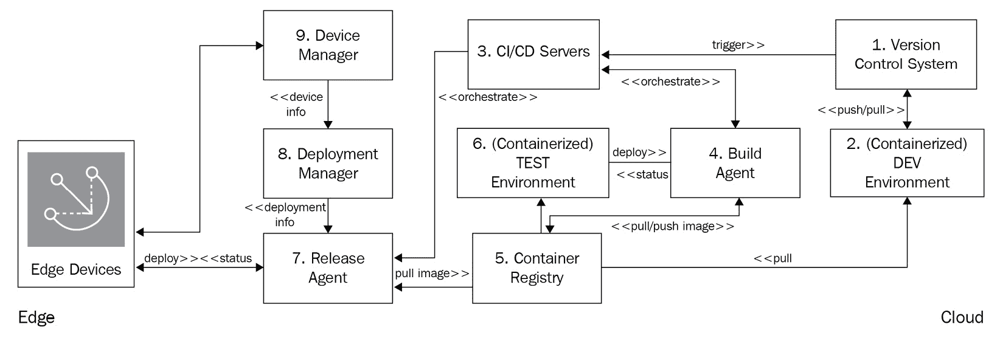

# *第八章*：边缘的 DevOps 和 MLOps

21 世纪的连接设备激增改变了我们的生活方式。很难回忆起没有智能手机、智能手表、个人数字助理（如亚马逊 Alexa）、联网汽车、智能恒温器或其他设备的便利日子。

这种采用趋势不会很快放缓，因为行业预测，在未来几年内，全球将有超过 250 亿个物联网设备。随着连接技术的普及，新的常态是设备始终处于开启状态。换句话说，*设备应该始终工作*。不仅如此，我们还期望这些设备在其生命周期内持续变得更智能，并通过新功能、增强或错误修复保持安全。但如何可靠且大规模地实现这一点呢？亚马逊首席技术官和副总裁 Werner Vogels 经常说，“*一切都会时常出问题*。”保持任何技术解决方案始终运行是一个挑战。

在**物联网**领域，由于边缘设备部署在多样的操作条件下，易受环境干扰，并且具有多层连接性、通信和延迟，这些挑战变得更加严重和复杂。因此，构建边缘到云的连续机制，以收集已部署的边缘设备队伍的反馈并迅速采取行动，至关重要。这正是 DevOps 在物联网中发挥作用的地方。**DevOps**是**开发和运营**的缩写。它促进了一种敏捷的方法，从云到边缘执行**持续集成和持续部署**（**CI/CD**）。

在本章中，我们将重点关注如何利用 DevOps 能力来处理物联网工作负载。我们还将扩展我们的讨论范围至边缘的**MLOps**，这意味着为**机器学习**（**ML**）工作负载实施敏捷实践。在您构建 ML 管道时，您已经在上一章中学习了这些概念的一些内容。本章的重点将是高效地部署和运行这些模型。

您已经熟悉在边缘开发本地流程或以解耦方式从云中部署组件。在本章中，我们将解释如何使用 DevOps 原则将这些部分拼接在一起，这将有助于自动化一队边缘设备的开发、集成和部署工作流程。这将使您能够高效地运营边缘的智能分布式架构（即 Greengrass 启用的设备），并帮助您的组织更快地将不同产品和服务推向市场。

在本章中，我们将涵盖以下主题：

+   定义物联网工作负载的 DevOps

+   在边缘执行 MLOps

+   在边缘部署容器的实践操作

+   检查您的知识

# 技术要求

+   本章的技术要求与在*第二章*中概述的要求相同，即*边缘工作负载基础*。完整的详细要求请参阅该章节。

现在，让我们深入本章内容。

# 定义针对物联网工作负载的 DevOps

DevOps 改变了当今世界公司开展业务的方式。例如，亚马逊、Netflix、谷歌和 Facebook 每周进行数百次或更多部署，以推送不同的功能、增强或错误修复。对于最终用户来说，这些部署通常是透明的，因为他们不会因为这些持续的部署而经历任何停机时间。

DevOps 是一种方法，它通过缩短开发周期和增加发布频率，使开发者和运维人员更接近，从而在更短的时间内实现可量化的技术和商业效益。一个常见的误解是，DevOps 只是一套用于更快构建和交付软件的新技术。DevOps 还代表了一种文化转变，旨在促进不同团队之间的所有权、协作和凝聚力，以促进组织内的创新。DevOps 已被各种规模的组织和企业采用，以针对分布式工作负载更快地提供创新、增强和运营效率。以下图表显示了软件交付的良性循环：


图 8.1 – 软件交付的良性循环

为了简洁起见，我们在此不会深入探讨 DevOps 或**敏捷**实践的概念。相反，我们将专注于介绍围绕 DevOps 的高级概念，并讨论其对物联网工作负载的相关性。

## DevOps 基础

DevOps 将不同的工具和最佳实践结合在一起，如下所示：

+   **共享代码库**：在代码开发领域，使用版本控制系统是前提和最佳实践。部署包中所需的所有工件都需要存储在这里。例如，包括**Bitbucket**、**Gitlab**和**AWS CodeCommit**。

+   **持续集成**（**CI**）：在这一步中，开发者会定期在代码库中提交代码更改。每次提交都会触发一个自动构建过程，该过程执行代码扫描、代码审查、编译和自动单元测试。这允许开发者快速识别和修复错误，使他们能够遵守最佳实践并更快地交付功能。此过程的结果包括符合组织强制执行的实践的构建工件（如二进制文件或可执行程序）。工具链的例子包括**Jenkins**、**Bamboo**、**GitLab CI**和**AWS CodePipeline**。对于物联网工作负载，可以使用类似的工具链。

+   **持续交付**（**CD**）：这一步在 CI 的先前步骤上进行了扩展，将所有编译的二进制文件部署到预发布或测试环境。一旦部署，与集成、功能或非功能性要求相关的自动化测试作为工作流程的一部分执行。测试工具链的例子包括**JMeter**、**Selenium**、**Jenkins**和**Cucumber**。这允许开发者彻底测试更改，并在整体应用程序的上下文中预先发现问题。最后一步是将验证过的代码工件部署到生产环境（无论是否有手动批准）。

+   **持续监控**（**CM**）：DevOps 的核心目标是消除开发和运维团队之间的隔阂。因此，如果您希望有一个持续的反馈循环来观察、警报和缓解与基础设施或托管应用程序相关的问题，CM 是一个关键步骤，如下面的图所示：


图 8.2 – DevOps 生命周期

常见的监控工具链包括**Amazon CloudWatch**、**Amazon X-Ray**、**Splunk**和**New Relic**。

+   **基础设施即代码**（**IaC**）：遵循 CI/CD 的软件开发实践以加快代码的发布是一个很好的第一步，但这还不够。团队可以使用敏捷流程开发和测试他们的代码，但最终交付到生产环境仍然遵循瀑布方法。这通常是由于缺乏对动态配置或扩展基础设施的控制。传统上，组织将会有系统管理员手动配置所需的基础设施资源，这可能需要几天、几周或几个月。这就是 IaC 发挥作用的地方，因为它允许您使用代码（或 API）以自动化的方式配置和管理基础设施、配置和策略，而不需要任何可能存在错误或耗时的手动干预。常见的工具链包括**Amazon CloudFormation**、**HashiCorp Terraform**和**Ansible**。

现在我们已经涵盖了 DevOps 的基础知识，让我们了解其与物联网和边缘的相关性。

## DevOps 对物联网和边缘的相关性

从简单的射频识别系统到今天的微控制器和微处理器的边缘计算演变，为需要在边缘构建分布式架构的行业细分市场打开了不同的用例。例如，连接的 HBS 中心具有以下多样化的功能：

+   后端传感器/执行器的网关

+   本地组件的运行时间

+   连接到云的接口

+   消息代理

+   数据流处理器

+   机器学习推理引擎

+   容器编排器

边缘的工作量很大！因此，传统的开发和交付嵌入式软件的方式已经不再可持续。那么，让我们讨论物联网设备生命周期中的核心活动，如图表所示，以了解 DevOps 的相关性：


图 8.3 – DevOps 在物联网工作负载中的相关性

DevOps 的关键组件，如 CI/CD/CM，对于物联网工作负载同样相关。这组活动通常被称为 **EdgeOps**，正如我们之前观察到的，它们在边缘和云之间应用方式不同。例如，由于我们需要在部署在世界的相同硬件上测试设备软件，因此边缘的 CI 是不同的。然而，由于边缘部署相关的成本和风险较高，降低边缘设备更新的频率是常见的。组织通常拥有不同的硬件集，用于原型设计和生产运行时。

## DevOps 在物联网工作负载中的挑战

现在你已经了解了如何将 DevOps 阶段映射到不同的物联网活动，让我们更深入地探讨一下。以下图表展示了设备生命周期中通常涉及的工作流程，从其创建到退役：


图 8.4 – 物联网的 DevOps 工作流程

在这里，你可以看到物联网工作负载与其他云托管工作负载之间的关键差异。让我们看看。

*制造过程涉及*：

分布式工作负载，如 Web 应用程序、数据库和 API，使用云平台提供的底层基础设施。软件开发者可以使用 IaC 实践，并将它们与其他 CI/CD 机制集成，以提供自动所需的云资源来托管他们的工作负载。对于边缘工作负载，产品超越了任何数据中心边界。虽然在测试或原型阶段可以在云平台提供的虚拟基础设施上运行边缘应用程序，但实际产品始终托管在硬件上（例如，本书项目中的 **Raspberry Pi**）。在供应链中，始终依赖于合同制造商（或其他供应商）根据编程设备固件所需的规格进行硬件制造。尽管可以使用 DevOps 实践在云上开发固件，但固件映像的烧录仅在制造时间进行。这阻碍了在传统 DevOps 工作流程中常见的端到端自动化，其中基础设施（如 AWS EC2 实例）可以轻松镜像并可用于应用程序部署。以下图表展示了设备制造和分发的典型生命周期：


图 8.5 – 物联网设备制造过程

*确保硬件安全至关重要*：

**开放网络应用安全项目**（**OWASP**）列出的边缘工作负载的一些关键漏洞如下：

+   弱、可猜测或硬编码的密码

+   缺乏物理加固

+   不安全的数据传输和存储

+   不安全默认设置

+   不安全生态系统接口

尽管分布式工作负载可能面临相似的挑战，但使用云原生控制措施来缓解这些挑战，使得它们比物联网工作负载更容易自动化。以 AWS 为例，AWS 基础设施内部的所有通信（例如跨数据中心）默认都是加密传输的，无需采取任何行动。静态数据可以通过一键选项（或自动化）使用 AWS 提供的密钥管理基础设施进行加密（或客户可以自行提供）。每个服务（或托管工作负载）都需要通过云原生**身份与访问管理**服务启用访问控制以进行身份验证和授权，这些也可以通过 IaC 实施自动化。每个服务（或托管工作负载）都可以利用云原生监控服务（如**Amazon CloudTrail**或**Amazon CloudWatch**）提供的可观察性和可追溯性。

相反，对于边缘工作负载，所有上述要求都必须在制造、组装和注册设备时得到满足，从而给供应链带来更大的压力，手动执行这些操作，而不是一键或自动化工作流程。例如，作为最佳实践，边缘设备应使用 X.509 证书等凭证通过 TLS1.2 与云进行相互认证，而不是使用用户名和密码或对称凭证。此外，凭证应通过正确的权限集（通过策略）实现最小权限访问，这有助于确保设备正在实施所需的访问控制以保护设备身份，并且传输中的数据得到完全加密。此外，边缘上的设备凭证（如 X.509 证书）必须位于安全元素或**可信平台模块**（**TPM**）内部，以降低未经授权访问和身份泄露的风险。此外，还需要安全的机制来分离设备上的文件系统，并使用不同的加密工具（如**dm-crypt**、**GPG**和**Bitlocker**）加密静态数据。不同边缘组件的可观察性和可追溯性实现留给各自的拥有者。

*缺乏边缘标准化的框架*：

边缘组件不再局限于路由器、交换机、微型服务器或工作站。相反，行业正在以不同的方式向边缘构建分布式架构，如下所示：

+   **雾计算**，它允许我们使用异构节点的分布式计算基础设施将更多智能转移到边缘

+   **移动/多接入计算（MEC**），通过整合下一代无线电频谱（如 5G）来使边缘可能的新一代工作负载成为可能

+   **数据中心即盒子**，通过云集成在边缘实现资源密集型计算能力

下面的图示显示了包含分布式架构中常见各种技术能力的边缘到云工作流程：


图 8.6 – 边缘到云架构

边缘架构的标准仍在不断发展。考虑到存在不同的连接接口、通信协议和拓扑结构，解决不同用例的方式也各不相同。例如，连接接口可能包括不同的短距离（如*BLE*、*Wi-Fi*和*Ethernet*）或长距离无线网络（如*蜂窝*、*NB-IoT*和*LoRa*）。所使用的连接接口需要在硬件设计阶段确定，并作为一个一次性过程实现。通信协议可能包括 TCP（面向连接，如*MQTT*和*HTTPS*）或 UDP（无连接，如*CoAP*）。回想一下我们在*第二章*“边缘工作负载的基础”中回顾的**开放系统互联**（**OSI**）模型的层级，通信接口的选择可以灵活，只要底层第 4 层协议在硬件上得到支持。例如，如果硬件支持 UDP，可以通过配置更改激活它，并根据需要安装额外的第 7 层软件（如 COAP 客户端）。因此，这一步可以通过云到边缘的 DevOps 工作流程（即 OTA 更新）来完成。将更多智能带到边缘需要处理在低功耗计算基础设施上运行分布式拓扑结构所带来的挑战。因此，有必要定义标准和设计原则，以设计、部署和运营边缘优化的软件工作负载（如代理、微服务、容器、缓存和轻量级数据库）。

希望这能帮助你从 DevOps 的角度理解边缘工作负载的独特挑战。在下一节中，你将了解 AWS IoT Greengrass 如何帮助你构建和运营边缘的分布式工作负载。

# 理解边缘的 DevOps 工具链

在前面的章节中，你学习了如何在边缘本地开发和部署原生进程、数据流和机器学习模型，然后使用**Greengrass 的**内置 OTA 机制进行大规模部署。在这里，我们将解释相反的方法；即在云中使用 DevOps 实践构建分布式应用程序，并将它们部署到边缘。以下图表显示了使用**OTA**更新机制持续构建、测试、集成和部署工作负载的方法：


图 8.7 – 边缘应用的 CI/CD 视图

在 AWS IoT Greengrass 上构建边缘分布式架构的两种最常见方式是通过使用 AWS Lambda 服务或 Docker 容器。

## AWS IoT Greengrass 上的 AWS Lambda

我要明确指出，为了避免任何混淆，*第五章*中引入的 Lambda 设计概念，*从边缘摄取和流式传输数据*，是一种用于在边缘操作流式和批处理工作流程的架构模式。**AWS Lambda**则相反，是一种无服务器计算服务，提供执行任何类型应用程序的运行时，无需管理。它允许开发者专注于业务逻辑，用不同的编程语言（如*C*、*C++*、*Java*、*Node.js*和*Go*）编写代码，并将其作为 ZIP 文件上传。服务从那里开始配置底层基础设施的资源，并根据传入的请求或事件进行扩展。

AWS Lambda 在设计基于事件的架构以进行实时处理、批处理和 API 驱动的工作负载时，一直是一种流行的计算选择。因此，AWS 决定通过**Amazon IoT Greengrass**扩展 Lambda 运行时对边缘处理的支持。

那么，你在想 AWS Lambda 在边缘实施的价值是什么吗？

你并不孤单！考虑到在边缘进行自动硬件配置不是一种选择，正如本章前面所解释的，这里的价值在于从云到边缘的互操作性、一致性和连续性。对于物联网工作负载来说，云（**分布式栈**）和边缘（**嵌入式栈**）有不同的代码库是很常见的，这导致了代码集成、测试和部署方面的额外复杂性。这导致了额外的运营开销和市场延迟时间。

AWS Lambda 旨在弥合这一差距，以便云和嵌入式开发者可以使用类似的技术栈进行软件开发，并拥有互操作性解决方案。因此，使用通用工具链从云到边缘构建 DevOps 管道变得可行。

#### AWS IoT Greengrass 上 AWS Lambda 的优势

在边缘运行 Lambda 函数有几个好处，如下所述：

+   部署在边缘设备本地的 Lambda 函数可以连接到不同的物理接口，如 CANBus、Modbus 或以太网，以访问硬件上的不同串行端口或 GPIO，类似于嵌入式应用程序。

+   Lambda 函数可以在 AWS IoT Greengrass 和云资源之间充当不同边缘组件（如流管理器）之间的粘合剂。

+   AWS IoT Greengrass 通过使用别名或特定版本为边缘提供 Lambda 函数，使部署不同版本的 Lambda 函数变得更加容易。这有助于持续交付，并在蓝/绿部署等场景中很有用。

+   *细粒度访问控制*，包括为不同的本地资源（如磁盘卷、串行端口或 GPIO）指定配置（以 root 运行）或权限（读取/写入），可以用于管理 Lambda 函数。

+   Lambda 函数可以在**容器化**和**非容器化**模式下运行。非容器化模式移除了抽象层，允许 Lambda 作为常规进程在操作系统上运行。这对于对延迟敏感的应用程序（如机器学习推理）很有用。

+   最后，AWS IoT Greengrass 允许你管理边缘上 Lambda 函数可以使用的硬件资源（RAM）。

以下图表展示了已部署在边缘的 AWS Lambda 函数如何与物理层（如文件系统）或抽象层（如 AWS IoT Greengrass 上的流管理器）的不同组件进行交互：

![Figure 8.8 – Lambda interactions on the edge]

![img/B17595_08_08.jpg]

图 8.8 – Lambda 在边缘的交互

在这里，你可以看到 Lambda 提供了一些独特的价值主张，这些价值主张你需要通过本地进程自行构建。

#### Lambda 在边缘的挑战

如你现在所理解的，每个解决方案或架构都有其权衡之处。AWS Lambda 也不例外，可能面临以下挑战：

+   *与本地进程相比，Lambda 函数可能更占用资源*。这是因为它们需要额外的库。

+   *Lambda 函数仅适用于 AWS*。因此，如果你正在寻找一个云无关的边缘解决方案（以减轻供应商锁定问题），你可能需要坚持使用本地进程或 Docker 容器。尽管 Greengrass v2 作为边缘软件是开源的，但 AWS Lambda 函数不是。

现在，让我们了解边缘的容器。

## 边缘容器

**容器**是一个软件单元，它将应用程序运行所需的所有代码及其依赖项打包在一起，以便在不同的计算环境中可靠地运行。本质上，容器为其托管应用程序提供了一个抽象层，从底层的 *OS*（例如 Ubuntu、Linux 或 Windows）或 *架构*（例如 x86 或 ARM）中分离出来。此外，由于容器轻量级，单个服务器或虚拟机可以运行多个容器。例如，您可以使用各自的容器镜像在同一服务器（或 VM）上运行一个 *3 层架构*（Web、应用和数据库）。最流行的两个开源容器管理框架是 **Docker** 和 **Kubernetes**。

在本节中，我们将主要讨论 Docker，因为它是 AWS IoT Greengrass 在编写时唯一原生支持的选项。与 Lambda 类似，Docker 支持一系列编程语言和工具链，以便开发者以敏捷的方式开发、操作和部署他们的应用程序。以下图示展示了基于 Docker 的工作负载在 AWS IoT Greengrass 上的参考架构：


图 8.9 – Docker 抽象层

那么，为什么在边缘使用 Lambda 运行容器呢？

容器可以带来 Lambda 所有的好处（以及更多），同时具有异构性（不同的平台）、开源和针对边缘资源进行了更好的优化。容器还有一个更广泛的开发者社区。由于容器具有编排和抽象层，它不依赖于其他运行时，如 AWS IoT Greengrass。因此，如果您的组织决定迁移到另一个边缘解决方案，容器比 Lambda 函数更易于移植。

### AWS IoT Greengrass 上 Docker 容器的优势

使用 Greengrass 在边缘运行容器有以下优势：

+   开发者可以继续使用他们现有的 CI/CD 管道，并将工件（即 **Docker 镜像**）存储在不同的代码仓库中，例如 **Amazon Elastic Container Registry** （**ECR**），公共 Docker Hub，公共 Docker Trusted Registry 或 S3 桶。

+   Greengrass 简化了向边缘部署的过程，唯一的依赖是拥有 `aws.greengrass.DockerApplicationManager`，它使 Greengrass 能够管理凭证并从支持的仓库下载镜像。

+   Greengrass 为 Docker 工具提供了第一级支持，例如 `docker-compose`、`docker run` 和 `docker load`，所有这些都可以作为组件配方文件中的依赖项包含，也可以单独用于测试或监控目的。

+   最后，Greengrass 还支持基于 Docker 的应用程序和其他组件之间的进程间通信。

以下图示展示了如何使用 CI/CD 方法开发容器化应用程序，并在运行 AWS IoT Greengrass 的同时部署到边缘：



图 8.10 – Docker 工作负载的 CI/CD 方法

接下来，让我们了解边缘 Docker 的挑战。

### 边缘 Docker 的挑战

在边缘运行容器有一些权衡需要考虑，如下所示：

+   在边缘大规模管理容器会带来更多的运营开销，因为它可能会变得复杂。因此，它需要仔细的设计、规划和监控。

+   当您使用私有和公共 Docker 镜像构建复杂的边缘应用程序时，您也在增加攻击面。因此，始终遵守各种运营和安全最佳实践至关重要。

+   除了 AWS IoT Greengrass 特定的更新外，您还需要为 Docker 特定的实用程序制定补丁和维护程序，这反过来又增加了运营开销和网络费用。

+   对于对延迟敏感的使用案例，可能不适合使用容器增加抽象层。例如，在 GPU 上执行时间敏感的机器学习推理，如通过计算机视觉检测家庭入侵，可能作为容器上的原生进程运行得更好。

在本章的实验室部分，您将通过使用 AWS IoT Greengrass 将基于 Docker 的应用程序部署到边缘来亲自动手。

## Greengrass 部署的附加工具集

与其他 AWS 服务类似，AWS IoT Greengrass 也支持与各种 IaC 解决方案集成，例如**CloudFormation**、**CDK**和**Terraform**。所有这些工具都可以帮助您创建基于云的资源，并集成到不同的 CI/CD 管道中，以支持云到边缘的部署。

现在您已经熟悉了 DevOps 工具链的益处和权衡，让我们学习它是如何扩展到机器学习的。

# 边缘 MLOps

**机器学习运营**（**MLOps**）旨在将敏捷方法集成到运行机器学习工作负载的端到端流程中。MLOps 将数据科学、数据工程和 DevOps 的最佳实践结合在一起，以简化模型设计、开发和交付，贯穿**机器学习开发生命周期**（**MLDLC**）。

根据 MLOps**特别兴趣小组**（**SIG**）的定义，MLOps 被定义为“*将 DevOps 方法扩展到包括机器学习和数据科学资产作为 DevOps 生态系统中的一等公民。*”MLOps 在过去几年中从机器学习从业者那里获得了快速发展，并且是一种语言、框架、平台和基础设施无关的实践。

以下图表显示了 MLDLC 的良性循环：


图 8.11 – MLOps 工作流程

上一张图显示了**操作**是 ML 工作流程的基本模块。我们在*第七章*，*边缘的机器学习工作负载*中介绍了一些 ML 设计和开发的概念，因此在本节中，我们将主要关注**操作**层。

MLOps 有以下几个好处：

+   **高效性**：数据、ML 工程师和数据科学家可以使用自助环境，通过精选数据集和集成 ML 工具更快地迭代。

+   **可重复性**：类似于 DevOps，将自动化引入 ML 开发生命周期的各个方面（即 MLDC）可以减少人为错误并提高效率。MLOps 有助于确保可重复的过程，以帮助版本控制、构建、训练、部署和操作 ML 模型。

+   **可靠性**：将 CI/CD 实践纳入 MLDC 增加了部署的质量和一致性。

+   **可审计性**：启用所有输入和输出的版本控制功能，从源数据到训练好的模型，允许对 ML 工作负载进行端到端的可追溯性和可观察性。

+   **治理**：实施治理实践以强制执行政策有助于防止模型偏差并跟踪数据血缘和模型质量随时间的变化。

现在，您已经了解了 MLOps 是什么，您是否好奇它如何与物联网和边缘计算相关？让我们来看看。

## MLOps 在物联网和边缘计算中的相关性

作为物联网/边缘领域的专家，您将*不会*拥有 MLOps 流程。相反，您需要确保边缘（在硬件和软件层）满足依赖关系，以便 ML 工程师能够履行其设置和维护此工作流程的职责。因此，不要对这一章节的简短感到惊讶，因为我们的目标只是向您介绍基本概念和今天在 AWS 上为此主题领域提供的关联服务。我们希望让您快速入门，以便您能够与组织中的 ML 实践者进行更好的对话。

因此，有了这个背景，让我们考虑这样一个场景：连接的 HBS 中心传感器正在报告来自不同客户安装的各种异常。这导致了多次技术员呼叫，从而影响了客户体验和底线。因此，您的首席技术官决定使用 ML 模型构建一个*预测性维护解决方案*，通过远程操作快速识别和修复故障。这些模型应能够动态地识别数据漂移并收集有关报告异常的附加信息。因此，这里 ML 实践者的目标是构建一个 MLOps 工作流程，以便模型可以频繁且自动地在收集到的数据上训练，然后部署到连接的 HBS 中心。

此外，监控部署在边缘的机器学习模型的表现对于理解其效率至关重要；例如，查看产生了多少假阳性。类似于 DevOps 工作流程，机器学习工作流程包括不同的组件，如版本控制的源代码管理、用于 CI/CD 的训练管道、用于模型验证的测试、用于部署的打包以及用于评估效率的监控。如果这个项目成功，它将帮助公司向边缘添加更多机器学习智能，并预测性地减轻问题以改善客户体验并降低成本。以下参考架构展示了一个我们可以用于在 AWS IoT Greengrass v2 上实现机器学习模型预测性维护的工作流程：


图 8.12 – HBS 传感器的预测性维护

如果我们要实现前面的架构，我们必须尝试预见一些常见的挑战。

## 边缘的 MLOps 挑战

很常见，边缘和机器学习从业者关于 MLOps 最常问的问题如下：

+   我该如何大规模准备和部署机器学习模型到边缘设备？

+   一旦模型在边缘部署，我该如何确保模型（作为知识产权）的安全？

+   我该如何监控边缘运行的机器学习模型，并在需要时重新训练它们？

+   我该如何消除安装资源密集型运行时（如 TensorFlow 和 PyTorch）的需求？

+   我该如何使用标准接口将一个或多个模型与我的边缘应用程序接口？

+   我该如何自动化所有这些任务，以便有一个可重复、高效的机制？

这不是一个详尽的列表，因为它随着机器学习在边缘的采用而不断扩展。对一些问题的答案是一个组织内部文化和技术转变的混合。让我们看看一些例子：

+   **沟通是关键**：为了使 MLOps 产生预期的结果，跨不同利益相关者的沟通和协作是关键。考虑到机器学习项目涉及与算法和数学模型相关的技术不同维度，机器学习从业者通常说的技术语言与传统的 IT（或物联网）人员不同。

    因此，成为一个机器学习组织需要时间、培训和跨不同团队的合作练习，以产生有成效的结果。

+   **解耦和重新耦合**：机器学习模型的生命周期通常独立于其他分布式系统。这种解耦使得机器学习从业者可以专注于构建他们的应用程序，而不会被其他事情分散注意力。

    同时，尽管如此，机器学习工作流程有一定的依赖性，例如对大数据工作流程或推理所需的应用的依赖。这意味着 MLOps 是传统 CI/CD 工作流程和另一个工作流程引擎的组合。如果没有健壮的管道和所需的工具集，这往往变得很棘手。

+   **部署可能很棘手**：根据 Algorithmia 的报告，《2020 年企业机器学习现状》，"*弥合机器学习模型构建与实际部署之间的差距是一项具有挑战性的任务*"。在笔记本电脑或云环境中在 Jupyter 笔记本上构建 ML 模型与将该模型部署到生成价值的生产系统之间存在根本性的区别。

    在物联网中，这个问题充当了乘数效应，因为部署 ML 模型之前，需要考虑针对不同硬件和运行时的各种优化策略。例如，在*第七章*，“边缘机器学习工作负载”，你学习了如何使用**Amazon SageMaker Neo**优化 ML 模型，以便在您的环境中高效运行。

+   **环境很重要**：ML 模型可能需要在离线条件下运行，因此更容易受到不断变化的环境中的数据漂移的影响。例如，想象一下由于自然灾害导致你的家庭停电或断水的情况。因此，你的设备，如 HVAC 或水泵，会以异常的方式运行，导致本地部署的模型数据漂移。因此，你的本地部署的 ML 模型需要足够智能，能够处理意外场景中的不同误报。

在本节中，我们探讨了边缘的 MLOps 挑战。在下一节中，我们将了解边缘的 MLOps 工具链。

## 理解边缘的 MLOps 工具链

在*第七章*，“边缘机器学习工作负载”中，你学习了如何使用 Amazon SageMaker 开发 ML 模型，通过 SageMaker Neo 进行优化，并使用 AWS IoT Greengrass v2 在边缘部署它们。在本章中，我想向你介绍 SageMaker 家族中的另一个服务，称为**Edge Manager**，它可以帮助解决一些先前的 MLOps 挑战，并提供以下即插即用的功能：

+   能够从云端到边缘设备自动化构建-训练-部署工作流程，并跟踪每个模型的整个生命周期。

+   自动优化 ML 模型，以便在由 CPU、GPU 和嵌入式 ML 加速器供电的广泛边缘设备上部署。

+   支持从不同的框架（如**DarkNet**、**Keras**、**MXNet**、**PyTorch**、**TensorFlow**、**TensorFlow-Lite**、**ONNX**和**XGBoost**）进行模型编译。

+   支持多模态托管 ML 模型，以及简单的 API 接口，以执行常见的查询，例如在设备上加载、卸载和运行模型推理。

+   支持开源远程过程调用协议（使用**gRPC**），允许您通过常用编程语言的 API（如**Android Java**、**C#**/**.NET**、**Go**、**Java**、**Python**和**C**）与现有的边缘应用程序集成。

+   提供仪表板以监控整个车队中不同设备上运行的模型性能。因此，在前面解释的具有连接 HBS 中心的场景中，如果发现与模型漂移、模型质量或预测相关的问题，这些问题可以快速在仪表板中可视化或通过配置的警报报告。

如您所见，Edge Manager 带来了强大的功能，可以开箱即用地管理 MLOps 所需的功能，并带来了与不同 AWS 服务（如 AWS IoT Greengrass）的本地集成。以下是与本书前面介绍的其他服务（如 SageMaker 和 S3）集成的 Edge Manager 的参考架构：


图 8.13 – 边缘管理器参考架构

注意

MLOps 仍在不断发展，如果没有 ML 实践者的参与，实施起来可能会很复杂。如果您想了解更多关于这个主题的信息，请参阅已经出版的其他关于这个主题的书籍。

现在你已经学习了 DevOps 和 MLOps 的基础知识，让我们动手实践，以便我们可以应用一些这些实践，并以敏捷的方式操作边缘工作负载。

# 实战 DevOps 架构

在本节中，你将学习如何将已经使用云中的 CI/CD 最佳实践开发的多个 Docker 应用程序部署到边缘。这些容器镜像可在名为 **Docker Hub** 的 **Docker 仓库** 中找到。以下图表显示了本实战练习的架构，其中你将完成 *步骤 1* 和 *步骤 2* 以将 HBS 中心与现有的 CI/CD 管道（由你的 DevOps 组织管理）集成，配置 Docker 容器，然后部署和验证它们，以便它们可以在边缘运行：


图 8.14 – 实战 DevOps 架构

以下是你将在本练习中使用的服务：


图 8.15 – 本练习的服务

本实战部分的你的目标是以下内容：

+   从 Docker Hub 将容器镜像部署到 AWS IoT Greengrass。

+   确认容器正在运行。

让我们开始吧。

## 从云部署容器到边缘

在本节中，你将学习如何将预构建的容器从云部署到边缘：

1.  导航到您的设备终端并确认 Docker 已安装：

    ```py
    docker-compose are not installed, please refer to the documentation from Docker for your respective platform to complete this before proceeding.
    ```

1.  现在，让我们回顾一下 `docker-compose` 文件。如果您之前没有使用过 `docker-compose`，请注意，这是一个用于定义和运行多容器应用的实用工具。此工具需要一个名为 `docker-compose.yaml` 的文件，该文件列出了要安装的应用程序服务的配置细节及其依赖项。

1.  请查阅本章`artifacts`文件夹中的`docker-compose.yaml`文件。它包括来自 Docker Hub 的三个容器镜像，分别对应于 Web、应用程序和数据库层：

    ```py
    services:
      web:
    image: "nginx:latest"
      app:
        image: "hello-world:latest"
      db:
      image: "redis:latest"
    ```

1.  导航到以下工作目录以审查 Greengrass 配方文件：

    ```py
    cd ~/hubsub/recipes
    nano com.hbs.hub.Container-1.0.0.yaml
    ```

1.  注意，这里依赖于 Greengrass 管理的 Docker 应用程序管理器组件。这个组件有助于从相应的仓库检索容器镜像，并执行与安装和管理边缘上容器生命周期相关的 Docker 命令：

    ```py
    ---
    RecipeFormatVersion: '2020-01-25'
    ComponentName: com.hbs.hub.Container
    ComponentVersion: '1.0.0'
    ComponentDescription: 'A component that uses Docker Compose to run images from Docker Hub.'
    ComponentPublisher: Amazon
    ComponentDependencies:
      aws.greengrass.DockerApplicationManager:
        VersionRequirement: ~2.0.0
    Manifests:
      - Platform:
          os: all
        Lifecycle:
          Startup: 
            RequiresPrivilege: true
            Script: |
              cd {artifacts:path}
              docker-compose up -d
          Shutdown:
            RequiresPrivilege: true
            Script: |
              cd {artifacts:path}
              docker-compose down
    ```

1.  现在我们有了更新的`docker-compose`文件和 Greengrass 组件配方，让我们创建一个本地部署：

    ```py
    sudo /greengrass/v2/bin/greengrass-cli deployment create
    --recipeDir ~/hbshub/recipes --artifactDir
    ~/hbshub/artifacts --merge "com.hbs.hub.Container=1.0.0"
    ```

1.  使用以下命令验证组件是否已成功部署（并且正在运行）：

    ```py
    sudo /greengrass/v2/bin/greengrass-cli component list
    ```

1.  要测试哪些容器目前正在运行，请运行以下命令：

    ```py
    docker container ls
    ```

    你应该看到以下输出：


图 8.16 – 运行中的容器进程

在我们这里的例子中，这个应用（`hello-world`）是一个一次性进程，所以它已经完成了。但剩下的两个容器仍在运行。如果你想检查到目前为止已经运行的所有容器进程，请使用以下命令：

```py
docker ps -a
```

你应该看到以下输出：


图 8.17 – 所有容器进程

恭喜你——你现在已经在边缘从 Docker 仓库（Docker Hub）成功部署了多个容器。在现实世界中，如果你想在一个 HBS 中心运行本地 Web 应用程序，这种模式可能很有用。

挑战区域（可选）

你能想出如何从 Amazon ECR 或 Amazon S3 部署 Docker 镜像吗？虽然 Docker Hub 对于存储公共容器镜像很有用，但企业通常会使用私有仓库来存储他们自家的应用程序。

提示：你需要对`docker-compose`进行更改，使用适当的 URI 来指定容器镜像，并为 Greengrass 角色提供所需的权限。

通过这样，你已经学会了如何从异构源部署任意数量的容器到边缘（只要硬件资源允许），以在边缘开发一个多方面的架构。让我们通过一个快速总结和一些知识检查问题来结束这一章。

# 摘要

在本章中，你了解了 DevOps 和 MLOps 的概念，这些概念对于在边缘提高物联网和机器学习工作负载的操作效率和敏捷性是必需的。你还学习了如何从云部署容器化应用程序到边缘。这一功能使你能够在 Greengrass 启用的 HBS 中心构建一个智能、分布式和异构的架构。有了这个基础，你的组织可以继续用不同类型的工作负载进行创新，并在产品的整个生命周期中向最终消费者提供功能和功能。在下一章中，你将了解随着你的客户群从数千台设备增长到全球数百万台设备时，扩展物联网操作的最佳实践。具体来说，你将了解 AWS IoT Greengrass 支持的围绕车队配置和车队管理的不同技术。

# 知识检查

在进入下一章之前，通过回答以下问题来测试你的知识。答案可以在书的末尾找到：

1.  你将实施什么策略来加快开发物联网工作负载的敏捷性？

1.  对或错：DevOps 是一套工具，有助于开发者和运维更快地协作。

1.  你能回忆起实施 DevOps 与物联网工作负载至少两个挑战吗？

1.  设计从云到边缘的 DevOps 工作流程时，你应该考虑哪些服务？

1.  对或错：在边缘运行原生容器和 AWS Lambda 函数都提供了类似的好处。

1.  你能想到使用 MLOps 与物联网工作负载至少三个好处吗？

1.  MLOps 工作流程的不同阶段是什么？

1.  对或错：边缘的 MLOps 工具链仅限于几个框架和编程语言。

1.  AWS 为在边缘执行 MLOps 提供了哪些服务？

# 参考文献

有关本章涵盖的主题的更多信息，请参阅以下资源：

+   DevOps 和 AWS：[`aws.amazon.com/devops/`](https://aws.amazon.com/devops/%0D)

+   使用 AWS CloudFormation 的基础设施即代码：[`aws.amazon.com/cloudformation/`](https://aws.amazon.com/cloudformation/%0D)

+   在 AWS 使用 Edge Manager 开发物联网-MLOps 工作流程：[`docs.aws.amazon.com/sagemaker/latest/dg/edge-greengrass.html`](https://docs.aws.amazon.com/sagemaker/latest/dg/edge-greengrass.html%0D)

+   带有质量保证的 CRISP-ML 方法论：[`arxiv.org/pdf/2003.05155.pdf`](https://arxiv.org/pdf/2003.05155.pdf%0D)

+   机器学习操作：[`ml-ops.org/`](https://ml-ops.org/%0D)

+   Docker 概述：[`docs.docker.com/get-started/overview/`](https://docs.docker.com/get-started/overview/%0D)

+   在 AWS IoT Greengrass 上运行 Docker 化应用程序的不同方式：[`docs.aws.amazon.com/greengrass/v2/developerguide/run-docker-container.html`](https://docs.aws.amazon.com/greengrass/v2/developerguide/run-docker-container.html)

+   特殊兴趣小组：[`github.com/cdfoundation/sig-mlops`](https://github.com/cdfoundation/sig-mlops)
