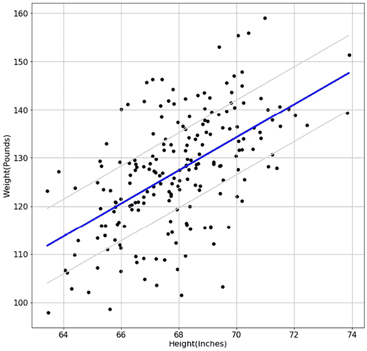
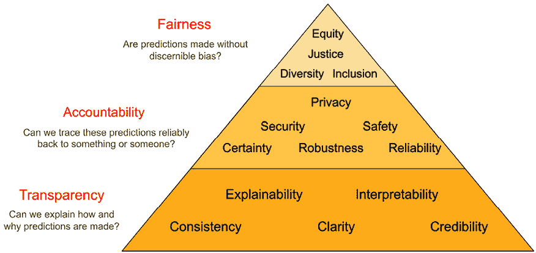
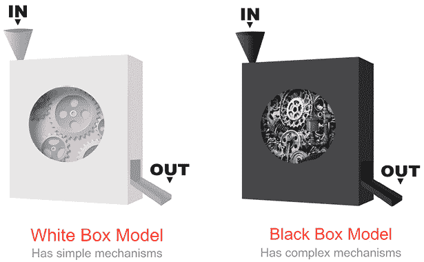

# 1

# 解释、可解释性和可解释性；这一切为什么都如此重要？

我们生活在一个规则和程序越来越多地由数据和算法治理的世界。

例如，有关于谁可以获得信用批准或获得保释的规则，以及哪些社交媒体帖子可能会被审查。还有确定哪种营销策略最有效以及哪些胸部 X 光特征可能诊断出肺炎阳性病例的程序。

我们期望如此，因为这并不是什么新鲜事！

但不久前，像这样的规则和程序通常会被硬编码到软件、教科书和纸质表格中，而人类是最终的决策者。通常，这完全取决于人类的判断。决策依赖于人类的判断，因为规则和程序是僵化的，因此并不总是适用。总有例外，所以需要人类来做出这些决策。

例如，如果你申请抵押贷款，你的批准取决于可接受且合理的信用历史。这些数据反过来会使用评分算法生成信用评分。然后，银行有规则来决定你想要的抵押贷款所需的评分是否足够好。你的贷款官员可以遵循它或不遵循。

现在，金融机构在数千个抵押贷款结果上训练模型，包含数十个变量。这些模型可以用来确定你违约抵押贷款的可能性，具有假设的高准确性。如果有一个贷款官员来盖章批准或拒绝，那就不再仅仅是指导方针，而是一个算法决策。它怎么会错呢？它怎么会对呢？它是如何以及为什么做出这个决定的？

请记住这个想法，因为在这本书的整个过程中，我们将学习这些问题的答案以及更多的问题！

机器学习模型解释使你能够理解决策背后的逻辑，并追溯逻辑背后的详细步骤。本章介绍了机器学习解释和相关概念，如可解释性、可解释性、黑盒模型和透明度。本章为这些术语提供了定义，以避免歧义，并支持机器学习可解释性的价值。这是我们将要讨论的主要主题：

+   什么是机器学习解释？

+   理解解释和可解释性之间的区别

+   可解释性的商业案例

让我们开始吧！

# 技术要求

为了跟随本章的示例，你需要 Python 3，无论是运行在 Jupyter 环境中还是在你最喜欢的**集成开发环境**（**IDE**）中，如 PyCharm、Atom、VSCode、PyDev 或 Idle。示例还需要`pandas`、`sklearn`、`matplotlib`和`scipy`Python 库。

本章的代码位于这里：[`packt.link/Lzryo`](https://packt.link/Lzryo)。

# 什么是机器学习解释？

解释某物就是*解释其含义*。在机器学习的背景下，那“某物”是一个算法。更具体地说，那是一个数学算法，它接受输入数据并产生输出，就像任何公式一样。

让我们检查最基础的模型，即简单线性回归，如下公式所示：


一旦拟合到数据，这个模型的意义在于！图片预测是*x*特征与*β*系数的加权总和。在这种情况下，只有一个*x***特征**或**预测变量**，而*y*变量通常被称为**响应**或**目标变量**。简单的线性回归公式单独解释了在输入数据 x[1]上执行以产生输出！图片的转换。以下示例可以更详细地说明这一概念。

## 理解简单的体重预测模型

如果您访问加州大学维护的此网页[`wiki.stat.ucla.edu/socr/index.php/SOCR_Data_Dinov_020108_HeightsWeights`](http://wiki.stat.ucla.edu/socr/index.php/SOCR_Data_Dinov_020108_HeightsWeights)，您可以找到一个链接下载包含 18 岁青少年体重和身高 25,000 条合成记录的数据集。我们不会使用整个数据集，而只使用网页本身上的样本表，其中包含 200 条记录。我们从网页上抓取表格，并将线性回归模型拟合到数据中。该模型使用身高来预测体重。

换句话说，*x*[1]= *height* 和 *y*= *weight*，因此线性回归模型的公式如下：


您可以在此处找到此示例的代码：[`github.com/PacktPublishing/Interpretable-Machine-Learning-with-Python-2E/blob/main/01/WeightPrediction.ipynb`](https://github.com/PacktPublishing/Interpretable-Machine-Learning-with-Python-2E/blob/main/01/WeightPrediction.ipynb)。

要运行这个示例，您需要安装以下库：

+   使用`pandas`将表格加载到 DataFrame 中

+   使用`sklearn`（`scikit-learn`）来拟合线性回归模型并计算其误差

+   使用`matplotlib`来可视化模型

+   使用`scipy`来测试相关性

您应该首先加载所有这些库，如下所示：

```py
import math
import requests
from bs4 import BeautifulSoup
import pandas as pd
from sklearn import linear_model
from sklearn.metrics import mean_absolute_error
import matplotlib.pyplot as plt
from scipy.stats import pearsonr 
```

一旦所有库都已加载，您可以使用`pandas`获取网页的内容，如下所示：

```py
url = \
'http://wiki.stat.ucla.edu/socr/index.php/SOCR_Data_Dinov_020108_HeightsWeights'
page = requests.get(url)
height_weight_df = pd.read_html(url)[1][['Height(Inches)','Weight(Pounds)']] 
```

`pandas`可以将表格的原始**超文本标记语言**（HTML）内容转换为 DataFrame，我们将子集仅包含两个列。哇！我们现在有一个包含`Heights(Inches)`在一列和`Weights(Pounds)`在另一列的 DataFrame。

现在我们有了数据，我们必须将其转换，使其符合模型的规格。`sklearn`需要它作为(200,1)维度的`numpy`数组，因此我们首先提取`Height(Inches)`和`Weight(Pounds)`的`pandas`系列。然后，我们将它们转换为(200,)维度的`numpy`数组，最后将它们重塑为(200,1)维度。以下命令执行所有必要的转换操作：

```py
x = height_weight_df['Height(Inches)'].values.reshape(num_records, 1)
y = height_weight_df['Weight(Pounds)'].values.reshape(num_records, 1) 
```

然后，我们初始化 scikit-learn 的`LinearRegression`模型，并使用训练数据对其进行`fit`操作，如下所示：

```py
model = linear_model.LinearRegression().fit(x,y) 
```

要在 scikit-learn 中输出拟合的线性回归模型公式，你必须提取截距和系数。这是**公式**，它解释了它是如何进行预测的：

```py
print("ŷ =" + str(model.intercept_[0]) + " + " +\
      str(model.coef_.T[0][0]) + " x₁") 
```

以下为输出结果：

```py
ŷ = -106.02770644878132 + 3.432676129271629 x1 
```

这告诉我们，平均而言，每增加 1 磅体重，身高就会增加 3.4 英寸。

然而，*解释模型的工作原理*只是解释这个线性回归模型的一种方式，这只是故事的一方面。模型并不完美，因为训练数据中的实际结果和预测结果并不相同。它们之间的差异是**误差**或**残差**。

有许多方式可以理解模型中的误差。你可以使用如`mean_absolute_error`这样的误差函数来衡量预测值和实际值之间的偏差，如下面的代码片段所示：

```py
y_pred = model.predict(x)
print(mean_absolute_error(y, y_pred)) 
```

7.8 的平均绝对误差意味着，平均而言，预测值与实际值相差 7.8 磅，但这可能并不直观或具有信息量。可视化线性回归模型可以让我们了解这些预测的准确性。

这可以通过使用`matplotlib`散点图并叠加线性模型（蓝色）和*平均绝对误差*（灰色中的两条平行带）来实现，如下面的代码片段所示：

```py
plt.scatter(x, y, color='black')
plt.plot(x, y_pred, color='blue', linewidth=3)
plt.plot(x, y_pred + mae, color='lightgray')
plt.plot(x, y_pred - mae, color='lightgray') 
Figure 1.1 is what you get as the output:
```



图 1.1：基于身高的线性回归模型预测体重

如您从*图 1.1*中的图表中可以看出，实际值与预测值相差 20-25 磅的情况有很多。然而，平均绝对误差可能会让您误以为误差始终接近 8。这就是为什么可视化模型的误差以了解其分布是至关重要的。从这张图中，我们可以看出，没有明显的红旗突出这个分布，比如残差在某个身高范围内比其他范围更分散。由于它大致均匀分布，我们说它是**同方差**的。在线性回归的情况下，这是您应该测试的许多模型假设之一，包括线性、正态性、独立性和多重共线性（如果有多个特征）。这些假设确保您正在使用适合工作的正确模型。换句话说，身高和体重可以用线性关系来解释，从统计学的角度来看，这样做是个好主意。

使用这个模型，我们试图在*x*身高和*y*体重之间建立线性关系。这种关联被称为**线性相关性**。衡量这种关系强度的一种方法是用**皮尔逊相关系数**。这种统计方法通过将两个变量的协方差除以它们的标准差来衡量两个变量之间的关联。它是一个介于-1 和 1 之间的数字，其中数字越接近 0，关联越弱。如果数字是正的，则存在正相关，如果是负的，则存在负相关。在 Python 中，您可以使用`scipy`中的`pearsonr`函数计算皮尔逊相关系数，如下所示：

```py
corr, pval = pearsonr(x[:,0], y[:,0])
print(corr) 
```

以下是其输出：

```py
0.5568647346122992 
```

这个数字是正的，这并不令人惊讶，因为随着身高的增加，体重也倾向于增加，但它更接近于 1 而不是 0，这表明它具有很强的相关性。`pearsonr`函数产生的第二个数字是测试非相关性的*p*值。如果我们测试这个值是否小于 5%的阈值，我们就可以说有足够的证据证明这种相关性，如下所示：

```py
print(pval < 0.05) 
```

它通过一个`True`确认其统计显著性。

理解模型在不同情况下如何表现可以帮助我们*解释为什么它做出某些预测*，以及当它不能时。让我们想象一下，我们被要求解释为什么一个身高 71 英寸的人被预测体重为 134 磅，但实际上重了 18 磅。根据我们对模型所知，这个误差范围并不罕见，尽管它并不理想。然而，有许多情况下我们无法期望这个模型是可靠的。如果我们被要求使用这个模型预测一个身高 56 英寸的人的体重呢？我们能否保证同样的准确性？绝对不能，因为我们是在身高不低于 63 英寸的受试者数据上拟合这个模型的。如果我们被要求预测一个 9 岁孩子的体重，情况也是如此，因为训练数据是为 18 岁的人准备的。

尽管结果是可以接受的，但这个重量预测模型并不是一个现实的例子。如果你想更准确——更重要的是，更忠实于真正影响个人体重的因素——你需要添加更多变量。你可以添加——比如说——出生性别、年龄、饮食和活动水平。这很有趣，因为你必须确保*包括它们或排除它们是公平的*。例如，如果包括性别，而我们的大部分数据集由男性组成，你如何确保对女性的准确性？这就是所谓的**选择偏差**。那么，如果体重更多地与生活方式选择和诸如贫困和怀孕等环境因素有关，而不是性别呢？如果这些变量没有被包括在内，这被称为**遗漏变量偏差**。那么，在冒着给模型增加偏差的风险下，包括敏感的性别变量是否合理？

一旦你验证了多个特征并排除了偏差，你就可以找出并*解释哪些特征影响模型性能*。我们称之为**特征重要性**。然而，随着我们添加更多变量，我们增加了模型的复杂性。矛盾的是，这给解释带来了问题，我们将在接下来的章节中进一步探讨。现在，关键要点应该是模型解释与以下内容有很大关系：

+   我们能否解释预测是如何做出的，以及模型是如何工作的？

+   我们能否确保它们是可靠和安全的？

+   我们能否解释预测是在没有偏差的情况下做出的？

最终，我们试图回答的问题是：

我们能否相信模型？

可解释机器学习的三个主要概念直接关联到前三个问题，并具有**FAT**的缩写，代表**公平性**、**可问责性**和**透明度**。如果你能解释预测是在没有可识别偏见的情况下做出的，那么就存在**公平性**。如果你能解释为什么它做出某些预测，那么就有**可问责性**。如果你能解释预测是如何做出的以及模型是如何工作的，那么就有**透明度**。这些概念与许多伦理问题相关，如图 1.2 所示。它被描绘成一个三角形，因为每一层都依赖于前一层。



图 1.2：可解释机器学习的三个主要概念

一些研究人员和公司已经将 FAT 扩展到更广泛的伦理**人工智能**范畴之下，从而将 FAT 转变为 FATE。然而，这两个概念在很大程度上是重叠的，因为可解释机器学习是实现 FAT 原则和伦理关注点在机器学习中的实施方式。在这本书中，我们将讨论这个背景下的伦理问题。例如，*第十三章*，*对抗鲁棒性*，讨论了可靠性、安全性和安全性。*第十一章*，*偏差缓解和因果推理方法*，讨论了公平性。尽管如此，可解释机器学习可以在没有伦理目标的情况下被利用，也可以出于不道德的原因。

# 理解可解释性和可解释性之间的区别

当你阅读这本书的前几页时，你可能已经注意到了，动词*interpret*和*explain*，以及名词*interpretation*和*explanation*，已经被交替使用。考虑到解释就是解释某物含义，这并不奇怪。尽管如此，相关的术语*interpretability*和*explainability*不应互换使用，尽管它们经常被误认为是同义词。大多数从业者不做任何区分，许多学者甚至颠倒了本书中提供的定义。

## 什么是可解释性？

可解释性是指人类（包括非领域专家）理解机器学习模型因果关系和输入输出的程度。说一个模型具有高度的可解释性意味着你可以用人类可理解的方式描述其推理。换句话说，为什么一个模型的输入会产生特定的输出？输入数据的要求和约束是什么？预测的置信区间是什么？或者，为什么一个变量对预测的影响比另一个变量更大？对于可解释性来说，详细说明模型的工作原理只与其能够解释其预测并证明它是用例的正确模型相关。

在本章的例子中，我们可以解释说，人类身高和体重之间存在线性关系，因此使用线性回归而不是非线性模型是有意义的。我们可以通过统计来证明这一点，因为涉及的变量没有违反线性回归的假设。即使统计数据支持你的解释，我们仍然应该咨询涉及用例的领域知识。在这种情况下，我们可以放心，从生物学的角度来看，因为我们对人类生理学的了解并不与身高和体重之间的关系相矛盾。

### 警惕复杂性

许多机器学习模型之所以难以理解，主要是因为模型内部运作或特定模型架构中涉及的数学。除此之外，从数据集选择到特征选择和工程，再到模型训练和调整的选择，许多决策都会增加复杂性，使模型的可解释性降低。这种复杂性使得解释机器学习模型的工作原理成为一个挑战。机器学习可解释性是一个非常活跃的研究领域，因此对其精确定义的争论仍然很多。争论包括是否需要完全透明度才能使机器学习模型被视为足够可解释。

本书倾向于认为，可解释性的定义不应该必然排除不透明模型，只要所做的选择不会损害其可信度，这些模型在大多数情况下都是复杂的。这种妥协通常被称为**事后可解释性**。毕竟，就像复杂的机器学习模型一样，我们无法确切解释人类大脑是如何做出选择的，但我们经常信任其决策，因为我们可以向人类询问他们的推理。事后机器学习解释与此类似，只是它是人类代表模型解释推理。使用这种特定的可解释性概念是有利的，因为我们可以在不牺牲预测准确性的情况下解释不透明模型。我们将在*第三章，解释挑战*中进一步讨论这一点。

### 可解释性何时重要？

决策系统并不总是需要可解释性。有两种情况被视为例外，如下所述：

+   当错误结果没有重大后果时。例如，如果一个机器学习模型被训练来查找和读取包裹上的邮政编码，偶尔读错，并将其发送到别处，那么歧视偏见的机会很小，误分类的成本相对较低。这种情况并不常见，不足以放大成本超过可接受的阈值。

+   当有后果时，但这些后果已经在现实世界中得到了充分的研究和验证，以至于可以在没有人类参与的情况下做出决策。这种情况适用于**交通警报和避撞系统**（**TCAS**），它会警告飞行员另一架飞机可能发生空中碰撞的威胁。

另一方面，为了使这些系统具备以下属性，可解释性是必要的：

+   **可挖掘科学知识**：例如，气象学家可以从气候模型中学到很多，但前提是模型易于解释。

+   **可靠和安全**：自动驾驶车辆所做的决策必须是可调试的，以便其开发者能够理解和纠正故障点。

+   **道德伦理**：一个翻译模型可能会使用性别歧视的词嵌入，导致歧视性翻译，例如将医生与男性代词配对，但你必须能够轻松地找到这些实例并纠正它们。然而，系统必须设计得让你在将其发布给公众之前就能意识到问题。

+   **结论性和一致性**：有时，机器学习模型可能具有不完整且相互排斥的目标——例如，胆固醇控制系统可能不会考虑患者遵守饮食或药物方案的可能性，或者可能存在一个目标与另一个目标之间的权衡，例如安全性和非歧视性。

通过解释模型的决策，我们可以填补我们对问题理解上的空白——*其不完整性*。最显著的问题之一是，鉴于我们机器学习解决方案的高准确性，我们往往会提高我们的信心水平，以至于我们认为我们完全理解了问题。然后，我们被误导，认为我们的解决方案涵盖了*一切*！

在本书的开头，我们讨论了利用数据产生算法规则并不是什么新鲜事。然而，我们过去常常对这些规则进行猜测，而现在我们不再这样做。因此，过去通常是人为负责，而现在则是算法。在这种情况下，算法是一个机器学习模型，它对所有由此产生的伦理后果负责。这种转变与准确性有很大关系。问题是，尽管一个模型在总体上可能超越人类的准确性，但机器学习模型还没有像人类那样解释其结果。因此，它不会对其决策进行二次猜测，所以作为一个解决方案，它缺乏理想程度的完整性。这就是为什么我们需要解释模型，以便我们至少可以填补一些这个差距。那么，为什么机器学习解释还不是数据科学流程中的标准部分呢？除了我们只关注准确性的偏见之外，最大的障碍之一就是令人望而生畏的黑盒模型概念。

### 什么是黑盒模型？

这只是对不透明模型的一个术语。黑盒指的是一个系统中，只有输入和输出是可观察的，你不能理解是什么将输入转换成输出。在机器学习的情况下，黑盒模型可以打开，但其机制并不容易理解。

### 什么是白盒模型？

这些是与黑盒模型相反的模型（参见*图 1.3*）。它们也被称为透明，因为它们实现了完全或几乎完全的解释透明度。在这本书中，我们称它们为**内在可解释的**，并在*第三章，解释挑战*中更详细地介绍它们。

看一下这里模型的比较：



图 1.3：白盒和黑盒模型之间的视觉比较

接下来，我们将检查区分白盒和黑盒模型的特征：可解释性。

## 什么是可解释性？

可解释性包括可解释性的所有内容。区别在于，它在透明度要求上比可解释性更深，因为它要求对模型内部工作方式和模型训练过程提供人类友好的解释，而不仅仅是模型推理。根据应用的不同，这一要求可能扩展到模型、设计和算法透明度的各种程度。这里概述了三种透明度类型：

+   **模型透明度**：能够解释模型是如何一步一步训练的。在我们的简单权重预测模型的情况下，我们可以解释被称为**普通最小二乘法**的优化方法是如何找到最小化模型误差的*β*系数的。

+   **设计透明度**：能够解释所做的选择，例如模型架构和超参数。例如，我们可以根据训练数据的大小或性质来证明这些选择是合理的。如果我们正在进行销售预测，并且我们知道我们的销售在一年中是季节性的，这可以是一个合理的参数选择。如果我们有疑问，我们总是可以使用一些成熟的统计方法来找到季节性模式。

+   **算法透明度**：能够解释自动优化，如超参数的网格搜索，但请注意，由于它们的随机性质无法重现的优化（如超参数优化的随机搜索、早停和随机梯度下降）使得算法不透明。

黑盒模型被称为*不透明*，仅仅是因为它们缺乏*模型透明度*，但对于许多模型来说，这是不可避免的，无论模型选择多么合理。在许多情况下，即使你输出了例如训练神经网络或随机森林所涉及的数学，这也可能引起更多的怀疑而不是信任。这里至少有几个原因，概述如下：

+   **“没有统计学依据”**：不透明模型训练过程将输入映射到最佳输出，留下看似任意的参数轨迹。这些参数被优化到成本函数，但并未基于统计理论，这使得预测难以在统计术语中证明和解释。

+   **不确定性和不可重复性**：许多不透明的模型同样可重复，因为它们使用随机数初始化它们的权重，正则化或优化它们的超参数，或者使用随机判别（例如，随机森林算法就是这样）。

+   **过拟合与维度灾难**：许多这些模型在高维空间中运行。这不会引起信任，因为在更多维度上进行泛化更困难。毕竟，维度越多，过拟合模型的机会就越大。

+   **人类认知的局限性**：透明模型通常用于具有较少维度的小数据集。它们也倾向于不会使这些维度之间的交互比必要的更复杂。这种缺乏复杂性使得可视化模型正在做什么及其结果变得更容易。人类在理解许多维度方面并不擅长，因此使用透明模型往往使这更容易理解。尽管如此，即使这些模型也可能变得非常复杂，以至于它们可能变得不透明。例如，如果一个决策树模型有 100 层深度，或者一个线性回归模型有 100 个特征，那么对于我们来说就不再容易理解了。

+   **奥卡姆剃刀**：这就是所谓的简单性或简约性原则。它指出，最简单的解决方案通常是正确的。无论是否如此，人类也有对简单性的偏好，透明模型以——如果有什么的话——它们的简单性而闻名。

### 为什么以及何时可解释性很重要？

可信和道德的决策是可解释性的主要动机。可解释性还有因果性、可迁移性和信息性等其他动机。因此，在许多情况下，完全或几乎完全的透明度被重视，这是理所当然的。其中一些将在以下内容中概述：

+   **科学研究**：可重复性对于科学研究至关重要。此外，当需要建立因果关系时，使用基于统计学的优化方法特别可取。

+   **临床试验**：这些试验也必须产生可重复的结果，并且有统计学依据。此外，考虑到过拟合的可能性，它们必须使用尽可能少的维度和不会使它们复杂化的模型。

+   **消费品安全测试**：与临床试验一样，当生命和死亡安全成为问题时，尽可能选择简单性。

+   **公共政策和法律**：这是一个更为微妙的讨论，因为它是法律学者所说的**算法治理**的一部分，他们区分了**鱼缸透明度**和**合理透明度**。鱼缸透明度寻求完全可解释性，它更接近消费者产品安全测试所需的严谨性，而合理透明度则是指后验可解释性，如前所述。有一天，政府可能会完全由算法运行。当这种情况发生时，很难说哪些政策将与哪种透明度形式一致，但有许多公共政策领域，如刑事司法，绝对透明度是必要的。然而，当完全透明度与隐私或安全目标相矛盾时，可能更倾向于选择一种不那么严谨的透明度形式。

+   **犯罪调查和监管合规审计**：如果发生意外，例如化工厂事故由机器人故障引起或自动驾驶车辆发生碰撞，调查人员将需要一个**决策轨迹**。这是为了便于分配责任和法律责任。即使没有发生事故，这种审计也可以在当局要求时进行。合规审计适用于受监管的行业，如金融服务、公用事业、交通和医疗保健。在许多情况下，鱼缸透明度更受欢迎。

# **可解释性的商业案例**

本节描述了机器学习可解释性的几个实际商业好处，例如做出更好的决策，以及更受信任、更符合道德和更有利可图。

## 更好的决策

通常，机器学习模型在训练后会对期望的指标进行评估。如果它们在保留数据集上通过质量控制，就会被部署。然而，一旦在现实世界中测试，事情可能会变得很糟糕，如下面的假设场景所示：

+   一个高频交易算法可能会单独引发股市崩溃。

+   数百个智能家居设备可能会无缘无故地突然发出笑声，吓到用户。

+   车牌识别系统可能会错误地读取一种新的车牌，并处罚错误的司机。

+   一个存在种族歧视的监控系统可能会错误地检测到入侵者，因此保安会射杀无辜的办公室工作人员。

+   一辆自动驾驶汽车可能会将雪误认为是路面，撞上悬崖，并伤害乘客。

任何系统都容易出错，所以这并不是说可解释性是万能的。然而，仅仅关注优化指标可能会招致灾难。在实验室中，模型可能表现良好，但如果你不知道模型做出决策的原因，那么你可能会错过改进的机会。例如，知道自动驾驶汽车识别为道路的“是什么”是不够的，但知道“为什么”可能有助于改进模型。如果，比如说，其中一个原因是道路颜色像雪一样浅，这可能很危险。检查模型的假设和结论可以通过将冬季道路图像引入数据集或向模型输入实时天气数据来提高模型。此外，如果这不起作用，也许算法安全机制可以阻止它做出不完全自信的决策。

专注于机器学习可解释性导致更好决策的一个主要原因是，在我们讨论完整性时已经提到过。如果我们认为模型是完整的，那么改进它的意义何在？此外，如果我们不质疑模型的推理，那么我们对问题的理解必须完整。如果是这样，也许我们一开始就不应该使用机器学习来解决这个问题！机器学习创建了一个算法，否则将太复杂而无法用“if-else”语句编程，正是为了用于我们理解问题不完整的情况！

事实证明，当我们预测或估计某事，尤其是以高精度时，我们认为自己控制了它。这就是所谓的**控制错觉偏差**。我们不能低估问题的复杂性，仅仅因为从整体上看，模型几乎总是正确的。即使是人类，雪和混凝土路面的区别也可能模糊且难以解释。你将如何开始描述这种区别，使其始终准确？模型可以学习这些区别，但这并不使它变得简单。检查模型的故障点并持续警惕异常需要不同的视角，即我们承认我们无法控制模型，但我们可以通过解释来尝试理解它。

以下是一些可能对模型产生不利影响的决策偏差，以及为什么可解释性可以导致更好的决策：

+   **保守主义偏差**：当我们获得新信息时，我们不会改变我们之前的信念。这种偏差下，根深蒂固的先验信息会压倒新信息，但模型应该进化。因此，重视质疑先验假设的态度是一种健康的做法。

+   **显著性偏差**：一些突出或更明显的事物可能比其他事物更引人注目，但从统计学的角度来看，它们应该得到与其他事物相同的关注。这种偏差可能会影响我们选择特征的方式，因此可解释性思维可以扩大我们对问题的理解，包括其他不太被察觉的特征。

+   **基本归因错误**：这种偏差导致我们将结果归因于行为而不是环境，归因于性格而不是情况，归因于自然而不是养育。可解释性要求我们深入探索，寻找我们变量之间不太明显的关系，或者那些可能缺失的关系。

模型解释的一个关键好处是定位*异常值*。这些异常值可能是潜在的新收入来源或即将发生的责任。了解这一点可以帮助我们做好准备并相应地制定策略。

## 更受信任的品牌

信任被定义为对某物或某人的可靠性、能力或可信度的信念。在组织的背景下，信任是他们的声誉；在不可饶恕的公众舆论法庭上，只需要一次事故、争议或灾难，就可能失去公众的信心。这反过来又可能导致投资者信心下降。

让我们考虑一下波音在 737 MAX 灾难或 Facebook 在剑桥分析选举丑闻之后发生了什么。在这两种情况下，技术故障都笼罩在神秘之中，导致公众对技术产生了巨大的不信任。

这些例子大多是人们做出的决策。如果完全由机器学习模型做出决策，情况可能会变得更糟，因为很容易出错，而将责任推给模型。例如，如果你在 Facebook 动态中开始看到令人反感的材料，Facebook 可能会说这是因为它使用的是你的数据，比如你的评论和点赞，所以这实际上是你想看到的反映。这不是他们的错——是你的错。如果警方因为使用 PredPol 算法（一种预测犯罪发生地点和时间的算法）而针对我们的社区进行激进执法，他们可能会责怪算法。另一方面，该算法的制作者可能会责怪警方，因为软件是在他们的警察报告中训练的。这可能会产生一个潜在的麻烦的反馈循环，更不用说责任差距了。如果一些恶作剧者或黑客在高速公路上物理放置奇异的纹理网格（见[`arxiv.org/pdf/2101.06784.pdf`](https://arxiv.org/pdf/2101.06784.pdf)），这可能会导致特斯拉自动驾驶汽车驶入错误的车道。这是特斯拉没有预料到这种可能性，还是黑客在他们的模型中扔进了一个“猴子 wrench”（比喻意外因素）的错？这被称为**对抗性攻击**，我们在第十三章*对抗鲁棒性*中讨论了这一点。

毫无疑问，机器学习可解释性的一个目标就是使模型在做出决策方面更加出色。但即使它们失败了，你也可以表明你已经尽力了。信任的丧失并不是因为失败本身，而是因为缺乏问责制，甚至在那些接受所有责备并不公平的情况下，一些问责制总比没有好。例如，在先前的例子集中，Facebook 可以寻找为什么攻击性材料出现得更频繁的原因，并承诺找到减少这种情况发生的方法，即使这意味着减少收入。PredPol 可以寻找其他潜在的犯罪率数据集，即使它们规模较小。他们还可以使用技术来减轻现有数据集中的偏差（这些内容在*第十一章*，*偏差缓解和因果推断方法*中有所涉及）。特斯拉可以对其系统进行对抗性攻击的审计，即使这会延迟其汽车的发货。所有这些都是可解释性解决方案。一旦它们成为常规做法，它们不仅可以提高公众信任——无论是来自用户和客户，还可以提高内部利益相关者，如员工和投资者的信任。

在过去几年中，发生了许多公共关系 AI 失误。由于信任问题，许多由 AI 驱动的技术正在失去公众支持，这对那些从 AI 中获利的企业和可能从中受益的用户都是不利的。这在一定程度上需要国家或全球层面的法律框架，以及对于部署这些技术的组织，更多的问责制。

## 更具道德性

在道德方面，存在三种思想流派：功利主义者关注后果，义务论者关注责任，目的论者更感兴趣的是整体道德品质。因此，这意味着有不同方式来审视道德问题。例如，从他们那里可以吸取有用的教训。有些情况下，你希望产生尽可能多的“善”，尽管在过程中会产生一些伤害。在其他时候，道德界限必须被视为你不能跨越的沙线。而在其他时候，这是关于培养正义的品质，就像许多宗教所追求的那样。无论我们与哪种伦理学派一致，我们对它的理解都会随着时间的推移而演变，因为它反映了我们当前的价值。在这个时刻，在西方文化中，这些价值观包括以下内容：

+   人类福祉

+   所有权和财产

+   隐私

+   免于偏见

+   通用可用性

+   信任

+   自主

+   知情同意

+   问责制

+   礼貌

+   环境可持续性

道德越轨是指你跨越了这些价值观试图维护的道德界限，无论是通过歧视某人还是污染他们的环境，无论这是否违法。当你面临导致越轨的选择时，道德困境就会发生，因此你必须在这两者之间做出选择。

机器学习与伦理相关联的第一个原因是技术和伦理困境有着内在联系的历史。

即使是人类最初广泛采用的工具也带来了进步，但也造成了伤害，例如事故、战争和失业。这并不是说技术总是坏的，而是我们缺乏远见来衡量和控制其长期后果。在人工智能的情况下，不清楚有害的长期影响是什么。我们可以预见的是，将会有大量工作机会的丧失，以及对我们数据中心供电的巨大能源需求，这可能会对环境造成压力。有人猜测人工智能可能会创造一个由算法运行的“算法统治”的监控国家，侵犯诸如隐私、自主权和所有权等价值观。一些读者可能会指出已经发生的此类例子。

第二个原因比第一个原因更为严重。这是因为预测建模是人类技术的第一次飞跃：机器学习是一种可以为我们做决策的技术，这些决策可以产生难以追踪的个人道德违规行为。这个问题在于，问责制对于道德至关重要，因为你必须知道谁应该为人类尊严、赎罪、了结或刑事起诉负责。然而，许多技术从一开始就存在问责制问题，因为道德责任通常在任何情况下都是共享的。例如，汽车事故的原因可能部分归咎于司机、机械师和汽车制造商。同样的事情也可能发生在机器学习模型上，但情况会更复杂。毕竟，模型的编程没有程序员，因为“编程”是从数据中学习的，而且模型可以从数据中学习到可能导致道德违规的事情。其中最重要的是以下偏见：

+   **样本偏差**：当你的数据，即样本，不能准确代表环境，也称为总体

+   **排除偏差**：当你省略了可能用数据解释关键现象的特征或群体

+   **偏见偏差**：当刻板印象直接影响或间接影响你的数据

+   **测量偏差**：当错误的测量扭曲了你的数据

可解释性在减轻偏见方面很有用，如第十一章中所述，*偏见减轻和因果推断方法*，或者甚至对正确的特征设置护栏，这些特征可能是偏见的一个来源。这在第十二章中有所涉及，*单调约束和模型调优以实现可解释性*。正如本章所解释的，解释对于建立问责制至关重要，这是一个道德 imperative。此外，通过解释模型背后的推理，你可以在它们造成任何伤害之前发现道德问题。但还有更多方法可以控制模型潜在的令人担忧的道德后果，这与可解释性关系不大，而更多与设计有关。有如**以人为中心的设计、价值观敏感的设计**和**技术道德美德伦理**等框架，可以将道德考虑纳入每个技术设计选择中。Kirsten Martin 的一篇文章([`doi.org/10.1007/s10551-018-3921-3`](https://doi.org/10.1007/s10551-018-3921-3))也提出了一种针对算法的具体框架。本书不会过多深入算法设计方面，但对于对更广泛的伦理人工智能领域感兴趣的读者来说，这篇文章是一个很好的起点。

组织应认真对待算法决策的伦理问题，因为道德违规有货币和声誉成本。但更重要的是，如果人工智能被放任自流，可能会破坏维持民主和经济、使企业能够繁荣发展的价值观。

## 更具盈利性

如本节中已看到的，可解释性提高了算法决策，增强了信任并减轻了道德违规。

当我们利用以前未知的机会，并通过更好的决策减轻威胁，如意外故障，我们很可能会提高底线；如果我们增加对人工智能技术的信任，我们很可能会增加其使用并提升整体品牌声誉，这对利润也有积极影响。另一方面，道德违规可能是有意为之或意外发生，一旦被发现，它们会对利润和声誉产生不利影响。

当企业将可解释性融入其机器学习工作流程时，这是一个良性循环，并导致更高的盈利能力。在非营利组织或政府的情况下，利润可能不是动机。然而，财务无疑是涉及的，因为诉讼、糟糕的决策和声誉受损都是昂贵的。最终，技术进步不仅取决于使其成为可能的工程和科学技能和材料，还取决于公众的自愿采用。

# 摘要

本章向我们展示了机器学习解释是什么，不是什么，以及可解释性的重要性。在下一章中，我们将学习是什么使得机器学习模型如此难以解释，以及如何对解释方法进行类别和范围的分类。

# 图片来源

+   Martin, K. (2019). *算法的伦理影响和问责制*. 商业伦理学杂志 160. 835–850. [`doi.org/10.1007/s10551-018-3921-3`](https://doi.org/10.1007/s10551-018-3921-3 )

# 数据集来源

+   南加州大学在线计算资源，统计学。 (1993). 从母婴健康中心招募的 25,000 名 0 至 18 岁儿童的生长调查。最初从 [`www.socr.ucla.edu/`](http://www.socr.ucla.edu/) 获取。

# 进一步阅读

+   Lipton, Zachary (2017). *模型可解释性的神话*. ICML 2016 机器学习中的可解释性研讨会: [`doi.org/10.1145/3236386.3241340`](https://doi.org/10.1145/3236386.3241340)

+   Roscher, R., Bohn, B., Duarte, M.F. & Garcke, J. (2020). *可解释机器学习在科学洞察和发现中的应用*. IEEE Access, 8, 42200-42216: [`dx.doi.org/10.1109/ACCESS.2020.2976199`](https://dx.doi.org/10.1109/ACCESS.2020.2976199)

+   Doshi-Velez, F. & Kim, B. (2017). *迈向可解释机器学习的严谨科学*. [`arxiv.org/abs/1702.08608`](http://arxiv.org/abs/1702.08608)

+   Arrieta, A.B., Diaz-Rodriguez, N., Ser, J.D., Bennetot, A., Tabik, S., Barbado, A., Garc’ia, S., Gil-L’opez, S., Molina, D., Benjamins, R., Chatila, R., & Herrera, F. (2020). *可解释人工智能（XAI）：概念、分类、机遇与挑战，迈向负责任的 AI*: [`arxiv.org/abs/1910.10045`](https://arxiv.org/abs/1910.10045)

+   Coglianese, C. & Lehr, D. (2019). *透明度与算法治理*. 行政法评论, 71, 1-4: [`ssrn.com/abstract=3293008`](https://ssrn.com/abstract=3293008)

+   Weller, Adrian. (2019) *透明度：动机与挑战*. arXiv:1708.01870 [Cs]: [`arxiv.org/abs/1708.01870`](http://arxiv.org/abs/1708.01870)

# 在 Discord 上了解更多信息

要加入本书的 Discord 社区——在那里您可以分享反馈、向作者提问，并了解新书发布——请扫描下面的二维码：

`packt.link/inml`


