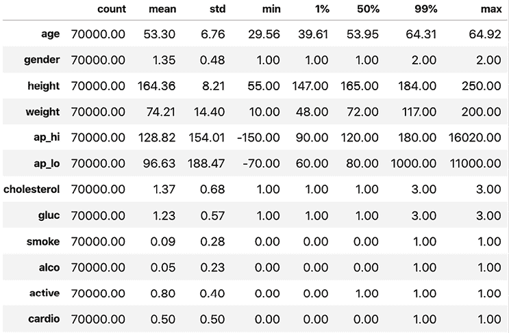
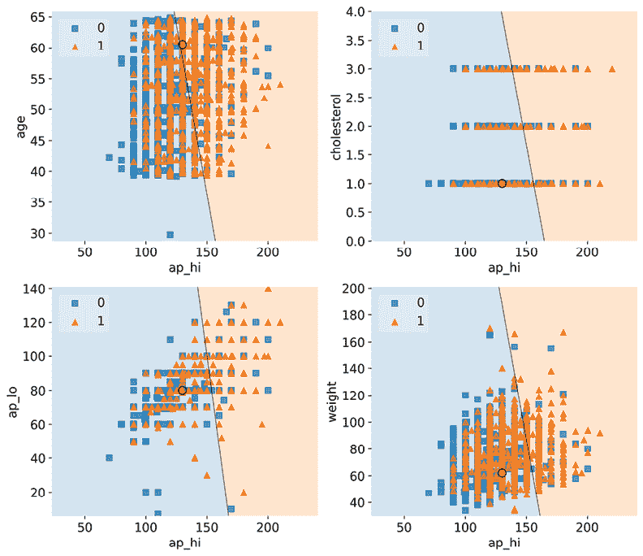
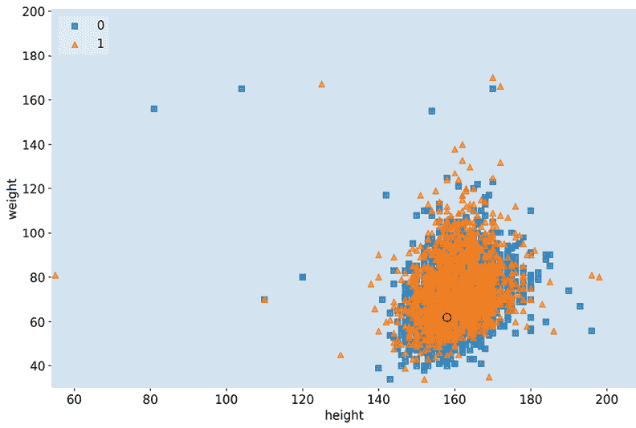
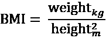
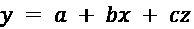
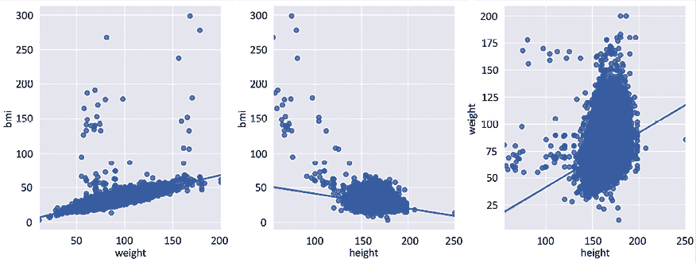
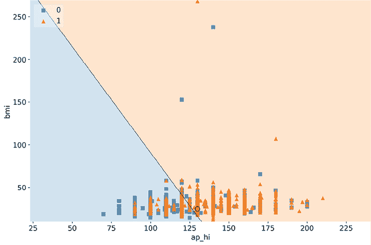
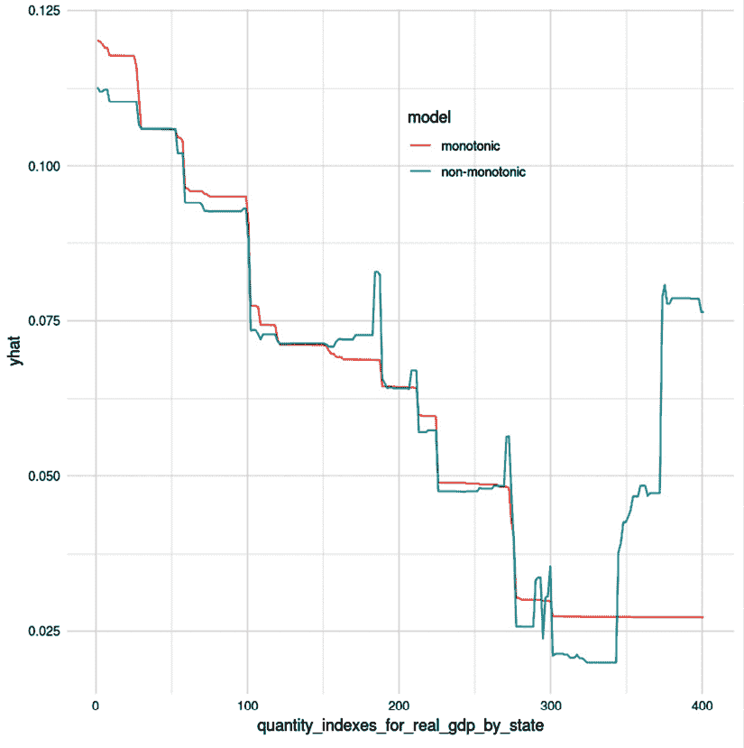

# 2

# 可解释性的关键概念

本书涵盖了多种模型解释方法。有些产生指标，有些创建可视化，有些两者都有；有些广泛描述模型，有些则细致描述。在本章中，我们将学习两种方法：特征重要性和决策区域，以及用于描述这些方法的分类法。我们还将详细说明阻碍机器学习可解释性的因素，作为对接下来内容的入门。

以下是我们将在本章中讨论的主要主题：

+   了解解释方法类型和范围

+   欣赏阻碍机器学习可解释性的因素

让我们从我们的技术要求开始。

# 技术要求

尽管我们以一个“玩具示例”开始了本书，但我们将利用本书中的真实数据集，用于特定的解释用例。这些数据来自许多不同的来源，并且通常只使用一次。

为了避免这种情况，读者需要花费大量时间下载、加载和准备数据集以供单个示例使用；有一个名为 `mldatasets` 的库可以处理大部分这些工作。关于如何安装此库的说明位于**序言**中。除了 `mldatasets`，本章的示例还使用了 `pandas`、`numpy`、`statsmodel`、`sklearn`、`seaborn` 和 `matplotlib` 库。

本章的代码位于此处：[`packt.link/DgnVj`](https://packt.link/DgnVj)。

# 任务

想象你是一名国家卫生部的分析师，那里爆发了一场**心血管疾病**（**CVDs**）疫情。部长已将其列为优先事项，以扭转增长趋势并降低病例数至 20 年来的最低水平。为此，已成立一个特别工作组，以在数据中寻找线索，以确定以下内容：

+   可以解决哪些风险因素。

+   如果可以预测未来的案例，则可以逐个案例解释预测。

你是这支任务小组的一员！

## 关于心血管疾病的详细信息

在我们深入数据之前，我们必须收集一些关于心血管疾病的重要细节，以便完成以下工作：

+   理解问题的背景和相关性。

+   提取可以告知我们的数据分析及模型解释的领域知识信息。

+   将专家背景与数据集的特征联系起来。

心血管疾病（CVDs）是一组疾病，其中最常见的是冠心病（也称为**缺血性心脏病**）。根据世界卫生组织的数据，心血管疾病是全球死亡的主要原因，每年导致近 1800 万人死亡。冠心病和中风（大部分是心血管疾病的副产品）是导致这一情况的最重要因素。据估计，80%的心血管疾病是由可改变的风险因素引起的。换句话说，一些可以预防导致心血管疾病的风险因素包括以下内容：

+   饮食不良

+   吸烟和饮酒习惯

+   肥胖

+   缺乏体育锻炼

+   睡眠质量差

此外，许多风险因素是不可改变的，因此被认为是不可避免的，包括以下内容：

+   遗传易感性

+   老龄

+   男性（随年龄变化）

我们不会深入探讨更多关于 CVD 的特定领域细节，因为这不是理解示例所必需的。然而，*强调领域知识对于模型解释的重要性是至关重要的*。因此，如果这个例子是你的工作，并且许多生命依赖于你的分析，那么阅读有关该主题的最新科学研究和咨询领域专家来指导你的解释是明智的。

# 方法

逻辑回归是医学用例中排名风险因素的常见方法。与线性回归不同，它不试图预测每个观察值的一个连续值，而是预测一个概率分数，表示观察值属于特定类别的概率。在这种情况下，我们试图预测的是，给定每个患者的 *x* 数据，他们患有 CVD 的 *y* 概率是多少，范围从 0 到 1？

# 准备工作

我们将在这里找到这个例子的代码：[`github.com/PacktPublishing/Interpretable-Machine-Learning-with-Python-2E/tree/main/02/CVD.ipynb`](https://github.com/PacktPublishing/Interpretable-Machine-Learning-with-Python-2E/tree/main/02/CVD.ipynb)。

## 加载库

要运行此示例，我们需要安装以下库：

+   使用 `mldatasets` 加载数据集

+   `pandas` 和 `numpy` 来操作它

+   使用 `statsmodels` 来拟合逻辑回归模型

+   使用 `sklearn` (scikit-learn) 来分割数据

+   使用 `matplotlib` 和 `seaborn` 来可视化解释

我们首先应该加载所有这些：

```py
import math
import mldatasets
import pandas as pd
import numpy as np
import statsmodels.api as sm
from sklearn.model_selection import train_test_split
import matplotlib.pyplot as plt
import seaborn as sns 
```

## 理解和准备数据

在此示例中使用的此数据应加载到我们称为 `cvd_df` 的 DataFrame 中：

```py
cvd_df = mldatasets.load("cardiovascular-disease") 
```

从这个例子中，我们应该得到 70,000 条记录和 12 列。我们可以通过 `info()` 函数查看加载了什么：

```py
cvd_df.info() 
```

前面的命令将输出每列的名称、其类型以及包含的非空记录数：

```py
RangeIndex: 70000 entries, 0 to 69999
Data columns (total 12 columns):
age            70000 non-null int64
gender         70000 non-null int64
height         70000 non-null int64
weight         70000 non-null float64
ap_hi          70000 non-null int64
ap_lo          70000 non-null int64
cholesterol    70000 non-null int64
gluc           70000 non-null int64
smoke          70000 non-null int64
alco           70000 non-null int64
active         70000 non-null int64
cardio         70000 non-null int64
dtypes: float64(1), int64(11) 
```

### 数据字典

要了解加载的内容，以下是根据源描述的数据字典：

+   `age`：患者的天数（客观特征）

+   `height`：以厘米为单位（客观特征）

+   `weight`：以千克为单位（客观特征）

+   `gender`：一个二进制值，其中 1 表示女性，2 表示男性（客观特征）

+   `ap_hi`：收缩压，即在心室收缩时血液被喷射出的动脉压力。正常值：小于 120 毫米汞柱（客观特征）

+   `ap_lo`：舒张压，即心跳之间的动脉压力。正常值：小于 80 毫米汞柱（客观特征）

+   `cholesterol`：一个有序值，其中 1 表示正常，2 表示高于正常，3 表示远高于正常（客观特征）

+   `gluc`：一个有序值，其中 1 表示正常，2 表示高于正常，3 表示远高于正常（客观特征）

+   `smoke`：一个二进制值，其中 0 表示不吸烟者，1 表示吸烟者（主观特征）

+   `alco`：一个二进制值，其中 0 表示不饮酒者，1 表示饮酒者（主观特征）

+   `active`: 这是一个二进制值，其中 0 表示非活跃，1 表示活跃（主观特征）

+   `cardio`: 这是一个二进制值，其中 0 表示没有心血管疾病，1 表示有心血管疾病（客观和目标特征）

理解数据集的数据生成过程至关重要，这就是为什么特征被分为两类：

+   **客观**: 是官方文件或临床检查的结果。由于文书或机器错误，预计其误差范围相当小。

+   **主观**: 由患者报告且未经验证（或无法验证）。在这种情况下，由于记忆失误、理解差异或不诚实，预计其可靠性不如客观特征。

最后，信任模型通常意味着信任用于训练它的数据，因此患者关于吸烟的谎言程度可能会产生影响。

### 数据准备

为了可解释性和模型性能，我们可以执行几个数据准备任务，但目前最突出的是`age`。年龄不是我们通常按天数衡量的东西。实际上，对于像这样的健康相关预测，我们甚至可能希望将它们分入**年龄组**，因为观察到的个体出生年份群体之间的健康差异不如代际群体之间明显，尤其是在与其他特征（如生活方式差异）交叉制表时。目前，我们将所有年龄转换为年份：

```py
cvd_df['age'] = cvd_df['age'] / 365.24 
```

结果是一个更易于理解的列，因为我们期望年龄值在 0 到 120 之间。我们使用了现有数据并对其进行了转换。这是一个**特征工程**的例子，即我们利用数据的领域知识来创建更好地代表我们问题的特征，从而提高我们的模型。我们将在*第十一章*，*偏差缓解和因果推断方法*中进一步讨论这一点。只要这不会显著损害模型性能，仅仅为了使模型结果更*可解释*而进行特征工程是有价值的。实际上，它可能会提高预测性能。请注意，在年龄列上进行的特征工程没有损失数据，因为年份的小数值得到了保留。

现在我们将使用`describe()`方法查看每个特征的摘要统计信息：

```py
cvd_df.describe(percentiles=[.01,.99]).transpose() 
```

*图 2.1*显示了前述代码输出的摘要统计信息。它包括 1%和 99%的分位数，这些分位数告诉我们每个特征的最高和最低值：



图 2.1：数据集的摘要统计

在*图 2.1*中，`age`值有效，因为它介于 29 至 65 岁之间，这并不罕见，但`ap_hi`和`ap_lo`存在一些异常的异常值。血压不能为负，最高记录值为`370`。保留这些异常值可能导致模型性能和可解释性变差。根据*图 2.1*，1%和 99%的分位数仍然显示正常范围内的值，因此大约有 2%的记录具有无效值。如果你进一步挖掘，你会发现这个比例更接近 1.8%。

```py
incorrect_l = cvd_df[
    (cvd_df['ap_hi']>370)
    | (cvd_df['ap_hi']<=40)
    | (cvd_df['ap_lo'] > 370)
    | (cvd_df['ap_lo'] <= 40)
].index
print(len(incorrect_l) / cvd_df.shape[0]) 
```

我们有处理这些错误值的方法，但由于这些记录相对较少，并且我们缺乏领域专业知识来猜测它们是否被误输入（并相应地更正），我们将删除它们：

```py
cvd_df.drop(incorrect_l, inplace=True) 
```

为了确保万无一失，我们应该确保`ap_hi`始终高于`ap_lo`，因此任何存在这种差异的记录也应被删除：

```py
cvd_df = cvd_df[cvd_df['ap_hi'] >=\
                cvd_df['ap_lo']].reset_index(drop=True) 
```

现在，为了拟合逻辑回归模型，我们必须将所有客观、考试和主观特征组合在一起作为*X*，并将目标特征单独作为*y*。之后，我们将*X*和*y*分为训练和测试数据集，但请确保包括`random_state`以实现可重复性：

```py
y = cvd_df['cardio']
X = cvd_df.drop(['cardio'], axis=1).copy()
X_train, X_test, y_train, y_test = train_test_split(
    X, y, test_size=0.15, random_state=9
) 
```

scikit-learn 的`train_test_split`函数将 15%的观测值放入测试数据集，其余的放入训练数据集，因此你最终会得到*X*和*y*对。

现在我们已经准备好了用于训练的数据，让我们训练一个模型并对其进行解释。

# 解释方法类型和范围

现在我们已经准备好了数据，并将其分为训练/测试数据集，我们可以使用训练数据来拟合模型，并打印结果摘要：

```py
log_model = sm.Logit(y_train, sm.add_constant(X_train))
log_result = log_model.fit()
print(log_result.summary2()) 
```

在拟合的模型上打印`summary2`会产生以下输出：

```py
Optimization terminated successfully.
         Current function value: 0.561557
         Iterations 6
                         Results: Logit
=================================================================
Model:              Logit            Pseudo R-squared: 0.190     
Dependent Variable: cardio           AIC:              65618.3485
Date:               2020-06-10 09:10 BIC:              65726.0502
No. Observations:   58404            Log-Likelihood:   -32797\.   
Df Model:           11               LL-Null:          -40481\.   
Df Residuals:       58392            LLR p-value:      0.0000    
Converged:          1.0000           Scale:            1.0000    
No. Iterations:     6.0000                                       
-----------------------------------------------------------------
               Coef.   Std.Err.    z     P>|z|   [0.025   0.975]
-----------------------------------------------------------------
const         -11.1730   0.2504 -44.6182 0.0000 -11.6638 -10.6822
age             0.0510   0.0015  34.7971 0.0000   0.0482   0.0539
gender         -0.0227   0.0238  -0.9568 0.3387  -0.0693   0.0238
height         -0.0036   0.0014  -2.6028 0.0092  -0.0063  -0.0009
weight          0.0111   0.0007  14.8567 0.0000   0.0096   0.0125
ap_hi           0.0561   0.0010  56.2824 0.0000   0.0541   0.0580
ap_lo           0.0105   0.0016   6.7670 0.0000   0.0075   0.0136
cholesterol     0.4931   0.0169  29.1612 0.0000   0.4600   0.5262
gluc           -0.1155   0.0192  -6.0138 0.0000  -0.1532  -0.0779
smoke          -0.1306   0.0376  -3.4717 0.0005  -0.2043  -0.0569
alco           -0.2050   0.0457  -4.4907 0.0000  -0.2945  -0.1155
active         -0.2151   0.0237  -9.0574 0.0000  -0.2616  -0.1685
================================================================= 
```

上述摘要帮助我们理解哪些*X*特征对模型系数（在表中标记为`Coef.`）对*y* CVD 诊断的贡献最大。与线性回归类似，系数是应用于预测器的权重。然而，线性组合指数是一个**逻辑函数**。这使得解释变得更加困难。我们将在*第三章*，*解释挑战*中进一步解释这个函数。

通过观察我们可以看出，具有绝对最高值的特征是`cholesterol`和`active`，但在理解这意味着什么方面并不直观。一旦我们计算了这些系数的指数，就会揭示一种更可解释的方式来查看这些值：

```py
np.exp(log_result.params).sort_values(ascending=False) 
```

上述代码输出以下内容：

```py
cholesterol    1.637374
ap_hi          1.057676
age            1.052357
weight         1.011129
ap_lo          1.010573
height         0.996389
gender         0.977519
gluc           0.890913
smoke          0.877576
alco           0.814627
active         0.806471
const          0.000014
dtype: float64 
```

为什么是指数函数？系数是**对数概率**，即概率的对数。概率是指正例发生的概率与负例发生的概率之比，其中**正例**是我们试图预测的标签。它并不一定表明任何人的偏好。例如，如果我们试图预测一个竞争对手今天赢得冠军的概率，正例就是他们赢了，无论我们是否支持他们。概率通常以比率的形式表示。新闻可能会说他们今天赢得比赛的概率是 60%，或者可能会说赔率是 3:2 或 3/2 = 1.5。在对数概率形式中，这将等于 0.176，即 1.5 的对数。它们基本上是同一件事，但表达方式不同。指数函数是对数函数的逆函数，因此它可以接受任何**对数概率**并返回**概率**，正如我们所做的那样。

回到我们的 CVD 案例。现在我们有了概率，我们可以解释它意味着什么。例如，胆固醇的情况下的概率意味着什么？这意味着，在所有其他特征保持不变的情况下，每增加一个单位的胆固醇，CVD 的概率会增加 1.64 倍。能够用如此具体的方式来解释一个特征对模型的影响，是像逻辑回归这样的**内在可解释**模型的一个优点。

虽然概率为我们提供了有用的信息，但它们并没有告诉我们什么最重要，因此，仅凭它们自身，不能用来衡量特征的重要性。但怎么会这样呢？如果某物的概率更高，那么它肯定更重要，对吧？好吧，首先，它们都有不同的尺度，这造成了巨大的差异。这是因为如果我们测量某物增加的概率，我们必须知道它通常增加多少，因为这提供了上下文。例如，我们可以说，在蝴蝶的第一批卵孵化后，这种特定蝴蝶多活一天的几率是 0.66。除非我们知道这个物种的寿命和繁殖周期，否则这个陈述是没有意义的。

为了为我们提供的概率提供上下文，我们可以轻松地使用`np.std`函数计算特征的方差：

```py
np.std(X_train, 0) 
```

以下是由`np.std`函数输出的序列：

```py
age             6.757537
gender          0.476697
height          8.186987
weight         14.335173
ap_hi          16.703572
ap_lo           9.547583
cholesterol     0.678878
gluc            0.571231
smoke           0.283629
alco            0.225483
active          0.397215
dtype: float64 
```

如我们从输出中可以看出，二元和有序特征通常最多只变化一次，但连续特征，如`weight`或`ap_hi`，可以变化 10-20 倍，正如特征的方差所证明的那样。

另一个原因是不可以用**几率**来衡量特征重要性，是因为尽管几率有利，但有时特征并不具有统计学意义。它们与其他特征纠缠在一起，以至于它们可能看起来很重要，但我们能证明它们并不重要。这可以在模型的摘要表中看到，在`P>|z|`列下。这个值被称为**p 值**，当它小于 0.05 时，我们拒绝系数等于零的零假设。换句话说，相应的特征具有统计学意义。然而，当它高于这个数值，尤其是大幅高于时，没有统计证据表明它会影响预测分数。至少在这个数据集中，`性别`就是这种情况。

如果我们试图获得最重要的特征，一种近似方法是将系数乘以特征的标准差。引入标准差考虑了特征之间方差的不同。因此，如果我们在这个过程中把`性别`排除在外会更好：

```py
coefs = log_result.params.drop(labels=['const','gender'])
stdv = np.std(X_train, 0).drop(labels='gender')
abs(coefs * stdv).sort_values(ascending=False) 
```

前面的代码生成了以下输出：

```py
ap_hi          0.936632
age            0.344855
cholesterol    0.334750
weight         0.158651
ap_lo          0.100419
active         0.085436
gluc           0.065982
alco           0.046230
smoke          0.037040
height         0.029620 
```

前面的表格可以解释为根据模型从高到低的风险因素**近似**。它也是一个**特定模型**的**特征重要性**方法，换句话说，是一个**全局模型**（**模块化**）**解释方法**。这里有很多新的概念需要解释，所以让我们逐一分析。

## 模型可解释性方法类型

模型可解释性方法类型有两种：

+   **特定模型**：当方法只能用于特定模型类别时，那么它就是特定模型的。前一个例子中详细说明的方法只能与逻辑回归一起工作，因为它使用了其系数。

+   **模型无关**：这些是可以与任何模型类别一起工作的方法。我们在*第四章*，*全局模型无关解释方法*以及接下来的两章中介绍了这些方法。

## 模型可解释性范围

模型可解释性的几个范围：

+   **全局整体解释**：我们可以解释模型是如何做出预测的，因为我们能够一次性完全理解数据并理解整个模型，并且这是一个训练好的模型。例如，*第一章*中的简单线性回归示例，在*解释、可解释性和可解释性；以及为什么这一切都很重要？*中，可以在二维图中可视化。我们可以在记忆中构想这一点，但这仅因为模型的简单性允许我们这样做，而且这种情况并不常见，也不被期望。

+   **全局模块化解释**：正如我们可以解释内燃机中**部分**在将燃料转化为运动的全过程中的作用一样，我们也可以用模型来做这样的解释。例如，在 CVD 风险因素示例中，我们的特征重要性方法告诉我们`ap_hi`（收缩压）、`age`（年龄）、`cholesterol`（胆固醇）和`weight`（体重）是影响**整体**最多的**部分**。特征重要性只是众多全局模块化解释方法中的一种，但可以说是最重要的方法之一。*第四章*，*全局模型无关解释方法*，将更详细地介绍特征重要性。

+   **局部单预测解释**：我们可以解释为什么做出了单个预测。下一个例子将说明这个概念，而*第五章*，*局部模型无关解释方法*，将更详细地介绍。

+   **局部组预测解释**：与单预测相同，但适用于预测组。

恭喜！你已经使用**全局模型解释方法**确定了风险因素，但卫生部长还想知道模型是否可以用来解释单个案例。所以，让我们来看看这一点。

## 使用逻辑回归解释单个预测

如果我们使用模型来预测整个测试数据集的 CVD，我们可以这样做：

```py
y_pred = log_result.predict(sm.add_constant(X_test)).to_numpy()
print(y_pred) 
```

结果数组是每个测试用例对 CVD 呈阳性的概率：

```py
[0.40629892 0.17003609 0.13405939 ... 0.95575283 0.94095239 0.91455717] 
```

让我们以一个阳性案例为例；测试用例 #2872：

```py
print(y_pred[2872]) 
```

我们知道它预测 CVD 为阳性，因为得分超过了 0.5。

这是测试用例 #2872 的详细信息：

```py
print(X_test.iloc[2872]) 
```

以下为输出结果：

```py
age             60.521849
gender           1.000000
height         158.000000
weight          62.000000
ap_hi          130.000000
ap_lo           80.000000
cholesterol      1.000000
gluc             1.000000
smoke            0.000000
alco             0.000000
active           1.000000
Name: 46965, dtype: float64 
```

因此，根据前面的序列，我们知道以下适用于这个个体：

+   临界高的`ap_hi`（收缩压），因为根据**美国心脏协会**（**AHA**）的标准，任何等于或高于 130 的都是高的。

+   正常的`ap_lo`（舒张压）也符合 AHA（美国心脏协会）的标准。收缩压高而舒张压正常的情况被称为**孤立性收缩压**。这可能导致预测结果为阳性，但`ap_hi`处于临界值；因此，**孤立性收缩压**的状态是临界性的。

+   `age`（年龄）不算太老，但在数据集中是最老的。

+   `cholesterol`（胆固醇）是正常的。

+   `weight`（体重）似乎也在健康范围内。

没有其他风险因素：葡萄糖正常，个体不吸烟也不喝酒，并且不采取久坐的生活方式，因为个体很活跃。不清楚为什么它是阳性的。年龄和临界性的**孤立性收缩压**是否足以使结果为阳性？没有将所有预测放入上下文中，很难理解预测的原因，所以让我们尝试这样做！

但我们如何同时将所有内容置于上下文中呢？我们不可能可视化每个特征及其相应的预测心血管疾病诊断与另外 10,000 个预测的比较。不幸的是，即使可能可视化一个十维的超平面，人类也无法处理这种维度的水平！

然而，我们可以一次处理两个特征，从而得到一个图形，显示模型对于这些特征的决策边界在哪里。在此基础上，我们还可以叠加基于所有特征的测试数据集的预测。这是为了可视化两个特征与所有其他 11 个特征之间的差异。

这种图形解释方法被称为**决策边界**。它为类别绘制边界，留下属于一个或另一个类别的区域。这些区域被称为**决策区域**。在这种情况下，我们有两个类别，所以我们将看到一个只有一个边界的图形，在`cardio=0`和`cardio=1`之间，只涉及我们比较的两个特征。

我们已经能够一次可视化两个基于决策的特征，前提是如果所有其他特征都保持不变，我们只能单独观察两个。这也被称为**其他条件不变**假设，在科学研究中至关重要，它允许我们*控制*一些变量以*观察*其他变量。一种方法是使用我们生成的几率表，我们可以判断一个特征是否会增加，从而增加心血管疾病的几率。因此，总的来说，较低的价值对心血管疾病的风险较低。

例如，`age=30`是数据集中`age`的最小风险值。它也可以朝相反的方向发展，所以`active=1`已知比`active=0`风险更低。我们可以为剩余的特征找到最优值：

+   `height=165`。

+   `weight=57`（对于那个`height`来说是最优的）。

+   `ap_hi=110`。

+   `ap_lo=70`。

+   `smoke=0`。

+   `cholesterol=1`（这意味着正常）。

+   `gender`可以编码为男性或女性，这无关紧要，因为性别的几率（`0.977519`）非常接近 1。

以下`filler_feature_values`字典示例说明了如何将特征与其索引匹配到它们的最小风险值：

```py
filler_feature_values = {
    "age": 30,
    "gender": 1,
    "height": 165,
    "weight": 57,
    "ap_hi": 110,
    "ap_lo": 70,
    "cholesterol": 1,
    "gluc": 1,
    "smoke": 0,
    "alco":0,
    "active":1
} 
```

接下来要做的是创建一个`(1,12)`形状的 NumPy 数组，用于测试案例#2872，以便绘图函数可以突出显示它。为此，我们首先将其转换为 NumPy 数组，然后在前面添加一个`*constant*`为`1`，这必须是第一个特征，然后将其重塑以满足`(1,12)`维度。添加常量的原因是，在`statsmodels`中，我们必须明确定义**截距**。因此，逻辑模型有一个额外的`0`特征，它始终等于`1`。

```py
X_highlight = np.reshape(
    np.concatenate(([1], X_test.iloc[2872].to_numpy())), (1, 12))
print(X_highlight) 
```

以下是输出：

```py
[[  1\.       60.52184865   1\.       158\.        62\.       130\.          
   80\.        1\.           1\.         0\.         0\.         1\.     ]] 
```

现在我们准备就绪了！让我们可视化一些决策区域图表！我们将比较被认为是最高的风险因素`ap_hi`与以下四个最重要的风险因素：`age`、`cholesterol`、`weight`和`ap_lo`。

以下代码将生成*图 2.2*中的图表：

```py
plt.rcParams.update({'font.size': 14})
fig, axarr = plt.subplots(2, 2, figsize=(12,8), sharex=True,
                          sharey=False)
mldatasets.create_decision_plot(
    X_test,
    y_test,
    log_result,
    ["ap_hi", "age"],
    None,
    X_highlight,
    filler_feature_values,
    ax=axarr.flat[0]
)
mldatasets.create_decision_plot(
    X_test,
    y_test,
    log_result,
    ["ap_hi", "cholesterol"],
     None,
    X_highlight,
    filler_feature_values,
    ax=axarr.flat[1]
)
mldatasets.create_decision_plot(
    X_test,
    y_test,
    log_result,
    ["ap_hi", "ap_lo"],
    None,
    X_highlight,
    filler_feature_values,
    ax=axarr.flat[2],
)
mldatasets.create_decision_plot(
    X_test,
    y_test,
    log_result,
    ["ap_hi", "weight"],
    None,
    X_highlight,
    filler_feature_values,
    ax=axarr.flat[3],
)
plt.subplots_adjust(top=1, bottom=0, hspace=0.2, wspace=0.2)
plt.show() 
```

在*图 2.2*的图表中，圆圈代表测试案例#2872。在所有图表中，除了一个，这个测试案例位于负（左侧）决策区域，代表`cardio=0`分类。边缘高的`ap_hi`（收缩压）和相对较高的`age`在左上角的图表中几乎足以做出积极的预测。然而，在任何情况下，对于测试案例#2872，我们预测了 57%的 CVD 评分，这可以很好地解释大部分原因。

并非意外，根据模型，仅凭`ap_hi`和健康的胆固醇值不足以使 CVD 诊断偏向肯定，因为它明显位于负决策区域，正常的`ap_lo`（舒张压）也是如此。从这三个图表中可以看出，尽管正方形和三角形的分布存在一些重叠，但随着 y 轴的增加，三角形更有可能向正方向聚集，而正方形在这个区域中则较少：



图 2.2：ap_hi 和其他顶级风险因素的决策区域，测试案例#2872

决策边界上的重叠是预期的，因为毕竟，这些正方形和三角形是基于**所有**特征的效果。尽管如此，您还是期望找到一个大致一致的图案。`ap_hi`与`weight`的图表在`weight`增加时没有这种垂直模式，这表明这个故事中缺少了一些东西……保留这个想法，因为我们将在下一节中调查这一点！

恭喜！您已经完成了部长请求的第二部分。

决策区域绘图，一种**局部模型解释方法**，为卫生部门提供了一个解释个别案例预测的工具。现在您可以一次解释几个案例，或者绘制所有重要的特征组合，以找到圆点明显位于正决策区域的那些。您还可以逐个更改一些填充变量，看看它们如何产生影响。例如，如果您将填充年龄增加到中位数 54 岁，甚至增加到测试案例#2872 的年龄？那么边缘高的`ap_hi`和健康的胆固醇现在是否足以使天平倾斜？我们将在稍后回答这个问题，但首先，让我们了解是什么使得机器学习解释如此困难。

# 欣赏阻碍机器学习可解释性的因素

在最后一节中，我们想知道为什么`ap_hi`与`weight`的图表没有明显的模式。完全有可能的是，尽管`weight`是一个风险因素，但还有其他关键的*中介变量*可以解释 CVD 增加的风险。一个**中介变量**是影响自变量和目标（*因变量*）之间强度的一个变量。我们可能不需要太费劲就能找到缺失的部分。在*第一章*，*解释，可解释性和可解释性；以及这一切为什么都重要？*中，我们对`weight`和`height`进行了线性回归，因为这些变量之间存在线性关系。在人类健康的情况下，没有`height`，`weight`几乎没有任何*意义*，因此你需要查看两者。

也许如果我们绘制这两个变量的决策区域，我们会得到一些线索。我们可以用以下代码绘制它们：

```py
fig, ax = plt.subplots(1,1, figsize=(12,8))
mldatasets.create_decision_plot(
    X_test,
    y_test,
    log_result,
    [3, 4],
    ['height [cm]',
    'weight [kg]'],
    X_highlight,
    filler_feature_values,
    filler_feature_ranges,
    ax=ax
)
plt.show() 
Figure 2.3:
```



图 2.3：重量和高度的决策区域，测试案例#2872

在*图 2.3*中没有确定决策边界，因为如果所有其他变量都保持不变（在较低风险值），没有`height`和`weight`的组合足以预测 CVD。然而，我们可以看出，橙色三角形有一个模式，主要位于一个椭圆形区域。这提供了令人兴奋的见解，即使我们预计当`height`增加时`weight`也会增加，但本质上不健康的`weight`值并不是与`height`线性增加的概念。

事实上，近两百年以来，这种关系已经通过名为**体质指数**（**BMI**）的名称在数学上得到理解：



在进一步讨论 BMI 之前，你必须考虑复杂性。除了维度之外，主要有三个因素引入了复杂性，使得解释变得困难：

1.  非线性

1.  交互性

1.  非单调性

## 非线性

线性方程，例如 ，易于理解。它们是可加的，因此很容易将每个项（*a*，*bx*，和 *cz*）的效果从模型的结果（*y*）中分离和量化。许多模型类在数学中都包含了线性方程。这些方程既可以用来拟合数据到模型，也可以描述模型。

然而，有些模型类本质上是非线性的，因为它们在训练中引入了非线性。这种情况对于*深度学习*模型来说就是这样，因为它们具有非线性的激活函数，如*sigmoid*。然而，逻辑回归被认为是一个**广义线性模型**（**GLM**），因为它具有可加性。换句话说，结果是加权输入和参数的总和。我们将在*第三章*，*解释挑战*中进一步讨论 GLMs。

然而，即使你的模型是线性的，变量之间的关系可能不是线性的，这可能导致性能和可解释性差。在这些情况下，你可以采取以下两种方法之一：

+   *使用非线性模型类*，这将更好地拟合这些非线性特征关系，可能提高模型性能。然而，正如我们将在下一章中更详细地探讨的那样，这可能会使模型的可解释性降低。

+   *利用领域知识构建一个有助于“线性化”的特征*。例如，如果你有一个相对于另一个特征呈指数增长的特性，你可以通过该特性的对数构建一个新的变量。在我们的 CVD 预测中，我们知道 BMI 是理解身高伴随下的体重的一个更好的方式。最好的是，它不是一个*任意*编造的特征，因此更容易解释。我们可以通过复制数据集，在其中构建 BMI 特征，用这个额外特征训练模型，并执行局部模型解释来证明这一点。下面的代码片段正是如此：

    ```py
    X2 = cvd_df.drop(['cardio'], axis=1).copy()
    X2["bmi"] = X2["weight"] / (X2["height"]/100)**2 
    ```

为了说明这个新特征，让我们使用以下代码绘制`bmi`与`weight`和`height`的关系图：

```py
fig, (ax1, ax2, ax3) = plt.subplots(1,3, figsize=(15,4))
sns.regplot(x="weight", y="bmi", data=X2, ax=ax1)
sns.regplot(x="height", y="bmi", data=X2, ax=ax2)
sns.regplot(x="height", y="weight", data=X2, ax=ax3)
plt.subplots_adjust(top = 1, bottom=0, hspace=0.2, wspace=0.3)
plt.show() 
```

*图 2.4*是用前面的代码生成的：



图 2.4：体重、身高和 BMI 的双变量比较

如*图 2.4*中的图表所示，`bmi`和`weight`之间的线性关系比`height`和`weight`之间的线性关系更明确，甚至比`bmi`和`height`之间的线性关系更明确。

让我们使用以下代码片段用额外特征拟合新模型：

```py
X2 = X2.drop(['weight','height'], axis=1)
X2_train, X2_test,__,_ = train_test_split(
  X2, y, test_size=0.15, random_state=9)
log_model2 = sm.Logit(y_train, sm.add_constant(X2_train))
log_result2 = log_model2.fit() 
```

现在，让我们看看在保持`age`恒定为`60`的情况下，测试用例#2872 在比较`ap_hi`和`bmi`时是否位于正决策区域：

```py
filler_feature_values2 = {
    "age": 60, "gender": 1, "ap_hi": 110,
    "ap_lo": 70, "cholesterol": 1, "gluc": 1,
    "smoke": 0, "alco":0, "active":1, "bmi":20 
}
X2_highlight = np.reshape(
    np.concatenate(([1],X2_test.iloc[2872].to_numpy())), (1, 11)
)
fig, ax = plt.subplots(1,1, figsize=(12,8))
mldatasets.create_decision_plot(
    X2_test, y_test, log_result2,
    ["ap_hi", "bmi"], None, X2_highlight,
    filler_feature_values2, ax=ax)
plt.show() 
```

前面的代码在*图 2.5*中绘制了决策区域：



图 2.5：ap_hi 和 bmi 的决策区域，包含测试用例#2872

*图 2.5*显示，在控制`age`、`ap_hi`和`bmi`的情况下，可以解释 CVD 的正预测，因为圆圈位于正决策区域。请注意，有一些可能是异常的`bmi`异常值（记录的最高 BMI 为 204），因此数据集中可能有一些错误的体重或身高。

异常值有什么问题？

异常值可以是**有影响力的**或**高杠杆**的，因此当它们被包含在训练模型中时，会影响模型。即使它们不影响，它们也会使解释更加困难。如果它们是**异常的**，那么你应该移除它们，就像我们在本章开头处理血压那样。有时，它们可能隐藏在明显的地方，因为它们在其他特征的情况下才被视为**异常**。无论如何，异常值存在实际问题的原因，例如使前面的图表“放大”以适应它们，同时又不让你欣赏到重要的决策边界。还有更深刻的原因，例如对数据的信任度降低，从而损害了基于该数据训练的模型的信任度，或者使模型的表现更差。这种问题在现实世界的数据中是可以预见的。尽管为了方便我们没有在本章中这样做，但每个项目开始时彻底探索数据、处理缺失值和异常值以及执行其他数据整理任务是至关重要的。

## 交互性

当我们创建`bmi`时，我们不仅线性化了非线性关系，还创建了两个特征之间的交互。因此，`bmi`是一个**交互特征**，但这是由领域知识所决定的。然而，许多模型类通过在特征之间进行所有可能的操作排列来自动执行此操作。毕竟，特征之间存在着**潜在**的关系，就像`height`和`width`，以及`ap_hi`和`ap_lo`一样。因此，自动化寻找这些关系的流程并不总是坏事。事实上，这可能是绝对必要的。这在许多深度学习问题中是如此，因为数据是无结构的，因此训练模型的任务之一就是寻找潜在的关系来理解它。

然而，对于结构化数据，尽管交互对于模型性能可能很重要，但它们可能会通过向模型添加可能不必要的复杂性以及找到**没有意义**的潜在关系（这被称为**虚假关系**或**相关性**）来损害可解释性。

## 非单调性

通常，一个变量与目标变量之间存在有意义的和一致的关系。因此，我们知道随着年龄的增长，心血管疾病（`cardio`）的风险必须增加。不存在达到某个年龄后风险下降的情况。风险可能放缓，但不会下降。我们称之为**单调性**，而**单调**函数在其整个定义域内要么始终增加，要么始终减少。

请注意，**所有**线性关系都是单调的，但并非所有单调关系都是必然线性的。这是因为它们不必是直线。机器学习中一个常见的问题是，模型不知道由于我们的领域专业知识，我们期望的单调关系。然后，由于数据中的噪声和遗漏，模型以这种方式训练，其中在不期望的地方有起伏。

让我们提出一个假设的例子。让我们想象，由于 57-60 岁年龄段数据不可用，以及我们拥有的这个范围的一些案例对 CVD 是负面的，模型可以学习到这正是你预期 CVD 风险下降的地方。一些模型类本质上是单调的，例如逻辑回归，因此它们不会出现这个问题，但许多其他模型类会出现。我们将在*第十二章*，*单调约束和模型调优以实现可解释性*中更详细地研究这个问题：



图 2.6：目标变量（yhat）与单调和非单调模型预测因子之间的部分依赖图

*图 2.6* 被称为**部分依赖图**（**PDP**），来自一个无关的示例。PDPs 是我们将在*第四章*，*全局模型无关解释方法*中进一步详细研究的概念，但重要的是要理解的是，预测`yhat`应该随着特征`quantity_indexes_for_real_gdp_by_state`的增加而减少。正如线条所示，在单调模型中，它持续减少，但在非单调模型中，它在减少时出现锯齿状峰值，然后在最后又增加。

# 任务完成

任务的第一个部分是理解心血管疾病的风险因素，你已经确定根据逻辑回归模型，最高的四个风险因素是收缩压(`ap_hi`)、`年龄`、`胆固醇`和`体重`，其中只有`年龄`是不可改变的。然而，你也意识到收缩压(`ap_hi`)本身并不那么有意义，因为它依赖于舒张压(`ap_lo`)进行解释。同样适用于`体重`和`身高`。我们了解到特征之间的相互作用在解释中起着至关重要的作用，它们与彼此以及目标变量的关系，无论是线性还是单调，也是如此。此外，数据只是对真相的一种表示，可能是错误的。毕竟，我们发现了一些*异常*，如果不加检查，可能会使我们的模型产生偏差。

另一个偏差来源是数据是如何收集的。毕竟，你可以质疑为什么模型的顶级特征都是客观和考试特征。为什么吸烟或饮酒不是一个更大的因素？为了验证是否存在*样本* *偏差*，你需要与其他更可靠的数据库进行比较，以检查你的数据库是否未能充分代表吸烟者和饮酒者。或者，也许偏差是由询问他们现在是否吸烟的问题引入的，而不是他们是否曾经长时间吸烟。

我们可以解决的另一种类型的偏差是*排除偏差*——我们的数据可能缺少解释模型试图描绘的真相的信息。例如，通过医学研究我们知道，如孤立性收缩期高血压等问题，它增加了心血管疾病的风险，是由潜在条件如糖尿病、甲状腺功能亢进、动脉硬化和肥胖等引起的。我们只能从数据中推导出肥胖，而不是其他条件。如果我们想要能够很好地解释模型的预测，我们需要拥有所有相关特征。否则，将会有我们无法解释的差距。也许一旦我们添加了它们，它们不会产生太大的影响，但这正是我们将在*第十章*，*特征选择和可解释性工程*中学习的方法。

任务的第二部分是能够解释个别模型的预测。我们可以通过绘制决策区域来做得足够好。这是一个简单的方法，但它有许多局限性，特别是在有超过几个特征，并且它们之间相互大量交互的情况下。*第五章*，*局部模型无关解释方法*，和*第六章*，*锚点和反事实解释*，将更详细地介绍局部解释方法。然而，决策区域图方法有助于说明决策边界周围的概念，这些概念将在那些章节中讨论。

# 摘要

在本章中，我们介绍了两种模型解释方法：特征重要性和决策边界。我们还了解了模型解释方法的类型和范围以及影响机器学习可解释性的三个要素。我们将在后续章节中继续提及这些基本概念。对于机器学习从业者来说，能够识别这些概念至关重要，这样我们就可以知道要利用哪些工具来克服解释挑战。在下一章中，我们将更深入地探讨这个主题。

# 进一步阅读

+   Molnar, Christoph. *可解释机器学习：构建黑盒模型可解释性的指南*。2019: [`christophm.github.io/interpretable-ml-book/`](https://christophm.github.io/interpretable-ml-book/)

+   *Mlextend 文档。绘制决策区域*: [`rasbt.github.io/mlxtend/user_guide/plotting/plot_decision_regions/`](http://rasbt.github.io/mlxtend/user_guide/plotting/plot_decision_regions/)

# 在 Discord 上了解更多信息

要加入这本书的 Discord 社区——在那里您可以分享反馈、向作者提问，并了解新书发布——请扫描下面的二维码：

`packt.link/inml`


