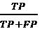
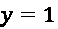

# 3

# 可解释性挑战

在本章中，我们将讨论用于机器学习解释的传统方法，包括回归和分类。这包括模型性能评估方法，如 RMSE、R-squared、AUC、ROC 曲线以及从混淆矩阵派生出的许多指标。然后，我们将检查这些性能指标的局限性，并解释“白盒”模型本质上可解释的原因以及为什么我们并不总是可以使用白盒模型。为了回答这些问题，我们将考虑预测性能和模型可解释性之间的权衡。最后，我们将发现一些新的“玻璃盒”模型，如**可解释提升机**（**EBMs**）和 GAMI-Net，它们试图不在这两种性能之间做出妥协。

本章将涵盖以下主要主题：

+   回顾传统的模型解释方法

+   理解传统模型解释方法的局限性

+   研究本质上可解释的（白盒）模型

+   认识到性能和可解释性之间的权衡

+   发现新的可解释（玻璃盒）模型

# 技术要求

从**第二章**，**可解释性关键概念**开始，我们使用自定义的`mldatasets`库来加载我们的数据集。有关如何安装此库的说明可以在**前言**中找到。除了`mldatasets`，本章的示例还使用了`pandas`、`numpy`、`sklearn`、`rulefit`、`interpret`、`statsmodels`、`matplotlib`和`gaminet`库。

本章的代码位于此处：[packt.link/swCyB](http://packt.link/swCyB)。

# 任务

想象一下，你是一位数据科学顾问，在 2019 年 1 月初的德克萨斯州沃斯堡的一个会议室里。在这个会议室里，世界上最大航空公司之一的**美国航空公司**（**AA**）的行政人员正在向您介绍他们的**准时性能**（**OTP**）。OTP 是衡量航班准时的一个广泛接受的**关键绩效指标**（**KPI**）。它被定义为在预定到达时间前后 15 分钟内到达的航班百分比。结果发现，AA 连续 3 年实现了略高于 80%的 OTP，这是可以接受的，并且是一个显著的改进，但他们仍然在全球排名第九，在北美排名第五。为了在明年的广告中炫耀，他们渴望至少在 2019 年成为北美第一，超越他们最大的竞争对手。

在财务方面，预计延误将使航空公司损失近 20 亿美元，因此减少 25-35%以与竞争对手持平可以产生可观的节省。而且，由于数千万小时的损失，乘客的损失也大致相同。减少延误将导致更满意的客户，这可能导致机票销售额的增加。

您的任务是创建可以准确预测国内航班延误的模型。他们希望从这些模型中获得以下信息：

+   了解哪些因素在 2018 年对国内到达延误影响最大

+   为了在 2019 年足够准确地预测空中由航空公司造成的延误，以减轻这些因素中的一些

但并非所有延误都是平等的。**国际航空运输协会**（**IATA**）有超过 80 个延误代码，从 14（*超额预订错误*）到 75（*飞机除冰、清除冰雪、防霜*）。有些是可以预防的，而有些则是不可避免的。

航空公司高管们告诉您，目前航空公司对预测由他们无法控制的事件（如极端天气、安全事件和空中交通管制问题）造成的延误不感兴趣。他们也不对由于使用同一架飞机的先前航班延误造成的延误感兴趣，因为这不是根本原因。尽管如此，他们仍然希望了解繁忙枢纽对可避免延误的影响，即使这与拥堵有关，因为毕竟，他们可能可以通过航班调度或航班速度，甚至登机口选择来做些什么。而且，虽然他们理解国际航班偶尔会影响国内航班，但他们希望首先解决庞大的本地市场。

高管们向您提供了美国交通部*运输统计局*的所有 2018 年 AA 国内航班的数据库。

# 方法

经过仔细考虑，您决定将此问题同时视为回归问题和分类问题。因此，您将创建预测延误分钟的模型以及分类航班是否延误超过 15 分钟的模型。为了解释，使用这两种方法将使您能够使用更广泛的方法，并相应地扩展解释。因此，我们将通过以下步骤来处理此示例：

1.  使用各种回归方法预测延误的分钟数

1.  使用各种分类方法将航班分类为延误或未延误

在“*回顾传统模型解释方法*”部分中，这些步骤后面是本章其余部分分散的结论。

# 准备工作

您可以在以下链接中找到此示例的代码：[`github.com/PacktPublishing/Interpretable-Machine-Learning-with-Python-2E/blob/main/03/FlightDelays.ipynb`](https://github.com/PacktPublishing/Interpretable-Machine-Learning-with-Python-2E/blob/main/03/FlightDelays.ipynb)。

# 加载库

要运行此示例，您需要安装以下库：

+   使用`mldatasets`来加载数据集

+   `pandas`和`numpy`来操作它

+   `sklearn`（scikit-learn）、`rulefit`、`statsmodels`、`interpret`、`tf`和`gaminet`来拟合模型和计算性能指标

+   `matplotlib`来创建可视化

按照以下代码片段加载这些库：

```py
import math
import mldatasets
import pandas as pd
import numpy as np
from sklearn.pipeline import make_pipeline
from sklearn.preprocessing import PolynomialFeatures, StandardScaler,\
                                  MinMaxScaler
from sklearn.model_selection import train_test_split
from sklearn import metrics, linear_model, tree, naive_bayes,\
                    neighbors, ensemble, neural_network, svm
from rulefit import RuleFit
import statsmodels.api as sm
from interpret.glassbox import ExplainableBoostingClassifier
from interpret import show
from interpret.perf import ROC
import tensorflow as tf
from gaminet import GAMINet
from gaminet.utils import plot_trajectory, plot_regularization,\
                    local_visualize, global_visualize_density,\
                    feature_importance_visualize
import matplotlib.pyplot as plt 
```

## 理解和准备数据

我们随后按如下方式加载数据：

```py
aad18_df = mldatasets.load("aa-domestic-delays-2018") 
```

应该有近 90 万条记录和 23 列。我们可以这样查看加载的内容：

```py
print(aad18_df.info()) 
```

以下为输出结果：

```py
RangeIndex: 899527 entries, 0 to 899526
Data columns (total 23 columns):
FL_NUM                  899527 non-null int64
ORIGIN                  899527 non-null object
DEST                    899527 non-null object
PLANNED_DEP_DATETIME    899527 non-null object
CRS_DEP_TIME            899527 non-null int64
DEP_TIME                899527 non-null float64
DEP_DELAY               899527 non-null float64
DEP_AFPH                899527 non-null float64
DEP_RFPH                899527 non-null float64
TAXI_OUT                899527 non-null float64
WHEELS_OFF              899527 non-null float64
    :          :  :    :
WEATHER_DELAY           899527 non-null float64
NAS_DELAY               899527 non-null float64
SECURITY_DELAY          899527 non-null float64
LATE_AIRCRAFT_DELAY     899527 non-null float64
dtypes: float64(17), int64(3), object(3) 
```

一切似乎都井然有序，因为所有列都在那里，并且没有`null`值。

### 数据字典

让我们检查数据字典。

一般特征如下：

+   `FL_NUM`: 航班号。

+   `ORIGIN`: 起始机场代码（IATA）。

+   `DEST`: 目的地机场代码（IATA）。

离开特征如下：

+   `PLANNED_DEP_DATETIME`: 航班的计划日期和时间。

+   `CRS_DEP_TIME`: 计划离开时间。

+   `DEP_TIME`: 实际离开时间。

+   `DEP_AFPH`: 在计划出发和实际出发之间的间隔内实际每小时航班数（考虑了 30 分钟的填充时间）。该特征告诉你出发机场在起飞时的繁忙程度。

+   `DEP_RFPH`: 离开相对航班每小时数是实际每小时航班数与当天、星期和月份在出发机场发生的平均每小时航班数的比率。该特征告诉你出发机场在起飞时的相对繁忙程度。

+   `TAXI_OUT`: 从出发机场登机口出发到飞机轮子离地的持续时间。

+   `WHEELS_OFF`: 飞机轮子离地的时间点。

飞行中的特征如下：

+   `CRS_ELAPSED_TIME`: 飞行行程计划所需的时间。

+   `PCT_ELAPSED_TIME`: 实际飞行时间与计划飞行时间的比率，以衡量飞机的相对速度。

+   `DISTANCE`: 两个机场之间的距离。

到达特征如下：

+   `CRS_ARR_TIME`: 计划到达时间。

+   `ARR_AFPH`: 在计划到达和实际到达时间之间的间隔内实际每小时航班数（考虑了 30 分钟的填充时间）。该特征告诉你目的地机场在着陆时的繁忙程度。

+   `ARR_RFPH`: 到达相对航班每小时数是实际每小时航班数与当天、星期和月份在该目的地机场发生的平均每小时航班数的比率。该特征告诉你目的地机场在着陆时的相对繁忙程度。

延误特征如下：

+   `DEP_DELAY`: 离开延误的总分钟数。

+   `ARR_DELAY`: 到达延误的总分钟数可以细分为以下任何一个或所有：

    1.  `CARRIER_DELAY`: 由航空公司控制因素（例如，维护或机组人员问题、飞机清洁、行李装载、加油等）造成的延误分钟数。

    1.  `WEATHER_DELAY`: 由重大气象条件（实际或预报）造成的延误分钟数。

    1.  `NAS_DELAY`：由国家航空系统（如非极端天气条件、机场运营、交通量过大和空中交通管制）规定的延误分钟数。

    1.  `SECURITY_DELAY`：由于疏散机场或候机楼、因安全漏洞重新登机、检查设备故障或安检区域超过 29 分钟的长时间排队等原因造成的延误分钟数。

    1.  `LATE_AIRCRAFT_DELAY`：由于同一架飞机的先前航班延误而造成的延误分钟数。

### 数据准备

首先，`PLANNED_DEP_DATETIME`必须是日期时间数据类型：

```py
aad18_df['PLANNED_DEP_DATETIME'] =\
pd.to_datetime(aad18_df['PLANNED_DEP_DATETIME']) 
```

飞行的确切日期和时间并不重要，但也许月份和星期几很重要，因为天气和季节性模式只能在这个粒度级别上得到欣赏。此外，提到的管理人员表示周末和冬季的延误尤其严重。因此，我们将为月份和星期几创建特征：

```py
aad18_df['DEP_MONTH'] = aad18_df['PLANNED_DEP_DATETIME'].dt.month
aad18_df['DEP_DOW'] = aad18_df['PLANNED_DEP_DATETIME'].dt.dayofweek 
```

我们不需要`PLANNED_DEP_DATETIME`列，所以让我们像这样删除它：

```py
aad18_df = aad18_df.**drop**(['PLANNED_DEP_DATETIME'], axis=1) 
```

记录到达或目的地机场是否为枢纽机场是至关重要的。美国航空公司（AA）在 2019 年有 10 个枢纽机场：夏洛特、芝加哥-奥黑尔、达拉斯/沃斯堡、洛杉矶、迈阿密、纽约-肯尼迪、纽约-拉瓜迪亚、费城、凤凰城-天港和华盛顿-国家机场。因此，我们可以使用它们的 IATA 代码来编码哪些`ORIGIN`和`DEST`机场是 AA 的枢纽机场，并删除包含代码的列，因为它们过于具体（`FL_NUM`、`ORIGIN`和`DEST`）：

```py
#Create list with 10 hubs (with their IATA codes)
hubs = ['CLT', 'ORD', 'DFW', 'LAX', 'MIA', 'JFK', 'LGA', 'PHL',
        'PHX', 'DCA']
#Boolean series for if ORIGIN or DEST are hubsis_origin_hub =
aad18_df['ORIGIN'].isin(hubs)
is_dest_hub = aad18_df['DEST'].isin(hubs)
#Use boolean series to set ORIGIN_HUB and DEST_HUB
aad18_df['ORIGIN_HUB'] = 0
aad18_df.loc[is_origin_hub, 'ORIGIN_HUB'] = 1
aad18_df['DEST_HUB'] = 0
aad18_df.loc[is_dest_hub, 'DEST_HUB'] = 1
#Drop columns with codes
aad18_df = aad18_df.drop(['FL_NUM', 'ORIGIN', 'DEST'], axis=1) 
```

在进行所有这些操作之后，我们拥有相当数量的有用特征，但我们尚未确定目标特征。有两列可以用于此目的。我们有`ARR_DELAY`，这是无论原因如何延迟的总分钟数，然后是`CARRIER_DELAY`，这只是可以归因于航空公司的那些分钟数的总和。例如，看看以下样本，这些航班延误超过 15 分钟（根据航空公司的定义，这被认为是延误）：

```py
aad18_df.loc[aad18_df['ARR_DELAY'] > 15,\
['ARR_DELAY','CARRIER_DELAY']].head(10) 
```

上述代码输出了**图 3.1**：


**图 3.1**：样本观察值，到达延误超过 15 分钟

在*图 3.1*的所有延误中，其中之一（#26）根本不是航空公司的责任，因为只有 0 分钟可以归因于航空公司。其中四个部分是航空公司的责任（#8、#16、#33 和#40），其中两个由于航空公司而晚于 15 分钟（#8 和#40）。其余的完全是航空公司的责任。我们可以看出，尽管总延误是有用的信息，但航空公司的高管们只对由航空公司造成的延误感兴趣，因此`ARR_DELAY`可以被丢弃。此外，还有一个更重要的原因应该丢弃它，那就是如果当前的任务是预测延误，我们不能使用几乎完全相同的延误（减去不是由于航空公司的部分）来预测它。出于这个原因，最好移除`ARR_DELAY`：

```py
aad18_df = aad18_df.drop(['ARR_DELAY'], axis=1) 
```

最后，我们可以将目标特征单独作为`y`，其余所有特征作为`X`。之后，我们将`y`和`X`分为训练集和测试集。请注意，对于回归，目标特征（`y`）保持不变，因此我们将其分为`y_train_reg`和`y_test_reg`。然而，对于分类，我们必须将这些标签的二进制版本表示为是否晚于 15 分钟以上，称为`y_train_class`和`y_test_class`。请注意，我们正在设置一个固定的`random_state`以确保可重复性：

```py
rand = 9 
np.random.seed(rand)
y = aad18_df['CARRIER_DELAY']
X = aad18_df.drop(['CARRIER_DELAY'], axis=1).copy()
X_train, X_test, y_train_reg, y_test_reg = **train_test_split**(
    X, y, test_size=0.15, **random_state**=rand
)
y_train_class = y_train_reg.apply(lambda x: 1 if x > 15 else 0)
y_test_class = y_test_reg.apply(lambda x: 1 if x > 15 else 0) 
```

为了检查特征与目标`CARRIER_DELAY`的线性相关性，我们可以计算皮尔逊相关系数，将系数转换为绝对值（因为我们不感兴趣它们是正相关还是负相关），并按降序排序：

```py
corr = aad18_df.**corr**()
abs(corr['CARRIER_DELAY']).**sort_values**(ascending=False) 
```

如您从输出中可以看出，只有一个特征（`DEP_DELAY`）高度相关。其他特征则不然：

```py
CARRIER_DELAY         1.000000
DEP_DELAY             0.703935
ARR_RFPH              0.101742
LATE_AIRCRAFT_DELAY   0.083166
DEP_RFPH              0.058659
ARR_AFPH              0.035135
DEP_TIME              0.030941
NAS_DELAY             0.026792
:          :
WEATHER_DELAY         0.003002
SECURITY_DELAY        0.000460 
```

然而，这仅仅是*线性*相关的，并且是逐个比较的。这并不意味着它们没有非线性关系，或者几个特征相互作用不会影响目标。在下一节中，我们将进一步讨论这个问题。

# 审查传统的模型解释方法

为了尽可能探索多种模型类别和解释方法，我们将数据拟合到回归和分类模型中。

## 使用各种回归方法预测延误的分钟数

为了比较和对比回归方法，我们首先创建一个名为`reg_models`的字典。每个模型都是其自己的字典，创建它的函数是`model`属性。这种结构将在以后用来整洁地存储拟合的模型及其指标。这个字典中的模型类别已被选择来代表几个模型家族，并展示我们将要讨论的重要概念：

```py
reg_models = {
    #Generalized Linear Models (GLMs)
    'linear':{'model': linear_model.LinearRegression()}, 
    'linear_poly':{
        'model':make_pipeline(
            PolynomialFeatures(degree=2),
            linear_model.LinearRegression(fit_intercept=False)
        )
    },
    'linear_interact':{
        'model':make_pipeline(
            PolynomialFeatures(interaction_only=True),
            linear_model.LinearRegression(fit_intercept=False)
        )
    },
    'ridge':{
        'model': linear_model.RidgeCV(
            alphas=[1e-3, 1e-2, 1e-1, 1])
    },
    #Trees  
    'decision_tree':{
        'model': tree.DecisionTreeRegressor(
             max_depth=7, random_state=rand
        )
    },
    #RuleFit
    'rulefit':{
        'model': RuleFit(
             max_rules=150,
             rfmode='regress',
             random_state=rand
        )
    },
    #Nearest Neighbors
    'knn':{'model': neighbors.KNeighborsRegressor(n_neighbors=7)},
    #Ensemble Methods
    'random_forest':{
        'model':ensemble.RandomForestRegressor(
            max_depth=7, random_state=rand)
    },
    #Neural Networks
    'mlp':{
        'model':neural_network.MLPRegressor(
            hidden_layer_sizes=(21,),
            max_iter=500, 
            early_stopping=True,
            random_state=rand
        )
    }
} 
```

在我们将数据拟合到这些模型之前，我们将逐一简要解释它们：

+   `linear`: **线性回归**是我们讨论的第一个模型类别。不管好坏，它对数据做出了一些假设。其中最重要的是假设预测必须是*X*特征的线性组合。这自然限制了发现特征之间非线性关系和交互的能力。

+   `linear_poly`: **多项式回归**通过添加多项式特征扩展了线性回归。在这种情况下，如`degree=2`所示，多项式度数为二，因此它是二次的。这意味着除了所有特征都以单变量形式（例如，`DEP_FPH`）存在之外，它们还以二次形式存在（例如，`DEP_FPH²`），以及所有 21 个特征的许多交互项。换句话说，对于`DEP_FPH`，会有如`DEP_FPH`  `DISTANCE`、`DEP_FPH`  `DELAY`等交互项，以及其他所有特征的类似项。

+   `linear_interact`: 这就像**多项式回归**模型，但没有二次项——换句话说，只有交互项，正如`interaction_only=True`所暗示的那样。它是有用的，因为我们没有理由相信我们的任何特征与二次项有更好的拟合关系。然而，也许正是与其他特征的交互产生了影响。

+   `ridge`: **岭回归**是线性回归的一种变体。然而，尽管线性回归背后的方法，称为**普通最小二乘法**（**OLS**），在减少误差和将模型拟合到特征方面做得相当不错，但它并没有考虑**过拟合**。问题在于 OLS 平等地对待所有特征，因此随着每个变量的增加，模型变得更加复杂。正如单词*过拟合*所暗示的，结果模型对训练数据拟合得太好，导致最低的偏差但最高的方差。在这个**偏差和方差之间的权衡**中有一个甜蜜点，而到达这个点的一种方法是通过减少引入过多特征所增加的复杂性。线性回归本身并没有装备去做到这一点。

正是在这里，岭回归伴随着我们的朋友**正则化**出现。它是通过引入一个称为**L2 范数**的惩罚项来缩小对结果没有贡献的系数来做到这一点的。它惩罚复杂性，从而约束算法不过拟合。在这个例子中，我们使用了一个交叉验证版本的`ridge`（`RidgeCV`），它测试了几个正则化强度（`alphas`）。

+   `decision_tree`: **决策树**正如其名所示。想象一个树状结构，在每一个分支点，数据集被细分以形成更多的分支，都会对某个特征进行“测试”，将数据集划分到每个分支。当分支停止细分时，它们变成叶子节点，在每一个叶子节点，都会做出一个“决策”，无论是为分类分配一个**类别**还是为回归提供一个固定值。我们将此树限制在 `max_depth=7` 以防止过拟合，因为树越大，它将更好地拟合我们的训练数据，并且越不可能将树泛化到非训练数据。

+   `rule_fit`: **RuleFit** 是一种正则化线性回归，扩展到包括以规则形式出现的特征交互。这些规则是通过遍历决策树形成的，除了它丢弃了叶子节点并保留了在向这些叶子节点分支过程中发现的特征交互。它使用 **LASSO 回归**，与岭回归类似，使用正则化，但它使用的是 **L1 范数**而不是 **L2 范数**。结果是，无用的特征最终会得到零系数，并且不会像 L2 那样简单地收敛到零，这使得算法可以轻松地将它们过滤掉。我们将规则限制在 150 条（`max_rules=150`），属性 `rfmode='regress'` 告诉 RuleFit 这是一个回归问题，因为它也可以用于分类。与这里使用的所有其他模型不同，这不是一个 scikit-learn 模型，而是由 Christoph Molnar 创建的，他改编了一篇名为 *Predictive learning via rule ensembles* 的论文。

+   `knn`: **k-Nearest Neighbors** (**k-NN**) 是一种基于**局部性**假设的简单方法，该假设认为彼此靠近的数据点相似。换句话说，它们必须具有相似的预测值，而在实践中，这并不是一个糟糕的猜测，因此它选取离你想要预测的点最近的数据点，并根据这些点进行预测。在这种情况下，`n_neighbors=7`，所以 k = 7。它是一个**基于实例的机器学习模型**，也称为**懒惰学习器**，因为它只是存储训练数据。在推理过程中，它使用训练数据来计算与点的相似性，并根据这些相似性生成预测。这与基于模型的机器学习技术，或**急切学习器**所做的方法相反，后者使用训练数据来学习公式、参数、系数或偏差/权重，然后利用这些信息在推理过程中进行预测。

+   `随机森林`：想象一下，不是一棵，而是成百上千棵决策树，这些决策树是在特征随机组合和数据随机样本上训练的。**随机森林**通过平均这些随机生成的决策树来创建最佳树。这种在并行训练较少有效模型并使用平均过程将它们组合起来的概念被称为**袋装法**。它是一种**集成**方法，因为它将多个模型（通常称为**弱学习器**）组合成一个**强学习器**。除了**袋装法**之外，还有两种其他集成技术，称为**提升法**和**堆叠法**。对于更深的袋装，树更好，因为它们减少了方差，这就是为什么我们使用`max_depth=7`的原因。

+   `mlp`：**多层感知器**是一个“普通”的前馈（顺序）神经网络，因此它使用非线性激活函数（`MLPRegressor`默认使用*ReLU*），随机梯度下降和反向传播。在这种情况下，我们在第一个也是唯一的隐藏层中使用 21 个神经元，因此`hidden_layer_sizes=(21,)`，运行 500 个训练周期（`max_iter=500`），并在验证分数不再提高时终止训练（`early_stopping=True`）。

如果你对这些模型中的某些不熟悉，不要担心！我们将在本章和书中更详细地介绍它们。此外，请注意，这些模型中的某些模型在某个地方有一个随机过程。为了确保可重复性，我们已经设置了`random_state`。最好总是设置它；否则，它将每次随机设置，这将使你的结果难以重复。

现在，让我们遍历我们的模型字典（`reg_models`），将它们拟合到训练数据上，并根据这些预测的质量计算两个指标。然后我们将保存拟合的模型、测试预测和指标到字典中，以供以后使用。请注意，`rulefit`只接受`numpy`数组，所以我们不能以同样的方式`fit`它。另外，请注意，`rulefit`和`mlp`的训练时间比其他模型长，所以这可能需要几分钟才能运行：

```py
for model_name in reg_models.keys():
    if model_name != 'rulefit':
        fitted_model = reg_models[model_name]\
        ['model'].fit(X_train, y_train_reg)
    else :
        fitted_model = reg_models[model_name]['model'].\
        fit(X_train.values, y_train_reg.values, X_test.columns
        )
        y_train_pred = fitted_model.predict(X_train.values)
        y_test_pred = fitted_model.predict(X_test.values)
    reg_models[model_name]['fitted'] = fitted_model
    reg_models[model_name]['preds'] = y_test_pred
    reg_models[model_name]['RMSE_train'] =\
    math.sqrt(
        metrics.mean_squared_error(y_train_reg, y_train_pred)
    )
    reg_models[model_name]['RMSE_test'] =\
    math.sqrt(metrics.mean_squared_error(y_test_reg, y_test_pred)
    )
    reg_models[model_name]['R2_test'] =\
    metrics.r2_score(y_test_reg, y_test_pred) 
```

我们现在可以将字典转换为`DataFrame`，并以排序和彩色编码的方式显示指标：

```py
reg_metrics = pd.**DataFrame.from_dict**(
    reg_models, 'index')[['RMSE_train', 'RMSE_test', 'R2_test']
]
reg_metrics.**sort_values**(by=**'RMSE_test'**).style.format(
    {'RMSE_train': '{:.2f}', 'RMSE_test': '{:.2f}', 
     'R2_test': '{:.3f}'}
).background_gradient(
    cmap='viridis_r', low=0.1, high=1,
    subset=['RMSE_train', 'RMSE_test']
).background_gradient(
    cmap='plasma', low=0.3, high=1, subset=['R2_test']
) 
```

上述代码输出了*图 3.2*。请注意，彩色编码并不适用于所有 Jupyter Notebook 实现：


图 3.2：我们模型的回归指标

为了解释*图 3.2*中的指标，我们首先应该了解它们在一般和回归练习的上下文中的含义：

+   **RMSE**：**均方根误差**定义为残差的均方差。它是平方残差除以观测数（在这种情况下，航班）的平方根。它告诉你，平均而言，预测值与实际值之间的差距有多大，正如你可能从颜色编码中看出，差距越小越好，因为你想让你的预测值尽可能接近实际值在 *测试*（**保留**）数据集中的实际值。我们还包含了该指标用于 **训练** 数据集，以查看其泛化能力如何。你预计测试误差将高于训练误差，但不会高很多。如果是这样，就像 `random_forest` 的情况一样，你需要调整一些参数以减少过拟合。在这种情况下，减少树的最大深度，增加树的数量（也称为 **估计器**），以及减少可使用特征的最大数量应该会有效。另一方面，对于 `knn`，你可以调整邻居的数量，但由于其 **懒惰学习器** 的特性，预计在训练数据上表现良好。

    无论如何，这些数字相当不错，因为即使是我们表现最差的模型，其测试 RMSE 也低于 10 分钟，大约一半的模型测试 RMSE 低于 7.5，很可能在平均意义上有效地预测了延误，因为延误的阈值是 15 分钟。

    注意，`linear_poly` 是第二高效模型，而 `linear_interact` 是第四高效模型，显著优于 `linear`，这表明非线性交互是产生更好预测性能的重要因素。

+   **R**²：**R 平方**也称为**确定系数**。它定义为模型中 *y*（结果）目标中可以由 *X*（预测器）特征解释的方差比例。它回答了模型变异性中有多少比例是可解释的问题？正如你可能从颜色编码中看出，越多越好。我们的模型似乎包括重要的 *X* 特征，正如我们的 *皮尔逊相关系数* 所证明的那样。所以如果这个 *R*² 值很低，也许添加额外的特征会有所帮助，例如航班日志、终端条件，甚至那些航空公司高管表示他们现在不感兴趣探索的事情，比如 *仿制品* 影响，以及国际航班。这些可以填补未解释方差中的空白。

让我们看看我们是否能通过分类获得良好的指标。

## 使用各种分类方法将航班分类为延误或未延误

就像我们在回归中做的那样，为了比较和对比分类方法，我们首先为它们创建一个名为 `class_models` 的字典。每个模型都是一个自己的字典，创建它的函数是 `model` 属性。这种结构将用于稍后存储拟合的模型及其指标。这个字典中的模型类被选择来代表几个模型家族，并展示我们将要讨论的重要概念。其中一些可能看起来很熟悉，因为它们是回归中使用的相同方法，但应用于分类：

```py
class_models = {
    #Generalized Linear Models (GLMs)
    'logistic':{'model': linear_model.LogisticRegression()},
    'ridge':{
        'model': linear_model.RidgeClassifierCV(
            cv=5, alphas=[1e-3, 1e-2, 1e-1, 1],
            class_weight='balanced'
        )
    },
    #Tree
    'decision_tree':{
        'model': tree. DecisionTreeClassifier(max_depth=7,
                                              random_state=rand)
    },
    #Nearest Neighbors
    'knn':{'model': neighbors.KNeighborsClassifier(n_neighbors=7)},
    #Naive Bayes
    'naive_bayes':{'model': naive_bayes.GaussianNB()},
    #Ensemble Methods
    'gradient_boosting':{
        'model':ensemble.
        GradientBoostingClassifier(n_estimators=210)
    },
    'random_forest':{
        'model':ensemble.RandomForestClassifier(
            max_depth=11,class_weight='balanced', random_state=rand
        )
    },
    #Neural Networks
    'mlp':{
        'model': make_pipeline(
            StandardScaler(),
            neural_network.MLPClassifier(
                hidden_layer_sizes=(7,),
                max_iter=500,
                early_stopping=True,
                random_state=rand
            )
        )
    }
} 
```

在我们开始将这些模型拟合到数据之前，我们将逐一简要解释它们：

+   `logistic`：**逻辑回归**在**第二章**，**可解释性的关键概念**中介绍。它具有与**线性回归**许多相同的优缺点。例如，必须手动添加特征交互。与其他分类模型一样，它返回一个介于 0 和 1 之间的概率，当接近 1 时，表示与**正类**的匹配可能性较大，而当接近 0 时，表示与**正类**的匹配可能性较小，因此更可能是**负类**。自然地，0.5 是用于决定类别的阈值，但不必如此。正如我们将在本书稍后考察的那样，调整阈值有解释和性能的原因。请注意，这是一个二分类问题，所以我们只是在延迟（正类）和未延迟（负类）之间进行选择，但这种方法可以扩展到多分类。那时它将被称为**多项式分类**。

+   `ridge`：**岭分类**利用与**岭回归**中使用的相同正则化技术，但应用于分类。它是通过将目标值转换为 -1（对于负类）并保留 1（对于正类）来实现的，然后执行岭回归。在其核心，这种伪装的回归将预测介于 -1 和 1 之间的值，然后将它们转换回 0–1 的尺度。与回归中的 `RidgeCV` 类似，`RidgeClassifierCV` 使用留一法交叉验证，这意味着它首先将数据分割成不同大小相等的集合——在这种情况下，我们使用五个集合（`cv=5`）——然后逐个移除特征，以查看模型在没有这些特征的情况下表现如何，平均在所有五个集合上。那些没有太大差别的特征会通过测试几个正则化强度（`alphas`）来受到惩罚，以找到最佳强度。与所有**正则化**技术一样，目的是阻止从不必要的复杂性中学习，最小化不太显著的特征的影响。

+   `decision_tree`：这种标准的**决策树**，如这个例子，也被称为**CART**（**分类和回归树**），因为它可以用于回归或分类任务。它对这两个任务都有相同的算法，但功能略有不同，比如用于决定在哪里“分裂”分支的算法。在这种情况下，我们只允许我们的树具有 7 的深度。

+   `knn`：**k-NN**也可以应用于分类任务，除了不平均最近邻的目标特征（或标签）之外，它选择最频繁的一个（也称为**众数**）。我们还在分类中使用 7 作为 k 值（`n_neighbors`）。

+   `naive_bayes`：**高斯朴素贝叶斯**是**朴素贝叶斯**分类器家族的一部分，之所以称为朴素，是因为它们假设特征之间相互独立，这通常不是情况。除非这个假设是正确的，否则这会极大地限制其预测能力。它被称为**贝叶斯**，因为它基于**贝叶斯条件概率定理**，即类的条件概率是类的概率乘以给定类的特征概率。**高斯朴素贝叶斯**还做出了一个额外的假设，即连续值具有正态分布，也称为**高斯分布**。

+   `gradient_boosting`：与**随机森林**类似，**梯度提升树**也是一种集成方法，但它使用**提升**而不是**袋装**。**提升**不是并行工作，而是按顺序，迭代地训练弱学习器，并将它们的优势纳入更强的学习器中，同时调整另一个弱学习器来克服它们的弱点。尽管集成和提升，尤其是提升，可以用模型类来完成，但这种方法使用的是决策树。我们将树的数量限制为 210（`n_estimators=210`）。

+   `random_forest`：与回归相同的**随机森林**，除了它生成分类决策树而不是回归树。

+   `mlp`：与回归相同的**多层感知器**，但默认情况下，输出层使用**对数**函数来产生概率，然后根据 0.5 阈值将其转换为 1 或 0。另一个区别是我们使用七个神经元在第一个也是唯一的隐藏层中（`hidden_layer_sizes=(7,)`），因为二分类通常需要较少的神经元来实现最佳结果。

请注意，这些模型中的一些使用平衡权重进行类别分配（`class_weight='balanced'`），这一点非常重要，因为这是一个**不平衡分类**任务。换句话说，负类远远多于正类。我们可以查看我们的训练数据是什么样的：

```py
print(y_train_class[y_train_class==1].shape[0] y_train_class.shape[0]) 
```

如您所见，训练数据中正类的输出只占总数的 6%。考虑到这一点，模型将实现**更平衡**的结果。有几种方法可以处理**类别不平衡**，我们将在第十一章**偏差缓解和因果推断方法**中详细讨论，但`class_weight='balanced'`通过类频率的反比应用权重，给数量较少的**正类**一个优势。

### 训练和评估分类模型

```py
gradient_boosting of sklearn takes longer than the rest to train, so this can take a few minutes to run:
```

```py
for model_name in class_models.keys():
    fitted_model = class_models[model_name]
    ['model'].fit(X_train,y_train_class)
    y_train_pred = fitted_model.predict(X_train.values)
    if model_name == 'ridge':
        y_test_pred = fitted_model.predict(X_test.values)
    else:
        y_test_prob = fitted_model.predict_proba(X_test.values)[:,1]
        y_test_pred = np.where(y_test_prob > 0.5, 1, 0)
     class_models[model_name]['fitted'] = fitted_model
    class_models[model_name]['probs'] = y_test_prob
    class_models[model_name]['preds'] = y_test_pred
    class_models[model_name]['Accuracy_train'] =\
    metrics.**accuracy_score**(y_train_class, y_train_pred
    )
    class_models[model_name]['Accuracy_test'] =\
    metrics.**accuracy_score**(y_test_class, y_test_pred
    )
    class_models[model_name]['Recall_train'] =\
    metrics.**recall_score**(y_train_class, y_train_pred
    )
    class_models[model_name]['Recall_test'] =\
    metrics.**recall_score**(y_test_class, y_test_pred
    )
    if model_name != 'ridge':
        class_models[model_name]['ROC_AUC_test'] =\
        metrics.**roc_auc_score**(y_test_class, y_test_prob)
    else:
        class_models[model_name]['ROC_AUC_test'] = np.nan
    class_models[model_name]['F1_test'] =\
    metrics.**f1_score**(y_test_class, y_test_pred
    )
    class_models[model_name]['MCC_test'] =\
    metrics.**matthews_corrcoef**(y_test_class, y_test_pred
    ) 
```

我们现在可以将字典转换为`DataFrame`，并以排序和彩色编码的方式显示指标：

```py
class_metrics = pd.**DataFrame.from_dict**(
    class_models,'index')[['Accuracy_train', 'Accuracy_test',
                           'Recall_train', 'Recall_test',
                           'ROC_AUC_test', 'F1_test', 'MCC_test']
]
class_metrics.**sort_values**(
    by=**'ROC_AUC_test'**, ascending=False).
    style.format(dict(zip(class_metrics.columns, ['{:.3f}']*7))
).background_gradient(
cmap='plasma', low=1, high=0.1, subset=['Accuracy_train',
                                        'Accuracy_test']
).background_gradient(
    cmap='viridis',
    low=1,
    high=0.1,
    subset=['Recall_train', 'Recall_test',
            'ROC_AUC_test', 'F1_test', 'MCC_test']
) 
```

上述代码输出了**图 3.3**：


图 3.3：我们模型的分类指标

为了解释**图 3.3**中的指标，我们首先应该了解它们在一般意义上的含义，以及在这个分类练习中的具体含义：

+   **准确率**：准确率是衡量分类任务有效性的最简单方法，它是所有预测中正确预测的百分比。换句话说，在二元分类任务中，你可以通过将**真正例**（TPs）和**真负例**（TNs）的数量相加，然后除以所有预测的总数来计算这个值。与回归指标一样，你可以测量训练和测试的准确率来评估过拟合。

+   **回忆率**：尽管准确率听起来像是一个很好的指标，但在这种情况下，召回率要好得多，原因是你可能会有 94%的准确率，这听起来相当不错，但结果却是你总是预测没有延迟！换句话说，即使你得到了很高的准确率，除非你对最不常见的类别，即延迟，进行准确预测，否则它就没有意义。我们可以通过召回率（也称为**灵敏度**或**真正例率**）来找到这个数字，它表示为  ，它可以解释为有多少相关结果被返回——换句话说，在这种情况下，实际延迟的百分比是多少。

    另一个涉及真正例的好指标是**精确率**，它表示我们的预测样本的相关性，表示为  。在这种情况下，这将是预测的延迟中有多少是实际延迟。对于不平衡的类别，建议同时使用两者，但根据你对**假正例**（FP）的偏好，你可能更喜欢召回率而不是精确率，反之亦然。

+   **ROC-AUC**: **ROC**代表**接收者操作特征**，它被设计用来区分信号和噪声。它所做的是在*x*轴上绘制**真正例率**（**召回率**）的比例，在*y*轴上绘制假正例率。**AUC**代表**曲线下面积**，这是一个介于 0 和 1 之间的数字，用于评估分类器的预测能力：1 表示完美，0.5 表示与随机抛硬币一样好，任何低于这个值的都意味着如果我们反转预测结果，我们会得到更好的预测。为了说明这一点，让我们根据 AUC 指标为我们的表现最差的模型，朴素贝叶斯，生成一个 ROC 曲线：

    ```py
    plt.tick_params(axis = 'both', which = 'major')
    fpr, tpr, _ = metrics.**roc_curve**(
      y_test_class, class_models['naive_bayes']['probs'])
    plt.plot(
        fpr,
        tpr,
        label='ROC curve (area = %0.2f)'
        % class_models['naive_bayes']['ROC_AUC_test']
    )
    plt.plot([0, 1], [0, 1], 'k–') #random coin toss line
    plt.xlabel('False Positive Rate')
    plt.ylabel('True Positive Rate')
    plt.xlim([0.0, 1.0])
    plt.ylim([0.0, 1.0])
    plt.legend(loc="lower right") 
    ```

    上述代码输出了*图 3.4*。注意，对角线表示一半的面积。换句话说，它具有类似抛硬币预测质量的点：

    

    图 3.4：朴素贝叶斯的 ROC 曲线

+   **F1**: **F1 分数**也称为精确率和召回率的调和平均，因为它是这样计算的：。由于它包括了精确率和召回率指标，这些指标与真正例的比例有关，因此当你的数据集不平衡，你既不偏好精确率也不偏好召回率时，它是一个很好的指标选择。

+   **MCC**: **马修斯相关系数**是从生物统计学中提取的一个指标。它在更广泛的数据科学社区中越来越受欢迎，因为它能够公平地考虑*TP*、*FN*、*TN*和*FP*，因为它考虑了类别的比例。这使得它非常适合不平衡的分类任务。与迄今为止使用的所有其他指标不同，它的范围不是从 0 到 1，而是从-1（完全不一致）到 1（预测与实际完全一致）。中间点，0，相当于随机预测：


我们的分类指标大多非常好，准确率超过 96%，召回率超过 75%。然而，召回率并不是一切。例如，`RandomForest`由于使用了带权重的类别平衡，召回率最高，但在 F1 和 MCC 上表现不佳，这表明精确度不是很好。

岭分类也有相同的设置，并且 F1 分数非常低，以至于精确度肯定很糟糕。这并不意味着这种加权技术本质上就是错误的，但它通常需要更多的控制。这本书将涵盖实现公平性和准确性、准确性可靠性、可靠性有效性之间正确平衡的技术。这是一个需要许多指标和可视化的平衡行为。从这个练习中，我们应该得到的一个关键教训是**单一指标并不能告诉你全部的故事**，而解释就是**讲述最相关且足够完整的故事**。

# 理解传统模型解释方法的局限性

简而言之，传统的解释方法**仅涵盖关于您模型的高级问题**，例如以下内容：

+   总体而言，它们的性能如何？

+   哪些超参数的变化可能会影响预测性能？

+   您可以在特征和它们的预测性能之间找到哪些**潜在模式**？

如果您试图了解的不仅是模型是否工作，而是它**为什么**和**如何**工作，这些问题就非常有限了？

这种理解上的差距可能导致模型出现意想不到的问题，这些问题可能不会立即显现。让我们考虑一下，一旦部署，模型不是静态的，而是动态的。它们面临与您在训练它们时的“实验室”中不同的挑战。它们可能不仅面临性能问题，还可能面临偏差问题，例如代表性不足的类别的失衡，或者对抗攻击的安全漏洞。意识到特征在现实世界环境中的变化，我们可能需要添加新特征，而不仅仅是使用相同的特征集重新训练。如果您的模型做出了某些令人不安的假设，您可能需要重新审查整个流程。但您如何识别这些问题最初存在呢？这就是您需要一套全新的解释工具的时候了，这些工具可以帮助您深入了解并回答关于您模型更具体的问题。这些工具提供的解释可以真正考虑到**公平性、责任和透明度**（**FAT**），这是我们讨论过的*第一章*，*解释、可解释性和可解释性；以及为什么这一切都很重要？*

# 研究本质上可解释（白盒）模型

到目前为止，在本章中，我们已经将我们的训练数据拟合到代表每个这些“白盒”模型家族的模型类别。本节的目的就是向您展示它们为什么是**本质上可解释的**。我们将通过使用之前拟合的模型来实现这一点。

## 广义线性模型（GLMs）

GLMs（广义线性模型）是一个包含各种模型类的大家族，每个统计分布都有一个对应的模型。就像**线性回归**假设目标特征和残差具有正态分布一样，**逻辑回归**假设伯努利分布。对于每个分布都有相应的 GLM，例如**泊松回归**用于泊松分布和**多项式响应**用于多项式分布。您可以根据目标变量的分布以及数据是否满足 GLM 的其他假设（这些假设各不相同）来选择使用哪种 GLM。除了基础分布之外，将 GLMs 联系在一起成为一个单一家族的事实是它们都有一个线性预测器。换句话说，目标变量（或预测器）可以用数学方式表示为*X*特征的加权总和，其中权重被称为*b*系数。这是所有 GLM 共有的简单公式，即线性预测函数：


然而，尽管它们有相同的公式，但每个都有不同的链接函数，它提供了线性预测函数和 GLM 的统计分布的均值之间的联系。这可以在保留*b*系数和*X*输入数据之间的线性组合的同时，给结果模型公式添加一些非线性，这可能会引起混淆。尽管如此，由于线性组合，它仍然是线性的。

对于特定的 GLM 也有许多变体。例如，**多项式回归**是其特征的多项式形式的*线性回归*，而**岭回归**是带有 L2 正则化的*线性回归*。在本节的例子中，我们不会涵盖所有 GLM，因为它们对于本章的例子不是必需的，但它们都有合理的应用场景。

偶然的是，还有一个类似的概念叫做**广义加性模型**（**GAMs**），这些是 GLM，它们不需要特征和系数的线性组合，而是保留了加法部分，但应用于特征的任意函数。GAMs 也是可解释的，但它们并不常见，通常是为特定用例专门定制的*ad hoc*。

### 线性回归

在*第一章*，*解释、可解释性和可解释性，以及为什么这一切都很重要？*中，我们介绍了简单线性回归的公式，它只有一个*X*特征。多元线性回归扩展到任何数量的特征，所以不再是：


它可以是：


有*n*个特征，其中是截距，多亏了线性代数，这可以是一个简单的矩阵乘法：


用于得到最优*b*系数的方法，**OLS**，已经被深入研究并理解。此外，除了系数之外，你还可以为每个系数提取置信区间。模型的正确性取决于输入数据是否满足假设：**线性**、**正态性**、**独立性**、**多重共线性**和**同方差性**。我们已经讨论了线性，所以到目前为止，我们将简要解释其余部分：

+   **正态性**是每个特征都是正态分布的性质。这可以通过**Q-Q 图**、直方图或**Kolmogorov-Smirnov**测试来测试，非正态性可以通过非线性变换来纠正。如果一个特征不是正态分布的，它将使其系数置信区间无效。

+   **独立性**是指你的*观测值*（数据集中的行）彼此独立，就像不同且无关的事件一样。如果你的*观测值*不独立，可能会影响你对结果的理解。在本章的例子中，如果你有关于同一航班的多个行，可能会违反这个假设，使结果难以理解。这可以通过查找重复的航班号来测试。

+   当特征之间高度相关时，会发生多重共线性。**缺乏多重共线性**是可取的，因为否则你会得到不准确的系数。这可以通过**相关矩阵**、**容忍度度量**或**方差膨胀因子**（**VIF**）来测试，并且可以通过删除每个高度相关特征中的一个来纠正。

+   **同方差性**在*第一章*，*解释、可解释性和可解释性；以及这一切为什么都重要？*中简要讨论过，这是指残差（误差）在回归线上大致相等。这可以通过**Goldfeld-Quandt 检验**来测试，而异方差性（同方差性的缺乏）可以通过非线性变换来纠正。在实践中，这个假设通常被违反。

尽管我们在这个章节的示例中没有这样做，但如果你将大量依赖线性回归，那么在开始将数据拟合到线性回归模型之前测试这些假设总是好的。本书不会详细介绍如何这样做，因为它更多地关注模型无关和深度学习解释方法，而不是深入探讨如何满足特定模型类（如**正态性**和**同方差性**）的假设。然而，我们在*第二章*，*可解释性的关键概念*中涵盖了最影响解释的特征，我们将继续寻找这些特征：**非线性**、**非单调性**和**交互性**。我们将这样做主要是因为无论使用哪种建模类进行预测，特征之间的线性和相关性仍然是相关的。而且，这些特征可以通过线性回归中使用的方法轻松测试。

#### 解释

那么，我们如何解释线性回归模型呢？很简单！只需获取系数和截距。我们的 scikit-learn 模型具有这些属性，它们嵌入在拟合的模型中：

```py
coefs_lm = reg_models['linear']['fitted'].coef_
intercept_lm = reg_models['linear']['fitted'].intercept_
print('coefficients:%s' % coefs_lm)
print('intercept:%s' % intercept_lm) 
```

上述代码输出了以下内容：

```py
coefficients:   [ 0.0045 -0.0053 0.8941 0.0152 ...]
intercept: -37.86 
```

现在你已经知道了公式，看起来可能像这样：


这个公式应该可以提供一些关于模型如何全局解释的直觉。在多元线性回归中，解释模型中的每个系数可以像我们在*第一章*，*解释、可解释性和可解释性；以及这一切为什么都重要？*中的简单线性回归示例中所做的那样进行。系数充当权重，但它们也根据特征类型讲述不同的故事。为了使解释更易于管理，让我们将我们的系数放在一个`DataFrame`中，并附带每个特征的名称：

```py
pd.DataFrame({'feature': X_train.columns.tolist(),\
              'coef': coefs_lm.tolist()}) 
```

上述代码生成了*图 3.5*中的 DataFrame：


图 3.5：线性回归特征系数

这是如何使用*图 3.5*中的系数来解释一个特征的示例：

+   **连续型**: 就像 `ARR_RFPH` 一样，你知道对于每增加一个单位（相对每小时航班数），如果其他所有特征保持不变，它将使预测延误增加 0.373844 分钟。

+   **二元型**: 就像 `ORIGIN_HUB` 一样，你知道出发机场是否是枢纽通过系数 -1.029088 来表达。换句话说，由于它是一个负数，出发机场是枢纽。如果其他所有特征保持不变，它将减少超过 1 分钟的延误。

+   **类别型**: 我们没有类别特征，但我们有可能是类别特征的有序特征。实际上，它们应该是类别特征。例如，`DEP_MONTH` 和 `DEP_DOW` 分别是 1–12 和 0–6 的整数。如果将它们视为有序特征，我们假设由于线性回归的线性性质，月份的增加或减少会对结果产生影响。对一周中的某一天来说也是如此。但影响非常小。如果我们将它们视为虚拟变量或独热编码的特征，我们就可以测量周五是否比周六和周三更容易出现承运人延误，或者七月是否比十月和六月更容易出现延误。这些特征按顺序排列是无法进行建模的，因为它们与这种顺序没有关系（是的——它是非线性的！）。所以，假设我们有一个名为 `DEP_FRIDAY` 的特征和另一个名为 `DEP_JULY` 的特征。它们被视为二元特征，可以精确地告诉你周五或七月出发对模型的影响。一些特征被有意保留为有序或连续的，尽管它们是类别特征的合适候选，以展示如果不正确调整特征，可能会影响模型解释的**表达能力**。本可以更好地告诉航空公司关于出发日和时刻如何影响延误的信息。此外，在某些情况下——不是在这个例子中——这种疏忽可能会极大地影响线性回归模型的表现。

截距（-37.86）不是一个特征，但它确实有含义，即如果所有特征都是 0，预测会是什么？在实践中，除非你的特征都有合理的理由是 0，否则这种情况不会发生。就像在 *第一章*，*解释、可解释性和可解释性；以及为什么这一切都很重要？* 中你不会期望任何人的身高是 0 一样，在这个例子中，你不会期望航班距离是 0。然而，如果你将特征标准化，使它们的平均值是 0，那么你会改变截距的解释，使其成为所有特征都是其平均值时的预测值。

#### 特征重要性

系数也可以用来计算特征重要性。不幸的是，scikit-learn 的线性回归器不适合做这件事，因为它不输出系数的标准误差。根据它们的重要性，只需要将除以它们对应的标准误差来对特征进行排序。这个结果被称为**t 统计量**：


然后你取这个值的绝对值，并按从高到低的顺序排序。这很容易计算，但你需要标准误差。你可以通过逆向工程涉及的线性代数来使用截距和 scikit-learn 返回的系数来检索它。然而，可能更容易再次拟合线性回归模型，但这次使用包含所有统计信息的`statsmodels`库！顺便说一句，`statsmodels`将其线性回归器命名为`OLS`，这是有道理的，因为`OLS`是拟合数据的数学方法名称：

```py
linreg_mdl = sm.**OLS**(y_train_reg, sm.add_constant(X_train))
linreg_mdl = linreg_mdl.fit()
print(linreg_mdl.summary()) 
```

在回归总结中有很多内容需要解析。本书不会涵盖所有内容，除了 t 统计量可以告诉你特征之间的重要性。还有一个更相关的统计解释，即如果你假设*b*系数为 0——换句话说，即特征对模型没有影响——t 统计量与 0 的距离有助于拒绝这个零假设。这就是 t 统计量右侧的**p 值**所做的事情。最接近 0 的*t*（对于`ARR_AFPH`）只有一个 p 值大于 0.05 并不是巧合。这表明这个特征在统计上不显著，因为根据这种方法进行假设检验，所有低于 0.05 的都是统计显著的。

因此，为了对特征进行排序，让我们从`statsmodels`总结中提取 DataFrame。然后，我们删除`const`（截距），因为这不是特征。然后，我们创建一个新列，包含 t 统计量的绝对值，并相应地排序。为了展示 t 统计量的绝对值和 p 值是反向相关的，我们还对这些列进行了着色：

```py
summary_df = linreg_mdl.**summary2**().tables[1]
summary_df = summary_df.**drop**(
    ['const']).reset_index().rename(columns={'index':'feature'}
)
summary_df['t_abs'] = abs(summary_df['t'])
summary_df.**sort_values**(by=**'t_abs'**, ascending=False).
    style.format(
        dict(zip(summary_df.columns[1:], ['{:.4f}']*7)
    )
).background_gradient(cmap='plasma_r', low=0, high=0.1,\
                      subset=['P>|t|', 't_abs']) 
```

之前的代码输出了*图 3.6*：


图 3.6：按 t 统计量的绝对值排序的线性回归总结表

在*图 3.6*中关于特征重要性的一个特别有趣的现象是，不同类型的延迟占据了前六位中的五位。当然，这可能是因为线性回归混淆了这些不同的非线性效应，或者可能这里有一些我们应该进一步研究的东西——特别是由于“**警告**”部分中的`statsmodels`总结警告说：

```py
[2] The condition number is large, 5.69e+04\. This might indicate that there are strong multicollinearity or other numerical problems. 
```

这很奇怪。记住这个想法。我们稍后会进一步探讨。

### 岭回归

岭回归是**惩罚**或**正则化**回归的一个子族，与 LASSO 和 ElasticNet 等类似，因为，正如本章前面所解释的，它惩罚使用**L2 范数**。这个子族也被称为**稀疏线性模型**，因为，多亏了正则化，它通过使不相关的特征变得不那么相关来消除一些噪声。在这个上下文中，“稀疏”意味着少即是多，因为降低复杂性将导致方差降低并提高泛化能力。

为了说明这个概念，看看我们为线性回归输出的特征重要性表(*图 3.6*)。应该立即明显的是，`t_abs`列的每一行都以不同的颜色开始，然后一大堆都是相同的黄色。由于置信区间的变化，绝对 t 值不是你可以按比例取的，说你最顶部的特征比你的底部 10 个特征中的每一个都要相关数百倍。然而，它应该表明，有一些特征比其他特征显著更重要，以至于到了无关紧要的程度，甚至可能造成混淆，从而产生噪声。关于一小部分特征对模型结果有最大影响的倾向，有大量研究。这被称为**稀疏性原则的赌注**。无论对于你的数据是否真实，通过应用正则化来测试这个理论总是好的，尤其是在数据非常宽（许多特征）或表现出多重共线性时。这些正则化回归技术可以纳入特征选择过程，或用来了解哪些特征是必不可少的。

有一种技术可以将岭回归应用于分类问题。这之前已经简要讨论过。它将标签转换为-1 到 1 的尺度进行训练，以预测-1 和 1 之间的值，然后将其转换回 0-1 尺度。然而，它使用正则化线性回归来拟合数据，可以以相同的方式进行解释。

#### 解释

岭回归可以像线性回归一样进行解释，无论是全局还是局部，因为一旦模型被拟合，就没有区别。公式是相同的：


除了系数不同，因为它们被一个参数惩罚，该参数控制应用收缩的程度。

我们可以通过从拟合模型中提取岭回归系数并将它们并排放置在一个`DataFrame`中，与线性回归的系数并排放置来快速比较系数：

```py
coefs_ridge = reg_models['ridge']['fitted'].coef_
coef_ridge_df =pd.DataFrame(
    {
        'feature':X_train.columns.values.tolist(),
        'coef_linear': coefs_lm,\
        'coef_ridge': coefs_ridge
    }
)
coef_ridge_df['coef_regularization'] =\
    coef_ridge_df['coef_linear'] - coef_ridge_df['coef_ridge']
coef_ridge_df.style.background_gradient(
    cmap='plasma_r', low=0, high=0.1 , subset=['coef_regularization']
) 
```

如您从前面代码的*图 3.7*输出中可以看出，系数总是略有不同，但有时它们较低，有时较高：


图 3.7：线性回归系数与岭回归系数的比较

我们没有保存岭回归交叉验证认为最优的参数（scikit-learn 称为*alpha*）。然而，我们可以进行一个小实验来找出哪个参数是最好的。我们通过在 100（1）和 10¹³（100,000,000,000,000）之间迭代 100 个可能的 alpha 值，将数据拟合到岭回归模型，然后将系数追加到一个数组中。我们排除了数组中的第八个系数，因为它比其他系数大得多，这将使可视化收缩效应更困难：

```py
num_alphas = 100
alphas = np.**logspace**(0, 13, num_alphas)
alphas_coefs = []
for alpha in alphas:
    ridge = linear_model.**Ridge**(alpha=alpha).fit(
      X_train, y_train_reg)
    alphas_coefs.**append**(np.concatenate((ridge.coef_[:8],
                                        ridge.coef_[9:]))) 
```

现在我们有了系数数组，我们可以绘制系数的进展图：

```py
plt.gca().invert_xaxis()
plt.tick_params(axis = 'both', which = 'major')
plt.plot(alphas, alphas_coefs)
plt.xscale("log")
plt.xlabel('Alpha')
plt.ylabel('Ridge coefficients')
plt.grid()
plt.show() 
```

上述代码生成了*图 3.8*：


图 3.8：alpha 超参数值与岭回归系数值的关系

在*图 3.8*中需要注意的一点是，alpha 值越高，正则化程度越高。这就是为什么当 alpha 为 10¹² 时，所有系数都收敛到 0，而当 alpha 变小时，它们达到一个点，所有系数都发散并大致稳定。在这种情况下，这个点大约在 10² 时达到。另一种看待它的方法是，当所有系数都接近 0 时，这意味着正则化非常强，以至于所有特征都无关紧要。当它们足够发散并稳定后，正则化使它们都变得相关，这违背了目的。

现在回到我们的代码，我们会发现这是我们为`RidgeCV`中的 alpha 选择的：`alphas=[1e-3, 1e-2, 1e-1, 1]`。正如你可以从前面的图中看到的，当 alpha 达到 1 及以下时，系数已经稳定，尽管它们仍在轻微波动。这可以解释为什么我们的岭回归没有比线性回归表现更好。通常，你会期望正则化模型的表现比未正则化的模型好——除非你的超参数设置不正确。

解释和超参数

调整得当的正则化可以帮助去除噪声，从而提高可解释性，但为`RidgeCV`选择的 alpha 是故意选定的，以便传达这个观点：*正则化只有在正确选择超参数的情况下才能起作用*，或者，当正则化超参数调整是自动进行时，该方法必须针对你的数据集是最优的。

#### 特征重要性

这与线性回归完全相同，但我们需要系数的标准误差，这是无法从 scikit-learn 模型中提取出来的。你可以使用`statsmodels fit_regularized`方法来实现这一点。

### 多项式回归

多项式回归是线性或逻辑回归的一种特殊情况，其中特征被扩展为具有更高次项。我们只在本章的练习中进行了多项式线性回归，因此我们只会讨论这种变化。然而，它的应用方式是相似的。

一个双特征多重线性回归看起来是这样的：


然而，在多项式回归中，每个特征都被扩展为具有更高次项，并且所有特征之间都有相互作用。因此，如果这个双特征示例扩展为二次多项式，线性回归公式将看起来像这样：


它在各个方面仍然是线性回归，除了它有额外的特征、更高次项和相互作用。虽然你可以将多项式扩展限制在只有一个或几个特征上，但我们使用了`PolynomialFeatures`，它对所有特征都这样做。因此，21 个特征可能被多次相乘。我们可以从我们的拟合模型中提取系数，并使用`numpy`数组的`shape`属性来返回生成的系数数量。这个数量对应于生成的特征数量：

```py
reg_models['linear_poly']['fitted'].\
get_params()['linearregression'].coef_.shape[0] 
```

它输出`253`。我们可以用多项式回归的版本做同样的事情，这个版本只有交互项：

```py
reg_models['linear_interact']['fitted'].\
get_params()['linearregression'].coef_.shape[0] 
```

上述代码输出`232`。实际上，这种生成的多项式中的大多数项都是所有特征之间的相互作用。

#### 解释和特征重要性

多项式回归可以像线性回归一样，在全局和局部进行精确的解释。在这种情况下，理解一个由 253 个线性组合项构成的公式并不实际，因此它失去了我们在*第二章*中定义的，即*可解释性的关键概念*中的*全局整体解释*。然而，它仍然可以在所有其他范围内进行解释，并保留线性回归的许多属性。例如，由于模型是加性的，因此很容易分离特征的影响。你还可以使用与线性回归相同的许多同行评审的经过验证的统计方法。例如，你可以使用 t 统计量、p 值、置信区间、R 平方，以及用于评估拟合优度、残差分析、线性相关性和方差分析的许多测试。这些丰富的经过统计验证的方法来测试和解释模型并不是大多数模型类别都能依赖的。不幸的是，其中许多都是针对线性回归及其特殊情况的特定模型。

此外，我们在这里不会这样做，因为有很多项。尽管如此，你无疑可以用与线性回归相同的方式使用 `statsmodels` 库对多项式回归进行特征排序。挑战在于确定由 `PolynomialFeatures` 生成的特征的顺序，以便在特征名称列中相应地命名。一旦完成这项工作，你就可以判断某些二次项或交互项是否重要。这可能会告诉你这些特征是否具有非线性性质或高度依赖于其他特征。

### 逻辑回归

我们在 *第二章*，*可解释性的关键概念* 中讨论了逻辑回归及其解释和特征重要性。我们将在本章的分类练习的背景下对此进行一些扩展，并阐述为什么逻辑回归是可解释的。拟合的逻辑回归模型具有系数和截距，就像线性回归模型一样：

```py
coefs_log = class_models['logistic']['fitted'].**coef_**
intercept_log = class_models['logistic']['fitted'].**intercept_**
print('coefficients:%s' % coefs_log)
print('intercept:%s' % intercept_log) 
```

上述代码输出如下：

```py
coefficients: [[-6.31114061e-04 -1.48979793e-04  2.01484473e-01  1.32897749e-01 1.31740116e-05 -3.83761619e-04 -7.60281290e-02  ..]]
intercept: [-0.20139626] 
```

然而，这些系数在特定预测公式中的出现方式与  完全不同：


换句话说，（是阳性案例）的概率由一个涉及  系数和 *x* 特征的线性组合的指数的 **逻辑函数** 表示。指数的存在解释了为什么从模型中提取的系数是对数似然，因为为了隔离系数，你应该在方程式的两边应用对数。

#### 解释

解释每个系数的方法与线性回归完全相同，只是当特征增加一个单位时，通过系数的指数因子增加获得阳性案例的概率（所有其他条件相同，记住在 *第二章* 中讨论的 **ceteris paribus** 假设）。必须对每个系数应用指数 ()，因为它们表示对数似然的增加，而不是概率。除了将对数似然纳入解释之外，关于线性回归中连续、二元和分类的解释同样适用于逻辑回归。

#### 特征重要性

尽管如此，统计界在如何最好地获取逻辑回归的特征重要性方面还没有达成共识。有标准化所有特征的方法，伪 R² 方法，一次一个特征的 ROC AUC 方法，部分卡方统计方法，然后最简单的一个，即乘以每个特征的方差和系数。我们不会涵盖所有这些方法，但必须指出，对于大多数模型类别，包括白盒模型，计算特征重要性的一致性和可靠性是一个问题。我们将在 *第四章*，*全局模型无关解释方法* 中更深入地探讨这个问题。对于逻辑回归，可能最流行的方法是在训练之前标准化所有特征——也就是说，确保它们以零为中心，并除以它们的方差。但我们没有这样做，因为尽管它有其他好处，但它使得系数的解释更加困难，因此在这里我们使用的是 *第二章*，*可解释性关键概念* 中提到的相当粗糙的方法，即乘以每个特征的方差和系数：

```py
stdv = np.std(X_train, 0)
abs(coefs_log.reshape(21,) * stdv).sort_values(ascending=False) 
```

前面的代码生成了以下输出：

```py
DEP_DELAY              8.92
CRS_ELAPSED_TIME       6.03
DISTANCE               5.31
LATE_AIRCRAFT_DELAY    4.99
NAS_DELAY              2.39
WEATHER_DELAY          2.16
TAXI_OUT               1.31
SECURITY_DELAY         0.38
ARR_AFPH               0.32
WHEELS_OFF        0.01
PCT_ELAPSED_TIME    0.003 
```

它仍然可以相当好地近似特征的重要性。就像线性回归一样，你可以看出延迟特征排名相当高。这五个特征都在前八个特征之中。事实上，这是我们应当关注的。当我们讨论其他白盒方法时，我们将对此进行更多讨论。

## 决策树

决策树被使用了很长时间，甚至在它们被转化为算法之前。它们几乎不需要任何数学能力就能理解，这种低门槛的可理解性使得它们在最简单的表示中具有极高的可解释性。然而，在实践中，有许多类型的决策树学习方法，其中大多数都不是非常可解释的，因为它们使用了 **集成方法**（提升、袋装和堆叠），或者甚至利用 PCA 或其他嵌入器。即使是非集成决策树，随着它们的深度增加，也可能变得极其复杂。无论决策树的复杂性如何，它们总能挖掘出关于你的数据和预期预测的重要见解，并且它们可以拟合回归和分类任务。

### CART 决策树

**分类和回归树**（**CART**）算法是在大多数用例中选择的“纯朴”无附加功能的决策树。正如所注，大多数决策树不是白盒模型，但这个是，因为它被表达为一个数学公式，可视化，并以一组规则的形式打印出来，这些规则将树细分为分支，最终变为叶子。

数学公式：


这意味着，如果根据恒等函数 *I*，*x* 在子集 *R*[m] 中，则返回 1，否则返回 0。这个二元项与子集 *R*[m] 中所有元素的均值相乘，表示为 。所以如果 x[i] 在属于叶节点 *R*[k] 的子集中，那么预测 。换句话说，预测是子集 *R*[k] 中所有元素的均值。这就是回归任务发生的情况，在二分类中，简单地没有  来乘以 *I* 识别函数。

每个决策树算法的核心都有一个生成 *R*[m] 子集的方法。对于 CART，这是通过使用所谓的**基尼指数**来实现的，通过递归地在两个分支尽可能不同的情况下进行分割。这个概念将在*第四章*，*全局模型无关解释方法*中做更详细的解释。

#### 解释

决策树可以全局和局部地通过视觉进行解释。在这里，我们设定了最大深度为 2（`max_depth=2`），因为我们本可以生成所有 7 层，但文本太小，无法欣赏。这种方法的一个局限性是，当深度超过 3 或 4 时，可视化会变得复杂。然而，你总是可以通过编程遍历树的分支，并一次可视化一些分支：

```py
fig, axes = plt.subplots(
    nrows = 1, ncols = 1, figsize = (16,8), dpi=600)
tree.plot_tree(
    class_models['decision_tree']['fitted'],
    feature_names=X_train.columns.values.tolist(),
    filled = True, max_depth=2
)
fig.show() 
```

前面的代码打印出了*图 3.9*中的树。从树中，你可以看出第一个分支是根据 `DEP_DELAY` 的值等于或小于 20.5 来分割决策树的。它告诉你做出这个决策的基尼指数和存在的 `samples`（这只是说观察、数据点或行的一种方式）的数量。你可以遍历这些分支，直到它们达到叶节点。这个树中有一个叶节点，它在最左边。这是一个分类树，所以你可以通过值=[629167, 0]来判断这个节点中剩余的所有 629,167 个样本都被分类为 0（未延迟）：


图 3.9：我们的模型绘制的决策树

树的另一种可视化方式是打印出每个分支所做的决策和每个节点中的类别，但细节较少，例如基尼指数和样本大小：

```py
text_tree = tree.export_text(
    class_models['decision_tree']['fitted'],
    feature_names=X_train.columns.values.tolist()
)
print(text_tree) 
```

前面的代码输出了以下内容：


图 3.10：我们的决策树结构

决策树还有很多可以做的事情，scikit-learn 提供了一个 API 来探索树。

#### 特征重要性

在 CART 决策树中计算特征重要性相对直接。正如你可以从可视化中欣赏到的，一些特征在决策中出现的频率更高，但它们的出现是按照它们对 Gini 指数整体降低的贡献相对于前一个节点来加权的。整个树中所有相对降低的 Gini 指数总和被计算出来，每个特征的贡献是这个降低的百分比：

```py
dt_imp_df = pd.DataFrame(
    {
        'feature':X_train.columns.values.tolist(),
        'importance': class_models['decision_tree']['fitted'].\
                      **feature_importances_**
    }
).sort_values(by='importance', ascending=False)
dt_imp_df 
```

前面代码输出的`dt_imp_df` DataFrame 可以在*图 3.11*中欣赏到：


图 3.11：我们的决策树特征重要性

这个最后的功能重要性表，*图 3.11*，增加了对延迟特征的怀疑。它们再次占据了前六个位置中的五个。这五者是否可能都对模型产生了如此巨大的影响？

**解释和领域专业知识**

目标`CARRIER_DELAY`也被称为因变量，因为它依赖于所有其他特征，即自变量。尽管统计关系并不一定意味着因果关系，但我们希望根据我们对哪些自变量可能影响因变量的理解来指导我们的特征选择。

离港延误（`DEPARTURE_DELAY`）会影响到达延误（我们已移除），因此也会影响`CARRIER_DELAY`，这是有道理的。同样，`LATE_AIRCRAFT_DELAY`作为一个预测因子也是有道理的，因为它在飞机起飞前就已经知道如果之前的飞机晚了几分钟，那么这次航班就有可能晚到，但这并不是当前航班的原因（排除这个选项）。然而，尽管运输统计局网站将延误定义为似乎是有序类别的，但有些可能是在航班起飞后才确定的。例如，在预测中途延误时，如果恶劣天气还没有发生，我们能否使用`WEATHER_DELAY`？如果安全漏洞还没有发生，我们能否使用`SECURITY_DELAY`？对这些问题的回答是，我们可能不应该这样做，因为包括它们的理由是它们可以用来排除`CARRIER_DELAY`，但这只适用于它们是先于因变量存在的有序类别！如果它们不是，它们就会产生所谓的数据泄露。在得出进一步结论之前，你需要做的是与航空公司高管交谈，以确定每个延误类别被一致设置的时间表，以及（假设性地）从驾驶舱或航空公司的指挥中心可以访问的时间表。即使你被迫从模型中删除它们，也许其他数据可以在有意义的方式上填补空白，例如飞行记录的前 30 分钟和/或历史天气模式。

解释并不总是直接从数据和机器学习模型中推断出来，而是通过与领域专家紧密合作。但有时领域专家也可能误导你。事实上，另一个见解是，在本章开头我们构建的所有基于时间的指标和分类特征（如`DEP_DOW`、`DEST_HUB`、`ORIGIN_HUB`等）。结果证明，它们对模型的影响微乎其微。尽管航空公司高管暗示了星期几、枢纽和拥堵的重要性，但我们本应该进一步探索数据，在构建数据之前寻找相关性。但即使我们构建了一些无用的特征，使用白盒模型来评估它们的影响也是有帮助的，就像我们做的那样。在数据科学中，从业者通常会以最有效的机器学习模型的方式学习——通过试错！

## RuleFit

**RuleFit**是一个模型类家族，它是 LASSO 线性回归和决策规则之间的混合体，为每个特征获取正则化系数，并且也使用 LASSO 进行正则化。这些**决策****规则**通过遍历决策树，找到特征之间的交互效应，并根据它们对模型的影响分配系数来提取。本章使用的实现使用梯度提升决策树来完成这项任务。

我们在本章中并未明确介绍决策规则，但它们是另一类**本质上可解释的模型**。它们未被包含在内，是因为在撰写本书时，唯一支持决策规则的 Python 库，由 Skater 开发的名为**贝叶斯规则列表**（**BRL**），仍处于实验阶段。无论如何，决策规则背后的概念非常相似。它们从决策树中提取特征交互，但不会丢弃叶节点，而不是分配系数，而是使用叶节点中的预测来构建规则。最后的规则是一个通配符，就像一个*ELSE*语句。与 RuleFit 不同，它只能按顺序理解，因为它与任何*IF-THEN-ELSE*语句如此相似，但这正是它的主要优势。

### 解释和特征重要性

你可以将关于 RuleFit 所需了解的所有内容放入一个单独的 DataFrame（`rulefit_df`）中。然后你移除那些系数为`0`的规则。这是因为与岭回归不同，在 LASSO 中，系数估计会收敛到零。你可以按重要性降序对 DataFrame 进行排序，以查看哪些特征或特征交互（以规则的形式）最为重要：

```py
rulefit_df = reg_models['rulefit']['fitted'].get_rules()
rulefit_df = rulefit_df[rulefit_df.coef !=0].\
sort_values(
    by="importance", ascending=False
)
rulefit_df 
```

`rulefit_df` DataFrame 中的规则可以在*图 3.12*中看到：


图 3.12：RuleFit 的规则

在*图 3.12*中，每个 RuleFit 特征都有一个`type`。那些是`linear`的，就像解释任何线性回归系数一样。那些是`type=rule`的，也像线性回归模型中的二元特征一样处理。例如，如果规则`LATE_AIRCRAFT_DELAY <= 333.5 & DEP_DELAY > 477.5`为真，则将系数`172.103034`应用于预测。规则捕捉交互效应，因此你不必手动添加交互项到模型或使用某些非线性方法来找到它们。此外，它以易于理解的方式进行。即使你选择生产化其他模型，你也可以使用 RuleFit 来指导你对特征交互的理解。

## 最近邻

最近邻是一系列模型，甚至包括无监督方法。所有这些方法都使用数据点之间的接近性来提供预测信息。在这些方法中，只有监督 k-NN 及其近亲半径最近邻是可解释的。

### k-最近邻

**k-NN**背后的思想很简单。它选取训练数据中与数据点最近的*k*个点，并使用它们的标签（`y_train`）来提供预测信息。如果是分类任务，则是所有标签的**众数**，如果是回归任务，则是**均值**。它是一个**懒惰学习器**，因为“拟合模型”并不比训练数据和参数（如*k*和类别列表，如果是分类）多多少。它在推理之前不做太多。那时，它利用训练数据，直接从中提取，而不是像**急切学习器**那样提取模型学到的参数、权重/偏差或系数。

#### 解释

**k-NN**只有局部可解释性，因为没有拟合模型，所以没有全局模块化或全局整体可解释性。对于分类任务，你可以尝试使用我们在*第二章*、*可解释性关键概念*中研究的决策边界和区域来获得这种感觉。然而，这始终基于局部实例。

为了解释测试数据集中的局部点，我们使用其索引查询`pandas` DataFrame。我们将使用航班#721043：

```py
print(X_test.loc[721043,:]) 
```

之前的代码输出了以下`pandas`序列：

```py
CRS_DEP_TIME         655.00
DEP_TIME            1055.00
DEP_DELAY            240.00
TAXI_OUT            35.00
WHEELS_OFF            1130.00
CRS_ARR_TIME        914.00
CRS_ELAPSED_TIME        259.00
DISTANCE            1660.00WEATHER_DELAY        0.00
NAS_DELAY            22.00
SECURITY_DELAY        0.00
LATE_AIRCRAFT_DELAY    221.00
DEP_AFPH             90.80
ARR_AFPH             40.43
DEP_MONTH            10.00
DEP_DOW            4.00
DEP_RFPH            0.89
ARR_RFPH            1.06
ORIGIN_HUB            1.0
DEST_HUB            0.00
PCT_ELAPSED_TIME        1.084942
Name: 721043, dtype: float64 
```

在`y_test_class`标签中，对于航班#721043，我们可以看出它延误了，因为这段代码输出了 1：

```py
print(y_test_class[721043]) 
```

然而，我们的 k-NN 模型预测它不是延误，因为这段代码输出了 0：

```py
print(class_models['knn']['preds'][X_test.index.get_loc(721043)]) 
```

请注意，预测以`numpy`数组的形式输出，因此我们无法使用航班#721043 的`pandas`索引（721043）来访问预测。我们必须使用测试数据集中此索引的顺序位置，通过`get_loc`来检索它。

要找出为什么会出现这种情况，我们可以使用模型中的`kneighbors`来找到这个点的七个最近邻。为此，我们必须`reshape`我们的数据，因为`kneighbors`只接受与训练集中相同的形状，即（n，21），其中 n 是观察数（行数）。在这种情况下，`n=1`，因为我们只想为单个数据点找到最近邻。而且正如你可以从`X_test.loc[721043,:]`输出的内容中看出，`pandas`序列的形状为（21，1），因此我们必须反转这个形状：

```py
print(class_models['knn']['fitted'].\
      **kneighbors**(X_test.loc[721043,:].values.reshape(1,21), 7)) 
```

`kneighbors`输出两个数组：

```py
(array([[143.3160128 , 173.90740076, 192.66705727, 211.57109221,
         243.57211853, 259.61593993, 259.77507391]]),
array([[105172, 571912,  73409,  89450,  77474, 705972, 706911]])) 
```

第一个是七个最近训练点到我们的测试数据点的距离。第二个是这些数据点在训练数据中的位置：

```py
print(y_train_class.iloc[[105172, 571912, 73409, 89450, 77474,\
                          705972, 706911]]) 
```

上述代码输出了以下`pandas`序列：

```py
3813      0
229062    1
283316    0
385831    0
581905    1
726784    1
179364    0
Name: CARRIER_DELAY, dtype: int64 
```

我们可以看出预测反映了**众数**，因为在七个最近邻点中最常见的类别是 0（未延迟）。你可以增加或减少*k*来查看这是否成立。顺便说一下，当使用二分类时，建议选择奇数*k*，这样就没有平局。另一个重要方面是用于选择最近数据点的距离度量。你可以很容易地找出它是哪一个：

```py
print(class_models['knn']['fitted'].**effective_metric_**) 
```

输出是欧几里得距离，这对于这个例子是有意义的。毕竟，欧几里得距离对于**实值向量空间**是最优的，因为大多数特征是连续的。你也可以测试其他距离度量，如`minkowski`、`seuclidean`或`mahalanobis`。当你的大多数特征是二元和分类时，你有一个**整数值**的**向量空间**。因此，你的距离应该使用适合此空间的算法来计算，如`hamming`或`canberra`。

#### 特征重要性

特征重要性毕竟是一种全局模型解释方法，而 k-NN 具有超局部性质，因此无法从 k-NN 模型中推导出特征重要性。

## 朴素贝叶斯

与 GLMs 一样，朴素贝叶斯是一系列针对不同统计分布定制的模型类。然而，与 GLMs 假设目标*y*特征具有所选分布不同，所有朴素贝叶斯模型都假设你的*x*特征具有这种分布。更重要的是，它们基于贝叶斯定理的条件概率，因此输出一个概率，因此是专门的分类器。但它们独立地处理每个特征对模型的影响的概率，这是一个强烈的假设。这就是为什么它们被称为朴素。有一个伯努利朴素贝叶斯，一个多项式朴素贝叶斯，称为**多项式朴素贝叶斯**，当然还有一个高斯朴素贝叶斯，这是最常见的一种。

### 高斯朴素贝叶斯

贝叶斯定理由以下公式定义：

换句话说，要找到在*B*为真的条件下*A*发生的概率，你需要取在*A*为真的条件下*B*的条件概率乘以*A*发生的概率，然后除以*B*的概率。在机器学习分类器的上下文中，这个公式可以重写如下：


这是因为我们想要的是在*X*为真的条件下*Y*的概率。但是我们的*X*有多个特征，所以这可以展开如下：


为了计算预测，我们必须考虑我们必须计算和比较每个*C*[k]类（延迟的概率与无延迟的概率）的概率，并选择概率最高的类别：


计算每个类别的概率（也称为类先验）相对简单。事实上，拟合的模型已经将此存储在一个名为`class_prior_`的属性中：

```py
print(class_models['naive_bayes']['fitted'].class_prior_) 
```

这将输出以下内容：

```py
array([0.93871674, 0.06128326]) 
```

自然地，由于由运营商引起的延迟只发生在 6%的时间内，因此这种情况发生的边缘概率很小。

然后，公式有一个条件概率的乘积，每个特征属于一个类。由于这是二元的，因此不需要计算多个类的概率，因为它们是成反比的。因此，我们可以省略*C*[k]并替换为 1，如下所示：


这是因为我们试图预测的是延迟的概率。此外，是其自己的公式，它根据模型的假设分布而有所不同——在这种情况下，高斯：


这个公式被称为高斯分布的概率密度。

#### 解释和特征重要性

因此，公式中的这些**sigma**()和**theta**()是什么？它们分别是当时*x*[i]特征的方差和均值。这个概念背后的想法是，特征在一个类别与另一个类别中具有不同的方差和均值，这可以提供分类信息。这是一个二元分类任务，但你也可以为两个类别计算和。幸运的是，拟合的模型已经存储了这些：

```py
print(class_models['naive_bayes']['fitted'].**sigma_**) 
```

有两个数组输出，第一个对应于负类，第二个对应于正类。数组包含给定类别的每个 21 个特征的 sigma（方差）：

```py
array([[2.50123026e+05, 2.61324730e+05, ..., 1.13475535e-02],
       [2.60629652e+05, 2.96009867e+05, ..., 1.38936741e-02]]) 
```

您还可以从模型中提取 theta（均值）：

```py
print(class_models['naive_bayes']['fitted'].**theta_**) 
```

之前的代码也输出了两个数组，每个类别一个：

```py
array([[1.30740577e+03, 1.31006271e+03, ..., 9.71131781e-01],
       [1.41305545e+03, 1.48087887e+03, ..., 9.83974416e-01]]) 
```

这两个数组是你调试和解释朴素贝叶斯结果所需的所有内容，因为你可以使用它们来计算给定一个正类别的 *x*[i] 特征的条件概率 。你可以使用这个概率来按全局重要性对特征进行排序，或者在局部级别上解释一个特定的预测。

*朴素贝叶斯*是一个快速算法，有一些很好的用例，例如垃圾邮件过滤和推荐系统，但独立性假设阻碍了它在大多数情况下的性能。说到性能，让我们在可解释性的背景下讨论这个话题。

# 认识到性能和可解释性之间的权衡

我们之前已经简要地涉及过这个话题，但高性能往往需要复杂性，而复杂性会阻碍可解释性。正如在*第二章*，*可解释性的关键概念*中研究的那样，这种复杂性主要来自三个来源：非线性、非单调性和交互性。如果模型增加了任何复杂性，它将由你数据集中**特征的数量和性质**所**复合**，这本身就是一个复杂性的来源。

## 特殊模型特性

这些特殊属性可以帮助使模型更具可解释性。

### 关键特性：可解释性

在*第一章*，*解释、可解释性和可解释性；以及为什么这一切都很重要？*中，我们讨论了为什么能够查看模型的内部并直观地理解所有移动部件如何以一致的方式推导出其预测，这主要是将*可解释性*与*可解释性*区分开来的原因。这个特性也被称为**透明度**或**半透明度**。一个模型可以没有这个特性仍然具有可解释性，但就像我们因为无法理解“内部”发生的事情而解释一个人的决定一样。这通常被称为**事后可解释性**，这正是本书主要关注的一种可解释性，尽管有一些例外。话虽如此，我们应该认识到，如果一个模型可以通过利用其数学公式（基于统计和概率理论）来理解，就像我们在线性回归和朴素贝叶斯中所做的那样，或者通过可视化一个可由人类解释的结构，就像决策树或一组规则（如 RuleFit）那样，那么它比那些在实际上不可能做到这一点的机器学习模型类别要容易解释得多。

白盒模型在这方面始终具有优势，如*第一章*中所述，*解释、可解释性和可解释性；以及为什么这一切都很重要？*，有许多用例中白盒模型是必不可少的。但即使您不将白盒模型投入生产，只要数据维度允许，它们也可以在辅助解释方面发挥作用。透明性是一个关键属性，因为即使它不符合其他属性，只要它具有可解释性，它仍然比没有它的模型更具可解释性。

### 补救性质：正则化

在本章中，我们已经了解到*正则化*限制了过多特征引入所增加的复杂性，这可以使模型更具可解释性，更不用说性能更佳。一些模型将正则化纳入训练算法中，例如 RuleFit 和梯度提升树；其他模型具有集成正则化的能力，例如多层感知器或线性回归，而有些模型则不能包含它，例如 k-NN。正则化有多种形式。决策树有一种称为剪枝的方法，可以通过删除非显著分支来帮助降低复杂性。神经网络有一种称为 dropout 的技术，在训练过程中会随机从层中丢弃神经网络节点。正则化是一种补救性质，因为它可以帮助即使是可解释性最差的模型减少复杂性，从而提高可解释性。

## 评估性能

到目前为止，在本章中，您已经评估了上一节中审查的所有白盒模型以及一些黑盒模型的性能。也许您已经注意到，黑盒模型在大多数指标上都位居前列，对于大多数用例来说，这通常是情况。

确定哪些模型类别更具可解释性并不是一门精确的科学，但以下表格（*图 3.17*）是根据具有最理想属性的模型排序的——也就是说，它们不引入非线性、非单调性和交互性。当然，可解释性本身就是一个颠覆性的属性，无论如何，正则化都能帮助。也有一些情况下很难评估属性。例如，多项式（线性）回归实现了一个线性模型，但它拟合了非线性关系，这就是为什么它被用不同的颜色编码。正如您将在*第十二章*中学习到的，*单调约束和模型调优以提高可解释性*，一些库支持向梯度提升树和神经网络添加单调约束，这意味着可以使这些模型单调。然而，本章中使用的黑盒方法不支持单调约束。

任务列告诉你它们是否可用于回归或分类。而**性能排名**列显示了这些模型在 RMSE（回归）和 ROC AUC（分类）中的排名情况，排名越低越好。请注意，尽管为了简化起见，我们只使用了一个指标来评估此图表的性能，但关于性能的讨论应该比这更细致。另一件需要注意的事情是，岭回归表现不佳，但这是因为我们使用了错误的超参数，如前节所述：


图 3.13：评估我们在本章中探索的几个白盒和黑盒模型的可解释性和性能的表格

因为它符合所有五个属性，所以很容易理解为什么**线性回归是可解释性的黄金标准**。此外，虽然认识到这只是一个轶事证据，但应该立即明显的是，大多数最佳排名都是黑盒模型。这不是偶然！神经网络和梯度提升树背后的数学在实现最佳指标方面非常高效。然而，正如红色圆点所暗示的，它们都具有使模型不太可解释的特性，使它们的最大优势（复杂性）成为潜在的弱点。

这正是为什么在本书中，尽管我们将学习许多应用于白盒模型的方法，但黑盒模型是我们的主要兴趣所在。在**第二部分**，包括**第四章**到**第九章**，我们将学习模型无关和深度学习特定方法，这些方法有助于解释。而在**第三部分**，包括**第十章**到**第十四章**，我们将学习如何调整模型和数据集以增加可解释性：


图 3.14：比较白盒、黑盒和玻璃盒模型，或者至少是关于它们的已知信息表格

# 发现新的可解释（玻璃盒）模型

在过去十年中，无论是工业界还是学术界，都做出了重大努力，创造新的模型，这些模型具有足够的复杂性，可以在欠拟合和过拟合之间找到最佳平衡点，即所谓的**偏差-方差权衡**，同时保持足够的可解释性水平。

许多模型符合这种描述，但其中大多数是为特定用例设计的，尚未经过适当测试，或者已经发布了一个库或开源代码。然而，已经有两种通用模型开始受到关注，我们现在将探讨它们。

## 可解释提升机（EBM）

**EBM**是微软的 InterpretML 框架的一部分，该框架包括我们在本书后面将使用的许多模型无关方法。

EBM 利用了我们之前提到的**GAMs**，它们类似于线性模型，但看起来是这样的：


使用样条函数将单个函数 *f*[1] 到 *f*[p] 分别拟合到每个特征。然后，一个链接函数 *g* 适应 GAM 执行不同的任务，如分类或回归，或将预测调整到不同的统计分布。GAM 是白盒模型，那么是什么让 EBM 成为玻璃盒模型呢？它结合了袋装和梯度提升，这往往会使模型性能更佳。提升是逐个特征进行的，使用低学习率以避免混淆。它还可以自动找到实用的交互项，这提高了性能同时保持了可解释性：


一旦拟合，这个公式就由复杂的非线性公式组成，因此全球整体解释不太可能可行。然而，由于每个特征或成对交互项的效果是可加的，它们很容易分离，全球模块化解释是完全可能的。局部解释同样简单，因为数学公式可以帮助调试任何预测。

一个缺点是，由于 *逐个特征* 的方法、低学习率不影响特征顺序以及样条拟合方法，EBM 可能比梯度提升树和神经网络慢得多。然而，它是可并行的，所以在拥有充足资源和多个核心或机器的环境中，它会快得多。为了避免等待结果花费一两个小时，最好是创建 `X_train` 和 `X_test` 的简略版本——也就是说，只有较少的列代表白盒模型发现的最重要八个特征：`DEP_DELAY`（出发延误）、`LATE_AIRCRAFT_DELAY`（晚点飞机延误）、`PCT_ELAPSED_TIME`（已过时间百分比）、`WEATHER_DELAY`（天气延误）、`NAS_DELAY`（机场延误）、`SECURITY_DELAY`（安全延误）、`DISTANCE`（距离）、`CRS_ELAPSED_TIME`（航班已过时间）和 `TAXI_OUT`（滑出）。这些被放置在 `feature_samp` 数组中，然后 `X_train` 和 `X_test` DataFrame 被子集化，只包括这些特征。我们将 `sample2_size` 设置为 10%，但如果你觉得你有足够的资源来处理它，相应地调整：

```py
#Make new abbreviated versions of datasets
feature_samp = [
    'DEP_DELAY',
    'LATE_AIRCRAFT_DELAY',
    'PCT_ELAPSED_TIME',
    'DISTANCE',
    'WEATHER_DELAY',
    'NAS_DELAY',
    'SECURITY_DELAY',
    'CRS_ELAPSED_TIME'
]
X_train_abbrev2 = X_train[feature_samp]
X_test_abbrev2 = X_test[feature_samp]
#For sampling among observations
np.random.seed(rand)
sample2_size = 0.1
sample2_idx = np.random.choice(
    X_train.shape[0], math.ceil(
      X_train.shape[0]*sample2_size), replace=False
) 
```

要训练你的 EBM，你只需要实例化一个 `ExplainableBoostingClassifier()`，然后将你的模型拟合到你的训练数据。注意，我们正在使用 `sample_idx` 来采样数据的一部分，这样它花费的时间会更少：

```py
ebm_mdl = **ExplainableBoostingClassifier**()
ebm_mdl.fit(X_train_abbrev2.iloc[sample2_idx], y_train_class.iloc[sample2_idx]) 
```

### 全球解释

全球解释非常简单。它包含一个你可以探索的 `explain_global` 仪表板。它首先加载特征重要性图，你可以选择单个特征来绘制从每个特征中学到的内容：

```py
show(ebm_mdl.**explain_global**()) 
```

上一段代码生成一个看起来像 *图 3.15* 的仪表板：


图 3.15：EBM 的全球解释仪表板

### 局部解释

局部解释使用与全局相同的仪表板，除了你选择使用`explain_local`解释的具体预测。在这种情况下，我们选择了#76，正如你可以看到的，这是一个错误的预测。但我们在第五章“局部模型无关解释方法”中将要研究的类似 LIME 的图可以帮助我们理解它：

```py
ebm_lcl = ebm_mdl.**explain_local**(
    X_test_abbrev2.iloc[76:77], y_test_class[76:77], name='EBM'
)
show(ebm_lcl) 
```

与全局仪表板类似，前面的代码生成了另一个，如图 3.16 所示：


图 3.16：EBM 的局部解释仪表板

### 性能

EBM 性能，至少用 ROC AUC 来衡量，并不远低于前两个分类模型所取得的成果，我们只能期待在 10 倍更多训练和测试数据的情况下它会变得更好！

```py
ebm_perf = **ROC**(ebm_mdl.predict_proba).**explain_perf**(
    X_test_abbrev2.iloc[sample_idx],y_test_class.iloc[sample_idx],
    name='EBM'
)
show(ebm_perf) 
```

你可以在图 3.17 中欣赏到前面代码生成的性能仪表板。


图 3.17：EBM 的一个性能仪表板

由于其解释器是模型无关的，性能仪表板可以同时比较多个模型。还有一个第四个仪表板，可以用于数据探索。接下来，我们将介绍另一个基于 GAM 的模型。

## GAMI-Net

也有一种新的基于 GAM 的方法，与 EBM 具有相似的性质，但使用神经网络进行训练。在撰写本文时，这种方法尚未获得商业上的吸引力，但提供了良好的可解释性和性能。

正如我们之前讨论的，可解释性会因每个额外特征而降低，尤其是那些对模型性能没有显著影响的特征。除了过多的特征外，它还受到非线性、非单调性和交互增加的复杂性的影响。GAMI-Net 通过首先为主效应网络中的每个特征拟合非线性子网络来解决所有这些问题。然后，为每个特征的组合拟合一个成对交互网络。用户提供要保留的最大交互数，然后将其拟合到主效应网络的残差。请参见图 3.18 以获取图解。


图 3.18：GAMI-Net 模型图

GAMI-Net 内置了三个可解释性约束：

+   **稀疏性**：只保留顶级特征和交互。

+   **遗传性**：如果至少包含其父特征中的一个，则可以包含成对交互。

+   **边际清晰度**：交互中的非正交性会受到惩罚，以更好地近似边际清晰度。

GAMI-Net 的实现还可以强制执行单调约束，我们将在第十二章“单调约束和模型调优以提高可解释性”中更详细地介绍。

在我们开始之前，我们必须创建一个名为 `meta_info` 的字典，其中包含每个特征和目标的相关细节，例如类型（连续、分类和目标）以及用于缩放每个特征的缩放器——因为库期望每个特征都独立缩放。由于简化的数据集中的所有特征都是连续的，我们可以利用字典推导来轻松实现这一点：

```py
meta_info = {col:{"type":"continuous"} for col in\
                                         X_train_abbrev.columns} 
```

接下来，我们将创建 `X_train_abbrev` 和 `X_train_abbrev` 的副本，然后对它们进行缩放并将缩放器存储在字典中。然后，我们将有关目标变量的信息添加到字典中。最后，我们将所有数据转换为 `numpy` 格式：

```py
X_train_abbrev2 = X_train_abbrev.copy()
X_test_abbrev2 = X_test_abbrev.copy()
for key in meta_info.keys():
    scaler = MinMaxScaler()
    X_train_abbrev2[[key]] =scaler.fit_transform(
      X_train_abbrev2[[key]])
    X_test_abbrev2[[key]] = scaler.transform(X_test_abbrev2[[key]])
    meta_info[key]["scaler"] = scaler
meta_info["CARRIER_DELAY"] = {"type":"target", "values":["no", "yes"]}
X_train_abbrev2 = X_train_abbrev2.to_numpy().astype(np.float32)
X_test_abbrev2 = X_test_abbrev2.to_numpy().astype(np.float32)
y_train_class2 = y_train_class.to_numpy().reshape(-1,1)
y_test_class2 = y_test_class.to_numpy().reshape(-1,1) 
```

现在我们有了 `meta_info` 字典，数据集也已准备就绪，我们可以初始化并拟合 GAMI-Net 到训练数据。除了 `meta_info`，它还有很多参数：`interact_num` 定义了它应该考虑多少个顶级交互，而 `task_type` 定义了它是一个分类任务还是回归任务。请注意，GAMI-Net 训练三个神经网络，因此有三个 epoch 参数需要填写（`main_effect_epochs`、`interaction_epochs` 和 `tuning_epochs`）。学习率 (`lr_bp`) 和早期停止阈值 (`early_stop_thres`) 作为每个 epoch 参数的列表输入。你还会找到网络架构的列表，其中每个条目对应于每层的节点数（`interact_arch` 和 `subnet_arch`）。此外，还有批大小、激活函数、是否强制执行遗传约束、早期停止的损失阈值以及用于验证的训练数据百分比（`val_ratio`）等附加参数。最后，还有两个用于单调约束的可选参数（`mono_increasing_list`、`mono_decreasing_list`）：

```py
gami_mdl = GAMINet(
    meta_info=meta_info,
    interact_num=8,
    task_type="Classification",
    main_effect_epochs=80,
    interaction_epochs=60,
    tuning_epochs=40,
    lr_bp=[0.0001] * 3,
    early_stop_thres=[10] * 3,
    interact_arch=[20] * 5,
    subnet_arch=[20] * 5,
    batch_size=200,
    activation_func=tf.nn.relu,
    heredity=True, 
    loss_threshold=0.01,
    val_ratio=0.2,
    verbose=True,
    reg_clarity=1,
    random_state=rand
)
gami_mdl.fit(X_train_abbrev2, y_train_class2) 
```

我们可以使用 `plot_trajectory` 绘制所有三个训练的每个 epoch 的训练损失。然后，使用 `plot_regularization`，我们可以绘制主效应网络和交互网络正则化的结果。这两个绘图函数都可以将图像保存到文件夹中，但默认情况下会保存到名为 `results` 的文件夹中，除非你使用 `folder` 参数更改路径：

```py
data_dict_logs = gami_mdl.summary_logs(save_dict=False)
plot_trajectory(data_dict_logs)
plot_regularization(data_dict_logs) 
Figure 3.19:
```

图 3.19：GAMI-net 训练过程的轨迹和正则化图

*图 3.19* 讲述了三个阶段如何依次减少损失，同时在正则化过程中尽可能保留最少的特征和交互。

### 全局解释

可以使用 `global_explain` 函数从字典中提取全局解释，然后使用 `feature_importance_visualize` 将其转换为特征重要性图，如下面的代码片段所示：

```py
data_dict_global = gami_mdl.global_explain(save_dict=True)
feature_importance_visualize(data_dict_global)
plt.show() 
```

前面的代码片段输出以下图表：


图 3.20：全局解释图

如 *图 3.20* 所示，最重要的特征无疑是 `DEP_DELAY`，其中一个交互作用在图表中排名前六。我们还可以使用 `global_visualize_density` 图表来输出部分依赖图，这将在 *第四章*，*全局模型无关解释方法* 中介绍。

### 局部解释

让我们使用 `local_explain` 来解释单个预测，然后是 `local_visualize`。我们选择了测试案例 #73：

```py
data_dict_local = gami_mdl.local_explain(
    X_test_abbrev2[[73]], y_test_class2[[73]], save_dict=False
)
local_visualize(data_dict_local[0])
plt.tight_layout()
plt.show() 
```

之前的代码生成了 *图 3.21* 的图表：


图 3.21：测试案例 #73 的局部解释图

*图 3.21* 讲述了每个特征在结果中的权重。注意 `DEP_DELAY` 超过 50，但有一个截距几乎抵消了它。截距是一种平衡因素——毕竟，数据集在 `CARRIER_DELAY` 不太可能的情况下是不平衡的。但截距之后的所有后续特征都不足以推动结果向积极方向变化。

### 性能

为了确定 GAMI-Net 模型的预测性能，我们只需要获取测试数据集的分数 (`y_test_prob`) 和预测 (`y_test_pred`)，然后使用 scikit-learn 的 `metrics` 函数来计算它们：

```py
y_test_prob = gami_mdl.predict(X_test_abbrev2)
y_test_pred = np.where(y_test_prob > 0.5, 1, 0)
print(
    'accuracy: %.3g, recall: %.3g, roc auc: %.3g, f1: %.3g,
      mcc: %.3g'
    % (
        metrics.accuracy_score(y_test_class2, y_test_pred),
        metrics.recall_score(y_test_class2, y_test_pred),
        metrics.roc_auc_score(y_test_class2, y_test_prob),
        metrics.f1_score(y_test_class2, y_test_pred),
        metrics.matthews_corrcoef(y_test_class2, y_test_pred)
    )
) 
```

之前的代码产生了以下指标：

```py
accuracy: 0.991, recall: 0.934, roc auc: 0.998,
f1: 0.924, mcc: 0.919 
```

考虑到它在 10% 的训练数据上训练，并在仅 10% 的测试数据上评估，性能还不错——特别是召回率，它排名前三。

# 任务完成

任务是训练模型，能够以足够的准确性预测可预防的延误，然后，根据这些模型，了解影响这些延误的因素，以改善 OTP。结果回归模型平均预测的延误都低于 15 分钟的阈值，根据 RMSE 来看。而且，大多数分类模型达到了 50% 以上的 F1 分数——其中一个达到了 98.8%！我们还设法找到了影响所有白盒模型延误的因素，其中一些表现相当不错。所以，这似乎是一次巨大的成功！

还不要庆祝！尽管指标很高，但这次任务失败了。通过解释方法，我们发现模型之所以准确，主要是因为错误的原因。这一认识有助于巩固一个关键的教训，即模型可以轻易地因为错误的原因而正确，所以 *“为什么？”这个问题不仅仅是在模型表现不佳时才需要问，而是一直都应该问*。而使用解释方法正是我们提出这个问题的途径。

但如果任务失败了，为什么这个部分还被称为 *Mission accomplished?* 好问题！

事实上，有一个秘密任务。提示：这是本章的标题。它的目的是通过公开任务的失败来了解常见的解释挑战。以防你错过了，以下是我们在探索中遇到的解释挑战：

+   传统的模型解释方法仅涵盖关于你模型的表面级问题。请注意，我们不得不求助于特定模型的全球解释方法来发现模型之所以正确，是因为错误的原因。

+   假设可能会使任何机器学习项目脱轨，因为这是你没有证据就假设的信息。请注意，与领域专家密切合作，在整个机器学习工作流程中做出决策至关重要，但有时他们也可能误导你。确保你检查数据与你对数据的假设之间的不一致性。发现和纠正这些问题是可解释性的核心。

+   许多模型类别，即使是白盒模型，在一致和可靠地计算特征重要性方面都有问题。

+   模型调优不当可能导致模型性能足够好，但可解释性较差。请注意，正则化模型过拟合较少，但可解释性也更强。我们将在第十二章中介绍解决这一挑战的方法，即*单调约束和模型调优以提高可解释性*。特征选择和工程也可能产生相同的效果，你可以在第十章中阅读有关内容，即*特征选择和工程以提高可解释性*。

+   预测性能与可解释性之间存在权衡。这种权衡还扩展到执行速度。因此，本书主要关注黑盒模型，它们具有我们想要的预测性能和合理的执行速度，但在可解释性方面可能需要一些帮助。

如果你了解了这些挑战，那么恭喜你！任务完成！

# 摘要

在阅读本章之后，我们了解了某些传统的可解释性方法及其局限性。我们学习了**内在可解释模型**以及如何使用和解释这些模型，无论是回归还是分类。我们还研究了**性能与可解释性之间的权衡**，以及一些试图不在这场权衡中妥协的模型。我们还发现了许多涉及特征选择和工程、超参数、领域专家和执行速度的实际解释挑战。

在下一章中，我们将学习更多关于不同解释方法来衡量特征对模型影响的内容。

# 数据集来源

美国交通部运输统计局。（2018）。航空公司准时性能数据。最初从[`www.transtats.bts.gov`](https://www.transtats.bts.gov)检索。

# 进一步阅读

+   Friedman, J. 和 Popescu, B, 2008, *通过规则集预测学习*. 应用统计年鉴，2(3)，916-954\. [`doi.org/10.1214/07-AOAS148`](http://doi.org/10.1214/07-AOAS148)

+   Hastie, T., Tibshirani, R., 和 Wainwright, M., 2015, *稀疏性统计学习：Lasso 及其推广*. 奇普曼 & 哈尔/统计学与应用概率系列专著，泰勒 & 弗朗西斯

+   Thomas, D.R., Hughes, E., 和 Zumbo, B.D., 1998, *关于线性回归中的变量重要性.* 社会指标研究 45，253–275: [`doi.org/10.1023/A:1006954016433`](https://doi.org/10.1023/A:1006954016433)

+   Nori, H., Jenkins, S., Koch, P., 和 Caruana, R., 2019, *InterpretML：机器学习可解释性的统一框架*. arXiv 预印本：[`arxiv.org/pdf/1909.09223.pdf`](https://arxiv.org/pdf/1909.09223.pdf)

+   Hastie, T. 和 Tibshirani, R., 1987, *广义加性模型：一些应用.* 美国统计学会会刊，82(398)：371–386: [`doi.org/10.2307%2F2289439`](http://doi.org/10.2307%2F2289439)

# 在 Discord 上了解更多

要加入这本书的 Discord 社区——在那里您可以分享反馈、向作者提问，并了解新书发布——请扫描下面的二维码：

`packt.link/inml`


