# 4

# 全球模型无关解释方法

在本书的第一部分，我们介绍了机器学习解释的概念、挑战和目的。本章开启了第二部分，深入探讨用于诊断模型和理解其底层数据的各种方法。解释方法回答的最大问题之一是：*模型最关心的是什么，以及它是如何关心的？* 解释方法可以揭示特征的整体重要性以及它们如何——单独或结合——影响模型的输出。本章将为回答这些问题提供理论和实践基础。

首先，我们将通过检查模型的内在参数来探讨特征重要性的概念。随后，我们将研究如何以模型无关的方式使用**置换特征重要性**来有效地、可靠地、自主地对特征进行排序。最后，我们将概述**SHapley Additive exPlanations**（**SHAP**）如何纠正置换特征重要性的某些不足。

本章将探讨几种可视化全局解释的方法，例如 SHAP 的条形图和蜂群图，然后深入到特征特定的可视化，如**部分依赖图**（**PDP**）和**累积局部效应**（**ALE**）图。最后，特征交互可以丰富解释，因为特征通常会结成团队，所以我们将讨论二维 PDP 和 ALE 图。

本章我们将涵盖的主要内容包括：

+   什么是特征重要性？

+   使用模型无关方法衡量特征重要性

+   使用 SHAP、PDP 和 ALE 图可视化：

    +   全局解释

    +   特征总结说明

    +   特征交互

# 技术要求

本章的示例使用了`pandas`、`numpy`、`sklearn`、`catboost`、`seaborn`、`matplotlib`、`shap`、`pdpbox`和`pyale`库。如何安装所有这些库的说明可以在 GitHub 仓库的`README.md`文件中找到。

本章的代码位于此处：[`packt.link/Ty0Ev`](https://packt.link/Ty0Ev)

# 任务

美国的二手车市场是一个繁荣且规模庞大的行业，对经济有着显著的影响。近年来，每年大约有 4000 万辆二手车被售出，占汽车行业年度总销售的超过三分之二。此外，该市场一直保持着持续的增长，这得益于新车成本的上升、汽车使用寿命的延长以及消费者对性价比的感知不断增强。因此，这个市场细分对企业和消费者来说变得越来越重要。

鉴于市场机会，一家技术初创公司目前正在开发一个基于机器学习的二手车销售双边市场。它计划与电子商务网站 eBay 类似，但专注于汽车。例如，卖家可以以固定价格列出他们的汽车或将其拍卖，买家可以选择支付更高的固定价格或参与拍卖，但你是如何确定价格起点的呢？通常，卖家定义价格，但网站可以生成一个最优价格，以最大化所有参与者的整体价值，确保平台在长期内保持有吸引力和可持续性。

最佳定价并非简单解决方案，因为它需要在平台上的买家和卖家数量之间保持健康平衡，同时确保买家和卖家都认为它是公平的。它需要与其他平台保持竞争力，同时实现盈利。然而，这一切都始于一个能够估算公平价值的定价预测模型，然后，在此基础上，它可以结合其他模型和约束条件进行调整。为此，这家初创公司的一位数据科学家已经从 Craigslist 获取了二手车列表数据集，并将其与其他来源合并，例如美国人口普查局的人口数据以及**环境保护署**（**EPA**）的排放数据。想法是使用这个数据集训练一个模型，但我们不确定哪些特征是有帮助的。这正是你需要介入的地方！

你被雇佣来解释哪些特征对机器学习模型有用以及为什么。这是至关重要的，因为初创公司只想要求卖家在获得价格估算之前提供关于他们汽车的最基本信息。当然，有一些细节，如汽车的制造商和型号，甚至颜色，另一个机器学习模型可以从图片中自动猜测。然而，一些特征，如变速器或汽缸数，可能在汽车型号中有所不同，卖家可能不知道或不愿意透露这些信息。限制提问可以减少摩擦，从而使得更多卖家能够成功完成他们的列表。

# 方法

你已经决定采取以下步骤：

1.  训练几个模型。

1.  评估它们。

1.  使用多种方法创建特征重要性值，包括模型特定的和非模型特定的。

1.  绘制全局摘要图、特征摘要图和特征交互图，以了解这些特征如何与结果以及彼此相关。

图表将帮助你向技术初创公司的管理层和数据科学同事传达发现。

# 准备工作

你可以在这里找到此示例的代码：[`github.com/PacktPublishing/Interpretable-Machine-Learning-with-Python-2E/tree/main/04/UsedCars.ipynb`](https://github.com/PacktPublishing/Interpretable-Machine-Learning-with-Python-2E/tree/main/04/UsedCars.ipynb)

## 加载库

要运行此示例，您需要安装以下库：

+   使用 `mldatasets` 加载数据集

+   使用 `pandas` 和 `numpy` 进行操作

+   使用 `sklearn`（scikit-learn）和 `catboost` 加载和配置模型

+   使用 `matplotlib`、`seaborn`、`shap`、`pdpbox` 和 `pyale` 生成和可视化模型解释

您应该首先加载所有这些：

```py
import math
import os, random
import numpy as np
import pandas as pd
import mldatasets
from sklearn import metrics, ensemble, tree, inspection,\
                    model_selection
import catboost as cb
import matplotlib.pyplot as plt
import seaborn as sns
import shap
from pdpbox import pdp, info_plots
from PyALE import ale
from lime.lime_tabular import LimeTabularExplainer 
usedcars dataset:
```

```py
usedcars_df = mldatasets.load("usedcars", prepare=True) 
```

您可以使用 `usedcars_df.info()` 函数进行检查，并验证确实有超过 256,000 行和 29 列，没有空值。其中一些是 `object` 数据类型，因为它们是分类数据。

该数据集的数据字典如下：

+   与列表相关的变量：

    +   `price`：目标，连续型，表示车辆发布的价格

    +   `region`：分类，表示列表的地区——通常这是一个城市、大都市区或（对于更乡村的地区）州的一部分或人口最少的州（共 402 个）

    +   `posting_date`：日期时间，表示发布日期和时间（所有发布都是 2021 年单月期间的，因此您无法通过它观察到季节性模式）

    +   `lat`：连续型，表示十进制度纬度

    +   `long`：连续型，表示十进制度经度

    +   `state`：分类，表示两位州代码（共 51 个，包括[DC]）

    +   `city`：分类，表示城市名称（共超过 6,700 个）

    +   `zip`：名义型，表示邮政编码（共超过 13,100 个）

+   与车辆相关的变量：

    +   `make`：分类，表示车辆的品牌或制造商（共 37 个）

    +   `make_cat`：分类，表示制造商的类别（共 5 个）。对于不再生产的制造商，如“Saturn”，[豪华运动型]适用于“法拉利”等品牌，[豪华型]适用于“奔驰”等品牌。其他所有都是[常规型]或[高级型]。唯一的区别是[高级型]包括像“凯迪拉克”和“Acura”这样的品牌，它们是[常规型]类别中汽车制造商的高端品牌。

    +   `make_pop`：连续型，表示制造商的相对流行度（百分比，0-1）

    +   `model`：分类，表示车型（共超过 17,000 个）

    +   `model_premier`：二元型，表示该车型是否是豪华版本/修剪（如果该车型本身不是高端，例如豪华、豪华运动型或高级类别）

    +   `year`：序数型，表示车型的年份（从 1984-2022）

    +   `make_yr_pop`：连续型，表示制造商在其制造年份的相对流行度（百分比，0-1）

    +   `model_yr_pop`：连续型，表示该车型在其制造年份的相对流行度（百分比，0-1）

    +   `odometer`：连续型，表示车辆里程表上的读数

    +   `auto_trans`：二元型，表示汽车是否有自动变速器——否则为手动变速

    +   `fuel`：分类，表示使用的燃料类型（共 5 个：[gas]、[diesel]、[hybrid]、[electric] 和 [other]）

    +   `model_type`：分类（共 13 个：[sedan]、[SUV] 和 [pickup] 是最受欢迎的三个，远远超过其他）

    +   `drive`：分类，表示是四轮驱动、前轮驱动还是后轮驱动（共 3 个：[4wd]、[fwd] 和 [rwd]）

    +   `cylinders`：名义，发动机的汽缸数（从 2 到 16）。一般来说，汽缸越多，马力越高

    +   `title_status`：分类，标题对车辆状态（在 7 个类别中，如[clean]、[rebuilt]、[unknown]、[salvage]和[lien]）的描述

    +   `condition`：分类，车主报告的车辆状况（在 7 个类别中，如[good]、[unknown]、[excellent]和[like new]）

+   与车辆排放相关的变量：

    +   `epa_co2`：连续，尾气排放的 CO2（以克/英里计）。对于 2013 年之后的模型，它基于 EPA 测试。对于之前的年份，CO2 使用 EPA 排放因子（`-1` =不可用）进行估算

    +   `epa_displ`：连续，发动机排量（以升计，0.6-8.4）

+   与列表的 ZIP 代码相关的变量：

    +   `zip_population`：连续，人口

    +   `zip_density`：连续，密度（每平方英里的居民数）

    +   `est_households_medianincome_usd`：连续，家庭中位数收入

## 数据准备

我们应该对这些变量应用分类编码，以便每个类别有一个列，但只有当类别至少有 500 条记录时才这样做。我们可以使用`make_dummies_with_limits`实用函数来完成此操作。但首先，让我们备份原始数据集：

```py
usedcars_orig_df = usedcars_df.copy()
usedcars_df = mldatasets.make_dummies_with_limits(
    usedcars_df,
    'fuel',
    min_recs=500,
    defcatname='other'
)
usedcars_df = mldatasets.make_dummies_with_limits(
    usedcars_df,
    'make_cat'
)
usedcars_df = mldatasets.make_dummies_with_limits(
    usedcars_df,
    'model_type',
    min_recs=500,
    defcatname='other'
)
usedcars_df = mldatasets.make_dummies_with_limits(
    usedcars_df,
    'condition',
    min_recs=200,
    defcatname='other'
)
usedcars_df = mldatasets.make_dummies_with_limits(
    usedcars_df,
    'drive'
)
usedcars_df = mldatasets.make_dummies_with_limits(
    usedcars_df,
    'title_status',
    min_recs=500,
    defcatname='other'
) 
object columns by turning them into a series of binary columns (of the uint8 type). However, there are still a few object columns left. We can find out which ones like this:
```

```py
usedcars_df.dtypes[lambda x: x == object].index.tolist() 
```

我们不需要这些列，因为我们已经有了`latitude`、`longitude`以及一些人口统计特征，这些特征为模型提供了一些关于汽车销售地点的信息。至于`make`和`model`，我们有`make`和`model`的流行度和类别特征。我们可以通过仅选择数值特征来简单地删除非数值特征，如下所示：

```py
usedcars_df = usedcars_df.select_dtypes(
    include=(int,float,np.uint8)
) 
```

最终的数据准备步骤是：

1.  定义我们的随机种子（`rand`）以确保可重复性。

1.  将数据分为`X`（特征）和`y`（标签）。前者包含所有列，除了目标变量（`target_col`）。后者仅包含目标。

1.  最后，使用 scikit-learn 的`train_test_split`函数随机将`X`和`y`分为训练和测试组件：

```py
rand = 42
os.environ['PYTHONHASHSEED']=str(rand)
np.random.seed(rand)
random.seed(rand)
target_col = 'price'
X = usedcars_df.drop([target_col], axis=1)
y = usedcars_df[target_col]
X_train, X_test, y_train, y_test = model_selection.train_test_split(
    X, y, test_size=0.25, random_state=rand
) 
```

现在我们已经拥有了继续前进所需的一切，所以我们将继续进行一些模型训练！

# 模型训练和评估

```py
 two classifiers, CatBoost and Random Forest:
```

```py
cb_mdl = cb.CatBoostRegressor(
    depth=7, learning_rate=0.2, random_state=rand, verbose=False
)
cb_mdl = cb_mdl.fit(X_train, y_train)
rf_mdl =ensemble.RandomForestRegressor(n_jobs=-1,random_state=rand)
rf_mdl = rf_mdl.fit(X_train.to_numpy(), y_train.to_numpy()) 
```

接下来，我们可以使用**回归图**和一些指标来评估 CatBoost 模型。运行以下代码，将输出*图 4.1*：

```py
mdl = cb_mdl
y_train_pred, y_test_pred = mldatasets.evaluate_reg_mdl(
    mdl, X_train, X_test, y_train, y_test
) 
```

CatBoost 模型产生了高达 0.94 的 R-squared 和近 3,100 的测试 RMSE。*图 4.1*中的回归图告诉我们，尽管有相当多的案例具有极高的误差，但 64,000 个测试样本中的绝大多数都被相当好地预测了。你可以通过运行以下代码来确认这一点：

```py
thresh = 4000
pct_under = np.where(
    np.abs(y_test - y_test_pred) < thresh, 1, 0
).sum() / len(y_test)
print(f"Percentage of test samples under ${thresh:,.0f} in absolute
      error {pct_under:.1%}") 
```

它表示在$4,000 范围内的绝对误差的测试样本百分比接近 90%。当然，对于价值几千美元的汽车来说，这是一个很大的误差范围，但我们只是想了解模型的准确性。我们可能需要对其进行改进以用于生产，但现在它将满足技术初创公司要求的练习：

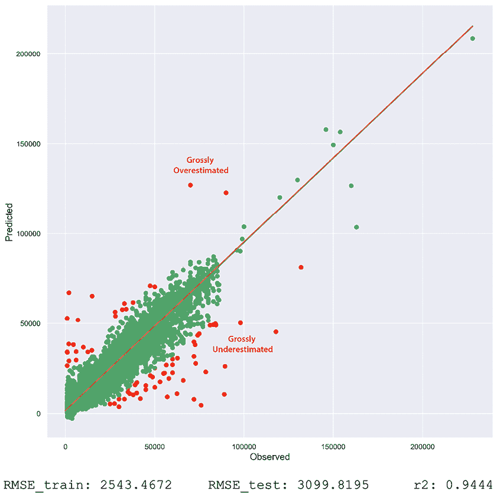

图 4.1：CatBoost 模型预测性能

```py
cb_mdl with rf_mdl in the first line.
```

随机森林对测试样本的表现同样出色，其指标与 CatBoost 非常相似，但在这个案例中它过度拟合得更多。这很重要，因为我们现在将在两者上比较一些特征重要性方法，并且不希望预测性能的差异成为怀疑任何发现的原因。

# 特征重要性是什么？

特征重要性指的是每个特征对模型最终输出的贡献程度。对于线性模型，由于系数明确指示了每个特征的贡献，因此确定其重要性较为容易。然而，对于非线性模型来说，情况并不总是如此。

为了简化这个概念，让我们将模型类别与各种团队运动进行比较。在一些运动中，很容易识别出对比赛结果影响最大的球员，而在另一些运动中则不然。让我们以两项运动为例：

+   *接力赛跑*：在这项运动中，每位运动员跑的距离相等，比赛的结局很大程度上取决于他们完成自己部分的速度。因此，很容易分离和量化每位运动员的贡献。接力赛跑与线性模型相似，因为比赛的结局是独立组件的线性组合。

+   *篮球*：在这项游戏中，球员们有各自不同的角色，使用相同的指标来比较他们是不可能的。此外，不断变化的比赛条件和球员之间的互动可能会显著影响他们对比赛结果的影响。那么，我们如何衡量和排名每位球员的贡献呢？

模型具有固有的参数，有时可以帮助揭示每个特征的贡献。我们训练了两个模型。它们的内在参数是如何用来计算特征重要性的？

让我们从随机森林开始。如果你用以下代码绘制其估计器之一，它将生成*图 4.2*。因为每个估计器最深可达六层，所以我们只绘制到第二层（`max_depth=2`），因为否则文本会太小。但你可以自由地增加`max_depth`：

```py
tree.plot_tree(rf_mdl.estimators_[0], filled=True, max_depth=2,\
              feature_names=X_train.columns) 
```

注意*图 4.2*中每个节点估计器的`squared_error`和`samples`。通过将这些数字相除，你可以计算出**均方误差**（**MSE**）。虽然对于分类器来说，它是**基尼系数**，但对于回归器来说，MSE 是不纯度度量。随着你深入树中，它预计会降低，因此计算每个特征在整个树中的加权不纯度之和。一个特征降低节点不纯度的程度表明它对模型结果的贡献有多大。这将是一个**特定于模型**的方法，因为它不能用于线性模型或神经网络，但这正是基于树的模型计算特征重要性的方式。随机森林也不例外。然而，它是一个集成，因此它有一系列估计器，所以特征重要性是所有估计器之间不纯度减少的平均值。

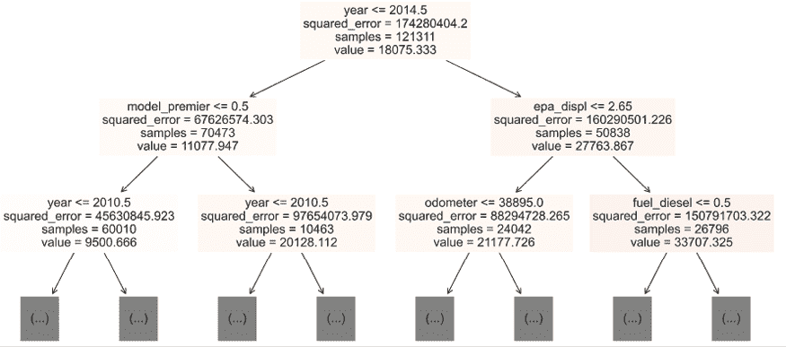

图 4.2：随机森林模型第一个估计器的第一级

我们可以使用以下代码片段获取并打印随机森林模型的特征重要性值：

```py
rf_feat_imp = rf_mdl.feature_importances_
print(rf_feat_imp) 
```

注意，由于它们已经被归一化，它们的总和为 1（`sum(rf_feat_imp)`）。

CatBoost 默认使用一种不同的方法来计算特征重要性，称为`PredictionValuesChange`。它显示了如果特征值发生变化，模型结果平均变化了多少。它在树中遍历，根据每个分支（左或右）中的节点数量对特征贡献进行加权平均。如果它在节点中遇到特征组合，则将贡献平均分配给每个特征。因此，它可能会为通常相互作用的特征产生误导性的特征重要性值。

您也可以使用`feature_importances_`像这样检索 CatBoost 特征重要性，并且与随机森林不同，它们的总和为 100 而不是 1：

```py
cb_feat_imp = cb_mdl.feature_importances_
print(cb_feat_imp) 
Figure 4.3:
```

```py
feat_imp_df = pd.DataFrame(
    {
        'feature':X_train.columns,
        'cb_feat_imp':cb_feat_imp,
        'rf_feat_imp':rf_feat_imp*100
    }
)
feat_imp_df = feat_imp_df.sort_values('cb_feat_imp', ascending=False)
feat_imp_df.style.format(
    '{:.2f}%', subset=['cb_feat_imp', 'rf_feat_imp'])
    .bar(subset=['cb_feat_imp', 'rf_feat_imp'], color='#4EF', width=60
) 
```

注意，在*图 4.3*中，两个模型都有相同的最重要特征。前十位特征大多相同，但排名不同。特别是，`odometer`对于 CatBoost 似乎比对于随机森林更重要。此外，除了最不重要的特征外，其他所有特征在排名上都不匹配，而对于最不重要的特征，人们普遍认为它们确实是最后的：

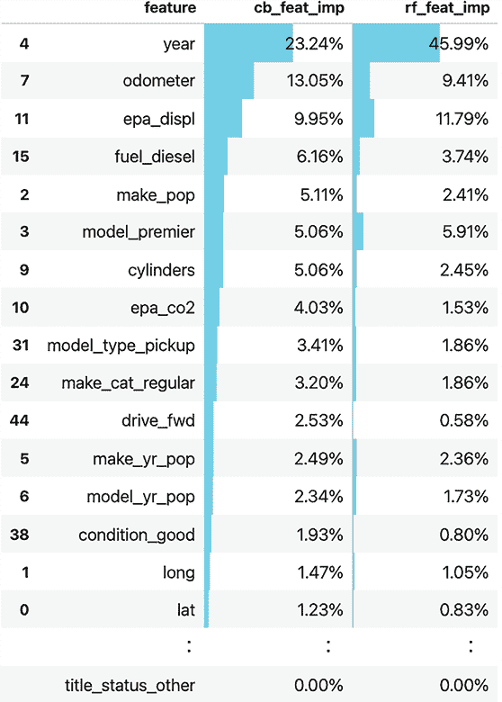

图 4.3：比较两个模型的特征重要性值

我们如何解决这些差异并采用一种始终如一地表示特征重要性的技术？我们将使用模型无关的方法来探讨这个问题。

# 使用模型无关方法评估特征重要性

**模型无关**的方法意味着我们将不会依赖于模型参数来计算特征重要性。相反，我们将把模型视为一个黑盒，只有输入和输出是可见的。那么，我们如何确定哪些输入产生了影响？

如果我们随机改变输入呢？确实，评估特征重要性最有效的方法之一是通过设计用于衡量特征影响或缺乏影响的模拟。换句话说，让我们从游戏中随机移除一个玩家并观察结果！在本节中，我们将讨论两种实现方式：排列特征重要性和 SHAP。

## 排列特征重要性

一旦我们有一个训练好的模型，我们就不能移除一个特征来评估不使用它的影响。然而，我们可以：

+   将特征替换为静态值，如平均值或中位数，使其失去有用的信息。

+   打乱（排列）特征值以破坏特征与结果之间的关系。

置换特征重要性(`permutation_importance`)使用测试数据集的第二种策略。然后它测量分数（MSE，r2，f1，准确度等）的变化。在这种情况下，当特征被打乱时，负**平均绝对误差**（**MAE**）的显著下降表明该特征对预测有很高的影响。它必须重复打乱几次（`n_repeats`），通过平均减少准确度来得出结论性的结果。请注意，随机森林回归器的默认评分器是 R-squared，而 CatBoost 是 RMSE，所以我们通过设置`scoring`参数确保它们都使用相同的评分器。以下代码为两个模型执行所有这些操作：

```py
cb_perm_imp = inspection.permutation_importance(
    cb_mdl, X_test, y_test, n_repeats=10, random_state=rand,\
    scoring='neg_mean_absolute_error'
)
rf_perm_imp = inspection.permutation_importance(
    rf_mdl, X_test.to_numpy(), y_test.to_numpy(), n_repeats=10,\
    random_state=rand, scoring='neg_mean_absolute_error'
) 
```

该方法输出每个模型的平均分数（`importances_mean`）和标准差（`importances_std`），这些分数跨越所有重复，我们可以将其放入`pandas` DataFrame 中，排序和格式化，就像我们之前对特征重要性所做的那样。以下代码生成了*图 4.4*中的表格：

```py
perm_imp_df = pd.DataFrame(
    {
        'feature':X_train.columns,
        'cb_perm_mean':cb_perm_imp.importances_mean,
        'cb_perm_std':cb_perm_imp.importances_std,
        'rf_perm_mean':rf_perm_imp.importances_mean,
        'rf_perm_std':rf_perm_imp.importances_std
    }
)
perm_imp_df = perm_imp_df.sort_values(
    'cb_perm_mean', ascending=False
)
perm_imp_df.style.format(
    '{:.4f}', subset=['cb_perm_mean', 'cb_perm_std', 'rf_perm_mean',
    'rf_perm_std']).bar(subset=['cb_perm_mean', 'rf_perm_mean'],\
    color='#4EF', width=60
) 
```

在*图 4.4*中，两个模型的前四个特征与*图 4.3*相比要一致得多——并不是因为它们必须一致，因为它们是不同的模型！然而，考虑到它们是从相同的方法中得出的，这还是有意义的。也存在相当大的差异。随机森林似乎更依赖于少数特征，但如果它们达到与 CatBoost 非常相似的预测性能，这些特征可能并不那么必要：


图 4.4：比较两个模型的置换特征重要性值

置换特征重要性可以理解为当特征变得无关紧要时，模型误差的平均增加，以及它与其他特征的交互。由于模型不需要重新训练，它相对快速地计算，但它的具体值应该谨慎对待，因为这种打乱技术有一些缺点：

+   将高度相关的特征与另一个未打乱的特征进行打乱可能不会显著影响预测性能，因为未打乱的特征保留了从打乱的特征中的一些信息。这意味着它不能准确评估多重共线性特征的重要性。

+   打乱可能导致不切实际的观察结果，例如用天气预测车辆流量，结果夏天预测出冬季温度。这将导致从未遇到过此类示例的模型预测误差更高，夸大了重要性评分的实际意义。

因此，这些重要性值仅适用于对特征进行排序，并衡量它们在特定模型中相对于其他特征的相对重要性。我们现在将探讨 Shapley 值如何帮助解决这些问题。

## SHAP 值

在深入研究 SHAP 值之前，我们应该讨论**Shapley 值**。SHAP 是 Shapley 值的实现，它采取了一些自由，但保持了许多相同的属性。

我们在游戏的背景下讨论特征重要性是合适的，因为 Shapley 值植根于**合作博弈论**。在这种情况下，玩家形成不同的集合，称为**联盟**，当他们玩游戏时，他们会得到不同的分数，称为**边际贡献**。Shapley 值是这些贡献在多次模拟中的平均值。在特征重要性的方面，玩家代表特征，玩家的集合代表特征的集合，边际贡献与预测误差的减少有关。

这种方法可能看起来与置换特征重要性相似，但它的重点是特征组合而不是单个特征，这有助于解决多重共线性问题。此外，通过这种方法获得的价值满足几个有利的数学属性，例如：

+   **可加性**：部分的总和等于总价值

+   **对称性**：对等贡献的一致值

+   **效率**：等于预测值与期望值之间的差异

+   **虚拟值**：对不影响结果的特征的零值

在实践中，这种方法需要大量的计算资源。例如，五个特征会产生个可能的联盟，而 15 个特征则会产生 32,768 个。因此，大多数 Shapley 实现使用像蒙特卡洛采样或利用模型内在参数（这使得它们具有模型特定性）这样的捷径。SHAP 库采用各种策略来减少计算负担，同时不会过多牺牲 Shapley 属性。

### 使用 KernelExplainer 的综合解释

在 SHAP 中，最普遍的模型无关方法是`KernelExplainer`，它基于**局部可解释模型无关解释**（**LIME**）。如果你不理解具体细节，不要担心，我们将在第五章“局部模型无关解释方法”中详细讲解。为了减少计算量，它采用了样本联盟。此外，它遵循与 LIME 相同的程序，例如拟合加权线性模型，但使用 Shapley 样本联盟和不同的核函数，该核函数返回 SHAP 值作为系数。

`KernelExplainer`可以用训练数据集的`kmeans`背景样本（`X_train_summary`）初始化，这有助于它定义核函数。它可能仍然很慢。因此，最好不要使用大型数据集来计算`shap_values`。相反，在下面的代码中，我们只使用了测试数据集的 2%（`X_test_sample`）：

```py
rf_fn = lambda x: rf_mdl.predict(x)
X_train_summary = shap.kmeans(X_train.to_numpy(), 50)
X_test_sample = X_test.sample(frac=0.02)
rf_kernel_explainer = shap.KernelExplainer(rf_fn, X_train_summary)
rf_shap_values = rf_kernel_explainer.shap_values(
    X_test_sample.to_numpy()
) 
```

运行整个过程可能需要一些时间。如果时间过长，请随意将样本大小从`0.02`减少到`0.005`。SHAP 值将不太可靠，但这只是一个示例，你可以尝尝`KernelExplainer`的滋味。

一旦完成，请运行`print(rf_shap_values.shape)`来了解我们将要处理的维度。注意，它是二维的！每个观察值和特征都有一个 SHAP 值。因此，SHAP 值可以用于全局和局部解释。记住这一点！我们将在下一章中介绍局部解释。现在，我们将查看另一个 SHAP 解释器。

### 使用 TreeExplainer 加速解释

`TreeExplainer`被设计用来高效地估计基于树的模型（如 XGBoost、随机森林和 CART 决策树）的 SHAP 值。因为它使用条件期望值函数而不是边缘期望值，所以它可以给非影响特征分配非零值，这违反了 Shapley 虚拟属性。当特征共线性时，这可能会使解释变得不那么可靠。然而，它遵循其他属性。

您可以使用`TreeExplainer`获取 SHAP 值，如下所示：

```py
cb_tree_explainer = shap.TreeExplainer(cb_mdl)
cb_shap_values = cb_tree_explainer.shap_values(X_test) 
```

如您所见，这更容易，也更快。它还输出一个类似于`KernelExplainer`的两维数组。您可以使用`print(cb_shap_values.shape)`进行检查。

对于特征重要性值，我们可以将两个维度合并为一个。我们只需要像这样对每个特征的平均绝对值进行操作：

```py
cb_shap_imp = np.mean(np.abs(cb_shap_values),0) 
```

对于随机森林，只需将`cb_`替换为`rf_`相同的代码。

我们现在可以使用格式化和排序的`pandas` DataFrame 并排比较两个模型的 SHAP 特征重要性。以下代码将在*图 4.5*中生成表格。

```py
shap_imp_df = pd.DataFrame(
    {
        'feature':X_train.columns,
        'cb_shap_imp':cb_shap_imp,
        'rf_shap_imp':rf_shap_imp
    }
)
shap_imp_df = shap_imp_df.sort_values('cb_shap_imp', ascending=False)
shap_imp_df.style.format(
    '{:.4f}', subset=['cb_shap_imp', 'rf_shap_imp']).bar(
    subset=['cb_shap_imp', 'rf_shap_imp'], color='#4EF', width=60
) 
```

*图 4.5*不仅比较了两个不同模型的特征重要性，还比较了两个不同的 SHAP 解释器。它们不一定都是完美的描述，但它们都比排列特征重要性更值得信赖：

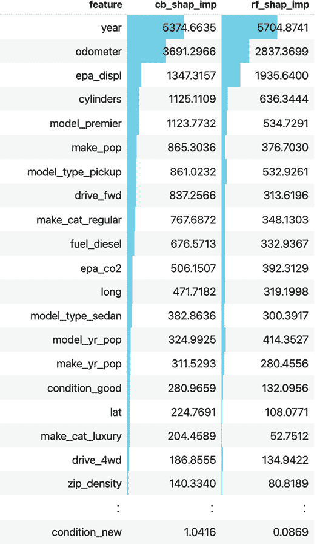

图 4.5：比较两个模型的 SHAP 特征重要性值

对于两个模型，SHAP 分析表明`loan_to_value_ratio`和`make_cat_va`的重要性之前被低估了。这很有道理，因为`loan_to_value_ratio`与多个顶级特征高度相关，而`make_cat_va`与所有其他产品类型特征相关。

# 可视化全局解释

之前，我们介绍了全局解释和 SHAP 值的概念。但我们没有展示我们可以用许多方式可视化它们。正如您将学到的，SHAP 值非常灵活，可以用来检查比特征重要性更多的事情！

但首先，我们必须初始化一个 SHAP 解释器。在前一章中，我们使用`shap.TreeExplainer`和`shap.KernelExplainer`生成 SHAP 值。这次，我们将使用 SHAP 的新接口，它通过将 SHAP 值和对应数据保存在单个对象中以及更多来简化过程！我们不需要显式定义解释器的类型，而是使用`shap.Explainer(model)`初始化它，这将返回可调用的对象。然后，您将测试数据集（`X_test`）加载到可调用的`Explainer`中，它将返回一个`Explanation`对象：

```py
cb_explainer = shap.Explainer(cb_mdl)
cb_shap = cb_explainer(X_test) 
```

如果你正在想，它是如何知道要创建哪种解释器的？很高兴你问了！初始化函数中有一个可选参数叫做 `algorithm`，你可以明确地定义 `tree`、`linear`、`additive`、`kernel` 等等。但默认情况下，它设置为 `auto`，这意味着它会猜测模型需要哪种解释器。在这种情况下，CatBoost 是一个树集成，所以 `tree` 是有意义的。我们可以很容易地通过 `cb_explainer.[dict]{custom-style="P - Italics"}[ 或 ]print(type(cb_explainer))` 来检查 SHAP 是否选择了正确的解释器。它将返回 `<class 'shap.explainers._tree.Tree'>`，这是正确的！至于存储在 `cb_shap` 中的解释，它究竟是什么呢？它是一个包含几乎用于绘制解释所需的一切的对象，例如 SHAP 值 (`cb_shap.values`) 和相应的数据集 (`cb_shap.data`)。它们的维度应该完全相同，因为每个数据点都有一个 SHAP 值。我们可以通过使用 `shape` 属性来检查它们的维度来验证这一点：

```py
print("Values dimensions: %s" % (cb_shap.values.shape,))
print("Data dimensions: %s" % (cb_shap.data.shape,)) 
```

现在，让我们来使用这些值吧！

## SHAP 条形图

让我们从最直接的全球解释可视化开始，那就是特征重要性。你可以用条形图 (`shap.plots.bar`) 来做这件事。它只需要解释对象 (`cb_shap`)，但默认情况下，它只会显示 10 个条形。幸运的是，我们可以用 `max_display` 来改变这个：

```py
shap.plots.bar(cb_shap, max_display=15) 
Figure 4.6:
```

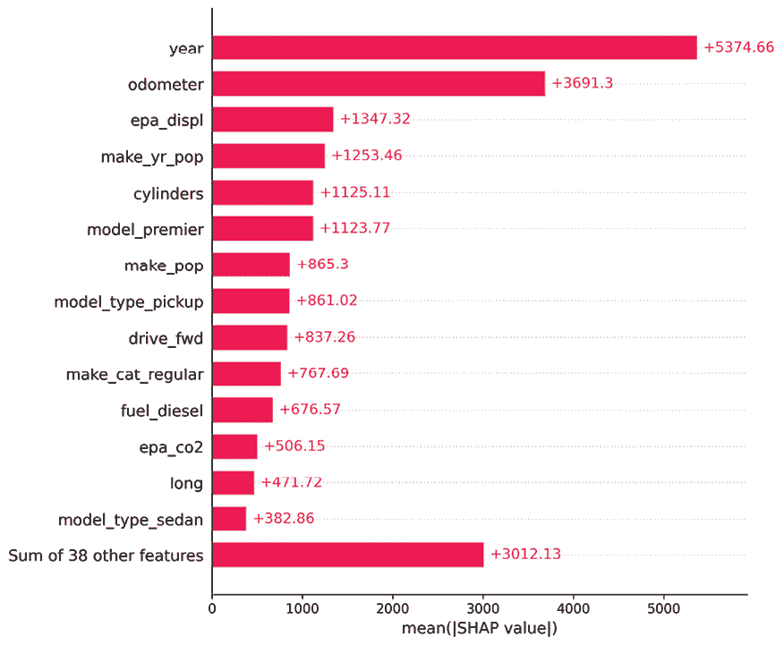

图 4.6：CatBoost 模型的 SHAP 特征重要性

*图 4.6* 如果你阅读了上一章，应该看起来非常熟悉。事实上，它应该与 *图 4.5* 中的 `cb_shap_imp` 列相匹配。

SHAP 特征重要性提供了相当大的灵活性，因为它只是每个特征 SHAP 值绝对值的平均值。有了 SHAP 值的粒度，你可以像测试数据集一样剖析它们，从而在各个维度上获得洞察。这比每个特征的单一平均值揭示了更多关于特征重要性的信息。

例如，你可以比较不同组之间的特征重要性。假设我们想探索 `year` 群体之间特征重要性的差异。首先，我们需要一个阈值来定义。让我们用 2014 年来定义，因为它是我们数据集中的中位数 `year`。高于该值的可以设置为“新车”群体，而 2014 年之前的值设置为“旧车”。然后，使用 `np.where` 创建一个数组，将群体分配给每个观测值。为了创建条形图，重复前面的过程，但使用群体函数来拆分解释，对每个群体应用绝对值 (`abs`) 和 `mean` 操作。

```py
yr_cohort = np.where(
    X_test.year > 2014, "Newer Car", "Older Car"
)
shap.plots.bar(cb_shap.cohorts(yr_cohort).abs.mean(0)) 
Figure 4.7:
```

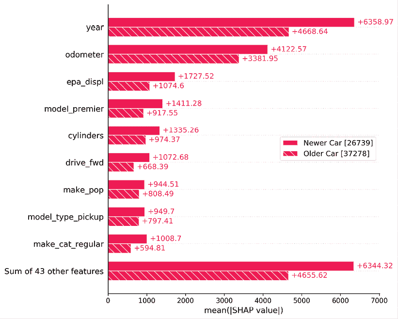

图 4.7：按属性值群体拆分的 CatBoost 模型 SHAP 特征重要性

如你在 *图 4.7* 中所见，对于“旧车”来说，所有顶级特征的重要性都较小。最大的不同之一是 `year` 本身。当一辆车变旧时，它变得有多旧并不像它在“新车”群体中那样重要。

## SHAP 蜜蜂群图

柱状图可能会掩盖某些方面特征如何影响模型结果的情况。不仅不同的特征值有不同的影响，而且它们在所有观测值中的分布也可能表现出相当大的变化。蜜蜂群图通过使用点来表示每个个体特征的所有观测值，旨在提供更多洞察，尽管特征是按全局特征重要性排序的：

+   点根据它们在每个特征低到高值范围内的位置进行着色。

+   点根据它们对结果的影响水平横向排列，以 SHAP 值=0 的线为中心，左侧为负面影响，右侧为正面影响。

+   点垂直累积，创建类似直方图的可视化，以显示每个特征在每个影响水平上影响结果观测值的数量。

为了更好地理解这一点，我们将创建一个蜜蜂群图。使用`shap.plots.beeswarm`函数生成图表很容易。它只需要解释对象（`cb_shap`），并且，与柱状图一样，我们将覆盖默认的`max_display`以仅显示 15 个特征：

```py
shap.plots.beeswarm(cb_shap, max_display=15) 
```

前述代码的结果在 *图 4.8* 中：

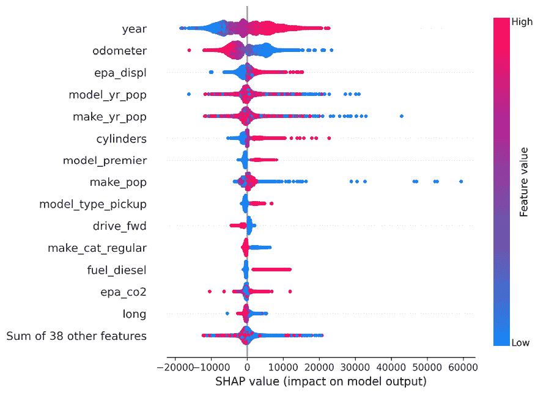

图 4.8：CatBoost 模型的 SHAP 蜜蜂群图

*图 4.8* 可以这样阅读：

+   从上到下，最重要的特征（15 个中的）是`year`，最不重要的是经度（`long`）。它应该与柱状图中的顺序相同，或者如果你取每个特征的 SHAP 值的平均绝对值。

+   `year`的较低值对模型结果有负面影响，而较高值则产生正面影响。中间有一个干净的梯度，表明`year`与预测的`price`之间存在递增的单调关系。也就是说，根据 CatBoost 模型，年份越高，价格越高。

+   `odometer`对相当一部分观测值有负面影响或可忽略的影响。然而，它对有显著影响的观测值有一个长长的尾巴。你可以通过查看垂直密度来识别这一点。

+   如果你扫描图表的其余部分寻找其他连续特征，你不会在其他地方找到像`year`和`odometer`那样的干净梯度，但你将找到一些趋势，例如`make_yr_pop`和`model_yr_pop`的较高值主要产生负面影响。

+   对于二元特征，很容易判断，因为你只有两种颜色，它们有时会整齐地分开，例如`model_premier`、`model_type_pickup`、`drive_fwd`、`make_cat_regular`和`fuel_diesel`，这展示了某种类型的车辆可能是模型高价的标志。在这种情况下，皮卡模型会增加价格，而具有常规制造的车辆（即非豪华品牌）会降低价格。

虽然蜂群图提供了许多发现的出色总结，但它有时可能难以解释，并且无法捕捉到所有内容。颜色编码对于说明特征值与模型输出之间的关系很有用，但如果你想要更多细节呢？这就是部分依赖图发挥作用的地方。它是许多特征摘要说明之一，提供了针对特征的全局解释方法。

# 特征摘要说明

本节将介绍用于可视化单个特征如何影响结果的一些方法。

## 部分依赖图

**部分依赖图**（**PDPs**）根据模型显示特征与结果之间的关系。本质上，PDP 说明了特征对模型预测输出的边际效应，该效应考虑了该特征的所有可能值。

计算涉及两个步骤：

1.  初始时，进行一个模拟，其中每个观察值的特征值被改变为一系列不同的值，并使用这些值预测模型。例如，如果`year`在 1984 年和 2022 年之间变化，则创建每个观察值的`year`值介于这两个数字之间的副本。然后，使用这些值运行模型。这一步可以绘制为**个体条件期望**（**ICE**）图，其中模拟的`year`值位于 X 轴上，模型输出位于 Y 轴上，每个模拟观察值对应一条线。

1.  在第二步中，只需简单地将 ICE 线平均，以获得一条总体趋势线。这条线代表 PDP！

可以使用 scikit-learn 创建 PDPs，但这些仅适用于 scikit-learn 模型。它们还可以使用 SHAP 库以及另一个名为 PDPBox 的库生成。每个都有其优点和缺点，我们将在本节中介绍。

SHAP 的`partial_dependence`图函数接受一个特征名称（`year`）、一个`predict`函数（`cb_mdl.predict`）和一个数据集（`X_test`）。还有一些可选参数，例如是否显示 ICE 线（`ice`）、一个水平模型期望值线（`model_expected_value`）和一个垂直特征期望值线（`feature_expected_value`）。默认情况下，它显示 ICE 线，但由于测试数据集中有如此多的观察值，生成该图将花费很长时间，并且会“过于繁忙”，无法欣赏趋势。SHAP PDP 还可以包含 SHAP 值（`shap_values=True`），但考虑到数据集的大小，这将花费非常长的时间。最好对您的数据集进行采样，使其更适合绘图：

```py
shap.plots.partial_dependence(
    "year", cb_mdl.predict, X_test, ice=False, model_expected_value=True,\
    feature_expected_value=True
) 
```

上述代码将在**图 4.9**中生成该图：

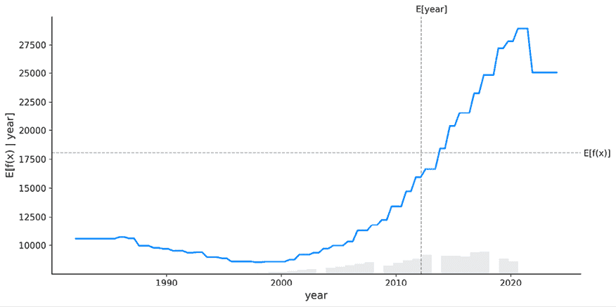

图 4.9：SHAP 的`year`部分依赖图

正如你在*图 4.9*中可以欣赏到的，`year`有一个上升趋势。考虑到*图 4.8*中*year*的整洁梯度，这个发现并不令人惊讶。通过直方图，你可以看出大部分观察到的`year`值在 2011 年及以上，这是它开始对模型产生超过平均水平影响的地方。一旦你将直方图的位置与 beeswarm 图（*图 4.8*）中突起的位置进行比较，这一点就变得有意义了。

使用 PDPBox，我们将制作几种 PDP 图表的变体。这个库将使用`PDPIsolate`函数进行模拟的耗时过程与使用`plot`函数进行绘图的过程分开。我们只需要运行一次`PDPIsolate`，但需要运行三次`plot`。

对于第一个图表，我们使用`plot_pts_dist=True`来显示地毯图。地毯图是传达分布比直方图更简洁的方式。

对于第二个示例，我们使用`plot_lines=True`来绘制 ICE 线，但我们只能绘制其中的一部分，因此`frac_to_plot=0.01`随机选择其中的 1%。

对于第三个示例，我们不是显示地毯图，而是可以用分位数构建 X 轴（`to_bins=True`）：

```py
pdp_single_feature = pdp.PDPIsolate(
    model=cb_mdl, df=X_test, model_features=X_test.columns,\
    feature='year', feature_name='year', n_classes=0,\
    n_jobs=-1)
fig, axes = pdp_single_feature.plot(plot_pts_dist=True)
fig.show()
    fig, axes = pdp_single_feature.plot(
    plot_pts_dist=True, plot_lines=True, frac_to_plot=0.01
)
fig.show() 
    fig, axes = pdp_single_feature.plot(
    to_bins=True, plot_lines=True, frac_to_plot=0.01
)
fig.show() 
Figure 4.10:
```

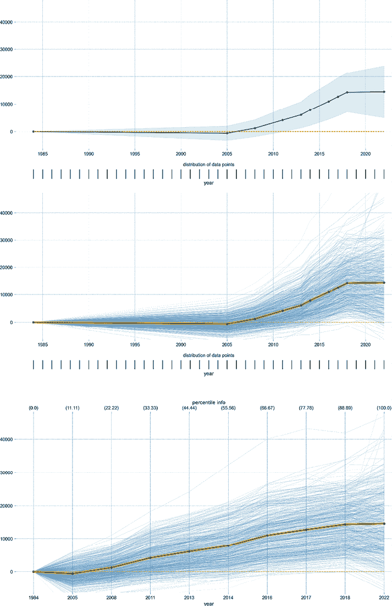

图 4.10：PDPBox 的 PDP 对于年份的三种变化

ICE 线通过展示方差潜力丰富了 PDP 图表。*图 4.10*中的最后一个图表也展示了即使地毯图或直方图是有用的指南，将轴组织在分位数上更能帮助可视化分布。在这种情况下，三分之二的`year`分布在 2017 年之前。1984 年至 2005 年之间的二十年只占 11%。它们在图表中应该得到相应的一部分。

我们现在可以创建几个列表，我们将使用这些列表遍历不同类型的特征，无论是连续的(`cont_feature_l`)、二元的(`bin_feature_l`)还是分类的(`cat_feature_l`)：

```py
cont_feature_l = [
    'year', 'odometer', 'cylinders', 'epa_displ', 'make_pop',\
    'make_yr_pop', 'model_yr_pop'
]
make_cat_feature_l = [
    'make_cat_obsolete', 'make_cat_regular', 'make_cat_premium',\
    'make_cat_luxury', 'make_cat_luxury_sports'
]
bin_feature_l = ['model_premier', 'auto_trans']
cat_feature_l = make_cat_feature_l + bin_feature_l 
```

为了快速了解每个特征的 PDP 看起来像什么，我们可以遍历一个特征列表，为每个特征生成 PDP 图表。我们将做连续特征(`cont_feature_l`)，因为它最容易可视化，但你也可以尝试其他列表之一：

```py
for feature in cont_feature_l:
    pdp_single_feature = pdp.PDPIsolate(
        model=cb_mdl, df=X_test, model_features=X_test.columns,\
        feature=feature, feature_name=feature, n_classes=0,\
        n_jobs=-1
    )
    fig, axes = pdp_single_feature.plot(
        to_bins=True, plot_lines=True, frac_to_plot=0.01,\
        show_percentile=True, engine='matplotlib'
    ) 
```

上述代码将输出八个图表，包括*图 4.11*中的那个：


图 4.11：PDPBox 的里程表 PDP

*图 4.8*中的蜂群图显示，较低的里程表值与模型输出较高的价格相关。在*图 4.11*中，它描绘了价格主要单调递减，除了极端情况。有趣的是，在极端情况下存在里程表值为零和一千万的情况。虽然模型学习到当里程表为零时，`里程表`对价格没有影响是有道理的，但一千万的值是一个异常值，因此你可以看出 ICE 线朝不同方向延伸，因为模型不确定如何处理这样的值。我们还必须记住，ICE 图和因此 PDP 是通过模拟生成的，这些模拟可能会创建出在现实生活中不存在的例子，例如一个里程表值极高的全新车辆。

```py
make_cat is a categorical feature that was one-hot encoded, so it’s not natural to create PDP plots as if each category were an independent binary feature.
```

幸运的是，你可以创建一个 PDP，其中每个类别的一元编码特征并排显示。你需要做的就是将产品类型特征的列表插入到`feature`属性中。PDPBox 还有一个“预测绘图”功能，可以通过显示特征值范围内的预测分布来提供上下文。`PredictPlot`易于绘图，具有与`plot`许多相同的属性。

```py
pdp_multi_feature = pdp.PDPIsolate(
    model=cb_mdl, df=X_test, model_features=X_test.columns,\
    feature=make_cat_feature_l, feature_name="make_cat", n_classes=0, n_jobs=-1
)
fig, axes = pdp_multi_feature.plot(
    plot_lines=True, frac_to_plot=0.01, show_percentile=True
)
fig.show()
predict_plot = info_plots.PredictPlot(
    model=cb_mdl, df=X_test, feature_name="make_cat", n_classes=0,
    model_features=X_test.columns, feature=make_cat_feature_l
)
fig, _, _ = predict_plot.plot()
fig.show() 
Figure 4.12:
```


*图 4.12*: PDPBox 针对品牌类别的实际绘图

*图 4.12*中的`make_cat` PDP 显示了“豪华”和“高级”类别倾向于导致更高的价格，但平均而言仅高出约 3,000 美元，ICE 线图中显示了大量的变异性。然而，记得之前提到的模拟并不一定代表现实场景吗？

如果我们将 PDP 与*图 4.12*中实际预测的箱线和须线进行比较，我们可以发现，在常规车型与“豪华”和“高级”任何一类车型之间的平均预测差异至少有七千美元。当然，平均数并不能说明全部情况，因为即使是里程数过多或非常旧的豪华车，其价格也可能低于常规车辆。价格取决于许多因素，而不仅仅是品牌的声誉。当然，仅从*图 4.12*中箱线和须线的排列来看，“豪华运动”和“过时”类别分别更强烈地表明了价格的高低。

PDP 通常易于解释且相对快速生成。然而，它所采用的模拟策略没有考虑特征分布，并且高度依赖于特征独立性的假设，这可能导致反直觉的例子。我们现在将探讨两种替代方案。

## SHAP 散点图

SHAP 值对每个数据点都可用，使您可以将它们与特征值进行绘图，从而在*y*轴上得到模型影响（SHAP 值）和*x*轴上的特征值的 PDP-like 可视化。作为一个类似的概念，SHAP 库最初将其称为`dependence_plot`，但现在它被称为散点图。尽管有相似之处，PDP 和 SHAP 值的计算方式不同。

创建 SHAP 散点图很简单，只需要解释对象。可选地，你可以根据另一个特征对点进行颜色编码，以了解潜在的交互。你还可以使用`xmin`和`xmax`属性从*x*轴剪除异常值，并将点设置为 20%不透明（`alpha`），以便更容易地识别稀疏区域：

```py
shap.plots.scatter(
    cb_shap[:,"odometer"], color=cb_shap[:,"year"], xmin="percentile(1)",\
    xmax="percentile(99)", alpha=0.2
)
shap.plots.scatter(
    cb_shap[:,"long"], color=cb_shap[:,"epa_displ"],\
    xmin="percentile(0.5)", xmax="percentile(99.5)", alpha=0.2, x_jitter=0.5
) 
Figure 4.13:
```

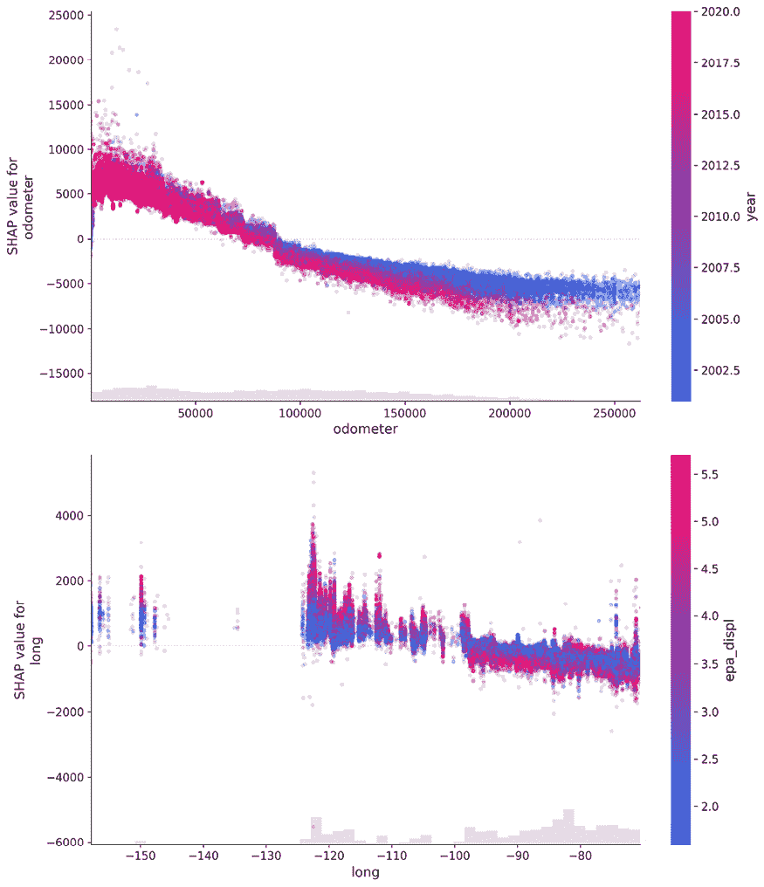

图 4.13：SHAP 的里程表和长度的散点图，分别用颜色编码年份和 epa_displ

*图 4.13*中的第一个图显示了较高的`里程表`读数如何对模型结果产生负面影响。此外，颜色编码显示，当里程表读数超过九万时，较高年份的 SHAP 值甚至更低。换句话说，一辆旧车有高里程表读数是可以预期的，但如果是新车，那就是一个红旗！

*图 4.13*中的第二个图非常有趣；它显示了该国西海岸（大约在-120°）与较高的 SHAP 值相关联，并且越往东走，SHAP 值越低。夏威夷、安克雷奇和阿拉斯加（大约在-150°）也高于美国的东海岸（大约在-75°）。颜色编码显示了燃料排量越多，SHAP 值越高，但当你越往东走，这种差异就越不明显。

`散点图`适用于连续特征，但你能否用它来表示离散特征？是的！让我们为`make_cat_luxury`创建一个散点图。由于*x*轴上只有两个可能的值，0 和 1，因此有意义的做法是使它们产生抖动，这样所有的点就不会重叠在一起。例如，`x_jitter=0.4`意味着它们将在水平方向上抖动最多 0.4，或者原始值的每侧 0.2。我们可以结合`alpha`来确保我们可以欣赏到密度：

```py
shap.plots.scatter(
    cb_shap[:,"make_cat_luxury"], color=cb_shap[:,"year"], x_jitter=0.4,\
    alpha=0.2, hist=False
) 
Figure 4.14:
```

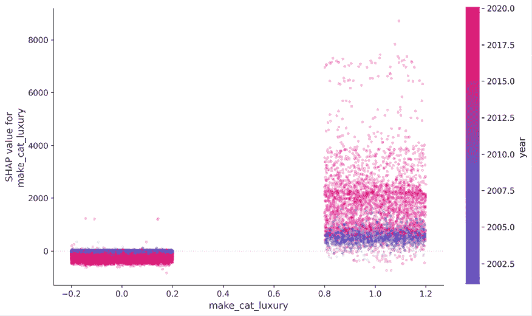

图 4.14：SHAP 的`make_cat_luxury`散点图，用颜色编码年份

*图 4.14*显示，根据 SHAP 值，`make_cat_fha=1`对模型结果有积极影响，而`make_cat_fha=1`则有一个轻微的负面影响。颜色编码表明，较低的年份会减弱影响，使其变小。这很有道理，因为旧款豪华车已经贬值。

虽然 SHAP 散点图可能比 PDP 图有所改进，但 SHAP 的树解释器以速度换取精确度，导致对模型没有影响的特征可能具有大于零的 SHAP 值。精确度指的是解释在表示模型行为方面的准确性。为了获得更高的精确度，您需要使用一种在理解模型做什么时采取较少捷径的方法，即使如此，对参数（如使用更大的样本量）的一些调整也会增加精确度，因为您正在使用更多数据来创建解释。在这种情况下，解决方案是使用 `KernelExplainer`，因为我们之前讨论过的，它更全面，但存在特征依赖问题。所以没有免费的午餐！接下来，我们将介绍 ALE 图作为这些问题的部分解决方案。

## ALE 图

ALE 图相对于 PDP 图的优势在于它们是无偏的且速度更快。ALE 在计算特征效应时考虑数据分布，从而实现无偏表示。该算法将特征空间划分为等大小的窗口，并计算这些窗口内的预测变化，从而产生 *局部效应*。将所有窗口的效果相加，使它们成为 *累积的*。

您可以使用 `ale` 函数轻松生成 ALE 图。您需要的只是一些数据（`X_test_no_outliers`）、模型（`cb_mdl`）以及要绘制的特征和特征类型。可选地，您可以输入 `grid_size`，这将定义局部效应计算的窗口大小。默认值为 `20`，但如果我们有足够的数据，我们可以将其增加以提高精确度。如前所述，一些参数的调整可能会影响精确度。对于窗口大小，它将数据分割成更小的区间以计算值，从而使它们更加细化。此外，默认情况下显示置信区间。顺便提一下，在这种情况下最好移除异常值，因为当最大贷款几乎达到 800 万美元时，很难欣赏到图表。您可以通过尝试使用 `X_test` 而不是 `X_test_no_outliers` 来了解我的意思。

默认情况下显示置信区间。在这种情况下，最好排除异常值，因为当只有极少数车辆代表 1994 年之前和 2021 年之后的年份，并且具有非常低和非常高的里程表读数时，很难欣赏到图表。您可以在 `ale` 函数中使用 `X_test` 而不是 `X_test_no_outliers` 来查看差异：

```py
X_test_no_outliers = X_test[
    (X_test.year.quantile(.01) <= X_test.year) &\
    (X_test.year <= X_test.year.quantile(.99)) &\
    (X_test.odometer.quantile(.01) <= X_test.odometer) &\
    (X_test.odometer <= X_test.odometer.quantile(.99))
]
ale_effect = ale(
    X=X_test_no_outliers, model=cb_mdl, feature=['odometer'],\
    feature_type='continuous', grid_size=80
)
plt.show()
ale_effect = ale(
    X=X_test_no_outliers, model=cb_mdl,\
    feature=['make_cat_luxury'],feature_type='discrete'
)
plt.show() 
Figure 4.15:
```


图 4.15：里程表和 make_cat_luxury 的 ALE 图

*图 4.15*中的第一个图是`odometer`的 ALE 图。正如*图 4.13*所示，随着里程表的读数增加，模型的影响从正面变为负面。然而，与 SHAP 不同，在 ALE 图中，它会在里程表达到 90,000 之前就变为负值。请注意，置信区间非常窄，只在 10,000 以下某处可见。第二个 ALE 图显示了“豪华”类别对结果有显著的正向影响，并且豪华车辆不像其他车辆那样有代表性。

到目前为止，我们只讨论了单特征解释。但我们也可以观察到特征之间的交互作用，这将在下一部分进行介绍。

# 特征交互

特征可能不会独立地影响预测。例如，如*第二章*中讨论的，仅根据体重确定肥胖是不可能的。一个人的身高或体脂、肌肉和其他百分比都是需要的。模型通过相关性理解数据，而特征通常是相关的，即使它们不是线性相关的。交互作用是模型可能对相关特征所做的。例如，决策树可能将它们放在同一个分支上，或者神经网络可能以某种方式安排其参数，从而产生交互效应。这种情况也出现在我们的案例中。让我们通过几个特征交互可视化来探讨这一点。

## 带有聚类的 SHAP 条形图

SHAP 附带一个分层聚类方法(`shap.utils.hclust`)，可以根据任何给定特征对之间的“冗余”对训练特征进行分组。这指的是它们相互依赖的程度，从完全冗余（0）到完全独立（1）的范围内。我们不会使用整个数据集来完成这项任务，因为这会花费很长时间，所以我们将使用 10%的`sample`：

```py
X_samp = X.sample(frac=0.1)
y_samp = y.loc[X_samp.index]
clustering = shap.utils.hclust(X_samp, y_samp) 
```

我们可以使用与*图 4.6*相同的条形图，但这次，我们输入`clustering`和聚类截止值，voilá！我们可以可视化哪些特征最为冗余。我们的目标是确定小于 0.7 独立性的关系（`clustering_cutoff`）：

```py
shap.plots.bar(cb_shap, clustering=clustering, clustering_cutoff=0.7) 
Figure 4.16:
```

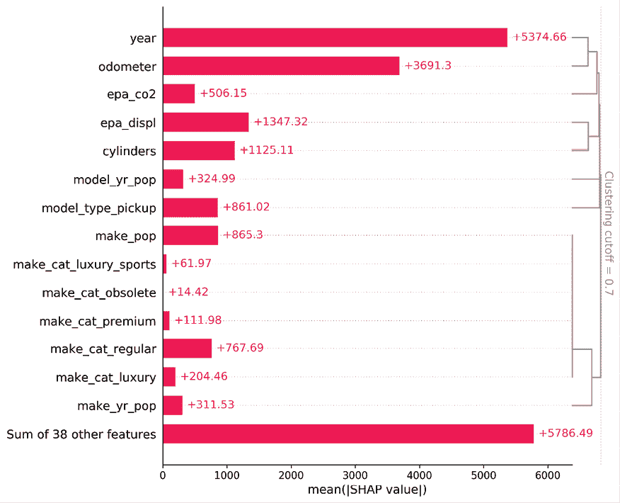

图 4.16：带有聚类的 SHAP 条形图

在*图 4.16*的右侧树状图中，揭示了哪些特征之间相互依赖最多，以及三个层级。例如，`year`依赖于`odometer`，当它们结合在一起时，它们都依赖于`epa_co2`，而`epa_co2`又间接依赖于包括燃油排量(`epa_displ`)和`cylinders`在内的多个特征。此外，请注意，所有制造商类别特征不仅相互依赖，还依赖于制造商的相对普及度(`make_pop`)。这一发现是有意义的，因为有些类别比其他类别更受欢迎。这些见解可以作为后续调查的指南。

## 2D ALE 图

通过二维 ALE 图来直观地检查两个变量对预测的影响是最优的方式，主要是因为它在处理相关特征时是无偏的。

让我们仔细审查前几个特征，即`年份`和`里程表`，它们也有明显的依赖关系。我们将使用去除异常值的测试数据集，以便图表专注于数据的核心——即包含大约 98%的数据点的部分。这次，我们不会插入单个特征，而是一个包含两个特征的列表：

```py
features_l = ["year", "odometer"]
ale_effect = ale(
    X=X_test_no_outliers, model=cb_mdl, feature=features_l,\
    feature_type='continuous', grid_size=50, include_CI=False
)
plt.show() 
```

上述代码在*图 4.17*中产生了 ALE 图：


图 4.17：里程表和年份的二维 ALE 图

如*图 4.17*所示，除了极少数极端高的`里程表`读数和老旧汽车与低`里程表`读数重叠的区域外，大部分图表的效果都很适度。大多数情况下，它们似乎只在角落处有更大的负效应。

需要记住的一个重要观点是，SHAP 的聚类距离范围从冗余到独立。高度相关特征的问题在于，在某个点上，它们停止相互依赖，变得完全冗余。因此，让我们通过使用`shap.utils.hclust`创建的`聚类`数组来检查这两个特征接近冗余的程度：

```py
np.set_printoptions(suppress=True)
print(clustering) 
```

前面的代码片段应该输出以下数组：

```py
[[  2\.     21\.      0\.      2\.   ]
 [ 22\.     52\.      0\.      3\.   ]
 [ 23\.     53\.      0\.      4\.   ]
 [ 24\.     54\.      0\.      5\.   ]
 [ 20\.     55\.      0\.      6\.   ]
 [ 12\.     14\.      0.235   2\.   ]
 [  0\.     57\.      0.253   3\.   ]
 [  1\.     58\.      0.262   4\.   ]
 [ 13\.     59\.      0.289   5\.   ]
 [  4\.      7\.      0.383   2\.   ]
 [  9\.     11\.      0.394   2\.   ]
 [ 43\.     44\.      0.429   2\.   ]
 [ 15\.     17\.      0.462   2\.   ]
 [  5\.     56\.      0.477   7\.   ]
 [ 10\.     61\.      0.605   3\.   ]
 [ 46\.     49\.      0.647   2\.   ]
 [ 62\.     66\.      0.654   5\.   ]
 [ 51\.     67\.      0.665   3\.   ]
 [  6\.     68\.      0.67    6\.   ]
 [ 31\.     70\.      0.673   7\.   ]
 [ 65\.     71\.      0.694  14\.   ]
 [ 25\.     32\.      0.717   2\.   ]
[ 41\.    101\.      0.997  52\.   ]] 
```

该数组由边缘的行组成。列代表节点编号 1、节点编号 2、它们的距离和父节点编号。在顶部，有一些完全冗余的配对，例如`make_pop`（特征 2）和`make_cat_luxury_sports`（特征 21）。考虑到豪华跑车，如法拉利，在数据集中是最不受欢迎的车辆，因为它们的销售频率不如福特等车型，所以这不是一个奇怪的结果：

```py
features_l = ["cylinders", "epa_displ"]
ale_effect = ale(X=X_test, model=cb_mdl, feature=features_l,\
    feature_type='discrete', grid_size=50
) 
Figure 4.18:
```

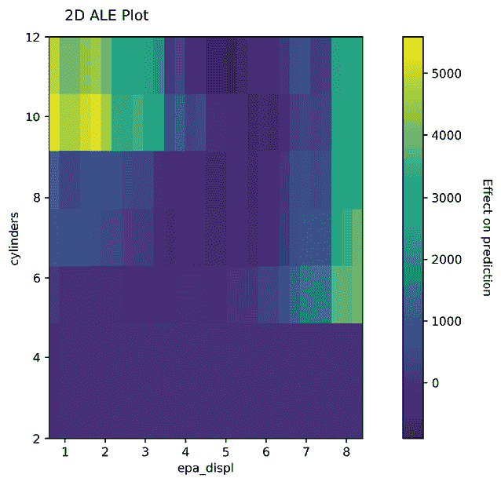

图 4.18：epa_displ 和汽缸数的二维 ALE 图

*图 4.18*清楚地说明了当`汽缸数`大于 8 且`epa_displ`小于 4 时的高交互效应。考虑到拥有大量汽缸的车辆不太可能有低发动机排量，这个发现是反直觉的。另一方面，当汽缸数超过 4 且发动机排量至少为 6 升时，更高的交互效应更有意义。请注意，还有其他因素，如`年份`和`型号类型`，与这两个特征相关，但 ALE 擅长将`汽缸数`和`epa_displ`的效果与其他高度相关的特征分开。

## PDP 交互图

我相信你一定在想：鉴于 PDP 的众多局限性，我们应该在何时何地考虑使用二维 PDP？

只有当两个特征之间存在已证实的关联关系，但它们并不完全冗余或独立，并且理想情况下，它们完美互补时，才建议使用 ALE 图，因为它可以揭示更高阶的效应。

然而，为了说明目的，我们将生成一个 2D PDP，其中包含`long`和`lat`，它们是间接连接的。2D 的代码与 1D 非常相似，只是我们使用`PDPInteract`而不是`PDPIsolate`，然后对于绘图函数，指定`plot_type`为`contour`，但也可以使用`grid`：

```py
features_l = ["long", "lat"]
pdp_interaction_feature = pdp.PDPInteract(
    model=cb_mdl, df=X_test, model_features=X_test.columns,\
    features=features_l, feature_names=features_l, n_classes=0,\
    num_grid_points=15, n_jobs=-1
)
fig, _ = pdp_interaction_feature.plot(
    plot_type='contour', plot_pdp=False
)
fig.show() 
Figure 4.19:
```

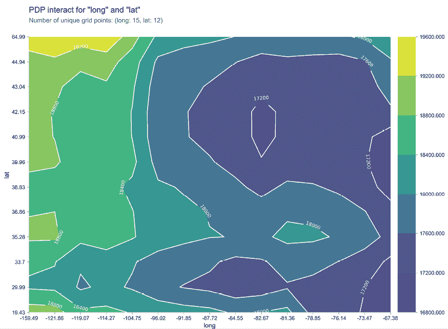

图 4.19：长和纬度的 PDP 交互等高线图

*图 4.19*证明了特征与结果之间的关系：`long`似乎对大部分影响负责，但在某些地区，`lat`似乎有所影响，尤其是在左上角的阿拉斯加。我们可以通过 2D 预测图（`InteractPredictPlot`）来检查这个结果的可靠性。与*图 4.12*一样，目标是显示数据的分布和该数据的预测分数，但这次，它以网格的形式显示，网格的颜色编码表示平均分数，大小编码表示测试观察的数量。我们可以将其与相应的 2D 目标图（`InteractTargetPlot`）进行对比，后者执行相同的操作，但针对的是标签（`target`）而不是预测分数：

```py
fig, axes, summary_df = info_plots.InteractPredictPlot(
    model=cb_mdl, X=X_test, features=features_l,\
    feature_names=features_l, num_grid_points=(15,12)
)
fig, axes, summary_df = info_plots.InteractTargetPlot(
    df=X_train.join(y_train), target='price', features=features_l,\
    feature_names=features_l, num_grid_points=(15,12)
) 
Figure 4.20:
```

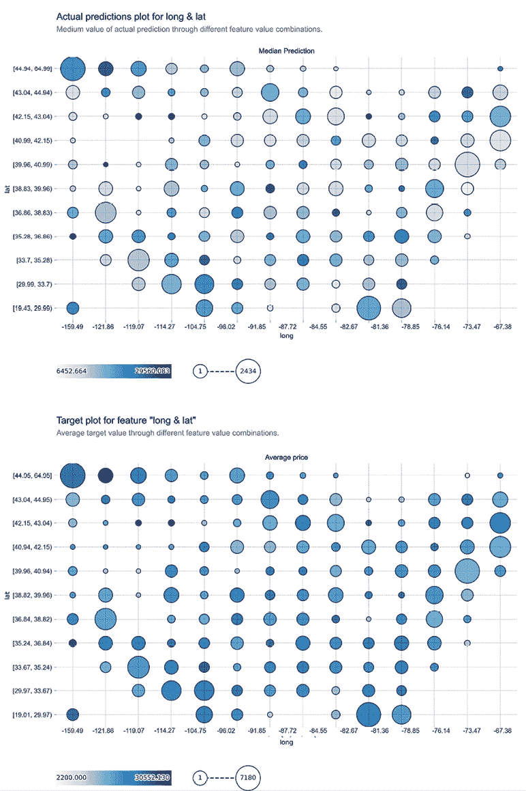

图 4.20：长和纬度的 PDP 实际图

从初始图中可以看出，中值预测在西部（右侧）最大，尤其是西南部（右下角），但变化不大。第二个图证实了在这些图的这些部分，标签更有可能标价较高。因此，模型以这种精确度学习这种分布并不令人惊讶。这些图有助于证实这两个特征之间的关系。

在接下来的章节中，我们将更深入地探讨局部解释！

## 任务完成

我们着手揭示哪些特征有助于预测双边市场的二手车价格。使用决策树的内禀参数、排列特征重要性和 SHAP，我们发现至少有 15 个特征对任何模型的影响可以忽略不计。此外，大约相等数量的特征占据了大部分影响。一些最重要的特征，如发动机排量（`epa_displ`）和汽缸数，是技术性的，并且对于同一款车型的不同版本可能会有所不同，因此用户必须知道并输入它们。

我们还发现了不同特征之间有趣且完全有效的关联，例如`year`和`odometer`，这有助于我们了解它们在模型中的相互作用。我们可以将这些所有发现与科技初创公司分享。

# 摘要

在阅读本章之后，你应该理解了计算特征重要性的模型特定方法及其不足。然后，你应该学习了模型无关方法中的排列特征重要性和 SHAP 值的计算和解释方法。你还学习了可视化模型解释的最常见方式。你应该熟悉全局解释方法，如全局摘要、特征摘要和特征交互图及其优缺点。

在下一章中，我们将深入探讨局部解释。

# 进一步阅读

+   Shapley, Lloyd S.，1953，*n 人博弈的价值*. 在 Kuhn, H. W.；Tucker, A. W.（编者）. *博弈论贡献. 数学研究年鉴*. 28. 普林斯顿大学出版社. 第 307-317 页：[`doi.org/10.1515/9781400881970-018`](https://doi.org/10.1515/9781400881970-018)

+   Lundberg, S. 和 Lee, S.，2017，*解释模型预测的统一方法*. 神经信息处理系统进展：[`arxiv.org/abs/1705.07874`](https://arxiv.org/abs/1705.07874)（SHAP 的文档：[`github.com/slundberg/shap`](https://github.com/slundberg/shap)）

+   Lundberg, S.M.，Erion, G. 和 Lee, S.，2018，*树集成的一致性个体化特征归因*. ICML 研讨会：[`arxiv.org/abs/1802.03888`](https://arxiv.org/abs/1802.03888)

+   Molnar, C., 2019, *可解释机器学习：构建可解释黑盒模型的指南*: [`christophm.github.io/interpretable-ml-book/`](https://christophm.github.io/interpretable-ml-book/)

+   SHAP 图的文档：[`shap.readthedocs.io/en/latest/api.html#plots`](https://shap.readthedocs.io/en/latest/api.html#plots)

+   PDP 方法的原始论文：Friedman, J.H., 2001, *贪婪函数逼近：梯度提升机*. 统计学年鉴，29，1189-1232: [`doi.org/10.1214/aos/1013203451`](https://doi.org/10.1214/aos/1013203451)

+   PDPBox 的文档：[`pdpbox.readthedocs.io/en/latest/`](https://pdpbox.readthedocs.io/en/latest/)

+   ALE 方法的原始论文：Apley, D.W., & Zhu, J., 2020, *可视化黑盒监督学习模型中预测变量的影响*. 英国皇家统计学会：系列 B（统计方法），82\. [`arxiv.org/abs/1612.08468`](https://arxiv.org/abs/1612.08468)

+   PyALE 的仓库：[`github.com/DanaJomar/PyALE`](https://github.com/DanaJomar/PyALE)

+   LIME 方法的原始论文：Ribeiro, M., Singh, S., and Guestrin, C., 2016, *“我应该相信你吗？”：解释任何分类器的预测*. 第 22 届 ACM SIGKDD 国际知识发现和数据挖掘会议论文集。 [`arxiv.org/abs/1602.04938`](https://arxiv.org/abs/1602.04938)

+   LIME 的文档：[`lime-ml.readthedocs.io/en/latest/`](https://lime-ml.readthedocs.io/en/latest/)

# 在 Discord 上了解更多

要加入这本书的 Discord 社区——在那里您可以分享反馈、向作者提问，以及了解新书发布——请扫描下面的二维码：

`packt.link/inml`


