# 第五章：局部模型无关解释方法

在前两章中，我们专门讨论了全局解释方法。本章将探讨局部解释方法，这些方法旨在解释为什么做出了单个预测或一系列预测。它将涵盖如何利用**SHapley Additive exPlanations**（**SHAP**）的`KernelExplainer`以及另一种称为**Local Interpretable Model-agnostic Explanations**（**LIME**）的局部解释方法。我们还将探讨如何使用这些方法处理表格和文本数据。

这些是我们将在本章中讨论的主要主题：

+   利用 SHAP 的`KernelExplainer`进行局部解释的 SHAP 值

+   使用 LIME

+   使用 LIME 进行**自然语言处理**（**NLP**）

+   尝试 SHAP 进行 NLP

+   比较 SHAP 与 LIME

# 技术要求

本章的示例使用了`mldatasets`、`pandas`、`numpy`、`sklearn`、`nltk`、`lightgbm`、`rulefit`、`matplotlib`、`seaborn`、`shap`和`lime`库。如何安装所有这些库的说明在书的**前言**中。

本章的代码位于此处：[`packt.link/SRqJp`](https://packt.link/SRqJp).

# 任务

谁不喜欢巧克力？！它是全球最受欢迎的食品，大约有九成的人喜欢它，每天大约有十亿人食用它。它的一种流行形式是巧克力棒。然而，即使是普遍受欢迎的成分也可以以不普遍吸引人的方式使用——因此，巧克力棒的质量可以从极好到平庸，甚至到令人不快的程度。

通常，这完全取决于可可豆或额外成分的质量，有时一旦与异国风味结合，它就会变成一种习得的口味。

一家法国巧克力制造商对卓越的追求，向你伸出了援手。他们遇到了一个问题。他们的所有巧克力棒都得到了评论家的好评，但评论家的口味非常独特。有些他们喜欢的巧克力棒销售却出奇地平庸，但非评论家在焦点小组和品鉴中似乎都喜欢它们，所以他们困惑为什么销售没有与他们的市场调研相符。他们找到了一组由巧克力爱好者评级的巧克力棒数据集，这些评级恰好与他们的销售情况相符。为了获得无偏见的意见，他们寻求了你的专业知识。

关于数据集，*曼哈顿巧克力协会*的成员自 2007 年以来一直在聚会，唯一的目的就是品尝和评判优质巧克力，以教育消费者并激励巧克力制造商生产更高品质的巧克力。从那时起，他们已经汇编了一个包含 2200 多块巧克力棒的数据集，其成员按照以下标准进行评级：

+   4.0–5.00 = *杰出*

+   3.5–3.99 = *强烈推荐*

+   3.0–3.49 = *推荐*

+   2.0–2.99 = *令人失望*

+   1.0–1.90 = *不愉快*

这些评分是根据一个考虑了香气、外观、质地、风味、回味和整体意见的评分标准得出的，而且被评为的巧克力条大多是较深的巧克力条，因为目的是欣赏可可的风味。除了评分外，*曼哈顿巧克力协会*数据集还包括许多特征，例如可可豆种植的国家、巧克力条有多少种成分、是否包含盐以及描述它的单词。

目标是理解为什么某个巧克力制造商的巧克力条被评为*杰出*但销量不佳，而另一个销量令人印象深刻，但被评为*令人失望*的巧克力条。

# 方法

您已经决定使用本地模型解释来解释为什么每块巧克力条被评为这样。为此，您将准备数据集，然后训练分类模型来预测巧克力条评分是否高于或等于*强烈推荐*，因为客户希望所有巧克力条都高于这个阈值。您需要训练两个模型：一个用于表格数据，另一个用于描述巧克力条的单词的 NLP 模型。我们将分别使用**支持向量机**（**SVMs**）和**轻梯度提升机**（**LightGBM**）来完成这些任务。如果您还没有使用这些黑盒模型，请不要担心——我们将简要解释它们。一旦您训练了模型，接下来就是有趣的部分：利用两种本地模型无关的解释方法来了解是什么让特定的巧克力条被评为*强烈推荐*或不是。

这些解释方法包括 SHAP 和 LIME，当它们结合使用时，将为您的客户提供更丰富的解释。然后，我们将比较这两种方法，以了解它们的优点和局限性。

# 准备工作

+   您可以在此处找到此示例的代码：[`github.com/PacktPublishing/Interpretable-Machine-Learning-with-Python-2E/blob/main/05/ChocoRatings.ipynb`](https://github.com/PacktPublishing/Interpretable-Machine-Learning-with-Python-2E/blob/main/05/ChocoRatings.ipynb)

## 加载库

要运行此示例，您需要安装以下库：

+   `mldatasets`来加载数据集

+   `pandas`、`numpy`和`nltk`来操作它

+   `sklearn`（scikit-learn）和`lightgbm`来分割数据和拟合模型

+   `matplotlib`、`seaborn`、`shap`和`lime`来可视化解释

您应该首先加载所有这些库，如下所示：

```py
import math
import mldatasets
import pandas as pd
import numpy as np
import re
import nltk
from nltk.probability import FreqDist
from nltk.tokenize import word_tokenize
from sklearn.model_selection import train_test_split
from sklearn.pipeline import make_pipeline
from sklearn import metrics, svm
from sklearn.feature_extraction.text import TfidfVectorizer
import lightgbm as lgb
import matplotlib.pyplot as plt
import seaborn as sns
import shap
import lime
import lime.lime_tabular
from lime.lime_text import LimeTextExplainer 
```

## 理解和准备数据

我们将数据加载到我们称之为`chocolateratings_df`的 DataFrame 中，如下所示：

```py
chocolateratings_df = mldatasets.load("chocolate-bar-ratings_v2") 
```

应该有超过 2,200 条记录和 18 列。我们可以简单地通过检查 DataFrame 的内容来验证这一点，如下所示：

```py
chocolateratings_df 
```

这里在*图 5.1*中显示的输出与我们预期的相符：

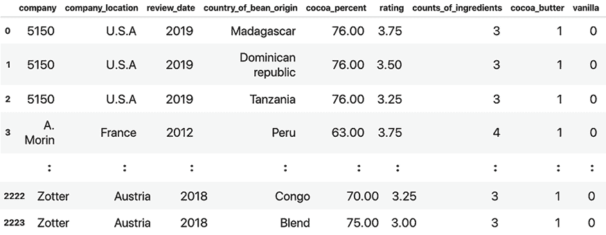

图 5.1：巧克力条数据集的内容

### 数据字典

数据字典包括以下内容：

+   `company`: 分类型；巧克力条的制造商（超过 500 种不同类型）

+   `company_location`: 分类型；制造商所在的国家（66 个不同的国家）

+   `review_date`: 连续型；评价巧克力条的那一年（从 2006 年到 2020 年）

+   `country_of_bean_origin`: 分类型；可可豆收获的国家（62 个不同的国家）

+   `cocoa_percent`: 分类型；巧克力条中可可的百分比

+   `rating`: 连续型；由曼哈顿巧克力协会（*Manhattan Chocolate Society*）给出的评分（可能值为 1–5）

+   `counts_of_ingredients`: 连续型；巧克力条中成分的量

+   `cocoa_butter`: 二元型；是否使用了可可脂？

+   `vanilla`: 二元型；是否使用了香草？

+   `lecithin`: 二元型；是否使用了卵磷脂？

+   `salt`: 二元型；是否使用了盐？

+   `sugar`: 二元型；是否使用了糖？

+   `sweetener_without_sugar`: 二元型；是否使用了无糖甜味剂？

+   `first_taste`: 文本；用于描述第一次品尝的词语

+   `second_taste`: 文本；用于描述第二次品尝的词语

+   `third_taste`: 文本；用于描述第三次品尝的词语

+   `fourth_taste`: 文本；用于描述第四次品尝的词语

现在我们已经浏览了数据，我们可以快速准备它，然后进行建模和解释！

### 数据准备

我们首先应该做的是将文本特征留出，这样我们就可以单独处理它们。我们可以通过创建一个名为`tastes_df`的数据框来包含文本特征，然后从`chocolateratings_df`中删除它们。然后，我们可以使用`head`和`tail`来探索`tastes_df`，如下面的代码片段所示：

```py
tastes_df = chocolateratings_df[
    ['first_taste', 'second_taste', 'third_taste', 'fourth_taste']
]
chocolateratings_df = chocolateratings_df.drop(
    ['first_taste', 'second_taste',
     'third_taste', 'fourth_taste'],axis=1
)
tastes_df.head(90).tail(90) 
```

上述代码生成了这里在*图 5.2*中显示的数据框：

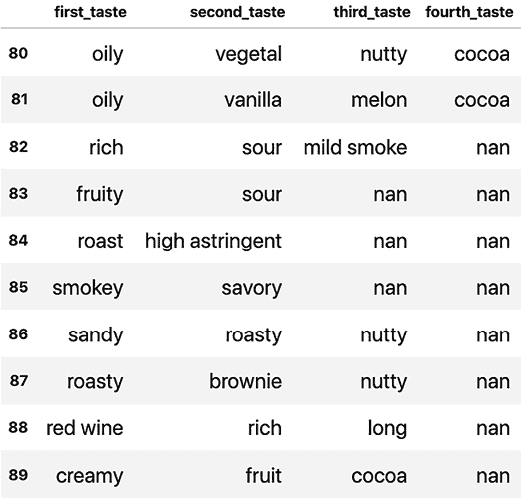

图 5.2：品尝列中有许多空值

现在，让我们对分类型特征进行分类编码。`company_location`和`country_of_bean_origin`中有太多的国家，因此我们设定一个阈值。例如，如果任何国家的数量少于 3.333%（或 74 行），我们就将它们归入一个`Other`类别，然后对类别进行编码。我们可以使用`make_dummies_with_limits`函数轻松完成此操作，以下代码片段展示了该过程：

```py
chocolateratings_df = mldatasets.make_dummies_with_limits(
    chocolateratings_df, 'company_location', 0.03333
)
chocolateratings_df = mldatasets.make_dummies_with_limits(
    chocolateratings_df, 'country_of_bean_origin', 0.03333
) 
```

现在，为了处理`tastes_df`的内容，以下代码将所有空值替换为空字符串，然后将`tastes_df`中的所有列连接起来，形成一个单一的序列。然后，它删除了前导和尾随空格。以下代码片段展示了该过程：

```py
tastes_s = tastes_df.replace(
    np.nan, '', regex=True).agg(' '.join, axis=1).str.strip() 
```

哇！你可以验证结果是一个`pandas`系列（`tastes_s`），其中包含（主要是）与品尝相关的形容词，通过打印它来验证。正如预期的那样，这个系列与`chocolateratings_df`数据框的长度相同，如下面的输出所示：

```py
0          cocoa blackberry robust
1             cocoa vegetal savory
2                rich fatty bready
3              fruity melon roasty
4                    vegetal nutty
                   ...            
2221       muted roasty accessible
2222    fatty mild nuts mild fruit
2223            fatty earthy cocoa
Length: 2224, dtype: object 
```

但让我们先找出它的短语中有多少是唯一的，使用`print(np.unique(tastes_s).shape)`。由于输出是（2178，），这意味着少于 50 个短语是重复的，所以按短语进行分词会是一个糟糕的主意，因为其中很少重复。毕竟，在分词时，我们希望元素重复足够多次，这样才值得。

在这里，你可以采取许多方法，例如按二元组（两个词的序列）或甚至子词（将词分成逻辑部分）进行分词。然而，尽管顺序略微重要（因为第一个词与第一个口味有关，依此类推），但我们的数据集太小，有太多的空值（特别是在`第三口味`和`第四口味`中），无法从顺序中提取意义。这就是为什么将所有“口味”连接起来是一个好的选择，从而消除了它们可辨别的分隔。

另一点需要注意的是，我们的词（大多是）形容词，如“fruity”和“nutty”。我们做了一些努力来移除副词，如“sweetly”，但仍然有一些名词存在，如“fruit”和“nuts”，与形容词“fruity”和“nutty”相对。我们无法确定评鉴巧克力条的品酒家使用“fruit”而不是“fruity”是否意味着不同的东西。然而，如果我们确定这一点，我们可以执行**词干提取**或**词形还原**，将“fruit”、“fruity”和“fruitiness”的所有实例转换为一致的“fru”（*词干*）或“fruiti”（*词形*）。我们不会关注这一点，因为我们的许多形容词的变化在短语中并不常见。

让我们先通过`word_tokenize`对它们进行分词，并使用`FreqDist`来计算它们的频率，找出最常见的词。然后，我们可以将结果`tastewords_fdist`字典放入 DataFrame（`tastewords_df`）。我们可以将出现次数超过 74 次的单词保存为列表（`commontastes_l`）。代码如下所示：

```py
tastewords_fdist = FreqDist(
    word for word in word_tokenize(tastes_s.str.cat(sep=' '))
)
tastewords_df = pd.DataFrame.from_dict(
    tastewords_fdist, orient='index').rename(columns={0:'freq'}
)
commontastes_l = tastewords_df[
    tastewords_df.freq > 74].index.to_list()
print(commontastes_l) 
```

如您从以下`commontastes_l`的输出中可以看出，最常见的词大多不同（除了`spice`和`spicy`）：

```py
['cocoa', 'rich', 'fatty', 'roasty', 'nutty', 'sweet', 'sandy', 'sour', 'intense', 'mild', 'fruit', 'sticky', 'earthy', 'spice', 'molasses', 'floral', 'spicy', 'woody', 'coffee', 'berry', 'vanilla', 'creamy'] 
```

我们可以用这个列表来增强我们的表格数据集，方法是将这些常用词转换为二元特征。换句话说，将会有一个列代表这些“常见口味”中的每一个（`commontastes_l`），如果巧克力条的“口味”包括它，则该列将包含一个 1，否则为 0。幸运的是，我们可以用两行代码轻松完成这个操作。首先，我们创建一个新的列，包含我们的文本口味序列（`tastes_s`）。然后，我们使用上一章中使用的`make_dummies_from_dict`函数，通过在新列的内容中查找每个“常见口味”来生成虚拟特征，如下所示：

```py
chocolateratings_df['tastes'] = tastes_s
chocolateratings_df = mldatasets.make_dummies_from_dict(
    chocolateratings_df, 'tastes', commontastes_l) 
```

现在我们已经完成了特征工程，我们可以使用`info()`来检查我们的 DataFrame。输出包含所有数值非空特征，除了`company`。有超过 500 家公司，所以对这个特征的**分类编码**将会很复杂，并且由于建议将大多数公司归入`Other`类别，这可能会引入对最常出现的少数公司的偏差。因此，最好完全删除这个列。输出如下所示：

```py
RangeIndex: 2224 entries, 0 to 2223
Data columns (total 46 columns):
#   Column                      Non-Null Count  Dtype  
---  ------                      --------------  -----  
0   company                     2224 non-null   object
1   review_date                 2224 non-null   int64  
2   cocoa_percent               2224 non-null   float64
:        :                         :     :        :
43  tastes_berry                2224 non-null   int64  
44  tastes_vanilla              2224 non-null   int64  
45  tastes_creamy               2224 non-null   int64  
dtypes: float64(2), int64(30), object(1), uint8(13) 
```

我们准备数据以进行建模的最后一步是从初始化`rand`，一个在整个练习中作为我们的“随机状态”的常量。然后，我们将`y`定义为如果大于或等于`3.5`则转换为`1`的`rating`列，否则为`0`。`X`是其他所有内容（不包括`company`）。然后，我们使用`train_test_split`将`X`和`y`分割成训练集和测试集，如下代码片段所示：

```py
rand = 9
y = chocolateratings_df['rating'].\
apply(lambda x: 1 if x >= 3.5 else 0)
X = chocolateratings_df.drop(['rating','company'], axis=1).copy()
X_train, X_test, y_train, y_test = train_test_split(
    X, y, test_size=0.33, random_state=rand) 
```

除了表格形式的测试集和训练集之外，对于我们的 NLP 模型，我们还需要与我们的`train_test_split`一致的纯文本特征数据集，以便我们可以使用相同的`y`标签。为此，我们可以通过使用`X_train`和`X_test`集合的`index`来子集化我们的`tastes_s`系列，从而得到 NLP 特定的系列版本，如下所示：

```py
X_train_nlp = tastes_s[X_train.index]
X_test_nlp = tastes_s[X_test.index] 
```

好的！我们现在已经准备好了。让我们开始建模并解释我们的模型！

# 利用 SHAP 的 KernelExplainer 进行局部解释，并使用 SHAP 值

对于本节以及随后的使用，我们将首先训练一个**支持向量分类器**（**SVC**）模型。

## 训练一个 C-SVC 模型

SVM 是一系列在多维空间中操作的模型类，它们试图找到一个最优的超平面，其中它们试图通过它们之间的最大间隔来分离类别。支持向量是距离决策边界（分割超平面）最近的点，如果移除它们，将改变该边界。为了找到最佳超平面，它们使用一个称为**hinge loss**的代价函数，以及一个在多维空间中操作的计算上便宜的方法，称为**核技巧**。尽管超平面暗示了线性可分性，但它并不总是限于线性核。

我们将使用的 scikit-learn 实现称为 C-SVC。SVC 使用一个名为*C*的 L2 正则化参数，并且默认使用一个称为**径向基函数**（**RBF**）的核，这是一个决定性的非线性核。对于 RBF，一个**gamma**超参数定义了核中每个训练示例的影响半径，但以相反的比例。因此，低值增加半径，而高值减小半径。

SVM 家族包括用于分类和甚至回归类的几种变体，通过**支持向量回归**（**SVR**）。SVM 模型最显著的优势是，与观察值相比，当有大量特征时，它们往往能够有效地工作，甚至在特征超过观察值的情况下！它还倾向于在数据中找到潜在的非线性关系，而不会过拟合或变得不稳定。然而，SVM 模型并不容易扩展到更大的数据集，并且很难调整它们的超参数。

由于我们将使用`seaborn`绘图样式，该样式通过`set()`激活，用于本章的一些图表，我们首先保存原始的`matplotlib`设置（`rcParams`），以便我们可以在以后恢复它们。关于`SVC`的一个需要注意的事项是，它本身不产生概率，因为它涉及线性代数。然而，如果`probability=True`，scikit-learn 实现使用交叉验证，然后拟合一个逻辑回归模型到 SVC 的分数以产生概率。我们还使用`gamma=auto`，这意味着它设置为 1/#特征——所以，1/44。始终建议设置你的`random_state`参数以实现可重复性。一旦我们将模型拟合到训练数据，我们就可以使用`evaluate_class_mdl`来评估我们的模型预测性能，如下面的代码片段所示：

```py
svm_mdl = svm.SVC(probability=True, gamma='auto', random_state=rand)
fitted_svm_mdl = svm_mdl.fit(X_train, y_train)
y_train_svc_pred, y_test_svc_prob, y_test_svc_pred =\
    mldatasets.evaluate_class_mdl(
    fitted_svm_mdl, X_train, X_test, y_train, y_test
) 
```

前面的代码生成了这里显示的*图 5.3*中的输出：

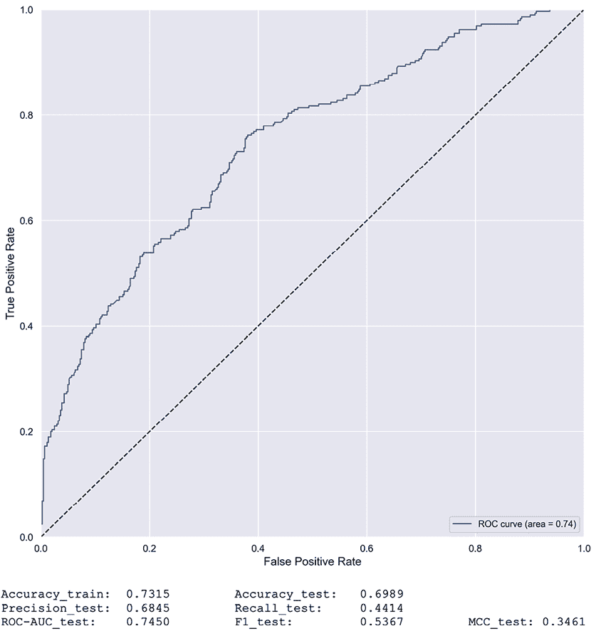

图 5.3：我们的 SVC 模型的预测性能

*图 5.3*显示，考虑到这是一个在小不平衡数据集上，对于机器学习模型用户评分已经是一个具有挑战性的领域，所取得的性能还不错。无论如何，**曲线下面积**（**AUC**）曲线高于虚线抛硬币线，**马修斯相关系数**（**MCC**）安全地高于 0。更重要的是，精确度远高于召回率，考虑到将一块糟糕的巧克力误分类为**强烈推荐**的假设成本，这是非常好的。我们更倾向于精确度而不是召回率，因为我们更愿意有较少的误报而不是误判。

## 使用 KernelExplainer 计算 SHAP 值

由于通过暴力计算 SHAP 值可能非常计算密集，SHAP 库采用了许多统计上有效的捷径。正如我们在*第四章*中学到的，*全局模型无关解释方法*，这些捷径从利用决策树的结构（`TreeExplainer`）到神经网络激活的差异，一个基线（`DeepExplainer`）到一个神经网络的梯度（`GradientExplainer`）。这些捷径使得解释器模型特定，因为它们局限于一系列模型类。然而，SHAP 中有一个模型无关的解释器，称为`KernelExplainer`。

`KernelExplainer` 有两个快捷方式；它为联盟采样所有特征排列的子集，并使用根据联盟大小计算的加权方案来计算 SHAP 值。第一个快捷方式是减少计算时间的推荐技术。第二个快捷方式来自 LIME 的加权方案，我们将在本章的下一部分介绍，SHAP 的作者这样做是为了保持与 Shapley 的一致性。然而，对于联盟中的“缺失”特征，它从背景训练数据集中随机采样特征值，这违反了 Shapley 值的 **虚拟** 属性。更重要的是，与 **排列特征重要性** 一样，如果存在多重共线性，它会过分重视不太可能的情况。尽管存在这个几乎致命的缺陷，`KernelExplainer` 仍然具有 Shapley 值的所有其他优点，以及 LIME 至少一个主要优点。

在我们与 `KernelExplainer` 交互之前，需要注意的是，对于分类模型，它会产生多个 SHAP 值的列表。我们可以通过索引访问每个类的值列表。如果这个索引不是我们预期的顺序，可能会引起混淆，因为它是按照模型提供的顺序排列的。因此，确保我们模型中类的顺序非常重要，可以通过运行 `print(svm_mdl.classes_)` 来实现。

输出 `array([0, 1])` 告诉我们，*不推荐* 的索引为 0，正如我们所预期，而 *强烈推荐* 的索引为 1。我们对后者的 SHAP 值感兴趣，因为这正是我们试图预测的内容。

`KernelExplainer` 接受一个模型的 `predict` 函数（`fitted_svm_mdl.predict_proba`）和一些背景训练数据（`X_train_summary`）。`KernelExplainer` 利用额外的措施来最小化计算。其中之一是使用 **k-means** 对背景训练数据进行总结，而不是使用整个数据。另一种方法可能是使用训练数据的一个样本。在这种情况下，我们选择了将数据聚类到 10 个质心。一旦我们初始化了我们的解释器，我们就可以使用测试数据集的样本（`nsamples=200`）来得出 SHAP 值。它在拟合过程中使用 L1 正则化（`l1_reg`）。我们在这里告诉它的是正则化到一个点，它只有 20 个相关特征。最后，我们可以使用 `summary_plot` 来绘制类别 1 的 SHAP 值。代码在下面的片段中展示：

```py
np.random.seed(rand)
X_train_summary = shap.kmeans(X_train, 10)
shap_svm_explainer = shap.KernelExplainer(
    fitted_svm_mdl.predict_proba, X_train_summary
)
shap_svm_values_test = shap_svm_explainer.shap_values(
    X_test, nsamples=200, l1_reg="num_features(20)"
)
shap.summary_plot(shap_svm_values_test[1], X_test, plot_type="dot") 
```

上述代码生成了 *图 5.4* 中所示的输出。尽管本章的重点是局部模型解释，但重要的是要从全局形式开始，以确保结果直观。如果结果不直观，可能存在问题：

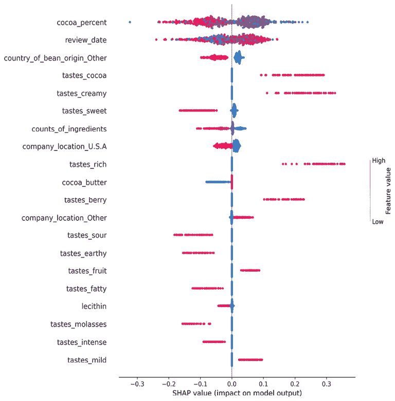

图 5.4：使用 SHAP 的全局模型解释与总结图

在*图 5.4*中，我们可以看出最高的（红色）可可百分比(`cocoa_percent`)往往与**高度推荐**可能性的降低相关，而中间值（紫色）往往增加它。这个发现从直观上是有意义的，因为最深的巧克力比不太深的巧克力更是一种习得的味道。低值（蓝色）散布在整个图表中，因此没有显示出趋势，但这可能是因为数量不多。

另一方面，`review_date`表明，在早期年份很可能被**高度推荐**。在 0 的两侧都有显著的红色和紫色阴影，因此很难在这里识别出趋势。像*第四章*中使用的依赖图将更适合这个目的。然而，对于二元特征来说，可视化高值和低值、一和零如何影响模型是非常容易的。例如，我们可以知道可可、奶油、丰富和浆果味道的存在增加了巧克力被推荐的可能性，而甜、土质、酸和油腻的味道则相反。同样，如果巧克力是在美国制造的，那么**高度****推荐**的几率就会降低！抱歉，是美国。

## 使用决策图对一组预测进行局部解释

对于局部解释，你不必一次可视化一个点——你可以同时解释几个点。关键是提供一些上下文来充分比较这些点，而且不能有太多以至于你无法区分它们。通常，你会找到异常值或者只满足特定标准的那些点。对于这个练习，我们将只选择那些由你的客户生产的条形，如下所示：

```py
sample_test_idx = X_test.index.get_indexer_for(
    [5,6,7,18,19,21,24,25,27]
) 
```

Shapley 的一个优点是其可加性属性，这一点很容易证明。如果你将所有 SHAP 值加到计算它们所用的期望值上，你就能得到一个预测。当然，这是一个分类问题，所以预测是一个概率；因此，为了得到一个布尔数组，我们必须检查这个概率是否大于 0.5。我们可以通过运行以下代码来检查这个布尔数组是否与我们的模型测试数据集预测`(y_test_svc_pred)`相匹配：

```py
expected_value = shap_svm_explainer.expected_value[1]
y_test_shap_pred =\
    (shap_svm_values_test[1].sum(1) + expected_value) > 0.5
print(np.array_equal(y_test_shap_pred, y_test_svc_pred)) 
```

它应该，并且确实如此！你可以通过一个`True`值看到它得到了证实。

SHAP 的决策图自带一个高亮功能，我们可以使用它来使**假阴性**(`FN`)突出。现在，让我们找出我们的样本观测值中哪些是`FN`，如下所示：

```py
FN = (~y_test_shap_pred[sample_test_idx]) &
    (y_test.iloc[sample_test_idx] == 1).to_numpy() 
```

我们现在可以快速重置并绘制一个`decision_plot`。它需要`expected_value`、SHAP 值以及我们希望绘制的那些项目的实际值。可选地，我们可以提供一个布尔数组，表示我们想要高亮的项，用虚线表示——在这个例子中，是**假阴性**(`FN`)，如下面的代码片段所示：

```py
shap.decision_plot(
    expected_value, shap_svm_values_test[1][sample_test_idx],\
    X_test.iloc[sample_test_idx], highlight=FN) 
```

*图 5.5*中产生的图表为每个观测值提供了一个单色编码的线条。


图 5.5：使用 SHAP 对预测样本的局部模型解释，突出显示假阴性

每条线的颜色代表的不是任何特征的值，而是模型输出。由于我们在`KernelExplainer`中使用了`predict_proba`，这是一个概率，但否则它将显示 SHAP 值，并且当它们击中顶部的*x*轴时，它们的值是预测值。特征是根据重要性排序的，但仅限于绘制的观察值，你可以看出线条根据每个特征水平增加和减少。它们的变异程度和方向取决于特征对结果的影响。灰色线代表该类别的期望值，类似于线性模型中的截距。事实上，所有线条都是从这个值开始的，因此最好从下往上阅读这个图。

你可以知道*图 5.5*中有三个假阴性，因为它们有虚线。使用这个图，我们可以轻松地可视化哪些特征使它们向左偏转最多，因为这是使它们成为负预测的原因。

例如，我们知道最左侧的假阴性出现在期望值线右侧，直到`lecithin`，然后继续下降直到`company_location_France`，而`review_date`增加了其成为*高度推荐*的可能性，但这还不够。你可以看出`county_of_bean_origin_Other`降低了两种误分类的可能性。这个决定可能是不公平的，因为国家可能是超过 50 个没有自己特征的国家之一。很可能，这些国家聚集在一起的豆子之间存在很多差异。

决策图也可以隔离单个观察值。当它这样做时，它会将每个特征值打印在虚线旁边。让我们为同一公司的决策图（真阳性观察值#696）绘制一个，如下所示：

```py
shap.decision_plot(
    expected_value, shap_svm_values_test[1][696],
    X_test.iloc[696],highlight=0
) 
```

*图 5.6*在这里是由前面的代码生成的：

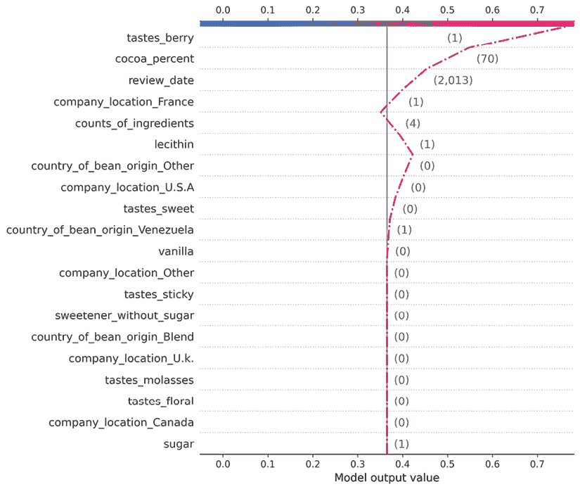

图 5.6：预测样本中单个真阳性的 SHAP 决策图

在*图 5.6*中，你可以看到`lecithin`和`counts_of_ingredients`将*高度推荐*的可能性降低到可能危及它的程度。幸运的是，所有高于这些特征的值都使线条明显向右偏转，因为`company_location_France=1`、`cocoa_percent=70`和`tastes_berry=1`都是有利因素。

## 使用力图对单个预测进行局部解释

你的客户，巧克力制造商，有两块巧克力希望让你比较。第 5 块是*杰出*，第 24 块是*令人失望*。它们都在你的测试数据集中。比较它们的一种方法是将它们的值并排放置在 DataFrame 中，以了解它们究竟有何不同。我们将以下列的评分、实际标签`y`和预测标签`y_pred`合并到这些观察值的旁边，如下所示：

```py
eval_idxs = (X_test.index==5) | (X_test.index==24)
X_test_eval = X_test[eval_idxs]
eval_compare_df = pd.concat([
    chocolateratings_df.iloc[X_test[eval_idxs].index].rating,
    pd.DataFrame({'y':y_test[eval_idxs]}, index=[5,24]),
    pd.DataFrame({'y_pred':y_test_svc_pred[eval_idxs]},
    index=[24,5]), X_test_eval], axis=1).transpose()
eval_compare_df 
```

上述代码生成了*图 5.7*中显示的 DataFrame：

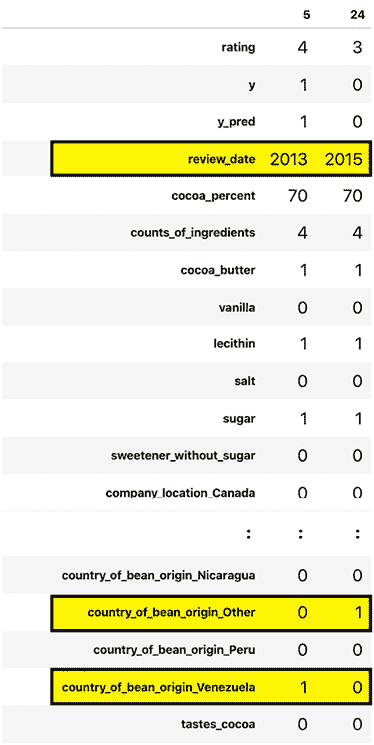

图 5.7：观察#5 和#24 并排，特征差异以黄色突出显示

使用这个 DataFrame，你可以确认它们不是误分类，因为`y=y_pred`。误分类可能会使模型解释不可靠，难以理解为什么人们倾向于喜欢一块巧克力而不是另一块。然后，你可以检查特征以发现差异——例如，你可以知道`review_date`相差 2 年。此外，*杰出*巧克力中的豆子来自委内瑞拉，而*令人失望*的豆子来自另一个代表性较小的国家。*杰出*的巧克力有浆果的味道，而*令人失望*的则是土质的。

力图可以告诉我们模型决策（以及，推测，审评者）中考虑了哪些因素，并为我们提供了关于消费者可能偏好的线索。绘制`force_plot`需要你感兴趣类别的期望值（`expected_value`），你感兴趣观察的 SHAP 值，以及这个观察的实际值。我们将从以下代码片段中的观察#5 开始：

```py
shap.force_plot(
    expected_value,
    shap_svm_values_test[1][X_test.index==5],\
    X_test[X_test.index==5],
    matplotlib=True
) 
```

上述代码生成了*图 5.8*中显示的图表。这个力图描绘了`review_date`、`cocoa_percent`和`tastes_berry`在预测中的权重，而唯一似乎在相反方向起作用的特征是`counts_of_ingredients`：

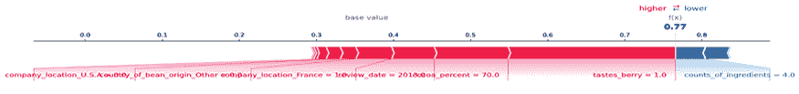

图 5.8：观察#5 的力图（杰出）

让我们将其与观察#24 的力图进行比较，如下所示：

```py
shap.force_plot(expected_value,\  
                shap_svm_values_test[1][X_test.index==24],\
                X_test[X_test.index==24], matplotlib=True) 
```

上述代码生成了*图 5.9*中显示的图表。我们可以很容易地看出，`tastes_earthy`和`country_of_bean_origin_Other`在我们的模型中被认为是高度负面的属性。结果可以主要由巧克力品尝中“浆果”与“土质”的差异来解释。尽管我们有这些发现，但豆子的原产国需要进一步调查。毕竟，实际的原产国可能与低评分不相关。

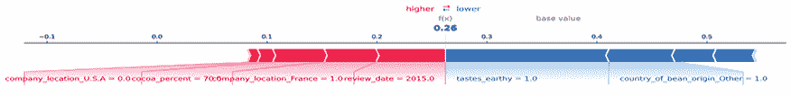

图 5.9：观察#24 的力图（令人失望）

在本节中，我们介绍了`KernelExplainer`，它从 LIME 学到了一些技巧。但 LIME 是什么？我们将在下一节找到答案！

# 使用 LIME

一直以来，我们介绍的模型无关解释方法试图将模型的输出整体与其输入相协调。为了使这些方法能够很好地理解`X`如何变成`y_pred`以及原因，我们首先需要一些数据。然后，我们使用这些数据进行模拟，将数据的变体推入模型并评估模型输出的结果。有时，它们甚至利用全局代理来连接这些点。通过使用在这个过程中学到的知识，我们得到特征重要性值，这些值量化了特征对全局预测的影响、交互或决策。对于 SHAP 等许多方法，这些值也可以在局部观察到。然而，即使它们可以在局部观察到，全局量化的结果可能并不适用于局部。因此，应该有另一种方法，仅针对局部解释量化特征对局部的影响——LIME 就是这样一种方法！

## 什么是 LIME？

**LIME**通过训练局部代理来解释单个预测。为此，它首先询问我们想要解释哪个*数据点*。你还提供你的黑盒模型和样本数据集。然后，它使用模型对数据集的*扰动*版本进行预测，创建一个方案，其中它根据点与所选数据点的接近程度来采样和*加权*点。这个点周围的区域被称为邻域。然后，使用这个邻域中的采样点和黑盒预测，它训练一个带权的*内在可解释的代理模型*。最后，它解释这个代理模型。

这里有很多关键词需要解释，让我们如下定义它们：

+   **Chosen data point**: LIME 将你想要解释的数据点、行或观察称为一个*实例*。这只是这个概念的另一种说法。

+   **Perturbation**: LIME 通过向每个样本添加噪声来模拟新的样本。换句话说，它创建了接近每个实例的随机样本。

+   **Weighting scheme**: LIME 使用指数平滑核来定义局部实例邻域半径，并确定如何权衡远离实例的点与靠近实例的点。

+   **Closer**: LIME 使用欧几里得距离来处理表格和图像数据，而对于文本数据则使用余弦相似度。这在高维特征空间中难以想象，但你仍然可以计算任意维度的点之间的距离，并找出与目标点最近的点。

+   **Intrinsically interpretable surrogate model**: LIME 使用带权重的岭回归的正则化稀疏线性模型。然而，只要数据点可以被加权，它就可以使用任何内在可解释的模型。这个想法有两方面。它需要一个可以产生可靠内在可解释参数的模型，例如指示特征对预测影响的系数。它还需要更多地考虑与所选点最接近的数据点，因为这些点更相关。

与**k-邻近邻居**（**k-NN**）类似，LIME 背后的直觉是，邻域中的点具有共性，因为我们期望彼此靠近的点具有相似，如果不是相同的标签。对于分类器有决策边界，所以当接近的点被一个决策边界分开时，这可能会是一个非常天真的假设。

与邻近邻居家族中的另一个模型类**半径邻近邻居**相似，LIME 考虑了沿着半径的距离并相应地权衡点，尽管它是以指数方式进行的。然而，LIME 不是一个模型类，而是一种解释方法，所以相似之处到此为止。它不是通过在邻居之间“投票”预测，而是通过拟合一个加权的代理稀疏线性模型，因为它假设每个复杂模型在局部都是线性的，而且因为它不是一个模型类，所以代理模型所做的预测并不重要。实际上，代理模型甚至不需要像手套一样拟合数据，因为你从它那里需要的只是系数。当然，话虽如此，如果它能很好地拟合，那么在解释上就会有更高的保真度。

LIME 适用于表格、图像和文本数据，并且通常具有高局部保真度，这意味着它可以在局部水平上很好地近似模型预测。然而，这取决于邻域是否被正确定义，这源于选择合适的核宽度和局部线性假设的成立。

## 使用 LimeTabularExplainer 对单个预测进行局部解释

要解释单个预测，你首先需要通过提供你的样本数据集（以 `numpy` 2D 数组的形式 `X_test.values`）、一个包含特征名称的列表（`X_test.columns`）、一个包含分类特征索引的列表（只有前三个特征不是分类特征），以及类名称来实例化一个 `LimeTabularExplainer`。尽管只需要样本数据集，但建议你为你的特征和类提供名称，以便解释有意义。对于表格数据，告诉 LIME 哪些特征是分类的（`categorical_features`）很重要，因为它将分类特征与连续特征区分对待，不指定这一点可能会使局部代理拟合不良。另一个可以极大地影响局部代理的参数是 `kernel_width`。它定义了邻域的直径，从而回答了什么是局部的问题。它有一个默认值，这个值可能或可能不会产生对你实例有意义的解释。你可以根据实例调整此参数，以确保每次生成解释时都是一致的。请注意，当应用于大邻域时，扰动的随机性质可能会导致结果不一致。因此，当你使这个邻域更小的时候，你会减少运行之间的变异性。以下代码片段展示了代码：

```py
lime_svm_explainer = lime.lime_tabular.LimeTabularExplainer(
    X_test.values,
    feature_names=X_test.columns,
    categorical_features=list(range(3,44)),
    class_names=['Not Highly Recomm.', 'Highly Recomm.']
) 
```

使用实例化的解释器，你现在可以使用 `explain_instance` 为观察 #5 拟合一个局部代理模型。我们还将使用我们模型的分类函数（`predict_proba`）并将特征数量限制为八个（`num_features=8`）。我们可以获取“解释”并立即使用 `show_in_notebook` 进行可视化。同时，`predict_proba` 参数确保它还包括一个图表，显示根据局部代理模型，哪个类是最可能的。以下代码片段展示了代码：

```py
lime_svm_explainer.explain_instance(
    X_test[X_test.index==5].values[0],
    fitted_svm_mdl.predict_proba,
    num_features=8
).show_in_notebook(predict_proba=True) 
```

上述代码提供了 *图 5.10* 中所示的输出。这个图可以像其他特征重要性图一样阅读，最有影响力的特征具有最高的系数——反之亦然。然而，它具有在每个方向上都有权重的特征。根据局部代理，`cocoa_percent` 值小于或等于 70 是一个有利属性，同样，浆果味道也是。缺乏酸味、甜味和糖浆味也有利于这个模型。然而，缺乏丰富、奶油和可可味的缺乏则相反，但不足以将天平推向 *不推荐*：

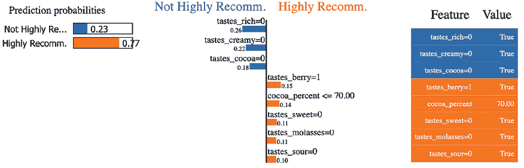

图 5.10：LIME 对观察 #5（杰出）的表格解释

通过对生成 *图 5.10* 的代码进行微小调整，我们可以为观察 #24 生成相同的图表，如下所示：

```py
lime_svm_explainer.explain_instance(
    X_test[X_test.index==24].values[0],
    fitted_svm_mdl.predict_proba,
    num_features=8
).show_in_notebook(predict_proba=True) 
```

在这里，在*图 5.11*中，我们可以清楚地看到为什么局部代理认为观察#24 是*不强烈推荐*：

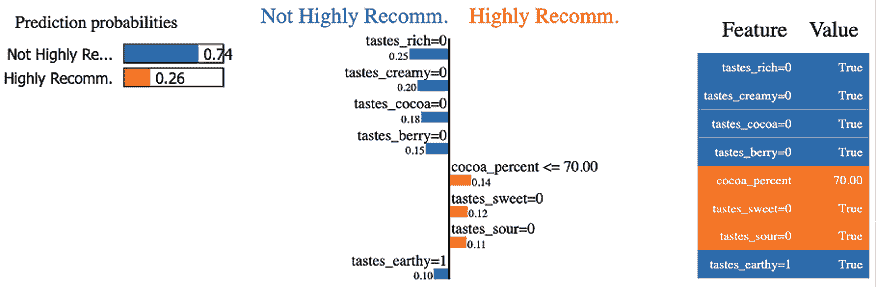

图 5.11：LIME 对观察#24（令人失望）的表格解释

一旦你比较了#24（*图 5.11*）和#5（*图 5.10*）的解释，问题就变得明显了。一个单一的特征，`tastes_berry`，区分了这两个解释。当然，我们将其限制在前八个特征中，所以可能还有更多。然而，你可能会期望前八个特征包括那些造成最大差异的特征。

根据 SHAP（SHapley Additive exPlanations），知道`tastes_earthy=1`是解释#24 号巧克力棒令人失望性质的全局原因，但这看起来似乎与直觉相反。那么，发生了什么？结果发现，观察#5 和#24 相对相似，因此它们位于同一个邻域。这个邻域还包括许多带有浆果口味的巧克力棒，而带有泥土口味的则非常少。然而，泥土口味的数量不足以将其视为一个显著特征，因此它将“强烈推荐”和“不强烈推荐”之间的差异归因于其他似乎更频繁区分的特征。这种原因有两方面：局部邻域可能太小，而且由于线性模型的简单性，它们在**偏差-方差权衡**的偏差端。这种偏差由于一些特征（如`tastes_berry`）相对于`tastes_earthy`出现频率较高而加剧。我们可以使用一种方法来解决这个问题，我们将在下一节中介绍。

# 使用 LIME 进行 NLP

在本章的开头，我们为 NLP（自然语言处理）设置了清洗后的所有“口味”列的内容的训练集和测试集。我们可以先看看 NLP 的测试集，如下所示：

```py
print(X_test_nlp) 
```

这会输出以下内容：

```py
1194                 roasty nutty rich
77      roasty oddly sweet marshmallow
121              balanced cherry choco
411                sweet floral yogurt
1259           creamy burnt nuts woody
                     ...              
327          sweet mild molasses bland
1832          intense fruity mild sour
464              roasty sour milk note
2013           nutty fruit sour floral
1190           rich roasty nutty smoke
Length: 734, dtype: object 
```

没有机器学习模型能够直接处理文本数据，因此我们需要将其转换为数值格式——换句话说，就是进行向量化。我们可以使用许多技术来完成这项工作。在我们的案例中，我们并不关心每个短语中单词的位置，也不关心语义。然而，我们对其相对出现频率感兴趣——毕竟，这是我们上一节中遇到的问题。

由于这些原因，**词频-逆文档频率**（**TF-IDF**）是理想的方法，因为它旨在评估一个术语（每个单词）在文档（每个短语）中出现的频率。然而，它的权重是根据其在整个语料库（所有短语）中的频率来确定的。我们可以使用 scikit-learn 中的`TfidfVectorizer`方法轻松地将我们的数据集向量化。然而，当你需要制作 TF-IDF 分数时，这些分数仅适用于训练集，因为这样，转换后的训练集和测试集对每个术语的评分是一致的。请看以下代码片段：

```py
vectorizer = TfidfVectorizer(lowercase=False)
X_train_nlp_fit = vectorizer.fit_transform(X_train_nlp)
X_test_nlp_fit = vectorizer.transform(X_test_nlp) 
```

要了解 TF-IDF 分数的样子，我们可以将所有特征名称放在 DataFrame 的一列中，并将单个观察到的相应分数放在另一列中。请注意，由于向量器生成的是`scipy`稀疏矩阵，我们必须使用`todense()`将其转换为`numpy`矩阵，然后使用`asarray()`转换为`numpy`数组。我们可以按 TD-IDF 分数降序排序这个 DataFrame。代码如下所示：

```py
pd.DataFrame(
    {
        'taste':vectorizer.get_feature_names_out(),
        'tf-idf': np.asarray(
            X_test_nlp_fit[X_test_nlp.index==5].todense())[0]
    }
).sort_values(by='tf-idf', ascending=False) 
```

前面的代码生成了以下*图 5.12*中所示的结果：

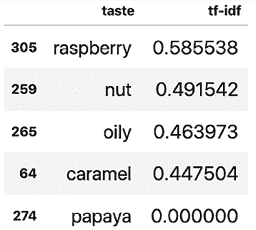

图 5.12：观察#5 中出现的单词的 TF-IDF 分数

如您从*图 5.12*中可以看出，TD-IDF 分数是介于 0 和 1 之间的归一化值，而在语料库中最常见的分数较低。有趣的是，我们意识到我们表格数据集中的观察#5 中`berry=1`是因为**覆盆子**。我们使用的分类编码方法搜索了`berry`的出现，无论它们是否匹配整个单词。这不是问题，因为覆盆子是一种浆果，覆盆子并不是我们具有自己二进制列的常见口味之一。

现在我们已经将 NLP 数据集向量化，我们可以继续进行建模。

## 训练 LightGBM 模型

**LightGBM**，就像**XGBoost**一样，是另一个非常流行且性能出色的梯度提升框架，它利用了提升树集成和基于直方图的分割查找。主要区别在于分割方法的算法，LightGBM 使用**基于梯度的单侧采样**（**GOSS**）和将稀疏特征捆绑在一起使用**独家特征捆绑**（**EFB**），而 XGBoost 则使用更严格的**加权分位数草图**和**稀疏感知分割查找**。另一个区别在于构建树的方式，XGBoost 是**深度优先**（自上而下），而 LightGBM 是**广度优先**（跨树叶）。我们不会深入探讨这些算法的工作原理，因为这会偏离当前的主题。然而，重要的是要注意，由于 GOSS，LightGBM 通常比 XGBoost 还要快，尽管它可能会因为 GOSS 分割近似而损失一些预测性能，但它通过最佳优先的方法弥补了一些。另一方面，**可解释提升机**（**EBM**）使 LightGBM 在高效且有效地训练稀疏特征方面变得理想，例如我们`X_train_nlp_fit`稀疏矩阵中的那些特征！这基本上概括了我们为什么在这个练习中使用 LightGBM 的原因。

要训练 LightGBM 模型，我们首先通过设置最大树深度（`max_depth`）、学习率（`learning_rate`）、要拟合的增强树数量（`n_estimators`）、`objective`（二分类目标）以及最后但同样重要的是`random_state`（用于可重复性）来初始化模型。使用`fit`，我们使用我们的向量化 NLP 训练数据集（`X_train_nlp_fit`）和与 SVM 模型相同的标签（`y_train`）来训练模型。一旦训练完成，我们可以使用与 SVM 相同的`evaluate_class_mdl`来评估。代码如下所示：

```py
lgb_mdl = lgb.LGBMClassifier(
    max_depth=13,
    learning_rate=0.05,
    n_estimators=100,
    objective='binary',
    random_state=rand
)
fitted_lgb_mdl = lgb_mdl.fit(X_train_nlp_fit, y_train)
y_train_lgb_pred, y_test_lgb_prob, y_test_lgb_pred =\
    mldatasets.evaluate_class_mdl(
        fitted_lgb_mdl, X_train_nlp_fit, X_test_nlp_fit, y_train, y_test
    ) 
```

上述代码生成了*图 5.13*，如下所示：

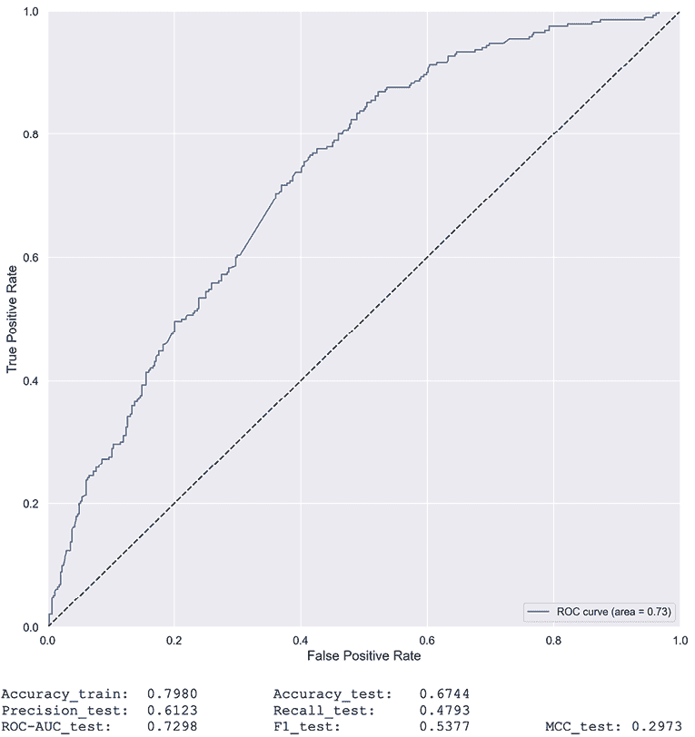

图 5.13：我们 LightGBM 模型的预测性能

*图 5.13*显示 LightGBM 达到的性能略低于 SVM（*图 5.3*），但仍然相当不错，安全地高于抛硬币的线。关于 SVM 的注释，即在此模型中优先考虑精确度而非召回率，也适用于此处。

## 使用 LimeTextExplainer 对单个预测进行局部解释

要使用 LIME 解释任何黑盒模型预测，我们需要指定一个分类器函数，例如模型的`predict_proba`，它将使用此函数在实例邻域内使用扰动数据做出预测，然后使用它训练一个线性模型。实例必须是数值形式——换句话说，是向量化的。然而，如果你能提供任何任意文本，并且它可以在飞行中将其向量化，那就更容易了。这正是管道为我们所做的事情。使用 scikit-learn 的`make_pipeline`函数，你可以定义一系列转换数据的估计器，然后是一个可以拟合数据的估计器。在这种情况下，我们只需要`vectorizer`转换我们的数据，然后是我们的 LightGBM 模型（`lgb_mdl`），它接受转换后的数据，如下面的代码片段所示：

```py
lgb_pipeline = make_pipeline(vectorizer, lgb_mdl) 
```

初始化一个`LimeTextExplainer`相当简单。所有参数都是可选的，但建议指定类名。就像`LimeTabularExplainer`一样，一个可选的`kernel_width`参数可能非常关键，因为它定义了邻域的大小，默认值可能不是最优的，但可以根据实例进行调整。代码如下所示：

```py
lime_lgb_explainer = LimeTextExplainer(
    class_names=['Not Highly Recomm.', 'Highly Recomm.']
) 
```

使用`LimeTextExplainer`解释实例与对`LimeTabularExplainer`进行操作类似。区别在于我们使用了一个管道（`lgb_pipeline`），而我们提供的数据（第一个参数）是文本，因为管道可以为我们转换它。代码如下所示：

```py
lime_lgb_explainer.explain_instance(
    X_test_nlp[X_test_nlp.index==5].values[0],
    lgb_pipeline.predict_proba, num_features=4
).show_in_notebook(text=True) 
```

根据 LIME 文本解释器（见图 5.14），模型因为**焦糖**这个词预测观察#5 为**强烈推荐**。至少根据局部邻域，**覆盆子**不是一个因素。在这种情况下，局部代理模型做出了与 LightGBM 模型不同的预测。在某些情况下，LIME 的预测与模型预测不一致。如果不一致率太高，我们将称之为“低保真度”。

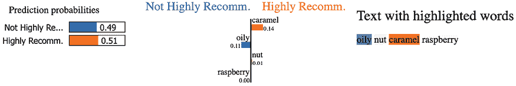

图 5.14：LIME 对观察#5（杰出）的文本解释

现在，让我们将观察#5 的解释与之前所做的观察#24 的解释进行对比。我们可以使用相同的代码，但只需将`5`替换为`24`，如下所示：

```py
lime_lgb_explainer.explain_instance(
    X_test_nlp[X_test_nlp.index==24].values[0],
    lgb_pipeline.predict_proba, num_features=4
).show_in_notebook(text=True) 
```

根据图 5.15，你可以看出观察#24，描述为尝起来像**烧焦的木头土质巧克力**，因为**土质**和**烧焦**这两个词而被标记为**不推荐**：

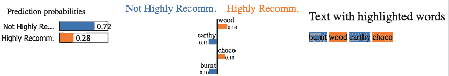

图 5.15：LIME 对观察#24（令人失望）的表格解释

既然我们使用的是一个可以将任何任意文本矢量化的小管道，那么让我们来点乐趣吧！我们首先尝试一个由我们怀疑模型偏好的形容词组成的短语，然后尝试一个由不受欢迎的形容词组成的短语，最后尝试使用模型不应该熟悉的词，如下所示：

```py
lime_lgb_explainer.explain_instance(
    'creamy rich complex fruity',
    lgb_pipeline.predict_proba, num_features=4
).show_in_notebook(text=True)
lime_lgb_explainer.explain_instance(
    'sour bitter roasty molasses',
    lgb_pipeline.predict_proba, num_features=4
).show_in_notebook(text=True)
lime_lgb_explainer.explain_instance(
    'nasty disgusting gross stuff',
    lgb_pipeline.predict_proba, num_features=4
).show_in_notebook(text=True) 
```

在图 5.16 中，解释对于**奶油丰富复杂果味**和**酸苦烤焦糖浆**非常准确，因为模型知道这些词要么非常受欢迎，要么不受欢迎。这些词也足够常见，可以在局部层面上得到欣赏。

你可以在这里看到输出：

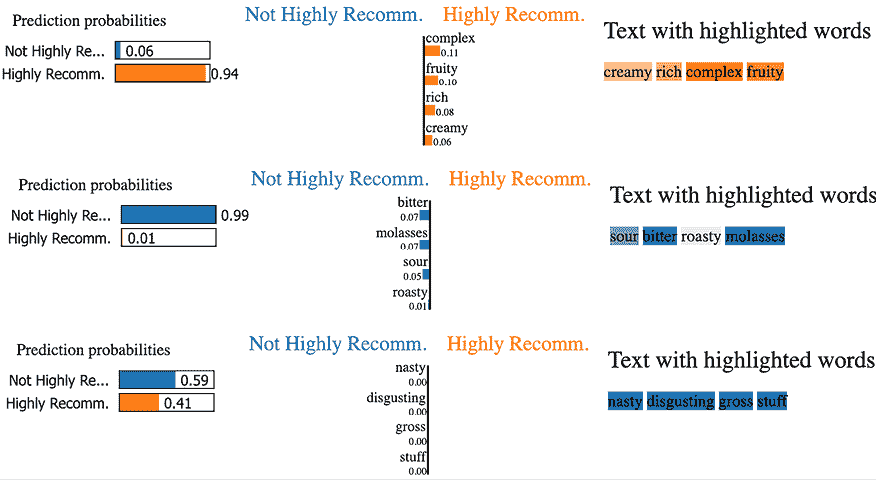

图 5.16：LIME 可以轻松解释不在训练或测试数据集中的任意短语，只要这些词在语料库中

然而，认为对**令人厌恶的恶心恶心的东西**预测为**不推荐**与这些词有任何关系的想法是错误的。LightGBM 模型之前从未见过这些词，因此预测更多与**不推荐**是多数类有关，这是一个不错的猜测，并且这个短语的稀疏矩阵全是零。因此，LIME 可能在其邻域中找到了很少的远点——如果有的话，所以 LIME 的局部代理模型的零系数反映了这一点。

# 尝试 SHAP 用于 NLP

大多数 SHAP 的解释器都可以与表格数据一起工作。`DeepExplainer`可以处理文本，但仅限于深度学习模型，正如我们将在*第七章*中讨论的，*可视化卷积神经网络*，其中三个可以处理图像，包括`KernelExplainer`。事实上，SHAP 的`KernelExplainer`被设计成一种通用、真正模型无关的方法，但它并不被推广为 NLP 的选项。很容易理解为什么：它很慢，NLP 模型通常非常复杂，并且具有数百——如果不是数千——个特征。在这种情况下，单词顺序不是因素，您有几百个特征，但前 100 个在您的多数观察中都是现成的，`KernelExplainer`可以工作。

除了克服高计算成本外，您还需要克服几个技术难题。其中之一是`KernelExplainer`与管道兼容，但它期望返回一个单一的预测集。但 LightGBM 返回两个集合，每个类别一个：*不高度推荐*和*高度推荐*。为了克服这个问题，我们可以创建一个`lambda`函数（`predict_fn`），它包含一个`predict_proba`函数，该函数仅返回*高度推荐*的预测。这将在以下代码片段中说明：

```py
predict_fn = lambda X: lgb_mdl.predict_proba(X)[:,1] 
```

第二个技术难题与 SHAP 与 SciPy 稀疏矩阵的不兼容性有关，并且为了我们的解释器，我们需要样本向量化的测试数据，其格式如下。为了克服这个问题，我们可以将我们的 SciPy 稀疏矩阵格式数据转换为`numpy`矩阵，然后再转换为`pandas` DataFrame（`X_test_nlp_samp_df`）。为了克服任何缓慢的问题，我们可以使用上次使用过的相同的`kmeans`技巧。除了为了克服障碍所做的调整外，以下代码与使用 SVM 模型执行的 SHAP 完全相同：

```py
X_test_nlp_samp_df = pd.DataFrame(
    shap.sample(X_test_nlp_fit, 50).todense()
)
shap_lgb_explainer = shap.KernelExplainer(
    predict_fn, shap.kmeans(X_train_nlp_fit.todense(), 10)
)
shap_lgb_values_test = shap_lgb_explainer.shap_values(
    X_test_nlp_samp_df, l1_reg="num_features(20)"
)
shap.summary_plot(
    shap_lgb_values_test,
    X_test_nlp_samp_df,
    plot_type="dot",
    feature_names=vectorizer.get_feature_names_out()
) 
```

通过使用 SHAP 的总结图*图 5.17*，您可以知道，从全局来看，单词**奶油**、**丰富**、**可可**、**水果**、**辛辣**、**坚果**和**浆果**对模型预测**高度推荐**有积极影响。另一方面，**甜**、**酸**、**土**、**火腿味**、**沙**和**脂肪**有相反的影响。考虑到我们之前使用 SVM 模型、表格数据和局部 LIME 解释所学到的东西，这些结果并不完全令人意外。话虽如此，SHAP 值是从稀疏矩阵的样本中得出的，它们可能缺少细节，甚至可能是部分错误的，特别是对于代表性不足的特征。因此，我们应该带着怀疑的态度接受结论，特别是对于图表下半部分。为了提高解释的准确性，最好增加样本大小，但鉴于`KernelExplainer`的缓慢，需要考虑权衡。

您可以在此查看输出：

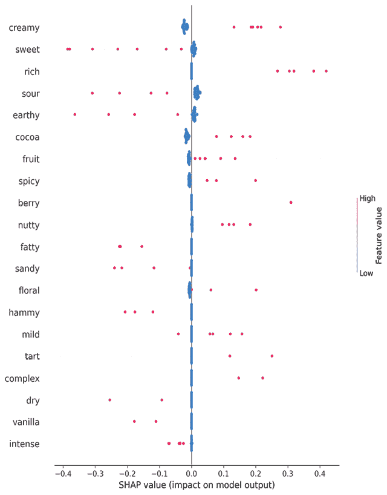

图 5.17：LightGBM NLP 模型的 SHAP 摘要图

现在我们已经全局验证了我们的 SHAP 值，我们可以使用它们进行局部解释，使用力图。与 LIME 不同，我们无法使用任意数据。使用 SHAP，我们仅限于我们之前已生成 SHAP 值的数据点。例如，让我们以我们的测试数据集样本中的第 18 次观察为例，如下所示：

```py
print(shap.sample(X_test_nlp, 50).to_list()[18]) 
```

上述代码输出此短语：

```py
woody earthy medicinal 
```

重要的是要注意哪些词在第 18 次观察中得到了表示，因为 `X_test_nlp_samp_df` DataFrame 包含了向量化表示。此 DataFrame 中第 18 次观察的行是用于生成力图的，以及此观察的 SHAP 值和类别的预期值，如下代码片段所示：

```py
shap.force_plot(
    shap_lgb_explainer.expected_value,
    shap_lgb_values_test[18,:],
    X_test_nlp_samp_df.iloc[18,:], 
    feature_names=vectorizer.get_feature_names_out()
) 
```

*图 5.18* 是 **木质土质药性** 的力图。正如你所见，**土质** 和 **木质** 在与 *强烈推荐* 的预测中占重要地位。词 **药性** 在力图中没有出现，而是得到的是 **奶油** 和 **可可** 的缺乏作为负面因素。正如你所想象，*药性* 并非常用来描述巧克力棒的词，因此在样本数据集中只有一次包含它的观察。因此，它在可能联盟中的平均边际贡献将大大减少：

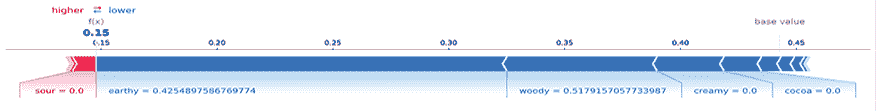

图 5.18：样本测试数据集第 18 次观察的 SHAP 力图

让我们再试一个，如下所示：

```py
print(shap.sample(X_test_nlp, 50).to_list()[9]) 
```

第 9 次观察的短语如下：

```py
intense spicy floral 
```

为此观察生成 `force_plot` 与之前相同，只是将 `18` 替换为 `9`。如果你运行此代码，你将产生如下 *图 5.19* 中所示的输出：

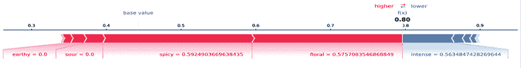

图 5.19：样本测试数据集第 9 次观察的 SHAP 力图

如你在 *图 5.19* 中所欣赏的，短语中的所有词都在力图中得到了表示：**花香** 和 **辛辣** 推向 *强烈推荐*，而 **强烈** 则指向 *不强烈推荐*。所以，现在你知道如何使用 SHAP 进行表格和 NLP 解释，它与 LIME 相比如何？

# 比较 SHAP 与 LIME

如您现在所注意到的，SHAP 和 LIME 都有局限性，但它们也有优势。SHAP 基于博弈论和近似的 Shapley 值，因此其 SHAP 值有理论支持。这些值具有如加法性、效率和可替代性等优秀特性，使它们保持一致性但违反了虚拟属性。它总是能够累加，并且不需要参数调整来实现这一点。然而，它更适合全局解释，它最不依赖于模型的解释器之一，`KernelExplainer`却非常慢。`KernelExplainer`还通过使用随机值来处理缺失值，这可能会过分强调不太可能观察到的现象。

LIME 速度快，非常不依赖于模型，并且适用于各种数据。然而，它不是基于严格和一致的原则，而是有邻居相似的直觉。因此，它可能需要复杂的参数调整来最优地定义邻域大小，即使如此，它也仅适用于局部解释。

# 任务完成

任务是理解为什么您的一位客户的酒吧是**杰出**的，而另一个则是**令人失望**的。您采用的方法是使用机器学习模型的解释来得出以下结论：

+   根据表格模型上的 SHAP，**杰出**的酒吧之所以得到这个评价，是因为它的浆果味道和 70%的可可含量。另一方面，**令人失望**的酒吧的不利评价主要归因于它的土质风味和豆类产地（`其他`）。审查日期的作用较小，但似乎在该时期（2013-15）审查的巧克力棒有优势。

+   LIME 确认`cocoa_percent<=70`是一个理想属性，并且除了**浆果**、**奶油**、**可可**和**丰富**是受欢迎的味道外，**甜**、**酸**和**糖蜜**是不受欢迎的。

+   使用表格模型的方法之间的共同之处在于，尽管有许多与味道无关的属性，但味道特征是最显著的。因此，通过 NLP 模型解释描述每个巧克力棒的词语是合适的。

+   **杰出**的酒吧被描述为“油润坚果焦糖浆果”，根据`LIMETextExplainer`，**焦糖**是积极的，**油润**是消极的。其他两个词是中性的。另一方面，**令人失望**的酒吧被描述为“烧焦的木头土质巧克力”，其中**烧焦**和**土质**是不受欢迎的，其他两个是受欢迎的。

+   表格解释和 NLP 解释中味道的不一致性是由于存在较少出现的味道，包括**浆果**，它不像**浆果**那样常见。

+   根据 SHAP 对 NLP 模型的全球解释，**奶油**、**丰富**、**可可**、**水果**、**辛辣**、**坚果**和**浆果**对模型预测**高度推荐**有积极影响。另一方面，**甜味**、**酸味**、**土味**、**火腿味**、**沙沙声**和**油腻**有相反的影响。

基于这些关于哪些巧克力棒特征和口味被认为对*曼哈顿巧克力协会*成员来说不那么吸引人的观点，客户可以对他们的巧克力棒配方进行修改，以吸引更广泛的受众——前提是关于该群体代表目标受众的假设是正确的。

可以认为，像**土味**和**烧焦味**这样的词与巧克力棒不搭配，而**焦糖**则相反。因此，我们可能已经得出这个结论，而不需要机器学习！但首先，一个没有数据支持的观点只是一个观点，其次，环境是关键。此外，人类并不总是能够客观地将一个点放在其环境中——特别是在有成千上万条记录的情况下！

此外，局部模型解释不仅关乎对一个预测的解释，因为它与模型如何做出所有预测有关，更重要的是，它与模型如何对相似点进行预测有关——换句话说，在局部邻域！在下一章中，我们将通过观察我们可以在那里找到的共性（*锚点*）和不一致性（*反事实*）来进一步探讨在局部邻域意味着什么。

# 摘要

在本章中，我们学习了如何使用 SHAP 的`KernelExplainer`，以及它的决策和力图进行局部解释。我们使用 LIME 的实例解释器对表格和文本数据进行了类似的分析。最后，我们探讨了 SHAP 的`KernelExplainer`和 LIME 的优缺点。在下一章中，我们将学习如何创建更易于人类理解的模型决策解释，例如*如果满足 X 条件，则 Y 是结果*。

# 数据集来源

+   Brelinski, Brady (2020). *曼哈顿巧克力协会*: [`flavorsofcacao.com/mcs_index.html`](http://flavorsofcacao.com/mcs_index.html)

# 进一步阅读

+   Platt, J. C., 1999, *支持向量机概率输出及其与正则化似然方法的比较*. 大边缘分类器进展，麻省理工学院出版社：[`www.cs.colorado.edu/~mozer/Teaching/syllabi/6622/papers/Platt1999.pdf`](https://www.cs.colorado.edu/~mozer/Teaching/syllabi/6622/papers/Platt1999.pdf)

+   Lundberg, S. 和 Lee, S., 2017, *统一解释模型预测的方法*. [`arxiv.org/abs/1705.07874`](https://arxiv.org/abs/1705.07874)（SHAP 的文档：[`github.com/slundberg/shap`](https://github.com/slundberg/shap)）

+   Ribeiro, M. T., Singh, S., and Guestrin, C., 2016, *“Why Should I Trust You?”: Explaining the Predictions of Any Classifier*. Proceedings of the 22^(nd) ACM SIGKDD International Conference on Knowledge Discovery and Data Mining: [`arxiv.org/abs/1602.04938`](http://arxiv.org/abs/1602.04938)

+   Ke, G., Meng, Q., Finley, T., Wang, T., Chen, W., Ma, W., Ye, Q., and Liu, T., 2017, *LightGBM: A Highly Efficient Gradient Boosting Decision Tree*. Advances in Neural Information Processing Systems vol. 30, pp. 3149–3157: [`papers.nips.cc/paper/6907-lightgbm-a-highly-efficient-gradient-boosting-decision-tree`](https://papers.nips.cc/paper/6907-lightgbm-a-highly-efficient-gradient-boosting-decision-tree)

# 在 Discord 上了解更多

要加入这本书的 Discord 社区——在那里您可以分享反馈、向作者提问，并了解新书发布——请扫描下面的二维码：

`packt.link/inml`


