# 6

# 锚定和反事实解释

在前面的章节中，我们学习了如何使用最先进的全局和局部模型解释方法将模型决策归因于特征及其与状态的交互。然而，决策边界并不总是容易定义或解释。如果能够从模型解释方法中推导出人类可解释的规则，那岂不是很好？在本章中，我们将介绍一些人类可解释的、局部的、仅分类的模型解释方法。我们首先将学习如何使用称为**锚定**的限定规则来解释复杂模型，例如使用如下语句*如果满足 X 条件，则 Y 是结果*。然后，我们将探讨遵循*如果 Z 条件不满足，则 Y 不是结果*形式的**反事实**解释。

这些是我们将在本章中要涵盖的主要主题：

+   理解锚定解释

+   探索反事实解释

让我们开始吧！

# 技术要求

本章的示例使用了`mldatasets`、`pandas`、`numpy`、`sklearn`、`catboost`、`matplotlib`、`seaborn`、`alibi`、`tensorflow`、`shap`和`witwidget`库。如何安装所有这些库的说明在*序言*中。

本章的代码位于此处：[`packt.link/tH0y7`](https://packt.link/tH0y7)。

# 任务

在美国，在过去二十年里，私营公司和非营利组织开发了刑事**风险评估工具/仪器**（**RAIs**），其中大部分采用统计模型。由于许多州无法承担其庞大的监狱人口，这些方法越来越受欢迎，*引导*法官和假释委员会通过监狱系统的每一步。

这些是影响重大的决策，可能决定一个人是否被释放出监狱。我们能否承担这些决策出错的风险？我们能否在不理解为什么这些系统会做出这样的推荐的情况下接受这些系统的建议？最糟糕的是，我们并不确切知道评估是如何进行的。风险通常使用白盒模型进行计算，但在实践中，由于是专有的，通常使用黑盒模型。根据论文《美国矫正环境中再犯风险评估工具的性能》的数据，预测性能也相对较低，九个工具样本的中位 AUC 分数在 0.57 到 0.74 之间。

尽管传统的统计方法仍然是刑事司法模型的标准，但为了提高性能，一些研究人员提出了利用更复杂的模型，例如具有更大数据集的随机森林。这并非来自《少数派报告》或《黑镜》的科学幻想，在一些国家，基于大数据和机器学习对人们参与反社会，甚至反爱国行为的可能性进行评分已经成为现实。

随着越来越多的 AI 解决方案试图用我们的数据做出改变我们生活的预测，公平性必须得到适当的评估，并且所有其伦理和实际影响都必须得到充分的讨论。*第一章*，*解释、可解释性和可解释性；以及这一切为什么都如此重要？*，讨论了公平性是机器学习解释的一个基本概念。你可以在任何模型中评估公平性，但涉及人类行为时，公平性尤其困难。人类心理、神经和社会因素之间的动态极其复杂。在预测犯罪行为的背景下，这归结为哪些因素可能对犯罪负有责任，因为将其他任何东西包含在模型中都是不公平的，以及这些因素如何相互作用。

定量犯罪学家仍在争论犯罪性的最佳预测因素及其根本原因。他们也在争论是否应该从一开始就*责怪*罪犯这些因素。幸运的是，人口统计特征如种族、性别和国籍不再用于犯罪风险评估。但这并不意味着这些方法不再有偏见。学者们认识到这个问题，并提出了解决方案。

本章将探讨在广泛使用的风险评估工具中存在的种族偏见。鉴于这一主题的敏感性和相关性，提供一些关于犯罪风险评估工具以及机器学习和公平性如何与它们所有方面相关联的背景信息是至关重要的。我们不会深入更多细节，但理解背景对于欣赏机器学习如何持续加剧结构性不平等和不公平偏见是很重要的。

现在，让我们向您介绍本章的任务！

## 再犯风险评估中的不公平偏见

想象一个调查记者正在撰写一篇关于一名非洲裔美国被告的文章，该被告在审判前被拘留。一个名为**矫正犯人管理配置文件以替代制裁**（**COMPAS**）的工具认为他有再犯的风险。**再犯**是指某人重新陷入犯罪行为。这个分数让法官相信被告必须被拘留，而不考虑任何其他论点或证词。他被关押了数月，在审判中被判无罪。自审判以来已经过去了五年，他没有被指控犯有任何罪行。可以说，对再犯的预测是一个假阳性。

记者联系你是因为她希望用数据科学来确定这个案例中是否存在不公平的偏见。COMPAS 风险评估是通过 137 个问题计算的（[`www.documentcloud.org/documents/2702103-Sample-Risk-Assessment-COMPAS-CORE.html`](https://www.documentcloud.org/documents/2702103-Sample-Risk-Assessment-COMPAS-CORE.html)）。它包括以下问题：

+   “根据筛查者的观察，这个人是不是被怀疑或承认的帮派成员？”

+   “在过去 12 个月内，你多久搬过一次家？”

+   “你多久才有足够的钱维持生计？”

+   心理测量学李克特量表问题，例如“我从未因为生活中的事情感到悲伤。”

尽管种族不是问题之一，但许多这些问题可能与种族相关。更不用说，在某些情况下，它们可能更多的是主观意见的问题而不是事实，因此容易产生偏见。

记者无法提供您 137 个已回答的问题或 COMPAS 模型，因为这些数据不是公开可用的。然而，幸运的是，佛罗里达州同一县的所有被告的人口统计和再犯数据是可用的。

# 方法

您已经决定做以下事情：

+   **训练代理模型**：您没有原始特征或模型，但并非一切尽失，因为您有 COMPAS 分数——标签。我们还有与这些问题相关的特征，我们可以通过模型将这些标签连接起来。通过通过代理近似 COMPAS 模型，您可以评估 COMPAS 决策的公平性。在本章中，我们将训练一个 CatBoost 模型。

+   **Anchor 解释**：使用这种方法将揭示代理模型为何使用一系列称为锚点的规则做出特定预测的见解，这些规则告诉您决策边界在哪里。边界对我们任务的相关性在于我们想知道为什么被告被错误地预测会再犯。这是一个对原始模型的近似边界，但其中仍有一些真实性。

+   **反事实解释**：虽然 Anchor 解释了决策为何被做出，但反事实可以用来检查决策为何没有被做出。这在检查决策的公平性方面特别有用。我们将使用无偏方法来找到反事实，然后使用 **What-If Tool** (**WIT**) 来进一步探索反事实和公平性。

# 准备工作

您将在这里找到这个示例的代码：[`github.com/PacktPublishing/Interpretable-Machine-Learning-with-Python-2E/blob/main/06/Recidivism.ipynb`](https://github.com/PacktPublishing/Interpretable-Machine-Learning-with-Python-2E/blob/main/06/Recidivism.ipynb)。

## 加载库

要运行此示例，您需要安装以下库：

+   `mldatasets` 用于加载数据集

+   使用 `pandas` 和 `numpy` 来操作数据集

+   使用 `sklearn` (scikit-learn) 和 `catboost` 来分割数据并拟合模型

+   使用 `matplotlib`、`seaborn`、`alibi`、`tensorflow`、`shap` 和 `witwidget` 来可视化解释

您应该首先加载所有这些：

```py
import math
import mldatasets
import pandas as pd
import numpy as np
from sklearn.model_selection import train_test_split
from sklearn import metrics
from catboost import CatBoostClassifier
import matplotlib.pyplot as plt
import seaborn as sns
from alibi.utils.mapping import ohe_to_ord, ord_to_ohe
import tensorflow as tf
from alibi.explainers import AnchorTabular, CounterFactualProto
import shap
import witwidget
from witwidget.notebook.visualization import WitWidget, \ WitConfigBuilder 
```

让我们用 `print(tf.__version__)` 检查 TensorFlow 是否加载了正确的版本。它应该是 2.0 或更高版本。我们还应该禁用 eager 执行并验证它是否通过此命令完成。输出应该显示为 `False`：

```py
tf.compat.v1.disable_eager_execution()
print('Eager execution enabled:', tf.executing_eagerly()) 
```

## 理解和准备数据

我们将数据以这种方式加载到名为 `recidivism_df` 的 DataFrame 中：

```py
recidivism_df = mldatasets.load("recidivism-risk", prepare=True) 
```

应该有大约 15,000 条记录和 23 列。我们可以使用`info()`来验证这一点：

```py
recidivism_df.info() 
```

以下输出是正确的。所有特征都是数值型，没有缺失值，并且分类特征已经为我们进行了独热编码：

```py
Int64Index: 14788 entries, 0 to 18315
Data columns (total 23 columns):
#   Column                 Non-Null Count  Dtype
--  ------                 --------------  -----
0   age                    14788 non-null  int8
1   juv_fel_count          14788 non-null  int8
2   juv_misd_count         14788 non-null  int8
3   juv_other_count        14788 non-null  int64
4   priors_count           14788 non-null  int8
5   is_recid               14788 non-null  int8
6   sex_Female             14788 non-null  uint8
7   sex_Male               14788 non-null  uint8
8   race_African-American  14788 non-null  uint8
9   race_Asian             14788 non-null  uint8
13  race_Other             14788 non-null  uint8
14  c_charge_degree_(F1)   14788 non-null  uint8
15  c_charge_degree_(F2)   14788 non-null  uint8
21  c_charge_degree_Other  14788 non-null  uint8
22  compas_score           14788 non-null  int64 
```

### 数据字典

虽然只有九个特征，但由于分类编码，它们变成了 22 列：

+   `age`: 连续；被告的年龄（介于 18 和 96 之间）。

+   `juv_fel_count`: 序数；少年重罪的次数（介于 0 和 2 之间）。

+   `juv_misd_count`: 序数；少年轻罪的次数（介于 0 和 1 之间）。

+   `juv_other_count`: 序数；既不是重罪也不是轻罪的少年定罪的次数（介于 0 和 1 之间）。

+   `priors_count`: 序数；已犯前科的数量（介于 0 和 13 之间）。

+   `is_recid`: 二进制；被告在 2 年内是否再犯（1 表示是，0 表示否）？

+   `sex`: 分类；被告的性别。

+   `race`: 分类；被告的种族。

+   `c_charge_degree`: 分类；被告目前被指控的程度的分类。美国将犯罪行为分为重罪、轻罪和违章，从最严重到最轻微的顺序排列。这些以级别的形式进一步分类，从 1^(st)（最严重的罪行）到 3^(rd)或 5^(th)（最轻微的罪行）。然而，尽管这是联邦罪行的标准，但它是根据州法律定制的。对于重罪，佛罗里达州([`www.dc.state.fl.us/pub/scoresheet/cpc_manual.pdf`](http://www.dc.state.fl.us/pub/scoresheet/cpc_manual.pdf))有一个级别制度，它根据犯罪的程度来确定犯罪的严重性，而不考虑级别，从 10（最严重）到 1（最轻微）。

    该特征的类别以*F*开头表示重罪，以*M*开头表示轻罪。它们后面跟着一个数字，这是重罪的级别和轻罪的度数。

+   `compas_score`: 二进制；COMPAS 将被告的风险评估为“低”、“中”或“高”。在实践中，“中”通常被决策者视为“高”，因此该特征已被转换为二进制以反映这种行为：1：高风险/中风险，0：低风险。

### 使用混淆矩阵检查预测偏差

数据集中有两个二元特征。第一个是由 COMPAS 做出的再犯风险预测（`compas_score`）。第二个（`is_recid`）是*真实情况*，因为它是在被告被捕后的两年内发生的事情。就像你会用任何模型的预测与其训练标签进行比较一样，你可以用这两个特征构建混淆矩阵。scikit-learn 可以使用`confusion_matrix`函数（`cf_matrix`）生成一个，然后我们可以用 Seaborn 的`heatmap`创建它。我们不是通过简单的除法（`cf_matrix/np.sum(cf_matrix)`）来绘制**真阴性**（**TNs**）、**假阳性**（**FPs**）、**假阴性**（**FNs**）和**真阳性**（**TPs**）的数量，而是绘制百分比。`heatmap`的其他参数仅用于格式化：

```py
cf_matrix = metrics.confusion_matrix(
    recidivism_df.is_recid,
    recidivism_df.compas_score
)
sns.heatmap(
    cf_matrix/np.sum(cf_matrix),
    annot=True,
    fmt='.2%',
    cmap='Blues',
    annot_kws={'size':16}
) 
```

上述代码输出了*图 6.1*。右上角是假阳性（FP），占所有预测的五分之一左右，与左下角的假阴性（FN）一起，占超过三分之二：

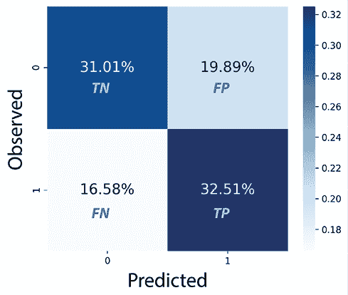

图 6.1：预测再犯风险（compas_score）和真实情况（is_recid）之间的混淆矩阵

*图 6.1* 显示，COMPAS 模型的预测性能并不很好，尤其是如果我们假设刑事司法决策者正在将中等或高风险评估视为表面价值。它还告诉我们，假阳性（FP）和假阴性（FN）的发生率相似。尽管如此，像混淆矩阵这样的简单可视化会掩盖人口子群体之间的预测差异。我们可以快速比较两个历史上一直受到美国刑事司法系统不同对待的子群体之间的差异。为此，我们首先将我们的 DataFrame 细分为两个 DataFrame：一个用于白人（`recidivism_c_df`）和另一个用于非裔美国人（`recidivism_aa_df`）。然后我们可以为每个 DataFrame 生成混淆矩阵，并使用以下代码将它们并排绘制：

```py
recidivism_c_df =\
recidivism_df[recidivism_df['race_Caucasian'] == 1]
recidivism_aa_df =\
recidivism_df[recidivism_df['race_African-American'] == 1]
_ = mldatasets.compare_confusion_matrices(
    recidivism_c_df.is_recid,
    recidivism_c_df.compas_score,
    recidivism_aa_df.is_recid,
    recidivism_aa_df.compas_score,
    'Caucasian',
    'African-American',
    compare_fpr=True
) 
Figure 6.2. At a glance, you can tell that it’s like the confusion matrix for Caucasians has been flipped 90 degrees to form the African American confusion matrix, and even then, it is still less unfair. Pay close attention to the difference between FPs and TNs. As a Caucasian defendant, a result is more than half as likely to be an FP than a TN, but as an African American, it is a few percentage points more likely. In other words, an African American defendant who doesn’t re-offend is predicted to be at risk of recidivating more than half of the time:
```

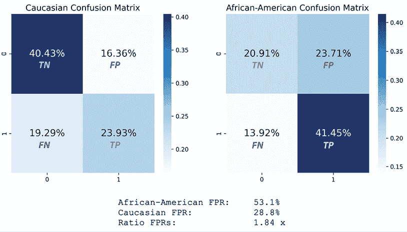

图 6.2：数据集中非洲裔美国人和白人在预测再犯风险（compas_score）和真实情况（is_recid）之间的混淆矩阵比较

我们不是通过查看图表来直观地评估它，而是可以测量**假阳性率**（**FPR**），这是两个度量之间的比率（FP / (FP + TN)），在再犯风险较高的情况下更为常见。

## 数据准备

在我们继续进行建模和解释之前，我们还有最后一步。

由于数据加载时`prepare=True`，我们现在所做的一切就是将数据分为训练集和测试集。像往常一样，设置随机状态以确保所有发现都是可重复的至关重要。然后我们将`y`设置为我们的目标变量（`compas_score`），将`X`设置为除`is_recid`之外的所有其他特征，因为这是真实情况。最后，我们将`y`和`X`分为训练集和测试集，就像我们之前做的那样：

```py
rand = 9
np.random.seed(rand)
y = recidivism_df['compas_score']
X = recidivism_df.drop(
    ['compas_score', 'is_recid'],
    axis=1).copy()
X_train, X_test, y_train, y_test = train_test_split(
    X, y, test_size=0.2, random_state=rand
) 
```

现在，让我们开始吧！

### 模型

首先，让我们快速训练本章将使用的模型。

**代理模型**是一种模拟黑盒模型输出的方法，就像我们在*第四章*中提到的**全局代理模型**一样。那么，它们是同一回事吗？在机器学习中，代理和代理是经常可以互换使用的术语。然而，从语义上讲，代理与替代相关，而代理更多地与表示相关。因此，我们称这些代理模型是为了区分我们没有确切的训练数据。因此，你只能代表原始模型，因为你不能替代它。出于同样的原因，与代理的解读不同，后者最适合简单的模型，而代理最适合复杂的模型，这些模型可以用复杂性来弥补训练数据中的差异。

我们将训练一个**CatBoost**分类器。对于那些不熟悉 CatBoost 的人来说，它是一种高效的提升集成树方法。它与**LightGBM**类似，但使用了一种称为**最小方差抽样**（**MVS**）的新技术，而不是**基于梯度的单侧抽样**（**GOSS**）。与 LightGBM 不同，它以平衡的方式生长树。它被称为 CatBoost，因为它可以自动编码分类特征，并且特别擅长处理过拟合，对分类特征和类别不平衡的处理是无偏的。我们不会过多地详细介绍，但出于这些原因，它被选为这次练习。

作为基于树的模型类别，你可以为`CatBoostClassifier`指定一个最大`深度`值。我们设置了一个相对较高的`学习率`值和一个较低的`迭代`值（默认为 1,000）。一旦我们对模型使用了`fit`，我们就可以用`evaluate_class_mdl`来评估结果：

```py
cb_mdl = CatBoostClassifier(
    iterations=500,
    learning_rate=0.5,
    depth=8
)
fitted_cb_mdl = cb_mdl.fit(
    X_train,
    y_train,
    verbose=False
)
y_train_cb_pred, y_test_cb_prob, y_test_cb_pred = \
mldatasets.evaluate_class_mdl(
    fitted_cb_mdl, X_train, X_test, y_train, y_test
) 
```

你可以在*图 6.3*中欣赏到我们的 CatBoost 模型的`evaluate_class_mdl`输出：

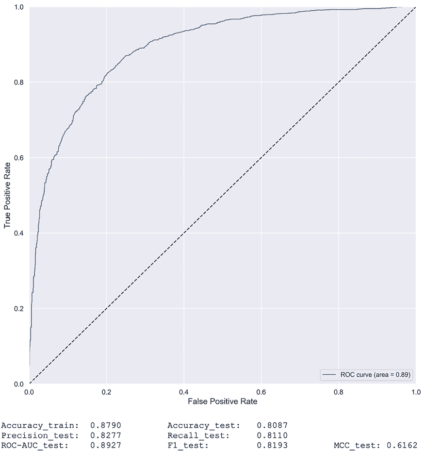

图 6.3：CatBoost 模型的预测性能

从公平性的角度出发，我们更关心假阳性（FPs）而不是假阴性（FNs），因为将一个**无辜**的人关进监狱比让一个**有罪**的人留在街上更不公平。因此，我们应该追求比召回率更高的**精确度**。*图 6.3*证实了这一点，以及一个健康的 ROC 曲线、ROC-AUC 和 MCC。

考虑到它是一个仅用不同但相关的数据近似真实事物的**代理模型**，该模型的预测性能是相当准确的。

### 熟悉我们的“实例”

记者带着一个案例找到你：一个被错误预测有高再犯风险的非洲裔美国被告。这个案例是#`5231`，是你的主要**实例**。由于我们的重点是种族偏见，我们想将其与不同种族的类似案例进行比较。为此，我们找到了案例#`10127`（白人）和#`2726`（西班牙裔）。

我们可以查看这三个实例的数据。由于我们将在本章中多次引用这些实例，让我们首先保存非洲裔美国人(`idx_aa`)、西班牙裔(`idx_h`)和白色人种(`idx_c`)案例的索引。然后，我们可以通过这些索引对测试数据集进行子集划分。由于我们必须确保我们的预测匹配，我们将这个子集化的测试数据集连接到真实标签(`y_test`)和 CatBoost 预测(`y_test_cb_pred`)：

```py
idx_aa = 5231
idx_h = 2726
idx_c = 10127
eval_idxs = X_test.index.isin([idx_aa, idx_h, idx_c])
X_test_evals = X_test[eval_idxs]
eval_compare_df = pd.concat(
    [
        pd.DataFrame(
            {'y':y_test[eval_idxs]},
            index=[idx_c, idx_h, idx_aa]
        ),
        pd.DataFrame(
            {'y_pred':y_test_cb_pred[eval_idxs]},
            index=[idx_c, idx_h, idx_aa]
        ),
        X_test_evals
    ],
    axis=1
).transpose()
eval_compare_df 
```

上一段代码生成了*图 6.4*中的 DataFrame。你可以看出预测与真实标签相匹配，我们主要关注的实例是唯一一个被预测为中等或高风险再犯的实例。除了种族之外，唯一的其他差异是与`c_charge_degree`以及一个微小的年龄差异：

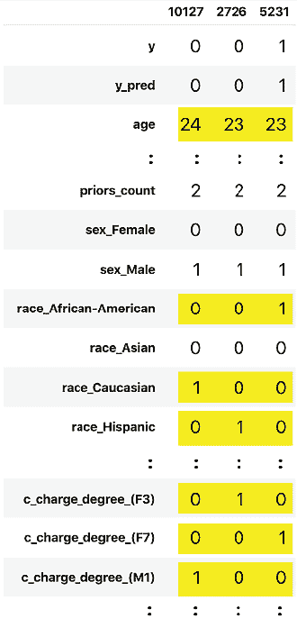

图 6.4：观察#5231、#10127 和#2726 并排展示，特征差异被突出显示

在本章中，我们将密切关注这些差异，以了解它们是否在产生预测差异中发挥了重要作用。我们将涵盖的所有方法都将完善决定或改变代理模型决策，以及可能通过扩展的 COMPAS 模型的决定的图景。现在我们已经完成了设置，我们将继续使用解释方法。

# 理解锚点解释

在*第五章*，*局部模型无关解释方法*中，我们了解到**LIME**在数据集的**扰动**版本上训练一个局部代理模型（具体来说是一个**加权稀疏线性模型**），在**实例邻域**中。结果是，你近似了一个**局部决策边界**，这可以帮助你解释该模型对其的预测。

与 LIME 一样，**锚点**也是从一个模型无关的基于扰动的策略中派生出来的。然而，它们不是关于**决策边界**，而是关于**决策区域**。锚点也被称为**范围规则**，因为它们列出了一些适用于你的实例及其**扰动**邻域的**决策规则**。这个邻域也被称为**扰动空间**。一个重要的细节是规则在多大程度上适用于它，这被称为**精确度**。

想象一下你实例周围的社区。你会期望当你离你的实例越近时，点之间的预测越相似，对吧？所以，如果你有定义这些预测的决策规则，你实例周围的区域越小，你的规则就越精确。这个概念被称为**覆盖率**，它是指你的**扰动空间**中产生特定**精确度**的百分比。

与 LIME 不同，锚点不拟合局部代理模型来解释你选择的实例的预测。相反，它们使用称为**Kullback-Leibler 散度下界和上界置信度**（**KL-LUCB**）的算法探索可能的候选决策规则，该算法源于**多臂老虎机**（**MAB**）算法。

MABs 是一种关于在资源有限的情况下探索所有未知可能性的最大回报的**强化学习算法**家族。该算法起源于理解赌场老虎机玩家如何通过玩多个机器来最大化他们的回报。它被称为多臂老虎机，因为老虎机玩家被称为单臂老虎机。然而，玩家不知道哪台机器会产生最高的回报，不能一次性尝试所有机器，而且资金有限。技巧在于学习如何平衡探索（尝试未知的老虎机）与利用（使用那些你已经有一定理由偏好的机器）。

在锚点的情况下，每个老虎机都是一个潜在的决策规则，回报是它产生的精确度。KL-LUCB 算法使用基于分布之间的**Kullback-Leibler 散度**的置信区域，依次找到具有最高精确度的决策规则，同时效率很高。

## 使用证据准备锚点和反事实解释

需要执行几个小步骤来帮助 `alibi` 库生成人类友好的解释。第一步与预测有关，因为模型可能输出 1 或 0，但通过名称理解预测更容易。为了帮助我们，我们需要一个包含类名的列表，其中 0 位置匹配我们的负类名，1 匹配正类名：

```py
class_names = ['Low Risk', 'Medium/High Risk'] 
```

接下来，让我们创建一个包含我们主要**感兴趣实例**的 `numpy` 数组并将其打印出来。请注意，单维数组需要扩展（`np.expand_dims`），以便 `alibi` 能够理解：

```py
X_test_eval = np.expand_dims(
    X_test.values[
        X_test.index.get_loc(idx_aa)
    ],
     axis=0
)
print(X_test_eval) 
```

上述代码输出一个包含 21 个特征的数组，其中 12 个是**独热编码**（**OHE**）的结果：

```py
[[23  0  0  0  2  0  1  1  0  ... 0  1  0  0  0  0]] 
```

当你有独热编码类别时，制作人类友好的解释会出现问题。对于机器学习模型和解释器来说，每个独热特征都是独立的。然而，对于解释结果的人类来说，它们会聚集成它们原始特征的类别。

`alibi`库有几个实用函数来处理这个问题，例如`ohe_to_ord`，它将一个独热编码的实例转换为序数格式。要使用此函数，我们首先定义一个字典`(cat_vars_ohe)`，告诉`alibi`我们的特征中分类变量的位置以及每个变量有多少个类别。例如，在我们的数据中，性别从第 5 个索引开始，有两个类别，这就是为什么我们的`cat_vars_ohe`字典从`5: 2`开始。一旦你有了这个字典，`ohe_to_ord`就可以将你的实例（`X_test_eval`）转换为序数格式，其中每个分类变量占据一个单独的特征。这个实用函数对于 Alibi 的逆事实解释非常有用，因为解释器需要这个字典来映射分类特征：

```py
cat_vars_ohe = {5: 2, 7: 6, 13: 8}
print(ohe_to_ord(X_test_eval, cat_vars_ohe)[0]) 
```

上述代码输出了以下数组：

```py
[[23  0  0  0  2  1  0  3]] 
```

当数据处于序数格式时，Alibi 需要一个字典，为每个类别提供名称以及特征名称列表：

```py
category_map = {
    5: ['Female', 'Male'],
    6: [
        'African-American',
        'Asian',
        'Caucasian',
        'Hispanic',
        'Native American',
        'Other'
    ],
    7: [
        'Felony 1st Degree',
        'Felony 2nd Degree',
        'Felony 3rd Degree',
        'Felony 7th Degree',
        'Misdemeanor 1st Degree',
        'Misdemeanor 2nd Degree',
        'Misdemeanor 3rd Degree',
        'Other Charge Degree'
    ]
}
feature_names = [
    'age',
    'juv_fel_count',
    'juv_misd_count',
    'juv_other_count',
    'priors_count',
    'sex',
    'race',
    'c_charge_degree'
] 
```

然而，Alibi 的锚点解释使用的是提供给我们的模型的数据。我们正在使用 OHE 数据，因此我们需要一个针对该格式的类别映射。当然，OHE 特征都是二进制的，因此它们每个只有两个“类别”：

```py
category_map_ohe = {
    5: ['Not Female', 'Female'],
    6: ['Not Male', 'Male'],
    7:['Not African American', 'African American'],
    8:['Not Asian', 'Asian'], 9:['Not Caucasian', 'Caucasian'],
    10:['Not Hispanic', 'Hispanic'],
    11:['Not Native American', 'Native American'],
    12:['Not Other Race', 'Other Race'],
    19:['Not Misdemeanor 3rd Deg', 'Misdemeanor 3rd Deg'],
    20:['Not Other Charge Degree', 'Other Charge Degree']
} 
```

## 锚点解释的局部解释

所有 Alibi 解释器都需要一个`predict`函数，因此我们为我们的 CatBoost 模型创建了一个名为`predict_cb_fn`的`lambda`函数。请注意，我们正在使用`predict_proba`来获取分类器的概率。然后，为了初始化`AnchorTabular`，我们还提供了我们的特征名称，这些名称与我们的 OHE 数据集和类别映射（`category_map_ohe`）中的名称一致。一旦初始化完成，我们就用我们的训练数据来拟合它：

```py
predict_cb_fn = lambda x: fitted_cb_mdl.predict_proba(x)
anchor_cb_explainer = AnchorTabular(
    predict_cb_fn,
    X_train.columns,
    categorical_names=category_map_ohe
)
anchor_cb_explainer.fit(X_train.values) 
```

在我们利用解释器之前，检查锚点“是否稳固”是一个好的实践。换句话说，我们应该检查 MAB 算法是否找到了有助于解释预测的决策规则。为了验证这一点，你使用`predictor`函数来检查预测结果是否与这个实例预期的结果相同。目前，我们使用`idx_aa`，这是非洲裔美国被告的情况：

```py
print(
    'Prediction: %s' %  class_names[anchor_cb_explainer.
    predictor(X_test.loc[idx_aa].values)[0]]
) 
```

上述代码输出了以下内容：

```py
Prediction: Medium/High Risk 
```

我们可以继续使用`explain`函数来为我们实例生成解释。我们可以将我们的精确度阈值设置为`0.85`，这意味着我们期望在锚定观察到的预测至少 85%的时间与我们的实例相同。一旦我们有了解释，我们还可以打印锚点以及它们的精确度和覆盖率：

```py
anchor_cb_explanation = anchor_cb_explainer.explain(
    X_test.loc[idx_aa].values,threshold=0.85, seed=rand
)
print('Anchor: %s' % (' AND'.join(anchor_cb_explanation.anchor)))
print('Precision: %.3f' % anchor_cb_explanation.precision)
print('Coverage: %.3f' % anchor_cb_explanation.coverage) 
```

以下输出是由上述代码生成的。你可以看出`age`、`priors_count`和`race_African-American`是精确度为 86%的因素。令人印象深刻的是，这条规则适用于几乎三分之一的扰动空间实例，覆盖率为 0.29：

```py
Anchor: age <= 25.00 AND
    priors_count > 0.00 AND
    race_African-American = African American
Precision: 0.863
Coverage: 0.290 
```

我们可以尝试相同的代码，但将精确度阈值提高 5%，设置为 0.9。我们观察到与上一个示例中生成的相同三个锚点，以及另外三个额外的锚点：

```py
Anchor: age <= 25.00 AND
    priors_count > 0.00 AND
    race_African-American = African American AND
    c_charge_degree_(M1) = Not Misdemeanor 1st Deg AND
    c_charge_degree_(F3) = Not Felony 3rd Level AND
    race_Caucasian = Not Caucasian
Precision: 0.903
Coverage: 0.290 
```

令人惊讶的是，尽管精确度提高了几个百分点，但覆盖率保持不变。在这个精确度水平上，我们可以确认种族是一个重要因素，因为非洲裔美国人是一个锚点，但非白人也是如此。另一个因素是`c_charge_degree`。解释表明，被指控为一级轻罪或三级重罪会更好。可以理解的是，七级重罪比这两个罪更严重。

另一种理解模型为何做出特定预测的方法是寻找具有相反预测的相似数据点，并检查为什么做出了替代决策。决策边界跨越了这两个点，因此对比边界两边的决策解释是有帮助的。这次，我们将使用`idx_c`，这是白人被告的案例，阈值为 85%，并输出以下锚点：

```py
Anchor: priors_count <= 2.00 AND
    race_African-American = Not African American AND
    c_charge_degree_(M1) = Misdemeanor 1st Deg
Precision: 0.891 
Coverage: 0.578 
```

第一个锚点是`priors_count <= 2.00`，但在边界另一侧，前两个锚点是`age <= 25.00`和`priors_count > 0.00`。换句话说，对于一个 25 岁或以下的非洲裔美国人，任何数量的先例都足以将他们归类为有中等/高风险的再犯可能性（86%的时间）。另一方面，如果一个白人没有超过两个先例，并且没有被指控为一级轻罪，那么他们将被预测为低风险（89%的时间和 58%的覆盖率）。这些决策规则表明，基于种族的偏见决策，对不同种族群体应用了不同的标准。双重标准是在原则上情况相同的情况下，应用不同的规则。在这种情况下，`priors_count`的不同规则和缺乏将`age`作为白人的因素构成了双重标准。

我们现在可以尝试一个西班牙裔被告（`idx_h`），以观察是否在这个实例中也发现了双重标准。我们只需运行之前相同的代码，但将`idx_c`替换为`idx_h`：

```py
Anchor: priors_count <= 2.00 AND 
    race_African-American = Not African American AND
    juv_fel_count <= 0.00 AND 
    sex_Male = Male
Precision: 0.851
Coverage: 0.578 
```

对于西班牙裔被告的解释证实了`priors_count`的不同标准，并且由于有一个锚点用于不是非洲裔美国人，另一个锚点用于西班牙裔，所以“种族”继续是一个强有力的因素。

对于具体的模型决策，锚点解释回答了“为什么？”这个问题。然而，通过比较只有细微差别但预测结果不同的相似实例，我们已经探讨了“如果...会怎样？”这个问题。在下一节中，我们将进一步探讨这个问题。

# 探索反事实解释

**反事实**是人类推理的一个基本组成部分。我们中有多少人低声说过“如果我做了*X*而不是这样，我的结果*y*就会不同”？总有一些事情，如果我们做得不同，可能会导致我们更喜欢的结果！

在机器学习的结果中，你可以利用这种推理方式来制作极其人性化的解释，我们可以用需要改变什么才能得到相反结果（**反事实类别**）来解释决策。毕竟，我们通常对了解如何使负面结果变得更好感兴趣。例如，你如何让你的贷款申请被批准，或者将你的心血管疾病风险从高降低到低？然而，希望这些问题的答案不是一大串需要改变的事情。你更喜欢最小的改变数量来改变你的结果。

关于公平性，反事实是一种重要的解释方法，特别是在涉及我们无法改变或不应改变的因素时。例如，如果你和你同事做完全相同的工作，并且拥有相同的工作经验水平，你期望得到相同的薪水，对吧？如果你和你的配偶拥有相同的资产和信用记录，但信用评分不同，你不得不怀疑这是为什么。这和性别、种族、年龄，甚至是政治派别有关吗？无论是薪酬、信用评级还是再犯风险模型，你希望类似的人得到类似对待。

找到反事实并不特别困难。我们只需要稍微改变我们的“目标实例”直到它改变结果。也许数据集中已经有一个类似的实例！

事实上，可以说我们在上一节中用锚点考察的三个实例彼此之间非常接近，可以视为对方的反事实，除了白人和西班牙裔案例，它们有相同的结局。但白人和西班牙裔实例是通过寻找与目标实例具有相同犯罪历史但不同种族的数据点来“*挑选*”的。也许通过比较相似点，除了种族之外，我们这样限制了范围，从而证实了我们希望证实的事情，那就是种族对模型的决策有影响。

这是一个**选择偏差**的例子。毕竟，反事实本质上是具有选择性的，因为它们关注几个特征的变化。即使只有几个特征，也有许多可能的排列组合会改变结果，这意味着一个点可能有数百个反事实。而且，并非所有这些都会讲述一个一致的故事。这种现象被称为**罗生门效应**。它是以一部著名的日本谋杀悬疑电影命名的。正如我们期待谋杀悬疑电影中的情况一样，目击者对所发生的事情有不同的回忆。但同样，正如伟大的侦探被训练去寻找与犯罪现场相关的线索（即使这与他们的直觉相矛盾）一样，反事实不应该“挑选”，因为它们方便地讲述了我们希望它们讲述的故事。

幸运的是，有一些算法方法可以在无偏的方式下寻找反事实实例。通常，这些方法涉及找到具有不同结果的最近点，但测量点之间距离的方法有很多。首先，有**L1**距离（也称为**曼哈顿距离**）和**L2**距离（也称为**欧几里得距离**），以及其他许多方法。但还有关于距离归一化的一个问题，因为并非所有特征都具有相同的尺度。否则，它们会对尺度较小的特征（如独热编码的特征）产生偏见。也有许多归一化方案可供选择。你可以使用**标准差**、**最小-最大缩放**，甚至**中值绝对偏差**[9]。

在本节中，我们将解释并使用一种高级的反事实寻找方法。然后，我们将探索谷歌的**假设工具**（**WIT**）。它有一个简单的基于 L1 和 L2 的反事实寻找器，虽然它在数据集上有限制，但通过其他有用的解释功能来弥补这一点。

## 由原型引导的反事实解释

最复杂反事实寻找算法做以下事情：

+   **损失**: 这些方法利用一个**损失函数**来帮助我们优化寻找与我们的**感兴趣实例**最接近的反事实。

+   **扰动**: 这些通常在类似于锚点的**扰动空间**中操作，尽可能少地改变特征。请注意，反事实不必是数据集中的真实点。那会限制得太厉害。反事实存在于可能性的领域，而不是必然已知的领域。

+   **分布**：然而，反事实必须是现实的，因此可解释的。例如，损失函数可以帮助确定`年龄 < 0`本身就足以使任何中/高风险实例变为低风险。这就是为什么反事实应该靠近你的数据的统计分布，特别是*类特定分布*。它们也不应该对较小规模的特性，即分类变量有偏见。

+   **速度**：这些运行足够快，可以在现实场景中有用。

Alibi 的**原型引导的反事实**(`CounterFactualProto`)具有所有这些特性。它有一个损失函数，包括 L1 (*Lasso*) 和 L2 (*Ridge*) 正则化作为线性组合，就像**朴素弹性网络**一样 ![img/B18406_06_001.png]，但只在 L1 项上有权重()。这个算法的巧妙之处在于它可以（可选地）使用一个*自动编码器*来理解分布。我们将在*第七章*，*可视化卷积神经网络*中利用它。然而，这里重要的是要注意，自动编码器通常是一类神经网络，它学习训练数据的压缩表示。这种方法结合了来自自动编码器的损失项，例如最近的原型。原型是反事实类降维后的表示。

如果没有自动编码器可用，算法将使用一个常用于多维搜索的树（*k-d trees*）。使用这棵树，算法可以有效地捕获类分布并选择最近的原型。一旦它有了原型，扰动就会由它引导。在损失函数中引入原型损失项确保产生的扰动足够接近反事实类的分布中的原型。许多建模类和解释方法忽略了处理连续和分类特征不同的重要性。

`CounterFactualProto`可以使用两种不同的距离度量来计算分类变量的类别之间的成对距离：**修改后的值差异度量**(**MVDM**)和**基于关联的距离度量**(**ABDM**)，甚至可以结合两者。`CounterFactualProto`确保有意义的反事实的另一种方式是通过限制排列特征到预定义的范围内。我们可以使用特征的最小值和最大值来生成一个数组元组(`feature_range`)：

```py
feature_range = (
    X_train.values.min(axis=0).reshape(1,21).astype(np.float32),\
    X_train.values.max(axis=0).reshape(1,21).astype(np.float32)
)
print(feature_range) 
```

上述代码输出两个数组——第一个包含所有特征的最小值，第二个包含所有特征的最大值：

```py
(array([[18.,  0.,  ... , 0.,  0.,  0.]], dtype=float32), array([[96., 20., ... ,  1.,  1.,  1.]], dtype=float32)) 
```

我们现在可以使用`CounterFactualProto`实例化一个解释器。作为参数，它需要模型的`predict`函数(`predict_cb_fn`)、你想要解释的实例的形状(`X_test_eval.shape`)、要执行的优化迭代次数的最大值(`max_iterations`)以及扰动实例的特征范围(`feature_range`)。可以选择许多超参数，包括应用于 L1 损失的权重( `beta`)和应用于原型损失的θ权重(`theta`)。此外，当自动编码器模型未提供时，你必须指定是否使用*k-d 树*(`use_kdtree`)。一旦实例化了解释器，你将其拟合到测试数据集。我们指定分类特征的距离度量(`d_type`)为 ABDM 和 MVDM 的组合：

```py
cf_cb_explainer = CounterFactualProto(
    predict_cb_fn,
    c_init=1,
    X_test_eval.shape,
    max_iterations=500,
    feature_range=feature_range,
    beta=.01,
    theta=5,
    use_kdtree=True
)
cf_cb_explainer.fit(X_test.values, d_type='abdm-mvdm') 
```

使用解释器创建解释与使用主播类似。只需将实例(`X_test_eval`)传递给`explain`函数即可。然而，输出结果并不那么直接，主要是因为特征在 one-hot 编码和序数之间的转换，以及特征之间的交互。Alibi([`docs.seldon.io/projects/alibi/`](https://docs.seldon.io/projects/alibi/))的文档中有一个详细的示例，说明了如何进行此操作。

我们将使用一个名为`describe_cf_instance`的实用函数来完成这项工作，该函数使用*感兴趣的实例*(`X_test_eval`)、解释(`cf_cb_explanation`)、类名(`class_names`)、one-hot 编码的类别位置(`cat_vars_ohe`)、类别映射(`category_map`)和特征名称(`feature_names`)：

```py
cf_cb_explanation = cf_cb_explainer.explain(X_test_eval) mldatasets.describe_cf_instance(
    X_test_eval,
    cf_cb_explanation,
    class_names,
    cat_vars_ohe,
    category_map,
    feature_names
) 
```

下面的输出是由前面的代码生成的：

```py
Instance Outcomes and Probabilities
-----------------------------------------------
       original:  Medium/High Risk
                  [0.46732193 0.53267807]
counterfactual:  Low Risk
                  [0.50025815 0.49974185]
Categorical Feature Counterfactual Perturbations
------------------------------------------------
                sex:  Male  -->  Female
               race:  African-American  -->  Asian
    c_charge_degree:  Felony 7th Degree  -->  Felony 1st Degree
Numerical Feature Counterfactual Perturbations
------------------------------------------------
       priors_count:  2.00  -->  1.90 
```

你可以从输出中看出，*感兴趣的实例*（“原始”）有 53.26%的概率属于*中/高风险*，但反事实几乎在*低风险*一边，只有 50.03%！我们希望看到的是稍微偏向另一边的反事实，因为这可能意味着它与我们*感兴趣的实例*尽可能接近。它们之间有四个特征差异，其中三个是分类的（`sex`、`race`和`c_charge_degree`）。第四个差异是`priors_count`数值特征，由于解释器不知道它是离散的，因此将其视为连续的。无论如何，关系应该是*单调的*，这意味着一个变量的增加与另一个变量的减少或增加一致。在这种情况下，较少的先验应该总是意味着较低的风险，这意味着我们可以将 1.90 解释为 1，因为如果少 0.1 个先验有助于降低风险，那么整个先验也应该如此。

从 `CounterFactualProto` 的输出中得出的更有力的见解是，两个人口统计特征出现在与该特征最接近的反事实中。其中一个是通过一种旨在遵循我们类别统计分布的方法发现的，这种方法不会对特定类型的特征产生偏见或偏袒。尽管看到亚洲女性在我们的反事实中很令人惊讶，因为它不符合白人男性得到优先待遇的叙述，但意识到 `种族` 在反事实中出现的任何情况都令人担忧。

Alibi 库有几种反事实发现方法，包括一种利用强化学习的方法。Alibi 还使用 *k-d 树* 来计算其信任分数，我也强烈推荐！信任分数衡量任何分类器与修改后的最近邻分类器之间的协议。背后的推理是，一个模型的预测应该在局部层面上保持一致，才能被认为是可信的。换句话说，如果你和你的邻居在各个方面几乎都一样，为什么你会被不同对待？

## WIT 中的反事实实例以及更多

Google 的 WIT 是一个非常通用的工具。它需要的输入或准备非常少，并在您的 Jupyter 或 Colab 笔记本中以交互式仪表板的形式打开，有三个选项卡：

+   **数据点编辑器**：为了可视化您的数据点，编辑它们，并解释它们的预测。

+   **性能**：要查看高级模型性能指标（适用于所有回归和分类模型）。对于二元分类，此选项卡称为 **性能和公平性**，因为除了高级指标外，还可以比较您数据集基于特征的切片之间的预测公平性。

+   **特征**：查看一般特征统计。

由于 **特征** 选项卡与模型解释无关，我们将只在本节中探索前两个。

### 配置 WIT

可选地，我们可以在 WIT 中通过创建归因来丰富我们的解释，这些归因是解释每个特征对每个预测贡献多少的值。您可以使用任何方法生成归因，但我们将使用 SHAP。我们在 *第四章*，*全局模型无关解释方法* 中首先介绍了 SHAP。由于我们将在 WIT 仪表板中解释我们的 CatBoost 模型，因此最合适的 SHAP 解释器是 `TreeExplainer`，但 `DeepExplainer` 适用于神经网络（`KernelExplainer` 适用于两者）。要初始化 `TreeExplainer`，我们需要传递拟合的模型（`fitted_cb_mdl`）：

```py
shap_cb_explainer = shap.TreeExplainer(fitted_cb_mdl) 
```

WIT 需要数据集中的所有特征（包括标签）。我们将使用测试数据集，因此您可以连接 `X_test` 和 `y_test`，但即使这两个也排除了地面真相特征（`is_recid`）。获取所有这些特征的一种方法是从 `recidivism_df` 中提取测试数据集的索引（`y_test.index`）。WIT 还需要我们的数据和列的列表格式，以便我们可以将它们保存为变量以供以后使用（`test_np` 和 `cols_l`）。

最后，对于预测和归因，我们需要移除我们的真实情况（`is_recid`）和分类标签（`compas_score`），所以让我们保存这些列的索引（`delcol_idx`）：

```py
test_df = recidivism_df.loc[y_test.index]
test_np = test_df.values
cols_l = test_df.columns
delcol_idx = [
    cols_l.get_loc("is_recid"),
    cols_l.get_loc("compas_score")
] 
```

WIT 有几个用于自定义仪表板的有用函数，例如设置自定义距离度量（`set_custom_distance_fn`）、显示类名而不是数字（`set_label_vocab`）、设置自定义`predict`函数（`set_custom_predict_fn`）以及第二个用于比较两个模型的`predict`函数（`compare_custom_predict_fn`）。

除了`set_label_vocab`之外，我们还将只使用自定义的`predict`函数（`custom_predict_with_shap`）。它只需要一个包含你的`examples_np`数据集的数组并产生一些预测（`preds`）。然而，我们首先必须移除那些我们想在仪表板中显示但未用于训练的特征（`delcol_idx`）。这个函数的输出是一个字典，其中预测存储在`predictions`键中。但我们还希望有一些归因，这就是为什么我们需要在字典中有一个`attributions`键。因此，我们使用 SHAP 解释器生成`shap_values`，这是一个`numpy`数组。然而，归因需要是一个字典列表，以便 WIT 仪表板能够理解。为此，我们迭代`shap_output`并将每个观察的 SHAP 值数组转换为字典（`attrs`），然后将这个字典追加到一个列表（`attributions`）中：

```py
def custom_predict_with_shap(examples_np):
    #For shap values, we only need the same features
    #that were used for training
    inputs_np = np.delete(np.array(examples_np),delcol_idx,axis=1)
    #Get the model's class predictions
    preds = predict_cb_fn(inputs_np)
    #With test data, generate SHAP values which converted
    #to a list of dictionaries format
    keepcols_l = [c for i, c in enumerate(cols_l)\
                  if i not in delcol_idx]
    shap_output = shap_cb_explainer.shap_values(inputs_np)
    attributions = []
    for shap in shap_output:
        attrs = {}
        for i, col in enumerate(keepcols_l):
            attrs[col] = shap[i]
        attributions.append(attrs)  
    #Prediction function must output predictions/attributions
    #in dictionary
    output = {'predictions': preds, 'attributions': attributions} 
    return output 
```

在我们构建 WIT 仪表板之前，重要的是要注意，为了在仪表板中找到我们的*感兴趣实例*，我们需要知道它在 WIT 提供的`numpy`数组中的位置，因为这些没有像`pandas`数据框那样的索引。为了找到位置，我们只需要向`get_loc`函数提供索引：

```py
print(y_test.index.get_loc(5231)) 
```

前面的代码输出为`2910`，因此我们可以注意这个数字。现在构建 WIT 仪表板相当直接。我们首先使用测试数据集（以`numpy`格式`test_np`）和我们的特征列表（`cols_l`）初始化一个配置（`WitConfigBuilder`）。这两个都通过`tolist()`转换为列表。然后，我们使用`set_custom_predict_fn`设置我们的自定义`predict`函数以及我们的目标特征（`is_recid`）并提供我们的类名。这次我们将使用真实情况来评估公平性。一旦配置初始化，小部件（`WitWidget`）就会用它来构建仪表板。你可以选择提供高度（默认为 1,000 像素）：

```py
wit_config_builder = WitConfigBuilder(
    test_np.tolist(),
    feature_names=cols_l.tolist()
).set_custom_predict_fn(custom_predict_with_shap
).set_target_feature("is_recid").set_label_vocab(class_names)
WitWidget(wit_config_builder, height=800) 
```

### 数据点编辑器

在*图 6.5*中，你可以看到带有三个标签页的 WIT 仪表板。我们将首先探索第一个标签页（**数据点编辑器**）。它左侧有**可视化**和**编辑**面板，右侧可以显示**数据点**或**部分依赖图**。当你选择**数据点**时，你可以使用右上角的控制（高亮区域*A*）以多种方式可视化数据点。我们在*图 6.5*中设置如下：

+   **分箱** | **X 轴**：`c_charge_degree_(F7)`

+   **分箱** | **Y 轴**：`compas_score`

+   **按**：`race_African-American`

其他所有内容保持不变。

这些设置导致我们的所有数据点都被整齐地组织成两行两列，并按非洲裔美国人或非非洲裔美国人进行着色编码。右侧列是为那些具有 7 级电荷程度的个体，而上方行是为那些具有*中等/高风险* COMPAS 分数的个体。我们可以通过点击最右上方的项目来查找这个子组（*B*）中的数据点`2910`。它应该出现在**编辑**面板（*C*）中。有趣的是，这个数据点的 SHAP 归因对于`age`是`race_African-American`的三倍。然而，种族整体在重要性上仍然排在年龄之后。此外，请注意，在**推断**面板中，您可以看到*中等/高风险*的预测概率约为 83%：

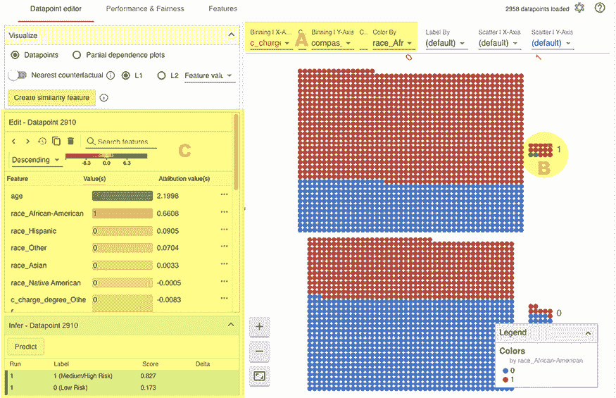

图 6.5：WIT 仪表板以及我们感兴趣的实例

WIT 可以使用 L1 或 L2 距离找到最近的反事实。它可以使用特征值或归因来计算距离。如前所述，如果您将其添加到配置中，WIT 还可以包含一个自定义的距离查找函数。目前，我们将选择**L2**和**特征值**。在*图 6.6*中，这些选项出现在高亮的*A*区域。一旦您选择了一个距离度量并启用了**最近的反事实**，它就会与我们的*实例实例*（区域*B*）并排显示，并比较它们的预测，如图*图 6.6*（区域*C*）所示。您可以通过**绝对归因**对特征进行排序，以便更清晰地了解局部层面的特征重要性。反事实仅比我们感兴趣的实例大 3 年，但没有先验值，而是有两个，但这足以将**中等/高风险**降低到近 5%：

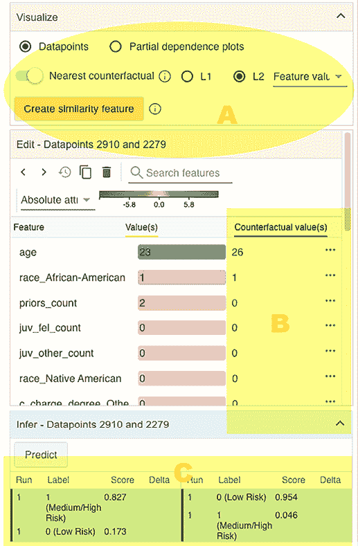

图 6.6：如何在 WIT 中找到最近的反事实

当我们的*实例实例*和反事实都保持选中状态时，我们可以将它们与其他所有点一起可视化。通过这样做，您可以从局部解释中获得见解，并为全局理解创造足够的内容。例如，让我们将我们的可视化设置更改为以下内容：

+   **分箱** | **X 轴**：`推理标签`

+   **分箱** | **Y 轴**：`(无)`

+   **散点图** | **X 轴**：`age`

+   **散点图** | **Y 轴**：`priors_count`

其他所有内容保持不变。

这种可视化的结果是*图 6.7*所展示的。您可以看到，**低风险**箱中的点倾向于在`priors_count`的较低端徘徊。两个箱体都表明`prior_count`和`年龄`有轻微的相关性，尽管这在**中/高风险**箱中更为明显。然而，最有趣的是，与**低风险**箱中的数据点相比，在`年龄`为 18-25 岁且`priors_count`低于三的非洲裔美国人数据点的纯粹密度被认为是**中/高风险**。这表明，对于非洲裔美国人来说，较低的`年龄`和较高的`priors_count`比其他人更容易增加风险：

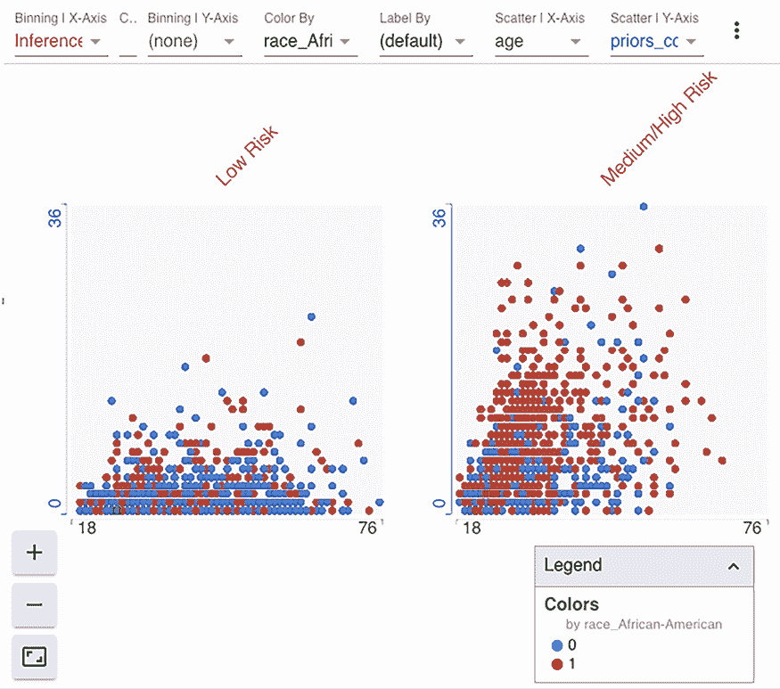

图 6.7：在 WIT 中可视化年龄与 priors_count 的关系

我们可以通过编辑数据点来尝试创建自己的反事实。当我们把`priors_count`减少到一的时候会发生什么？这个问题的答案在*图 6.8*中展示。一旦您做出更改并点击**推断**面板中的**预测**按钮，它将在**推断**面板的最后预测历史中添加一个条目。您可以在**运行#2**中看到，风险几乎降低到 33.5%，下降了近 50%！

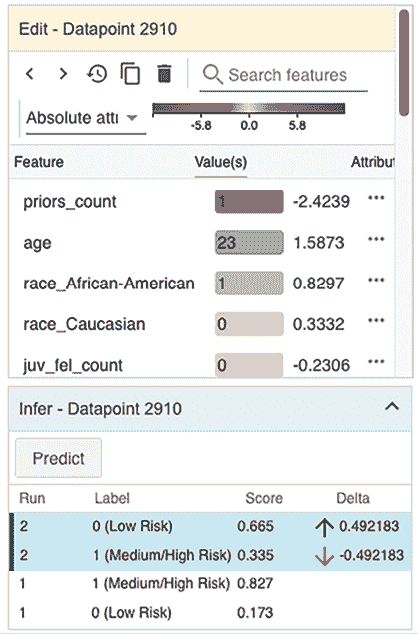

图 6.8：在 WIT 中编辑数据点以减少 priors_count

现在，如果`年龄`只比之前多 2 年，但有两次先验，会发生什么？在*图 6.9*中，**运行#3**告诉你它几乎达到了**低风险**评分：

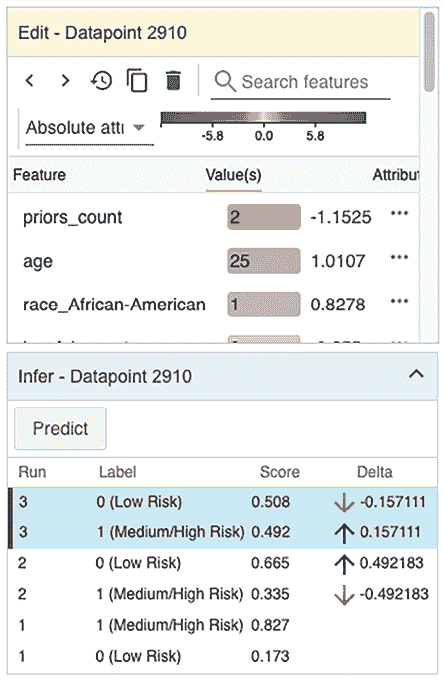

图 6.9：在 WIT 中编辑数据点以增加年龄

**数据点编辑器**标签页还具有另一个功能，即**部分依赖图**，这在*第四章*，*全局模型无关解释方法*中有所介绍。如果您点击此单选按钮，它将修改右侧面板以类似于*图 6.10*的外观。默认情况下，如果选择了一个数据点，PDPs 是局部的，意味着它们与所选数据点相关。但您可以切换到全局。无论如何，最好按变化排序图表，就像在*图 6.10*中那样，其中`年龄`和`priors_count`变化最大。有趣的是，这两个变量都不是单调的，这没有意义。模型应该学会`priors_count`的增加应始终增加风险。当`年龄`减少时，情况应该相同。毕竟，学术研究表明，犯罪倾向于在 20 多岁时达到顶峰，而较高的先验会增加再犯的可能性。这两个变量之间的关系也已被充分理解，因此，也许一些数据工程和单调约束可以确保模型与已知现象一致，而不是学习导致不公平的数据不一致性。我们将在*第十二章*，*单调约束和模型调优以提高可解释性*中介绍这一点：

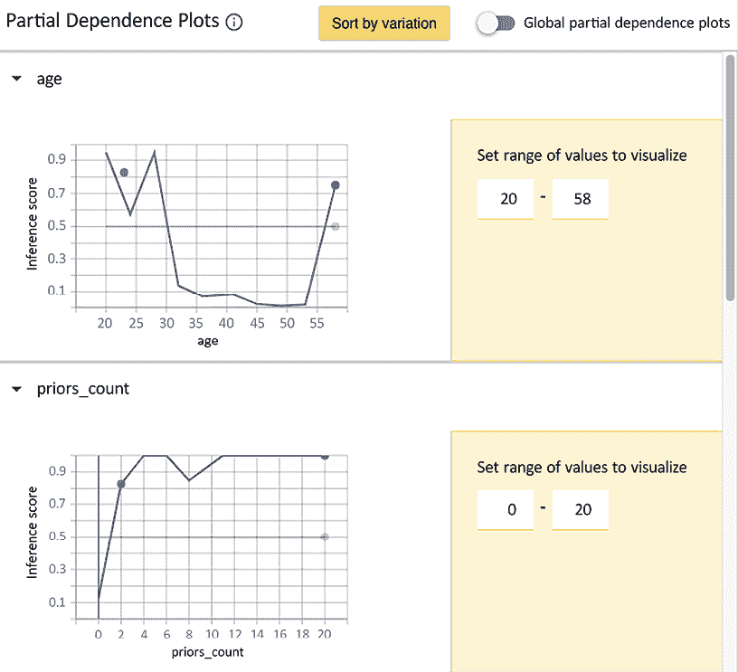

图 6.10：年龄和先验计数局部部分依赖图

对于已经训练好的模型，有没有什么方法可以提高其公平性？确实有。**性能与公平性**选项卡可以帮助你做到这一点。

### 性能与公平性

当你点击**性能与公平性**选项卡时，你会看到它左侧有**配置**和**公平性**面板。在右侧，你可以探索模型的总体性能（见*图 6.11*）。在这个面板的上部，有**误报率（%）**、**漏报率（%）**、**准确率（%）**和**F1**字段。如果你展开面板，它会显示 ROC 曲线、PR 曲线、混淆矩阵和平均归因——Shapley 值的平均值。我们在本书的前几章中直接或间接地介绍了这些术语，除了 PR 曲线。**精确率-召回率**（**PR**）与 ROC 曲线非常相似，但它绘制的是精确率对召回率，而不是 TPR 对 FPR。在这个图中，预期精确率会随着召回率的降低而降低。与 ROC 不同，当线接近*x*轴时，它被认为比抛硬币还差，它最适合不平衡分类问题：

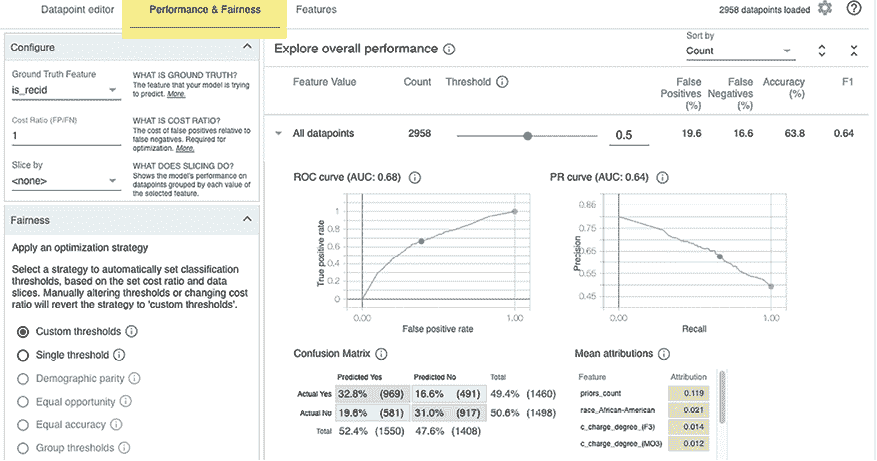

图 6.11：性能与公平性选项卡初始视图

一个分类模型将输出一个观察值属于某个类别标签的概率。我们通常将所有大于或等于 0.5 的观察值归为正类。否则，我们预测它属于负类。这个阈值被称为**分类阈值**，你不必总是使用标准的 0.5。

在许多情况下，进行**阈值调整**是合适的。其中一个最令人信服的原因是不平衡的分类问题，因为通常模型只优化准确率，但最终召回率或精确度不佳。调整阈值将提高你最关心的指标：

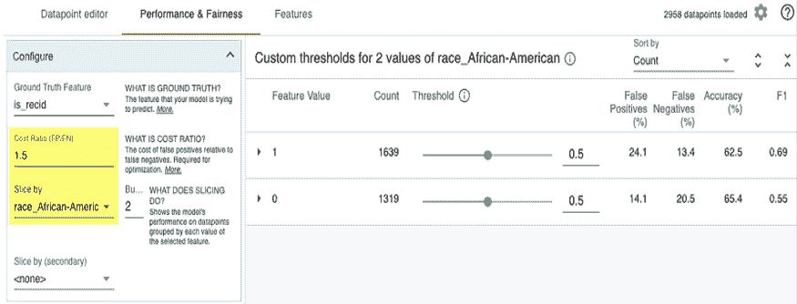

图 6.12：按种族划分的性能指标 _African-American

调整阈值的另一个主要原因是公平性。为此，你需要检查你最关心的指标在不同数据切片中的表现。在我们的案例中，**假阳性百分比**是我们最能感受到不公平的地方。例如，看看*图 6.12*。在**配置**面板中，我们可以通过`race_African-American`来切片数据，在其右侧，我们可以看到本章开头观察到的结果，即非洲裔美国人的 FPs 显著高于其他群体。解决这个问题的一种方法是通过自动优化方法，如**人口统计平衡**或**平等机会**。如果你要使用其中之一，最好调整**成本比率（FP/FN）**来告诉优化器 FP 比 FN 更有价值：

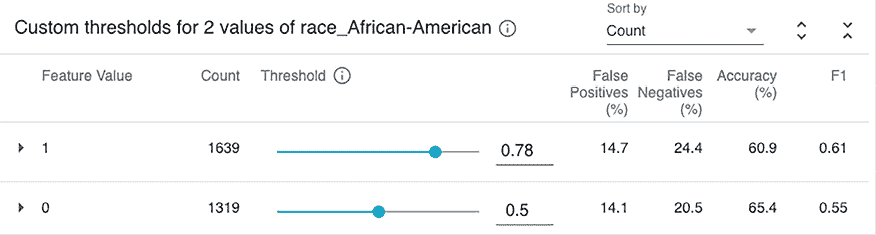

图 6.13：调整按种族 _African-American 划分的数据集的分类阈值

我们还可以使用默认的**自定义阈值**设置手动调整阈值（参见*图 6.13*）。对于这些切片，如果我们想要与我们的 FPs（假阳性）近似相等，我们应该将`race_African-American=1`时的阈值设为 0.78。缺点是对于这个群体，FNs（假阴性）会增加，无法在那一端实现平衡。成本比率可以帮助确定 14.7%的 FPs 是否足以证明 24.4%的 FNs 是合理的，但要做到这一点，我们必须了解平均成本。我们将在*第十一章*，*偏差缓解和因果推断方法*中进一步探讨概率校准方法。

# 任务完成

本章的任务是查看在预测特定被告是否会再犯时是否存在不公平的偏见。我们证明了非洲裔美国被告的 FPR（假阳性率）是白人被告的 1.87 倍。这种差异通过 WIT（加权集成测试）得到证实，表明所讨论的模型更有可能基于种族错误地将正类分类。然而，这是一个全局解释方法，所以它没有回答我们关于特定被告的问题。顺便提一下，在*第十一章*，*偏差缓解和因果推断方法*中，我们将介绍其他用于不公平性的全局解释方法。

为了确定该模型是否对所涉及的被告存在种族偏见，我们利用了锚定和反事实解释——它们都在解释中将种族作为主要特征。锚定以相对较高的精确度和覆盖率完成，而*原型引导的反事实*发现最接近的决定具有不同的种族。尽管如此，在这两种情况下，种族都不是解释中唯一的特征。通常包括以下任何或所有特征：`priors_count`、`age`、`charge_degree`和`sex`。涉及前三个与`race`相关的不一致规则暗示了双重标准，而涉及`sex`则暗示了交叉性。**双重标准**是指规则对不同群体不公平地应用。**交叉性**是指重叠的身份如何创建不同的相互关联的歧视模式。然而，根据学术研究，我们知道所有种族的女性再犯的可能性较低。尽管如此，我们仍需问自己，女性是否具有结构性优势，使她们在这个背景下享有特权。适量的怀疑态度可能会有所帮助，因为当涉及到偏见时，通常存在比表面现象更复杂的动态。底线是，尽管所有其他与种族相关的因素都在相互作用，并且假设我们没有遗漏相关的犯罪学信息，是的——在这个特定的预测中存在种族偏见。

# 摘要

在阅读本章之后，你应该知道如何利用锚定来理解影响分类的决定规则，以及如何使用反事实来掌握预测类别需要改变的内容。你还学习了如何使用混淆矩阵和谷歌的 WIT 来评估公平性。在下一章中，我们将研究**卷积神经网络**（**CNNs**）的解释方法。

# 数据集来源

+   ProPublica 数据存储库，2019，COMPAS 再犯风险评分数据和分析。最初从[`www.propublica.org/datastore/dataset/compas-recidivism-risk-score-data-and-analysis`](https://www.propublica.org/datastore/dataset/compas-recidivism-risk-score-data-and-analysis)检索。

# 进一步阅读

+   Desmarais, S.L., Johnson, K.L., 和 Singh, J.P., 2016, *美国矫正环境中再犯风险评估工具的性能*. 心理服务;13(3):206-222: [`doi.org/10.1037/ser0000075`](https://doi.org/10.1037/ser0000075)

+   Berk, R., Heidari, H., Jabbari, S., Kearns, M., 和 Roth, A., 2017, *刑事司法风险评估中的公平性：现状*. 社会学方法与研究。

+   Angwin, J., Larson, J., Mattu, S.，和 Kirchner, L.，2016，*机器偏见。全国范围内用于预测未来罪犯的软件*：[`www.propublica.org/article/machine-bias-risk-assessments-in-criminal-sentencing`](https://www.propublica.org/article/machine-bias-risk-assessments-in-criminal-sentencing)

+   Ribeiro, M.T., Singh, S., and Guestrin, C., 2018, *锚点：高精度模型无关解释*. AAAI/ACM 人工智能、伦理与社会会议论文集: [`doi.org/10.1609/aaai.v32i1.11491`](https://doi.org/10.1609/aaai.v32i1.11491)

+   Rocque, M., Posick, C., & Hoyle, J., 2015, *年龄与犯罪*. 犯罪与惩罚百科全书，1–8: [`doi.org/10.1002/9781118519639.wbecpx275`](https://doi.org/10.1002/9781118519639.wbecpx275)

+   Dhurandhar, A., Chen, P., Luss, R., Tu, C., Ting, P., Shanmugam, K., and Das, P., 2018, *基于缺失的解释：向相关负样本的对比解释迈进*. NeurIPS: [`arxiv.org/abs/1802.07623`](https://arxiv.org/abs/1802.07623)

+   Jiang, H., Kim, B., and Gupta, M.R., 2018, *是否信任分类器*. NeurIPS: [`arxiv.org/pdf/1805.11783.pdf`](https://arxiv.org/pdf/1805.11783.pdf)

# 在 Discord 上了解更多

要加入本书的 Discord 社区——在那里您可以分享反馈、向作者提问，并了解新书发布——请扫描下面的二维码：

`packt.link/inml`


