# 可视化卷积神经网络

到目前为止，我们只处理了表格数据，以及在*第五章*，*局部模型无关解释方法*中简要提到的文本数据。本章将专门探讨适用于图像的解释方法，特别是训练图像分类器的**卷积神经网络**（**CNN**）模型。通常，深度学习模型被视为黑盒模型的典范。然而，CNN 的一个优点是它很容易进行可视化，因此我们不仅可以可视化结果，还可以通过**激活**来可视化学习过程中的每一步。在所谓的黑盒模型中，解释这些步骤的可能性是罕见的。一旦我们掌握了 CNN 的学习方式，我们将研究如何使用最先进的基于梯度的属性方法，如*显著性图*和*Grad-CAM*来调试类别属性。最后，我们将通过基于扰动的属性方法，如*遮挡敏感性*和`KernelSHAP`来扩展我们的属性调试知识。

这些是我们将要讨论的主要主题：

+   使用传统解释方法评估 CNN 分类器

+   使用基于激活的方法可视化学习过程

+   使用基于梯度的属性方法评估误分类

+   使用基于扰动的属性方法理解分类

# 技术要求

本章的示例使用了`mldatasets`、`pandas`、`numpy`、`sklearn`、`tqdm`、`torch`、`torchvision`、`pytorch-lightning`、`efficientnet-pytorch`、`torchinfo`、`matplotlib`、`seaborn`和`captum`库。如何安装所有这些库的说明在*前言*中。

本章的代码位于此处：[`packt.link/qzUvD`](https://packt.link/qzUvD)。

# 任务

全球每年产生超过 20 亿吨垃圾，预计到 2050 年将增长到超过 35 亿吨。近年来，全球垃圾产量急剧上升和有效废物管理系统需求日益迫切。在高收入国家，超过一半的家庭垃圾是可回收的，在低收入国家为 20%，并且还在上升。目前，大多数垃圾最终都堆放在垃圾填埋场或焚烧，导致环境污染和气候变化。考虑到全球范围内，很大一部分可回收材料没有得到回收，这是可以避免的。

假设可回收垃圾被收集，但仍可能很难且成本高昂地进行分类。以前，废物分类技术包括：

+   通过旋转圆柱形筛网（“摇筛”）按尺寸分离材料

+   通过磁力和磁场分离铁和非铁金属（“涡流分离器”）

+   通过空气按重量分离

+   通过水按密度分离（“沉浮分离”）

+   由人工执行的手动分类

即使对于大型、富裕的城市市政府，有效地实施所有这些技术也可能具有挑战性。为了应对这一挑战，**智能回收系统**应运而生，利用计算机视觉和人工智能高效、准确地分类废物。

智能回收系统的发展可以追溯到 2010 年代初，当时研究人员和革新者开始探索计算机视觉和人工智能改善废物管理流程的潜力。他们首先开发了基本的图像识别算法，利用颜色、形状和纹理等特征来识别废物材料。这些系统主要用于研究环境，商业应用有限。随着机器学习和人工智能的进步，智能回收系统经历了显著的改进。卷积神经网络（CNN）和其他深度学习技术使这些系统能够从大量数据中学习并提高其废物分类的准确性。此外，人工智能驱动的机器人集成使得废物材料的自动化分拣和处理成为可能，从而提高了回收工厂的效率。

摄像头、机器人和用于低延迟、高容量场景运行深度学习模型的芯片等成本与十年前相比显著降低，这使得最先进的智能回收系统对甚至更小、更贫穷的城市废物管理部门也变得可负担。巴西的一个城市正在考虑翻新他们 20 年前建成的一个由各种机器拼凑而成的回收厂，这些机器的集体分拣准确率仅为 70%。人工分拣只能部分弥补这一差距，导致不可避免的污染和污染问题。该巴西市政府希望用一条单条传送带替换当前系统，这条传送带由一系列机器人高效地将 12 种不同类别的废物分拣到垃圾桶中。

他们购买了传送带、工业机器人和摄像头。然后，他们支付了一家人工智能咨询公司开发一个用于分类可回收物的模型。然而，他们想要不同大小的模型，因为他们不确定这些模型在他们的硬件上运行的速度有多快。

如请求，咨询公司带回了 4 到 6400 万参数之间各种大小的模型。最大的模型（b7）比最小的模型（b0）慢六倍以上。然而，最大的模型在验证 F1 分数上显著更高，达到 96%（F1 val），而最小的模型大约为 90%：

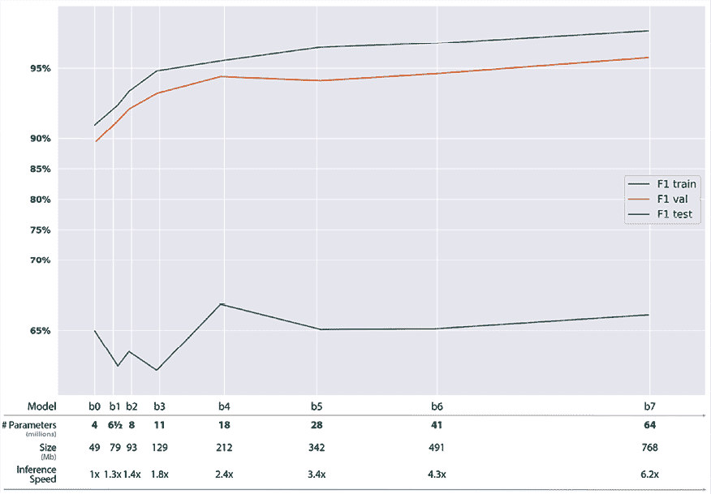

图 7.1：由人工智能咨询公司提供的模型 F1 分数

市政领导对结果感到非常满意，但也感到惊讶，因为顾问们要求不要提供任何领域知识或用于训练模型的数据，这使得他们非常怀疑。他们要求回收厂的工人用一批可回收物测试这些模型。他们用这一批次的模型得到了 25%的错误分类率。

为了寻求第二意见和模型的诚实评估，市政厅联系了另一家 AI 咨询公司——你的公司！

第一项任务是组装一个更符合回收工厂工人在误分类中发现的边缘情况的测试数据集。你的同事使用测试数据集获得了 62%到 66%的 F1 分数（F1 测试）。接下来，他们要求你理解导致这些误分类的原因。

# 方法

没有一种解释方法完美无缺，即使是最好的情况也只能告诉你故事的一部分。因此，你决定首先使用传统的解释方法来评估模型的预测性能，包括以下方法：

+   ROC 曲线和 ROC-AUC

+   混淆矩阵以及由此派生的一些指标，如准确率、精确率、召回率和 F1

然后，你将使用基于激活的方法检查模型：

+   中间激活

这之后是使用三种基于梯度的方法评估决策：

+   显著性图

+   Grad-CAM

+   集成梯度

以及一个基于反向传播的方法：

+   DeepLIFT

这之后是三种基于扰动的算法：

+   遮蔽敏感性

+   特征消除

+   Shapley 值采样

我希望你在这一过程中理解为什么模型的表现不符合预期，以及如何修复它。你还可以利用你将生成的许多图表和可视化来向市政厅的行政人员传达这个故事。

# 准备工作

你会发现这个示例的大部分代码都在这里：[`github.com/PacktPublishing/Interpretable-Machine-Learning-with-Python-2E/blob/main/07/GarbageClassifier.ipynb`](https://github.com/PacktPublishing/Interpretable-Machine-Learning-with-Python-2E/blob/main/07/GarbageClassifier.ipynb)

## 加载库

要运行这个示例，你需要安装以下库：

+   使用`torchvision`加载数据集

+   使用`mldatasets`、`pandas`、`numpy`和`sklearn`（scikit-learn）来操作数据集

+   使用`torch`、`pytorch-lightning`、`efficientnet-pytorch`和`torchinfo`模型进行预测并显示模型信息

+   使用`matplotlib`、`seaborn`、`cv2`、`tqdm`和`captum`来制作和可视化解释

你首先应该加载所有这些库：

```py
import math
import os, gc
import random
import mldatasets
import numpy as np
import pandas as pd
from sklearn.preprocessing import OneHotEncoder
import torchvision
import torch
import pytorch_lightning as pl
import efficientnet_pytorch
from torchinfo import summary
import matplotlib.pyplot as plt
from matplotlib.cm import ScalarMappable 
from matplotlib.colors import LinearSegmentedColormap
import seaborn as sns
import cv2
from tqdm.notebook import tqdm
from captum import attr 
```

接下来，我们将加载和准备数据。

## 理解和准备数据

训练模型所使用的数据在 Kaggle 上公开可用（[`www.kaggle.com/datasets/mostafaabla/garbage-classification`](https://www.kaggle.com/datasets/mostafaabla/garbage-classification)）。它被称为“垃圾分类”，是几个不同在线资源的汇编，包括网络爬取。它已经被分割成训练集和测试集，还附带了一个额外的较小的测试数据集，这是你的同事用来测试模型的。这些测试图像的分辨率也略高。

我们像这样从 ZIP 文件中下载数据：

```py
dataset_file = "garbage_dataset_sample"
dataset_url = f"https://github.com/PacktPublishing/Interpretable-Machine-Learning-with-Python-2E/raw/main/datasets/{dataset_file}.zip"
torchvision.datasets.utils.download_url(dataset_url, ".")
torchvision.datasets.utils.extract_archive(f"{dataset_file}.zip",\
                                           remove_finished=True) 
```

它还会将 ZIP 文件提取到四个文件夹中，分别对应三个数据集和更高分辨率的测试数据集。请注意，`garbage_dataset_sample`只包含训练和验证数据集的一小部分。如果你想下载完整的数据集，请使用`dataset_file = "garbage_dataset"`。无论哪种方式，都不会影响测试数据集的大小。接下来，我们可以这样初始化数据集的转换和加载：

```py
X_train, norm_mean = (0.485, 0.456, 0.406)
norm_std  = (0.229, 0.224, 0.225)
transform = torchvision.transforms.Compose(
    [
        torchvision.transforms.ToTensor(),
        torchvision.transforms.Normalize(norm_mean, norm_std),
    ]
)
train_data = torchvision.datasets.ImageFolder(
    f"{dataset_file}/train", transform
)
val_data = torchvision.datasets.ImageFolder(
    f"{dataset_file}/validation", transform
)
test_data = torchvision.datasets.ImageFolder(
    f"{dataset_file}/test", transform
)
test_400_data = torchvision.datasets.ImageFolder(
    f"{dataset_file}/test_400", transform
) 
```

上述代码所做的就是组合一系列标准转换，如归一化和将图像转换为张量。然后，它实例化与每个文件夹对应的 PyTorch 数据集——即一个用于训练、验证和测试数据集，以及更高分辨率的测试数据集（`test_400_data`）。这些数据集也包括转换。这样，每次从数据集中加载图像时，它都会自动进行转换。我们可以使用以下代码来验证数据集的形状是否符合我们的预期：

```py
print(f"# Training Samples:    \t{len(train_data)}")
print(f"# Validation Samples:  \t{len(val_data)}")
print(f"# Test Samples:        \t{len(test_data)}")
print(f"Sample Dimension:      \t{test_data[0][0].shape}")
print("="*50)
print(f"# Test 400 Samples:    \t{len(test_400_data)}")
print(f"# 400 Sample Dimension:\t{test_400_data[0][0].shape}") 
```

上述代码输出了每个数据集中的图像数量和图像的维度。你可以看出，有超过 3,700 张训练图像，900 张验证图像和 120 张测试图像，它们的维度为 3 x 224 x 224。第一个数字对应于通道（红色、绿色和蓝色），接下来的两个数字对应于像素的宽度和高度，这是模型用于推理的。Test 400 数据集与 Test 数据集相同，只是图像的高度和宽度更大。我们不需要 Test 400 数据集进行推理，所以它不符合模型的维度要求也是可以的：

```py
# Training Samples:        3724
# Validation Samples:      931
# Test Samples:            120
Sample Dimension:          torch.Size([3, 224, 224])
==================================================
# Test 400 Samples:        120 
# 400 Sample Dimension:    torch.Size([3, 400, 400]) 
```

### 数据准备

如果你打印`(test_data[0])`，你会注意到它首先会输出一个包含图像的张量，然后是一个单独的整数，我们称之为标量。这个整数是一个介于 0 到 11 之间的数字，对应于使用的标签。为了快速参考，以下是 12 个标签：

```py
labels_l = ['battery', 'biological', 'brown-glass', 'cardboard',\
            'clothes', 'green-glass', 'metal', 'paper', 'plastic',\
            'shoes', 'trash', 'white-glass'] 
```

解释通常涉及从数据集中提取单个样本，以便稍后使用模型进行推理。为此，熟悉从数据集中提取任何图像，比如测试数据集的第一个样本是很重要的：

```py
tensor, label = test_400_data[0]
img = mldatasets.tensor_to_img(tensor, norm_std, norm_mean)
plt.figure(figsize=(5,5))
plt.title(labels_l[label], fontsize=16)
plt.imshow(img)
plt.show() 
0) from the higher resolution version of the test dataset (test_400_data) and extracting the tensor and label portion from it. Then, we are using the convenience function tensor_to_img to convert the PyTorch tensor to a numpy array but also reversing the standardization that had been previously performed on the tensor. Then, we plot the image with matplotlib's imshow and use the labels_l list to convert the label into a string, which we print in the title. The result can be seen in *Figure 7.2*:
```

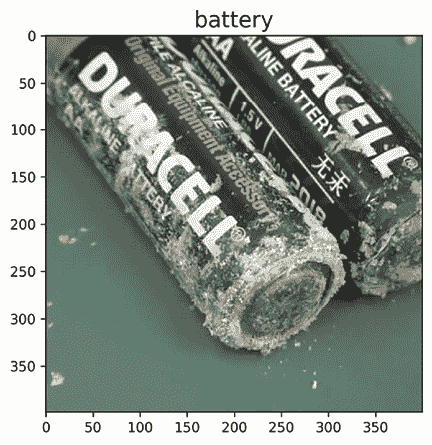

图 7.2：一个可回收碱性电池的测试样本

我们还需要执行的一个预处理步骤是对`y`标签进行**独热编码**（**OHE**），因为我们需要 OHE 形式来评估模型的预测性能。一旦我们初始化了`OneHotEncoder`，我们需要将其`fit`到测试标签（`y_test`）的数组格式中。但首先，我们需要将测试标签放入一个列表（`y_test`）。我们也可以用同样的方法处理验证标签，因为这些标签也便于评估：

```py
y_test = np.array([l for _, l in test_data])
y_val = np.array([l for _, l in val_data])
ohe = OneHotEncoder(sparse=False).\
              fit(np.array(y_test).reshape(-1, 1)) 
```

此外，为了确保可重复性，始终这样初始化你的随机种子：

```py
rand = 42
os.environ['PYTHONHASHSEED']=str(rand)
np.random.seed(rand)
random.seed(rand)
device = torch.device("cuda" if torch.cuda.is_available() else "cpu")
if device == 'cuda':
    torch.cuda.manual_seed(rand)
else:
    torch.manual_seed(rand) 
```

深度学习中确定性的实现非常困难，并且通常依赖于会话、平台和架构。如果你使用**NVIDIA GPU**，你可以尝试使用 PyTorch 通过命令`torch.use_deterministic_algorithms(True)`来避免非确定性算法。这并不保证，但如果尝试的操作无法以确定性完成，它将引发错误。如果成功，它将运行得慢得多。只有在你需要使模型结果一致时才值得这样做——例如，用于科学研究或合规性。有关可重复性和 PyTorch 的更多详细信息，请查看此处：[`pytorch.org/docs/stable/notes/randomness.html`](https://pytorch.org/docs/stable/notes/randomness.html)。

### 检查数据

现在，让我们看看我们的数据集中有哪些图像。我们知道训练和验证数据集非常相似，所以我们从验证数据集开始。我们可以迭代`labels_l`中的每个类别，并使用`np.random.choice`从验证数据集中随机选择一个。我们将每个图像放置在一个 4×3 的网格中，类别标签位于其上方：

```py
plt.subplots(figsize=(14,10))
for c, category in enumerate(labels_l):
    plt.subplot(3, 4, c+1)
    plt.title(labels_l[c], fontsize=12)
    idx = np.random.choice(np.where(y_test==c)[0], 1)[0]
    im = mldatasets.tensor_to_img(test_data[idx][0], norm_std,\
                                  norm_mean)
    plt.imshow(im, interpolation='spline16')
    plt.axis("off")
plt.show() 
```

上一段代码生成了*图 7.3*。你可以看出，物品的边缘存在明显的像素化；有些物品比其他物品暗得多，而且有些图片是从奇怪的角度拍摄的：

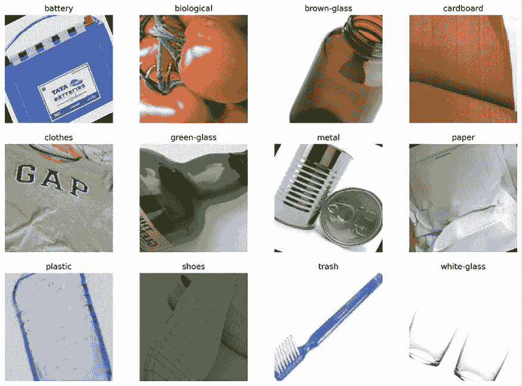

图 7.3：验证数据集的随机样本

现在我们对测试数据集做同样的处理，以便与验证/训练数据集进行比较。我们可以使用之前的相同代码，只需将`y_val`替换为`y_test`，将`val_data`替换为`test_data`。生成的代码生成了*图 7.4*。你可以看出，测试集的像素化较少，物品的照明更一致，主要是从正面和侧面角度拍摄的：

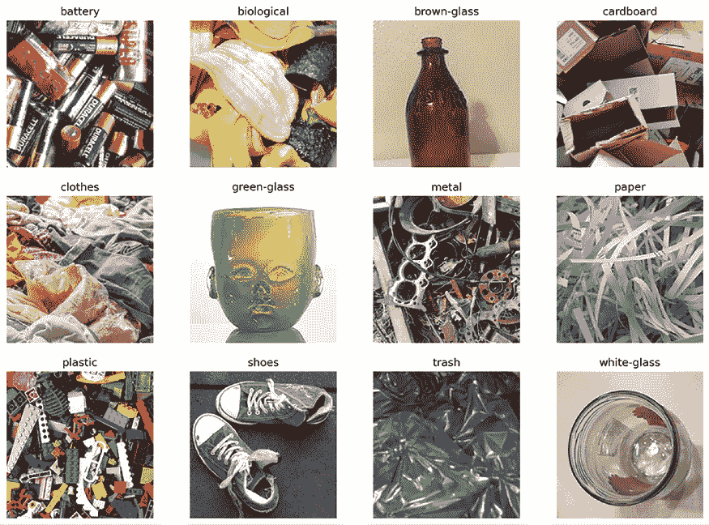

图 7.4：测试数据集的随机样本

在本章中，我们不需要训练 CNN。幸运的是，客户已经为我们提供了它。

### CNN 模型

其他咨询公司训练的模型是微调后的 EfficientNet 模型。换句话说，AI 咨询公司使用 EfficientNet 架构的先前训练模型，并使用垃圾分类数据集进一步训练它。这种技术被称为**迁移学习**，因为它允许模型利用从大型数据集（在这种情况下，来自 ImageNet 数据库的百万张图片）中学习到的先前知识，并将其应用于具有较小数据集的新任务。其优势是显著减少了训练时间和计算资源，同时保持高性能，因为它已经学会了从图像中提取有用的特征，这可以成为新任务的宝贵起点，并且只需要适应手头的特定任务。

选择 EfficientNet 是有道理的。毕竟，EfficientNet 是由 Google AI 研究人员在 2019 年引入的一组 CNN。EfficientNet 的关键创新是其复合缩放方法，这使得模型能够比其他 CNN 实现更高的准确性和效率。此外，它基于这样的观察：模型的各个维度，如宽度、深度和分辨率，以平衡的方式对整体性能做出贡献。EfficientNet 架构建立在称为 EfficientNet-B0 的基线模型之上。采用复合缩放方法创建基线模型更大、更强大的版本，同时提高网络的宽度、深度和分辨率。这产生了一系列模型，从 EfficientNet-B1 到 EfficientNet-B7，容量和性能逐渐提高。最大的模型 EfficientNet-B7 在多个基准测试中实现了最先进的性能，例如 ImageNet。

### 加载 CNN 模型

在我们能够加载模型之前，我们必须定义 EfficientLite 类的类——一个继承自 PyTorch Lightning 的 `pl.LightningModule` 的类。这个类旨在创建基于 EfficientNet 架构的定制模型，对其进行训练并执行推理。我们只需要它来执行后者，这就是为什么我们还将其修改为包含一个 `predict()` 函数——类似于 scikit-learn 模型，以便能够使用类似的评估函数：

```py
class **EfficientLite**(pl.LightningModule):
    def __init__(self, lr: float, num_class: int,\
                 pretrained="efficientnet-b0", *args, **kwargs):
        super().__init__()
        self.save_hyperparameters()
        self.model = efficientnet_pytorch.EfficientNet.\
                                      from_pretrained(pretrained)
        in_features = self.model._fc.in_features
        self.model._fc = torch.nn.Linear(in_features, num_class)
    def forward(self, x):
        return self.model(x)
    def predict(self, dataset):
        self.model.eval()
        device = torch.device("cuda" if torch.cuda.is_available()\
                              else "cpu")
        with torch.no_grad():
            if isinstance(dataset, np.ndarray):
                if len(dataset.shape) == 3:
                    dataset = np.expand_dims(dataset, axis=0)
                dataset = [(x,0) for x in dataset]
            loader = torch.utils.data.DataLoader(dataset,\
                                                 batch_size=32)
            probs = None
        for X_batch, _ in tqdm(loader):
            X_batch = X_batch.to(device, dtype=torch.float32)
            logits_batch =  self.model(X_batch)
            probs_batch = torch.nn.functional.softmax(logits_batch,\
                                       dim=1).cpu().detach().numpy()
            if probs is not None:
                probs = np.concatenate((probs, probs_batch))
            else:
                probs = probs_batch
            clear_gpu_cache()
        return probs 
```

你会注意到这个类有三个函数：

+   `__init__`: 这是 `EfficientLite` 类的构造函数。它通过使用 `efficientnet_pytorch.EfficientNet.from_pretrained()` 方法加载预训练的 EfficientNet 模型来初始化模型。然后，它将最后一个全连接层 (`_fc`) 替换为一个新创建的 `torch.nn.Linear` 层，该层具有相同数量的输入特征，但输出特征的数量不同，等于类别的数量 (`num_class`)。

+   `forward`: 此方法定义了模型的正向传播。它接收一个输入张量 `x` 并将其通过模型传递，返回输出。

+   `predict`: 此方法接收一个数据集并使用训练好的模型进行推理。它首先将模型设置为评估模式 (`self.model.eval()`)。输入数据集被转换为具有 32 个批次的 DataLoader 对象。该方法遍历 DataLoader，处理每个数据批次，并使用 softmax 函数计算概率。在每个迭代之后调用 `clear_gpu_cache()` 函数以释放未使用的 GPU 内存。最后，该方法返回计算出的概率作为 `numpy` 数组。

如果你正在使用支持 CUDA 的 GPU，有一个名为`clear_gpu_cache()`的实用函数，每次进行 GPU 密集型操作时都会运行。根据你的 GPU 性能如何，你可能需要更频繁地运行它。你可以自由地使用另一个便利函数`print_gpu_mem_used()`来检查在任何给定时刻 GPU 内存的使用情况，或者使用`print(torch.cuda.memory_summary())`来打印整个摘要。接下来的代码下载预训练的 EfficientNet 模型，将模型权重加载到 EfficientLite 中，并准备模型进行推理。最后，它打印了一个摘要：

```py
model_weights_file = **"garbage-finetuned-efficientnet-b4"**
model_url = f"https://github.com/PacktPublishing/Interpretable-Machine-Learning-with-Python-2E/raw/main/models/{model_weights_file}.ckpt"
torchvision.datasets.utils.download_url(model_url, ".")
garbage_mdl = EfficientLite.load_from_checkpoint(
    f"{model_weights_file}.ckpt"
)
garbage_mdl = garbage_mdl.to(device).eval()
print(summary(garbage_mdl)) 
```

代码相当直接，但重要的是要注意，我们在这个章节选择了 b4 模型，它在大小、速度和准确性方面介于 b0 和 b7 之间。你可以根据你的硬件能力更改最后一位数字，但这可能会改变本章代码的一些结果。前面的代码片段输出了以下摘要：

```py
=======================================================================
Layer (type:depth-idx) Param # =======================================================================
EfficientLite -- 
├─EfficientNet: 1-1 – 
│ └─Conv2dStaticSamePadding: 2-1 1,296 
│ │ └─ZeroPad2d: 3-1 – 
│ └─BatchNorm2d: 2-2 96 
│ └─ModuleList: 2-3 – 
│ │ └─MBConvBlock: 3-2 2,940 
│ │ └─MBConvBlock: 3-3 1,206 
│ │ └─MBConvBlock: 3-4 11,878 
│ │ └─MBConvBlock: 3-5 18,120 
│ │ └─MBConvBlock: 3-6 18,120 
│ │ └─MBConvBlock: 3-7 18,120 
│ │ └─MBConvBlock: 3-8 25,848 
│ │ └─MBConvBlock: 3-9 57,246 
│ │ └─MBConvBlock: 3-10 57,246 
│ │ └─MBConvBlock: 3-11 57,246 
│ │ └─MBConvBlock: 3-12 70,798 
│ │ └─MBConvBlock: 3-13 197,820 
│ │ └─MBConvBlock: 3-14 197,820 
│ │ └─MBConvBlock: 3-15 197,820 
│ │ └─MBConvBlock: 3-16 197,820 
│ │ └─MBConvBlock: 3-17 197,820 
│ │ └─MBConvBlock: 3-18 240,924 
│ │ └─MBConvBlock: 3-19 413,160 
│ │ └─MBConvBlock: 3-20 413,160 
│ │ └─MBConvBlock: 3-21 413,160 
│ │ └─MBConvBlock: 3-22 413,160 
│ │ └─MBConvBlock: 3-23 413,160 
│ │ └─MBConvBlock: 3-24 520,904 
│ │ └─MBConvBlock: 3-25 1,159,332 
│ │ └─MBConvBlock: 3-26 1,159,332 
│ │ └─MBConvBlock: 3-27 1,159,332 
│ │ └─MBConvBlock: 3-28 1,159,332 
│ │ └─MBConvBlock: 3-29 1,159,332 
│ │ └─MBConvBlock: 3-30 1,159,332 
│ │ └─MBConvBlock: 3-31 1,159,332 
│ │ └─MBConvBlock: 3-32 1,420,804 
│ │ └─MBConvBlock: 3-33 3,049,200 
│ └─Conv2dStaticSamePadding: 2-4 802,816 
│ │ └─Identity: 3-34 – 
│ └─BatchNorm2d: 2-5 3,584 
│ └─AdaptiveAvgPool2d: 2-6 – 
│ └─Dropout: 2-7 – 
│ └─Linear: 2-8 21,516 
│ └─MemoryEfficientSwish: 2-9 
======================================================================
Total params: 17,570,132 
Trainable params: 17,570,132 
Non-trainable params: 0 ====================================================================== 
```

它几乎包含了我们需要的关于模型的所有信息。它有两个自定义卷积层（`Conv2dStaticSamePadding`），每个卷积层后面跟着一个批归一化层（`BatchNorm2d`）和 32 个`MBConvBlock`模块。

网络还有一个 Swish 激活函数的内存高效实现（`MemoryEfficientSwish`），就像所有激活函数一样，它将非线性引入模型。它是平滑且非单调的，有助于它更快地收敛，同时学习更复杂和细微的模式。它还有一个全局平均池化操作（`AdaptiveAvgPool2d`），它减少了特征图的空间维度。然后有一个用于正则化的第一个`Dropout`层，后面跟着一个将节点数从 1792 减少到 12 的完全连接层（`Linear`）。Dropout 通过在每个更新周期中使一部分神经元不活跃来防止过拟合。如果你想知道每个层之间的输出形状是如何减少的，可以将`input_size`输入到摘要中——例如`summary(garbage_mdl, input_size=(64, 3, 224, 224))`——因为网络是针对 64 个批次的尺寸设计的。如果你对这些术语不熟悉，不要担心。我们稍后会重新讨论它们。

## 使用传统解释方法评估 CNN 分类器

我们将首先使用`evaluate_multiclass_mdl`函数和验证数据集来评估模型。参数包括模型（`garbage_mdl`）、我们的验证数据（`val_data`）、类别名称（`labels_l`）以及编码器（`ohe`）。最后，我们不会绘制 ROC 曲线（`plot_roc=False`）。此函数返回预测标签和概率，我们可以将它们存储在变量中以供以后使用：

```py
y_val_pred, y_val_prob = mldatasets.evaluate_multiclass_mdl(
    garbage_mdl, val_data,\
    class_l=labels_l, ohe=ohe, plot_roc=False
) 
```

前面的代码生成了带有混淆矩阵的*图 7.5*和每个类别的性能指标的*图 7.6*：

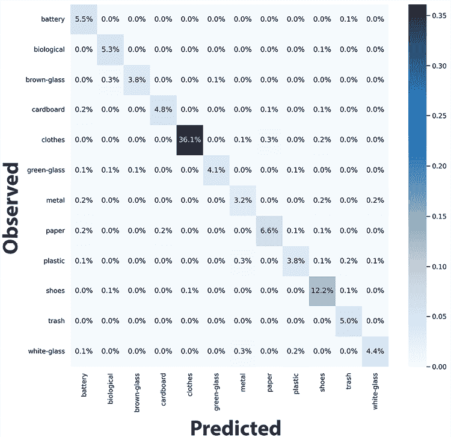

图 7.5：验证数据集的混淆矩阵

尽管*图 7.5*中的混淆矩阵似乎表明分类完美，但一旦你看到*图 7.6*中的精确率和召回率分解，你就可以知道模型在金属、塑料和白色玻璃方面存在问题：

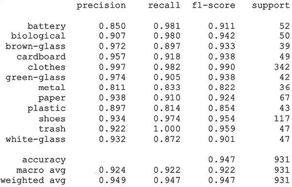

图 7.6：验证数据集的分类报告

如果你使用最优的超参数对模型进行足够的轮次训练，你可以期望模型总是达到`100%`的训练准确率。接近完美的验证准确率更难实现，这取决于这两个值之间的差异。我们知道验证数据集只是来自同一集合的图像样本，所以达到 94.7%并不特别令人惊讶。

```py
plot_roc=True) but only the averages, and not on a class-by-class basis (plot_roc_class=False) because there are only four pictures per class. Given the small number of samples, we can display the numbers in the confusion matrix rather than percentages (pct_matrix=False):
```

```py
y_test_pred, y_test_prob = mldatasets.evaluate_multiclass_mdl(
    garbage_mdl, test_data,\
    class_l=labels_l, ohe=ohe,\
    plot_roc=True, plot_roc_class=False, pct_matrix=False
) 
generated the ROC curve in *Figure 7.7*, the confusion matrix in *Figure 7.8*, and the classification report in *Figure 7.9*:
```

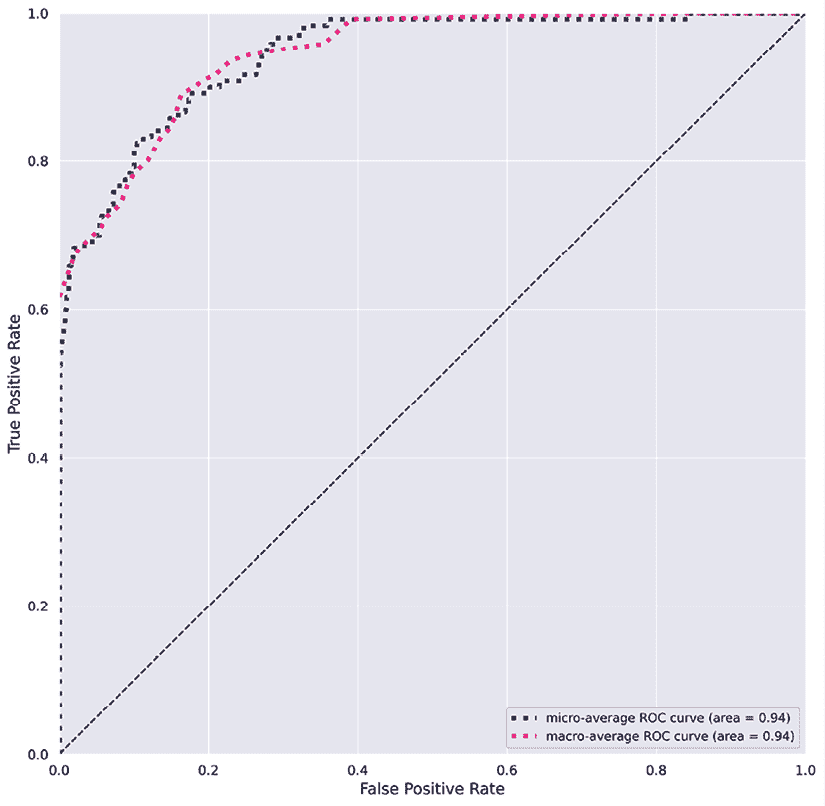

图 7.7：测试数据集的 ROC 曲线

测试 ROC 图(*图 7.7*)显示了宏平均和微平均的 ROC 曲线。这两者的区别在于它们的计算方式。宏度量是独立地对每个类别进行计算然后平均，对待每个类别不同，而微平均则考虑了每个类别的贡献或代表性；一般来说，微平均更可靠。

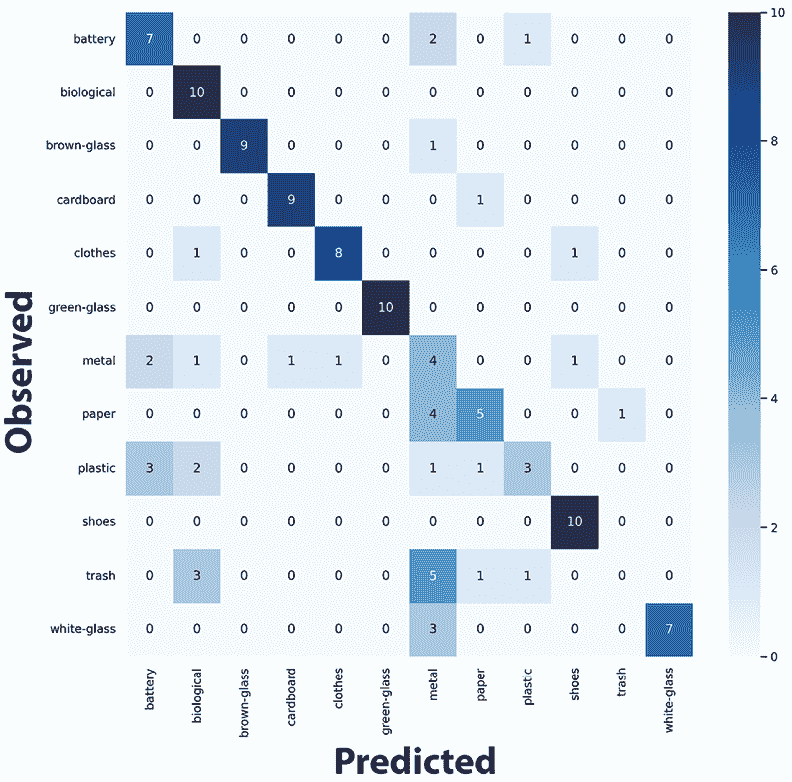

图 7.8：测试数据集的混淆矩阵

如果我们查看*图 7.8*中的混淆矩阵，我们可以看出只有生物、绿色玻璃和鞋子得到了 10/10 的分类。然而，很多物品被错误地分类为生物和鞋子。另一方面，很多物品经常被错误分类，比如金属、纸张和塑料。许多物品在形状或颜色上相似，所以你可以理解为什么会这样，但金属怎么会和白色玻璃混淆，或者纸张会和电池混淆呢？


图 7.9：测试数据集的预测性能指标

在商业环境中讨论分类模型时，利益相关者通常只对一个数字感兴趣：准确率。很容易让这个数字驱动讨论，但其中有很多细微差别。例如，令人失望的测试准确率（68.3%）可能意味着很多事情。这可能意味着六个类别得到了完美的分类，而其他所有类别都没有，或者 12 个类别只有一半被错误分类。可能发生的事情有很多。

在任何情况下，处理多类分类问题时，即使准确率低于 50%也可能不像看起来那么糟糕。考虑到**无信息率**代表了在数据集中总是预测最频繁类别的朴素模型所能达到的准确率。它作为一个基准，确保开发出的模型提供了超越这种简单方法的见解。并且，如果数据集被平均分成 12 类，那么**无信息率**可能大约是 8.33%（100%/12 类），所以 68%仍然比这高得多。实际上，距离 100%的差距还要小！对于一个机器学习从业者来说，这意味着如果我们仅仅根据测试准确率结果来判断，模型仍在学习一些有价值的东西，这些是可以进一步改进的。

在任何情况下，测试数据集在*图 7.9*中的预测性能指标与我们在混淆矩阵中看到的一致。生物类别召回率高但精确率低，而金属、纸张、塑料和垃圾的召回率都很低。

### 确定要关注的错误分类

我们已经注意到一些有趣的错误分类，我们可以集中关注：

+   **金属的假阳性**：测试数据集中有 120 个样本中的 16 个被错误分类为金属。这是所有错误分类的 42%！模型为什么如此容易将金属与其他垃圾混淆，这是怎么回事？

+   **塑料的假阴性**：70%的所有真实塑料样本都被错误分类。因此，塑料在所有材料中除了垃圾之外，召回率最低。很容易理解为什么垃圾分类如此困难，因为它极其多样，但不是塑料。

我们还应该检查一些真实阳性，以对比这些错误分类。特别是电池，因为它们作为金属和塑料有很多假阳性，以及白色玻璃，因为它 30%的时间作为金属有假阴性。由于金属的假阳性很多，我们应该将它们缩小到仅仅是电池的。

为了可视化前面的任务，我们可以创建一个 DataFrame（`preds_df`），其中包含一个列的真实标签（`y_true`）和另一个列的预测标签。为了了解模型对这些预测的确定性，我们可以创建另一个包含概率的 DataFrame（`probs_df`）。我们可以为这些概率生成列总计，以便根据模型在所有样本中最确定哪个类别来排序列。然后，我们可以将我们的预测 DataFrame 与概率 DataFrame 的前 12 列连接起来：

```py
preds_df = pd.DataFrame({'y_true':[labels_l[o] for o in y_test],\
                         'y_pred':y_test_pred})
probs_df = pd.DataFrame(y_test_prob*100).round(1)
probs_df.loc['Total']= probs_df.sum().round(1)
probs_df.columns = labels_l
probs_df = probs_df.sort_values('Total', axis=1, ascending=False)
probs_df.drop(['Total'], axis=0, inplace=True)
probs_final_df = probs_df.iloc[:,0:12]
preds_probs_df = pd.concat([preds_df, probs_final_df], axis=1) 
```

现在我们输出感兴趣的预测实例的 DataFrame，并对其进行颜色编码。一方面，我们有金属的假阳性，另一方面，我们有塑料的假阴性。但我们还有电池和白色玻璃的真实阳性。最后，我们将所有超过 50%的概率加粗，并将所有 0%的概率隐藏起来，这样更容易发现任何高概率的预测：

```py
num_cols_l = list(preds_probs_df.columns[2:])
num_fmt_dict = dict(zip(num_cols_l, ["{:,.1f}%"]*len(num_cols_l)))
preds_probs_df[
    (preds_probs_df.y_true!=preds_probs_df.y_pred)
    | (preds_probs_df.y_true.isin(['battery', 'white-glass']))
].style.format(num_fmt_dict).apply(
    lambda x: ['background: lightgreen' if (x[0] == x[1])\
                else '' for i in x], axis=1
).apply(
    lambda x: ['background: orange' if (x[0] != x[1] and\
                x[1] == 'metal' and x[0] == 'battery')\
                else '' for i in x], axis=1
).apply(
    lambda x: ['background: yellow' if (x[0] != x[1] and\
                                        x[0] == 'plastic')\
                else '' for i in x], axis=1
).apply(
    lambda x: ['font-weight: bold' if isinstance(i, float)\
                                                 and i >= 50\
                else '' for i in x], axis=1
).apply(
    lambda x: ['color:transparent' if i == 0.0\
                else '' for i in x], axis=1) 
Figure 7.10. We can tell by the highlights which are the metal false positives and the plastic false negatives, as well as which would be the true positives: #0-6 for battery, and #110-113 and #117-119 for white glass:
```

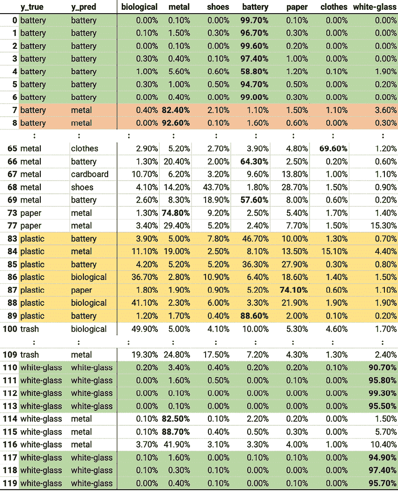

图 7.10：测试数据集中所有 38 个错误分类、选定的真实正例及其真实和预测标签，以及它们的预测概率的表格

我们可以使用以下代码轻松地将这些实例的索引存储在列表中。这样，为了未来的参考，我们可以遍历这些列表来评估单个预测，或者用它们来对整个组执行解释任务。正如你所看到的，我们有所有四个组的列表：

```py
plastic_FN_idxs = preds_df[
    (preds_df['y_true'] !=preds_df['y_pred'])
    & (preds_df['y_true'] == 'plastic')
].index.to_list()
metal_FP_idxs = preds_df[
    (preds_df['y_true'] != preds_df['y_pred'])
    & (preds_df['y_pred'] == 'metal')
    & (preds_df['y_true'] == 'battery')
].index.to_list()
battery_TP_idxs = preds_df[
    (preds_df['y_true'] ==preds_df['y_pred'])
    & (preds_df['y_true'] == 'battery')
].index.to_list()
wglass_TP_idxs = preds_df[
    (preds_df['y_true'] == preds_df['y_pred'])
    & (preds_df['y_true'] == 'white-glass')
].index.to_list() 
```

现在我们已经预处理了所有数据，模型已完全加载并列出要调试的预测组。现在我们可以继续前进。让我们开始解释！

# 使用基于激活的方法可视化学习过程

在我们开始讨论激活、层、过滤器、神经元、梯度、卷积、核以及构成卷积神经网络（CNN）的所有神奇元素之前，让我们首先简要回顾一下 CNN 的机制，特别是其中一个机制。

卷积层是 CNN 的基本构建块，它是一个顺序神经网络。它通过**可学习的过滤器**对输入进行卷积，这些过滤器相对较小，但会在特定的距离或**步长**上应用于整个宽度、高度和深度。每个过滤器产生一个二维的**激活图**（也称为**特征图**）。之所以称为激活图，是因为它表示图像中激活的位置——换句话说，特定“特征”所在的位置。在这个上下文中，特征是一个抽象的空间表示，在处理过程的下游，它反映在完全连接（**线性**）层的所学权重中。例如，在垃圾 CNN 案例中，第一个卷积层有 48 个过滤器，3 × 3 的核，2 × 2 的步长和静态填充，这确保输出图保持与输入相同的大小。过滤器是模板匹配的，因为当在输入图像中找到某些模式时，它们最终会在激活图中激活区域。

但在我们到达完全连接层之前，我们必须减小过滤器的尺寸，直到它们达到可工作的尺寸。例如，如果我们展平第一个卷积的输出（48 × 112 × 112），我们就会有超过 602,000 个特征。我想我们都可以同意，这会太多以至于无法输入到完全连接层中。即使我们使用了足够的神经元来处理这项工作负载，我们可能也没有捕捉到足够的空间表示，以便神经网络能够理解图像。因此，卷积层通常与池化层配对，池化层对输入进行下采样——换句话说，它们减少了数据的维度。在这种情况下，有一个自适应平均池化层（`AdaptiveAvgPool2d`），它在所有通道上执行平均，以及许多在**Mobile Inverted Bottleneck Convolution Blocks**（`MBConvBlock`）内的池化层。

顺便提一下，`MBConvBlock`、`Conv2dStaticSamePadding`和`BatchNorm2d`是 EfficientNet 架构的构建块。这些组件共同工作，创建了一个高度高效且准确的卷积神经网络：

+   `MBConvBlock`: 形成 EfficientNet 架构核心的移动倒置瓶颈卷积块。在传统的卷积层中，过滤器同时应用于所有输入通道，导致计算量很大，但`MBConvBlocks`将这个过程分为两个步骤：首先，它们应用深度卷积，分别处理每个输入通道，然后使用点卷积（1 x 1）来结合来自不同通道的信息。因此，在 B0 的`MBConvBlock`模块中，有三个卷积层：一个深度卷积，一个点卷积（称为项目卷积），以及在某些块中的另一个点卷积（称为扩展卷积）。然而，第一个块只包含两个卷积层（深度卷积和项目卷积），因为它没有扩展卷积。对于 B4，架构类似，但每个块中堆叠的卷积更多，`MBConvBlocks`的数量也翻倍。自然地，B7 有更多的块和卷积层。对于 B4，总共有 158 次卷积操作分布在 32 个`MBConvBlocks`之间。

+   `Conv2dStaticSamePadding`: 与传统的卷积层（如`Conv2d`）不同，这些层不会减少维度。它确保输入和输出特征图具有相同的空间维度。

+   `BatchNorm2d`: 批标准化层，通过归一化输入特征来帮助稳定和加速训练，这有助于在训练过程中保持输入特征的分布一致性。

一旦执行了超过 230 次的卷积和池化操作，我们得到一个更易于处理的扁平化输出：1,792 个特征，全连接层将这些特征转换为 12 个，利用**softmax**激活函数，为每个类别输出介于 0 和 1 之间的概率。在垃圾 CNN 中，有一个**dropout**层用于帮助正则化训练。我们可以完全忽略这一点，因为在推理过程中，它们是被忽略的。

如果这还不够清晰，不要担心！接下来的部分将通过激活、梯度和扰动直观地展示网络可能学习或未学习的图像表示方式。

## 中间激活

对于推理，图像通过网络的输入，预测通过输出穿过每个层。然而，具有顺序和分层架构的一个优点是我们可以提取任何层的输出，而不仅仅是最终层。**中间激活**是任何卷积或池化层的输出。它们是激活图，因为激活函数应用后，亮度较高的点映射到图像的特征。在这种情况下，模型在所有卷积层上使用了 ReLU，这就是激活点的原理。我们只对卷积层的中间激活感兴趣，因为池化层只是这些层的下采样版本。为什么不去看更高分辨率的版本呢？

随着滤波器宽度和高度的减小，学习到的表示将会更大。换句话说，第一个卷积层可能关于细节，如纹理，下一个关于边缘，最后一个关于形状。然后我们必须将卷积层的输出展平，以便将其输入到从那时起接管的多层感知器。

我们现在要做的是提取一些卷积层的激活。在 B4 中，有 158 个，所以我们不能全部做！为此，我们将使用`model.children()`获取第一层的层，并遍历它们。我们将从这个顶层将两个`Conv2dStaticSamePadding`层添加到`conv_layers`列表中。但我们会更深入，将`ModuleList`层中的前六个`MBConvBlock`层的第一个卷积层也添加进去。最后，我们应该有八个卷积层——中间的六个属于 Mobile Inverted Bottleneck Convolution 块：

```py
conv_layers = []
model_children = list(garbage_mdl.model.children())
for model_child in model_children:
    if (type(model_child) ==\
                efficientnet_pytorch.utils.Conv2dStaticSamePadding):
        conv_layers.append(model_child)
    elif (type(model_child) == torch.nn.modules.container.ModuleList):
        module_children = list(model_child.children())
        module_convs = []
        for module_child in module_children:
            module_convs.append(list(module_child.children())[0])
        conv_layers.extend(module_convs[:6])
print(conv_layers) 
```

在我们遍历所有它们，为每个卷积层生成激活图之前，让我们为单个滤波器和层做一下：

```py
idx = battery_TP_idxs[0]
tensor = test_data[idx][0][None, :].to(device)
label = y_test[idx]
method = attr.LayerActivation(garbage_mdl, conv_layers[layer]
attribution = method.attribute(tensor).detach().cpu().numpy()
print(attribution.shape) 
tensor for the first battery true positive (battery_TP_idxs[0]). Then, it initializes the LayerActivation attribution method with the model (garbage_mdl) and the first convolutional layer (conv_layers[0]). Using the attribute function, it creates an attribution with this method. For the shape of the attribution, we should get (1, 48, 112, 112). The tensor was for a single image, so it makes sense that the first number is a one. The next number corresponds to the number of filters, followed by the width and height dimensions of each filter. Regardless of the kind of attribution, the numbers inside each attribution relate to how a pixel in the input is seen by the model. Interpretation varies according to the method. However, generally, it is interpreted that higher numbers mean more of an impact on the outcome, but attributions may also have negative numbers, which mean the opposite.
```

让我们可视化第一个滤波器，但在我们这样做之前，我们必须决定使用什么颜色图。颜色图将决定将不同数字分配给哪些颜色作为渐变。例如，以下颜色图将白色分配给`0`（十六进制中的`#ffffff`），中等灰色分配给`0.25`，黑色（十六进制中的`#000000`）分配给`1`，这些颜色之间有一个渐变：

```py
cbinary_cmap = LinearSegmentedColormap.from_list('custom binary',
                                                 [(0, '#ffffff'),
                                                  (0.25, '#777777'),
                                                  (1, '#000000')]) 
```

你也可以使用[`matplotlib.org/stable/tutorials/colors/colormaps.html`](https://matplotlib.org/stable/tutorials/colors/colormaps.html)上的任何命名颜色图，而不是使用你自己的。接下来，让我们像这样绘制第一个滤波器的属性图：

```py
filter = 0
filter_attr = attribution[0,filter]
filter_attr = mldatasets.apply_cmap(filter_attr, cbinary_cmap, 'positive')
y_true = labels_l[label]
y_pred = y_test_pred[idx]
fig, ax = plt.subplots(1, 1, figsize=(8, 6))
fig.suptitle(f"Actual label: {y_true}, Predicted: {y_pred}", fontsize=16)
ax.set_title(
    f"({method.get_name()} Attribution for Filter #{filter+1} for\
        Convolutional Layer #{layer+1})",
    fontsize=12
)
ax.imshow(filter_attr)
ax.grid(False)
fig.colorbar(
    ScalarMappable(norm='linear', cmap=cbinary_cmap),
    ax=ax,
    orientation="vertical"
)
plt.show() 
Figure 7.11:
```

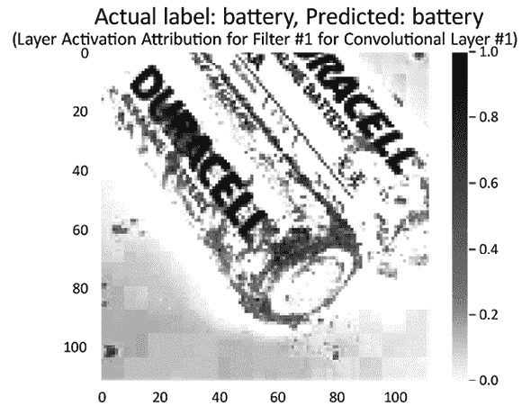

图 7.11：第一个真实正样本电池样本的第一个卷积层的第一个滤波器的中间激活图

如你在*图 7.11*中可以看到，第一个滤波器的中间激活似乎在寻找电池的边缘和最突出的文本。

接下来，我们将遍历所有计算层和每个电池，并可视化每个的归因。现在，一些这些归因操作可能计算成本很高，因此在这些操作之间清除 GPU 缓存（`clear_gpu_cache()`）是很重要的：

```py
for l, layer in enumerate(conv_layers):
    layer = conv_layers[l]
    method = attr.LayerActivation(garbage_mdl, layer)
    for idx in battery_TP_idxs:
        orig_img = mldatasets.tensor_to_img(test_400_data[idx][0],\
                                            norm_std, norm_mean,\
                                            to_numpy=True)
        tensor = test_data[idx][0][None, :].to(device)
        label = int(y_test[idx])
        attribution = method.attribute(tensor).detach().cpu().numpy()
        viz_img =  mldatasets.**create_attribution_grid**(attribution,\
                            cmap='copper', cmap_norm='positive')
        y_true = labels_l[label]
        y_pred = y_test_pred[idx]
        probs_s = probs_df.loc[idx]
        name = method.get_name()
        title = f'CNN Layer #{l+1} {name} Attributions for Sample #{idx}'
        mldatasets.**compare_img_pred_viz**(orig_img, viz_img, y_true,\
                                        y_pred, probs_s, title=title)
    clear_gpu_cache() 
look fairly familiar. Where it’s different is that it’s placing every attribution map for every filter in a grid (viz_img) with create_attribition_grid. It could just then display it with plt.imshow as before, but instead, we will leverage a utility function called compare_img_pred_viz to visualize the attribution(s) side by side with the original image (orig_img). It also takes the sample’s actual label (y_true) and predicted label (y_pred). Optionally, we can provide a pandas series with the probabilities for this prediction (probs_s) and a title. It generates 56 images in total, including *Figures 7.12*, *7.13*, and *7.14*.
```

如您从*图 7.12*中可以看出，第一层卷积似乎在捕捉电池的字母以及其轮廓：

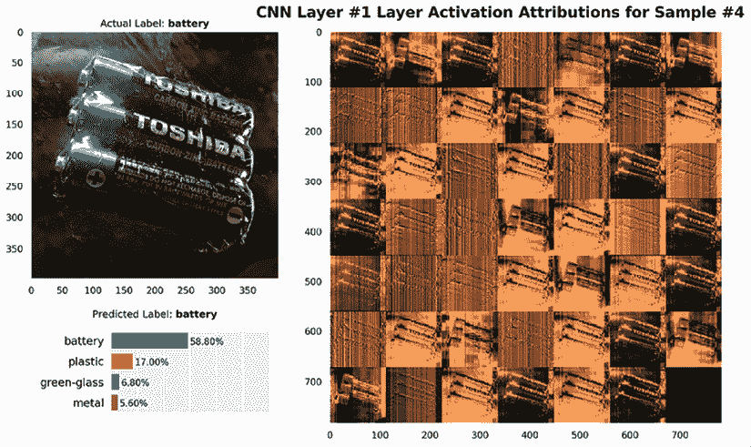

图 7.12：电池#4 的第一卷积层的中间激活

然而，*图 7.13*显示了网络如何通过第四层卷积更好地理解电池的轮廓：

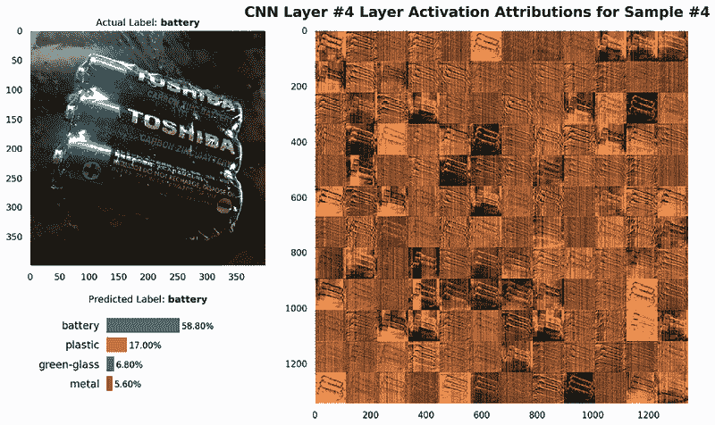

图 7.13：电池#4 的第四卷积层的中间激活

在*图 7.14*中，最后一层卷积层难以解释，因为这里有 1,792 个 7 像素宽和高的过滤器，但请放心，那些微小的图中编码了一些非常高级的特征：

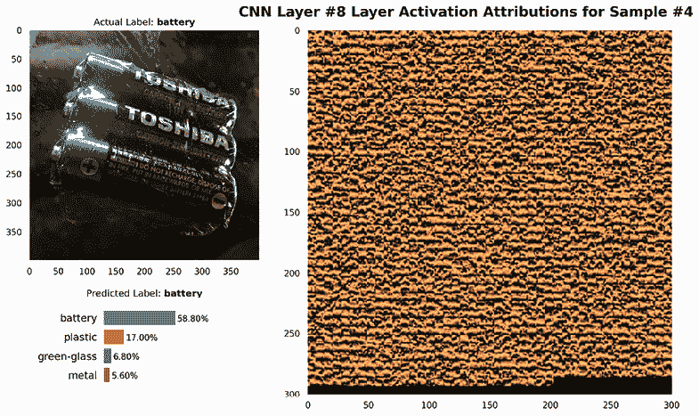

图 7.14：电池#4 的最后一层卷积层的中间激活

提取中间激活可以为你提供基于样本的某些洞察。换句话说，它是一种**局部模型解释方法**。这绝对不是唯一的逐层归因方法。Captum 有超过十种层归因方法：[`github.com/pytorch/captum#about-captum`](https://github.com/pytorch/captum#about-captum)。

# 使用基于梯度的归因方法评估误分类

**基于梯度的方法**通过 CNN 的前向和反向传递计算每个分类的**归因图**。正如其名所示，这些方法利用反向传递中的梯度来计算归因图。所有这些方法都是局部解释方法，因为它们只为每个样本推导出一个解释。顺便提一下，在这个上下文中，归因意味着我们将预测标签归因于图像的某些区域。在学术文献中，它们也常被称为**敏感性图**。

要开始，我们首先需要创建一个数组，包含测试数据集（`test_data`）中所有我们的误分类样本（`X_misclass`），使用所有我们感兴趣的误分类的合并索引（`misclass_idxs`）。由于误分类并不多，我们正在加载它们的一个批次（`next`）：

```py
misclass_idxs = metal_FP_idxs + plastic_FN_idxs[-4:]
misclass_data = torch.utils.data.Subset(test_data, misclass_idxs)
misclass_loader = torch.utils.data.DataLoader(misclass_data,\
                                              batch_size = 32)
X_misclass, y_misclass = next(iter(misclass_loader))
X_misclass, y_misclass = X_misclass.to(device), y_misclass.to(device) 
```

下一步是创建一个我们可以重用的实用函数来获取任何方法的归因图。可选地，我们可以使用名为`NoiseTunnel`的方法（[`github.com/pytorch/captum#getting-started`](https://github.com/pytorch/captum#getting-started)）来平滑地图。我们将在稍后更详细地介绍这种方法：

```py
def get_attribution_maps(**method**, model, device,X,y=None,\
                         init_args={}, nt_type=None, nt_samples=10,\
                         stdevs=0.2, **kwargs):
    attr_maps_size = tuple([0] + list(X.shape[1:]))
    attr_maps = torch.empty(attr_maps_size).to(device)
    **attr_method** = **method**(model, **init_args)
    if nt_type is not None:
        noise_tunnel = attr.NoiseTunnel(attr_method)
        nt_attr_maps = torch.empty(attr_maps_size).to(device)
    for i in tqdm(range(len(X))):
        X_i = X[i].unsqueeze(0).requires_grad_()
        model.zero_grad()
        extra_args = {**kwargs}
        if y is not None:
            y_i = y[i].squeeze_()
            extra_args.update({"target":y_i})

        attr_map = **attr_method.attribute**(X_i, **extra_args)
        attr_maps = torch.cat([attr_maps, attr_map])
        if nt_type is not None:
            model.zero_grad()
            nt_attr_map = noise_tunnel.attribute(
                X_i, nt_type=nt_type, nt_samples=nt_samples,\
                stdevs=stdevs, nt_samples_batch_size=1, **extra_args)
            nt_attr_maps = torch.cat([nt_attr_maps, nt_attr_map])
        clear_gpu_cache()
    if nt_type is not None:
        return attr_maps, nt_attr_maps
    return attr_maps 
```

上述代码可以为给定模型和设备的任何 Captum 方法创建归因图。为此，它需要图像的张量`X`及其相应的标签`y`。标签是可选的，只有在归因方法是针对特定目标时才需要 - 大多数方法都是。大多数归因方法（`attr_method`）仅使用模型初始化，但一些需要一些额外的参数（`init_args`）。它们通常在用`attribute`函数生成归因时具有最多的参数，这就是为什么我们在`get_attribution_maps`函数中收集额外的参数（`**kwargs`），并将它们放在这个调用中。

需要注意的一个重要事项是，在这个函数中，我们遍历`X`张量中的所有样本，并为每个样本独立创建属性图。这通常是不必要的，因为属性方法都配备了同时处理一批数据的能力。然而，存在硬件无法处理整个批次的风险，在撰写本文时，非常少的方法带有`internal_batch_size`参数，这可能会限制一次可以处理的样本数量。我们在这里所做的是本质上等同于每次都将这个数字设置为`1`，以努力确保我们不会遇到内存问题。然而，如果你有强大的硬件，你可以重写函数以直接处理`X`和`y`张量。

接下来，我们将执行我们的第一个基于梯度的归因方法。

## 显著性图

**显著性图**依赖于梯度的绝对值。直觉上，它会找到图像中可以扰动最少且输出变化最大的像素。它不执行扰动，因此不验证假设，而绝对值的使用阻止它找到相反的证据。

这种首次提出的显著性图方法在当时具有开创性，并激发了许多不同的方法。它通常被昵称为“vanilla”，以区别于其他显著性图。

使用我们的`get_attribution_maps`函数为所有误分类的样本生成显著性图相对简单。你所需要的是 Captum 归因方法（`attr.Saliency`）、模型（`garbage_mdl`）、设备以及误分类样本的张量（`X_misclass`和`y_misclass`）：

```py
saliency_maps = get_attribution_maps(attr.Saliency, garbage_mdl,\
                                     device, X_misclass, y_misclass) 
```

我们可以绘制其中一个显著性图的输出，第五个，与样本图像并排显示以提供上下文。Matplotlib 可以通过`subplots`网格轻松完成此操作。我们将创建一个 1 × 3 的网格，并将样本图像放在第一个位置，其显著性热图放在第二个位置，第三个位置是叠加在一起的。就像我们之前对归因图所做的那样，我们可以使用`tensor_to_img`将图像转换为`numpy`数组，同时应用归因的调色板。它默认使用 jet 调色板（`cmap='jet'`）使显著的区域看起来更加突出：

```py
pos = 4
orig_img = mldatasets.tensor_to_img(X_misclass[pos], norm_std,\
                                    norm_mean, to_numpy=True)
attr_map = mldatasets.tensor_to_img(
    saliency_maps[pos], to_numpy=True,\
    cmap_norm='positive'
)
fig, axs = plt.subplots(1, 3, figsize=(15,5))
axs[0].imshow(orig_img)
axs[0].grid(None)
axs[0].set_title("Original Image")
axs[1].imshow(attr_map)
axs[1].grid(None)
axs[1].set_title("Saliency Heatmap")
axs[2].imshow(np.mean(orig_img, axis=2), cmap="gray")
axs[2].imshow(attr_map, alpha=0.6)
axs[2].grid(None)
axs[2].set_title("Saliency Overlayed")
idx = misclass_idxs[pos]
y_true = labels_l[int(y_test[idx])]
y_pred = y_test_pred[idx]
plt.suptitle(f"Actual label: {y_true}, Predicted: {y_pred}")
plt.show() 
```

上述代码生成了*图 7.15*中的图表：

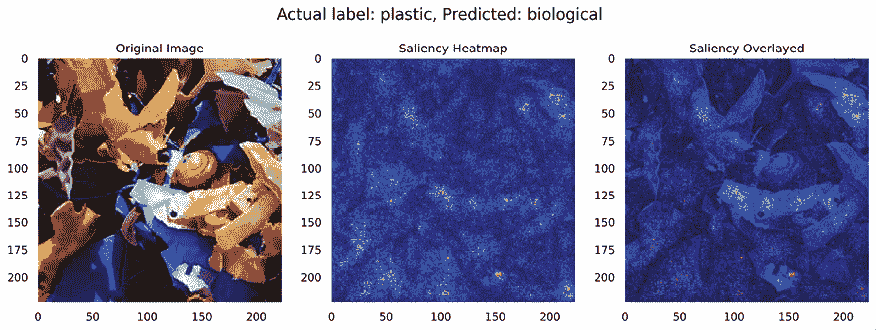

图 7.15：将塑料误分类为生物废物的显著性图

*图 7.15*中的样本图像看起来像是被撕碎的塑料，但预测结果是生物废物。标准的显著性图将这个预测主要归因于塑料上较平滑、较暗的区域。看起来是缺乏镜面高光让模型产生了偏差，但通常，较旧的破损塑料会失去光泽。

镜面高光是在物体表面反射光线时出现的明亮光点。它们通常是光源的直接反射，并且在光滑或光亮的表面上更为明显，例如金属、玻璃或水。

## 引导 Grad-CAM

要讨论**引导 Grad-CAM**，我们首先应该讨论**CAM**，它代表**类别激活图**。CAM 的工作方式是移除除了最后一层全连接层之外的所有层，并用**全局平均池化**（GAP）层替换最后一个**最大池化**层。GAP 层计算每个特征图的平均值，将其减少到每个图的单个值，而最大池化层通过从图的一个局部区域中的值集中选择最大值来减小特征图的大小。例如，在这个案例中：

1.  最后一个卷积层输出一个`1792` × `7` × `7`的张量。

1.  GAP 通过仅平均这个张量的最后两个维度来减少维度，产生一个`1792` × `1` × `1`的张量。

1.  然后，它将这个结果输入到一个有 12 个神经元的全连接层中，每个神经元对应一个类别。

1.  一旦重新训练了一个 CAM 模型并通过样本图像通过 CAM 模型，它将从最后一层（一个`1792` × `12`的张量）中提取与预测类别相对应的值（一个`1792` × `1`的张量）。

1.  然后，你计算最后一个卷积层输出（`1792` × `7` × `7`）与权重张量（`1792` x `1`）的点积。

1.  这个加权的总和将结束于一个`1` × `7` × `7`的张量。

1.  通过双线性插值将其拉伸到`1` × `224` × `224`，这变成了一个上采样后的激活图。当你上采样数据时，你增加了其维度。

CAM 背后的直觉是，CNN 在卷积层中本质上保留了空间细节，但遗憾的是，这些细节在全连接层中丢失了。实际上，最后一个卷积层中的每个滤波器代表不同空间位置上的视觉模式。一旦加权，它们就代表了整个图像中最显著的区域。然而，要应用 CAM，你必须彻底修改模型并重新训练它，而且有些模型并不容易适应这种修改。

如其名称所示，Grad-CAM 是一个类似的概念，但避免了修改和重新训练的麻烦，并使用梯度代替——具体来说，是关于卷积层激活图的类别分数（在 softmax 之前）的梯度。对这些梯度执行 GAP 操作以获得**神经元重要性权重**。然后，我们使用这些权重计算激活图的加权线性组合，随后是 ReLU。ReLU 非常重要，因为它确保定位只对结果产生正面影响的特征。像 CAM 一样，它通过双线性插值上采样以匹配图像的尺寸。

Grad-CAM 也有一些缺点，例如无法识别多个发生或由预测类别表示的物体的全部。像 CAM 一样，激活图的分辨率可能受到最终卷积层维度的限制，因此需要上采样。

因此，我们使用**引导 Grad-CAM**。引导 Grad-CAM 是 Grad-CAM 和引导反向传播的结合。引导反向传播是另一种可视化方法，它计算目标类别相对于输入图像的梯度，但它修改了反向传播过程，只传播正激活的正梯度。这导致了一个更高分辨率、更详细的可视化。这是通过将 Grad-CAM 热图（上采样到输入图像分辨率）与引导反向传播结果进行逐元素乘法来实现的。输出是一个可视化，强调给定类别在图像中最相关的特征，比单独的 Grad-CAM 具有更高的空间细节。

使用我们的`get_attribution_maps`函数为所有误分类样本生成 Grad-CAM 归因图。你需要的是 Captum 归因方法（`attr.GuidedGradCam`）、模型（`garbage_mdl`）、设备以及误分类样本的张量（`X_misclass`和`y_misclass`），并在方法初始化参数中，一个用于计算 Grad-CAM 归因的层：

```py
gradcam_maps = get_attribution_maps(
    attr.GuidedGradCam, garbage_mdl, device, X_misclass,\
    y_misclass, init_args={'layer':conv_layers[3]}
) 
```

注意，我们并没有使用最后一层（可以用`7`或`-1`索引）而是第四层（`3`）。这样做只是为了保持事情有趣，但我们也可以更改它。接下来，让我们像之前一样绘制归因图。代码几乎相同，只是将`saliency_maps`替换为`gradcam_maps`。输出结果如图*7.16*所示。

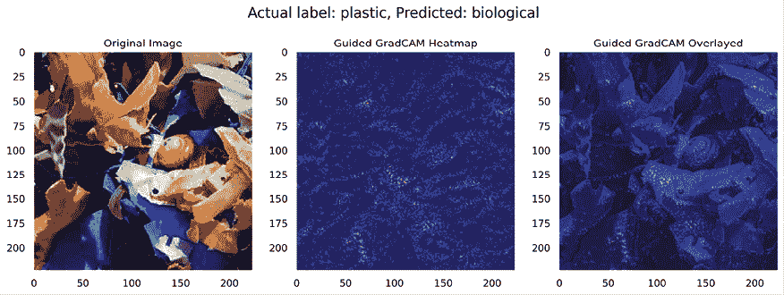

图 7.16：将塑料误分类为生物废物的引导 Grad-CAM 热图

如你在*图 7.16*中观察到的，与显著性归因图一样，类似的平滑哑光区域被突出显示，除了引导 Grad-CAM 产生一些亮区和边缘。

对所有这些内容都要持保留态度。在 CNN 解释领域，仍然存在许多持续的争论。研究人员仍在提出新的和更好的方法，甚至对于大多数用例几乎完美的技术仍然存在缺陷。关于类似 CAM 的方法，有许多新的方法，例如**Score-CAM**、**Ablation-CAM**和**Eigen-CAM**，它们提供了类似的功能，但不需要依赖梯度，而梯度可能是不稳定的，因此有时是不可靠的。我们在这里不会讨论它们，因为当然，它们不是基于梯度的！但是，尝试不同的方法以查看哪些适用于您的用例是有益的。

## 集成梯度

**集成梯度**（**IG**），也称为**路径积分梯度**，是一种不限于 CNN 的技术。您可以将它应用于任何神经网络架构，因为它计算了输出相对于输入的梯度，这些梯度是在从**基线**到实际输入之间的路径上平均计算的。它对卷积层的存在不敏感。然而，它需要定义一个基线，这个基线应该传达信号缺失的概念，比如一个均匀着色的图像。在实践中，特别是对于 CNN 来说，这表示零基线，对于每个像素来说，通常意味着一个完全黑色的图像。尽管名称暗示了使用**路径积分**，但积分并不是计算的，而是用足够小的区间内的求和来近似，对于一定数量的步骤。对于 CNN 来说，这意味着它使输入图像的变体逐渐变暗或变亮，直到它成为对应于预定义步骤数的基线。然后它将这些变体输入 CNN，为每个变体计算梯度，并取平均值。IG 是图像与梯度平均值之间的点积。

与 Shapley 值一样，IG 建立在坚实的数学理论基础上。在这种情况下，它是**线积分的基本定理**。IG 方法的数学证明确保了所有特征的归因之和等于模型在输入数据上的预测与在基线输入上的预测之间的差异。除了他们称之为**完备性**的这种属性之外，还有线性保持、对称保持和敏感性。我们在这里不会描述这些属性中的每一个。然而，重要的是要注意，一些解释方法满足显著的数学属性，而其他方法则从实际应用中证明了它们的有效性。

除了 IG 之外，我们还将利用`NoiseTunnel`对样本图像进行小的随机扰动——换句话说，就是添加噪声。它多次创建相同样本图像的不同噪声版本，然后计算每个版本的归因方法。然后它对这些归因进行平均，这可能是使归因图更加平滑的原因，这就是为什么这种方法被称为**SmoothGrad**。

但等等，你可能要问：那它不应该是一种基于扰动的算法吗？！在这本书中，我们之前已经处理了几种基于扰动的算法，从 SHAP 到锚点，它们共有的特点是它们扰动输入以测量对输出的影响。SmoothGrad 并不测量对输出的影响。它只帮助生成一个更鲁棒的归因图，因为扰动输入的平均归因应该会生成更可靠的归因图。我们进行交叉验证来评估机器学习模型也是出于同样的原因：在不同分布的测试数据集上执行的平均指标会生成更好的指标。

对于 IG，我们将使用与 Saliency 相同的非常相似的代码，除了我们将添加几个与`NoiseTunnel`相关的参数，例如噪声隧道的类型（`nt_type='smoothgrad'`）、用于生成的样本变化（`nt_samples=20`）以及添加到每个样本中的随机噪声的量（以标准差计`stdevs=0.2`）。我们会发现，生成的置换样本越多，效果越好，但达到一定程度后，效果就不会有太大变化。然而，噪声过多也是一种情况，如果你使用得太少，就不会有任何效果：

```py
ig_maps, smooth_ig_maps = get_attribution_maps(
    attr.IntegratedGradients, garbage_mdl, device, X_misclass,\
    y_misclass, nt_type='smoothgrad', nt_samples=20, stdevs=0.2
) 
```

我们还可以选择性地定义 IG 的步数（`n_steps`）。默认设置为`50`，我们还可以修改基线，默认情况下是一个全零的张量。正如我们使用 Grad-CAM 所做的那样，我们可以将第一个样本图像与 IG 图并排显示，但这次，我们将修改代码以在第三个位置绘制 SmoothGrad 集成梯度（`smooth_ig_maps`），如下所示：

```py
nt_attr_map = mldatasets.tensor_to_img(
    smooth_ig_maps[pos], to_numpy=True, cmap_norm='positive'
)
axs[2].imshow(nt_attr_map)
axs[2].grid(None)
axs[2].set_title("SmoothGrad Integrated Gradients") 
Figure 7.17:
```

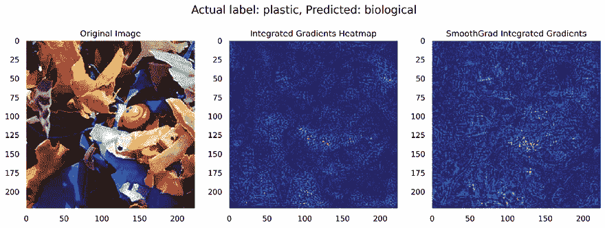

图 7.17：将塑料误分类为生物垃圾的集成梯度热图

在图 7.17 的 IG 热图中的区域与显著性图和引导 Grad-CAM 图检测到的许多区域相吻合。然而，在明亮的黄色区域以及棕色的阴影区域中，有更多的强归因簇，这与某些食物被丢弃时的外观（如香蕉皮和腐烂的叶状蔬菜）一致。另一方面，明亮的橙色和绿色区域则不是这样。

至于 SmoothGrad IG 热图，与不平滑的 IG 热图相比，这张图非常不同。这并不总是如此；通常，它只是更平滑的版本。可能发生的情况是`0.2`噪声对归因的影响过大，或者 20 个扰动样本不够。然而，很难说，因为也有可能 SmoothGrad 更准确地描绘了真实的故事。

我们现在不会做这件事，但你可以直观地“调整”`stdevs`和`nt_samples`参数。你可以尝试使用更少的噪声和更多的样本，使用一系列组合，例如`0.1`和`80`，以及`0.15`和`40`，试图找出它们之间是否存在共性。你所选择的那个最能清楚地描绘出这个一致的故事。SmoothGrad 的一个缺点是必须定义最优参数。顺便提一下，IG 在定义基线和步数（`n_steps`）方面也存在相同的问题。默认的基线在输入图像太大或太小时将不起作用，因此必须更改，IG 论文的作者建议 20-300 步将使积分在 5%以内。

## 奖励方法：DeepLIFT

IG 有一些批评者，他们已经创建了避免使用梯度的类似方法，例如**DeepLIFT**。IG 对零值梯度和梯度的不连续性可能很敏感，这可能导致误导性的归因。但这些指向的是所有基于梯度的方法共有的缺点。因此，我们引入了**深度学习重要特征**算法（**DeepLIFT**）。它既不是基于梯度的，也不是基于扰动的。它是一种基于反向传播的方法！

在本节中，我们将将其与 IG 进行对比。像 IG 和 Shapley 值一样，DeepLIFT 是为了**完整性**而设计的，因此符合显著的数学性质。除此之外，像 IG 一样，DeepLIFT 也可以应用于各种深度学习架构，包括 CNN 和**循环神经网络**（**RNN**），使其适用于不同的用例。

DeepLIFT 通过使用“参考差异”的概念，将模型的输出预测分解为每个输入特征的贡献。它通过网络层反向传播这些贡献，为每个输入特征分配一个重要性分数。

更具体地说，像 IG 一样，它使用一个基线，该基线代表关于任何类别的信息。然而，它随后计算输入和基线之间每个神经元的激活差异，并通过网络反向传播这些差异，计算每个神经元对输出预测的贡献。然后我们为每个输入特征求和其贡献，以获得其重要性分数（归因）。

它相对于 IG 的优势如下：

+   **基于参考的**：与 IG 等基于梯度的方法不同，DeepLIFT 明确地将输入与参考输入进行比较，这使得归因更加可解释和有意义。

+   **非线性交互**：DeepLIFT 在计算归因时考虑了神经元之间的非线性交互。它通过考虑神经网络每一层的乘数（由于输入的变化而导致的输出的变化）来捕捉这些交互。

+   **稳定性**：DeepLIFT 比基于梯度的方法更稳定，因为它对输入的小变化不太敏感，提供了更一致的归因。因此，在 DeepLIFT 归因上使用 SmoothGrad 是不必要的，尽管对于基于梯度的方法来说强烈推荐。

总体而言，DeepLIFT 提供了一种更可解释、更稳定和更全面的归因方法，使其成为理解和解释深度学习模型的有价值工具。

接下来，我们将以类似的方式创建 DeepLIFT 归因图：

```py
deeplift_maps = get_attribution_maps(attr.DeepLift, garbage_mdl,\
                                     device, X_misclass, y_misclass) 
```

要绘制一个归因图，使用的代码几乎与 Grad-CAM 相同，只是将`gradcam_maps`替换为`deeplift_maps`。输出在*图 7.18*中展示。

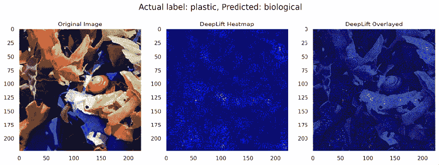

图 7.18：将塑料误分类为生物废物的 DeepLIFT 热图

*图 7.18*的归因不如 IG 那样嘈杂。但它们似乎也聚集在阴影中的一些单调的黄色和深色区域；它还指向右上角附近的一些单调的绿色。

## 将所有这些结合起来

现在，我们将运用我们所学到的关于基于梯度的归因方法的一切知识，来理解所有选择的错误分类（塑料的假阴性金属的假阳性）的原因。正如我们处理中间激活图一样，我们可以利用`compare_img_pred_viz`函数将高分辨率的样本图像与四个归因图并排显示：显著性、Grad-CAM、SmoothGrad IG 和 DeepLift。为此，我们首先必须迭代所有错误分类的位置和索引，并提取所有图。请注意，我们正在使用`tensor_to_img`函数中的`overlay_bg`来生成一个新的图像，每个图像都叠加了原始图像和热图。最后，我们将四个归因输出连接成一个单独的图像（`viz_img`）。正如我们之前所做的那样，我们提取实际的标签（`y_true`）、预测标签（`y_pred`）和带有概率的`pandas`系列（`probs_s`），以便为我们将生成的图表添加一些上下文。`for`循环将生成六个图表，但为了简洁起见，我们只将讨论其中的三个：

```py
for pos, idx in enumerate(misclass_idxs):
    orig_img = mldatasets.tensor_to_img(test_400_data[idx][0],\
                                   norm_std, norm_mean, to_numpy=True)
    bg_img = mldatasets.tensor_to_img(test_data[idx][0],\
                                   norm_std, norm_mean, to_numpy=True)
    map1 = mldatasets.tensor_to_img(
        saliency_maps[pos], to_numpy=True,\
        cmap_norm='positive', overlay_bg=bg_img
    )
    map2 = mldatasets.tensor_to_img(
        smooth_ig_maps[pos],to_numpy=True,\
        cmap_norm='positive', overlay_bg=bg_img
    )
    map3 = mldatasets.tensor_to_img(
        gradcam_maps[pos], to_numpy=True,\
        cmap_norm='positive', overlay_bg=bg_img
    )
    map4 = mldatasets.tensor_to_img(
        deeplift_maps[pos], to_numpy=True,\
        cmap_norm='positive', overlay_bg=bg_img
    )
    viz_img = cv2.vconcat([
        cv2.hconcat([map1, map2]),
        cv2.hconcat([map3, map4])
    ])
    label = int(y_test[idx])
    y_true = labels_l[label]
    y_pred = y_test_pred[idx]
    probs_s = probs_df.loc[idx]
    title = 'Gradient-Based Attr for Misclassification Sample #{}'.\
                                                           format(idx)
    mldatasets.compare_img_pred_viz(orig_img, viz_img, y_true,\
                                    y_pred, probs_s, title=title) 
```

之前的代码生成了*图 7.19*到*图 7.21*。重要的是要注意，在所有生成的图表中，我们都可以观察到左上角的显著性归因、右上角的 SmoothGrad IG、左下角的引导 Grad-CAM 和右下角的 DeepLIFT：

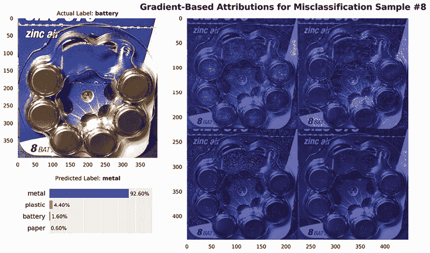

图 7.19：金属误分类为电池的基于梯度的归因 #8

在*图 7.19*中，所有四种归因方法之间缺乏一致性。显著性归因图显示，所有电池的中心部分都被视为金属表面，除了纸箱的白色部分。另一方面，SmoothGrad IG 主要聚焦于白色纸箱，而 Grad-CAM 几乎完全聚焦于蓝色纸箱。最后，DeepLIFT 的归因非常稀疏，仅指向白色纸箱的一些部分。

在*图 7.20*中，归因比*图 7.19*中的一致性要好得多。哑光白色区域明显让模型感到困惑。考虑到训练数据中的塑料主要是空塑料容器的单个部件——包括白色牛奶壶——这是有道理的。然而，人们确实回收玩具、塑料工具如勺子和其他塑料物品。有趣的是，尽管所有归因方法都在白色和浅黄色表面上都很显著，SmoothGrad IG 还突出了某些边缘，如一只鸭子的帽子和另一只的领子：

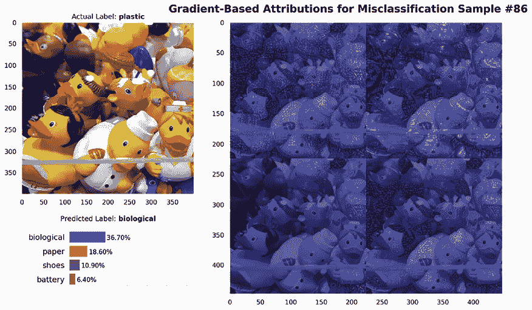

图 7.20：塑料误分类的基于梯度的归因 #86

继续探讨回收玩具的主题，乐高积木是如何被错误分类为电池的？参见*图 7.21*以获取解释：

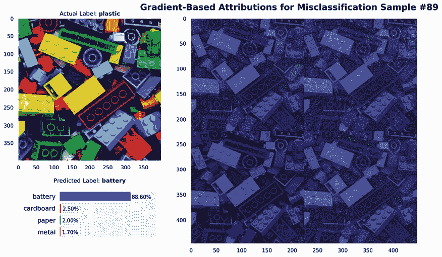

图 7.21：塑料误分类的基于梯度的归因 #89

*图 7.21*展示了在所有归因方法中，主要是黄色和绿色的积木（以及较少的浅蓝色）是误分类的罪魁祸首，因为这些颜色在电池制造商中很受欢迎，正如训练数据所证明的那样。此外， studs 之间的平面表面获得了最多的归因，因为这些表面与电池的接触相似，尤其是 9 伏方形电池。与其他示例一样，显著性是最嘈杂的方法。然而，这次，引导 Grad-CAM 是最不嘈杂的。它也比其他方法在边缘上的显著性更强，而不是在表面上。

我们接下来将尝试通过在真实正例上执行的基于扰动的归因方法，来发现模型关于电池（除了白色玻璃之外）学到了什么。

# 通过扰动归因方法理解分类

到目前为止，这本书已经对基于扰动的方 法进行了大量的介绍。因此，我们介绍的大多数方法，包括 SHAP、LIME、锚点，甚至排列特征重要性，都采用了基于扰动的策略。这些策略背后的直觉是，如果你从你的输入数据中删除、更改或屏蔽特征，然后使用它们进行预测，你将能够将新预测与原始预测之间的差异归因于你在输入中做出的更改。这些策略可以在全局和局部解释方法中加以利用。

我们现在将像对错误分类样本所做的那样做，但针对选定的真阳性，并在单个张量（`X_correctcls`）中收集每个类别的四个样本：

```py
correctcls_idxs = wglass_TP_idxs[:4] + battery_TP_idxs[:4] 
correctcls_data = torch.utils.data.Subset(test_data, correctcls_idxs)
correctcls_loader = torch.utils.data.DataLoader(correctcls_data,\
                                                batch_size = 32)
X_correctcls, y_correctcls = next(iter(correctcls_loader))
X_correctcls, y_correctcls = X_correctcls.to(device),\
                             y_correctcls.to(device) 
```

在图像上执行排列方法的一个更复杂方面是，不仅有几十个特征，而是有成千上万个特征需要排列。想象一下：224 x 224 等于 50,176 像素，如果我们想测量每个像素独立变化对结果的影响，我们至少需要为每个像素制作 20 个排列样本。所以，超过一百万！因此，几个排列方法接受掩码来确定一次要排列哪些像素块。如果我们将它们分成 32 x 32 像素的块，这意味着我们总共只有 49 个块需要排列。然而，尽管这会加快归因方法的速度，但如果我们块越大，就会错过对较小像素集的影响。

我们可以使用许多方法来创建掩码，例如使用分割算法根据表面和边缘将图像分割成直观的块。分割是按图像进行的，因此段的数量和位置将在图像之间变化。scikit-learn 的图像分割库（`skimage.segmentation`）有许多方法：[`scikit-image.org/docs/stable/api/skimage.segmentation.html`](https://scikit-image.org/docs/stable/api/skimage.segmentation.html)。然而，我们将保持简单，并使用以下代码为所有 224 x 224 图像创建一个掩码：

```py
feature_mask = torch.zeros(3, 224, 224).int().to(device)
counter = 0
strides = 16
for row in range(0, 224, strides):
    for col in range(0, 224, strides):
        feature_mask[:, row:row+strides, col:col+strides] = counter
        counter += 1 
```

前面的代码所做的初始化一个与模型输入大小相同的零张量。将这个张量概念化为一个空图像会更简单。然后它沿着 16 像素宽和高的步长移动，从图像的左上角到右下角。在移动过程中，它使用`counter`设置连续数字的值。最终你得到一个所有值都填充了 0 到 195 之间数字的张量，如果你将其可视化为一幅图像，它将是一个从左上角的黑色到右下角浅灰色的对角渐变。重要的是要注意，具有相同值的每个块都被归因方法视为相同的像素。

在我们继续前进之前，让我们讨论一下基线。在 Captum 归因方法中，正如其他库的情况一样，默认基线是一个全零张量，当图像由介于 0 和 1 之间的浮点数组成时，这通常等同于一个黑色图像。然而，在我们的情况下，我们正在标准化我们的输入张量，这样模型就不会看到最小值为 0 但平均值为 0 的张量！因此，对于我们的垃圾模型，全零张量对应于中等灰色图像，而不是黑色图像。对于基于梯度的方法，灰色图像基线本身并没有固有的错误，因为很可能存在许多步骤介于它和输入图像之间。然而，基于扰动的方 法可能对基线过于接近输入图像特别敏感，因为如果你用基线替换输入图像的部分，模型将无法区分出来！

对于我们的垃圾模型的情况，一个黑色图像由张量`-2.1179`组成，因为我们对输入张量执行标准化操作之一是`(x-0.485)/0.229`，当`x=0`时，这恰好等于大约`-2.1179`。你还可以计算当`x=1`时的张量；它转换为白色图像的`2.64`。话虽如此，假设在我们的真实阳性样本中，至少有一个像素具有最低值，另一个具有最高值，是没有害处的，因此我们将只使用`max()`和`min()`来创建亮暗基线：

```py
baseline_light = float(X_correctcls.max().detach().cpu())
baseline_dark = float(X_correctcls.min().detach().cpu()) 
```

我们将只对除了一个扰动方法之外的所有方法使用一个基线，但请随意切换它们。现在，让我们继续为每种方法创建归因图！

## 特征消除

**特征消除**是一种相对简单的方法。它所做的是通过用基线替换它来遮挡样本输入图像的一部分，默认情况下，基线为零。目标是通过对改变它的效果进行观察，了解每个输入特征（或特征组）在做出预测中的重要性。

这就是特征消除是如何工作的：

1.  **获取原始预测**：首先，获取模型对原始输入的预测。这作为比较扰动输入特征效果的基准。

1.  **扰动输入特征**：接下来，对于每个输入特征（或由特征掩码设置的特征组），它被替换为基线值。这创建了一个“消除”版本的输入。

1.  **获取扰动输入的预测**：计算消除输入的模型预测。

1.  **计算归因**：计算原始输入和消除输入之间模型预测的差异。这个差异归因于改变的特征，表明它在预测中的重要性。

特征消除是一种简单直观的方法，用于理解模型预测中输入特征的重要性。然而，它也有一些局限性。它假设特征是独立的，可能无法准确捕捉特征之间交互的影响。此外，对于具有大量输入特征或复杂输入结构的模型，它可能计算成本高昂。尽管存在这些局限性，特征消除仍然是理解和解释模型行为的一个有价值的工具。

要生成归因图，我们将使用之前使用的`get_attribution_maps`函数，并输入额外的`feature_mask`和`baselines`参数：

```py
ablation_maps = get_attribution_maps(
    attr.FeatureAblation,garbage_mdl,\
    device,X_correctcls,y_correctcls,\
    feature_mask=feature_mask,\
    baselines=baseline_dark
) 
```

要绘制归因图的示例，你可以复制我们用于显著性的相同代码，只是将`saliency_maps`替换为`ablation_maps`，并且我们使用`occlusion_maps`数组中的第二个图像，如下所示：

```py
pos = 2
orig_img = mldatasets.tensor_to_img(X_correctcls[pos], norm_std,\
                                    norm_mean, to_numpy=True)
attr_map = mldatasets.tensor_to_img(occlusion_maps[pos],to_numpy=True,\
                         cmap_norm='positive') 
Figure 7.22:
```


图 7.22：测试数据集中白色玻璃真阳性的特征消除图

在*图 7.22*中，酒杯底部的特征组似乎是最重要的，因为它们的缺失对结果的影响最大，但酒杯的其他部分也有一定程度的显著性，除了酒杯的茎。这是有道理的，因为没有茎的酒杯仍然是一个类似玻璃的容器。

接下来，我们将讨论一种类似的方法，它将能够以更详细的方式展示归因。

## 遮挡敏感性

**遮挡敏感性**与特征消除非常相似，因为它也用基线替换了图像的部分。然而，与特征消除不同，它不使用特征掩码来分组像素。相反，它使用滑动窗口和步长自动将连续特征分组，在这个过程中，它创建了多个重叠区域。当这种情况发生时，它会对输出差异进行平均，以计算每个像素的归因。

在这个场景中，除了重叠区域及其对应平均值之外，遮挡敏感性和特征消除是相同的。事实上，如果我们使用滑动窗口和 3 x 16 x 16 的步长，就不会有任何重叠区域，特征分组将与由 16 x 16 块组成的`feature_mask`定义的特征分组相同。

那么，你可能想知道，熟悉这两种方法有什么意义？意义在于遮挡敏感性仅在固定分组连续特征很重要时才适用，比如图像和可能的其他空间数据。由于其使用步长，它可以捕捉特征之间的局部依赖性和空间关系。然而，尽管我们使用了连续的特征块，特征消融不必如此，因为`feature_mask`可以以任何对输入进行分段最有意义的方式排列。这个细节使其非常适用于其他数据类型。因此，特征消融是一种更通用的方法，可以处理各种输入类型和模型架构，而遮挡敏感性则是专门针对图像数据和卷积神经网络定制的，重点关注特征之间的空间关系。

要生成遮挡的归因图，我们将像以前一样操作，并输入额外的参数`baselines`、`sliding_window_shapes`和`strides`：

```py
occlusion_maps = get_attribution_maps(
    attr.Occlusion, garbage_mdl,\
    device,X_correctcls,y_correctcls,\
    baselines=baseline_dark,\
    sliding_window_shapes=(3,16,16),\
    strides=(3,8,8)
) 
```

请注意，我们通过将步长设置为仅 8 像素，而滑动窗口为 16 像素，创建了充足的重叠区域。要绘制归因图，你可以复制我们用于特征消融的相同代码，只是将`ablation_maps`替换为`occlusion_maps`。输出如图**图 7.23**所示：

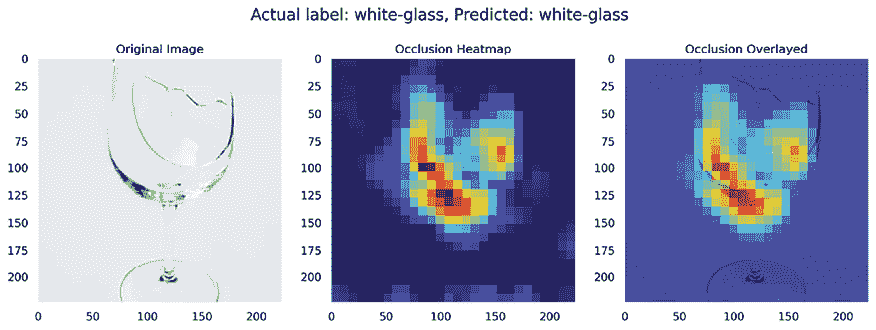

图 7.23：测试数据集中白色玻璃真阳性的遮挡敏感性图

通过**图 7.23**，我们可以看出遮挡的归因与消融的归因惊人地相似，只是分辨率更高。考虑到前者的特征掩码与后者的滑动窗口对齐，这种相似性并不令人惊讶。

无论我们使用 16 x 16 像素的非重叠块还是 8 x 8 像素的重叠块，它们的缺失影响都是独立测量的，以创建归因。因此，消融和遮挡方法都没有装备来测量非连续特征组之间的交互。当两个非连续特征组的缺失导致分类发生变化时，这可能会成为一个问题。例如，没有把手或底座的酒杯还能被认为是酒杯吗？当然可以被认为是玻璃，人们希望如此，但也许模型学到了错误的关系。

说到关系，接下来，我们将回顾一个老朋友：Shapley！

## Shapley 值采样

如果你还记得*第四章*，*全局模型无关解释方法*，Shapley 提供了一种非常擅长衡量和归因特征联盟对结果影响的方法。Shapley 通过一次对整个特征联盟进行排列，而不是像前两种方法那样一次排列一个特征，来实现这一点。这样，它可以揭示多个特征或特征组如何相互作用。

创建归因图的代码现在应该非常熟悉了。这种方法使用`feature_mask`和`baselines`，但也测试了特征排列的数量（`n_samples`）。这个最后的属性对方法的保真度有巨大影响。然而，它可能会使计算成本变得非常昂贵，所以我们不会使用默认的每个排列 25 个样本来运行它。相反，我们将使用 5 个样本来使事情更易于管理。然而，如果你的硬件能够处理，请随意调整它：

```py
svs_maps = get_attribution_maps(
    attr.ShapleyValueSampling,garbage_mdl,\
    device, X_correctcls, y_correctcls,\
    baselines=baseline_dark,\
    n_samples=5, feature_mask=feature_mask
) 
occlusion_maps is replaced by svs_maps. The output is shown in *Figure 7.24*:
```

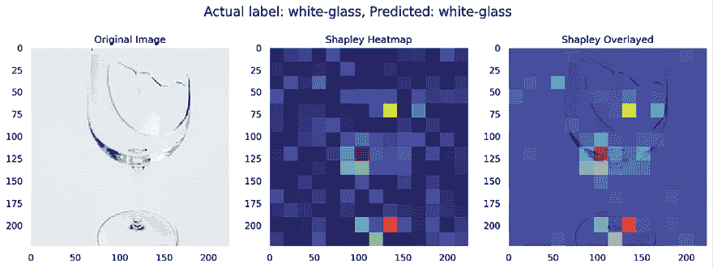

图 7.24：测试数据集中白色玻璃真阳性的 Shapley 值采样图

*图 7.24*显示了一些一致的归因，例如最显著的区域位于酒杯碗的左下角。此外，底部似乎比遮挡和消融方法更重要。

然而，这些归因比之前的要嘈杂得多。这部分的理由是因为我们没有使用足够数量的样本来覆盖所有特征和交互的组合，部分原因是因为交互的混乱性质。对于单个独立特征的归因集中在几个区域是有意义的，例如酒杯的碗。然而，交互可能依赖于图像的几个部分，例如酒杯的底部和边缘。它们可能只有在它们一起出现时才变得重要。更有趣的是背景的影响。例如，如果你移除背景的一部分，酒杯是否不再像酒杯？也许背景比你想象的更重要，尤其是在处理半透明材料时。

## KernelSHAP

既然我们谈论到了 Shapley 值，那么让我们尝试一下来自*第四章*，*全局模型无关解释方法*中的`KernelSHAP`。它利用 LIME 来更高效地计算 Shapley 值。Captum 的实现与 SHAP 类似，但它使用的是线性回归而不是 Lasso，并且计算核的方式也不同。此外，对于 LIME 图像解释器，最好使用有意义的特征组（称为超像素）而不是我们在特征掩码中使用的连续块。同样的建议也适用于`KernelSHAP`。然而，为了这个练习的简单性，我们也将保持一致性，并与其他三种基于排列的方法进行比较。

我们现在将创建归因图，但这次我们将使用浅色基线和深色基线各做一个。因为`KernelSHAP`是对 Shapley 采样值的近似，并且计算成本不是很高，所以我们可以将`n_samples`设置为 300。然而，这并不一定能保证高保真度，因为`KernelSHAP`需要大量的样本来近似相对较少的样本可以用 Shapley 彻底做到的事情：

```py
kshap_light_maps = get_attribution_maps(attr.KernelShap, garbage_mdl,\
                                  device, X_correctcls, y_correctcls,\
                                  baselines=baseline_light,\
                                  n_samples=300,\
                                  feature_mask=feature_mask)
kshap_dark_maps = get_attribution_maps(attr.KernelShap, garbage_mdl,\
                                  device, X_correctcls, y_correctcls,\
                                  baselines=baseline_dark,\
                                  n_samples=300,\
                                  feature_mask=feature_mask) 
svs_maps is replaced by kshap_light_maps, and we modify the code to plot the attributions with the dark baselines in the third position, like this:
```

```py
axs[2].imshow(attr_dark_map)
axs[2].grid(None)
axs[2].set_title("Kernel Shap Dark Baseline Heatmap") 
Figure 7.25:
```

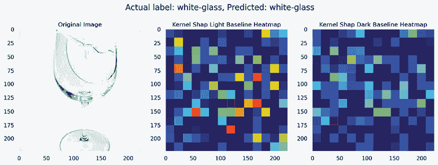

图 7.25：测试数据集中白色玻璃真正阳性的 KernelSHAP 图

*图 7.25*中的两个归因图在大多数情况下并不一致，更重要的是，与之前的归因不一致。有时，某些方法比其他方法更难，或者需要一些调整才能按预期工作。

## 将所有这些结合起来

现在，我们将利用关于基于扰动归因方法的所有知识，来理解所有选择的真正阳性分类（无论是白色玻璃还是电池）的原因。正如我们之前所做的那样，我们可以利用`compare_img_pred_viz`函数将高分辨率样本图像与四个归因图并排放置：特征消融、遮挡敏感性、Shapley 和`KernelSHAP`。首先，我们必须迭代所有分类的位置和索引，并提取所有图。请注意，我们正在使用`overlay_bg`来生成一个新的图像，该图像将每个归因的热图叠加到原始图像上，就像我们在基于梯度的部分所做的那样。最后，我们将四个归因输出连接成一个单独的图像（`viz_img`）。正如我们之前所做的那样，我们提取实际的标签（`y_true`）、预测标签（`y_pred`）和包含概率的`pandas`系列（`probs_s`），以便为我们将生成的图表添加一些上下文。`for`循环将生成六个图表，但我们只会讨论其中的两个：

```py
for pos, idx in enumerate(correctcls_idxs):
    orig_img = mldatasets.tensor_to_img(test_400_data[idx][0],\
                                        norm_std, norm_mean,\
                                        to_numpy=True)
    bg_img = mldatasets.tensor_to_img(test_data[idx][0],\
                                      norm_std, norm_mean,\
                                      to_numpy=True)
    map1 = mldatasets.tensor_to_img(ablation_maps[pos],\
                                    to_numpy=True,\
                                    cmap_norm='positive',\
                                    overlay_bg=bg_img)
    map2 = mldatasets.tensor_to_img(svs_maps[pos], to_numpy=True,\
                                    cmap_norm='positive',\
                                    overlay_bg=bg_img)
    map3 = mldatasets.tensor_to_img(occlusion_maps[pos],\
                                    to_numpy=True,\
                                    cmap_norm='positive',\
                                    overlay_bg=bg_img)
    map4 = mldatasets.tensor_to_img(kshap_dark_maps[pos],\
                                    to_numpy=True,\
                                    cmap_norm='positive',\
                                    overlay_bg=bg_img)
    viz_img = cv2.vconcat([
            cv2.hconcat([map1, map2]),
            cv2.hconcat([map3, map4])
        ])
    label = int(y_test[idx])
    y_true = labels_l[label]
    y_pred = y_test_pred[idx]
    probs_s = probs_df.loc[idx]
    title = 'Pertubation-Based Attr for Correct classification #{}'.\
                format(idx)
    mldatasets.compare_img_pred_viz(orig_img, viz_img, y_true,\
                                    y_pred, probs_s, title=title) 
Figures 7.26 to *7.28*. For your reference, ablation is in the top-left corner and occlusion is at the bottom left. Then, Shapley is at the top right and KernelSHAP is at the bottom right.
```

总体来说，你可以看出消融和遮挡非常一致，而 Shapley 和`KernelSHAP`则不太一致。然而，Shapley 和`KernelSHAP`的共同之处在于归因更加分散。

在*图 7.26*中，所有归因方法都突出了文本，以及至少电池的左侧接触。这与*图 7.28*相似，那里的文本也被大量突出显示，以及顶部接触。这表明，对于电池，模型已经学会了文本和接触都很重要。至于白色玻璃，则不太清楚。*图 7.27*中的所有归因方法都指向破碎花瓶的一些边缘，但并不总是相同的边缘（除了消融和遮挡，它们是一致的）：

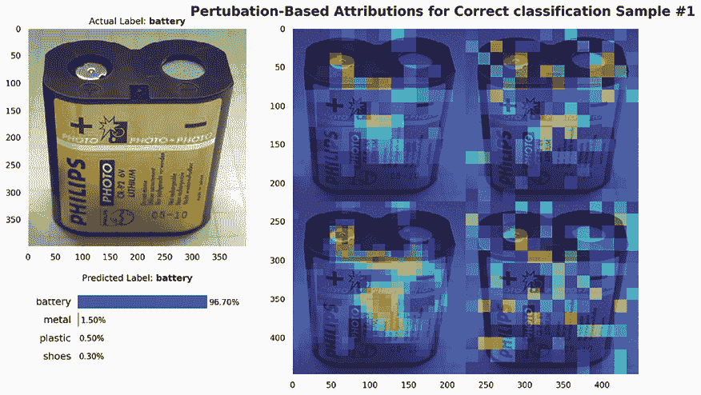

图 7.26：电池分类的第 1 个基于扰动的归因

白色玻璃是三种玻璃中最难分类的，原因也不难理解：

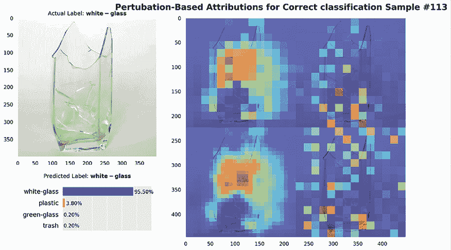

**图 7.27**：基于扰动的白色玻璃分类#113 的归因

如**图 7.27**和其他测试示例中所述，模型很难区分白色玻璃和浅色背景。它设法用这些例子正确分类。然而，这并不意味着它在其他例子中也能很好地泛化，例如玻璃碎片和照明不足的情况。只要归因显示背景有显著的影响，就很难相信它仅凭镜面高光、纹理和边缘就能识别玻璃。

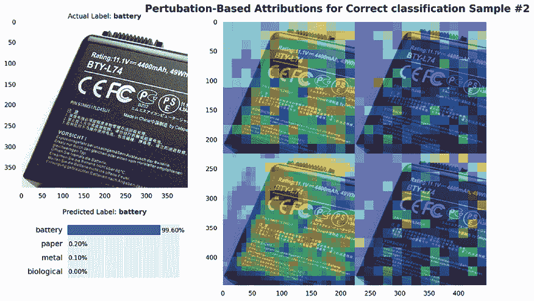

**图 7.28**：基于扰动的电池分类#2 的归因

对于**图 7.28**，在所有归因图中背景也被显著突出。但也许这是因为基线是暗的，整个物体也是如此。如果你用黑色方块替换电池边缘外的区域，模型会感到困惑是有道理的。因此，在使用基于排列的方法时，选择一个合适的基线非常重要。

# 任务完成

任务是提供一个对市政回收厂垃圾分类模型的客观评估。在样本外验证图像上的预测性能非常糟糕！你本可以就此停止，但那样你就不知道如何制作一个更好的模型。

然而，预测性能评估对于推导出特定的误分类以及正确的分类，以评估使用其他解释方法至关重要。为此，你运行了一系列的解释方法，包括激活、梯度、扰动和基于反向传播的方法。所有方法的一致意见是模型存在以下问题：

+   区分背景和物体

+   理解不同物体共享相似的颜色色调

+   混乱的照明条件，例如像酒杯那样的特定材料特性产生的镜面高光

+   无法区分每个物体的独特特征，例如乐高砖块中的塑料凸起与电池接触

+   被由多种材料组成的物体所困惑，例如塑料包装和纸盒包装中的电池

为了解决这些问题，模型需要用更多样化的数据集进行训练——希望是一个反映回收厂真实世界条件的数据集；例如，预期的背景（在输送带上）、不同的照明条件，甚至被手、手套、袋子等部分遮挡的物体。此外，他们应该为由多种材料组成的杂项物体添加一个类别。

一旦这个数据集被编译，利用数据增强使模型对各种变化（角度、亮度、对比度、饱和度和色调变化）更加鲁棒是至关重要的。他们甚至不需要从头开始重新训练模型！他们甚至可以微调 EfficientNet！

# 摘要

阅读本章后，你应该了解如何利用传统的解释方法来更全面地评估 CNN 分类器的预测性能，并使用基于激活的方法可视化 CNN 的学习过程。你还应该了解如何使用基于梯度和扰动的方法比较和对比误分类和真实正例。在下一章中，我们将研究 NLP 变换器的解释方法。

# 进一步阅读

+   Smilkov, D., Thorat, N., Kim, B., Viégas, F., and Wattenberg, M., 2017, *SmoothGrad: 通过添加噪声去除噪声*. ArXiv, abs/1706.03825: [`arxiv.org/abs/1706.03825`](https://arxiv.org/abs/1706.03825)

+   Sundararajan, M., Taly, A., and Yan, Q., 2017, *深度网络的公理化归因*. 机器学习研究会议论文集，第 3319–3328 页，国际会议中心，悉尼，澳大利亚: [`arxiv.org/abs/1703.01365`](https://arxiv.org/abs/1703.01365)

+   Zeiler, M.D., and Fergus, R., 2014, *视觉化和理解卷积网络*. 在欧洲计算机视觉会议，第 818–833 页: [`arxiv.org/abs/1311.2901`](https://arxiv.org/abs/1311.2901)

+   Shrikumar, A., Greenside, P., and Kundaje, A., 2017, *通过传播激活差异学习重要特征*: [`arxiv.org/abs/1704.02685`](https://arxiv.org/abs/1704.02685)

# 在 Discord 上了解更多

要加入本书的 Discord 社区——在那里你可以分享反馈、向作者提问，并了解新版本——请扫描下面的二维码：

`packt.link/inml`


