# 偏差缓解和因果推断方法

在第六章“锚点和反事实解释”中，我们探讨了公平及其与决策的关系，但仅限于事后模型解释方法。在第十章“用于可解释性的特征选择和工程”中，我们提出了成本敏感性的问题，这通常与平衡或公平相关。在本章中，我们将探讨平衡数据和调整模型以实现公平的方法。

使用信用卡违约数据集，我们将学习如何利用目标可视化工具，如类平衡，来检测不希望的偏差，然后通过预处理方法，如重新加权和不平等影响移除（用于处理过程中）和等概率（用于后处理）来减少它。从第六章的“锚点和反事实解释”和第十章的“用于可解释性的特征选择和工程”等主题扩展，我们还将研究政策决策可能产生意外、反直觉或有害的影响。在假设检验的背景下，一个决策被称为**治疗**。对于许多决策场景，估计其效果并确保这个估计是可靠的至关重要。

因此，我们将假设针对最脆弱的信用卡违约人群的治疗方法，并利用因果模型来确定其**平均治疗效果**（**ATE**）和**条件平均治疗效果**（**CATE**）。最后，我们将使用各种方法测试因果假设和估计的稳健性。

这些是我们将要涵盖的主要主题：

+   检测偏差

+   缓解偏差

+   创建因果模型

+   理解异质治疗效果

+   测试估计的稳健性

# 技术要求

本章的示例使用了`mldatasets`、`pandas`、`numpy`、`sklearn`、`lightgbm`、`xgboost`、`matplotlib`、`seaborn`、`xai`、`aif360`、`econml`和`dowhy`库。有关如何安装所有这些库的说明见前言。

本章的代码位于此处：

[`packt.link/xe6ie`](https://packt.link/xe6ie)

# 任务

全球流通的信用卡超过 28 亿张，我们每年在它们上的总消费超过 25 万亿美元（美元）（[`www.ft.com/content/ad826e32-2ee8-11e9-ba00-0251022932c8`](https://www.ft.com/content/ad826e32-2ee8-11e9-ba00-0251022932c8)）。这无疑是一个天文数字，但衡量信用卡行业的规模，不应仅看消费额，而应看债务总额。银行等发卡机构主要通过收取利息来赚取大部分收入。因此，消费者（2022 年）欠下的超过 60 万亿美元的债务，其中信用卡债务占很大一部分，为贷方提供了稳定的利息收入。这可能有利于商业，但也带来了充足的风险，因为如果借款人在本金加运营成本偿还之前违约，贷方可能会亏损，尤其是当他们已经用尽法律途径追讨债务时。

当出现信用泡沫时，这个问题会加剧，因为不健康的债务水平可能会损害贷方的财务状况，并在泡沫破裂时将他们的股东拖下水。2008 年的住房泡沫，也称为次贷危机，就是这种情况。这些泡沫通常始于对增长的投机和对无资格需求的寻求，以推动这种增长。在次贷危机的情况下，银行向那些没有证明还款能力的个人提供了抵押贷款。遗憾的是，他们也针对了少数族裔，一旦泡沫破裂，他们的全部净资产就会被清零。金融危机、萧条以及介于两者之间的每一次灾难，往往以更高的比率影响最脆弱的人群。

信用卡也涉及到了灾难性的泡沫，特别是在 2003 年的韩国([`www.bis.org/repofficepubl/arpresearch_fs_200806.10.pdf`](https://www.bis.org/repofficepubl/arpresearch_fs_200806.10.pdf))和 2006 年的台湾。本章将考察 2005 年的数据，导致台湾信用卡危机。到 2006 年，逾期信用卡债务达到 2680 亿美元，由超过 70 万人欠下。超过 3%的台湾人口甚至无法支付信用卡的最低还款额，俗称为**信用卡奴隶**。随之而来的是重大的社会影响，如无家可归者数量的急剧增加、毒品走私/滥用，甚至自杀。在 1997 年亚洲金融危机之后，该地区的自杀率稳步上升。2005 年至 2006 年间的 23%的增幅将台湾的自杀率推到了世界第二高。

如果我们将危机追溯到其根本原因，那是因为新发卡银行已经耗尽了一个饱和的房地产市场，削减了获取信用卡的要求，而当时这些信用卡的监管由当局执行得并不好。

这对年轻人影响最大，因为他们通常收入较低，管理资金的经验也较少。2005 年，台湾金融监督管理委员会发布了新规定，提高了信用卡申请人的要求，防止出现新的信用卡奴隶。然而，还需要更多的政策来处理系统中已经存在的债务和债务人。

当局开始讨论创建**资产管理公司**（**AMCs**）以从银行的资产负债表中剥离不良债务。他们还希望通过一项*债务人还款规定*，为谈判合理的还款计划提供一个框架。这两项政策直到 2006 年才被纳入法律。

假设一下，现在是 2005 年 8 月，你从未来带着新颖的机器学习和因果推理方法来到这里！一家台湾银行希望创建一个分类模型来预测将违约的客户。他们为你提供了一份包含 30,000 名信用卡客户的数据库。监管机构仍在起草法律，因此有机会提出既有利于银行又有利于债务人的政策。当法律通过后，他们可以使用分类模型预测哪些债务应该卖给资产管理公司（AMCs），并通过因果模型估计哪些政策将有利于其他客户和银行，但他们希望公平且稳健地完成这项任务——这是你的使命！

# 方法

银行已经强调，将公平性嵌入到你的方法中是多么重要，因为监管机构和公众普遍希望确保银行不会造成更多的伤害。他们的声誉也依赖于这一点，因为在最近几个月里，媒体一直在无情地指责他们进行不诚实和掠夺性贷款行为，导致消费者失去信任。因此，他们希望使用最先进的稳健性测试来证明规定的政策将减轻问题。你提出的方法包括以下要点：

+   据报道，年轻放贷人更容易违约还款，因此你预计会发现年龄偏差，但你也会寻找其他受保护群体，如性别，的偏差。

+   一旦检测到偏差，你可以使用**AI Fairness 360**（**AIF360**）库中的预处理、处理和后处理算法来*减轻偏差*。在这个过程中，你将使用每个算法训练不同的模型，评估它们的公平性，并选择最公平的模型。

+   为了能够理解政策的影响，银行对一小部分客户进行了一项实验。通过实验结果，你可以通过`dowhy`库拟合一个*因果模型*，这将识别出*因果效应*。这些效应进一步由因果模型分解，以揭示异质的治疗效应。

+   然后，你可以*评估异质处理效果*来理解它们并决定哪种处理最有效。

+   最后，为了*确保你的结论是稳健的*，你需要用几种方法来反驳结果，看看效果是否仍然存在。

让我们深入探讨！

# 准备工作

您可以在以下链接找到本例的代码：[`github.com/PacktPublishing/Interpretable-Machine-Learning-with-Python/blob/master/Chapter11/CreditCardDefaults.ipynb`](https://github.com/PacktPublishing/Interpretable-Machine-Learning-with-Python/blob/master/Chapter11/CreditCardDefaults.ipynb).

## 加载库

要运行此示例，您需要安装以下库：

+   `mldatasets`用于加载数据集

+   `pandas`和`numpy`用于操作数据

+   `sklearn`（scikit-learn）、`xgboost`、`aif360`和`lightgbm`用于分割数据和拟合模型

+   `matplotlib`、`seaborn`和`xai`用于可视化解释

+   `econml`和`dowhy`用于因果推断

您应该首先加载所有这些库，如下所示：

```py
import math
import os
import mldatasets
import pandas as pd
import numpy as np
from tqdm.notebook import tqdm
from sklearn import model_selection, tree
import lightgbm as lgb
import xgboost as xgb
from aif360.datasets import BinaryLabelDataset
from aif360.metrics import BinaryLabelDatasetMetric,\
                           ClassificationMetric
from aif360.algorithms.preprocessing import Reweighing,\
                                           DisparateImpactRemover
from aif360.algorithms.inprocessing import ExponentiatedGradientReduction, GerryFairClassifier
from aif360.algorithms.postprocessing.\
                      calibrated_eq_odds_postprocessing \
                            import CalibratedEqOddsPostprocessing
from aif360.algorithms.postprocessing.eq_odds_postprocessing\
                            import EqOddsPostprocessing
from econml.dr import LinearDRLearner
import dowhy
from dowhy import CausalModel
import xai
from networkx.drawing.nx_pydot import to_pydot
from IPython.display import Image, display
import matplotlib.pyplot as plt
import seaborn as sns 
```

## 理解和准备数据

我们将数据如下加载到名为`ccdefault_all_df`的 DataFrame 中：

```py
ccdefault_all_df = mldatasets.load("cc-default", prepare=True) 
```

应该有 30,000 条记录和 31 列。我们可以使用`info()`来验证这一点，如下所示：

```py
ccdefault_all_df.info() 
```

上述代码输出以下内容：

```py
Int64Index: 30000 entries, 1 to 30000
Data columns (total 31 columns):
#   Column            Non-Null Count  Dtype  
---  ------            --------------  -----  
0   CC_LIMIT_CAT      30000 non-null  int8   
1   EDUCATION         30000 non-null  int8   
2   MARITAL_STATUS    30000 non-null  int8   
3   GENDER            30000 non-null  int8   
4   AGE_GROUP         30000 non-null  int8   
5   pay_status_1      30000 non-null  int8   
6   pay_status_2      30000 non-null  int8   
7   pay_status_3      30000 non-null  int8   
8   pay_status_4      30000 non-null  int8   
9   pay_status_5      30000 non-null  int8   
10  pay_status_6      30000 non-null  int8   
11  paid_pct_1        30000 non-null  float64
12  paid_pct_2        30000 non-null  float64
13  paid_pct_3        30000 non-null  float64
14  paid_pct_4        30000 non-null  float64
15  paid_pct_5        30000 non-null  float64
16  paid_pct_6        30000 non-null  float64
17  bill1_over_limit  30000 non-null  float64
18  IS_DEFAULT        30000 non-null  int8   
19  _AGE              30000 non-null  int16  
20  _spend            30000 non-null  int32  
21  _tpm              30000 non-null  int16  
22  _ppm              30000 non-null  int16  
23  _RETAIL           30000 non-null  int8   
24  _URBAN            30000 non-null  int8   
25  _RURAL            30000 non-null  int8   
26  _PREMIUM          30000 non-null  int8   
27  _TREATMENT        30000 non-null  int8   
28  _LTV              30000 non-null  float64
29  _CC_LIMIT         30000 non-null  int32  
30  _risk_score       30000 non-null  float64 
```

输出检查无误。所有特征都是数值型，没有缺失值，因为我们使用了`prepare=True`，这确保了所有空值都被填补。分类特征都是`int8`，因为它们已经被编码。

### 数据字典

有 30 个特征，但我们不会一起使用它们，因为其中 18 个用于偏差缓解练习，剩下的 12 个以下划线（_）开头的用于因果推断练习。很快，我们将把数据分割成每个练习对应的相应数据集。重要的是要注意，小写特征与每个客户的交易历史有关，而客户账户或目标特征是大写的。

我们将在以下*偏差缓解练习*中使用以下特征：

+   `CC_LIMIT_CAT`: 序数；信用卡额度（`_CC_LIMIT`）分为八个大致均匀分布的四分位数

+   `EDUCATION`: 序数；客户的受教育程度（`0`: 其他，`1`: 高中，`2`: 本科，`3`: 研究生）

+   `MARITAL_STATUS`: 名义变量；客户的婚姻状况（`0`: 其他，`1`: 单身，`2`: 已婚）

+   `GENDER`: 名义变量；客户的性别（`1`: 男，`2`: 女）

+   `AGE GROUP`: 二元变量；表示客户是否属于特权年龄组（`1`: 特权组（26-47 岁），`0`: 非特权组（其他所有年龄））

+   `pay_status_1` `pay_status_6`: 序数；从 2005 年 4 月的`pay_status_6`到 8 月的还款状态（`-1`: 按时还款，`1`: 延迟 1 个月还款，`2`: 延迟 2 个月还款，`8`: 延迟 8 个月，`9`: 延迟 9 个月及以上）

+   `paid_pct_1` `paid_pct_6`: 连续型；从 4 月到 2005 年 8 月，每月应付款项的百分比，`paid_pct_6`为 8 月，`paid_pct_1`为 4 月。

+   `bill1_over_limit`: 连续型；2005 年 8 月最后一张账单与相应信用额度的比率

+   `IS_DEFAULT`: 二元型；目标变量；客户是否违约

这些是我们将在*因果推断练习*中使用的特征：

+   `_AGE`: 连续型；客户的年龄，单位为年。

+   `_spend`: 连续型；每位客户在**新台币**（**NT$**）中的消费金额。

+   `_tpm`: 连续型；客户在前 6 个月内使用信用卡的月均交易量。

+   `_ppm`: 连续型；客户在前 6 个月内使用信用卡的月均购买量。

+   `_RETAIL`: 二元型；如果客户是零售客户，而不是通过雇主获得的客户。

+   `_URBAN`: 二元型；如果客户是城市客户。

+   `_RURAL`: 二元型；如果客户是农村客户。

+   `_PREMIUM`: 二元型；如果客户是“高级”客户。高级客户会获得现金返还和其他消费激励。

+   `_TREATMENT`: 名义型；针对每位客户指定的干预或政策（`-1`：非实验部分，`0`：对照组，`1`：降低信用额度，`2`：支付计划，`3`：支付计划和信用额度）。

+   `_LTV`: 连续型；干预的结果，即在过去的 6 个月信用支付行为的基础上，估计的*新台币*（NT$）终身价值。

+   `_CC_LIMIT`: 连续型；客户在治疗前的原始信用卡额度，单位为*新台币*（NT$）。银行家们预期治疗结果将受到这一特征的极大影响。

+   `_risk_score`: 连续型；银行在 6 个月前根据信用卡账单与信用额度比率计算出的每位客户的风险评分。它与`bill1_over_limit`类似，但它是对 6 个月支付历史记录的加权平均值，且在选择治疗措施前 5 个月产生。

我们将在接下来的几节中更详细地解释因果推断特征及其目的。同时，让我们通过`value_counts()`按其值分解`_TREATMENT`特征，以了解我们将如何分割这个数据集，如下所示：

```py
ccdefault_all_df._TREATMENT.value_counts() 
```

上述代码输出了以下内容：

```py
-1    28904
3      274
2      274
1      274
0      274 
```

大多数观测值是治疗`-1`，因此它们不是因果推断的一部分。其余部分在三种治疗（`1-3`）和对照组（`0`）之间平均分配。自然地，我们将使用这四个组进行因果推断练习。然而，由于对照组没有指定治疗措施，我们可以将其与`-1`治疗措施一起用于我们的偏差缓解练习。我们必须小心排除在偏差缓解练习中行为被操纵的客户。整个目的是在尝试减少偏差的同时，预测在“照常营业”的情况下，哪些客户最有可能违约。

### 数据准备

目前，我们的单一数据准备步骤是将数据集拆分，这可以通过使用`_TREATMENT`列对`pandas` DataFrame 进行子集化轻松完成。我们将为每个练习创建一个 DataFrame，使用这种子集化：偏差缓解（`ccdefault_bias_df`）和因果推断（`ccdefault_causal_df`）。这些可以在以下代码片段中看到：

```py
ccdefault_bias_df = ccdefault_all_df[
    ccdefault_all_df._TREATMENT < 1
]
ccdefault_causal_df =ccdefault_all_df[
    ccdefault_all_df._TREATMENT >= 0
] 
```

我们将在深入部分进行一些其他数据准备步骤，但现在我们可以开始着手了！

# 检测偏差

机器学习中存在许多偏差来源。如*第一章*中所述，“解释、可解释性和可解释性；以及这一切为什么都重要？”，存在大量的偏差来源。那些根植于数据所代表*真相*的，如系统性和结构性偏差，导致数据中的偏见偏差。还有根植于数据的偏差，如样本、排除、关联和测量偏差。最后，还有我们从数据或模型中得出的见解中的偏差，我们必须小心处理，如保守主义偏差、显著性偏差和基本归因错误。

对于这个例子，为了正确地解开这么多偏差水平，我们应该将我们的数据与 2005 年台湾的普查数据和按人口统计划分的历史贷款数据联系起来。然后，使用这些外部数据集，控制信用卡合同条件，以及性别、收入和其他人口统计数据，以确定年轻人是否特别被针对，获得他们不应有资格的高利率信用卡。我们还需要追踪数据集到作者那里，并与他们以及领域专家协商，检查数据集中与偏差相关的数据质量问题。理想情况下，这些步骤对于验证假设是必要的，但这将是一个需要几章解释的巨大任务。

因此，本着简便的原则，我们直接接受本章的前提。也就是说，由于掠夺性贷款行为，某些年龄群体更容易受到信用卡违约的影响，这不是他们自己的任何过错。我们还将直接接受数据集的质量。有了这些保留，这意味着如果我们发现数据或由此数据派生的任何模型中年龄群体之间存在差异，这可以归因于掠夺性贷款行为。

这里还概述了两种公平性类型：

+   **程序公平性**：这是关于公平或平等对待。在法律上很难定义这个术语，因为它在很大程度上取决于上下文。

+   **结果公平性**：这完全是关于衡量公平的结果。

这两个概念并不是相互排斥的，因为程序可能是公平的，但结果可能不公平，反之亦然。在这个例子中，不公平的程序是向不合格的客户提供高利率信用卡。尽管如此，我们将在本章中关注结果公平性。

当我们讨论机器学习中的偏差时，它将影响*受保护*的群体，并且在这些群体中，将存在*特权*和*弱势*群体。后者是一个受到偏差负面影响的群体。偏差的表现方式也有很多，以下是如何应对偏差的：

+   **代表性**：可能存在代表性不足或弱势群体过度代表的情况。与其它群体相比，模型将学习关于这个群体的信息要么太少要么太多。

+   **分布**：特征在群体之间的分布差异可能导致模型做出有偏的关联，这些关联可能直接或间接地影响模型的结果。

+   **概率**：对于分类问题，如*第六章*中讨论的，群体之间的类别平衡差异可能导致模型学习到某个群体有更高的概率属于某一类或另一类。这些可以通过混淆矩阵或比较它们的分类指标（如假阳性或假阴性率）来轻松观察到。

+   **混合**：上述任何表现形式的组合。

在*缓解偏差*部分讨论了任何偏差表现策略，但我们在本章中讨论的偏差类型与我们的主要受保护属性（`_AGE`）的概率差异有关。我们将通过以下方式观察这一点：

+   **可视化数据集偏差**：通过可视化观察受保护特征的差异。

+   **量化数据集偏差**：使用公平性指标来衡量偏差。

+   **量化模型偏差**：我们将训练一个分类模型并使用为模型设计的其他公平性指标。

模型偏差可以像我们在*第六章*，*锚点和反事实解释*中已经做的那样可视化，或者像我们在*第十二章*，*单调约束和模型调优以提高可解释性*中将要做的那样可视化。我们将在本章稍后的一个子节*将所有内容结合起来*中快速探索一些其他可视化。现在，让我们不耽搁，继续本节的实际部分。

## 可视化数据集偏差

数据本身讲述了某个群体属于正类与另一类相比的可能性有多大。如果是一个分类特征，可以通过将正类的`value_counts()`函数除以所有类别的总和来获得这些概率。例如，对于性别，我们可以这样做：

```py
ccdefault_bias_df[
    ccdefault_bias_df.**IS_DEFAULT==1**
].**GENDER.value_counts()**/ccdefault_bias_df.**GENDER.value_counts()** 
```

前面的代码片段产生了以下输出，显示了男性平均有更高的概率违约他们的信用卡：

```py
2    0.206529
1    0.241633 
```

对于连续特征的这种操作代码要复杂一些。建议您首先使用`pandas`的`qcut`将特征划分为四分位数，然后使用与分类特征相同的方法。幸运的是，`plot_prob_progression`函数为您完成了这项工作，并绘制了每个四分位数的概率进展。第一个属性是`pandas`系列，一个包含受保护特征（`_AGE`）的数组或列表，第二个是相同的，但用于目标特征（`IS_DEFAULT`）。然后我们选择要设置为四分位数的区间数（`x_intervals`）（`use_quantiles=True`）。

其余的属性是美学上的，例如标签、标题和添加`mean_line`。代码可以在下面的片段中看到：

```py
mldatasets.**plot_prob_progression(**
    ccdefault_bias_df.**_AGE**,
    ccdefault_bias_df.**IS_DEFAULT**,
    **x_intervals**=8,
    use_quantiles=True,
    xlabel='Age',
    **mean_line**=True,
    title='Probability of Default by Age'
) 
```

上述代码生成了以下输出，展示了最年轻（`21-25`）和最年长（`47-79`）的人群最有可能违约。其他所有群体仅代表超过一个标准差：

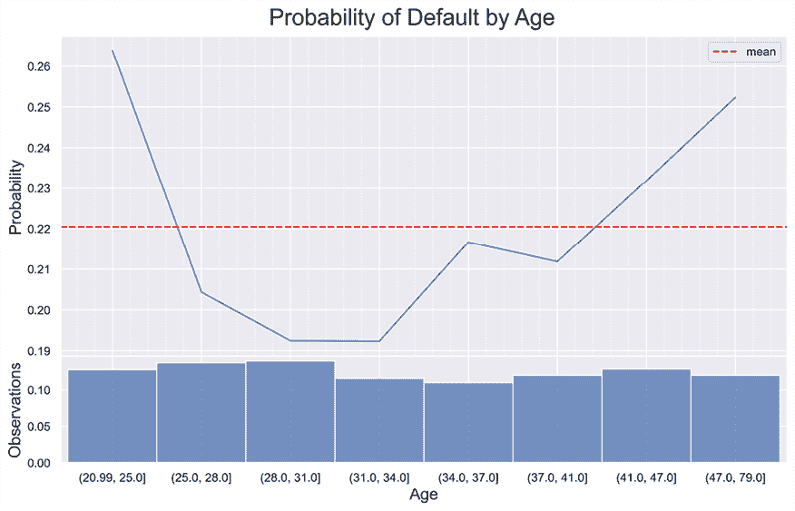

图 11.1：按年龄划分的 CC 违约概率

我们可以将最年轻和最年长的四分位数称为弱势群体，而其他所有人称为特权群体。为了检测和减轻不公平性，最好将它们编码为二元特征——我们正是这样使用`AGE_GROUP`做到的。我们可以再次利用`plot_prob_progression`，但这次用`AGE_GROUP`代替`AGE`，并将数字替换为我们更容易理解的标签。代码可以在下面的片段中看到：

```py
mldatasets.**plot_prob_progression(**
    ccdefault_bias_df.**AGE_GROUP**.**replace**({0:'21-25,48+',1:'26-47'}),
    ccdefault_bias_df.**IS_DEFAULT**,
    xlabel='Age Group',
    title='Probability of Default by Age Group',
    **mean_line**=True
) 
```

上述片段生成了以下输出，其中两组之间的差异相当明显：

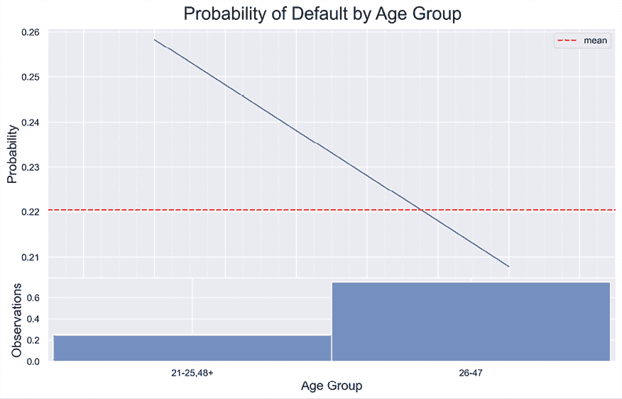

图 11.2：按年龄组划分的 CC 违约概率

接下来，让我们将`GENDER`重新引入画面。我们可以使用`plot_prob_contour_map`，它类似于`plot_prob_progression`，但在二维空间中，用颜色编码概率而不是绘制线条。因此，前两个属性是我们希望在*x*轴（`GENDER`）和*y*轴（`AGE_GROUP`）上的特征，第三个是目标（`IS_DEFAULT`）。由于我们的特征都是二元的，最好使用`plot_type='grid'`而不是`contour`。代码可以在下面的片段中看到：

```py
mldatasets.plot_prob_contour_map(
    ccdefault_bias_df.**GENDER**.replace({1:'Male',2:'Female'}),
    ccdefault_bias_df.**AGE_GROUP**.replace({0:'21-25,48+',1:'26-47'}),
    ccdefault_bias_df.**IS_DEFAULT**,
    xlabel='Gender',
    ylabel='Age Group',
    annotate=True,
    plot_type='grid',
    title='Probability of Default by Gender/Age Group'
) 
group is 26- 47-year-old females, followed by their male counterparts at about 3-4% apart. The same happens with the underprivileged age group:
```

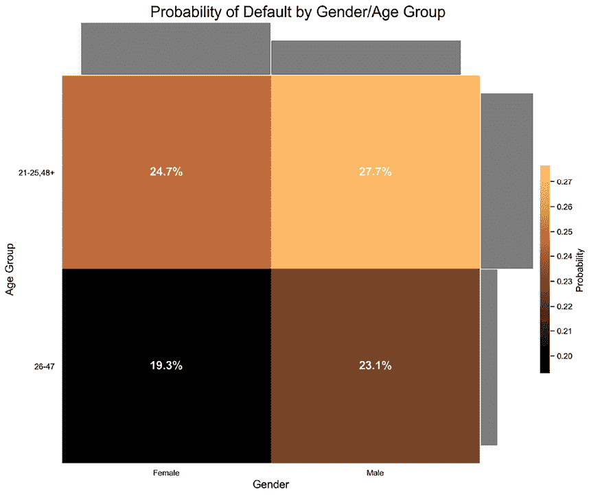

图 11.3：按性别和年龄组划分的 CC 默认概率网格

性别差异是一个有趣的观察结果，我们可以提出许多假设来解释为什么女性违约较少。她们是否只是简单地更擅长管理债务？这是否与她们的婚姻状况或教育有关？我们不会深入探讨这些问题。鉴于我们只知道基于年龄的歧视，我们将在特权组中仅使用`AGE_GROUP`，但将`GENDER`保持为受保护属性，这将在我们监控的一些公平性指标中考虑。说到指标，我们将量化数据集偏差。

## 量化数据集偏差

公平性指标分为三类，如下概述：

+   **个体公平性**：个体观察值在数据中与同龄人的接近程度。例如，*欧几里得距离*和*曼哈顿距离*等距离度量可以用于此目的。

+   **组公平性**：组与组之间标签或结果的平均距离。这可以在数据或模型中进行衡量。

+   **两者都**：一些指标通过在组内和组间同时考虑不平等来衡量熵或方差，例如*Theil 指数*和*变异系数*。

在本章中，我们将专注于组公平性指标。

在我们计算公平性指标之前，有一些待处理的数据准备步骤。让我们确保我们将用于偏差缓解练习的数据集（`ccdefault_bias_df`）只包含相关的列，这些列不以下划线（`"_"`）开头。另一方面，因果推断练习将包括以下划线开头的列以及`AGE_GROUP`和`IS_DEFAULT`。代码可以在下面的代码片段中看到：

```py
cols_bias_l = ccdefault_all_df.columns[
    **~ccdefault_all_df.columns.str.startswith('_')**
].tolist()
cols_causal_l = [**'AGE_GROUP'**,**'IS_DEFAULT'**] +\
    ccdefault_all_df.columns[
        **ccdefault_all_df.columns.str.startswith('_')**
    ].tolist()
ccdefault_bias_df = ccdefault_bias_df[**cols_bias_l**]
ccdefault_causal_df = ccdefault_causal_df[**cols_causal_l**] 
```

此外，量化训练数据集中的数据集偏差更为重要，因为这是模型将从中学习的数据，所以让我们继续将数据分成训练集和测试集`X`和`y`对。我们在初始化随机种子以实现某些可重复性之后进行此操作。代码可以在下面的代码片段中看到：

```py
rand = 9
os.environ['PYTHONHASHSEED']=str(rand)
np.random.seed(rand)
y = ccdefault_bias_df[**'IS_DEFAULT'**]
X = ccdefault_bias_df.drop([**'IS_DEFAULT'**], axis=1).copy()
X_train, X_test, y_train, y_test = model_selection.**train_test_split**(
    X, y, test_size=0.25, random_state=rand
) 
```

尽管我们将使用我们刚刚分割的`pandas`数据用于训练和性能评估，但我们将在这次练习中使用的库，称为 AIF360，将数据集抽象为基类。这些类包括转换为`numpy`数组的数据，并存储与公平性相关的属性。

对于回归，AIF360 有`RegressionDataset`，但对于这个二元分类示例，我们将使用`BinaryLabelDataset`。你可以使用包含特征和标签的`pandas` DataFrame 来初始化它（`X_train.join(y_train)`）。然后，你指定标签的名称（`label_names`）和受保护的属性（`protected_attribute_names`），并且建议你为`favorable_label`和`unfavorable_label`输入一个值，这样 AIF360 就可以将其纳入评估公平性的考量。尽管这可能听起来很复杂，但在二元分类中，正数和负数仅与我们要预测的内容相关——正类——而不是它是否是一个有利的结果。代码可以在下面的片段中看到：

```py
train_ds = **BinaryLabelDataset**(
    df=**X_train.join(y_train)**,
    label_names=['IS_DEFAULT'],
    protected_attribute_names=['AGE_GROUP', 'GENDER'],
    favorable_label=0,
    unfavorable_label=1
)
test_ds = **BinaryLabelDataset**(
    **df=X_test.join(y_test)**,
    label_names=['IS_DEFAULT'],
    protected_attribute_names=['AGE_GROUP', 'GENDER'],
    favorable_label=0, unfavorable_label=1
) 
```

接下来，我们为`underprivileged groups`和`privileged_groups`创建数组。在`AGE_GROUP=1`中的成员有较低的违约概率，因此他们是特权组，反之亦然。然后，使用这些数组以及用于训练的抽象数据集(`train_ds`)，我们可以通过`BinaryLabelDatasetMetric`初始化一个度量类。这个类有计算几个群体公平度度量的函数，仅凭数据本身进行判断。我们将输出其中的三个，并解释它们的含义。代码可以在下面的片段中看到：

```py
underprivileged_groups=[**{'AGE_GROUP': 0}**]
privileged_groups=[**{'AGE_GROUP': 1}**]
metrics_train_ds = **BinaryLabelDatasetMetric**(
    train_ds,
    unprivileged_groups=underprivileged_groups,
    privileged_groups=privileged_groups
)
print('Statistical Parity Difference (SPD): %.4f' %
      metrics_train_ds.**statistical_parity_difference**())
print('Disparate Impact (DI): %.4f' % 
      metrics_train_ds.**disparate_impact**())
print('Smoothed Empirical Differential Fairness (SEDF): %.4f' %\
      metrics_train_ds.**smoothed_empirical_differential_fairness**()) 
```

前面的代码片段生成了以下输出：

```py
Statistical Parity Difference (SPD):               -0.0437
Disparate Impact (DI):                              0.9447
Smoothed Empirical Differential Fairness (SEDF):    0.3514 
```

现在，让我们解释每个度量分别代表什么，如下：

+   **统计差异差异**（**SPD**）：也称为**平均差异**，这是弱势群体和特权群体之间有利结果平均概率的差异。负数表示对弱势群体的不公平，正数表示更好，但接近零的数字表示公平的结果，特权群体和弱势群体之间没有显著差异。它使用以下公式计算，其中*f*是有利类的值，*D*是客户组，*Y*是客户是否会违约：


+   **差异影响**（**DI**）：DI 与 SPD 完全相同，只是它是比率而不是差异。在比率方面，越接近一，对弱势群体来说越好。换句话说，一代表群体之间公平的结果，没有差异，低于一表示与特权群体相比，弱势群体不利的结果，而高于一表示与特权群体相比，弱势群体有利的结果。公式如下：


+   **平滑经验差异公平性**（**SEDF**）：这个公平性指标是从一篇名为*“交叉性公平性的定义。”*的论文中提出的许多新指标之一。与前面两个指标不同，它不仅限于预定的特权群体和弱势群体，而是扩展到包括受保护属性中的所有类别——在本例中是*图 11.3*中的四个。论文的作者们认为，当有受保护属性的交叉表时，公平性尤其棘手。这是因为**辛普森悖论**，即一个群体在总体上可能是有利的或是不利的，但在细分到交叉表时则不是。我们不会深入数学，但他们的方法在测量交叉性场景中的合理公平性水平时考虑到这种可能性。为了解释它，零代表绝对公平，越远离零，公平性越低。

接下来，我们将量化模型的群体公平性指标。

## 量化模型偏差

在我们计算指标之前，我们需要训练一个模型。为此，我们将使用最佳超参数(`lgb_params`)初始化一个 LightGBM 分类器(`LGBMClassifier`)。这些参数已经为我们进行了超参数调整（更多关于如何做这件事的细节在*第十二章*，*单调约束和模型调优以提高可解释性*）。

请注意，这些参数包括`scale_pos_weight`，这是用于类别加权的。由于这是一个不平衡的分类任务，这是一个重要的参数，以便使分类器进行成本敏感训练，对一种误分类形式进行惩罚，而不是另一种。一旦分类器初始化，它将通过`evaluate_class_mdl`进行`fit`和评估，该函数返回一个包含预测性能指标的字典，我们可以将其存储在模型字典(`cls_mdls`)中。代码可以在下面的代码片段中看到：

```py
cls_mdls = {}
lgb_params = {
    'learning_rate': 0.4,
    'reg_alpha': 21,
    'reg_lambda': 1,
    **'scale_pos_weight'**: 1.8
}
lgb_base_mdl = lgb.LGBMClassifier(
    random_seed=rand,
    max_depth=6,
    num_leaves=33,
    **lgb_params
)
lgb_base_mdl.fit(X_train, y_train)
**cls_mdls**['lgb_0_base'] = mldatasets.**evaluate_class_mdl**(
    lgb_base_mdl,
    X_train,
    X_test,
    y_train,
    y_test,
    plot_roc=False,
    plot_conf_matrix=True,
    show_summary=True,
    ret_eval_dict=True
) 
Figure 11.4. The scale_pos_weight parameter ensures a healthier balance between false positives in the top-right corner and false negatives at the bottom left. As a result, precision and recall aren’t too far off from each other. We favor high precision for a problem such as this one because we want to maximize true positives, but, not at the great expense of recall, so a balance between both is critical. While hyperparameter tuning, the F1 score, and the Matthews correlation coefficient (MCC) are useful metrics to use to this end. The evaluation of the LightGBM base model is shown here:
```


图 11.4：LightGBM 基础模型的评估

接下来，让我们计算模型的公平性指标。为此，我们需要对 AIF360 数据集进行“深度”复制（`deepcopy=True`），但我们将`labels`和`scores`更改为我们的模型预测的值。`compute_aif_metrics`函数使用 AIF360 的`ClassificationMetric`类为模型执行`BinaryLabelDatasetMetric`为数据集所执行的操作。然而，它并不直接与模型交互。它使用原始数据集（`test_ds`）和修改后的数据集（`test_pred_ds`）包含模型的预测来计算公平性。`compute_aif_metrics`函数创建一个包含几个预先计算的指标（`metrics_test_dict`）和指标类（`metrics_test_cls`）的字典，可以用来逐个获取指标。代码可以在下面的代码片段中看到：

```py
test_pred_ds = test_ds.copy(deepcopy=True)
test_pred_ds.labels =\
    cls_mdls['lgb_0_base']['preds_test'].reshape(-1,1)
test_pred_ds.scores = \
    cls_mdls['lgb_0_base']['probs_test'].reshape(-1,1)
metrics_test_dict, metrics_test_cls = \
    mldatasets.**compute_aif_metrics**(
        test_ds,
        test_pred_ds,
        unprivileged_groups=underprivileged_groups,
        privileged_groups=privileged_groups
    )
cls_mdls['lgb_0_base'].**update**(metrics_test_dict)
print('Statistical Parity Difference (SPD): %.4f' %
      metrics_test_cls.**statistical_parity_difference**())
print('Disparate Impact (DI): %.4f' %
      metrics_test_cls.**disparate_impact**())
print('Average Odds Difference (AOD): %.4f' %
      metrics_test_cls.**average_odds_difference**())
print('Equal Opportunity Difference (EOD): %.4f' %
      metrics_test_cls.**equal_opportunity_difference**())
print('Differential Fairness Bias Amplification(DFBA): %.4f' % \
    metrics_test_cls.**differential_fairness_bias_amplification**()) 
```

前面的代码片段生成了以下输出：

```py
Statistical Parity Difference (SPD):               -0.0679
Disparate Impact (DI):                                      0.9193
Average Odds Difference (AOD):                        -0.0550
Equal Opportunity Difference (EOD):                 -0.0265
Differential Fairness Bias Amplification (DFBA):    0.2328 
```

现在，把我们已经解释过的指标放在一边，让我们解释其他指标的含义，如下所示：

+   **平均机会差异**（**AOD**）：这是对特权组和弱势群体**假阳性率**（**FPR**）的平均值与**假阴性率**（**FNR**）之间的差异。负值表示弱势群体存在不利，越接近零越好。公式如下：


+   **平等机会差异**（**EOD**）：它只是 AOD 的**真正阳性率**（**TPR**）差异，因此它只用于测量 TPR 的*机会*。与 AOD 一样，负值确认了弱势群体存在不利，值越接近零意味着组间没有显著差异。公式如下：


+   **差异公平性偏差放大**（**DFBA**）：这个指标与 SEDF 在同一篇论文中定义，同样以零作为公平性的基准，并且也是交叉的。然而，它只测量了在称为偏差放大的现象中，模型和数据在不公平性比例上的差异。换句话说，这个值表示模型相对于原始数据增加了多少不公平性。

如果你将模型的`SPD`和`DI`指标与数据相比，它们确实更差。这并不奇怪，因为这是预期的，因为模型学习到的表示往往会放大偏差。你可以用`DFBA`指标来证实这一点。至于`AOD`和`EOD`，它们通常与`SPD`指标在同一区域，但理想情况下，`EOD`指标应该比`AOD`指标更接近零，因为我们在这个例子中更关心 TPR。

接下来，我们将介绍减轻模型偏差的方法。

# 减轻偏差

我们可以通过在以下三个不同层面上操作的方法来在三个不同层面上减轻偏差：

+   **预处理**：这些是在训练模型之前检测和消除训练**数据**中偏差的干预措施。利用预处理的方法的优点是它们在源头解决偏差。另一方面，任何未检测到的偏差仍可能被模型放大。

+   **内处理**：这些方法在模型训练期间减轻偏差，因此高度依赖于模型，并且通常不像预处理和后处理方法那样不依赖于模型。它们还需要调整超参数来校准公平性指标。

+   **后处理**：这些方法在**模型推理**期间缓解偏差。在*第六章*，*锚点和反事实解释*中，我们提到了使用 What-If 工具来选择正确的阈值（参见该章节中的*图 6.13*），并且我们手动调整它们以达到与假阳性相同的效果。就像那时一样，后处理方法旨在直接在结果中检测和纠正公平性，但需要进行的调整将取决于哪些指标对你的问题最重要。后处理方法的优势在于它们可以解决结果不公平性，这在可以产生最大影响的地方，但由于它与模型开发的其余部分脱节，可能会扭曲事物。

请注意，偏差缓解方法可能会损害预测性能，因此通常存在权衡。可能会有相反的目标，尤其是在数据反映了有偏见的真相的情况下。我们可以选择追求更好的真相：一个正义的真相——*我们想要的，而不是我们拥有的那个*。

本节将解释每个级别的几种方法，但只为每种方法实现和评估两个。此外，我们不会在本章中这样做，但你可以将不同类型的方法结合起来以最大化缓解——例如，你可以使用预处理方法来去偏数据，然后用它来训练模型，最后使用后处理方法来移除模型添加的偏差。

## 预处理偏差缓解方法

这些是一些最重要的预处理或数据特定偏差缓解方法：

+   **无意识**：也称为**压制**。移除偏差最直接的方法是排除数据集中的有偏特征，但这是一种天真方法，因为你假设偏差严格包含在这些特征中。

+   **特征工程**：有时，连续特征会捕捉到偏差，因为存在许多稀疏区域，模型可以用假设来填补空白或从异常值中学习。它也可以与交互做同样的事情。特征工程可以设置护栏。我们将在*第十二章*，*单调约束和模型调优以实现可解释性*中讨论这个话题。

+   **平衡**：也称为**重采样**。单独来看，通过平衡数据集可以相对容易地修复表示问题。XAI 库（[`github.com/EthicalML/xai`](https://github.com/EthicalML/xai)）有一个`balance`函数，通过随机下采样和上采样组表示来实现这一点。下采样，或欠采样，就是我们通常所说的采样，即只取一定比例的观察结果，而上采样，或过采样，则是创建一定比例的随机重复。一些策略会合成上采样而不是重复，例如**合成少数过采样技术**（**SMOTE**）。然而，我们必须警告，如果你有足够的数据，总是优先下采样而不是上采样。如果有其他可能的偏见问题，最好不要只使用平衡策略。

+   **重新标记**：也称为**调整**，这是一种算法改变最可能存在偏见的观察结果的标签，通过排名来产生*调整后的数据*。通常，这使用朴素贝叶斯分类器执行，为了保持类别分布，它不仅提升了一些观察结果，还降低了一样多的数量。

+   **重新加权**：这种方法与重新标记类似，但不是翻转它们的标签，而是为每个观察结果推导出一个权重，我们可以在学习过程中实现它。就像类别权重应用于每个类别一样，样本权重应用于每个观察结果或样本。许多回归器和分类器，包括`LGBMClassifier`，都支持样本权重。尽管技术上重新加权不接触数据和模型应用到的解决方案，但它是一种预处理方法，因为我们检测到数据中的偏见。

+   **差异影响消除器**：这种方法的设计者非常小心，遵守法律对偏见的定义，并在不改变标签或受保护属性的情况下保持数据的完整性。它实施了一个修复过程，试图从剩余的特征中消除偏见。当我们怀疑偏见主要存在于那里时，这是一个非常好的过程——也就是说，特征与受保护属性高度相关，但它不解决其他地方的偏见。在任何情况下，它都是一个很好的基线，用于了解有多少偏见是非受保护特征。

+   **学习公平表示**：这种方法利用了对抗性学习框架。有一个生成器（自动编码器）创建排除受保护属性的数据表示，还有一个评论家，其目标是使特权组和弱势群体中学习的表示尽可能接近。

+   **用于歧视预防的优化预处理**：这种方法通过数学优化数据，以保持整体概率分布。同时，保护属性与目标之间的相关性被消除。这个过程的结果是数据略微扭曲，以消除偏差。

由于存在许多预处理方法，我们将在本章中仅使用其中两种。尽管如此，如果你对使用我们未涉及的方法感兴趣，它们在 AIF360 库中可用，你可以在其文档中了解它们（[`aif360.res.ibm.com/`](https://aif360.res.ibm.com/))。

### 重新加权方法

`重新加权`方法相对简单易行。你通过指定组来初始化它，然后像使用任何 scikit-learn 编码器或缩放器一样`fit`和`transform`数据。对于那些不熟悉`fit`的人来说，算法学习如何转换提供的数据，而`transform`使用学到的知识来转换它。以下代码片段中可以看到代码：

```py
reweighter= **Reweighing**(
    unprivileged_groups=underprivileged_groups,
    privileged_groups=privileged_groups
)
reweighter.**fit**(train_ds)
train_rw_ds = reweighter.**transform**(train_ds) 
```

从这个过程得到的转换不会改变数据，但为每个观测值创建权重。AIF360 库能够将这些权重因素纳入公平性的计算中，因此我们可以使用之前使用的`BinaryLabelDatasetMetric`来计算不同的指标。以下代码片段中可以看到代码：

```py
metrics_train_rw_ds = **BinaryLabelDatasetMetric**(
    train_rw_ds,
    unprivileged_groups=underprivileged_groups,
    privileged_groups=privileged_groups
)
print('Statistical Parity Difference (SPD): %.4f' %
      metrics_train_rw_ds.**statistical_parity_difference**())
print('Disparate Impact (DI): %.4f' %
       metrics_train_rw_ds.**disparate_impact**())
print('Smoothed Empirical Differential Fairness(SEDF): %.4f'%
metrics_train_rw_ds.**smoothed_empirical_differential_fairness**()) 
```

上述代码输出以下内容：

```py
Statistical Parity Difference (SPD):                    -0.0000
Disparate Impact (DI):                                   1.0000
Smoothed Empirical Differential Fairness (SEDF):    0.1942 
```

权重对 SPD 和 DI 有完美的影响，使它们在这些指标方面绝对公平。然而，请注意，SEDF 比以前更好，但不是零。这是因为特权群体和弱势群体仅与`AGE_GROUP`保护属性相关，但不与`GENDER`相关。SEDF 是交叉公平性的度量，重新加权没有涉及。

你可能会认为给观测值添加权重会对预测性能产生不利影响。然而，这种方法被设计用来保持平衡。在未加权的数据集中，所有观测值都有一个权重为 1，因此所有权重的平均值是 1。在重新加权时，会改变观测值的权重，但平均值仍然大约是 1。你可以通过比较原始数据集和重新加权的数据集中`instance_weights`的平均值的绝对差异来检查这一点。它应该是微不足道的。以下代码片段中可以看到代码：

```py
np.**abs**(train_ds.**instance_weights.mean**() -\
       train_rw_ds.**instance_weights.mean**()) < 1e-6 
```

那么，你可能会问，如何应用`instance_weights`？许多模型类在`fit`方法中有一个不太为人所知的属性，称为`sample_weight`。你只需将其插入其中，在训练过程中，它将根据相应的权重从观测值中学习。以下代码片段展示了这种方法：

```py
lgb_rw_mdl = lgb.LGBMClassifier(
    random_seed=rand,
    max_depth=6,
    num_leaves=33,
    **lgb_params
)
lgb_rw_mdl.fit(
    X_train,
    y_train,
    **sample_weight**=train_rw_ds.instance_weights
) 
```

我们可以使用与基础模型相同的方法评估此模型，使用`evaluate_class_mdl`。然而，当我们使用`compute_aif_metrics`计算公平性指标时，我们将它们保存在模型字典中。我们不会逐个查看每种方法的输出，而是在本节结束时进行比较。以下是一个代码片段：

```py
cls_mdls['lgb_1_rw'] = mldatasets.**evaluate_class_mdl**(
    lgb_rw_mdl,
    train_rw_ds.features,
    X_test,
    train_rw_ds.labels,
    y_test,
    plot_roc=False,
    plot_conf_matrix=True,
    show_summary=True,
    ret_eval_dict=True
)
test_pred_rw_ds = test_ds.copy(deepcopy=True)
test_pred_rw_ds.labels = cls_mdls['lgb_1_rw']['preds_test'
    ].reshape(-1,1)
test_pred_rw_ds.scores = cls_mdls['lgb_1_rw']['probs_test'
    ].reshape(-1,1)
metrics_test_rw_dict, _ = mldatasets.**compute_aif_metrics**(
    test_ds,
    test_pred_rw_ds,
    unprivileged_groups=underprivileged_groups,
    privileged_groups=privileged_groups
)
cls_mdls['lgb_1_rw'].update(metrics_test_rw_dict) 
Figure 11.5:
```

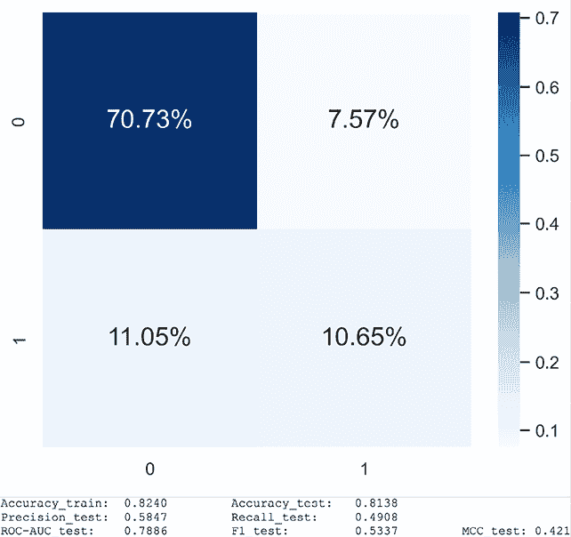

图 11.5：LightGBM 重新加权模型的评估

如果你将*图 11.5*与*图 11.4*进行比较，你可以得出结论，重新加权模型和基础模型之间的预测性能没有太大差异。这个结果是可以预料的，但仍然值得验证。一些偏差缓解方法可能会对预测性能产生不利影响，但重新加权并没有。同样，DI 消除器（**差异影响**，**DI**）也不应该如此，我们将在下一节中讨论！

### 差异影响消除方法

此方法专注于不在受保护属性（`AGE_GROUP`）中的偏差，因此我们将在过程中删除此特征。为此，我们需要它的索引——换句话说，它在列列表中的位置。我们可以将此位置（`protected_index`）保存为变量，如下所示：

```py
protected_index = train_ds.feature_names.index('AGE_GROUP') 
```

DI 消除器是参数化的。它需要一个介于零和一之间的修复水平，因此我们需要找到最佳值。为此，我们可以遍历一个具有不同修复水平值的数组（`levels`），使用每个`level`初始化`DisparateImpactRemover`，并对数据进行`fit_transform`，这将消除数据中的偏差。然而，我们随后在不包含受保护属性的情况下训练模型，并使用`BinaryLabelDatasetMetric`评估`disparate_impact`。记住，DI 是一个比率，因此它是一个可以在超过和低于一之间的指标，最佳 DI 是最接近一的。因此，当我们遍历不同的修复水平时，我们将持续保存 DI 最接近一的模型。我们还将 DI 追加到数组中，以供以后使用。以下是一个代码片段：

```py
di = np.array([])
train_dir_ds = None
test_dir_ds = None
lgb_dir_mdl = None
X_train_dir = None
X_test_dir = None
levels = np.hstack(
    [np.linspace(0., 0.1, 41), np.linspace(0.2, 1, 9)]
)
for level in tqdm(levels):
    di_remover = **DisparateImpactRemover**(repair_level=level)
    train_dir_ds_i = di_remover.**fit_transform**(train_ds)
    test_dir_ds_i = di_remover.**fit_transform**(test_ds)
    X_train_dir_i = np.**delete**(
        train_dir_ds_i.features,
        protected_index,
        axis=1
    )
    X_test_dir_i = np.**delete**(
        test_dir_ds_i.features,
        protected_index,
        axis=1
    )
    lgb_dir_mdl_i = lgb.**LGBMClassifier**(
        random_seed=rand,
        max_depth=5,
        num_leaves=33,
        **lgb_params
    )
    lgb_dir_mdl_i.**fit**(X_train_dir_i, train_dir_ds_i.labels)
    test_dir_ds_pred_i = test_dir_ds_i.copy()
    test_dir_ds_pred_i.labels = lgb_dir_mdl_i.predict(
        X_test_dir_i
    )
    metrics_test_dir_ds = **BinaryLabelDatasetMetric**(
        test_dir_ds_pred_i,
        unprivileged_groups=underprivileged_groups,
        privileged_groups=privileged_groups
    )
    di_i = metrics_test_dir_ds.disparate_impact()
    if (di.shape[0]==0) or (np.min(np.abs(di-1)) >= abs(di_i-1)):
        print(abs(di_i-1))
        train_dir_ds = train_dir_ds_i
        test_dir_ds = test_dir_ds_i
        X_train_dir = X_train_dir_i
        X_test_dir = X_test_dir_i
        lgb_dir_mdl = lgb_dir_mdl_i
    di = np.append(np.array(di), di_i) 
```

为了观察不同修复水平下的 DI，我们可以使用以下代码，如果你想要放大最佳 DI 所在区域，只需取消注释`xlim`行：

```py
plt.plot(**levels**, **di**, marker='o') 
```

上述代码生成以下输出。正如你所看到的，最佳修复水平位于 0 和 0.1 之间，因为那里的值最接近 1：

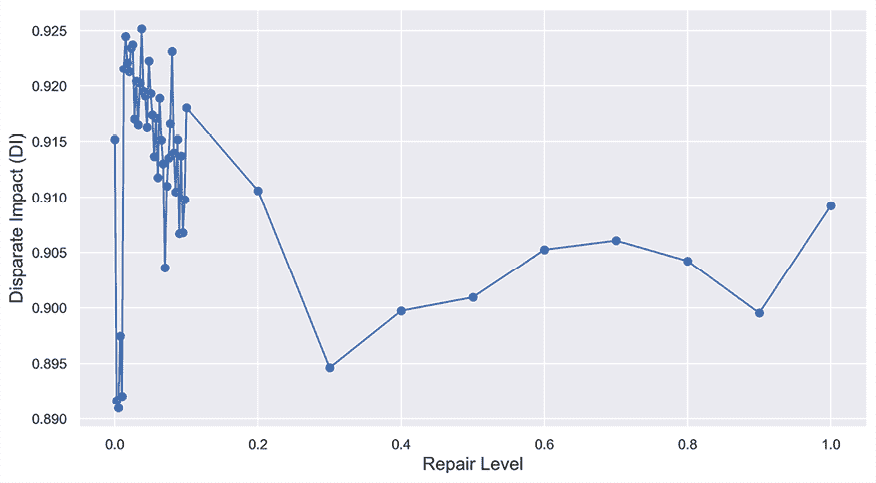

图 11.6：不同 DI 消除修复水平下的 DI

现在，让我们使用`evaluate_class_mdl`评估最佳的 DI 修复模型，并计算公平性指标（`compute_aif_metrics`）。这次我们甚至不会绘制混淆矩阵，但我们会将所有结果保存到`cls_mdls`字典中，以供后续检查。代码如下所示：

```py
cls_mdls['lgb_1_dir'] = mldatasets.**evaluate_class_mdl**(
    lgb_dir_mdl,
    X_train_dir,
    X_test_dir,
    train_dir_ds.labels,
    test_dir_ds.labels,
    plot_roc=False,
    plot_conf_matrix=False,
    show_summary=False,
    ret_eval_dict=True
)
test_pred_dir_ds = test_ds.copy(deepcopy=True)
test_pred_dir_ds.labels = cls_mdls['lgb_1_dir']['preds_test'
].reshape(-1,1)
metrics_test_dir_dict, _ = mldatasets.**compute_aif_metrics**(
    test_ds,
    test_pred_dir_ds,
    unprivileged_groups=underprivileged_groups,
    privileged_groups=privileged_groups
)
cls_mdls['lgb_1_dir'].**update**(metrics_test_dir_dict) 
```

数据链中的下一个链接是模型，因此即使我们去除了数据中的偏差，模型本身也会引入偏差，因此训练能够处理这种偏差的模型是有意义的，这正是我们接下来将要学习如何做的！

## 处理中偏差减轻方法

这些是一些最重要的处理中或模型特定的偏差减轻方法：

+   **成本敏感训练**：我们已经在本章训练的每个 LightGBM 模型中通过`scale_pos_weight`参数整合了这种方法。它通常用于不平衡分类问题，并被简单地视为提高少数类准确率的一种手段。然而，鉴于类别不平衡往往倾向于使某些群体优于其他群体，这种方法也可以用来减轻偏差，但并不能保证一定会这样做。它可以作为类权重或通过创建自定义损失函数来整合。实现方式将根据模型类别和与偏差相关的成本而有所不同。如果它们与误分类线性增长，则类权重就足够了，否则建议使用自定义损失函数。

+   **约束**：许多模型类别支持单调性和交互约束，**TensorFlow Lattice**（**TFL**）提供了更高级的自定义形状约束。这些确保了特征和目标之间的关系被限制在某种模式中，在模型级别上设置了护栏。你会有很多理由想要使用它们，但其中最重要的是减轻偏差。我们将在第十二章*单调约束和模型调优以实现可解释性*中讨论这个话题。

+   **偏见消除正则化器**：这种方法将偏见定义为敏感变量和目标变量之间的统计依赖性。然而，这种方法的目标是最大限度地减少间接偏见，排除可以通过简单地删除敏感变量来避免的偏见。因此，该方法首先通过**偏见指数**（**PI**）对其进行量化，这是目标和敏感变量之间的互信息。顺便提一下，我们在第十章*可解释性特征选择和工程*中介绍了互信息。然后，与 L2 一起，PI 被整合到一个自定义正则化项中。从理论上讲，任何模型分类器都可以使用基于 PI 的正则化器进行正则化，但到目前为止，唯一实现的例子是逻辑回归。

+   **Gerry fair 分类器**：这是受**公平性划分**概念的启发，它在某一群体中看似公平，但在细分到子群体时却缺乏公平性。该算法利用一种基于博弈论的**虚构博弈**方法，其中你有一个学习者和审计员之间的零和游戏。学习者最小化预测误差和基于公平性的总惩罚项。审计员通过基于在最不公平对待的子群体中观察到的最坏结果来进一步惩罚学习者。

游戏的目标是达到**纳什均衡**，这是在两个可能具有矛盾目标的非合作玩家达成部分满足双方的解决方案时实现的。在这种情况下，学习者获得最小的预测误差和总体不公平性，审计员获得最小的子群体不公平性。该方法的实现是模型无关的。

+   **对抗性去偏**：与 gerry fair 分类器类似，对抗性去偏利用两个对立的演员，但这次是两个神经网络：预测器和对手。我们最大化预测器预测目标的能力，同时最小化对手预测受保护特征的能力，从而增加特权群体和弱势群体之间机会的平等性。

+   **指数梯度下降法**：这种方法通过将其简化为一系列此类问题来自动化成本敏感优化，并使用关于受保护属性（如人口统计学平等或均衡机会）的公平性约束。它是模型无关的，但仅限于与 scikit-learn 兼容的二分类器。

由于存在如此多的预处理方法，我们将在本章中仅使用其中两种。尽管如此，如果你对我们将不涉及的方法感兴趣，它们可以在 AIF360 库和文档中找到。

### 指数梯度下降法

`ExponentiatedGradientReduction`方法是对具有约束的成本敏感训练的实现。我们用基估计器初始化它，指定要执行的迭代次数的最大值（`max_iter`），并指定要使用的差异`constraints`。然后，我们`fit`它。这种方法可以在下面的代码片段中看到：

```py
lgb_egr_mdl = ExponentiatedGradientReduction(
    estimator=lgb_base_mdl,
    max_iter=50,
    constraints='DemographicParity'
)
lgb_egr_mdl.fit(train_ds) 
```

我们可以使用`predict`函数来获取训练和测试预测，然后使用`evaluate_class_metrics_mdl`和`compute_aif_metrics`分别获取预测性能和公平性指标。我们将它们都放入`cls_mdls`字典中，如下面的代码片段所示：

```py
train_pred_egr_ds = lgb_egr_mdl.**predict**(train_ds)
test_pred_egr_ds = lgb_egr_mdl.**predict**(test_ds)
cls_mdls['lgb_2_egr'] = mldatasets.**evaluate_class_metrics_mdl**(
    lgb_egr_mdl,
    train_pred_egr_ds.labels,
    test_pred_egr_ds.scores,
    test_pred_egr_ds.labels,
    y_train,
    y_test
)
metrics_test_egr_dict, _ = mldatasets.**compute_aif_metrics**(
    test_ds,
    test_pred_egr_ds,
    unprivileged_groups=underprivileged_groups,
    privileged_groups=privileged_groups
)
cls_mdls['lgb_2_egr'].**update**(metrics_test_egr_dict) 
```

接下来，我们将了解一种部分模型无关的预处理方法，它考虑了交叉性。

### gerry fair 分类器方法

Gerry fair 分类器部分是模型无关的。它只支持线性模型、**支持向量机**（**SVMs**）、核回归和决策树。我们通过定义正则化强度（`C`）、用于早期停止的公平近似（`gamma`）、是否详细输出（`printflag`）、最大迭代次数（`max_iters`）、模型（`predictor`）以及要采用的公平概念（`fairness_def`）来初始化`GerryFairClassifier`。我们将使用错误的负例（`"FN"`）的公平概念来计算公平违规的加权差异。一旦初始化完成，我们只需要调用`fit`方法并启用`early_termination`，如果它在五次迭代中没有改进，则停止。以下代码片段展示了代码：

```py
dt_gf_mdl = **GerryFairClassifier**(
    C=100,
    gamma=.005,
    max_iters=50,
    **fairness_def**='FN',
    printflag=True,
    **predictor**=tree.DecisionTreeRegressor(max_depth=3)
)
dt_gf_mdl.**fit**(train_ds, early_termination=True) 
```

我们可以使用`predict`函数来获取训练和测试预测，然后使用`evaluate_class_metrics_mdl`和`compute_aif_metrics`来分别获得预测性能和公平性指标。我们将它们都放入`cl_smdls`字典中，如下面的代码片段所示：

```py
train_pred_gf_ds = dt_gf_mdl.**predict**(train_ds, threshold=False)
test_pred_gf_ds = dt_gf_mdl.**predict**(test_ds, threshold=False)
cls_mdls['dt_2_gf'] = mldatasets.evaluate_class_metrics_mdl(
    dt_gf_mdl,
    train_pred_gf_ds.labels,
    None,
    test_pred_gf_ds.labels,
    y_train,
    y_test
)
metrics_test_gf_dict, _ = mldatasets.**compute_aif_metrics**(
    test_ds,
    test_pred_gf_ds,
    unprivileged_groups=underprivileged_groups,
    privileged_groups=privileged_groups
)
cls_mdls['dt_2_gf'].**update**(metrics_test_gf_dict) 
```

在模型推理之后的链中的下一个和最后一个链接，因此即使你去除了数据和模型的偏差，也可能还剩下一些偏差，因此在这个阶段处理它也是有意义的，这正是我们接下来将要学习如何做的！

## 后处理偏差缓解方法

这些是一些最重要的后处理或推理特定偏差缓解方法：

+   **预测弃权**：这有许多潜在的好处，如公平性、安全性和控制成本，但具体应用取决于你的问题。通常，模型会返回所有预测，即使是低置信度的预测——也就是说，接近分类阈值的预测，或者当模型返回的置信区间超出预定阈值时。当涉及公平性时，如果我们将在低置信度区域将预测改为**我不知道**（**IDK**），那么在评估公平性指标时，仅针对所做的预测，模型可能会因为副作用而变得更加公平。还可能将预测弃权作为一个内部处理方法。一篇名为《负责任地预测：通过学习推迟来提高公平性》的论文讨论了两种方法，通过训练模型来**回避**（学习预测 IDK）或**推迟**（当正确率低于专家意见时预测 IDK）。另一篇名为《在二元分类中弃权的效用》的论文采用了一个名为**Knows What It Knows**（**KWIK**）的强化学习框架，它对自己的错误有自我意识，但允许弃权。

+   **均衡机会后处理**：也称为不同对待，这确保了特权群体和弱势群体在错误分类方面得到平等对待，无论是假阳性还是假阴性。它找到最佳概率阈值，通过改变标签来平衡组之间的机会。

+   **校准的均等机会后处理**：这种方法不是改变标签，而是修改概率估计，使它们平均相等。它称之为校准。然而，这个约束不能同时满足假阳性和假阴性，因此你被迫在两者之间做出选择。因此，在召回率远比精确度更重要或反之亦然的情况下，校准估计的概率是有利的。

+   **拒绝选项分类法**：这种方法利用了直觉，即决策边界周围的预测往往是最不公平的。然后，它找到决策边界周围的一个最优带，在这个带中，翻转弱势和优势群体的标签可以产生最公平的结果。

在本章中，我们只会使用这两种后处理方法。拒绝选项分类法在 AIF360 库和文档中可用。

### 均等机会后处理方法

均等机会后处理方法（`EqOddsPostprocessing`）初始化时，需要指定我们想要均等机会的群体和随机`种子`。然后，我们`fit`它。请注意，拟合需要两个数据集：原始数据集（`test_ds`）以及为我们基础模型提供预测的数据集（`test_pred_ds`）。`fit`所做的就是计算最优概率阈值。然后，`predict`创建一个新的数据集，其中这些阈值已经改变了`labels`。代码可以在下面的片段中看到：

```py
epp = **EqOddsPostprocessing**(
    privileged_groups=privileged_groups,
    unprivileged_groups=underprivileged_groups,
    seed=rand
)
epp = epp.**fit**(test_ds, test_pred_ds)
test_pred_epp_ds = epp.**predict**(test_pred_ds) 
```

我们可以使用`evaluate_class_metrics_mdl`和`compute_aif_metrics`来分别获得**等比例概率**（**EPP**）的预测性能和公平性指标。我们将它们都放入`cls_mdls`字典中。代码可以在下面的片段中看到：

```py
cls_mdls['lgb_3_epp'] = mldatasets.**evaluate_class_metrics_mdl**(
    lgb_base_mdl,
    cls_mdls['lgb_0_base']['preds_train'],
    test_pred_epp_ds.scores,
    test_pred_epp_ds.labels,
    y_train,
    y_test
)
metrics_test_epp_dict, _ = mldatasets.**compute_aif_metrics**(
    test_ds,
    test_pred_epp_ds,
    unprivileged_groups=underprivileged_groups,
    privileged_groups=privileged_groups
)
cls_mdls['lgb_3_epp'].**update**(metrics_test_epp_dict) 
```

接下来，我们将了解另一种后处理方法。主要区别在于它校准概率分数，而不仅仅是改变预测标签。

### 校准的均等机会后处理方法

校准的均等机会（`CalibratedEqOddsPostprocessing`）的实现方式与均等机会完全相同，但它有一个更关键的属性（`cost_constraint`）。这个属性定义了要满足哪个约束，因为它不能同时使分数对 FPRs 和 FNRs 都是公平的。我们选择 FPR，然后`fit`、`predict`和`evaluate`，就像我们对均等机会所做的那样。代码可以在下面的片段中看到：

```py
cpp = **CalibratedEqOddsPostprocessing**(
    privileged_groups=privileged_groups,
    unprivileged_groups=underprivileged_groups,
    **cost_constraint**="fpr",
    seed=rand
)
cpp = cpp.**fit**(test_ds, test_pred_ds)
test_pred_cpp_ds = cpp.**predict**(test_pred_ds)
cls_mdls['lgb_3_cpp'] = mldatasets.**evaluate_class_metrics_mdl**(
    lgb_base_mdl,
    cls_mdls['lgb_0_base']['preds_train'],
    test_pred_cpp_ds.scores,
    test_pred_cpp_ds.labels,
    y_train,
    y_test
)
metrics_test_cpp_dict, _ = mldatasets.**compute_aif_metrics**(
    test_ds,
    test_pred_cpp_ds,
    unprivileged_groups=underprivileged_groups,
    privileged_groups=privileged_groups
)
cls_mdls['lgb_3_cpp'].**update**(metrics_test_cpp_dict) 
```

现在我们已经尝试了六种偏差缓解方法，每个级别两种，我们可以将它们相互比较，并与基础模型进行比较！

## 将所有这些结合起来！

为了比较所有方法的指标，我们可以将字典（`cls_mdls`）放入 DataFrame（`cls_metrics_df`）中。我们只对一些性能指标和记录的大多数公平性指标感兴趣。然后，我们输出按测试准确率排序的 DataFrame，并使用所有公平性指标进行颜色编码。代码可以在下面的片段中看到：

```py
cls_metrics_df = pd.DataFrame.from_dict(cls_mdls, 'index')[
    [
        'accuracy_train',
        'accuracy_test',
        'f1_test',
        'mcc_test',
        'SPD',
        'DI',
        'AOD',
        'EOD',
        'DFBA'
    ]
]
metrics_fmt_dict = dict(
    zip(cls_metrics_df.columns,['{:.1%}']*3+ ['{:.3f}']*6)
)
cls_metrics_df.sort_values(
    by='accuracy_test',
    ascending=False
).style.format(metrics_fmt_dict) 
```

前面的代码片段输出了以下 DataFrame：

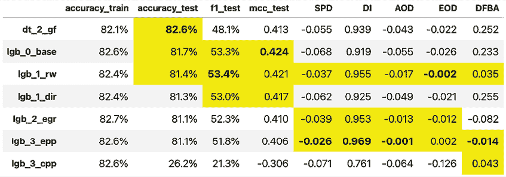

图 11.7：所有偏差缓解方法与不同公平性指标的对比

*图 11.7* 显示，大多数方法在 SPD、DI、AOD 和 EOD 方面产生的模型比基础模型更公平。校准等概率后处理 (`lgb_3_cpp`) 是一个例外，但它具有最佳的 DFBAs 之一，但由于校准的不平衡性质，它产生了次优的 DI。请注意，这种方法在校准分数时特别擅长实现 FPR 或 FNR 的平衡，但所有这些公平性指标对于捕捉这一点都没有用。相反，你可以创建一个指标，它是 FPRs 的比率，就像我们在 *第六章*，*锚点和反事实解释* 中所做的那样。偶然的是，这将是一个完美的 **校准等概率** （**CPP**） 的用例。

获得最佳 SPD、DI、AOD 和 DFBA 以及次优 EOD 的方法是等概率后处理 (`lgb_3_epp`)，因此让我们使用 XAI 的图表来可视化其公平性。为此，我们首先创建一个包含测试示例的 DataFrame (`test_df`)，然后使用 `replace` 将 `AGE_GROUP` 转换为分类变量，并获取分类列的列表 (`cat_cols_l`)。然后，我们可以使用真实标签 (`y_test`)、EPP 模型的预测概率分数、DataFrame (`test_df`)、受保护属性 (`cross_cols`) 和分类列来比较不同的指标 (`metrics_plot`)。我们也可以为 **受试者工作特征** （**ROC**） 图表 (`roc_plot`) 和 **精确率-召回率** （**PR**） 图表 (`pr_plot`) 做同样的事情。代码可以在下面的代码片段中看到：

```py
test_df = ccdefault_bias_df.loc[**X_test.index**]
test_df['AGE_GROUP'] = test_df.AGE_GROUP.**replace**(
    {0:'underprivileged', 1:'privileged'}
)
cat_cols_l = ccdefault_bias_df.dtypes[**lambda x: x==np.int8**
                                      ].index.tolist()
_ = xai.**metrics_plot**(
    y_test,cls_mdls['lgb_3_epp']['probs_test'],
    df=test_df, cross_cols=['AGE_GROUP'],
    categorical_cols=cat_cols_l
)
_ = xai.**roc_plot**(
    y_test, cls_mdls['lgb_3_epp']['probs_test'],
    df=test_df, cross_cols=['AGE_GROUP'],
    categorical_cols=cat_cols_l
)
_ = xai.**pr_plot**(
    y_test,
    cls_mdls['lgb_3_epp']['probs_test'],
    df=test_df, cross_cols=['AGE_GROUP'],
    categorical_cols=cat_cols_l
) 
Figure 11.8. The first one shows that even the fairest model still has some disparities between both groups, especially between precision and recall and, by extension, F1 score, which is their average. However, the ROC curve shows how close both groups are from an FPR versus a TPR standpoint. The third plot is where the disparities in precision and recall become even more evident. This all demonstrates how hard it is to keep a fair balance on all fronts! Some methods are best for making one aspect perfect but nothing else, while others are pretty good on a handful of aspects but nothing else. Despite the shortcomings of the methods, most of them achieved a sizable improvement. Ultimately, choosing methods will depend on what you most care about, and combining them is also recommended for maximum effect! The output is shown here:
```

 图 11.8：展示最公平模型的公平性图表

我们已经完成了偏差缓解练习，并将继续进行因果推断练习，我们将讨论如何确保公平和稳健的政策。

# 创建因果模型

决策通常需要理解因果关系。如果效果是可取的，你可以决定复制其原因，或者避免它。你可以故意改变某些东西来观察它如何改变结果，或者将意外效应追溯到其原因，或者模拟哪种改变会产生最大的积极影响。因果推断可以通过创建因果图和模型来帮助我们完成所有这些，这些图将所有变量联系起来并估计效应，以便做出更原则性的决策。然而，为了正确评估原因的影响，无论是设计还是意外，你需要将其效应与混杂变量分开。

因果推断与本章相关的原因是银行的决策具有显著影响持卡人生计的力量，鉴于自杀率的上升，甚至关系到生死。因此，有必要极其谨慎地评估政策决策。

台湾银行进行了一项为期 6 个月的贷款政策实验。银行看到了形势的严峻，知道那些最高风险的违约客户将 somehow 从资产负债表中注销，从而减轻了这些客户的财务义务。因此，实验的重点仅涉及银行认为可以挽救的部分，即低至中等风险的违约客户，现在实验已经结束，他们想了解以下政策如何影响了客户行为：

+   **降低信用额度**：一些客户的信用额度降低了 25%。

+   **付款计划**：他们被给予 6 个月的时间来偿还当前的信用卡债务。换句话说，债务被分成六部分，每个月他们必须偿还一部分。

+   **两项措施**：降低信用额度和付款计划。

此外，2005 年台湾普遍的信用卡利率约为 16-20%，但银行得知这些利率将被台湾金融监督管理委员会限制在 4%。因此，他们确保所有参与实验的客户都能自动获得该水平的利率。一些银行高管认为这只会加剧债务负担，并在这个过程中创造更多的“信用卡奴隶”。这些担忧促使提出以较低的信用卡额度作为对策进行实验的建议。另一方面，制定付款计划是为了了解债务减免是否给了客户使用信用卡而不必担心的空间。

在业务方面，理由是必须鼓励健康水平的消费，因为随着利率的降低，大部分利润将来自支付处理、现金返还合作伙伴关系和其他与消费相关的来源，从而增加客户的使用寿命。这对客户也有好处，因为如果他们在作为消费者比作为债务人更有利可图，这意味着激励措施已经到位，以防止他们成为后者。所有这些都证明了使用估计的终身价值（`_LTV`）作为代理指标来衡量实验结果如何使银行和客户受益的合理性。多年来，银行一直在使用一种相当准确的计算方法来估计信用卡持卡人根据他们的消费和支付历史以及诸如额度、利率等参数将为银行提供多少价值。

在实验设计的术语中，选择的政策被称为**治疗**，除了三个接受治疗的组别外，还有一个未接受治疗的对照组——即政策没有任何变化，甚至没有降低利率。在我们继续前进之前，让我们首先初始化一个包含治疗名称的列表（`treatment_names`）和一个包含甚至对照组的列表（`all_treatment_names`），如下所示：

```py
treatment_names = [
    'Lower Credit Limit',
    'Payment Plan',
    'Payment Plan &Credit Limit'
]
all_treatment_names = np.array(["None"] + treatment_names) 
```

现在，让我们检查实验的结果，以帮助我们设计一个最优的因果模型。

## 理解实验结果

评估治疗有效性的一个相当直观的方法是通过比较它们的成果。我们想知道以下两个简单问题的答案：

+   相比对照组，治疗是否降低了违约率？

+   支出行为是否有利于提高终身价值估计？

我们可以在一个图表中可视化这两个因素。为此，我们获得一个包含每个组违约百分比的`pandas`系列（`pct_s`），然后另一个包含每个组终身价值总和的系列（`ltv_s`），单位为千新台币（NTD）（`K$`）。我们将这两个系列放入`pandas` DataFrame 中，并绘制它，如下面的代码片段所示：

```py
pct_s = ccdefault_causal_df[
    ccdefault_causal_df.IS_DEFAULT==1]
    .groupby(['_TREATMENT'])
    .size()
    /ccdefault_causal_df.groupby(['_TREATMENT']).size()
ltv_s = ccdefault_causal_df.groupby(
    ['_TREATMENT'])['_LTV'].sum()/1000
plot_df = pd.DataFrame(
    {'% Defaulted':pct_s,
     'Total LTV, K$':ltv_s}
)
plot_df.index = all_treatment_names
ax = plot_df.plot(secondary_y=['Total LTV, K$'], figsize=(8,5))
ax.get_legend().set_bbox_to_anchor((0.7, 0.99))
plt.grid(False) 
Figure 11.9. It can be inferred that all treatments fare better than the control group. The lowering of the credit limit on its own decreases the default rate by over 12% and more than doubles the estimated LTV, while the payment plan only decreases the defaults by 3% and increases the LTV by about 85%. However, both policies combined quadrupled the control group’s LTV and reduced the default rate by nearly 15%! The output can be seen here:
```

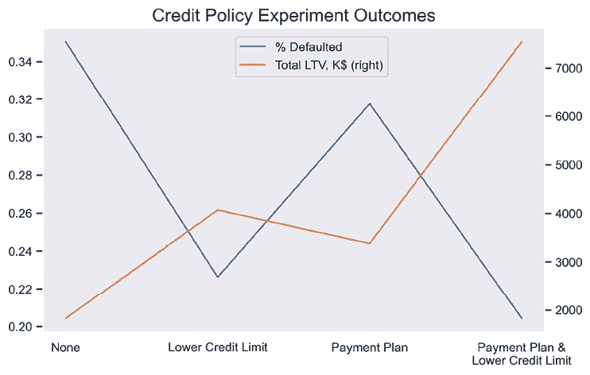

图 11.9：不同信用政策的治疗实验结果

在银行高管们为找到了获胜政策而欢欣鼓舞之前，我们必须检查他们是如何在实验中的信用卡持卡人之间分配它的。我们了解到，他们根据风险因素（由`_risk_score`变量衡量）选择治疗。然而，终身价值在很大程度上受到可用信用额（`_CC_LIMIT`）的影响，因此我们必须考虑这一点。理解分布的一种方法是通过将两个变量以散点图的形式相互对比，并按`_TREATMENT`进行颜色编码。以下代码片段展示了如何实现这一点：

```py
sns.**scatterplot**(
    x=ccdefault_causal_df['_CC_LIMIT'].values,
    y=ccdefault_causal_df['_risk_score'].values,
    hue=all_treatment_names[ccdefault_causal_df['_TREATMENT'].values],
    hue_order = all_treatment_names
) 
```

上述代码生成了*图 11.10*中的图表。它显示三种治疗对应不同的风险水平，而对照组（`None`）在垂直方向上分布得更广。基于风险水平分配治疗的选择也意味着他们基于`_CC_LIMIT`不均匀地分配了治疗。我们应该问自己，这个实验的偏见条件是否使得结果解释甚至变得可行。请看以下输出：

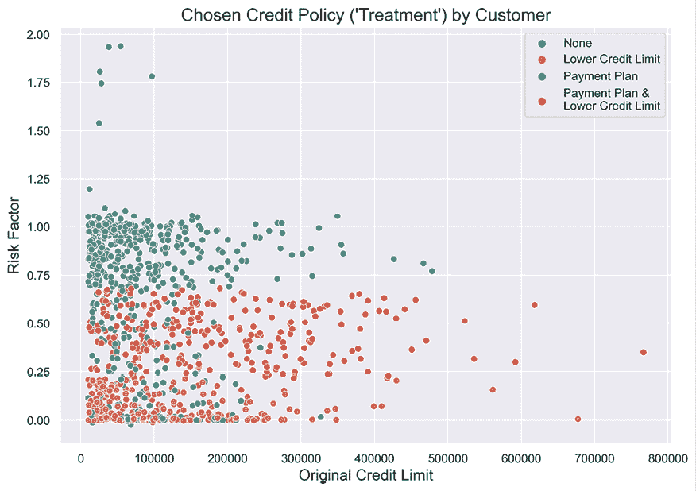

图 11.10：风险因素与原始信用额的比较

*图 11.10*中的散点图展示了治疗在风险因素上的分层。然而，散点图在理解分布时可能具有挑战性。为此，最好使用**核密度估计（KDE**）图。因此，让我们看看`_CC_LIMIT`和终身价值（`_LTV`）在所有治疗中的分布情况，使用 Seaborn 的`displot`。请看以下代码片段：

```py
sns.**displot**(
    ccdefault_causal_df,
    x="_CC_LIMIT",
    hue="_TREATMENT",
    kind="kde",
    fill=True
)
sns.**displot**(
    ccdefault_causal_df,
    x="_LTV",
    hue="_TREATMENT",
    kind="kde", fill=True
) 
Figure 11.11. We can easily tell how far apart all four distributions are for both plots, mostly regarding treatment #3 (Payment Plan & Lower Credit Limit), which tends to be centered significantly more to the right and has a longer and fatter right tail. You can view the output here:
```

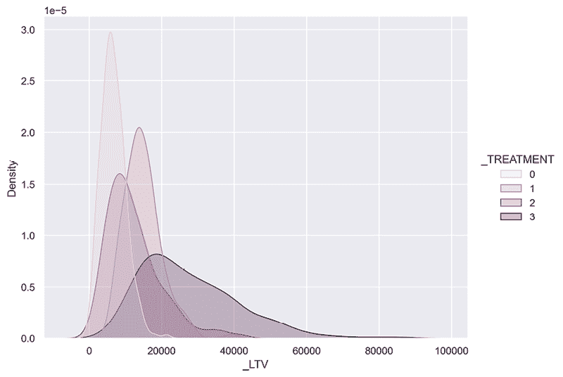

图 11.11：根据 _TREATMENT 的 _CC_LIMIT 和 _LTV 的 KDE 分布

理想情况下，当你设计此类实验时，你应该根据可能改变结果的相关因素，在所有组别中追求平等分布。然而，这并不总是可行的，可能因为物流或战略限制。在这种情况下，结果（`_LTV`）根据客户信用卡额度（`_CC_LIMIT`）、**异质性特征**——换句话说，直接影响处理效果的变量，也称为**异质性处理效应调节因子**而变化。我们可以创建一个包含`_TREATMENT`特征和效应调节因子（`_CC_LIMIT`）的因果模型。

## 理解因果模型

我们将要构建的因果模型可以分为以下四个部分：

+   **结果** (*Y*): 因果模型的结果变量。

+   **处理** (*T*): 影响结果的处理变量。

+   **效应调节因子** (*X*): 影响效应异质性的变量，它位于处理和结果之间。

+   **控制变量** (*W*): 也称为**共同原因**或**混杂因素**。它们是影响结果和处理的特征。

我们将首先将这些组件在数据中识别为单独的`pandas`数据框，如下所示：

```py
**W** = ccdefault_causal_df[
    [
      '_spend','_tpm', '_ppm', '_RETAIL','_URBAN', '_RURAL',
      '_PREMIUM'
    ]
]
**X** = ccdefault_causal_df[['_CC_LIMIT']]
**T** = ccdefault_causal_df[['_TREATMENT']]
**Y** = ccdefault_causal_df[['_LTV']] 
```

我们将使用**双重稳健学习**（**DRL**）方法来估计处理效应。它被称为“双重”，因为它利用了两个模型，如下所示：

+   它使用**回归模型**预测结果，如图所示：


+   它使用**倾向模型**预测处理，如图所示：


由于最终阶段结合了两种模型，同时保持了多个理想的统计特性，如置信区间和渐近正态性，因此它也是**稳健的**。更正式地说，估计利用了条件在处理**t**上的回归模型**g**和倾向模型**p**，如下所示：


它还做了以下操作：


目标是推导出与每个处理**t**相关的异质效应**X**的**条件平均处理效应**（**CATE**），表示为。首先，DRL 方法通过应用逆倾向来去偏回归模型，如下所示：


如何精确地估计模型中的系数将取决于所采用的 DRL 变体。我们将使用线性变体（`LinearDRLearner`），以便它返回系数和截距，这些可以很容易地解释。它通过在处理组`t`和控制组在*x*[t]上的结果差异中运行**普通线性回归**（**OLS**）来推导。这种直观的做法是有意义的，因为处理的估计效应减去没有处理的估计效应（t = 0）是这种处理的*净*效应。

现在，所有理论都已经讲完，让我们深入挖掘吧！

## 初始化线性双重稳健学习器

我们可以通过指定任何与 scikit-learn 兼容的回归器（`model_regression`）和分类器（`model_propensity`）来从`econml`库初始化一个`LinearDRLearner`，我们称之为`drlearner`。我们将使用 XGBoost 来处理这两个，但请注意，分类器有一个`objective=multi:softmax`属性。记住，我们有多个处理，所以这是一个多类分类问题。代码可以在下面的片段中看到：

```py
drlearner = **LinearDRLearner**(
    model_regression=xgb.XGBRegressor(learning_rate=0.1),
    model_propensity=xgb.XGBClassifier(learning_rate=0.1,
    max_depth=2,
    objective="multi:softmax"),
    random_state=rand
) 
```

如果你想了解回归模型和倾向性模型都在做什么，你可以轻松地拟合`xgb.XGBRegressor().fit(W.join(X),Y)`和`xgb.XGBClassifier(objective="multi:softmax").fit(W.join(X), T)`模型。我们现在不会这样做，但如果你好奇，你可以评估它们的性能，甚至运行特征重要性方法来了解它们各自预测的影响。因果模型将它们与 DRL 框架结合在一起，导致不同的结论。

## 拟合因果模型

我们可以使用`drlearner`中的`fit`来拟合因果模型，利用`econml`的`dowhy`包装器。首先的属性是`Y`、`T`、`X`和`Y`组件：`pandas`数据框。可选地，你可以为这些组件提供变量名称：每个`pandas`数据框的列名。最后，我们希望估计处理效应。可选地，我们可以提供用于此的效果修饰符（`X`），我们将使用其中的一半数据来这样做，如下面的代码片段所示：

```py
causal_mdl = drlearner.dowhy.fit(
    Y,
    T,
    X=X,
    W=W,
    outcome_names=Y.columns.to_list(),
    treatment_names=T.columns.to_list(),
    feature_names=X.columns.to_list(),
    confounder_names=W.columns.to_list(),
    target_units=X.iloc[:550].values
) 
```

在因果模型初始化后，我们可以可视化它。`pydot`库与`pygraphviz`可以为我们完成这项工作。请注意，这个库在某些环境中配置困难，所以它可能无法加载并显示`view_model`的默认图形。如果发生这种情况，请不要担心。看看下面的代码片段：

```py
try:
    display(**Image**(to_pydot(causal_mdl._graph._graph).create_png()))
except:
    causal_mdl.**view_model**() 
```

前一个代码片段中的代码输出了此处显示的模型图。有了它，你可以欣赏到所有变量是如何相互连接的：


图 11.12：因果模型图

因果模型已经拟合，那么让我们检查和解释结果，好吗？

# 理解异质处理效应

首先，需要注意的是，`econml` 的 `dowhy` 包装器通过 `dowhy.fit` 方法简化了一些步骤。通常，当你直接使用 `dowhy` 构建 `CausalModel`（如本例所示）时，它有一个名为 `identify_effect` 的方法，该方法推导出要估计的效果的概率表达式（即 *识别估计量*）。在这种情况下，这被称为 **平均处理效应**（**ATE**）。然后，另一个名为 `estimate_effect` 的方法接受这个表达式以及它应该与之关联的模型（回归和倾向）。有了它们，它为每个结果 *i* 和处理 *t* 计算 ATE，，和 CATE，。然而，由于我们使用了包装器来 `fit` 因果模型，它自动处理了识别和估计步骤。

您可以通过因果模型的 `identified_estimand_` 属性访问识别的 ATE，并通过 `estimate_` 属性访问估计结果。以下代码片段显示了代码：

```py
identified_ate = causal_mdl.identified_estimand_
print(identified_ate)
drlearner_estimate = causal_mdl.estimate_
print(drlearner_estimate) 
 the estimand expression for identified_estimand_, which is a derivation of the expected value for , with some assumptions. Then, the causal-realized estimate_ returns the ATE for treatment #1, as illustrated in the following code snippet:
```

```py
Estimand type: nonparametric-ate
### Estimand : 1
Estimand name: backdoor1 (Default)
Estimand expression:
      d 
─────────────(E[_LTV|_RETAIL,_URBAN,_PREMIUM,_RURAL,_CC_LIMIT,
d[_TREATMENT]
])
Estimand assumption 1, Unconfoundedness: If U→{_TREATMENT} and U→_LTV then \ P(_LTV|_TREATMENT,_RETAIL,_URBAN,_PREMIUM,_RURAL,_CC_LIMIT,_spend,_ppm,_tpm,U) = \ P(_LTV|_TREATMENT,_RETAIL,_URBAN,_PREMIUM,_RURAL,_CC_LIMIT,_spend,_ppm,_tpm)
*** Causal Estimate ***
## Identified estimand
Estimand type: nonparametric-ate
## Realized estimand
b:_LTV ~ _TREATMENT + _RETAIL + _URBAN + _PREMIUM + _RURAL + \ _CC_LIMIT + _spend + _ppm + _tpm | _CC_LIMIT
Target units:
## Estimate
Mean value: 7227.904763676559
Effect estimates: [6766.07978487 7337.39526574 7363.36013004
                   7224.20893104 7500.84310705 7221.40328496] 
```

接下来，我们可以遍历因果模型中的所有处理，并为每个处理返回一个总结，如下所示：

```py
for i in range(causal_mdl._d_t[0]):
    print("Treatment: %s" % treatment_names[i])
     display(econml_mdl.**summary**(T=i+1)) 
```

前面的代码输出了三个线性回归总结。第一个看起来像这样：

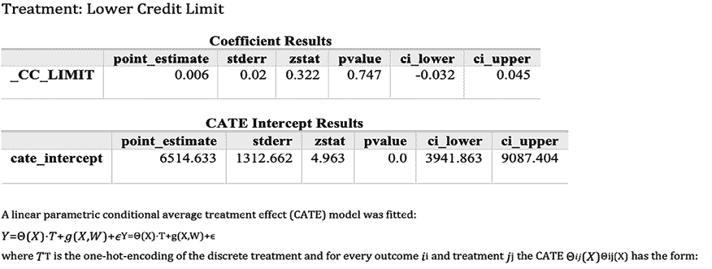

图 11.13：某处理总结

为了更好地理解系数和截距，我们可以用它们各自的置信区间来绘制它们。为此，我们首先创建一个处理索引（`idxs`）。有三个处理，所以这是一个介于 0 和 2 之间的数字数组。然后，使用列表推导将所有系数（`coef_`）和截距（`intercept_`）放入一个数组中。然而，对于系数和截距的 90%置信区间来说，这要复杂一些，因为 `coef__interval` 和 `intercept__interval` 返回这些区间的下限和上限。我们需要两个方向的误差范围的长度，而不是界限。我们从这些界限中减去系数和截距，以获得它们各自的误差范围，如下面的代码片段所示：

```py
idxs = np.arange(0, causal_mdl._d_t[0])
coefs = np.hstack([causal_mdl.**coef_**(T=i+1) for i in idxs])
intercepts = np.hstack(
    [causal_mdl.**intercept_**(T=i+1)for i in idxs]
)
coefs_err = np.hstack(
    [causal_mdl.**coef__interval**(T=i+1) for i in idxs]
)
coefs_err[0, :] = coefs - coefs_err[0, :]
coefs_err[1, :] = coefs_err[1, :] - coefs
intercepts_err = np.vstack(
    [causal_mdl.**intercept__interval**(T=i+1) for i in idxs]
).Tintercepts_err[0, :] = intercepts - intercepts_err[0, :]
intercepts_err[1, :] = intercepts_err[1, :] - intercepts 
```

接下来，我们使用 `errorbar` 函数绘制每个处理及其相应误差的系数。我们还可以将截距作为另一个子图进行相同的操作，如下面的代码片段所示：

```py
ax1 = plt.subplot(2, 1, 1)
plt.errorbar(**idxs**, **coefs**, **coefs_err**, fmt="o")
plt.xticks(idxs, treatment_names)
plt.setp(ax1.get_xticklabels(), visible=False)
plt.title("Coefficients")
plt.subplot(2, 1, 2)
plt.errorbar(**idxs**, **intercepts**, **intercepts_err**, fmt="o")
plt.xticks(idxs, treatment_names)
plt.title("Intercepts") 
```

前面的代码片段输出以下内容：


图 11.14：所有处理的系数和截距

通过*图 11.14*，你可以欣赏到所有截距和系数的相对误差范围有多大。尽管如此，很明显，仅从系数来看，从左到右读取时，治疗的效果会逐渐变好。但在我们得出**支付计划 & 降低信用额度**是最佳政策的结论之前，我们必须考虑截距，这个截距对于这种治疗比第一个要低。本质上，这意味着具有最低信用卡额度的客户更有可能通过第一种政策提高终身价值，因为系数是乘以限制的，而截距是起点。鉴于没有一种最佳政策适用于所有客户，让我们来看看如何使用因果模型为每个客户选择政策。

## 选择政策

我们可以使用`const_marginal_effect`方法根据客户基础制定信用政策，该方法考虑了*X*效果修正器（`_CC_LIMIT`）并计算反事实 CATE，。换句话说，它返回了所有观察到的*X*中所有治疗的估计`_LTV`。

然而，它们并不都花费相同。制定支付计划需要每份合同约*NT$*1,000 的行政和法律费用，根据银行的精算部门，降低信用额度 25 的机遇成本估计为每月平均支付*NT$*72（`_ppm`），在整个客户生命周期内。为了考虑这些成本，我们可以设置一个简单的`lambda`函数，该函数接受所有治疗的支付计划成本并将它们添加到变量信用额度成本中，这自然地乘以`_ppm`。给定一个长度为*n*的信用卡额度数组，成本函数返回一个(*n*, 3)维度的数组，其中包含每个治疗的成本。然后，我们获得反事实 CATE 并扣除成本（`treatment_effect_minus_costs`）。然后，我们将数组扩展以包括一列表示**无**治疗的零，并使用`argmax`返回每个客户的推荐治疗索引（`recommended_T`），如下面的代码片段所示：

```py
**cost_fn** = lambda X: np.repeat(
    np.array([[0, 1000, 1000]]),
    X.shape[0], axis=0) + (np.repeat(np.array([[72, 0, 72]]),
    X.shape[0], axis=0)
    *X._ppm.values.reshape(-1,1)
)
**treatment_effect_minus_costs** = causal_mdl.const_marginal_effect(
    X=X.values) - **cost_fn**(ccdefault_causal_df)
treatment_effect_minus_costs = np.hstack(
    [
        np.zeros(X.shape),
        **treatment_effect_minus_costs**
    ]
)
recommended_T = np.**argmax**(treatment_effect_minus_costs, axis=1) 
```

我们可以使用`scatterplot` `_CC_LIMIT`和`_ppm`，按推荐治疗进行颜色编码，以观察客户的最佳信用政策，如下所示：

```py
sns.scatterplot(
    x=ccdefault_causal_df['_CC_LIMIT'].values,
    y=ccdefault_causal_df['_ppm'].values,
    hue=all_treatment_names[recommended_T],
    hue_order=all_treatment_names
)
plt.title("Optimal Credit Policy by Customer")
plt.xlabel("Original Credit Limit")
plt.ylabel("Payments/month") 
```

前面的代码片段输出以下散点图：

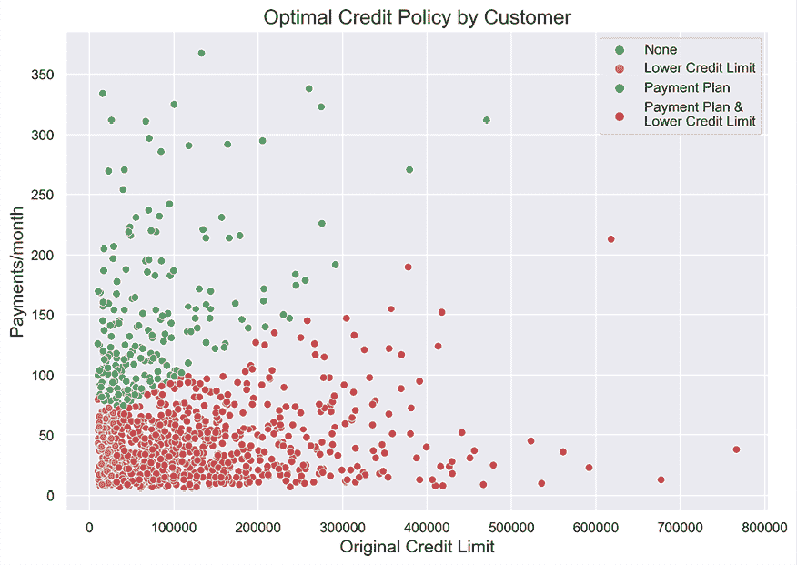图 11.15：根据原始信用额度和卡片使用情况，客户最优信用政策

在 *图 11.15* 中很明显，“None”（无治疗）永远不会被推荐给任何客户。即使不扣除成本，这一事实也成立——你可以从 `treatment_effect_minus_costs` 中移除 `cost_fn` 并重新运行输出图表的代码来验证，无论成本如何，治疗总是被推荐的。你可以推断出所有治疗对客户都有益，其中一些比其他更多。当然，根据客户的不同，一些治疗比其他治疗对银行更有利。这里有一条很细的界限。

最大的担忧之一是客户的公平性，特别是那些银行伤害最严重的客户：弱势年龄群体。仅仅因为一项政策对银行的成本比另一项更高，并不意味着应该排除访问其他政策的机会。评估这一点的一种方法可以使用所有推荐政策的百分比堆叠条形图。这样，我们可以观察推荐政策在特权群体和弱势群体之间的分配情况。看看下面的代码片段：

```py
ccdefault_causal_df['recommended_T'] = recommended_T
plot_df = ccdefault_causal_df.groupby(
    ['recommended_T','AGE_GROUP']).size().reset_index()
plot_df['AGE_GROUP'] = plot_df.AGE_GROUP.**replace**(
    {0:'underprivileged', 1:'privileged'}
)
plot_df = plot_df.pivot(
    columns='AGE_GROUP',
    index='recommended_T',
    values=0
)
plot_df.index = treatment_names
plot_df = plot_df.apply(lambda r: **r/r.sum()*100**, axis=1)
plot_df.plot.bar(stacked=True, rot=0)
plt.xlabel('Optimal Policy')
plt.ylabel('%') 
```

前一个代码片段中的代码输出如下：

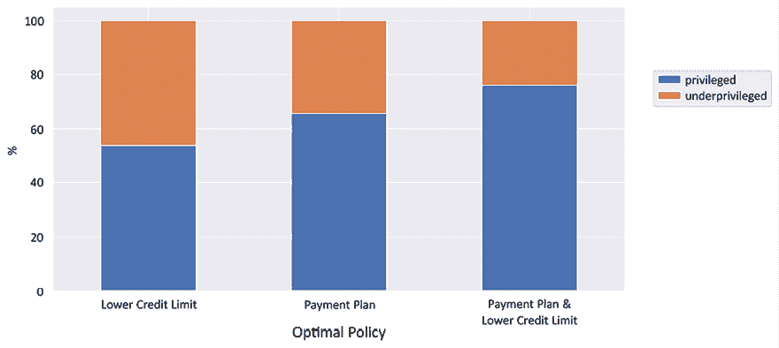

图 11.16：最优策略分布的公平性

*图 11.16* 展示了特权群体被分配到具有**支付计划**的政策的比例更高。这种差异主要是由于银行的成本是一个因素，所以如果银行能够承担一些这些成本，那么它可能会更加公平。但什么是公平的解决方案呢？选择信贷政策是程序公平性的一个例子，并且有许多可能的定义。平等对待是否字面意义上的平等对待或比例对待？它是否包括选择自由的概念？如果客户更喜欢一项政策而不是另一项，他们应该被允许切换吗？无论定义如何，都可以通过因果模型的帮助来解决。我们可以将相同的政策分配给所有客户，或者调整推荐政策的分布，使得比例相等，或者每个客户都可以在第一和第二最优政策之间进行选择。有如此多的方法可以这样做！

# 测试估计的鲁棒性

`dowhy` 库提供了四种方法来测试估计因果效应的鲁棒性，具体如下：

+   **随机共同原因**：添加一个随机生成的混杂因素。如果估计是鲁棒的，ATE（平均处理效应）不应该变化太多。

+   **安慰剂治疗反驳者**：用随机变量（安慰剂）替换治疗。如果估计是鲁棒的，ATE 应该接近零。

+   **数据子集反驳者**：移除数据的一个随机子集。如果估计器泛化良好，ATE 不应该变化太多。

+   **添加未观察到的共同原因**：添加一个与处理和结果都相关的未观察到的混杂因素。估计量假设存在一定程度的未混杂性，但添加更多应该会偏误估计。根据混杂因素效应的强度，它应该对 ATE 有相同的影响。

我们将用前两个来测试稳健性。

## 添加随机共同原因

此方法通过调用`refute_estimate`并指定`method_name="random_common_cause"`来实现，这是最简单的实现方式。这将返回一个可以打印的摘要。请看以下代码片段：

```py
ref_random = causal_mdl.refute_estimate(
    method_name="random_common_cause"
)
print(ref_random) 
```

前述代码片段输出如下：

```py
Refute: Add a Random Common Cause
Estimated effect:7227.904763676559
New effect:7241.433599647397 
```

前面的输出告诉我们，一个新的共同原因，或称 *W* 变量，对平均处理效应（ATE）没有显著影响。

## 用随机变量替换处理变量

使用此方法，我们将用噪声替换处理变量。如果处理与结果有稳健的相关性，这应该将平均效应降至零。为了实现它，我们同样调用`refute_estimate`函数，但使用`placebo_treatment_refuter`作为方法。我们还必须指定`placebo_type`和模拟次数（`num_simulations`）。我们将使用的安慰剂类型是`permute`，模拟次数越多越好，但这也会花费更长的时间。代码可以在以下片段中看到：

```py
ref_placebo = causal_mdl.refute_estimate(
    method_name="placebo_treatment_refuter",
    placebo_type="permute", num_simulations=20
)
print(ref_placebo) 
```

前面的代码输出如下：

```py
Refute: Use a Placebo Treatment
Estimated effect:7227.904763676559
New effect:381.05420029741083
p value:0.32491556283289624 
```

如前述输出所示，新的效应接近于零。然而，鉴于 p 值高于 0.05，我们不能拒绝 ATE 大于零的零假设。这告诉我们，估计的因果效应并不非常稳健。我们可能通过添加相关的混杂因素或使用不同的因果模型来改进它，但同样，实验设计存在我们无法修复的缺陷，例如银行根据风险因素偏袒地指定治疗方式。

# 任务完成

本章的任务有两个，如下所述：

+   创建一个公平的预测模型来预测哪些客户最有可能违约。

+   创建一个稳健的因果模型来估计哪些政策对客户和银行最有益。

关于第一个目标，我们已经根据四个公平性指标（SPD、DI、AOD、EOD）——在比较特权群体和弱势群体年龄组时——产生了四个具有偏差缓解方法的模型，这些模型在客观上比基础模型更公平。然而，根据 DFBA（参见*图 11.7*），只有其中两个模型在同时使用年龄组和性别时具有交叉公平性。通过结合方法，我们仍然可以显著提高公平性，但任何一种模型都能改进基础模型。

对于第二个目标，因果推断框架确定，所测试的任何政策对于双方来说都比没有政策要好。太好了！然而，它得出的估计并没有确立一个单一的获胜者。尽管如此，正如预期的那样，推荐的政策会根据客户的信用额度而变化——另一方面，如果我们旨在最大化银行利润，我们必须考虑信用卡的平均使用情况。盈利性的问题提出了我们必须协调的两个目标：制定对客户或银行最有利的推荐政策。

因此，如何程序上公平是一个复杂的问题，有许多可能的答案，任何解决方案都可能导致银行吸收与实施政策相关的部分成本。至于鲁棒性，尽管实验存在缺陷，但我们可以说我们的估计具有中等水平的鲁棒性，通过了一个鲁棒性测试但没有通过另一个。话虽如此，这完全取决于我们认为足够鲁棒以验证我们的发现。理想情况下，我们会要求银行开始一个新的无偏实验，但等待另外 6 个月可能不可行。

在数据科学中，我们经常发现自己在与有缺陷的实验和有偏差的数据打交道，并必须充分利用它们。因果推断通过分离原因和效果，包括估计及其相应的置信区间，提供了一种这样做的方法。然后我们可以提供带有所有免责声明的发现，以便决策者可以做出明智的决策。有偏差的决策会导致有偏差的结果，因此解决偏差的道德必要性可以从塑造决策开始。

# 摘要

在阅读本章之后，你应该了解如何通过视觉和指标在数据和模型中检测偏差，然后通过预处理、处理和后处理方法来减轻偏差。我们还通过估计异质处理效应、用它们做出公平的政策决策以及测试它们的鲁棒性来了解因果推断。在下一章中，我们也将讨论偏差，但学习如何调整模型以满足多个目标，包括公平性。

# 数据集来源

Yeh, I. C., & Lien, C. H. (2009). *比较数据挖掘技术在预测信用卡客户违约概率方面的准确性*. 《专家系统与应用》，36(2)，2473-2480: [`dl.acm.org/doi/abs/10.1016/j.eswa.2007.12.020`](https://dl.acm.org/doi/abs/10.1016/j.eswa.2007.12.020)

# 进一步阅读

+   Chang, C., Chang, H.H., and Tien, J., 2017, *关于信息不对称下金融监管机构应对策略的研究：台湾信用卡市场案例研究*. 《通用管理杂志》，5，429-436: [`doi.org/10.13189/ujm.2017.050903`](http://doi.org/10.13189/ujm.2017.050903)

+   Foulds, J., and Pan, S., 2020, *An Intersectional Definition of Fairness*. 2020 IEEE 36th International Conference on Data Engineering (ICDE), 1918-1921: [`arxiv.org/abs/1807.08362`](https://arxiv.org/abs/1807.08362)

+   Kamiran, F., and Calders, T., 2011, *Data preprocessing techniques for classification without discrimination*. Knowledge and Information Systems, 33, 1-33: [`link.springer.com/article/10.1007/s10115-011-0463-8`](https://link.springer.com/article/10.1007/s10115-011-0463-8)

+   Feldman, M., Friedler, S., Moeller, J., Scheidegger, C., and Venkatasubramanian, S., 2015, *Certifying and Removing DI*. Proceedings of the 21st ACM SIGKDD International Conference on Knowledge Discovery and Data Mining: [`arxiv.org/abs/1412.3756`](https://arxiv.org/abs/1412.3756)

+   Kamishima, T., Akaho, S., Asoh, H., and Sakuma, J., 2012, *Fairness-Aware Classifier with Prejudice Remover Regularizer*. ECML/PKDD: [`dl.acm.org/doi/10.5555/3120007.3120011`](https://dl.acm.org/doi/10.5555/3120007.3120011)

+   A. Agarwal, A. Beygelzimer, M. Dudik, J. Langford, and H. Wallach, *A Reductions Approach to Fair Classification*, International Conference on Machine Learning, 2018\. [`arxiv.org/pdf/1803.02453.pdf`](https://arxiv.org/pdf/1803.02453.pdf)

+   Kearns, M., Neel, S., Roth, A., and Wu, Z., 2018, *Preventing Fairness Gerrymandering: Auditing and Learning for Subgroup Fairness*. ICML: [`arxiv.org/pdf/1711.05144.pdf`](https://arxiv.org/pdf/1711.05144.pdf)

+   Pleiss, G., Raghavan, M., Wu, F., Kleinberg, J., and Weinberger, K.Q., 2017, *On Fairness and Calibration*. NIPS: [`arxiv.org/abs/1709.02012`](https://arxiv.org/abs/1709.02012)

+   Foster, D. and Syrgkanis, V., 2019, *Orthogonal Statistical Learning*. ICML: [`arxiv.org/abs/1901.09036`](http://arxiv.org/abs/1901.09036)

# 在 Discord 上了解更多

要加入这本书的 Discord 社区——在那里您可以分享反馈、向作者提问，并了解新版本——请扫描下面的二维码：

`packt.link/inml`


