# 对抗性鲁棒性

机器学习解释有许多关注点，从知识发现到具有实际伦理影响的高风险问题，如上一两章中探讨的公平性问题。在本章中，我们将关注涉及可靠性、安全性和安全性的问题。

正如我们在*第七章*，*可视化卷积神经网络*中使用的**对比解释方法**所意识到的那样，我们可以轻易地欺骗图像分类器做出令人尴尬的错误预测。这种能力可能具有严重的后果。例如，一个肇事者可以在让路标志上贴上一个黑色贴纸，尽管大多数司机仍然会将其识别为让路标志，但自动驾驶汽车可能就不再能识别它，从而导致撞车。银行劫匪可能穿着一种冷却服装来欺骗银行保险库的热成像系统，尽管任何人都可能注意到它，但成像系统却无法做到。

风险不仅限于复杂的图像分类器。其他模型也可能被欺骗！在*第六章*，锚点和反事实解释中产生的**反事实示例**，就像对抗性示例一样，但目的是欺骗。攻击者可以利用任何误分类示例，在决策边界上进行对抗性操作。例如，垃圾邮件发送者可能会意识到调整一些电子邮件属性可以增加绕过垃圾邮件过滤器的可能性。

复杂模型更容易受到对抗性攻击。那么我们为什么还要信任它们呢？！我们当然可以使它们更加可靠，这就是对抗性鲁棒性的含义。对手可以通过多种方式故意破坏模型，但我们将重点关注逃避攻击，并简要解释其他形式的攻击。然后我们将解释两种防御方法：空间平滑预处理和对抗性训练。最后，我们将展示一种鲁棒性评估方法。

这些是我们将要讨论的主要主题：

+   了解逃避攻击

+   使用预处理防御针对攻击

+   通过对鲁棒分类器的对抗性训练来防御任何逃避攻击

# 技术要求

本章的示例使用了`mldatasets`、`numpy`、`sklearn`、`tensorflow`、`keras`、`adversarial-robustness-toolbox`、`matplotlib`和`seaborn`库。如何安装所有这些库的说明在*前言*中。

本章的代码位于此处：[`packt.link/1MNrL`](https://packt.link/1MNrL)

# 任务

全球私人签约保安服务行业市场规模超过 2500 亿美元，年增长率为约 5%。然而，它面临着许多挑战，例如在许多司法管辖区缺乏足够培训的保安和专业的安全专家，以及一系列意外的安全威胁。这些威胁包括广泛的协调一致的网络安全攻击、大规模暴乱、社会动荡，以及最后但同样重要的是，由大流行带来的健康风险。确实，2020 年通过勒索软件、虚假信息攻击、抗议活动和 COVID-19 等一系列事件考验了该行业。

在此之后，美国最大的医院网络之一要求他们的签约保安公司监控医院内访客和员工佩戴口罩的正确性。保安公司因为这项请求而感到困扰，因为它分散了保安人员应对其他威胁（如入侵者、斗殴患者和挑衅访客）的精力。该公司在每个走廊、手术室、候诊室和医院入口都有视频监控。每次都不可能监控到每个摄像头的画面，因此保安公司认为他们可以用深度学习模型来协助保安：

这些模型已经能够检测到异常活动，例如在走廊里奔跑和在物业任何地方挥舞武器。他们向医院网络提出建议，希望添加一个新模型来检测口罩的正确使用。在 COVID-19 之前，医院各区域已经实施了强制佩戴口罩的政策，而在 COVID-19 期间，则要求在所有地方佩戴口罩。医院管理员希望根据未来的大流行风险水平来开启和关闭这一监控功能。他们意识到，人员会感到疲惫并忘记戴上口罩，或者有时口罩会部分滑落。许多访客也对佩戴口罩持敌对态度，他们可能会在进入医院时戴上口罩，但如果没有保安在场，就会摘下。这并不总是故意的，因此他们不希望像对其他威胁一样，在每次警报时都派遣保安：

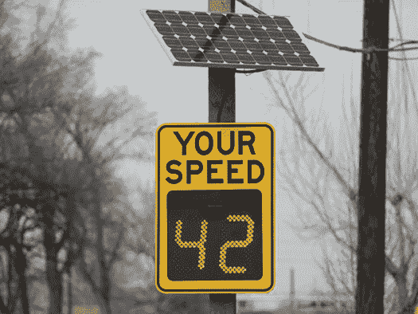

图 13.1：像这样的雷达速度标志有助于遏制超速

意识是雷达速度标志（见*图 13.1*）的一种非常有效的方法，它通过仅让驾驶员意识到他们开得太快，从而使道路更安全。同样，在繁忙走廊的尽头设置屏幕，显示最近错误或故意未遵守强制佩戴口罩规定的人的快照，可能会让违规者感到尴尬。系统将记录反复违规者，以便保安可以找到他们，要么让他们遵守规定，要么要求他们离开现场。

对于试图欺骗模型规避合规性的访客，存在一些担忧，因此安全公司雇佣你来确保模型在面对这种对抗性攻击时具有鲁棒性。安全官员在之前注意到一些低技术含量的诡计，例如人们在意识到摄像头正在监控他们时，会暂时用手或毛衣的一部分遮住他们的脸。在一个令人不安的事件中，访客降低了灯光，并在摄像头上喷了一些凝胶，在另一个事件中，有人涂鸦了他们的嘴巴。然而，人们对更高技术攻击的担忧，例如干扰摄像头的无线信号或直接向摄像头照射高功率激光。执行这些攻击的设备越来越容易获得，可能会对更大规模的监控功能，如防止盗窃，产生影响。安全公司希望这种鲁棒性练习能够为改善每个监控系统和模型的努力提供信息。

最终，安全公司希望使用他们监控的医院中的面部图像来生成自己的数据集。同时，从外部来源合成的面具面部图像是他们短期内将模型投入生产的最佳选择。为此，你被提供了一组合成的正确和错误面具面部图像及其未面具对应图像的大型数据集。这两个数据集被合并成一个，原始的 1,024 × 1,024 尺寸被减少到缩略图的 124 × 124 尺寸。此外，为了提高效率，从这些数据集中采样了大约 21,000 张图像。

# 方法

你已经决定采取四步方法：

+   探索几种可能的规避攻击，以了解模型对这些攻击的脆弱性以及它们作为威胁的可靠性

+   使用预处理方法来保护模型免受这些攻击

+   利用对抗性再训练来生成一个本质上对许多此类攻击更不易受影响的鲁棒分类器

+   使用最先进的方法评估鲁棒性，以确保医院管理员相信该模型具有对抗性鲁棒性

让我们开始吧！

# 准备工作

你可以在以下位置找到这个示例的代码：[`github.com/PacktPublishing/Interpretable-Machine-Learning-with-Python-2E/tree/main/13/Masks.ipynb`](https://github.com/PacktPublishing/Interpretable-Machine-Learning-with-Python-2E/tree/main/13/Masks.ipynb)

## 加载库

要运行此示例，你需要安装以下库：

+   `mldatasets` 用于加载数据集

+   `numpy` 和 `sklearn` (scikit-learn) 用于操作它

+   `tensorflow` 用于拟合模型

+   `matplotlib` 和 `seaborn` 用于可视化解释

你应该首先加载所有这些：

```py
import math
import os
import warnings
warnings.filterwarnings("ignore")
import mldatasets
import numpy as np
from sklearn import preprocessing
import tensorflow as tf
from tensorflow.keras.utils import get_file
import matplotlib.pyplot as plt
import seaborn as sns
from sklearn import metrics
from art.estimators.classification import KerasClassifier
from art.attacks.evasion import FastGradientMethod,\
                      ProjectedGradientDescent, BasicIterativeMethod
from art.attacks.evasion import CarliniLInfMethod
from art.attacks.evasion import AdversarialPatchNumpy
from art.defences.preprocessor import SpatialSmoothing
from art.defences.trainer import AdversarialTrainer
from tqdm.notebook import tqdm 
```

让我们用 `print(tf.__version__)` 检查 TensorFlow 是否加载了正确的版本。版本应该是 2.0 及以上。

我们还应该禁用即时执行，并验证它是否已通过以下命令完成：

```py
tf.compat.v1.disable_eager_execution()
print('Eager execution enabled:', tf.executing_eagerly()) 
```

输出应该显示为 `False`。

在 TensorFlow 中，开启急切执行模式意味着它不需要计算图或会话。这是 TensorFlow 2.x 及以后版本的默认设置，但在之前的版本中不是，所以你需要禁用它以避免与为 TensorFlow 早期版本优化的代码不兼容。

## 理解和准备数据

我们将数据加载到四个 NumPy 数组中，对应于训练/测试数据集。在此过程中，我们将`X`面部图像除以 255，因为这样它们的值将在零和一之间，这对深度学习模型更好。我们称这种特征缩放。我们需要记录训练数据的`min_`和`max_`，因为我们稍后会需要这些信息：

```py
X_train, X_test, y_train, y_test = mldatasets.load(
    "maskedface-net_thumbs_sampled", prepare=True
)
X_train, X_test = X_train / 255.0, X_test / 255.0
min_ = X_train.min()
max_ = X_train.max() 
```

当我们加载数据时，始终验证数据非常重要，以确保数据没有被损坏：

```py
print('X_train dim:\t%s' % (X_train.**shape**,))
print('X_test dim:\t%s' % (X_test.**shape**,))
print('y_train dim:\t%s' % (y_train.**shape**,))
print('y_test dim:\t%s' % (y_test.**shape**,))
print('X_train min:\t%s' % (**min_**))
print('X_train max:\t%s' % (**max_**))
print('y_train labels:\t%s' % (np.**unique**(y_train))) 
that they are not one-hot encoded. Indeed, by printing the unique values (np.unique(y_train)), we can tell that labels are represented as text: Correct for correctly masked, Incorrect for incorrectly masked, and None for no mask:
```

```py
X_train dim:    (16800, 128, 128, 3)
X_test dim: (4200, 128, 128, 3)
y_train dim:    (16800, 1)
y_test dim: (4200, 1)
X_train min:    0.0
X_train max:    1.0
y_train labels: ['Correct' 'Incorrect' 'None'] 
```

因此，我们需要执行的一个预处理步骤是将`y`标签**独热编码**（**OHE**），因为我们需要 OHE 形式来评估模型的预测性能。一旦我们初始化`OneHotEncoder`，我们就需要将其`fit`到训练数据（`y_train`）中。我们还可以将编码器中的类别提取到一个列表（`labels_l`）中，以验证它包含所有三个类别：

```py
ohe = preprocessing.**OneHotEncoder**(sparse=False)
ohe.**fit**(y_train)
labels_l = ohe.**categories_**[0].tolist()
print(labels_l) 
```

为了确保可复现性，始终以这种方式初始化你的随机种子：

```py
rand = 9
os.environ['PYTHONHASHSEED'] = str(rand)
tf.random.set_seed(rand)
np.random.seed(rand) 
```

使机器学习真正可复现意味着也要使其确定性，这意味着使用相同的数据进行训练将产生具有相同参数的模型。在深度学习中实现确定性非常困难，并且通常依赖于会话、平台和架构。如果你使用 NVIDIA GPU，你可以安装一个名为`framework-reproducibility`的库。

本章我们将要学习的许多对抗攻击、防御和评估方法都非常资源密集，所以如果我们用整个测试数据集来使用它们，它们可能需要数小时才能完成单个方法！为了提高效率，强烈建议使用测试数据集的样本。因此，我们将使用`np.random.choice`创建一个中等大小的 200 张图像样本（`X_test_mdsample`, `y_test_mdsample`）和一个小型 20 张图像样本（`X_test_smsample`, `y_test_smsample`）：

```py
sampl_md_idxs = np.random.choice(X_test.shape[0], 200, replace=False)
X_test_mdsample = X_test[sampl_md_idxs]
y_test_mdsample = y_test[sampl_md_idxs]
sampl_sm_idxs = np.random.choice(X_test.shape[0], 20, replace=False)
X_test_smsample = X_test[sampl_sm_idxs]
y_test_smsample = y_test[sampl_sm_idxs] 
```

我们有两个样本大小，因为某些方法在较大的样本大小下可能需要太长时间。现在，让我们看看我们的数据集中有哪些图像。在先前的代码中，我们已经从我们的测试数据集中取了一个中等和一个小样本。我们将使用以下代码将我们小样本中的每张图像放置在一个 4 × 5 的网格中，类别标签位于其上方：

```py
plt.subplots(figsize=(15,12))
for s in range(20):
    plt.subplot(4, 5, s+1)
    plt.title(y_test_smsample[s][0], fontsize=12)
    plt.imshow(X_test_smsample[s], interpolation='spline16')
    plt.axis('off')
plt.show() 
```

上述代码在*图 13.2*中绘制了图像网格：

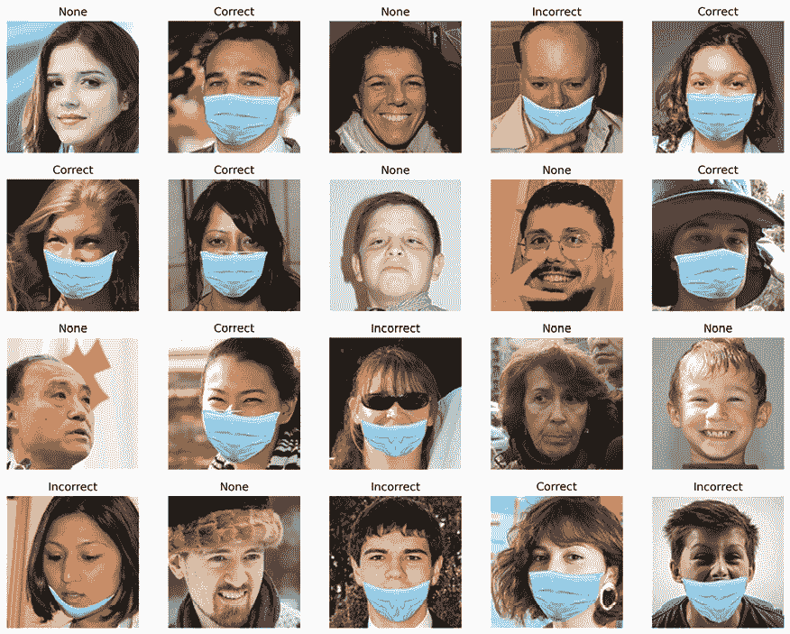

图 13.2：一个带有遮挡和未遮挡面部的小型测试数据集样本

*图 13.2* 展示了各种年龄、性别和种族的正面和反面、带口罩和不带口罩的面部图像。尽管种类繁多，但关于这个数据集的一个需要注意的事项是，它只展示了浅蓝色的外科口罩，且图像大多是正面角度。理想情况下，我们会生成一个包含所有颜色和类型口罩的更大数据集，并在训练前或训练期间对其进行随机旋转、剪切和亮度调整，以进一步增强模型的鲁棒性。这些增强将使模型更加鲁棒。尽管如此，我们必须区分这种一般类型的鲁棒性和对抗鲁棒性。

## 加载 CNN 基础模型

您不必训练 CNN 基础模型，但相关的代码已提供在 GitHub 仓库中。预训练模型也已存储在那里。我们可以快速加载模型并输出其摘要，如下所示：

```py
model_path = **get_file**('CNN_Base_MaskedFace_Net.hdf5',\
    'https://github.com/PacktPublishing/Interpretable-Machine- \
    Learning-with-Python/blob/master/models/ \
    CNN_Base_MaskedFace_Net.hdf5?raw=true')
base_model = tf.keras.models.**load_model**(model_path)
base_model.**summary**() 
```

上述代码片段输出了以下摘要：

```py
Model: "CNN_Base_MaskedFaceNet_Model"
_________________________________________________________________
Layer (type)                 Output Shape              Param #   
=================================================================
conv2d_1 (Conv2D)            (None, 126, 126, 16)      448       _________________________________________________________________
maxpool2d_1 (MaxPooling2D)   (None, 63, 63, 16)        0         
_________________________________________________________________
conv2d_2 (Conv2D)            (None, 61, 61, 32)        4640      
_________________________________________________________________
maxpool2d_2 (MaxPooling2D)   (None, 30, 30, 32)        0         
_________________________________________________________________
conv2d_3 (Conv2D)            (None, 28, 28, 64)        18496     
_________________________________________________________________
maxpool2d_3 (MaxPooling2D)   (None, 14, 14, 64)        0         
_________________________________________________________________
conv2d_4 (Conv2D)            (None, 12, 12, 128)       73856     
_________________________________________________________________
maxpool2d_4 (MaxPooling2D)   (None, 6, 6, 128)         0         
_________________________________________________________________
flatten_6 (Flatten)          (None, 4608)              0         
_________________________________________________________________
dense_1 (Dense)              (None, 768)               3539712   
_________________________________________________________________
dropout_6 (Dropout)          (None, 768)               0         
_________________________________________________________________
dense_2 (Dense)              (None, 3)                 2307      
=================================================================
Total params: 3,639,459
Trainable params: 3,639,459
Non-trainable params: 0
_________________________________________________________________ 
```

摘要几乎包含了我们需要了解的所有关于模型的信息。它有四个卷积层 (`Conv2D`)，每个卷积层后面都跟着一个最大池化层 (`MaxPooling2D`)。然后是一个 `Flatten` 层和一个全连接层 (`Dense`)。接着，在第二个 `Dense` 层之前还有更多的 `Dropout`。自然地，这个最终层有三个神经元，对应于每个类别。

## 评估 CNN 基础分类器

我们可以使用 `evaluate_multiclass_mdl` 函数和测试数据集来评估模型。参数包括模型 (`base_model`)、我们的测试数据 (`X_test`) 和相应的标签 (`y_test`)，以及类名 (`labels_l`) 和编码器 (`ohe`)。最后，由于准确率很高，我们不需要绘制 ROC 曲线（`plot_roc=False`）。此函数返回预测标签和概率，我们可以将这些变量存储起来以供以后使用：

```py
y_test_pred, y_test_prob = mldatasets.**evaluate_multiclass_mdl**(
    base_model,
    X_test,
    y_test,
    labels_l,
    ohe,
    plot_conf_matrix=True,
    predopts={"verbose":1}
) 
```

上述代码生成了 *图 13.3*，其中包含每个类别的混淆矩阵和性能指标：

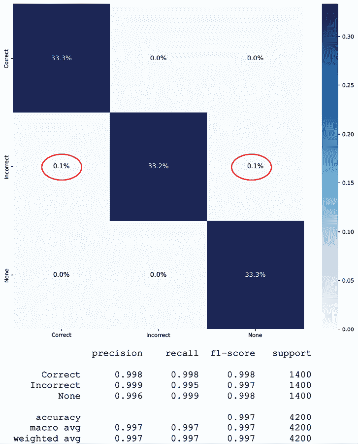

图 13.3：在测试数据集上评估的基础分类器的混淆矩阵和预测性能指标

尽管图 13.3 中的混淆矩阵似乎表明分类完美，但请注意圈出的区域。一旦我们看到召回率（99.5%）的分解，我们就可以知道模型在错误地分类带口罩的面部图像时存在一些问题。

现在，我们可以开始攻击这个模型，以评估它的实际鲁棒性！

# 了解逃避攻击

有六种广泛的对抗攻击类别：

+   **规避攻击**：设计一个输入，使其能够导致模型做出错误的预测，尤其是当它不会欺骗人类观察者时。它可以是定向的或非定向的，这取决于攻击者意图欺骗模型将特定类别（定向）或任何类别（非定向）误分类。攻击方法可以是白盒攻击，如果攻击者可以完全访问模型及其训练数据集，或者黑盒攻击，只有推理访问。灰盒攻击位于中间。黑盒攻击总是模型无关的，而白盒和灰盒方法可能不是。

+   **投毒攻击**：将错误的训练数据或参数注入模型，其形式取决于攻击者的能力和访问权限。例如，对于用户生成数据的系统，攻击者可能能够添加错误的数据或标签。如果他们有更多的访问权限，也许他们可以修改大量数据。他们还可以调整学习算法、超参数或数据增强方案。像规避攻击一样，投毒攻击也可以是定向的或非定向的。

+   **推理攻击**：通过模型推理提取训练数据集。推理攻击也以多种形式出现，可以通过成员推理进行间谍活动（隐私攻击），以确认一个示例（例如，一个特定的人）是否在训练数据集中。属性推理确定一个示例类别（例如，种族）是否在训练数据中表示。输入推理（也称为模型反演）有攻击方法可以从模型中提取训练数据集，而不是猜测和确认。这些具有广泛的隐私和监管影响，尤其是在医疗和法律应用中。

+   **特洛伊木马攻击**：这会在推理期间通过触发器激活恶意功能，但需要重新训练模型。

+   **后门攻击**：类似于特洛伊木马，但即使模型从头开始重新训练，后门仍然存在。

+   **重编程**：在训练过程中通过悄悄引入专门设计以产生特定输出的示例来远程破坏模型。例如，如果你提供了足够多的标记为虎鲨的示例，其中四个小黑方块总是出现在相同的位置，模型就会学习到那是一个虎鲨，无论它是什么，从而故意迫使模型过度拟合。

前三种是最受研究的对抗攻击形式。一旦我们根据阶段和目标将它们分开，攻击可以进一步细分（见*图 13.4*）。阶段是指攻击实施时，因为它可以影响模型训练或其推理，而目标是攻击者希望从中获得什么。本章将仅处理规避破坏攻击，因为我们预计医院访客、患者和工作人员偶尔会破坏生产模型：

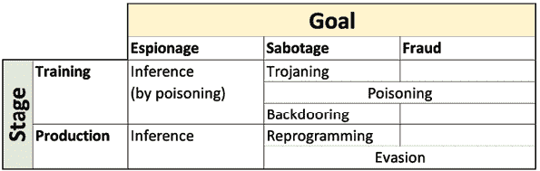

图 13.4：按阶段和目标分类的对抗攻击方法表

尽管我们使用白盒方法来攻击、防御和评估模型的鲁棒性，但我们并不期望攻击者拥有这种级别的访问权限。我们只会使用白盒方法，因为我们完全访问了模型。在其他情况下，例如带有热成像系统和相应模型以检测犯罪者的银行监控系统，我们可能会预期专业攻击者使用黑盒方法来寻找漏洞！因此，作为该系统的防御者，我们明智的做法是尝试相同的攻击方法。

我们将用于对抗鲁棒性的库称为**对抗鲁棒性工具箱**（**ART**），它由**LF AI & 数据基金会**支持——这些人还支持其他开源项目，如 AIX360 和 AIF360，这些项目在**第十一章**中进行了探讨，即偏差缓解和因果推断方法。ART 要求攻击模型被抽象为估计器或分类器，即使它是黑盒的。在本章的大部分内容中，我们将使用 `KerasClassifier`，但在最后一节中，我们将使用 `TensorFlowV2Classifier`。初始化 ART 分类器很简单。你必须指定 `model`，有时还有其他必需的属性。对于 `KerasClassifier`，所有剩余的属性都是可选的，但建议你使用 `clip_values` 来指定特征的取值范围。许多攻击是输入排列，因此了解允许或可行的输入值是什么至关重要：

```py
base_classifier = **KerasClassifier**(
    model=base_model, clip_values=(min_, max_)
)
y_test_mdsample_prob = np.**max**(
    y_test_prob[sampl_md_idxs], axis=1
)
y_test_smsample_prob = np.**max**(
    y_test_prob[sampl_sm_idxs], axis=1
) 
```

在前面的代码中，我们还准备了两个数组，用于预测中等和较小样本的类别概率。这完全是可选的，但这些有助于在绘制一些示例时将预测概率放置在预测标签旁边。

## 快速梯度符号法攻击

最受欢迎的攻击方法之一是**快速梯度符号法**（**FSGM** 或 **FGM**）。正如其名所示，它利用深度学习模型的梯度来寻找对抗性示例。它对输入图像的像素进行小的扰动，无论是加法还是减法。使用哪种方法取决于梯度的符号，这表明根据像素的强度，哪个方向会增加或减少损失。

与所有 ART 攻击方法一样，你首先通过提供 ART 估计器或分类器来初始化它。`FastGradientMethod` 还需要一个攻击步长 `eps`，这将决定攻击强度。顺便提一下，`eps` 代表 epsilon (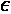)，它代表误差范围或无穷小近似误差。小的步长会导致像素强度变化不太明显，但它也会错误分类较少的示例。较大的步长会导致更多示例被错误分类，并且变化更明显：

```py
attack_fgsm = **FastGradientMethod**(base_classifier, eps=0.1) 
```

初始化后，下一步是`generate`对抗示例。唯一必需的属性是原始示例（`X_test_mdsample`）。请注意，FSGM 可以是针对特定目标的，因此在初始化中有一个可选的`targeted`属性，但你还需要在生成时提供相应的标签。这种攻击是非针对特定目标的，因为攻击者的意图是破坏模型：

```py
X_test_fgsm = attack_fgsm.**generate**(X_test_mdsample) 
```

与其他方法相比，使用 FSGM 生成对抗示例非常快，因此称之为“快速”！

现在，我们将一举两得。首先，使用`evaluate_multiclass_mdl`评估对抗示例（`X_test_fgsm`）对我们基础分类器模型（`base_classifier.model`）的模型。然后我们可以使用`compare_image_predictions`来绘制图像网格，对比随机选择的对抗示例（`X_test_fgsm`）与原始示例（`X_test_mdsample`）及其相应的预测标签（`y_test_fgsm_pred`，`y_test_mdsample`）和概率（`y_test_fgsm_prob`，`y_test_mdsample_prob`）。我们自定义标题并限制网格为四个示例（`num_samples`）。默认情况下，`compare_image_predictions`仅比较误分类，但可以通过将可选属性`use_misclass`设置为`False`来比较正确分类：

```py
y_test_fgsm_pred, y_test_fgsm_prob =\
    mldatasets.**evaluate_multiclass_mdl**(\
        base_classifier.model, X_test_fgsm, y_test_mdsample,\
        labels_l, ohe, plot_conf_matrix=False, plot_roc=False
    )
y_test_fgsm_prob = np.**max**(y_test_fgsm_prob, axis=1)
mldatasets.**compare_image_predictions**(
    X_test_fgsm, X_test_mdsample, y_test_fgsm_pred,\
    y_test_mdsample.flatten(), y_test_fgsm_prob,\
    y_test_mdsample_prob, title_mod_prefix="Attacked:",\
    title_difference_prefix="FSGM Attack Average Perturbation:",\
    num_samples=4
) 
```

之前的代码首先输出一个表格，显示模型在 FSGM 攻击示例上的准确率仅为 44%！尽管这不是针对特定目标的攻击，但它对正确遮挡的面部效果最为显著。所以假设，如果肇事者能够造成这种程度的信号扭曲或干扰，他们将严重削弱公司监控口罩合规性的能力。

代码还输出了*图 13.5*，该图显示了由 FSGM 攻击引起的一些误分类。攻击在图像中几乎均匀地分布了噪声。它还显示图像仅通过均方误差 0.092 进行了修改，由于像素值介于 0 和 1 之间，这意味着 9.2%。如果你要校准攻击以使其更难检测但仍然具有影响力，你必须注意，`eps`为 0.1 会导致 9.2%的平均绝对扰动，这会将准确性降低到 44%：

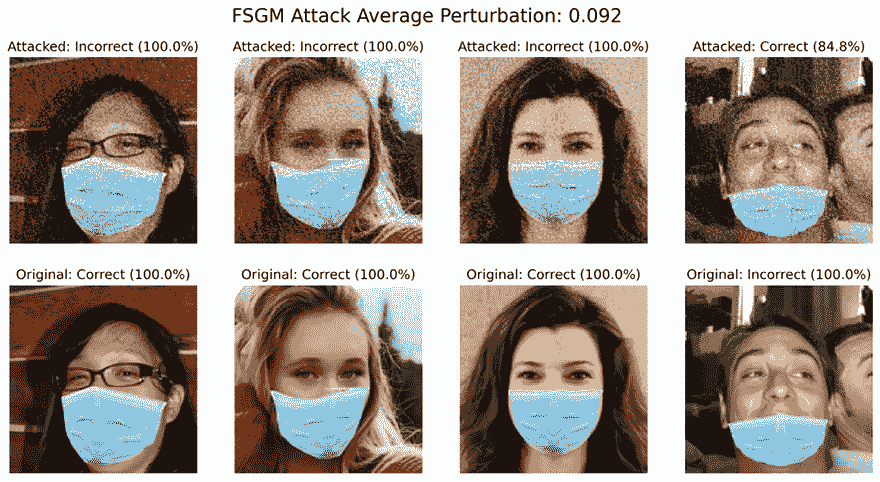

图 13.5：比较基础分类器 FSGM 攻击前后图像的图表

说到更难检测的攻击，我们现在将了解 Carlini 和 Wagner 攻击。

## Carlini 和 Wagner 无穷范攻击

在 2017 年，**Carlini 和 Wagner**（**C&W**）采用了三种基于范数的距离度量：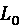，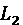，和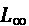，测量原始样本与对抗样本之间的差异。在其他论文中，这些度量已经被讨论过，包括 FSGM。C&W 引入的创新是如何利用这些度量，使用基于梯度下降的优化算法来近似损失函数的最小值。具体来说，为了避免陷入局部最小值，他们在梯度下降中使用多个起始点。为了使过程“生成一个有效的图像”，它评估了三种方法来约束优化问题。在这种情况下，我们想要找到一个对抗样本，该样本与原始图像之间的距离是最小的，同时仍然保持现实性。

所有的三种 C&W 攻击（，，和）都使用 Adam 优化器快速收敛。它们的主要区别是距离度量，其中可以说是最好的一个。它定义如下：

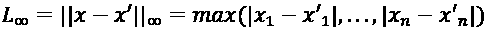

由于它是到任何坐标的最大距离，你确保对抗样本不仅在“平均”上最小化差异，而且在特征空间的任何地方都不会有太大差异。这就是使攻击更难以检测的原因！

使用 C&W 无穷范数攻击初始化和生成对抗样本与 FSGM 类似。要初始化`CarliniLInfMethod`，我们可以可选地定义一个`batch_size`（默认为`128`）。然后，为了`generate`一个非目标对抗攻击，与 FSGM 相同。在非目标攻击中只需要`X`，而在目标攻击中需要`y`：

```py
attack_cw = **CarliniLInfMethod**(
    base_classifier, batch_size=40
)
X_test_cw = attack_cw.**generate**(X_test_mdsample) 
```

我们现在将评估 C&W 对抗样本（`X_test_cw`），就像我们评估 FSGM 一样。代码完全相同，只是将`fsgm`替换为`cw`，并在`compare_image_predictions`中更改不同的标题。就像 FSGM 一样，以下代码将生成一个分类报告和图像网格（*图 13.6*）：

```py
y_test_cw_pred, y_test_cw_prob =\
    mldatasets.**evaluate_multiclass_mdl**(
        base_classifier.model, X_test_cw, y_test_mdsample, labels_l,\
        ohe, plot_conf_matrix=False, plot_roc=False
    )
y_test_cw_prob = np.**max**(y_test_cw_prob, axis=1)
mldatasets.**compare_image_predictions**(
    X_test_cw,\
    X_test_mdsample, y_test_cw_pred,\
    y_test_mdsample.flatten(), y_test_cw_prob,\
    y_test_mdsample_prob, title_mod_prefix="Attacked:",\
    title_difference_prefix="C&W Inf Attack Average Perturbation",\
    num_samples=4
) 
```

如前述代码输出，C&W 对抗样本在我们的基础模型中具有 92%的准确率。这种下降足以使模型对其预期用途变得无用。如果攻击者仅对摄像机的信号进行足够的干扰，他们就能达到相同的结果。而且，正如你从*图 13.6*中可以看出，与 FSGM 相比，0.3%的扰动非常小，但它足以将 8%的分类错误，包括网格中看起来明显的四个分类错误。

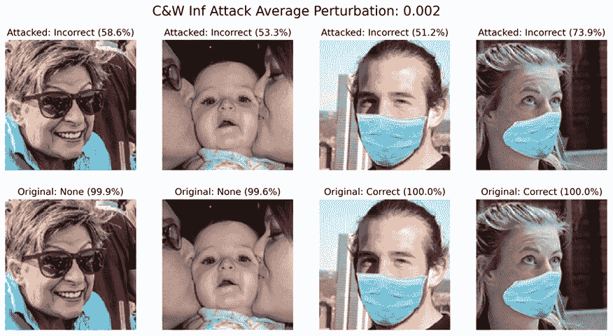

图 13.6：比较基础分类器中 C&W 无穷范数攻击与原始图像的绘图

有时候，攻击是否被检测到并不重要。重点是做出声明，这正是对抗补丁所能做到的。

## 目标对抗补丁攻击

**对抗性补丁**（**APs**）是一种鲁棒、通用且具有针对性的方法。你可以生成一个补丁，既可以叠加到图像上，也可以打印出来并物理放置在场景中以欺骗分类器忽略场景中的其他所有内容。它旨在在各种条件和变换下工作。与其他对抗性示例生成方法不同，没有意图隐藏攻击，因为本质上，你用补丁替换了场景中可检测的部分。该方法通过利用**期望变换**（**EOT**）的变体来工作，该变体在图像的不同位置对给定补丁的变换上进行图像训练。它所学习的是在训练示例中欺骗分类器最多的补丁。

这种方法比 FSGM 和 C&W 需要更多的参数和步骤。首先，我们将使用`AdversarialPatchNumpy`，这是可以与任何神经网络图像或视频分类器一起工作的变体。还有一个适用于 TensorFlow v2 的版本，但我们的基础分类器是`KerasClassifier`。第一个参数是分类器（`base_classifier`），我们将定义的其他参数是可选的，但强烈推荐。缩放范围`scale_min`和`scale_max`尤其重要，因为它们定义了补丁相对于图像的大小可以有多大——在这种情况下，我们想测试的最小值不小于 40%，最大值不大于 70%。除此之外，定义一个目标类别（`target`）也是有意义的。在这种情况下，我们希望补丁针对“正确”类别。对于`learning_rate`和最大迭代次数（`max_iter`），我们使用默认值，但请注意，这些可以调整以提高补丁对抗的有效性：

```py
attack_ap = **AdversarialPatchNumpy**(
    base_classifier, scale_min=0.4, scale_max=0.7,\
    learning_rate=5., max_iter=500,\
    batch_size=40, target=0
) 
```

我们不希望补丁生成算法在图像的每个地方都浪费时间测试补丁，因此我们可以通过使用布尔掩码来指导这种努力。这个掩码告诉它可以在哪里定位补丁。为了制作这个掩码，我们首先创建一个 128 × 128 的零数组。然后我们在像素 80–93 和 45–84 之间的矩形区域内放置 1，这大致对应于覆盖大多数图像中嘴巴的中心区域。最后，我们扩展数组的维度，使其变为`(1, W, H)`，并将其转换为布尔值。然后我们可以使用小尺寸测试数据集样本和掩码来继续`generate`补丁：

```py
placement_mask = np.**zeros**((128,128))
placement_mask[**80****:****93****,****45****:****83**] = 1
placement_mask = np.**expand_dims**(placement_mask, axis=0).astype(bool)
patch, patch_mask = attack_ap.**generate**(
    x=X_test_smsample,
    y=ohe.transform(y_test_smsample),
    mask=placement_mask
) 
```

我们现在可以使用以下代码片段绘制补丁：

```py
plt.**imshow**(patch * patch_mask) 
```

上述代码生成了*图 13.7*中的图像。正如预期的那样，它包含了掩码中发现的许多蓝色阴影。它还包含明亮的红色和黄色色调，这些色调在训练示例中大多缺失，这会混淆分类器：

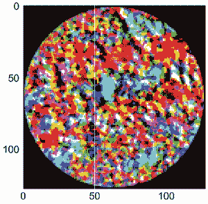

图 13.7：AP 生成的图像，误分类为正确掩码

与其他方法不同，`generate`没有生成对抗样本，而是一个单独的补丁，这是一个我们可以放置在图像上以创建对抗样本的图像。这个任务是通过`apply_patch`完成的，它接受原始示例`X_test_smsample`和一个比例；我们将使用 55%。还建议使用一个`mask`，以确保补丁被应用到更有意义的地方——在这种情况下，是嘴巴周围的区域：

```py
X_test_ap = attack_ap.**apply_patch**(
    X_test_smsample,
    scale=0.55,
    mask=placement_mask
) 
```

现在是时候评估我们的攻击并检查一些误分类了。我们将像以前一样做，并重用生成*图 13.5*和*图 13.7*的代码，只是我们将变量替换为`ap`和相应的标题：

```py
y_test_ap_pred, y_test_ap_prob =\
    mldatasets.evaluate_multiclass_mdl(
        base_classifier.model, X_test_ap, y_test_smsample,
        labels_l, ohe, plot_conf_matrix=False, plot_roc=False
    )
y_test_ap_prob = np.max(y_test_ap_prob, axis=1)
mldatasets.compare_image_predictions(
    X_test_ap, X_test_smsample, y_test_ap_pred,\
    y_test_smsample.flatten(), y_test_ap_prob,
    y_test_smsample_prob, title_mod_prefix="Attacked:",\
    title_difference_prefix="AP Attack Average Perturbation:", num_samples=4
) 
```

前面的代码给出了我们攻击的准确率结果为 65%，考虑到它训练的样本数量很少，这个结果相当不错。与其它方法相比，AP 需要更多的数据。一般来说，定向攻击需要更多的样本来理解如何最好地针对某一类。前面的代码还生成了*图 13.8*中的图像网格，展示了假设人们如果在前额前拿着一张硬纸板，他们可以轻易地欺骗模型：

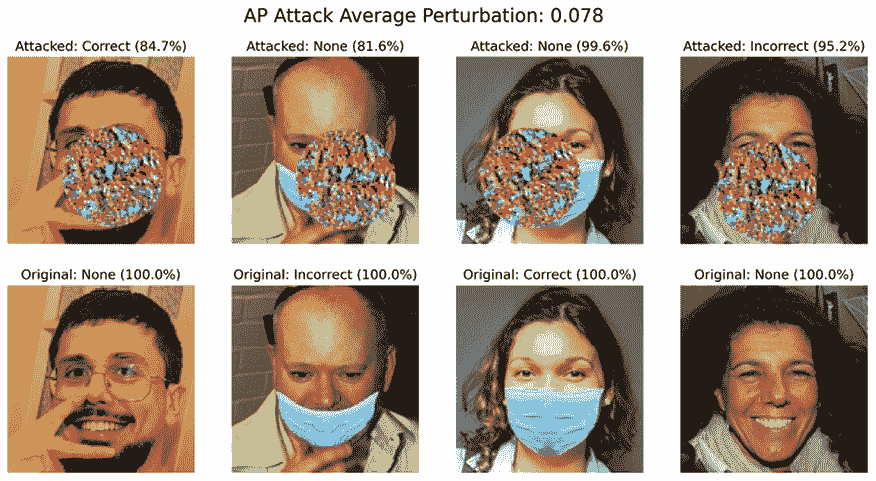

图 13.8：比较 AP 攻击与原始图像的基础分类器的图表

到目前为止，我们已经研究了三种攻击方法，但还没有解决如何防御这些攻击的问题。接下来，我们将探讨一些解决方案。

# 使用预处理防御定向攻击

有五种广泛的对抗防御类别：

+   **预处理**：改变模型的输入，使其更难以攻击。

+   **训练**：训练一个新的健壮模型，该模型旨在克服攻击。

+   **检测**：检测攻击。例如，你可以训练一个模型来检测对抗样本。

+   **Transformer**：修改模型架构和训练，使其更健壮——这可能包括蒸馏、输入过滤器、神经元剪枝和重新学习等技术。

+   **后处理**：改变模型输出以克服生产推理或模型提取攻击。

只有前四种防御可以与规避攻击一起工作，在本章中，我们只涵盖前两种：**预处理**和**对抗训练**。FGSM 和 C&W 可以用这两种方法中的任何一种来防御，但 AP 更难防御，可能需要更强的**检测**或**Transformer**方法。

在我们进行防御之前，我们必须先发起有针对性的攻击。我们将使用**投影梯度下降法**（**PGD**），这是一种非常强大的攻击方法，其输出与 FSGM 非常相似——也就是说，它会产生噪声图像。在这里我们不会详细解释 PGD，但重要的是要注意，就像 FSGM 一样，它被视为**一阶对抗者**，因为它利用了关于网络的一阶信息（由于梯度下降）。此外，实验证明，对 PGD 的鲁棒性确保了对任何一阶对抗者的鲁棒性。具体来说，PGD 是一种强大的攻击，因此它为结论性的基准提供了依据。

要对正确掩码的类别发起有针对性的攻击，最好只选择那些没有被正确掩码的示例（`x_test_notmasked`）、它们对应的标签（`y_test_notmasked`）和预测概率（`y_test_notmasked_prob`）。然后，我们想要创建一个包含我们想要生成对抗性示例的类别（`Correct`）的数组（`y_test_masked`）：

```py
**not_masked_idxs** = np.**where**(y_test_smsample != 'Correct')[0]
X_test_notmasked = X_test_smsample[**not_masked_idxs**]
y_test_notmasked = y_test_smsample[**not_masked_idxs**]
y_test_notmasked_prob = y_test_smsample_prob[**not_masked_idxs**]
y_test_masked = np.array(
    ['Correct'] * X_test_notmasked.shape[0]
).reshape(-1,1) 
```

我们将`ProjectedGradientDescent`初始化与 FSGM 相同，除了我们将设置最大扰动（`eps`）、攻击步长（`eps_step`）、最大迭代次数（`max_iter`）和`targeted=True`。正是因为它是针对性的，所以我们将同时设置`X`和`y`：

```py
attack_pgd = **ProjectedGradientDescent**(
    base_classifier, eps=0.3, eps_step=0.01,\
    max_iter=40, targeted=True
)
X_test_pgd = attack_pgd.**generate**(
    X_test_notmasked, y=ohe.transform(y_test_masked)
) 
```

现在，让我们像之前一样评估 PGD 攻击，但这次，让我们绘制混淆矩阵（`plot_conf_matrix=True`）：

```py
y_test_pgd_pred, y_test_pgd_prob =\
    mldatasets.**evaluate_multiclass_mdl**(
        base_classifier.model, X_test_pgd, y_test_notmasked,\
        labels_l, ohe, plot_conf_matrix=True, plot_roc=False
    )
y_test_pgd_prob = np.**max**(y_test_pgd_prob, axis=1) 
Figure 13.9. The PGD attack was so effective that it produced an accuracy of 0%, making all unmasked and incorrectly masked examples appear to be masked:
```

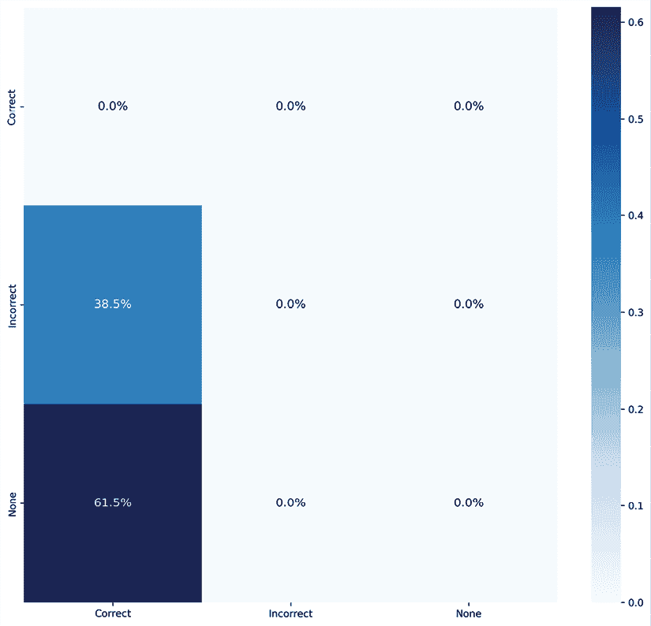

图 13.9：针对基础分类器评估的 PGD 攻击示例的混淆矩阵

接下来，让我们运行`compare_image_prediction`来查看一些随机误分类：

```py
mldatasets.**compare_image_predictions**(
    X_test_pgd, X_test_notmasked, y_test_pgd_pred,\
    y_test_notmasked.flatten(), y_test_pgd_prob,\
    y_test_smsample_prob, title_mod_prefix="Attacked:",\
    num_samples=4, title_difference_prefix="PGD Attack Average Perturbation:"
) 
```

上述代码在*图 13.10*中绘制了图像网格。平均绝对扰动是我们迄今为止看到的最高值，达到 14.7%，并且网格中所有未掩码的面部都被分类为正确掩码：

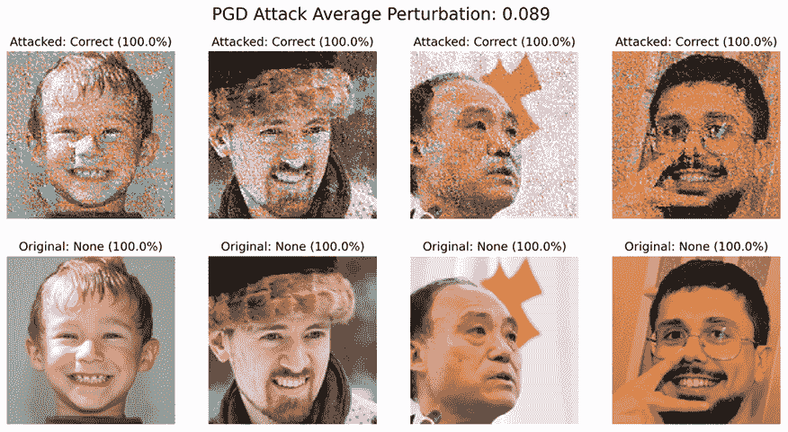

图 13.10：比较基础分类器的 PGD 攻击图像与原始图像的绘图

准确率不能变得更差，图像的颗粒度已经无法修复。那么我们如何对抗噪声呢？如果你还记得，我们之前已经处理过这个问题了。在*第七章*，*可视化卷积神经网络*中，**SmoothGrad**通过平均梯度改进了显著性图。这是一个不同的应用，但原理相同——就像人类一样，噪声显著性图比平滑的显著性图更难以解释，而颗粒图像比平滑图像对模型来说更难以解释。

**空间平滑**只是说模糊的一种花哨说法！然而，它作为对抗防御方法引入的新颖之处在于，所提出的实现（`SpatialSmoothing`）要求在滑动窗口中使用中位数而不是平均值。`window_size`是可配置的，建议在最有用的防御位置进行调整。一旦防御初始化，你就可以插入对抗示例（`X_test_pgd`）。它将输出空间平滑的对抗示例（`X_test_pgd_ss`）：

```py
defence_ss = **SpatialSmoothing**(window_size=11)
X_test_pgd_ss, _ = **defence_ss**(X_test_pgd) 
```

现在，我们可以将产生的模糊对抗示例评估如前所述——首先，使用`evaluate_multiclass_mdl`获取预测标签（`y_test_pgd_ss_pred`）和概率（`y_test_pgd_ss_prob`），以及一些预测性能指标输出。使用`compare_image_predictions`绘制图像网格，让我们使用`use_misclass=False`来正确分类图像——换句话说，就是成功防御的对抗示例：

```py
y_test_pgd_ss_pred, y_test_pgd_ss_prob =\
    mldatasets.**evaluate_multiclass_mdl**(
        base_classifier.model, X_test_pgd_ss,\
        y_test_notmasked, labels_l, ohe,\
        plot_conf_matrix=False, plot_roc=False
)
y_test_pgd_ss_prob = np.**max**(y_test_pgd_ss_prob, axis=1)
mldatasets.**compare_image_predictions**(
    X_test_pgd_ss, X_test_notmasked, y_test_pgd_ss_pred,\
    y_test_notmasked.flatten(), y_test_pgd_ss_prob,\
    y_test_notmasked_prob, use_misclass=False,\
    title_mod_prefix="Attacked+Defended:", num_samples=4,\
    title_difference_prefix="PGD Attack & Defended Average:"
) 
```

上述代码得到 54%的准确率，这比空间平滑防御之前的 0%要好得多。它还生成了*图 13.11*，展示了模糊如何有效地阻止 PGD 攻击。它甚至将平均绝对扰动减半！

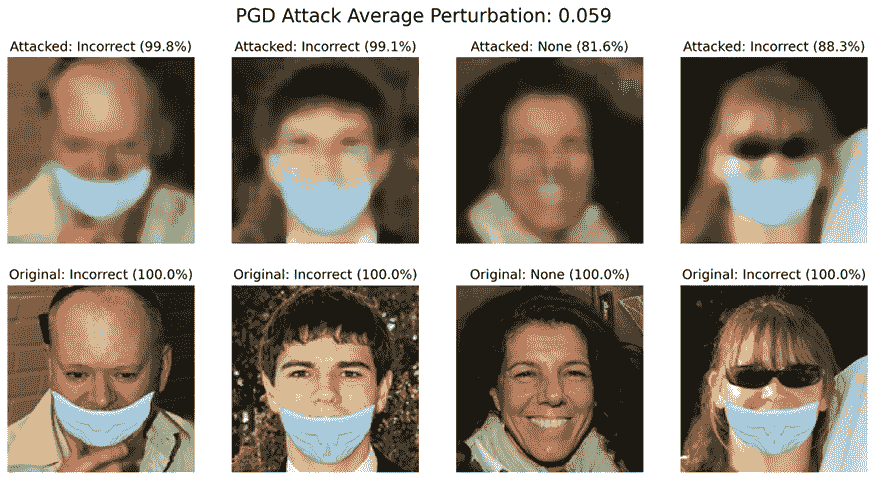

图 13.11：比较空间平滑 PGD 攻击图像与基础分类器原始图像的图表

接下来，我们将在我们的工具箱中尝试另一种防御方法：对抗训练！

# 通过对鲁棒分类器进行对抗训练来抵御任何逃避攻击

在*第七章*，*可视化卷积神经网络*中，我们确定了一个垃圾图像分类器，它很可能在市政回收厂预期的环境中表现不佳。在样本外数据上的糟糕表现是由于分类器是在大量公开可用的图像上训练的，这些图像与预期的条件不匹配，或者与回收厂处理的材料的特征不匹配。章节的结论呼吁使用代表其预期环境的图像来训练网络，以创建一个更鲁棒的模型。

为了模型的鲁棒性，训练数据的多样性至关重要，但前提是它能够代表预期的环境。在统计学的术语中，这是一个关于使用样本进行训练的问题，这些样本能够准确描述总体，从而使模型学会正确地分类它们。对于对抗鲁棒性，同样的原则适用。如果你增强数据以包括可能的对抗攻击示例，模型将学会对它们进行分类。这就是对抗训练的本质。

对抗鲁棒性领域的机器学习研究人员建议这种防御形式对任何类型的规避攻击都非常有效，本质上可以保护它。但话虽如此，它并非坚不可摧。其有效性取决于在训练中使用正确类型的对抗样本、最优的超参数等等。研究人员概述了一些指导方针，例如增加隐藏层中的神经元数量，并使用 PGD 或 BIM 生成训练对抗样本。**BIM**代表**基本迭代方法**。它类似于 FSGM，但速度不快，因为它通过迭代来逼近原始图像在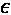-邻域内的最佳对抗样本。`eps`属性限制了这一邻域。

训练一个鲁棒模型可能非常耗费资源。虽然我们也可以下载一个已经训练好的，但这很重要，要理解如何使用 ART 来完成这一过程。我们将解释这些步骤，以便有选择地使用 ART 完成模型训练。否则，只需跳过这些步骤并下载训练好的模型。`robust_model`与`base_model`非常相似，除了我们在四个卷积(`Conv2D`)层中使用等大小的过滤器。我们这样做是为了降低复杂性，以抵消我们通过将第一隐藏(`Dense`)层中的神经元数量翻倍所增加的复杂性，正如机器学习研究人员所建议的：

```py
robust_model = tf.keras.models.**Sequential**([
    tf.keras.layers.**InputLayer**(input_shape=X_train.shape[1:]),
    tf.keras.layers.**Conv2D**(32, kernel_size=(3, 3), activation='relu'),
    tf.keras.layers.**MaxPooling2D**(pool_size=(2, 2)),
    tf.keras.layers.**Conv2D**(32, kernel_size=(3, 3), activation='relu'),
    tf.keras.layers.**MaxPooling2D**(pool_size=(2, 2)),
    tf.keras.layers.**Conv2D**(32, kernel_size=(3, 3), activation='relu'),
    tf.keras.layers.**MaxPooling2D**(pool_size=(2, 2)),
    tf.keras.layers.**Conv2D**(32, kernel_size=(3, 3), activation='relu'),
    tf.keras.layers.**MaxPooling2D**(pool_size=(2, 2)),
    tf.keras.layers.**Flatten**(),
    tf.keras.layers.**Dense**(3072, activation='relu'),
    tf.keras.layers.**Dropout**(0.2),
    tf.keras.layers.**Dense**(3, activation='softmax')
], name='CNN_Robust_MaskedFaceNet_Model')
robust_model.**compile**(
    optimizer=tf.keras.optimizers.Adam(lr=0.001),
    loss='categorical_crossentropy',
    metrics=['accuracy'])
robust_model.**summary**() 
```

前面代码中的`summary()`输出了以下内容。你可以看到可训练参数总数约为 360 万，与基础模型相似：

```py
Model: "CNN_Robust_MaskedFaceNet_Model"
_________________________________________________________________
Layer (type)                 Output Shape              Param #   
=================================================================
conv2d_1 (Conv2D)            (None, 126, 126, 32)      896       
_________________________________________________________________
maxpool2d_1 (MaxPooling2D)   (None, 63, 63, 32)        0         
_________________________________________________________________
conv2d_2 (Conv2D)            (None, 61, 61, 32)        9248      
_________________________________________________________________
maxpool2d_2 (MaxPooling2D)   (None, 30, 30, 32)        0         
_________________________________________________________________
conv2d_3 (Conv2D)            (None, 28, 28, 32)        9248      
_________________________________________________________________
maxpool2d_3 (MaxPooling2D)   (None, 14, 14, 32)        0         
_________________________________________________________________
conv2d_4 (Conv2D)            (None, 12, 12, 32)        9248      
_________________________________________________________________
maxpool2d_4 (MaxPooling2D)   (None, 6, 6, 32)          0         
_________________________________________________________________
flatten (Flatten)            (None, 1152)              0         
_________________________________________________________________
dense_1 (Dense)              (None, 3072)              3542016   
_________________________________________________________________
dropout (Dropout)            (None, 3072)              0         
_________________________________________________________________
dense_2 (Dense)              (None, 3)                 9219      
=================================================================
Total params: 3,579,875
Trainable params: 3,579,875
Non-trainable params: 0
_________________________________________________________________ 
```

接下来，我们可以通过首先使用`robust_model`初始化一个新的`KerasClassifier`来对抗性地训练模型。然后，我们初始化这个分类器上的`BasicIterativeMethod`攻击。最后，我们使用`robust_classifier`和 BIM 攻击初始化`AdversarialTrainer`并对其进行`fit`。请注意，我们将 BIM 攻击保存到了一个名为`attacks`的变量中，因为这个变量可能是一系列 ART 攻击而不是单一的一个。另外，请注意`AdversarialTrainer`有一个名为`ratio`的属性。这个属性决定了训练样本中有多少是对抗样本。这个百分比会极大地影响对抗攻击的有效性。如果它太低，可能无法很好地处理对抗样本，如果太高，可能在与非对抗样本的交互中效果较差。如果我们运行`trainer`，它可能需要很多小时才能完成，所以请不要感到惊讶：

```py
robust_classifier = **KerasClassifier**(
    model=robust_model, clip_values=(min_, max_)
)
attacks = **BasicIterativeMethod**(
    robust_classifier, eps=0.3, eps_step=0.01, max_iter=20
)
trainer = **AdversarialTrainer**(
    robust_classifier, attacks, ratio=0.5
)
trainer.fit(
    X_train, ohe.transform(y_train), nb_epochs=30, batch_size=128
) 
```

如果你没有训练`robust_classifier`，你可以下载一个预训练的`robust_model`，并像这样用它来初始化`robust_classifier`：

```py
model_path = **get_file**(
    'CNN_Robust_MaskedFace_Net.hdf5',
    'https://github.com/PacktPublishing/Interpretable-Machine- \
    Learning-with-Python/blob/master/models/ \
    CNN_Robust_MaskedFace_Net.hdf5?raw=true'
)
robust_model = tf.keras.models.**load_model**(model_path)
robust_classifier = **KerasClassifier**(
    model=robust_model, clip_values=(min_, max_)
) 
```

现在，让我们使用`evaluate_multiclass_mdl`来评估`robust_classifier`对原始测试数据集的性能。我们将`plot_conf_matrix`设置为`True`以查看混淆矩阵：

```py
y_test_robust_pred, y_test_robust_prob =\
mldatasets.**evaluate_multiclass_mdl**(
    robust_classifier.model, X_test, y_test, labels_l, ohe,\
    plot_conf_matrix=True, predopts={"verbose":1}
) 
```

上述代码输出了*图 13.12*中的混淆矩阵和性能指标。它的准确率比基础分类器低 1.8%。大多数错误分类都是将正确遮挡的面部错误地分类为错误遮挡。在选择 50%的对抗示例比例时，肯定存在权衡，或者我们可以调整超参数或模型架构来改进这一点：

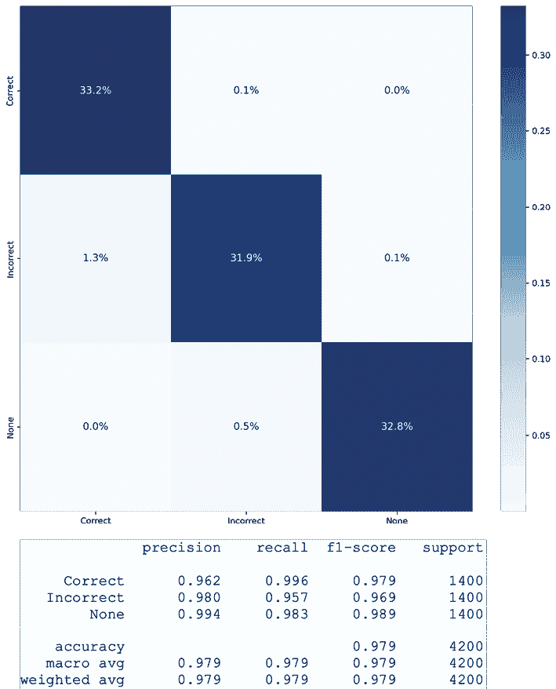

图 13.12：鲁棒分类器的混淆度指标和性能指标

让我们看看鲁棒模型在对抗攻击中的表现。我们再次使用`FastGradientMethod`，但这次，将`base_classifier`替换为`robust_classifier`：

```py
attack_fgsm_robust = **FastGradientMethod**(
    robust_classifier, eps=0.1
)
X_test_fgsm_robust = attack_fgsm_robust.**generate**(X_test_mdsample) 
```

接下来，我们可以使用`evaluate_multiclass_mdl`和`compare_image_predictions`来衡量和观察我们攻击的有效性，但这次针对的是`robust_classifier`：

```py
y_test_fgsm_robust_pred, y_test_fgsm_robust_prob =\
    mldatasets.**evaluate_multiclass_mdl**(
        robust_classifier.model, X_test_fgsm_robust,\
        y_test_mdsample, labels_l, ohe,\
        plot_conf_matrix=False, plot_roc=False
    )
y_test_fgsm_robust_prob = np.**max**(
    y_test_fgsm_robust_prob, axis=1
)
mldatasets.**compare_image_predictions**(
    X_test_fgsm_robust, X_test_mdsample,
    y_test_fgsm_robust_pred, num_samples=4,\
    y_test_mdsample.flatten(), y_test_fgsm_robust_prob,\
    y_test_mdsample_prob, title_mod_prefix="Attacked:",\
    title_difference_prefix="FSGM Attack Average Perturbation:"
) 
base_classifier, it yielded a 44% accuracy. That was quite an improvement! The preceding code also produces the image grid in *Figure 13.13*. You can tell how the FSGM attack against the robust model makes less grainy and more patchy images. On average, they are less perturbed than they were against the base model because so few of them were successful, but those that were significantly degraded. It appears as if the FSGM reduced their color depth from millions of possible colors (24+ bits) to 256 (8-bit) or 16 (4-bit) colors. Of course, an evasion attack can’t actually do that, but what happened was that the FSGM algorithm converged at the same shades of blue, brown, red, and orange that could fool the classifier! Other shades remain unaltered: 
```

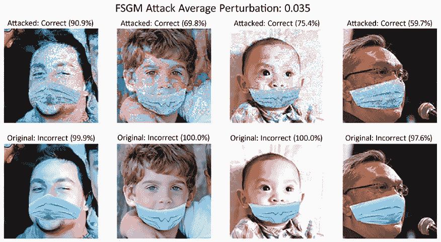

图 13.13：比较鲁棒分类器被 FSGM 攻击与原始图像的图表

到目前为止，我们只评估了模型的鲁棒性，但只针对一种攻击强度，没有考虑可能的防御措施，因此评估了其鲁棒性。在下一节中，我们将研究一种实现这一目标的方法。

# 评估对抗鲁棒性

在任何工程实践中测试你的系统以了解它们对攻击或意外故障的脆弱性是必要的。然而，安全是一个你必须对你的解决方案进行压力测试的领域，以确定需要多少级别的攻击才能使你的系统崩溃超过可接受的阈值。此外，弄清楚需要多少级别的防御来遏制攻击也是非常有用的信息。

## 比较模型鲁棒性与攻击强度

现在我们有两个分类器可以与同等强度的攻击进行比较，我们尝试不同的攻击强度，看看它们在所有这些攻击中的表现如何。我们将使用 FSGM，因为它速度快，但你可以使用任何方法！

我们可以评估的第一个攻击强度是没有攻击强度。换句话说，没有攻击的情况下，对测试数据集的分类准确率是多少？我们已经有存储了基础模型（`y_test_pred`）和鲁棒模型（`y_test_robust_pred`）的预测标签，所以这可以通过 scikit-learn 的`accuracy_score`指标轻松获得：

```py
accuracy_base_0 = metrics.accuracy_score(
    y_test, y_test_pred
)
accuracy_robust_0 = metrics.accuracy_score(
    y_test, y_test_robust_pred
) 
```

现在，我们可以在 0.01 和 0.9 之间迭代一系列攻击强度（`eps_range`）。使用`linspace`，我们可以生成 0.01 和 0.09 之间的 9 个值和 0.1 和 0.9 之间的 9 个值，并将它们`concatenate`成一个单一的数组。我们将通过`for`循环测试这 18 个`eps`值的所有攻击，攻击每个模型，并使用`evaluate`检索攻击后的准确度。相应的准确度被附加到两个列表（`accuracy_base`，`accuracy_robust`）中。在`for`循环之后，我们将 0 添加到`eps_range`中，以考虑任何攻击之前的准确度：

```py
eps_range = np.**concatenate**(
    (np.linspace(0.01, 0.09, 9), np.linspace(0.1, 0.9, 9)), axis=0
).tolist()
accuracy_base = [accuracy_base_0]
accuracy_robust = [accuracy_robust_0]
for **eps** in tqdm(eps_range, desc='EPS'):
    attack_fgsm.set_params(**{'eps': **eps**})
    X_test_fgsm_base_i =attack_fgsm.**generate**(X_test_mdsample)
    _, accuracy_base_i =\
    base_classifier.model.**evaluate**(
        X_test_fgsm_base_i, ohe.transform(y_test_mdsample)
    )
    attack_fgsm_robust.set_params(**{'eps': **eps**})
    X_test_fgsm_robust_i=attack_fgsm_robust.**generate**(
        X_test_mdsample
    )
    _, accuracy_robust_i =\
        robust_classifier.model.**evaluate**(
            X_test_fgsm_robust_i, ohe.transform(y_test_mdsample)
            )
    accuracy_base.append(accuracy_base_i)
    accuracy_robust.append(accuracy_robust_i) 
eps_range = [0] + eps_range 
```

现在，我们可以使用以下代码绘制两个分类器在所有攻击强度下的准确度图：

```py
fig, ax = plt.subplots(figsize=(14,7))
ax.plot(
    np.array(eps_range), np.array(accuracy_base),\
    'b–', label='Base classifier'
)
ax.plot(
    np.array(eps_range), np.array(accuracy_robust),\
    'r–', label='Robust classifier'
)
legend = ax.legend(loc='upper center')
plt.xlabel('Attack strength (eps)')
plt.ylabel('Accuracy') 
```

之前的代码生成了**图 13.14**，该图展示了鲁棒模型在攻击强度为 0.02 和 0.3 之间表现更好，但之后则始终比基准模型差大约 10%：

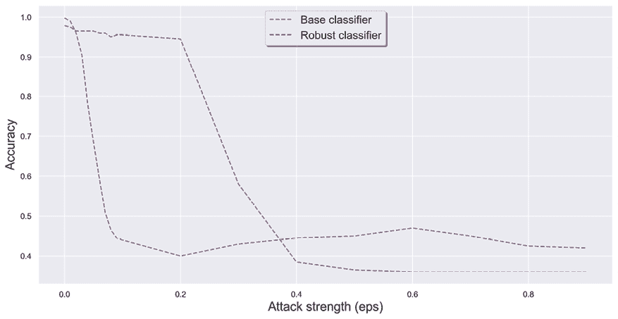

图 13.14：在多种 FSGM 攻击强度下对鲁棒和基准分类器的准确度进行测量

**图 13.14**未能考虑的是防御措施。例如，如果医院摄像头持续受到干扰或篡改，安全公司不保护他们的模型将是失职的。对于这种攻击，最简单的方法是使用某种平滑技术。

对抗性训练也产生了一个经验上鲁棒的分类器，你不能保证它在某些预定义的情况下会工作，这就是为什么需要可验证的防御措施。

# 任务完成

任务是执行他们面部口罩模型的一些对抗性鲁棒性测试，以确定医院访客和员工是否可以规避强制佩戴口罩的规定。基准模型在许多规避攻击中表现非常糟糕，从最激进的到最微妙的。

你还研究了这些攻击的可能防御措施，例如空间平滑和对抗性重新训练。然后，你探索了评估你提出的防御措施鲁棒性的方法。你现在可以提供一个端到端框架来防御这种攻击。话虽如此，你所做的一切只是一个概念验证。

现在，你可以提出训练一个可验证的鲁棒模型来对抗医院预期遇到的最常见的攻击。但首先，你需要一个一般鲁棒模型的成分。为此，你需要使用原始数据集中的所有 210,000 张图片，对它们进行许多关于遮罩颜色和类型的变体，并使用合理的亮度、剪切和旋转变换进一步增强。最后，鲁棒模型需要用几种攻击进行训练，包括几种 AP 攻击。这些攻击很重要，因为它们模仿了最常见的合规规避行为，即用身体部位或衣物物品隐藏面部。

# 摘要

阅读本章后，您应该了解如何对机器学习模型进行攻击，特别是逃避攻击。您应该知道如何执行 FSGM、BIM、PGD、C&W 和 AP 攻击，以及如何通过空间平滑和对抗性训练来防御它们。最后但同样重要的是，您应该了解如何评估对抗性鲁棒性。

下一章是最后一章，它概述了关于机器学习解释未来发展的想法。

# 数据集来源

+   Adnane Cabani，Karim Hammoudi，Halim Benhabiles 和 Mahmoud Melkemi，2020，*MaskedFace-Net - 在 COVID-19 背景下正确/错误佩戴口罩的人脸图像数据集*，Smart Health，ISSN 2352–6483，Elsevier：[`doi.org/10.1016/j.smhl.2020.100144`](https://doi.org/10.1016/j.smhl.2020.100144)（由 NVIDIA 公司提供的 Creative Commons BY-NC-SA 4.0 许可证）

+   Karras, T.，Laine, S.，和 Aila, T.，2019，*用于生成对抗网络的基于风格的生成器架构*。2019 IEEE/CVF 计算机视觉与模式识别会议（CVPR），4396–4405：[`arxiv.org/abs/1812.04948`](https://arxiv.org/abs/1812.04948)（由 NVIDIA 公司提供的 Creative Commons BY-NC-SA 4.0 许可证）

# 进一步阅读

+   Polyakov, A.，2019 年 8 月 6 日，*如何攻击机器学习（逃避、投毒、推理、木马、后门）* [博客文章]：[`towardsdatascience.com/how-to-attack-machine-learning-evasion-poisoning-inference-trojans-backdoors-a7cb5832595c`](https://towardsdatascience.com/how-to-attack-machine-learning-evasion-poisoning-inference-trojans-backdoors-a7cb5832595c)

+   Carlini, N.，& Wagner, D.，2017，*迈向评估神经网络的鲁棒性*。2017 IEEE 安全与隐私研讨会（SP），39–57: [`arxiv.org/abs/1608.04644`](https://arxiv.org/abs/1608.04644)

+   Brown, T.，Mané, D.，Roy, A.，Abadi, M.，和 Gilmer, J.，2017，*对抗性补丁*。ArXiv：[`arxiv.org/abs/1712.09665`](https://arxiv.org/abs/1712.09665)

# 在 Discord 上了解更多

要加入这本书的 Discord 社区——在那里您可以分享反馈、向作者提问，并了解新书发布——请扫描下面的二维码：

`packt.link/inml`


