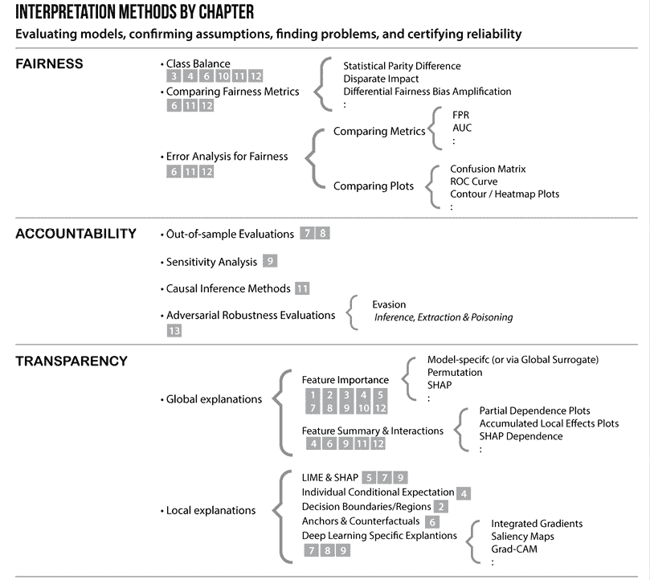
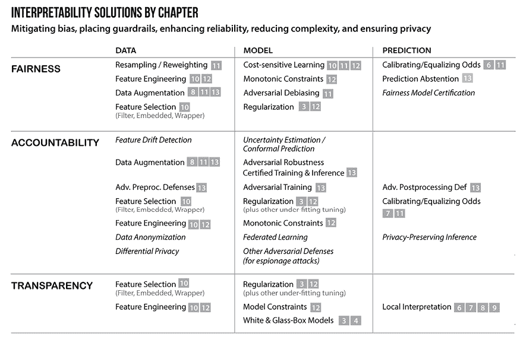
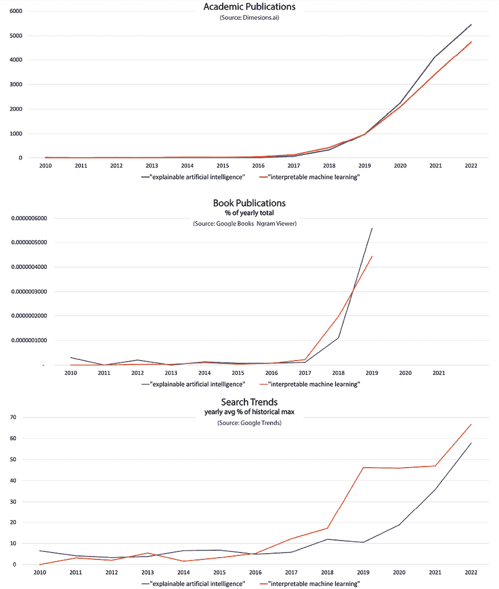

# 14

# 机器学习可解释性的未来是什么？

在过去的十三章中，我们探讨了机器学习（ML）可解释性的领域。正如前言所述，这是一个广泛的研究领域，其中大部分甚至还没有离开实验室，尚未得到广泛应用，本书无意涵盖所有内容。相反，目标是深入介绍各种可解释性工具，以便作为初学者的起点，甚至补充更高级读者的知识。本章将总结我们在机器学习可解释性方法生态系统中的所学，并推测接下来会发生什么！

这些是我们将在本章中讨论的主要主题：

+   理解机器学习可解释性的当前格局

+   对机器学习可解释性未来的推测

# 理解机器学习可解释性的当前格局

首先，我们将提供一些关于本书如何与机器学习可解释性的主要目标相关联以及从业者如何开始应用这些方法来实现这些广泛目标的背景信息。然后，我们将讨论研究中的当前增长领域。

## 将一切联系在一起！

如*第一章*中所述，*解释、可解释性和可解释性；以及为什么这一切都很重要？*，在讨论机器学习可解释性时，有三个主要主题：**公平性、责任和透明度**（FAT），每个主题都提出了一系列关注点（见*图 14.1*）。我想我们都可以同意，这些都是模型所期望的特性！确实，这些关注点都为人工智能（AI）系统的改进提供了机会。这些改进首先通过利用模型解释方法来评估模型、确认或反驳假设以及发现问题开始。

你的目标将取决于你在机器学习（ML）工作流程中的哪个阶段。如果模型已经投入生产，目标可能是用一系列指标来评估它，但如果模型仍处于早期开发阶段，目标可能是找到指标无法发现的更深层问题。也许你也在像我们在*第四章*中做的那样，仅仅使用黑盒模型进行知识发现——换句话说，利用模型从数据中学习，但没有计划将其投入生产。如果是这种情况，你可能会确认或反驳你对数据的假设，以及由此产生的模型：

图 14.1：机器学习解释方法

无论如何，这些目标都不是相互排斥的，你很可能始终在寻找问题并反驳假设，即使模型看起来表现良好！

并且无论目标是什么，主要关注点是什么，都建议您使用许多解释方法，这不仅是因为没有哪种技术是完美的，而且还因为所有问题和目标都是相互关联的。换句话说，没有一致性就没有正义，没有透明性就没有可靠性。

实际上，你可以从下到上阅读*图 14.1*，就像它是一座金字塔一样，因为透明性是基础，其次是第二层的问责制，最终，公平性是顶部的樱桃。

因此，即使目标是评估模型公平性，模型也应进行压力测试以确保其鲁棒性。应理解大多数相关特征重要性和交互作用。否则，如果预测不鲁棒且不透明，那就无关紧要了。

*图 14.1*中涵盖了多种解释方法，这些方法绝不是所有可用的解释方法。它们代表了背后有良好维护的开源库的最受欢迎的方法。在本书中，我们简要地提到了它们中的大多数，尽管其中一些只是简要提及。未讨论的用斜体表示，而讨论过的旁边提供了相关的章节编号。本书重点介绍了**模型无关**的**黑盒监督学习模型**方法。然而，在这个领域之外，还有许多其他解释方法，例如强化学习、生成模型或仅用于线性回归的许多统计方法。即使在监督学习黑盒模型领域内，也有数百种针对特定应用的应用特定模型解释方法，这些应用范围从化学图 CNN 到客户流失分类器。

话虽如此，本书中讨论的许多方法可以定制用于各种应用。集成梯度可用于解释音频分类器和天气预报模型。敏感性分析可用于金融建模和传染病风险模型。因果推断方法可以用来改善用户体验和药物试验。

*改进*是这里的关键词，因为解释方法有另一面！

在本书中，这一面被称为*为解释性调整*，这意味着为 FAT 问题创造解决方案。这些解决方案可以在*图 14.2*中欣赏到：

图 14.2：处理 FAT 问题的工具集

我观察到五种解释性解决方案的方法：

+   **缓解偏差**：任何为考虑偏差而采取的纠正措施。请注意，这里的偏差指的是数据中的采样、排除、偏见和测量偏差，以及任何引入到机器学习工作流程中的其他偏差。

+   **设置护栏**：任何确保模型受到约束，使其不与领域知识相矛盾且不自信地预测的解决方案。

+   **增强可靠性**：任何增加预测信心和一致性的修复，不包括通过减少复杂性来实现的修复。

+   **减少复杂性**：任何引入稀疏性的方法。作为一种副作用，这通常通过更好地泛化来增强可靠性。

+   **确保隐私**：任何努力确保第三方无法获取私有数据和模型架构。我们在这本书中没有涵盖这种方法。

这些方法还可以应用于以下三个领域：

+   **数据（“预处理”**）：通过修改训练数据

+   **模型（“处理中”**）：通过修改模型、其参数或训练过程

+   **预测（“后处理”**）：通过干预模型的推理

有一个第四个领域可能会影响其他三个领域——即数据和算法治理。这包括规定某些方法或框架的法规和标准。这是一个缺失的列，因为很少有行业和司法管辖区有法律规定应该应用哪些方法和方法来遵守 FAT。例如，治理可以强制执行解释算法决策、数据来源或鲁棒性认证阈值的标准。我们将在下一节中进一步讨论这一点。

你可以从*图 14.2*中看出，许多方法在 FAT 上重复使用。**特征选择和工程、单调约束**和**正则化**对三者都有益，但并不总是通过相同的方法来实现。**数据增强**也可以提高公平性和问责制的可靠性。与*图 14.1*一样，斜体中的内容在书中没有涉及，其中三个主题脱颖而出：**不确定性估计**、**对抗鲁棒性**和**隐私保护**是迷人的主题，值得有自己的一本书。

## 当前趋势

AI 采用的最重要的障碍之一是缺乏可解释性，这也是 50-90%的 AI 项目从未起飞的部分原因（关于这一点，请参阅*进一步阅读*部分的相关文章），另一个原因是由于不遵守 FAT 而产生的道德违规行为。在这方面，**可解释机器学习**（**iML**）有力量引领整个 ML，因为它可以帮助实现这两个目标，如图 14.1 和图 14.2 中的相应方法。

幸运的是，我们正在见证对 iML 的兴趣和生产力的增加，这主要是在**可解释人工智能**（**XAI**）的背景下——参见*图 14.3*。在科学界，iML 仍然是最受欢迎的术语，但在公共场合 XAI 占主导地位：

图 14.3：iML 和 XAI 的出版和搜索趋势

这意味着，正如机器学习开始标准化、监管、整合到众多其他学科一样，解释性也将很快获得一席之地。

机器学习（ML）正在取代所有行业的软件。随着越来越多的自动化，更多的模型被部署到云端，而**人工智能物联网**（**AIoT**）的出现将使情况变得更糟。部署并不是传统上属于机器学习实践者的领域。这就是为什么机器学习越来越多地依赖于**机器学习运维**（**MLOps**）。自动化速度的加快意味着需要更多的工具来构建、测试、部署和监控这些模型。同时，还需要对工具、方法和指标进行标准化。虽然这个过程缓慢但确实在发生。自 2017 年以来，我们已经有了**开放神经网络交换**（**ONNX**），这是一个用于互操作性的开放标准。在撰写本文时，**国际标准化组织**（**ISO**）正在编写超过二十项 AI 标准（其中一项已发布），其中一些涉及可解释性。自然地，由于机器学习模型类别、方法、库、服务提供商和实践的整合，一些事物将因常用而标准化。随着时间的推移，每个领域都将出现一或几个。最后，鉴于机器学习在算法决策中的重要作用，它被监管只是时间问题。只有一些金融市场监管交易算法，例如美国的**证券交易委员会**（**SEC**）和英国的**金融服务管理局**（**FCA**）。除此之外，只有数据隐私和来源法规得到广泛执行，例如美国的 HIPAA 和巴西的 LGPD。欧盟的**通用数据保护条例**（**GDPR**）在算法决策的“解释权”方面更进一步，但预期的范围和方法仍然不明确。

**可解释人工智能（XAI）与机器学习（IML）——哪一个该使用？**

我的看法：尽管在行业中它们被视为同义词，且*iML*被视为更学术性的术语，但机器学习实践者，即使在工业界，也应该对使用*iML*这个术语持谨慎态度。词语可能具有过大的暗示力。*可解释性*意味着完全理解，但*可解释性*留有出错的空间，这在讨论模型时总是应该如此，尤其是对于极其复杂的黑盒模型。此外，人工智能被公众想象为万能的灵丹妙药，或者被诋毁为危险的。无论哪种情况，与*iML*这个术语一样，它都使得那些认为它是万能灵丹妙药的人更加自大，也许可以平息那些认为它是危险的人的担忧。XAI 这个术语可能作为一个营销术语在发挥作用。然而，对于构建模型的人来说，*可解释性*这个词语的暗示力可能会让我们对自己的解释过于自信。话虽如此，这仅仅是一个观点。

机器学习可解释性正在快速发展，但落后于机器学习。一些解释工具已经集成到云生态系统中，从 SageMaker 到 DataRobot。它们尚未完全自动化、标准化、整合和监管，但毫无疑问，这将会发生。

# 对机器学习可解释性的未来进行推测

我习惯了听到这个时期被比喻为“人工智能的蛮荒西部”，或者更糟糕的是，“人工智能淘金热”！这让人联想到一个未开发、未驯服的领土被急切地征服，或者更糟糕的是，被文明化。然而，在 19 世纪，美国的西部地区与其他地区的地球上的其他地区并没有太大的不同，并且已经被美洲原住民居住了数千年，所以这个比喻并不完全适用。用我们能够通过机器学习实现的准确性和信心来预测，会让我们的祖先感到惊恐，并且对我们人类来说，这并不是一个“自然”的位置。这更像是飞行而不是探索未知土地。

文章《迈向机器学习的喷气时代》（在本章末尾的“进一步阅读”部分链接）提出了一个更适合的比喻，即人工智能就像航空业的黎明。它是新的、令人兴奋的，人们仍然对我们从下面能做什么感到惊奇（见图 14.4）！

然而，航空业还有待发挥其潜力。在 barnstorming 时代几十年后，航空业成熟为安全、可靠和高效的商业航空喷气时代。在航空业的情况下，承诺是它可以在不到一天的时间内可靠地将货物和人员运送到地球另一半。在人工智能的情况下，承诺是它可以做出公平、负责任和透明的决策——也许不是针对任何决策，但至少是它被设计去做的决策，除非它是**通用人工智能**（**AGI**）的例子：

图 14.4：20 世纪 20 年代的 barnstorming（美国国会图书馆的印刷与照片部）

那么，我们如何才能达到那里？以下是我预期在追求达到机器学习喷气时代的过程中可能会发生的一些想法。

## 机器学习的新愿景

由于我们打算在人工智能方面走得更远，比以往任何时候都要远，明天的机器学习从业者必须更加意识到天空的危险。在这里，我指的是预测和规范性分析的新前沿。风险众多，涉及各种偏见和假设，已知和潜在的数据问题，以及我们模型的数学属性和局限性。很容易被机器学习模型欺骗，认为它们是软件。然而，在这个类比中，软件在本质上是完全确定性的——它牢牢地扎根于地面，而不是在天空中悬浮！

为了使民用航空变得安全，需要一种新的思维方式——一种新的文化。二战时期的战斗机飞行员，尽管他们能力出众，但也必须重新训练以在民用航空中工作。这不是同一个任务，因为当你知道你正在携带乘客，并且风险很高时，一切都会改变。

伦理 AI，以及由此产生的 iML，最终需要这种认识，即模型直接或间接地携带乘客“在船上”，并且模型并不像看起来那样稳健。一个稳健的模型必须能够可靠地经受住几乎任何条件，一次又一次地，就像今天的飞机一样。为此，我们需要使用更多的工具，这些工具以解释方法的形式出现。

## 多学科方法

对于符合 FAT 原则的模型，需要与许多学科更紧密地集成。这意味着 AI 伦理学家、律师、社会学家、心理学家、以人为本的设计师以及无数其他职业的更大参与。他们将与 AI 技术专家和软件工程师一起，将最佳实践编码到标准和法规中。

## 足够的标准化

不仅需要新的标准来规范代码、指标和方法，还需要规范语言。数据背后的语言主要来自统计学、数学、计算机科学和计量经济学，这导致了很多混淆。

## 执行监管

很可能需要所有生产模型满足以下规范：

+   能够通过认证证明其稳健和公平

+   能够使用 TRACE 命令解释其预测背后的推理，在某些情况下，还必须与预测一起提供推理

+   可以拒绝他们不确定的预测

+   为所有预测提供置信水平（参见“进一步阅读”部分的**一致性预测**教程和书籍）

+   拥有训练数据的元数据（即使匿名）和作者身份，以及必要时，符合监管要求的证书和与公共账本（可能是区块链）相关的元数据

+   拥有类似于网站的证书，以确保一定程度的信任

+   过期后停止工作，直到用新数据进行重新训练

+   当它们在模型诊断失败时自动离线，并且只有通过诊断后才能再次上线

+   拥有**持续训练/持续集成**（**CT/CI**）管道，帮助定期重新训练模型并执行模型诊断，以避免任何模型停机时间

+   当它们在灾难性失败并造成公共损害时，由认证的 AI 审计师进行诊断

新法规可能会催生新的职业，例如 AI 审计师和模型诊断工程师。但它们也将支持 MLOps 工程师和 ML 自动化工具。

## 具有内置解释的无缝机器学习自动化

在未来，我们不会编写 ML 管道；它将主要是一个拖放功能，带有仪表板提供各种指标。它将主要实现自动化。自动化不应令人惊讶，因为一些现有的库执行自动特征选择模型训练。一些增强可解释性的程序可能自动执行，但大多数程序将需要人工判断。然而，解释应该贯穿整个流程，就像大多数飞机主要由自己飞行，但飞机上仍然有仪器提醒飞行员问题一样；价值在于向机器学习实践者提供每一步的潜在问题和改进信息。它是否找到了推荐用于单调约束的特征？它是否发现了可能需要调整的一些不平衡？它是否发现了可能需要一些纠正的数据异常？向实践者展示他们需要看到的内容，以便做出明智的决定，并让他们做出决定。

## 与 MLOps 工程师更紧密的集成

通过一键操作训练、验证和部署的、可认证的稳健模型需要的不只是云基础设施，还需要工具、配置以及接受过 MLOps 培训的人员来监控它们并在定期间隔进行维护。

# 摘要

可解释机器学习是一个广泛的话题，本书只覆盖了其最重要领域的一些方面，在诊断和治疗两个层面上进行了探讨。实践者可以在机器学习管道的任何地方利用工具包提供的工具。然而，选择何时以及如何应用它们取决于实践者。

最重要的是要熟悉工具。不使用可解释的机器学习工具包就像驾驶一架几乎没有仪器或完全没有仪器的飞机。就像驾驶飞机在不同的天气条件下运行一样，机器学习模型在不同的数据条件下运行，要成为一名熟练的飞行员或机器学习工程师，我们不能过于自信，而应该用我们的仪器来验证或排除假设。就像航空业花了几十年才成为最安全的交通方式一样，人工智能也需要几十年才能成为最安全的决策方式。这将需要全球村子的共同努力，但这将是一次激动人心的旅程！记住，*预测未来的最好方法就是创造它*。

# 进一步阅读

+   Joury, A., 2022, January 6, *Why 90% of machine learning models never hit the market*. TNW | Neural. Retrieved December 4, 2022: [`thenextweb.com/news/why-most-machine-learning-models-never-hit-market-syndication`](https://thenextweb.com/news/why-most-machine-learning-models-never-hit-market-syndication)

+   Wiggers, K., 2019, July 8, *IDC: For 1 in 4 companies, half of all AI projects fail*. VentureBeat. Retrieved December 4, 2022: [`venturebeat.com/ai/idc-for-1-in-4-companies-half-of-all-ai-projects-fail/`](https://venturebeat.com/ai/idc-for-1-in-4-companies-half-of-all-ai-projects-fail/)

+   O’Neil, C., 2017，*数学破坏武器*。企鹅图书。

+   Talwalkar, A., 2018 年 4 月 25 日，*迈向机器学习的喷气时代*。O’Reilly：[`www.oreilly.com/content/toward-the-jet-age-of-machine-learning/`](https://www.oreilly.com/content/toward-the-jet-age-of-machine-learning/)

+   Rajiv, S., 2022 年 9 月 22 日，*使用对齐推理获取预测区间*。获取预测区间使用对齐推理 · Rajiv Shah 的项目博客。2022 年 12 月 4 日检索：[`projects.rajivshah.com/blog/2022/09/24/conformal_predictions/`](http://projects.rajivshah.com/blog/2022/09/24/conformal_predictions/)

+   Angelopoulos, A.N., 和 Bates, S., 2021, *《对齐预测与无分布不确定性量化入门》*：[`arxiv.org/abs/2107.07511`](https://arxiv.org/abs/2107.07511)

# 在 Discord 上了解更多

要加入这本书的 Discord 社区——在那里你可以分享反馈、向作者提问，并了解新书发布——请扫描下面的二维码：

`packt.link/inml`

