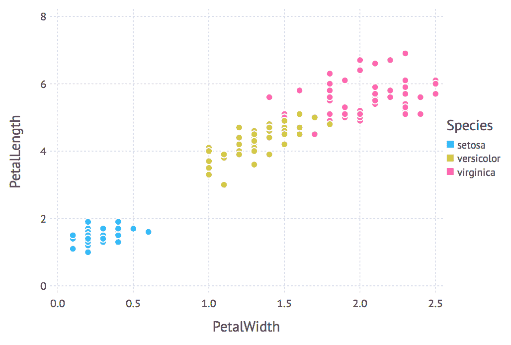

# 创建我们的第一个 Julia 应用程序

现在您已经安装了有效的 Julia 环境，并且您选择的 IDE 已经准备好运行，是时候将它们用于一些有用的任务了。在本章中，您将学习如何将 Julia 应用于数据分析——这是一个语言的核心领域，因此请期待给您留下深刻印象！

我们将学习如何使用 Julia 进行探索性数据分析。在这个过程中，我们将查看 `RDatasets`，这是一个提供超过 700 个学习数据集访问权限的包。我们将加载其中一个，即 Iris 花卉数据集，并使用标准数据分析函数对其进行操作。然后，我们将通过采用常见的可视化技术更仔细地查看数据。最后，我们将了解如何持久化和（重新）加载数据。

但是，为了做到这一点，我们首先需要查看语言的一些最重要的构建块。

在本章中，我们将涵盖以下主题：

+   声明变量（和常量）

+   处理字符 `Strings` 和正则表达式

+   数字和数值类型

+   我们的第一种 Julia 数据结构——`Tuple`、`Range` 和 `Array`

+   `*` 使用 Iris 花卉数据集进行探索性数据分析——`RDatasets` 和核心 `Statistics`

+   使用 `Gadfly` 快速进行数据可视化

+   `*` 使用 `CSV` 和 `Feather` 保存和加载数据表

+   与 MongoDB 数据库交互

# 技术要求

Julia 的包生态系统正在不断发展，并且每天都有新的包版本发布。大多数时候这是一个好消息，因为新版本带来了新功能和错误修复。然而，由于许多包仍在测试版（版本 0.x）中，任何新版本都可能引入破坏性更改。因此，书中展示的代码可能无法正常工作。为了确保您的代码将产生与书中描述相同的结果，建议使用相同的包版本。以下是本章中使用的外部包及其特定版本：

```py
CSV@v0.4.3
DataFrames@v0.15.2
Feather@v0.5.1
Gadfly@v1.0.1
IJulia@v1.14.1
JSON@v0.20.0
RDatasets@v0.6.1
```

为了安装特定版本的包，您需要运行：

```py
pkg> add PackageName@vX.Y.Z 
```

例如：

```py
pkg> add IJulia@v1.14.1
```

或者，您也可以通过下载章节中提供的 `Project.toml` 文件，并使用 `pkg>` 实例化以下命令来安装所有使用的包：

```py
julia> download("https://raw.githubusercontent.com/PacktPublishing/Julia-Programming-Projects/master/Chapter02/Project.toml", "Project.toml")
pkg> activate . 
pkg> instantiate
```

# 定义变量

我们在上一章中看到，如何使用 REPL 来执行计算并将结果显示给我们。Julia 甚至通过设置 `ans` 变量来提供帮助，该变量自动保存最后一个计算值。

但是，如果我们想编写除了最简单的程序之外的内容，我们需要学习如何自己定义变量。在 Julia 中，变量只是一个与值相关联的名称。对变量命名有非常少的限制，并且名称本身没有语义意义（与 Ruby 不同，Ruby 中所有大写的名称被视为常量，语言会根据名称的不同对待变量）。

让我们看看一些例子：

```py
julia> book = "Julia v1.0 By Example" 
julia> pi = 3.14 
julia> ANSWER = 42 
julia> my_first_name = "Adrian" 
```

你可以通过加载本章支持文件中提供的配套 Jupyter/IJulia 笔记本来跟随本章中的示例。

变量的名称是区分大小写的，这意味着`ANSWER`和`answer`（以及`Answer`和`aNsWeR`）是完全不同的：

```py
julia> answer 
ERROR: UndefVarError: answer not defined 

```

也接受 Unicode 名称（UTF-8 编码）作为变量名称：

```py
julia> δ = 130 

```

记住，你可以通过输入反斜杠（`\`）然后输入符号的名称，然后按*Tab*键来输入许多 Unicode 数学符号。例如，\pi[*Tab*]将输出π。

如果你的终端支持，表情符号也可以使用：

```py
julia>  = "apollo 11" 
```

变量的唯一明确禁止的名称是内置 Julia 语句的名称（`do`、`end`、`try`、`catch`、`if`和`else`，以及一些其他名称）：

```py
julia> do = 3 
ERROR: syntax: invalid "do" syntax 
julia> end = "Paris" 
ERROR: syntax: unexpected end 

```

尝试访问未定义的变量将导致错误：

```py
julia> MysteryVar 
ERROR: UndefVarError: MysteryVar not defined 

```

诚然，这种语言没有强加很多限制，但一套代码风格约定总是有用的——对于一个开源语言来说更是如此。Julia 社区已经提炼了一套编写代码的最佳实践。在变量命名方面，名称应该是小写并且只包含一个单词；单词分隔可以使用下划线（`_`），但只有当没有它们名称难以阅读时才使用。例如，`myvar`与`total_length_horizontal`。

由于读取名称的难度是一个主观问题，我对这种命名风格有点犹豫。我通常更喜欢在单词边界处分离的清晰度。但无论如何，遵循建议总是更好的，因为 Julia API 中的函数名称遵循它。通过遵循相同的约定，你的代码将保持一致性。

# 常量

常量是一旦声明就不能更改的变量。它们通过在前面加上`const`关键字来声明：

```py
julia> const firstmonth = "January" 

```

在 Julia 中非常重要的一点是，常量不关心它们的值，而是关心它们的*类型*。现在讨论 Julia 中的类型还为时过早，所以现在只需说，类型代表我们正在处理的价值类型。例如，`"abc"`（在双引号内）是`String`类型，`'a'`（在单引号内）是`Char`类型，`1000`是`Int`类型（因为它是一个整数）。因此，在 Julia 中，与大多数其他语言不同，只要类型保持不变，我们就可以更改分配给常量的值。例如，我们最初可以决定鸡蛋和牛奶是可接受的餐食选择，并改为`vegetarian`：

```py
julia> const mealoption = "vegetarian" 
```

如果我们决定改为`vegan`，我们可以在以后改变主意。Julia 会通过仅发出警告来允许这样做：

```py
julia> mealoption = "vegan" 
WARNING: redefining constant mealoption 
"vegan" 

```

然而，尝试将`mealoption = 2`赋值将会导致错误：

```py
julia> mealoption = 2 
ERROR: invalid redefinition of constant mealoption 
```

这是有意义的，对吧？谁听说过那种饮食？

然而，细微差别可能比这更微妙，尤其是在处理数字时：

```py
julia> const amount = 10.25  
10.25 
julia> amount = 10 
ERROR: invalid redefinition of constant amount 
```

Julia 不允许这样做，因为从内部来看，`10` 和 `10.00` 虽然具有相同的算术值，但它们是不同类型的值（`10` 是一个整数，而 `10.00` 是一个 `float`）。我们将在稍后更详细地了解数值类型，这样一切都会变得清晰：

```py
julia> amount = 10.00 
WARNING: redefining constant amount 
10.0 

```

因此，我们需要将新值作为 `10.00`——一个 `float` 传递，以遵守相同的类型要求。

# 为什么常量很重要？

这主要关乎性能。常量可以作为全局值特别有用。因为全局变量是长期存在的，并且可以在代码的任何位置和任何时候进行修改，编译器在优化它们时会有困难。如果我们告诉编译器该值是常量，因此该值的类型不会改变，性能问题就可以得到优化。

当然，仅仅因为常量可以缓解由全局变量引起的某些关键性能问题，并不意味着我们被鼓励使用它们。在 Julia 中，像在其他语言中一样，应尽可能避免使用全局值。除了性能问题之外，它们还可能创建难以捕捉和理解的微妙错误。此外，请记住，由于 Julia 允许更改常量的值，意外的修改成为可能。

# 注释

常见的编程智慧如下：

"代码被阅读的次数远多于被编写的次数，因此要相应地计划。"

代码注释是一种强大的工具，可以使程序在以后更容易理解。在 Julia 中，注释用 # 符号标记。单行注释由 `#` 表示，并且直到行尾的所有内容都会被编译器忽略。多行注释被 `#= ... =#` 包围。在开闭注释标签之间的所有内容也会被编译器忽略。以下是一个示例：

```py
julia> #= 
           Our company charges a fixed  
           $10 fee per transaction. 
       =# 
const flatfee = 10 # flat fee, per transaction  

```

在前面的代码片段中，我们可以看到多行和单行注释的实际应用。单行注释也可以放在行的开头。

# 字符串

字符串表示字符序列。我们可以通过在双引号之间包围相应的字符序列来创建字符串，如下所示：

```py
julia> "Measuring programming progress by lines of code is like measuring aircraft building progress by weight." 

```

如果字符串中也包含引号，我们可以通过在它们前面加上反斜杠 `\` 来转义这些引号：

```py
julia> "Beta is Latin for \"still doesn't work\"." 
```

# 三引号字符串

然而，转义可能会变得混乱，所以有一个更好的处理方法——使用三引号 `"""..."""`。

```py
julia> """Beta is Latin for "still doesn't work".""" 

```

在三引号内，不再需要转义单引号。但是，请确保单引号和三引号是分开的——否则编译器会感到困惑：

```py
julia> """Beta is Latin for "still doesn't work"""" 
syntax: cannot juxtapose string literal 

```

当与多行文本一起使用时，三引号带来了一些额外的特殊功能。首先，如果开头的 `"""` 后面跟着一个换行符，这个换行符将被从字符串中删除。此外，空白被保留，但字符串将被缩进到最不缩进的行的级别：

```py
julia> """ 
                  Hello 
           Look 
    Here"""

 julia> print(ans) 
Hello 
Look 
Here 
Here was removed).
```

在 Jupyter/IJulia 中看起来是这样的：


长箭头代表一个 *Tab*（在输出中由 `\t` 表示），而短箭头是一个空格。请注意，每一行都以一个空格作为开头——但它被移除了。最不缩进的行，即最后一行，被向左移动，移除了所有空白，并以 **Here** 开头，而其他行上的剩余空白被保留（现在以 *Tab* 开头）。

# 字符串拼接

两个或多个字符串可以通过使用星号 `*` 运算符拼接在一起，形成一个单独的字符串：

```py
julia> "Hello " * "world!" "Hello world!" 

```

或者，我们可以调用 `string` 函数，传入我们想要拼接的所有单词：

```py
julia> string("Itsy", " ", "Bitsy", " ", "Spider") 
"Itsy Bitsy Spider" 

```

拼接也可以与变量很好地配合使用：

```py
julia> username = "Adrian" 
julia> greeting = "Good morning" 
julia> greeting * ", " * username 
"Good morning, Adrian" 
```

然而，同样，我们在处理类型时需要小心（类型是 Julia 的核心，所以这将会是一个经常出现的话题）。拼接仅适用于字符串：

```py
julia> username = 9543794 
julia> greeting = "Good morning" 
julia> greeting * ", " * username 
MethodError: no method matching *(::String, ::Int64) 

```

即使不是所有参数都是字符串，通过调用 `string` 函数进行拼接也是有效的：

```py
julia> string(greeting, ", ", username)
 "Good morning, 9543794"

```

因此，`string` 有一个额外的优势，它自动将参数转换为字符串。以下示例也适用：

```py
julia> string(2, " and ", 3) 
"2 and 3"
```

但这不行：

```py
julia> 2 * " and " * 3 
ERROR: MethodError: no method matching *(::Int64, ::String)
```

此外，还有一个 `String` 方法（首字母大写）。请记住，在 Julia 中名称是区分大小写的，所以 `string` 和 `String` 是两件不同的事情。对于大多数用途，我们需要小写的函数 `string`。如果您想了解 `String`，可以使用 Julia 的帮助系统来访问其文档。

# 字符串插值

当创建更长的、更复杂的字符串时，拼接可能会很嘈杂且容易出错。对于这种情况，我们最好使用 `$` 符号将变量插值到字符串中：

```py
julia> username = "Adrian" 
julia> greeting = "Good morning" 
julia> "$greeting, $username" 
"Good morning, Adrian" 

```

更复杂的表达式可以通过将其包裹在 `$(...)` 中进行插值：

```py
julia> "$(uppercase(greeting)), $(reverse(username))" 
"GOOD MORNING, nairdA" 

```

这里我们调用了 `uppercase` 函数，它将字符串中的所有字母转换为大写字母——以及 `reverse` 函数，它反转单词中字母的顺序。它们的输出随后被插值到字符串中。在 `$(...)` 边界内，我们可以使用任何我们想要的 Julia 代码。

就像 `string` 函数一样，插值会负责将值转换为字符串：

```py
julia> "The sum of 1 and 2 is $(1 + 2)" 
"The sum of 1 and 2 is 3"
```

# 字符串操作

字符串可以被当作字符列表来处理，因此我们可以对它们进行索引——也就是说，访问单词中某个位置的字符：

```py
julia> str = "Nice to see you" 
julia> str[1] 
'N': ASCII/Unicode U+004e (category Lu: Letter, uppercase)
```

字符串 `Nice to see you` 的第一个字符是 `N`。

Julia 中的索引是 `1`-based，这意味着列表的第一个元素位于索引 1。如果你之前编程过，这可能会让你感到惊讶，因为大多数编程语言使用 `0`-based 索引。然而，我向你保证，`1`-based 索引会让编码体验非常愉快且直接。

Julia 支持具有任意索引的数组，例如，可以从 `0` 开始编号。然而，任意索引是一个更高级的功能，我们在这里不会涉及。如果您对此好奇，可以查看官方文档[`docs.julialang.org/en/v1/devdocs/offset-arrays/`](https://docs.julialang.org/en/v1/devdocs/offset-arrays/)。

我们也可以通过使用 `range` 进行索引来提取字符串的一部分（子字符串），提供起始和结束位置：

```py
julia> str[9:11] 
"see" 
```

重要的是要注意，通过单个值进行索引返回一个 `Char`，而通过 `range` 进行索引返回一个 `String`（记住，对于 Julia 来说，这是两件完全不同的事情）：

```py
julia> str[1:1] 
"N" 
```

`N` 是一个仅由一个字母组成的 `String`，正如其双引号所示：

```py
julia> str[1] 
'N': ASCII/Unicode U+004e (category Lu: Letter, uppercase)
```

`N` 是一个 `Char`，正如单引号所示：

```py
julia> str[1:1] == str[1] 
false 
```

它们不相等。

# Unicode 和 UTF-8

在 Julia 中，字符串字面量使用 UTF-8 编码。UTF-8 是一种可变宽度编码，这意味着并非所有字符都使用相同数量的字节来表示。例如，ASCII 字符使用单个字节编码——但其他字符可以使用多达四个字节。这意味着并非每个 UTF-8 字符串的字节索引都是对应字符的有效索引。如果您在无效的字节索引处索引字符串，将会抛出错误。以下是我的意思：

```py
julia> str = "Søren Kierkegaard was a Danish Philosopher" 
julia> str[1] 
'S': ASCII/Unicode U+0053 (category Lu: Letter, uppercase) 
```

我们可以正确地检索索引 `1` 处的字符：

```py
julia> str[2] 
'ø': Unicode U+00f8 (category Ll: Letter, lowercase) 
```

在索引 `2` 处，我们成功获取了 `ø` 字符：

```py
julia> str[3] 
StringIndexError("Søren Kierkegaard was a Danish Philosopher", 3) 
```

然而，`ø` 有两个字节，所以索引 `3` 也被 `ø` 使用，我们无法访问这个位置的字符串：

```py
 julia> str[4] 
'r': ASCII/Unicode U+0072 (category Ll: Letter, lowercase) 
```

第三字母 `r` 在位置 `4` 被找到。

因此 `ø` 是一个占用位置 `2` 和 `3` 的双字节字符——所以索引 `3` 是无效的，匹配 `ø` 的第二个字节。下一个有效索引可以使用 `nextind(str, 2)` 来计算——但推荐的方式是使用字符迭代（我们将在本章稍后讨论 `for` 循环）：

```py
julia> for s in str 
           println(s) 
       end 
S 
ø 
r 
e 
n 

K 
... output truncated...

```

由于可变长度编码，字符串中的字符数不一定与最后一个索引相同（如您所见，第三个字母 `r` 在索引 `4` 处）：

```py
julia> length(str) 42 
julia> str[42] 'e': ASCII/Unicode U+0065 (category Ll: Letter, lowercase) 

```

对于此类情况，Julia 提供了 `end` 关键字，它可以作为最后一个索引的快捷方式。您可以使用 `end` 进行算术和其他操作，就像一个普通值一样：

```py
julia> str[end] 
'r': ASCII/Unicode U+0072 (category Ll: Letter, lowercase) 
julia> str[end-10:end] 
"Philosopher"

```

`end` 值可以使用 `endof(str)` 函数进行程序计算。尝试在字符串的界限之外进行索引将导致 `BoundsError`：

```py
julia> str[end+1] 
ERROR: BoundsError: attempt to access "Søren Kierkegaard was a Danish Philosopher" 
  at index [44]
```

# 正则表达式

正则表达式用于在字符串内部进行强大的子字符串模式匹配。它们可以根据模式在字符串中搜索子字符串，然后提取或替换匹配项。Julia 提供了对 Perl 兼容正则表达式的支持。

输入正则表达式的最常见方式是使用所谓的**非标准字符串字面量**。这些看起来像常规的双引号字符串，但带有特殊的前缀。在正则表达式的例子中，这个前缀是`"r"`。前缀提供了一种与普通字符串字面量不同的行为。

例如，为了定义一个匹配所有字母的正则字符串，我们可以使用`r"[a-zA-Z]*"。`

Julia 提供了相当多的非标准字符串字面量——如果我们想的话，我们甚至可以定义自己的。最广泛使用的是正则表达式（`r"..."`）、字节数组字面量（`b"..."`）、版本号字面量（`v"..."`）和包管理命令（`pkg"..."`）。

下面是如何在 Julia 中构建正则表达式——它匹配介于 0 和 9 之间的数字：

```py
julia> reg = r"[0-9]+" 
r"[0-9]+" 
julia> match(reg, "It was 1970") 
RegexMatch("1970") 
```

我们的正则表达式匹配子字符串`1970`。

我们可以通过使用`typeof`函数检查其`type`来确认非标准字符串字面量`reg`实际上是一个`Regex`而不是一个普通的`String`：

```py
julia> typeof(reg) 
Regex 

```

这揭示了还有一个`Regex`构造函数可用：

```py
julia> Regex("[0-9]+") 
r"[0-9]+" 

```

这两个构造函数类似：

```py
julia> Regex("[0-9]+") == reg 
true
```

当我们需要使用更复杂的字符串创建正则表达式，可能包括插值或连接时，使用构造函数可能很有用。但通常，`r"..."`格式更常用。

通过使用一些组合的标志`i`、`m`、`s`和`x`，可以影响正则表达式的行为。这些修饰符必须放在关闭双引号标记之后：

```py
julia> match(r"it was", "It was 1970") # case-sensitive no match 
julia> match(r"it was"i, "It was 1970") # case-insensitive match 
RegexMatch("It was") 

```

如您所预期，`i`执行不区分大小写的模式匹配。如果没有`i`修饰符，`match`返回`nothing`——一个特殊值，在交互式提示符中不打印任何内容，以指示正则表达式不匹配给定的字符串。

这些是可用的修饰符：

+   `i`—不区分大小写的模式匹配。

+   `m`—将字符串视为多行。

+   `s`—将字符串视为单行。

+   `x`—告诉正则表达式解析器忽略大多数既不是转义也不是在字符类内的空白。您可以使用此功能将正则表达式分成（稍微）更易读的部分。`#`字符也被视为元字符，引入注释，就像在普通代码中一样。

如果我们只想检查正则表达式或子字符串是否包含在字符串中，而不想提取或替换匹配项，则`occursin`函数更为简洁：

```py
julia> occursin(r"hello", "It was 1970")  
false 
julia> occursin(r"19", "It was 1970") 
true 

```

当正则表达式匹配时，它返回一个`RegexMatch`对象。这些对象封装了表达式的匹配方式，包括匹配的子字符串和任何捕获的子字符串：

```py
julia> alice_in_wonderland = "Why, sometimes I've believed as many as six impossible things before breakfast." 

julia> m = match(r"(\w+)+", alice_in_wonderland) 
RegexMatch("Why", 1="Why") 
```

```py
Why.
```

我们还可以指定开始搜索的索引：

```py
m = match(r"(\w+)+", alice_in_wonderland, 6) 
RegexMatch("sometimes", 1="sometimes") 

```

让我们尝试一个稍微复杂一些的例子：

```py
julia> m = match(r"((\w+)(\s+|\W+))", alice_in_wonderland) 
RegexMatch("Why, ", 1="Why, ", 2="Why", 3=", ") 
```

结果的`RegexMatch`对象`m`公开以下属性（或在 Julia 的说法中，字段）：

+   `m.match`（`Why`）包含匹配的整个子字符串。

+   `m.captures`（一个包含`Why`、`Why`和`,`的字符串数组）表示捕获的子字符串。

+   `m.offset`，整个匹配开始的偏移量（在我们的例子中是 `1`）。

+   `m.offsets`，捕获子字符串的偏移量作为整数数组（在我们的例子中是 `[1, 1, 4]`）。

Julia 不提供 `g` 修饰符，用于 *贪婪* 或 *全局* 匹配。如果你需要所有匹配项，你可以使用 `eachmatch()` 函数遍历它们，如下所示：

```py
julia> for m in eachmatch(r"((\w+)(\s+|\W+))", alice_in_wonderland) 
           println(m) 
end 
```

或者，我们可以使用 `collect()` 函数将所有匹配项放入一个列表中：

```py
julia> collect(eachmatch(r"((\w+)(\s+|\W+))", alice_in_wonderland))
 13-element Array{RegexMatch,1}: 
 RegexMatch("Why, ", 1="Why, ", 2="Why", 3=", ") 
 RegexMatch("sometimes ", 1="sometimes ", 2="sometimes", 3=" ") 
 RegexMatch("I'", 1="I'", 2="I", 3="'") 
 RegexMatch("ve ", 1="ve ", 2="ve", 3=" ") 
 RegexMatch("believed ", 1="believed ", 2="believed", 3=" ") 
 RegexMatch("as ", 1="as ", 2="as", 3=" ") 
 RegexMatch("many ", 1="many ", 2="many", 3=" ") 
 RegexMatch("as ", 1="as ", 2="as", 3=" ") 
 RegexMatch("six ", 1="six ", 2="six", 3=" ") 
 RegexMatch("impossible ", 1="impossible ", 2="impossible", 3=" ") 
 RegexMatch("things ", 1="things ", 2="things", 3=" ") 
 RegexMatch("before ", 1="before ", 2="before", 3=" ") 
 RegexMatch("breakfast.", 1="breakfast.", 2="breakfast", 3=".")
```

想要了解更多关于正则表达式的信息，请查看官方文档：[`docs.julialang.org/en/stable/manual/strings/#Regular-Expressions-1`](https://docs.julialang.org/en/stable/manual/strings/#Regular-Expressions-1)。

# 原始字符串字面量

如果需要定义一个不执行插值或转义的字符串，例如表示可能包含 `$` 和 `\` 的其他语言的代码，这些字符可能会干扰 Julia 解析器，你可以使用原始字符串。它们使用 `raw"..."` 构造，并创建包含所包含字符的普通 `String` 对象，这些字符与输入的完全一致，没有插值或转义：

```py
julia> "This $will error out" 
ERROR: UndefVarError: will not defined 
```

在字符串中放置一个 `$` 将导致 Julia 执行插值并查找名为 `will` 的变量：

```py
julia> raw"This $will work" 
"This \$will work" 
```

但是，通过使用原始字符串，`$` 符号将被忽略（或者更确切地说，自动转义，如输出所示）。

# 数字

Julia 提供了广泛的原始数字类型，以及完整的算术和位运算符以及标准数学函数。我们有丰富的数字类型层次结构可供使用，其中最通用的是 `Number`——它定义了两个子类型，`Complex` 和 `Real`。相反，`Real` 有四个子类型——`AbstractFloat`、`Integer`、`Irrational` 和 `Rational`。最后，`Integer` 分支为四个其他子类型——`BigInt`、`Bool`、`Signed` 和 `Unsigned`。

让我们来看看数字最重要的几个类别。

# 整数

文本整数简单地表示如下：

```py
julia> 42 
```

默认的整数类型，称为 `Int`，取决于代码执行的系统架构。它可以是 `Int32` 或 `Int64`。在我的 64 位系统上，我得到它如下：

```py
julia> typeof(42) 
Int64 
```

`Int` 类型将反映这一点，因为它只是 `Int32` 或 `Int64` 的别名：

```py
julia> @show Int 
Int = Int64 

```

# 溢出行为

最小值和最大值由 `typemin()` 和 `typemax()` 函数给出：

```py
julia> typemin(Int), typemax(Int) 
(-9223372036854775808, 9223372036854775807) 
```

尝试使用超出最小值和最大值定义的边界之外的值不会抛出错误（甚至警告），而是导致环绕行为（意味着它会在另一端跳过）：

```py
julia> typemin(Int) - 1 
9223372036854775807 
julia> typemin(Int) - 1 == typemax(Int) 
true 
```

从最小值减去 `1` 将返回最大值：

```py
julia> typemax(Int) + 1 == typemin(Int) 
true
```

反之亦然——将 `1` 添加到最大值将返回最小值。

对于处理这些范围之外的值，我们将使用 `BigInt` 类型：

```py
julia> BigInt(typemax(Int)) + 1 
9223372036854775808
```

这里没有环绕；结果是我们所期望的。

# 浮点数

浮点数由由点分隔的数值表示：

```py
julia> 3.14 
3.14 
julia> -1.0 
-1.0 
julia> 0.25 
0.25 
julia> .5  
0.5  
```

默认情况下，它们是 `Float64` 值，但可以转换为 `Float32`：

```py
julia> typeof(1.) 
Float64 
julia> f32 = Float32(1.) 
1.0f0 
julia> typeof(f32) 
Float32 

```

为了提高可读性，下划线（`_`）分隔符可以与整数和浮点数一起使用：

```py
julia> 1_000_000, 0.000_000_005 
(1000000, 5.0e-9)
```

# 有理数

Julia 还提供了有理数类型。这允许我们处理精确的比率，而不是必须处理浮点数固有的精度损失。有理数以它们的分子和分母值表示，用两个正斜杠 `//` 分隔：

```py
julia> 3//2 
3//2
```

如果没有数据丢失，有理数可以转换为其他类型：

```py
julia> 1//2 + 2//4 
1//1 

julia> Int(1//1) 
1 

julia> float(1//3) 
0.3333333333333333 

julia> Int(1//3) 
ERROR: InexactError: Int64(Int64, 1//3) 

julia> float(1//3) == 1/3 
true 
```

Julia 还包括对复数的支持。我们不会详细讨论它们，但你可以在官方文档中阅读有关该主题的内容，链接为[`docs.julialang.org/en/v1/manual/complex-and-rational-numbers/#Complex-Numbers-1`](https://docs.julialang.org/en/v1/manual/complex-and-rational-numbers/#Complex-Numbers-1)。

# 数值运算符

Julia 支持其数值类型的完整范围的算术运算符：

+   `+` —（一元和二元加）

+   `-` —（一元和二元减）

+   `*` —（乘）

+   `/` —（除）

+   `\` —（倒数除）

+   `^` —（幂）

+   `%` —（余数）

语言还支持每个这些的便捷更新运算符（`+=`,`-=`,`*=`,`/=`,`\=`,`÷=`,`%=`,和 `^=`）。这里它们是野生的：

```py
julia> a = 2 
2 
julia> a *= 3 # equivalent of a = a * 3 
6 
julia> a ^= 2 # equivalent of a = a ^ 2 
36 
julia> a += 4 # equivalent of a = a + 4 
40  
```

可以使用以下一组运算符执行数值比较：

+   `==` —（相等）

+   `!=` 或 `≠` —（不等）

+   `<` —（小于）

+   `<=` 或 `≤` —（小于等于）

+   `>` —（大于）

+   `>=` 或 `≥` —（大于等于）

在 Julia 中，比较也可以链式使用：

```py
julia> 10 > 5 < 6 == 6 >= 3 != 2 
true 
```

# 向量化点操作符

Julia 为每个二元运算符定义了相应的 *点* 操作。这些操作旨在逐元素与值集合（称为 **向量化**）一起工作。也就是说，被 *点* 的运算符应用于集合中的每个元素。

在以下示例中，我们将对 `first_five_fib` 集合中的每个元素进行平方：

```py
julia> first_five_fib = [1, 1, 2, 3, 5] 
5-element Array{Int64,1}: 
 1 
 1 
 2 
 3 
 5 
julia> first_five_fib .^ 2 
5-element Array{Int64,1}: 
  1 
  1 
  4 
  9 
 25 

```

在上一个示例中，`first_five_fib` 没有被修改，返回的结果集合，但还有 *点* 更新运算符也可用，它们在原地更新值。它们与之前讨论的更新运算符（增加了 *点*）相匹配。例如，要就地更新 `first_five_fib`，我们会使用以下代码：

```py
julia> first_five_fib .^= 2 
```

向量化代码是语言的一个重要部分，因为它具有可读性和简洁性，同时也因为它提供了重要的性能优化。更多详情，请查看[`docs.julialang.org/en/stable/manual/functions/#man-vectorized-1`](https://docs.julialang.org/en/stable/manual/functions/#man-vectorized-1)。

# 还有更多

这一节只是触及了表面。要深入了解 Julia 的数值类型，请阅读官方文档[`docs.julialang.org/en/stable/manual/mathematical-operations/`](https://docs.julialang.org/en/stable/manual/mathematical-operations/)。

# 元组

元组是 Julia 中最简单的数据类型和结构之一。它们可以有任意长度，可以包含任何类型的值——但它们是不可变的。一旦创建，元组就不能修改。可以使用字面量元组表示法创建元组，通过在大括号`(...)`内包裹逗号分隔的值：

```py
(1, 2, 3)

julia> ("a", 4, 12.5) 
("a", 4, 12.5) 

```

为了定义一个只有一个元素的元组，我们一定不要忘记尾随的逗号：

```py
julia> (1,) 
(1,) 

```

但省略括号是可以的：

```py
julia> 'e', 2 
('e', 2) 

julia> 1, 
(1,) 

```

我们可以索引元组来访问它们的元素：

```py
julia> lang = ("Julia", v"1.0") 
("Julia", v"1.0.0") 

julia> lang[2] 
v"1.0.0" 

```

向量化*点*操作也适用于元组：

```py
julia> (3,4) .+ (1,1) (4, 5)
```

# 命名元组

命名元组表示一个带有标签项的元组。我们可以通过标签或索引访问各个组件：

```py
julia> skills = (language = "Julia", version = v"1.0") 
(language = "Julia", version = v"1.0.0") 

julia> skills.language 
"Julia"

 julia> skills[1] 
"Julia" 
```

命名元组可以非常强大，因为它们类似于完整对象，但限制在于它们是不可变的。

# 范围

我们在之前学习如何索引字符串时已经看到了范围。它们可以像以下这样简单：

```py
julia> r = 1:20 
1:20 

```

与之前的集合一样，我们可以对范围进行索引：

```py
julia> abc = 'a':'z' 
'a':1:'z' 

julia> abc[10] 
'j': ASCII/Unicode U+006a (category Ll: Letter, lowercase) 

julia> abc[end] 
'z': ASCII/Unicode U+007a (category Ll: Letter, lowercase) 

```

可以使用展开运算符`"..."`将范围展开为其对应的值。例如，我们可以将其展开成元组：

```py
julia> (1:20...,) 
(1, 2, 3, 4, 5, 6, 7, 8, 9, 10, 11, 12, 13, 14, 15, 16, 17, 18, 19, 20) 

```

我们还可以将其展开成列表：

```py
julia> [1:20...] 
20-element Array{Int64,1}

```

对于元组也是如此，它们还可以被展开成列表，以及其他东西：`[(1,2,3)...]`。

我们可以看到，范围默认以增量为一的步长。我们可以通过传递一个可选的步长参数来改变它。以下是一个从`0`到`20`且步长为五的范围的例子：

```py
julia> (0:5:20...,)  
(0, 5, 10, 15, 20) 
```

现在我们的值从`5`到`5`。

这也打开了以负步长递减顺序前进的可能性：

```py
julia> (20:-5:-20...,) 
(20, 15, 10, 5, 0, -5, -10, -15, -20) 

```

范围不仅限于整数——您之前已经看到了`chars`的范围；这些是`floats`的范围：

```py
julia> (0.5:10) 
0.5:1.0:9.5 
julia> (0.5:10...,) 
(0.5, 1.5, 2.5, 3.5, 4.5, 5.5, 6.5, 7.5, 8.5, 9.5)

```

我们还可以使用`collect`函数将范围扩展到列表（数组）中：

```py
julia> collect(0.5:0.5:10) 
20-element Array{Float64,1} 
```

# 数组

数组是一种数据结构（以及相应的*类型*），它表示一个有序的元素集合。更具体地说，在 Julia 中，数组是一个存储在多维网格中的对象的集合。

数组可以有任意数量的维度，由它们的类型和维度数定义——`Array{Type, Dimensions}`。

一维数组，也称为**向量**，可以使用数组字面量表示法轻松定义，即方括号`[...]`：

```py
julia> [1, 2, 3]  
3-element Array{Int64,1}: 
 1 
 2 
 3 

```

您还可以约束元素的类型：

```py
julia> Float32[1, 2, 3, 4] 
4-element Array{Float32,1}: 
 1.0 
 2.0 
 3.0 
 4.0 

```

二维数组（也称为**矩阵**）可以使用相同的数组字面量表示法初始化，但这次不需要逗号：

```py
julia> [1 2 3 4] 
1×4 Array{Int64,2}: 
 1  2  3  4 

```

我们可以使用分号添加更多行：

```py
julia> [1 2 3; 4 5 6; 7 8 9] 
3×3 Array{Int64,2}: 
 1  2  3 
 4  5  6 
 7  8  9 
```

Julia 附带了许多函数，可以构造和初始化具有不同值的数组，例如`zeroes`、`ones`、`trues`、`falses`、`similar`、`rand`、`fill`等。以下是一些实际应用的例子：

```py
julia> zeros(Int, 2) 
2-element Array{Int64,1}: 
 0 
 0

 julia> zeros(Float64, 3) 
3-element Array{Float64,1}: 
 0.0 
 0.0 
 0.0 

julia> ones(2) 
2-element Array{Float64,1}: 
 1.0 
 1.0 

julia> ones(Int, 2) 
2-element Array{Int64,1}: 
 1 
 1 

julia> ones(Int, 3, 4) 
3×4 Array{Int64,2}: 
 1  1  1  1 
 1  1  1  1 
 1  1  1  1 

julia> trues(2) 
2-element BitArray{1}: 
 true 
 true 

julia> rand(Int, 4, 2) 
4×2 Array{Int64,2}: 
  9141724849782088627   6682031028895615978 
 -3827856130755187476  -1731760524632072533 
 -3369983903467340663  -7550830795386270701 
 -3159829068325670125   1153092130078644307 

julia> rand(Char, 3, 2) 
3×2 Array{Char,2}: 
 '\U63e7a'  '\Ub8723' 
 '\Uda56f'   
 '\U7b7fd'  '\U5f749' 

julia> fill(42, 2, 3) 
2×3 Array{Int64,2}: 
 42  42  42 
 42  42  42
```

`Array`元素可以通过它们的索引访问，为每个维度传递一个值：

```py
julia> arr1d = rand(5) 5-element Array{Float64,1}: 0.845359 0.0758361 0.379544 0.382333 0.240184 
julia> arr1d[5] 
 0.240184 
julia> arr2d = rand(5,2) 
5×2 Array{Float64,2}: 
 0.838952  0.312295 
 0.800917  0.253152 
 0.480604  0.49218 
 0.716717  0.889667 
 0.703998  0.773618 

julia> arr2d[4, 1] 
0.7167165812985592 
```

我们还可以传递一个冒号（`:`）来选择整个维度内的所有索引——或者一个范围来定义子选择：

```py
julia> arr2d = rand(5,5) 
5×5 Array{Float64,2}: 
 0.618041  0.887638   0.633995  0.868588  0.19461 
 0.400213  0.699705   0.719709  0.328922  0.326825 
 0.322572  0.807488   0.866489  0.960801  0.476889 
 0.716221  0.504356   0.206264  0.600758  0.843445 
 0.705491  0.0334613  0.240025  0.235351  0.740302 
```

这就是我们选择行`1`到`3`和列`3`到`5`的方式：

```py
julia> arr2d[1:3, 3:5] 
3×3 Array{Float64,2}: 
 0.633995  0.868588  0.19461 
 0.719709  0.328922  0.326825 
 0.866489  0.960801  0.476889 
```

单独的冒号`:`代表所有——所以这里我们选择了行和列`3`到`5`：

```py
julia> arr2d[:, 3:5] 
5×3 Array{Float64,2}: 
 0.633995  0.868588  0.19461 
 0.719709  0.328922  0.326825 
 0.866489  0.960801  0.476889 
 0.206264  0.600758  0.843445 
 0.240025  0.235351  0.740302
```

另一个选项是布尔数组`Array`来选择其`true`索引处的元素。在这里，我们选择了对应于`true`值的行和列`3`到`5`：

```py
julia> arr2d[[true, false, true, true, false], 3:5] 
3×3 Array{Float64,2}: 
 0.633995  0.868588  0.19461 
 0.866489  0.960801  0.476889 
 0.206264  0.600758  0.843445

```

与数组索引类似，我们也可以将值赋给选定的项：

```py
julia> arr2d[1, 1] = 0.0 

julia> arr2d[[true, false, true, true, false], 3:5] = ones(3, 3) 
julia> arr2d 
5×5 Array{Float64,2}: 
 0.0       0.641646  1.0       1.0        1.0      
 0.750895  0.842909  0.818378  0.484694   0.661247 
 0.938833  0.193142  1.0       1.0        1.0      
 0.195541  0.338319  1.0       1.0        1.0      
 0.546298  0.920886  0.720724  0.0529883  0.238986 
```

# 迭代

遍历数组的最简单方法是使用`for`构造：

```py
for element in yourarray 
    # do something with element 
end 

```

这里有一个例子：

```py
julia> for person in ["Alison", "James", "Cohen"] 
           println("Hello $person") 
       end 

Hello Alison 
Hello James 
Hello Cohen 

```

如果你还需要在迭代时获取索引，Julia 提供了`eachindex(yourarray)`迭代器：

```py
julia> people = ["Alison", "James", "Cohen"] 
3-element Array{String,1}: 
 "Alison" 
 "James" 
 "Cohen" 

julia> for i in eachindex(people) 
           println("$i. $(people[i])") 
       end

 1\. Alison 
2\. James 
3\. Cohen 
```

# 修改数组

我们可以使用`push!`函数向集合的末尾添加更多元素：

```py
julia> arr = [1, 2, 3] 
3-element Array{Int64,1}: 
 1 
 2 
 3

 julia> push!(arr, 4) 
4-element Array{Int64,1}: 
 1 
 2 
 3 
 4 

julia> push!(arr, 5, 6, 7) 
7-element Array{Int64,1}: 
  1 
  2 
  3 
  4 
  5 
  6 
  7 

```

注意`push!`函数结尾的感叹号`!`。这在 Julia 中是一个完全合法的函数名。这是一个约定，用来警告该函数是*修改性的*——也就是说，它将修改传递给它的数据，而不是返回一个新值。

我们可以使用`pop!`从数组的末尾删除元素：

```py
julia> pop!(arr) 
7 

julia> arr 
6-element Array{Int64,1}: 
 1 
 2 
 3 
 4 
 5 
 6 
```

调用`pop!`函数已经移除了`arr`的最后一个元素并返回了它。

如果我们要删除除了最后一个元素之外的其他元素，我们可以使用`deleteat!`函数，表示要删除的索引：

```py
julia> deleteat!(arr, 3) 
5-element Array{Int64,1}: 
 1 
 2 
 4 
 5 
 6 

```

最后，关于修改数组有一个警告。在 Julia 中，数组是通过引用传递给函数的。这意味着原始数组被发送作为各种修改函数的参数，而不是它的副本。小心不要意外地做出不想要的修改。同样，当将数组赋给变量时，会创建一个新的引用，但数据不会被复制。所以例如：

```py
julia> arr = [1,2,3] 
3-element Array{Int64,1}: 
 1 
 2 
 3 

julia> arr2 = arr 
3-element Array{Int64,1}: 
 1 
 2 
 3
```

现在我们从`arr2`中移除一个元素：

```py
julia> pop!(arr2) 
3 
```

因此，`arr2`看起来是这样的：

```py
julia> arr2 
2-element Array{Int64,1}: 
 1 
 2 
```

但我们的原始数组也被修改了：

```py
julia> arr 
2-element Array{Int64,1}: 
 1 
 2 

```

将`arr`赋给`arr2`并不会将`arr`的值复制到`arr2`中，它只创建了一个新的绑定（一个新的名称），指向原始的`arr`数组。要创建具有相同值的单独数组，我们需要使用`copy`函数：

```py
julia> arr 
2-element Array{Int64,1}: 
 1 
 2 

julia> arr2 = copy(arr) 
2-element Array{Int64,1}: 
 1 
 2 
```

现在，如果我们从复制的数组中移除一个元素：

```py
julia> pop!(arr2) 
2 
```

我们原始的数组没有改变：

```py
julia> arr 
2-element Array{Int64,1}: 
 1 
 2
```

只有副本被修改了：

```py
julia> arr2 
1-element Array{Int64,1}: 
 1 
```

# 集合推导

数组推导提供了一种非常强大的构建数组的方法。它类似于之前讨论的数组字面量表示法，但不同之处在于我们不是传递实际值，而是使用对可迭代对象的计算。

一个例子会使其更清楚：

```py
julia> [x += 1 for x = 1:5] 
10-element Array{Int64,1}: 
  2 
  3 
  4 
  5 
  6

```

这可以读作——对于范围`1`到`5`内的每个元素`x`，计算`x+1`并将结果值放入数组中。

就像普通的数组字面量一样，我们可以约束类型：

```py
julia> Float64[x+=1 for x = 1:5] 
5-element Array{Float64,1}: 
 2.0 
 3.0 
 4.0 
 5.0 
 6.0 

```

类似地，我们可以创建多维数组：

```py
julia> [x += y for x = 1:5, y = 11:15] 
5×5 Array{Int64,2}: 
 12  13  14  15  16 
 13  14  15  16  17 
 14  15  16  17  18 
 15  16  17  18  19 
 16  17  18  19  20 

```

可以使用`if`关键字对集合进行过滤：

```py
julia> [x += 1 for x = 1:10 if x/2 > 3] 
4-element Array{Int64,1}: 
  8 
  9 
 10 
 11 
```

在这种情况下，我们只保留了`x/2`大于`3`的值。

# 生成器

但是，当它们用于创建生成器时，集合的强大功能被激活了。生成器可以被迭代以按需产生值，而不是分配一个数组并在事先存储所有值。你将在下一秒看到这意味着什么。

生成器定义的方式与数组推导式相同，但没有方括号：

```py
julia> (x+=1 for x = 1:10) 
Base.Generator{UnitRange{Int64},##41#42}(#41, 1:10) 

```

它们允许我们与可能无限大的集合一起工作。检查以下示例，我们想要打印出从一到一百万的数字，其立方小于或等于`1_000`：

```py
julia> for i in [x³ for x=1:1_000_000] 
           i >= 1_000 && break 
           println(i) 
end 
1 
8 
27 
64 
125 
216 
343 
512 
729 

```

这个计算使用了大量的资源，因为理解创建了一个包含 1 百万个项目的完整数组，尽管我们只迭代了它的前九个元素。

我们可以通过使用方便的`@time`构造函数来基准测试代码：

```py
@time for i in [x³ for x=1:1_000_000] 
   i >= 1_000 && break 
   println(i) 
end 

0.035739 seconds (58.46 k allocations: 10.493 MiB)

```

超过 10 MB 的内存和近 60,000 次分配。与使用生成器相比：

```py
@time for i in (x³ for x=1:1_000_000) 
   i >= 1_000 && break 
   println(i) 
end 

0.019681 seconds (16.63 k allocations: 898.414 KiB)  

```

不到 1 MB 和分配次数的四分之一。如果我们从 1 百万增加到 10 亿，差异将更加明显：

```py
julia> @time for i in [x³ for x=1:1_000_000_000] 
          i >= 1_000 && break 
          println(i) 
       end 
1 
8 
27 
64 
125 
216 
343 
512 
729

 10.405833 seconds (58.48 k allocations: 7.453 GiB, 3.41% gc time) 
```

超过 10 秒和 7 GB 的内存使用！

另一方面，生成器几乎以恒定的时间运行：

```py
julia> @time for i in (x³ for x=1:1_000_000_000) 
          i >= 1_000 && break 
          println(i) 
       end 
1 
8 
27 
64 
125 
216 
343 
512 
729 

  0.020068 seconds (16.63 k allocations: 897.945 KiB 
```

# 使用 Julia 进行数据探索分析

现在你已经很好地理解了 Julia 的基础知识，我们可以将这个知识应用到我们的第一个项目中。我们将首先通过**数据探索分析**（**EDA**）来应用爱丽丝花数据集。

如果你已经对数据分析有经验，你可能之前已经使用过爱丽丝花数据集。如果是这样，那太好了！你将熟悉数据以及在你（之前）选择的语言中如何做事，现在可以专注于 Julia 的方式。

相反，如果你第一次听说爱丽丝花数据集，无需担心。这个数据集被认为是数据科学的`Hello World`——我们将使用 Julia 强大的工具箱来仔细研究它。享受吧！

# 爱丽丝花数据集

也称为**费舍尔的爱丽丝花数据集**，它最初由英国统计学家和生物学家罗纳德·费舍尔在 1936 年介绍。该数据集由三个品种的爱丽丝花（Iris setosa、Iris virginica 和 Iris versicolor）的 50 个样本组成。有时它被称为**安德森的爱丽丝花数据集**，因为埃德加·安德森收集了这些数据。测量了四个特征——萼片和花瓣的长度和宽度（以厘米为单位）。

# 使用`RDatasets`包

寻找用于学习、教学和统计软件开发的高质量数据可能具有挑战性。这就是为什么该行业实际上已经标准化了超过 10,000 个高质量数据集的使用。这些数据集最初是与统计软件环境 R 一起分发的。因此，它们被恰当地命名为`RDatasets`。

爱丽丝花数据集是本集合的一部分。有多种方式可以下载它，但最方便的方式是通过`RDatasets`包。这个包为 Julia 用户提供了方便的方式来实验 R 中大多数标准数据集，或者包含在 R 最受欢迎的包中。听起来很棒；让我们添加它。

首先，切换到包管理模式：

```py
 julia> ]
    pkg> add RDatasets 
```

一旦添加了包，让我们告诉 Julia 我们想要使用它：

```py
 julia> using RDatasets 
```

我们可以通过调用 `RDatasets.datasets()` 来查看包含的数据集。它返回一个包含 `RDatasets` 中所有 700 多个数据集的列表。它包括数据包的详细信息、数据集的名称、标题（或信息）、行数和列数。以下是前 20 行：

```py
julia> RDatasets.datasets() 
```

输出如下：


你可以看到数据集是 `Package` 的一部分——我们可以用它来过滤。Iris 花数据集是 *datasets* 包的一部分。

现在我们只需要加载数据：

```py
julia> iris = dataset("datasets", "iris") 
```

输出如下：


返回值是一个包含 150 行和五列的 `DataFrame` 对象——`SepalLength`（花萼长度）、`SepalWidth`（花萼宽度）、`PetalLength`（花瓣长度）、`PetalWidth`（花瓣宽度）和 `Species`（物种），以及一个自动添加的名为 `Row` 的 id 列。

Dataframes 是 Julia 处理表格数据的 *de facto* 标准。它们是 Julia 数据分析工具集的关键部分，我们将在下一章中详细讨论它们。现在，只需说，正如你在前面的例子中看到的那样，它代表了一种类似于表格或电子表格的数据结构。

你可以使用以下方式编程地检索列名：

```py
julia> names(iris) 
5-element Array{Symbol,1}: 
 :SepalLength 
 :SepalWidth 
 :PetalLength 
 :PetalWidth 
 :Species 

```

要检查大小，请使用以下方法：

```py
julia> size(iris) 
(150, 5)
```

结果是一个与行数和列数相匹配的元组 `(rows, cols)`。是的，正如已经确立的，`150` 行跨越 `5` 列。

让我们看看数据：

```py
julia> head(iris) 
```

输出如下：


`head` 函数显示前六行。可选地，它接受第二个参数来指定行数：`head(iris, 10)`。还有一个它的双胞胎函数 `tail()`，它将显示 `DataFrame` 的底部行：

```py
julia> tail(iris, 10) 
```

输出如下：


关于数据集中存在的物种，我们在头部行中看到 *setosa*，在底部看到 *virginica*。然而，根据数据的描述，我们应该有三个物种。让我们按 `Species` 分组请求行数：

```py
julia> by(iris, :Species, nrow)
```

输出如下：


`by` 函数接受三个参数——数据集、列名和一个分组函数——在这个例子中，`nrow`，它计算行数。我们可以看到第三种物种是 *versicolor*，对于每种物种，我们都有 `50` 条记录。

我敢肯定你一定想知道，在前面的例子中，为什么列名前面有一个冒号 "`:`"。这是一个 `Symbol`。当我们学习到元编程时，我们将更详细地讨论符号。现在，你只需将符号视为标识符或标签即可。

# 使用简单统计来更好地理解我们的数据

现在，我们已经清楚地了解了数据的结构以及集合中包含的内容，我们可以通过查看一些基本统计信息来更好地理解。

为了让我们开始，让我们调用 `describe` 函数：

```py
julia> describe(iris)
```

输出如下：


此函数总结了 `iris` `DataFrame` 的列。如果列包含数值数据（如 `SepalLength`），它将计算最小值、中位数、平均值和最大值。还包括缺失值和唯一值的数量。最后一列报告存储在行中的数据类型。

一些其他统计信息也是可用的，包括第 25 百分位和第 75 百分位，以及第一个和最后一个值。我们可以通过传递一个额外的 `stats` 参数来请求它们，该参数是一个符号数组的格式：

```py
julia> describe(iris, stats=[:q25, :q75, :first, :last]) 
```

输出如下：


接受任何组合的统计标签。这些都是所有选项——`:mean`、`:std`、`:min`、`:q25`、`:median`、`:q75`、`:max`、`:eltype`、`:nunique`、`:first`、`:last` 和 `:nmissing`。

为了获取所有统计信息，接受特殊的 `:all` 值：

```py
julia> describe(iris, stats=:all)
```

输出如下：


我们也可以通过使用 Julia 的 `Statistics` 包单独计算这些值。例如，要计算 `SepalLength` 列的平均值，我们将执行以下操作：

```py
julia> using Statistics 
julia> mean(iris[:SepalLength]) 
5.843333333333334 

```

在这个例子中，我们使用 `iris[:SepalLength]` 来选择整个列。结果，毫不意外，与相应的 `describe()` 返回值相同。

以类似的方式，我们可以计算 `median()`：

```py
julia> median(iris[:SepalLength]) 
5.8 
```

还有更多（很多）内容，例如，例如，标准差 `std()`：

```py
julia> std(iris[:SepalLength]) 
0.828066127977863 

```

或者，我们可以使用 `Statistics` 包中的另一个函数 `cor()`，在简单的脚本中帮助我们了解值之间的相关性：

```py
julia> for x in names(iris)[1:end-1]    
        for y in names(iris)[1:end-1] 
          println("$x \t $y \t $(cor(iris[x], iris[y]))") 
        end 
        println("-------------------------------------------") 
      end

```

执行此代码片段将产生以下输出：

```py
SepalLength       SepalLength    1.0 
SepalLength       SepalWidth     -0.11756978413300191 
SepalLength       PetalLength    0.8717537758865831 
SepalLength       PetalWidth     0.8179411262715759 
------------------------------------------------------------ 
SepalWidth         SepalLength    -0.11756978413300191 
SepalWidth         SepalWidth     1.0 
SepalWidth         PetalLength    -0.42844010433053953 
SepalWidth         PetalWidth     -0.3661259325364388 
------------------------------------------------------------ 
PetalLength       SepalLength    0.8717537758865831 
PetalLength       SepalWidth     -0.42844010433053953 
PetalLength       PetalLength    1.0 
PetalLength       PetalWidth     0.9628654314027963 
------------------------------------------------------------ 
PetalWidth         SepalLength    0.8179411262715759 
PetalWidth         SepalWidth     -0.3661259325364388 
PetalWidth         PetalLength    0.9628654314027963 
PetalWidth         PetalWidth     1.0 
------------------------------------------------------------ 

```

脚本遍历数据集的每一列，除了 `Species`（最后一列，不是数值类型），并生成一个基本的关联表。该表显示 `SepalLength` 与 `PetalLength`（87.17%）、`SepalLength` 与 `PetalWidth`（81.79%）、以及 `PetalLength` 与 `PetalWidth`（96.28%）之间存在强烈的正相关。`SepalLength` 与 `SepalWidth` 之间没有强烈的关联。

我们可以使用相同的脚本，但这次使用 `cov()` 函数来计算数据集中值的协方差：

```py
julia> for x in names(iris)[1:end-1] 
         for y in names(iris)[1:end-1] 
           println("$x \t $y \t $(cov(iris[x], iris[y]))") 
         end 
         println("--------------------------------------------") 
       end 
```

此代码将生成以下输出：

```py
SepalLength       SepalLength    0.6856935123042507 
SepalLength       SepalWidth     -0.04243400447427293 
SepalLength       PetalLength    1.2743154362416105 
SepalLength       PetalWidth     0.5162706935123043 
------------------------------------------------------- 
SepalWidth         SepalLength    -0.04243400447427293 
SepalWidth         SepalWidth     0.189979418344519 
SepalWidth         PetalLength    -0.3296563758389262 
SepalWidth         PetalWidth     -0.12163937360178968 
------------------------------------------------------- 
PetalLength       SepalLength    1.2743154362416105 
PetalLength       SepalWidth     -0.3296563758389262 
PetalLength       PetalLength    3.1162778523489933 
PetalLength       PetalWidth     1.2956093959731543 
------------------------------------------------------- 
PetalWidth         SepalLength    0.5162706935123043 
PetalWidth         SepalWidth     -0.12163937360178968 
PetalWidth         PetalLength    1.2956093959731543 
PetalWidth         PetalWidth     0.5810062639821031 
------------------------------------------------------- 
```

输出说明了 `SepalLength` 与 `PetalLength` 和 `PetalWidth` 正相关，而与 `SepalWidth` 负相关。`SepalWidth` 与所有其他值负相关。

接下来，如果我们想要一个随机数据样本，我们可以这样请求：

```py
julia> rand(iris[:SepalLength]) 
7.4
```

可选地，我们可以传递要采样的值的数量：

```py
julia> rand(iris[:SepalLength], 5) 
5-element Array{Float64,1}: 
 6.9 
 5.8 
 6.7 
 5.0 
 5.6 

```

我们可以使用以下方法将某一列转换为数组：

```py
julia> sepallength = Array(iris[:SepalLength]) 
150-element Array{Float64,1}: 
 5.1 
 4.9 
 4.7 
 4.6 
 5.0 
 # ... output truncated ... 

```

或者，我们可以将整个 `DataFrame` 转换为矩阵：

```py
julia> irisarr = convert(Array, iris[:,:]) 
150×5 Array{Any,2}: 
 5.1  3.5  1.4  0.2  CategoricalString{UInt8} "setosa"    
 4.9  3.0  1.4  0.2  CategoricalString{UInt8} "setosa"    
 4.7  3.2  1.3  0.2  CategoricalString{UInt8} "setosa"    
 4.6  3.1  1.5  0.2  CategoricalString{UInt8} "setosa"    
 5.0  3.6  1.4  0.2  CategoricalString{UInt8} "setosa"   
 # ... output truncated ... 
```

# 可视化鸢尾花数据

可视化是探索性数据分析中的强大工具，帮助我们识别仅通过查看数字难以发现的模式。Julia 提供了访问一些出色的绘图包的途径，这些包非常容易设置和使用。

我们将通过使用 Gadfly 创建的一些图表来举例说明。

我们将首先通过`pkg> add "Gadfly"`添加 Gadfly，然后继续使用`julia> using Gadfly`。这将使 Gadfly 的`plot()`方法生效。现在，让我们找到一些有趣的数据来进行可视化。

在上一节中，我们已经确定`SepalLength`和`PetalLength`之间存在强烈的协变关系。让我们绘制这些数据：

```py
julia> plot(iris, x=:SepalLength, y=:PetalLength, color=:Species) 
```

在撰写本文时，Gadfly 对 Julia v1 的支持仍然不完整。如果情况仍然如此，可以使用不稳定但可工作的 Gadfly 版本安装——`pkg> add Compose#master`, `Gadfly#master`, `Hexagon`。

执行`plot()`函数将生成以下图形：


果然，该图将表明对于 Iris versicolor 和 Iris virginica，`SepalLength`和`PetalLength`是共同变化的。对于 Iris setosa，这并不那么明显，因为`PetalLength`基本保持不变，而萼片长度在增长。

箱线图将确认相同的结果；Iris setosa 的萼片长度变化很小：

```py
julia> plot(iris, x=:Species, y=:PetalLength, Geom.boxplot)

```

我们绘制值的样子如下：


我有一种感觉，直方图将更好地说明`PetalLength`的分布：

```py
julia> plot(iris, x=:PetalLength, color=:Species, Geom.histogram) 
```

使用`PetalLength`生成直方图会产生以下结果：


如果我们将`PetalWidth`值可视化为直方图，我们会注意到类似的模式：

```py
julia> plot(iris, x=:PetalWidth, color=:Species, Geom.histogram)
```

输出如下：


绘制三种物种的花瓣宽度和高度图，现在应该能强烈表明，例如，我们可以根据这两个值成功地将鸢尾花属的 Iris setosa 进行分类：

```py
julia> plot(iris, x=:PetalWidth, y=:PetalLength, color=:Species)
```

输出如下：



# 加载和保存我们的数据

Julia 自带了出色的读取和存储数据的工具。鉴于其专注于数据科学和科学计算，对表格文件格式（CSV，TSV）的支持是一流的。

让我们从我们的初始数据集中提取一些数据，并使用它来练习从各种后端进行持久化和检索。

我们可以通过定义相应的列和行来引用`DataFrame`的某个部分。例如，我们可以定义一个新的`DataFrame`，它仅由`PetalLength`和`PetalWidth`列以及前三个行组成：

```py
julia> iris[1:3, [:PetalLength, :PetalWidth]] 
3×2 DataFrames.DataFrame 
│ Row │ PetalLength │ PetalWidth │ 
├─────┼─────────────┼────────────┤ 
│ 1   │ 1.4         │ 0.2        │ 
│ 2   │ 1.4         │ 0.2        │ 
│ 3   │ 1.3         │ 0.2        │ 

```

通用索引符号是`dataframe[rows, cols]`，其中`rows`可以是数字、范围或`boolean`值的`Array`，其中`true`表示该行应被包含：

```py
julia> iris[trues(150), [:PetalLength, :PetalWidth]] 
150 rows since trues(150) constructs an array of 150 elements that are all initialized as true. The same logic applies to cols, with the added benefit that they can also be accessed by name.
```

带着这些知识，让我们从原始数据集中抽取一个样本。它将包括大约 10% 的初始数据，以及 `PetalLength`、`PetalWidth` 和 `Species` 列：

```py
julia> test_data = iris[rand(150) .<= 0.1, [:PetalLength, :PetalWidth, :Species]] 
10×3 DataFrames.DataFrame 
│ Row │ PetalLength │ PetalWidth │ Species      │ 
├─────┼─────────────┼────────────┼──────────────┤ 
│ 1   │ 1.1         │ 0.1        │ "setosa"     │ 
│ 2   │ 1.9         │ 0.4        │ "setosa"     │ 
│ 3   │ 4.6         │ 1.3        │ "versicolor" │ 
│ 4   │ 5.0         │ 1.7        │ "versicolor" │ 
│ 5   │ 3.7         │ 1.0        │ "versicolor" │ 
│ 6   │ 4.7         │ 1.5        │ "versicolor" │ 
│ 7   │ 4.6         │ 1.4        │ "versicolor" │ 
│ 8   │ 6.1         │ 2.5        │ "virginica"  │ 
│ 9   │ 6.9         │ 2.3        │ "virginica"  │ 
│ 10  │ 6.7         │ 2.0        │ "virginica"  │ 

```

这里发生了什么？这段代码的秘密在于 `rand(150) .<= 0.1`。它做了很多事情——首先，它生成一个介于 0 和 1 之间的随机 `Float` 值数组；然后，它逐元素比较数组与 0.1（代表 1 的 10%）；最后，生成的 `Boolean` 数组用于从数据集中过滤出相应的行。Julia 的强大和简洁真的令人印象深刻！

在我的情况下，结果是包含前面 10 行的 `DataFrame`，但你的数据可能会有所不同，因为我们正在选择随机行（而且你也不一定有 exactly 10 行）。

# 使用表格文件格式进行保存和加载

我们可以使用 `CSV` 包轻松地将这些数据保存到表格文件格式（CSV、TSV 等之一）的文件中。我们首先需要添加它，然后调用 `write` 方法：

```py
pkg> add CSV 
julia> using CSV 
julia> CSV.write("test_data.csv", test_data)  
```

同样容易，我们可以使用相应的 `CSV.read` 函数从表格文件格式中读取数据：

```py
julia> td = CSV.read("test_data.csv") 
10×3 DataFrames.DataFrame 
│ Row │ PetalLength │ PetalWidth │ Species      │ 
├─────┼─────────────┼────────────┼──────────────┤ 
│ 1   │ 1.1         │ 0.1        │ "setosa"     │ 
│ 2   │ 1.9         │ 0.4        │ "setosa"     │ 
│ 3   │ 4.6         │ 1.3        │ "versicolor" │ 
│ 4   │ 5.0         │ 1.7        │ "versicolor" │ 
│ 5   │ 3.7         │ 1.0        │ "versicolor" │ 
│ 6   │ 4.7         │ 1.5        │ "versicolor" │ 
│ 7   │ 4.6         │ 1.4        │ "versicolor" │ 
│ 8   │ 6.1         │ 2.5        │ "virginica"  │ 
│ 9   │ 6.9         │ 2.3        │ "virginica"  │ 
│ 10  │ 6.7         │ 2.0        │ "virginica"  │ 
```

仅指定文件扩展名就足以让 Julia 理解如何处理文档（CSV、TSV），无论是写入还是读取。

# 使用 Feather 文件

Feather 是一种专门为存储数据框而设计的二进制文件格式。它快速、轻量级且语言无关。该项目最初启动是为了使 R 和 Python 之间交换数据框成为可能。很快，其他语言也添加了对它的支持，包括 Julia。

对 Feather 文件的支持不是默认提供的，但可以通过同名的包获得。让我们继续添加它并将其纳入作用域：

```py
pkg> add Feather  
julia> using Feather
```

现在，保存我们的 `DataFrame` 只需调用 `Feather.write`：

```py
julia> Feather.write("test_data.feather", test_data) 

```

接下来，让我们尝试反向操作并重新加载我们的 Feather 文件。我们将使用对应的 `read` 函数：

```py
julia> Feather.read("test_data.feather") 
10×3 DataFrames.DataFrame 
│ Row │ PetalLength │ PetalWidth │ Species      │ 
├─────┼─────────────┼────────────┼──────────────┤ 
│ 1   │ 1.1         │ 0.1        │ "setosa"     │ 
│ 2   │ 1.9         │ 0.4        │ "setosa"     │ 
│ 3   │ 4.6         │ 1.3        │ "versicolor" │ 
│ 4   │ 5.0         │ 1.7        │ "versicolor" │ 
│ 5   │ 3.7         │ 1.0        │ "versicolor" │ 
│ 6   │ 4.7         │ 1.5        │ "versicolor" │ 
│ 7   │ 4.6         │ 1.4        │ "versicolor" │ 
│ 8   │ 6.1         │ 2.5        │ "virginica"  │ 
│ 9   │ 6.9         │ 2.3        │ "virginica"  │ 
│ 10  │ 6.7         │ 2.0        │ "virginica"  │ 

```

是的，这正是我们的样本数据！

为了与其他语言提供兼容性，Feather 格式对列的数据类型施加了一些限制。你可以在包的官方文档中了解更多关于 Feather 的信息：[`juliadata.github.io/Feather.jl/latest/index.html`](https://juliadata.github.io/Feather.jl/latest/index.html)。

# 使用 MongoDB 进行保存和加载

在关闭这一章之前，让我们看看如何使用 NoSQL 后端来持久化和检索我们的数据。别担心，我们将在接下来的章节中广泛介绍与关系型数据库的交互。

为了继续本章内容，你需要一个可工作的 MongoDB 安装。你可以从官方网站下载并安装适用于你操作系统的正确版本，网址为[`www.mongodb.com/download-center?jmp=nav#community`](https://www.mongodb.com/download-center?jmp=nav#community)。我将使用一个通过 Docker 的 Kitematic（可在[`github.com/docker/kitematic/releases`](https://github.com/docker/kitematic/releases)下载）安装并启动的 Docker 镜像。

接下来，我们需要确保添加`Mongo`包。该包还依赖于`LibBSON`，它将自动添加。`LibBSON`用于处理`BSON`，即*二进制 JSON*，类似于 JSON 的文档的二进制编码序列化。在此期间，让我们也添加`JSON`包；我们将需要它。我相信你现在知道如何做——如果不的话，这里有一个提醒：

```py
pkg> add Mongo, JSON 
```

在撰写本文时，Mongo.jl 对 Julia v1 的支持仍在进行中。此代码使用 Julia v0.6 进行了测试。

简单！让我们让 Julia 知道我们将使用所有这些包：

```py
julia> using Mongo, LibBSON, JSON 
```

现在我们已经准备好连接到 MongoDB：

```py
julia> client = MongoClient() 
```

一旦成功连接，我们就可以在`db`数据库中引用`dataframes`集合：

```py
julia> storage = MongoCollection(client, "db", "dataframes")  
```

Julia 的 MongoDB 接口使用字典（在 Julia 中称为`Dict`的数据结构）与服务器通信。我们将在下一章中更详细地了解`dicts`。现在，我们只需要将我们的`DataFrame`转换为这样的`Dict`。最简单的方法是使用`JSON`包按顺序序列化和反序列化`DataFrame`。它生成一个很好的结构，我们可以稍后使用它来重建我们的`DataFrame`：

```py
julia> datadict = JSON.parse(JSON.json(test_data)) 
```

提前思考，为了使未来的数据检索更简单，让我们在我们的字典中添加一个标识符：

```py
julia> datadict["id"] = "iris_test_data" 
```

现在我们可以将其插入 Mongo 数据库中：

```py
julia> insert(storage, datadict) 
```

为了检索它，我们只需使用之前配置的“id”字段查询 Mongo 数据库：

```py
Julia> data_from_mongo = first(find(storage, query("id" => "iris_test_data"))) 
```

我们得到一个`BSONObject`，我们需要将其转换回`DataFrame`。别担心，这很简单。首先，我们创建一个空的`DataFrame`：

```py
julia> df_from_mongo = DataFrame() 
0×0 DataFrames.DataFrame 

```

然后我们使用从 Mongo 检索到的数据填充它：

```py
for i in 1:length(data_from_mongo["columns"]) 
  df_from_mongo[Symbol(data_from_mongo["colindex"]["names"][i])] =  
Array(data_from_mongo["columns"][i]) 
end 
julia> df_from_mongo 
10×3 DataFrames.DataFrame 
│ Row │ PetalLength │ PetalWidth │ Species      │ 
├─────┼─────────────┼────────────┼──────────────┤ 
│ 1   │ 1.1         │ 0.1        │ "setosa"     │ 
│ 2   │ 1.9         │ 0.4        │ "setosa"     │ 
│ 3   │ 4.6         │ 1.3        │ "versicolor" │ 
│ 4   │ 5.0         │ 1.7        │ "versicolor" │ 
│ 5   │ 3.7         │ 1.0        │ "versicolor" │ 
│ 6   │ 4.7         │ 1.5        │ "versicolor" │ 
│ 7   │ 4.6         │ 1.4        │ "versicolor" │ 
│ 8   │ 6.1         │ 2.5        │ "virginica"  │ 
│ 9   │ 6.9         │ 2.3        │ "virginica"  │ 
│ 10  │ 6.7         │ 2.0        │ "virginica"  │ 

```

就这样！我们的数据已经重新加载到`DataFrame`中。

# 摘要

Julia 直观的语法使得学习曲线变得平缓。可选的类型和丰富的缩写构造函数使得代码可读、无噪声，而大量的第三方包使得访问、操作、可视化、绘图和保存数据变得轻而易举。

只需学习 Julia 的基本数据结构和一些相关函数，再加上其强大的数据处理工具集，我们就能够实现高效的数据分析工作流程，并从 Iris 花朵数据集中提取有价值的见解。这正是我们使用 Julia 进行高效探索性数据分析所需的一切。

在下一章中，我们将继续我们的旅程，学习如何构建一个网络爬虫。网络挖掘，即从网络中提取信息的过程，是数据挖掘的重要组成部分，也是数据获取的关键环节。在构建网络挖掘软件时，Julia 是一个极佳的选择，这不仅因为它内置的性能和快速原型设计功能，还因为其提供了覆盖从 HTTP 客户端到 DOM 解析再到文本分析的强大库。
