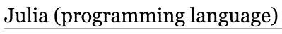
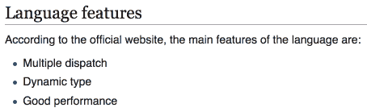
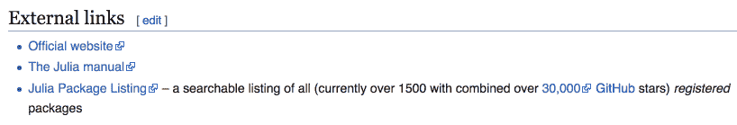
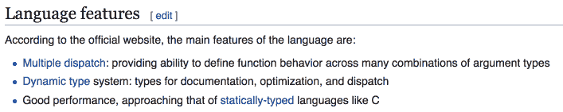
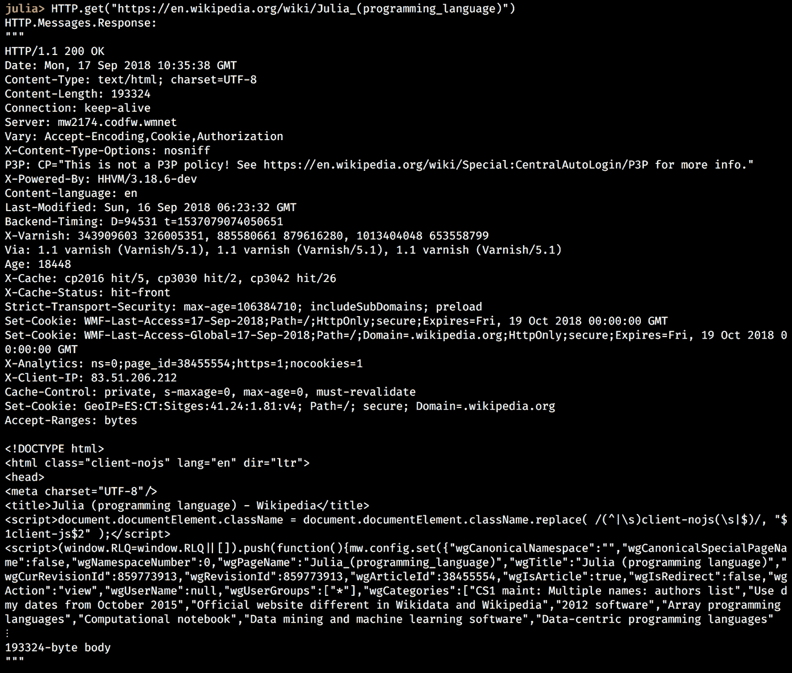
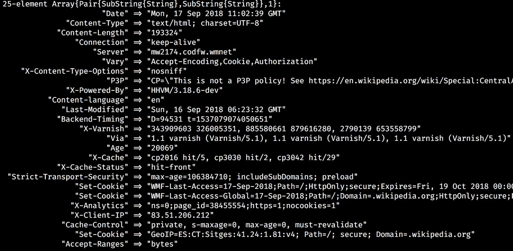
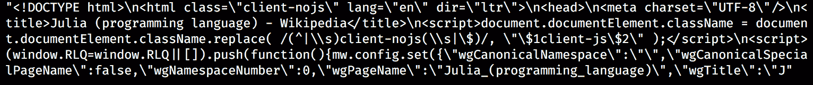
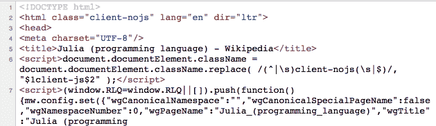
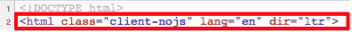
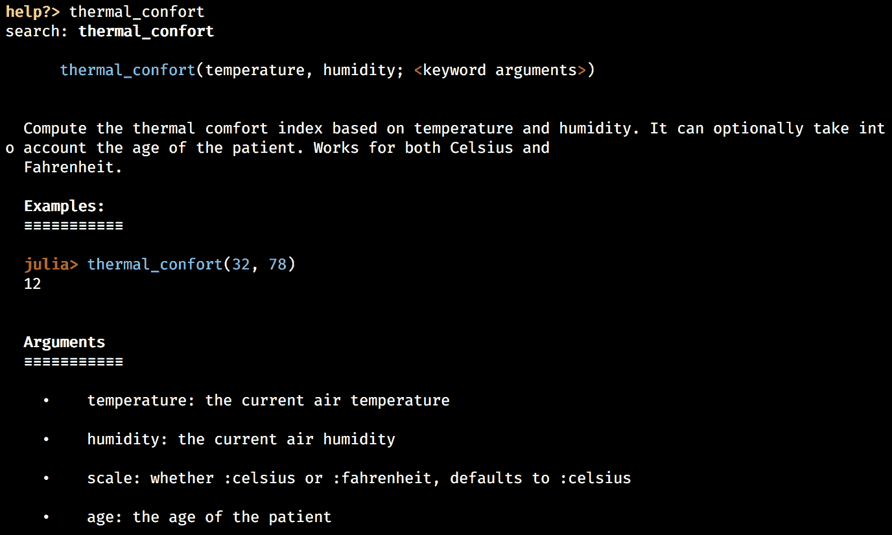

# 设置 Wiki 游戏

我希望你现在对 Julia 感到兴奋。友好、表达丰富且直观的语法，强大的 **read-eval-print 循环**（**REPL**），出色的性能，以及内置和第三方库的丰富性，对于数据科学（尤其是编程）来说是一个颠覆性的组合。事实上，仅仅在两个入门章节中，我们就能够掌握语言的基础，并配置一个足够强大的数据科学环境来分析 Iris 数据集，这相当令人惊讶——恭喜，我们做得很好！

但我们实际上才刚刚开始。我们奠定的基础现在足够强大，可以让我们使用 Julia 开发几乎任何类型的程序。难以置信吗？好吧，这里是证据——在接下来的三个章节中，我们将使用 Julia 开发一个基于网页的游戏！

它将遵循互联网上著名的 *六度分隔 Wikipedia* 的叙事。如果你从未听说过它，其想法是任何两篇维基百科文章都可以通过页面上的链接连接起来，只需点击六次或更少。它也被称为 **六度分隔**。

如果你在想这与 Julia 有什么关系，这是一个有趣的理由来学习数据挖掘和网页抓取，并且更多地了解这门语言，将我们新获得的知识应用到构建网页应用中。

在本章中，我们将奠定网页抓取的基础。我们将探讨在客户端-服务器架构中如何在网络上发出请求，以及如何使用 `HTTP` 包抓取网页。我们将学习关于 HTML 文档、HTML 和 CSS 选择器，以及 `Gumbo`，Julia 的 HTML 解析器。在这个过程中，我们将在 REPL 中实验更多代码，并了解语言的其他关键特性，如字典、错误处理、函数和条件语句。我们还将设置我们的第一个 Julia 项目。

本章我们将涵盖以下主题：

+   网页抓取是什么以及它是如何用于数据采集的

+   如何使用 Julia 发出请求和抓取网页

+   了解 `Pair` 类型

+   了解字典，这是 Julia 中更灵活的数据结构之一

+   异常处理，帮助我们捕获代码中的错误

+   函数，Julia 的基本构建块和最重要的代码单元之一——我们将学习如何定义和使用它们来创建可重用、模块化的代码

+   一些有用的 Julia 技巧，例如管道操作符和短路评估

+   使用 `Pkg` 设置 Julia 项目

# 技术要求

Julia 包生态系统正在持续发展中，并且每天都有新的包版本发布。大多数时候，这是一个好消息，因为新版本带来了新功能和错误修复。然而，由于许多包仍然处于测试版（版本 0.x），任何新版本都可能引入破坏性更改。因此，书中展示的代码可能会停止工作。为了确保您的代码能够产生与书中描述相同的结果，建议使用相同的包版本。以下是本章使用的外部包及其具体版本：

```py
Gumbo@v0.5.1
HTTP@v0.7.1
IJulia@v1.14.1
OrderedCollections@v1.0.2
```

为了安装特定版本的包，您需要运行：

```py
pkg> add PackageName@vX.Y.Z 
```

例如：

```py
pkg> add IJulia@v1.14.1
```

或者，您也可以通过下载章节提供的`Project.toml`文件并使用`pkg>`实例化来安装所有使用的包：

```py
julia> download("https://raw.githubusercontent.com/PacktPublishing/Julia-Programming-Projects/master/Chapter03/Project.toml", "Project.toml")
pkg> activate . 
pkg> instantiate
```

# 通过网络爬虫进行数据采集

使用软件从网页中提取数据的技术称为**网络爬虫**。它是数据采集的重要组件，通常通过称为**网络爬虫**的程序实现。数据采集或数据挖掘是一种有用的技术，常用于数据科学工作流程中，从互联网上收集信息，通常是从网站（而不是 API）上，然后使用各种算法对数据进行处理，以达到不同的目的。

在非常高的层面上，这个过程涉及对网页发出请求，获取其内容，解析其结构，然后提取所需的信息。这可能包括图像、文本段落或包含股票信息和价格的表格数据，例如——几乎任何在网页上存在的内容。如果内容分布在多个网页上，爬虫还会提取链接，并自动跟随它们以拉取其余页面，反复应用相同的爬取过程。

网络爬虫最常见的使用是用于网络索引，如 Google 或 Bing 等搜索引擎所做的那样。在线价格监控和价格比较、个人数据挖掘（或联系爬取）、在线声誉系统，以及产品评论平台，都是网络爬虫的其他常见用例。

# 网络工作原理——快速入门

在过去的十年里，互联网已经成为我们生活的一个基本组成部分。我们中的大多数人都广泛地使用它来获取大量的信息，日复一日。无论是搜索“rambunctious”（喧闹且缺乏自律或纪律），在社交网络上与朋友保持联系，在 Instagram 上查看最新的美食餐厅，在 Netflix 上观看热门电影，还是阅读关于 Attitogon（多哥的一个地方，那里的人们练习巫毒教）的维基百科条目——所有这些，尽管性质不同，但基本上都以相同的方式运作。

一个连接到互联网的设备，无论是使用 Wi-Fi 的计算机还是连接到移动数据网络的智能手机，以及一个用于访问网络的程序（通常是一个 Web 浏览器，如 Chrome 或 Firefox，也可以是专门的程序，如 Facebook 或 Netflix 的移动应用），代表*客户端*。在另一端是*服务器*——一个存储信息的计算机，无论是以网页、视频还是整个 Web 应用的形式。

当客户端想要访问服务器上的信息时，它会发起一个*请求*。如果服务器确定客户端有权访问资源，信息的一个副本将从服务器下载到客户端，以便显示。

# 发送 HTTP 请求

**超文本传输协议**（**HTTP**）是一种用于在网络上传输文档的通信协议。它是为了在 Web 浏览器和 Web 服务器之间进行通信而设计的。HTTP 实现了标准的客户端-服务器模型，其中客户端打开一个连接并发出请求，然后等待响应。

# 了解 HTTP 方法

HTTP 定义了一组请求方法，用于指示对给定资源要执行的操作。最常见的方法是`GET`，它的目的是从服务器检索数据。当通过链接在互联网上导航时使用。`POST`方法请求服务器接受一个包含的数据有效负载，通常是提交网页表单的结果。还有一些其他方法，包括`HEAD`、`PUT`、`DELETE`、`PATCH`等——但它们使用较少，并且客户端和 Web 服务器支持较少。由于我们不需要它们进行我们的网络爬虫，所以不会涉及这些。

如果你对它们感兴趣，可以在[`developer.mozilla.org/en-US/docs/Web/HTTP/Methods`](https://developer.mozilla.org/en-US/docs/Web/HTTP/Methods)上阅读有关内容。

# 理解 HTTPS

**HTTP 安全**（**HTTPS**）基本上是在加密连接上运行的 HTTP。它最初是一种主要用于在互联网上处理支付和传输敏感企业信息的替代协议。但近年来，它已经开始得到广泛的使用，主要公司推动在互联网上用 HTTPS 替换普通的 HTTP 连接。在我们的讨论中，HTTP 和 HTTPS 可以互换使用。

# 理解 HTML 文档

为了从获取的网页中提取数据，我们需要隔离和操作包含所需信息的结构元素。这就是为什么在执行网络爬取时，对网页通用结构的了解很有帮助。如果你之前进行过网络爬取，可能使用的是不同的编程语言，或者如果你对 HTML 文档了解足够多，可以自由跳过这一部分。另一方面，如果你是新手或者只是需要快速复习，请继续阅读。

**超文本标记语言（HTML**）是创建网页和网页应用的黄金标准。HTML 与 HTTP 协议相辅相成，该协议用于在互联网上传输 HTML 文档。

HTML 页面的构建块是**HTML 元素**。它们提供了网页的内容和结构。它们可以通过嵌套来定义彼此之间的复杂关系（如父元素、子元素、兄弟元素、祖先元素等）。HTML 元素通过*标签*表示，标签写在大括号之间（`<tag>...</tag>`）。官方 W3C 规范定义了大量的此类标签，代表从标题和段落到列表、表单、链接、图片、引语等一切内容。

为了让您有一个概念，以下是如何在 Julia 的维基百科页面[`en.wikipedia.org/wiki/Julia_(programming_language)`](https://en.wikipedia.org/wiki/Julia_(programming_language))上用 HTML 表示主要标题的示例：

```py
<h1>Julia (programming language)</h1> 
```

在现代浏览器中，这段 HTML 代码会呈现如下：



一个更详细的例子可以展示一个嵌套结构，如下所示：

```py
<div> 
    <h2>Language features</h2> 
    <p>According to the official website, the main features of the language are:</p> 
    <ul> 
           <li>Multiple dispatch</li> 
           <li>Dynamic type sytem</li> 
           <li>Good performance</li> 
    </ul> 
</div> 
<h2>), a paragraph of text (<p>), and an unordered list (<ul>), with three list items (<li>), all within a page section (<div>):
```



# HTML 选择器

HTML 的目的是提供内容和结构。这就是我们传达任何类型信息所需的一切，无论信息多么复杂。然而，随着计算机和网页浏览器的变得更加强大，以及网页的使用变得更加普遍，用户和开发者想要更多。他们要求扩展 HTML，以便包括美丽的格式（设计）和丰富的行为（交互性）。

正因如此，**层叠样式表（CSS**）被创建出来——一种定义 HTML 文档设计的样式语言。此外，JavaScript 也成为了客户端编程语言的首选，为网页增加了交互性。

CSS 和 JavaScript 提供的样式规则和交互功能与定义良好的 HTML 元素相关联。也就是说，样式和交互必须明确针对相关的 HTML 文档中的元素。例如，一个 CSS 规则可以针对页面的主要标题——或者一个 JavaScript 验证规则可以针对登录表单中的文本输入。如果您将网页视为一个结构化的 HTML 元素集合，这种针对是通过*选择*（子集合）元素来实现的。

选择元素可以通过简单地识别 HTML 标签的类型和结构（层次结构）来完成。在先前的例子中，我们查看如何表示 Julia 的功能列表时，我们可以通过指定一个层次结构如`div > ul > li`来选择所有列表项（`<li>`元素），这表示所有嵌套在`ul`元素中的`li`元素，而`ul`元素又嵌套在`div`元素中。这些被称为**HTML 选择器**。

然而，这种方法有其局限性。一方面，当处理大型、复杂且深度嵌套的 HTML 文档时，我们必须处理同样复杂的层次结构，这是一项繁琐且容易出错的任务。另一方面，这种方法可能不足以提供足够的特定性，使我们能够选择我们想要的目标元素。例如，在相同的 Julia 维基百科页面上，我们如何区分功能列表和外部链接列表？它们都有相似的结构。

Julia 维基百科页面上的 **外部链接** 列表看起来是这样的：



**语言功能** 部分有类似的结构：



两个 HTML 元素在结构上相同的事实使得单独选择语言功能列表项变得困难。

# 学习 HTML 属性

这就是 HTML 属性发挥作用的地方。这些是键值对，它们增强了 HTML 标签，提供了额外信息。例如，为了定义一个链接，我们将使用 `<a>` 标签——`<a>This is a link</a>`。

但显然，这还不够。如果这是一个链接，它链接到什么？作为开发者，我们需要提供有关链接位置的一些额外信息。这是通过添加带有相应值的 `href` 属性来完成的：

```py
<a href="https://julialang.org/">This is a link to Julia's home page</a>
```

哎呀，现在我们说到点子上了！一个超级方便的链接到 Julia 的主页。

通常，所有属性都可以在选择 HTML 元素时使用。但并非所有属性都同样有用。其中最重要的可能是 `id` 属性。它允许我们为元素分配一个唯一的标识符，然后以非常高效的方式引用它。另一个重要的属性是 `class`，它被广泛用于 CSS 样式规则。

这就是我们之前的例子添加额外属性后的样子：

```py
<a href="https://julialang.org/" id="julia_link" class="external_link">This is a link to Julia's home page</a>
```

# 学习 CSS 和 JavaScript 选择器

从历史上看，JavaScript 最初使用基于 `id` 属性和 HTML 元素（标签）名称的选择器。后来，CSS 规范带来了一组更强大的选择器，不仅包括 `class`、`id` 和标签，还包括属性及其值、元素的状态（如 `focused` 或 `disabled`），以及更具体的元素层次结构，它考虑了关系。

这里有一些可以用来定位之前讨论的 `<a>` 标签的 CSS 选择器示例：

+   `#julia_link` 是 `id` 属性的选择器（`#`）

+   `.external_link` 是 `class` 属性（`.`）的选择器

+   `a` 是 `<a>` 标签的选择器

+   `a[href*="julialang.org"]` 将选择所有具有包含 `"julialang.org"` 的 `href` 属性的 `<a>` 标签

你可以在[`developer.mozilla.org/en-US/docs/Web/CSS/CSS_Selectors`](https://developer.mozilla.org/en-US/docs/Web/CSS/CSS_Selectors)了解更多关于 CSS 选择器的信息。这个资源值得保留在身边，因为网络爬虫在很大程度上依赖于 CSS 选择器，正如我们将在下一章中看到的。

# 理解链接的结构

在技术术语中被称为**统一资源定位符**（**URLs**）的链接，是一系列字符，它们唯一地标识了互联网上的资源。它们非正式地被称为**网页地址**。有时你可能看到它们被称为**统一资源标识符**（**URIs**）。

在我们之前的例子中，Julia 的维基百科网页可以通过 URL [`en.wikipedia.org/wiki/Julia_(programming_language)`](https://en.wikipedia.org/wiki/Julia_(programming_language)) 访问。这个 URL 指的是资源 `/wiki/Julia_(programming_language)`，其表示形式，作为一个 HTML 文档，可以通过 HTTPS 协议（`https:`）从域名是 `wikipedia.org` 的网络主机请求。（哇，这听起来很复杂，但现在你可以理解请求互联网上网页的过程是多么复杂了）。

因此，一个常见的 URL 可以分解为以下部分——`scheme://host/path?query#fragment`。

例如，如果我们查看[`en.wikipedia.org/wiki/Julia_(programming_language)?uselang=en#Interaction`](https://en.wikipedia.org/wiki/Julia_(programming_language)?uselang=en#Interaction)，我们有`https`作为`scheme`，`en.wikipedia.org`作为`host`，`/wiki/Julia_(programming_language)`作为`path`，`?uselang=en`作为`query`，最后，`#Interaction`作为`fragment`。

# 从 Julia 访问互联网

现在你已经很好地理解了如何通过客户端-服务器交互在互联网上访问网页，让我们看看我们如何使用 Julia 来实现这一点。

最常见的网络客户端是网络浏览器——如 Chrome 或 Firefox 这样的应用程序。然而，这些是为人类用户设计的，它们使用花哨的样式 UI 和复杂的交互来渲染网页。虽然可以通过网络浏览器手动进行网络爬取，但最有效和可扩展的方式是通过完全自动化的、软件驱动的流程。尽管网络浏览器可以被自动化（例如使用来自 [`www.seleniumhq.org`](https://www.seleniumhq.org) 的 Selenium），但这是一项更困难、更容易出错且资源密集的任务。对于大多数用例，首选的方法是使用专门的 HTTP 客户端。

# 使用 HTTP 包进行请求

`Pkg`，Julia 的内置包管理器，提供了对优秀的 `HTTP` 包的访问。它暴露了构建网络客户端和服务器的高级功能——我们将广泛使用它。

正如你已经习惯的，额外的功能只需两个命令——`pkg> add HTTP` 和 `julia> using HTTP`。

回想一下上一节关于 HTTP 方法的讨论；最重要的方法是 `GET`，用于从服务器请求资源，以及 `POST`，它将数据有效负载发送到服务器并接受响应。`HTTP` 包暴露了一组匹配的函数——我们可以访问 `HTTP.get`、`HTTP.post`、`HTTP.delete`、`HTTP.put` 等等。

假设我们想要请求朱莉娅的维基百科页面。我们需要的只是页面的 URL 和 `HTTP.get` 方法：

```py
julia> HTTP.get("https://en.wikipedia.org/wiki/Julia_(programming_language)") 
```

结果将是一个 `Response` 对象，它代表了朱莉娅的维基百科页面及其所有细节。REPL 显示了头部和响应主体的前几行，其余部分被截断：



截图显示了我们所接收的 `HTTP.Messages.Response` 对象的详细信息——HTTP 头部的列表和响应主体的第一部分。让我们确保我们将其保存在变量中，以便稍后引用。记住，Julia 将上一次计算的结果暂时存储在 `ans` REPL 变量中，所以让我们从那里获取：

```py
julia> resp = ans 
```

# 处理 HTTP 响应

在接收和处理请求后，服务器会发送一个 HTTP 响应消息。这些消息具有标准化的结构。它们包含大量信息，其中最重要的部分是状态码、头信息和主体。

# HTTP 状态码

状态码是一个三位整数，其中第一位数字表示类别，而接下来的两位数字用于定义子类别。它们如下：

+   **1XX - 信息性**: 请求已接收。这表示有一个临时响应。

+   **2XX - 成功**：这是最重要的响应状态，表示请求已被成功接收、理解和接受。这是我们网络挖掘脚本所寻找的。

+   **3XX - 重定向**：这类状态码表示客户端必须采取额外行动。这通常意味着必须进行额外的请求才能到达资源，因此我们的脚本将不得不处理这种情况。我们还需要积极防止循环重定向。在我们的项目中，我们不会处理这种复杂的情况，但在实际应用中，3XX 状态码将需要根据子类别进行专门处理。

维基百科提供了关于各种 3XX 状态码及其每种情况下应采取的操作的良好描述：[`en.wikipedia.org/wiki/List_of_HTTP_status_codes#3xx_Redirection`](https://en.wikipedia.org/wiki/List_of_HTTP_status_codes#3xx_Redirection)。

+   **4XX - 客户端错误**：这意味着我们在发送请求时可能犯了一个错误。可能是 URL 错误，资源无法找到（`404`），或者我们可能无法访问页面（`401` 和 `403` 状态码）。4XX 响应代码有很多，类似于 3XX 代码，我们的程序应该处理各种情况，以确保请求最终成功。

+   **5XX - 服务器错误**：恭喜你，你在服务器上找到了或导致了问题！根据实际的状态码，这可能或可能不是可操作的。`503`（服务不可用）或`504`（网关超时）是相关的，因为它们表明我们应该稍后再尝试。

# 学习 HTTP 头信息

HTTP 头信息允许客户端和服务器传递额外的信息。我们不会深入讨论头信息的传输细节，因为 Julia 的`HTTP`库帮我们避免了处理原始头信息的麻烦。然而，有一些值得提及，因为它们对于网络爬虫很重要：

+   `Age`、`Cache-Control`和`Expires`代表页面的有效性，可以用来设置数据刷新时间。

+   `Last-Modified`、`Etag`和`If-Modified-Since`可用于内容版本控制，以检查页面自上次检索以来是否已更改。

+   `Cookie`和`Set-Cookie`必须使用，以便读取和写入与服务器正确通信所需的 cookie。

+   `Content-*`系列头信息，例如`Content-Disposition`、`Content-Length`、`Content-Type`、`Content-Encoding`等，在处理和验证响应信息时非常有用。

查看 https://developer.mozilla.org/en-US/docs/Web/HTTP/Headers 和 https://en.wikipedia.org/wiki/List_of_HTTP_header_fields 以获取关于 HTTP 头信息的完整讨论。

# HTTP 消息体

消息体，网络爬虫最重要的部分和原因（网页本身的内容），实际上是响应的一个可选部分。是否存在消息体、其属性及其大小由`Content-*`系列头信息指定。

# 理解 HTTP 响应

`HTTP.get`调用的结果是对象，它紧密地反映了原始 HTTP 响应。该包通过提取原始 HTTP 数据并将其整洁地设置在数据结构中，使我们的生活变得更简单，这使得操作它变得轻而易举。

让我们看看它的属性（或 Julia 语言中的*字段*）：

```py
julia> fieldnames(typeof(resp)) 
(:version, :status, :headers, :body, :request) 
```

`fieldnames`函数接受一个类型作为其参数，并返回一个包含字段（或属性）名称的元组。为了获取值的类型，我们可以使用`typeof`函数，就像前面的例子一样。

对了！到如今，`status`、`headers`和`body`字段应该听起来很熟悉。`version`字段表示 HTTP 协议的版本（响应第一行中的`HTTP/1.1`部分）。今天互联网上的大多数 Web 服务器都使用协议的 1.1 版本，但一个新的主要版本 2.0 几乎准备广泛部署。最后，`request`字段包含触发当前响应的`HTTP.Messages.Request`对象的引用。

# 状态码

让我们更仔细地看看状态码：

```py
julia> resp.status 200 
```

当然，我们得到了一个有效的响应，这通过`200`状态码得到了确认。

# 头信息

关于头信息呢？如前所述，它们包含指示消息体是否存在的重要信息。让我们来看看：

```py
julia> resp.headers 
```

输出如下：



您的输出在有些值上可能会有所不同，但应该很容易找到我们之前提到的关键 HTTP 头。`Content-Length`确认了响应体的存在。`Content-Type`提供了关于如何解释消息体编码的信息（它是一个使用 UTF-8 字符编码的 HTML 文档）。我们可以使用`Last-Modified`值来优化我们的网络爬虫的缓存和更新频率。

# 消息体

既然我们已经确认我们有一个响应体，让我们看看它：

```py
julia> resp.body 
193324-element Array{UInt8,1}: 
 0x3c 
 0x21 
 0x44  
# ... output truncated ...  
```

哎呀，这看起来不像我们预期的网页。不过别担心，这些是原始响应的字节——我们可以轻松地将它们转换为可读的 HTML 字符串。记得我提到过学习字符串时的`String`方法吗？嗯，这就是它派上用场的地方：

```py
julia> resp_body = String(resp.body) 
```

您的 REPL 现在应该正在输出一个代表 Julia 维基百科页面的长 HTML 字符串。

如果我们查看前`500`个字符，我们开始看到熟悉的模式：

```py
julia> resp_body[1:500] 
```

输出如下：



确实，使用 Chrome 的查看页面源代码将揭示相同的 HTML：



已经确认了——我们刚刚迈出了建立我们的网络爬虫的第一步！

# 了解关于`Pair`的知识

当查看响应头时，您可能已经注意到它的类型是一个`Array`的`Pair`对象：

```py
julia> resp.headers 
25-element Array{Pair{SubString{String},SubString{String}},1} 
```

`Pair`代表一个 Julia 数据结构及其对应的类型。`Pair`包含一些值，通常用于引用键值关系。两个元素的类型决定了`Pair`的具体类型。

例如，我们可以用以下方式构造一个`Pair`：

```py
julia> Pair(:foo, "bar") 
:foo => "bar" 
```

如果我们检查它的类型，我们会看到它是一个`Symbol`和`String`的`Pair`：

```py
julia> typeof(Pair(:foo, "bar")) 
Pair{Symbol,String} 
```

我们也可以通过使用`x => y`字面量表示法来创建`Pairs`：

```py
julia> 3 => 'C' 
3 => 'C' 

julia> typeof(3 => 'C') 
Pair{Int64,Char} 

```

`=>`双箭头应该很熟悉。这是我们之前在响应头中看到的，例如：

```py
"Content-Type" => "text/html; charset=UTF-8"
```

显然，一旦创建，就可以访问存储在`Pair`中的值。一种方法是通过索引它：

```py
julia> p = "one" => 1 
"one" => 1 

julia> p[1] 
"one" 

julia> p[2] 
1 

```

我们也可以访问`first`和`second`字段，分别获取`first`和`second`值：

```py
julia> p.first 
"one" 

julia> p.second 
1 
```

就像元组一样，`Pairs`是不可变的，所以这不会起作用：

```py
julia> p.first = "two" 
ERROR: type Pair is immutable 

julia> p[1] = "two" 
ERROR: MethodError: no method matching setindex!(::Pair{String,Int64} 
```

`Pairs`是 Julia 的构建块之一，可以用于创建字典，这是最重要的类型之一和数据结构。

# 字典

字典，称为`Dict`，是 Julia 最强大和多功能的数据结构之一。它是一个关联集合——它将键与值相关联。您可以将`Dict`视为查找表实现——给定一个单一的信息，即键，它将返回相应的值。

# 构建字典

创建一个空的`Dict`实例就像以下这样：

```py
julia> d = Dict() 
Dict{Any,Any} with 0 entries 
```

大括号内的信息`{Any,Any}`表示`Dict`的键和值的类型。因此，`Dict`本身的具体类型由其键和值的类型定义。编译器将尽最大努力从其部分类型推断集合的类型。在这种情况下，由于字典为空，无法推断信息，因此 Julia 默认为`Any`和`Any`。

`{Any,Any}`类型的`Dict`允许我们添加任何类型的数据，不加区分。我们可以使用`setindex!`方法向集合中添加新的键值对：

```py
julia> setindex!(d, "World", "Hello") 
Dict{Any,Any} with 1 entry: 
  "Hello" => "World" 
```

然而，向`Dict`中添加值通常使用方括号符号（这与对其索引类似，同时执行赋值操作）：

```py
julia> d["Hola"] = "Mundo" 
"Mundo"  
```

到目前为止，我们只添加了`Strings`——但正如我所说的，因为我们的`Dict`接受任何类型的键和值，所以没有约束：

```py
julia> d[:speed] = 6.4 
6.4 
```

现在是我们的`Dict`：

```py
julia> d 
Dict{Any,Any} with 3 entries: 
  "Hello" => "World" 
  :speed  => 6.4 
  "Hola"  => "Mundo" 
```

注意，键`=>`值对不是我们添加它们的顺序。在 Julia 中，`Dict`不是有序集合。我们将在接下来的几段中更多地讨论这一点。

如果键已存在，相应的值将被更新，返回新值：

```py
julia> d["Hello"] = "Earth" "Earth" 
```

这是我们的更新后的`Dict`。注意，现在`"Hello"`指向`"Earth"`而不是`"World"`：

```py
julia> d 
Dict{Any,Any} with 3 entries: 
  "Hello" => "Earth" 
  :speed  => 6.4 
  "Hola"  => "Mundo"   
```

如果在实例化`Dict`时提供一些初始数据，编译器将能够更好地识别类型：

```py
julia> dt = Dict("age" => 12) 
Dict{String,Int64} with 1 entry: 
  "age" => 12 
```

我们可以看到，`Dict`的类型现在限制了键必须是`String`，值必须是`Int`——这是我们用来实例化`Dict`的`Pair`的类型。现在，如果传递了不同类型的键或值，Julia 将尝试转换它——如果失败，将发生错误：

```py
julia> dt[:price] = 9.99 
MethodError: Cannot `convert` an object of type Symbol to an object of type String 
```

在某些情况下，自动转换是有效的：

```py
julia> dx = Dict(1 => 11) 
Dict{Int64,Int64} with 1 entry: 
  1 => 11 
julia> dx[2.0] = 12 
12

```

Julia 已静默地将`2.0`转换为相应的`Int`值：

```py
julia> dx 
Dict{Int64,Int64} with 2 entries: 
  2 => 12 
  1 => 11 
```

但这并不总是有效：

```py
julia> dx[2.4] = 12 
InexactError: Int64(Int64, 2.4) 
```

我们可以在`Dict`中存储随机复杂的数据，Julia 会正确推断其类型：

```py
 julia> clients_purchases = Dict( 
       "John Roche" => ["soap", "wine", "apples", "bread"], 
       "Merry Lou"  => ["bottled water", "apples", "cereals", "milk"] 
       ) 
Dict{String,Array{String,1}} with 2 entries: 
  "John Roche" => ["soap", "wine", "apples", "bread"] 
  "Merry Lou"  => ["bottled water", "apples", "cereals", "milk"] 
```

您也可以在构建时指定和约束`Dict`的类型，而不是让 Julia 来决定：

```py
julia> dd = Dict{String,Int}("" => 2.0) 
Dict{String,Int64} with 1 entry: 
  "x" => 2 
```

在这里，我们可以看到类型定义如何覆盖了`2.0`值（这是一个`Float64`类型，当然，如前例所示，Julia 已将`2.0`转换为它的整数等价物）。

我们还可以使用`Pairs`来创建`Dict`：

```py
julia> p1 = "a" => 1 
"a"=>1 
julia> p2 = Pair("b", 2) 
"b"=>2 
julia> Dict(p1, p2) 
Dict{String,Int64} with 2 entries: 
  "b" => 2 
  "a" => 1 
```

我们还可以使用`Pair`的数组：

```py
julia> Dict([p1, p2]) 
Dict{String,Int64} with 2 entries: 
  "b" => 2 
  "a" => 1 
```

我们可以用元组的数组来做同样的事情：

```py
julia> Dict([("a", 5), ("b", 10)]) 
Dict{String,Int64} with 2 entries: 
  "b" => 10 
  "a" => 5 
```

最后，可以使用列表推导式来构建`Dict`：

```py
julia> using Dates 
julia> Dict([x => Dates.dayname(x) for x = (1:7)]) 
Dict{Int64,String} with 7 entries: 
  7 => "Sunday" 
  4 => "Thursday" 
  2 => "Tuesday" 
  3 => "Wednesday" 
  5 => "Friday" 
  6 => "Saturday" 
  1 => "Monday" 
```

您的输出可能会有所不同，因为键可能不会按`1`到`7`的顺序排列。这是一个非常重要的观点——如前所述，在 Julia 中，`Dict`是无序的。

# 有序字典

如果您需要您的字典保持有序，可以使用`OrderedCollections`包（[`github.com/JuliaCollections/OrderedCollections.jl`](https://github.com/JuliaCollections/OrderedCollections.jl)），特别是`OrderedDict`：

```py
pkg> add OrderedCollections 
julia> using OrderedCollections, Dates 
julia> OrderedDict(x => Dates.monthname(x) for x = (1:12)) 
DataStructures.OrderedDict{Any,Any} with 12 entries: 
  1  => "January" 
  2  => "February" 
  3  => "March" 
  4  => "April" 
  5  => "May" 
  6  => "June" 
  7  => "July" 
  8  => "August" 
  9  => "September" 
  10 => "October" 
  11 => "November" 
  12 => "December" 
```

现在元素是按照它们添加到集合中的顺序存储的（从 `1` 到 `12`）。

# 与字典一起工作

正如我们已经看到的，我们可以使用方括号符号索引 `Dict`：

```py
julia> d = Dict(:foo => 1, :bar => 2) 
Dict{Symbol,Int64} with 2 entries: 
  :bar => 2 
  :foo => 1 

julia> d[:bar] 
2 
```

尝试访问一个未定义的键将导致 `KeyError`，如下所示：

```py
julia> d[:baz] 
ERROR: KeyError: key :baz not found 
```

为了避免这种情况，我们可以检查键是否首先存在：

```py
julia> haskey(d, :baz) 
false 
```

作为一种替代方法，如果我们想在键不存在时也获取默认值，我们可以使用以下方法：

```py
julia> get(d, :baz, 0) 
0 
```

`get` 函数有一个更强大的双胞胎，`get!`，它也会将搜索到的键存储到 `Dict` 中，使用默认值：

```py
julia> d 
Dict{Symbol,Int64} with 2 entries: 
  :bar => 2 
  :foo => 1 

julia> get!(d, :baz, 100) 
100 

julia> d 
Dict{Symbol,Int64} with 3 entries: 
  :baz => 100 
  :bar => 2 
  :foo => 1 

julia> haskey(d, :baz) 
true  
```

如果你在想，函数名末尾的感叹号是有效的——它表示一个重要的 Julia 命名约定。这应该被视为一个警告，即使用该函数将修改其参数的数据。在这种情况下，`get!` 函数将添加 `:baz = 100` 的 `Pair` 到 `d` 的 `Dict` 中。

删除键值 `Pair` 只需调用 `delete!`（注意这里也有感叹号的存在）：

```py
julia> delete!(d, :baz) 
Dict{Symbol,Int64} with 2 entries: 
  :bar => 2 
  :foo => 1 

julia> haskey(d, :baz) 
false 
```

如请求所示，`:baz` 键及其对应值已经消失。

我们可以使用名为 `keys` 和 `values` 的函数请求键和值的集合。它们将返回它们底层集合的迭代器：

```py
julia> keys(d) 
Base.KeySet for a Dict{Symbol,Int64} with 2 entries. Keys: 
  :bar 
  :foo 

julia> values(d) 
Base.ValueIterator for a Dict{Symbol,Int64} with 2 entries. Values: 
  2 
  1 
```

使用 `collect` 获取相应的数组：

```py
julia> collect(keys(d)) 
2-element Array{Symbol,1}: 
 :bar 
 :foo 

julia> collect(values(d)) 
2-element Array{Int64,1}: 
 2 
 1 
```

我们可以将一个 `Dict` 与另一个 `Dict` 结合：

```py
julia> d2 = Dict(:baz => 3) 
Dict{Symbol,Int64} with 1 entry: 
  :baz => 3 

julia> d3 = merge(d, d2) 
Dict{Symbol,Int64} with 3 entries: 
  :baz => 3 
  :bar => 2 
  :foo => 1 
```

如果一些键在多个字典中存在，则将保留最后一个集合中的值：

```py
julia> merge(d3, Dict(:baz => 10)) 
Dict{Symbol,Int64} with 3 entries: 
  :baz => 10 
  :bar => 2 
  :foo => 1 
```

# 使用 HTTP 响应

在了解了 Julia 的字典数据结构之后，我们现在可以更仔细地查看 `resp` 的 `headers` 属性，我们的 `HTTP` 响应对象。

为了更容易访问各种标题，首先让我们将 `Pair` 数组转换为 `Dict`：

```py
julia> headers = Dict(resp.headers) 
Dict{SubString{String},SubString{String}} with 23 entries: 
"Connection"     => "keep-alive" 
  "Via"          => "1.1 varnish (Varnish/5.1), 1.1 varnish (Varni... 
  "X-Analytics"  => "ns=0;page_id=38455554;https=1;nocookies=1" 
#... output truncated... #
```

我们可以检查 `Content-Length` 值以确定是否有响应体。如果它大于 `0`，这意味着我们收到了一个 HTML 消息：

```py
julia> headers["Content-Length"] 
"193324" 
```

重要的是要记住，`headers` 字典中的所有值都是字符串，因此我们不能直接比较它们：

```py
julia> headers["Content-Length"] > 0 
ERROR: MethodError: no method matching isless(::Int64, ::String) 
```

我们需要首先将其解析为整数：

```py
julia> parse(Int, headers["Content-Length"]) > 0 
true 
```

# 操作响应体

之前，我们将响应体读入一个 `String` 并存储在 `resp_body` 变量中。它是一个长的 HTML 字符串，从理论上讲，我们可以使用 `Regex` 和其他字符串处理函数来查找和提取我们所需的数据。然而，这种方法将非常复杂且容易出错。在 HTML 文档中搜索内容最好的方法是使用 HTML 和 CSS 选择器。唯一的问题是这些选择器不作用于字符串——它们只对 **文档对象模型**（**DOM**）起作用。

# 构建页面 DOM 表示

DOM 代表 HTML 文档的内存结构。它是一种数据结构，允许我们以编程方式操作底层 HTML 元素。DOM 将文档表示为一个逻辑树，我们可以使用选择器来遍历和查询这个层次结构。

# 使用 Gumbo 解析 HTML

Julia 的`Pkg`生态系统提供了对`Gumbo`的访问，这是一个 HTML 解析库。提供 HTML 字符串后，`Gumbo`会将其解析成文档及其对应的 DOM。这个包是使用 Julia 进行网络爬取的重要工具，所以让我们添加它。

如往常一样，使用以下命令安装：

```py
pkg> add Gumbo 
julia> using Gumbo  
```

现在，我们已经准备好将 HTML 字符串解析成 DOM，如下所示：

```py
julia> dom = parsehtml(resp_body)
 HTML Document
```

`dom`变量现在引用了一个`Gumbo.HTMLDocument`，这是网页的内存中 Julia 表示。它是一个只有两个字段的简单对象：

```py
julia> fieldnames(typeof(dom)) 
(:doctype, :root)  
```

`doctype`代表 HTML 的`<!DOCTYPE html>`元素，这是维基百科页面使用的：

```py
julia> dom.doctype 
"html" 
```

现在，让我们关注`root`属性。这实际上是 HTML 页面的最外层元素——包含其余元素的`<html>`标签。它为我们提供了进入 DOM 的入口点。我们可以询问`Gumbo`它的属性：

```py
julia> dom.root.attributes 
Dict{AbstractString,AbstractString} with 3 entries: 
  "class" => "client-nojs" 
  "lang"  => "en" 
  "dir"   => "ltr" 
```

它是一个`Dict`，键代表 HTML 属性，值是属性的值。确实，它们与页面的 HTML 相匹配：



还有一个类似的`attrs`方法，它具有相同的作用：

```py
julia> attrs(dom.root) 
Dict{AbstractString,AbstractString} with 3 entries: 
  "class" => "client-nojs" 
  "lang"  => "en" 
  "dir"   => "ltr" 
```

当不确定时，我们可以使用`tag`方法来询问元素的名称：

```py
julia> tag(dom.root) 
:HTML 
```

`Gumbo`提供了一个`children`方法，它返回一个包含所有嵌套`HTMLElement`的数组。如果你直接执行`julia> children(dom.root)`，REPL 的输出将难以跟踪。`HTMLElement`的 REPL 表示是其 HTML 代码，对于具有许多子元素的最高层元素，它将填满许多终端屏幕。让我们使用`for`循环遍历子元素并仅显示它们的标签：

```py
julia> for c in children(dom.root) 
           @show tag(c) 
       end 
tag(c) = :head 
tag(c) = :body 
```

好多了！

由于子元素是集合的一部分，我们可以对它们进行索引：

```py
julia> body = children(dom.root)[2]; 
```

请注意分号（`;`）的用法。当在 REPL（Read-Eval-Print Loop，即交互式解释器）的语句末尾使用时，它会抑制输出（因此我们不会看到其他情况下会输出的非常长的`<body>` HTML 代码）。现在`body`变量将引用一个`HTMLElement{:body}`的实例：

```py
HTMLElement{:body}: 
<body class="mediawiki ltr sitedir-ltr mw-hide-empty-elt ns-0 ns-subject page-Julia_programming_language rootpage-Julia_programming_language skin-vector action-view"> 
# ... output truncated ...
```

我们需要的最后一个方法是`getattr`，它返回属性名称的值。如果元素没有定义该属性，它将引发一个`KeyError`：

```py
julia> getattr(dom.root, "class") 
"client-nojs" 

julia> getattr(dom.root, "href") # oops! 
ERROR: KeyError: key "href" not found 
```

询问`<html>`标签的`href`属性没有意义。果然，我们很快得到了一个`KeyError`，因为`href`不是这个`HTMLElement`的属性。

# 编码防御性

像之前的错误一样，当它是更大脚本的一部分时，有可能完全改变程序的执行，导致不希望的结果，甚至可能造成损失。一般来说，当程序执行过程中发生意外时，它可能会使软件处于错误状态，使得无法返回正确的值。在这种情况下，而不是继续执行并可能在整个执行堆栈中传播问题，最好通过抛出 `Exception` 明确通知调用代码关于这种情况。

许多函数，无论是 Julia 的核心函数还是第三方包中的函数，都很好地使用了错误抛出机制。检查你使用的函数的文档并查看它们抛出什么类型的错误是一个好习惯。在编程术语中，错误被称为异常。

就像 `getattr` 的情况一样，`Gumbo` 包的作者警告我们，尝试读取未定义的属性将导致 `KeyError` 异常。我们将很快学习如何通过在代码中捕获异常、获取有关问题的信息以及停止或允许异常进一步向上传播调用堆栈来处理异常。有时这是最好的方法，但我们不希望过度使用这种方法，因为以这种方式处理错误可能会消耗大量资源。处理异常比执行简单的数据完整性检查和分支要慢得多。

对于我们的项目，第一道防线是简单地检查属性是否确实定义在元素中。我们可以通过检索属性 `Dict` 的键并检查我们想要的键是否是集合的一部分来实现这一点。这是一个单行代码：

```py
julia> in("href", collect(keys(attrs(dom.root)))) 
false 
```

显然，`href` 不是 `<html>` 标签的属性。

使用这种方法，我们可以在尝试查找属性值之前轻松地编写逻辑来检查属性的存在。

# 管道操作符

阅读多层嵌套函数可能会对大脑造成负担。上一个例子 `collect(keys(attrs(dom.root)))` 可以使用 Julia 的管道操作符 `|>` 重新编写以提高可读性。

例如，以下代码片段嵌套了三个函数调用，每个内部函数都成为最外层函数的参数：

```py
julia> collect(keys(attrs(dom.root))) 
3-element Array{AbstractString,1}: 
 "class" 
 "lang" 
 "dir"
```

这可以通过使用管道操作符将函数链式调用重写以提高可读性。这段代码会产生完全相同的结果：

```py
julia> dom.root |> attrs |> keys |> collect 
3-element Array{AbstractString,1}: 
 "class" 
 "lang" 
 "dir" 
```

`|>` 操作符的作用是取第一个值的输出，并将其作为下一个函数的参数。所以 `dom.root |> attrs` 等同于 `attrs(dom.root)`。不幸的是，管道操作符仅适用于单参数函数。但它在清理代码、大幅提高可读性方面仍然非常有用。

对于更高级的管道功能，你可以查看 `Lazy` 包，特别是 `@>` 和 `@>>`，请参阅 [`github.com/MikeInnes/Lazy.jl#macros`](https://github.com/MikeInnes/Lazy.jl#macros)。

# 像专业人士一样处理错误

有时候，编写防御性代码可能不是解决方案。也许你的程序的关键部分需要从网络上读取文件或访问数据库。如果由于临时网络故障无法访问资源，在没有数据的情况下，你实际上真的无能为力。

# try...catch 语句

如果你确定你的代码中某些部分可能会因为超出你控制的条件（即*异常*条件——因此得名*异常*）而执行偏离轨道，你可以使用 Julia 的`try...catch`语句。这正是它的名字——你指示编译器*尝试*一段代码，如果由于问题而抛出异常，就*捕获*它。异常被捕获的事实意味着它不会在整个应用程序中传播。

让我们看看它是如何工作的：

```py
julia> try 
    getattr(dom.root, "href") 
catch 
    println("The $(tag(dom.root)) tag doesn't have a 'href' attribute.") 
end 
The HTML tag doesn't have a 'href' attribute. 
```

在这个例子中，一旦遇到错误，`try`分支中的代码执行就会在 exactly 那个点停止，并且立即在`catch`分支中继续执行。

如果我们按如下方式修改代码片段，就会更清晰：

```py
julia> try 
    getattr(dom.root, "href") 
    println("I'm here too") 
catch 
    println("The $(tag(dom.root)) tag doesn't have a 'href' attribute.") 
end 
The HTML tag doesn't have a 'href' attribute. 
```

新添加的行`println("I'm here too")`没有执行，正如消息没有输出的事实所证明的那样。

当然，如果没有抛出异常，事情就会变得清晰：

```py
julia> try 
getattr(dom.root, "class") 
    println("I'm here too") 
catch 
    println("The $(tag(dom.root)) tag doesn't have a 'href' attribute.") 
end 
I'm here too 
```

`catch`构造函数接受一个可选参数，即由`try`块抛出的`Exception`对象。这允许我们检查异常并根据其属性分支我们的代码。

在我们的例子中，`KeyError`异常是 Julia 内置的。当我们尝试访问或删除一个不存在的元素（例如`Dict`中的键或`HTMLElement`的属性）时，会抛出`KeyError`异常。所有`KeyError`实例都有一个键属性，它提供了有关缺失数据的信息。因此，我们可以使我们的代码更加通用：

```py
julia> try 
     getattr(dom.root, "href") 
catch ex 
    if isa(ex, KeyError)  
            println("The $(tag(dom.root)) tag doesn't have a '$(ex.key)' attribute.") 
    else  
           println("Some other exception has occurred") 
    end 
end 
The HTML tag doesn't have a 'href' attribute. 
```

在这里，我们将异常作为`ex`变量传递到`catch`块中。然后我们检查是否处理的是`KeyError`异常——如果是，我们使用这个信息通过访问`ex.key`字段来检索缺失的键来显示自定义错误。如果它是一种不同类型的异常，我们显示一个通用的错误消息：

```py
julia> try 
     error("Oh my!") 
catch ex 
    if isa(ex, KeyError)  
            println("The $(tag(dom.root)) tag doesn't have a '$(ex.key)' attribute.") 
    else  
           println("Some exception has occurred") 
    end 
end 
Some exception has occurred 
```

# finally 子句

在执行状态改变或使用文件或数据库等资源的代码中，通常需要在代码完成后进行一些清理工作（例如关闭文件或数据库连接）。这段代码通常会进入`try`分支——但是，如果抛出了异常会发生什么呢？

在这种情况下，`finally`子句就派上用场了。这可以在`try`之后或`catch`分支之后添加。`finally`块中的代码将被**保证**执行，无论是否抛出异常：

```py
julia> try 
    getattr(dom.root, "href") 
catch ex 
    println("The $(tag(dom.root)) tag doesn't have a '$(ex.key)' attribute.") 
finally 
    println("I always get called") 
end 
The HTML tag doesn't have a 'href' attribute. 
I always get called 
```

没有`catch`或`finally`的`try`是非法的：

```py
julia> try getattr(dom.root, "href") end syntax: try without catch or finally 
```

我们需要提供一个`catch`或`finally`块（或两者都提供）。

`try/catch/finally`块将返回最后评估的表达式，因此我们可以将其捕获到变量中：

```py
julia> result = try 
           error("Oh no!") 
       catch ex 
           "Everything is under control" 
        end 
"Everything is under control" 

julia> result 
"Everything is under control" 
```

# 在错误上抛出异常

作为开发者，当我们的代码遇到问题且不应继续执行时，我们也有创建和抛出异常的选项。Julia 提供了一系列内置异常，涵盖了多种用例。您可以在[`docs.julialang.org/en/stable/manual/control-flow/#Built-in-Exceptions-1`](https://docs.julialang.org/en/stable/manual/control-flow/#Built-in-Exceptions-1)上了解它们。

为了抛出异常，我们使用名为`throw`的函数。例如，如果我们想复制 Gumbo 的`getattr`方法引发的错误，我们只需调用以下操作：

```py
julia> throw(KeyError("href")) 
ERROR: KeyError: key "href" not found 
```

如果 Julia 提供的内置异常对于您的情况来说不够相关，该语言提供了一个通用的错误类型，即`ErrorException`。它接受一个额外的`msg`参数，该参数应提供更多关于错误本质的详细信息：

```py
julia> ex = ErrorException("To err is human, but to really foul things up you need a computer.") 
ErrorException("To err is human, but to really foul things up you need a computer.") 

julia> throw(ex) 
ERROR: To err is human, but to really foul things up you need a computer. 

julia> ex.msg 
"To err is human, but to really foul things up you need a computer." 
```

Julia 提供了抛出`ErrorException`的快捷方式，即`error`函数：

```py
julia> error("To err is human - to blame it on a computer is even more so.") 
ERROR: To err is human - to blame it on a computer is even more so. 
```

# 重新抛出异常

但如果我们意识到我们捕获的异常无法（或不应）由我们的代码处理怎么办？例如，假设我们预计会捕获一个可能缺失的属性，但结果我们得到了一个`Gumbo`解析异常。这种问题必须在上层的执行堆栈中处理，可能尝试再次获取网页并重新解析，或者为管理员记录一个错误信息。

如果我们自行`throw`异常，初始错误的来源（堆栈跟踪）将会丢失。对于这种情况，Julia 提供了`rethrow`函数，可以使用如下方式：

```py
julia> try 
           Dict()[:foo] 
       catch ex 
           "nothing to see here" 
       end 
"nothing to see here" 
```

如果我们简单地自行抛出异常，这就是会发生的情况：

```py
julia> try 
           Dict()[:foo] 
       catch ex 
           throw(ex) 
       end 
ERROR: KeyError: key :foo not found 
Stacktrace: 
 [1] top-level scope at REPL 
```

我们抛出`KeyError`异常，但异常的来源丢失；它看起来像是在我们的代码的`catch`块中产生的。与以下示例进行对比，其中我们使用了`rethrow`：

```py
julia> try 
           Dict()[:foo] 
       catch ex 
            rethrow(ex) 
       end 
ERROR: KeyError: key :foo not found 
Stacktrace: 
 [1] getindex(::Dict{Any,Any}, ::Symbol) at ./dict.jl:474 
 [2] top-level scope at REPL[140]
```

原始异常正在被重新抛出，而不改变堆栈跟踪。现在我们可以看到异常起源于`dict.jl`文件。

# 学习函数

在我们编写第一个完整的 Julia 程序（网络爬虫）之前，我们还需要进行另一个重要的转折。这是最后一个，我保证。

随着我们的代码变得越来越复杂，我们应该开始使用函数。REPL 由于其快速输入输出反馈循环，非常适合探索性编程，但对于任何非平凡的软件，使用函数是最佳选择。函数是 Julia 的核心部分，它促进了可读性、代码重用和性能。

在 Julia 中，一个函数是一个对象，它接受一个值元组作为参数并返回一个值：

```py
julia> function add(x, y) 
           x + y 
       end 
add (generic function with 1 method) 
```

对于函数声明，还有一个紧凑的*赋值形式*：

```py
julia> add(x, y) = x + y 
add (generic function with 1 method) 
```

这种第二种形式非常适合简单的单行函数。

调用一个函数只是简单地调用它的名字并传递所需的参数：

```py
julia> add(1, 2) 
3 
```

# 返回关键字

如果你有过编程经验，你可能会惊讶地看到，尽管我们没有在函数体中放置任何显式的`return`语句，调用`add`函数仍然可以正确地返回预期的值。在 Julia 中，函数会自动返回最后一个评估的表达式的结果。这通常是函数体中的最后一个表达式。

明确的`return`关键字也是可用的。使用它将导致函数立即退出，并将传递给`return`语句的值返回：

```py
julia> function add(x, y) 
           return "I don't feel like doing math today" 
           x + y 
       end 
add (generic function with 1 method) 

julia> add(1, 2) 
"I don't feel like doing math today" 
```

# 返回多个值

虽然 Julia 不支持返回多个值，但它确实提供了一个非常接近实际操作的巧妙技巧。任何函数都可以返回一个元组。由于元组的构造和析构非常灵活，这种方法非常强大且易于阅读：

```py
julia> function addremove(x, y) 
           x+y, x-y 
       end 
addremove (generic function with 1 method) 

julia> a, b = addremove(10, 5) 
(15, 5) 

julia> a 
15 

julia> b 
5 
```

在这里，我们定义了一个名为`addremove`的函数，它返回一个包含两个整数的元组。我们可以通过简单地给每个元素分配一个变量来提取元组内的值。

# 可选参数

函数参数可以有合理的默认值。在这种情况下，Julia 允许定义默认值。当它们被提供时，相应的参数在每次调用时不再需要显式传递：

```py
julia> function addremove(x=100, y=10) 
           x+y, x-y 
       end 
addremove (generic function with 3 methods) 
```

这个函数为`x`和`y`都设置了默认值。我们可以不传递任何参数来调用它：

```py
julia> addremove() 
(110, 90) 
```

这个片段演示了当在函数调用时没有提供默认值时，Julia 如何使用默认值。

我们只能传递第一个参数——对于第二个参数，将使用默认值：

```py
julia> addremove(5) 
(15, -5) 
```

最后，我们可以传递两个参数；所有默认值都将被覆盖：

```py
julia> addremove(5, 1) 
(6, 4) 
```

# 关键字参数

需要长列表参数的函数可能难以使用，因为程序员必须记住期望值的顺序和类型。对于这种情况，我们可以定义接受标记参数的函数。这些被称为**关键字参数**。

为了定义接受关键字参数的函数，我们需要在函数未标记参数列表之后添加一个分号，并跟随着一个或多个`keyword=value`对。实际上，我们在第二章，*创建我们的第一个 Julia 应用程序*时遇到了这样的函数，当时我们使用`Gadfly`绘制了鸢尾花数据集：

```py
plot(iris, x=:SepalLength, y=:PetalLength, color=:Species) 
```

在这个例子中，`x`、`y`和`color`都是关键字参数。

关键字参数函数的定义如下：

```py
function thermal_confort(temperature, humidity; scale = :celsius, age = 35) 
```

在这里，我们定义了一个新的函数`thermal_confort`，它有两个必需的参数`temperature`和`humidity`。该函数还接受两个关键字参数`scale`和`age`，分别具有默认值`:celsius`和`35`。对于所有关键字参数来说，具有默认值是必要的。

调用此类函数意味着同时使用位置参数和关键字参数：

```py
thermal_confort(27, 56, age = 72, scale = :fahrenheit)
```

如果没有提供关键字参数的值，将使用默认值。

关键字参数默认值是从左到右评估的，这意味着默认表达式可以引用先前的关键字参数：

```py
function thermal_confort(temperature, humidity; scale = :celsius, age = 35, health_risk = age/100) 
```

注意，我们在`health_risk`的默认值中引用了关键字参数`age`。

# 记录函数

Julia 自带强大的代码文档功能。使用方法简单——任何出现在对象之前顶级字符串都将被解释为文档（它被称为**docstring**）。docstring 被解释为 Markdown，因此我们可以使用标记来丰富格式。

`thermal_confort`函数的文档可能如下所示：

```py
""" 
        thermal_confort(temperature, humidity; <keyword arguments>) 
Compute the thermal comfort index based on temperature and humidity. It can optionally take into account the age of the patient. Works for both Celsius and Fahrenheit.  
# Examples: 
```julia-repl

julia> thermal_confort(32, 78)

12

```py 
# Arguments 
- temperature: the current air temperature 
- humidity: the current air humidity 
- scale: whether :celsius or :fahrenheit, defaults to :celsius 
- age: the age of the patient 
""" 
function thermal_confort(temperature, humidity; scale = :celsius, age = 35)
```

现在，我们可以通过使用 REPL 的帮助模式来访问我们函数的文档：

```py
help?> thermal_confort 
```

输出如下所示：



非常有用，不是吗？文档字符串也可以用来为你的 Julia 项目生成完整的文档，这需要外部包的帮助，这些包构建完整的 API 文档作为独立的网站、Markdown 文档、PDF 文档等。我们将在第十一章中看到如何做到这一点，*创建 Julia 包*。

# 编写基本的网络爬虫 – 开始

现在我们已经准备好编写我们的第一个完整的 Julia 程序——一个简单的网络爬虫。这个迭代将向 Julia 的维基百科页面发起请求，解析它并提取所有内部 URL，将它们存储在`Array`中。

# 设置我们的项目

我们需要做的第一件事是设置一个专用项目。这是通过使用`Pkg`来完成的。这是一个非常重要的步骤，因为它允许我们有效地管理和版本化程序所依赖的包。

首先，我们需要为我们的软件创建一个文件夹。创建一个——让我们称它为`WebCrawler`。我会使用 Julia 来做这件事，但你可以按照你喜欢的任何方式来做：

```py
julia> mkdir("WebCrawler") 
"WebCrawler" 

julia> cd("WebCrawler/") 
```

现在我们可以使用`Pkg`来添加依赖项。当我们开始一个新的项目时，我们需要初始化它。这是通过以下方式实现的：

```py
pkg> activate .
```

这告诉`Pkg`我们想要在当前项目中管理依赖项，而不是全局操作。你会注意到光标已经改变，指示了活动项目的名称，`WebCrawler`：

```py
(WebCrawler) pkg> 
```

到目前为止，我们安装的所有其他包都在全局环境中，这可以通过`(v1.0)`光标来指示：

```py
(v1.0) pkg> 
```

`(v1.0)`是全局环境，标记了当前安装的 Julia 版本。如果你在不同的 Julia 版本上尝试这些示例，你会得到不同的标签。

如果我们检查状态，我们会看到在项目的环境中还没有安装任何包：

```py
(WebCrawler) pkg> st 
    Status `Project.toml` 
```

我们软件将有两个依赖项——`HTTP`和`Gumbo`。是时候添加它们了：

```py
(WebCrawler) pkg> add HTTP 
(WebCrawler) pkg> add Gumbo 
```

现在我们可以创建一个新的文件来存放我们的代码。让我们称它为`webcrawler.jl`。它可以由 Julia 创建：

```py
julia> touch("webcrawler.jl") 
"webcrawler.jl" 
```

# 编写 Julia 程序

与我们在 REPL 和 IJulia 笔记本中的先前工作不同，这将是一个独立的程序：所有逻辑都将放在这个 `webcrawler.jl` 文件中，准备好后，我们将使用 `julia` 二进制文件来执行它。

Julia 文件是从上到下解析的，所以我们需要按正确的顺序提供所有必要的指令（使用语句、变量初始化、函数定义等）。我们将基本上将本章中迄今为止所采取的所有步骤压缩到这个小程序中。

为了使事情更简单，最好使用一个完整的 Julia 编辑器。在 Atom/Juno 或 Visual Studio Code（或你喜欢的任何编辑器）中打开 `webcrawler.jl`。

我们想要做的第一件事是通知 Julia 我们计划使用 `HTTP` 和 `Gumbo` 包。我们可以写一个单独的 `using` 语句并列出多个依赖项，用逗号分隔：

```py
using HTTP, Gumbo 
```

此外，我们决定我们想要使用 Julia 的维基百科页面来测试我们的爬虫。链接是 [`en.wikipedia.org/wiki/Julia_(programming_language)`](https://en.wikipedia.org/wiki/Julia_(programming_language))。将此类配置值存储在常量中而不是在整个代码库中散布 *魔法字符串* 是一种好的做法：

```py
const PAGE_URL = "https://en.wikipedia.org/wiki/Julia_(programming_language)" 
```

我们还说过我们想要将所有链接存储在一个 `Array` 中——让我们也设置一下。记住，Julia 中的常量主要与类型相关，所以在我们声明后向数组中推入值是没有问题的：

```py
const LINKS = String[] 
```

在这里，我们将 `LINKS` 常量初始化为一个空的 `String` 数组。记法 `String[]` 与 `Array{String,1}()` 和 `Vector{String}()` 产生相同的结果。它基本上表示空的 `Array` 字面量 `[]` 加上 `Type` 约束 `String`——创建一个 `String` 值的 `Vector`。

接下来的步骤是——获取页面，寻找成功的响应（状态 `200`），然后检查头信息以查看是否收到了消息体（`Content-Length` 大于零）。在这个第一次迭代中，我们只需要做一次。但向前看，对于游戏的最终版本，我们可能需要在每个游戏会话中重复这个过程多达六次（因为会有多达六度维基百科，所以我们需要爬取多达六个页面）。我们能做的最好的事情是编写一个通用函数，它只接受页面 URL 作为其唯一参数，获取页面，执行必要的检查，并在可用的情况下返回消息体。让我们把这个函数叫做 `fetchpage`：

```py
function fetchpage(url)
    response = HTTP.get(url)
    if response.status == 200 && parse(Int, Dict(response.headers)["Content-Length"]) > 0
        String(response.body)
    else
        ""
    end
end   
```

首先，我们调用 `HTTP.get(url)`，将 `HTTP.Messages.Response` 对象存储在 `response` 变量中。然后我们检查响应状态是否为 `200`，以及 `Content-Length` 头是否大于 `0`。如果是，我们将消息体读取到字符串中。如果不是，我们返回一个空字符串 `""` 来表示空体。这里有很多 *if* 条件——看起来是时候我们仔细看看条件 `if/else` 语句了，因为它们真的很重要。

# if、elseif 和 else 语句的条件评估

所有程序，除了最基础的，都必须能够评估变量并根据它们的当前值执行不同的逻辑分支。条件评估允许根据布尔表达式的值执行（或不执行）代码的一部分。Julia 提供了 `if`、`elseif` 和 `else` 语句来编写条件表达式。它们的工作方式如下：

```py
julia> x = 5 
5 

julia> if x < 0 
           println("x is a negative number") 
      elseif x > 0 
           println("x is a positive number greater than 0") 
      else  
           println("x is 0") 
      end 
x is a positive number greater than 0 
```

如果条件 `x < 0` 为真，则其基础块将被评估。如果不为真，则表达式 `x > 0` 作为 `elseif` 分支的一部分被评估。如果为真，则评估其对应的块。如果两个表达式都不为真，则评估 `else` 块。

`elseif` 和 `else` 块是可选的，我们可以使用任意数量的 `elseif` 块。在 `if`、`elseif` 和 `else` 构造中的条件会被评估，直到第一个返回 `true`。然后评估相关的块，并返回其最后计算出的值，退出条件评估。因此，Julia 中的条件语句也会返回一个值——所选择分支中最后执行语句的值。以下代码展示了这一点：

```py
julia> status = if x < 0 
                         "x is a negative number" 
                  elseif x > 0 
                         "x is a positive number greater than 0" 
                   else  
                         "x is 0" 
                   end 
"x is a positive number greater than 0" 

julia> status 
"x is a positive number greater than 0" 
```

最后，非常重要的一点是要记住，`if` 块不会引入局部作用域。也就是说，在其中定义的变量在块退出后仍然可访问（当然，前提是相应的分支已被评估）：

```py
julia> status = if x < 0 
            "x is a negative number" 
       elseif x > 0 
            y = 20 
            "x is a positive number greater than 0" 
       else  
            "x is 0" 
       end 
"x is a positive number greater than 0" 

julia> y 
20 
```

我们可以看到，在 `elseif` 块中初始化的 `y` 变量在条件表达式外部仍然可访问。

如果我们声明变量为 `local`，则可以避免这种情况：

```py
julia> status = if x < 0 
            "x is a negative number" 
       elseif x > 0 
            local z = 20 
            "x is a positive number greater than 0" 
       else  
            "x is 0" 
       end 
"x is a positive number greater than 0" 

julia> z 
UndefVarError: z not defined
```

当声明为 `local` 时，变量不再会从 `if` 块中 *泄漏*。

# 三元运算符

可以使用三元运算符 `? :` 表达 `if`、`then` 和 `else` 类型的条件。其语法如下：

```py
x ? y : z 
```

如果 `x` 为真，则评估表达式 `y`；否则，评估 `z`。例如，考虑以下代码：

```py
julia> x = 10 
10 

julia> x < 0 ? "negative" : "positive" 
"positive" 
```

# 短路评估

Julia 提供了一种更简洁的评估类型——短路评估。在一系列由 `&&` 和 `||` 操作符连接的布尔表达式中，只评估最小数量的表达式——只要足以确定整个链的最终布尔值。我们可以利用这一点来返回某些值，具体取决于什么被评估。例如：

```py
julia> x = 10 
10 

julia> x > 5 && "bigger than 5" "bigger than 5"
```

在表达式 `A && B` 中，只有当 `A` 评估为 `true` 时，第二个表达式 `B` 才会进行评估。在这种情况下，整个表达式的返回值是子表达式 `B` 的返回值，在先前的例子中是 `大于 5`。

相反，如果 `A` 评估为 `false`，则 `B` 完全不会进行评估。因此，请注意——整个表达式将返回一个 `false` 布尔值（而不是字符串！）：

```py
julia> x > 15 && "bigger than 15" 
false 
```

同样的逻辑适用于逻辑 `or` 操作符，`||`：

```py
julia> x < 5 || "greater than 5"
"greater than 5"
```

在表达式 `A || B` 中，只有当 `A` 评估为 `false` 时，第二个表达式 `B` 才会被评估。当第一个子表达式评估为 `true` 时，同样的逻辑也适用；`true` 将是整个表达式的返回值：

```py
julia> x > 5 || "less than 5" 
true 
```

# 注意运算符优先级

有时短路表达式可能会让编译器困惑，导致错误或意外结果。例如，短路表达式经常与赋值操作一起使用，如下所示：

```py
julia> x > 15 || message = "That's a lot" 
```

这将因为 `syntax: invalid assignment location "(x > 15) || message"` 错误而失败，因为 `=` 赋值运算符的优先级高于逻辑 `or` 和 `||`。可以通过使用括号来显式控制评估顺序来轻松修复：

```py
julia> x > 15 || (message = "That's a lot") 
"That's a lot" 
```

这是一件需要记住的事情，因为它是初学者常见的错误来源。

# 继续爬虫的实现

到目前为止，你的代码应该看起来像这样：

```py
using HTTP, Gumbo 

const PAGE_URL = "https://en.wikipedia.org/wiki/Julia_(programming_language)" 
const LINKS = String[] 

function fetchpage(url) 
  response = HTTP.get(url) 
  if response.status == 200 && parse(Int, Dict(response.headers)["Content-Length"]) > 0 
    String(response.body) 
  else 
    "" 
  end 
end 
```

现在应该很清楚，`if/else` 语句返回的是响应体或空字符串。由于这是 `fetchpage` 函数内部最后评估的代码片段，这个值也成为了整个函数的返回值。

所有都很好，我们现在可以使用 `fetchpage` 函数获取维基百科页面的 HTML 内容并将其存储在 `content` 变量中：

```py
content = fetchpage(PAGE_URL)  
```

如果获取操作成功且 `content` 不是空字符串，我们可以将 HTML 字符串传递给 `Gumbo` 以构建 DOM。然后，我们可以遍历此 DOM 的 `root` 元素的子元素并查找链接（使用 `a` 标签选择器）。对于每个元素，我们想要检查 `href` 属性，并且只有当它指向另一个维基百科页面时才存储其值：

```py
if ! isempty(content) 
  dom = Gumbo.parsehtml(content) 
  extractlinks(dom.root) 
end
```

提取链接的函数是：

```py
function extractlinks(elem) 
  if  isa(elem, HTMLElement) &&  
      tag(elem) == :a && in("href", collect(keys(attrs(elem)))) 
        url = getattr(elem, "href") 
        startswith(url, "/wiki/") && push!(LINKS, url) 
  end 

  for child in children(elem) 
    extractlinks(child) 
  end 
end 
```

在这里，我们声明一个 `extractlinks` 函数，它接受一个名为 `elem` 的 `Gumbo` 元素作为其唯一参数。然后我们检查 `elem` 是否是一个 `HTMLElement`，如果是，我们检查它是否对应于一个链接标签（表示 `<a>` HTML 标签的 Julia `Symbol` `:a`）。然后我们检查该元素是否定义了 `href` 属性，以避免出现 `KeyError`。如果一切正常，我们获取 `href` 元素的值。最后，如果 `href` 的值是一个内部 URL——即以 `/wiki/` 开头的 URL——我们将它添加到我们的 `LINKS` `数组` 中。

一旦我们检查完元素中的链接，我们检查它是否包含其他嵌套的 HTML 元素。如果包含，我们想要对其每个子元素重复相同的流程。这就是最终 `for` 循环所做的。

剩下的唯一任务是显示我们文件末尾填充好的 `LINKS` `数组`。由于一些链接可能会在页面中出现多次，让我们确保通过使用 `unique` 函数将 `数组` 精简为仅包含唯一元素：

```py
display(unique(LINKS))  
```

现在，我们可以通过在存储文件的文件夹中打开终端来执行此脚本。然后运行——`$ julia webcrawler.jl`。

链接很多，所以输出将会相当长。以下是列表的顶部：

```py
 $ julia webcrawler.jl 
440-element Array{String,1}: 
 "/wiki/Programming_paradigm" 
 "/wiki/Multi-paradigm_programming_language" 
 "/wiki/Multiple_dispatch" 
 "/wiki/Object-oriented_programming" 
 "/wiki/Procedural_programming" 
# ... output truncated ... 
```

通过查看输出，我们会注意到在第一次优化中，一些链接指向特殊的维基百科页面——包含如 `File:`, `/Category:`, `/Help:`, `/Special:` 等部分的页面。因此，我们可以直接跳过所有包含列，即 `:`, 的 URL，因为这些不是文章，对我们游戏没有用。

要做到这一点，请查找以下行：

```py
startswith(url, "/wiki/") && push!(LINKS, url)
```

将前面的行替换为以下内容：

```py
startswith(url, "/wiki/") && ! occursin(":", url) && push!(LINKS, url) 
```

如果你现在运行程序，你应该会看到来自 Julia 维基百科页面的所有链接到其他维基百科文章的 URL 列表。

这是完整的代码：

```py
using HTTP, Gumbo 

const PAGE_URL = "https://en.wikipedia.org/wiki/Julia_(programming_language)" 
const LINKS = String[] 

function fetchpage(url) 
  response = HTTP.get(url) 
  if response.status == 200 && parse(Int, Dict(response.headers)["Content-Length"]) > 0 
    String(response.body) 
  else 
    "" 
  end 
end 

function extractlinks(elem) 
  if  isa(elem, HTMLElement) && tag(elem) == :a && in("href", collect(keys(attrs(elem)))) 
        url = getattr(elem, "href") 
        startswith(url, "/wiki/") && ! occursin(":", url) && push!(LINKS, url) 
  end 

  for child in children(elem) 
    extractlinks(child) 
  end 
end 

content = fetchpage(PAGE_URL) 

if ! isempty(content) 
  dom = Gumbo.parsehtml(content)
  extractlinks(dom.root) 
end

display(unique(LINKS)) 
```

# 摘要

网络爬虫是数据挖掘的关键组成部分，Julia 提供了一个强大的工具箱来处理这些任务。在本章中，我们讨论了构建网络爬虫的基本原理。我们学习了如何使用 Julia 网络客户端请求网页以及如何读取响应，如何使用 Julia 强大的 `Dict` 数据结构读取 HTTP 信息，如何通过处理错误来使我们的软件更具鲁棒性，如何通过编写函数并对其进行文档化来更好地组织我们的代码，以及如何使用条件逻辑来做出决策。

带着这些知识，我们构建了我们网络爬虫的第一个版本。在下一章中，我们将对其进行改进，并使用它来提取即将推出的 Wiki 游戏的数据。在这个过程中，我们将更深入地了解语言，学习类型、方法和模块，以及如何与关系型数据库交互。
