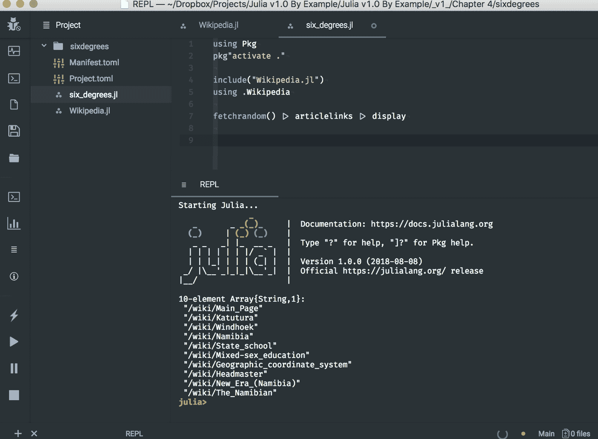
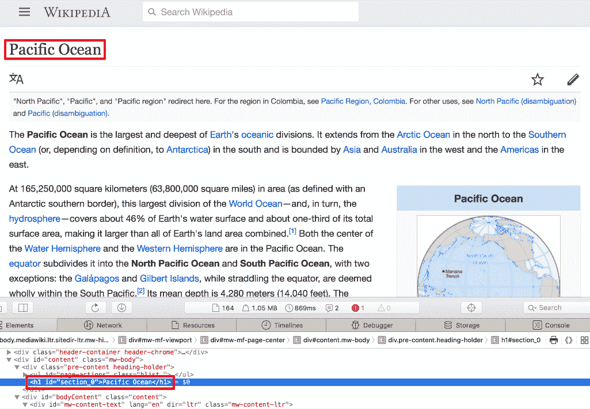
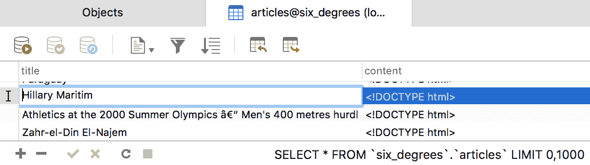

# 第四章：构建 Wiki 游戏网络爬虫

哇，第三章，*设置 Wiki 游戏*，真是一次刺激的旅程！为我们维基百科游戏打下基础带我们经历了一场真正的学习之旅。在快速回顾了网络和网页的工作原理之后，我们深入研究了语言的关键部分，研究了字典数据结构和相应的数据类型、条件表达式、函数、异常处理，甚至非常实用的管道操作符（`|>`）。在这个过程中，我们构建了一个简短的脚本，该脚本使用几个强大的第三方包 `HTTP` 和 `Gumbo` 从维基百科请求网页，将其解析为 HTML DOM，并从页面中提取所有内部链接。我们的脚本是一个完整的 Julia 项目的一部分，该项目使用 `Pkg` 来高效管理依赖项。

在本章中，我们将继续开发我们的游戏，实现完整的流程和游戏玩法。即使你不是经验丰富的开发者，也容易想象这样一个简单的游戏最终会有多个逻辑部分。我们可能有一个用于维基百科页面爬虫的模块，一个用于游戏本身，还有一个用于 UI（我们将在下一章中创建的 Web 应用）。将问题分解成更小的部分总是会使解决方案更简单。而且，这在编写代码时尤其如此——拥有小型、专业的函数，按责任分组，使得软件更容易推理、开发、扩展和维护。在本章中，我们将学习 Julia 的代码结构化构造，并讨论语言的一些更多关键元素：类型系统、构造函数、方法和多态。

在本章中，我们将涵盖以下主题：

+   *维基百科的六度分隔*，游戏玩法

+   使用模块组织我们的代码和从多个文件加载代码（所谓的 **mixin 行为**）

+   类型以及类型系统，这是 Julia 灵活性和性能的关键

+   构造函数，特殊函数，允许我们创建我们类型的实例

+   方法和多态，这是语言最重要的方面之一

+   与关系型数据库交互（特别是 MySQL）

我希望你已经准备好深入研究了。

# 技术要求

Julia 的包生态系统正在持续发展中，并且每天都有新的包版本发布。大多数时候，这是一个好消息，因为新版本带来了新功能和错误修复。然而，由于许多包仍然处于测试版（版本 0.x），任何新版本都可能引入破坏性更改。因此，书中展示的代码可能会停止工作。为了确保你的代码能够产生与书中描述相同的结果，建议使用相同的包版本。以下是本章使用的外部包及其具体版本：

```py
Cascadia@v0.4.0
Gumbo@v0.5.1
HTTP@v0.7.1
IJulia@v1.14.1
JSON@v0.20.0
MySQL@v0.7.0
```

为了安装特定版本的包，你需要运行：

```py
pkg> add PackageName@vX.Y.Z 

```

例如：

```py
pkg> add IJulia@v1.14.1
```

或者，你可以通过下载本章提供的 Project.toml 文件并使用`pkg>`实例化来安装所有使用的包：

```py
julia> download("https://raw.githubusercontent.com/PacktPublishing/Julia-Programming-Projects/master/Chapter04/Project.toml", "Project.toml")
pkg> activate . 
pkg> instantiate
```

# 维基百科六度分隔游戏，游戏玩法

正如我们在上一章中看到的，**维基百科六度分隔游戏**是对六度分隔理论概念的戏仿——即所有生物（以及世界上几乎所有事物）彼此之间相隔六步或更少。例如，一个“朋友的朋友”的链条可以在最多六步内连接任何两个人。

对于我们自己的游戏，玩家的目标是连接任意两个给定的维基百科文章，通过六个或更少的其他维基百科页面。为了确保问题有解决方案（六度分隔理论尚未得到证实）并且确实存在从起始文章到结束文章的路径，我们将预先爬取完整路径。也就是说，我们将从一个随机的维基百科页面开始，这将是我们的起点，然后通过多个页面链接到我们的目的地，即结束文章。选择下一个链接页面的算法将是最简单的——我们只需随机选择任何内部链接。

为了使事情更有趣，我们还将提供难度设置——简单、中等或困难。这将影响起始页面和结束页面之间的距离。对于简单游戏，它们相隔两页，对于中等，四页，对于困难，六页。当然，这个逻辑并不非常严格。是的，直观上，我们可以这样说，相隔更远的文章之间关系较少，更难连接。但，玩家也可能找到更短的路径。尽管如此，我们不会担心这一点。

游戏还将允许玩家在最多步数内找不到解决方案时返回。

最后，如果玩家放弃，我们将添加一个选项来显示解决方案——从起始文章到目标文章的路径。

这听起来很令人兴奋——让我们写一些代码吧！

# 一些额外的要求

为了跟随本章，你需要以下内容：

+   一个有效的 Julia 安装

+   有互联网连接

+   文本编辑器

# 组织我们的代码

到目前为止，我们主要在 REPL 中进行编码。最近，在上一章中，我们开始更多地依赖 IDE 来快速创建简短的 Julia 文件。

但是，随着我们的技能集的增长和越来越雄心勃勃的项目的发展，我们程序的复杂性也将增长。这反过来又会导致代码行数、逻辑和文件的增加——以及维护和理解所有这些的困难增加。正如著名的编码公理所说，代码被阅读的次数远多于被编写的次数——因此我们需要相应地规划。

每种语言在代码组织方面都有自己的哲学和工具集。在 Julia 中，我们有文件、模块和包。我们将在下一章中了解所有这些。

# 使用模块来驯服我们的代码

模块将相关的函数、变量和其他定义组合在一起。但，它们不仅仅是组织单元——它们是语言结构，可以理解为变量工作空间。它们允许我们定义变量和函数，而不用担心名称冲突。Julia 的 `Module` 是语言的基础之一——一个关键的架构和逻辑实体，有助于使代码更容易开发、理解和维护。我们将通过围绕模块构建我们的游戏来充分利用模块。

模块是通过使用 `module <<name>>...end` 结构定义的：

```py
module MyModule 
# code here 
end
```

让我们开始一个新的 REPL 会话，看看一些例子。

假设我们想要编写一个函数来检索一个随机的维基百科页面——这是我们的游戏功能之一。我们可以称这个函数为 `rand`。

如您所怀疑的，创建随机的 *东西* 是一项相当常见的任务，所以我们不是第一个考虑它的人。您可以亲自查看。在 REPL 中尝试这个：

```py
julia> rand 
rand (generic function with 56 methods) 
```

结果，已经定义了 56 个 `rand` 方法。

这将使得添加我们自己的变体变得困难：

```py
julia> function rand() 
           # code here 
       end 
error in method definition: function Base.rand must be explicitly imported to be extended 
```

我们尝试定义一个新的 `rand` 方法时引发了错误，因为它已经被定义并加载。

很容易看出，当我们选择函数名称时，这可能导致一个噩梦般的场景。如果所有定义的名称都生活在同一个工作空间中，我们就会陷入无休止的名称冲突，因为我们将耗尽为我们的函数和变量提供的相关名称。

Julia 的模块允许我们定义独立的工作空间，提供一种封装级别，将我们的变量和函数与其他人的变量和函数分开。通过使用模块，我们可以消除名称冲突。

模块是在 `module...end` 语言结构中定义的。尝试这个例子（在 REPL 中），我们在名为 `MyModule` 的模块中定义我们的 `rand` 函数：

```py
julia> module MyModule 

      function rand() 
           println("I'll get a random Wikipedia page") 
      end 

      end 
Main.MyModule 
MyModule—and within it, a function called rand. Here, MyModule effectively encapsulates the rand function, which no longer clashes with Julia's Base.rand.
```

如您从其全名 `Main.MyModule` 中所见，我们新创建的模块实际上是在另一个名为 `Main` 的现有模块中添加的。这个模块 `Main` 是 REPL 中执行代码的默认模块。

为了访问我们新定义的函数，我们需要在 `MyModule` 中引用它，通过 *点号连接*：

```py
julia> MyModule.rand() 
I'll get a random wikipedia page 
```

# 定义模块

由于模块是为与较大的代码库一起使用而设计的，它们并不适合 REPL。因为一旦它们被定义，我们就不能通过额外的定义来扩展它们，我们必须重新输入并重新定义整个模块，因此最好使用一个完整的编辑器。

让我们创建一个新的文件夹来存放我们的代码。在其中，我们希望创建一个名为 `modules/` 的新文件夹。然后，在 `modules/` 文件夹中，添加三个文件—`Letters.jl`、`Numbers.jl` 和 `module_name.jl`。

包含 Julia 代码的文件按照惯例使用 `.jl` 文件扩展名。

# Julia 的高效 REPL 会话

为什么不使用 Julia 的文件管理能力来设置这个文件结构？让我们看看如何做这件事，因为它在我们的日常工作中会很有用。

记住，你可以在 REPL 中输入 `;`，在行的开头，以触发 shell 模式。你的光标将从 `julia>` 变为 `shell>` 以确认上下文的变化。在 IJulia/Jupyter 中，你必须使用 `;` 作为单元格中代码的前缀，以便在 shell 模式下执行。

现在，我们可以执行以下操作：

```py
shell> mkdir modules # create a new dir called "modules" 
shell> cd modules # switch to the "modules" directory 
```

不要忘记 Julia 的 shell 模式会像它们直接在 OS 终端中运行一样调用命令——因此被调用的二进制文件必须存在于该平台上。`mkdir` 和 `cd` 在所有主要操作系统上都受支持，所以我们很安全。但是，当涉及到创建文件时，我们就无能为力了——在 Windows 上不可用 `touch` 命令。不过，没问题——在这种情况下，我们只需要调用具有相同名称的 Julia 函数。这将以平台无关的方式程序化地创建文件：

```py
julia> for f in ["Letters.jl", "Numbers.jl", "module_name.jl"] 
           touch(f) 
       end 
```

如果你想要确保文件已被创建，请使用 `readdir`：

```py
julia> readdir() 
3-element Array{String,1}: 
 "Letters.jl" 
 "Numbers.jl" 
 "module_name.jl" 
```

请确保文件名与指示的完全一致，注意大小写。

```py
Letters.jl in whatever default editor you have configured:
```

```py
julia> edit("Letters.jl")  
```

如果默认编辑器不是你最喜欢的 Julia IDE，你可以通过设置 `JULIA_EDITOR`、`VISUAL` 或 `EDITOR` 环境变量之一来更改它，指向你选择的编辑器。例如，在我的 Mac 上，我可以使用以下命令获取 Atom 编辑器的路径：

```py
shell> which atom 
/usr/local/bin/atom 
```

然后，我可以将 `JULIA_EDITOR` 设置如下：

```py
julia> ENV["JULIA_EDITOR"] = "/usr/local/bin/atom" 
```

这三个变量有略微不同的用途，但在这个情况下，设置任何一个都将产生相同的效果——更改当前 Julia 会话的默认编辑器。不过，请记住，它们有不同的 *权重*，其中 `JULIA_EDITOR` 优先于 `VISUAL`，而 `VISUAL` 优先于 `EDITOR`。

# 设置我们的模块

让我们首先编辑 `Letters.jl`，使其看起来像这样：

```py
module Letters 

using Random 

export randstring 

const MY_NAME = "Letters" 

function rand() 
  Random.rand('A':'Z') 
end 

function randstring() 
  [rand() for _ in 1:10] |> join 
end 

include("module_name.jl") 

end 
```

在这里，我们定义了一个名为 `Letters` 的模块。在其中，我们添加了一个 `rand` 函数，该函数使用 Julia 的 `Random.rand` 来返回一个 `A` 到 `Z` 之间的随机字母，形式为一个 `Char`。接下来，我们添加了一个名为 `Letters.randstring` 的函数，该函数返回一个由 `10` 个随机字符组成的 `String`。这个字符串是通过一个 `Char[]` 数组推导式（在 Julia 中 `_` 变量名是合法的，并且按照惯例，它表示一个值未使用的变量）生成的，然后通过管道输入到 `join` 函数中，以返回字符串结果。

请注意，这是一个生成随机字符串的过于复杂的方法，因为 Julia 提供了 `Random.randstring` 函数。但是，在这个阶段，重要的是要抓住每一个机会来练习编写代码，而且我并不想浪费使用 Julia 的推导语法和管道操作符的机会。熟能生巧！

将我们的注意力转向代码的第一行，我们声明我们将 `using Random`——并指示编译器通过 `export randstring` 使 `randstring` 公开。最后，我们还声明了一个名为 `MY_NAME` 的常量，它指向 `Letters` 字符串（即模块本身的名称）。

模块的最后一行，`include("module_name.jl")`，将 `module_name.jl` 的内容加载到 `Letters` 中。`include` 函数通常用于交互式加载源代码，或将分成多个源文件的包中的文件组合在一起——我们很快就会看到它是如何工作的。

接下来，让我们编辑 `Number.jl`。它将有一个类似的 `rand` 函数，该函数将返回一个介于 `1` 和 `1_000` 之间的随机 `Integer`。它导出 `halfrand` 函数，该函数从 `rand` 获取一个值并将其除以 `2`。我们将除法的结果传递给 `floor` 函数，该函数将将其转换为最接近的小于或等于的值。而且，就像 `Letters` 一样，它还包括 `module_name.jl`：

```py
module Numbers 

using Random

export halfrand

const MY_NAME = "Numbers"

function rand() 
  Random.rand(1:1_000) 
end
function halfrand() 
  floor(rand() / 2) 
end

include("module_name.jl")
end 
```

因此，对于这两个模块，我们定义了一个 `MY_NAME` 常量。我们将通过编辑 `module_name.jl` 文件来引用它，使其看起来像这样：

```py
function myname() 
  MY_NAME 
end 
```

代码返回常量的对应值，这取决于我们包含 `module_name.jl` 文件的实际模块。这说明了 Julia 的 mixin 行为，其中包含的代码表现得就像它被直接写入包含文件中一样。我们将在下一节中看到它是如何工作的。

# 模块引用

尽管我们现在只是正式讨论模块，但我们一直在使用它们。我们多次使用的 `using` 语句将其参数作为模块名称。这是一个关键的语言结构，告诉编译器将模块的定义引入当前作用域。在 Julia 中引用其他模块中定义的函数、变量和类型是编程的常规部分——例如，访问第三方包提供的功能，围绕通过 `using` 将其主模块引入作用域。但是，`using` 并不是 Julia 武器库中的唯一工具。我们还有几个其他命令可供使用，例如 `import`、`include` 和 `export`。

`using` 指令允许我们引用其他模块导出的函数、变量、类型等。这告诉 Julia 使模块的导出定义在当前工作区中可用。如果这些定义是由模块的作者导出的，我们可以调用它们而无需在它们前面加上模块的名称（在函数名称前加上模块名称表示完全限定名称）。但是，请注意，这是一把双刃剑——如果两个使用的模块导出了具有相同名称的函数，仍然必须使用完全限定名称来访问这些函数——否则 Julia 将抛出异常，因为它不知道我们指的是哪个函数。

至于 `import`，它在某种程度上是相似的，因为它也将另一个模块的定义引入作用域。但是，它在两个重要方面有所不同。首先，调用 `import MyModule` 仍然需要在定义前加上模块的名称，从而避免潜在的名称冲突。其次，如果我们想用新方法扩展其他模块中定义的函数，*必须*使用 `import`。

另一方面，`include` 在概念上是不同的。它用于将一个文件的内容评估到当前上下文中（即当前模块的 *全局* 作用域）。这是一种通过提供类似 mixin 的行为来重用代码的方法，正如我们之前所看到的。

被包含的文件在模块的全局作用域中评估的事实是一个非常重要的点。这意味着，即使我们在函数体中包含一个文件，文件的内容也不会在函数的作用域内评估，而是在模块的作用域内评估。为了看到这一点，让我们在我们的 `modules/` 文件夹中创建一个名为 `testinclude.jl` 的文件。编辑 `testinclude.jl` 并添加以下代码行：

```py
somevar = 10
```

现在，如果你在 REPL 或 IJulia 中运行以下代码，你就能明白我的意思：

```py
julia> function testinclude() 
             include("testinclude.jl") 
             println(somevar) 
       end 

julia> testinclude() 
10 
```

显然，一切正常。`testinclude.jl` 文件被包含进来，`somevar` 变量被定义了。然而，`somevar` 并不是在 `testinclude` 函数中创建的，而是在 `Main` 模块中的全局变量。我们可以很容易地看到这一点，因为我们可以直接访问 `somevar` 变量：

```py
julia> somevar 
10 
```

请记住这种行为，因为它可能导致在全局作用域中暴露变量时出现难以理解的错误。

最后，模块的作者使用 `export` 来暴露定义，就像公共接口一样。正如我们所见，导出的函数和变量是通过模块的用户通过 `using` 引入作用域的。

# 设置 LOAD_PATH

让我们看看一些示例，这些示例说明了在处理模块时作用域规则。请打开一个新的 Julia REPL。

我们在前几章中多次看到了 `using` 语句，现在我们理解了它的作用——就是将另一个模块及其定义（变量、函数、类型）引入作用域。让我们用我们新创建的模块来试一试：

```py
julia> using Letters 
ERROR: ArgumentError: Package Letters not found in current path: 
- Run `Pkg.add("Letters")` to install the Letters package. 
```

哎呀，出现了一个异常！Julia 告诉我们它不知道在哪里找到 `Letters` 模块，并建议我们使用 `Pkg.add("Letters")` 来安装它。但是，由于 `Pkg.add` 只与已注册的包一起工作，而我们还没有将我们的模块发布到 Julia 的注册表中，这不会有所帮助。结果是我们只需要告诉 Julia 我们代码的位置。

当被要求通过 `using` 将一个模块引入作用域时，Julia 会检查一系列路径以查找相应的文件。这些查找路径存储在一个名为 `LOAD_PATH` 的 `Vector` 中——我们可以通过使用 `push!` 函数将我们的 `modules/` 文件夹添加到这个集合中：

```py
julia> push!(LOAD_PATH, "modules/") 
4-element Array{String,1}: 
 "@" 
 "@v#.#" 
 "@stdlib" 
 "modules/" 
```

你的输出可能会有所不同，但重要的是在调用 `push!` 之后，`LOAD_PATH` 集合现在有一个额外的元素，表示 `modules/` 文件夹的路径。

为了让 Julia 能够将模块的名称与其对应的文件匹配，*文件必须与模块具有完全相同的名称，加上 `.jl` 扩展名*。一个文件可以包含多个模块，但 Julia 将无法通过文件名自动找到额外的模块。

关于模块命名的命名约定是使用驼峰式命名法。因此，我们最终会在名为`Letters.jl`的文件中定义一个名为`Letters`的模块，或者在一个名为`WebSockets.jl`的文件中定义一个名为`WebSockets`的模块。

# 使用`using`加载模块

现在我们已经将我们的文件夹添加到`LOAD_PATH`中，我们就可以使用我们的模块了：

```py
julia> using Letters 
```

到目前为止，发生了两件事：

+   所有导出的定义现在都可以在 REPL 中直接调用，在我们的例子中，是`randstring`

+   未导出的定义可以通过`Letters`的`dotting into`来访问——例如，`Letters.rand()`

让我们试试：

```py
julia> randstring() # has been exported and is directly accessible 
"TCNXFLUOUU" 
julia> myname() # has not been exported so it's not available in the REPLERROR: UndefVarError: myname not defined
 julia> Letters.myname() # but we can access it under the Letters namespace 
"Letters"
 julia> Letters.rand() # does not conflict with Base.rand 
'L': ASCII/Unicode U+004c (category Lu: Letter, uppercase) 
```

我们可以使用`names`函数查看模块导出了什么：

```py
julia> names(Letters) 
2-element Array{Symbol,1}: 
 :Letters 
 :randstring 
```

如果我们想获取一个模块的所有定义，无论是否导出，`names`函数接受一个名为`all`的第二个参数，一个`Boolean`：

```py
julia> names(Letters, all = true) 
11-element Array{Symbol,1}: 
 # output truncated 
 :Letters 
 :MY_NAME 
 :eval 
 :myname 
 :rand 
 :randstring 
```

我们可以轻松地识别我们定义的变量和函数。

正如我们所见，例如，`myname`并没有直接引入作用域，因为它在`Letters`中没有导出。但结果是，如果我们明确告诉 Julia 使用该函数，我们仍然可以得到类似导出的行为：

```py
julia> using Letters: myname
julia> myname() # we no longer need to "dot into" Letters.myname() 
"Letters" 
```

如果我们想直接将同一模块中的多个定义引入作用域，我们可以传递一个以逗号分隔的名称列表：

```py
julia> using Letters: myname, MY_NAME 
```

# 使用`import`加载模块

现在，让我们看看`import`函数的效果，使用`Numbers`：

```py
julia> import Numbers
julia> names(Numbers) 
2-element Array{Symbol,1}: 
 :Numbers 
 :halfrand
julia> halfrand() 
ERROR: UndefVarError: halfrand not defined 
```

我们可以看到，与`using`不同，`import`函数*不会将导出的定义引入作用域*。

然而，显式导入一个定义本身会将其直接引入作用域，不考虑它是否被导出：

```py
julia> import Numbers.halfrand, Numbers.MY_NAME 
```

这段代码等同于以下代码：

```py
julia> import Numbers: halfrand, MY_NAME 

julia> halfrand() 
271.0 
```

# 使用`include`加载模块

当开发独立的程序，如我们现在正在做的，操作`LOAD_PATH`效果很好。但是，对于包开发者来说，这种方法不可用。在这种情况下——以及所有由于某种原因使用`LOAD_PATH`不是选项的情况——加载模块的常见方式是通过包含它们的文件。

例如，我们可以将我们的`Letters`模块包含在 REPL 中，如下所示（启动一个新的 REPL 会话）：

```py
julia> include("modules/Letters.jl") 
Main.Letters 
```

这将读取并评估当前作用域中`modules/Letters.jl`文件的内容。结果，它将在我们的当前模块`Main`中定义`Letters`模块。但是，这还不够——在这个阶段，`Letters`中的任何定义都没有被导出：

```py
julia> randstring() 
ERROR: UndefVarError: randstring not defined 
```

我们需要将它们引入作用域：

```py
julia> using Letters 
ERROR: ArgumentError: Package Letters not found in current path: 
- Run `Pkg.add("Letters")` to install the Letters package.
```

别再了！刚才发生了什么？当使用`include`与模块时，这是一个重要的区别。正如我们刚才说的，`Letters`模块被包含在当前模块`Main`中，因此我们需要相应地引用它：

```py
julia> using Main.Letters 

julia> randstring() 
"QUPCDZKSAH" 
```

我们也可以通过使用相对路径来引用这种嵌套模块层次结构。例如，一个点`.`代表`current module`。因此，之前的`Main.Letters`嵌套可以表示为`.Letters`——这正是同一件事：

```py
julia> using .Letters 
```

类似地，我们可以使用两个点`..`来引用父模块，三个点用于父模块的父模块，依此类推。

# 模块嵌套

正如我们所看到的，有时我们程序的逻辑会要求一个模块必须成为另一个模块的一部分，从而有效地嵌套它们。我们在开发自己的包时特别喜欢使用这种方法。组织包的最佳方式是暴露一个顶层模块，并在其中包含所有其他定义（函数、变量和其他模块）（以封装功能）。一个例子应该有助于澄清这些内容。

让我们做一个改变——在`Letters.jl`文件中，在说`include("module_name.jl")`的行下面，继续添加另一行——`include("Numbers.jl")`。

通过这个变化，`Numbers`模块将实际上在`Letters`模块内部定义。为了访问嵌套模块的功能，我们需要点进到必要的深度：

```py
julia> using .Letters 

julia> Letters.Numbers.halfrand() 
432.5 
```

# 设置我们游戏的架构

让我们为我们的游戏找一个家——创建一个名为`sixdegrees/`的新文件夹。我们将用它来组织我们的游戏文件。每个文件将包含一个模块，每个模块将打包相关的功能。我们将利用 Julia 的自动加载功能，这意味着每个模块的文件名将与模块的名称相同，加上`.jl`扩展名。

然而，一旦我们进入`sixdegrees/`文件夹，我们首先需要通过`Pkg`初始化我们的项目——这样我们就可以使用 Julia 的依赖项管理功能：

```py
julia> mkdir("sixdegrees") 
"sixdegrees" 

julia> cd("sixdegrees/") 

julia> ] # go into pkg mode 

(v1.0) pkg> activate . 

(sixdegrees) pkg> 
```

我们将使用`HTTP`和`Gumbo`包，所以在处理依赖项时，现在添加它们是个好主意：

```py
(sixdegrees) pkg> add HTTP Gumbo 
```

接下来我们需要的是一个用于存放与维基百科相关代码的容器——一个封装了请求文章和提取内部 URL 功能的模块。我们已经在第三章，“设置维基游戏”中编写的`webcrawler.jl`文件中完成了代码的第一个迭代。现在，我们只需要创建一个`Wikipedia`模块，并用`webcrawler.jl`的内容填充它。

在`sixdegrees`文件夹内，创建一个名为`Wikipedia.jl`的新文件。用以下代码设置它：

```py
module Wikipedia
using HTTP, Gumbo 

const RANDOM_PAGE_URL = "https://en.m.wikipedia.org/wiki/Special:Random" 

export fetchrandom, fetchpage, articlelinks 

function fetchpage(url) 
  response = HTTP.get(url) 
  if response.status == 200 && length(response.body) > 0 
    String(response.body) 
  else 
    "" 
  end 
end 

function extractlinks(elem, links = String[]) 
  if  isa(elem, HTMLElement) && tag(elem) == :a && in("href", collect(keys(attrs(elem)))) 
        url = getattr(elem, "href") 
        startswith(url, "/wiki/") && ! occursin(":", url) && push!(links, url) 
  end 
  for child in children(elem) 
    extractlinks(child, links) 
  end 
  unique(links) 
end 

function fetchrandom() 
  fetchpage(RANDOM_PAGE_URL) 
end 

function articlelinks(content) 
  if ! isempty(content) 
    dom = Gumbo.parsehtml(content) 

    links = extractlinks(dom.root) 
  end 
end

end
```

前面的代码应该看起来很熟悉，因为它与`webcrawler.jl`共享了大部分逻辑。但是，有一些重要的变化。

首先，我们将一切包裹在一个`module`声明中。

请注意一个非常重要的约定：在 Julia 中，我们不会在模块内部缩进代码，因为这会导致整个文件缩进，从而影响可读性。

在第三行，我们原本有 Julia 维基百科条目的链接，现在我们定义了一个`String`常量`RANDOM_PAGE_URL`，它指向一个特殊的维基百科 URL，该 URL 返回一个随机文章。我们还切换到了维基百科网站的移动版本，如`en.m.`子域名所示。使用移动页面会使我们的工作更简单，因为它们更简单，标记也更少。

在 `fetchpage` 函数中，我们不再寻找 `Content-Length` 标头，而是检查 `response.body` 属性的 `length`。我们这样做是因为请求特殊的随机维基百科页面会进行重定向，在这个过程中，`Content-Length` 标头会被丢弃。

我们还替换了文件底部的部分逻辑。我们不再自动获取 Julia 的维基百科页面并将内部链接列表输出到屏幕上，我们现在定义了两个额外的函数：`fetchrandom` 和 `articlelinks`。这些函数将是 `Wikipedia` 模块的公共接口，并且通过 `export` 语句公开。`fetchrandom` 函数确实如其名所示——它调用 `fetchpage` 函数，传入 `RANDOM_PAGE_URL` 常量，实际上是从随机维基百科页面获取。`articlelinks` 返回一个表示链接文章的字符串数组。

最后，我们移除了 `LINKS` 常量——应该避免使用全局变量。`extractlinks` 函数已经相应地重构，现在接受第二个参数，`links`，一个 `String` 的 `Vector`，它在递归过程中用于维护状态。

# 检查我们的代码

让我们确保在这次重构之后，我们的代码仍然按预期工作。Julia 默认带有单元测试功能，我们将在第十一章 创建 Julia 包中探讨这些内容。现在，我们将按照老方法来做，手动运行代码并检查输出。

我们将在 `sixdegrees/` 文件夹内添加一个新文件，命名为 `six_degrees.jl`。从其名称来看，您可以猜测它将是一个纯 Julia 文件，而不是一个模块。我们将使用它来编排游戏的加载：

```py
using Pkg 
pkg"activate ." 

include("Wikipedia.jl") 
using .Wikipedia 

fetchrandom() |> articlelinks |> display 
```

代码简单且简洁——我们使用 `Pkg` 激活当前项目。然后，我们将 `Wikipedia.jl` 文件包含到当前模块中，然后要求编译器将 `Wikipedia` 模块引入作用域。最后，我们使用之前讨论过的 `fetchrandom` 和 `articlelinks` 来从随机维基百科页面检索文章 URL 列表并显示。

是时候运行我们的代码了！在 REPL 中，确保您已经 `cd` 到 `sixdegrees` 文件夹并执行：

```py
julia> include("six_degrees.jl") 
21-element Array{String,1}: 
 "/wiki/Main_Page" 
 "/wiki/Arena" 
 "/wiki/Saskatoon,_Saskatchewan" 
 "/wiki/South_Saskatchewan_River" 
 "/wiki/New_York_Rangers" 
# ... output omitted ... #
Array{String,1} with entries that start with /wiki/.
```

或者，您可以在 Visual Studio Code 和 Atom 中使用运行代码或运行文件选项。以下是 Atom 运行 `six_degrees.jl` 文件的情况：



# 构建我们的维基百科爬虫 - 第二部分

我们的代码按预期运行，重构并整洁地打包到一个模块中。然而，在继续之前，我还有一个东西想让我们重构。我对我们的 `extractlinks` 函数并不特别满意。

首先，它天真地遍历了所有的 HTML 元素。例如，假设我们还想提取页面的标题——每次我们想要处理不是链接的内容时，我们都需要再次遍历整个文档。这将非常消耗资源，并且运行速度会变慢。

其次，我们正在重新发明轮子。在第三章 *设置 Wiki 游戏* 中，我们说 CSS 选择器是 DOM 解析的*通用语言*。如果我们使用 CSS 选择器的简洁语法和由专用库提供的底层优化，我们将从中获得巨大的好处。

幸运的是，我们不需要寻找太远就能找到这种功能。Julia 的`Pkg`系统提供了对`Cascadia`的访问，这是一个本地的 CSS 选择器库。而且，它的一大优点是它与`Gumbo`协同工作。

为了使用 Cascadia，我们需要将其添加到我们项目的依赖列表中：

```py
(sixdegrees) pkg> add Cascadia
```

接下来，告诉 Julia 我们将使用它——修改`Wikipedia.jl`，使其第三行如下所示：

```py
using HTTP, Gumbo, Cascadia
```

在`Cascadia`的帮助下，我们现在可以重构`extractlinks`函数，如下所示：

```py
function extractlinks(elem) 
  map(eachmatch(Selector("a[href^='/wiki/']:not(a[href*=':'])"), elem)) do e 
    e.attributes["href"] 
  end |> unique 
end 
```

让我们更仔细地看看这里发生的一切。首先引起注意的是`Selector`函数。这是由`Cascadia`提供的，它构建一个新的 CSS 选择器对象。传递给它作为唯一参数的字符串是一个 CSS 选择器，其内容为——所有具有以`'/wiki/'`开头且不包含列（`:`）的`href`属性的`<a>`元素。

`Cascadia`还导出了`eachmatch`方法。更准确地说，它是*扩展*了我们之前看到的带有正则表达式的现有`Base.eachmatch`方法。这提供了一个熟悉的接口——我们将在本章后面的*方法*部分看到如何扩展方法。`Cascadia.eachmatch`函数返回一个匹配选择器的`Vector`元素。

一旦我们检索到匹配的元素集合，我们就将其传递给`map`函数。`map`函数是函数式编程工具箱中最常用的工具之一。它接受一个函数`f`和一个集合`c`作为其参数——并通过将`f`应用于每个元素来转换集合`c`，返回修改后的集合作为结果。其定义如下：

```py
map(f, c...) -> collection  
map function, it's true. But it is, in fact, the exact same function invocation, except with a more readable syntax, provided by Julia's blocks.
```

# 使用块

因为在 Julia 中，函数是一等语言构造，它们可以被引用和操作，就像任何其他类型的变量一样。它们可以作为其他函数的参数传递，或者可以作为其他函数调用的结果返回。将另一个函数作为其参数或返回另一个函数作为其结果的函数称为**高阶函数**。

让我们通过一个简单的`map`示例来看看。我们将取一个`Int`的`Vector`，并将一个函数应用于其集合的每个元素，该函数将值加倍。你可以在新的 REPL 会话（或在配套的 IJulia 笔记本）中跟随：

```py
julia> double(x) = x*2 
double (generic function with 1 method) 

julia> map(double, [1, 2, 3, 5, 8, 13]) 
6-element Array{Int64,1}: 
  2 
  4 
  6 
 10 
 16 
 26 
double function as the argument of the higher-order function map. As a result, we got back the Vector, which was passed as the second argument, but with all the elements doubled.
```

那都是好的，但是不得不定义一个函数只是为了将其作为另一个函数的一次性参数是不方便的，而且有点浪费。出于这个原因，支持函数式特性的编程语言，包括 Julia，通常支持 *匿名函数*。匿名函数，或称为 *lambda*，是一个没有绑定到标识符的函数定义。

我们可以将前面的 `map` 调用重写为使用匿名函数，该函数通过使用箭头 `->` 语法现场定义：

```py
julia> map(x -> x*2, [1, 2, 3, 5, 8, 13]) 
6-element Array{Int64,1}: 
  2 
  4 
  6 
 10 
 16 
 26
```

在定义中，`x -> x*2`，箭头左边的 `x` 代表传递给函数的参数，而 `x*2` 代表函数体。

太棒了！我们没有必要单独定义 `double` 就达到了相同的结果。但是，如果我们需要使用更复杂的函数呢？例如，注意以下内容：

```py
julia> map(x -> 
           if x % 2 == 0 
                  x * 2 
           elseif x % 3 == 0 
                  x * 3 
           elseif x % 5 == 0 
                  x * 5 
           else 
                  x 
           end,  
      [1, 2, 3, 5, 8, 13]) 
```

这很难理解！因为 Julia 允许我们缩进我们的代码，我们可以增强这个示例的可读性，使其更加易于接受，但结果仍然远远不够好。

由于这些情况经常发生，Julia 提供了用于定义匿名函数的块语法。所有将另一个函数作为其 *第一个* 参数的函数都可以使用块语法。对这种调用的支持已经内置于语言中，因此你不需要做任何事情——只要函数是第一个位置参数，你的函数就会自动支持它。为了使用它，我们在调用高阶函数时跳过传递第一个参数——而是在参数列表的末尾，在参数元组之外，添加一个 `do...end` 块。在这个块内部，我们定义我们的 lambda。

因此，我们可以将前面的示例重写如下：

```py
map([1, 2, 3, 5, 8, 13]) do x 
       if x % 2 == 0 
              x * 2 
       elseif x % 3 == 0 
              x * 3 
       elseif x % 5 == 0 
              x * 5 
        else 
              x 
        end 
 end 
```

阅读起来更加清晰！

# 实现游戏玩法

我们现在对维基百科解析器相当有信心，添加 `Cascadia` 大大简化了代码。现在是时候考虑实际的游戏玩法了。

最重要的是，游戏的精髓是创建谜题——要求玩家从初始文章找到通往结束文章的路径。我们之前决定，为了确保两篇文章之间确实存在路径，我们将预先爬取所有页面，从第一页到最后一页。为了从一个页面导航到下一个页面，我们将简单地随机选择一个内部 URL。

我们还提到了包括难度设置。我们将使用常识假设，即起始文章和结束文章之间的链接越多，它们的主题就越不相关；因此，识别它们之间路径的难度就越大，导致更具有挑战性的难度级别。

好吧，是时候开始编码了！首先，在 `sixdegrees/` 文件夹内创建一个新文件。命名为 `Gameplay.jl` 并复制粘贴以下内容：

```py
module Gameplay 

using ..Wikipedia 

export newgame 

const DIFFICULTY_EASY = 2 
const DIFFICULTY_MEDIUM = 4 
const DIFFICULTY_HARD = 6 

function newgame(difficulty = DIFFICULTY_HARD) 
  articles = [] 

  for i in 1:difficulty 
    article = if i == 1 
      fetchrandom() 
    else 
      rand(articles[i-1][:links]) |> Wikipedia.fetchpage 
    end 

article_data = Dict(:content => article, 
  :links => articlelinks(article)) 
    push!(articles, article_data) 
  end 

  articles 
end 

end 
```

`Gamplay.jl` 定义了一个新的 `module` 并将 `Wikipedia` 带入作用域。在这里，你可以看到我们如何通过使用 `..` 在父作用域中引用 `Wikipedia` 模块。然后它定义了三个常量，这些常量将难度设置映射到分离度（分别命名为 `DIFFICULTY_EASY`、`DIFFICULTY_MEDIUM` 和 `DIFFICULTY_HARD`）。

然后，它定义了一个名为 `newgame` 的函数，该函数接受一个难度参数，默认设置为困难。在函数的主体中，我们循环的次数等于难度值。在每次迭代中，我们检查当前的分离度——如果是第一篇文章，我们调用 `fetchrandom` 来启动爬取过程。如果不是第一篇文章，我们从先前爬取的文章的链接列表中随机选择一个链接（`rand(articles[i-1][:links])`）。然后我们将此 URL 传递给 `fetchpage`。在讨论条件语句时，我们了解到在 Julia 中 `if/else` 语句返回最后一个评估表达式的值。我们可以看到它在这里得到了很好的应用，评估的结果被存储在 `article` 变量中。

一旦我们获取了文章，我们将其内容及其链接存储在一个名为 `article_data` 的 `Dict` 中。然后，`article_data` 被添加到 `articles` 数组中。在其最后一行，`newgame` 函数返回包含所有步骤（从第一个到最后一个）的 `articles` 向量。此函数也被导出。

这并不太难！但是，有一个小问题。如果你现在尝试运行代码，它将会失败。原因是文章链接是 *relative* 的。这意味着它们不是完全限定的 URL；它们看起来像 `/wiki/Some_Article_Title`。当 `HTTP.jl` 发起请求时，它需要包含协议、链接和域名。但别担心，在 `Wikipedia.jl` 中修复这个问题很容易。请切换你的编辑器到 `Wikipedia` 模块，并将 `const RANDOM_PAGE_URL` 行替换为以下三行：

```py
const PROTOCOL = "https://" 
const DOMAIN_NAME = "en.m.wikipedia.org" 
const RANDOM_PAGE_URL = PROTOCOL * DOMAIN_NAME * "/wiki/Special:Random" 
```

我们将随机页面 URL 分解为其组成部分——协议、域名和剩余的相对路径。

我们将使用类似的方法在获取文章时将相对 URL 转换为绝对 URL。为此，更改 `fetchpage` 的主体，并将其作为第一行代码添加以下内容：

```py
url = startswith(url, "/") ? PROTOCOL * DOMAIN_NAME * url : url 
```

在这里，我们检查 `url` 参数——如果它以 `"/"` 开头，这意味着它是一个相对 URL，因此我们需要将其转换为它的绝对形式。正如你可以看到的，我们使用了三元运算符。

我们现在的代码应该可以正常工作，但将这个 `PROTOCOL * DOMAIN_NAME * url` 散布到我们的游戏中有点像 *code smell*。让我们将其抽象成一个函数：

```py
function buildurl(article_url) 
    PROTOCOL * DOMAIN_NAME * article_url 
end 
```

在编程术语中，*code smell* 指的是违反基本设计原则并负面影响的实践。它本身不是一个 *bug*，但它表明设计中的弱点可能会增加未来出现错误或失败的风险。

`Wikipedia.jl` 文件现在应该看起来像这样：

```py
module Wikipedia 

using HTTP, Gumbo, Cascadia 

const PROTOCOL = "https://" 
const DOMAIN_NAME = "en.m.wikipedia.org" 
const RANDOM_PAGE_URL = PROTOCOL * DOMAIN_NAME * "/wiki/Special:Random" 

export fetchrandom, fetchpage, articlelinks 

function fetchpage(url) 
  url = startswith(url, "/") ? buildurl(url) : url 
  response = HTTP.get(url) 

  if response.status == 200 && length(response.body) > 0 
    String(response.body) 
  else  
    "" 
  end 
end 

function extractlinks(elem) 
  map(eachmatch(Selector("a[href^='/wiki/']:not(a[href*=':'])"), elem)) do e 
    e.attributes["href"] 
  end |> unique 
end 

function fetchrandom() 
  fetchpage(RANDOM_PAGE_URL) 
end 

function articlelinks(content) 
  if ! isempty(content) 
    dom = Gumbo.parsehtml(content) 

    links = extractlinks(dom.root) 
  end 
end 

function buildurl(article_url) 
  PROTOCOL * DOMAIN_NAME * article_url 
end 

end 
```

# 完成细节

我们的游戏玩法发展得很好。只剩下几个部件了。在思考我们的游戏用户界面时，我们希望展示游戏的进度，指出玩家已经导航过的文章。为此，我们需要文章的标题。如果我们还能包括一张图片，那会让我们的游戏看起来更漂亮。

幸运的是，我们现在使用 CSS 选择器，因此提取缺失的数据应该轻而易举。我们只需要将以下内容添加到`Wikipedia`模块中：

```py
import Cascadia: matchFirst 

function extracttitle(elem) 
  matchFirst(Selector("#section_0"), elem) |> nodeText 
end 

function extractimage(elem) 
  e = matchFirst(Selector(".content a.image img"), elem) 
  isa(e, Void) ? "" : e.attributes["src"] 
end 
```

`extracttitle`和`extractimage`函数将从我们的文章页面检索相应的内容。在两种情况下，因为我们只想选择一个元素，即主页标题和第一张图片，所以我们使用`Cascadia.matchFirst`。`matchFirst`函数不是由`Cascadia`公开暴露的——但因为它非常有用，所以我们`import`它。

`#section_0`选择器标识主页标题，一个`<h1>`元素。而且，因为我们需要提取其`<h1>...</h1>`标签之间的文本，我们调用`Cascadia`提供的`nodeText`方法。

你可以在以下屏幕截图（显示 Safari 检查器中的 Wikipedia 页面的主要标题）中看到，如何识别所需的 HTML 元素以及如何通过检查页面源代码和相应的 DOM 元素来选择它们的 CSS 选择器。HTML 属性`id="section_0"`对应于`#section_0`CSS 选择器：



对于`extractimage`，我们寻找主要文章图片，表示为`".content a.image img"`选择器。由于并非所有页面都有它，我们检查是否确实得到了一个有效的元素。如果页面没有图片，我们将得到一个`Nothing`实例，称为`nothing`。这是一个重要的构造——`nothing`是`Nothing`的单例实例，表示没有对象，对应于其他语言中的`NULL`。如果我们确实得到了一个`img`元素，我们提取其`src`属性的值，即图片的 URL。

这里是另一个 Wikipedia 截图，其中我标记了我们要针对的图像元素。旗帜是 Wikipedia 的**澳大利亚**页面上的第一张图片——一个完美的匹配：


接下来，我们可以扩展`Gameplay.newgame`函数，以处理新的功能和值。但到目前为止，这感觉并不合适——太多的`Wikipedia`逻辑会泄露到`Gameplay`模块中，使它们耦合；这是一个危险的反模式。相反，让我们让数据的提取和文章的设置，即`Dict`，成为`Wikipedia`的全权责任，完全封装逻辑。让`Gameplay.newgame`函数看起来如下所示：

```py
function newgame(difficulty = DIFFICULTY_HARD) 
  articles = [] 

  for i in 1:difficulty  
    article = if i == 1 
                fetchrandom() 
              else  
                rand(articles[i-1][:links]) |> Wikipedia.fetchpage 
              end 
    push!(articles, articleinfo(article)) 
  end 

  articles 
end 
```

然后，更新`Wikipedia`模块如下所示：

```py
module Wikipedia 

using HTTP, Gumbo, Cascadia 
import Cascadia: matchFirst 

const PROTOCOL = "https://" 
const DOMAIN_NAME = "en.m.wikipedia.org" 
const RANDOM_PAGE_URL = PROTOCOL * DOMAIN_NAME * "/wiki/Special:Random" 

export fetchrandom, fetchpage, articleinfo 

function fetchpage(url) 
  url = startswith(url, "/") ? buildurl(url) : url 

  response = HTTP.get(url) 

  if response.status == 200 && length(response.body) > 0 
    String(response.body) 
  else  
    "" 
  end 
end 

function extractlinks(elem) 
  map(eachmatch(Selector("a[href^='/wiki/']:not(a[href*=':'])"), elem)) do e 
    e.attributes["href"] 
  end |> unique 
end 

function extracttitle(elem) 
  matchFirst(Selector("#section_0"), elem) |> nodeText 
end 

function extractimage(elem) 
  e = matchFirst(Selector(".content a.image img"), elem) 
  isa(e, Nothing) ? "" : e.attributes["src"] 
end 

function fetchrandom() 
  fetchpage(RANDOM_PAGE_URL) 
end 

function articledom(content) 
  if ! isempty(content) 
    return Gumbo.parsehtml(content) 
  end 

  error("Article content can not be parsed into DOM") 
end 

function articleinfo(content) 
  dom = articledom(content) 

  Dict( :content => content,  
        :links => extractlinks(dom.root),  
        :title => extracttitle(dom.root),  
        :image => extractimage(dom.root) 
  ) 
end 

function buildurl(article_url) 
  PROTOCOL * DOMAIN_NAME * article_url 
end 

end 
```

文件有几处重要更改。我们移除了`articlelinks`函数，并添加了`articleinfo`和`articledom`。新的`articledom`函数使用`Gumbo`解析 HTML 并生成 DOM，这非常重要，DOM 只解析一次。我们不希望在每次提取元素类型时都解析 HTML 到 DOM，就像如果我们保留之前的`articlelinks`函数那样。至于`articleinfo`，它负责设置一个包含所有相关信息的文章`Dict`——内容、链接、标题和图片。

我们可以通过修改`six_degrees.jl`文件来进行代码的测试运行，如下所示：

```py
using Pkg 
pkg"activate ." 

include("Wikipedia.jl") 
include("Gameplay.jl") 

using .Wikipedia, .Gameplay 

for article in newgame(Gameplay.DIFFICULTY_EASY) 
  println(article[:title]) 
end 
```

我们开始一个新的游戏，它包含两篇文章（`Gameplay.DIFFICULTY_EASY`），并且对于每一篇文章，我们都会显示其标题。我们可以通过在 REPL 会话中运行它来看到它的实际效果，通过`julia> include("six_degrees.jl")`，或者简单地通过在 Visual Studio Code 或 Atom 中运行文件。下面是 REPL 中的样子：

```py
julia> include("six_degrees.jl") 
Miracle Bell 
Indie pop  
```

# 还有一件事

我们的测试运行显示我们的难度设置有一个小故障。我们应该在起点之后爬取一定数量的文章。我们的初始文章不应计入。这个问题非常容易解决。在`Gameplay.newgame`中，我们需要将`for i in 1:difficulty`替换为`for i in 1:difficulty+1`（注意最后的`+1`）。现在，如果我们再次尝试，它将按预期工作：

```py
julia> include("six_degrees.jl") 
John O'Brien (Australian politician) 
Harlaxton, Queensland 
Ballard, Queensland 
```

# 学习 Julia 的类型系统

我们的游戏运行得非常顺利，但有一件事我们可以改进——将我们的文章信息存储为`Dict`。Julia 的字典非常灵活和强大，但它们并不适合所有情况。`Dict`是一个通用的数据结构，它针对搜索、删除和插入操作进行了优化。这里我们都不需要这些——我们的文章具有固定的结构，并且创建后数据不会改变。这是一个非常适合使用对象和**面向对象编程**（**OOP**）的用例。看来是时候学习类型了。

Julia 的类型系统是语言的核心——它无处不在，定义了语言的语法，并且是 Julia 性能和灵活性的驱动力。Julia 的类型系统是动态的，这意味着在程序可用的实际值之前，我们对类型一无所知。然而，我们可以通过使用类型注解来利用静态类型的好处——表明某些值具有特定的类型。这可以大大提高代码的性能，并增强可读性，简化调试。

讨论 Julia 语言而不提及类型是不可能的。确实，到目前为止，我们已经看到了许多原始类型——`Integer`、`Float64`、`Boolean`、`Char`等等。在学习各种数据结构，如`Array`、`Dict`或元组时，我们也接触到了类型。这些都是语言内置的，但结果是 Julia 使得创建我们自己的类型变得非常容易。

# 定义我们自己的类型

Julia 支持两种类型的类别——原始类型和复合类型。原始类型是一个具体类型，其数据由普通的位组成。复合类型是一组命名字段，其实例可以被视为单个值。在许多语言中，复合类型是唯一一种用户可定义的类型，但 Julia 允许我们声明自己的原始类型，而不仅仅是提供一组固定的内置类型。

我们在这里不会讨论定义原始类型，但你可以在官方文档中了解更多信息，网址为[`docs.julialang.org/en/v1/manual/types/`](https://docs.julialang.org/en/v1/manual/types/)。

为了表示我们的文章，我们最好使用一个不可变的复合类型。一旦我们的文章对象被创建，其数据就不会改变。不可变的复合类型是通过`struct`关键字后跟一个字段名称块来引入的：

```py
struct Article 
    content 
    links 
    title 
    image 
end 
```

由于我们没有为字段提供类型信息——也就是说，我们没有告诉 Julia 我们希望每个字段是什么类型——它们将默认为任何类型，允许存储任何类型的值。但是，由于我们已经知道我们想要存储什么数据，我们将极大地从限制每个字段的类型中受益。`::`运算符可以用来将类型注解附加到表达式和变量上。它可以读作“是一个实例”。因此，我们定义`Article`类型如下：

```py
struct Article 
    content::String 
    links::Vector{String} 
    title::String 
    image::String 
end 
```

所有字段都是`String`类型，除了`links`，它是一个一维的`Array`，也称为`Vector{String}`。

类型注解可以提供重要的性能优势——同时消除一类与类型相关的错误。

# 构造类型

创建`Article`类型的新对象是通过将`Article`类型名称像函数一样应用来实现的。参数是该字段的值：

```py
julia> julia = Article( 
           "Julia is a high-level dynamic programming language", 
           ["/wiki/Jeff_Bezanson", "/wiki/Stefan_Karpinski",  
            "/wiki/Viral_B._Shah", "/wiki/Alan_Edelman"], 
           "Julia (programming language)", 
           "/220px-Julia_prog_language.svg.png" 
       ) 
Article("Julia is a high-level dynamic programming language", ["/wiki/Jeff_Bezanson", "/wiki/Stefan_Karpinski", "/wiki/Viral_B._Shah", "/wiki/Alan_Edelman"], "Julia (programming language)", "/220px-Julia_prog_language.svg.png") 
```

可以使用标准的*点表示法*访问新创建对象的字段：

```py
julia> julia.title 
"Julia (programming language)" 
```

由于我们声明我们的类型为不可变的，所以值是只读的，因此它们不能被更改：

```py
julia> julia.title = "The best programming language, period" 
ERROR: type Article is immutable 
```

我们的`Article`类型定义不会允许我们更改`julia.title`属性。但是，不可变性不应该被忽视，因为它确实带来了相当大的优势，如官方 Julia 文档所述：

+   它可能更有效。某些结构可以有效地打包到数组中，在某些情况下，编译器能够避免分配不可变对象。

+   无法违反类型构造函数提供的不变性。

+   使用不可变对象的代码可能更容易推理。

但是，这并不是全部的故事。一个不可变对象可以拥有引用可变对象的字段，例如，比如`links`，它指向一个`Array{String, 1}`。这个数组仍然是可变的：

```py
julia> push!(julia.links, "/wiki/Multiple_dispatch") 
5-element Array{String,1}: 
 "/wiki/Jeff_Bezanson" 
 "/wiki/Stefan_Karpinski" 
 "/wiki/Viral_B._Shah" 
 "/wiki/Alan_Edelman" 
 "/wiki/Multiple_dispatch" 
```

我们可以通过尝试向底层集合推送一个额外的 URL 来改变`links`属性，看到没有错误发生。如果一个属性指向一个可变类型，那么这个类型可以被修改，只要它的类型保持不变：

```py
julia> julia.links = [1, 2, 3] 
MethodError: Cannot `convert` an object of type Int64 to an object of type String 
```

我们不允许更改`links`字段的类型——Julia 试图适应并尝试将我们提供的值从`Int`转换为`String`，但失败了。

# 可变复合类型

同样地（并且同样简单），我们也可以构造可变复合类型。我们唯一需要做的是使用`mutable struct`语句，而不是仅仅使用`struct`：

```py
julia> mutable struct Player 
           username::String 
           score::Int 
       end 
```

我们的`Player`对象应该是可变的，因为我们需要在每次游戏后更新`score`属性：

```py
julia> me = Player("adrian", 0) 
Player("adrian", 0) 

julia> me.score += 10 
10 

julia> me 
Player("adrian", 10) 
```

# 类型层次结构和继承

就像所有实现 OOP 特性的编程语言一样，Julia 允许开发者定义丰富和表达性的类型层次结构。然而，与大多数 OOP 语言不同的是，有一个非常重要的区别——在 Julia 中，*只有层次结构中的最终（上层）类型可以被实例化*。所有它的父类型只是类型图中的节点，我们无法创建它们的实例。它们是*抽象类型*，使用`abstract`类型关键字定义：

```py
julia> abstract type Person end 
```

我们可以使用`<:`运算符来表示一个类型是现有*父类型*的子类型：

```py
julia> abstract type Mammal end 
julia> abstract type Person <: Mammal end 
julia> mutable struct Player <: Person 
           username::String 
           score::Int 
       end 
```

或者，在另一个例子中，这是 Julia 的数值类型层次结构：

```py
abstract type Number end 
abstract type Real     <: Number end 
abstract type AbstractFloat <: Real end 
abstract type Integer  <: Real end 
abstract type Signed   <: Integer end 
abstract type Unsigned <: Integer end 
```

超类型不能实例化的事实可能看起来很有限，但它们有一个非常强大的作用。我们可以定义接受超类型作为参数的函数，实际上接受所有其子类型：

```py
julia> struct User <: Person 
           username::String 
           password::String 
       end 

julia> sam = User("sam", "password") 
User("sam", "password") 

julia> function getusername(p::Person) 
           p.username 
      end 

julia> getusername(me) 
"adrian" 

julia> getusername(sam) 
"sam" 

julia> getusername(julia) 
ERROR: MethodError: no method matching getusername(::Article) 
Closest candidates are: 
  getusername(::Person) at REPL[25]:2 
```

在这里，我们可以看到我们如何定义了一个`getusername`函数，它接受一个（抽象）类型参数，`Person`。由于`User`和`Player`都是`Person`的子类型，它们的实例被接受为参数。

# 类型联合

有时，我们可能希望允许一个函数接受一组不一定属于同一类型层次结构的类型。当然，我们可以允许函数接受任何类型，但根据用例，可能希望严格限制参数到一个定义良好的类型子集。对于这种情况，Julia 提供了*类型联合*。

类型联合是一种特殊的抽象类型，它包括使用特殊`Union`函数构造的所有其参数类型的实例：

```py
julia> GameEntity = Union{Person,Article} 
Union{Article, Person} 
```

在这里，我们定义了一个新的类型联合，`GameEntity`，它包括两种类型——`Person`和`Article`。现在，我们可以定义知道如何处理`GameEntities`的函数：

```py
julia> function entityname(e::GameEntity) 
           isa(e, Person) ? e.username : e.title 
       end 
entityname (generic function with 1 method) 

julia> entityname(julia) 
"Julia (programming language)" 

julia> entityname(me) 
"adrian" 
```

# 使用文章类型

我们可以将我们的代码重构，以消除通用的`Dict`数据结构，并用专门的`Article`复合类型来表示我们的文章。

让我们在我们的`sixdegrees/`工作文件夹中创建一个新的文件，命名为`Articles.jl`。通过输入相应的`module`声明来编辑文件。然后，添加我们类型的定义并将其`export`：

```py
module Articles 

export Article 

struct Article 
  content::String 
  links::Vector{String} 
  title::String 
  image::String 
end 

end 
```

我们本可以将`Article`类型定义添加到`Wikipedia.jl`文件中，但很可能会增长，因此最好将它们分开。

另一点需要注意的是，`module` 和 `type` 都是 Julia 实体，它们在相同的作用域中被加载。因此，我们不能同时使用 `Article` 这个名字来命名 `module` 和 `type`——否则会出现名称冲突。然而，复数形式的 `Articles` 是一个很好的模块名称，因为它将封装处理一般文章的逻辑，而 `Article` 类型代表一个文章实体——因此使用单数形式。

然而，由于概念上 `Article` 对象引用了一个维基百科页面，它应该是 `Wikipedia` 命名空间的一部分。这很简单，我们只需要将其包含到 `Wikipedia` 模块中。在 `import Cascadia: matchFirst` 行之后添加以下内容：

```py
include("Articles.jl") 
using .Articles 
```

我们包含了 `Articles` 模块文件并将其带入作用域。

接下来，在同一个 `Wikipedia.jl` 文件中，我们需要修改 `articleinfo` 函数。请确保它如下所示：

```py
function articleinfo(content) 
  dom = articledom(content) 
  Article(content,  
          extractlinks(dom.root),  
          extracttitle(dom.root),  
          extractimage(dom.root)) 
end 
```

我们现在不是创建一个通用的 `Dict` 对象，而是实例化一个 `Article` 的实例。

我们还需要对 `Gameplay.jl` 进行一些修改，以使用 `Article` 类型而不是 `Dict`。它现在应该看起来像这样：

```py
module Gameplay 

using ..Wikipedia, ..Wikipedia.Articles 

export newgame 

const DIFFICULTY_EASY = 2 
const DIFFICULTY_MEDIUM = 4 
const DIFFICULTY_HARD = 6 

function newgame(difficulty = DIFFICULTY_HARD) 
  articles = Article[] 

  for i in 1:difficulty+1 
    article = if i == 1 
                fetchrandom() 
              else  
                rand(articles[i-1].links) |> fetchpage 
              end 
    push!(articles, articleinfo(article)) 
  end 

  articles 
end 

end 
```

注意，在第三行我们将 `Wikipedia.Articles` 带入作用域。然后，在 `newgame` 函数中，我们将 `articles` 数组初始化为 `Vector{Article}` 类型。接着，我们更新 `for` 循环中的代码来处理 `Article` 对象——`rand(articles[i-1].links)`。

最后的更改在 `six_degrees.jl` 中。由于 `newgame` 现在返回一个 `Article` 对象的向量而不是 `Dict`，我们通过访问 `title` 字段来打印标题：

```py
using Pkg 
pkg"activate ." 

include("Wikipedia.jl") 
include("Gameplay.jl") 

using .Wikipedia, .Gameplay 

articles = newgame(Gameplay.DIFFICULTY_EASY) 

for article in articles 
  println(article.title) 
end 
```

新的测试运行应该确认所有工作如预期（由于我们正在拉取随机文章，所以你的输出将不同）：

```py
julia> include("six_degrees.jl") 
Sonpur Bazari 
Bengali language 
Diacritic 
```

# 内部构造函数

外部构造函数（我们作为函数调用 `type`）是一个默认构造函数，我们为所有字段提供值，并按正确的顺序返回相应类型的实例。但是，如果我们想提供额外的构造函数，可能施加某些约束、执行验证或者只是更用户友好呢？为此，Julia 提供了 *内部构造函数*。我有一个很好的用例。

我并不特别喜欢我们的 `Article` 构造函数——它需要太多的参数，并且必须按正确的顺序传递。很难记住如何实例化它。我们之前学过关键字参数——提供一个接受关键字参数的替代构造函数会非常棒。内部构造函数正是我们所需要的。

内部构造函数与外部构造函数非常相似，但有两大主要区别：

+   它们是在类型声明块的内部声明的，而不是像正常方法那样在块外部声明。

+   它们可以访问一个特殊的本地存在函数 `new`，该函数创建相同类型的对象。

另一方面，外部构造函数有一个明显的限制（按设计）——我们可以创建尽可能多的构造函数，但它们只能通过调用现有的内部构造函数来实例化对象（它们没有访问 `new` 函数的权限）。这样，如果我们定义了实现某些业务逻辑约束的内部构造函数，*Julia 保证外部构造函数不能绕过这些约束*。

我们使用关键字参数的内部构造函数看起来是这样的：

```py
Article(; content = "", links = String[], title = "", image = "") = new(content, links, title, image) 
```

注意到 `;` 的使用，它将空的位置参数列表与关键字参数列表分开。

这个构造函数允许我们使用关键字参数来实例化 `Article` 对象，我们可以按任何顺序提供这些参数：

```py
julia = Article( 
          title = "Julia (programming language)", 
          content = "Julia is a high-level dynamic programming language", 
          links = ["/wiki/Jeff_Bezanson", "/wiki/Stefan_Karpinski",  
                  "/wiki/Viral_B._Shah", "/wiki/Alan_Edelman"], 
          image = "/220px-Julia_prog_language.svg.png" 
        ) 
```

然而，有一个小问题。当我们没有提供任何内部构造函数时，Julia 提供默认的一个。但是，如果定义了任何内部构造函数，就不再提供默认构造函数方法——假设我们已经提供了所有必要的内部构造函数。在这种情况下，如果我们想获取带有位置参数的默认构造函数，我们必须自己定义它作为一个内部构造函数：

```py
Article(content, links, title, image) = new(content, links, title, image) 
```

`Articles.jl` 文件的最终版本现在应该是以下内容，包含两个内部构造函数：

```py
module Articles 

export Article 

struct Article 
  content::String 
  links::Vector{String} 
  title::String 
  image::String 

  Article(; content = "", links = String[], title = "", image = "") = new(content, links, title, image) 
  Article(content, links, title, image) = new(content, links, title, image) end 

end 
```

值得指出的是，在这种情况下，我们的关键字构造函数也可以作为一个外部构造函数添加，并定义在 `struct...end` 主体之外。你使用哪种构造函数是一个架构决策，必须根据具体情况逐个案例进行考虑，考虑到内部构造函数和外部构造函数之间的差异。

# 方法

如果你来自面向对象编程的背景，你可能会注意到在我们的类型讨论中一个非常有趣的方面。与其他语言不同，Julia 中的对象不定义行为。也就是说，Julia 的类型只定义字段（属性），但不封装函数。

原因在于 Julia 对 *多重调度* 的实现，这是语言的一个独特特性。

多重调度在官方文档中的解释如下：

"当对一个函数应用时，选择执行哪个方法的过程称为调度。Julia 允许调度过程根据提供的参数数量以及所有函数参数的类型来选择调用函数的哪个方法。这与传统的面向对象语言不同，在传统的面向对象语言中，调度仅基于第一个参数[...]。使用一个函数的所有参数来选择应该调用的方法，而不是仅使用第一个参数，这被称为多重调度。多重调度对于数学代码特别有用，因为它使得人为地将操作归因于一个参数比其他任何参数更有意义的情况变得没有意义。"

Julia 允许我们定义函数，为某些参数类型的组合提供特定的行为。一个函数可能行为的定义被称为**方法**。方法定义的签名可以注解以指示参数的类型，而不仅仅是它们的数量，并且可以提供多个方法定义。一个例子将有所帮助。

假设我们之前定义了`Player`类型，如下所示：

```py
julia> mutable struct Player 
           username::String 
           score::Int 
       end 
```

在这里，我们看到相应的`getscore`函数：

```py
julia> function getscore(p) 
           p.score 
       end 
getscore (generic function with 1 method) 
```

到目前为止，一切顺利。但是，随着我们的游戏取得惊人的成功，我们可能会添加一个应用商店来提供应用内购买。这将使我们定义一个`Customer`类型，该类型可能有一个同名的`credit_score`字段，用于存储他们的信用评分：

```py
julia> mutable struct Customer 
           name::String 
           total_purchase_value::Float64 
           credit_score::Float64 
       end 
```

当然，我们需要一个相应的`getscore`函数：

```py
julia> function getscore(c) 
           c.credit_score 
      end 
getscore (generic function with 1 method) 
```

现在，Julia 将如何知道使用哪个函数呢？它不会。因为这两个函数都被定义为接受任何类型的参数，最后定义的函数覆盖了之前的函数。我们需要根据它们的参数类型对两个`getscore`声明进行特殊化：

```py
julia> function getscore(p::Player) 
           p.score 
       end 
getscore (generic function with 1 method) 

julia> function getscore(c::Customer) 
           c.credit_score 
       end 
getscore (generic function with 2 methods) 
```

如果你仔细查看每个函数声明的输出，你会看到一些有趣的东西。在定义`getscore(p::Player)`之后，它说`getscore (generic function with 1 method)`。但是，在定义`getscore(c::Customer)`之后，它显示`getscore (generic function with 2 methods)`。所以现在，我们已经为`getscore`函数定义了两种方法，每种方法都针对其参数类型进行了特殊化。

但是，如果我们添加以下内容呢？

```py
julia> function getscore(t::Union{Player,Customer}) 
           isa(t, Player) ? t.score : t.credit_score 
       end 
getscore (generic function with 3 methods) 
```

或者，我们可以注意以下可能添加的内容：

```py
julia> function getscore(s) 
            if in(:score, fieldnames(typeof(s))) 
            s.score 
       elseif in(:credit_score, fieldnames(typeof(s))) 
            s.credit_score 
       else 
            error("$(typeof(s)) does not have a score property") 
       end 
end 
getscore (generic function with 4 methods) 
```

你能猜到在调用`getscore`时，使用`Player`、`Customer`和`Article`对象将使用哪些方法吗？我会给你一个提示：当一个函数应用于一组特定的参数时，将调用适用于这些参数的最具体的方法。

如果我们想查看给定参数集调用的方法，我们可以使用`@which`：

```py
julia> me = Player("adrian", 10) 
Player("adrian", 10) 

julia> @which getscore(me) 
getscore(p::Player) in Main at REPL[58]:2
```

对于`Customer`类型也是如此：

```py
julia> sam = Customer("Sam", 72.95, 100) 
Customer("Sam", 72.95, 100.0) 

julia> @which getscore(sam) 
getscore(c::Customer) in Main at REPL[59]:2 
```

我们可以看到最专业的方法是如何被调用的——`getscore(t::Union{Player,Customer})`，这是一个更通用的方法，实际上从未被使用。

然而，以下情况又如何呢？

```py
julia> @which getscore(julia) 
getscore(s) in Main at REPL[61]:2 
```

传递`Article`类型将调用`getscore`的最后一个定义，即接受`Any`类型参数的定义：

```py
julia> getscore(julia) 
ERROR: Article does not have a score property 
```

由于`Article`类型没有`score`或`credit_score`属性，我们定义的`ErrorException`正在被抛出。

要找出为函数定义了哪些方法，请使用`methods()`：

```py
julia> methods(getscore) 
# 4 methods for generic function "get_score": 
getscore(c::Customer) in Main at REPL[59]:2 
getscore(p::Player) in Main at REPL[58]:2 
getscore(t::Union{Customer, Player}) in Main at REPL[60]:2 
getscore(s) in Main at REPL[61]:2 
```

# 与关系型数据库一起工作

我们的网页爬虫性能相当出色——使用 CSS 选择器非常高效。但是，就目前而言，如果我们不同游戏会话中遇到相同的维基百科文章，我们不得不多次获取、解析和提取其内容。这是一个耗时且资源密集的操作——更重要的是，如果我们只存储第一次获取的文章信息，我们就可以轻松消除这一操作。

我们可以使用 Julia 的序列化功能，我们之前已经看到过了，但由于我们正在构建一个相当复杂的游戏，添加数据库后端将对我们有所帮助。除了存储文章数据外，我们还可以持久化有关玩家、分数、偏好等信息。

我们已经看到了如何与 MongoDB 交互。然而，在这种情况下，关系型数据库是更好的选择，因为我们将与一系列相关实体一起工作：文章、游戏（引用文章）、玩家（引用游戏）等等。

Julia 的包生态系统为与关系数据库交互提供了广泛的选择，从通用的 ODBC 和 JDBC 库到针对主要后端（MySQL/MariaDB、SQLite 和 Postgres 等）的专用包。对于我们的游戏，我们将使用 MySQL。如果你系统上还没有安装 MySQL，请按照[`dev.mysql.com/downloads/mysql/`](https://dev.mysql.com/downloads/mysql/)上的说明进行操作。或者，如果你使用 Docker，你可以从[`hub.docker.com/r/library/mysql/`](https://hub.docker.com/r/library/mysql/)获取官方的 MySQL Docker 镜像。

在 Julia 这边，`(sixdegrees) pkg>add MySQL`就是我们需要添加 MySQL 支持的所有操作。确保你在`sixdegrees/`项目内添加 MySQL。你可以通过查看`pkg>`光标的前缀来确认这一点；它应该看起来像这样：（sixdegrees）pkg>。如果不是这种情况，只需在确保你处于`sixdegrees/`文件夹内的情况下执行`pkg> activate .`。

# 添加 MySQL 支持

当与 SQL 数据库一起工作时，将 DB 相关逻辑抽象出来，避免在所有代码库中散布 SQL 字符串和数据库特定命令是一个好的做法。这将使我们的代码更具可预测性和可管理性，并在我们需要更改或升级数据库系统时提供一层安全的抽象。我是一个使用 ORM 系统的忠实粉丝，但在这个案例中，作为一个学习工具，我们将自己添加这个功能。

# 连接到数据库

首先，让我们指导我们的应用程序连接到并断开与我们的 MySQL 数据库的连接。让我们通过在其对应的文件中添加一个新的`Database`模块来扩展我们的游戏：

```py
module Database 

using MySQL 

const HOST = "localhost" 
const USER = "root" 
const PASS = "" 
const DB = "six_degrees" 

const CONN = MySQL.connect(HOST, USER, PASS, db = DB) 

export CONN 

disconnect() = MySQL.disconnect(CONN) 

atexit(disconnect) 

end 
HOST, USER, and PASS constants with your correct MySQL connection info. Also, please don't forget to create a new, empty database called six_degrees—otherwise the connection will fail. I suggest using utf8 for the encoding and utf8_general_ci for the collation, in order to accommodate all the possible characters we might get from Wikipedia.
```

调用`MySQL.connect`返回一个连接对象。我们需要它来与数据库交互，因此我们将通过`CONN`常量来引用它：

```py
julia> Main.Database.CONN 
MySQL Connection 
------------ 
Host: localhost 
Port: 3306 
User: root 
DB:   six_degrees 
```

由于我们的代码的各个部分都需要访问这个连接对象以对数据库进行查询，我们将其`export`。同样重要的是，我们需要设置一些清理机制，以便在完成操作后自动断开与数据库的连接。我们定义了一个可以手动调用的`disconnect`函数。但是，如果我们确保清理函数能够自动调用，那就更安全了。Julia 提供了一个`atexit`函数，它可以将一个无参数函数`f`注册为在进程退出时调用。`atexit`钩子以**后进先出**（**LIFO**）的顺序调用。

# 设置我们的文章模块

下一步是向`Article`模块添加几个更多函数，以启用数据库持久化和检索功能。由于它将需要访问我们的数据库连接对象，让我们给它访问`Database`模块的权限。我们还将想要使用`MySQL`函数。因此，在`export Article`行下，添加`using..Database, MySQL`。

接下来，我们将添加一个`createtable`方法。这将是一个一次性函数，用于创建相应的数据库表。我们使用这个方法而不是直接在 MySQL 客户端中键入`CREATE TABLE`查询，以便有一个一致且可重复的创建（重新）创建表的方式。一般来说，我更喜欢使用完整的数据库迁移库，但现在，最好保持简单（你可以在[`en.wikipedia.org/wiki/Schema_migration`](https://en.wikipedia.org/wiki/Schema_migration)上阅读有关模式迁移的内容）。

不再拖延，这是我们的函数：

```py
function createtable() 
  sql = """ 
    CREATE TABLE `articles` ( 
      `title` varchar(1000), 
      `content` text, 
      `links` text, 
      `image` varchar(500), 
      `url` varchar(500), 
      UNIQUE KEY `url` (`url`) 
    ) ENGINE=InnoDB DEFAULT CHARSET=utf8 
  """ 

  MySQL.execute!(CONN, sql) 
end 
```

在这里，我们定义了一个`sql`变量，它引用了一个`CREATE TABLE`查询，形式为一个`String`。该表将有四个列，对应于我们的`Article`类型的四个字段。然后还有一个第五列，`url`，它将存储文章的维基百科 URL。我们将通过 URL 来识别文章——因此，我们在`url`列上添加了一个唯一索引。

函数的末尾，我们将查询字符串传递给`MySQL.execute!`以在数据库连接上运行。请将`createtable`定义添加到`Articles`模块的末尾（在模块内，在关闭`end`之前）。

现在，让我们看看它是如何工作的。在`sixdegrees/`文件夹中打开一个新的 REPL 会话，并运行以下命令：

```py
julia> using Pkg 
julia> pkg"activate ." 
julia> include("Database.jl") 
julia> include("Articles.jl") 
julia> using .Articles 
julia> Articles.createtable() 
```

就这样，我们的表已经准备好了！

工作流程应该是很清晰的——我们确保加载了我们的项目依赖项，包含了`Database.jl`和`Articles.jl`文件，将`Articles`引入作用域，然后调用了它的`createtable`方法。

# 添加持久化和检索方法

我们提到，当一篇文章被获取并解析后，我们希望将其数据存储到数据库中。因此，在获取文章之前，我们首先会检查我们的数据库。如果文章之前已经被持久化，我们将检索它。如果没有，我们将执行原始的获取和解析工作流程。我们使用`url`属性来唯一标识文章。

让我们先添加`Articles.save(a::Article)`方法来持久化文章对象：

```py
function save(a::Article) 
  sql = "INSERT IGNORE INTO articles (title, content, links, image, url) VALUES (?, ?, ?, ?, ?)" 
  stmt = MySQL.Stmt(CONN, sql) 
  result = MySQL.execute!(stmt, [a.title, a.content, JSON.json(a.links), a.image, a.url]) 
end 
```

在这里，我们使用`MySQL.Stmt`来创建一个 MySQL 预编译语句。查询本身非常简单，使用了 MySQL 的`INSERT IGNORE`语句，确保只有当没有与相同`url`的文章时，才会执行`INSERT`操作。如果已经存在具有相同`url`的文章，则查询将被忽略。

预处理语句接受一个特殊格式的查询字符串，其中实际值被占位符替换，占位符由问号`?`表示。然后我们可以通过将相应的值数组传递给`MySQL.execute!`来执行预处理语句。值直接从`article`对象传递，除了`links`。由于这代表一个更复杂的数据结构，一个`Vector{String}`，我们首先使用`JSON`序列化它，并将其作为字符串存储在 MySQL 中。为了访问`JSON`包中的函数，我们必须将其添加到我们的项目中，所以请在 REPL 中执行`(sixdegrees) pkg> add JSON`。

预处理语句提供了一种安全地执行查询的方法，因为值会被自动转义，消除了 MySQL 注入攻击的常见来源。在我们的情况下，MySQL 注入不太令人担忧，因为我们不接受用户生成的输入。但是，这种方法仍然很有价值，可以避免由于不当转义引起的插入错误。

接下来，我们需要一个检索方法。我们将称之为`find`。作为它的唯一属性，它将接受一个形式为`String`的文章 URL。它将返回一个`Article`对象的`Array`。按照惯例，如果没有找到相应的文章，数组将是空的：

```py
function find(url) :: Vector{Article} 
  articles = Article[] 

  result = MySQL.query(CONN, "SELECT * FROM `articles` WHERE url = '$url'") 

  isempty(result.url) && return articles 

  for i in eachindex(result.url) 
    push!(articles, Article(result.content[i], JSON.parse(result.links[i]), result.title[i], 
                            result.image[i], result.url[i])) 
  end 

  articles 
end 
```

在这个函数的声明中，我们可以看到另一个 Julia 特性：返回值类型。在常规函数声明`function find(url)`之后，我们附加了`:: Vector{Article}`。这限制了`find`的返回值为一个`Article`数组。如果我们的函数不会返回那个值，将会抛出错误。

代码的其余部分，虽然非常紧凑，但功能相当多。首先，我们创建了一个`articles`向量，其中包含`Article`对象，这将是我们函数的返回值。然后，我们通过`MySQL.query`方法对 MySQL 数据库执行一个`SELECT`查询，尝试找到匹配`url`的行。查询的结果存储在`result`变量中，它是一个`NamedTuple`（`result` `NamedTuple`中的每个字段都引用了一个与数据库列同名的值数组）。接下来，我们查看我们的查询结果`result`以查看是否得到了任何东西——我们选择采样`result.url`字段——如果它是空的，这意味着我们的查询没有找到任何东西，我们可以直接退出函数，返回一个空的`articles`向量。

另一方面，如果`result.url`确实包含条目，这意味着我们的查询至少返回了一行；因此，我们使用`eachindex`遍历`result.url`数组，并在每次迭代中用相应的值构建一个`Article`对象。最后，我们将这个新的`Article`对象`push!`到返回的`articles`向量中，循环结束后。

# 将所有这些放在一起

最后，我们需要更新代码的其余部分，以适应我们迄今为止所做的更改。

首先，我们需要更新 `Article` 类型以添加额外的 `url` 字段。我们需要在字段列表和两个构造函数中使用它。以下是 `Articles.jl` 的最终版本：

```py
module Articles 

export Article, save, find 

using ...Database, MySQL, JSON 

struct Article 
  content::String 
  links::Vector{String} 
  title::String 
  image::String 
  url::String 

  Article(; content = "", links = String[], title = "", image = "", url = "") = 
        new(content, links, title, image, url) 
  Article(content, links, title, image, url) = new(content, links, title, image, url) 
end 

function find(url) :: Vector{Article} 
  articles = Article[] 

  result = MySQL.query(CONN, "SELECT * FROM `articles` WHERE url = '$url'") 

  isempty(result.url) && return articles 

  for i in eachindex(result.url) 
    push!(articles, Article(result.content[i], JSON.parse(result.links[i]), result.title[i], 
                            result.image[i], result.url[i])) 
  end 

  articles 
end 

function save(a::Article) 
  sql = "INSERT IGNORE INTO articles (title, content, links, image, url) VALUES (?, ?, ?, ?, ?)" 
  stmt = MySQL.Stmt(CONN, sql) 
  result = MySQL.execute!(stmt, [ a.title, a.content, JSON.json(a.links), a.image, a.url]) 
end 

function createtable() 
  sql = """ 
    CREATE TABLE `articles` ( 
      `title` varchar(1000), 
      `content` text, 
      `links` text, 
      `image` varchar(500), 
      `url` varchar(500), 
      UNIQUE KEY `url` (`url`) 
    ) ENGINE=InnoDB DEFAULT CHARSET=utf8 
  """ 

  MySQL.execute!(CONN, sql) 
end 

end  
```

我们还需要对 `Wikipedia.jl` 进行一些重要的更改。首先，我们将从 `Wikipedia.articleinfo` 中删除 `Article` 实例化，因为现在创建 `Article` 对象也应考虑数据库的持久化和检索。相反，我们将返回表示文章数据的元组：

```py
function articleinfo(content) 
  dom = articledom(content) 
  (content, extractlinks(dom.root), extracttitle(dom.root), extractimage(dom.root)) 
end 
```

我们现在可以添加一个新函数 `persistedarticle`，它将接受文章内容和文章 URL 作为参数。它将实例化一个新的 `Article` 对象，将其保存到数据库中，并返回它。从某种意义上说，`persistedarticle` 可以被视为数据库支持的构造函数，因此得名：

```py
function persistedarticle(article_content, url) 
  article = Article(articleinfo(article_content)..., url) 
  save(article) 

  article 
end 
```

在这里，你可以看到 *splat* 操作符 `...` 的实际应用——它将 `articleinfo` 结果 `Tuple` 分解为其对应的元素，以便它们可以作为单独的参数传递给 `Article` 构造函数。

此外，我们必须处理一个小的复杂问题。当我们开始新游戏并调用 `/wiki/Special:Random` URL 时，维基百科会自动将重定向到一个随机文章。当我们获取页面时，我们得到重定向页面的内容，但我们没有其 URL。

因此，我们需要做两件事。首先，我们需要检查我们的请求是否已被重定向，如果是的话，获取重定向 URL。为了做到这一点，我们可以检查 `response.parent` 字段。在重定向的情况下，`response.request.parent` 对象将被设置，并将呈现一个 `headers` 集合。该集合将包括一个 `"Location"` 项——这正是我们所追求的。

其次，我们还需要返回页面的 HTML 内容以及 URL。这很简单——我们将返回一个元组。

这里是更新后的 `fetchpage` 函数：

```py
function fetchpage(url) 
  url = startswith(url, "/") ? buildurl(url) : url 
  response = HTTP.get(url) 
  content = if response.status == 200 && length(response.body) > 0 
              String(response.body) 
            else 
              "" 
            end 
  relative_url = collect(eachmatch(r"/wiki/(.*)$",  
(response.request.parent == nothing ? url : Dict(response.request.parent.headers)["Location"])))[1].match 

  content, relative_url 
end 
```

注意，我们还使用 `eachmatch` 从绝对 URL 中提取相应的相对 URL 部分。

这里是整个 `Wikipedia.jl` 文件：

```py
module Wikipedia 
using HTTP, Gumbo, Cascadia 
import Cascadia: matchFirst 

include("Articles.jl") 
using .Articles 

const PROTOCOL = "https://" 
const DOMAIN_NAME = "en.m.wikipedia.org" 
const RANDOM_PAGE_URL = PROTOCOL * DOMAIN_NAME * "/wiki/Special:Random" 

export fetchrandom, fetchpage, articleinfo, persistedarticle 

function fetchpage(url) 
  url = startswith(url, "/") ? buildurl(url) : url 
  response = HTTP.get(url) 
  content = if response.status == 200 && length(response.body) > 0 
              String(response.body) 
            else 
              "" 
            end 
  relative_url = collect(eachmatch(r"/wiki/(.*)$", (response.request.parent == nothing ? url : Dict(response.request.parent.headers)["Location"])))[1].match 

  content, relative_url 
end 

function extractlinks(elem) 
  map(eachmatch(Selector("a[href^='/wiki/']:not(a[href*=':'])"), elem)) do e 
    e.attributes["href"] 
  end |> unique 
end 

function extracttitle(elem) 
  matchFirst(Selector("#section_0"), elem) |> nodeText 
end 

function extractimage(elem) 
  e = matchFirst(Selector(".content a.image img"), elem) 
  isa(e, Nothing) ? "" : e.attributes["src"] 
end 

function fetchrandom() 
  fetchpage(RANDOM_PAGE_URL) 
end 

function articledom(content) 
  if ! isempty(content) 
    return Gumbo.parsehtml(content) 
  end 

  error("Article content can not be parsed into DOM") 
end 

function articleinfo(content) 
  dom = articledom(content) 
  (content, extractlinks(dom.root), extracttitle(dom.root), extractimage(dom.root)) 
end 

function persistedarticle(article_content, url) 
  article = Article(articleinfo(article_content)..., url) 
  save(article) 

  article 
end 

function buildurl(article_url) 
  PROTOCOL * DOMAIN_NAME * article_url 
end 

end 

```

现在，让我们专注于 `Gameplay.jl`。我们需要更新 `newgame` 函数以利用 `Wikipedia` 模块中新可用的方法：

```py
module Gameplay 

using ..Wikipedia, ..Wikipedia.Articles 

export newgame 

const DIFFICULTY_EASY = 2 
const DIFFICULTY_MEDIUM = 4 
const DIFFICULTY_HARD = 6 

function newgame(difficulty = DIFFICULTY_HARD) 
  articles = Article[] 

  for i in 1:difficulty+1 
    article = if i == 1 
                article = persistedarticle(fetchrandom()...) 
              else 
                url = rand(articles[i-1].links) 
                existing_articles = Articles.find(url) 

                article = isempty(existing_articles) ? persistedarticle(fetchpage(url)...) : existing_articles[1] 
              end 

    push!(articles, article) 
  end 

  articles 
end 

end 
```

如果是第一篇文章，我们获取一个随机页面并持久化其数据。否则，我们从之前爬取的页面中随机选择一个 URL 并检查是否存在相应的文章。如果没有，我们获取该页面，确保它也被持久化到数据库中。

最后，我们进入应用程序的入口点，即 `six_degrees.jl` 文件，需要看起来像这样：

```py
using Pkg 
pkg"activate ." 

include("Database.jl") 
include("Wikipedia.jl") 
include("Gameplay.jl") 

using .Wikipedia, .Gameplay 

articles = newgame(Gameplay.DIFFICULTY_EASY) 

for article in articles 
  println(article.title) 
end 
```

最后的测试运行应该确认一切正常：

```py
$ julia six_degrees.jl                                                                                                                                                               
Hillary Maritim 
Athletics at the 2000 Summer Olympics - Men's 400 metres hurdles 
Zahr-el-Din El-Najem 
```

在终端中使用 `julia` 二进制文件运行 `six_degrees.jl` 文件将输出三个维基百科文章标题。我们可以检查数据库以确认数据已被保存：



之前爬取的三个页面的数据已安全持久化。

# 摘要

恭喜，这真是一次相当漫长的旅程！我们学习了三个关键的 Julia 概念——模块、类型及其构造函数，以及方法。我们将所有这些知识应用于开发我们的“维基百科六度分隔”游戏后端，在这个过程中，我们看到了如何与 MySQL 数据库交互，持久化和检索我们的`Article`对象。

在下一章的结尾，我们将有机会享受我们辛勤工作的果实：在我们为我们的“维基百科六度分隔”后端添加了 Web UI 之后，我们将通过玩几轮来放松。看看你是否能打败我的最佳成绩！
