# 使用 Julia 实现推荐系统

在前面的章节中，我们深入探讨了使用 Julia 进行数据挖掘和网页开发。我希望你在发现一些有趣的文章的同时，也享受了几轮轻松的 *维基百科六度分隔* 游戏。作为游戏的一部分，随机浏览数百万篇维基百科文章是一种真正有趣的方式，可以偶然发现有趣的新内容。虽然我确信，有时你会注意到并非所有文章都同样出色——也许它们是简短的，或主观的，或写得不好，或者简单地与你无关。如果我们能够了解每个玩家的个人兴趣，我们就可以过滤掉某些维基百科文章，从而使每次游戏会话都变成一次美妙的发现之旅。

结果表明，我们并非唯一在努力解决这一问题的人——信息发现是一个价值数十亿美元的问题，无论它是文章、新闻、书籍、音乐、电影、酒店，还是任何可以在互联网上销售的产品或服务。作为消费者，我们面临着巨大的选择多样性，同时，我们用于审查它们的时间越来越少——我们的注意力跨度也越来越短。即时提供相关推荐是所有成功在线平台的关键特性，从亚马逊到 Booking.com，再到 Netflix、Spotify、Udemy。所有这些公司都投资于构建强大的推荐系统，实际上是与伴随的数据收集和推荐算法一起创造了新的商业模式。

在本章中，我们将学习推荐系统——这些是最常见且最成功的算法，被广泛应用于解决各种商业需求。我们将探讨以下主题：

+   推荐系统是什么以及它们是如何被使用的

+   基于内容的推荐系统与协同过滤推荐系统

+   基于用户和基于物品的推荐系统

+   使用 `DataFrames` 和统计函数进行更高级的数据分析

+   如何使用基于内容和协同过滤算法推出我们自己的推荐系统

# 技术要求

Julia 的包生态系统正在持续发展中，并且每天都有新的包版本发布。大多数时候这是一个好消息，因为新版本带来了新功能和错误修复。然而，由于许多包仍在测试版（版本 0.x）中，任何新版本都可能引入破坏性更改。因此，书中展示的代码可能无法正常工作。为了确保您的代码将产生与书中描述相同的结果，建议使用相同的包版本。以下是本章中使用的外部包及其特定版本：

```py
CSV@v0.4.3
DataFrames@v0.15.2
Distances@v0.7.4
IJulia@v1.14.1
Plots@v0.22.0
StatPlots@v0.8.2
```

为了安装特定版本的包，您需要运行：

```py
pkg> add PackageName@vX.Y.Z 
```

例如：

```py
pkg> add IJulia@v1.14.1
```

或者，您也可以通过下载章节中提供的 `Project.toml` 文件，并使用 `pkg>` 命令如下实例化来安装所有使用的包：

```py
julia> download("https://raw.githubusercontent.com/PacktPublishing/Julia-Programming-Projects/master/Chapter06/Project.toml", "Project.toml")
pkg> activate . 
pkg> instantiate
```

# 理解推荐系统

在其最广泛的意义上，**推荐系统**（**RS**）是一种用于为个人提供有用物品建议的技术。这些建议旨在帮助在各种决策过程中，通常与购买或消费某一类产品或服务相关。它们可能涉及购买书籍、听歌曲、看电影、在特定餐厅用餐、阅读新闻文章，或为你的下一次假期选择酒店。

自从历史开始以来，人们就一直在依赖推荐。一些推荐系统研究人员认为，最早的推荐可能是关于危险植物、动物或地点的口头传播信息。其他人则认为，推荐系统在语言出现之前就已经存在，通过观察人类食用植物或不明智地面对危险生物（这可以算作一种极端且可能暴力的隐性评分例子，我们将在下一段中看到）对其他人类的影响来发挥作用。

但我们不必追溯到人类历史的深处。在更近（且不那么危险）的时代，我们可以找到一些非常成功的推荐系统实例，例如图书管理员根据你的品味和兴趣推荐书籍，肉店为你展示适合周日食谱的肉类产品，你的朋友对最新大片的观点，你邻居关于街对面的幼儿园的故事，甚至你的医生推荐的治疗方案以缓解症状和消除疾病原因。其他推荐系统可能更为正式，但同样普遍且熟悉，例如酒店星级分类排名或全球顶级海滩上的蓝色旗帜。

在很长一段时间里，各个领域的专家扮演着推荐者的角色，他们结合自己的专业知识和对我们品味和兴趣的理解，巧妙地探询我们的细节。然而，随着互联网和在线平台（电子商务网站、在线电台、电影流媒体平台和社交网络）的兴起，通过向潜在的大规模消费者群体（现在称为**用户**）提供大量商品（产品）目录，已经取代了传统模式。由于 24 小时可用性、语言障碍和数量庞大等因素的考虑，个人推荐已不再是一个可行的选择（尽管在过去的几年里，音乐、书籍、奢侈品等领域的由人编辑的推荐有所回归——但这又是另一个话题）。

这种选择数量的增加使得找到合适的产品变得非常困难。在此阶段，基于软件的推荐系统登上了舞台。

Amazon.com 被认为是第一个大规模部署软件推荐系统的在线业务，并带来了非凡的商业效益。后来，Netflix 因授予一个百万美元奖金给提出比他们更好的推荐算法的团队而闻名。如今，自动推荐系统为所有主要平台提供动力，从 Spotify 的 *Discover Weekly* 播放列表到 Udemy 的推荐课程。

# 推荐系统的分类

不同的商业需求——从购买新笔记本电脑后推荐相关产品，到编制完美的驾驶播放列表，再到帮助您重新与久未联系的同学取得联系——导致了不同推荐算法的发展。推出推荐系统的一个关键部分是选择适合当前问题的正确方法，以充分利用可用的数据。我们将探讨最常见且最成功的算法。

# 了解非个性化、刻板印象化和个性化推荐

从技术和算法的角度来看，最简单的推荐类型是非个性化的。也就是说，它们没有针对特定用户偏好进行定制。这类推荐可能包括畅销产品、各种前十名歌曲、热门电影或一周内下载量最高的应用程序。

非个性化推荐在技术上不太具有挑战性，但效力也相对较低。在某些情况下，它们可以是良好的近似，尤其是在产品目录不是很大时（例如，好莱坞发行的电影并不多）。但对于像 Amazon 这样的电子商务零售商来说，在任意给定时间有数百万种产品可供选择，使用通用推荐正确的机会很小。

非个性化推荐的改进来自于将它们与分类策略相结合。通过刻板印象化，我们可以使推荐的项目更加相关，尤其是在我们能够识别出显著不同的用户人口统计特征时。一个很好的例子是应用商店推荐，它们按国家划分。例如，以下是一份推荐的新游戏列表。如果您是从美国访问应用商店的用户，这将是您看到的情况：


这就是罗马尼亚用户在同一时间的情况：


您可以很容易地注意到顶级选择差异很大。这既是由文化差异和偏好驱动的，也是由可用性（版权和发行）问题驱动的。

在本章中，我们不会关注非个性化推荐，因为实现它们相当直接。制作此类推荐所需的所有内容就是确定相关指标和表现最佳的项目，例如应用的下载数量、书籍的销量、歌曲或电影的播放量等等。然而，作为一个商业解决方案，非个性化推荐不应被忽视，因为当处理没有呈现任何相关个人偏好的用户时——通常是新用户——它们可能是有用的。

# 理解个性化推荐

从商业和技术两个角度来看，最有趣的推荐系统是那些考虑用户偏好的（或用户排名）的系统。

# 显式和隐式评分

当寻找个性化功能时，我们必须考虑用户自愿提供的显式数据，以及他们在应用程序或网站上（或我们真正跟踪用户行为的任何其他地方）的行为产生的相关信息（例如，随着智能汽车和自主结账等技术的引入，线上和物理领域的界限变得越来越模糊，仅举几个例子）。显式评分包括对产品或体验进行评分、给电影或购买打星、转发或点赞帖子等行为。另一方面，不返回搜索结果页面、分享一首歌曲或观看视频直到结束都是隐式正面评分的例子，而退货、取消订阅或未完成在线培训课程或电子书都是负面隐式排名的例子。

# 理解基于内容的推荐系统

最常见且最成功的推荐类型之一是基于内容的。核心思想是，如果我表达了对一组特定项目的偏好，我很可能对具有相同属性的其他项目也感兴趣。例如，我观看《海底总动员》（2003）的事实可以用作一个迹象，表明我对动画和喜剧类型的其他电影也感兴趣。

或者，观看一部原始的《星球大战》电影可以解释为我喜欢该系列的其他电影，或者哈里森·福特主演的电影，或者乔治·卢卡斯执导的电影，或者科幻电影。事实上，Netflix 就采用了这样的算法，只是在更细粒度的层面上。根据最近的一篇文章，Netflix 有一个大型团队，负责详细观看和标记电影——随后将电影特征与用户群体相匹配。用户本身也被仔细地分类到成千上万的类别中。

更高级的内容推荐系统还会考虑不同标签的相对权重。在之前提到的《海底总动员》（2003）的情况下，建议应该更少关于有鱼和鲨鱼的电影，而更多关于它是一部有趣、轻松的家庭电影的事实，因此希望推荐将更多地是《海底总动员 2：多莉去哪儿》（2016）而不是*大白鲨*。

让我们看看我们如何使用基于内容的算法构建一个基本的电影推荐系统。为了使事情简单，我已经设置了一个包含 2016 年顶级 10 部电影及其类型的表格。你可以在本书的 GitHub 仓库中找到此文件，作为`top_10_movies.tsv`，网址为[`github.com/PacktPublishing/Julia-Programming-Projects/blob/master/Chapter06/top_10_movies.tsv`](https://github.com/PacktPublishing/Julia-Programming-Projects/blob/master/Chapter06/top_10_movies.tsv)：

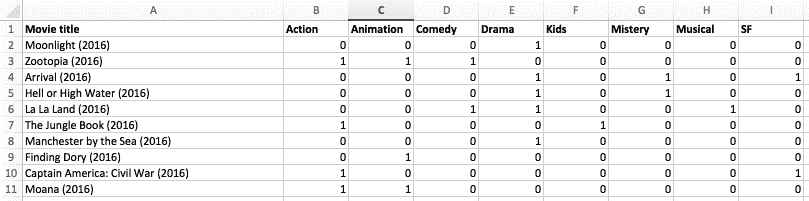

在前面的屏幕截图中，你可以看到我们如何使用二进制系统来表示一部电影是否属于某个类型（通过`1`编码）或不是（通过`0`编码）。

我们可以通过使用`readdlm`函数，该函数位于`DelimitedFiles`模块中，轻松地将这样的表从 CSV/TSV 文件加载到 Julia 中。此模块是 Julia 默认安装的一部分，因此无需添加：

```py
julia> using DelimitedFiles 
Julia> movies = readdlm("top_10_movies.tsv", '\t', skipstart=1) 
skipstart=1 tells Julia to skip the first line when reading the *Tab* separated top_10_movies.tsv file—otherwise, Julia would interpret the header row as a data row as well.
```

还有一种选择是让`readdlm`知道第一行是标题，通过传递`header = true`。然而，这将改变函数调用的返回类型为`(data_cells, header_cells)`的元组，这在交互式环境中不会被漂亮地打印。在这个探索阶段，我们更倾向于以表格形式表示数据。结果是包含我们的电影标题及其类型的表格数据结构：

```py
 10×9 Array{Any,2}: 
 "Moonlight (2016)"                   0  0  0  1  0  0  0  0 
 "Zootopia (2016)"                    1  1  1  0  0  0  0  0 
 "Arrival (2016)"                     0  0  0  1  0  1  0  1 
 "Hell or High Water (2016)"          0  0  0  1  0  1  0  0 
 "La La Land (2016)"                  0  0  1  1  0  0  1  0 
 "The Jungle Book (2016)"             1  0  0  0  1  0  0  0 
 "Manchester by the Sea (2016)"       0  0  0  1  0  0  0  0 
 "Finding Dory (2016)"                0  1  0  0  0  0  0  0 
 "Captain America: Civil War (2016)"  1  0  0  0  0  0  0  1 
 "Moana (2016)"                       1  1  0  0  0  0  0  0 
```

让我们看看我们可以向观看上述电影《海底总动员》（2003）的用户推荐哪部电影。烂番茄将《海底总动员》（2003）归类为*动画*、*喜剧*和*儿童*类型。我们可以这样编码：

```py
julia> nemo = ["Finding Nemo (2003)", 0, 1, 1, 0, 1, 0, 0, 0] 9-element Array{Any,1}: 
  "Finding Nemo (2003)" 
 0 
 1 
 1 
 0 
 1 
 0 
 0 
 0 
```

要根据类型进行电影推荐，我们只需找到最相似的电影，即与我们观看的上述电影《海底总动员》（2003）共享最多类型的电影。

存在着许多用于计算项目之间相似度（或相反，距离）的算法——在我们的情况下，因为我们只处理二进制值，汉明距离看起来是一个不错的选择。汉明距离是一个用来表示两个二进制字符串之间差异的数字。这个距离是通过比较两个二进制值并考虑对应位不同的位置数量来计算的。我们将依次比较每个位，并根据位是否不同或相同记录`1`或`0`。如果它们相同，我们记录一个`0`。对于不同的位，我们记录一个`1`。然后，我们将记录中的所有`1`和`0`相加，以获得汉明距离。

在`Distances`包中有一个用于计算汉明距离的函数。这是一个第三方 Julia 包，它提供了访问多种用于评估向量之间距离的函数，包括欧几里得、贾卡德、汉明、余弦等。我们只需运行以下命令即可访问这个功能丰富的宝藏：

```py
julia> using Pkg 
pkg> add Distances  
julia> using Distances 
```

然后，我们需要遍历我们的电影矩阵，并计算每部电影与《海底总动员》（2003）之间的汉明距离：

```py
julia> distances = Dict{String,Int}() 
Dict{String,Int64} with 0 entries 

julia> for i in 1:size(movies, 1) 
            distances[movies[i,:][1]] = hamming(Int[movies[i,2:end]...], Int[nemo[2:end]...]) 
       end 
Finding Nemo (2003). To do this, we only extracted the genres (leaving off the name of the movie) and converted the list of values into an array of Int. Finally, we placed the result of the computation into the distances Dict we defined previously, which uses the name of the movie as the key, and the distance as the value.
```

这就是最终结果：

```py
julia> distances 
Dict{String,Int64} with 10 entries: 
  "The Jungle Book (2016)"            => 3 
  "Hell or High Water (2016)"         => 5 
  "Arrival (2016)"                    => 6 
  "La La Land (2016)"                 => 4 
  "Moana (2016)"                      => 3 
  "Captain America: Civil War (2016)" => 5 
  "Moonlight (2016)"                  => 4 
  "Finding Dory (2016)"               => 2 
  "Zootopia (2016)"                   => 2 
  "Manchester by the Sea (2016)"      => 4
```

由于我们正在计算距离，最相似的电影是那些距离最短的电影。因此，根据我们的推荐系统，一个看过《海底总动员》（2003）的用户接下来应该观看《海底总动员 2：多莉去哪儿》（2016）或《疯狂动物城》（2016）（距离为`2`），看完之后，应该继续观看《森林书》（2016）和《莫阿娜》（2016）（两者距离均为`3`）。如果你还没有看过这些推荐的影片，我可以告诉你，这些建议相当合适。同样，最不推荐的影片是《降临》（2016），尽管它是一部优秀的科幻剧情片，但与可爱的尼莫和健忘的多莉没有任何共同之处。

# 从基于关联的推荐开始

尽管基于内容的推荐系统能够产生很好的结果，但它们确实存在局限性。首先，它们不能用来推荐新项目。仅基于我对《海底总动员》（2003）的初始排名，我可能会一直只得到动画电影的推荐，而永远没有机会听到关于任何我有时会喜欢的纪录片、汽车或烹饪节目。

此外，它最适合那些可以重复购买的商品类别，例如书籍、应用、歌曲或电影等。但如果你在亚马逊上购买了一个新的洗碗机，属于`家居和厨房`类别，那么得到关于同一组产品（如冰箱或洗衣机）的推荐就没有太多意义，因为很可能你不会同时更换所有昂贵的厨房电器。然而，我可能需要相应的接头、阀门、管道以及其他安装洗碗机所需的东西，以及推荐的洗涤剂和其他配件。由于电子商务平台也在销售所有这些产品，因此一起订购并同时收到它们是有益的，这样可以节省运输费用。

这些产品组合可以成为基于产品关联的 RS 的基础。这类推荐相当常见，通常在电子商务平台上以`经常一起购买`的形式呈现。对于实体店来说，这种数据分析——也称为**市场篮子分析**——用于将一起购买的产品放置在靠近的物理位置。例如，想想意大利面和酱料并排摆放，或者洗发水和护发素并排摆放。

在基于关联的推荐系统中，最流行的算法之一是`Apriori`算法。它用于识别在不同场景（如购物篮、网页浏览、不良药物反应等）中经常一起出现的项目。`Apriori`算法通过使用关联规则帮助我们通过数据挖掘来识别相关性。

空间限制使我们无法深入了解构建此类系统的细节，但如果你想要深入了解这个话题，有许多免费资源可以帮助你入门。我建议从《基于市场篮子的电影推荐》开始，[`rpubs.com/vitidN/203264`](https://rpubs.com/vitidN/203264)，因为它构建的电影推荐器与我们非常相似。

# 了解协同过滤

**协同过滤**（**CF**）是另一种非常成功且广泛使用的推荐算法。它基于这样一个观点：具有相似偏好的用户将有相似的兴趣。如果两位客户，我们可以称他们为安妮和鲍勃，对《海底奇缘》（2003）给出了好评，并且安妮也高度评价了《海底总动员》（2016），那么鲍勃也很可能喜欢《海底总动员》（2016）。当然，比较两个用户和两个产品可能看起来不多，但应用到代表用户和产品的非常大数据集中，推荐就变得高度相关。

如果你对于 CF（协同过滤）和内容过滤之间的区别感到困惑，因为两者都可以根据《海底总动员》（2016）推断出《海底奇缘》（2003），关键点在于 CF 不关心项目属性。实际上，在使用 CF 时，我们不需要电影类型信息，也不需要任何其他标签。算法并不关心项目的分类。它基本上表明，如果由于任何原因，某些项目被用户子集高度评价，那么其他被同一子集高度评价的项目对我们目标用户来说将是相关的，从而形成良好的推荐。

# 理解用户-项目 CF

这就是基本思想，随着大数据的到来，CF 技术变得相当强大。由于它被应用于不同的商业需求和用法场景，算法被改进以更好地解决它试图解决的问题。因此，出现了一些其他方法，原始方法因此被称为**用户-项目 CF**。

它之所以得名，是因为它以用户数据（用户偏好、排名）作为输入，并输出项目数据（项目推荐）。它也被称为**基于用户的 CF**。

你可以在以下图表中看到它的说明：

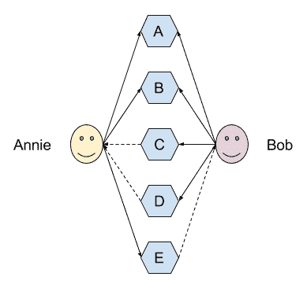

上述图表显示，**安妮**喜欢**A**、**B**和**E**，而**鲍勃**喜欢**A**、**B**、**C**和**D**。

`recommender`算法确定，在**Annie**和**Bob**之间有很高的相似度，因为他们都喜欢项目**A**和**B**。接下来，它将假设**Annie**也会喜欢 Bob 偏好列表中她尚未发现的其它项目，反之亦然——**Bob**会喜欢 Annie 列表中他尚未发现的项目。因此，由于 Annie 也喜欢项目 E，我们可以向**Bob**推荐它，并且由于**Bob**非常喜欢**C**和**D**，而 Annie 对这些一无所知，我们可以自信地建议她检查它们。

让我们再举一个非常简单的例子，同样来自电影推荐领域。继续使用我们之前在烂番茄网站上列出的 2016 年十大电影，这次，让我们忽略按类型分类，而是想象我们有用户评分数据：

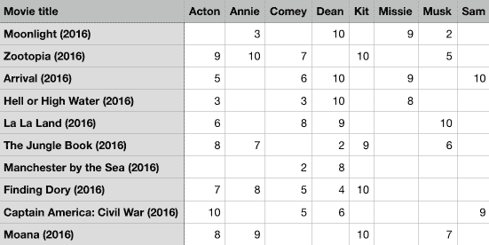

前面的屏幕截图显示了一个包含电影标题和用户及其对应评分的表格。正如现实生活中发生的那样，并非所有用户都为所有电影评分——未评分的表示为空单元格。

你会在前面的屏幕截图中注意到，由于信仰的奇特转折，用户的姓名提供了他们偏好的电影类型的线索。Acton 非常喜欢动作电影，而 Annie 则热爱动画。Comey 的最爱是喜剧，而 Dean 则喜欢优秀的戏剧。Kit 的最高排名是儿童电影，Missie 喜欢悬疑电影，而音乐电影是 Musk 狂热观看的原因。最后，Sam 是一位科幻迷。

数据集在本章的文件中以`top_10_movies_user_rankings.csv`的名称提供。请从[`github.com/PacktPublishing/Julia-Programming-Projects/blob/master/Chapter06/top_10_movies_user_rankings.csv`](https://github.com/PacktPublishing/Julia-Programming-Projects/blob/master/Chapter06/top_10_movies_user_rankings.csv)下载它，并将其放置在您可以从 Julia 的 REPL 轻松访问的硬盘上的某个位置。

我们可以使用之前提到的相同的`readdlm` Julia 函数将其加载到内存中：

```py
movies = readdlm("/path/to/top_10_movies_user_rankings.csv", ';') 
```

此文件使用`;`字符作为列分隔符，因此我们需要将其传递给`readdlm`函数调用。记住，在 Julia 中，`";"`与`':'`不同。前者是一个长度为 1 的`String`，而后者是一个`Char`。

这是读取`.csv`文件的结果——一个包含电影在行上和人在列上的矩阵，每个人的评分对应于行和列的交叉点：

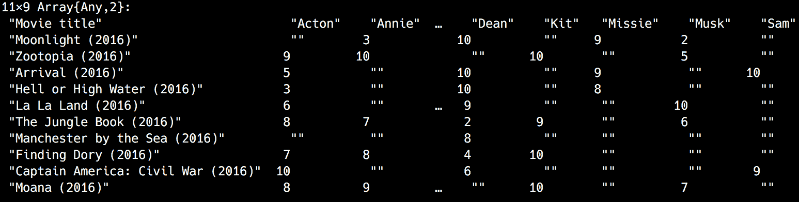

它是有效的，但数据看起来并不太好。在现实生活中，数据通常不会从所有用户那里都有评分。`缺失`值被导入为空字符串`""`，并且标题被解释为矩阵中的条目。Julia 的`readdlm`非常适合快速导入数据，但对于更高级的数据处理，我们可以从使用 Julia 强大的`DataFrames`包中受益良多。

`DataFrames`是一个第三方 Julia 包，它提供了一组丰富的函数来操作表格数据。你应该在我们的第一章《Julia 编程入门》中了解它——如果不是，请花几分钟时间回顾一下那部分内容。接下来的讨论将假设你对`DataFrames`有基本的了解，这样我们就可以现在专注于更高级的功能和用例。

如果由于某种原因，你不再有`DataFrames`包，`pkg> add DataFrames`就是我们需要做的全部。在此同时，让我们也安装`CSV`包——它是一个强大的实用库，用于处理分隔文本文件。我们可以一步添加这两个包：

```py
pkg> add DataFrames CSV 
```

我们将使用`CSV`来加载逗号分隔的文件并生成一个`DataFrame`：

```py
julia> movies = CSV.read("top_10_movies_user_rankings.csv", delim = ';') 
```

结果的`DataFrame`应该看起来像这样：

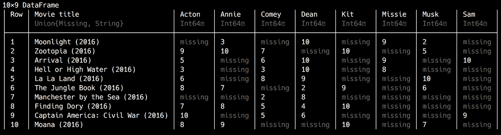

我们得到了一个美观的表格数据结构，缺失的评分被正确地表示为`missing`数据。

我们可以使用`describe`函数来快速总结我们的数据：

```py
julia> describe(movies) 
```

这个输出的结果如下：

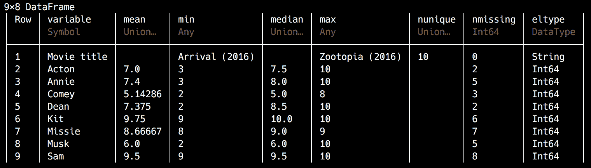

多个列存在`缺失`值。一个`缺失`值表示在数据集中不存在的数据。它在`Missings`包（[`github.com/JuliaData/Missings.jl`](https://github.com/JuliaData/Missings.jl)）中定义，并且是`Missing`类型的单例实例。如果你熟悉 SQL 中的`NULL`或 R 中的`NA`，那么在 Julia 中`missing`是相同的。

在处理现实生活中的数据集时，`缺失`值是有问题的，因为它们可能会影响计算的准确性。因此，涉及`missing`值的常见操作通常会传播`missing`。例如，`1 + missing`和`cos(missing)`都会返回`missing`。

我们可以使用`ismissing`函数来检查一个值是否缺失：

```py
julia> movies[1,2] 
missing

julia> ismissing(movies[1, 2]) 
true 
```

在许多情况下，`缺失`值需要被跳过或替换为有效值。替换`missing`的适当值将取决于具体情况，由业务逻辑决定。在我们的案例中，对于缺失的评分，我们可以使用值`0`。按照惯例，我们可以同意有效评分的范围是从`1`到`10`，并且评分`0`对应于没有任何评分。

一种替换的方法是遍历除了`电影标题`之外的所有列，然后遍历每个单元格，如果相应的值是缺失的，就将其替换为`0`。以下是代码：

```py
julia> for c in names(movies)[2:end] 
           movies[ismissing.(movies[c]), c] = 0 
       end 
```

我们已经完成了——我们的数据现在干净了，所有之前缺失的值都被零替换了：

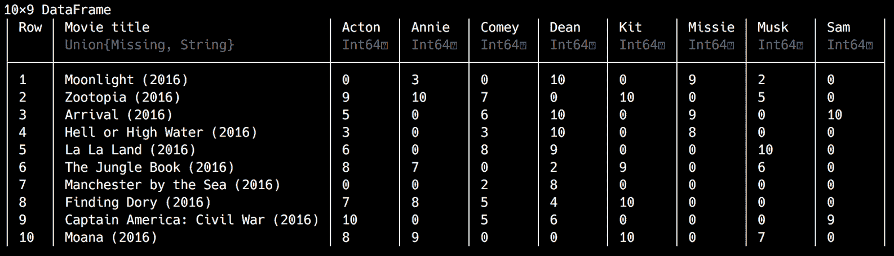

如果您能将我们数据的这个干净版本保存为*Tab*分隔的文件，以供将来参考，以下代码将有所帮助：

```py
julia> CSV.write("top_10_movies_user_rankings.tsv", movies, delim='\t') 
```

现在我们已经将评分加载到 Julia 中，下一步是计算不同用户之间的相似度。在计算基于内容的推荐时我们使用的汉明距离，对于数值数据来说不是一个好的选择。一个更好的替代方案是皮尔逊相关系数。这个系数也称为***皮尔逊 r*或双变量相关**，是衡量两个变量之间线性相关程度的度量。它的值在`+1`和`−1`之间。`1`的值表示完全正线性相关（两个值同时增加），而`-1`表示完全负线性相关（一个值减少而另一个值增加）。`0`的值表示没有线性相关。

这里有一些散点图的示例，展示了相关系数的不同可视化（由 Kiatdd—自行工作，CC BY-SA 3.0，[`commons.wikimedia.org/w/index.php?curid=37108966`](https://commons.wikimedia.org/w/index.php?curid=37108966)）：

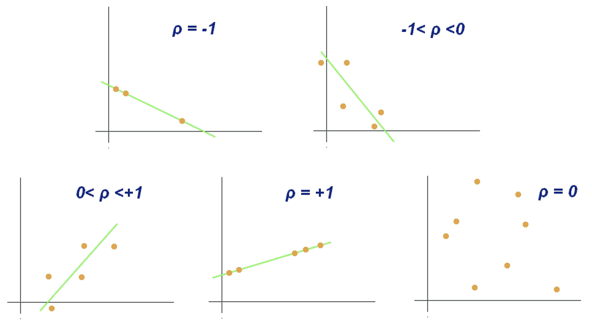

让我们看看如何根据他们提供的电影评分计算 Acton 和 Annie 之间的相似度。让我们简化问题，严格关注他们的数据，通过提取`Movie title`列以及`Acton`和`Annie`列：

```py
julia> acton_and_annie = movies[:, 1:3] 
```

输出如下：

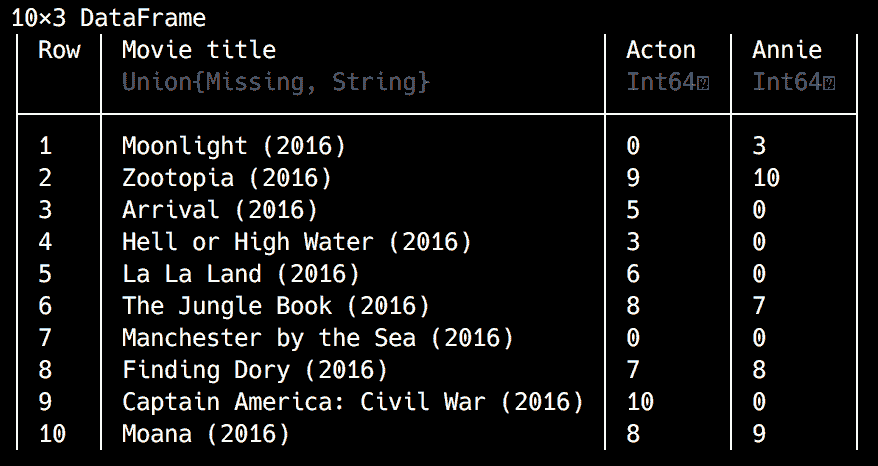

这将返回另一个`DataFrame`，称为`acton_and_annie`，它对应于`movies` `DataFrame`中的一到三列，代表 Acton 和 Annie 对每部电影的评分。

这很好，但我们只对两个用户都评分的电影感兴趣。如果您还记得我们在第一章中关于`DataFrame`的讨论——“Julia 编程入门”，我们可以通过传递布尔值来选择行（和列）——`true`表示选择，`false`表示跳过。我们可以结合点语法进行元素级操作，检查`:Acton`和`:Annie`列中的值是否大于`0`。代码将如下所示：

```py
julia> acton_and_annie_in_common = acton_and_annie[(acton_and_annie[:Acton] .> 0) .& (acton_and_annie[:Annie] .> 0), :] 
(acton_and_annie[:Acton] .> 0) .& (acton_and_annie[:Annie] .> 0) expression to check element-wise if the values in the Acton and Annie columns are greater than 0. Each comparison will return an array of true/false values—more exactly two 10-element BitArrays, as follows:
```

```py
julia> acton_and_annie[:Acton] .> 0 
10-element BitArray{1}: 
 false 
  true 
  true 
  true 
  true 
  true 
 false 
  true 
  true 
  true 

julia> acton_and_annie[:Annie] .> 0 
10-element BitArray{1}: 
  true 
  true 
 false 
 false 
 false 
  true 
 false 
  true 
 false 
  true 
```

接下来，我们将位运算符`&`应用于结果数组，该运算符也是元素级的：

```py
julia> (acton_and_annie[:Acton] .> 0) .& (acton_and_annie[:Annie] .> 0) 
10-element BitArray{1}: 
 false 
  true 
 false 
 false 
 false 
  true 
 false 
  true 
 false 
  true 
DataFrame that contains only the movies that have been rated by both Acton and Annie:
```

输出如下：

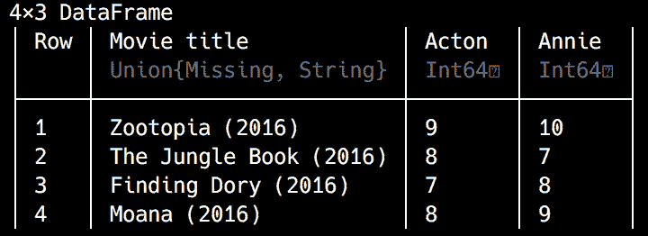

让我们绘制评分。Julia 提供了相当多的绘图选项。我们在 第一章，*开始使用 Julia 编程* 中看到了一些，我们将在 第九章，*处理日期、时间和时间序列* 中更详细地探讨绘图。现在，我们将使用名为 `Plots` 的库来快速可视化我们的数据。

`Plots` 是设计为一个高级接口，用于其他绘图库（在 `Plots` 语言中称为 *backends*），例如 `GR` 或 `PyPlot`。它基本上将多个低级绘图包（后端）统一在一个公共 API 下。

像往常一样，先使用 `pkg> add Plots` 命令，然后继续使用 `using Plots`。

我们现在可以生成可视化：

```py
julia> plot(acton_and_annie_in_common[:,2], acton_and_annie_in_common[:,3], seriestype=:scatter, xticks=0:10, yticks=0:10, lims=(0,11), label="")
plot function, passing it Acton's and Annie's ratings. As options, we ask it to produce a scatter plot. We also want to make sure that the axes start at 0 and end at 11 (so that value 10 is fully visible), with ticks at each unit. We'll end up with the following plot:
```

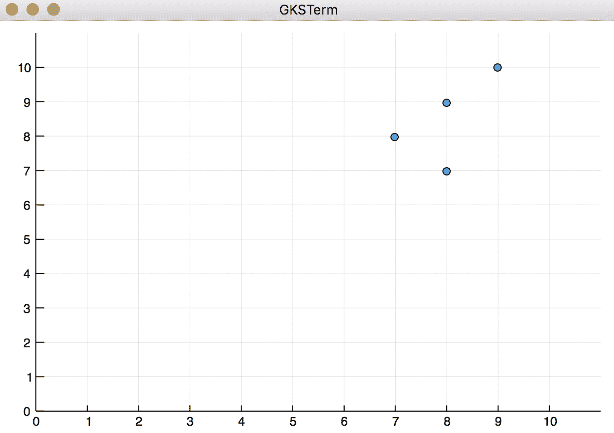

从外观上看，用户的电影偏好之间有很好的相关性。但我们还可以做得更好。

Julia 的生态系统提供了访问另一个强大的包，它结合了绘图和统计功能。它被称为 `StatPlots`，实际上是在 `Plots` 包之上工作的，为 `Plots` 提供了统计绘图配方。它还支持开箱即用的 `DataFrame` 可视化，因此它非常适合我们的需求。

让我们使用 `pkg> add StatPlots` 命令添加它，并将其引入作用域（`using StatPlots`）。现在我们可以使用 `StatPlots` 提供的 `@df` 宏来生成我们数据的散点图：

```py
julia> @df acton_and_annie_in_common scatter([:Acton], [:Annie], smooth = true, line = :red, linewidth = 2, title = "Acton and Annie", legend = false, xlimits = (5, 11), ylimits = (5, 11)) 
```

上述代码将产生以下可视化效果：

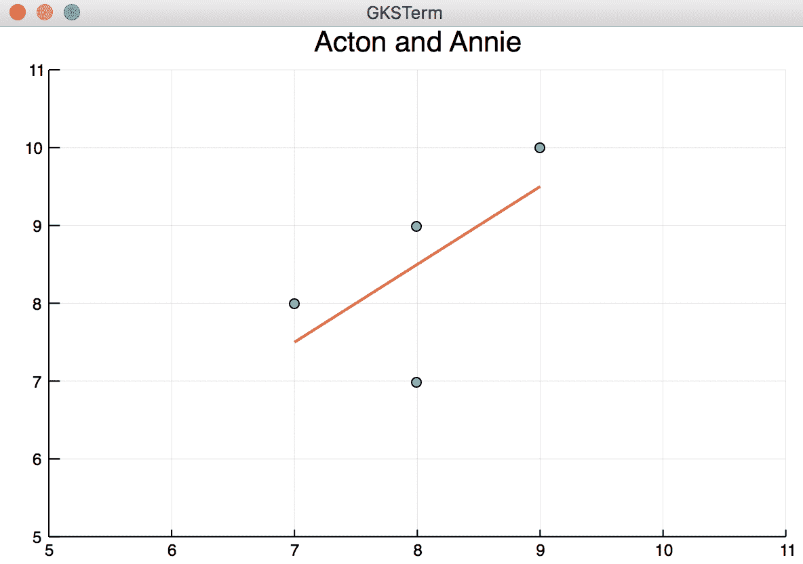

这个新的图表显示了电影之间的相关性，尽管存在异常值。

让我们计算 Acton 和 Annie 评分之间的皮尔逊相关系数：

```py
julia> using Statistics 
julia> cor(acton_and_annie_in_common[:Acton], acton_and_annie_in_common[:Annie]) 

0.6324555320336759 
```

几乎任何超过 `0.6` 的值都表示良好的相似性，所以看起来我们正在找到一些东西。

现在，我们可以向 Annie 推荐一些 Acton 的最爱电影，她还没有看过，如下所示：

```py
julia> annies_recommendations = acton_and_annie[(acton_and_annie[:Annie] .== 0) .&  (acton_and_annie[:Acton] .> 0), :]
acton_and_annie DataFrame, we only select the rows where Annie's score is 0 (she hasn't rated the movie) and Acton's is greater than 0 (he has rated the movie).
```

我们将得到一个包含四行的 `DataFrame`：

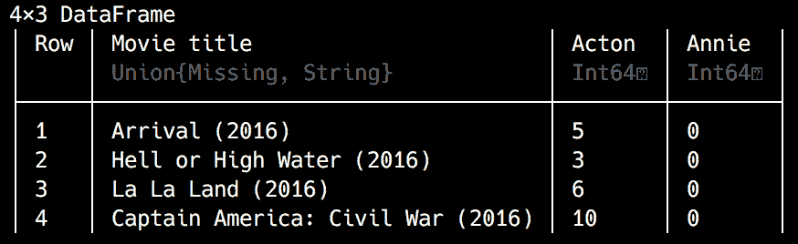

然而，这里有一个小问题。我们假设所有评分都表示强烈的偏好，但在这个情况下，Acton 的许多评分实际上更像是表示不喜欢。除了 `Captain America: Civil War (2016)` 之外，所有可能的推荐都有不良的评分。幸运的是，这很容易解决——我们只需要推荐评分至少为 `7` 的电影：

```py
julia> annies_recommendations = acton_and_annie[(acton_and_annie[:Annie] .== 0) .&(acton_and_annie[:Acton] .>= 7 ), :] 
```

这就留下了我们唯一一部电影，`Captain America: Civil War (2016)`：

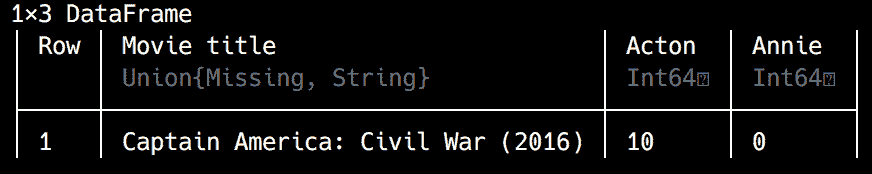

现在我们已经理解了基于用户的推荐系统的逻辑，让我们将这些步骤全部放在一起，创建一个简单的推荐脚本。

我们将在一个脚本中分析我们用户的评分矩阵，该脚本将利用所有可用数据为我们所有用户生成推荐。

这是一个可能的实现——请创建一个名为`user_based_movie_recommendations.jl`的文件，并包含以下代码。请确保`top_10_movies_user_rankings.tsv`文件在同一个文件夹中（或者更新代码中的路径以匹配您的位置）。以下是代码：

```py
using CSV, DataFrames, Statistics

const minimum_similarity = 0.8
const movies = CSV.read("top_10_movies_user_rankings.tsv", delim = '\t')

function user_similarity(target_user)
    similarity = Dict{Symbol,Float64}()
    for user in names(movies[:, 2:end])
        user == target_user && continue
        ratings = movies[:, [user, target_user]]
        common_movies = ratings[(ratings[user] .> 0) .& (ratings[target_user] .> 0), :]

        correlation = try
            cor(common_movies[user], common_movies[target_user])
        catch
            0.0
        end

        similarity[user] = correlation
    end

    similarity
end

function recommendations(target_user)
    recommended = Dict{String,Float64}()
    for (user,similarity) in user_similarity(target_user)
        similarity > minimum_similarity || continue
        ratings = movies[:, [Symbol("Movie title"), user, target_user]]
        recommended_movies = ratings[(ratings[user] .>= 7) .& (ratings[target_user] .== 0), :]

        for movie in eachrow(recommended_movies)
            recommended[movie[Symbol("Movie title")]] = movie[user] * similarity
        end
    end

    recommended
end

for user in names(movies)[2:end]
    println("Recommendations for $user: $(recommendations(user))")
end
user_similarity and recommendations. They both take, as their single argument, a user's name in the form of a Symbol. This argument matches the column name in our movies DataFrame.
```

`user_similarity`函数计算我们的目标用户（作为函数参数传入的用户）与其他所有用户的相似度，并返回一个形式的字典：

```py
Dict(
    :Comey => 1.0,
    :Dean => 0.907841,
    :Missie => NaN,
    :Kit => 0.774597,
    :Musk => 0.797512,
    :Sam => 0.0,
    :Acton => 0.632456
)
```

`dict`表示安妮与其他所有用户的相似度。

我们在推荐函数中使用相似度来选择相关的用户，并根据他们喜欢的电影（这些电影尚未被我们的目标用户评分）进行推荐。

我还增加了一个小变化，使推荐更加相关——一个权重因子。这是通过将用户的评分与用户的相似度相乘来计算的。比如说，如果科米给一部电影打 8 分，并且与米西 100%相似（相关系数等于 1），那么推荐的权重也将是*8（8 * 1）*。但如果科米只与马斯克 50%相似（0.5 的相关系数），那么推荐的权重（对应于估计的评分）将只是*4（8 * 0.5）*。

在文件末尾，我们通过遍历所有用户的数组来引导整个过程，并为每个用户生成和打印电影推荐。

运行此代码将输出电影推荐，以及每个用户的权重：

```py
Recommendations for Acton: Dict("Moonlight (2016)"=>9.0)
Recommendations for Annie: Dict("La La Land (2016)"=>8.0)
Recommendations for Comey: Dict("The Jungle Book (2016)"=>7.0,"Moana (2016)"=>7.0,"Moonlight (2016)"=>9.0)
Recommendations for Dean: Dict("Moana (2016)"=>10.0,"Zootopia (2016)"=>10.0)
Recommendations for Kit: Dict("Hell or High Water (2016)"=>10.0,"Arrival (2016)"=>10.0,"La La Land (2016)"=>9.0,"Moonlight (2016)"=>10.0,"Manchester by the Sea (2016)"=>8.0)
Recommendations for Missie: Dict("The Jungle Book (2016)"=>8.0,
"Moana (2016)"=>8.0, "La La Land (2016)"=>8.0,"Captain America: Civil War (2016)"=>10.0,"Finding Dory (2016)"=>7.0,"Zootopia (2016)"=>9.0)
Recommendations for Musk: Dict{String,Float64}()
Recommendations for Sam: Dict("Hell or High Water (2016)"=>10.0,
"La La Land (2016)"=>9.0,"Moonlight (2016)"=>10.0,"Zootopia (2016)"=>7.0,"Manchester by the Sea (2016)"=>8.0)
```

考虑到这是一个玩具示例，数据看起来相当不错。一个生产质量的推荐系统应该基于数百万这样的评分。

然而，如果你仔细观察，可能会注意到有些地方不太对——`Kit 的推荐`。基特喜欢儿童电影——轻松的动画喜剧。我们的系统推荐给他很多，权重很大，很多悲剧！这是怎么回事？如果我们查看基特的相似度数据，我们会看到他与迪恩非常相关，而迪恩喜欢悲剧。这听起来可能有些奇怪，但如果检查数据，这实际上是正确的：

```py
julia> movies[:, [Symbol("Movie title"), :Dean, :Kit]] 
```

输出如下：

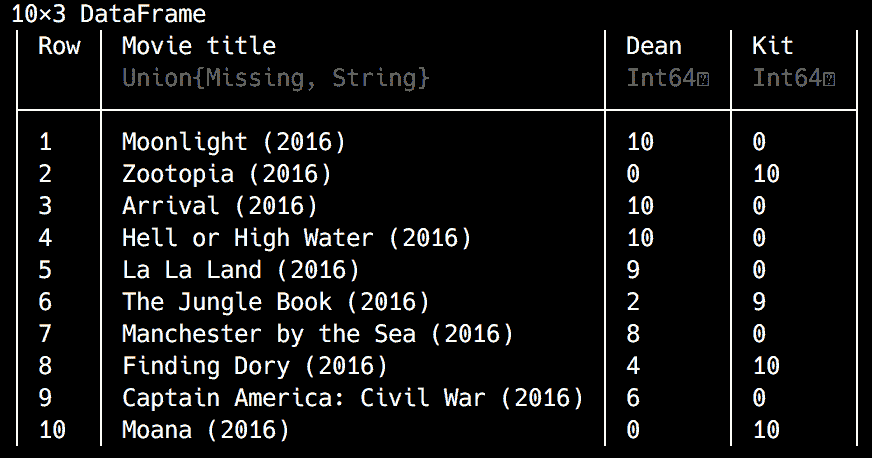

注意他们俩都看过的电影只有《森林书》（2016）和《海底总动员》（2016），以及评分是如何相关的，因为两者都对《海底总动员》（2016）给出了更高的评分。因此，迪恩和基特之间存在强烈的正相关。但我们的算法没有考虑到，即使迪恩比《森林书》（2016）更喜欢《海底总动员》（2016），他实际上对这两部电影都不太喜欢，正如他给出的低评分（分别为 4 和 2）所示。

解决方案相当简单，尽管如此——我们只需要移除那些没有表明强烈正面偏好的评分。再次强调，我们可以使用等于或大于`7`的评分来计算喜欢。因此，在`user_similarity`函数中，请查找以下行：

```py
common_movies = ratings[(ratings[user] .> 0) .& (ratings[target_user] .> 0), :]
```

将`ratings[user] .> 0`替换为`ratings[user] .> 7`，这样整个行现在如下所示：

```py
common_movies = ratings[Array(ratings[user] .> 7) .& Array(ratings[target_user] .> 0), :]
```

这所做的现在是基于收藏夹来计算相似度。因此，`Kit`不再与`Dean`相似（相关系数为`0`）。

我们推荐更加有针对性的另一个后果是，我们不再为所有用户提供推荐——但这同样是由于我们正在处理一个非常小的示例数据集。以下是最终的推荐：

```py
Recommendations for Acton: Dict("Moonlight (2016)"=>9.0) 
Recommendations for Annie: Dict{String,Float64}() 
Recommendations for Comey: Dict( 
"Moana (2016)"=>9.0, 
"Moonlight (2016)"=>9.0) 
Recommendations for Dean: Dict( 
"Moana (2016)"=>8.0, 
"Zootopia (2016)"=>9.0) 
Recommendations for Kit: Dict{String,Float64}() 
Recommendations for Missie: Dict{String,Float64}() 
Recommendations for Musk: Dict{String,Float64}() 
Recommendations for Sam: Dict{String,Float64}() 
```

我们只为 Acton、Comey 和 Dean 提供建议，但现在它们更加准确。

# 物品-物品协同过滤

基于用户的协同过滤工作得相当好，并且在野外生产中被广泛使用，但它确实有几个相当大的缺点。首先，很难从用户那里获取足够多的偏好信息，导致许多用户没有相关推荐的坚实基础。其次，随着平台和底层业务的增长，用户的数量将比物品的数量增长得快得多。例如，Netflix 为了将讨论保持在熟悉的电影领域，通过扩展到新国家，其用户基础大幅增长，而电影的产量在每年基本上保持不变。最后，用户的数据确实变化很大，因此评分矩阵需要经常更新，这是一个资源密集和时间消耗的过程。

这些问题在大约 10 年前的亚马逊变得非常明显。他们意识到，由于产品的数量增长速度远低于用户的数量，他们可以计算项目相似度，而不是用户相似度，并基于相关项目列表进行推荐。

下面的图表应该有助于你理解基于物品（或物品-物品）和基于用户（或用户-物品）协同过滤之间的区别：

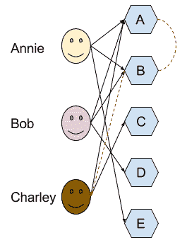

上述图表显示，**安妮**购买了**A**、**B**和**E**，**鲍勃**购买了**A**、**B**和**D**，而**查理**购买了**A**和**C**。**安妮**和**鲍勃**的购买行为将表明**A**和**B**之间存在相关性，由于**查理**已经购买了**A**但没有购买**B**，我们可以向**查理**推荐看看**B**。

从实现的角度来看，它与用户-项目协同过滤有相似之处，但它更为复杂，因为它包括一个额外的分析层。让我们用我们的假想电影排名来试试。让我们创建一个名为`item_based_recommendations.jl`的新文件来存放我们的代码。

这里是完整的实现：

```py
using CSV, DataFrames, DelimitedFiles, Statistics

const minimum_similarity = 0.8

function setup_data()
    movies = readdlm("top_10_movies_user_rankings.tsv", '\t')
    movies = permutedims(movies, (2,1))
    movies = convert(DataFrame, movies)

    names = convert(Array, movies[1, :])[1,:]
    names!(movies, [Symbol(name) for name in names])
    deleterows!(movies, 1)
    rename!(movies, [Symbol("Movie title") => :User])
end

function movie_similarity(target_movie)
    similarity = Dict{Symbol,Float64}()
    for movie in names(movies[:, 2:end])
        movie == target_movie && continue
        ratings = movies[:, [movie, target_movie]]
        common_users = ratings[(ratings[movie] .>= 0) .& (ratings[target_movie] .> 0), :]

        correlation = try
            cor(common_users[movie], common_users[target_movie])
        catch
            0.0
        end

        similarity[movie] = correlation
    end

    # println("The movie $target_movie is similar to $similarity")
    similarity
end

function recommendations(target_movie)
    recommended = Dict{String,Vector{Tuple{String,Float64}}}()
    # @show target_movie
    # @show movie_similarity(target_movie)

    for (movie, similarity) in movie_similarity(target_movie)
        movie == target_movie && continue
        similarity > minimum_similarity || continue
        # println("Checking to which users we can recommend $movie")
        recommended["$movie"] = Vector{Tuple{String,Float64}}()

        for user_row in eachrow(movies)
            if user_row[target_movie] >= 5
                # println("$(user_row[:User]) has watched $target_movie so we can recommend similar movies")
                if user_row[movie] == 0
                    # println("$(user_row[:User]) has not watched $movie so we can recommend it")
                    # println("Recommending $(user_row[:User]) the movie $movie")
                    push!(recommended["$movie"], (user_row[:User], user_row[target_movie] * similarity))
                end
            end
        end
    end

    recommended
end

const movies = setup_data()
println("Recommendations for users that watched Finding Dory (2016): $(recommendations(Symbol("Finding Dory (2016)")))")
```

为了使代码更简单，我们只为单部电影生成推荐——但将其扩展到为列表中的每部电影生成推荐相对简单（你可以尝试作为练习来做）。我们只会向看过《海底总动员》（2016）的用户推荐类似的电影。

让我们将其拆开来看看脚本是如何工作的。

正如你所见，我添加了一些`println`和`@show`调用，它们输出额外的调试信息——它们被注释掉了，但当你运行文件时，请随意取消注释它们，以帮助你更好地理解每个部分的作用以及代码的工作流程。

现在设置数据矩阵更困难了。我们需要转置我们的初始数据集，即旋转它。`setup_data`函数专门用于这项任务——加载数据文件，转置矩阵，并将数据设置到`DataFrame`中。这只是一个几行代码的合适**提取、转换、加载**（**ETL**）过程，这相当酷！让我们仔细看看——这是一个相当常见的一天到晚的数据科学任务。

在函数的第一行，我们将数据加载到一个 Julia 矩阵中。`readdlm`函数没有`DataFrames`强大，所以它没有标题的知识，将所有内容都吞进一个`Array`：

```py
julia> movies = readdlm("top_10_movies_user_rankings.tsv", '\t') 
```

我们最终会得到以下矩阵：

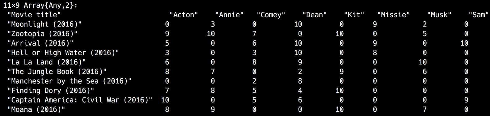

正如我们所见，标题与实际数据混合在一起。

现在，我们需要转置矩阵。不幸的是，在 Julia 中，转置并不总是对所有类型的矩阵工作得很好，推荐的方法是通过`permutedims`来完成：

```py
julia> movies = permutedims(movies, (2,1)) 
```

输出如下：

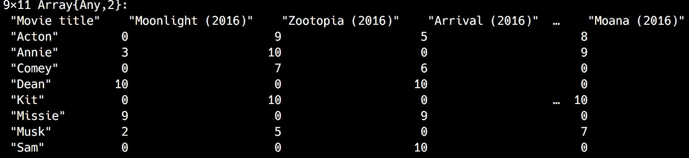

我们越来越接近了！

接下来，我们将其转换为`DataFrame`：

```py
julia> movies = convert(DataFrame, movies) 
```

输出如下：

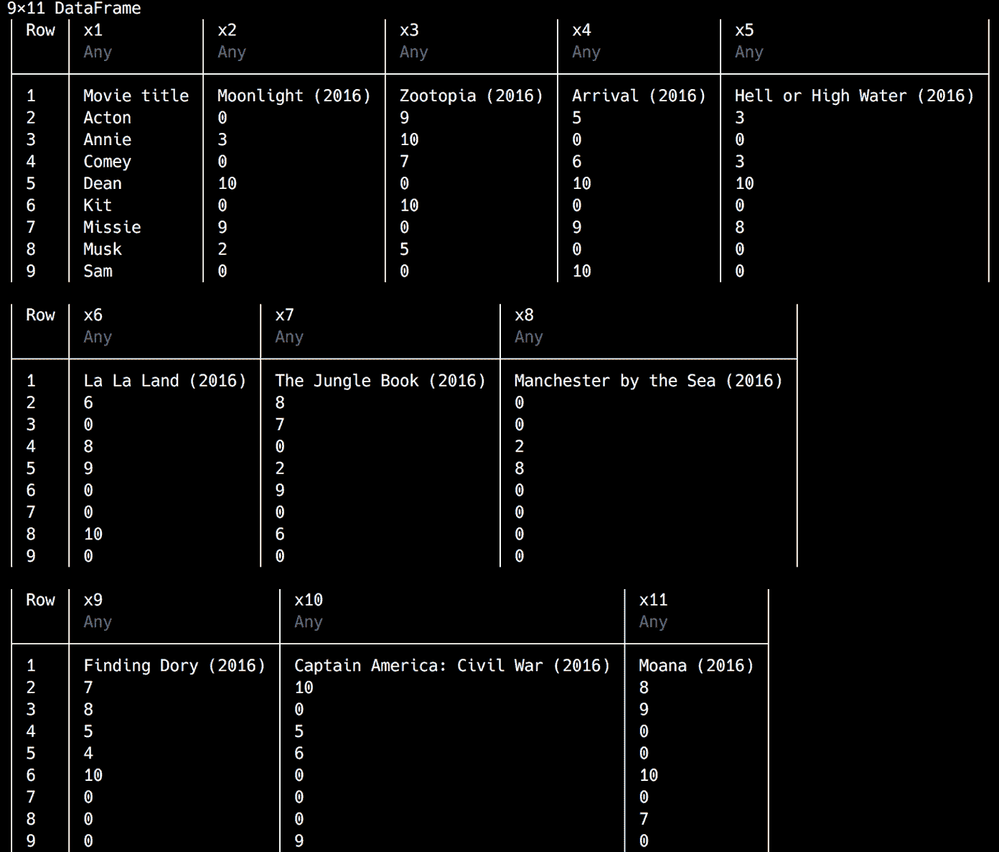

如果你亲自运行前面的代码，你可能会注意到 REPL 会省略一些`DataFrame`列，因为输出太宽了。为了使 Julia 显示所有列，就像在这个片段中一样，你可以使用`showall`函数，例如`showall(movies)`。

看起来不错，但我们需要给列赋予合适的名称，使用现在第一行上的数据。让我们将所有列名提取到一个`Vector`中：

```py
julia> movie_names = convert(Array, movies[1, :])[1,:] 
11-element Array{Any,1}: 
 "Movie title" 
 "Moonlight (2016)" 
 "Zootopia (2016)" 
 "Arrival (2016)" 
 "Hell or High Water (2016)" 
 "La La Land (2016)" 
 "The Jungle Book (2016)" 
 "Manchester by the Sea (2016)" 
 "Finding Dory (2016)" 
 "Captain America: Civil War (2016)" 
 "Moana (2016)" 
```

现在，我们可以用它来命名列：

```py
julia> names!(movies, [Symbol(name) for name in movie_names]) 
```

输出如下：

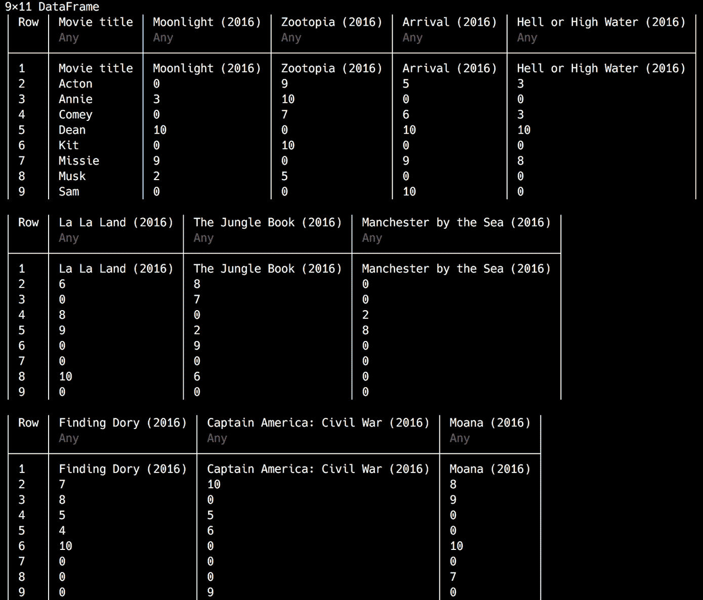

我们的`DataFrame`看起来已经好多了。剩下要做的只是删除带有标题的额外行，并将`Movie title`标题更改为`User`：

```py
julia> deleterows!(movies, 1) julia> rename!(movies, Symbol("Movie title") => :User) 
```

输出如下：

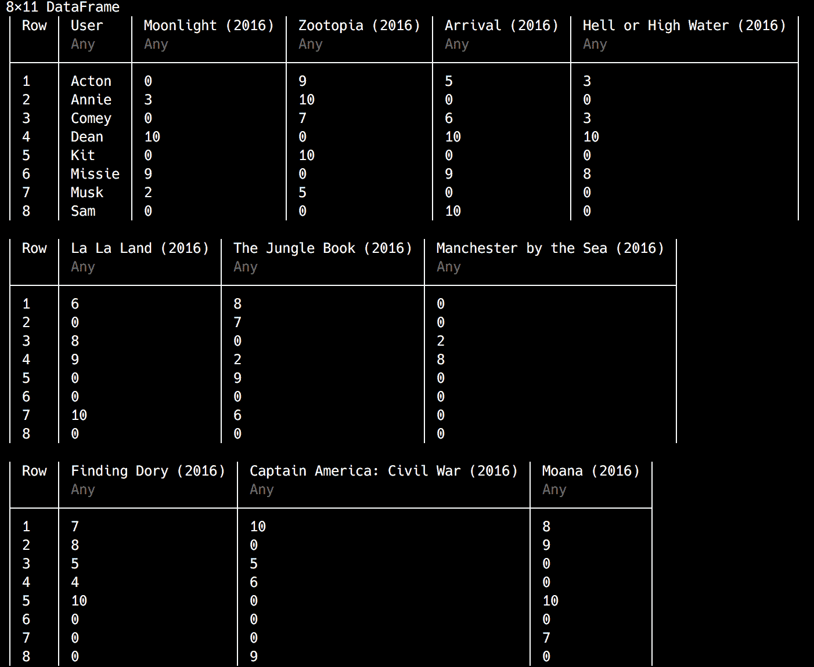

完成了——我们的 ETL 过程已经完成！

我们通过调用`recommendations`函数开始我们的推荐器，传入电影名称`Finding Dory (2016)`作为一个`Symbol`。这个函数首先调用`movie_similarity`函数，该函数根据用户的评分计算与`Finding Dory (2016)`相似的其他电影。对于我们的目标电影，我们将得到以下结果：

```py
Dict( 
Symbol("La La Land (2016)")=>-0.927374, 
Symbol("Captain America: Civil War (2016)")=>-0.584176, 
Symbol("The Jungle Book (2016)")=>0.877386, 
Symbol("Manchester by the Sea (2016)")=>-0.785933, 
Symbol("Arrival (2016)")=>-0.927809, 
Symbol("Zootopia (2016)")=>0.826331, 
Symbol("Moonlight (2016)")=>-0.589269, 
Symbol("Hell or High Water (2016)")=>-0.840462, 
Symbol("Moana (2016)")=>0.933598
) 
```

我们可以看到，与`La La Land (2016)`几乎有完美的负相关性（所以喜欢`La La Land (2016)`的用户不喜欢`Finding Dory (2016)`）。与`The Jungle Book (2016)`、`Zootopia (2016)`和`Moana (2016)`也有非常强的正相关性，这是有道理的，因为它们都是动画片。

这里逻辑变得稍微复杂一些。现在，我们有一个与《海底总动员》（2016）相似的电影的列表。为了做出推荐，我们想要查看所有看过《海底总动员》（2016）并且给出了足够好的评分的用户，并建议他们尚未观看的相似电影（评分为零的电影）。这次，我们将使用最低评分为 5 而不是之前的 7，因为鉴于我们的数据集非常有限，7 会过于严格，并且不会产生任何推荐。我们将计算建议的权重，即用户对《海底总动员》（2016）的评分与《海底总动员》（2016）和推荐电影之间的相关系数的乘积。这说得通吗？让我们看看实际效果吧！

如果我们运行脚本，我们会得到以下输出：

```py
Recommendations for users that watched Finding Dory (2016): 
Dict( 
    "The Jungle Book (2016)"=> Tuple{String,Float64}[("Comey", 4.38693)], 
    "Moana (2016)"=> Tuple{String,Float64}[("Comey", 4.66799)], 
    "Zootopia (2016)"=> Tuple{String,Float64}[]
)
```

在我们的小数据集中，唯一可能对观看与《海底总动员》（2016）相似的电影感兴趣的（有点）用户是`Comey`——但推荐不会很好。算法估计《森林书》（2016）的权重（因此，评分）为 4.38693，而《莫阿娜》（2016）的权重为 4.66799。

# 摘要

这标志着我们探索推荐系统之旅的第一部分的结束。它们是当今在线商业模式中极其重要的组成部分，其有用性随着我们连接的软件和硬件生成数据的指数级增长而不断增长。推荐系统是解决信息过载问题——或者说，信息过滤问题的非常有效的解决方案。推荐器为每个用户提供适当的过滤级别，再次将信息转化为客户赋能的向量。

虽然理解各种推荐系统的工作原理对于选择适合你在数据科学家工作中解决的问题类型的算法至关重要，但手动实现生产级别的系统并不是大多数人会做的事情。就像软件开发领域的几乎所有事情一样，当有现成的稳定、强大和成熟的库可用时，最好使用它们。

在下一章中，我们将学习如何使用现有的 Julia 库构建一个更强大的推荐系统。我们将为约会网站生成推荐，利用公开可用的匿名约会数据。在这个过程中，我们将了解另一种类型的推荐系统，称为基于模型（顺便提一下，本章讨论的所有算法都是基于内存的，但不用担心——我马上会解释一切）。
