# 第七章：推荐系统中的机器学习

我希望你现在对我们所构建的推荐系统所提供的惊人可能性感到兴奋。我们所学的技术将为你提供大量的数据驯服能力和实际应用能力，你可以在你的项目中立即应用。

然而，推荐系统不仅仅是这样。由于近年来在大型应用中的广泛应用，作为解决在线平台上大量提供所引起的信息过载的有效解决方案，推荐系统受到了很多关注，新算法的开发速度也在加快。事实上，我们在上一章研究的所有算法都属于一个单一类别，称为**基于记忆**的**推荐系统**。除此之外，还有一个非常重要的推荐系统类别，被称为**基于模型**的。

在本章中，我们将学习这些内容。我们将讨论以下主题：

+   基于记忆与基于模型的推荐系统比较

+   为基于模型的推荐系统进行数据处理的训练

+   构建基于模型的推荐系统

+   混合推荐系统

# 技术要求

Julia 包生态系统正在持续发展中，并且每天都有新的包版本发布。大多数时候这是一个好消息，因为新版本带来了新功能和错误修复。然而，由于许多包仍在测试版（版本 0.x）中，任何新版本都可能引入破坏性更改。因此，书中展示的代码可能无法正常工作。为了确保你的代码将产生与书中描述相同的结果，建议使用相同的包版本。以下是本章使用的外部包及其特定版本：

```py
CSV@v.0.4.3
DataFrames@v0.15.2
Gadfly@v1.0.1
IJulia@v1.14.1
Recommendation@v0.1.0+
```

为了安装特定版本的包，你需要运行：

```py
pkg> add PackageName@vX.Y.Z 
```

例如：

```py
pkg> add IJulia@v1.14.1
```

或者，你也可以通过下载本章提供的`Project.toml`文件并使用`pkg>`实例化来安装所有使用的包：

```py
julia> download("https://raw.githubusercontent.com/PacktPublishing/Julia-Projects/master/Chapter07/Project.toml", "Project.toml")
pkg> activate . 
pkg> instantiate
```

# 比较基于记忆与基于模型的推荐系统

理解基于记忆和基于模型的推荐系统的优缺点非常重要，这样我们才能根据可用的数据和业务需求做出正确的选择。正如我们在上一章所看到的，我们可以根据它们使用的数据和采用的算法来对推荐系统进行分类。

首先，我们可以谈谈非个性化与个性化推荐系统。非个性化推荐系统不考虑用户偏好，但这并不意味着它们不那么有用。当相关数据缺失时，例如，对于新加入系统的用户或未登录的用户，它们可以成功应用。这类推荐可能包括苹果应用商店每周最佳应用、Netflix 的热门电影、Spotify 的每日歌曲、纽约时报的畅销书、公告牌前十名等。

接下来是个性化推荐系统，这些系统可以进一步分为基于内容和协同系统。基于内容的系统通过匹配项目规格来做出推荐。这个类别的著名例子是潘多拉及其音乐基因组项目。潘多拉背后的音乐基因组项目是对音乐进行的最为全面的分析。他们与训练有素的音乐学家合作，跨越所有流派和年代聆听音乐，研究并收集每首歌曲的音乐细节——总共 450 个音乐属性。潘多拉通过选择其目录中与用户之前喜欢的曲目特征紧密匹配的其他歌曲来进行推荐。（*特征*是数据科学语言中对属性、特性或标签的称呼。）

关于协同过滤，其背后的理念是我们可以找到一个正确反映用户喜好的指标，然后结合其他用户的偏好数据集来利用它。这个基本的假设是，如果我们有一个用户群体，他们喜欢许多相同的事物，我们可以向其中的一位推荐一些来自另一位用户列表中的项目，这些项目尚未被目标用户发现。任何不在目标用户列表中的选项都可以轻易地作为推荐提供，因为相似的偏好会导致其他相似的选择。

这种特定的协同过滤类型被称为基于用户的协同过滤，因为算法的主要焦点是目标用户与其他用户之间的相似性。

协同算法的另一种变体是**基于项目的过滤**。这种过滤与基于用户的过滤之间的主要区别在于，重点是相似的项目。哪种方法最好取决于具体的用例——当产品目录相对较小且变化不如用户及其偏好频繁时，基于项目的推荐更有效率。

最后，被普遍接受的分类方法将推荐系统分为基于内存和基于模型。*基于内存*指的是系统需要将整个数据集加载到工作内存（RAM）中。算法依赖于在内存之间映射和回映射来计算两个用户或项目之间的相似性，并通过取所有评分的加权平均来为用户生成预测。可以使用几种计算相关性的方法，例如*皮尔逊相关系数*。这种方法有一些优势，比如实现的简单性、新数据的容易引入，或者结果可以轻易解释。但是，不出所料，它也伴随着显著的性能劣势，当数据稀疏且数据集很大时，会引发问题。

由于基于记忆的推荐系统的局限性，需要替代解决方案，这主要是由在线业务的持续增长及其背后的数据驱动的。这些解决方案的特点是用户数量庞大，产品种类不断增加。最著名的例子是 Netflix 的一百万美元竞赛——2006 年，Netflix 向能够至少提高其现有推荐算法（称为**Cinematch**）10%的个人或团队提供一百万美元的奖金。这项壮举历时三年才完成，最终是由最初的一些竞争对手组成的联合团队完成的，他们最终决定联手争夺奖金。

# 了解基于模型的方法

这种推荐系统创新方法被称为**基于模型**，它广泛使用了矩阵分解技术。在这种方法中，使用不同的机器学习算法开发模型来预测用户的评分。从某种意义上说，基于模型的方法可以被视为一种补充技术，以改进基于记忆的推荐。它们通过猜测用户将喜欢新项目的程度来解决矩阵稀疏问题。机器学习算法用于训练特定用户的现有评分向量，然后构建一个可以预测用户尚未尝试的项目评分的模型。流行的基于模型技术包括贝叶斯网络、**奇异值分解（SVD**）和**概率潜在语义分析（PLSA**）或**概率潜在语义索引（PLSI**）。

建立模型有许多流行的方法：

+   **概率**：推荐被框架化为预测评分具有特定值的概率问题。贝叶斯网络通常与这种实现一起使用。

+   **增强型基于记忆**：这种方法使用一个模型来表示用户或项目之间的相似性，然后预测评分。Netflix 大奖的 ALS-WR 算法代表了这种类型的实现。

+   **线性代数**：最后，可以通过对用户和评分的矩阵执行线性代数运算来做出推荐。常用的算法是奇异值分解（SVD）。

在接下来的章节中，我们将实现一个基于模型的推荐器。我们将使用第三方 Julia 包，并围绕它编写业务逻辑。

# 理解我们的数据

要从我们的**机器学习**（**ML**）模型中获得结论性的结果，我们需要数据——而且需要大量的数据。网上有大量的开源数据集。例如，Kaggle 提供了一个大量高质量和匿名数据集的集合，可用于培训和实验，并可在[`www.kaggle.com/datasets`](https://www.kaggle.com/datasets)下载。另一个著名的数据仓库由 FiveThirtyEight 提供，在[`github.com/fivethirtyeight/data`](https://github.com/fivethirtyeight/data)。Buzzfeed 也在[`github.com/BuzzFeedNews`](https://github.com/BuzzFeedNews)公开了大量数据。

对于我们的项目，我们将创建一个书推荐系统。我们将使用*Book-Crossing Dataset*，该数据集可在[`www2.informatik.uni-freiburg.de/~cziegler/BX/`](http://www2.informatik.uni-freiburg.de/~cziegler/BX/)下载。这些数据是在 2004 年 8 月和 9 月期间，在 Book-Crossing 社区（[`www.bookcrossing.com/`](https://www.bookcrossing.com/)）的许可下收集的。它包括超过 110 万条书籍评分，涉及 27 万多种书籍，来自 27.8 万名用户。用户数据已匿名化，但仍包括人口统计信息（位置和年龄，如有）。我们将使用这些数据来训练我们的推荐系统，然后要求它为我们用户推荐有趣的新书。

# 初步查看数据

数据集由三个表组成——一个用于用户，一个用于书籍，一个用于评分。`BX-Users` 表包含用户数据。`User-ID` 是一个顺序整数值，因为原始用户 ID 已被匿名化。《Location》和《Age》列包含相应的人口统计信息。并非所有用户都有这些信息，在这些情况下，我们会遇到`NULL`值（作为`NULL`字符串）。

`BX-Books` 表存储有关书籍的信息。对于唯一标识符，我们有标准的 ISBN 书籍代码。除此之外，我们还提供了书籍的标题（`Book-Title` 列）、作者（`Book-Author`）、出版年份（`Year-of-Publication`）和出版社（`Publisher`）。还提供了缩略图封面图片的 URL，对应三种尺寸——小（`Image-URL-S`）、中（`Image-URL-M`）和大（`Image-URL-L`）。

最后，`BX-Book-Ratings` 表包含实际的评分。该表结构简单，有三个列——`User-ID`，用于进行评分的用户；书的 ISBN；以及`Book-Rating`，表示分数。评分在 1 到 10 的范围内表示，数值越高越好。数值`0`表示隐含的评分。

此数据集以 SQL 和 CSV 格式提供，打包为 ZIP 存档。请从[`www2.informatik.uni-freiburg.de/~cziegler/BX/BX-CSV-Dump.zip`](http://www2.informatik.uni-freiburg.de/~cziegler/BX/BX-CSV-Dump.zip)下载 CSV 版本。

在您的计算机上某个位置解压缩文件。

# 加载数据

加载这个数据集将会更具挑战性，因为我们必须处理三个不同的文件，以及由于数据本身的特殊性。以下是`BX-Users.csv`文件的前几行，在一个纯文本编辑器中：

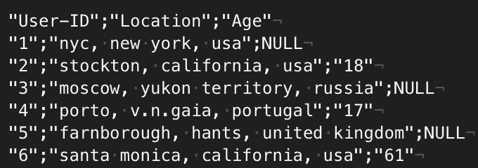

我们必须明确处理以下格式特殊性，否则导入可能会失败：

+   列之间用`;`分隔，而不是更常见的逗号或*制表符*

+   缺失值用字符串`NULL`表示

+   第一行是标题行，代表列名

+   数据被双引号`"`包围，并且数据本身中的双引号通过反斜杠转义，例如，`"1273";"valladolid, \"n/a\", spain";"27"`

幸运的是，CSV 包在读取文件时提供了额外的选项来传递所有这些信息：

```py
julia> users = CSV.read("BX-Users.csv", header = 1, delim = ';', missingstring = "NULL", escapechar = '\\') 
```

加载这个表可能需要一点时间，但最终我们会尝到成功的甜头——`278858`行已加载到内存中！

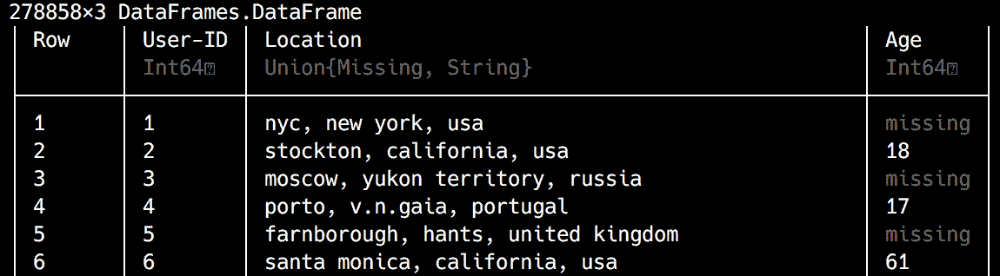

我们将使用相同的方法来加载书籍和排名表：

```py
julia> books = CSV.read("BX-Books.csv", header = 1, delim = ';', missingstring = "NULL", escapechar = '\\') 
271379×8 DataFrames.DataFrame 
# output omitted # 

julia> books_ratings = CSV.read("BX-Book-Ratings.csv", header = 1, delim = ';', missingstring = "NULL", escapechar = '\\') 
1149780×3 DataFrames.DataFrame 
# output omitted # 
```

太棒了！我们现在已经将所有三个表加载到内存中作为`DataFrames`。

# 处理缺失数据

在数据科学中，当记录中的一个字段没有存储数据值时，会出现缺失值——换句话说，当我们没有一行中的列值时。这是一个常见的场景，但无论如何，它可能会对数据的可用性产生重大的负面影响，因此需要明确处理。

在`DataFrames`中的方法是使用`Missing`类型标记缺失值。默认行为是传播缺失值，从而*污染*涉及`missing`的数据操作——也就是说，涉及有效输入的操作，`missing`将返回`missing`或失败。因此，在大多数情况下，需要在数据清洗阶段解决缺失值问题。

处理缺失值的最常见技术如下：

+   **删除**：包含缺失变量的行被删除（也称为**逐行删除**）。这种方法的不利之处在于会导致信息丢失。然而，如果我们有大量数据并且不完整的记录不多（比如，低于 10%），这是最简单的方法，也是最常用的方法。

+   **插补**：使用某些技术推断`缺失`值，通常为`均值`、`中位数`或`众数`。然而，你需要小心，因为这会人为地减少数据集的变异。作为替代，可以使用预测模型通过应用统计方法来推断缺失值。

你可以在[`docs.julialang.org/en/v1.0/manual/missing/`](https://docs.julialang.org/en/v1.0/manual/missing/)的文档中了解更多关于 Julia 处理缺失值的信息，而关于处理缺失数据的理论方面的更深入讨论可以在[`datascience.ibm.com/blog/missing-data-conundrum-exploration-and-imputation-techniques/`](https://datascience.ibm.com/blog/missing-data-conundrum-exploration-and-imputation-techniques/)找到。

# 数据分析和准备

让我们从用户开始，感受一下数据：

```py
julia> using DataFrames 
julia> describe(users, stats = [:min, :max, :nmissing, :nunique, :eltype]) 
```

输出如下：


我们选择了一些关键统计数据——最小值和最大值、缺失值和唯一值的数量，以及数据类型。不出所料，作为表的主键的`User-ID`列从`1`开始，一直升到`278858`，没有缺失值。然而，`Age`列显示出数据错误明显的迹象——最大年龄是`244`岁！让我们通过使用`Gadfly`绘制数据来看看我们有什么：

```py
julia> using Gadfly 
julia> plot(users, x = :Age, Geom.histogram(bincount = 15)) 
```

输出如下：

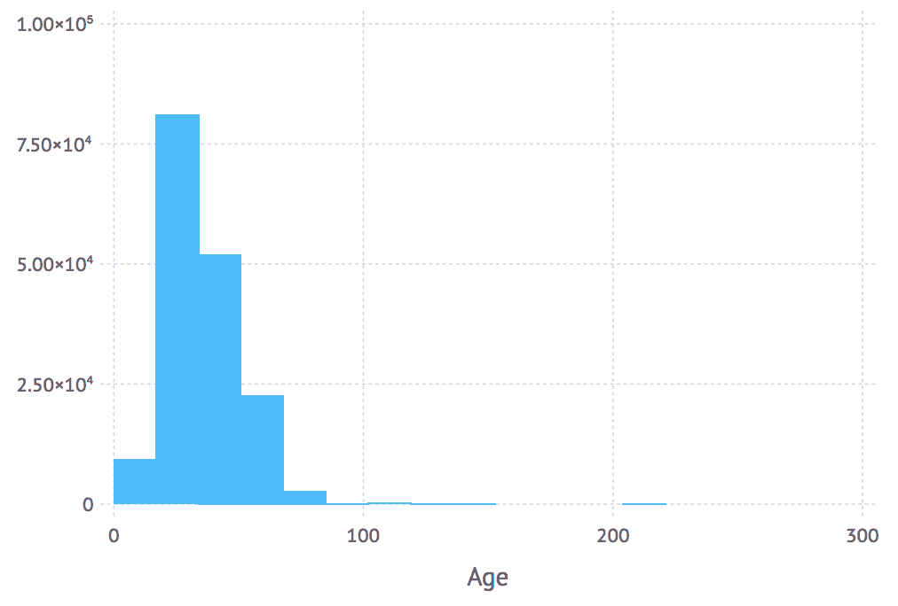

我们将年龄数据绘制成直方图，将数据分为 15 个区间。我们有一些异常值表明年龄不正确，但大部分数据分布在预期的范围内，即 80-90 岁。由于 100 岁以后的年龄几乎不可能正确，让我们将其删除。最简单的方法是过滤掉所有年龄大于**100**的行：

```py
julia> users = users[users[:Age] .< 100, :] 
ERROR: ArgumentError: unable to check bounds for indices of type Missing 
```

哎呀！我们的`Age`列有无法比较的`missing`值。我们也可以删除这些值，但在这个情况下，缺失的年龄似乎更多是用户未披露信息的一个症状，而不是数据错误。因此，我更倾向于保留这些行，并用有效值替换缺失数据。问题是，用哪个值？使用`mean`进行插补似乎是一个不错的选择。让我们计算一下：

```py
julia> using Statistics 
julia> mean(skipmissing(users[:Age])) 
34.75143370454978 
```

我们使用了`skipmissing`函数遍历所有非缺失的`Age`值并计算平均值。现在，我们可以使用这个值结合`coalesce`来替换缺失值：

```py
julia> users[:Age] = coalesce.(users[:Age], mean(skipmissing(users[:Age]))) 
278858-element Array{Real,1}: 
 34.75143370454978 
 18 
 34.75143370454978 
 17 
 34.75143370454978 
# output omitted # 
```

我们实际上是用一个新数组替换了`users` `DataFrame`中的`Age`列，这个新数组是通过将`coalesce`应用于相同的`Age`列得到的。请注意`coalesce`调用中的点，表示它是逐元素应用的。

太好了——最后，我们需要删除那些错误的年龄：

```py
julia> users = users[users[:Age] .< 100, :] 
278485×3 DataFrame
 # output omitted # 

julia> head(users) 
```

输出如下：

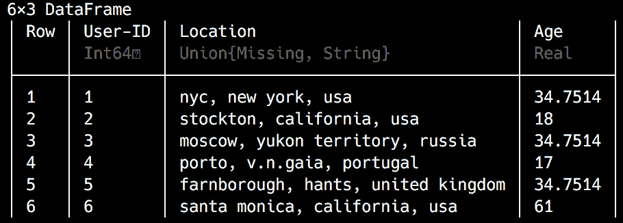

看起来不错！

我们完成了用户的数据处理，接下来让我们转向书籍数据：

```py
julia> describe(books, stats = [:nmissing, :nunique, :eltype]) 
```

输出如下：

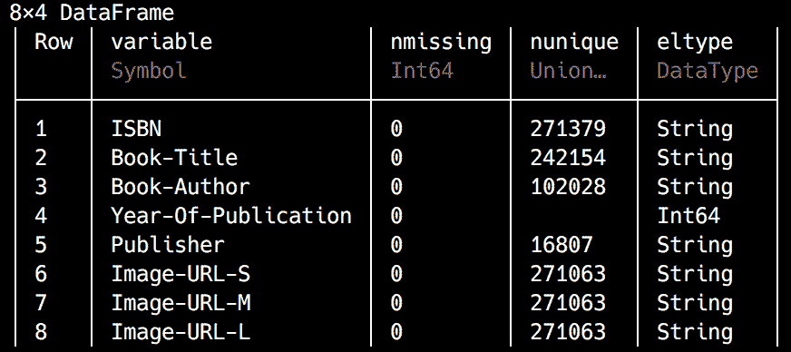

数据看起来干净多了——首先，没有缺失值。然后，查看`nunique`的计数，我们可以知道有些书籍有相同的标题，而且有相当多的作者出版了两本以上的书籍。最后，这些书籍来自近 17,000 家出版社。

到目前为止，一切顺利，但让我们看看`Year-Of-Publication`：

```py
julia> maximum(skipmissing(books[Symbol("Year-Of-Publication")])) 
2050 

julia> minimum(skipmissing(books[Symbol("Year-Of-Publication")])) 
0 
```

这里有些不对劲——我们有一些出版年份没有意义。有些太遥远，而有些则过于未来。我想知道分布是什么样的。让我们再渲染一个直方图：

```py
julia> plot(books, x = Symbol("Year-Of-Publication"), Geom.histogram) 
```

输出如下：

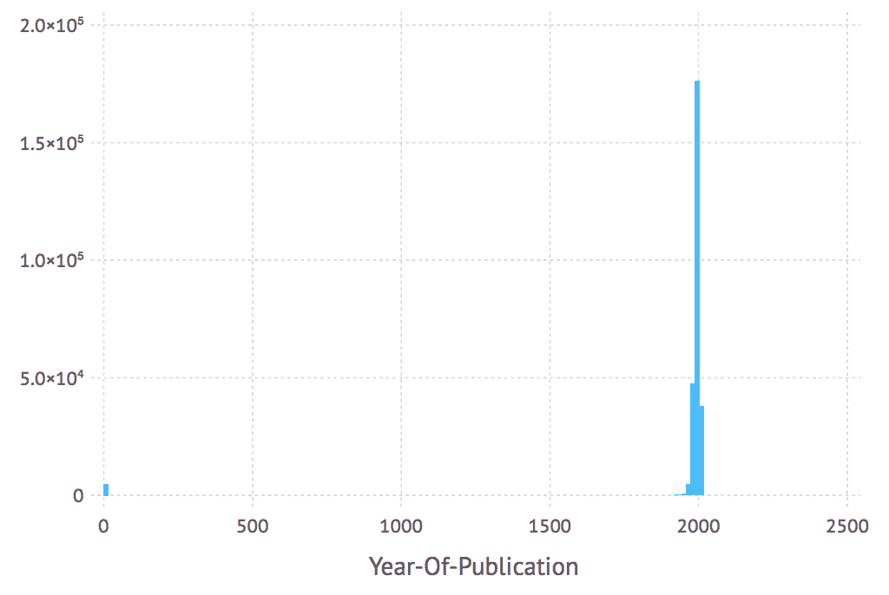

大部分数据看起来是正确的，但也有一些异常值。我们可以看看这些值：

```py
julia> unique(books[Symbol("Year-Of-Publication")]) |> sort 
116-element Array{Union{Missing, Int64},1}: 
    0 
 1376 
 1378 
# output omitted # 
 2037 
 2038 
 2050 
```

初看之下，我们可以去掉出版年份等于`0`的行。我们还可以安全地假设所有出版日期大于数据收集年份（`2004`）的行也是错误的，因此可以删除。至于剩下的部分，虽然很难说怎么办，但仍然很难相信人们会为公元中叶出版的书籍评分。让我们只保留`1970`到`2004`年间出版的书籍：

```py
julia> books = books[books[Symbol("Year-Of-Publication")] .>= 1970, :] 
264071×8 DataFrame 
# output omitted # 

julia> books = books[books[Symbol("Year-Of-Publication")] .<= 2004, :] 
263999×8 DataFrame 
# output omitted # 

julia> plot(books, x = Symbol("Year-Of-Publication"), Geom.histogram) 
```

输出如下：


这要好得多，完全合理。

最后，让我们检查评分：

```py
julia> describe(books_ratings) 
```

输出如下：

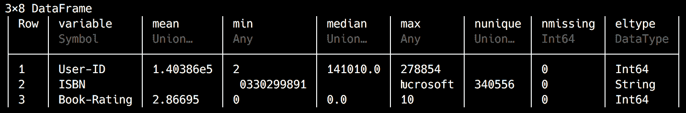

没有缺失值，这很好。`Book-Rating`的值在`0`（隐式评分）和`10`之间，其中`1`到`10`代表显式评分。不过，`0.0`的中位数有点令人担忧，让我们看看：

```py
julia> plot(books_ratings, x = Symbol("Book-Rating"), Geom.histogram) 
```

输出如下：

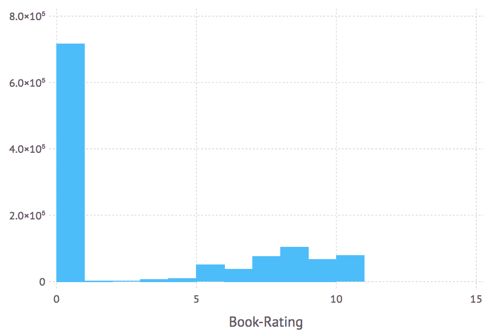

结果表明，大部分评分是隐式的，因此设置为`0`。这些对我们推荐系统来说并不相关，所以让我们去掉它们：

```py
julia> books_ratings = books_ratings[books_ratings[Symbol("Book-Rating")] .> 0, :] 
433671×3 DataFrame 
# output omitted # 

julia> plot(books_ratings, x = Symbol("Book-Rating"), Geom.histogram) 
```

这里是输出：

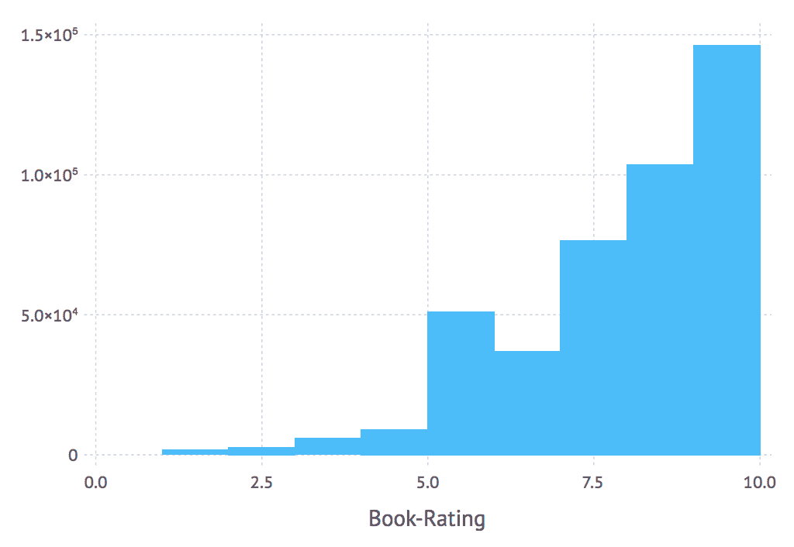

我们做得很好！在我们的**提取、转换、加载**（**ETL**）流程中还有一步——让我们通过匹配列将三个`DataFrame`合并起来，从而删除各种孤儿条目（那些在其他所有表中没有对应行的条目）。

首先，我们将书籍评分和书籍连接起来：

```py
julia> books_ratings_books = join(books_ratings, books, on = :ISBN, kind = :inner) 
374896×10 DataFrame 
# output omitted # 
```

我们使用`join`方法，指定我们想要连接的两个`DataFrame`，以及连接列和我们要进行的连接类型。内部连接要求结果包含键值在第一个和第二个`DataFrame`中都存在的行。

现在，让我们与用户数据连接起来：

```py
julia> books_ratings_books_users = join(books_ratings_books, users, on = Symbol("User-ID"), kind = :inner) 
374120×12 DataFrame 
# output omitted # 
```

我们的数据集现在只包含有效数据，这些数据被很好地打包在一个单独的`DataFrame`中。

由于我们的评分是在`1`到`10`的范围内，并不是所有的评分都可以被认为是这本书的推荐。确实，大多数排名都在`5`以上，但`5`对于有用的推荐来说还不够好。让我们简化一下数据，通过假设任何以`8`开头的排名代表正面评论，并会形成强有力的推荐。因此，我们只保留这些行，丢弃其余的：

```py
julia> top_ratings = books_ratings_books_users[books_ratings_books_users[Symbol("Book-Rating")] .>= 8, :] 
217991×12 DataFrame 
# output omitted # 
```

这看起来不错，但只需稍作调整，使列名更符合 Julia 的风格，就会更好：

```py
julia> for n in names(top_ratings) rename!(top_ratings, n => Symbol(replace(string(n), "-"=>""))) end 
```

我们将遍历每个列名并删除破折号。这样，我们就能使用这些名称，而无需每次都显式使用`Symbol`构造函数。我们最终会得到以下名称：

```py
julia> names(top_ratings) 
12-element Array{Symbol,1}: 
 :UserID 
 :ISBN 
 :BookRating 
 :BookTitle 
 :BookAuthor 
 :YearOfPublication 
 :Publisher 
 :ImageURLS 
 :ImageURLM 
 :ImageURLL 
 :Location 
 :Age 
```

我们越来越接近了——我们数据处理工作流程的最后一步是检查每个用户的评论数量。我们从一个用户那里得到的评论越多，我们就能创建出更好的偏好配置文件，从而产生更相关、质量更高的推荐。基本上，我们想要得到每个用户的评分计数，然后得到每个计数的计数（即，有多少个一星、二星、三星，等等，直到我们有的十个评分）：

```py
julia> ratings_count = by(top_ratings, :UserID, df -> size(df[:UserID])[1]) 
```

在这里，我们按`UserID`对`top_ratings`数据进行分组，并使用`size`函数作为我们的`聚合`函数，它返回一个维度元组——我们从其中检索其第一个维度。我们将得到以下结果，其中`x1`列包含相应用户提供的评分数量：

输出如下：

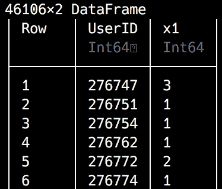

想知道这些数据会揭示什么？让我们来看看：

```py
julia> describe(ratings_count) 
```

这里是输出结果：

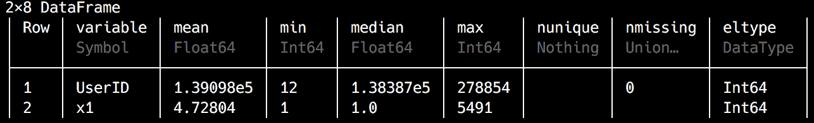

评分的最小数量是`1`，而最活跃的用户提供的评分不少于`5491`，平均每个用户的评论数量约为`5`。考虑到那些评论少于`5`的用户，他们的推荐可能相当薄弱，我们最好移除那些数据不足的用户：

```py
julia> ratings_count = ratings_count[ratings_count[:x1] .>= 5, :] 
7296×2 DataFrame 
# output omitted # 
```

我们只保留至少有`5`个评分的用户。现在让我们看看评分的分布情况：

```py
julia> plot(ratings_count, x = :x1, Geom.histogram(maxbincount = 6)) 
```

输出如下：

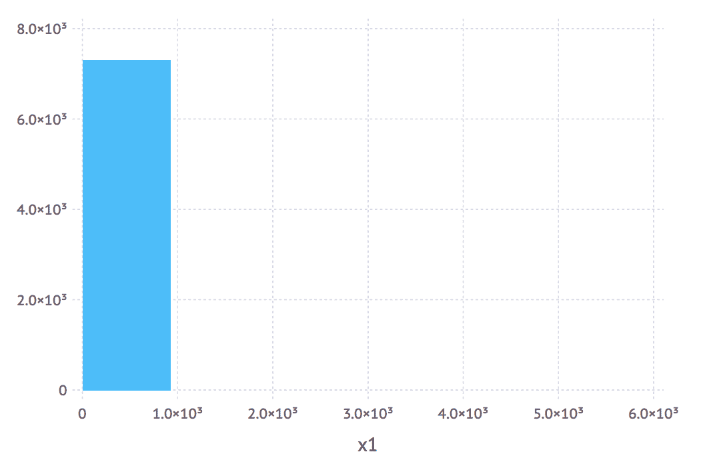

看起来，大多数用户都有多达`1000`个评分。那么，有很多评论的异常值用户呢？

```py
julia> ratings_count[ratings_count[:x1] .> 1000, :] 
```

输出如下：

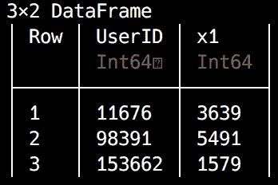

只有`3`个用户。我们最好移除他们，以免他们扭曲我们的结果：

```py
julia> ratings_count = ratings_count[ratings_count[:x1] .<= 1000, :] 
7293×2 DataFrame 
# output omitted # 
```

现在我们有了最终用户的列表，下一步就是从`top_ratings` `DataFrame`中移除所有其他用户。再次，让我们使用内连接——这相当直接：

```py
julia> top_ratings = join(top_ratings, ratings_count, on = :UserID, kind = :inner) 
150888×13 DataFrame 
# output omitted # 
```

就这样，我们的数据准备好了。干得好！

如果你想，你可以使用`CSV.write`将此数据保存到文件中：

```py
julia> CSV.write("top_ratings.csv", top_ratings) 
```

如果你遇到难以跟上进度的问题，请不要担心。在接下来的几段中，我将解释如何加载本章支持文件中提供的现成数据集。

# 训练我们的数据模型

机器学习可以根据方法和所使用的数据类型分为四种主要类型：

+   监督

+   无监督

+   半监督

+   强化

在监督学习中，我们从一个包含训练（或教学）数据的数据集开始，其中每个记录都有标签，代表输入（让我们称其为 *X*），以及输出值（命名为 *Y*）。然后，算法的任务是确定一个从输入到输出的函数 *f*，使得 *Y = f(X)*。一旦这个函数被确定，它就可以用于新数据（即未标记的新输入）来预测输出。根据需要计算输出类型的类型，如果输出需要分配给某个实体的类别（例如，它代表分类数据），则将使用分类算法。或者，如果输出类型是数值，我们将处理回归问题。

在无监督机器学习中，我们有输入，但没有输出。在这种情况下，一旦我们使用学习数据集来训练我们的系统，主要目标将是数据聚类，即生成不同的输入簇，并能够将新数据分配到最合适的簇中。

如其名所示，半监督代表两种先前描述方法的混合，这两种方法都适用于我们的数据包含标记和未标记记录的情况。

在强化学习中，算法会了解其先前决策的成功情况。基于此，算法修改其策略以最大化结果。

根据学习风格和要解决的问题的具体问题，有众多算法可以应用。对于监督学习，我们可以使用回归（线性或逻辑回归）、决策树或神经网络，仅举几例。对于无监督学习，我们可以选择 k-means 聚类或 `Apriori` 算法。

由于我们的数据已标记（我们拥有每个用户的评分），我们正在处理一个监督机器学习问题。对于我们的测试案例，由于我们的数据以矩阵形式表示，我们将采用一种称为**矩阵分解**（**MF**）的算法。

你可以在以下链接中了解更多关于各种机器学习算法及其选择的信息：

[`docs.microsoft.com/en-us/azure/machine-learning/studio/algorithm-choice`](https://docs.microsoft.com/en-us/azure/machine-learning/studio/algorithm-choice) [`blog.statsbot.co/machine-learning-algorithms-183cc73197c`](https://blog.statsbot.co/machine-learning-algorithms-183cc73197c) [`elitedatascience.com/machine-learning-algorithms`](https://elitedatascience.com/machine-learning-algorithms) [`machinelearningmastery.com/a-tour-of-machine-learning-algorithms/`](https://machinelearningmastery.com/a-tour-of-machine-learning-algorithms/)

# 缩小我们的数据集

在大规模上训练机器学习模型通常需要（很多）强大的计算机和大量的时间。如果你在阅读这本书的时候没有这些条件，我准备了一个较小的数据集，这样你就可以完成我们的项目。

在我的四核、16 GB RAM 笔记本电脑上，使用完整的`top_ratings`数据训练推荐器花费了超过 24 小时。如果你有兴趣，可以自由尝试。它也可以在[`github.com/PacktPublishing/Julia-Projects/blob/master/Chapter07/data/large/top_ratings.csv.zip`](https://github.com/PacktPublishing/Julia-Projects/blob/master/Chapter07/data/large/top_ratings.csv.zip)下载。

然而，如果你想在阅读本章时跟随代码，请下载本章支持文件中提供的`top_ratings.csv`文件，网址为[`github.com/PacktPublishing/Julia-Projects/blob/master/Chapter07/data/top_ratings.csv`](https://github.com/PacktPublishing/Julia-Projects/blob/master/Chapter07/data/top_ratings.csv)。我将使用这个较小的文件中的数据来完成本章的剩余部分。

下载文件后，你可以使用`CSV.read`函数将其内容加载到`top_ratings`变量中：

```py
julia> top_ratings = CSV.read("top_ratings.csv")  
11061×13 DataFrame 
# output omitted # 
```

# 训练数据与测试数据

在机器学习实现中，一个常见的策略是将数据分成训练集（大约 80-90%）和测试集（剩余的 10-20%）。首先，我们将初始化两个空的`DataFrames`来存储这些数据：

```py
julia> training_data = DataFrame(UserID = Int[], ISBN = String[], Rating = Int[]) 
0×3 DataFrame 

julia> test_data = DataFrame(UserID = Int[], ISBN = String[], Rating = Int[]) 
0×3 DataFrame 
```

接下来，我们将遍历我们的`top_ratings`，并将内容放入相应的`DataFrame`中。我们将用 10%的数据进行测试——所以每次迭代，我们将生成一个介于`1`和`10`之间的随机整数。显然，得到`10`的概率是十之一，因此当我们得到它时，我们将相应的行放入测试数据集中。否则，它将进入训练集，如下所示：

```py
julia> for row in eachrow(top_ratings)
 rand(1:10) == 10 ? 
 push!(test_data, convert(Array, row[[:UserID, :ISBN, :BookRating]])) :
 push!(training_data, convert(Array, row[[:UserID, :ISBN, :BookRating]]))
 end 
```

将`DataFrameRow`推送到另一个`DataFrame`上没有标准的方法，所以我们使用了一种推荐的方法，即将行转换为`Array`并使用`push!`将其推送到`DataFrame`中。我们的训练集和测试集现在已准备就绪。

对于我来说，它们看起来是这样的，但由于数据是随机生成的，所以对你们来说可能会有所不同：

```py
julia> test_data 
1056×3 DataFrame
 # output omitted # 

julia> training_data 
10005×3 DataFrame 
# output omitted # 
```

如果你希望我们使用相同的数据集，你可以从本章的支持文件中下载数据存档（可在[`github.com/PacktPublishing/Julia-Projects/blob/master/Chapter07/data/training_data.csv`](https://github.com/PacktPublishing/Julia-Projects/blob/master/Chapter07/data/training_data.csv)和[`github.com/PacktPublishing/Julia-Projects/blob/master/Chapter07/data/test_data.csv`](https://github.com/PacktPublishing/Julia-Projects/blob/master/Chapter07/data/test_data.csv)分别下载）并按以下方式读取：

```py
julia> test_data = CSV.read("data/test_data.csv") 
julia> training_data = CSV.read("data/training_data.csv") 
```

# 基于机器学习的推荐

Julia 的生态系统提供了访问`Recommendation.jl`包的途径，这是一个实现多种算法的包，包括个性化和非个性化推荐。对于基于模型的推荐器，它支持 SVD、MF 和基于 TF-IDF 评分算法的内容推荐。

另外还有一个非常好的替代方案——`ScikitLearn.jl`包（[`github.com/cstjean/ScikitLearn.jl`](https://github.com/cstjean/ScikitLearn.jl)）。这个包在 Julia 中实现了 Python 非常流行的 scikit-learn 接口和算法，支持 Julia 生态系统中的模型以及 scikit-learn 库中的模型（通过`PyCall.jl`）。Scikit 网站和文档可以在[`scikit-learn.org/stable/`](http://scikit-learn.org/stable/)找到。它非常强大，绝对值得记住，尤其是在构建用于生产使用的效率极高的推荐器时。出于学习目的，我们将坚持使用`Recommendation`，因为它提供了更简单的实现。

# 使用`Recommendation`进行推荐

对于我们的学习示例，我们将使用`Recommendation`。它是所有可用选项中最简单的，它是一个很好的教学工具，因为它将允许我们进一步实验其即插即用的算法和可配置的模型生成器。

然而，在我们能够进行任何有趣的事情之前，我们需要确保我们已经安装了该包：

```py
 pkg> add Recommendation#master  
 julia> using Recommendation 
```

请注意，我使用的是`#master`版本，因为在撰写本书时，标记的版本尚未完全更新以支持 Julia 1.0。

使用`Recommendation`设置推荐器的流程包括三个步骤：

1.  设置训练数据

1.  使用可用的算法之一实例化和训练推荐器

1.  一旦训练完成，请求推荐

让我们实施这些步骤。

# 设置训练数据

`Recommendation`使用`DataAccessor`对象来设置训练数据。这可以通过一组`Event`对象来实例化。`Recommendation.Event`是一个表示用户-项目交互的对象。它定义如下：

```py
struct Event 
    user::Int 
    item::Int 
    value::Float64 
end 
```

在我们的案例中，`user`字段将代表`UserID`，`item`字段将映射到 ISBN，而`value`字段将存储`Rating`。然而，我们需要做更多的工作来将我们的数据格式化为`Recommendation`所需的格式：

1.  首先，我们的 ISBN 数据存储为字符串，而不是整数。

1.  其次，在内部，`Recommendation`构建了一个`user` * `item`的稀疏矩阵并存储相应的值，使用顺序 ID 设置矩阵。然而，我们的实际用户 ID 是很大的数字，`Recommendation`将设置一个非常大的稀疏矩阵，从最小用户 ID 到最大用户 ID。

这意味着，例如，在我们的数据集中我们只有 69 个用户（如`unique(training_data[:UserID]) |> size`所确认的），最大的 ID 是 277,427，而对于书籍，我们有 9,055 个独特的 ISBN。如果我们这样做，`Recommendation`将创建一个 277,427 x 9,055 的矩阵，而不是 69 x 9,055 的矩阵。这个矩阵将会非常大，稀疏且效率低下。

因此，我们需要进行一些额外的数据处理，将原始用户 ID 和 ISBN 映射到从 1 开始的顺序整数 ID。

我们将使用两个`Dict`对象来存储从`UserID`和`ISBN`列到推荐器的顺序用户和书籍 ID 的映射。每个条目都将具有以下形式`dict[original_id] = sequential_id`：

```py
julia> user_mappings, book_mappings = Dict{Int,Int}(), Dict{String,Int}() 
```

我们还需要两个计数器来跟踪和增加顺序 ID：

```py
julia> user_counter, book_counter = 0, 0 
```

我们现在可以准备我们的训练数据的`Event`对象：

```py
julia> events = Event[] 
julia> for row in eachrow(training_data) 
 global user_counter, book_counter user_id, book_id, rating = row[:UserID], row[:ISBN], row[:Rating] haskey(user_mappings, user_id) || (user_mappings[user_id] = (user_counter += 1)) haskey(book_mappings, book_id) || (book_mappings[book_id] = (book_counter += 1)) push!(events, Event(user_mappings[user_id], book_mappings[book_id], rating)) end
```

这将用`Recommendation.Event`实例填充事件数组，它代表一个独特的`UserID`、`ISBN`和`Rating`组合。为了给您一个概念，它看起来像这样：

```py
julia> events 
10005-element Array{Event,1}: 
 Event(1, 1, 10.0) 
 Event(1, 2, 8.0) 
 Event(1, 3, 9.0) 
 Event(1, 4, 8.0) 
 Event(1, 5, 8.0) 
 # output omitted #
```

请记住这个非常重要的方面——在 Julia 中，`for`循环定义了一个新的作用域。这意味着在`for`循环外部定义的变量在循环内部是不可访问的。为了使它们在循环体内部可见，我们需要将它们声明为`global`。

现在，我们准备设置我们的`DataAccessor`：

```py
julia> da = DataAccessor(events, user_counter, book_counter) 
```

# 构建和训练推荐器

到目前为止，我们已经拥有了实例化推荐器所需的一切。一个非常高效且常见的实现使用 MF——不出所料，这是`Recommendation`包提供的选项之一，所以我们将使用它。

# 矩阵分解

MF 背后的想法是，如果我们从一个大型的稀疏矩阵开始，比如用来表示*用户 x 个人资料*评分的矩阵，那么我们可以将其表示为多个较小且密集的矩阵的乘积。挑战在于找到这些较小的矩阵，使得它们的乘积尽可能接近原始矩阵。一旦我们有了这些，我们就可以在原始矩阵中填补空白，使得预测值与矩阵中现有的评分一致：

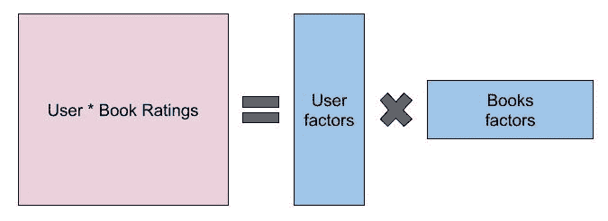

我们的*用户 x 书籍*评分矩阵可以表示为较小且密集的用户和书籍矩阵的乘积。

为了执行矩阵分解，我们可以使用几种算法，其中最流行的是 SVD 和**随机梯度下降**（**SGD**）。`Recommendation`使用 SGD 来执行矩阵分解。

代码如下：

```py
julia> recommender = MF(da) 
julia> build(recommender) 
```

我们实例化一个新的 MF 推荐器，然后构建它——即训练它。构建步骤可能需要一段时间（在高端计算机上使用本章支持文件中提供的小数据集，可能需要几分钟）。

如果我们想调整训练过程，由于 SGD 实现了矩阵分解的迭代方法，我们可以向构建函数传递一个`max_iter`参数，请求它提供最大迭代次数。理论上，我们进行的迭代越多，推荐效果越好——但训练模型所需的时间也会更长。如果您想加快速度，可以使用`max_iter`为`30`或更少的构建函数——`build(recommender, max_iter = 30)`。

我们可以传递另一个可选参数学习率，例如，`build (recommender, learning_rate=15e-4, max_iter=100)`。学习率指定了优化技术应在每次迭代之间如何变化。如果学习率太小，优化需要运行很多次。如果太大，那么优化可能会失败，生成比前几次迭代更差的结果。

# 提供推荐

现在我们已经成功构建并训练了我们的模型，我们可以请求它提供推荐。这些推荐由`recommend`函数提供，该函数接受一个推荐器实例、用户 ID（来自训练矩阵中可用的 ID）、推荐数量以及一个包含书籍 ID 的数组作为其参数：

```py
julia> recommend(recommender, 1, 20, [1:book_counter...]) 
```

使用这一行代码，我们检索具有推荐器 ID `1`的用户推荐，这对应于原始数据集中的`UserID` `277427`。我们请求最多`20`个推荐，这些推荐是从所有可用的书籍中挑选出来的。

我们得到一个包含书籍 ID 和推荐得分的`Pair`数组的数组：

```py
20-element Array{Pair{Int64,Float64},1}: 
 5081 => 19.1974 
 5079 => 19.1948 
 5078 => 19.1946 
 5077 => 17.1253 
 5080 => 17.1246 
 # output omitted # 
```

# 测试推荐

最后，我们的基于机器学习的推荐系统已经准备好了。它无疑将为任何书店的用户体验带来显著提升。但在我们开始宣传它之前，我们应该确保它是可靠的。记住，我们留出了 10%的数据集用于测试目的。想法是将推荐与测试数据中的实际评分进行比较，以查看两者之间的相似程度；也就是说，数据集中的实际评分中有多少被推荐了。根据用于训练的数据，您可能想测试是否做出了正确的推荐，同时也确保没有包含不良推荐（即，推荐器不会建议得到低评分的项目，这表明不喜欢）。由于我们只使用了 8、9 和 10 的评分，我们不会检查是否提供了低排名的推荐。我们只关注检查有多少推荐实际上是用户数据的一部分。

由于测试数据使用的是原始用户和配置文件 ID，而我们的推荐器使用的是归一化、顺序 ID，我们需要一种方法在两者之间转换数据。我们已经有 `user_mappings` 和 `book_mappings` 字典，它们将原始 ID 映射到推荐器 ID。然而，我们还需要反向映射。所以，让我们首先定义一个用于反转字典的辅助函数：

```py
julia> function reverse_dict(d) Dict(value => key for (key, value) in d) end 
```

这很简单，但非常有用——我们现在可以使用这个函数根据推荐器 ID 查找原始 ID。例如，如果我们想测试用户 `1` 的推荐，我们需要检索此用户的实际评分，因此我们需要原始 ID。我们可以通过以下代码轻松获取它：

```py
julia> reverse_dict(user_mappings)[1] 
277427 
```

这同样适用于书籍映射——例如，ID 为 `5081` 的推荐对应于原始数据集中的 ISBN `981013004X`：

```py
julia> reverse_dict(book_mappings)[5081] 
"981013004X" 
```

好吧，让我们检查为 `UserID` `277427`（推荐器用户 `1`）预留的测试数据：

```py
julia> user_testing_data = test_data[test_data[:UserID] .== reverse_dict(user_mappings)[1], :] 
8×3 DataFrame 
```

输出结果如下：

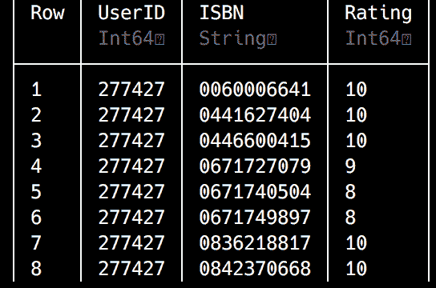

```py
testing_data DataFrame by doing an element-wise comparison—for each row, it checks if the UserID column equals 277427 (which is the ID returned by reverse_dict(user_mappings)[1], remember?). If yes, then the  whole row is added to user_testing_data.
```

要检查推荐与实际评分的配置文件，最简单的方法是将推荐向量与评分向量进行交集。所以，首先要做的是将测试评分放入一个向量中，从 `DataFrame` 中取出：

```py
julia> test_profile_ids = user_testing_data[:, :ISBN] 
8-element Array{Union{Missing, String},1}: 
 "0060006641" 
 "0441627404" 
 "0446600415" 
 "0671727079" 
 "0671740504" 
 "0671749897" 
 "0836218817" 
 "0842370668" 
```

我们只选择所有行的 ISBN 列数据，作为一个 `Array`。

对推荐进行同样的操作要复杂一些。此外，由于我预计我们可能需要测试不同的推荐器设置和不同数量的推荐，最好定义一个函数将推荐转换为 ISBN 向量，这样我们就可以轻松地重用代码：

```py
julia> function recommendations_to_books(recommendations) 
           [reverse_dict(book_mappings)[r[1]] for r in recommendations] 
       end 
```

`recommendations_to_books` 函数将推荐器生成的 `id => score` 对的向量作为其唯一参数，并将其转换为原始 ISBN 向量：

```py
julia> recommendations_to_books(recommend(recommender, 1, 20, [1:book_counter...])) 
20-element Array{String,1}: 
 "981013004X" 
 "1856972097" 
 "1853263656" 
 "1853263133" 
 "1857231791"
 # output omitted #
```

`recommendations_to_books` 函数输出了 `20` 本推荐书的 ISBN。

现在，我们已经拥有了所有检查推荐与评分的部件：

```py
julia> intersect(test_profile_ids, recommendations_to_books(recommend(recommender, 1, 500, [1:book_counter...]))) 
1-element Array{Union{Missing, String},1}: 
 "0441627404"  
```

我们使用交集函数来检查第一个向量——我们为测试放置的书籍列表中的哪些元素也出现在第二个向量中，即推荐中。我们必须请求 `500` 个推荐，因为在 9,055 本书池中击中这八本测试书的可能性非常小。这是由于我们处理的数据非常少，但在生产环境中，可能涉及数十亿行，我们会得到更多重叠的数据。

让我们看看前五个推荐是什么：

```py
julia> for i in recommendations_to_books(recommend(recommender, 1, 20, [1:book_counter...])) top_ratings[top_ratings.ISBN .== i, :BookTitle] |> println end  

Union{Missing, String}["Fun With Chinese Characters Volume 1"] 
Union{Missing, String}["Fantasy Stories (Story Library)"] 
Union{Missing, String}["The Wordsworth Complete Guide to Heraldry (Wordsworth Reference)"] 
Union{Missing, String}["The Savoy Operas (Wordsworth Collection)"] 
Union{Missing, String}["Against a Dark Background"] 
```

在 IJulia 笔记本中，我们甚至可以查看封面，从而使用封面的 URL 渲染一小块 HTML：

```py
thumbs = DataFrame(Thumb = String[]) 

for i in recommendations_to_profiles(recommend(recommender, 1, 20, [1:book_counter...])) 
    push!(thumbs, top_ratings[top_ratings.ISBN .== i, :ImageURLL]) 
end 

for img in thumbs[:, :Thumb] 
    HTML("""""") |> display 
end 
```

输出结果如下：

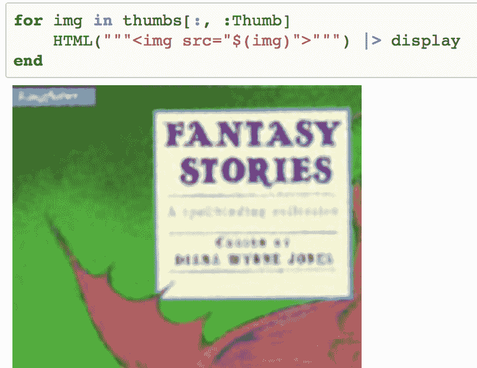

太棒了！我们做得很好。我们驯服了一个非常复杂的数据集，进行了高级分析，然后我们优化了它在推荐器中的使用。然后我们成功训练了推荐器，并使用它为我们的用户生成书籍推荐。

部署和使用`Recommendation`包非常简单，正如你肯定已经体会到的。再次强调，就像大多数数据科学项目一样，ETL 步骤是最复杂的。

# 了解混合推荐系统

当使用基于模型的推荐系统时，有一些明显的优势。如前所述，可扩展性是最重要的因素之一。通常，模型的大小远小于初始数据集，因此即使是对于非常大的数据样本，模型也足够小，可以允许高效的使用。另一个好处是速度。查询模型所需的时间，与查询整个数据集所需的时间相比，通常要小得多。

这些优势源于模型通常是在线外准备的，这使得推荐几乎可以即时完成。但是，由于没有免费的性能，这种方法也带来了一些显著的缺点——一方面，它不够灵活，因为构建模型需要相当的时间和资源，这使得更新变得困难和昂贵；另一方面，因为它没有使用整个数据集，预测可能不够准确。

就像所有事情一样，没有一劳永逸的解决方案，最佳方法取决于你手头的数据和你需要解决的问题。然而，并不总是需要基于内存的与基于模型的相对比。更进一步，也不一定只有一个推荐系统。实际上，多个算法和方法的组合可以有效地弥补单一类型推荐系统的局限性。这种架构被称为**混合**。由于篇幅限制，我们不会涵盖任何混合推荐系统的实现，但我想要给你一个可能的方法的概述。我将仅引用罗宾·伯克在《自适应网络》第十二章中的分类，该章节标题为《混合网络推荐系统》。整个章节可以在网上免费获取，链接为[`www.researchgate.net/publication/200121024_Hybrid_Web_Recommender_Systems`](https://www.researchgate.net/publication/200121024_Hybrid_Web_Recommender_Systems)。如果你对这个主题感兴趣，我强烈推荐阅读。

# 摘要

推荐系统代表了一个非常活跃和动态的研究领域。它们最初只是机器学习算法和技术的一个边缘应用，但由于其实际的商业价值，近年来已经成为主流。如今，几乎所有主要的编程语言都提供了强大的推荐系统库，并且所有主要的在线业务都以某种形式使用推荐系统。

Julia 是一种非常适合构建推荐系统的语言，因为它具有出色的性能。尽管这种语言还很年轻，但我们已经有了一些有趣的包可供选择。

现在，你对基于模型的推荐系统及其实现工作流程有了扎实的理解——无论是在理论层面还是实践层面。此外，在我们旅途中，我们还接触到了更多高级的数据处理技巧，使用了`DataFrames`，这是 Julia 数据科学工具库中一个无价的工具。

在下一章中，我们将进一步提高我们对`DataFrames`的掌握，因为我们将会学习 Julia 元编程的秘密，同时开发一个无监督的机器学习系统。
