# 与日期、时间和时间序列一起工作

我们在机器学习的领域中经历了一段非常令人惊叹和有益的旅程。我们学习了如何使用算法对标记数据进行分类，并将我们的发现应用于提出建议。我们看到了如何通过使用无监督机器学习和聚类算法从原始、未标记的信息中提取商业价值。然而，到目前为止，我们的分析中一直缺少一个关键组成部分——时间维度。

“时间就是金钱”，这句俗语说得好——因此，从小型企业到大型企业，再到政府，以及像欧盟这样的复杂跨国机构，所有规模的组织都会随着时间的推移持续测量和监控大量的经济指标。为了有意义，数据需要在固定的时间间隔内收集，以便分析师能够识别隐藏的结构和模式，并根据过去和现在的条件预测未来的发展。这些值在时间尺度上定期测量，代表时间序列。时间序列分析和预测可以提供极其宝贵的见解，使市场参与者能够理解趋势，并基于准确的历史数据做出明智的决策。

我们将用两章内容，这一章和下一章，来学习时间序列以及进行分析和预测。在这一章中，我们将通过学习以下内容来打下基础：

+   在 Julia 中与日期和时间一起工作

+   处理时区信息

+   使用 `TimeSeries` 处理时间序列数据

+   使用强大的 `Plots` 包绘制时间序列数据

+   `TimeArray` 数据结构

# 技术要求

Julia 的包生态系统正在持续发展中，并且每天都有新的包版本发布。大多数时候，这是一个好消息，因为新版本带来了新功能和错误修复。然而，由于许多包仍在测试版（版本 0.x）中，任何新版本都可能引入破坏性更改。因此，书中展示的代码可能停止工作。为了确保您的代码将产生与书中描述相同的结果，建议使用相同的包版本。以下是本章使用的外部包及其特定版本：

```py
IJulia@v1.14.1
MarketData@v0.11.0
Plots@v0.22.0
TimeZones@v0.8.2
```

为了安装特定版本的包，您需要运行：

```py
pkg> add PackageName@vX.Y.Z 
```

例如：

```py
pkg> add IJulia@v1.14.1
```

或者，您也可以通过下载章节提供的 `Project.toml` 文件并使用 `pkg>` 实例化来安装所有使用的包，如下所示：

```py
julia> download("https://raw.githubusercontent.com/PacktPublishing/Julia-Programming-Projects/master/Chapter09/Project.toml", "Project.toml")
pkg> activate . 
pkg> instantiate
```

# 与日期和时间一起工作

Julia 提供了一个非常丰富的 API 来处理日期和时间信息。所有功能都打包在 `Dates` 模块中。该模块是语言内建的，因此不需要安装额外的包。为了访问其功能，我们只需声明我们将使用 `Dates`。

日期模块公开了三种主要类型——`Date`、`DateTime`和`Time`。它们都是抽象`TimeType`类型的子类型，分别代表天、毫秒和纳秒精度。

Julia 试图使处理日期和时间尽可能简单。这也是为什么，一方面，它提供了三种不同的类型，每种类型都有自己的时间表示：

+   一个`Date`对象映射到一个日期——一个由日、月和年定义的时间实体

+   `Time`的一个实例是一个时间点——小时、分钟、秒和毫秒，但没有任何关于日期本身的信息

+   如您从名称中猜到的，`DateTime`是一个将`Date`和`Time`组合在一起的对象，指定了一个确切的时间点

另一方面，所有这些类型默认且按设计采用了一种天真的方式来表示日期和时间——也就是说，它们不考虑诸如时区、夏令时或闰秒等因素。这是一种描绘你计算机本地日期和时间的方式，没有任何额外信息。

# 构建日期和时间

为了构建表示当前日期或时间的新的日期/时间对象，Julia 提供了两个辅助函数，`now`和`today`。让我们看看**读取-评估-打印循环**（**REPL**）中的几个例子：

```py
julia> using Dates 

julia> d = today() 
2018-11-08 

julia> typeof(d) 
Date 

julia> dt = now() 
2018-11-08T16:33:34.868 

julia> dt |> typeof 
DateTime 

julia> t = Dates.Time(now()) 
16:34:13.065 

julia> typeof(t) 
Time 
```

`now`函数还可以接受一个额外的参数来返回 UTC 时间（不进行夏令时调整）：

```py
julia> now(UTC) 
2018-11-08T15:35:08.776 
```

在内部，所有类型都封装了一个可以通过`instant`字段访问的`Int64`值：

```py
julia> dt.instant 
Dates.UTInstant{Millisecond}(63677378014868 milliseconds) 

julia> t.instant 
75147529000000 nanoseconds 

julia> d.instant 
Dates.UTInstant{Day}(737006 days) 
```

对象的`instant`属性反映了每种类型的精度级别。

当然，我们也可以使用专门的构造函数实例化表示任何随机时刻的对象：

```py
julia> DateTime(2018) # we can pass just the year as a single argument 
2018-01-01T00:00:00 

julia> DateTime(2018, 6) # passing the year and the month 
2018-06-01T00:00:00 

julia> DateTime(2018, 6, 15) # year, month and day 
2018-06-15T00:00:00 

julia> DateTime(2018, 6, 15, 10) # year, month, day and hour (10 AM) 
2018-06-15T10:00:00 

julia> DateTime(2018, 6, 15, 10, 30) # 15th of June 2018, 10:30 AM  
2018-06-15T10:30:00 

julia> DateTime(2018, 6, 15, 10, 30, 45) # ...and 45 seconds 
2018-06-15T10:30:45 

julia> DateTime(2018, 06, 15, 10, 30, 45, 123) # ... and finally, milliseconds  
2018-06-15T10:30:45.123 
```

`Date`和`Time`的构造函数以类似的方式工作——这里有一些例子：

```py
julia> Date(2019) # January 1st 2019 
2019-01-01 

julia> Date(2018, 12, 31) # December 31st 2018 
2018-12-31 

julia> Time(22, 05) # 5 past 10 PM 
22:05:00 

julia> Time(22, 05, 25, 456) # 5 past 10 PM, 25s and 456 milliseconds 
22:05:25.456  
```

构造函数将阻止我们传递错误的值，从而导致错误。这与其他语言自动执行日期时间算术的情况不同，例如，2018 年 12 月 22 日会自动转换为 2019 年 1 月 1 日。这种情况在 Julia 中不会发生：

```py
julia> Date(2018, 12, 32) 
ERROR: ArgumentError: Day: 32 out of range (1:31) 
Stacktrace: 
 [1] Date(::Int64, ::Int64, ::Int64) at ./dates/types.jl:204 
```

还有个体日期和时间组件的构造函数——年、月、日、时、分、秒和毫秒。它们返回相应的`Period`类型实例（我们稍后会详细探讨周期）。周期可以用来创建日期/时间对象：

```py
julia> eleven_hours = Hour(11) 
11 hours 

julia> half_hour = Minute(30) 
30 minutes 

julia> brunch_time = Time(eleven_hours, half_hour) 
11:30:00 

julia> this_year = "2018" 
julia> xmas_month = "12" 
julia> xmas_day = "25" 
julia> Date(Year(this_year), Month(xmas_month), Day(xmas_day)) 
2018-12-25 
```

# 将字符串解析为日期和时间

一个常见的需求是将来自外部输入（数据库、文件、用户输入等）的格式化字符串正确解析为相应的日期和时间对象：

```py
julia> Date("25/12/2019", "dd/mm/yyyy") # Christmas day in 2019 
2019-12-25 

julia> DateTime("25/12/2019 14,30", "dd/mm/yyyy HH,MM") # xmas day in 2019, at 2:30 PM 
2019-12-25T14:30:00 
```

这些是 Julia 识别的特殊日期时间字符及其含义：

+   `y`：年份数字，例如`2015`的`yyyy`，`15`的`yy`

+   `m`：月份数字，例如`m => 3`或`03`

+   `u`：短月份名称，例如`Jan`

+   `U`：长月份名称，例如`January`

+   `e`：短星期几，例如`Tue`

+   `E`：长星期几，例如`Tuesday`

+   `d`：日，例如`3`或`03`

+   `H`：小时数，例如`HH` = `00`

+   `M`：分钟数，例如`MM` = `00`

+   `S`：秒数，例如`s` = `00`

+   `s`：毫秒数，例如`.000`

使用这些，我们可以将任何日期/时间字符串解析为正确的对象：

```py
julia> DateTime("Thursday, 1 of February 2018 at 12.35", "E, d of U yyyy at HH.MM") 
2018-02-01T12:35:00 
```

我们也可以一次性解析多个字符串，作为数组的元素。首先，我们创建一个表示有效日期的字符串数组，格式为`yyyy-mm-dd`。我们使用列表推导式创建数组，并将其命名为`d`：

```py
julia> d = ["$(rand(2000:2020))-$(rand(1:12))-$(rand(1:28))" for _ in 1:100] 
100-element Array{String,1}:  
 "2001-7-1" 
 "2005-9-4"
```

```py
 "2018-3-3" 
# output truncated 
```

接下来，我们可以使用点符号来使用`Date`构造函数逐个处理数组元素：

```py
julia> Date.(d, "yyyy-mm-dd") 
100-element Array{Date,1}: 
 2001-07-01 
 2005-09-04 
 2018-03-03 
# output truncated  
```

或者，我们不用字符串来表示日期的格式，而可以使用专门的`DateFormat`类型：

```py
julia> date_format = DateFormat("yyyy-mm-dd") 
dateformat"yyyy-mm-dd" 

julia> Date.(d, date_format) 
100-element Array{Date,1}: 
2001-07-01 
2005-09-04 
2018-03-03 
# output truncated  
```

解析大量字符串时，建议使用`DateFormat`以提高性能。Julia 提供了标准库中的一些格式，例如`ISODateTimeFormat`和`RFC1123Format`：

```py
julia> DateTime("2018-12-25", ISODateTimeFormat) 
2018-12-25T00:00:00 
```

# 日期格式化

如果我们可以将日期格式的字符串解析为日期/时间对象，我们也可以做相反的操作。我们可以使用各种格式将日期和时间输出为字符串。例如，看以下内容：

```py
julia> Dates.format(now(), RFC1123Format) 
"Thu, 08 Nov 2018 20:04:35"  
```

# 定义其他区域设置

默认情况下，Julia 将使用`english`区域设置，这意味着星期和月份的名称将是英文。然而，我们可以通过定义额外的区域设置来国际化我们的日期：

```py
julia> spanish_months = ["enero", "febrero", "marzo", "abril", "mayo", "junio", "julio", "agosto", "septiembre", "octubre", "noviembre", "diciembre"] 
12-element Array{String,1} # output truncated 

julia> spanish_days = ["lunes", "martes", "miércoles", "jueves", "viernes", "sábado", "domingo"] 
7-element Array{String,1} # output truncated 

julia> Dates.LOCALES["es"] = Dates.DateLocale(spanish_months, String[], spanish_days, String[]) 
Dates.DateLocale # output truncated 
```

`Dates.DateLocale`函数期望四个数组，分别对应月份名称、缩写月份名称、星期名称和缩写星期名称。正如你所看到的，我们没有提供名称的缩写版本。只要我们不尝试使用它们，我们就会没事：

```py
julia> Dates.format(now(), "E, d U yyyy", locale = "es") 
"jueves, 8 noviembre 2018" 
```

然而，尝试使用缩写星期名称会导致错误：

```py
julia> Dates.format(now(), "e, d U yyyy", locale = "es") 
ERROR: BoundsError: attempt to access 0-element Array{String,1} at index [4] 
```

# 使用日期和时间访问器工作

如果我们想访问日期的各个部分（年、月、日），我们可以通过可用的访问器函数检索各个组件：

```py
julia> earth_day = Date(2018, 4, 22) 
2018-04-22 

julia>year(earth_day) # the year 
2018 

julia> month(earth_day) # the month  
4 
```

API 还公开了复合方法，以简化操作：

```py
julia> monthday(earth_day) # month and day 
(4, 22) 

julia> yearmonthday(earth_day) # year month and day 
(2018, 4, 22) 
```

对于`DateTime`也有类似的访问器可用——但没有提供复合方法：

```py
julia> earth_hour = DateTime(2018, 4, 22, 22, 00) 
2018-04-22T22:00:00 

julia> hour(earth_hour) # the hour 
22 

julia> minute(earth_hour) # the minute 
0 
```

也定义了返回`Period`对象的替代访问器——它们具有大写名称：

```py
julia> Hour(earth_hour) # a period of 22 hours 
22 hours 

julia> Month(earth_hour) # a period of 4 months 
4 months 

julia> Month(earth_hour) |> typeof |> supertype
 DatePeriod 

julia> supertype(DatePeriod) 
Period 
```

# 查询日期

一旦我们有了日期对象，我们就可以获取关于它的丰富额外信息，例如星期几、闰年、年中的天数等等。我们可以使用`Dates` API 来提取我们日期/时间对象这类信息。

考虑这一点：

```py
julia> yoga_day = Date(2019, 6, 21) # Really, the International Yoga Day does exist! 
2019-06-21 
```

你想知道瑜伽日 2019 年落在哪一天吗？让我们用我们的 Julia 技能来找出答案：

```py
julia> dayname(yoga_day) 
"Friday" 
```

如果你需要一周内某天的数值，也可以使用`dayofweek(yoga_day)`，它显然会返回`5`，因为星期五是每周的第五天。

当然，我们也可以在这里使用本地化名称：

```py
julia> dayname(yoga_day, locale="es") 
"viernes" 
```

另一个我们可以调用的有用函数是`dayofweekofmonth(yoga_day)`，它会告诉我们这是哪个月的星期五——2019 年 6 月的第三个星期五。

如果你不确定这有什么用，可以举例说明，比如总在每月某一天定期举行的活动。一个很好的例子是我参加的一个每月第三个星期四举行的活动。

我们还可以获取关于月份和年份的大量信息：

```py
julia> monthname(yoga_day, locale="es") # June, with the Spanish locale  
"junio" 

julia> isleapyear(yoga_day) # 2019 is not a leap year 
false 

julia> dayofyear(yoga_day) # It's the 172nd day of 2019 
172 

julia> quarterofyear(yoga_day) # 2nd quarter of 2019 
2  
```

`Dates` API 非常丰富，包括比这里展示的更多方法。请访问文档页面 [`docs.julialang.org/en/v1/stdlib/Dates/index.html#stdlib-dates-api-1`](https://docs.julialang.org/en/v1/stdlib/Dates/index.html#stdlib-dates-api-1)。

# 定义日期范围

Julia 允许我们定义日期范围来表示连续的时间段。例如，我们可以将整个年份表示为 1 月 1 日和 12 月 31 日之间的天数范围：

```py
julia> year_2019 = Date(2019, 1, 1):Day(1):Date(2019,12,31) 
2019-01-01:1 day:2019-12-31 
```

我们创建了一个以一天为步长的日期范围——因此有 `365` 个项目，因为 2019 年不是闰年：

```py
julia> typeof(year_2019) 
StepRange{Date,Day} 

julia> size(year_2019) 
(365,) 
```

我们可以使用名为 `collect` 的函数实例化实际的 `Date` 对象：

```py
julia> collect(year_2019) 
365-element Array{Date,1}: 
 2019-01-01 
 2019-01-02 
 2019-01-03 
# output truncated 
```

当然，我们也可以通过索引访问元素，如下所示：

```py
julia> year_2019[100] # day 100 
2019-04-10 
```

还可以定义具有其他步长的范围，例如月度间隔：

```py
julia> year_2019 = Date(2019, 1, 1):Month(1):Date(2019,12,31) 
2019-01-01:1 month:2019-12-01 

julia> collect(year_2019) # First day of each of the 12 months 
12-element Array{Date,1}: 
 2019-01-01 
 2019-02-01 
 2019-03-01 
# output truncated 
```

我们可以将任何 `Period` 对象传递给步长，例如：

```py
julia> year_2019 = Date(2019, 1, 1):Month(3):Date(2019,12,31) # Quarterly 
2019-01-01:3 months:2019-10-01 

julia> collect(year_2019) # The first of each of the 4 quarters 
4-element Array{Date,1}: 
 2019-01-01 
 2019-04-01 
 2019-07-01 
 2019-10-01 

julia> year_2019 = Date(2019, 1, 1):Week(2):Date(2019,12,31) # Bi weekly 
2019-01-01:2 weeks:2019-12-31 

julia> collect(year_2019) 
27-element Array{Date,1}: 
 2019-01-01 
 2019-01-15 
 2019-01-29 
# output truncated 
```

# 时期类型和时期算术

我们已经看到了一些 `Period` 构造函数。这些都是可用的——`Day`、`Week`、`Month`、`Year`、`Hour`、`Minute`、`Second`、`Millisecond`、`Microsecond` 和 `Nanosecond`。`Period` 类型是一个抽象类型，有两个具体的子类型，`DatePeriod` 和 `TimePeriod`：

```py
julia> subtypes(Period) 
2-element Array{Any,1}: 
 DatePeriod 
 TimePeriod 
```

在 Julia 中，`Period` 代表时间的持续时间。这是一个非常有用的抽象概念，代表了人们经常使用的模糊时间概念。想想看，一个月有多少天——30 或 31 天？28 天呢？还是 29 天？

许多时候，在没有提供更多信息之前，与模糊的抽象概念一起工作可能很有用。以火星旅行的假设情况为例。根据 [`image.gsfc.nasa.gov/poetry/venus/q2811.html`](https://image.gsfc.nasa.gov/poetry/venus/q2811.html)[，往返火星将需要 `21 个月`——`9` 个月到达，`3` 个月停留，以及 `9` 个月返回：](https://image.gsfc.nasa.gov/poetry/venus/q2811.html)

```py
julia> duration_of_trip_to_mars = Month(9) * 2 + Month(3) 
21 months 
```

这 21 个月究竟需要多长时间，直到我们实际决定何时开始旅行之前是无法确定的：

```py
julia> take_off_day = Date(2020, 1, 15) 
2020-01-15 
```

现在，我们可以计算宇航员将离开多久：

```py
julia> return_day = take_off_day + duration_of_trip_to_mars 
2021-10-15 

julia> time_diff = return_day - take_off_day 
639 days 
```

然而，如果由于技术原因，发射日期将推迟五个月，结果将不同：

```py
julia> take_off_day += Month(5) 
2020-06-15 

julia> return_day = take_off_day + duration_of_trip_to_mars 
2022-03-15 

julia> time_diff = return_day - take_off_day 
638 days 
```

重要的是要记住，与其他编程语言不同，它们对月份的默认长度做出假设——例如 JavaScript 中的 31 天或 PHP 中的 30 天——Julia 采用不同的方法。有关 `Period` 算术的详细解释，请阅读官方文档 [`docs.julialang.org/en/v1/stdlib/Dates/index.html#TimeType-Period-Arithmetic-1.`](https://docs.julialang.org/en/v1/stdlib/Dates/index.html#TimeType-Period-Arithmetic-1)

时期不一定是完整的时间量。Julia 允许我们表达不规则的间隔，例如 `1` 个月和 `2` 个星期。然而，不规则的时间量（结合了不同类型的时期）将内部表示为不同的类型——不是 `Period`，而是 `CompoundPeriod`。以下是它是如何工作的：

```py
julia> isa(Month(3), Period) 
true 

julia> isa(Month(3) + Month(1), Period) 
true 

julia> isa(Month(1) + Week(2), Period)  
false 

julia> isa(Month(1) + Week(2), Dates.CompoundPeriod)  
true 
```

# 日期调整

`Period` 运算非常强大，但有时我们需要表达更灵活的规则，这些规则依赖于其他日期。我想到了下个月的最后一天、下一个星期二，或者每个月的第三个星期一。

对于此类情况，`Dates` 模块公开了调整器 API。首先，我们有 `firstdayof*` 和 `lastdayof*` 函数系列——`firstdayofweek`、`firstdayofmonth`、`firstdayofquarter` 和 `firstdayofyear`；以及 `lastdayofweek`、`lastdayofmonth`、`lastdayofquarter` 和 `lastdayofyear`，分别。它们接受一个日期/时间对象作为输入，并将其 *调整* 到指定的时间点：

```py
julia> firstdayofweek(Date(2019, 1, 31)) 
2019-01-28 
```

在 2019 年，如果一周的第一天包括 1 月 31 日，那么星期一是 28 日。

`lastdayof*` 函数系列的工作方式类似。但尽管它们很有用，但提供的灵活性还不够。幸运的是，我们有解决方案。如果我们需要除了第一天或最后一天之外的其他日期，我们必须求助于 `tonext` 和 `toprev` 函数对。它们有两种风味。第一种方法接受 `TimeType` 的子类型（即任何 `Time`、`Date`、`DateTime`）和一周中的某一天：

```py
julia> tonext(Date(2019, 4, 1), Saturday) 
2019-04-06 
```

而下一个愚人节之后的周六落在 2019 年 4 月 7 日。

`tonext` 的另一种方法甚至更强大——它接受一个类似的 `TimeType` 和一个函数。它将调整日期，直到函数返回 `true`。为了了解这有多有用，让我们回到我们之前的会议示例，我每月第三个星期四参加的会议。为了找出下一次会议将在何时举行，我只需要问 Julia：

```py
julia> tonext(today()) do d  # today is Thu 8th of November, 2019 
         dayofweek(d) == Thursday && dayofweekofmonth(d) == 3 
       end 
2018-11-15 
```

`toprev` 函数的工作方式与此类似。

另一个函数 `filter` 允许我们以 `Iterator` 的形式获取所有匹配的日期。继续我们的会议日程，让我们尝试找出 2019 年所有会议的日期。但我们必须考虑到五月中旬，组织者将参加商务旅行，以及八月是假期月份。因此，在这些时间段内不会有会议。我们该如何表达这一点？结果是，使用 Julia，这相当简单（且易于阅读）：

```py
julia> filter(Date(2019):Day(1):Date(2020)) do d 
           ! in(d, Date(2019, 5, 15):Day(1):Date(2019, 5, 31)) &&  
           month(d) != August &&  
           dayofweek(d) == Thursday &&  
           dayofweekofmonth(d) == 3 
   end |> collect  
10-element Array{Date,1}: 
 2019-01-17 
 2019-02-21 
 2019-03-21 
 2019-04-18 
 2019-06-20 
 2019-07-18 
 2019-09-19 
 2019-10-17 
 2019-11-21 
 2019-12-19 
```

# 日期的四舍五入

可能会有这样的情况，我们有一个日期/时间，需要计算上一个或下一个完整的时间间隔，例如下一个小时或上一个日子。`Dates` API 提供了一些用于四舍五入 `Date` 和 `DateTime` 对象的方法——`floor`、`ceil` 和 `time`。它们非常直观且功能强大：

```py
julia> now() 
2018-11-08T21:13:20.605 

# round down to the nearest hour 
julia> floor(now(), Hour) 
2018-11-08T21:00:00 

# or to the nearest 30 minutes increment 
julia> floor(now(), Minute(30))  
2018-11-08T21:00:00 

# it also works with dates  
julia> floor(today(), Month) # today() is the 8th of Nov 2018 
2018-11-01 
```

`ceil` 函数的工作方式类似，但不是向下取整，而是向上取整。至于 `round` 函数，它将向上或向下取整，取决于哪个值更接近：

```py
julia> round(today(), Month) 
2018-11-01 # today is the 11th so beginning of month is closer 

julia> round(today() + Day(10), Month) 
2018-12-01 # end of month is closer 
```

在一些边缘情况下，舍入可能会表现得不可预期——更多细节请查看官方文档[`docs.julialang.org/en/v1/stdlib/Dates/index.html#Rounding-1`](https://docs.julialang.org/en/v1/stdlib/Dates/index.html#Rounding-1)。

# 添加对时区的支持

如前所述，默认情况下，Julia 的日期/时间对象以本地时间操作，完全忽略时区。然而，我们可以很容易地使用`TimeZones`包将它们扩展为时区感知。请按照常规方式安装它：

```py
julia> using Pkg
pkg> add TimeZones
```

一旦我们通知编译器我们将使用`TimeZones`，大量的时区相关功能将变得触手可及。

我们可以从探索可用的时区开始：

```py
julia> timezone_names() 
439-element Array{AbstractString,1}: 
 "Africa/Abidjan" 
 "Africa/Accra" 
# output truncated 
```

让我们为`Amsterdam`创建一个时区对象：

```py
julia> amstz = TimeZone("Europe/Amsterdam") 
Europe/Amsterdam (UTC+1/UTC+2) 
```

在 Julia 中，`TimeZone`是一个抽象类型，它代表有关特定时区的信息，这意味着它不能被实例化——我们不能创建这种类型的对象。相反，它的两个子类型之一将被自动使用——`VariableTimeZone`或`FixedTimeZone`。`VariableTimeZone`代表一个时区，其偏移量根据年份的时间而变化——为了考虑夏令时/夏令时。`FixedTimeZone`有一个不变的偏移量。

`Europe/Amsterdam (UTC+1/UTC+2)`是一个这样的`VariableTimeZone`。这由圆括号内的信息表示，表明这个时区的两个偏移量。检查类型将确认这一点：

```py
julia> typeof(amstz) 
TimeZones.VariableTimeZone 
```

不改变其偏移量的时区是`FixedTimeZone`的实例。这样的例子有`UTC`和`GMT`：

```py
julia> typeof(TimeZone("GMT")) 
TimeZones.FixedTimeZone 
```

`TimeZones`包还提供了一个特殊的字符串字面量，`tz"..."`。它提供了与`TimeZone(...)`相同的功能，但输入更少：

```py
julia> tz"Europe/Bucharest" 
Europe/Bucharest (UTC+2/UTC+3) 
```

拥有这个知识，我们现在可以创建对时区有感知的日期/时间值。这些值以`ZonedDateTime`对象的形式出现，正如其名所示，代表`DateTime`和`TimeZone`的混合：

```py
# 8 PM, Christmas Day in Vienna, 2018 
julia> ZonedDateTime(DateTime(2018, 12, 25, 20), tz"Europe/Vienna") 
2018-12-25T20:00:00+01:00 
```

这可以通过省略对`DateTime`的显式调用而写得更加简洁：

```py
julia> ZonedDateTime(2018, 12, 25, 20, tz"Europe/Vienna") 
2018-12-25T20:00:00+01:00 
```

`TimeZones`模块还提供了一系列实用方法。首先，我们可以使用名为`localzone`的函数检索本地时区：

```py
julia> localzone() 
Europe/Madrid (UTC+1/UTC+2) 
```

我住在巴塞罗那，所以这是我当前所在的时区——你的输出将对应于你的实际时区。

为`now`和`today`提供了两个扩展方法——分别是`now(::TimeZone)`和`today(::TimeZone)`。

```py
julia> now() 
2018-11-08T22:32:59.336 

julia> now(tz"Europe/Moscow") 
2018-11-09T00:33:23.138+03:00 

julia> today() 
2018-11-08 

julia> today(tz"Europe/Moscow") 
2018-11-09 
```

而不是使用`today(::TimeZone)`，可以使用另一个函数`todayat`，它接受两个参数——一天中的时间作为一个`Time`对象和一个`TimeZone`：

```py
julia> todayat(Time(22, 30), tz"Europe/Moscow") 
2018-11-09T22:30:00+03:00 
```

这次我们得到了晚上 10:30 的莫斯科时间。

# 转换时区

我们最基本想要做的事情之一是将一个`DateTime`从一个时区转换到另一个时区。这可以通过`astimezone`函数直接完成：

```py
julia> xmas_day = ZonedDateTime(2018, 12, 25, 20, tz"Europe/Vienna") 
2018-12-25T20:00:00+01:00 

julia> astimezone(xmas_day, tz"Australia/Sydney") 
2018-12-26T06:00:00+11:00 
```

当你在维也纳庆祝平安夜，晚上 8 点时，在澳大利亚的悉尼，已经是第二天早上 6 点了。

# 解析日期字符串

我们已经看到了如何使用 Julia 的`Dates` API 解析日期和日期/时间字符串。`TimeZones`包将这一功能推进了一步，允许我们解析包含时区的日期/时间字符串：

```py
julia> ZonedDateTime("2018-12-25T20:00:00+01:00", "yyyy-mm-ddTHH:MM:SSzzzz") 
2018-12-25T20:00:00+01:00 
```

# ZonedDateTime 时间段算术

你会很高兴听到，时区感知对象的算术运算与常规的`TimeType`对应物的工作方式完全一样。然而，在处理开始于一个偏移量（例如冬季）并结束于另一个偏移量（比如说夏季）的时间段时，你必须格外小心。例如，让我们看看当我们玩弄欧洲切换到夏令时的时间点周围的时刻会发生什么。

三月的最后一个星期日会进行时钟调整。花一分钟时间，试着找出 2019 年三月最后一个星期日的日期。

这里是我的解决方案：

```py
julia> last_day_of_winter = tonext(today()) do d 
           dayofweek(d) == Sunday && 
           month(d) == March && 
           dayofmonth(d) > dayofmonth(lastdayofmonth(d) - Day(7)) 
       end 
2019-03-31 
```

现在，让我们给它一个时区——比如说伦敦的：

```py
london_time = ZonedDateTime(DateTime(last_day_of_winter), tz"Europe/London") 
2019-03-31T00:00:00+00:00 
```

向这个日期加一天将导致时区发生变化：

```py
julia> next_day = london_time + Day(1) 
2019-04-01T00:00:00+01:00 
```

但如果我们现在移除相当于一天的时间，但以小时计算呢？我们应该再次得到`london_time`的值，对吧？看看：

```py
julia> next_day - Hour(24) 
2019-03-30T23:00:00+00:00 
```

哎呀，不是这样的！减去`24`小时实际上使我们比`london_time`提前了一个小时。这是因为偏移量的变化（切换到夏令时）实际上导致 25 日凌晨 2 点的整整一个小时被跳过，使得那天只有 23 个小时长。

# 时区感知日期范围

在处理时区时，还有另一件重要的事情需要记住，那就是日期范围。如果你的范围开始项在一个时区，但结束项在另一个时区，则对应于结束项的结果值将默默地转换为开始项的时区。一个例子将使这一点变得清晰：

```py
julia> interval = ZonedDateTime(2019, 8, 1, tz"Europe/London"):Hour(1):ZonedDateTime(2019, 8, 2, tz"Australia/Sydney") 
2019-08-01T00:00:00+01:00:1 hour:2019-08-02T00:00:00+10:00 

julia> collect(interval) 
16-element Array{TimeZones.ZonedDateTime,1}: 
2019-08-01T00:00:00+01:00 
# output truncated 
2019-08-01T15:00:00+01:00 
```

数组中的最后一个项目，`2018-08-01T15:00:00+01:00`，代表与区间结束项相同的时刻，`2018-08-02T00:00:00+10:00`——但它使用的是伦敦时区，而不是悉尼的：

```py
julia> astimezone(ZonedDateTime("2019-08-01T00:00:00+01:00", "yyyy-mm-ddTHH:MM:SSzzzz"), tz"Australia/Sydney" ) 
2019-08-01T09:00:00+10:00 
```

时间相同，但时区不同。

# Julia 中的时间序列数据

时间序列是一组通过重复测量在一段时间内获得的对定义良好的数据项的观察。这个定量观察的集合是有序的，使我们能够理解其底层结构。此类数据的例子包括公司股票的每日收盘价、零售商的季度销售额、对个人血糖水平的连续监测，或每小时空气温度。

Julia 的包生态系统通过`TimeSeries`包提供了强大的时间序列处理功能。该包提供了一个广泛的 API，涵盖了从读取和写入具有时间数据的 CSV 文件，到过滤和分割时间序列，再到数学和逻辑运算符，以及绘图的全套任务。让我们将其添加到我们的工具箱中：

```py
julia> using Pkg 
pkg> add TimeSeries  
```

现在，让我们获取一些时间序列数据。我们能够做的最简单的事情就是使用`MarketData`包，它为研究和测试提供开源的金融数据，并且与`TimeSeries`完美兼容。一旦您以常规方式（`pkg> add MarketData`）安装它，该模块将暴露一系列变量，对应不同的数据集。其中一些是小型测试数据库，称为`cl`、`ohcl`、`ohlcv`等。例如，`ohcl`数据集包含从 2000 年 1 月 3 日到 2001 年 12 月 31 日的 500 行市场数据——每一行包含一个`Date`，以及`Open`、`High`、`Low`和`Close`值。以下是它的样子：

```py
julia> using MarketData 
julia> MarketData.ohlc 
500x4 TimeSeries.TimeArray{Float64,2,Date,Array{Float64,2}} 2000-01-03 to 2001-12-31 
```

您可以看到它属于`TimeArray`类型，并且跨越了我刚才提到的时段：

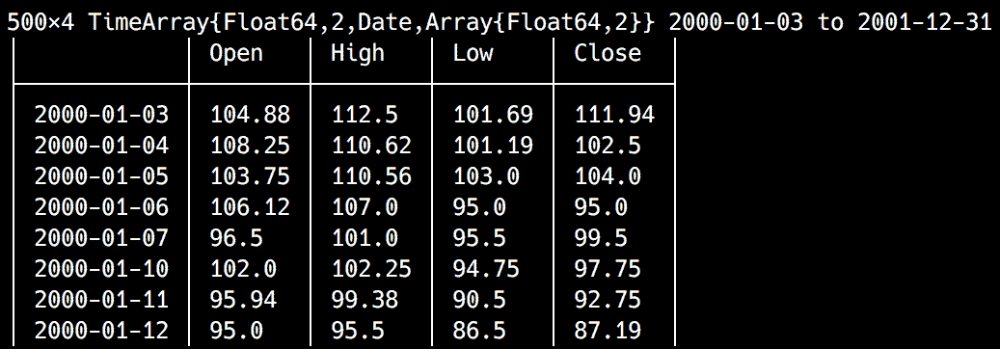

`MarketData`模块还公开了三家主要公司的更大历史价格和成交量数据——苹果（`AAPL`）、波音（`BA`）和卡特彼勒（`CAT`）。

# 使用 Plots 和 PyPlot 快速查看我们的数据

正如古老的谚语所说，“一图胜千言”，让我们通过绘图来快速了解我们的数据。这是一个介绍最好的 Julia 数据可视化包——`Plots`的好机会。与之前我们使用的`Gadfly`不同，`Plots`采用不同的方法——它是一个覆盖多个不同绘图库的接口。基本上，它就像中间件，为其他绘图包（称为**后端**）提供了一个通用、统一的 API。在 Julia 中，不同的绘图包有不同的功能和优势——根据用户的特定需求，他们可能被迫学习另一个库，更改代码，等等，以便可以互换使用不同的绘图包。`Plots`通过一个统一的 API 和一种简单的机制来解决此问题，该机制允许动态交换后端。

`Plots`包支持以下后端——`PyPlot`、`Plotly`或`PlotlyJS`、`GR`、`UnicodePlots`、`PGFPlots`、`InspectDR`和`HDFS5`。您应该使用哪一个？这取决于实际用例，但根据`Plots`作者的表述——*GR 用于速度，Plotly(JS)用于交互性，否则使用 PyPlot*。

请阅读官方文档[`docs.juliaplots.org/latest/backends/`](http://docs.juliaplots.org/latest/backends/)，以了解每个后端的优势和劣势。

我们将使用`PyPlot`，这是对同名流行 Python 包的 Julia 包装器。让我们安装`Plots`和`PyPlot`。运行`pkg> add Plots`应该是直接的。接下来，`pkg> add PyPlot`将更加复杂。由于`PyPlot`使用`PyCall.jl`来调用 Python 代码，根据您当前的 Julia 安装，`Pkg`可能还需要安装`miniconda` Python 发行版。因此，可能需要几分钟。

要开始使用`Plots`与`PyPlot`，请确保您运行以下命令：

```py
julia> using Plots 
julia> pyplot() 
Plots.PyPlotBackend() 
```

`pyplot`函数配置`PyPlot`后端，以便`Plots`使用。

在安装`PyPlot`后，尝试运行`pyplot()`时，你可能会遇到错误。如果建议这样做，请遵循包提供的说明并重新启动 Julia REPL。

我们现在可以开始了！该模块公开了`plot`函数，在最简单的情况下，可以通过两个值集合来调用，对应于 x 和 y 坐标：

```py
julia> plot(1:10, rand(10))
```

你应该会看到一个新窗口中渲染的图表——我的看起来像这样，但由于我们正在可视化随机值，你的可能会有所不同：

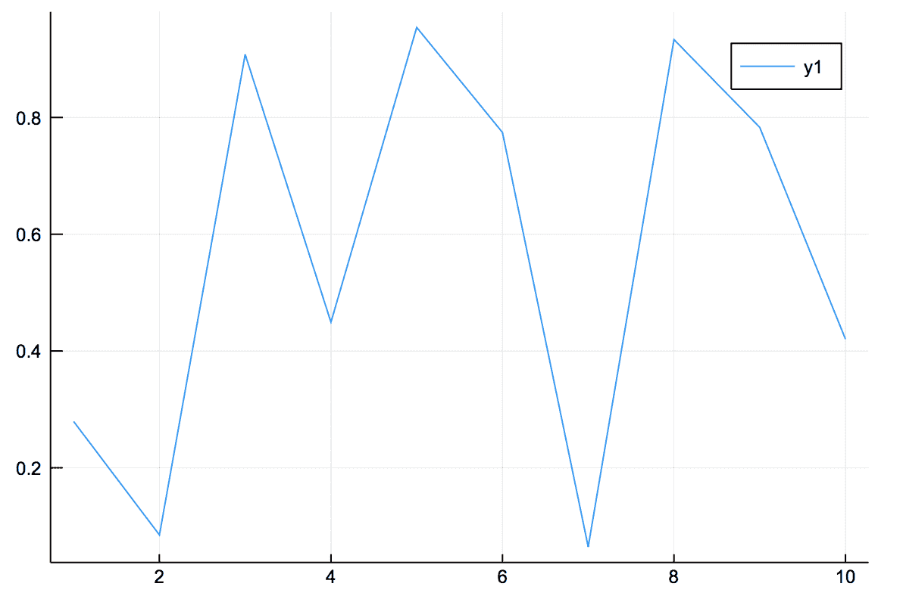

这是一个由`PyPlot`渲染的十个随机值的图表。

这些图表的一个有趣之处在于，它们可以使用`plot!`函数进行修改。例如，我们可以通过绘制一个矩阵来向其中添加两条线：

```py
julia> plot!(rand(10, 2)) 
```

结果输出如下：

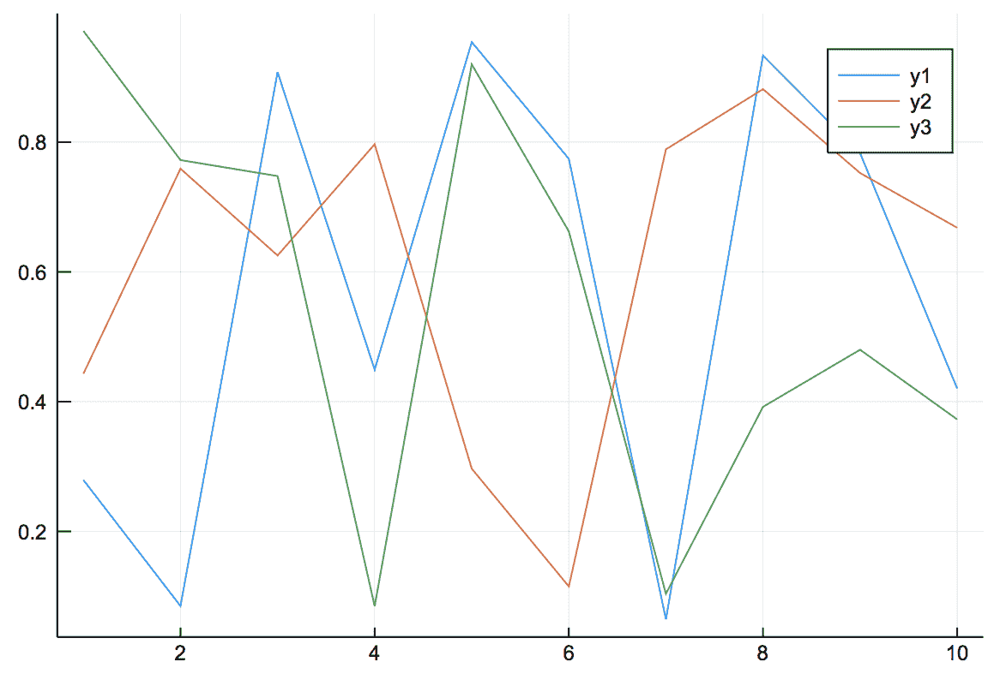

我们可以使用属性来增强图表。它们允许我们添加标签、标题，以及样式化可视化等等。例如，以下是使用额外属性渲染我们之前的图表的方法：

```py
julia> plot(1:10, rand(10,3), title="Three Lines",label=["First" "2nd" "Third Line"],lw=3) # lw stands for line width 
```

输出如下：

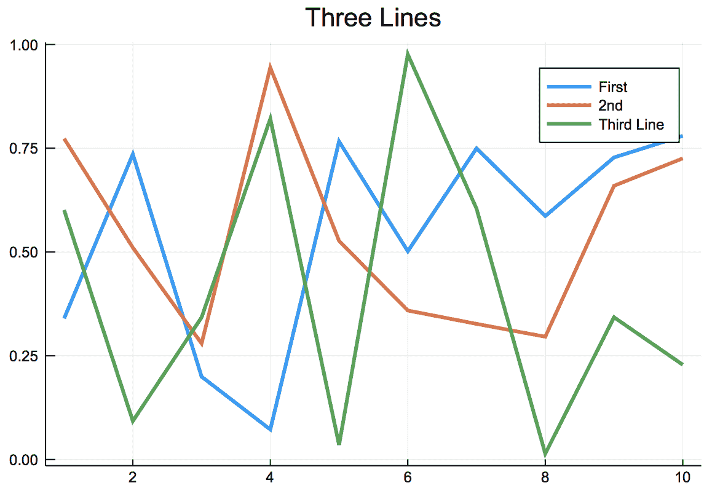

API 还公开了在渲染后修改图表的函数：

```py
julia> xlabel!("Beautiful lines") 
julia> ylabel!("Small lines") 
```

输出如下：

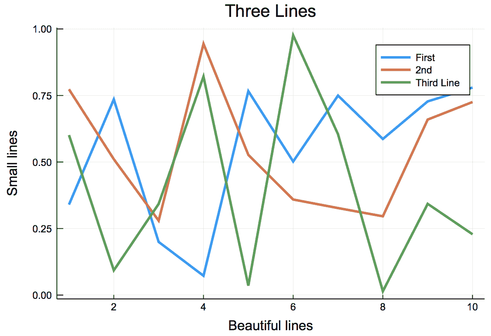

回到我们的市场数据，你可能会很高兴地听到`TimeSeries`提供了与`Plots`的即插即用集成。我们只需要运行以下命令：

```py
julia> plot(MarketData.ohlc) 
```

这是我们得到的结果：

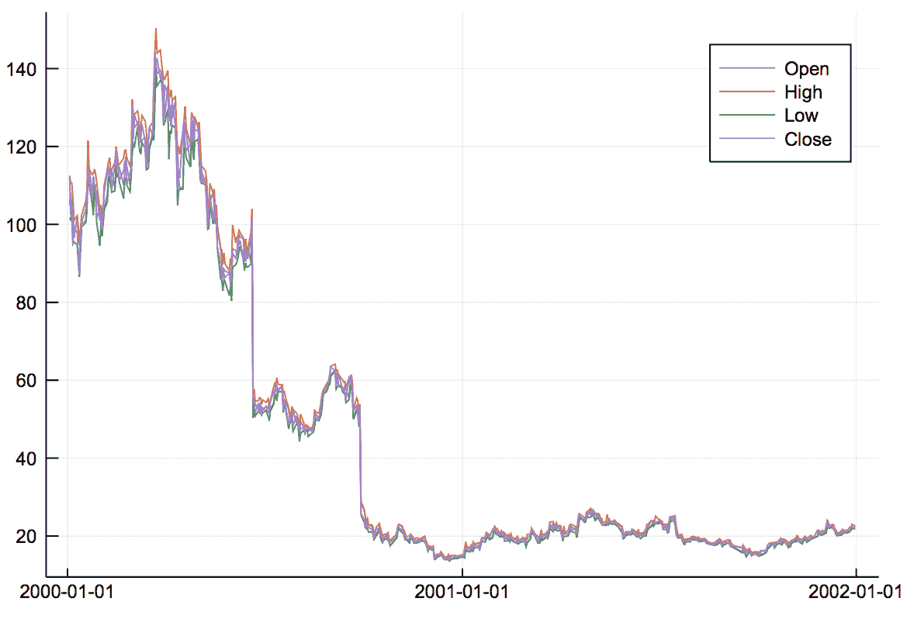

我们可以看到市场一直在增长，在 2000 年 3 月达到顶峰，然后突然下降到大约 50-60。它在那里停留了几个月，然后在 9 月底再次下降，一直保持在 30 以下，直到 2001 年底。四个值，`Open`（开盘价）、`Close`（收盘价）、`High`（最高价）和`Low`（最低价）似乎高度相关。我们可以单独绘制它们：

```py
julia> plot(MarketData.ohlc[:High]) 
```

我们得到以下结果：

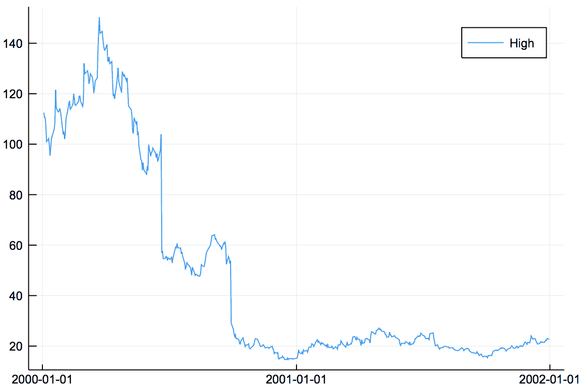

我们可以这样添加额外的值：

```py
julia> plot!(MarketData.ohlc[:Low]) 
```

输出如下：

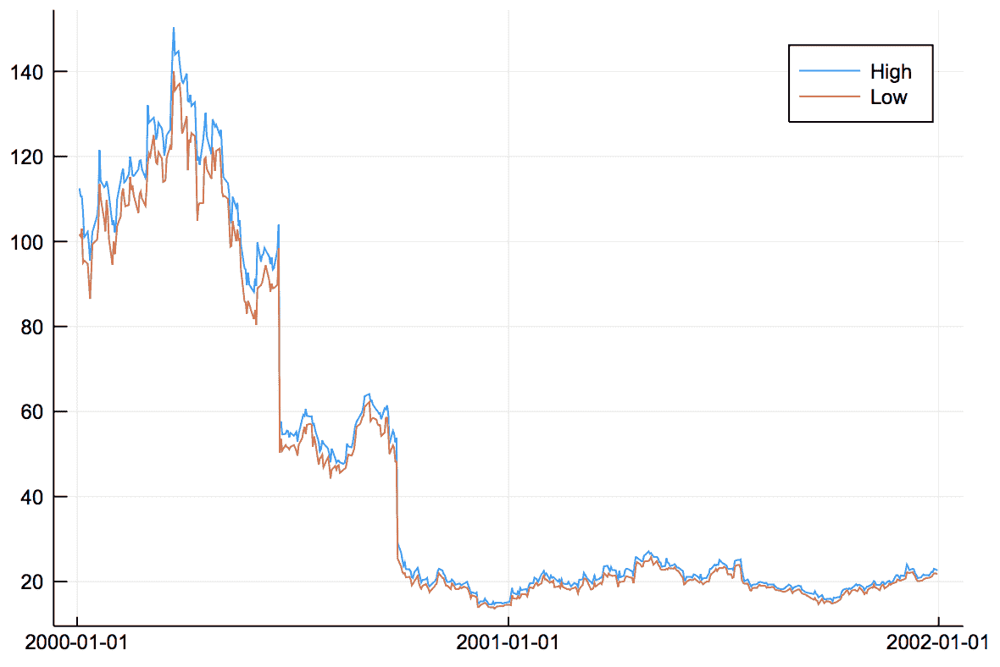

通过可视化高值与低值，我们可以看到在市场崩溃前的时期有更高的变化。

# `TimeArray`类型

那么，这个`TimeArray`到底是什么呢？你可能想知道？它看起来像是一个有趣的生物，因为我们可以用方括号和列名来索引它。我们可以使用`fieldnames`函数来查看它暴露了哪些属性：

```py
julia> fieldnames(typeof(MarketData.ohlc)) 
(:timestamp, :values, :colnames, :meta) 
```

事实上，一个`TimeArray`是一个复合类型——在 Julia 中我们称之为`struct`，它有四个字段。

`timestamp`字段代表一个时间值向量——它们持有时间序列的时间坐标。因此，如果我们查看我们的`TimeArray`对象，我们会在第一行看到这个：

```py
julia> MarketData.ohlc |> head 
6×4 TimeArray{Float64,2,Date,Array{Float64,2}} 2000-01-03 to 2000-01-10  
```

它看起来像这样：

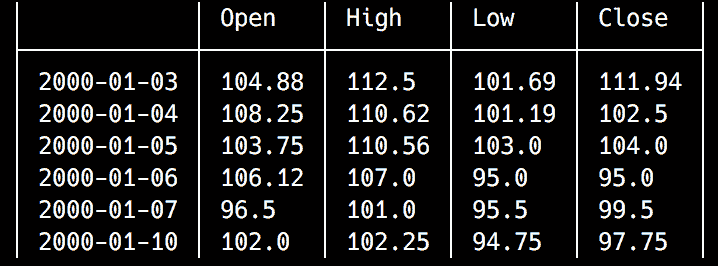

在这个输出中，`2000-01-03`是`timestamp`数组中的第一个值。我们可以使用`timestamp`获取器来访问数组：

```py
julia> timestamp(MarketData.ohlc) 
500-element Array{Date,1}: 
 2000-01-03 
 2000-01-04 
 2000-01-05 
# output truncated 

julia> timestamp(MarketData.ohlc)[1]  
2000-01-03 
```

根据数据集中的实际信息，其类型可以是 `Date`（如我们的情况），`Time` 或 `DateTime`——`TimeType` 的任何子类型。

在构建 `TimeArray` 时，你必须小心，因为 `timestamp` 数据必须排序——否则，构造函数将出错。

类似地，与 `timestamp` 字段一样，你可能可以猜到 `values` 属性的内容。它包含时间序列的数值数据：

```py
julia> values(MarketData.ohlc) 
500×4 Array{Float64,2} 
```

输出如下：

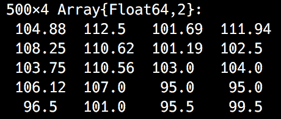

显然，`values` 数组的行数必须与 `timestamp` 集合的长度相匹配。不那么明显的是，`values` 数组内部的所有值必须属于同一类型。

因此，`TimeArray` 中的每一行都由 `timestamp` 集合中的一个项目以及 `values` 数组中的对应行组成：

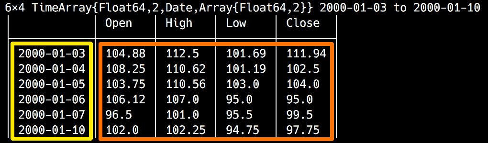

`colnames` 函数返回值字段中每个列的列名数组。它们作为符号返回：

```py
julia> colnames(MarketData.ohlc)  
4-element Array{Symbol,1}: 
 :Open 
 :High 
 :Low 
 :Close  
```

这里的唯一硬性约束是 `colnames` 向量中的项目数必须与 `values` 集合中的列数相匹配。由于 `TimeArrays` 可以通过列名索引，`colnames` 向量中的重复字符串将由构造函数自动修改。每个后续的重复名称将附加一个 *n*，其中 *n* 从 `1` 开始。

如果你对列名不满意，可以使用 `rename` 方法进行更改，传入 `TimeArray` 对象和列名符号数组：

```py
julia> rename(MarketData.ohlc, [:Opening, :Maximum, :Minimum, :Closing]) 
```

最后，`meta` 字段应该用于将元信息附加到对象上。默认情况下，它是空的，可以根据需要由程序员设置。

# 索引 `TimeArray` 对象

`TimeSeries` 库公开了一个强大的 API，用于访问结构化为 `TimeArray` 数据的信息。我们已经看到，我们可以通过按列名索引来访问单个列：

```py
julia> MarketData.ohlc[:High] 
500×1 TimeArray{Float64,1,Date,Array{Float64,1}} 2000-01-03 to 2001-12-31 
```

这就得到了以下结果：

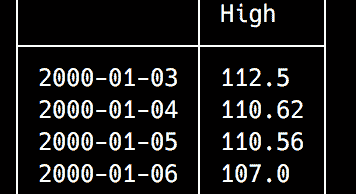

我们甚至可以使用列的组合：

```py
julia> MarketData.ohlc[:High, :Low] 
```

输出如下：

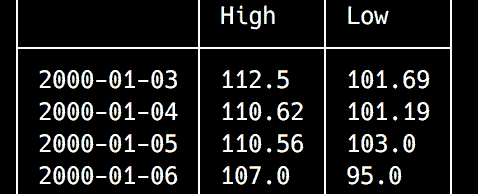

我们还可以使用行 ID 和日期/时间（对应于 `timestamp` 值）来索引数组。让我们尝试获取 `Close` 值最高的行。首先，让我们找到它：

```py
julia> maximum(values(MarketData.ohlc[:Close])) 
144.19 
```

最高收盘价为 `144.19`。请注意，按列名索引返回另一个 `TimeArray` 实例，因此要获取其底层数值，我们需要使用 `values` 函数。

现在我们可以找到其对应的索引。我们可以通过使用 `findall` 快速获取所有等于 `144.19` 的值的索引数组：

```py
julia> findall(values(MarketData.ohlc[:Close]) .== 144.19) 
1-element Array{Int64,1}: 
 56 
```

那将是第 `56` 行。我们可以使用这些信息来索引时间序列：

```py
julia> MarketData.ohlc[56] 
1×4 TimeArray{Float64,2,Date,Array{Float64,2}} 2000-03-22 to 2000-03-22 
```

输出如下：

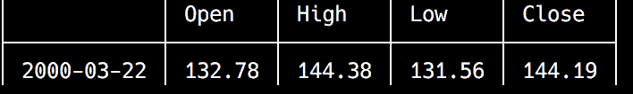

这是 2000 年 3 月 22 日。如果我们想查看其前后行，可以轻松做到：

```py
julia> MarketData.ohlc[50:60] 
11×4 TimeArray{Float64,2,Date,Array{Float64,2}} 2000-03-14 to 2000-03-28 
```

这是生成的 `TimeArray`：

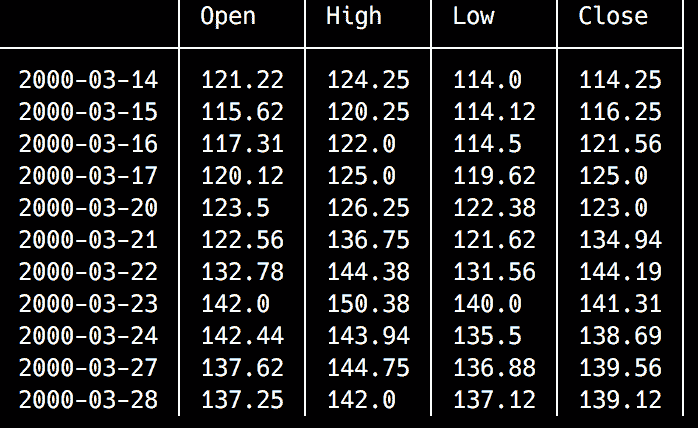

如果我们想要检查我们日期前后同一星期的值，使用范围索引支持步长参数。我们可以如下使用它：

```py
julia> MarketData.ohlc[7:7:70] 
```

我们过滤每隔第七天，从第七行开始，一直到第七十行；也就是说，每个`星期三`，如`Dates.dayname`所示：

```py
julia> dayname(timestamp(MarketData.ohlc)[56]) 
"Wednesday" 
```

如果我们想要检索所有的星期三，当然可以使用 `end` 关键字，例如 `MarketData.ohlc[7:7:end]`。

假设我们对此满意，但还想获取更多关于我们日期的上下文信息。因此，我们想要所有星期三以及我们日期的前一天和后一天。我们也可以通过索引索引数组来实现这一点：

```py
julia> MarketData.ohlc[[7:7:49; 54;55;56;57; 63:7:70]] 
13×4 TimeArray{Float64,2,Date,Array{Float64,2}} 2000-01-11 to 2000-04-11 
```

输出如下：

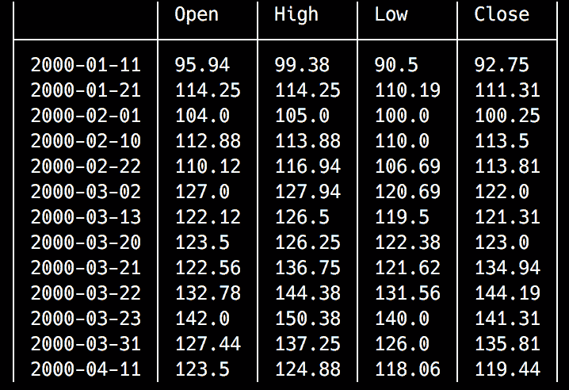

这里，我们抽取 7 到 49 之间的每第七行，然后是第 54、55、56 和 57 行，然后是 63 到 70 之间的每第七行。

`TimeArray` 索引非常灵活，但请注意，行必须始终按日期排序。这就是为什么我们不能说，例如，`[7:7:70; 54;55;56;57]`——元素会顺序错乱。至于错误，包括重复行也会导致错误。

我们还可以使用日期/时间对象进行索引：

```py
julia> MarketData.ohlc[Date(2000, 03, 22)] 
1×4 TimeArray{Float64,2,Date,Array{Float64,2}} 2000-03-22 to 2000-03-22 
```

这会产生以下结果：

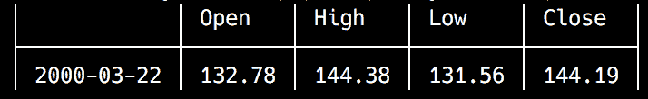

是的，我们也可以使用日期/时间范围：

```py
julia> MarketData.ohlc[Date(2000, 03, 20):Day(1):Date(2000, 04,30)] 
29×4 TimeArray{Float64,2,Date,Array{Float64,2}} 2000-03-20 to 2000-04-28 
```

输出如下：

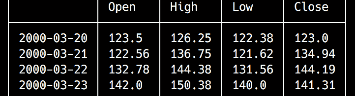

使用其他日期范围步长同样有效：

```py
julia> MarketData.ohlc[Date(2000, 03, 20):Dates.Week(1):Date(2000, 04,30)] 
6×4 TimeArray{Float64,2,Date,Array{Float64,2}} 2000-03-20 to 2000-04-24 
# output truncated 
```

结合多个索引也行得通：

```py
julia> MarketData.ohlc[[Date(2000, 03, 20):Day(1):Date(2000, 04,30); Date(2000, 05, 01)]] 
30×4 TimeArray{Float64,2,Date,Array{Float64,2}} 2000-03-20 to 2000-05-01 
```

最后，我们可以组合任何我们想象得到的列和行：

```py
julia> MarketData.ohlc[:High, :Low][Date(2000, 03, 20):Day(1):Date(2000, 03,25)] 
5×2 TimeArray{Float64,2,Date,Array{Float64,2}} 2000-03-20 to 2000-03-24 
```

这是结果：

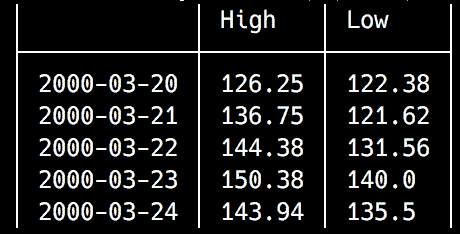

# 查询 `TimeArray` 对象

`TimeSeries` 模块提供了一个强大的、类似查询的 API，用于过滤时间序列数据。让我们看看它们中的每一个。

# `when()` 方法

`when` 方法允许将 `TimeArray` 中的元素聚合到特定的时期。例如，我们可以使用这个函数以更简洁的方式选择数据集中的星期三：

```py
julia> when(MarketData.ohlc[1:70], Dates.dayname, "Wednesday") 
14x4 TimeArray{Float64,2,Date,Array{Float64,2}} 2000-01-05 to 2000-04-05 
# output truncated 
```

我们不仅限于使用 `Dates.dayname`；我们还可以使用之前章节中提到的许多 `Dates` 函数——`day`、`dayname`、`week`、`month`、`monthname`、`year`、`dayofweek`、`dayofweekofmonth`、`dayofyear`、`quarterofyear` 和 `dayofquarter`：

```py
julia> when(MarketData.ohlc, Dates.monthname, "August") 
46x4 TimeArray{Float64,2,Date,Array{Float64,2}} 2000-08-01 to 2001-08-31 
# output truncated 
```

# `from()` 方法

这个函数从传递给方法的日期开始截断 `TimeArray`。与传递的日期对应的行包含在结果中：

```py
julia> from(MarketData.ohlc, Date(2000, 3, 22)) 
445x4 TimeArray{Float64,2,Date,Array{Float64,2}} 2000-03-22 to 2001-12-31 
```

输出如下：

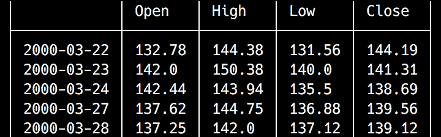

# `to()` 方法

`to()` 方法返回作为参数传递的日期及之前的所有行：

```py
julia> to(MarketData.ohlc, Date(2000, 3, 22)) 
56x4 TimeArray{Float64,2,Date,Array{Float64,2}} 2000-01-03 to 2000-03-22 
# output truncated 
```

# `findall()` 和 `findwhen()` 方法

这个函数族测试一个条件，并返回条件为真的结果。唯一的区别是`findall()`返回一个包含行号的数组，而`findwhen()`返回一个日期/时间对象的向量。例如，如果我们想找到所有收盘价至少比开盘价高 10%的行，我们可以运行以下代码：

```py
julia> findall(MarketData.ohlc[:Close] .>= MarketData.ohlc[:Open] .+ MarketData.ohlc[:Open] .* 0.1) 
7-element Array{Int64,1}: 
  55 
  74 
 119 
 254 
 260 
 271 
 302 
```

`findwhen`将产生类似的输出，但针对日期：

```py
julia> findwhen(MarketData.ohlc[:Close] .>= MarketData.ohlc[:Open] .+ MarketData.ohlc[:Open] .* 0.1) 
7-element Array{Date,1}: 
 2000-03-21 
 2000-04-17 
 2000-06-21 
 2001-01-03
```

```py
 2001-01-11 
 2001-01-29 
 2001-03-14 
```

# 操作时间序列对象

`TimeSeries`提供了一组简约但高效的方法来修改`TimeArray`对象。

# `merge()`

首先，我们可以将两个`TimeArrays`的数据合并起来。`merge`方法使用时间戳作为连接列，并且默认执行内连接。但也可以执行左连接、右连接和外连接。让我们生成一些随机数据来实验。我们将从创建一个包含随机值的时间序列开始，这些值分布在从今天开始的整个星期内：

```py
julia> d1 = today():Day(1):today() + Week(1) |> collect 
8-element Array{Date,1}: 
 2018-11-08 
 2018-11-09 
 2018-11-10 
 2018-11-11 
 2018-11-12 
 2018-11-13 
 2018-11-14 
 2018-11-15 

julia> t1 = TimeArray(d1, rand(length(d1)), [:V1]) 
8×1 TimeArray{Float64,1,Date,Array{Float64,1}} 2018-11-08 to 2018-11-15 
```

输出如下：

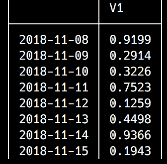

接下来，我们将创建另一个跨越十天的时间序列对象：

```py
julia> d2 = today():Day(1):today() + Day(10) |> collect 
11-element Array{Date,1}: 
 2018-11-08 
 2018-11-09 
 2018-11-10 
 2018-11-11 
 2018-11-12 
 2018-11-13 
 2018-11-14 
 2018-11-15 
 2018-11-16 
 2018-11-17 
 2018-11-18 

julia> t2 = TimeArray(d2, rand(length(d2)), [:V2]) 
11×1 TimeArray{Float64,1,Date,Array{Float64,1}} 2018-11-08 to 2018-11-18  
```

这将产生以下结果：

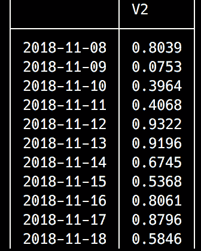

因此，我们现在有两个`TimeArray`实例，`t1`和`t2`。`t2`对象包含`t1`中所有天的值以及额外三天。一个常规的（内连接）`merge`只会使用`t1`和`t2`中都存在的时间戳的行：

```py
julia> merge(t1, t2) 
8×2 TimeArray{Float64,2,Date,Array{Float64,2}} 2018-11-08 to 2018-11-15 
```

这是输出：

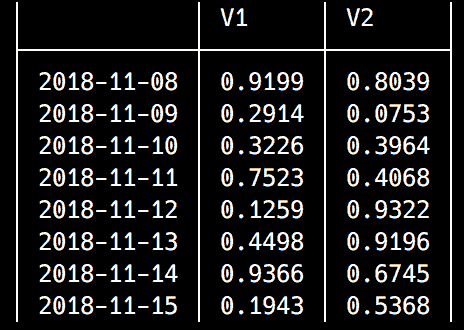

正确，左连接、右连接和外连接将为不对应的行引入`NaN`值：

```py
julia> merge(t1, t2, :right) 
11×2 TimeArray{Float64,2,Date,Array{Float64,2}} 2018-11-08 to 2018-11-18 
```

输出如下：

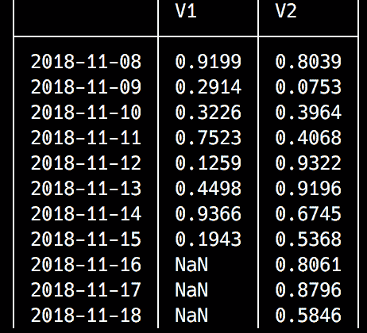

# `vcat()`方法

`vcat()`方法可以被认为是`merge`的对应方法。如果`merge`连接两个时间序列的列，`vcat`则合并它们的行。它最明显的用例是将来自多个文件的分割数据集的数据组合在一起。让我们看看它的实际应用：

```py
julia> d3 = today() + Week(2):Day(1):today() + Week(3) |> collect  
8-element Array{Date,1}: 
 2018-11-22 
 2018-11-23 
 2018-11-24 
 2018-11-25 
 2018-11-26 
 2018-11-27
```

```py
 2018-11-28 
 2018-11-29 

julia> t3 = TimeArray(d3, rand(length(d3)), [:V1]) 
8×1 TimeArray{Float64,1,Date,Array{Float64,1}} 2018-11-22 to 2018-11-29 
```

输出如下：

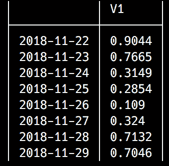

我们创建了一个新的`TimeArray`，它覆盖了从今天开始的两周到三周的时间段：

```py
julia> vcat(t1, t3) 
16×1 TimeArray{Float64,1,Date,Array{Float64,1}} 2018-11-08 to 2018-11-29 
```

这是生成的`TimeArray`：

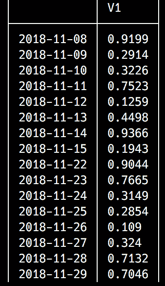

生成的结果时间序列结合了`t1`和`t3`的数据。

# `collapse()`方法

此方法允许将数据压缩到更大的时间框架中，例如将每日数据转换为每周数据：

```py
julia> january = TimeArray(Date(2018, 1, 1):Day(1):Date(2018, 1, 31) |> collect, rand(31), [:values]) 
31×1 TimeArray{Float64,1,Date,Array{Float64,1}} 2018-01-01 to 2018-01-31 
```

它产生以下输出：

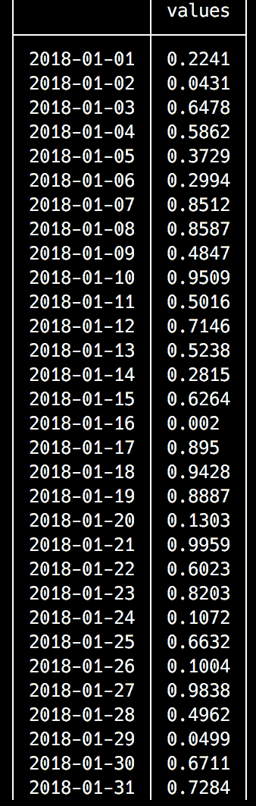

如果我们要`collapse`一月份的时间序列，我们需要决定如何处理被压缩的数据。这是通过传递函数参数来实现的。该方法的一般形式如下：

```py
collapse(<time series>, <time function>, <time filtering function>, <value collapsing function>) 
```

例如，我们可以通过保留周期内的最后一天（`<time filtering function>`）并计算值的平均值（`<value collapsing function>`）来将一月份的数据`collapse`到一个周期间：

```py
julia> using Statistics 
julia> collapse(january, week, last, mean) 
5×1 TimeArray{Float64,1,Date,Array{Float64,1}} 2018-01-07 to 2018-01-31 
```

输出结果如下：

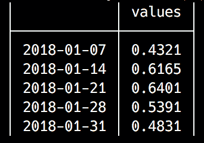

`<value collapsing function>` 是可选的，如果没有提供，则将使用与时间戳对应的值：

```py
julia> collapse(january, week, first) 
5×1 TimeArray{Float64,1,Date,Array{Float64,1}} 2018-01-01 to 2018-01-29 
```

这是我们得到的结果：

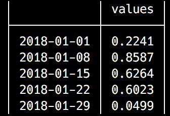

# map() 方法

最后，`map()` 函数允许我们对时间序列中的每一行进行迭代，并对时间戳和值应用一个函数。我们可以轻松地将 `january` 时间序列的第一周推迟一年，如下所示：

```py
julia> map(january[1:7]) do ts, values 
           ts += Year(1) 
           (ts, values) 
       end 
7×1 TimeArray{Float64,1,Date,Array{Float64,1}} 2019-01-01 to 2019-01-07 
```

输出结果如下：

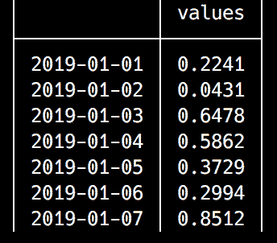

关于 `TimeSeries` 还有更多要说的。但到目前为止，我们先到此为止。我们将在下一章回到 `TimeArray`，我们将用它来对欧盟的失业数据进行时间序列分析和预测。

# 摘要

在本章中，我们学习了在 Julia 中处理日期和时间的方法。该语言提供了一个强大且易于访问的 API，遵循 Julia 的整体哲学——你可以从简单开始，随着知识的增长而增强你的代码。因此，默认情况下，日期/时间对象使用本地时间，忽略像时区这样的复杂细节。然而，时区支持只需一个包即可实现。我们看到了如何通过使用 `TimeZones` 提供的功能来扩展 Julia 的 `Dates` API。

通过我们对时间数据的理解，我们又能向前迈出一大步，成为熟练的 Julia 程序员，并学习了时间序列和强大的 `TimeArray`。我们看到了如何使用 `Plots` 库来绘制时间序列，这是一个为 Julia 提供极其灵活绘图功能的库——实际上，它是一个中间件，为一系列可视化包提供了一个通用的 API，使我们能够根据需要交换后端。

在下一章中，我们将继续讨论时间序列，通过对欧盟的失业水平进行分析和预测来执行。在这个过程中，我们将了解时间序列分析最重要的模式——趋势、季节性和不规则性，并且我们将通过执行各种时间序列转换来扩展我们对 `TimeSeries` 的知识。
