# 时间序列预测

在上一章中，我们学习了如何使用 Julia 处理日期和时间。这使我们能够理解时间序列数据的重要概念。现在，我们准备讨论另一个高度重要的数据科学主题——时间序列分析。

时间序列分析和预测代表了任何组织的关键战略和决定性组成部分，从理解销售高峰期到季节结束间隔和折扣，安排员工休假时间，预算，财政年度，产品发布周期，原材料需求增加，以及许多其他方面。理解和预测各种商业指标随时间的变化是商业活动的一个必要部分，无论我们是在谈论学校、价值数十亿美元的公司、酒店、超市还是政府。

然而，时间序列数据分析是数据科学中最复杂任务之一。时间事件的性质和特殊性导致了专用算法和方法的发展。

在本章中，我们将使用 Julia 研究时间序列分析和预测的基础知识。尽管 Julia 是一种相对较新的语言，但它已经具备了处理时间相关数据的好支持。在上一章中，我们学习了关于 Dates 模块和 `TimeSeries` 包的内容。在本章中，我们将更深入地研究并应用我们之前学到的知识。我们还将了解更多高级的 `TimeSeries` 方法以及一些其他用于处理时间数据的包。我们将涵盖以下主题：

+   欧洲联盟（**EU**）失业数据的探索性数据分析

+   趋势、周期、季节性和误差——时间序列的组成部分

+   时间序列分解

+   时间序列数据的平稳性、差分和自相关性

+   学习应用简单的预测技术

# 技术要求

Julia 包生态系统正在持续发展中，并且每天都有新的包版本发布。大多数时候，这是一个好消息，因为新版本带来了新功能和错误修复。然而，由于许多包仍在测试版（版本 0.x）中，任何新版本都可能引入破坏性更改。因此，书中展示的代码可能无法正常工作。为了确保您的代码能够产生与书中描述相同的结果，建议使用相同的包版本。以下是本章使用的外部包及其具体版本：

```py
CSV@v0.4.3
DataFrames@v0.15.2
IJulia@v1.14.1
Plots@v0.22.0
TimeSeries@v0.14.0
```

为了安装特定版本的包，您需要运行：

```py
pkg> add PackageName@vX.Y.Z 
```

例如：

```py
pkg> add IJulia@v1.14.1
```

或者，您也可以通过下载章节提供的 `Project.toml` 文件并使用 `pkg>` 实例化来安装所有使用的包：

```py
julia> download("https://raw.githubusercontent.com/PacktPublishing/Julia-Programming-Projects/master/Chapter10/Project.toml", "Project.toml")
pkg> activate . 
pkg> instantiate
```

# 快速查看我们的数据

在本章中，我们将使用由欧盟统计局提供的真实数据。欧盟统计局在其网站上拥有丰富的数据库。为了我们的学习项目，我们将查看失业数据——在经历了长期的经济衰退后，欧盟的经济正在增长，这些统计数据应该非常有趣。各种欧盟就业和失业数据可以从 [`ec.europa.eu/eurostat/web/lfs/data/database`](http://ec.europa.eu/eurostat/web/lfs/data/database) 下载。我们将使用 **按性别和年龄划分的失业率——月平均** 数据集。

您不需要下载这个，因为本章的支持文件中提供了一个结构更好的数据集。然而，如果您好奇并想看看，您可以从就业和失业（劳动力调查）类别 | LFS 主要指标子类别 | 失业 - LFS 调整系列文件夹下获取原始数据。

我还通过使用 *千人* 作为计量单位（默认是 *活跃人口的百分比*）和未调整的数据（既不是季节性的，也不是日历的）来定制了数据。我还只保留了欧盟的数据（没有单个国家）。最后，我包括了 2005 年 1 月到 2017 年 12 月的所有数据。您可以在数据探索器中进行所有这些调整，然后下载表格作为 TSV 文件。至于 TSV 格式，我选择了以下选项：

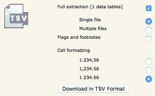

在欧盟统计局数据探索工具中可视化，数据看起来是这样的：

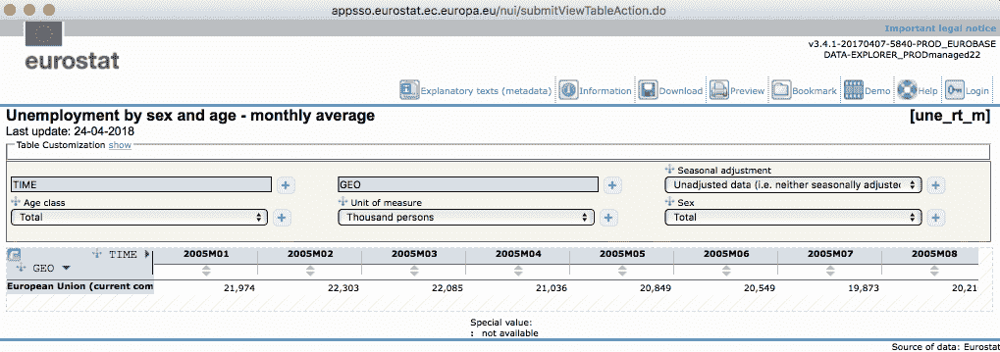

我们可以看到第一列是地理区域列表，其余列是按月度的失业数据。这个数据集的结构与我们所需的不同。首先，`TimeSeries` 需要矩阵转置（即，日期应成为行而不是列）。此外，日期以非标准方式格式化，例如，`2017M01` 表示 2017 年 1 月。最后，数字以字符串格式表示，千位分隔符用空格表示。您可以从本章的支持文件中下载这个原始数据文件，这些文件托管在 [`github.com/PacktPublishing/Julia-Programming-Projects/blob/master/Chapter10/data/une_rt_m_1.tsv`](https://github.com/PacktPublishing/Julia-Programming-Projects/blob/master/Chapter10/data/une_rt_m_1.tsv)。

在处理真实数据时，这类问题很常见——关于结构和格式的标准差异使得数据清洗和转换成为任何数据科学项目的关键第一步，通常也是一个耗时的工作。为了简洁起见，我已经准备了一个简化后的数据集，它已经被转换，可以无缝地与 `TimeSeries` 一起使用，您可以从本章的支持文件中下载。

# 数据处理

如果你想跟上来，以下是我是如何使用 Julia 处理原始数据的：

```py
# load the raw data file as a DataFrame 
julia> using CSV, DataFrames 
julia> df = CSV.read("une_rt_m_1.tsv", header = true, delim = '\t') 
1×157 DataFrames.DataFrame. Omitted printing of 148 columns 
```

这是在 Jupyter Notebook 中的样子：


在下一步中，我们将通过选择一个由 1 行和 2 列组成的`DataFrame`并将其转换为`Array`来提取值：

```py
julia> values = convert(Array, df[1, 2:end]) 1×156 Array{Union{Missing, String},2}: "21 974" "22 303" "22 085" "21 036" "20 849" ... # output omitted 
```

现在，我们可以解析之前提取的字符串值并将它们转换为整数。新的整数值也存储在一个向量中：

```py
julia> values = map(x -> parse(Int, replace(x, " "=>"")), values)[:] 
156-element Array{Int64,1}: 
 21974 
 22303 
 22085 
 21036 
# output omitted 
```

太好了——我们的值准备好了！现在我们可以专注于头部。我们的目标是提取标签中包含的日期信息。作为第一步，我们将列名拉入一个向量，如下所示：

```py
julia> dates = names(df)[2:end] 
156-element Array{Symbol,1}: 
 Symbol("2005M01") 
 Symbol("2005M02") 
 Symbol("2005M03") 
 Symbol("2005M04") 
 Symbol("2005M05") 
# output omitted 
```

现在，让我们转换符号，使它们更接近我们需要的标准日期格式。我们将用连字符替换"`M`"，在这个过程中，我们将符号转换为`String`，因为替换操作不适用于符号：

```py
julia> dates = map(x -> replace(string(x), "M"=>"-"), dates) 
156-element Array{String,1}: 
 "2005-01" 
 "2005-02" 
 "2005-03" 
 "2005-04" 
 "2005-05" 
# output omitted 
```

太棒了！现在，我们可以定义一个与我们的字符串匹配的`DateFormat`——年份加连字符加月份，月份为一个带前导零的数字。我们将使用它将字符串转换为正确的日期对象：

```py
julia> using Dates 
julia> dateformat = DateFormat("y-m") 
dateformat"y-m" 

julia> dates = map(x -> Date(x, dateformat), dates) 
156-element Array{Date,1}: 
 2005-01-01 
 2005-02-01 
 2005-03-01 
 2005-04-01 
 2005-05-01 
# output omitted 
```

我们越来越接近了！为了安全地将数据持久化到文件中，我创建了一个新的`DataFrame`，这次使用了正确的日期和原始值，如下所示：

```py
# store the extracted data in a new DataFrame 
julia> df2 = DataFrame(Dates = dates, Values = values) 
156×2 DataFrames.DataFrame 
│ Row │ Dates      │ Values │ 
│ 1   │ 2005-01-01 │ 21974  │ 
│ 2   │ 2005-02-01 │ 22303  │ 
│ 3   │ 2005-03-01 │ 22085  │ 
│ 4   │ 2005-04-01 │ 21036  │ 
│ 5   │ 2005-05-01 │ 20849  │ 
# output omitted 
```

我们可以使用`CSV.write`通过以下代码将我们的数据快照存储到文件中：

```py
# write DataFrame to file 
julia> CSV.write("UE-unemployment.tsv", df2) 
```

现在，我们可以从 TSV 文件中加载数据作为`TimeArray`：

```py
julia> using TimeSeries
julia> unemployment_data = readtimearray("UE-unemployment.tsv")
156x1 TimeArray{Float64,2,Date,Array{Float64,2}} 2005-01-01 to 2017-12-01
```

如果您想直接从`DataFrame`转换为`TimeSeries`数据，而不必加载 TSV 文件，您可以使用`IterableTables`包。`IterableTables`为 Julia 中不同表格类型之间提供了丰富的转换方法。您可以在包的 README 中了解更多信息，网址为[`github.com/davidanthoff/IterableTables.jl`](https://github.com/davidanthoff/IterableTables.jl)。

我们的时间序列数据已正确加载——从 2005 年 1 月到 2017 年 12 月共有 156 个条目。它看起来像这样：

```py
julia> TimeSeries.head(unemployment_data, 10) 
10x1 TimeArray{Float64,2,Date,Array{Float64,2}} 2005-01-01 to 2005-10-01 
```

输出如下：


我们不得不使用头函数的完全限定名称，`TimeSeries.head`，因为`TimeSeries`和`DataFrames`都导出了`head`方法，并且这两个包都被加载到当前作用域中。

如果没有模块的名称就尝试调用头函数，将会导致错误：

```py
julia> head(unemployment_data, 10) 
WARNING: both TimeSeries and DataFrames export "head"; uses of it in module Main must be qualified 
ERROR: UndefVarError: head not defined 
```

要快速了解我们的数据，最好的方法就是绘制一个图表。我们将使用带有`PyPlot`后端的`Plots`包——我们在第九章[11df7c94-2e9a-4cc5-aba1-b9c9c93800a0.xhtml] *处理日期、时间和时间序列* 中安装了它们：

```py
julia> using Plots 
julia> pyplot() 
```

`PyPlot`后端有复杂的依赖关系，所以如果您在执行指示的代码时遇到问题，请按照警告和错误中提供的说明操作。

例如，在某个时候，我不得不手动安装两个额外的包：

```py
julia> using Pkg 
julia> pkg"add PyCall LaTeXStrings"
```

现在，我们可以绘制失业率图表：

```py
julia> plot(unemployment_data) 
```

Julia 将渲染以下图表：

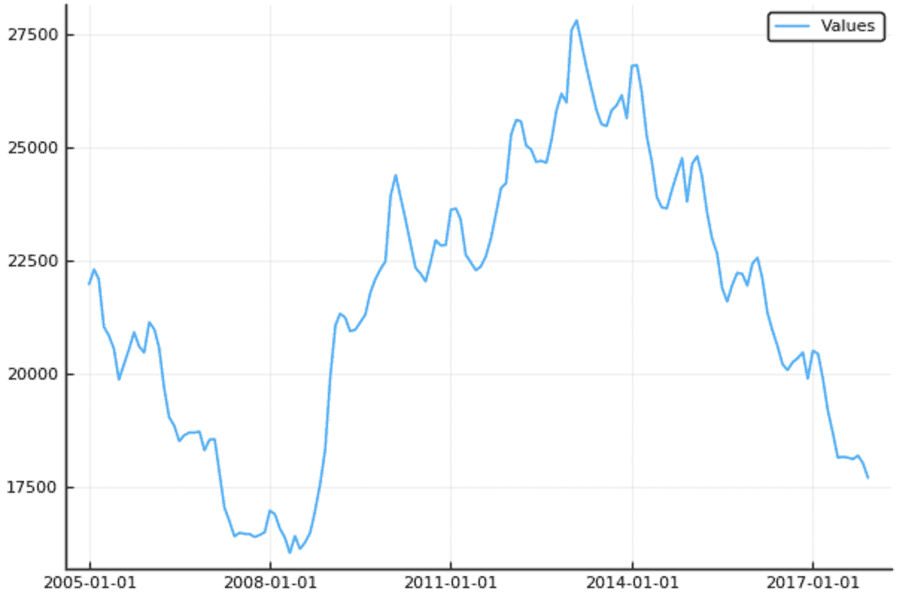

我们可以很容易地看出，自 2005 年以来，失业人数一直在稳步下降，在 2008 年下半年达到了历史最低点。从那时起，在几个月的时间里，失业人数激增至自 2005 年以来的未知水平。这是经济衰退袭击欧盟经济的那一刻。从那时起，失业人数继续增长，直到它们最终在 2013 年初达到峰值。2013 年 2 月，失业人数达到了最高点，此后欧洲经济开始复苏，失业人数迅速下降，接近经济衰退前的水平。

# 理解时间序列成分

时间序列有三个关键成分对于理解与时间相关的数据至关重要。它们是*趋势*、*季节性*和*噪声*。让我们在我们欧盟失业数据的背景下看看每一个。

# 趋势

趋势可以被定义为时间序列数据的长期趋势——即在一段时间内，平均值倾向于增加或减少。观察我们的图表，我们可以识别出三个不同的趋势：

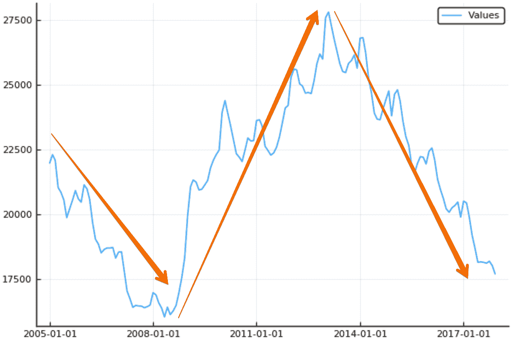

从 2005 年到 2008 年呈下降趋势（年度失业人数减少）；从 2008 年开始上升，一直持续到 2013 年（失业率平均上升）；再次，从 2013 年开始，一直持续到 2017 年底（失业人数持续减少）。

# 季节性

季节性是指与日历时间相关的规律性高低波动模式；也就是说，它直接受到季节、季度、月份等因素的影响。例如，考虑一个城市的电力消耗——我们可能会在夏季由于空调使用而看到消费量的增加，在冬季由于需要供暖而增加。以类似的方式，通过观察海滨酒店，我们会看到夏季预订量显著增加，随后在冬季减少。

因此，季节性产生的效果在时间、方向和幅度上相对稳定。最常见的日历相关影响是自然条件（天气）、商业和行政程序（财政年度）以及社会和文化行为（由于国家和宗教节日而出现的银行假日，如圣诞节、情人节等）。它还包括由日历事件引起的效果，这些事件是周期性的，但在日期上不是固定的（例如，复活节，每年的日期都落在某个星期日，但实际日期会变化）。

失业数据受到强烈的季节性影响——在夏季月份，更多的人被雇佣。这些似乎都是临时工作，可能是在旅游业，帮助酒店和餐馆应对假日游客的涌入——但也可能在办公室和零售行业，以填补常规员工的休假时间。我们可以在我们的图表中清楚地识别这一点——夏季月份是一年中的最低失业率，数值在秋季又开始上升：


在年中三个夏季月份，失业率达到了最低水平。一旦季节性高峰过去，失业率再次急剧上升。

# 随机噪声

分析时间序列数据时的默认假设是我们能够识别一个潜在的规律（由其趋势和季节性成分定义）。然而，当数据中存在这种系统性模式时（例如，一些时间序列数据是完全随机的，例如地震发生频率），它也会伴随着方差——数据中的波动被归类为随机噪声、错误或不规则性。这使得识别模式变得更加困难，因此，数据科学家将使用某种形式的噪声过滤。

换句话说，这个不规则成分是在计算并移除季节性和趋势成分之后剩下的部分。它们是短期波动，既不系统也不可预测。

# 循环性

**循环性**在某种程度上与季节性相似，因此这两个经常被混淆。然而，它们是两件不同的事情，区分它们很重要。循环周期代表更长的时间段，我们可以在这段时间内识别数据中的重复模式（增长或下降的时期），并且不能通过日历模式来解释。它们通常更大，跨越几年，并且不与日历事件重叠。这种循环元素可以由产品发布周期（汽车型号的发布，或操作系统的全新版本，或笔记本电脑系列的升级）、选举周期（政府预算或与政府签订合同的公司）等引入。

# 时间序列分解

因此，我们可以这样说，时间序列中的任何值都可以通过我们之前讨论的四个成分的函数来表示——趋势、季节性、误差和循环。这四个成分之间的关系可以是**加法**或**乘法**。

当季节性变化在时间上保持大致相同的时候，使用加法模型。趋势可能是上升或下降，但季节性保持更多或更少相同。此类数据的图表看起来将非常类似于这个：

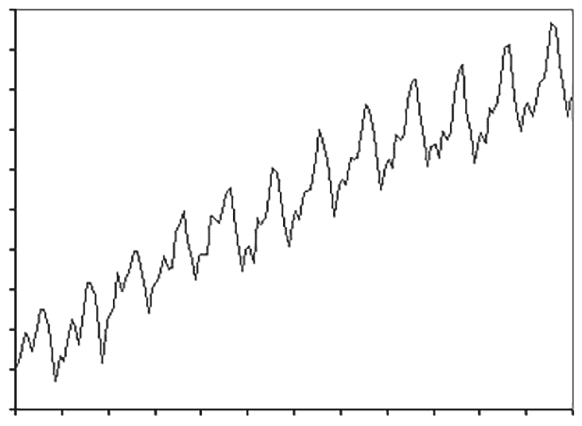

如果我们在年最高值和年最低值之间画两条想象中的线，这些线将几乎是平行的。

对于加法时间序列模型，四个成分相加产生序列中的值。因此，时间序列 *Y* 可以分解为 *Y* = *趋势* + *周期* + *季节性* + *噪声*。

应该使用乘法模型来处理季节性变异性随时间增加的时间序列。例如，典型的乘法时间序列由 1949 年 1 月至 1960 年 1 月之间的国际航空旅客数据表示：

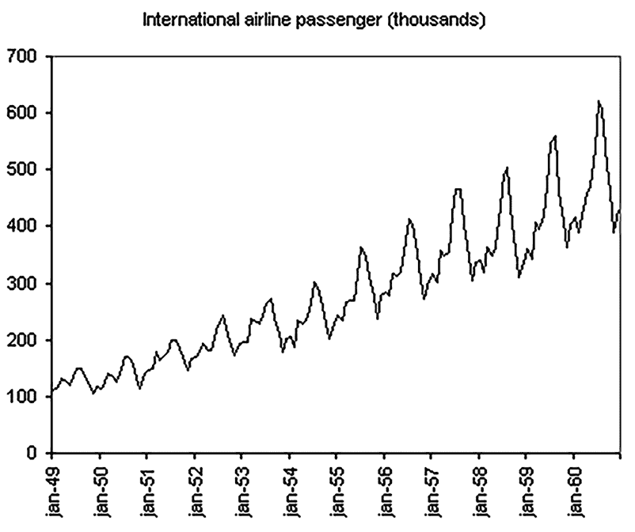

我们可以看到季节性模式的变异性与时间序列的水平相关：乘客越多，变异性越高。一个乘法时间序列 *Y* 可以表示为 *Y* = *趋势* * *周期* * *季节性* * *噪声*。

作为旁注，我们可以通过转换数据直到它在时间上变得稳定，例如通过对数变换，将乘法模型转换为加法模型——*Y* = *趋势* * *周期* * *季节性* * *噪声* 等价于 *log Y* = *log 趋势* + *log 周期* + *log 季节性* + *log 噪声*。

将时间序列分解为其成分是时间数据分析中广泛使用的技术。这被称为**时间序列分解**，它也是时间序列预测的基础。

# 解释数据——是采用加法方法还是乘法方法？

这是问题——两种方法中哪一种更好地解释了我们的数据？回答这个问题的方法之一是查看周期值，看是否有显著变化。由于我们处理的是年度周期，让我们按照以下方式提取并绘制年度年度值：

```py
julia> plot() 
julia> for y in 2005:2017 
           TimeSeries.values(when(unemployment_data, year, y))[:] |> plot! 
           gui() 
       end 
```

首先，我们绘制一个空图。然后，我们遍历从 2005 年到 2017 年的年份范围，然后我们使用`TimeSeries.when`方法通过年份过滤我们的数据。我们通过使用`plot!`函数提取结果`TimeArray`值并将它们附加到图上。然而，这还不够——我们还需要调用`Plots.gui`方法来实际渲染更新的图。根据官方文档，这是一个非常重要的点：

"只有在返回时（分号将抑制返回），或者显式地使用`display(plt)`，`gui()`，或者在您的绘图命令中添加`show = true`时，才会显示图形。"

您可以在[`docs.juliaplots.org/latest/output/`](http://docs.juliaplots.org/latest/output/)了解更多关于输出图形的信息。

这是我们的结果：

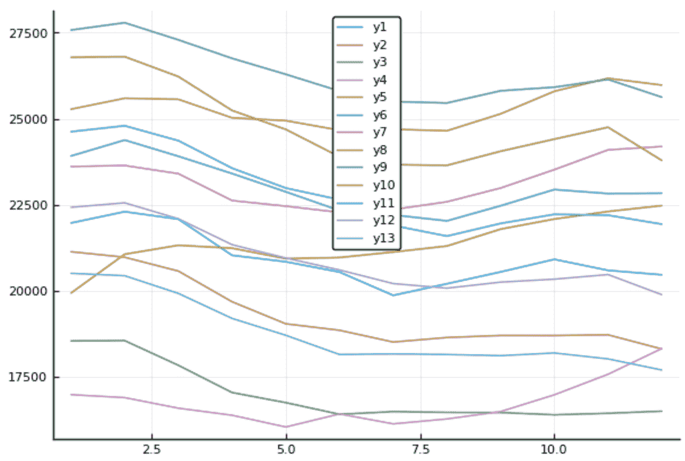

我们可以看到，每年都有一致的年度变化，这意味着我们应该使用乘法模型。

使用`plots`来直观地观察成分是识别时间序列中模式的一种常见方法。在我们的例子中，很容易看出存在趋势和季节性。此外，我们可以推断出数据没有表现出任何周期性模式。

记住，乘法模型认为 *Y = 趋势 * 循环 * 季节性 * 噪声*。我们可以将其简写为 *Y = TCSN*。由于我们刚刚确定我们的数据不呈现任何循环，我们将省略循环成分，因此 *Y = TSN*。

# 提取趋势

分解时间序列的第一步是提取趋势成分。计算趋势的一个广泛使用的技术被称为 **平滑**。正如其名所示，它通过去除噪声和模糊季节性来 *平滑* 值，以便我们可以识别趋势。

执行平滑的一种方法是通过移动平均。在金融应用中，简单移动平均是前 *n* 个数据点的未加权平均值。这就像在我们的时间序列上应用一个移动窗口，并使用可见数据进行计算。然后，我们将窗口滑动一个位置并重复计算。为了平滑季节性数据，窗口的大小应该是季节期的长度——在我们的案例中，是 12 个月。因此，为了对我们的数据进行简单移动平均平滑，我们首先取前 12 个月份（2005 年），求和这些值，然后除以 12 以得到它们的平均值。然后，我们将窗口滑动一个月并重复计算。结果，我们消除了季节性成分的影响，并抵消了噪声的影响。

`TimeSeries` 包提供了一系列 *apply 方法*，用于实现时间序列数据的常见转换。其中之一是 `moving` 方法，它可以用来计算序列的移动平均。让我们计算 12 个月间隔的移动平均，以平滑季节性成分：

```py
julia> using Statistics 
julia> moving_avg = moving(mean, unemployment_data, 12) 
145×1 TimeArray{Float64,2,Date,Array{Float64,2}} 2005-12-01 to 2017-12-01 
```

结果如下：

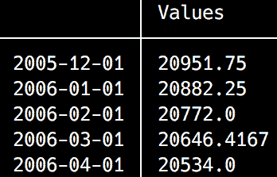

如我们所见，结果是包含我们原始时间序列 12 个月份平均值的新时间序列。原始序列的前 12 个值被这个操作消耗，因此我们的新序列从 2005 年 12 月开始。如果您希望保留初始值，`moving` 函数接受一个额外的关键字参数，`padding`。默认情况下，`padding` 是 `false`，但如果设置为 `true`，则消耗的时间戳将被保留，其值将被设置为 `NaN`：

```py
 julia> moving(mean, unemployment_data, 12, padding = true)
 156×1 TimeArray{Float64,2,Date,Array{Float64,2}} 2005-01-01 to 2017-12-01
```

这将产生以下输出：


在原始数据上方绘制平滑值可以指示趋势：

```py
julia> plot(unemployment_data) 
julia> plot!(moving_avg) 
```

这是我们的图形：


第一次调用 `plot` 方法渲染原始欧盟失业率数据，而后续调用 `plot!` 方法会修改图形，叠加与趋势相对应的移动平均线。

# 计算季节性

现在我们已经提取了趋势，我们可以将其从初始时间序列中移除。这是通过除法完成的。我们将剩下季节性和噪声成分的乘积。因此，*SN = Y/T*。

要计算 `TimeArray` 对象之间的分数，我们将使用逐元素除法运算符，`./`：

```py
julia> sn = unemployment_data ./ moving_avg 
145×1 TimeArray{Float64,2,Date,Array{Float64,2}} 2005-12-01 to 2017-12-01  
```

我们将得到以下结果：

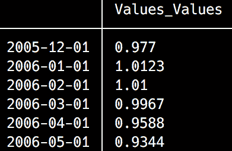

绘制结果 `TimeArray` 将会给我们一个更清晰的季节性和噪声成分的乘积的图像：

```py
julia> plot(sn) 
```

这导致了以下图表：


下一步是计算相同月份这些值的年度总和。也就是说，我们将计算所有年份 1 月份的所有月份的值；然后，我们将对 2 月、3 月做同样的处理。我们将得到每个日历月份所有年份的平均值。这将导致噪声的最小化：

```py
julia> month_avg = Float64[] 
0-element Array{Float64,1} 

julia> for m in 1:12 
            md = when(sn, month, m) 
            push!(month_avg, mean(TimeSeries.values(md)[:]))  
       end 
```

首先，我们实例化一个 `Float64` 类型的 `Vector`。然后，我们在 `1` 到 `12` 的范围内迭代，这代表月份。在循环内部，我们使用 `when` 方法来过滤当前迭代月份的值（所有年份的 1 月值，然后是所有年份的 2 月值，然后是 3 月，依此类推），然后将这些值的平均值推入 `month_avg` 数组。循环结束时，我们将这些值收集到 `month_avg` 中，其中第一个是所有年份 1 月份的平均值，第二个是 2 月份，然后是 3 月，依此类推。它看起来会是这样：

```py
julia> month_avg 
12-element Array{Float64,1}: 
 1.0376512639850295 
 1.0466377033754193 
 1.0301198608484736 
 1.0014842494206564 
 0.9830320492870818 
 0.9705256323692862 
 0.9630153389575429 
 0.9634443756458616 
 0.9763782494700372 
 0.9893785521401298 
 0.9987100016253194 
 0.9913489915307253 
```

理论上，这些值应该加起来是 `12`。实际上，这种情况并不发生（尽管我们非常接近）。我们可以很容易地使用 `sum` 函数来求出数组的所有元素的总和：

```py
julia> s = sum(month_avg) 
11.951726268655563 
```

作为结果，我们需要将平均值归一化，以便它们确实加起来是 `12`。这是通过将每个季节因子乘以 `12`，然后除以它们的总和来实现的：

```py
julia> norm_month_avg = map(m -> 12m/s, month_avg) 
```

我们使用了 `map` 函数来遍历 `month_avg` 中的每个项目作为 `m`，并应用了一个匿名函数，使得 `m = 12m/s`：

```py
12-element Array{Float64,1}: 
 1.0418423989910408 
 1.0508651351431808 
 1.0342805760704734 
 1.0055293037095092 
 0.9870025740450584 
 0.9744456429674838 
 0.9669050150351592 
 0.9673357846281114 
 0.9803218991358666 
 0.993374710799588  
 1.0027438505627655 
 0.9953531089117633 
```

让我们再次检查总和：

```py
julia> sum(norm_month_avg) 
12.0 
```

完美！

现在我们已经计算了月度季节因子，我们可以通过除以季节因子来对原始时间序列进行季节调整。这样，我们将得到余数，它代表了趋势和噪声的乘积—*Y/S = TN*。在 Julia 中计算这个值，我们必须将 `unemployment_data` 的每个值除以相应的月度季节因子。

为了保持整洁，让我们将原始时间序列复制到一个不同的对象中：

```py
julia> adj_unemployment_data = deepcopy(unemployment_data) 
156×1 TimeArray{Float64,2,Date,Array{Float64,2}} 2005-01-01 to 2017-12-01 
```

`deepcopy` 函数创建了一个对象的深拷贝，该对象作为参数给出。深拷贝意味着一切都会递归地复制，从而产生一个完全独立的对象。

接下来，我们可以使用 `map` 函数就地修改 `TimeArray`，通过递归应用一个将原始值除以季节性的函数：

```py
julia> map(adj_unemployment_data) do d,v 
           v[1] /= norm_month_avg[month(d)] 
           d,v 
       end 
156×1 TimeArray{Float64,2,Date,Array{Float64,2}} 2005-01-01 to 2017-12-01 
```

结果如下：


`adj_unemployment_data` 变量代表季节调整后的时间序列。

# 时间序列运算符

在时间序列分析中，在`TimeArray`对象之间（或者更确切地说，在它们包含的元素之间）进行操作是一种常见现象。`TimeSeries`包公开了一套完整的元素级运算符，用于数学、比较和逻辑操作。

就像我们在两个`TimeArray`对象之间进行除法运算时已经看到的那样，数学运算符通过使用具有共同时间戳的值来创建一个新的`TimeArray`实例。也支持单个`TimeArray`与`Int`或`Float`之间的操作。以下运算符可用：

+   `.+`: 元素级数的算术加法

+   `.-`: 元素级数的算术减法

+   `.*`: 元素级数的算术乘法

+   `./`: 元素级数的算术除法

+   `.^`: 元素级数的指数运算

+   `.%`: 元素级数的算术余数

与数学运算符类似，在比较运算符的情况下，当提供两个`TimeArray`实例时，值将在共享时间戳上进行比较。然而，这里的区别在于，结果将是一个类型为`Bool`的时间数组。

这些是可用的比较运算符：

+   `.>`: 元素级数的大于比较

+   `.<`: 元素级数的小于比较

+   `.==`: 元素级数的等价比较

+   `.>=`: 元素级数的大于或等于比较

+   `.<=`: 元素级数的小于或等于比较

+   `.!=`: 元素级数的非等价比较

让我们来看一个例子。首先，让我们创建一个从一周前到今天的`TimeArray`，并用随机值填充它。由于你将在未来某个时间运行代码，所以你的时间戳将不同，因此输出将与我的不同，但逻辑将是相同的。如果该模块尚未在作用域内，不要忘记执行`using Dates`：

```py
julia> using Dates 
julia> ts1 = TimeArray(Date(today()) - Week(1):Day(1):Date(today()) |> collect, rand(8)) 
8×1 TimeArray{Float64,1,Date,Array{Float64,1}} 2018-11-06 to 2018-11-13 
```

这就是我们得到的结果：


现在，我们将对第二个数组做同样的操作：

```py
julia> ts2 = TimeArray(Date(today()) - Week(1):Day(1):Date(today()) |> collect, rand(8)) 
8x1 TimeSeries.TimeArray{Float64,1,Date,Array{Float64,1}} 2018-01-31 to 2018-02-07 
```

这就是我们得到的结果：

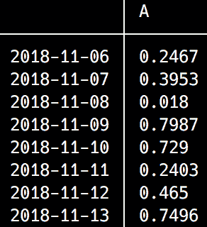

现在，我们可以比较两个对象，例如：

```py
julia> tsc = ts1 .> ts2 
8×1 TimeArray{Bool,1,Date,BitArray{1}} 2018-11-06 to 2018-11-13 
```

输出如下：

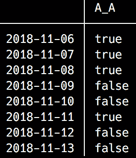

也支持单个`TimeArray`与`Int`、`Float`或`Bool`值之间的比较：

```py
julia> tsc .== false 
8×1 TimeArray{Bool,1,Date,BitArray{1}} 2018-11-06 to 2018-11-13  
```

现在，输出如下：

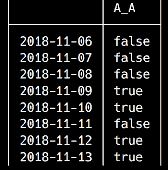

最后，我们可以使用以下逻辑运算符：

+   `.&` 元素级数的逻辑“与”

+   `.|` 元素级数的逻辑“或”

+   `.!`, `.~` 元素级数的逻辑“非”

+   `.``⊻` 元素级数的逻辑“异或”

它们是为`TimeArrays`类型`Bool`定义的，并返回一个类型为`Bool`的`TimeArray`。当两个`TimeArray`对象是操作数，以及单个`TimeArray`与`Bool`之间的操作时，值将在共同时间戳上计算。

# 时间序列平稳性

一个时间序列被认为是平稳的，如果其统计属性，如均值、方差、自相关等，随时间保持不变。**平稳性**很重要，因为大多数预测模型都是基于时间序列是平稳的或可以通过变换（近似）平稳的假设来运行的。这种方法的理由是，平稳时间序列中的值更容易预测——如果其属性是恒定的，我们就可以简单地声明它们在将来会像过去一样。一旦我们根据平稳时间序列预测了未来的值，我们就可以通过逆过程和变换来计算与原始序列匹配的值。

因此，平稳时间序列的性质不依赖于观察序列的时间。隐含地，这意味着呈现季节性或趋势的时间序列不是平稳的。在这种情况下，我们再次必须小心季节性和周期性的区别——不暴露季节性或趋势模式的周期性时间序列是平稳的。

# 时间序列的微分

使时间序列平稳的一种方法是通过*微分*。这意味着计算连续值之间的差分。在这种技术中，我们计算在特定时间点的值与之前时刻的值之间的差分。

这可以通过使用`TimeSeries`提供的`diff`方法轻松计算。对时间序列进行微分计算的是时间序列中两个连续点之间的有限差分。默认情况下，差分是以一天为单位的。例如，考虑以下内容：

```py
julia> diffts = diff(unemployment_data) 
155×1 TimeArray{Float64,2,Date,Array{Float64,2}} 2005-02-01 to 2017-12-01 
```

原始系列中的一天在操作过程中丢失了，导致`TimeArray`从 2005 年 1 月 2 日开始，结果如下：


我们可以将结果绘制成条形图：

```py
julia> bar(diffts)
```

我们得到以下结果：

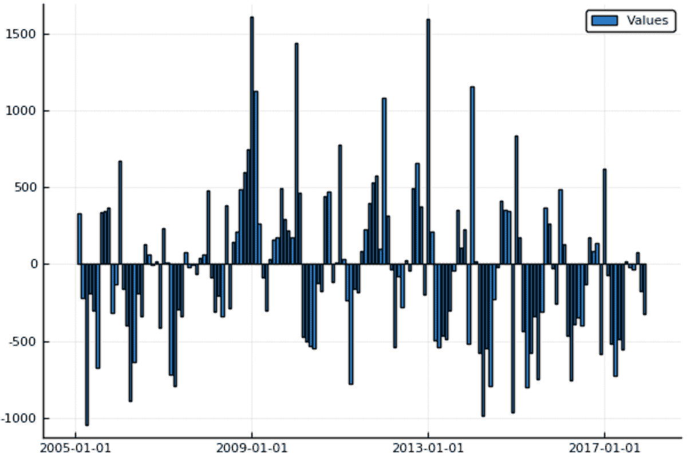

整个数据集中值的变化清晰可见，这意味着方差相对恒定。

# 自相关

自相关表示时间序列与其滞后版本在连续时间间隔内相似的程度。这是一个非常重要的概念，因为它衡量了当前值与相应过去值之间的关系。因此，它在时间序列预测中有许多有价值的用途；例如，匹配价格、股票、回报等中的趋势和关系。

我们想使用自相关来确定我们是否可以可靠地识别因果关系和趋势——或者相反，我们是否在处理一个随机游走模型。随机游走意味着时间序列中的值是随机定义的，这将意味着过去和现在的值之间没有关系。随机游走模型很常见，尤其是在金融和经济数据中。对于随机游走模型，预测下一个值是通过取序列中的最后一个值来完成的。这是由于未来运动是不可预测的——它们同样可能增加或减少。因此，随机游走模型是简单预测的基础。

我们可以通过使用两个函数的组合——`TimeSeries.lag`和`xcorr`来计算自相关。`lag`方法通过移动时间序列的值来实现。例如，让我们使用我们之前定义的`ts1`：

```py
julia> ts1 
8×1 TimeArray{Float64,1,Date,Array{Float64,1}} 2018-11-06 to 2018-11-13 
```

我们得到以下结果：

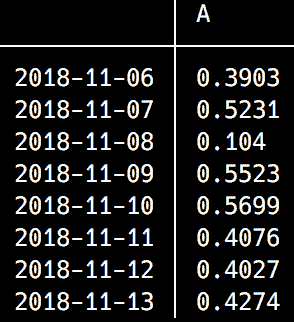

我们可以如下应用`lag`函数：

```py
julia> lag(ts1) 
7×1 TimeArray{Float64,1,Date,Array{Float64,1}} 2018-11-07 to 2018-11-13 
```

这将导致第一个值被分配给下一个时间戳。在我的例子中，最初对应于`2018-11-06`的值`0.3903`现在对应于`2018-11-07`：

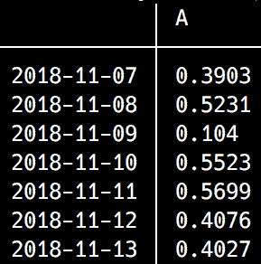

请记住，如果您并行运行代码，您的数据将不同（由于我们使用随机值，实际日期和值是不同的），但行为将是相同的。

我们可以通过将失业数据滞后`12`个区间（12 个月）来考虑年度季节性：

```py
julia> lagged = lag(unemployment_data, 12) 
144×1 TimeArray{Float64,2,Date,Array{Float64,2}} 2006-01-01 to 2017-12-01 
```

输出如下：


值已经移动，结果`TimeArray`从 2006 年 1 月 1 日开始。我们现在可以使用`TimeSeries.merge`在共同的时戳上连接两个序列：

```py
julia> common = merge(unemployment_data, lagged) 
144×2 TimeArray{Float64,2,Date,Array{Float64,2}} 2006-01-01 to 2017-12-01 
```

这导致以下输出：

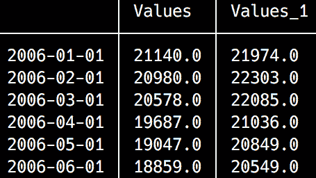

如果我们将原始失业数据与滞后一年的序列一起绘制，我们可以看到数据呈正相关，表明有强烈的年度季节性：

```py
julia> plot(unemployment_data) julia> plot!(lagged) 
```

输出如下：

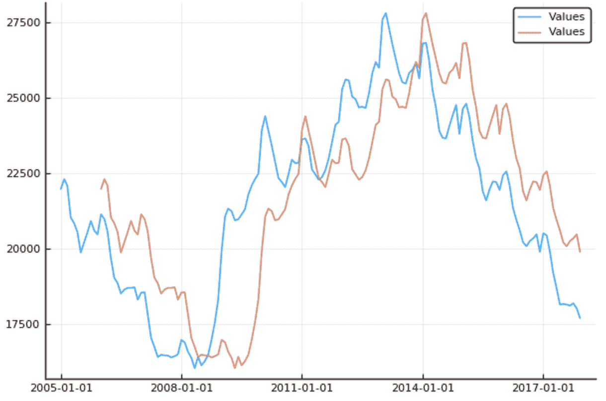

# 时间序列预测

预测意味着识别适合历史数据的模型，并使用它们来预测未来的值。在预测时间序列数据时，分解起着非常重要的作用，有助于使预测更加准确。基本假设是，如果我们单独预测每个组件，使用最适合的方法，然后将部分求和或相乘（取决于模型是加法还是乘法）来计算最终值。

# 简单预测

这是最简单的方法，它表明预测值等于序列中的最后一个值。如前所述，这种方法与随机游走模型一起使用，其中未来的移动是不可预测的。例如，为了使用简单模型预测第一个未知月份（2018 年 1 月）的值，我们可以从 2017 年 12 月取季节性调整值并加上（乘以）1 月份的季节性成分：

```py
julia> update(unemployment_data, Date(2018, 1, 1), 
 TimeSeries.values(adj_unemployment_data[end])[:][end] * norm_month_avg[1] |> round) 
157×1 TimeArray{Float64,2,Date,Array{Float64,2}} 2005-01-01 to 2018-01-01 
```

我们使用`TimeSeries.update`方法为 2018 年 1 月添加一个新项目。其值是 2017 年 12 月的季节性调整值，乘以 1 月份的正常季节性：

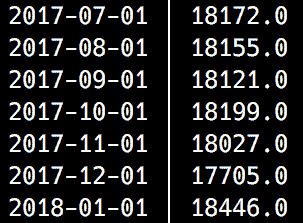

注意，我们还假设季节性成分没有变化，这意味着我们在季节性成分上使用的是季节性简单方法。

# 简单平均

一种稍微先进的方法是计算前几个数据点的平均值来预测下一个值。这是一个基本的方法，但在某些情况下，它可以是一个很好的选择。为了计算它，我们可以将`mean`函数应用于值的基本数组：

```py
julia> mean(TimeSeries.values(adj_unemployment_data)[:]) 
21589.641025641027 
```

# 移动平均

我们在提取时间序列的趋势成分时详细介绍了移动平均。它也可以用于预测，使用计算结果来填充下一个值。重要的是要选择合适的窗口大小，通过理解序列的季节性，例如，使用自相关图。

# 线性回归

我们可以使用线性回归对季节性调整的时间序列进行预测下一个值。让我们更仔细地看看这一点，因为它提供了深入了解有趣的 Julia 代码的好机会。由于我们的数据呈现三个趋势（下降、上升和再次下降），让我们只关注最后一个部分，其中可以观察到当前下降趋势：

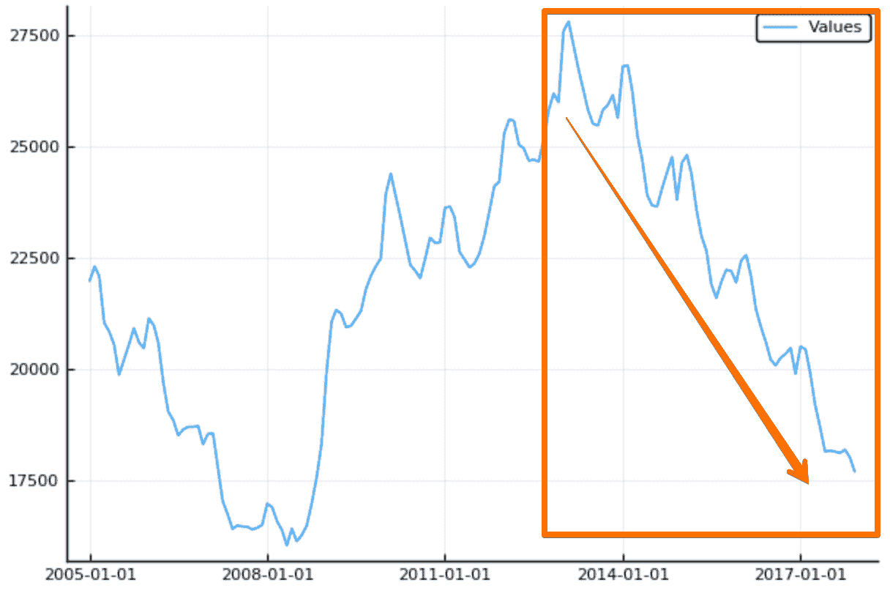

我们可以看到，当前趋势始于失业高峰，所以我们只需要在序列中寻找最大值：

```py
julia> findall(adj_unemployment_data[:Values] .== 
 maximum(TimeSeries.values(adj_unemployment_data)[:])) 
1-element Array{Int64,1}: 
 98 

julia> adj_unemployment_data[98] 
1×1 TimeArray{Float64,2,Date,Array{Float64,2}} 2013-02-01 to 2013-02-01 
```

我们得到以下值：


下降趋势始于 2013 年 2 月。让我们从那时起提取所有数据，一直到序列的末尾：

```py
julia> last_trend = from(adj_unemployment_data, Date(2013, 2, 1)) 
59×1 TimeArray{Float64,2,Date,Array{Float64,2}} 2013-02-01 to 2017-12-01 
```

结果如下：

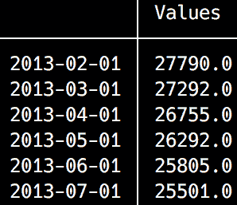

我们现在可以计算线性回归——它将总结失业数字与时间流逝之间的关系，使我们能够预测序列中的下一个值。我们在图的*Y*轴上有失业数字，在*X*轴上有时间。在这种情况下，我们可以用公式`y = a+b*x`来表示`y`，其中`a`和`b`对应于线性回归。我们将对趋势序列进行线性回归以获得`a`和`b`，并计算`y`的下一个值（失业预测），对应于`x`的下一个值（2018 年 1 月）。让我们一步一步地来做这件事。

我们需要做的第一件事是将时间序列中的时间戳转换为我们可以用于我们方程的简单整数序列：

```py
julia> x = 1:length(last_trend) 
1:59 

julia> y = values(last_trend)[:] 
59-element Array{Float64,1}: 
 27790.0 
 27292.0 
# output truncated 

julia> linreg(x, y) = reverse([x ones(length(x))]\y) 

julia> a, b = linreg(x, y) 
2-element Array{Float64,1}: 
 27522.02805376972 
  -161.58229105786072  
```

在*x*轴上，我们使用从`1`到`59`的整数，而不是实际的日期。在这个思路下，下一个值，我们想要预测的值将是`x = 60`，这意味着我们的下一个`y`（预测的失业值）将是`27,608.61 + (-167.13 * 60)`：

```py
julia> y = a+b*60 
17827.09059029808 
```

就像我们之前做的那样，我们需要为 1 月份添加季节性：

```py
julia> y = y * norm_month_avg[1] |> round 
18573.0 
```

现在，我们可以将它附加到我们的失业数据上并绘制它：

```py
julia> update(unemployment_data, Date(2018, 1, 1), y) |> plot 
julia> plot!(unemployment_data) 
```

结果如下所示：

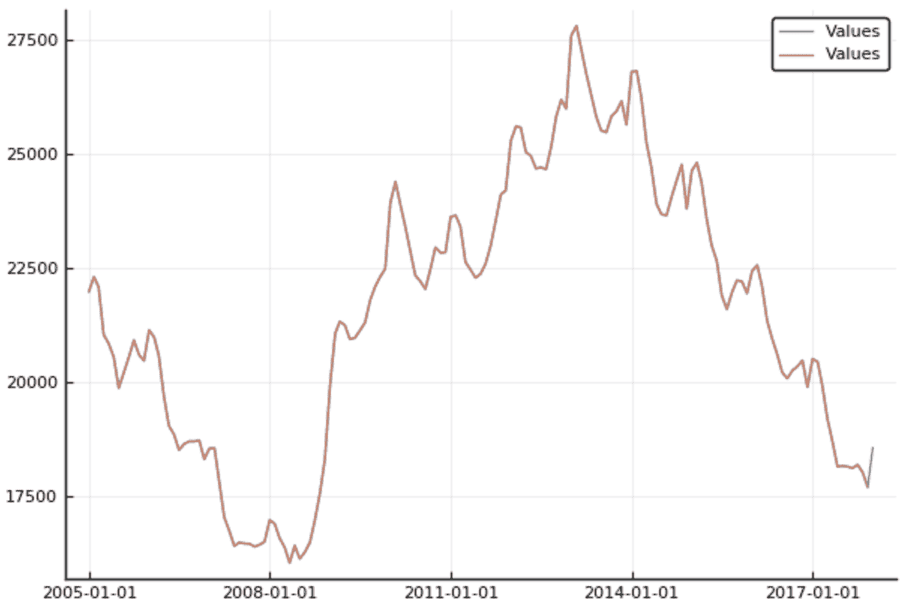

我们预测的值已经显示在图表上了。

# 结束语

应该提到的是，前面的部分只代表了一些最简单的预测方法。我们专注于对时间序列分解有一个良好的理解，这是分析和预测的关键工具。然而，还有更强大、更复杂的预测算法可用，例如**自回归积分移动平均**（**ARIMA**）、**人工神经网络**（**ANN**）和 Holt-Winters。这些算法适用于业务关键预测。我们现在已经为理解它们奠定了基础，但它们的实现更为复杂，超出了本章所假设的技术专长——特别是在撰写本文时，Julia 的包生态系统没有提供任何实现这些算法的库，我们不得不从头开始编写。

例如，一种常用的时间序列预测技术是 Holt-Winters 方法，也称为**三重指数平滑**。它基于加权移动平均和指数平滑，这两者都已经介绍过了。你可以在[`www.otexts.org/fpp/7/2`](https://www.otexts.org/fpp/7/2)和[`www.otexts.org/fpp/7/5`](https://www.otexts.org/fpp/7/5)了解更多信息。

ARIMA 模型是另一种非常流行的预测算法。它们不使用趋势和季节性成分，而是专注于数据中的自相关性。如果你对此感兴趣，了解 ARIMA 模型的好起点是[`www.otexts.org/fpp/8`](https://www.otexts.org/fpp/8)。

# 摘要

时间序列是一种非常常见的数据类型——它们可以用来表示关键的业务指标，如金融价格、资源使用（能源、水、原材料等）、天气模式或宏观经济趋势——这个列表可以一直列下去。时间序列的特殊之处在于数据必须以固定的时间间隔收集，时间序列分析的关键方面是探索允许我们理解过去值以便预测未来值的方法。

一种强大的方法是将时间序列分解为趋势、周期、季节性和不规则（也称为**误差**或**噪声**）的组合。在我们分析欧盟的失业数据时，我们学习了如何做到这一点。我们首先通过移动平均法学习计算趋势成分。然后，我们应用了乘法序列分解公式来计算季节性和误差，并且我们还应用了基本的预测方法来预测未来的值。在这个过程中，我们学习了更多高级的`TimeSeries`方法，并且进一步对`Plots`进行了实验。这是一段相当刺激的经历——祝贺你！

在下一章中，我们将探讨一些更高级的主题，包括包的开发、用于衡量和改进性能的基准测试技术、生成文档以及注册包。多么令人兴奋——我们下一章见！
