# 创建 Julia 包

自我们从学习 Julia 的旅程开始以来，我们已经走了很长的路。我希望你享受这个发现过程，就像我一样！我们已经覆盖了很多领域，在开发一系列完全功能的应用程序的同时，学习了众多关键主题。然而，为了完全获得我们的 Julia 开发者徽章，我们还有一件事要做。每位熟练的 Julia 程序员的标志——（敲鼓声，请！）——创建、发布和注册我们自己的 *官方* Julia 包！

在本章中，我们将构建一个 REPL 应用程序，并将其封装成一个包。我们的产品将帮助 Julia 开发者轻松地报告他们在其他 Julia 包中遇到的错误。一旦用户安装并配置了我们的包，他们就能直接在相应的仓库中打开 GitHub 问题，而无需离开他们的 REPL 或 IDE。在这个过程中，我们将学习到许多其他与 Julia 编程密切相关的重要方面，例如以下内容：

+   使用 Pkg 搭建包

+   包版本控制和依赖关系

+   Julia 中的测试驱动开发以及如何进行单元测试我们的代码

+   基准测试和性能优化

+   与 GitHub API 交互

+   记录代码库并生成文档

+   发布包（在 Julia 的机器人的一点点帮助下！）

准备好了吗？我确实希望如此。让我们开始吧！

# 技术要求

Julia 的包生态系统正在不断发展，每天都有新的包版本发布。大多数时候，这是一个好消息，因为新版本带来了新功能和错误修复。然而，由于许多包仍在测试版（版本 0.x）中，任何新版本都可能引入破坏性更改。因此，书中展示的代码可能会停止工作。为了确保你的代码会产生与书中描述相同的结果，建议使用相同的包版本。以下是本章中使用的外部包及其特定版本：

```py
BenchmarkTools@v0.4.1
DocStringExtensions@v0.6.0
Documenter@v0.21.0
GitHub@v5.0.2
IJulia@v1.14.1
Traceur@v0.2.0
URIParser@v0.4.0
```

为了安装特定版本的包，你需要运行：

```py
pkg> add PackageName@vX.Y.Z 
```

例如：

```py
pkg> add IJulia@v1.14.1
```

或者，你也可以通过下载本章提供的 `Project.toml` 文件，并使用 `pkg>` 实例化来安装所有使用的包，如下所示：

```py
julia> download("https://raw.githubusercontent.com/PacktPublishing/Julia-Programming-Projects/master/Chapter11/Project.toml", "Project.toml")
pkg> activate . 
pkg> instantiate
```

# 创建一个新的 Julia 包

为了创建一个新的包，我们首先必须满足一些先决条件。首先，我们需要在开发机器上安装并配置 `git`。显然，这是因为默认情况下，Julia 使用 `git` 和 GitHub ([`github.com/`](https://github.com/)) 来托管包（尽管也可以使用第三方，包括私有包的注册表）。如果你的操作系统没有预装 `git`，请访问 [`git-scm.com/downloads`](https://git-scm.com/downloads) 获取官方下载页面。选择适合你操作系统的正确版本，并按照安装说明进行操作。

第二，如果你还没有 GitHub 账户，你需要一个。请访问[`github.com`](https://github.com)并设置一个免费账户。

现在我们已经安装了`git`并拥有 GitHub 账户，让我们设置一些全局配置选项，因为它们将很有用。打开一个新的终端窗口并执行以下操作——请确保将`<...>`内的占位文本替换为你的实际信息：

```py
$ git config --global user.name "<FULL_NAME>" 
$ git config --global user.email "<EMAIL>" 
$ git config --global github.user "<GITHUB_USERNAME>" 
```

例如，在我的情况下，第一个命令将是以下内容：

```py
$ git config --global user.name "Adrian Salceanu" 
```

请通过运行`git config -l`来检查一切是否顺利。你应该会得到一个类似于我的输出：

```py
$ git config -l 
user.name=Adrian Salceanu 
user.email=**@**  
github.user=essenciary 
```

极好！我们现在已经准备好开始设置我们的包。

# 生成包

Julia 的包管理器`Pkg`期望一定的文件结构以便管理依赖项、运行测试、构建二进制文件、生成文档等。幸运的是，我们不必手动创建所有这些：我们将使用`Pkg`本身，即`generate`命令。我们只需要传递我们包的名称。让我们称它为`IssueReporter`：

```py
julia> ] # enter Pkg mode pkg> generate IssueReporter Generating project IssueReporter: IssueReporter/Project.toml IssueReporter/src/IssueReporter.jl 
```

为我们创建了一个新文件夹，命名为`IssueReporter/`。在其中，我们可以找到一个`Project.toml`文件和一个子文件夹`src/`，它包含一个`IssueReporter.jl`文件。

# Project.toml 文件

`Project.toml`文件对于`Pkg`来说非常特殊，因为它用于管理包及其依赖项。它旨在包含元信息，例如包的名称、其唯一标识符（称为**UUID**）、版本号、作者的姓名以及依赖项列表。`Pkg`已经预先填充了它，以帮助我们开始：

```py
authors = ["Adrian Salceanu <*@*.com>"] # actual email truncated 
name = "IssueReporter" 
uuid = "7b29c13e-f3eb-11e8-2be5-fb20b77ad364" 
version = "0.1.0" 

[deps] 
```

如你所见，`Pkg`已经根据我的 Git 设置提取了正确的作者信息；它已经填写了包的名称并生成了一个新 UUID，并分配了版本号`0.1.0`。

# src 文件夹和主模块

`src/`文件夹也扮演着特殊角色。Julia 使用形式为`<Package Name>/src/<Package Name>.jl`的路径来识别包的入口点——即其主模块。当我们调用`using IssueReporter`时，将会搜索这个路径。为了让我们有一个良好的开始，`IssueReporter.jl`文件已经填充了一些代码行，足以启动相应的模块：

```py
module IssueReporter 

greet() = print("Hello World!") 

end # module 
```

# 使用我们的新包

我们现在可以激活项目并加载我们的包：

```py
julia> ; # enter shell mode 
shell> cd IssueReporter 
julia> ] # enter pkg mode 
pkg> activate . 
(IssueReporter) pkg>  
```

到目前为止，我们的包环境已经激活，并包含了模块：

```py
julia> using IssueReporter 
[ Info: Precompiling IssueReporter [7b29c13e-f3eb-11e8-2be5-fb20b77ad364] 

julia> IssueReporter.greet() 
Hello World! 
```

极好——一切都已经设置好，准备让我们添加逻辑、测试和文档。

# 定义我们包的需求

我们项目的目标是创建一个 Julia 包，使得报告其他 Julia 包中的错误变得非常容易。我们希望允许我们库的用户访问一个简单的 API，用于程序化报告问题，而无需手动前往 GitHub ([`github.com`](https://github.com))创建一个新的问题。

为了做到这一点，我们需要实现以下两个功能——一种找出已注册包的 GitHub URL 的方法；以及访问 GitHub API 在找到的仓库上注册新问题的手段。鉴于`Pkg`能够仅使用包名从 GitHub 克隆包，我们可以安全地假设这些信息与我们的 Julia 安装一起可用，并且我们将在某种方式下能够访问这些信息。然后，名为`GitHub`的包将帮助我们与 GitHub 的 API 进行接口。我们可以先添加它。请确保当前活动项目是`IssueReporter`。这应该由放在`pkg>`光标前的`(IssuerReporter)`前缀表示。如果不是这种情况，如前所述，您需要`cd`到我们的包目录，然后按照以下方式运行`pkg> activate .`：

```py
(IssueReporter) pkg> add GitHub  
```

当我们忙于这件事时，也可以添加`URIParser`包——我们将大量使用仓库 URL，这个功能将很有用：

```py
 (IssueReporter) pkg> add URIParser 
```

此外，还有一件事——我们将使用**测试驱动开发**（**TDD**）来构建我们的项目，因此我们还需要 Julia 的`Test`模块：

```py
 (IssueReporter) pkg> add Test
```

到目前为止，所有包都已添加到依赖项列表中。您可以通过检查`Project.toml`文件来确认这一点，该文件位于`[deps]`部分，现在应显示以下内容：

```py
[deps] 
GitHub = "bc5e4493-9b4d-5f90-b8aa-2b2bcaad7a26" 
Test = "8dfed614-e22c-5e08-85e1-65c5234f0b40" 
URIParser = "30578b45-9adc-5946-b283-645ec420af67" 
```

现在我们已经具备了添加逻辑的所有先决条件，采用 TDD 方式。

# 从测试驱动的 Julia 开发开始

测试驱动开发是一种基于简单工作流程的软件开发实践，将自动化测试置于核心位置。基本思想是将需求转化为非常具体、定义良好且具有针对性的测试用例。每个测试用例应仅针对一个功能点。一旦测试准备就绪，我们就运行整个测试套件。显然，由于我们首先编写测试，它最初会失败。接下来，我们添加最小实现以使测试通过。就是这样——我们所需做的就是重复相同的流程，直到所有需求都得到实现。这种方法确保我们的代码库得到彻底测试，并且我们专注于仅交付需求，避免功能蔓延。

Julia 在`Test`模块下提供了内置的单元测试功能。它非常简单易用，提供了足够的方法来覆盖所有基本测试场景：值和异常检查、近似值、类型等。

最重要的是 `@test`、`@test_throws` 和 `@testset` 宏。`@test` 宏检查作为参数传递的表达式是否评估为真，返回一个 `PassResult`。如果测试未通过，当表达式评估为 `false` 时，它将返回一个 `FailResult`——或者如果表达式根本无法评估，则返回一个 `ErrorResult`。`@test_throws` 宏检查评估的表达式是否抛出异常。最后，`@testset` 用于将测试分组。测试集中的所有测试都将运行，并在测试集末尾显示结果摘要。如果任何测试失败，或由于错误无法评估，测试集将抛出 `TestSetException`。

例如，考虑以下内容：

```py
julia> using Test 

julia> @test 1 == 1 
Test Passed 

julia> @test 'A' == 'a' 
Test Failed 
  Expression: 'A' == 'a' 
   Evaluated: 'A' == 'a' 
ERROR: There was an error during testing 
# output omitted # 
```

前一个片段显示了通过和失败测试的输出。以下一个片段说明了测试集的使用，其中一个测试通过，另一个测试失败：

```py
julia> @testset "Example" begin 
           @test :a == :a 
           @test 'x' == 'y' 
       end 
Example: Test Failed 
  Expression: 'x' == 'y' 
   Evaluated: 'x' == 'y' 

Test Summary: | Pass  Fail  Total 
Example       |    1     1      2 
ERROR: Some tests did not pass: 1 passed, 1 failed, 0 errored, 0 broken. 
# output omitted # 
```

最后，这是处理异常的方式：

```py
julia> @testset "Example" begin 
           error("Oh no!") 
       end 
Example: Error During Test 
  Got an exception of type ErrorException outside of a @test 
  Oh no! 

Test Summary: | Error  Total 
Example       |     1      1 
ERROR: Some tests did not pass: 0 passed, 0 failed, 1 errored, 0 broken. 
# output omitted # 
```

现在我们已经了解了测试理论，让我们继续编写我们的第一个测试。我们需要一个方法，该方法将接受一个包名并返回相应的 GitHub 仓库 URL。这个 URL 将用于稍后与 GitHub API 交互并在相应的仓库中打开问题。目前，我们只需检查返回值是否为有效的 URL。我们将使用 `URIParser` 包来检查其有效性。

Julia 通过 `Pkg` 提供的功能使我们能够轻松添加和运行测试，再次通过 `test` 命令下的功能。当我们运行 `(IssueReporter) pkg> test` 时，`Pkg` 库将在 `test/` 文件夹中查找名为 `runtests.jl` 的文件。

是时候在 Julia REPL 内部添加它们了：

```py
julia> mkdir("test") 
"test" 

julia> touch("test/runtests.jl") 
"test/runtests.jl" 
```

现在，在编辑器中打开新创建的 `runtests.jl` 文件，例如，通过运行以下命令：

```py
julia> edit("test/runtests.jl") 
```

请确保您的 `runtests.jl` 文件看起来像这样：

```py
using IssueReporter 
using Test, URIParser, GitHub 

@testset "Basic features" begin 
  @testset "Looking up an existing package returns a proper repo URI" begin 
    @test IssueReporter.packageuri("DataFrames") |> URIParser.isvalid 
  end 
end 
"Basic features". Within it, we have yet another test set, which contains the actual test. Finally, the test invokes a function called packageuri from the IssueReporter module, passing it the  DataFrames string as its argument. What we're trying to do here is get the GitHub URI for a package that we know exists and is registered, namely DataFrames. Then, we make sure that the URI is valid by passing it into the URIParser.isvalid method.
```

一个测试集块，由 `@testset` 宏定义，将多个测试和/或其他测试集组合在一起。使用测试集的原因是，当测试失败时，会抛出异常，导致脚本执行停止。然而，当我们有一大批测试时，我们通常更喜欢允许所有测试运行，并得到一个完整的失败和成功的报告。使用测试集，集合内的所有测试都将运行，并在集合末尾显示摘要。如果任何测试失败，或由于错误无法评估，测试集将抛出 `TestSetException`。

测试集应该有自解释的名称，与它们所代表的测试批次相关，因为这些标签在运行测试时会被输出。

我们可以按照以下方式运行测试：

```py
 (IssueReporter) pkg> test
```

它将以一条信息丰富的消息失败：

```py
(IssueReporter) pkg> test 
   Testing IssueReporter 
 Resolving package versions... 
Looking up an existing package returns a proper repo URI: Error During Test at IssueReporter/test/runtests.jl:7 
  Test threw exception 
  Expression: IssueReporter.packageuri("DataFrames") |> URIParser.isvalid 
  UndefVarError: packageuri not defined 
Test Summary:                                              | Error  Total 
Basic features                                             |     1      1 
  Looking up an existing package returns a proper repo URI |     1      1 
ERROR: LoadError: Some tests did not pass: 0 passed, 0 failed, 1 errored, 0 broken. 
ERROR: Package IssueReporter errored during testing 
# output omitted # 
```

重要的是 `UndefVarError: packageuri 未定义`。这并不令人惊讶，因为我们还没有定义 `IssueReporter.packageuri` 函数。

# 查看 Julia 的注册表

正如我们所说的，我们需要一种方法来根据软件包的名称检索软件包的 GitHub URI。现在，鉴于我们能够成功执行`add`和`develop`等操作，而无需提供 GitHub URI，我们可以假设有一种方法可以将软件包名称转换为软件包 URL。

事实上，Julia 管理着一个所有已知软件包的仓库。这些软件包被分组到多个注册表中，并复制到您的计算机上。默认情况下，Julia 附带所谓的`通用`注册表，它位于您家目录中的`.julia/`文件夹中。`通用`注册表本身只是一个包含以英语字母表中的每个字母命名的子文件夹的文件夹（因此，从`A`到`Z`）。在这些文件夹中，我们可以找到所有以该字母开头的软件包：

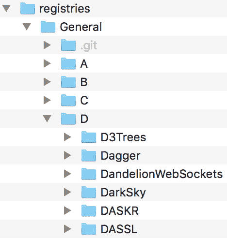

此截图显示了`通用`注册表的一部分，其中包含一些文件夹（从`A`到`D`）和一些以字母`D`开头的软件包。

为了使软件包检索更高效，还在`通用`文件夹内放置了一个特殊的索引文件，称为`Registry.toml`。此文件定义了一个基于哈希的索引，将软件包 UUID 映射到包含`name`和`path`值的字典——`path`是相对路径，指向`通用`注册表内的一个文件夹。例如，这是对应于`D3Trees`软件包的条目，位于字母`D`下的第一个：

```py
e3df1716-f71e-5df9-9e2d-98e193103c45 = { name = "D3Trees", path = "D/D3Trees" } 
```

接下来，如果我们查看`D3Trees/`文件夹本身，我们会看到它包含四个文件，每个文件都包含重要的元数据：

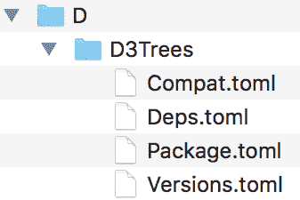

截图显示了属于`D3Trees`软件包的四个`Pkg`元数据文件。

`Deps.toml`文件包含了依赖项列表（`D3Trees`自身所需的软件包）。`Compat.toml`文件存储了依赖项和 Julia 版本的兼容性要求。`Package.toml`定义了诸如名称、UUID 和仓库 URL 等信息，最后，`Versions.toml`显示了所有已知的`D3Trees`版本及其相应的 Git 引用。看起来我们需要`Package.toml`文件中的信息。

因此，工作流程如下：

1.  获取 Julia 的`通用`注册表的路径

1.  读取`Registry.toml`文件

1.  寻找我们要搜索的软件包名称

1.  如果该软件包存在，则在`通用`注册表中获取其路径

1.  读取相应的`Package.toml`文件

1.  提取软件包的 GitHub URL

# 与 TOML 文件一起工作

**Tom 的明显、最小语言**（**TOML**）是由 Tom Preston-Werner 创建的最小配置文件格式。TOML 文件与其他配置格式（例如著名的 INI）具有相同的目的——尽管 TOML 的目标是更容易阅读和解析。YAML 和 JSON 是其他非常流行的配置格式，你可能已经遇到过。`Pkg`广泛使用 TOML 来存储包元数据。

你可以在[`github.com/toml-lang/toml`](https://github.com/toml-lang/toml)了解更多关于 TOML 的信息，包括完整的规范。

Julia 的 TOML 解析器可在[`github.com/wildart/TOML.jl`](https://github.com/wildart/TOML.jl)找到，但我们不需要显式添加它，因为`Pkg`附带了一个我们将使用的 TOML 解析器。但这意味着我们必须将`Pkg`声明为`IssueReporter`的依赖项：

```py
(IssueReporter) pkg> add Pkg 
```

现在，来实现前面的工作流程。首先，`General`注册表的路径。

Julia 跟踪一个存储重要信息的位置的列表。这些信息包括配置文件、环境、已安装的包和注册表。在 Julia 的术语中，这些被称为**存储库**，并存储在`DEPOT_PATH`全局变量中：

```py
julia> DEPOT_PATH 3-element Array{String,1}: "/Users/adrian/.julia" "/Applications/Julia-1.0.app/Contents/Resources/julia/local/share/julia" "/Applications/Julia-1.0.app/Contents/Resources/julia/share/julia" 
```

我电脑上`DEPOT_PATH`数组的内容如下所示。你的输出将不同，但类似。

第一条记录是用户存储库，其中包含注册表的克隆、新包版本的安装、包仓库的克隆、日志文件的写入、默认检出开发包以及保存全局配置数据。存储库路径中的后续条目是只读的，用于系统管理员执行的操作。

让我们添加一个新的（失败的）测试来获取`General`注册表的路径：

```py
@testset "Interacting with the registry" begin 
  @testset "The General registry is accessible" begin 
    IssueReporter.generalregistrypath() |> Base.Filesystem.isdir 
  end 
end 
```

关于实现，我们希望遍历`DEPOT_PATH`中的每个条目，并检查它是否包含`registries/General`目录路径。这些应该在用户存储库中，但更广泛的查找会使我们的代码更健壮：

```py
function generalregistrypath() 
  for i in DEPOT_PATH 
    if isdir(joinpath(i, "registries", "General")) 
      return joinpath(i, "registries", "General") 
    end 
  end 
end 
```

一旦我们有了`General`注册表的路径，我们希望解析`Registry.toml`文件并提取与我们要搜索的包对应的信息。一旦解析，`Registry.toml`文件将生成一个包含五个条目的字典：

```py
Dict{String,Any} with 5 entries: 
  "name"        => "General" 
  "repo"        => "https://github.com/JuliaRegistries/General.git" 
  "packages"    => Dict{String,Any}("c786d6c3-4fbc-59fc-968c-e848efb65d2d"=>Dict{String,Any}("name"=>"ScHoLP","path"=>"S/ScHoLP"),"88634af6-177f-5301-88b8-7819386cfa38"=>Dict{String,Any}("name"=>"SaferIntegers","path"=>"S/SaferIntegers")... 
  "uuid"        => "23338594-aafe-5451-b93e-139f81909106" 
  "description" => "Official general Julia package registry where people  
# output omitted #  
```

我们只对`*packages*`数据感兴趣，它看起来像这样：

```py
Dict{String,Any} with 2358 entries: 
  "c786d6c3-4fbc-59fc-968c-e848efb65d2d" => Dict{String,Any}("name"=>"ScHoLP","path"=>"S/ScHoLP") 
  "88634af6-177f-5301-88b8-7819386cfa38" => Dict{String,Any}("name"=>"SaferIntegers","path"=>"S/SaferIntegers") 
  "aa65fe97-06da-5843-b5b1-d5d13cad87d2" => Dict{String,Any}("name"=>"SnoopCompile","path"=>"S/SnoopCompile") 
# output truncated # 
```

实际上，我们并不需要所有这些，因为我们不关心 UUID；只关心名称和路径。让我们向`IssueReporter`模块添加一个新函数，以反映这个规范：

```py
function generalregistry() 
    TOML.parsefile(joinpath(generalregistrypath(), "Registry.toml"))["packages"] |> values |> collect 
end 
```

函数的输出类似于这个，一个`Dict`元素的数组：

```py
2358-element Array{Any,1}: 
 Dict{String,Any}("name"=>"ScHoLP","path"=>"S/ScHoLP") 
 Dict{String,Any}("name"=>"SaferIntegers","path"=>"S/SaferIntegers") 
 Dict{String,Any}("name"=>"SnoopCompile","path"=>"S/SnoopCompile") 
# output truncated # 
```

一旦我们有了这个，通过名称进行包查找就非常容易了。我们只需遍历每个项目，并将`"name"`值与搜索字符串进行比较：

```py
function searchregistry(pkgname::String) 
  for item in generalregistry() 
    item["name"] == pkgname && return item 
  end 
end 
```

识别出包的名称后，我们可以使用路径值来构建包含包元数据信息的文件夹的路径。记住，我们正在寻找`Package.toml`文件，因为它包含仓库 URI。

将所有这些放在一起，我们最终可以写出我们的`IssueReporter.packageuri`函数：

```py
function packageuri(pkgname::String) 
  TOML.parsefile(joinpath(generalregistrypath(), searchregistry(pkgname)["path"], "Package.toml"))["repo"] 
end 
```

你的`IssueReporter.jl`文件应该看起来像这样：

```py
module IssueReporter 

using Pkg, Pkg.TOML 

function generalregistrypath() 
  for i in DEPOT_PATH 
    if isdir(joinpath(i, "registries", "General")) 
      return joinpath(i, "registries", "General") 
    end 
  end 
end 

function generalregistry() 
    TOML.parsefile(joinpath(generalregistrypath(), "Registry.toml"))["packages"] |> values |> collect 
end 

function searchregistry(pkgname::String) 
  for item in generalregistry() 
    item["name"] == pkgname && return item 
  end 
end 

function packageuri(pkgname::String) 
  TOML.parsefile(joinpath(generalregistrypath(), searchregistry(pkgname)["path"], "Package.toml"))["repo"] 
end 

end # module 
```

# IssueReporter.jl 包

再次运行测试将会成功：

```py
(IssueReporter) pkg> test 
```

输出如下：

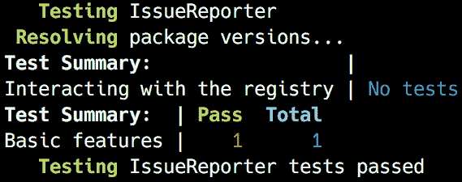

如果你好奇，根据`IssueReporter`，`DataFrames`的 GitHub 仓库 URI 如下：

```py
julia> IssueReporter.packageuri("DataFrames") 
https://github.com/JuliaData/DataFrames.jl.git
```

如果你想的话，可以在网络浏览器中自行检查以确认它确实是正确的 URI。

# 性能测试

我们代码到目前为止运行正确，但它的性能如何呢？除了其可读的语法、宽松的许可、丰富的包生态系统和友好的社区，性能也是数据科学家和软件开发者选择 Julia 的主要原因之一。编译器能够提供出色的性能，但有一些最佳实践是我们作为开发者必须牢记在心的，以确保我们基本上不会阻碍编译器。我们将通过查看一些示例并在运行基准测试的同时，来介绍最重要的几个。

# 基准测试工具

由于它专注于性能，所以 Julia 的核心和生态系统提供各种工具来检查我们的代码，寻找瓶颈并测量运行时间和内存使用，这并不令人惊讶。其中最简单的一个是`@time`宏。它接受一个表达式，然后打印其执行时间、分配的数量以及执行导致的总字节数，在返回表达式的结果之前。例如，注意以下内容：

```py
julia> @time [x for x in 1:1_000_000]; 
  0.031727 seconds (55.85 k allocations: 10.387 MiB) 
```

通过迭代从一到一百万生成一百万个整数的数组需要 0.03 秒。不错，但如果我告诉你我们可以做得更好——好得多呢？我们犯了一个 Julia 的致命错误——代码不应该在全局范围内运行（或基准测试）。所以，第一条规则——总是将你的代码封装成函数。

之前的代码片段可以轻松重构如下：

```py
julia> function onetomil() 
 [x for x in 1:1_000_000]
 end 
onetomil (generic function with 1 method) 
```

现在，基准测试如下：

```py
julia> @time onetomil();
  0.027002 seconds (65.04 k allocations: 10.914 MiB) 
```

好吧，这确实更快——但并没有快很多。然而，如果我们再运行一次基准测试会怎样呢？

```py
julia> @time onetomil();
  0.002413 seconds (6 allocations: 7.630 MiB) 
```

哇，这快了一个数量级！那么，这是怎么回事呢？

如果你记得我们关于函数和方法的介绍，Julia 使用的是**即时编译**（**JIT**）编译器；也就是说，一个函数在第一次被调用时实时编译。因此，我们的初始基准测试也包括了编译时间。这引出了第二条规则——不要基准测试第一次运行。

因此，准确测量代码性能的最佳方式是多次执行它，然后计算平均值。有一个专为这种用例设计的优秀工具，称为`BenchmarkTools`。让我们添加它并尝试一下：

```py
(IssueReporter) pkg> add BenchmarkTools 
julia> using BenchmarkTools 
julia> @benchmark onetomil() 
BenchmarkTools.Trial: 
  memory estimate:  7.63 MiB 
  allocs estimate:  2 
  -------------- 
  minimum time:     1.373 ms (0.00% GC) 
  median time:      1.972 ms (0.00% GC) 
  mean time:        2.788 ms (34.06% GC) 
  maximum time:     55.129 ms (96.23% GC) 
  -------------- 
  samples:          1788 
  evals/sample:     1 
```

`BenchmarkTools` 捕获了 `1788` 个样本，评估到样本的比例为 `1`。在这里，一个样本代表一个测量值，而一个评估是对基准表达式的执行。我们得到了最大 55 毫秒的时间，由垃圾回收驱动，最小为 1.3 毫秒，平均为 2.7 毫秒。这与第二个 `@time` 执行所揭示的 2.4 毫秒相符——但这个基准要准确得多。我们还可以使用更紧凑的 `@btime` 宏，它的输出类似于 `@time`，但执行了一个同样全面的基准：

```py
julia> @btime onetomil(); 
  1.363 ms (2 allocations: 7.63 MiB) 
```

`BenchmarkTools` 提供了一个非常丰富的 API，值得深入了解。你可以在[`github.com/JuliaCI/BenchmarkTools.jl/blob/master/doc/manual.md`](https://github.com/JuliaCI/BenchmarkTools.jl/blob/master/doc/manual.md)了解更多信息。

# 类型稳定性至关重要

如果有一件事对 Julia 代码的性能有直接和巨大的影响，那就是类型系统。最重要的是编写类型稳定的代码。类型稳定性意味着变量的类型（包括函数的返回值）必须不会随时间或不同的输入而变化。了解如何利用类型稳定性是编写快速软件的关键。现在我们知道了如何测量代码的执行时间，我们可以通过几个例子看到类型不稳定性的影响。

让我们以这个看起来很无辜的函数为例：

```py
julia> function f1() 
           x = 0 

           for i in 1:10 
               x += sin(i) 
           end 

           x 
       end 
f1 (generic function with 1 method) 
```

它并没有什么特别之处。我们有一个变量 `x`，它被初始化为 `0`，然后是一个从 `1` 到 `10` 的循环，我们将一个数字的正弦值加到 `x` 上。然后我们返回 `x`。没有什么可看的，对吧？实际上，恰恰相反——这里发生了一些性能上的不良情况。它们都与类型不稳定性有关。

Julia 提供了一个出色的工具来检查和诊断与类型相关的问题——`@code_warntype` 宏。当我们用它与我们的 `f1` 函数一起使用时，我们得到以下结果：

```py
julia> @code_warntype f1() 
```

输出如下：

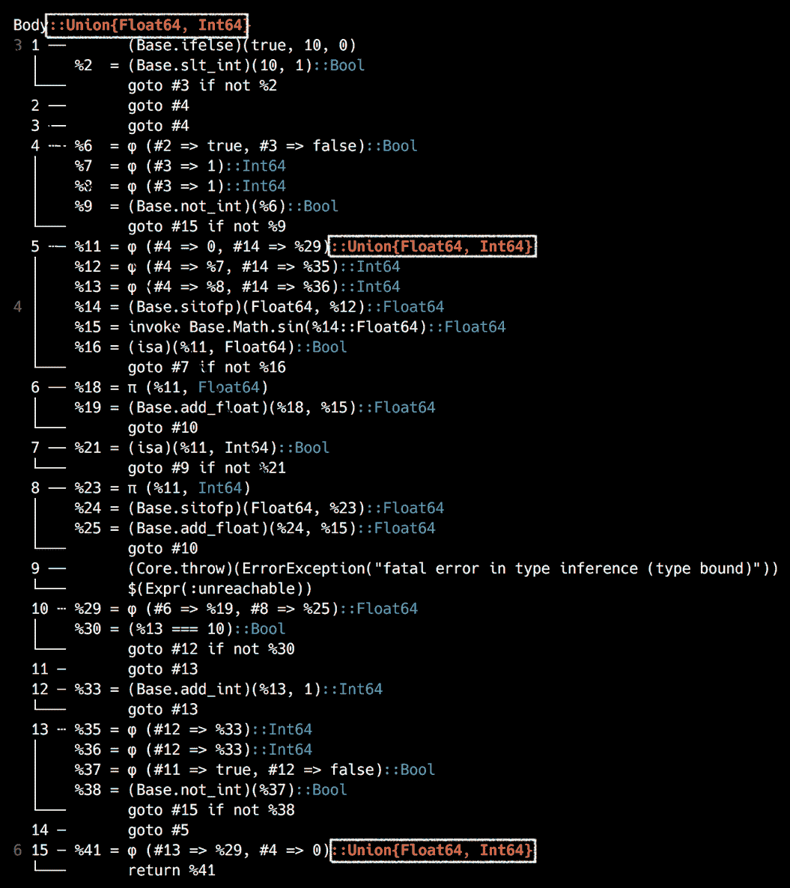

这次，我使用截图来展示输出，以便说明颜色编码。正如你所预期的那样，绿色是好的，红色是坏的。我还用矩形标记了红旗。问题出在第一行的 `Body::Union{Float64, Int64}`，第 `12` 行的 `(#4 => 0, #14 => %29)::Union{Float64, Int64}`，以及倒数第二行的 `(#13 => %29, #4 => 0)::Union{Float64, Int64}`。

在第一行，`Body::Union{Float64, Int64}`，以及倒数第二行，`::Union{Float64, Int64}`，告诉我们同样的事情——该函数返回一个 `Union{Float64, Int64}`，这意味着该函数可以返回一个 `Float` 或一个 `Integer`。这是典型的类型不稳定性，对性能来说是个坏消息。接下来，在第 `12` 行，*某个东西* 的类型是 `Union{Float64, Int64}`，然后这个值作为函数的结果返回。如果你想知道，那个 *某个东西* 就是 `x`。

问题在于我们无意中将`x`初始化为`0`，一个`Integer`。然而，`sin`函数将返回一个`Float`。将一个`Float`加到一个`Integer`上会导致结果是一个`Float`，从而改变`x`的类型。因此，`x`在函数执行过程中有两个类型，因为我们返回`x`，所以我们的函数也是类型不稳定的。

当然，理解`@code_warntype`的输出并不容易，尽管随着时间的推移它会变得容易一些。然而，我们可以通过使用超级有用的`Traceur`包来简化我们的工作。它提供了一个`@trace`宏，它生成易于理解的信息。让我们添加它并尝试一下；我相信你会喜欢的：

```py
(IssueReporter) pkg> add Traceur 
julia> using Traceur 
julia> @trace f1() 
┌ Warning: x is assigned as Int64 
└ @ REPL[94]:2 
┌ Warning: x is assigned as Float64 
└ @ REPL[94]:4 
┌ Warning: f1 returns Union{Float64, Int64} 
└ @ REPL[94]:2 
1.4111883712180104 
```

这得多酷啊？清晰明了！

考虑到这个反馈，我们可以将我们的代码重构到一个新的`f2`函数中：

```py
julia> function f2() 
           x = 0.0 

           for i in 1:10 
                  x += sin(i) 
           end 

           x 
       end 
f2 (generic function with 1 method) 

julia> @trace f2() 
1.4111883712180104
```

太棒了，没有要报告的事情！没有消息就是好消息！

现在，我们可以对`f1`和`f2`进行基准测试，看看重构的结果：

```py
julia> @btime f1() 
  129.413 ns (0 allocations: 0 bytes) 
1.4111883712180104 

julia> @btime f2() 
  79.241 ns (0 allocations: 0 bytes) 
1.4111883712180104 
```

这真不错——79 纳秒与 129 纳秒的对比！如果你在想“这不过是 50 纳秒，有什么大惊小怪的？”，那你得这样看——`f2`，这个类型稳定的变体，比`f1`快近一倍！这可是个真正的大事！

# 基准测试我们的代码

是时候将我们所学应用到自己的代码库中了。请注意，我故意加入了一些问题，让事情变得更有趣。让我们一起来解决它们：

```py
julia> @code_warntype IssueReporter.packageuri("DataFrames") 
```

输出如下：

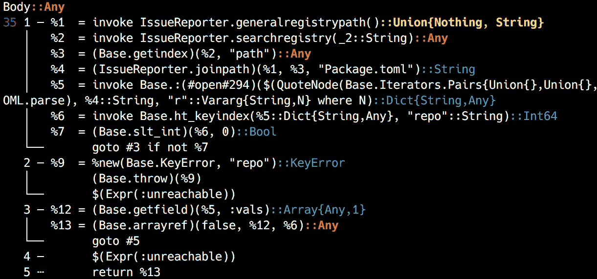

这一切都非常有趣——让我们看看我们能从中学到什么。

从第 1 行开始，`IssueReporter.generalregistrypath`函数返回一个`Union{Nothing, String}`。原因是我们的函数没有处理`for`循环未进入或`if`语句未执行的情况。我们应该确保我们的函数总是返回一个值，并且这个返回值的类型不会改变。为了更加保险，我们还可以在函数定义本身中添加类型断言。如果我们意外地返回了错误类型，Julia 将尝试将其转换为声明的类型——如果这不起作用，则会抛出错误。

我们需要将函数重新定义为以下内容：

```py
function generalregistrypath() :: String 
  for i in DEPOT_PATH 
    if isdir(joinpath(i, "registries", "General")) 
      return joinpath(i, "registries", "General") 
    end 
  end 

  "" 
end 
```

现在，转到以`%2`开头（第三行）的行——`searchregistry`函数返回一个`Any`类型的值。这里的问题是，我们返回了从`generalregistry`调用中来的一个项，因此我们需要先看看那个。我们将添加对`generalregistrypath`返回值的检查，并添加一个默认返回值，一个空的`Vector{Dict{String,Any}}`。然后，对于`searchregistry`，我们也将添加一个默认返回值——因为它从这个`Vector`中返回一个项，所以它将是`Dict{String,Any}`类型。

接下来，关于`packageuri`函数，在以`%9`开头（第 11 行）的行中，我们可以看到有关`KeyError`和`repo`的信息。Julia 正在警告我们，可能我们没有名为`repo`的键，这会导致`KeyError`。此外，该函数返回一个`Any`类型的对象。

这里是三个重构后的函数：

```py
function generalregistry() :: Vector{Dict{String,Any}} 
  if ! isempty(generalregistrypath()) 
    TOML.parsefile(joinpath(generalregistrypath(), "Registry.toml"))["packages"] |> values |> collect 
  else 
     Dict{String,Any}[] 
   end 
end 

function searchregistry(pkgname::String) :: Dict{String,Any} 
  for item in generalregistry() 
    item["name"] == pkgname && return item 
  end 

  Dict{String,Any}() 
end 

function packageuri(pkgname::String) :: String 
  pkg = searchregistry(pkgname) 
  isempty(pkg) && return "" 
  get!(TOML.parsefile(joinpath(generalregistrypath(), pkg["path"], "Package.toml")), "repo", "") 
end 
```

我们现在可以重新检查我们的代码：

```py
julia> @code_warntype IssueReporter.packageuri("DataFrames") 
```

输出如下：

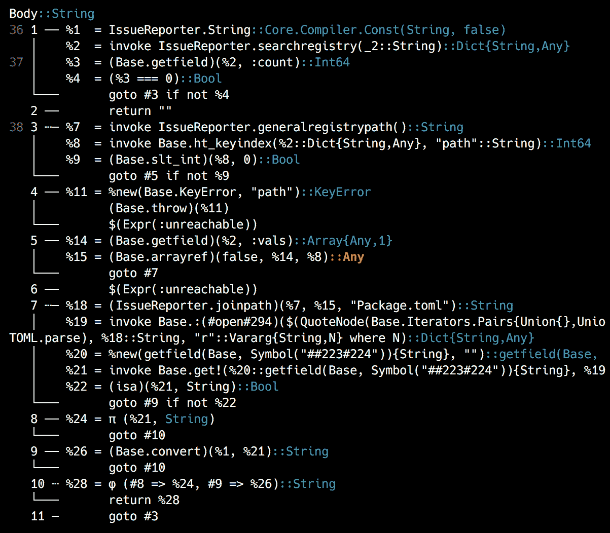

太棒了，几乎一切都很绿色！只有一个红色的 `Any`，来自 `TOML.parsefile` 函数本身，但这不值得优化掉；额外的努力会抵消好处。

花些时间查看官方的性能建议绝对是值得的，这些建议可在[`docs.julialang.org/en/v1/manual/performance-tips/`](https://docs.julialang.org/en/v1/manual/performance-tips/)在线找到。

# 与 GitHub API 交互

现在我们可以在 `General` 注册表中检索任何包的 GitHub URI，我们可以使用它来与 GitHub API 交互。Julia 开发者可以访问由 GitHub 包提供的强大 GitHub 库。这就是我们将用它来在包的 GitHub 仓库中创建新问题的方法。

# 使用 GitHub API 进行身份验证

为了允许与 GitHub API 交互，我们必须进行身份验证。这将允许我们的包在用户的账户下执行操作，就像直接通过网站执行一样。请访问 [`github.com/settings/tokens/new`](https://github.com/settings/tokens) 来设置新的 GitHub 访问令牌。如果您不熟悉这个概念并且想了解更多，请继续阅读并遵循[`help.github.com/articles/creating-a-personal-access-token-for-the-command-line/`](https://help.github.com/articles/creating-a-personal-access-token-for-the-command-line/)中的官方说明。为令牌提供一个好的描述，并且非常重要，确保您检查了仓库范围，就像您可以在下面的截图中所看到的那样：

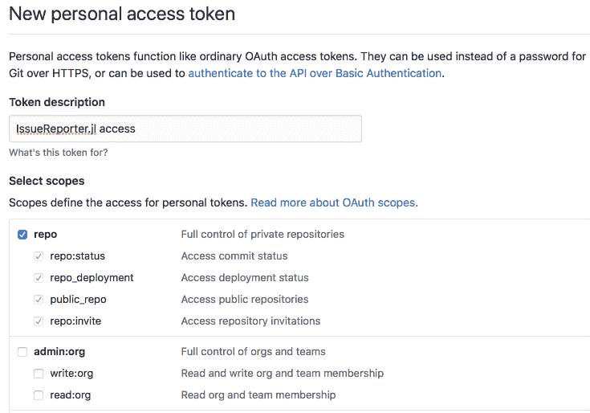

生成后，请记下令牌——一旦离开该页面，您就再也看不到它了。

访问令牌必须谨慎操作——并且不得提交到 git 或其他源代码控制系统中，这些系统可能被其他用户访问。任何获得您的访问令牌的人都可以用它来在 GitHub 上冒充您。为了安全起见，请确保对于这个项目，您只检查仓库范围。

让我们在不损害安全性的前提下，给我们的包添加一些逻辑，以便使访问令牌可用。它应该按以下方式工作——首先，我们检查访问令牌是否作为命令行参数提供给 Julia 进程——这意味着它将在 `ENV` 集合中可用。如果没有，我们将在包的根目录中寻找一个名为 `secrets.jl` 的文件并将其包含进来。该文件将包含访问令牌，因此我们将将其添加到 `.gitignore` 中，以确保它不会意外地提交到 git。

因此，让我们编写测试。在 `runtests.jl` 的末尾追加以下内容：

```py
@testset "GitHub integration" begin 
  delete!(ENV, "GITHUB_ACCESS_TOKEN") 

  @testset "An undefined token should return false" begin 
    @test ! IssueReporter.tokenisdefined() 
  end 
  @testset "Attempting to access a token that is not set will error" begin 
    @test_throws ErrorException IssueReporter.token() 
  end 
  # setup a mock token 
  ENV["GITHUB_ACCESS_TOKEN"] = "1234" 
  @testset "Token is defined" begin 
    @test IssueReporter.tokenisdefined() 
  end 
 @testset "A valid token is a non empty string and has the set value" begin 
    token = IssueReporter.token() 
    @test isa(token, String) && ! isempty(token) 
    @test token == "1234" 
  end 
end 

```

测试当然会失败，所以让我们让它们通过。

将以下函数定义添加到 `IssueReporter.jl`：

```py
function tokenisdefined() :: Bool 
    if ! haskey(ENV, "GITHUB_ACCESS_TOKEN") 
        secrets_path = joinpath(@__DIR__, "secrets.jl") 
        isfile(secrets_path) && include(secrets_path) 
        haskey(ENV, "GITHUB_ACCESS_TOKEN") || return false 
    end 

    true 
end 

function token() :: String 
    tokenisdefined() && return ENV["GITHUB_ACCESS_TOKEN"] 
    error("""ENV["GITHUB_ACCESS_TOKEN"] is not set -- please make sure it's passed as a command line argument or defined in the `secrets.jl` file.""") 
end 
```

在`tokenisdefined`函数中，我们检查`GITHUB_ACCESS_TOKEN`环境变量是否已经定义——如果没有，我们检查`secrets.jl`文件是否存在，如果存在，则将其包含进来。一旦包含，`secrets.jl`文件应该定义该变量，因此最后我们再次检查`GITHUB_ACCESS_TOKEN`的存在。如果令牌仍然未定义，函数返回`false`——否则，返回`true`。我们还添加了一个调用`tokenisdefined`的令牌函数，给模块设置`GITHUB_ACCESS_TOKEN`的机会。如果令牌可用，则返回它——如果不可以，这次会抛出一个错误。我们的测试现在应该通过了：

```py
pkg> test 
```

如此，正如这里所示：

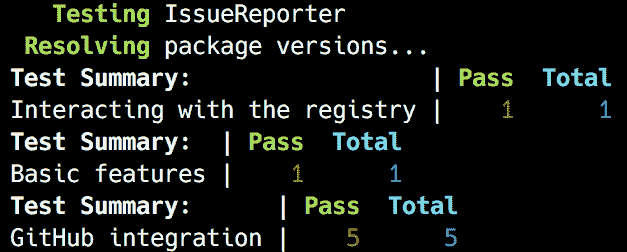

成功！

在继续之前，我们需要将`secrets.jl`文件添加到`.gitignore`中——将此提交到公共 GitHub 仓库将是一个巨大的安全错误。从 Julia REPL 中，请注意以下内容：

```py
julia> write(".gitignore", "secrets.jl") 
```

现在，你需要创建`secrets.jl`文件本身，并确保它包含类似于以下片段的内容，但添加你自己的 GitHub 访问令牌：

```py
ENV["GITHUB_ACCESS_TOKEN"] = "0cdf8672e66***" # token truncated 
```

太好了，我们现在准备好报告问题！

# 报告 GitHub 问题

我们现在只剩下最后一步——使用 GitHub API 来报告问题。为了注册一个问题，我们需要两个信息——标题和正文。因此，我们将定义一个新的函数，称为`report`，它将接受三个字符串参数——包名，以及两个用于问题标题和正文的参数。内部，该函数将通过 GitHub 包对相应的 GitHub API 进行认证调用。

根据文档，调用`GitHub.create_issue`方法看起来是这样的：

```py
GitHub.create_issue("<username>/<repo>", auth = <GitHub.OAuth2>, params...) 
```

这意味着我们需要做以下事情：

1.  使用 GitHub 令牌进行认证并生成所需的`GitHub.OAuth2`认证对象

1.  从 Julia 包名开始，计算 GitHub 用户名和仓库信息——为此，我们将使用已经实现的`IssueReporter.packageurl`，并对其进行一些额外的处理以从 URL 中移除不需要的部分

1.  调用`GitHub.create_issue`，传入所有必要的参数

由于我们正在进行 TDD，让我们首先将这些规范转换为测试。在`runtests.jl`文件的底部添加以下内容：

```py
@testset "Adding GitHub issues" begin 
  delete!(ENV, "GITHUB_ACCESS_TOKEN") 

  @testset "Successful authentication should return a GitHub.OAuth2 instance" begin 
    @test isa(IssueReporter.githubauth(), GitHub.OAuth2) 
  end 
  @testset "Converting package name to GitHub id" begin 
    @test IssueReporter.repoid("IssueReporter") == "essenciary/IssueReporter.jl" 
  end 
  @testset "Submitting an issue should result in a GitHub.Issue object" begin 
    @test isa(IssueReporter.report("IssueReporter", "I found a bug", "Here is how you can reproduce the problem: ..."), GitHub.Issue) 
  end 
end 
```

测试与之前用普通英语表达的要求完全相同，顺序一致。第一个调用一个我们将要编写的函数，称为`IssueReporter.githubauth`，该函数将执行 GitHub 认证，并在成功时返回一个`GitHub.OAuth2`对象。接下来，我们需要一个新的`repoid`函数，它将接受一个包名，并返回 GitHub 用户名和仓库名。请注意，我们正在使用`IssueReporter`包的我的仓库作为测试的豚鼠。最后，我们测试问题创建，这将通过`IssueReporter.report`方法完成——在成功的情况下，我们期望得到一个`GitHub.Issue`对象。

不要用 Julia 做任何邪恶的事情！我们编写的代码实际上会在 GitHub 的实时仓库上注册新问题。请尊重开源贡献者的辛勤工作，不要用虚假的问题来压垮他们。

是时候通过编写实现来确保测试通过了。确保`IssueReporter`模块的`using`指令如下所示：

```py
using Pkg, Pkg.TOML, GitHub, URIParser  # we've added URIParser and GitHub 
```

然后，将以下函数添加到`IssueReporter`模块的底部：

```py
function githubauth() 
  token() |> GitHub.authenticate 
end 

function repoid(package_name::String) 
  pkg_url = packageuri(package_name) |> URIParser.parse_url 
  repo_info = endswith(pkg_url.path, ".git") ? 
                replace(pkg_url.path, r".git$"=>"") : 
                pkg_url.path 
  repo_info[2:end] 
end 

function report(package_name::String, title::String, body::String) 
  GitHub.create_issue(repoid(package_name), auth = githubauth(), 
                        params = Dict(:title => title, :body => body)) 
end 
```

非常直接。`githubauth`函数调用`GitHub.authenticate`方法，并传递由 token 函数调用提供的认证令牌。

`repoid`方法接受一个字符串参数作为仓库名称，然后调用`packageuri`和`URIParse.parse_url`来生成对应 GitHub 仓库的 URI 对象。然后我们提取 URI 的路径组件并对其进行处理，只保留 GitHub 用户名和仓库名。换句话说，从名为`IssueReporter`的包开始，我们检索 GitHub 仓库 URL，它是`git://github.com/essenciary/IssueReporter.jl.git`。路径组件是`/essenciary/IssueReporter.jl.git`。我们使用`r".git$"`正则表达式来移除返回子串前的`.git`后缀。最后，我们得到了我们需要的——`essenciary/IssueReporter.jl`。

最后，报告函数通过调用`GitHub.create_issue`方法，并传递`repoid`、认证对象以及问题标题和正文的`Dict`来将所有内容整合在一起。现在所有测试都应该通过，并且问题已经在 Github.com 上成功创建（[`github.com/`](https://github.com/))：

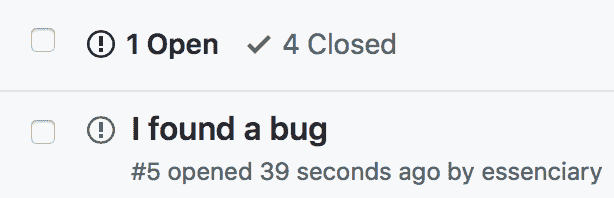

请注意，本章提供的示例代码中的`create issue`功能已被注释掉——取而代之的是硬编码了一个虚拟仓库。出于对真实仓库的贡献者和追随者的尊重，实际的问题将创建在我特别为此目的创建的虚拟仓库上。

# 记录我们的包

我们的产品包现在已经完整！让我们让用户能够轻松利用`IssueReporter`提供的惊人便利——我们将为他们提供一份信息丰富的文档。我们已经知道如何通过使用`DocStrings`来记录我们的代码——这些可以被我们自己和其他开发者用来理解我们的源代码。它也被 REPL 的帮助系统所使用（记得从第一章，*开始使用 Julia 编程*，你可以在行首输入`?`来将 REPL 切换到帮助模式）。你会很高兴地听到，我们还可以使用相同的`DocStrings`，借助一个名为`Documenter`的包来生成包文档。请使用`(IssueReporter) pkg> add Documenter`来添加它。

因此，首先要做的是在我们的函数中添加一些 `DocStrings`。请记住，*官方* 建议包括函数的签名、一小段描述和一些示例。例如，`IssueReporter.packageuri` 函数的文档可能看起来像这样：

```py
""" packageuri(pkgname::String) :: String 
Takes the name of a registered Julia package and returns the associated repo git URL. 
Examples ``` jldoctest julia> `IssueReporter.packageuri("IssueReporter")` "git://github.com/essenciary/IssueReporter.jl.git" ```py """ function packageuri(pkgname::String) :: String # output truncated # end 
```

# 高级文档技巧

```py
packageuri function in the DocString. The problem here is that the documentation can get out of sync if we change the function declaration, but omit to update the documentation. Julia's package ecosystem provides a library that extends the default documentation functionality, named DocStringExtensions. It's a registered package, so it can be added with (IssueReporter) pkg> add DocStringExtensions. It provides a series of methods that can be used to automatically generate some of the repetitive parts of the documentation process. For example, once we add using DocStringExtensions to the IssueReporter module, we can replace the function declaration from the docstring with the $(SIGNATURES) *abbreviation*. We'll see how to do that right away.
```

`DocStrings` 的另一个宝贵特性是示例也可以作为测试。这种测试称为 **doctest**。基本上，当我们提供一个交互式示例及其相应的输出时，如果我们将其标记为 *jldoctest*，用于生成文档的 `Documenter` 包也会运行这些示例，并将结果与提供的输出进行比较，从而测试示例，并隐含地测试我们的代码。查看下一个片段，看看在应用这些优化后前一个示例的样子。

我已经为表示 `IssueReporter` 的 *公共* API 的所有函数添加了注释。以下是更新后的函数定义（你可以从本章的仓库中获取完整文件，链接为 [`github.com/PacktPublishing/Julia-Programming-Projects/blob/master/Chapter11/IssueReporter/src/IssueReporter.jl`](https://github.com/PacktPublishing/Julia-Programming-Projects/blob/master/Chapter11/IssueReporter/src/IssueReporter.jl)）：

```py
module IssueReporter 

using Pkg, Pkg.TOML, GitHub, URIParser, Documenter, DocStringExtensions 

# ... some functions omitted ... #

""" 
$(SIGNATURES) 

Takes the name of a registered Julia package and returns the associated repo git URL. 

#Examples 
```julia-repl

julia> `IssueReporter.packageuri("IssueReporter")`

"git://github.com/essenciary/IssueReporter.jl.git"

```py 
""" 
function packageuri(pkgname::String) :: String 
    # ... function body omitted ... # 
end 

""" 
$(SIGNATURES) 

Checks if the required GitHub authentication token is defined. 
""" 
function tokenisdefined() :: Bool 
  # ... function body omitted ... # 
end 

# ... some functions omitted ... #

""" 
$(SIGNATURES) 

Converts a registered Julia package name to the corresponding GitHub "username/repo_name" string. 

#Examples 
```jldoctest

julia> `IssueReporter.repo_id("IssueReporter")`

"essenciary/IssueReporter.jl"

```py 
""" 
function repoid(package_name::String) 
    # ... function body omitted ... # 
end 

# ... some functions omitted ... #

end # module  
```

# 生成文档

为了创建我们的文档，我们首先需要在 `IssueReporter` 根目录内创建一个 `docs/` 文件夹。

在 `docs/` 文件夹中，我们还需要两样东西——首先是一个 `src/` 文件夹，它将包含用于构建文档的 markdown 模板，以及 `index.md` 文件；其次是一个 `make.jl` 文件，它将控制文档构建过程。以下是我们的包的完整文件结构，仅供参考：

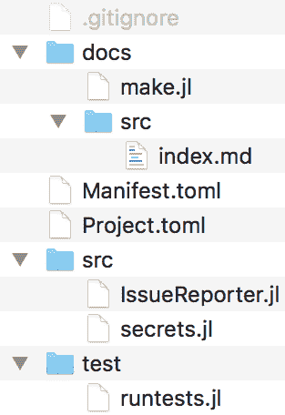

现在，在编辑器中打开 `docs/make.jl` 文件并添加以下内容：

```py
using Pkg 
pkg"activate .." 
push!(LOAD_PATH,"../src/") 
using Documenter, IssueReporter 

makedocs(sitename = "IssueReporter Documentation") 
```

接下来，在编辑器中打开 `index.md` 文件并添加以下内容：

```py
# IssueReporter.jl Documentation 
```@meta

`CurrentModule = IssueReporter`

```py 
```@contents

```py 
## Functions 
```@docs

`packageuri(pkgname::String)`

`tokenisdefined()`

`token()`

`githubauth()`

`repoid(package_name::String)`

`report(package_name::String, title::String, body::String)`

```py 
## Index 
```@index

```py 
```

这是我们的文档的 Markdown 模板。在顶部，我们有页面的标题。然后，`@meta`块包含传递模块名称的`Documenter`信息。`@contents`块将被替换为目录。`@docs`块将包含每个包含函数的文档。在底部，`@index`块将被替换为指向每个已记录函数的链接列表。

那就是全部了。为了生成文档，我们需要在`docs/`文件夹中从 OS 终端运行`$ julia --color make.jl`。

命令的输出将显示构建文档的进度：

```py
Documenter: setting up build directory. 
Documenter: expanding markdown templates. 
Documenter: building cross-references. 
Documenter: running document checks. 
 > checking for missing docstrings. 
 > running doctests. 
 > checking footnote links. 
Documenter: populating indices. 
Documenter: rendering document. 
```

生成的文档可以在`docs/build/index.html`中找到，看起来像这样：

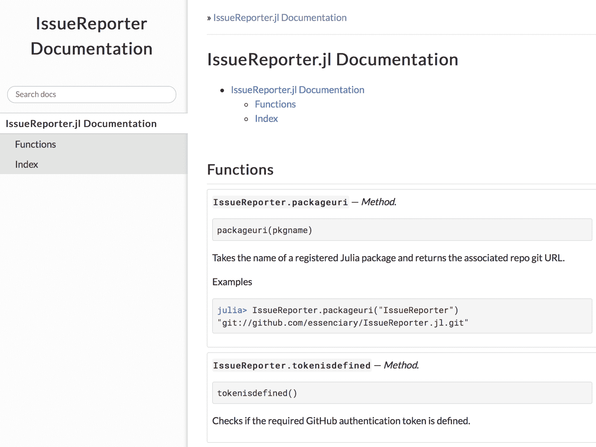

# 注册我们的包

现在，对于最后一步——让我们的包对全世界可用！首先，我们需要创建远程 GitHub 仓库并将我们的代码推送到它。最简单的方法是使用 GitHub 提供的`hub`二进制文件。请按照您平台上的说明进行安装，请参阅[`github.com/github/hub`](https://github.com/github/hub)。一旦准备好，我们将在`IssueReporter`文件夹的根目录下运行`hub create`。我们可以在 Julia 的 REPL 中这样做：

```py
julia> cd(Pkg.dir("IssueReporter")) 
julia> run(`hub create IssueReporter.jl`) 
```

您将被提示输入您的 GitHub 用户名和密码——如果一切顺利，您将看到确认创建仓库的输出。

# 最后的修饰

接下来，我们需要提交和推送我们的更改——但在做之前，让我们先对`.gitignore`进行最后的修改，将`docs/build`也添加到忽略文件列表中。将构建的文档包含在 GitHub 提交中是一种不好的做法——有关在 GitHub 上托管文档的更多信息，请阅读官方`Documenter`信息，请参阅[`juliadocs.github.io/Documenter.jl/latest/man/guide/#Usage-1`](https://juliadocs.github.io/Documenter.jl/latest/man/guide/#Usage-1)和[`juliadocs.github.io/Documenter.jl/latest/man/hosting/#Hosting-Documentation-1`](https://juliadocs.github.io/Documenter.jl/latest/man/hosting/#Hosting-Documentation-1)。

当我们在这里时，让我们也向`IssueReporter`的根目录添加一个`README.md`文件，以包含一些信息：

```py
# IssueReporter.jl  
`IssueReporter.jl` is a Julia package which makes it easy to report a new issue with a registered package. 
In order to use it, it needs to be configured with a valid GitHub authentication token. Follow the instructions at 
https://help.github.com/articles/creating-a-personal-access-token-for-the-command-line/ to generate a new token -- make sure 
that it has the `repo` access. 
Once you have the token, add it to the secrets.jl file. 
You can now open issues by invoking: 
`IssueReporter.report("Julia package name", "issue title", "issue body")` 
```

# 设置仓库

使用您喜欢的 git 客户端，`add`、`commit`和`push`代码库。我将使用终端：

```py
$ git add . $ git commit -m "initial commit" $ git push origin master 
```

# 解放 Julia 的机器人军团

我们的项目看起来很棒——现在是时候标记一个版本并注册它了。

Julia 的贡献者开发了一系列非常实用的 GitHub 集成，即*机器人*。这些机器人帮助我们人类自动化一系列无聊的任务，以便我们可以专注于真正重要的事情（嗯，披萨！）。

其中之一是 Attobot，它是 Julia 的包发布机器人。当在 GitHub 上标记版本时，它会为 Julia 的`General`注册表创建拉取请求。尝试以下操作：

1.  要设置 Attobot，请打开您的 `IssueReporter` GitHub 仓库并访问 [`github.com/integration/attobot`](https://github.com/integration/attobot)。请确保您已登录到您的 GitHub 账户。

1.  然后，点击配置以选择您希望添加的仓库。

1.  仅选择仓库，然后选择 `IssueReporter` 并点击保存。现在，Attobot 已配置为监控具有标准 `.jl` 扩展名的包，并在标记新版本时将它们发布到 `Global` 仓库。

有关 Attobot 的更多详细信息，请访问 [`github.com/attobot/attobot`](https://github.com/attobot/attobot)。

1.  现在，我们需要前往我们的仓库的 GitHub 页面并点击版本链接：

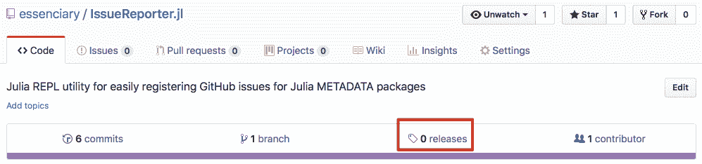

1.  接下来，我们将有创建新版本的选择：

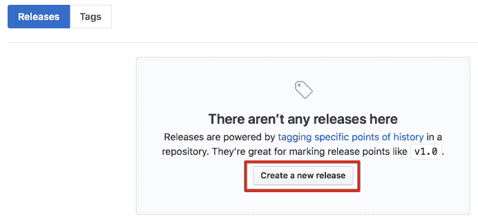

1.  在下一屏幕上，我们将能够标记我们的版本。Julia 使用语义版本控制（看起来像 vX.Y.Z），并建议从 `v0.0.1` 开始。让我们就这样做：

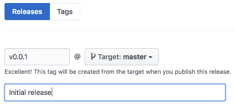

1.  然后，点击发布版本。

如果有任何问题，Attobot 将在仓库中打开问题——确保您已经解决了它们。一旦完成，该包将被注册！胜利！

# 摘要

看到我们的包终于准备就绪，真是令人兴奋！

在开发过程中，我们还学习了关于 Julia 强大工具箱的知识，以及一些关于软件开发的一般最佳实践——TDD、单元测试、基准测试，以及记录我们的代码库并发布生成的文档。

这也标志着我们学习 Julia 语言的旅程的结束。自从第一次打开 REPL 以来，我们已经走了很长的路——您已经取得了令人印象深刻的成就！数据分析、绘图、网络爬取、推荐系统、监督和未监督机器学习，以及时间序列分析和预测！现在您可以使用 Julia 做所有这些事情。哇！这确实是一个相当令人印象深刻的记录！而且，如果做所有这些看起来很简单，那都是因为 Julia 的不可思议的特性。高效的 REPL、简单的包安装、方便的绘图包，或者可读的语法；它们都让编程变得简单而有趣。

Julia 确实是一种新型的编程语言。由于它是新的，它能够通过借鉴最成功的编程语言的优势，避免它们的错误来学习。Julia 被特别设计来高效地满足我们这一代人的需求——机器学习、人工智能、高性能、并行、GPU 和分布式云计算——这些都是在这些领域表现出色的领域。

但，Julia 不仅提供了编写高性能代码的高效语言结构——它还提供了富有成效的开发体验。强大的 REPL（所有现有编程语言中最好的 REPL 之一！）和即时编译功能使得快速原型设计解决方案、切割和分割大量数据，或即时实验数据模型变得容易。集成的帮助模式和强大的 shell 模式赋予了开发者力量，提升了生产力。

然后是通过 IJulia 与 Jupyter Notebooks 的无缝集成——以及与 Python 和 R 等现有编程语言的惊人跨语言集成。如果您已经使用过这些技术，切换到 Julia 应该会很直接。

但 Julia 是新的，刚刚达到版本 1，并不意味着 Julia 不是一个成熟的编程语言。它经过六年的精心打磨和关注——来自数千名开发者的贡献。因此，我鼓励您开始使用 Julia 来解决实际问题。您将加入成千上万的开发者行列，他们正在专业地使用这种语言进行科学计算、数据科学、人工智能、金融科技、Web 开发、教学等领域。像苹果、亚马逊、Facebook 和甲骨文这样的知名公司——仅举几个例子——在 2017 年都在寻找 Julia 程序员。

我希望您阅读这本书的乐趣和我写作这本书的乐趣一样。您现在已经准备好了——我希望您渴望——在您的项目中使用 Julia！所以，与其说“再见”，我更想说的是——*欢迎来到 Julia 编程的奇妙世界！*
