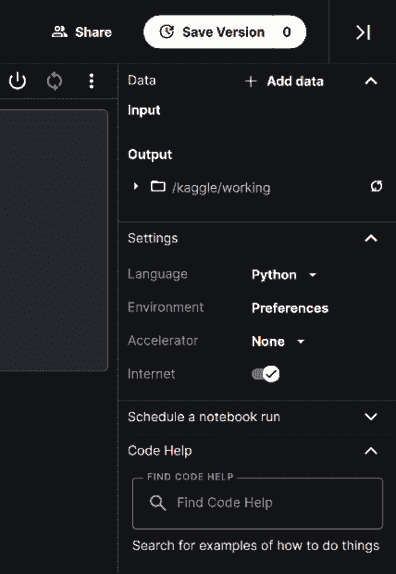

# 使用 Kaggle 笔记本学习和工作

Kaggle 笔记本——直到最近还被称为**内核**——是浏览器中的 Jupyter 笔记本，可以免费运行。这意味着您可以从任何有互联网连接的设备执行实验，尽管可能比手机大一些会更好。以下是从 Kaggle 网站引用的环境技术规格（截至本文写作时）；最新版本可以在[`www.kaggle.com/docs/notebooks`](https://www.kaggle.com/docs/notebooks)验证：

+   CPU/GPU 执行时间为 12 小时，TPU 为 9 小时

+   20GB 的自动保存磁盘空间（/kaggle/working）

+   额外的临时磁盘空间（在/kaggle/working 之外），这些空间在当前会话之外不会被保存

**CPU 规格：**

+   4 个 CPU 核心

+   16GB 的 RAM

**GPU 规格：**

+   2 个 CPU 核心

+   13GB 的 RAM

**TPU 规格：**

+   4 个 CPU 核心

+   16GB 的 RAM

在本章中，我们将涵盖以下主题：

+   设置笔记本

+   运行笔记本

+   将笔记本保存到 GitHub

+   充分利用笔记本

+   Kaggle 学习课程

不再拖延，让我们直接进入正题。我们首先需要做的是弄清楚如何设置笔记本。

# 设置笔记本

创建笔记本主要有两种方法：从首页或从数据集创建。

要进行第一种方法的操作，请转到[`www.kaggle.com/`](https://www.kaggle.com/)着陆页左侧的**代码**菜单部分，并点击**新建笔记本**按钮。如果您计划进行涉及上传自己的数据集的实验，这是一个首选方法：

图 3.1：从代码页面创建新的笔记本

或者，您可以转到您感兴趣的数据集页面，并点击那里的**新建笔记本**按钮，正如我们在上一章中看到的：

图 3.2：从数据集页面创建新的笔记本

无论您选择哪种方法，在点击**新建笔记本**后，您将被带到您的**笔记本**页面：

图 3.3：笔记本页面

在上面显示的新**笔记本**页面的右侧，我们有一些可以调整的设置：

图 3.4：笔记本选项

我们将简要讨论设置。首先，是编码**语言**。截至本文写作时，Kaggle 环境仅允许 Python 和 R 作为可用的编码选项。默认情况下，新的笔记本初始化时语言设置为 Python——如果您想使用 R，请点击下拉菜单并选择**R**。

接下来是**环境**：这个切换按钮允许你决定是否始终使用最新的 Docker 环境（风险选项；更新快，但依赖项可能会因未来的更新而损坏）或者将笔记本固定到 Kaggle 提供的原始环境版本（安全选择）。后者是默认选项，除非你正在进行非常活跃的开发工作，否则没有真正的原因要去修改它。

**加速器**允许用户选择如何运行代码：在 CPU 上（无加速）、GPU 上（对于几乎所有涉及深度学习的严肃应用都是必要的），或者 TPU 上。请记住，从 CPU 迁移到（单个）GPU 只需要对代码进行最小改动，并且可以通过系统设备检测来处理。

将你的代码迁移到 TPU 需要更详细的重新编写，从数据处理开始。需要记住的一个重要点是，当你正在你的笔记本上工作时，你可以切换到 CPU/GPU/TPU，但每次你这样做，环境都会重新启动，你需要从头开始运行所有代码。

最后，我们有**互联网**切换按钮，它启用或禁用在线访问。如果你连接了网络并且需要，例如，安装额外的包，依赖项的下载和安装将在后台自动进行。你需要明确禁用互联网访问的最常见情况是在提交比赛时，比赛明确禁止在提交时使用在线访问。

使用笔记本的一个重要方面是，你可以始终取一个现有的笔记本（由你自己或另一个 Kaggler 创建）并将其克隆以修改和调整以满足你的需求。这可以通过点击笔记本页面右上角的**复制并编辑**按钮来实现。在 Kaggle 术语中，这个过程被称为**分支**：

图 3.5：分支现有的笔记本

**关于礼仪的说明**：如果你之前参加过 Kaggle 比赛，你可能已经注意到排行榜上充斥着得分很高的笔记本的分支。在别人的工作上建立自己的东西并没有什么不妥——但如果你这样做，记得要给原作者点赞，并明确指出参考作品的创作者。

默认情况下，你创建的笔记本是私有的（只有你能看到）。如果你想让它对其他人可用，你可以选择添加协作者，这样只有被明确添加到名单中的用户才能查看或编辑内容，或者将笔记本公开，在这种情况下，任何人都可以看到它。

# 运行你的笔记本

所有编码工作已完成，笔记本看起来运行良好，你现在可以执行了。为此，请前往笔记本页面的右上角并点击**保存版本**。

图 3.6：保存你的脚本

**保存并运行所有**通常用于执行脚本，但还有一个**快速保存**选项，可以在脚本准备好提交之前保存脚本的中间版本：

图 3.7：保存版本的选项

一旦您启动了您的脚本，您可以前往左下角并点击**活动事件**：

图 3.8：监控活动事件

以这种方式，您可以监控您的笔记本行为。正常执行与消息**运行**相关联；否则，将显示为**失败**。如果您决定出于任何原因（例如，您意识到您忘记使用最新的数据）想要终止一个正在运行的会话，您可以通过点击**活动事件**下脚本条目右侧的三个点来完成，您将收到如图下所示的弹出窗口：

图 3.9：取消笔记本执行

# 将笔记本保存到 GitHub

最近引入的一项功能（见[`www.kaggle.com/product-feedback/295170`](https://www.kaggle.com/product-feedback/295170)）允许您将您的代码或笔记本存储到版本控制存储库 GitHub ([`github.com/`](https://github.com/)))。您可以将您的作品存储在公共和私有存储库中，并且当您保存代码版本时，这将自动发生。这个功能对于与您的 Kaggle 队友分享您的作品，以及向更广泛的公众展示您的作品来说可能非常有用。

为了启用此功能，您需要打开您的笔记本；在**文件**菜单中，选择**链接到 GitHub**选项。

图 3.10：启用 GitHub 功能

选择选项后，您需要将 GitHub 账户链接到笔记本。您将在第一次选择链接时明确被要求提供链接权限。对于任何后续链接到新笔记本的操作，操作将自动执行。

图 3.11：链接到 GitHub

只有在链接了您的笔记本之后，当您保存时，您才被允许将您的作品同步到您选择的存储库：

图 3.12：将您的作品提交到 GitHub

在决定存储库和分支（这样您可以存储您工作的不同开发阶段）之后，您可以更改您要推送到存储库的文件名，并修改提交信息。

如果你决定不再在 GitHub 上同步特定的 Notebook，你只需要回到**文件**菜单并选择**从 GitHub 断开连接**。最后，如果你想让 Kaggle 停止连接到你的 GitHub 仓库，你可以从**我的链接账户**下的 Kaggle 账户页面或 GitHub 的设置页面（[`github.com/settings/applications`](https://github.com/settings/applications)）断开你的账户链接。

# 充分利用 Notebooks

Kaggle 每周会提供一定量的免费资源，配额会重置。你可以使用一定数量的 GPU 和 TPU 时间；对于 TPU 是 30 小时，但对于 GPU，这个数字每周都可能变化（你可以在这里找到描述“浮动”配额政策的官方声明：[`www.kaggle.com/product-feedback/173129`](https://www.kaggle.com/product-feedback/173129)）。你可以在自己的个人资料中始终监控你的使用情况：

图 3.13：加速器配额的当前状态

虽然乍一看这些数量可能很大，但这种初步印象可能会误导人；实际上，很容易很快就用完你的配额。以下是一些可以帮助你控制资源使用的实用建议：

+   配额计数器（衡量你使用所选加速器，GPU 或 TPU 的时间）从你**初始化**Notebook 的那一刻开始运行。

+   这意味着你应该始终先检查设置中是否已禁用 GPU（参见上面的*图 3.6*）。首先编写模板代码，检查你的语法，并在添加实际依赖于 GPU 初始化的代码部分时启用/禁用 GPU。提醒：当你更改加速器时，Notebook 将重新启动。

+   通常，在小部分数据上从头到尾运行代码以了解执行时间是一个好主意。这样，你可以最大限度地减少你的代码因超过此限制而崩溃的风险。

有时候，Kaggle 提供的免费资源不足以完成手头的任务，你需要迁移到一个更强大的机器。一个很好的例子是最近的一个肿瘤分类竞赛：[`www.kaggle.com/c/rsna-miccai-brain-tumor-radiogenomic-classification/data`](https://www.kaggle.com/c/rsna-miccai-brain-tumor-radiogenomic-classification/data)。

如果你的原始数据超过 100GB，你需要调整/下采样你的图像（这可能会对你的模型性能产生不利影响），或者在一个能够处理高分辨率图像的环境中训练模型。你可以自己设置整个环境（例如，*第二章*中的*使用 Kaggle 数据集在 Google Colab 中*部分就是一个这样的设置示例），或者你可以在 Notebooks 框架内保持，但更换底层的机器。这就是 Google Cloud AI Notebooks 发挥作用的地方。

## 升级到 Google Cloud Platform (GCP)

升级到 GCP 的明显好处是获得更强大的硬件：由 Kaggle 免费提供的 Tesla P100 GPU 对于许多应用来说相当不错，但在性能方面并不是顶级的，16GB 的 RAM 在资源密集型应用（如大型 NLP 模型或高分辨率图像处理）中也可能相当有限。虽然执行时间的改进是明显的，导致开发周期中迭代速度更快，但这是有代价的：你需要决定你愿意花多少钱。对于强大的机器处理数字，时间可以说是实实在在的钱。

为了将你的笔记本迁移到 GCP 环境，请转到右侧的侧边菜单并点击**升级到 Google Cloud AI 笔记本**：

图 3.14：升级到 Google Cloud AI 笔记本选项

你将看到以下提示：

图 3.15：升级到 Google Cloud AI 平台笔记本提示

当你点击**继续**时，你将被重定向到 Google Cloud Platform 控制台，在那里你需要配置你的计费选项。提醒：**GCP 不是免费的**。如果是你第一次使用，你需要完成一个教程，引导你完成必要的步骤。

## 更进一步

如本章前面所述，Kaggle 笔记本是教育和参加比赛的一个极好的工具；但它们也充当了一个非常有用的组件，即你可以用来展示你的数据科学技能的资料夹。

在构建你的数据科学资料夹时，有许多潜在的考虑因素（品牌、受众范围、向潜在雇主推销等），但如果没有人能找到它，那么它们都不重要。因为 Kaggle 是 Google 的一部分，笔记本由世界上最受欢迎的搜索引擎索引；所以如果有人正在寻找与你代码相关的主题，它将出现在他们的搜索结果中。

下面，我展示了一个个人例子：几年前，我为一项比赛编写了一个笔记本。我想解决的问题是对抗验证（对于那些不熟悉这个话题的人来说：一个相当简单的方法来查看你的训练集和测试集是否有相似分布，就是构建一个二元分类器，训练它来区分它们；这个概念在*第六章*，*设计良好的验证*中有更详细的介绍）。在撰写本章时，我试图搜索这个笔记本，结果它出现在搜索结果的高位（注意我在查询中没有提到 Kaggle 或任何个人细节，如我的名字）：

图 3.16：Konrad 的笔记本出现在 Google 上

接下来谈谈使用 Notebooks 展示技能集的其他好处：就像**竞赛**、**数据集**和**讨论**一样，**笔记本**也可以获得投票/奖牌，从而在进步系统和排名中定位你。你可以远离竞赛赛道，仅通过专注于社区欣赏的高质量代码，成为专家、大师或大师级。

最新的进步要求版本可以在[`www.kaggle.com/progression`](https://www.kaggle.com/progression)找到；以下是我们提供的与专家和大师级别相关的快照：

图 3.17：等级进步要求

在笔记本类别中进步可能是一个具有挑战性的经历；虽然比竞赛容易，但绝对比讨论难。最受欢迎的笔记本是与特定竞赛相关的：探索性数据分析、端到端的概念验证解决方案，以及排行榜追逐；遗憾的是，人们通常会克隆得分最高的公开笔记本，调整一些参数以提高分数，然后广受赞誉（如果点赞可以被视为情绪的衡量标准）。这并不是要阻止读者在 Kaggle 上发布高质量的作品——大多数 Kagglers 都欣赏新颖的工作，而且从长远来看，质量确实占上风——但需要对期望进行现实的调整。

你的 Kaggle 个人资料附带关注者，并为你提供了链接其他专业网络如 LinkedIn 或 GitHub 的可能性，这样你就可以利用在社区中获得的联系：

![B17574_03_18.png]

图 3.18：Konrad 的 Kaggle 个人资料

在这个时代，对“社区建设”的宣称持怀疑态度是很常见的，但在 Kaggle 的情况下，这竟然是真的。他们在数据科学领域的品牌认知度无人能及，无论是对于从业者还是那些真正做足功课的招聘者来说都是如此。在实践中，这意味着一个（足够好的）Kaggle 个人资料已经可以让你迈过门槛；正如我们都知道的，这通常是最难的一步。

Martin Henze

[`www.kaggle.com/headsortails`](https://www.kaggle.com/headsortails)

我们有幸采访了 Martin Henze，也就是 Heads or Tails，他是 Kaggle 的 Notebooks 和 Discussion 领域的 Kaggle 大师，同时也是 Edison Software 的数据科学家。Martin 还是《每周笔记本精选：隐藏的宝石》的作者，这是一周精选的最好笔记本，它们都逃过了公众的注意。你可以通过关注他的 Kaggle 个人资料或 Twitter 和 LinkedIn 上的账户来获取新的隐藏宝石帖子。

你最喜欢的比赛类型是什么？为什么？在技术、解决方法方面，你在 Kaggle 上的专长是什么？

*长期以来，我的重点是 EDA（探索性数据分析）笔记本，而不是排行榜预测本身。在我加入 Kaggle 之前的大部分经验都与表格数据有关，我的大多数 EDA 笔记本都涉及从新推出的表格挑战中提取复杂的见解。我仍然认为这是我在 Kaggle 上的专长，我花了很多时间来构建我的笔记本的结构、数据可视化和叙事。*

你是如何处理 Kaggle 竞赛的？这种处理方式与你在日常工作中所做的是如何不同的？

*即使 Kaggle 已经从表格竞赛转向，我仍然坚信数据本身是任何挑战最重要的方面。很容易过早地专注于模型架构和超参数调整。但在许多竞赛中，成功的关键仍然是一个以对数据集及其怪癖和独特性有详细了解为中心的方法。这对于图像数据、NLP、时间序列以及你能想到的任何其他数据结构都是正确的。因此，我总是在构建一个简单的基线模型、一个 CV 框架之前，先进行广泛的 EDA（探索性数据分析）。*

*与我的数据科学日常工作相比，主要的不同可能在于，大多数有经验的人在新挑战的第一周内就能构建出的基线模型可能被认为是足够投入生产的。在许多情况下，在那几天之后，我们在得分指标方面已经超过了最终获胜者的解决方案的 80%以上。当然，Kaggle 的乐趣和挑战在于找到创造性的方法来获得最后几个百分点的准确性。但在行业工作中，你的时间通常更有效地用于处理新的项目。*

Kaggle 是否帮助了你在职业生涯中？如果是的话，是如何帮助的？

*Kaggle 对我的职业生涯产生了巨大的影响。在 Kaggle 社区中的良好经历激励我从学术界转向行业。如今，我在一家科技初创公司担任数据科学家，并通过 Kaggle 挑战不断成长和磨练我的技能。*

*在我的情况下，我对构建广泛的 Kaggle Notebooks 的关注帮助了我很多，因为我可以很容易地使用它们作为我的作品集。我不知道招聘经理实际上会多频繁地查看这些资源，但我经常有一种印象，我的大师级称号可能比我的博士学位为我打开更多的门。或者可能是两者的结合。无论如何，我强烈推荐拥有一个公开 Notebooks 的作品集。此外，在我的求职过程中，我使用了在 Kaggle 上学到的策略来解决各种带回家的作业，并且它们对我很有帮助。*

根据你的经验，没有经验的 Kagglers 通常忽略了什么？你现在知道的事情，你希望在你刚开始的时候就知道？

*我认为我们都在* *不断积累经验。现在我们都比十年前、五年前甚至一年前更聪明了。抛开这些不说，一个经常被忽视的关键方面是，你需要为你要做的事情制定一个计划，并执行和记录这个计划。对于新加入 Kaggle 的人来说，这是一个完全可以理解的错误，因为一切都是新颖的、复杂的，至少有些令人困惑。我知道当我第一次加入 Kaggle 时，它对我来说很困惑。你可以做很多事情：论坛、数据集、挑战、课程。而且比赛可能会让人感到非常害怕：神经元细胞实例分割；股票市场波动预测。这些到底是什么东西？但比赛也是开始的最佳地方。*

*因为当一项比赛启动时，没有人真正了解它。是的，可能有一个人的博士论文几乎与这个主题完全相同。但这种情况很少见。其他人，我们几乎都是从零开始的。深入研究数据，玩转损失函数，运行一些简单的入门模型。当你一开始加入比赛时，你会以社区成员的身份以加速的方式经历所有学习曲线。你与其他人一起学习，他们会给你提供大量的想法。但你仍然需要一个计划。*

*这个计划很重要，因为盲目地运行一些实验，看到所有的 GPU RAM 都被使用，会让人感到很满足。但随后你会忘记哪个版本的你模型表现最好，局部验证和排行榜之间是否有相关性？我已经测试过这个参数组合了吗？所以写下你要做什么，然后记录结果。现在有越来越多的工具可以为你做记录，但这也可以通过一个自定义脚本来轻松完成。*

*机器学习仍然主要是一门实验科学，高效实验的关键在于精心规划实验并记录所有结果，以便进行比较和分析。*

你在过去比赛中犯过哪些错误？

*我犯过很多错误，我希望我已经从中学到了东西。没有建立健壮的交叉验证框架是其中之一。没有考虑到训练集和测试集之间的差异。做了太多的 EDA（探索性数据分析）而忽略了模型构建——这可能是我在前几次比赛中犯下的标志性错误。没有做足够的 EDA 而遗漏了某些重要内容——是的，我也犯过这样的错误。没有选择我的最后两个提交。（最终并没有带来太大的变化，但我仍然不会忘记这一点。)*

*关于错误，这与我之前关于实验和有计划的观点相似。如果你从错误中学习，并且它们帮助你成长和进化，那么错误是可以接受的。但你应该尽量避免那些可以通过预见避免的简单错误。但在机器学习（和科学！）中，失败几乎是过程的一部分。不是所有的事情都会一直有效。这是可以的。但你不想一次又一次地犯同样的错误。所以，唯一的真正错误就是没有从错误中学习。这在 Kaggle 竞赛和生活中都是正确的。* 

您是否推荐使用特定的工具或库来进行数据分析或机器学习？

*我知道我们越来越生活在 Python 的世界里，但说到表格处理和数据分析可视化，我仍然更喜欢 R 及其 tidyverse：dplyr、ggplot2、lubridate 等。新的 tidymodels 框架是 sklearn 的有力竞争者。即使你是 Python 的死忠粉丝，偶尔看看 pandas 之外的工具也是有益的。不同的工具往往能带来不同的视角和更多的创造力。在深度学习方面，我发现 PyTorch 及其 FastAI 界面最为直观。当然，现在每个人都喜欢 huggingface；而且有很好的理由。*

当人们参加比赛时，他们应该记住或做些什么最重要的事情？

*最重要的是要记得享受乐趣并学到东西。在比赛期间和之后，有如此多的宝贵见解和智慧被分享，如果不吸收并从中成长，那就太可惜了。即使你唯一关心的是获胜，你也只能通过学习和实验，站在这个社区的基础上才能实现。但 Kaggle 远不止排行榜那么简单，一旦你开始为社区做出贡献并回馈，你将以更全面的方式成长。我保证。*

# Kaggle Learn 课程

Kaggle 的许多事情都与获取知识有关。无论是你在比赛中学到的东西，还是你在不断增长的存储库中找到的数据集，或者是展示一个以前未知的模型类别，总有新的东西可以探索。这个集合中最新的补充是汇集在**Kaggle Learn**标签下的课程：[`www.kaggle.com/learn`](https://www.kaggle.com/learn)。这些是 Kaggle 作为“获得独立数据科学项目所需技能的最快方式”进行营销的微课程，核心统一主题是跨各种主题的快速入门介绍。每个课程都分为小章节，后面跟着编码实践问题。这些课程使用 Notebooks 进行交付，其中必要的理论和阐述部分与预期你编码和实现的部分交织在一起。

下面，我们提供了一些最有用的简要概述：

+   **机器学习入门/中级机器学习**: [`www.kaggle.com/learn/intro-to-machine-learning`](https://www.kaggle.com/learn/intro-to-machine-learning) 和 [`www.kaggle.com/learn/intermediate-machine-learning`](https://www.kaggle.com/learn/intermediate-machine-learning)

    这两门课程最好看作是一个两集系列：第一集介绍了机器学习中使用的不同类别的模型，随后讨论了不同模型共有的主题，如欠拟合/过拟合或模型验证。第二集深入探讨特征工程，处理缺失值和处理分类变量。*对于刚开始机器学习之旅的人来说很有用*。

+   **pandas**: [`www.kaggle.com/learn/pandas`](https://www.kaggle.com/learn/pandas)

    这门课程提供了对现代数据科学中最基本工具之一的快速入门介绍。你首先学习如何创建、读取和写入数据，然后继续学习数据清洗（索引、选择、组合、分组等）。*对于初学者（有时 pandas 的功能可能会令人不知所措）和实践者（作为复习/参考）都很有用*。

+   **游戏人工智能**: [`www.kaggle.com/learn/intro-to-game-ai-and-reinforcement-learning`](https://www.kaggle.com/learn/intro-to-game-ai-and-reinforcement-learning)

    这门课程是对 Kaggle 在学习模块中引入的技术课程部分的完美总结。你将编写一个游戏代理，调整其性能，并使用最小-最大算法。*这可能是强化学习实践导向的入门介绍*。

+   **机器学习可解释性**: [`www.kaggle.com/learn/machine-learning-explainability`](https://www.kaggle.com/learn/machine-learning-explainability)

    建立模型很有趣，但在现实世界中并非每个人都是数据科学家，所以你可能会发现自己需要向他人解释你所做的工作。这就是这个关于模型可解释性的迷你课程发挥作用的地方：你将学习如何使用三种不同的方法来评估你的特征的相关性：置换重要性、SHAP 和部分依赖图。*对于在商业环境中使用机器学习的人来说，这极为有用，因为项目的成败取决于信息传达的好坏*。

+   **AI 伦理**: [`www.kaggle.com/learn/intro-to-ai-ethics`](https://www.kaggle.com/learn/intro-to-ai-ethics)

    这最后一门课程是对提案的一个非常有趣的补充：它讨论了指导 AI 系统道德设计的实用工具。你将学习如何识别 AI 模型中的偏差，检验 AI 公平性的概念，并了解如何通过传达 ML 模型信息来提高透明度。*对于从业者来说非常有用，因为“负责任的 AI”这个短语我们将越来越常听到*。

除了 Kaggle 原创内容外，平台还有其他通过用户创建的笔记本提供的学习机会；鼓励读者自行探索。

Andrada Olteanu

[`www.kaggle.com/andradaolteanu`](https://www.kaggle.com/andradaolteanu)

Andrada Olteanu 是一位非常鼓励从笔记本中学习的 Kaggle 笔记本大师。Andrada 是 HP 全球数据科学大使，Endava 的数据科学家，以及 Weights & Biases 的 Dev 专家。我们与 Andrada 讨论了笔记本竞赛、她的职业生涯以及其他内容。

你最喜欢的竞赛类型是什么？为什么？在技术和解决方法方面，你在 Kaggle 上的专长是什么？

*我会说我擅长的 Kaggle 领域更偏向于数据可视化，因为它使我能够将艺术和创意与数据相结合。*

*我不会说我有一个最喜欢的竞赛类型，但我会说我更喜欢偶尔变换一下，选择我觉得有趣的内容。*

*Kaggle 的美丽之处在于，一个人可以在学习多个数据科学领域（计算机视觉、NLP、探索性数据分析与统计学、时间序列等）的同时，也熟悉和舒适地了解许多主题（如体育、医疗领域、金融和加密货币、全球事件等）。*

*另一件很棒的事情是，例如，如果有人想提高处理文本数据的能力，几乎总有一个需要自然语言处理（NLP）的 Kaggle 竞赛。或者，如果有人想学习如何预处理和建模音频文件，也有竞赛可以培养这种技能。*

告诉我们您参加的一个特别具有挑战性的竞赛，以及您使用了哪些见解来应对这项任务。

*我参加过的最具挑战性的“竞赛”是“Kaggle 数据科学和机器学习年度调查”。我知道这并不是一个“真正的”竞赛——涉及排行榜和强大的机器学习——然而对我来说，这是我参与并学到最多的一次竞赛。*

*这是一个笔记本竞赛，用户必须发挥创意才能赢得 Kaggle 提供的 5 个奖项之一。我连续参加了两年。在第一年（2020 年），它挑战了我的更“基础”的视觉化技能，并迫使我跳出思维定式（我获得了第三名）；在第二年（2021 年），我通过学习 D3 为它准备了大约 4 个月，试图在我的数据可视化技能上达到一个新的水平（仍在审查中；到目前为止，我已经赢得了“早期笔记本奖”奖项）。我可以提供的最佳见解是：*

+   *首先，不要迷失在数据中，并尝试创建尽可能准确的图表；如果需要，建立双重验证方法以确保你所展示的是清晰和简洁的。没有什么比一个展示不准确见解的美丽图表更糟糕了。*

+   *尝试从你周围寻找灵感：从自然、从电影、从你的工作中。你可以借鉴惊人的主题和有趣的方式来美化你的可视化。*

Kaggle 是否帮助你在职业生涯中取得进步？如果是，如何？

*是的。非常。我相信我现在在职业生涯中所处的位置很大一部分要归功于 Kaggle，为此我永远感激。通过 Kaggle，我成为了 HP 的 Z 大使；我还发现了 Weights & Biases，这是一个惊人的机器学习实验平台，现在我是他们的一名自豪的 Dev 专家。最后但同样重要的是，通过这个平台，我与我现在的 Endava 首席数据科学家建立了联系，他招募了我，并且我从那时起一直与他合作。简而言之，我在 Endava 的职位以及我与两家大型公司（HP 和 Weights & Biases）的联系都是我 Kaggle 平台活动直接的结果。*

*我认为 Kaggle 最被忽视的方面是社区。Kaggle 拥有最大的群体，所有的人都聚集在一个方便的地方，你可以从中建立联系、互动和学习。*

*最好的利用方式是，例如，从每个 Kaggle 部分（比赛、数据集、笔记本——如果你愿意，还可以是讨论）中选出前 100 人，然后在 Twitter/LinkedIn 上关注那些在个人资料上分享这些信息的人。这样，你可以开始定期与这些充满洞察力和知识的人互动。*

你在过去比赛中犯过哪些错误？

*我在过去比赛中犯的最大错误是没有参加比赛。我相信这是初学者进入平台时犯的最大、最根本的错误。*

*出于恐惧（我是在个人经验的基础上说的），他们认为他们还没有准备好，或者他们不知道如何开始。幸运的是，如果你遵循一个简单的系统，进入任何比赛都会变得非常容易：*

+   *参加任何你喜欢的或听起来有趣的比赛。*

+   *探索描述页面和数据。*

+   *如果你没有任何开始的方法，不用担心！只需进入“代码”部分，寻找获得大量点赞或由经验丰富的人，如大师级人物制作的笔记本。开始做一个“代码跟随”笔记本，在那里你查看别人做了什么，并“复制”它，研究并尝试自己改进。在我看来，这是最好的学习方式——你永远不会卡住，你通过在一个具体项目中实践来学习。*

当人们参加比赛时，他们应该记住或做最重要的事情是什么？

*他们应该记住，失败是可以接受的，因为通常这是最好的学习方式。*

*他们还应该记住的是，始终向竞赛大师学习，因为他们通常是那些分享和解释可能从未想到过的机器学习技术的人。学习某样东西的最好方式是观察那些“已经成功”的人，这样你的成功之路就不会那么颠簸，而是更加无痛、顺畅和迅速。选择 2-3 位你真正钦佩的大师，让他们成为你的老师；研究他们的笔记，一起编写代码，尽可能多地学习。*

你是否使用其他竞赛平台？它们与 Kaggle 相比如何？

*我从未使用过任何其他竞赛平台——仅仅因为我感觉 Kaggle 已经拥有一切。*

# 摘要

在本章中，我们讨论了 Kaggle 笔记，这是一种多用途、开放的编码环境，可用于教育、实验，以及推广你的数据科学项目组合。你现在可以创建自己的笔记，有效地利用可用资源，并将结果用于竞赛或个人项目。

在下一章中，我们将介绍讨论论坛，这是在 Kaggle 上交换想法和意见的主要形式。

# 加入我们书的 Discord 空间

加入本书的 Discord 工作空间，参加每月一次的作者“问我任何问题”活动：

[`packt.link/KaggleDiscord`](https://packt.link/KaggleDiscord)

