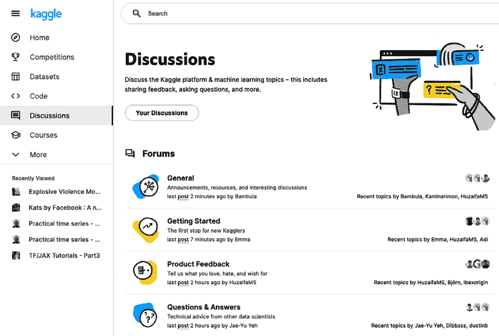
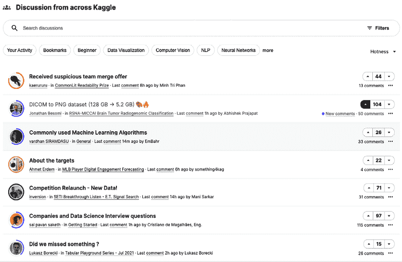
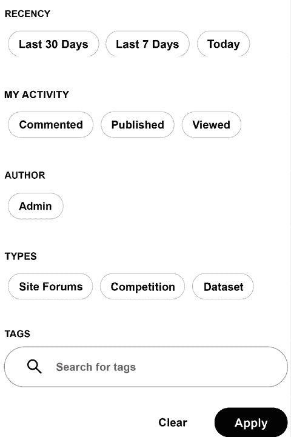
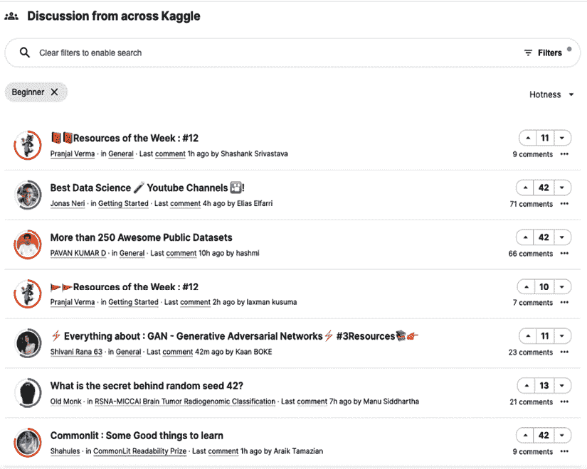
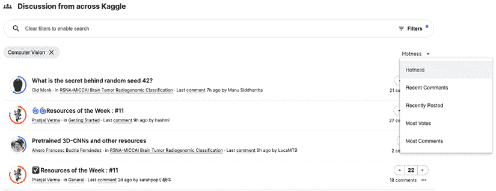
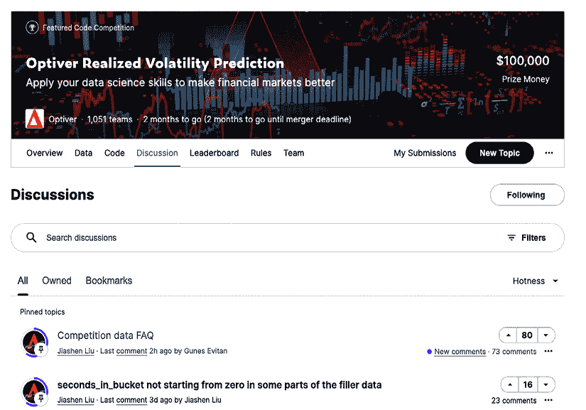
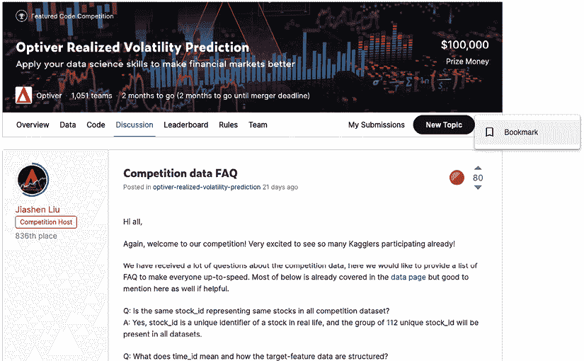
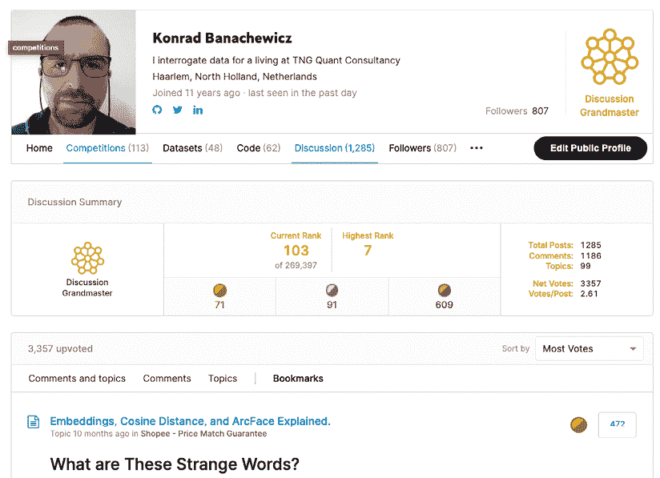

# 4

# 利用讨论论坛

讨论论坛是 Kaggle 上信息交流的主要手段。无论是讨论正在进行的竞赛，还是关于数据集或笔记本的对话，Kagglers 总是在谈论事情。

在本章中，我们介绍了讨论论坛：它们的组织方式以及管理其中丰富信息的守则。我们涵盖了以下主题：

+   论坛如何运作

+   竞赛讨论的方法

+   网络礼仪

# 论坛如何运作

您可以通过多种方式进入讨论论坛。最直接的方式是在左侧面板中点击**讨论**：

图 4.1：从主菜单进入讨论页面

顶部部分包含**论坛**，它们是一般主题的聚合。浏览这些内容对您来说很有用，无论您是第一次参加竞赛，还是提出建议，或者只是因为感到迷茫而有一个一般性的问题。

在论坛下方，您可以找到 Kaggle 上讨论的合并视图：主要是与竞赛相关的对话（这构成了 Kaggle 上大部分的活动），但也包括笔记本或值得注意的数据集。默认情况下，它们按**热度**排序；换句话说，参与度和活动量最高的内容显示在顶部附近。在这个部分，您可以找到与该领域动态性质更相关的内容：来自 Kaggle 不同子集的讨论集合，您可以根据特定标准进行筛选：

图 4.2：来自 Kaggle 的讨论

根据您的兴趣，您可以通过使用筛选器开始个性化内容。根据您的偏好，您可以按以下方式筛选：

+   **最近性**：允许您控制您正在追赶的信息范围

+   **我的活动**：如果您需要查看所有论坛中的评论/出版物/观点的概览；如果您同时参与多个讨论，这将非常有用

+   **管理员**：提供 Kaggle 管理员公告的快速概览

+   **类型**：讨论可以在一般论坛、特定竞赛或数据集周围进行

+   **标签**：虽然并非无处不在，但有几个讨论被标记，并且这种功能允许用户利用这一事实：

图 4.3：讨论可用的筛选器

下一个图显示了在**初学者**标签上筛选讨论的示例输出：

图 4.4：筛选标记为“初学者”的讨论

作为一种替代，你也可以专注于一个特定的主题；由于像计算机视觉这样的主题吸引了大量关注，因此对主题进行排序可能是有用的。你可以按**热度**、**最近评论**、**最近发布**、**最多投票**和**最多评论**排序：

图 4.5：通用讨论论坛中的计算机视觉主题子集

人们来到 Kaggle 出于各种原因，但尽管 Notebooks 的流行度有所增长，比赛仍然是主要的吸引力。每个 Kaggle 比赛都有自己的专用讨论论坛，你可以通过进入比赛页面并选择**讨论**来进入：

图 4.6：比赛的讨论论坛

并非总是如此，但如今几乎所有的比赛都在其专用讨论论坛的顶部固定了一个 FAQ 主题。从这里开始是两个主要原因的好主意：

+   这可以节省你的时间；最流行的查询可能在那里得到了解答。

+   你可以避免在论坛的其余部分提出重复或重复的问题，从而使每个人的体验都变得更好。

与 Notebooks 一样，讨论论坛有一个选项，允许你将特别相关的主题标记为书签以供以后参考：

图 4.7：在讨论论坛中标记一个主题

你可以在个人资料页面上找到所有标记主题的概述：

图 4.8：在讨论论坛中标记一个主题

# 示例讨论方法

在某个时刻在比赛中感到迷茫是完全正常的事情：你来了，尝试了一些想法，在排行榜上获得了一些进展，然后你遇到了 Kaggle 版本的跑步者墙。这是讨论论坛成为咨询场所的时刻。

例如，我们将查看*Optiver 实现波动率预测*比赛([`www.kaggle.com/c/optiver-realized-volatility-prediction`](https://www.kaggle.com/c/optiver-realized-volatility-prediction))，组织者是这样描述的：

> 在这个比赛的最初三个月，你将构建预测不同行业数百只股票短期波动的模型。你将拥有数亿行高度细粒度的金融数据在你的指尖，你将利用这些数据设计你的模型，预测 10 分钟期间的波动。你的模型将在训练后的三个月评估期内收集的真实市场数据上进行评估。

这里有很多东西需要解释，因此我们将概述这个挑战的主要组成部分，并展示它们如何通过讨论论坛来处理。首先，参加这个比赛需要一定程度的金融知识；可能不是经验丰富的交易员水平，但理解计算波动性的不同方式对于外行人来说当然不是微不足道的（在这个特定问题上，大多数 Kagglers 都是外行人）。幸运的是，对于参赛者来说，组织者在比赛期间非常活跃，并提供了旨在帮助新进入该领域的人的资源：[`www.kaggle.com/c/optiver-realized-volatility-prediction/discussion/273923`](https://www.kaggle.com/c/optiver-realized-volatility-prediction/discussion/273923)。

如果入门知识仍然不足以开始，请不要犹豫，在公共场合弄清楚事情并寻求帮助，就像这里：[`www.kaggle.com/c/optiver-realized-volatility-prediction/discussion/263039`](https://www.kaggle.com/c/optiver-realized-volatility-prediction/discussion/263039)。

或者这里：[`www.kaggle.com/c/optiver-realized-volatility-prediction/discussion/250612`](https://www.kaggle.com/c/optiver-realized-volatility-prediction/discussion/250612)。

随着比赛的进行，人们开始开发越来越复杂的模型来处理这个问题。这里需要找到一个平衡点：一方面，如果你从分享发现的前辈那里学到了东西，你可能想回馈一些东西；另一方面，你不想通过发布所有优秀的代码作为笔记本来泄露你的（潜在的）优势。一个合理的折衷方案是在论坛比赛的帖子中讨论，例如，你的特征想法，就像这个帖子一样：[`www.kaggle.com/c/optiver-realized-volatility-prediction/discussion/273915`](https://www.kaggle.com/c/optiver-realized-volatility-prediction/discussion/273915)。

近年来，越来越多的比赛正在摆脱固定的测试数据集格式，并引入某种变化：有时它们强制使用 Kaggle API（这些比赛需要从笔记本提交），其他则引入一个特殊的日程表，分为训练阶段和对实时数据的评估。Optiver 就是这种情况：

> 在最终提交截止日期之后，将定期更新排行榜，以反映将针对所选笔记本运行的市场数据更新。更新将大约每两周进行一次，并调整以避免冬季假期。

虽然制定起来很简单，但这种设置在重新训练和更新模型时产生了一些挑战。如果你遇到这种情况，请随时提问，就像在这个比赛中参赛者所做的那样：[`www.kaggle.com/c/optiver-realized-volatility-prediction/discussion/249752`](https://www.kaggle.com/c/optiver-realized-volatility-prediction/discussion/249752)。

在 Kaggle 竞赛中，为你的训练模型制定一个**验证方案**始终是一个重要的话题，通常与永久的“CV vs LB”（交叉验证与排行榜）讨论相结合。Optiver 竞赛也不例外：[`www.kaggle.com/c/optiver-realized-volatility-prediction/discussion/250650`](https://www.kaggle.com/c/optiver-realized-volatility-prediction/discussion/250650)。

除非已经存在这样的帖子——并且检查一下总是个好主意，以最大限度地减少冗余——你可能还想考虑一种相关的帖子类型：单一模型性能。迟早，每个人都会开始使用模型集成，但没有好的单一模型组件，它们效率并不高。对知识的协作追求不会就此停止：如果你认为你找到了处理问题的更好方法，分享它可能是个好主意。要么你会为他人做些有用的事情，要么你会发现自己错了（节省你的时间和精力）；无论如何，正如这个讨论所示，这是一个胜利，例如：[`www.kaggle.com/c/optiver-realized-volatility-prediction/discussion/260694`](https://www.kaggle.com/c/optiver-realized-volatility-prediction/discussion/260694)。

除了显而易见的个人好处（你可以窥见其他竞争对手的表现），这样的帖子还允许社区内进行信息交流，促进协作元素，对初学者也有帮助。这样的讨论例子可以在[`www.kaggle.com/c/optiver-realized-volatility-prediction/discussion/250695`](https://www.kaggle.com/c/optiver-realized-volatility-prediction/discussion/250695)找到。

如果你已经阅读了上述话题，你仍然可能会想知道：*我遗漏了什么重要的东西吗？* Kaggle 是一个可以完美提问的地方：[`www.kaggle.com/c/optiver-realized-volatility-prediction/discussion/262203`](https://www.kaggle.com/c/optiver-realized-volatility-prediction/discussion/262203)。

让我们拓宽我们的关注范围，到其他竞赛来结束这一部分。我们上面提到了验证，这对于 Kaggler 来说总是与信息泄露和过拟合的话题相关联。在第六章中广泛讨论了泄露问题，该章节专门讨论设计验证方案。在这里，我们简要地讨论了它们是如何通过讨论来处理的。由于 Kaggle 是一个好奇的人组成的社区，如果有泄露的怀疑，有人很可能会提出这个话题。

例如，文件名或记录的 ID 可能包含时间戳，这意味着它们可以被逆向工程，有效地窥视未来，并产生一个不切实际的低误差指标值。这种情况发生在*Two Sigma Connect*竞赛中([`www.kaggle.com/c/two-sigma-connect-rental-listing-inquiries/`](https://www.kaggle.com/c/two-sigma-connect-rental-listing-inquiries/))。你可以在 Kazanova 的帖子中了解更多详情：[`www.kaggle.com/c/two-sigma-connect-rental-listing-inquiries/discussion/31870#176513`](https://www.kaggle.com/c/two-sigma-connect-rental-listing-inquiries/discussion/31870#176513)。

另一个例子是*空中客车船检测挑战赛*([`www.kaggle.com/c/airbus-ship-detection`](https://www.kaggle.com/c/airbus-ship-detection))，参赛者需要在卫星图像中定位船只。结果发现，相当一部分测试图像是训练图像中的随机裁剪，匹配这两者相对简单：[`www.kaggle.com/c/airbus-ship-detection/discussion/64355#377037`](https://www.kaggle.com/c/airbus-ship-detection/discussion/64355#377037)。

一系列相当臭名昭著的竞赛是由桑坦德银行赞助的。在这家公司组织的三次 Kaggle 竞赛中，两次涉及数据泄露：[`www.kaggle.com/c/santander-value-prediction-challenge/discussion/61172`](https://www.kaggle.com/c/santander-value-prediction-challenge/discussion/61172)。

接下来发生的事情因竞赛而异：有几次 Kaggle 决定用新的或清理后的数据重置竞赛，但也有时候他们允许竞赛继续（因为他们认为影响很小）。处理这种情况的一个例子可以在*预测红帽商业价值*竞赛中找到：[`www.kaggle.com/c/predicting-red-hat-business-value/discussion/23788`](https://www.kaggle.com/c/predicting-red-hat-business-value/discussion/23788)。

尽管数据泄露可能会严重扰乱竞赛，但好消息是，在过去的 2-3 年里，Kaggle 上的数据泄露几乎已经消失——所以，希望这部分内容只会被阅读一次，而不会成为你在平台上经验的常态。

在平台上经验的主题是进行大师访谈的一个很好的过渡。

谢一帆

[`www.kaggle.com/yifanxie`](https://www.kaggle.com/yifanxie)

**谢一帆**是一位讨论和竞赛大师，同时也是 Arion.ai 的联合创始人。以下是他对参加竞赛和与其他 Kagglers 合作的一些看法。

你最喜欢的竞赛类型是什么？为什么？在技术和解决方法方面，你在 Kaggle 上的专长是什么？

*我实际上没有特别喜欢的类型；我喜欢解决各种类型的问题。在技术方面，我已经建立了一个坚实的机器学习模块流水线，使我能够快速地将典型技术和算法应用于大多数数据问题。我认为这对我来说是一种竞争优势：专注于标准化，无论是工作流程还是随着时间的推移技术工件。这允许更快地进行迭代，从而有助于提高进行数据实验的效率，这是 Kaggle 的核心组成部分。*

你是如何处理 Kaggle 竞赛的？这种处理方式与你在日常工作中所做的是如何不同的？

*随着时间的推移，我发展了一种特定的方式来管理和收集我大多数主要数据项目的信息。这适用于工作、Kaggle 竞赛和其他副项目。通常，我会以标准化的格式捕获有用的信息，如书签、数据字典、待办事项列表、有用的命令和实验结果，并为每个竞赛分配一个格式，当在团队中竞赛时，我会与我的队友分享这些信息。*

请告诉我们你参加的一个特别具有挑战性的竞赛，以及你使用了哪些见解来处理这项任务？

*对我来说，了解竞赛的更广泛背景总是很有用的；例如，支撑和产生我们正在工作的数据的社交/工程/金融流程是什么？对于可以有意义地观察个别数据点的竞赛，例如*深度伪造检测挑战赛*，我会构建一个特定的仪表板（通常使用 Streamlit），使我能够检查个别数据点（在这种情况下，是一对真实和虚假的视频），以及将简单的统计收集整合到仪表板中，以便我更好地了解数据。*

Kaggle 是否帮助你在职业生涯中取得进步？如果是，是如何帮助的？

*我认为 Kaggle 是我作为数据科学咨询公司共同所有者的当前职业道路中最有帮助的平台。它使我能够在几年内建立解决不同领域数据问题的技能和方法。我从 Kaggle 竞赛的团队组建中认识了一些客户和同事，尽管我现在在 Kaggle 上的活动较少，但它始终是我知识来源的好帮手。*

在你的经验中，没有经验的 Kaggle 参赛者通常忽略了什么？你现在知道什么，而当时你刚开始时希望知道的？

*对于 Kaggle 的新手来说，我能看到的错误是忽略了关键的非技术问题：团队规则、数据使用、私人信息的共享、出于无害原因使用多个账户等。这些错误可能会完全无效化一个人通常需要数月才能完成的竞赛努力。*

*我最初希望知道的一件事就是不要担心在公共排行榜上的日常位置——这给自己带来了不必要的压力，并导致过度拟合。*

对于数据分析或机器学习，有没有任何特定的工具或库推荐使用？

*通常：Scikit-learn、XGB/LGB、PyTorch 等。我推荐大家学习并精通的一个工具是 NumPy，特别是对于更高级的信息排序和子集操作；这些是 pandas 通过懒惰方法可以轻松完成的事情，但 NumPy 中的更复杂版本会带来更高的效率。*

当人们参加竞赛时，他们应该牢记或做些什么最重要的事情？

*在我的书中，从事任何数据科学相关工作的原因有四个：为了盈利、为了知识、为了乐趣和为了公益。对我来说，Kaggle 始终是一个知识宝库，而且经常是一个很好的记忆来源，所以我的建议总是提醒自己，排名是暂时的，但知识和记忆是永恒的：)*

你是否使用其他竞赛平台？它们与 Kaggle 相比如何？

*我是一个* *非常活跃的 Numerai 参与者。对我来说，基于我从事数据科学的四个原因，它更多的是为了盈利，因为他们通过其加密货币提供收益。它更多的是一种个人努力，因为在像 Numerai 这样的交易竞赛平台上，团队协作并没有真正的好处；他们既不鼓励也不禁止，但就是这样，更多的人力资源并不总是等同于更好的盈利。*

*对我来说，在忙碌的工作日程期间，Numerai 比 Kaggle 更可持续，因为每轮的训练数据通常保持不变，我可以在构建初始模型后实现高度的生产化，以自动化预测和提交。*

*Numerai 的连续性功能使其更适合那些想要为表格数据集构建专用机器学习管道的人。*

# 网络礼仪

任何在线超过 15 分钟的人都知道这一点：在讨论中，无论话题多么无辜，总有可能人们会变得情绪化，对话会离开文明光谱的文明部分。Kaggle 也不例外，因此社区有适当的举止指南：[`www.kaggle.com/community-guidelines`](https://www.kaggle.com/community-guidelines)。

这些原则不仅适用于讨论，也适用于 Notebooks 和其他形式的沟通。在 Kaggle 互动时，你应该牢记以下要点：

+   不要陷入斯科特·亚当斯所说的**心灵感应错觉**：Kaggle 是一个来自世界各地（其中许多人英语不是他们的第一语言）的极其多样化的社区，所以保持细微差别是一个巨大的挑战。不要做出假设，并在可能的情况下尝试澄清。

+   不要让事情变得个人化；上帝 wins 定律有其存在的理由。特别是，对受保护的不变特征的引用是一个绝对不能触碰的区域。

+   你的里程可能不同，但事实仍然是：这并非 1990 年代的互联网狂野西部，当时在网上告诉某人去查阅手册（RTFM）是完全正常的；贬低往往会疏远人们。

+   不要试图操纵进度系统（这是授予 Kaggle 奖牌的基础）：这一方面涵盖了平台滥用的整个范围，从明确要求点赞，到串通，再到直接的作弊行为。

简而言之，以你希望别人如何对待你的方式对待他人，事情应该会顺利解决。

# 摘要

在本章中，我们讨论了讨论论坛，这是 Kaggle 平台上主要的沟通方式。我们展示了论坛的机制，向你展示了如何在更高级的比赛中利用讨论的例子，并简要总结了讨论的礼仪。

这本书的第一部分，也就是介绍部分到此结束。下一章标志着对如何最大化从 Kaggle 中获得收益的更深入探索的开始，并探讨了如何应对比赛中必须应对的众多不同任务和指标。

# 加入我们书籍的 Discord 空间

加入书籍的 Discord 工作空间，每月与作者进行一次“问我任何问题”的会议：

[`packt.link/KaggleDiscord`](https://packt.link/KaggleDiscord)

