# 6

# 设计良好的验证

在 Kaggle 竞赛中，在建模和提交结果的紧张时刻，可能会觉得只从排行榜上得到的结果就足够了。最终，你可能会认为在比赛中重要的是你的排名。这是一个在比赛中反复犯下的常见错误。实际上，直到比赛结束后，你才知道实际的排行榜（私有部分）是什么样的，而且信任它的公开部分是不明智的，因为它往往具有误导性。

在本章中，我们将向您介绍在数据竞赛中**验证**的重要性。您将了解：

+   过拟合是什么以及公开排行榜可能具有误导性

+   恐怖的震动

+   不同的验证策略

+   对抗性验证

+   如何发现并利用泄露

+   当选择最终提交时，你的策略应该是什么

在建模时监控你的表现，以及在何时发生过拟合时进行区分，这不仅是在数据科学竞赛中，而且在所有数据科学项目中的一项关键能力。正确验证你的模型是你可以从 Kaggle 竞赛中学到并能在专业世界中再次出售的最重要技能之一。

# 排行榜上的窥探

如我们之前所述，在每一场比赛中，Kaggle 将测试集分为一个**公开部分**，这部分在实时排行榜上可视化，以及一个**私有部分**，这部分将用于计算最终分数。这些测试部分通常是随机确定的（尽管在时间序列比赛中，它们是基于时间确定的）并且整个测试集发布时不会区分公开和私有。

最近，为了防止某些比赛中对测试数据的审查，Kaggle 甚至推迟了测试数据的发布，只提供一些示例，并在提交时用真实的测试集替换它们。这些被称为**代码**竞赛，因为你实际上并没有提供预测本身，而是一个包含生成这些预测的代码的笔记本。

因此，从模型中得出的提交将覆盖整个测试集，但只有公开部分会立即评分，而私有部分的评分将留待比赛结束后进行。

基于此，出现了三个考虑因素：

+   为了使比赛能够正常进行，训练数据和测试数据应来自**相同的分布**。此外，测试数据的公开和私有部分在分布上应该相似。

+   即使训练数据和测试数据显然来自相同的分布，但任一集中**示例不足**可能会使得在训练数据和公开以及私有测试数据之间获得一致的结果变得困难。

+   公共测试数据应被视为数据科学项目中的一个保留测试：仅用于最终验证。因此，不应过多查询，以避免所谓的**适应性过拟合**，这意味着模型在特定测试集上表现良好，但在其他测试集上表现不佳。

考虑这三个因素对于理解比赛的动态至关重要。在大多数比赛中，讨论论坛中总是有很多关于训练、公共和私有测试数据之间如何相互关联的问题，而且看到基于公共排行榜有效性评估的数百个解决方案的提交是非常常见的。

人们也常常听到关于**动荡**的讨论，这些讨论可能会彻底改变排名。实际上，这些动荡是对最终排名的一种重新排列，可能会让许多之前在公共排行榜上排名更好的人感到失望。据传闻，动荡通常归因于训练集和测试集之间或测试数据的私有部分和公共部分之间的差异。它们是根据竞争者如何看到他们的预期局部得分与排行榜反馈的相关性进行**事前**评估的，并通过一系列基于两个数字的分析进行**事后**评估：

+   基于平均（绝对值（私有排名-公共排名）/队伍数量）的总体动荡数字

+   排名前列的动荡人物，仅考虑公共排名的前 10%

这些**事后**数字最初是由**Steve Donoho**（[`www.kaggle.com/breakfastpirate`](https://www.kaggle.com/breakfastpirate)）提出的，他编制了一个最糟糕的 Kaggle 动荡排名（见[`www.kaggle.com/c/recruit-restaurant-visitor-forecasting/discussion/49106#278831`](https://www.kaggle.com/c/recruit-restaurant-visitor-forecasting/discussion/49106#278831)）。如今，这些数字很容易通过基于我们在第五章“比赛任务和度量”中讨论的 Meta Kaggle 数据集的许多 Notebooks 重新创建。例如，通过查阅这些数字，你可能会发现由于动荡，特别是顶尖位置上的动荡，*RSNA 颅内出血检测*比赛对许多人来说是多么可怕。

然而，除了**事后**评估之外，我们还可以从之前的动荡中获得很多教训，这些教训可以帮助你在 Kaggle 比赛中取得成功。加州大学伯克利分校的一些研究人员也这样认为。在 2019 年 NIPS 会议上，Roelofs、Fridovich-Keil 等人详细研究了数千个 Kaggle 比赛，以深入了解 Kaggle 比赛中的公共-私有排行榜动态。尽管他们关注的是有限的比赛子集（120 个以上参与者，专注于二元分类），但他们获得了一些有趣的发现：

+   很少有自适应过拟合；换句话说，公共排名通常在未公开的私有排行榜中是成立的。

+   大多数动荡都是由于随机波动和过度拥挤的排名造成的，竞争对手彼此过于接近，任何在私有测试集中的性能的微小变化都会导致排名的重大变化。

+   当训练集非常小或训练数据不是**独立同分布**（**i.i.d.**）时，就会发生动荡。

Roelofs, R.，Fridovich-Keil, S.等人撰写的关于机器学习过拟合的元分析全文，可在以下链接找到：[`papers.nips.cc/paper/2019/file/ee39e503b6bedf0c98c388b7e8589aca-Paper.pdf`](https://papers.nips.cc/paper/2019/file/ee39e503b6bedf0c98c388b7e8589aca-Paper.pdf)。

然而，在我们的 Kaggle 比赛长期经验中，我们从一开始就看到了许多自适应过拟合的问题。例如，你可以阅读*Greg Park*对我们最初参加的其中一场比赛的分析：[`gregpark.io/blog/Kaggle-Psychopathy-Postmortem/`](http://gregpark.io/blog/Kaggle-Psychopathy-Postmortem/)。由于这是许多 Kagglers 的相当常见且持久的问题，我们建议一种比简单地跟随公共排行榜发生的事情更为复杂的策略：

+   总是构建可靠的交叉验证系统进行本地评分。

+   总是尝试使用最佳验证方案控制非-i.i.d.分布，该方案由具体情况决定。除非在比赛描述中明确说明，否则识别非-i.i.d.分布并不容易，但你可以通过讨论或通过使用分层验证方案（例如，根据某个特征进行分层时，结果会显著改善）来获得提示。

+   将本地评分与公共排行榜相关联，以确定它们是否朝同一方向移动。

+   使用对抗验证进行测试，以揭示测试分布是否与训练数据相似。

+   使用集成使你的解决方案更加鲁棒，特别是如果你正在处理小型数据集。

在接下来的章节中，我们将探讨这些想法（除了集成，这是未来章节的主题）并为你提供所有最佳的工具和策略，以获得最佳结果，尤其是在私有数据集上。

# 在比赛中验证的重要性

如果你仔细思考一场比赛，你可以将其想象为一个巨大的实验系统。能够创造出最系统、最有效运行这些实验方式的人将获胜。

事实上，尽管你拥有所有的理论知识，你仍将与其他数百或数千名数据专业人士竞争，他们的能力与你或多或少相当。

此外，他们将与您使用完全相同的数据，以及大致相同的工具来从数据中学习（TensorFlow、PyTorch、Scikit-learn 等）。有些人肯定能更好地获取计算资源，尽管 Kaggle Notebooks 的可用性和云计算价格的普遍下降意味着差距不再那么大。因此，如果您观察知识、数据、模型和可用计算机之间的差异，您不会在您和其他竞争对手之间找到许多区分因素，这些因素可以解释比赛中巨大的性能差异。然而，一些参与者持续优于其他人，这表明存在一些潜在的成功的因素。

在访谈和聚会中，一些 Kagglers 将这个成功因素描述为“毅力”，其他人则将其描述为“尝试一切”，还有一些人将其描述为“愿意把所有东西都投入到比赛中”。这些可能听起来有点模糊和神奇。相反，我们称之为**系统实验**。在我们看来，成功参与的关键在于您进行的实验数量以及您运行所有实验的方式。您进行的实验越多，您就越有可能比其他参与者更好地解决该问题。这个数量当然取决于几个因素，例如您可用的空闲时间、您的计算资源（越快越好，但正如我们之前提到的，这本身并不是一个如此强烈的区分因素），您团队的大小以及他们在任务中的参与度。这与通常报道的毅力和参与度作为成功的关键是一致的。

然而，这些并不是影响结果唯一因素。您必须考虑到您进行实验的方式也会产生影响。“快速失败并从中学习”是竞争中一个重要的因素。当然，您在失败和成功时都需要仔细反思，以便从经验中学习，否则您的比赛可能只是变成了一系列随机的尝试，希望找到正确的解决方案。

因此，在所有其他条件相同的情况下，拥有一个合适的**验证策略**是成功 Kaggle 竞争者和那些只是过度拟合排行榜、比赛后排名低于预期的人之间的重要区分因素。

**验证**是您用来正确评估模型产生的错误以及根据您的实验来衡量其性能如何提高或降低的方法。

通常情况下，选择合适的验证方法的影响往往被忽视，而更倾向于考虑更多量化因素，例如拥有最新、最强大的 GPU 或一个能提交更多作品的更大团队。

然而，如果你只依赖实验的力量以及它们在排行榜上的结果，那就好比“向墙上扔泥巴，希望有什么东西能粘上去”（参见 [`gregpark.io/blog/Kaggle-Psychopathy-Postmortem/`](http://gregpark.io/blog/Kaggle-Psychopathy-Postmortem/)）。有时这样的策略会奏效，但大多数时候不会，因为你将错过在正确方向上进行实验的重要机会，甚至无法看到你在所有泥巴中找到的闪亮的宝石。例如，如果你过于专注于使用随机、非系统的策略在公共排行榜上碰运气，即使你产生了伟大的解决方案，你也可能最终无法正确选择你的最终提交，并错过私有排行榜上得分最高的一个。

拥有一个合适的验证策略可以帮助你决定哪些模型应该提交到私有测试集进行排名。尽管提交你最高公共排行榜模型的诱惑可能很大，但*始终考虑你自己的验证分数*。对于你的最终提交，根据具体情况以及你是否信任排行榜，基于排行榜选择你的最佳模型，基于你的本地验证结果选择你的最佳模型。如果你不信任排行榜（尤其是当训练样本很小或示例是非独立同分布时），提交具有两个最佳验证分数的模型，选择两个非常不同的模型或集成。这样，你将降低选择在私有测试集上无法表现良好的解决方案的风险。

指出了拥有实验方法的重要性之后，剩下的所有问题都变成了验证的实用性问题。实际上，当你对一个解决方案进行建模时，你需要做出一系列相互关联的决定：

1.  如何处理你的数据

1.  应该应用哪种模型

1.  如何更改模型的架构（尤其是对于深度学习模型）

1.  如何设置模型的超参数

1.  如何后处理预测

即使公共排行榜与私有排行榜完全相关，每天提交数量的限制（所有比赛中都存在的限制）也阻止你触及上述所有可能测试的表面。拥有一个合适的验证系统会提前告诉你你所做的是否能在排行榜上工作。


Dmitry Larko

[`www.kaggle.com/dmitrylarko`](https://www.kaggle.com/dmitrylarko)

**Dmitry Larko** 是 Kaggle 竞赛的大师级选手，同时也是 H2O.ai 的首席数据科学家。他在机器学习和数据科学领域拥有超过十年的经验。他在 2012 年 12 月发现了 Kaggle，并在几个月后参加了他的第一个比赛。他是 Kaggle 竞赛中验证的强烈倡导者，正如他在采访中告诉我们的。

你最喜欢的比赛类型是什么？为什么？在 Kaggle 上，你在技术和解决方法方面有什么专长？

*我主要参加了表格数据集的比赛，但也喜欢参加计算机视觉的比赛。*

你是如何处理 Kaggle 比赛的？这种方法与你在日常工作中所做的方法有何不同？

*我总是尝试从简单开始，为较小的/较简单的模型首先构建一个提交流程。这里的一个重要步骤是创建一个适当的验证方案，这样你可以以稳健的方式验证你的想法。此外，花尽可能多的时间查看和分析数据始终是一个好主意。*

*在我的日常工作中，我正在构建一个 AutoML 平台，所以我在 Kaggle 上尝试的许多事情最终都成为了这个平台的一部分。*

告诉我们你参加的一个特别具有挑战性的比赛，以及你使用了哪些见解来应对这项任务。

*我脑海中没有想出什么，这无关紧要，因为对我来说技术上具有挑战性的事情可能对其他人来说是小菜一碟。技术挑战并不那么重要；重要的是要记住，比赛在一定程度上类似于马拉松，而不是短跑。或者如果你喜欢，你可以将其视为一系列的短跑。因此，重要的是不要过度疲劳，保证充足的睡眠，进行锻炼，并在公园散步以恢复大脑，激发新想法。要赢得 Kaggle 比赛，你需要所有的创造力和专业知识，有时甚至需要一点运气。*

Kaggle 是否帮助你在职业生涯中取得进步？如果是的话，是如何帮助的？

*我之所以得到现在的工作，是因为我是 Kaggle 竞赛的大师。对我现在的雇主来说，这一点已经足以证明我在该领域的专业知识。*

在你的经验中，没有经验的 Kagglers 通常忽略了什么？你现在知道什么，而当你刚开始时希望知道的呢？

*他们通常忽略了正确的验证方案，并跟随公共排行榜的反馈。在大多数情况下，这会导致所谓的 Kaggle 上的“震动”。*

*此外，他们急于跳过探索性数据分析，直接构建模型，这导致了解决方案简单化以及排行榜分数平庸。*

你在过去比赛中犯过哪些错误？

*我犯的主要错误实际上与一个没有经验的人会犯的错误是一样的——跟随排行榜分数而不是我的内部验证。每次我决定这样做，都会让我在排行榜上失去几个位置。*

你有没有推荐用于数据分析或机器学习的特定工具或库？

*那通常是常见的几种方法。对于表格数据：LightGBM、XGBoost、CatBoost；对于深度学习：PyTorch、PyTorch-Lightning、timm；以及 Scikit-learn 适用于所有人。*

当人们参加比赛时，他们应该记住或做哪件事是最重要的？

*从简单开始，始终进行验证；相信你的验证分数，而不是排行榜分数。*

## 偏差和方差

一个好的验证系统会帮助你获得比从训练集中得到的错误度量更可靠的指标。实际上，从训练集中获得的指标会受到每个模型容量和复杂性的影响。你可以将模型的**容量**视为其可以用来从数据中学习的内存。

每个模型都有一组内部参数，帮助模型记录从数据中提取的模式。每个模型都有其获取模式的能力，一些模型会注意到某些规则或关联，而其他模型会注意到其他规则。当模型从数据中提取模式时，它会将其记录在“记忆”中。

你也会听到关于模型的容量或表达性，作为**偏差和方差**的问题。在这种情况下，模型的偏差和方差指的是预测，但基本原理严格与模型的表达性相关。模型可以被简化为将输入（观察到的数据）映射到结果（预测）的数学函数。一些数学函数比其他函数更复杂，这体现在它们内部参数的数量以及它们使用参数的方式：

+   如果模型的数学函数不够复杂或表达性不足以捕捉你试图解决的问题的复杂性，我们谈论的是**偏差**，因为你的预测将受到模型自身限制（“偏差”）的影响。

+   如果模型核心的数学函数对于当前问题来说过于复杂，我们就遇到了**方差**问题，因为模型会记录比所需更多的训练数据细节和噪声，其预测将深受其影响并变得不可预测。

现在，考虑到机器学习的进步和可用的计算资源，问题总是由于方差，因为深度神经网络和梯度提升，最常用的解决方案，通常具有超过大多数你将面临的问题解决所需数学表达性。

当某个模型能够提取的所有有用模式都被捕捉到后，如果模型尚未耗尽其容量，它将开始记忆与预测无关的数据特征和信号（通常称为**噪声**）。虽然最初提取的模式将帮助模型泛化到测试数据集并更准确地预测，但并非它从训练集中学习到的所有特定内容都有帮助；相反，它可能会损害其性能。学习没有泛化价值的训练集元素的过程通常被称为**过拟合**。

验证的核心目的是明确定义一个分数或损失值，将这个值中可泛化的部分与由于过度拟合训练集特征而产生的部分分开。

这就是**验证损失**。你可以在以下学习曲线图中看到这种情况的可视化：

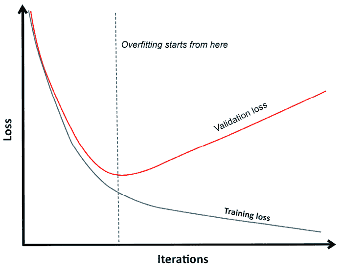

图 6.1：从训练数据中学习更多并不总是意味着学习预测

如果你将损失度量在 y 轴上与模型学习努力的某个度量（这可能是神经网络的 epoch，或梯度提升的 round）在 x 轴上作图，你会注意到学习似乎总是在训练数据集上发生，但这种情况并不总是适用于其他数据。

即使你更改超参数、处理数据或完全决定使用不同的模型，这种情况也会发生。曲线的形状会改变，但你总会找到一个甜蜜点，即过拟合开始的地方。这个点在不同的模型和你在建模过程中所做的各种选择之间可能不同。如果你通过正确的验证策略正确地计算了过拟合开始的时间点，你的模型性能将肯定与排行榜结果（公开和私人）相关联，并且你的验证指标将为你提供一个评估你工作的代理，而无需提交任何内容。

你可以在各个层面上听到过拟合：

+   在训练数据层面，当你使用一个对于问题过于复杂的模型时

+   在验证集本身层面，当你过度调整你的模型以适应特定的验证集时

+   在公开排行榜层面，当你的结果远远低于你从训练中预期的结果时

+   在私人排行榜层面，尽管在公开排行榜上取得了好成绩，但你的私人分数可能会令人失望。

虽然在意义上略有不同，但它们都同样意味着你的模型不可泛化，正如我们在本节中描述的那样。

# 尝试不同的分割策略

如前所述，验证损失是基于一个不属于训练集的数据样本。这是一个经验度量，告诉你你的模型在预测方面有多好，比从训练中得到的分数更准确，后者主要告诉你你的模型有多少是记忆了训练数据模式。正确选择用于验证的数据样本构成了你的验证策略。

为了总结验证模型和正确衡量其性能的策略，你有几个选择：

+   第一种选择是**使用保留系统**，这可能会带来风险，即未能正确选择数据的代表性样本或过度拟合到你的验证保留数据。

+   第二种选择是**使用概率方法**并依赖于一系列样本来得出你对模型的结论。在概率方法中，有交叉验证、**留一法**（LOO）和自助法。在交叉验证策略中，根据你基于数据特征（简单随机抽样、分层抽样、分组抽样、时间抽样）采取的抽样策略，有不同的细微差别。

所有这些策略的共同之处在于它们都是**采样策略**。这意味着它们帮助你根据你数据的一小部分（随机选择的）来推断一个总体指标（你模型的性能）。采样是统计学的根本，它不是一个精确的过程，因为基于你的采样方法、可用数据和选择某些案例作为样本部分的随机性，你将经历一定程度的误差。

例如，如果你依赖于有偏见的样本，你的评估指标可能会被错误地估计（高估或低估）。然而，如果设计得当并实施得当，采样策略通常能为你提供对你总体指标的较好估计。

所有这些策略的另一个共同之处在于它们都是**分割**，它们以排他的方式将案例分为训练部分或验证部分。实际上，正如我们讨论的，由于大多数模型都有一定的记忆能力，在训练和验证中使用相同的案例会导致估计过高，因为这允许模型展示其记忆能力；相反，我们希望它能够被评估其从*未见*示例中推导出模式和函数的能力。

## 基本的训练-测试分割

我们将要分析的第一种策略是**训练-测试分割**。在这种策略中，你从你的训练集中采样一部分（也称为**保留集**），并使用它作为所有使用剩余数据部分训练的模型的测试集。

这种策略的巨大优势在于它非常简单：你选择你数据的一部分，并在那部分上检查你的工作。你通常将数据分成 80/20，以利于训练部分。在 Scikit-learn 中，这是在`train_test_split`函数中实现的。我们将关注该方法的一些方面：

+   当你拥有大量数据时，你可以预期你提取的测试数据与整个数据集上的原始分布相似（具有代表性）。然而，由于提取过程基于随机性，你总是有可能提取一个不具有代表性的样本。特别是，如果起始的训练样本很小，这种可能性会增加。使用**对抗验证**（在接下来的几节中会详细介绍）比较提取的保留部分可以帮助你确保你以正确的方式评估你的努力。

+   此外，为确保你的测试样本具有代表性，特别是关于训练数据与目标变量之间的关系，你可以使用**分层**，这确保了在样本数据中某些特征的占比得到尊重。你可以在`train_test_split`函数中使用`stratify`参数，并提供一个包含类别分布的数组以保留。

我们必须指出，即使你有可用的代表性保留集，有时简单的训练-测试分割不足以确保在比赛中正确跟踪你的努力。

事实上，随着你继续检查这个测试集，你可能会将你的选择推向某种适应过拟合（换句话说，错误地将训练集的噪声作为信号），就像你在公共排行榜上频繁评估时发生的那样。因此，尽管概率评估在计算上更昂贵，但它更适合比赛。

## 概率评估方法

概率评估机器学习模型的性能基于分布样本的统计特性。通过采样，你创建了一个较小的原始数据集，它预期具有相同的特征。此外，采样中未被触及的部分本身也构成一个样本，并且预期具有与原始数据相同的特征。通过在采样的数据上训练和测试你的模型，并重复这一过程多次，你基本上创建了一个统计估计器，用于衡量你模型的性能。每个样本可能都存在一些“误差”，也就是说，它可能并不完全代表原始数据的真实分布。然而，随着你采样的增加，这些多个样本上的估计器的平均值将收敛到你正在估计的度量量的真实平均值（这是一个观察到的结果，在概率上由称为**大数定律**的定理解释）。

概率估计器自然需要比简单的训练-测试分割更多的计算，但它们提供了更多的信心，确保你正确地估计了正确的度量：你模型的总体性能。

### k 折交叉验证

最常用的概率验证方法是**k**-折交叉验证，这种方法被认为能够正确估计你的模型在未见过的、来自同一分布的测试数据上的性能。

这在 Bates, S., Hastie, T., 和 Tibshirani, R. 的论文中有明确的解释；*交叉验证：它估计了什么以及它做得怎么样？* arXiv 预印本 arXiv:2104.00673，2021 ([`arxiv.org/pdf/2104.00673.pdf`](https://arxiv.org/pdf/2104.00673.pdf))。

**k**-折交叉验证可以成功地用于比较预测模型，以及在选择模型的最佳超参数时。

**k**-折交叉验证有相当多的不同变体，但最简单的一种，即在 Scikit-learn 中的`KFold`函数中实现的，是基于将你的可用训练数据分成**k**个分区。之后，在**k**次迭代中，其中一个**k**个分区被用作测试集，而其他分区用于模型的训练。

*k* 验证分数随后被平均，这个平均分数值就是 *k*-折验证分数，它将告诉你模型在任意未见数据上的估计平均性能。分数的标准差将告诉你估计的不确定性。*图 6.2* 展示了 5 折交叉验证的结构：

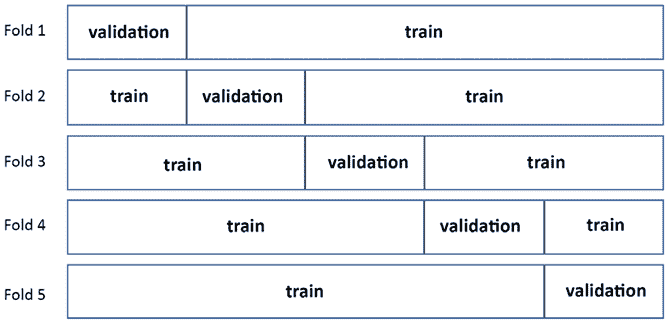图 6.2：5 折验证方案的结构

在 *k*-折交叉验证分数中，你必须记住的一个重要方面是，它估计的是在 *k - 1* 折相同数据量上训练的模型的平均分数。如果你之后在所有数据上训练你的模型，之前的验证估计就不再适用了。当 *k* 接近例子数量 *n* 时，你对在完整训练集上得到的模型的估计将越来越准确，然而，由于从每个折中获得的估计之间的相关性越来越大，你将失去所有验证的概率估计。在这种情况下，你最终会得到一个数字，显示你的模型在训练数据上的性能（这仍然是一个有用的估计，用于比较目的，但它不会帮助你正确估计模型的泛化能力）。

当你达到 *k = n* 时，你有了 LOO 验证方法，这在你有少量案例可用时很有用。这种方法主要是一个无偏拟合度量，因为它几乎使用了所有可用数据来训练，只用一个例子来测试。然而，它并不是对未见数据预期性能的良好估计。它在整个数据集上的重复测试高度相关，并且产生的 LOO 指标更多地代表了模型在数据集本身的性能，而不是模型在未知数据上的性能。

正确的 *k* 分区数量选择是基于一些与你的可用数据相关的方面来决定的：

+   *k* 越小（最小为 2），每个折越小，因此，在 *k - 1* 折上训练的模型的学习偏差将越大：你的在较小 *k* 上验证的模型相对于在较大 *k* 上训练的模型将表现得更差。

+   *k* 越高，数据越多，但你的验证估计的相关性也越高：你将失去 *k*-折交叉验证在估计未见数据性能中的有趣特性。

通常，*k* 被设置为 5、7 或 10，更少的情况下设置为 20 折。我们通常认为 *k* = 5 或 *k* = 10 是比赛中的好选择，后者使用更多的数据来训练（90%的可用数据），因此更适合在重新在完整数据集上训练时确定你模型的性能。

当决定在比赛中为特定数据集选择什么 *k* 时，我们发现从两个角度进行反思是有用的。

首先，折数的数量选择应该反映你的目标：

+   如果你的目的是性能估计，你需要具有低偏差估计的模型（这意味着没有系统性的估计扭曲）。你可以通过使用更多的折数来实现这一点，通常在 10 到 20 之间。

+   如果你的目标是参数调整，你需要权衡偏差和方差，因此建议使用中等数量的折数，通常在 5 到 7 之间。

+   最后，如果你的目的是仅仅应用变量选择和简化你的数据集，你需要具有低方差估计的模型（否则你将会有不一致性）。因此，较低的折数就足够了，通常在 3 到 5 之间。

当可用数据的规模相当大时，你可以安全地保持在建议范围的较低端。

其次，如果你只是想要进行性能估计，请注意，你使用的折数越多，你的验证集中的案例就越少，因此每个折的估计值之间的相关性就越高。超过某个点后，增加*k*会使你的交叉验证估计对未见过的测试集的预测能力降低，而对模型在训练集上的性能估计更加具有代表性。这也意味着，随着折数的增加，你可以得到用于堆叠的完美出折预测，正如我们将在第九章“使用混合和堆叠解决方案的集成”中详细解释的那样。

在 Kaggle 竞赛中，*k*-折交叉验证不仅用于验证你的解决方案方法和确定模型的性能，还用于生成预测。当你进行交叉验证时，你是在进行子采样，并且平均多个基于数据子样本构建的模型的预测结果是一种有效的对抗方差的策略，通常比在所有可用数据上训练更有效（我们将在第九章中进一步讨论这一点）。因此，许多 Kaggle 竞争者使用交叉验证期间构建的模型在测试集上提供一系列预测，平均起来将为他们提供解决方案。

#### k 折变化

由于它基于随机采样，*k*-折在以下情况下可能会提供不合适的分割：

+   你必须保持小类别的比例，无论是在目标级别还是在特征级别。这在你目标高度不平衡时很典型。典型的例子是垃圾邮件数据集（因为垃圾邮件只是正常电子邮件量的一个小部分）或任何信用风险数据集，你必须预测不太频繁的违约贷款事件。

+   你必须保持一个数值变量的分布，无论是在目标级别还是在特征级别。这通常是回归问题，其中分布非常偏斜或尾部很重。一个常见的例子是房价预测，其中有一小部分待售房屋的价格会远高于平均房价。

+   你的案例是非独立同分布的，特别是在处理时间序列预测时。

在前两种情况下，解决方案是**分层****k****-fold**，其中采样是以受控的方式进行，以保留你想要保留的分布。如果你需要保留单个类的分布，你可以使用 Scikit-learn 的`StratifiedKFold`，使用分层变量，通常是你的目标变量，也可以是任何其他你需要保留其分布的特征。该函数将生成一组索引，帮助你相应地划分你的数据。你还可以使用`pandas.cut`或 Scikit-learn 的`KBinsDiscretizer`对数值变量进行离散化后获得相同的结果。

当你必须根据多个变量或重叠标签进行分层时，比如在多标签分类中，这会变得稍微复杂一些。

你可以在**Scikit-multilearn**包（[`scikit.ml/`](http://scikit.ml/))中找到一个解决方案，特别是`IterativeStratification`命令，它可以帮助你控制你想要保留的顺序（多个变量的组合比例数）。该命令实现了以下论文中解释的算法：[`scikit.ml/api/skmultilearn.model_selection.iterative_stratification.html`](http://scikit.ml/api/skmultilearn.model_selection.iterative_stratification.html)。

+   Sechidis, K., Tsoumakas, G., and Vlahavas, I. (2011). *关于多标签数据的分层*. *机器学习与数据库知识发现，145-158*. [`lpis.csd.auth.gr/publications/sechidis-ecmlpkdd-2011.pdf`](http://lpis.csd.auth.gr/publications/sechidis-ecmlpkdd-2011.pdf)

+   Szymański, P. and Kajdanowicz, T.; *第一国际不平衡领域学习研讨会论文集*：*理论与应用*，PMLR 74:22-35，2017\. [`proceedings.mlr.press/v74/szyma%C5%84ski17a.html`](http://proceedings.mlr.press/v74/szyma%C5%84ski17a.html)

实际上，即使你的问题不是分类问题，而是回归问题，你仍然可以很好地利用分层。在回归问题中使用分层可以帮助你的回归器在交叉验证期间拟合到与整个样本中找到的类似的目标（或预测因子）分布。在这些情况下，为了使`StratifiedKFold`正常工作，你必须使用你的连续目标的一个离散代理而不是你的连续目标。

实现这一点的第一种，最简单的方法是使用 pandas 的`cut`函数，并将你的目标划分为足够多的箱，例如 10 或 20：

```py
import pandas as pd
y_proxy = pd.cut(y_train, bins=10, labels=False) 
```

为了确定要使用的箱数，*Abhishek Thakur*更喜欢使用基于可用示例数量的**Sturges 规则**，并将该数字提供给 pandas 的`cut`函数（见[`www.kaggle.com/abhishek/step-1-create-folds`](https://www.kaggle.com/abhishek/step-1-create-folds))）：

```py
import numpy as np
bins = int(np.floor(1 + np.log2(len(X_train)))) 
```

另一种方法是关注训练集中特征的分部，并试图重现它们。这需要在对训练集的特征进行**聚类分析**（一种无监督方法）时使用，从而排除目标变量和任何标识符，然后使用预测的聚类作为层。您可以在本笔记本中看到一个示例（[`www.kaggle.com/lucamassaron/are-you-doing-cross-validation-the-best-way`](https://www.kaggle.com/lucamassaron/are-you-doing-cross-validation-the-best-way))，其中首先执行 PCA（主成分分析）以消除相关性，然后执行*k*-means 聚类分析。您可以通过运行经验测试来决定使用多少个聚类。

在继续讨论*k*-fold 可能提供不合适的划分的情况时，第三种情况，即当您有非独立同分布（non-i.i.d.）的数据时，例如在某些示例之间发生分组的情况，事情变得复杂。非独立同分布示例的问题在于示例之间的特征和目标是相关的（因此，如果您知道其中的一个示例，那么预测所有示例就更容易）。实际上，如果您碰巧将同一组数据在训练集和测试集中划分，那么您的模型可能会学会区分组而不是目标本身，从而产生良好的验证分数，但在排行榜上的结果却非常糟糕。这里的解决方案是使用`GroupKFold`：通过提供一个分组变量，您可以确保每个组要么被放置在训练折中，要么被放置在验证折中，但永远不会在两者之间分割。

在数据中发现分组，使得数据非独立同分布（non-i.i.d.），实际上并不是一个容易完成的任务。除非竞赛问题中明确指出，否则您将不得不依靠您调查数据的能力（使用无监督学习技术，如聚类分析）和问题的领域。例如，如果您的数据是关于移动电话使用情况，您可能会通过注意到特征中相似值的序列，意识到一些示例来自同一用户。

时间序列分析也面临同样的问题，由于数据非独立同分布，您不能通过随机抽样进行验证，因为您将混合不同的时间框架，而后期的时间框架可能会留下前期的时间痕迹（在统计学中称为**自相关**的特征）。在时间序列验证的最基本方法中，您可以使用基于时间的训练集和验证集划分，如图*6.3*所示：

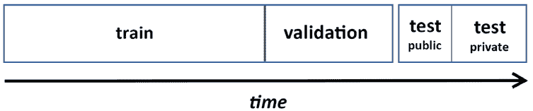

图 6.3：训练集和验证集的划分基于时间

然而，你的验证能力将会有限，因为你的验证将锚定在特定的时间点上。对于更复杂的方法，你可以使用 Scikit-learn 包提供的`TimeSeriesSplit`（`sklearn.model_selection.TimeSeriesSplit`）中的时间分割验证。`TimeSeriesSplit`可以帮助你设置时间序列的训练和测试部分的时间框架。

在训练时间框架的情况下，`TimeSeriesSplit`函数可以帮助你设置你的训练数据，使其涉及测试时间框架之前的所有过去数据，或者限制它到一个固定的回溯期（例如，始终使用测试时间框架前三个月的数据进行训练）。

在*图 6.4*中，你可以看到涉及增长训练集和移动验证集的时间验证策略的结构：

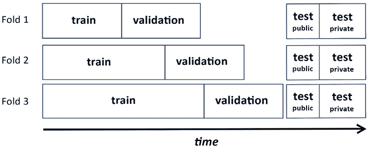

图 6.4：训练集随时间增长

在*图 6.5*中，你可以看到如果你规定训练集有一个固定的回溯期，策略是如何变化的：

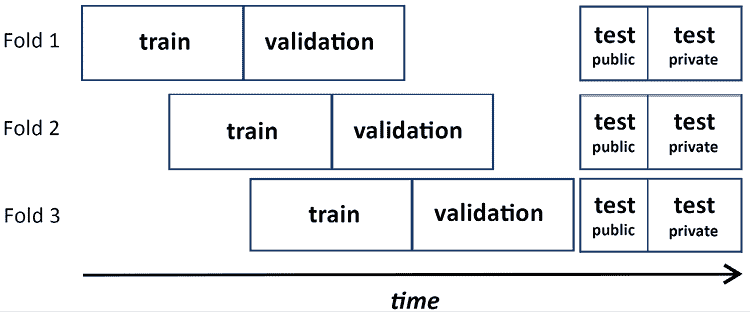

图 6.5：训练和验证分割随时间移动

根据我们的经验，按照固定的回溯期可以帮助提供对时间序列模型更公平的评估，因为你总是在同一个训练集大小上计数。

通过相反地使用随时间增长的训练集大小，你混淆了模型性能随时间切片的影响和模型中减少的偏差（因为更多的例子意味着更少的偏差）。

最后，记住`TimeSeriesSplit`可以设置为在训练和测试时间之间保持一个预定义的间隔。当你被告知测试集在未来某个时间（例如，训练数据后一个月）时，这非常有用，并且你想测试你的模型是否足够鲁棒，能够预测那么远的未来。

#### 嵌套交叉验证

在这个阶段，介绍**嵌套交叉验证**非常重要。到目前为止，我们只讨论了根据最终性能测试模型，但通常在调整超参数时，还需要测试它们的中间性能。实际上，你不能测试某些模型参数在你的测试集上的效果，然后使用相同的数据来评估最终性能。因为你已经专门找到了在测试集上工作的最佳参数，你在同一测试集上的评估指标将过于乐观；在另一个测试集上，你可能不会得到完全相同的结果。在这种情况下，你必须区分**验证集**和**测试集**，验证集用于评估各种模型和超参数的性能，而测试集将帮助你估计模型的最终性能。

如果你使用测试-训练分割，这是通过将测试部分分割成两个新的部分来实现的。通常的分割是 70/20/10，分别用于训练、验证和测试（但你也可以决定不同）。如果你使用交叉验证，你需要嵌套交叉验证；也就是说，你基于另一个交叉验证的分割进行交叉验证。本质上，你运行常规的交叉验证，但在你需要评估不同的模型或不同的参数时，你基于折叠分割进行交叉验证。

*图 6.6*中的例子展示了这种内部和外部交叉验证结构。在外部部分，你确定用于测试评估指标的数据部分。在内部部分，它由外部部分提供的训练数据组成，你安排训练/验证分割以评估和优化特定的模型选择，例如决定选择哪个模型或超参数值：

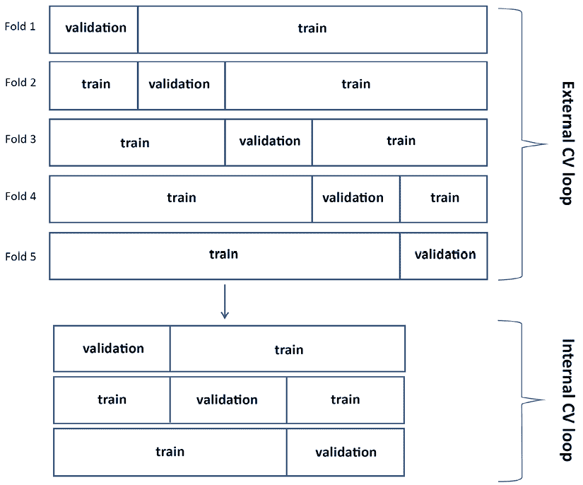

图 6.6：嵌套交叉验证在外部和内部循环中的结构

这种方法的优势在于使你的测试和参数搜索完全可靠，但在这样做的同时，你会遇到几个问题：

+   减少的训练集，因为你在第一次通过交叉验证分割后，又再次分割

+   更重要的是，它需要大量的模型构建：如果你运行两个嵌套的 10 折交叉验证，你需要运行 100 个模型

尤其是因为最后一个原因，一些 Kagglers 倾向于忽略嵌套交叉验证，并使用相同的交叉验证进行模型/参数搜索和性能评估，或者使用固定的测试样本进行最终评估，从而承担一些适应性拟合的风险。根据我们的经验，这种方法可能同样有效，尽管如果你生成折叠外预测用于后续建模（我们将在下一节讨论），可能会导致过度估计模型性能和过拟合。我们始终建议你尝试最适合测试你模型的方 法。如果你的目标是正确估计你的模型性能并在其他模型中重用其预测，请记住，在可能的情况下使用嵌套交叉验证可以为你提供一个更少过拟合的解决方案，并在某些比赛中产生差异。

#### 生成折叠外预测（OOF）

除了估计你的评估指标性能之外，交叉验证的一个有趣应用是生成测试预测和折叠外预测。实际上，当你训练你的训练数据的一部分并预测剩余的部分时，你可以：

+   **在测试集上预测**：所有预测的平均值通常比在所有数据上重新训练相同的模型更有效：这是一种与混合相关的集成技术，将在*第九章*，*使用混合和堆叠解决方案进行集成*中讨论。

+   **在验证集上进行预测**：最后，你将对整个训练集进行预测，并可以按照原始训练数据的顺序重新排序这些预测。这些预测通常被称为**出卷预测**（**OOF**）**预测**，它们可以非常有用。

OOF 预测的第一个用途是估计你的性能，因为你可以直接在 OOF 预测上计算你的评估指标。获得的表现与交叉验证估计（基于采样）不同；它没有相同的概率特性，因此它不是衡量泛化性能的有效方式，但它可以告诉你你的模型在特定训练集上的表现。

第二个用途是生成一个图表，将预测值与真实值或其他来自不同模型的预测值进行可视化。这将帮助你理解每个模型的工作原理以及它们的预测是否相关。

最后一个用途是创建元特征或元预测器。这将在*第九章*中完全探讨，但重要的是现在就强调这一点，因为 OOF 预测是交叉验证的副产品，并且它们之所以有效，是因为在交叉验证期间，你的模型始终在预测训练时间未看到的示例。

由于你的 OOF 预测中的每一个预测都是由在不同数据上训练的模型生成的，因此这些预测是无偏的，你可以放心使用，无需担心过拟合（尽管下一章将讨论一些注意事项）。

生成 OOF 预测有两种方式：

+   通过编写一个将验证预测存储到预测向量中的程序，同时注意将它们按照训练数据中的示例索引位置排列

+   通过使用 Scikit-learn 函数`cross_val_predict`，该函数将自动为你生成 OOF 预测

当我们在本章后面查看对抗验证时，我们将看到这种第二种技术的实际应用。

### 子采样

除了*k*-折交叉验证之外，还有其他验证策略，但它们不具有相同的泛化特性。我们已经讨论了 LOO，这是*k = n*（其中*n*是示例数量）的情况。另一个选择是**子采样**。子采样类似于*k*-折，但你没有固定的折数；你使用你认为必要的数量（换句话说，做出一个有根据的猜测）。你重复地子采样你的数据，每次使用你采样的数据作为训练数据，而未采样的数据作为验证数据。通过平均所有子样本的评估指标，你将得到模型性能的验证估计。

由于你正在系统地测试所有示例，就像在*k*-fold 中一样，你需要进行相当多的试验才能有很好的机会测试它们。同样，如果你没有应用足够的子样本，某些案例可能比其他案例被测试的次数更多。你可以使用 Scikit-learn 的`ShuffleSplit`运行这种验证。

### 重抽样

最后，另一个选择是尝试**重抽样**，这在统计学中被设计用来推断估计值的误差分布；出于同样的原因，它也可以用于性能估计。重抽样要求你抽取一个样本，**有放回地**，其大小与可用数据相同。

到这一点，你可以以两种不同的方式使用重抽样：

+   就像在统计学中一样，你可以多次进行重抽样，在样本上训练你的模型，并在训练数据本身上计算你的评估指标。重抽样的平均值将提供你的最终评估。

+   否则，就像在子抽样中一样，你可以使用重抽样样本进行训练，并将未从数据中抽样的部分作为测试集。

根据我们的经验，在重抽样训练数据上计算评估指标的第一种方法，通常在统计学中用于线性模型的系数值及其误差分布的估计，在机器学习中作用不大。这是因为许多机器学习算法倾向于过度拟合训练数据，因此即使进行重抽样，你也无法在训练数据上得到有效的指标评估。因此，Efron 和 Tibshirani（参见*Efron*, *B. and Tibshirani, R*. *Improvements on cross-validation: the 632+ bootstrap method.* Journal of the American Statistical Association 92.438 (1997): 548-560.）提出了**632+估计器**作为最终的验证指标。

首先，他们提出了一个简单版本，称为 632 重抽样：

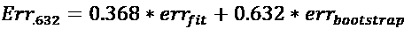

在这个公式中，给定你的评估指标*err*，*err*[fit]是在训练数据上计算的指标，*err*[bootstrap]是在重抽样数据上计算的指标。然而，在训练模型过度拟合的情况下，*err*[fit]往往会接近零，使得估计器不太有用。因此，他们开发了 632+重抽样的第二个版本：

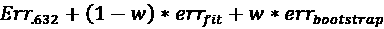

其中*w*是：

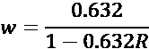

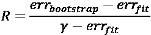

这里有一个新的参数，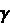，这是**无信息误差率**，通过评估预测模型在所有可能的响应变量和预测变量组合上来估计。正如 Scikit-learn 的开发者所讨论的（[`github.com/scikit-learn/scikit-learn/issues/9153`](https://github.com/scikit-learn/scikit-learn/issues/9153)），计算实际上是不可行的。

由于使用自助法作为经典统计学在机器学习应用中的局限性和不可行性，你可以使用第二种方法，从自助法未采样的例子中获得你的评估。

在这种形式下，自助法是交叉验证的替代方案，但与子采样一样，它需要构建更多的模型并进行测试，比交叉验证要多。然而，了解这些替代方案是有意义的，以防你的交叉验证在评估指标上显示出过高的方差，你需要通过测试和重新测试进行更深入的检查。

以前，这种方法已经在 Scikit-learn 中实现（[`github.com/scikit-learn/scikit-learn/blob/0.16.X/sklearn/cross_validation.py#L613`](https://github.com/scikit-learn/scikit-learn/blob/0.16.X/sklearn/cross_validation.py#L613)），但后来被移除了。由于你无法在 Scikit-learn 中找到自助法，而且它甚至对测试数据也进行了自助，你可以使用我们自己的实现。以下是我们的示例：

```py
import random
def Bootstrap(n, n_iter=3, random_state=None):
    """
    Random sampling with replacement cross-validation generator.
    For each iter a sample bootstrap of the indexes [0, n) is
    generated and the function returns the obtained sample
    and a list of all the excluded indexes.
    """
    if random_state:
        random.seed(random_state)
    for j in range(n_iter):
        bs = [random.randint(0, n-1) for i in range(n)]
        out_bs = list({i for i in range(n)} - set(bs))
        yield bs, out_bs 
```

总之，自助法确实是交叉验证的替代方案。它在统计学和金融学中确实被更广泛地使用。在机器学习中，黄金法则是要使用*k*-折交叉验证方法。然而，我们建议不要忘记在所有那些情况下使用自助法，因为这些情况是由于异常值或一些过于异质化的例子，你在交叉验证中评估指标的标准误差很大。在这些情况下，自助法将证明在验证你的模型方面非常有用。


Ryan Chesler

[`www.kaggle.com/ryches`](https://www.kaggle.com/ryches)

本章的第二次采访是与 Ryan Chesler，一个讨论大师和笔记本及竞赛大师。他是 H2O.ai 的数据科学家，也是 Meetup 上圣地亚哥机器学习小组的组织者之一（[`www.meetup.com/San-Diego-Machine-Learning/`](https://www.meetup.com/San-Diego-Machine-Learning/))。在他的回答中，验证的重要性被提到了几次。

你最喜欢的竞赛类型是什么？为什么？在技术和解决方法方面，你在 Kaggle 上的专长是什么？

*我倾向于涉猎各种竞赛。与专注于特定领域，如计算机视觉或自然语言处理相比，尝试各种各样的问题更有趣。我最感兴趣的是那些可以从数据和分析预测错误中得出深刻见解的问题。对我来说，错误分析是最有启发性的过程之一；理解模型失败的地方，并试图找到改进模型或输入数据表示的方法来克服弱点。*

你是如何处理 Kaggle 竞赛的？这种方法和你在日常工作中所做的工作有何不同？

*在这两种情况下，我的方法都是相似的。很多人似乎更喜欢在建模之前进行探索性数据分析，但我发现为建模准备数据的过程通常就足够了。我典型的做法是手动查看数据，并就我认为如何最好地建模数据和探索不同选项做出一些初步决定。然后，我构建模型并评估性能，然后专注于分析错误，并根据我在模型出错的地方推理出下一步的建模步骤。*

Kaggle 是否帮助了你在你的职业生涯中？如果是，那又是如何帮助的？

*是的，这帮助我得到了我现在的工作。我在 H2O 工作，他们非常重视 Kaggle 的成就。我的上一份工作也喜欢我在比赛中表现良好。*

你也是圣地亚哥一个有两千多名参与者的 Meetup 的组织者。这与你在 Kaggle 的经验有关吗？

*是的，这绝对有关。我从几乎一无所知开始，尝试了一个 Kaggle 比赛，一开始并没有取得太大的成功。我参加了一个当地的 Meetup，找到了可以一起学习和合作的人。当时，我能够与比我技能水平高得多的人一起工作，我们在比赛中表现得很好，排名第三/4500+个团队。*

*之后，这个团队不再那么一致，我想让这个社区继续下去，所以我组建了自己的团队，开始组织自己的活动。我差不多已经做了 4 年，我得以站在桌子的另一边教人们，帮助他们开始。最初，我们只专注于 Kaggle 比赛和尝试组建团队，但慢慢地开始扩展到做读书俱乐部和关于各种感兴趣主题的讲座。我把我的很多成功归因于有这个专门的每周时间来学习和思考机器学习。*

在你的经验中，不经验的 Kagglers 通常忽略了什么？你现在知道的事情，你希望在你刚开始的时候就知道？

*在我的经验中，很多人过分强调偏差-方差权衡和过拟合的重要性。这是我一直看到人们过分担心的事情。重点不应该是使训练和验证性能接近，而应该是使验证性能尽可能好。*

你在过去比赛中犯过哪些错误？

*我的一个持续错误就是探索得不够。有时候我过早地否定了自己的想法，结果这些想法对于提高表现非常重要。我经常可以在第一次尝试时就接近竞争水平，但当我尝试新事物并持续改进时，需要一种我仍在努力掌握的不同技能。*

你会推荐使用哪些特定的工具或库来进行数据分析或机器学习？

*我使用了很多标准工具：XGBoost、LightGBM、Pytorch、TensorFlow、Scikit-learn。我没有对任何特定的工具或库有强烈的偏好，只是与问题相关的任何工具。*

当人们参加竞赛时，他们应该牢记或做什么是最重要的？

*我认为人们必须牢记的最重要的事情是良好的验证。我经常看到人们自欺欺人，以为他们的性能在提高，但提交到排行榜后，才发现实际情况并没有他们预期的那么好。理解如何将假设与你的新未见数据相匹配，并构建一个对新条件具有鲁棒性的模型是一项重要的技能。*

# 调整你的模型验证系统

到这一点，你应该对所有可能的验证策略有一个全面的了解。当你参加竞赛时，制定你的验证策略并实施它。然后，测试你选择的策略是否正确。

作为一条黄金法则，在制定你的验证策略时，要以你必须复制竞赛组织者用于将数据分割为训练、私有和公共测试集的方法为指导思想。问问自己组织者是如何安排这些分割的。他们是随机抽取样本吗？他们试图保留数据中的某些特定分布吗？测试集实际上是从与训练数据相同的分布中抽取的吗？

这些不是你在现实世界项目中会问自己的问题。与必须不惜一切代价进行泛化的现实世界项目相反，竞赛有一个更狭窄的焦点，即拥有在给定测试集（特别是私有测试集）上表现良好的模型。如果你从一开始就关注这个想法，你就有更大的机会找到最佳的验证策略，这将有助于你在竞赛中排名更高。

由于这是一个试错过程，当你试图为竞赛找到最佳的验证策略时，你可以系统地应用以下两个一致性检查，以确定你是否走上了正确的道路：

1.  首先，你必须检查你的本地测试是否一致，也就是说，单个交叉验证折的误差彼此之间差异不大，或者当你选择简单的训练-测试分割时，使用不同的训练-测试分割可以重现相同的结果。

1.  然后，你必须检查你的本地验证误差是否与公共排行榜上的结果一致。

如果你第一次检查失败了，你可以根据以下可能的问题来源选择几个选项：

+   你没有多少训练数据

+   数据过于多样，每个训练分区都与每个其他分区非常不同（例如，如果你有太多的**高基数**特征，即具有太多级别的特征——如邮政编码——或者如果你有多元异常值）

在这两种情况下，关键是你缺乏你想要实施的模型所需的数据。即使问题只是数据过于多样，绘制学习曲线也会让你明显看出你的模型需要更多的数据。

在这种情况下，除非你发现转向一个更简单的算法在评估指标上有效（在这种情况下，以方差换取偏差可能会降低你的模型性能，但并不总是如此），否则你的最佳选择是使用广泛的验证方法。这可以通过以下方式实现：

+   使用更大的 *k* 值（从而接近 LOO，其中 *k = n*）。你的验证结果将更多地关于你的模型在未见数据上的表现能力，但通过使用更大的训练部分，你将拥有更稳定评估的优势。

+   平均多个 *k*-折验证的结果（基于不同随机种子初始化选择的不同数据分区）。

+   使用重复的引导启动。

请记住，当你发现不稳定的局部验证结果时，你不会是唯一一个受此问题困扰的人。通常，这是一个由于数据来源和特征而普遍存在的问题。通过关注讨论论坛，你可能会得到一些可能的解决方案的提示。例如，对于高基数特征，目标编码是一个好的解决方案；分层可以帮助处理异常值；等等。

当你通过了第一项检查但失败了第二项时，情况就不同了；你的局部交叉验证是一致的，但你发现它在排行榜上并不成立。为了意识到这个问题存在，你必须仔细记录你所有的实验、验证测试类型、使用的随机种子以及如果你提交了预测结果，排行榜结果。这样，你可以绘制一个简单的散点图并尝试拟合线性回归，或者更简单的是，计算你的局部结果与相关公开排行榜分数之间的相关性。注释和分析所有这些需要一些时间和耐心，但这是你可以跟踪的最重要的比赛表现元分析。

当不匹配是因为你的验证分数系统地低于或高于排行榜分数时，你实际上有一个强烈的信号表明你的验证策略中缺少某些东西，但这并不妨碍你改进你的模型。实际上，你可以继续改进你的模型，并期待排行榜上的改进，尽管不是成比例的。然而，系统性的差异始终是一个红旗，意味着你所做的事情与组织者安排的测试模型之间存在差异。

当你的局部交叉验证分数与排行榜反馈完全不相关时，情况甚至更糟。这确实是一个红旗。当你意识到这种情况时，你应该立即运行一系列测试和调查，以找出原因，因为无论这是一个普遍问题还是不是，这种情况对你的最终排名构成了严重威胁。在这种情况下，有几种可能性：

+   你发现测试集是从与训练集不同的分布中抽取的。敌对验证测试（我们将在下一节讨论）是在这种情况下可以启发你的方法。

+   数据是非独立同分布的，但这并不明确。例如，在*《自然保护基金会渔业监测》*竞赛([`www.kaggle.com/c/the-nature-conservancy-fisheries-monitoring`](https://www.kaggle.com/c/the-nature-conservancy-fisheries-monitoring))中，训练集中的图像是从类似情况（渔船）中拍摄的。你必须自己想出如何安排它们，以避免模型学会识别目标而不是图像的上下文（例如，参见*Anokas*的这项工作：[`www.kaggle.com/anokas/finding-boatids`](https://www.kaggle.com/anokas/finding-boatids))。

+   特征的多变量分布是相同的，但在测试集中某些组的分布不同。如果你能找出这些差异，你可以相应地设置你的训练集和验证集，从而获得优势。你需要调查公共排行榜来解决这个问题。

+   测试数据发生了漂移或趋势，这在时间序列预测中通常是情况。再次强调，你需要调查公共排行榜来获取一些关于可能有助于提高分数的后处理方法的见解，例如，将乘数应用于你的预测，从而模拟测试数据中的下降或上升趋势。

正如我们之前讨论的，调查排行榜是通过专门设计的提交来获取关于公共测试集组成的洞察。如果私有测试集与公共测试集相似，这种方法特别有效。没有通用的调查方法，因此你必须根据竞赛和问题的类型设计调查方法。

例如，在论文*《通过利用对数损失算子攀登 Kaggle 排行榜》*([`export.arxiv.org/pdf/1707.01825`](https://export.arxiv.org/pdf/1707.01825))中，Jacob 解释了如何在没有下载训练数据的情况下在竞赛中获得第四名。

关于回归问题，在 Kaggle 最近组织的*“30 天机器学习”*活动中，*Hung Khoi*解释了如何通过调查排行榜帮助他理解训练数据集和公共测试数据中目标列的均值和标准差之间的差异（参见：[`www.kaggle.com/c/30-days-of-ml/discussion/269541`](https://www.kaggle.com/c/30-days-of-ml/discussion/269541))。

他使用了以下方程：

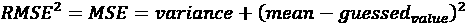

实际上，你只需要提交两次来求解测试目标的均值和方差，因为有两个未知项——方差和均值。

你还可以从*克里斯·德奥特*（[`www.kaggle.com/cdeotte`](https://www.kaggle.com/cdeotte)）的这篇帖子中获得一些关于排行榜探测的其他想法，[`www.kaggle.com/cdeotte/lb-probing-strategies-0-890-2nd-place`](https://www.kaggle.com/cdeotte/lb-probing-strategies-0-890-2nd-place)，与*不要过度拟合 II 竞赛*（[`www.kaggle.com/c/dont-overfit-ii`](https://www.kaggle.com/c/dont-overfit-ii)）相关。

如果你想要了解从排行榜中获取信息是如何一把双刃剑，你可以阅读一下*扎哈·奇基舍夫*是如何在*LANL 地震预测*竞赛中获取信息，最终在公开排行榜上领先，但在私人排行榜上排名 87 位：[`towardsdatascience.com/how-to-lb-probe-on-kaggle-c0aa21458bfe`](https://towardsdatascience.com/how-to-lb-probe-on-kaggle-c0aa21458bfe)

# 使用对抗验证

正如我们之前讨论的，交叉验证允许你测试你的模型将泛化到来自与你的训练数据相同分布的未见数据集的能力。希望你在 Kaggle 竞赛中需要创建一个可以预测公共和私有数据集的模型，你应该期待这样的测试数据与训练数据来自相同的分布。在现实中，这并不总是如此。

即使你没有因为你的决策不仅基于排行榜结果，还考虑了交叉验证而过度拟合测试数据，你仍然可能会对结果感到惊讶。这种情况可能发生在测试集与你的模型基于的训练集略有不同的情况下。实际上，目标概率及其分布，以及预测变量如何与之相关，在训练过程中向你的模型传达了某些期望，如果测试数据与训练数据不同，这些期望是无法满足的。

因此，仅仅避免过度拟合到排行榜，就像我们之前讨论的那样，是不够的，首先，还建议找出你的测试数据是否与训练数据可比。然后，如果它们不同，你必须弄清楚是否有机会减轻训练数据和测试数据之间的不同分布，并构建一个在该测试集上表现良好的模型。

**对抗验证**就是为了这个目的而开发的。这是一种允许你轻松估计你的训练数据和测试数据之间差异程度的技巧。这项技术长期以来在 Kaggle 参与者中流传，从团队到团队传递，直到*齐格蒙特·扎尼亚克*（[`www.kaggle.com/zygmunt`](https://www.kaggle.com/zygmunt)）在他的 FastML 博客上发布文章后公开。

这个想法很简单：取你的训练数据，移除目标，将你的训练数据和测试数据一起组装，并创建一个新的二元分类目标，其中正标签分配给测试数据。在这个时候，运行机器学习分类器，并评估 ROC-AUC 评估指标（我们在上一章*详细说明竞赛任务和指标*中讨论了此指标）。

如果你的 ROC-AUC 值在 0.5 左右，这意味着训练数据和测试数据不容易区分，并且显然来自相同的分布。高于 0.5 且接近 1.0 的 ROC-AUC 值表明算法很容易区分来自训练集和测试集的数据：在这种情况下，不要期望能够轻易地将结果推广到测试集，因为它显然来自不同的分布。

你可以在为*Sberbank 俄罗斯住房市场*竞赛编写的示例 Notebook 中找到示例（[`www.kaggle.com/c/sberbank-russian-housing-market`](https://www.kaggle.com/c/sberbank-russian-housing-market)），它展示了对抗验证的实际示例及其在竞赛中的应用：[`www.kaggle.com/konradb/adversarial-validation-and-other-scary-terms`](https://www.kaggle.com/konradb/adversarial-validation-and-other-scary-terms)。

由于你的数据可能具有不同的类型（数值或字符串标签）并且你可能存在缺失情况，在成功运行分类器之前，你需要进行一些数据处理。我们的建议是使用随机森林分类器，因为：

+   它不输出真正的概率，但其结果仅作为序数，这对于 ROC-AUC 分数来说是一个完美的匹配。

+   随机森林是一种基于决策树的灵活算法，它可以自行进行特征选择，并且可以在不进行任何预处理的情况下操作不同类型的特征，同时将所有数据转换为数值。它对过拟合也相当稳健，你不必过多考虑调整其超参数。

+   由于其基于树的本质，你不需要太多的数据处理。对于缺失数据，你可以简单地用不可能的负值（如-999）替换这些值，并且你可以通过将字符串转换为数字（例如，使用 Scikit-learn 标签编码器，`sklearn.preprocessing.LabelEncoder`）来处理字符串变量。作为一个解决方案，它的性能不如独热编码，但它非常快速，并且对于这个问题可以正常工作。

虽然构建分类模型是直接对抗验证测试集的最直接方法，但你也可以使用其他方法。一种方法是将训练数据和测试数据映射到一个低维空间，就像 NanoMathias 在这篇帖子中做的那样 ([`www.kaggle.com/nanomathias/distribution-of-test-vs-training-data`](https://www.kaggle.com/nanomathias/distribution-of-test-vs-training-data))。虽然需要更多的调整工作，但基于 t-SNE 和 PCA 的这种方法具有将结果以吸引人且易于理解的方式图形化的巨大优势。

不要忘记，我们的大脑在识别视觉表示中的模式方面比识别数值模式更擅长（关于我们视觉能力的详细讨论，请参阅[`onlinelibrary.wiley.com/doi/full/10.1002/qua.24480`](https://onlinelibrary.wiley.com/doi/full/10.1002/qua.24480))。

PCA 和 t-SNE 不是唯一可以帮助你降低数据维度并使其可视化的工具。UMAP ([`github.com/lmcinnes/umap`](https://github.com/lmcinnes/umap))通常可以提供更快的低维度解决方案，具有清晰且明显的数据簇。变分自动编码器（在第七章*表格竞赛建模*中讨论）可以处理非线性维度缩减，并提供比 PCA 更有用的表示；然而，它们设置和调整起来更复杂。

## 示例实现

尽管你可以在 Zygmunt 的原始文章和我们所链接的笔记本中找到对抗验证的例子，但我们为你创建了一个全新的例子，这个例子基于 Playground 竞赛的*Tabular Playground Series – Jan 2021* ([`www.kaggle.com/c/tabular-playground-series-jan-2021`](https://www.kaggle.com/c/tabular-playground-series-jan-2021))。

你首先导入一些 Python 包，并从竞赛中获取训练数据和测试数据：

```py
import numpy as np
import pandas as pd
from sklearn.ensemble import RandomForestClassifier
from sklearn.model_selection import cross_val_predict
from sklearn.metrics import roc_auc_score
train = pd.read_csv("../input/tabular-playground-series-jan-2021/train.csv")
test = pd.read_csv("../input/tabular-playground-series-jan-2021/test.csv") 
```

数据准备简短而直接。由于所有特征都是数值型的，你不需要任何标签编码，但你必须用负数（通常-1 就足够了）填充任何缺失值，并删除目标和任何标识符；当标识符是递增的，对抗验证可能会返回一个高的 ROC-AUC 分数：

```py
train = train.fillna(-1).drop(["id", "target"], axis=1)
test = test.fillna(-1).drop(["id", axis=1])
X = train.append(test)
y = [0] * len(train) + [1] * len(test) 
```

在这一点上，你只需要使用`cross_val_predict`函数为你数据生成`RandomForestClassifier`预测，该函数自动创建交叉验证方案并将预测存储在验证折上：

```py
model = RandomForestClassifier()
cv_preds = cross_val_predict(model, X, y, cv=5, n_jobs=-1, method='predict_proba') 
```

因此，你获得的预测是无偏的（它们没有过拟合，因为你没有在你训练的数据上进行预测），并且可以用于误差估计。请注意，`cross_val_predict`不会拟合你的实例化模型，所以你不会从它那里得到任何信息，例如模型使用的重要特征是什么。如果你需要此类信息，你只需先通过调用`model.fit(X, y)`来拟合它。

最后，你可以查询你预测的 ROC-AUC 分数：

```py
print(roc_auc_score(y_true=y, y_score=cv_preds[:,1])) 
```

你应该得到大约 0.49-0.50 的值（除非你使用具有固定`random_seed`的交叉验证，否则`cross_val_predict`不会是确定性的）。这意味着你无法轻易地区分训练数据和测试数据。因此，它们来自相同的分布。

## 处理训练数据和测试数据的不同分布

ROC-AUC 分数为 0.8 或更高会提醒你测试集是特殊的，并且与训练数据相当不同。在这些情况下，你可以采取哪些策略？实际上，你手头有几个策略：

+   抑制

+   在与测试集最相似的案例上进行训练

+   通过模拟测试集进行验证

通过**抑制**，你移除在对抗测试集中对结果影响最大的变量，直到分布再次相同。为此，你需要一个迭代的方法。这次，你将你的模型拟合到所有数据上，然后检查重要性度量（例如，由 Scikit-learn 的`RandomForest`分类器的`feature_importances_`方法提供）和 ROC-AUC 拟合分数。在这个时候，你从数据中移除对模型最重要的变量，然后重新运行一切。你重复这个周期，其中你训练、测量 ROC-AUC 拟合，并从数据中移除最重要的变量，直到拟合的 ROC-AUC 分数下降到大约 0.5。

这种方法的唯一问题是，你可能实际上被迫从数据中移除大多数重要的变量，并且任何基于这种变量缺失数据的模型将无法由于缺乏信息特征而足够准确地预测。

当你在与测试集最相似的例子上进行训练时，你采取不同的方法，专注于训练中使用的**变量**而不是**样本**。在这种情况下，你只从训练集中选择符合测试分布的样本。任何训练好的模型都适合测试分布（但它不会推广到其他任何东西），这应该允许你在竞赛问题上有最好的测试。这种方法的局限性在于你正在减少数据集的大小，并且根据符合测试分布的样本数量，你可能会由于缺乏训练示例而得到一个非常偏颇的结果模型。在我们的前一个例子中，只选择训练数据中概率超过 0.5 的对抗预测并将它们相加，结果只选择了 1,495 个案例（这个数字如此之小，因为测试集与训练集没有很大不同）：

```py
print(np.sum(cv_preds[:len(X), 1] > 0.5)) 
```

最后，使用**通过模拟测试集进行验证**的策略，你继续在所有数据上训练，但为了验证目的，你只从训练集的对抗预测中选择概率超过 0.5（或更高的阈值，如 0.9）的例子。

将验证集调整到测试集将允许你选择所有可能超参数和模型选择，这将有利于在排行榜上获得更好的结果。

在我们的例子中，我们可以从以下代码的输出中找出`feature_19`和`feature_54`在训练/测试分割中出现的差异最大：

```py
model.fit(X, y)
ranks = sorted(list(zip(X.columns, model.feature_importances_)), 
               key=lambda x: x[1], reverse=True)
for feature, score in ranks:
    print(f"{feature:10} : {score:0.4f}") 
```

总结来说，我们对对抗性验证还有一些额外的评论。首先，使用它通常会帮助你更好地在竞赛中表现，但并不总是如此。Kaggle 的代码竞赛以及其他你无法完全访问测试集的竞赛，不能通过对抗性验证来检查。此外，对抗性验证可以告诉你关于整个测试数据的信息，但它不能就私有和公共测试数据之间的分割提供建议，这是最常见的公开排行榜过拟合和随之而来的波动的原因。

最后，虽然对抗性验证是一种为竞赛特别设计的非常具体的方法，但在现实世界中它有许多实际的应用场景：你有多少次选择了错误的测试集来验证你的模型？我们在这里提出的方法可以让你明白你是否在项目中正确地使用了测试数据和任何验证数据。此外，数据变化和生产中的模型可能会受到这些变化的影响，如果你不重新训练它们，可能会产生不良预测。这被称为**概念漂移**，通过使用对抗性验证，你可以立即了解是否需要重新训练新的模型以投入生产，或者是否可以继续使用之前的模型。


吉尔亚诺·贾森

[`www.kaggle.com/adjgiulio`](https://www.kaggle.com/adjgiulio)

吉尔亚诺·贾森是一位竞赛大师，同时也是 Zillow 集团机器学习和自然语言处理的高级应用科学家。他向我们讲述了他的竞赛胜利、交叉验证的重要性以及数据泄露，这是下一节的主题。

你最喜欢的竞赛类型是什么？为什么？在技术和解决方法方面，你在 Kaggle 上的专长是什么？

*我理想的竞赛由以下三个要素组成：a) 一个有趣的问题需要解决，b) 一个中等大小的数据集，足够小以适应内存，但又不至于太小而成为过拟合的烦恼，c) 从特征工程的角度来看，有机会发挥创造力。这三个维度的结合是我擅长竞争机器学习的地方，因为我感觉我有能力在不担心工程约束的情况下使用严谨和创造力。*

你是如何处理 Kaggle 竞赛的？这种方法与你在日常工作中所做的工作有何不同？

*Kaggle 竞赛是一场马拉松。进入竞赛时，我知道我可以通过几天的工作获得我最好最终得分的 90%到 95%。其余的都是缓慢的磨砺。唯一的成功指标是你的分数；其他什么都不重要。*

*我的日常工作更像是一系列冲刺。模型性能只是我需要考虑的一小部分。上线日期可能同样重要，或者其他方面，如可解释性、可扩展性和可维护性可能会完全改变方向。每次冲刺后，优先级都会重新评估，最终产品可能看起来与最初设想的大相径庭。此外，建模只是我一天中的一部分。我花更多的时间与人交谈，管理优先级，构建用例，清洗数据，以及思考使原型模型成为成功的生产解决方案所需的一切。*

告诉我们你参加的一个特别具有挑战性的比赛，以及你使用了哪些见解来应对这项任务。

*我赢得的两个比赛中之一，基因泰克癌症比赛，是一个仅限硕士生的比赛。提供的数据是原始交易数据。没有从表格数据集开始。这种类型的工作是我喜欢的，因为特征工程实际上是机器学习我最喜欢的部分之一。由于我在比赛时已经在医疗保健行业工作了十年，我对数据有商业和临床见解，但最重要的是，我对正确处理这种数据复杂性的工程见解，以及当这种交易原始数据处理不当时可能出现的所有问题。这最终证明是获胜的关键，因为关于可能泄漏来源的初步假设之一最终被证明是正确的，并为我们的模型提供了“黄金特征”，从而为我们的模型提供了最后的推动力。从比赛中得到的启示是在进行特征工程或设置验证方法时始终格外小心。泄漏可能很难检测，而通常的模型验证方法在大多数情况下无法帮助识别泄漏，从而将模型置于在生产中表现不佳的风险之中。*

Kaggle 是否帮助你在职业生涯中取得进展？如果是的话，是如何帮助的？

*Kaggle 以两种方式帮助了我。首先，它提供了一个低门槛的入门点，让我接触到现代机器学习，大量的前沿建模技术，并迫使我真正理解专业级模型验证技术的艺术和科学。其次，Kaggle 让我有机会接触到应用机器学习领域的一些最聪明的大脑。我与一些顶级 Kaggle 参与者合作学到的教训是我珍视的，并且我每天都在努力与我的队友分享这些教训。*

你是如何通过 Kaggle 建立起你的作品集的？

*我的职业生涯并没有因为我的 Kaggle 简历而有太大的影响。我的意思是，我没有因为我的 Kaggle 排名而得到工作机会或面试。我是在已经担任高级数据科学角色时开始使用 Kaggle 的，尽管当时对机器学习的关注不多。多亏了在 Kaggle 上学到的知识，我能够更好地倡导我的职业转变，转向专注于机器学习的职位。*

*截至目前，我工作中很多人喜欢讨论竞争性机器学习，并对我的 Kaggle 经验中的技巧和窍门表示好奇，但事实也是，机器学习社区中很大一部分人甚至可能都不知道 Kaggle 是什么。*

在你的经验中，不经验的 Kagglers 通常忽略了什么？你现在知道什么，而你在最初开始时希望知道的呢？

*对于竞争性机器学习的新手来说，交叉验证的重要性很容易被忽视。一个稳固的交叉验证框架可以让你可靠和客观地衡量改进。在一个可能长达六个月的比赛中，最好的模型通常不是来自那些有最好初始想法的人，而是来自那些愿意根据数据经验反馈进行迭代和调整的人。一个出色的验证框架是这一切的基础。*

在过去的比赛中，你犯过哪些错误？

*我总是与机器学习新入门者分享的一个教训是“永远不要对过于复杂的思想过分迷恋。”面对一个新复杂问题时，很容易被诱惑去构建复杂的解决方案。复杂的解决方案通常需要时间来开发。但主要问题是，复杂的解决方案通常价值不大，基于稳健的基线。例如，想象你想模拟选举结果，并开始思考一系列特征来捕捉可观察和潜在地理、社会经济和时间特征之间的复杂条件关系。你可能会花费数周时间开发这些特征，假设由于它们考虑得非常周到，它们将产生重大影响。*

*错误在于，尽管这些复杂特征本身可能非常强大，但基于一系列简单特征和能够构建高度优化、数据驱动的深度交互的模型，我们花费时间和精力构建的复杂特征可能会突然导致边际改进很小甚至没有。我的建议是坚持奥卡姆剃刀原则，在诱惑更复杂的方法之前先尝试简单的事情。*

你会推荐使用哪些特定的工具或库来进行数据分析或机器学习？

*我是一个 pandas 和 Scikit-learn 的用户。我喜欢 pandas 如何使数据操作和探索变得简单，以及我如何能在几分钟内快速使用 Scikit-learn 原型化模型。我的大部分原型工作都是使用这两个库完成的。尽管如此，我的最终模型通常基于 XGBoost。对于深度学习，我喜欢使用 Keras。*

# 处理泄露

在 Kaggle 竞赛中，一个常见的问题可能会影响挑战的结果，那就是数据泄露。**数据泄露**，通常简单地被称为**泄露**或使用其他花哨的名称（如*黄金特征*），涉及在训练阶段存在但在预测时不可用的信息。这种信息（泄露）的存在会使你的模型在训练和测试中表现过度，让你在比赛中排名很高，但从赞助商的角度来看，任何基于它的解决方案都将变得不可用或至多次优。

我们可以定义泄露为“当与真实情况相关的信息被人为且无意地引入训练特征数据或训练元数据中”时，正如*迈克尔·金*（[`www.kaggle.com/mikeskim`](https://www.kaggle.com/mikeskim)）在 2019 年*Kaggle Days San Francisco*的演讲中所说。

尽管赞助商和 Kaggle 团队都进行了仔细的检查，但在 Kaggle 竞赛中仍然经常发现泄露。这种情况是由于泄露的微妙和隐蔽性质，它可能会由于 Kagglers 进行的激烈搜索而意外出现，他们总是在寻找任何在比赛中得分更高的方法。

不要将数据泄露与泄露的验证策略混淆。在泄露的验证策略中，问题在于你安排的验证策略有利于更好的验证分数，因为训练数据中存在一些信息泄露。这与比赛本身无关，但它与你处理验证的方式有关。如果你在将训练数据和验证或测试数据分开之前对数据进行任何预处理（归一化、降维、缺失值插补），就会发生这种情况。

为了防止泄露的验证，如果你使用 Scikit-learn 来处理和操作你的数据，你绝对必须将你的验证数据排除在任何拟合操作之外。拟合操作倾向于在应用于任何用于验证的数据时创建泄露。避免这种情况的最佳方法是使用 Scikit-learn 管道（[`scikit-learn.org/stable/modules/generated/sklearn.pipeline.Pipeline.html`](https://scikit-learn.org/stable/modules/generated/sklearn.pipeline.Pipeline.html)），它将你的数据处理和模型一起封装，从而避免无意中将对数据应用任何泄露转换的风险。

因此，数据泄露并不是严格与验证操作相关，尽管它深深地影响着它们。尽管这一章主要致力于验证策略，但在此阶段我们认为讨论数据泄露是必要的，因为这个问题可能会深刻地影响你评估模型及其在比赛测试集之外泛化能力的方式。

一般而言，泄露可能起源于特征或示例级别。**特征泄露**是最常见的。它可能是由目标代理的存在或由目标本身之后的特征引起的。目标代理可以是来自处理标签本身或来自测试分割过程的任何东西；例如，在定义标识符时，特定的标识符（例如，一个编号弧）可能与某些目标响应相关联，使得模型在正确地提供经过适当处理的信息时更容易猜测。数据处理可能导致泄露的更微妙的方式是，当竞赛组织者在分割之前一起处理训练集和测试集时。历史上，Kaggle 竞赛中的泄露通常发现于：

1.  组织者处理数据准备不当，尤其是在他们操作训练数据和测试数据的组合时（例如，在 *Loan Default Prediction* ([`www.kaggle.com/c/loan-default-prediction`](https://www.kaggle.com/c/loan-default-prediction)) 中，组织者最初使用了包含聚合历史数据的特征，这些特征泄露了未来的信息）。

1.  当与时间索引或特定数据组相关联时，行的顺序（例如，在 *Telstra Network Disruptions* ([`www.kaggle.com/c/telstra-recruiting-network`](https://www.kaggle.com/c/telstra-recruiting-network)) 中，特征中记录的顺序暗示了代理信息，即位置信息，该信息在数据中不存在，但具有很高的预测性）。

1.  当与时间索引相关联时，列的顺序（您可以通过将列用作行来获得提示）。

1.  连续行中的特征重复，因为这可能会暗示具有相关响应的示例，例如在 *Bosch Production Line Performance*（参见 *Beluga* 在 [`www.kaggle.com/c/bosch-production-line-performance/discussion/25434`](https://www.kaggle.com/c/bosch-production-line-performance/discussion/25434) 提出的第一名解决方案）。

1.  图像元数据（例如在 *Two Sigma Connect: Rental Listing Inquiries* ([`www.kaggle.com/c/two-sigma-connect-rental-listing-inquiries`](https://www.kaggle.com/c/two-sigma-connect-rental-listing-inquiries))）中）。

1.  编码和标识符的散列或其他容易被破解的匿名化实践。

后验信息的问题源于我们在不考虑时间和跨越时间因果序列的影响时处理信息的方式。由于我们是在回顾过去，我们常常忘记某些在当下有意义的变量在过去并没有价值。例如，如果你必须为新公司计算贷款的信用评分，知道借款的支付通常延迟是债务人较低可靠性和较高风险的强烈指标，但你不能在借钱之前知道这一点。这也是你在项目分析公司数据库时常见的问题：你的查询数据将代表当前情况，而不是过去的情况。如果不能指定你希望检索特定时间点存在的信息，重建过去信息也可能是一项困难的任务。因此，在构建任何模型之前，必须付出巨大的努力来寻找这些泄漏特征，并在构建模型之前排除或调整它们。

类似的问题在基于相同类型数据（例如银行或保险）的 Kaggle 竞赛中也普遍存在，尽管由于对竞赛数据的准备投入了大量的精力，它们以更微妙的方式和形式出现。一般来说，这些泄漏特征很容易被发现，因为它们与目标变量有很强的相关性，并且领域专家可以找出原因（例如，知道数据在数据库中记录的阶段）。因此，在竞赛中，你永远不会找到如此明显的特征，而是它们的衍生特征，通常是已经从赞助商控制中溜走的经过转换或处理过的特征。由于特征通常被匿名化以保护赞助商的业务，它们最终隐藏在其他特征中。这引发了一系列寻找金色/魔法特征的比赛，这是一种结合数据集中现有特征的搜索，以便泄漏出现。

你可以在这里阅读 Corey Levison 的一篇启发性的文章：[`www.linkedin.com/pulse/winning-13th-place-kaggles-magic-competition-corey-levinson/`](https://www.linkedin.com/pulse/winning-13th-place-kaggles-magic-competition-corey-levinson/)。这篇文章讲述了 Santander 客户交易预测竞赛如何变成寻找团队魔法特征的过程。

另一个很好的例子是由*dune_dweller*提供的：[`www.kaggle.com/c/telstra-recruiting-network/discussion/19239#109766`](https://www.kaggle.com/c/telstra-recruiting-network/discussion/19239#109766)。通过观察数据的排序方式，dune_dweller 发现数据很可能是按时间顺序排列的。将这一信息放入一个新的特征中提高了分数。

泄露可能发生的另一种方式是通过**训练示例泄露**。这种情况在非独立同分布数据中尤为常见。这意味着某些案例因为它们来自同一时期（或连续的时期）或同一组而相互关联。如果这些案例在训练或测试数据中不是全部在一起，而是被分开，那么机器学习算法有很大可能会学会如何识别这些案例（并推导出预测），而不是使用一般规则。一个经常引用的此类情况的例子涉及*安德鲁·吴教授*的团队（见[`twitter.com/nizkroberts/status/931121395748270080`](https://twitter.com/nizkroberts/status/931121395748270080))。2017 年，他们使用了一个包含 30,000 名患者 100,000 张 X 光片的数据库。他们使用随机分割来分离训练和测试数据，没有意识到同一患者的 X 光片可能会部分出现在训练集和测试集中。像 Nick Roberts 这样的从业者注意到了这一点，指出可能存在的泄露可能会夸大模型的性能，并导致论文本身的重大修订。

当 Kaggle 竞赛中出现数据泄露时会发生什么？Kaggle 对此有明确的规定，它将：

+   让竞赛照常进行（特别是如果泄露只有轻微的影响）

+   从集合中移除泄露并重新启动竞赛

+   生成一个不包含泄露的新测试集

特别是，Kaggle 建议将发现的任何泄露公之于众，尽管如果没有发生，这并非强制性的或受到制裁。然而，根据我们的经验，如果在竞赛中发生任何泄露，它很快就会变得非常明显，讨论论坛将开始充满关于神奇事物等的讨论。如果你留心论坛中的言论，并能将不同 Kagglers 提供的所有线索综合起来，你很快就会知道。

然而，请注意，一些玩家甚至可能利用关于神奇功能的讨论来分散其他竞争对手对严肃建模的注意力。例如，在*Santander Customer Transaction Prediction*竞赛中，有一个著名的涉及一些 Kagglers 的情况，他们激发了其他参与者对并非真正神奇的神奇功能的兴趣，将他们的努力引向了错误的方向（见此讨论：[`www.kaggle.com/c/santander-customer-transaction-prediction/discussion/87057#502362`](https://www.kaggle.com/c/santander-customer-transaction-prediction/discussion/87057#502362))。

我们的建议是仔细阅读竞赛论坛中关于泄露和神奇功能的讨论，并根据自己的兴趣和参与竞赛的动机来决定是否继续研究并使用发现的任何泄露。 

不利用任何泄露可能会真正损害您的最终排名，尽管这肯定会破坏您的学习体验（因为泄露是一种扭曲，您不能对使用它的模型做出任何声明）。如果您参加比赛不是为了获得声誉或以后向赞助商寻求被雇佣的机会，那么使用您遇到的任何泄露都是完全可以接受的。否则，只需忽略它，继续努力工作在您的模型上（谁知道呢；也许 Kaggle 会在比赛结束时重置或修复比赛，使泄露变得无效，让许多使用它的人感到非常失望）。

泄露在不同的比赛中非常不同。如果您想了解一些在 Kaggle 比赛中发生过的真实泄露，您可以看看这三个难忘的例子：

+   [`www.kaggle.com/c/predicting-red-hat-business-value/discussion/22807`](https://www.kaggle.com/c/predicting-red-hat-business-value/discussion/22807) 来自 *Predicting Red Hat Business Value* ([`www.kaggle.com/c/predicting-red-hat-business-value`](https://www.kaggle.com/c/predicting-red-hat-business-value))，问题产生是因为比赛训练/测试分割方法不完善。

+   [`www.kaggle.com/c/talkingdata-mobile-user-demographics /discussion/23403`](https://www.kaggle.com/c/talkingdata-mobile-user-demographics/discussion/23403) 来自 *TalkingData Mobile User Demographics* ([`www.kaggle.com/c/talkingdata-mobile-user-demographics`](https://www.kaggle.com/c/talkingdata-mobile-user-demographics))，其中一系列问题和非独立同分布的情况影响了比赛的正确训练/测试分割。

+   [`www.kaggle.com/c/two-sigma-connect-rental-listing-inquiries/discussion/31870`](https://www.kaggle.com/c/two-sigma-connect-rental-listing-inquiries/discussion/31870) 来自 *Two Sigma Connect: Rental Listing Inquiries* ([`www.kaggle.com/c/two-sigma-connect-rental-listing-inquiries`](https://www.kaggle.com/c/two-sigma-connect-rental-listing-inquiries))，其中元数据（每个文件夹的创建时间）起到了作用。

# 摘要

到达本章的结尾，我们将总结一路上讨论的建议，以便您可以组织您的验证策略，并在比赛中提交几个合适的模型。

在本章中，我们首先分析了公共排行榜的动态，探讨了自适应过拟合和动荡等问题。然后我们讨论了在数据科学竞赛中验证的重要性，构建一个可靠的系统，将其调整到排行榜上，并跟踪您的努力。

讨论了各种验证策略后，我们还看到了通过使用对抗验证来调整超参数和检查测试数据或验证分区最佳的方式。我们通过讨论在 Kaggle 比赛中遇到的各种泄漏情况，并提供了如何处理它们的建议。

这里是我们的总结建议：

+   在比赛中，始终将比赛的第一部分用于构建一个可靠的验证方案，鉴于其概率性质和泛化到未见数据的能力，更倾向于使用 *k*-fold 而不是训练-测试分割。

+   如果您的验证方案不稳定，请使用更多的折数或多次运行它，使用不同的数据分区。始终使用对抗验证检查您的测试集。

+   根据您的验证方案和排行榜跟踪结果。对于探索可能的优化和突破（如神奇特征或泄漏），更信任您的验证分数。

+   正如我们在本章开头所解释的，在决定提交给比赛的最终作品时，使用您的验证分数。对于最终提交，根据情况以及您是否信任排行榜，从您最好的本地交叉验证模型和排行榜上得分良好的提交中选择，优先考虑前者。

在我们旅程的这个阶段，我们准备讨论如何使用表格数据来应对比赛，表格数据是按矩阵排列的数值或分类数据（行代表示例，列代表特征）。在下一章中，我们将讨论 Tabular Playground Series，这是 Kaggle 使用表格数据组织的每月比赛（由 *Inversion* 组织：[`www.kaggle.com/inversion`](https://www.kaggle.com/inversion))。

此外，我们将向您介绍一些具体的技术，帮助您在这些比赛中脱颖而出，例如特征工程、目标编码、降噪自编码器，以及一些用于表格数据的神经网络，作为表格数据问题中公认的顶级学习算法（如 XGBoost、LightGBM 或 CatBoost）的替代方案。

# 加入我们书籍的 Discord 空间

加入书籍的 Discord 工作空间，参加每月的“问我任何问题”活动，与作者交流：

[`packt.link/KaggleDiscord`](https://packt.link/KaggleDiscord)


