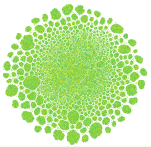
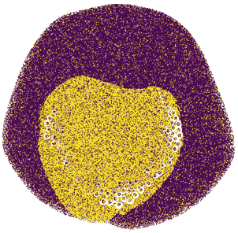
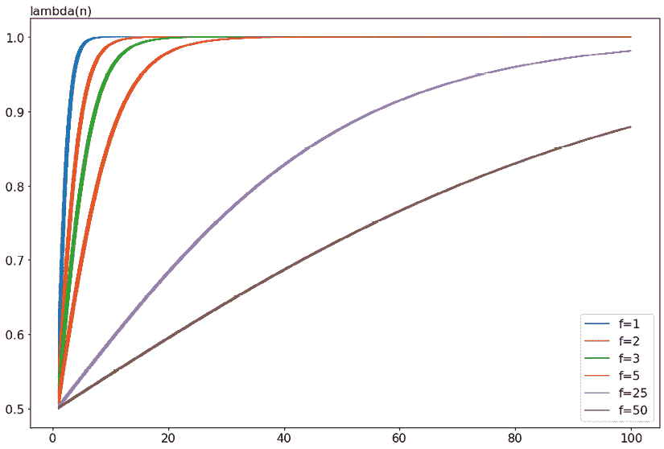
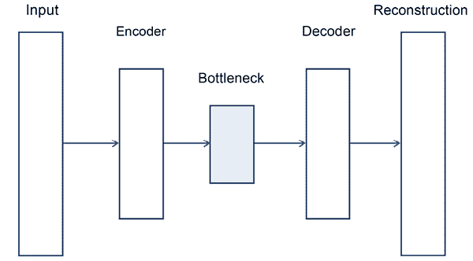
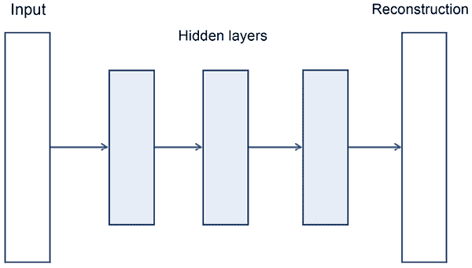
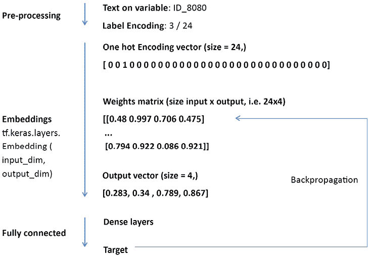

# 7

# 为表格竞赛建模

直到 2017 年，没有必要在竞赛类型之间区分太多，由于绝大多数竞赛都是基于表格数据，你甚至找不到 Kaggle 论坛上关于“表格竞赛”的提及。突然，一切都变了。在相对缺乏竞赛（见[`www.kaggle.com/general/49904`](https://www.kaggle.com/general/49904)）之后，深度学习竞赛占据了上风，表格竞赛变得更为罕见，让许多人感到失望。它们变得如此罕见，以至于 Kaggle 最近不得不基于合成数据推出一系列表格竞赛。发生了什么？

到 2017-2018 年，数据科学已经发展到成熟阶段，许多公司已经开始了他们的数据之旅。数据科学仍然是一个热门话题，但不再是那么罕见。与当时 Kaggle 上充斥的问题类似的问题解决方案已经成为了许多公司的标准实践。在这种情况下，赞助商不太可能启动外部表格竞赛，因为他们已经在内部处理相同的问题。相比之下，深度学习仍然是一个未被充分探索的领域，并且将在很长时间内继续如此，因此开始竞赛来挑战现状并看看是否会出现新的东西是有意义的。

在本章中，我们将讨论表格竞赛。我们将涉及一些著名的历史性竞赛，并专注于更近期的表格游乐场系列，因为表格问题是大多数数据科学家标准实践的一部分，而且从 Kaggle 中确实有很多东西可以学习。我们将从讨论**探索性数据分析**（EDA）和**特征工程**开始，这两者是这些竞赛中的常见活动。

在介绍特征工程的关键策略之后，我们将扩展到许多相关主题，例如分类编码、特征选择、目标变换和伪标签。我们将以讨论表格数据的深度学习方法结束，介绍一些专门的深度神经网络，如 TabNet，并展示一个降噪自编码器。我们将解释为什么自编码器在最近的 Kaggle 竞赛中变得如此相关，同时在现实世界的应用中仍然处于边缘地位。

我们将涵盖：

+   表格游乐场系列

+   设置随机状态以实现可重复性

+   EDA 的重要性

+   减小你的数据大小

+   应用特征工程

+   伪标签

+   使用自编码器进行降噪

+   表格竞赛中的神经网络

本章不会涵盖与表格竞赛相关的所有主题，但你可以在许多其他书籍中轻松找到这些主题，因为它们是数据科学的核心。本章将做的是展示一系列特殊技术和方法，这些技术和方法表征了 Kaggle 上的表格竞赛，而且你不太可能在其他地方轻易找到，除非是在 Kaggle 论坛上。

# 表格游乐场系列

由于对表格问题的巨大需求，Kaggle 员工在 2021 年开始了一项实验，推出了一项名为“表格游乐场系列”的月度比赛。这些比赛基于复制公共数据或先前比赛数据的合成数据集。这些合成数据是通过名为 **CTGAN** 的深度学习生成网络创建的。

您可以在[`github.com/sdv-dev/CTGAN`](https://github.com/sdv-dev/CTGAN)找到 CTGAN 代码。还有一篇相关的论文解释了它是如何通过模拟表格数据中行的概率分布来工作的，然后生成逼真的合成数据（见[`arxiv.org/pdf/1907.00503v2.pdf`](https://arxiv.org/pdf/1907.00503v2.pdf))。

*合成数据宝库* ([`sdv.dev/`](https://sdv.dev/))，一个麻省理工学院的倡议，创造了 CTGAN 背后的技术以及围绕它的许多工具。结果是建立了一套开源软件系统，旨在帮助企业生成模仿真实数据的合成数据；它可以帮助数据科学家根据真实数据创建匿名数据集，以及为建模目的增强现有数据集。

Kaggle 在 2021 年推出了 13 个相当成功的比赛，尽管没有提供积分、奖牌或奖品（只有一些商品），但仍然吸引了众多 Kagglers。以下是 2021 年的列表；您可以使用它通过类型或指标定位特定问题，并查找相关的资源，如专题讨论或笔记本：

| **月份** | **问题** | **变量** | **指标** | **缺失数据** |
| --- | --- | --- | --- | --- |
| **一月 2021** | 对未指定问题的回归 | 数值 | RMSE | 否 |
| **二月 2021** | 预测保险索赔价值的回归 | 数值和分类 | RMSE | 否 |
| **三月 2021** | 预测保险索赔的二分类 | 数值和分类 | AUC | 否 |
| **四月 2021** | 与原始泰坦尼克数据集非常相似的复制品的二分类 | 数值和分类 | 准确率 | 是 |
| **五月 2021** | 预测电子商务产品类别的多分类，基于列表的各种属性 | 分类 | 多分类 LogLoss | 否 |
| **六月 2021** | 预测电子商务产品类别的多分类，基于列表的各种属性 | 数值和分类 | 多分类 LogLoss | 否 |
| **七月 2021** | 通过各种输入传感器值（例如，时间序列）预测城市空气污染的多元回归 | 数值，时间 | RMSLE | 是 |
| **八月 2021** | 计算与贷款违约相关的损失的回归 | 数值 | RMSE | 否 |
| **30 天的机器学习** | 保险索赔价值的回归 | 数值和分类 | RMSE | 否 |
| **九月 2021** | 预测是否会在保险单上提出索赔的二分类 | 数值 | AUC | 是 |
| **2021 年 10 月** | 二元分类预测给定各种化学性质的分子的生物反应 | 数值和分类 | AUC | 否 |
| **2021 年 11 月** | 通过从电子邮件中提取的各种特征识别垃圾邮件的二进制分类 | 数值 | AUC | 否 |
| **2021 年 12 月** | 基于原始*森林覆盖类型预测*竞赛的多类分类 | 数值和分类 | 多类分类准确率 | 否 |

表 7.1：2021 年 Tabular Playground Series 竞赛

Tabular Playground 竞赛在 2022 年继续进行，面临更加复杂和具有挑战性的问题：

| **2022 年 1 月** | 预测 Kaggle 商品的销售，基于两个虚构的独立商店链 | 日期和分类 | 对称平均绝对百分比误差（SMAPE） | 否 |
| --- | --- | --- | --- | --- |
| **2022 年 2 月** | 使用包含一些数据压缩和数据丢失的基因组分析技术数据对 10 种不同的细菌物种进行分类 | 数值 | 分类准确率 | 否 |

表 7.2：2022 年 Tabular Playground Series 竞赛

本章的大部分内容是通过观察在这些竞赛中出现的代码和讨论来撰写的，而不是分析过去的更辉煌的竞赛。正如我们提到的，我们认为由于专业环境的改变，表格竞赛确实已经永久消失了，您会发现阅读与现在相关的建议和提示比过去更有用。

正如在其他带有 Kaggle 积分和奖牌的完整竞赛中一样，在表格竞赛中，我们建议您遵循一个简单但非常有效的流程，我们在本书的其他地方讨论过：

+   探索性数据分析（EDA）

+   数据准备

+   建模（使用交叉验证策略进行模型验证）

+   后处理

+   提交

通常，您还必须注意保持可重复性和保存所有模型（来自每个折叠），使用的参数列表，所有折叠预测，所有出折叠预测，以及训练在所有数据上的模型的所有预测。

您应该以易于恢复和重建的方式保存所有这些信息，例如使用适当的标签，跟踪 MD5 散列值（您可以参考此 Stack Overflow 答案以获取详细信息：[`stackoverflow.com/questions/16874598/how-do-i-calculate-the-md5-checksum-of-a-file-in-python`](https://stackoverflow.com/questions/16874598/how-do-i-calculate-the-md5-checksum-of-a-file-in-python)），以及跟踪每个实验的 CV 分数和排行榜结果。大多数 Kagglers 使用简单的工具，如`.txt`文件或 Excel 电子表格来完成这项工作，但存在更复杂的方法，例如使用：

+   **DVC** ([`dvc.org/`](https://dvc.org/))

+   **Weights and Biases** ([`wandb.ai/site`](https://wandb.ai/site))

+   **MLflow** ([`mlflow.org/`](https://mlflow.org/))

+   **Neptune**([`neptune.ai/experiment-tracking`](https://neptune.ai/experiment-tracking))

最后，重要的是结果，而不是你使用的工具，所以尽量在实验和模型中保持秩序，即使在竞赛的激烈竞争中也是如此。

在我们继续之前，也要考虑一下 Kaggle 用于生成这些竞赛数据的科技；如果你能正确理解数据是如何生成的，这将给你带来重要的优势。此外，理解合成数据的工作原理确实可以影响你在现实世界中做数据科学的方式，因为它为你提供了一种轻松获取更多样化数据用于训练的方法。

例如，让我们以*Google Brain – 呼吸机压力预测*竞赛([`www.kaggle.com/c/ventilator-pressure-prediction`](https://www.kaggle.com/c/ventilator-pressure-prediction))为例。在这个竞赛中，你必须开发用于机械通气控制的机器学习。虽然你可以通过使用深度学习对提供的数据进行建模来获得良好的结果，但由于数据的合成来源，你也可以逆向工程其生成过程，并获得排行榜上的顶尖结果，正如*Jun Koda*([`www.kaggle.com/junkoda`](https://www.kaggle.com/junkoda))所做并在他的帖子中解释的那样：[`www.kaggle.com/c/ventilator-pressure-prediction/discussion/285278`](https://www.kaggle.com/c/ventilator-pressure-prediction/discussion/285278)。

通过自己生成人工数据和理解合成数据从未如此简单，您可以从这个笔记本([`www.kaggle.com/lucamassaron/how-to-use-ctgan-to-generate-more-data`](https://www.kaggle.com/lucamassaron/how-to-use-ctgan-to-generate-more-data))中验证，这个笔记本最初是由*Dariush Bahrami*([`www.kaggle.com/dariushbahrami`](https://www.kaggle.com/dariushbahrami))编写和测试的。

# 设置随机状态以实现可重现性

在我们开始讨论在表格竞赛中可能使用的步骤和模型之前，回到我们上面提到的**可重现性**主题将是有用的。

在你看到的 Kaggle 笔记本上的大多数命令中，你都会找到一个参数声明一个数字，一个**种子**，作为随机状态。这个设置对你的结果的可重现性很重要。由于许多算法不是确定性的，而是基于随机性，通过设置种子，你影响随机生成器的行为，使其随机性变得*可预测*：相同的随机种子对应相同的随机数序列。换句话说，它允许你在每次运行相同的代码后获得相同的结果。

正因如此，你在 Scikit-learn 中的所有机器学习算法以及所有与 Scikit-learn 兼容的模型（例如，XGBoost、LightGBM 和 CatBoost，仅举一些最受欢迎的）中都会找到一个随机种子设置参数。

在现实世界项目和 Kaggle 比赛中，结果的可重复性都同样重要。在现实世界中，拥有一个可重复的模型可以更好地跟踪模型开发和一致性。在 Kaggle 比赛中，可重复性有助于更好地测试假设，因为你正在控制模型中的任何变化来源。例如，如果你创建了一个新特征，将其放入可重复的管道中，将有助于你了解该特征是否有优势。你可以确信模型中的任何改进或恶化只能归因于该特征，而不是由于自上次运行模型以来某些随机过程的变化。

再次强调，在处理公共笔记本时，可重复性可以为你带来优势。这些笔记本通常会有一个固定的种子值，可能是 0、1 或 42。数字 42 之所以流行，是因为它是对道格拉斯·亚当斯的《银河系漫游指南》的引用，在那里它是“生命、宇宙和一切的终极问题的答案”，由名为“深思想”的超级计算机在 7500 万年内计算得出。现在，如果比赛中的每个人都使用相同的随机种子，可能会产生双重效果：

+   随机种子可能与公共排行榜配合得过于完美，这意味着过度拟合

+   许多 Kagglers 会产生类似的结果，这将以相同的方式影响他们在私人排行榜上的排名

通过改变随机种子，你正在避免过度拟合并打破排名；换句话说，你得到了与其他人不同的结果，这最终可能让你处于优势地位。此外，如果你最终赢得了 Kaggle 比赛，你需要展示你的模型是如何产生获奖提交的，因此，如果你想要快速获得奖金，确保一切完全可重复至关重要。

TensorFlow 和 PyTorch 模型没有明确使用随机种子参数，因此确保它们的完全可重复性更具挑战性。以下代码片段在运行时为 TensorFlow 和 PyTorch 模型设置相同的随机种子：

```py
def seed_everything(seed, 
                    tensorflow_init=True, 
                    pytorch_init=True):
    """
    Seeds basic parameters for reproducibility of results
    """
    random.seed(seed)
    os.environ["PYTHONHASHSEED"] = str(seed)
    np.random.seed(seed)
    if tensorflow_init is True:
        tf.random.set_seed(seed)
    if pytorch_init is True:
        torch.manual_seed(seed)
        torch.cuda.manual_seed(seed)
        torch.backends.cudnn.deterministic = True
        torch.backends.cudnn.benchmark = False 
```

对于 Scikit-learn 来说，相反建议直接设置随机种子——当类或函数允许时——使用`random_state`参数。

# EDA 的重要性

**EDA**（探索性数据分析）这个术语来源于现代统计方法学的杰出代表约翰·W·图基的工作。在他的 1977 年著作《探索性数据分析》（EDA 的缩写），图基认为 EDA 是一种探索数据、揭示证据并发展可以由统计测试后来证实假设的方法。

他的想法是，我们如何定义统计假设可能更多地基于观察和推理，而不是仅仅基于数学计算的顺序测试。这个想法很好地转化为机器学习领域，因为，正如我们将在下一节讨论的，数据可以被改进和预处理，以便学习算法可以更好地、更有效地工作。

在 Kaggle 竞赛的 EDA 中，你将寻找：

+   缺失值，更重要的是，与目标相关的缺失值模式。

+   偏斜的数值变量及其可能的转换。

+   可以一起分组的分类变量中的罕见类别。

+   可能的异常值，包括单变量和多变量。

+   高度相关（甚至重复）的特征。对于分类变量，关注重叠的类别。

+   对于该问题最有预测性的特征。

你可以通过几种描述性分析、图表和图表来实现这一点，首先检查每个独特的特征（**单变量分析**，在统计学中），然后匹配几个变量（**双变量分析**，例如在散点图中），最后同时考虑更多特征（**多变量方法**）。

如果你感到懒惰或者不确定如何以及从哪里开始，最初依赖自动化策略可能会有所帮助。例如，你可能发现**AutoViz** ([`github.com/AutoViML/AutoViz`](https://github.com/AutoViML/AutoViz))，这是一个流行的快速 EDA 免费软件工具，可以为你节省大量时间。你可以在笔记本上通过运行以下命令来安装它：

```py
pip install git+git://github.com/AutoViML/AutoViz.git 
```

通过阅读 Dan Roth 在 Medium 上发表的这篇文章，你可以更清楚地了解 AutoViz 能为你做什么，文章链接为[`towardsdatascience.com/autoviz-a-new-tool-for-automated-visualization-ec9c1744a6ad`](https://towardsdatascience.com/autoviz-a-new-tool-for-automated-visualization-ec9c1744a6ad)，或者浏览一些有趣的公共笔记本，例如 Georgii Vyshnia 的[`www.kaggle.com/gvyshnya/automating-eda-and-feature-importance-detection`](https://www.kaggle.com/gvyshnya/automating-eda-and-feature-importance-detection)，[`www.kaggle.com/gvyshnya`](https://www.kaggle.com/gvyshnya)。

在后面的链接中，你还可以找到对另一个工具**Sweetviz** ([`github.com/fbdesignpro/sweetviz`](https://github.com/fbdesignpro/sweetviz))的引用。Sweetviz 有一篇基于泰坦尼克号数据集的概述文章和教程，可在[`towardsdatascience.com/powerful-eda-exploratory-data-analysis-in-just-two-lines-of-code-using-sweetviz-6c943d32f34`](https://towardsdatascience.com/powerful-eda-exploratory-data-analysis-in-just-two-lines-of-code-using-sweetviz-6c943d32f34)找到。

你可能还会发现另一个有用的流行工具是**Pandas Profiling** ([`github.com/pandas-profiling/pandas-profiling`](https://github.com/pandas-profiling/pandas-profiling))，它更依赖于经典的统计描述性统计和可视化，如这篇文章所述：[`medium.com/analytics-vidhya/pandas-profiling-5ecd0b977ecd`](https://medium.com/analytics-vidhya/pandas-profiling-5ecd0b977ecd)。

等待其他 Kagglers（数据科学家社区）发布有趣的 EDA 笔记本也可能是一个解决方案，所以请始终关注笔记本部分；有时，宝贵的提示可能会出现。这应该会启动你的建模阶段，并帮助你了解竞赛的基本规则和禁忌。然而，记住，当 EDA 对特定问题高度具体时，它就不再是商品，而成为竞赛的资产；这是你在自动化解决方案中永远找不到的，在公开笔记本中也很少见。你必须自己进行 EDA 并收集关键、获胜的见解。

考虑到所有这些因素，我们的建议是稍微了解一下自动化工具，因为它们真的很容易学习和运行。你可以节省大量的时间，这些时间你可以用来查看图表和推理可能的见解，这无疑会帮助你在竞赛中的表现。然而，在这样做之后，你需要学习 Matplotlib 和 Seaborn，并尝试在不太标准的图表上做一些自己的尝试，这些图表依赖于提供的数据类型和问题。

例如，如果你被给了一系列随时间进行的测量数据，基于时间的连续函数的绘图与绘制单个记录的时间点一样有用，例如显示一个观测值与另一个观测值之间的不同滞后，这可能表明揭示了更好的预测的见解。

## 使用 t-SNE 和 UMAP 进行降维

在进行 EDA（电子设计自动化）时，你可以创建许多可能的图表，我们并没有意图在这里列出所有，但有一些降维图表值得花点篇幅讨论，因为它们可以提供与非常具体和定制化图表一样多的信息。这些是**t-SNE** ([`lvdmaaten.github.io/tsne/`](https://lvdmaaten.github.io/tsne/))和**UMAP** ([`github.com/lmcinnes/umap`](https://github.com/lmcinnes/umap))。

t-SNE 和 UMAP 是两种数据科学家经常使用的技术，它们允许你将多元数据投影到低维空间。它们通常用于在二维空间中表示复杂的数据集。2-D UMAP 和 t-SNE 图表可以揭示数据问题中异常值和相关的聚类。

实际上，如果你能绘制出结果 2-D 投影的散点图，并按目标值着色，这个图表可能会给你一些关于处理子组的可能策略的提示。

尽管它与图像竞赛有关，但 UMAP 和 t-SNE 如何帮助你更好地理解数据的良好例子是*Chris Deotte*为*SIIM-ISIC 黑色素瘤分类*竞赛的分析（见[`www.kaggle.com/c/siim-isic-melanoma-classification/discussion/168028`](https://www.kaggle.com/c/siim-isic-melanoma-classification/discussion/168028)）。在这个例子中，Chris 将训练数据和测试数据关联到了同一低维投影上，突出了只有测试示例存在的部分。

尽管 UMAP 和 t-SNE 在发现难以找到的数据模式方面提供了无价的帮助，但你仍然可以将它们用作建模努力中的特征。在*Otto Group 产品分类挑战*中，*Mike Kim*使用 t-SNE 投影作为竞赛的训练特征，展示了这种使用的有趣例子（见[`www.kaggle.com/c/otto-group-product-classification-challenge/discussion/14295`](https://www.kaggle.com/c/otto-group-product-classification-challenge/discussion/14295)）。

如文章*如何有效地使用 t-SNE*([`distill.pub/2016/misread-tsne/`](https://distill.pub/2016/misread-tsne/))所述，你必须正确使用这些技术，因为很容易在没有任何聚类和模式的地方发现它们。同样的警告也适用于 UMAP，因为它也可以生成可能被误读的图表。例如[`pair-code.github.io/understanding-umap/`](https://pair-code.github.io/understanding-umap/)这样的指南为 UMAP 和 t-SNE 在真实世界数据上的性能提供了合理的建议和注意事项。

尽管存在这些危险，但根据我们的经验，这些方法肯定比基于 PCA 或 SVD 等线性组合方差重构的经典方法更有揭示性。与这些方法相比，UMAP 和 t-SNE 能够极大地降低维度，同时保持数据的拓扑结构，允许可视化结果。然而，作为副作用，它们的拟合速度要慢得多。不过，NVIDIA 已经发布了基于 CUDA 的**RAPIDS**套件([`developer.nvidia.com/rapids`](https://developer.nvidia.com/rapids))，使用 GPU 驱动的笔记本或脚本，可以在非常合理的时间内返回 UMAP 和 t-SNE 的结果，从而有效地将其用作 EDA 工具。

你可以在以下链接中找到一个有用的例子，展示了如何使用 RAPIDS 实现和 GPU 进行数据探索，以参加*30 Days of ML*竞赛：[`www.kaggle.com/lucamassaron/interesting-eda-tsne-umap/`](https://www.kaggle.com/lucamassaron/interesting-eda-tsne-umap/)。

在下面的图中，这是上述示例笔记本的输出，你可以看到多个聚类如何填充数据集，但没有任何一个可以被认定为与目标有特定的关系：



图 7.1：t-SNE 图中出现的多个聚类

在另一个笔记本([`www.kaggle.com/lucamassaron/really-not-missing-at-random`](https://www.kaggle.com/lucamassaron/really-not-missing-at-random))中，相同的技巧被应用于缺失样本的二进制指标，揭示出一些引人入胜的图表，这些图表暗示了由某种特定类型响应主导的特定和独立区域。实际上，在那个例子中，缺失样本并不是随机出现的，它们具有相当强的预测性：



图 7.2：这个 t-SNE 图很容易揭示出正目标占主导地位的区域

# 减少数据大小

如果你直接在 Kaggle 笔记本上工作，你会发现它们的限制相当令人烦恼，处理它们有时会变成一个耗时的工作。这些限制之一是内存不足错误，这会停止执行并迫使你从脚本开始重新启动。这在许多比赛中相当常见。然而，与基于文本或图像的深度学习比赛不同，在这些比赛中你可以分批从磁盘检索数据并处理它们，而大多数处理表格数据的算法都需要在内存中处理所有数据。

最常见的情况是，当你使用 Pandas 的 `read_csv` 从 CSV 文件上传数据时，但 DataFrame 太大，无法在 Kaggle 笔记本中进行特征工程和机器学习。解决方案是在不丢失任何信息的情况下压缩你使用的 Pandas DataFrame 的大小（**无损压缩**）。这可以通过以下脚本轻松实现，该脚本源自 *Guillaume Martin* 的工作（你可以在以下位置找到原始笔记本：[`www.kaggle.com/gemartin/load-data-reduce-memory-usage`](https://www.kaggle.com/gemartin/load-data-reduce-memory-usage))。

```py
def reduce_mem_usage(df, verbose=True):
    numerics = ['int16', 'int32', 'int64', 
                'float16', 'float32', 'float64']'
    start_mem = df.memory_usage().sum() / 1024**2    
    for col in df.columns:
        col_type = df[col].dtypes
        if col_type in numerics:
            c_min = df[col].min()
            c_max = df[col].max()
            if str(col_type)[:3] == 'int':
                if c_min > np.iinfo(np.int8).min and c_max < np.iinfo(np.int8).max:
                    df[col] = df[col].astype(np.int8)
                elif c_min > np.iinfo(np.int16).min and c_max < np.iinfo(np.int16).max:
                    df[col] = df[col].astype(np.int16)
                elif c_min > np.iinfo(np.int32).min and c_max < np.iinfo(np.int32).max:
                    df[col] = df[col].astype(np.int32)
                elif c_min > np.iinfo(np.int64).min and c_max < np.iinfo(np.int64).max:
                    df[col] = df[col].astype(np.int64)  
            else:
                if c_min > np.finfo(np.float32).min and c_max < np.finfo(np.float32).max:
                    df[col] = df[col].astype(np.float32)
                else:
                    df[col] = df[col].astype(np.float64)    
    end_mem = df.memory_usage().sum() / 1024**2
    if verbose: print('Mem. usage decreased to {:5.2f} Mb ({:.1f}% reduction)'.format(end_mem, 100 * (start_mem - end_mem) / start_mem))
    return df 
```

*Guillaume Martin* 并不是第一个在 Kaggle 上提出这种想法的人。第一个有这种压缩 Pandas DataFrame 想法的 Kaggler 是 *Arjan Groen*，他在 Zillow 比赛中编写了一个减少函数([`www.kaggle.com/arjanso/reducing-dataframe-memory-size-by-65`](https://www.kaggle.com/arjanso/reducing-dataframe-memory-size-by-65))。

这个脚本利用了这样一个事实：数据集中的所有数值特征都位于一个特定的值域内。由于 Python 中有不同类型的整数和浮点数值变量，根据它们在内存中占用的字节数，脚本会将每个特征中找到的值域与每种数值类型可以接受的最大值和最小值进行比较。这样做是为了将特征设置为与其值域相匹配且需要最低内存的数值类型。

这种方法在 Kaggle 笔记本上工作得像微风一样，但也有一些注意事项。一旦你通过压缩为每个特征设置了最佳匹配的数值类型，你就不能应用任何可能导致数值超过设定数值类型容量的特征工程，因为这样的操作会产生错误的结果。我们的建议是在特征工程之后或在进行不会重新缩放现有数据的主要转换之前应用它。结合垃圾收集库`gc`和`gc.collect()`方法将改善你的 Kaggle 笔记本的内存状况。

减小你的数据大小（以及其他事情）的另一种方式是使用特征工程（特别是特征选择和数据压缩）。

# 应用特征工程

在现实世界的项目中，能够区分成功机器学习模型和一般模型的往往是数据，而不是模型。当我们谈论数据时，区分糟糕、良好和优秀数据的不同之处不仅仅是缺失值的缺乏和值的可靠性（其“质量”），或者是可用示例的数量（其“数量”）。根据我们的经验，真正的区分因素是内容本身的信息价值，这由特征的类型来表示。

特征是数据科学项目中真正可以塑造的粘土，因为它们包含了模型用来分离类别或估计值的所需信息。每个模型都有表达性和将特征转换为预测的能力，但如果你在特征方面有所欠缺，没有任何模型能帮助你启动并给出更好的预测。*模型只是使数据中的价值显现出来。它们本身并不具有魔法*。

在 Kaggle 上，除了那些罕见的比赛中你可以寻找更多数据来添加之外，所有参与者从开始就拥有相同的数据。在那个阶段，你如何处理数据就构成了大部分差异。忽视你可以改进现有数据的这一事实是许多 Kagglers 常犯的一个错误。**特征工程**，一套将数据转换为对模型更有用信息的技术的集合，是提高比赛表现的关键。即使你应用的模型更强大，也需要你处理数据并将其呈现为更易于理解的形式。

特征工程也是将任何**先验知识**（通常是关于问题的专业知识）嵌入数据的方式：通过求和、减法或除法现有特征，您可以得到可以更好地解释您正在处理的问题的指标或估计。特征工程还有其他目的，在 Kaggle 竞赛中可能不那么有价值，但在现实世界的项目中可能很重要。第一个目的是减少训练数据的大小（在处理 Notebooks 时，这可能在 Kaggle 竞赛中也有用，因为 Notebooks 有内存限制）。第二个目的是通过使用人类可理解的特征来使结果的模型更容易解释。

每个领域可能都有编码特定的变量变换，这些变换可能不是显而易见的，但对该领域专家来说是众所周知的。想想金融领域，在那里您必须通过应用特定的变换（如卡尔曼滤波或小波变换）来区分不同特征集的信号和噪声，这些特征集代表市场和公司数据。鉴于可能存在的领域数量和许多特征工程过程的复杂性，在本节中，我们不会深入探讨特定领域的专业知识及其处理特征的特殊方式。

相反，我们将向您展示最常见和最通用的技术，您可以在任何表格竞赛中应用这些技术。

## 容易导出的特征

使用变换来提取特征是最简单的方法，但通常也是最有效的。例如，计算特征比率（将一个特征除以另一个特征）可能非常有效，因为许多算法无法模拟除法（例如，梯度提升）或者很难尝试模拟（例如，深度神经网络）。以下是一些常见的变换尝试：

+   **时间特征处理**：将日期分解为其元素（年、月、日）；将其转换为年份中的周和星期几；计算日期之间的差异；计算与关键事件之间的差异（例如，假日）。

对于日期，另一种常见的变换是从日期或时间中提取时间元素。基于正弦和余弦变换的循环连续变换也很有用，可以表示时间的连续性并创建周期性特征：

```py
cycle = 7
df['weekday_sin'] = np.sin(2 * np.pi * df['col1'].dt.dayofweek / cycle)
df['weekday_cos'] = np.cos(2 * np.pi * df['col1'].dt.dayofweek / cycle) 
```

+   **数值特征变换**：缩放；归一化；对数或指数变换；分离整数和十进制部分；对两个数值特征求和、减法、乘法或除法。通过标准化（统计学中使用的 z 分数方法）或归一化（也称为最小-最大缩放）获得的缩放对于使用对特征规模敏感的算法（如任何神经网络）是有意义的。

+   **数值特征的分箱**：这是通过将值分布到一定数量的箱中来将连续变量转换为离散变量。分箱有助于去除数据中的噪声和错误，并且当与**独热编码**（例如，查看 Scikit-learn 实现）结合使用时，它允许对分箱特征和目标变量之间的非线性关系进行建模。

+   **分类特征编码**：独热编码；将两个或三个分类特征合并在一起的数据处理；或者更复杂的目标编码（更多内容将在以下章节中介绍）。

+   **基于级别的分类特征拆分和聚合**：例如，在*泰坦尼克号*竞赛([`www.kaggle.com/c/titanic`](https://www.kaggle.com/c/titanic))中，你可以拆分名字和姓氏，以及它们的缩写，以创建新的特征。

+   **多项式特征**是通过将特征提升到指数来创建的。例如，查看这个 Scikit-learn 函数：[`scikit-learn.org/stable/modules/generated/sklearn.preprocessing.PolynomialFeatures.html`](https://scikit-learn.org/stable/modules/generated/sklearn.preprocessing.PolynomialFeatures.html).

虽然它们不是正确的特征工程，而是更多数据清洗技术，但缺失数据和异常值处理涉及对数据进行更改，这些更改仍然会转换你的特征，并且它们可以帮助数据中的信号出现：

+   **缺失值处理**：创建指示缺失值的二元特征，因为有时缺失并不是随机的，缺失值背后可能有重要的原因。通常，缺失值表明了数据记录的方式，充当其他变量的代理变量。就像人口普查调查一样：如果有人不告诉你他们的收入，这意味着他们非常贫穷或非常富有。如果学习算法需要，可以用平均值、中位数或众数（很少需要使用更复杂的方法）替换缺失值。

你可以参考由*Parul Pandey*编写的完整指南作为参考：[`www.kaggle.com/parulpandey`](https://www.kaggle.com/parulpandey) [`www.kaggle.com/parulpandey/a-guide-to-handling-missing-values-in-python`](https://www.kaggle.com/parulpandey/a-guide-to-handling-missing-values-in-python).

只需记住，一些模型可以自己处理缺失值，并且做得比许多标准方法都要好，因为缺失值处理是它们优化过程的一部分。可以自己处理缺失值的模型都是梯度提升模型：

+   XGBoost: [`xgboost.readthedocs.io/en/latest/faq.html`](https://xgboost.readthedocs.io/en/latest/faq.html)

+   LightGBM: [`lightgbm.readthedocs.io/en/latest/Advanced-Topics.html`](https://lightgbm.readthedocs.io/en/latest/Advanced-Topics.html)

+   CatBoost: [`catboost.ai/docs/concepts/algorithm-missing-values-processing.html`](https://catboost.ai/docs/concepts/algorithm-missing-values-processing.html)

+   **异常值上限或移除**：排除、将值上限或下限设置为最大或最小值，或修改数据中的异常值。为此，你可以使用复杂的多变量模型，例如 Scikit-learn 中提供的那些（[`scikit-learn.org/stable/modules/outlier_detection.html`](https://scikit-learn.org/stable/modules/outlier_detection.html)）。

否则，你可以简单地以单变量方式定位异常样本，根据它们与平均值的多少个标准差或它们与**四分位数范围**（**IQR**）边界的距离来做出判断。在这种情况下，你可能简单地排除任何高于`1.5 * IQR + Q3`（上异常值）或低于`Q1 - 1.5 * IQR`（下异常值）的点。一旦你找到了异常值，你也可以通过使用二元变量来指出它们。

所有这些数据转换都可以提高你的模型的预测性能，但在比赛中它们很少是决定性的。尽管这是必要的，但你不能仅仅依赖于基本的特征工程。在接下来的章节中，我们将建议更复杂的程序来从你的数据中提取价值。

## 基于行和列的元特征

为了在竞争中表现出色，你需要更复杂的特征工程。一个好的开始是查看基于每一**行**的特征，单独考虑：

+   计算数值值（或其子集）的均值、中位数、总和、标准差、最小值或最大值

+   计算缺失值

+   计算行中找到的常见值的频率（例如，考虑二元特征并计算正值）

+   将每一行分配到由聚类分析（如**k**-均值）得出的簇中

这些**元特征**（之所以称为这样，是因为它们是代表一组单个特征的特性）通过指出算法中的特定样本组来帮助区分你数据中找到的不同类型的样本。

元特征也可以基于**列**构建。对单个特征的聚合和汇总操作的目标是提供有关数值和分类特征值的信息；*这个特征是常见还是罕见？* 这是模型无法掌握的信息，因为它无法在特征中计数分类实例。

作为元特征，你可以使用任何类型的列统计量（例如众数、均值、中位数、总和、标准差、最小值、最大值，以及对于数值特征的偏度和峰度）。对于列向的元特征，你可以采取几种不同的方法：

+   **频率编码**：简单统计分类特征中值的频率，然后在新的特征中用这些值的频率来替换它们。当数值特征中存在频繁出现的值时，也可以对数值特征应用频率编码。

+   **相对于相关组的频率和列统计信息计算**：在这种情况下，您可以从数值和分类特征的值中创建新特征，因为您正在考虑数据中的不同组。一个组可以是您通过聚类分析计算出的聚类，或者您可以使用特征定义的组（例如，年龄可以产生年龄组，地区可以提供区域，等等）。然后，根据每个样本所属的组应用描述每个组的元特征。例如，使用 Pandas 的`groupby`函数，您可以创建元特征，然后根据分组变量将它们与原始数据合并。这个特征工程技术的难点在于在数据中找到有意义的组来计算特征。

+   通过组合更多的组，可以进一步推导出列频率和统计信息。

列表当然不是详尽的，但它应该能给您一个在特征级别和行级别使用频率和统计信息寻找新特征的思路。

让我们通过一个基于*Amazon Employee Access Challenge*数据的简单例子来看看。首先，我们将对`ROLE_TITLE`特征应用频率编码：

```py
import pandas as pd
train = pd.read_csv("../input/amazon-employee-access-challenge/train.csv")
# Frequency count of a feature
feature_counts = train.groupby('ROLE_TITLE').size()
print(train['ROLE_TITLE'].apply(lambda x: feature_counts[x])) 
```

结果将显示特征类别已被它们的观察频率所取代。

现在我们继续根据`ROLE_DEPTNAME`的分组对`ROLE_TITLE`特征进行编码，因为我们预计不同的头衔在某些部门可能更常见，而在其他部门则更罕见。

结果将是一个由两者组成的新特征，我们用它来计算其值的频率：

```py
feature_counts = train.groupby(['ROLE_DEPTNAME', 'ROLE_TITLE']).size()
print(train[['ROLE_DEPTNAME', 'ROLE_TITLE']].apply(lambda x: feature_counts[x[0]][x[1]], axis=1)) 
```

您可以在以下 Kaggle 笔记本中找到所有的工作代码和结果：[`www.kaggle.com/lucamassaron/meta-features-and-target-encoding/`](https://www.kaggle.com/lucamassaron/meta-features-and-target-encoding/).

## 目标编码

由于 Scikit-learn 提供的简单函数，如：

+   `LabelEncoder`

+   `OneHotEncoder`

+   `OrdinalEncoder`

这些函数可以将类别转换为数值特征，然后再转换为机器学习算法容易处理的二进制特征。然而，当需要处理的类别数量太多时，由单热编码策略产生的数据集会变得**稀疏**（其中大部分值将是零值），对于计算机或笔记本的内存和处理器来说处理起来很麻烦。在这些情况下，我们谈论的是**高基数特征**，这需要特殊处理。

自从早期的 Kaggle 竞赛以来，高基数变量实际上已经使用一个根据 Micci-Barreca, D. 的编码函数进行处理，该函数是根据 *在分类和预测问题中处理高基数分类属性的前处理方案*。ACM SIGKDD Explorations Newsletter 3.1 (2001): 27-32。

这种方法的背后思想是将分类特征的多个类别转换为它们对应的预期目标值。在回归的情况下，这是该类别的平均预期值；对于二分类，它是给定该类别的条件概率；对于多分类，你有每个可能结果的条件概率。

例如，在 *泰坦尼克号* 入门竞赛 ([`www.kaggle.com/competitions/titanic`](https://www.kaggle.com/competitions/titanic)) 中，你必须确定每位乘客的生存概率，对分类特征进行目标编码，例如性别特征，意味着用其平均生存概率替换性别值。

以这种方式，分类特征被转换为一个数值型特征，而无需将数据转换为更大和更稀疏的数据集。简而言之，这就是 **目标编码**，它在许多情况下确实非常有效，因为它类似于基于高基数特征的堆叠预测。然而，与堆叠预测一样，你实际上是在使用另一个模型的预测作为特征，目标编码会带来过拟合的风险。事实上，当某些类别非常罕见时，使用目标编码几乎等同于提供目标标签。有方法可以避免这种情况。

在看到可以直接导入到你的代码中的实现之前，让我们看看一个实际的目标编码代码示例。此代码用于 *PetFinder.my 预测竞赛* 中的一个高分提交：

```py
import numpy as np
import pandas as pd
from sklearn.base import BaseEstimator, TransformerMixin
class TargetEncode(BaseEstimator, TransformerMixin):

    def __init__(self, categories='auto', k=1, f=1, 
                 noise_level=0, random_state=None):
        if type(categories)==str and categories!='auto':
            self.categories = [categories]
        else:
            self.categories = categories
        self.k = k
        self.f = f
        self.noise_level = noise_level
        self.encodings = dict()
        self.prior = None
        self.random_state = random_state

    def add_noise(self, series, noise_level):
        return series * (1 + noise_level *   
                         np.random.randn(len(series)))

    def fit(self, X, y=None):
        if type(self.categories)=='auto':
            self.categories = np.where(X.dtypes == type(object()))[0]
        temp = X.loc[:, self.categories].copy()
        temp['target'] = y
        self.prior = np.mean(y)
        for variable in self.categories:
            avg = (temp.groupby(by=variable)['target']
                       .agg(['mean', 'count']))
            # Compute smoothing 
            smoothing = (1 / (1 + np.exp(-(avg['count'] - self.k) /                 
                         self.f)))
            # The bigger the count the less full_avg is accounted
            self.encodings[variable] = dict(self.prior * (1 -  
                             smoothing) + avg['mean'] * smoothing)

        return self

    def transform(self, X):
        Xt = X.copy()
        for variable in self.categories:
            Xt[variable].replace(self.encodings[variable], 
                                 inplace=True)
            unknown_value = {value:self.prior for value in 
                             X[variable].unique() 
                             if value not in 
                             self.encodings[variable].keys()}
            if len(unknown_value) > 0:
                Xt[variable].replace(unknown_value, inplace=True)
            Xt[variable] = Xt[variable].astype(float)
            if self.noise_level > 0:
                if self.random_state is not None:
                    np.random.seed(self.random_state)
                Xt[variable] = self.add_noise(Xt[variable], 
                                              self.noise_level)
        return Xt

    def fit_transform(self, X, y=None):
        self.fit(X, y)
        return self.transform(X) 
```

函数的输入参数为：

+   `categories`: 你想要进行目标编码的特征的列名。你可以保持 `'auto'` 选项开启，类将自动选择对象字符串。

+   `k` (int): 考虑类别平均值的样本的最小数量。

+   `f` (int): 平滑效果，用于平衡类别平均数与先验概率，或相对于所有训练样本的平均值。

+   `noise_level`: 你想要添加到目标编码中的噪声量，以避免过拟合。开始时使用非常小的数字。

+   `random_state`: 当 `noise_level > 0` 时，用于复制相同目标编码的可重复性种子。

注意 `k` 和 `f` 参数的存在。实际上，对于分类特征的 *i* 级别，我们正在寻找一个近似值，这个值可以帮助我们使用单个编码变量更好地预测目标。用观察到的条件概率替换级别可能是解决方案，但对于观察样本较少的级别则效果不佳。解决方案是将该级别的观察后验概率（给定编码特征的特定值的目标概率）与先验概率（在整个样本中观察到的目标概率）使用一个 lambda 因子进行混合。这被称为 **经验贝叶斯方法**。

在实际应用中，我们使用一个函数来确定，对于分类变量的给定级别，我们将使用条件目标值、平均目标值，还是两者的混合。这由 lambda 因子决定，对于固定的 `k` 参数（通常具有单位值，意味着最小单元格频率为两个样本），其输出值取决于我们选择的 `f` 值。



图 7.3：lambda 值（y 轴）随 f 值和分类值的样本大小（x 轴）的变化图

如图表所示，其中 *x* 轴表示给定分类级别的案例数量，*y* 轴表示条件目标值的权重，较小的 `f` 值倾向于突然从使用平均目标值切换到使用条件值。较高的 `f` 值倾向于将条件值与平均值混合，除非我们处理的是具有大量样本的分类级别。

因此，对于固定的 `k`，`f` 的更高值意味着对观察到的经验频率的信任度降低，而对所有单元格的经验概率的依赖性增加。`f` 的正确值通常是一个需要测试的问题（由交叉验证支持），因为你可以将 `f` 参数视为一个超参数本身。

在所有这些解释之后，这个类实际上非常容易使用。用你想要目标编码的特征名称和想要尝试的参数实例化它，并在一些训练数据上拟合它。然后，你可以转换任何其他数据，仅对拟合的特征进行目标编码：

```py
te = TargetEncode(categories='ROLE_TITLE')
te.fit(train, train['ACTION'])
te.transform(train[['ROLE_TITLE']]) 
```

该示例使用的是之前我们使用的相同的 *Amazon Employee Access Challenge* 数据，并且它仅对 `ROLE_TITLE` 特征进行目标编码。

除了编写自己的代码，你还可以使用来自 [`github.com/scikit-learn-contrib/category_encoders`](https://github.com/scikit-learn-contrib/category_encoders) 的包及其目标编码器 ([`contrib.scikit-learn.org/category_encoders/targetencoder.html`](http://contrib.scikit-learn.org/category_encoders/targetencoder.html))。这是一个即用型解决方案，其工作方式与这一节中的代码完全相同。

## 使用特征重要性评估你的工作

过度应用特征工程可能会产生副作用。如果你创建了太多相关特征或者对于问题来说不重要的特征，模型可能需要太长时间来完成训练，你可能会得到更差的结果。这看起来可能像是一个悖论，但这是由以下事实解释的：每个变量都携带一些噪声（由于测量或记录错误而产生的随机成分），模型可能会错误地选择这些噪声而不是信号：你使用的变量越多，你的模型选择噪声而不是信号的几率就越高。因此，你应该尽量只保留你在训练数据集中使用的相关特征；将特征选择视为你特征工程过程（修剪阶段）的一部分。

确定需要保留的特征是一个难题，因为随着可用特征数量的增加，可能的组合数量也增加。有各种方法可以用来选择特征，但首先重要的是要考虑你的数据准备流程中特征选择必须发生的阶段。

根据我们的经验，我们建议你考虑将特征选择放在数据准备流程的**末尾**。由于特征与其他特征共享部分方差，你不能通过逐个测试它们来评估它们的有效性；你必须一次性考虑所有特征，才能正确地确定你应该使用哪些特征。

此外，你还应该使用交叉验证来测试所选特征的有效性。因此，在你准备好所有特征并有一个一致的工作流程和有效的模型（它不需要是一个完全优化的模型，但它应该能够正常工作并返回可接受的竞赛结果）之后，你就可以测试应该保留哪些特征以及可以丢弃哪些特征。在这个阶段，有各种操作特征选择的方法：

+   统计学中使用的经典方法依赖于通过测试每个特征进入或离开预测集集来执行正向添加或反向消除。然而，这种方法可能相当耗时，因为它依赖于变量的一些内部重要性度量或它们对模型性能（相对于特定指标）的影响，你必须在每个步骤中为每个特征重新计算这些度量。

+   对于回归模型，使用 lasso 选择可以通过**稳定性选择**程序提供关于所有重要且相关的特征（实际上，该程序可能还会保留高度相关的特征）的提示。在稳定性选择中，你多次测试（使用袋装过程）应该保留哪些特征——只考虑在每个测试中系数不为零的特征——然后你应用一个投票系统来保留那些最频繁被分配非零系数的特征。

你可以在这个仓库中了解更多关于该过程的细节：[`github.com/scikit-learn-contrib/stability-selection`](https://github.com/scikit-learn-contrib/stability-selection)。

+   对于基于树的模型，如随机森林或梯度提升，基于分裂的纯度降低或目标指标的增益是常见的特征排序方法。一个阈值可以去除最不重要的特征。

+   对于基于树的模型始终如此，但很容易推广到其他模型，基于测试的随机化特征（或与随机特征的简单比较）有助于区分那些有助于模型正确预测的特征和那些只是噪音或冗余的特征。

在这个例子中，*Chris Deotte* 在 *Ventilator Pressure Prediction* 竞赛中提出了一个如何通过随机化特征来选择重要特征的例子：[`www.kaggle.com/cdeotte/lstm-feature-importance`](https://www.kaggle.com/cdeotte/lstm-feature-importance)。这个笔记本测试了特征在基于 LSTM 的神经网络中的作用。首先，构建模型并记录基线性能。然后，逐个对特征进行随机排序，并要求模型再次进行预测。如果预测结果变差，则表明你随机排序了一个不应该被更改的重要特征。相反，如果预测性能保持不变甚至提高，则随机排序的特征对模型没有影响，甚至可能是有害的。

在重要性评估中，也没有免费的午餐。随机排序不需要任何重新训练，这在训练新模型需要时间时是一个巨大的优势。然而，在某些情况下可能会失败。随机排序有时会创建不切实际的不合理输入组合，这些组合在评估时没有意义。在其他情况下，它可能会被高度相关的特征的存在所欺骗（错误地确定一个很重要而另一个不重要）。在这种情况下，通过删除特征（而不是随机排序它），重新训练模型，然后将其性能与基线进行比较是最佳解决方案。

在基于随机特征的另一种方法中，**Boruta** ([`github.com/scikit-learn-contrib/boruta_py`](https://github.com/scikit-learn-contrib/boruta_py)) 以迭代方式使用随机特征来测试模型的有效性。Boruta 选择过程的替代版本，**BorutaShap** ([`github.com/Ekeany/Boruta-Shap`](https://github.com/Ekeany/Boruta-Shap))，利用 SHAP 值来结合特征选择和解释性原因。这种选择通常比简单的特征去除或随机化更可靠，因为特征需要多次与随机特征进行测试，直到它们可以从统计上证明其重要性。Boruta 或 BorutaShap 可能需要多达 100 次迭代，并且只能使用基于树的机器学习算法进行操作。

如果您正在为线性模型选择特征，Boruta 可能会过度选择。这是因为它会考虑特征的主要效应以及与其他特征一起的交互作用（但在线性模型中，您只关心主要效应和所选子集的交互作用）。您仍然可以通过使用梯度提升并设置最大深度为单棵树来有效地使用 Boruta 进行线性模型选择，这样您就只考虑特征的主要效应，而不考虑它们的交互作用。

您可以通过查看在*30 天机器学习竞赛*期间展示的这篇教程笔记本来了解如何简单快速地设置 BorutaShap 特征选择：[`www.kaggle.com/lucamassaron/tutorial-feature-selection-with-boruta-shap`](https://www.kaggle.com/lucamassaron/tutorial-feature-selection-with-boruta-shap)。


Bojan Tunguz

[`www.kaggle.com/tunguz`](https://www.kaggle.com/tunguz)

Bojan Tunguz 是 Kaggle 上一位确实理解特征工程重要性的 Kaggler（同时也是 XGBoost 的忠实粉丝！）。我们非常渴望与他交谈，了解他在 NVIDIA 作为机器学习模型师的经历，以及他作为 Kaggle 四冠大师的令人印象深刻的表现。

您最喜欢的竞赛类型是什么？为什么？在技术和解决方法方面，您在 Kaggle 上的专长是什么？

*我喜欢任何非代码竞赛。这多年来已经发生了很大的变化。我曾经非常热衷于图像竞赛，但随着这些竞赛中竞争所需的工程堆栈的复杂性逐年增加，我已经不再那么热衷了。有一段时间，我非常热衷于自然语言处理竞赛，但这些在 Kaggle 上一直很少见。然而，多年来有一个不变的是我对表格数据问题的兴趣。这些曾经是 Kaggle 竞赛的典型问题，但不幸的是已经消失了。我仍然非常关注这个 ML 领域，并已经转向在这个领域做一些基本的研究。与其他 ML/DL 领域相比，在表格数据上改进 ML 的进展非常有限，我相信这里有很大的机会。*

您是如何应对 Kaggle 竞赛的？这种方法与您日常工作的方法有何不同？

*我一直非常认真地对待 Kaggle 的游戏性。对我来说，这意味着我通常以非常轻松的态度开始新的 Kaggle 比赛——提交简单的解决方案、异想天开的解决方案、其他玩家修改的解决方案、混合方案等。这些帮助我了解问题，了解哪些方法有效，我可以用几个简单的技巧走多远，等等。其中一些也适用于我的日常建模，但有一个重要的方面是缺失的——那就是来自社区和排行榜的支持和反馈。当你独自工作或与一个小团队一起工作时，你永远不知道你所构建的是否是能做得最好的，或者是否有更好的解决方案。*

告诉我们一个你参加的特别具有挑战性的比赛，以及你使用了哪些见解来应对这个任务。

*在我 Kaggling 生涯中最具挑战性和最重要的比赛是*Home Credit Default Risk*比赛。这是有史以来第二大 Kaggle 比赛，而且发生在我人生中一个特别具有挑战性的时期。*

*信用承保是一个非常具有挑战性的数据科学问题，需要大量的智能特征工程和一个可靠的验证方案。我个人的见解是使用简单的线性建模进行特征选择，这有助于我们的整体模型。我们的团队赢得了那个比赛，时至今日，我仍然认为这是我的 Kaggle 生涯中最耀眼的时刻。*

Kaggle 是否帮助了你在职业生涯中？如果是的话，是如何帮助的？

*Kaggle 是我机器学习职业生涯的最大推动力。在我所持有的四个机器学习职位中，有三个是直接由我的 Kaggle 成功引起的。Kaggle 证书在一个人职业生涯中的重要性是无法被过分强调的。*

在你的经验中，不经验的 Kaggler 们通常忽略了什么？你现在知道的事情，你希望在你刚开始的时候就知道？

*所有机器学习问题，尤其是 Kaggle 比赛，有两个方面我过去很长时间都没有给予足够的重视：特征工程和稳健的验证策略。我喜欢机器学习库和算法，并且倾向于尽可能早地开始构建机器学习算法。但对你模型性能影响最大的将是非常好的特征。不幸的是，特征工程更多的是一种艺术而不是科学，并且通常与模型和数据集高度相关。大多数更有趣的特征工程技巧和实践很少，如果不是从未，在标准的机器学习课程或资源中教授。其中许多不能教授，并且依赖于一些特殊的问题特定见解。但将特征工程视为默认的做法是一种可以培养的心态。通常需要多年的实践才能精通它。*

你会推荐使用哪些工具或库来进行 Kaggling？

*XGBoost 就是你所需要的全部！*

# 伪标签

在那些训练示例数量可能影响结果的竞赛中，**伪标签化**可以通过提供从测试集中提取的更多示例来提高您的分数。其思路是将您对预测有信心的测试集示例添加到训练集中。

该方法首次由团队 Wizardry 在 *Santander Customer Transaction Prediction* 竞赛中提出（阅读此处：[`www.kaggle.com/c/santander-customer-transaction-prediction/discussion/89003`](https://www.kaggle.com/c/santander-customer-transaction-prediction/discussion/89003)），伪标签化通过提供更多数据帮助模型优化其系数，但这并不总是有效。首先，在某些竞赛中并不必要。也就是说，添加伪标签不会改变结果；如果伪标签数据中存在一些额外的噪声，甚至可能会使结果变得更糟。

不幸的是，您无法事先确定伪标签化是否会在竞赛中有效（您必须通过实验来测试），尽管绘制学习曲线可能为您提供有关更多数据是否有用的线索（请参阅 Scikit-learn 提供的此示例：[`scikit-learn.org/stable/auto_examples/model_selection/plot_learning_curve.html`](https://scikit-learn.org/stable/auto_examples/model_selection/plot_learning_curve.html))。

其次，决定添加测试集预测的哪些部分或如何调整整个流程以获得最佳结果并不容易。通常，流程如下：

1.  训练您的模型

1.  在测试集上进行预测

1.  建立置信度度量

1.  选择要添加的测试集元素

1.  使用合并后的数据构建新的模型

1.  使用此模型进行预测并提交

Chris Deotte 在 *Instant Gratification* 竞赛中提供了一个获取伪标签的完整流程的示例：[`www.kaggle.com/cdeotte/pseudo-labeling-qda-0-969`](https://www.kaggle.com/cdeotte/pseudo-labeling-qda-0-969)。您不需要知道太多技巧就可以应用它。

在尝试应用伪标签化时，您应该考虑以下注意事项：

+   您应该有一个非常好的模型，能够为这些预测产生良好的结果，这样它们才能在训练中使用。否则，您只会添加更多的噪声。

+   由于在测试集中完全完美的预测是不可能的，您需要区分好的预测和不应该使用的预测。如果您正在使用交叉验证（CV）折进行预测，检查您预测的标准差（这适用于回归和分类问题），并仅选择标准差最低的测试示例。如果您正在预测概率，请仅使用高端或低端预测概率（即模型实际上更有信心的情况）。

+   在第二阶段，当你将训练示例与测试示例连接起来时，不要放入超过 50%的测试示例。理想情况下，70%的原始训练示例和 30%的伪标签示例是最好的。如果你放入太多的伪标签示例，你的新模型可能会从原始数据中学到很少，而从更容易的测试示例中学到更多，从而导致一个性能不如原始模型的蒸馏模型。实际上，当你训练时，你的模型也在学习如何处理标签中的噪声，但伪标签示例没有这种噪声。

不要忘记，你无法完全信任你的伪标签，所以请记住，使用测试预测作为训练示例的同时，你也在部分地破坏你的数据。当这样做带来的好处大于负面影响时，这个技巧才有效。

+   如果你依赖于验证来提前停止、固定超参数或简单地评估你的模型，不要在验证中使用伪标签。它们可能会非常误导。始终使用原始训练案例，原因如上所述。

+   如果可能的话，在训练时使用不同类型的模型来估计伪标签，并使用原始标签和伪标签来训练你的最终模型。这将确保你不仅强化了先前模型使用的信息，而且还从伪标签中提取了新的信息。

显然，伪标签更像是一门艺术而非科学。它可能在某些比赛中起到决定性作用，但需要非常熟练地执行才能产生结果。将其视为一种资源，并始终尝试基于伪标签提交一次。

# 使用自编码器进行去噪

**自编码器**，最初因其非线性数据压缩（一种非线性 PCA）和图像去噪而闻名，在 Michael Jahrer（[`www.kaggle.com/mjahrer`](https://www.kaggle.com/mjahrer)）成功使用它们赢得*Porto Seguro 的驾驶员安全预测*比赛（[`www.kaggle.com/c/porto-seguro-safe-driver-prediction`](https://www.kaggle.com/c/porto-seguro-safe-driver-prediction)）后，开始被认可为表格竞赛中的一个有趣工具。*Porto Seguro*是一个基于保险的风险分析竞赛（超过 5,000 名参与者），以其特别嘈杂的特征为特点。

Michael Jahrer 描述了他如何通过使用**去噪自编码器**（**DAEs**）找到更好的数值数据表示，以便进行后续的神经网络监督学习。一个 DAE 可以根据网络中心隐藏层的激活以及编码信息的中间层的激活，生成一个具有大量特征的新数据集。

在他著名的帖子([`www.kaggle.com/c/porto-seguro-safe-driver-prediction/discussion/44629`](https://www.kaggle.com/c/porto-seguro-safe-driver-prediction/discussion/44629))中，Michael Jahrer 描述了 DAE 不仅可以去除噪声，还可以自动创建新特征，因此特征的表示是以与图像竞赛中发生的方式相似的方式学习的。在帖子中，他提到了 DAE 食谱的秘密成分，不仅仅是层，而是为了增强数据而放入数据中的**噪声**。他还明确指出，这项技术需要将训练数据和测试数据堆叠在一起，这意味着这项技术不会应用于 Kaggle 竞赛之外的应用。事实上，在这项获奖尝试之后，这项技术从论坛和大多数竞赛中消失，直到最近在 Tabular Playground Series 期间再次出现。

从技术上讲，DAE 由一个**编码**部分和一个**解码**部分组成。编码部分以训练数据作为输入，后面跟着几个密集层。理想情况下，你有一个隐藏的中间层，其激活仅编码所有训练信息。如果这个中间层的节点数小于原始输入形状，你有一个**压缩**，并且从统计学的角度来看，你代表了一些潜在维度，这是输入数据的生成过程背后的；否则，你只是消除冗余，将噪声与信号分离（这并不是一个坏的结果）。

在层的第二部分，解码部分，你再次扩大层，直到它们恢复原始输入的形状。输出与输入进行比较，以计算误差损失，并将其反向传播到网络中。

从这些解决方案中，你可以推断出有两种类型的 DAE：

+   在**瓶颈 DAE**中，模仿图像处理中使用的方案，你将中间层的激活作为新特征，这个中间层将编码部分与解码部分分开。这些架构具有沙漏形状，首先逐层减少神经元数量，直到中间瓶颈层，然后在第二部分再次扩大。隐藏层的数量总是奇数。



图 7.4：在瓶颈 DAE 中，你只取瓶颈层的权重作为特征

+   在**深度堆叠 DAE**中，你将隐藏层的所有激活作为特征，不区分编码、解码或中间层。在这些架构中，层的尺寸相同。隐藏层的数量可以是偶数或奇数。



图 7.5：在深度堆叠 DAE 中，你将所有堆叠的隐藏层权重作为特征

正如我们提到的，经常讨论的一个重要方面是向你的 DAE 添加一些**随机噪声**。为了帮助训练任何类型的 DAE，你需要注入有助于增强训练数据并避免过参数化的神经网络仅仅记住输入（换句话说，过拟合）的噪声。在 *Porto Seguro* 竞赛中，Michael Jahrer 通过使用一种称为**交换噪声**的技术添加噪声，他描述如下：

> 在上表中的“inputSwapNoise”概率下，我以一定的概率从特征本身进行采样。0.15 表示 15% 的特征被来自另一行的值替换。

所描述的是一种基本的增强技术，称为**mixup**（也用于图像增强：[`arxiv.org/abs/1710.09412`](https://arxiv.org/abs/1710.09412))。在表格数据的 mixup 中，你决定一个混合概率。基于这个概率，你改变样本中的一些原始值，用来自相同训练数据中更或更相似的样本的值来替换它们。

在他的演示中（[`www.kaggle.com/springmanndaniel/1st-place-turn-your-data-into-daeta`](https://www.kaggle.com/springmanndaniel/1st-place-turn-your-data-into-daeta))，*Danzel* 描述了三种方法：列向、行向和随机：

+   在**列向**噪声交换中，你交换一定数量列中的值。要交换的值的列的比例是基于你的混合概率决定的。

+   在**行向**噪声交换中，你始终交换每行中一定数量的值。本质上，每行包含相同比例的交换值，基于混合概率，但交换的特征会从行到行变化。

+   在**随机**噪声交换中，你根据混合概率固定要交换的值的数量，并从整个数据集中随机选择它们（这在效果上与行向交换相似）。

与伪标签一样，DAE 也更像是艺术而不是科学，这另一种说法是它完全是试错。它并不总是有效，使它在某个问题上有效的一组细节可能对另一个问题没有帮助。为了在比赛中获得一个好的 DAE，你需要关注一系列需要测试和调整的方面：

+   DAE（深度堆叠架构）的架构（深度堆叠往往效果更好，但你需要确定每层的单元数和层数）

+   学习率和批量大小

+   损失（区分数值特征和分类特征的损失也有帮助）

+   停止点（最低损失并不总是最好的；如果可能，请使用验证和早期停止）

根据问题，你应该预计在设置正确的架构和调整其正常工作时会遇到一些困难。然而，你的努力可能会在最终的私有排行榜上获得优异成绩。事实上，在最近的表格竞赛中，DAE 技术作为许多获胜提交的一部分出现：

+   Danzel ([`www.kaggle.com/springmanndaniel`](https://www.kaggle.com/springmanndaniel)) 在 [`www.kaggle.com/c/tabular-playground-series-jan-2021/discussion/216037`](https://www.kaggle.com/c/tabular-playground-series-jan-2021/discussion/216037) 中报告说使用了三个 1,500 个神经元的隐藏权重，将原始数据从 14 列扩展到 4,500 列。这个新的、处理过的数据集被用作其他神经网络和梯度提升模型的输入。

+   *Ren Zhang* ([`www.kaggle.com/ryanzhang`](https://www.kaggle.com/ryanzhang)) 讨论了他的解决方案 ([`www.kaggle.com/c/tabular-playground-series-feb-2021/discussion/222745`](https://www.kaggle.com/c/tabular-playground-series-feb-2021/discussion/222745)) 并分享了他的代码 ([`github.com/ryancheunggit/Denoise-Transformer-AutoEncoder`](https://github.com/ryancheunggit/Denoise-Transformer-AutoEncoder))，揭示了他使用了堆叠的 transformer 编码器而不是你典型的线性激活和 ReLU 激活的隐藏层（并且这种做法可能意味着训练一个合适的 DAE 需要长达 20 小时）。在他的方法中，他还建议向数据中添加一些随机噪声（通过使用噪声掩码）以进行重建，并基于重建原始数据的误差以及噪声掩码来计算损失。使用这种组合损失有助于网络更好地收敛。研究 GitHub 链接中提供的代码和 Kaggle 讨论帖中的图表将有助于你更好地理解并轻松复制这种创新方法。

+   *JianTT* ([`www.kaggle.com/jiangtt`](https://www.kaggle.com/jiangtt)) 注意到一些对 DAEs 至关重要的技术，特别是通过添加噪声来创建新的观测值，可以在无需创建完整 DAE 的情况下训练更好的算法：[`www.kaggle.com/c/tabular-playground-series-apr-2021/discussion/235739`](https://www.kaggle.com/c/tabular-playground-series-apr-2021/discussion/235739)。

    如果你不想花太多时间构建自己的 DAE，但又想探索是否类似的方法可以适用于你正在参加的比赛，你可以尝试一些预先准备好的解决方案。首先，你可以参考*Hung Khoi* ([`www.kaggle.com/hungkhoi/train-denoise-transformer-autoencoder`](https://www.kaggle.com/hungkhoi/train-denoise-transformer-autoencoder))的 PyTorch 网络笔记本，并将其重新适配到你的需求中，或者你可以使用*Jeong-Yoon Lee* ([`www.kaggle.com/jeongyoonlee`](https://www.kaggle.com/jeongyoonlee))的 Kaggler 库。在他的笔记本中，Jeong-Yoon Lee 展示了它在一个 Tabular Playground 比赛中是如何工作的：[`www.kaggle.com/jeongyoonlee/dae-with-2-lines-of-code-with-kaggler`](https://www.kaggle.com/jeongyoonlee/dae-with-2-lines-of-code-with-kaggler)。

# 用于表格竞赛的神经网络

在讨论了与 DAE 的神经网络之后，我们必须通过讨论神经网络如何在表格竞赛中更一般地帮助你来完成这一章。梯度提升解决方案在表格竞赛（以及现实世界项目）中仍然明显占据主导地位；然而，有时神经网络可以捕捉到梯度提升模型无法获取的信号，并且可以作为优秀的单一模型或是在集成中表现突出的模型。

正如许多现在和过去的围棋大师经常引用的那样，将不同的模型（如神经网络和梯度提升模型）混合在一起，在表格数据问题中总是比单独使用单个模型产生更好的结果。前 Kaggle 排名第一的*Owen Zhang*在以下采访中详细讨论了如何在竞赛中将神经网络和 GBM 混合在一起以获得更好的结果：[`www.youtube.com/watch?v=LgLcfZjNF44`](https://www.youtube.com/watch?v=LgLcfZjNF44)。

为表格竞赛快速构建神经网络不再是令人畏惧的挑战。TensorFlow/Keras 和 PyTorch 等库使得事情变得简单，而且有一些预先制作的网络，如 TabNet，已经打包到库中，使得它们更加容易使用。

要快速开始构建自己的网络，你可以使用各种资源。我们强烈建议参考我们出版的书籍《Machine Learning Using TensorFlow Cookbook》（[`www.packtpub.com/product/machine-learning-using-tensorflow-cookbook/9781800208865`](https://www.packtpub.com/product/machine-learning-using-tensorflow-cookbook/9781800208865)），因为其中有一章专门介绍如何使用 TensorFlow 为表格问题构建 DNN（第七章，*使用表格数据预测*）。在书中，你还可以找到许多其他关于如何使用 TensorFlow 进行 Kaggle 的建议和食谱。

否则，你可以参考一些在线资源，这些资源在*30 Days of ML*竞赛期间介绍过这个主题：

+   观看这个解释如何使用 TensorFlow 处理表格数据的视频：[`www.youtube.com/watch?v=nQgUt_uADSE`](https://www.youtube.com/watch?v=nQgUt_uADSE)

+   使用 GitHub 上的教程代码：[`github.com/lmassaron/deep_learning_for_tabular_data`](https://github.com/lmassaron/deep_learning_for_tabular_data)

+   最重要的是，在这里找到适用于竞赛的教程 Notebook：[`www.kaggle.com/lucamassaron/tutorial-tensorflow-2-x-for-tabular-data`](https://www.kaggle.com/lucamassaron/tutorial-tensorflow-2-x-for-tabular-data)

在构建这些解决方案时，需要考虑的关键因素包括：

+   使用 GeLU、SeLU 或 Mish 等激活函数代替 ReLU；它们在许多论文中被引用为更适合建模表格数据，而且我们自己的经验证实它们往往表现更好。

+   尝试不同的批处理大小。

+   使用与 mixup（在自动编码器部分讨论过）相结合的增强。

+   对数值特征进行分位数变换，并强制其结果为均匀分布或高斯分布。

+   利用嵌入层，但也记住嵌入并不涵盖一切。实际上，它们忽略了嵌入特征与其他所有特征之间的交互（因此你必须通过直接特征工程将这些交互强制进入网络）。

特别是，记住嵌入层是可以重用的。实际上，它们只包含一个矩阵乘法，将输入（高基数变量的稀疏独热编码）减少到低维度的密集编码。通过记录和存储训练好的神经网络的嵌入，你可以转换相同的特征，并将结果嵌入用于许多不同的算法，从梯度提升到线性模型。

参考图 7.6 中的图表，以更清楚地了解涉及 24 个级别的分类变量的过程。在图表中，我们展示了如何将分类特征的值从文本值或整数值转换为神经网络可以处理的值向量：



图 7.6：嵌入层的工作原理

一切都从知道特征有多少个不同的值开始。这构成了字典大小，这是一条重要的信息。在这个例子中，我们考虑了一个具有 24 个不同值的特征。这些信息使我们能够创建一个大小为 24 的独热编码向量，代表每个可能的特征值。然后，这个向量被乘以一个矩阵，其行大小对应于独热编码向量的大小，列大小对应于输出维度的大小。通过这种方式，通过向量-矩阵乘法，分类变量的输入将被转换为一个多维数值。乘法的有效性由神经网络的反向传播算法保证，该算法将更新矩阵中的每个值，以从乘法中获得最具预测性的结果。

如果你不想在 TensorFlow 或 PyTorch 中构建自己的深度神经网络，你可以依赖一些现成的架构解决方案。所有这些解决方案都是现成的，因为它们被打包，或者是因为其他 Kagglers 基于原始论文编写了它们。基于它们在表格竞赛中的成功，以下是一些当你自己参与表格竞赛时可以尝试的主要方案：

+   **TabNet** 是由谷歌研究人员设计的网络（Arık, S. O. 和 Pfister. T. *Tabnet: Attentive interpretable tabular learning.* arXiv 2020\. [`www.aaai.org/AAAI21Papers/AAAI-1063.ArikS.pdf`](https://www.aaai.org/AAAI21Papers/AAAI-1063.ArikS.pdf))，它承诺可以帮助你选择和处理相关特征，并以智能的方式处理分类和数值特征。尽管调整超参数的选项不多，但未调整的网络和调整后的网络之间的结果可能会有很大差异（因此需要花时间让它发挥最佳效果）。这里有一些实现，例如出色的`pytorch-tabnet`包 ([`github.com/dreamquark-ai/tabnet`](https://github.com/dreamquark-ai/tabnet)) 或由*Yirun Zhang* 编码的实现，可以在[`www.kaggle.com/ludovick/introduction-to-tabnet-kfold-10-training`](https://www.kaggle.com/ludovick/introduction-to-tabnet-kfold-10-training) 和 [`www.kaggle.com/ludovick/introduction-to-tabnet-kfold-10-inference`](https://www.kaggle.com/ludovick/introduction-to-tabnet-kfold-10-inference) 找到。这两个都是为*机制作用（MoA）预测*竞赛设计的。

+   **神经无意识决策集成** (**NODE**) 是一种试图在神经网络中模仿决策树工作方式的架构（Popov, S., Morozov, S., 和 Babenko, A. *Neural oblivious decision ensembles for deep learning on tabular data*. arXiv 预印本 arXiv:1909.06312, 2019\. [`arxiv.org/abs/1909.06312`](https://arxiv.org/abs/1909.06312))。你可以使用 Yirun Zhang 为 TensorFlow 提供的实现，链接为[`www.kaggle.com/gogo827jz/moa-neural-oblivious-decision-ensembles-tf-keras`](https://www.kaggle.com/gogo827jz/moa-neural-oblivious-decision-ensembles-tf-keras)，或者为 PyTorch 提供的实现，链接为[`www.kaggle.com/gogo827jz/moa-public-pytorch-node`](https://www.kaggle.com/gogo827jz/moa-public-pytorch-node)。

+   你可以使用多种模型，例如 Wide & Deep、DeepFM、xDeepFM、AutoInt 以及许多基于因子分解机且主要用于点击率估计的模型。你不必自己构建所有这些神经网络架构；你可以依赖如 DeepCTR ([`github.com/shenweichen/DeepCTR`](https://github.com/shenweichen/DeepCTR)) 或 DeepTables ([`github.com/DataCanvasIO/deeptables`](https://github.com/DataCanvasIO/deeptables)) 这样的包，正如*Changhao Lee* ([`www.kaggle.com/leechh`](https://www.kaggle.com/leechh)) 和*Jian Yang* ([`www.kaggle.com/jackguagua`](https://www.kaggle.com/jackguagua)) 所建议的，他们分别在*Categorical Feature Encoding Challenge II*竞赛中获得了第二和第一名。

总之，你可以通过混合用于分类特征的嵌入层和用于数值特征的密集层来为表格数据构建自己的神经网络。然而，如果这样做没有效果，你总是可以依赖由编写良好的包提供的相当广泛的良好解决方案。始终关注新包的出现：它可能有助于你在 Kaggle 竞赛和现实世界项目中表现更好。此外，根据我们的经验，不要期望神经网络在表格竞赛中是最好的模型；这种情况很少发生。相反，混合来自经典表格数据模型（如梯度提升模型和神经网络）的解决方案，因为它们倾向于从数据中提取不同的信号，你可以将这些信号集成在一起进行集成。


Jean-François Puget

[`www.kaggle.com/cpmpml`](https://www.kaggle.com/cpmpml)

我们与 Jean-François Puget，又名 CPMP，讨论了可重复性的重要性、如何处理数据、他最好的竞赛以及更多内容。作为 Kaggle 竞赛和讨论的大师级人物，以及 NVIDIA RAPIDS 的杰出工程师，他与我们分享了众多宝贵的见解。编辑特别喜欢他关于科学方法的看法。

你最喜欢的竞赛类型是什么？为什么？在技术和解决方法方面，你在 Kaggle 上的专长是什么？

*我喜欢具有科学背景或我能与之相关联的背景的竞赛。我不喜欢匿名数据和合成数据，除非数据是通过非常精确的物理模拟生成的。更普遍地说，我喜欢我对不太了解的领域的 Kaggle 竞赛，因为这是我将学到最多东西的地方。这并不是获得排名积分最有效的方法，但这是我最感兴趣的方法。*

你是如何处理 Kaggle 竞赛的？这种方法与你在日常工作中所做的方法有何不同？

*我先从查看数据并尽可能理解它开始。我试图在其中找到模式，特别是预测性模式。我经常做的事情是使用两个特征或派生特征在 x 轴和 y 轴上绘制样本，并为样本着色编码使用第三个特征。这三个特征中的一个可以是目标。我使用了大量的可视化，因为我相信人类的视觉是最佳的数据分析工具。*

*我花时间做的第二件事是如何评估模型或管道的性能。确实，能够尽可能准确地评估模型性能非常重要。这并不令人惊讶；评估通常是 k 折交叉验证的一种变体。但是，折的定义可以根据竞赛类型进行调整（基于时间的折用于预测竞赛，当样本由于某种原因相互关联时，例如，具有相同用户 ID 的操作，可以使用分组 k 折）。*

*我随后创建了一个从数据到提交的端到端基线，并尝试了一下。如果这是一个代码竞赛，那么测试你是否正确设置了你的流水线是关键。*

*然后我尝试更复杂的模型（如果使用深度学习模型），或者更多的特征（如果使用 XGBoost 或其他来自 RAPIDS 或 sklearn 的模型）。我将这些提交以查看我的本地评估分数和公共测试分数之间是否存在相关性。如果相关性良好，那么我就越来越少地提交。*

*几周后，我花时间进行超参数调整。但我只做一次，或者最多两次，在竞赛接近尾声时进行最后一次调整。实际上，超参数调整是过度拟合的最佳方式之一，我非常担心过度拟合。*

请告诉我们你参加的一个特别具有挑战性的竞赛，以及你使用了哪些见解来应对这项任务。

*我最自豪的竞赛之一是* TalkingData AdTracking Fraud Detection Challenge *竞赛，我们拥有大量的点击历史记录，我们必须预测哪些点击导致了某些应用程序的下载。特征非常少，行数非常多（如五亿行）。当时我只有一台 64GB 的机器，我必须实现一种非常高效的方法来创建新特征并评估它们。在这个竞赛中，我有一些见解。首先，导致应用程序下载的点击是用户在应用程序下载页面上的最后一个点击。因此，“同一用户在相同应用程序上的下一次点击时间”是最重要的特征。一个派生的见解是：有相当多的来自同一用户和应用程序的点击具有相同的戳记。我假设如果有下载，那么它将是最后一个。第三个见解是使用矩阵分解方法来近似特征值共现。当时我在 Keras 中实现了一个 libFM 模型，添加潜在向量作为特征有帮助。唯一其他这样做的是排名第一的团队。有了这个，我在 GM 团队中获得了第六名。我那时还不是 Kaggle GM。*

Kaggle 是否帮助你在职业生涯中取得进展？如果是的话，是如何帮助的？

*Kaggle 帮助了我两次。在 IBM，Kaggle 是 SOTA 机器学习实践的宝贵知识来源。我利用这些知识来指导和开发 IBM 机器学习工具（IBM Watson Studio 和 IBM Watson Machine Learning）。*

*例如，我设法在 2016 年让 IBM 支持 Python 包，当时 IBM 是 Java/Scala 的强大力量。如果没有我，IBM 可能会押注 Spark 和 Scala 进行机器学习，并完全错过 Python 浪潮。我还非常早期地推动了 XGBoost，当时 IBM 只想支持 Spark ML 或 TensorFlow。*

*第二次 Kaggle 帮助我找到了我的当前工作。NVIDIA 正在寻找具有良好社交影响力的 Kaggle 竞赛 GM，以帮助推广 NVIDIA 堆栈，包括 RAPIDS GPU 加速机器学习包。*

在您的经验中，不经验证的 Kagglers 通常会忽略什么？现在您知道什么，而您希望在最初开始时就知道？

*区分 Kagglers 和其他数据科学家的一点是模型性能的评估。Kagglers 需要掌握这一点，因为如果不掌握，他们可能会选择在公共排行榜上看起来很好但在私有排行榜上表现不佳的提交。一旦 Kaggler 知道如何构建在私有排行榜上表现良好的模型，那么他们也知道如何构建在新数据上表现良好的模型，即不会过拟合的模型。*

*不经验证的 Kagglers 通常会询问方法/模型 X 是否可以在特定的竞赛中工作。我的回答总是，“试一试看看是否可行。”人们常常忽略机器学习是一个实验科学。为了构建好的模型，必须遵循科学方法：*

+   *提出一个假设（例如，添加这个特征，或者添加这个神经网络层，将提高流水线性能）*

+   *运行一个实验来测试假设（训练修改后的流水线）*

+   *分析实验结果（交叉验证分数是否比之前更好？哪里更好？哪里更差？）*

*每个实验都应该进行，以便可以确认或拒绝一个假设。为此，实验应该一次只改变一件事。通常，不经验的人会改变很多事，然后无法得出什么有效或无效的结论。*

您会推荐使用哪些特定的工具或库来进行数据分析与机器学习？

*我主要使用 Matplotlib 进行数据探索。如果数据集较小，我在 Pandas 中进行数据处理；如果数据集较大，我在 cuDF（来自 RAPIDS）中进行。对于机器学习，我使用 RAPIDS 的 cuML，带有 GPU 加速的 XGBoost，以及 PyTorch。如果可能，我会使用预训练模型，例如来自 Hugging Face 的自然语言处理模型，或者来自 timm 包的图像分类模型。*

当人们参加竞赛时，应该牢记或做什么最重要？

*确保你有足够的时间投入其中。*

# 摘要

在本章中，我们讨论了 Kaggle 上的表格竞赛。由于在表格竞赛中适用的多数知识都与标准数据科学知识和实践重叠，因此我们专注于 Kaggle 更具体的技巧。

从最近推出的表格游乐场系列开始，我们触及了与可重复性、EDA、特征工程、特征选择、目标编码、伪标签以及应用于表格数据集的神经网络相关的话题。

EDA（探索性数据分析）是如果您想了解如何赢得比赛的关键阶段。它也非常不结构化，并且高度依赖于您拥有的数据类型。除了给您提供 EDA 的一般建议外，我们还引起了您对 t-SNE 和 UMAP 等技术的注意，这些技术可以一眼总结您的整个数据集。下一个阶段，特征工程，也强烈依赖于您正在处理的数据类型。因此，我们提供了一系列可能的特征工程想法，您可以尝试将其应用于您的特定案例。至于特征选择，在简要概述后，我们引起了您对基于特征重要性和随机化的技术的注意，这些技术几乎可以应用于任何机器学习算法。

在解释了目标编码后，我们指出这不能以自动化的方式处理，然后我们转向了一些你可能不会在实际项目中应用但可以在 Kaggle 竞赛中非常有效的特殊技术：用于表格竞赛的伪标签和去噪自编码器。最后，在讨论了如何使用神经网络中的嵌入层处理分类特征之后，我们为您快速概述了适用于表格数据的预制神经网络架构。

在下一章中，我们将通过讨论如何最佳地进行超参数优化，来完成对您在表格竞赛中需要采用的所有技术的概述。

# 加入我们的 Discord 空间

加入本书的 Discord 工作空间，参加每月一次的作者“问我任何问题”活动：

[`packt.link/KaggleDiscord`](https://packt.link/KaggleDiscord)


