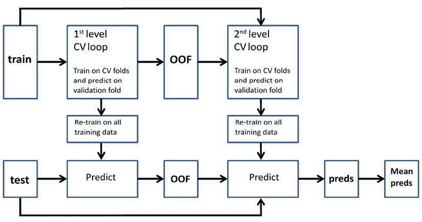

# 使用混合和堆叠解决方案进行集成

当你开始在 Kaggle 上竞争时，很快就会意识到你不能仅凭一个精心设计的模型获胜；你需要集成多个模型。接下来，你将立即想知道如何设置一个有效的集成。周围很少有指南，而且 Kaggle 的经验比科学论文还要多。

这里要说明的是，如果集成是赢得 Kaggle 竞赛的关键，那么在现实世界中，它与复杂性、维护性差、难以重现以及微小的技术成本相关，而这些成本往往掩盖了优势。通常，那种能让你从排名较低跃升至排行榜顶部的微小提升，对于现实世界的应用来说并不重要，因为成本掩盖了优势。然而，这并不意味着集成在现实世界中完全没有使用。在有限的形式下，如平均和混合几个不同的模型，集成使我们能够以更有效和更高效的方式解决许多数据科学问题。

在 Kaggle 中，集成不仅仅是提高预测性能的一种方法，它也是一种团队合作策略。当你与其他队友一起工作时，将每个人的贡献整合在一起，往往会产生比个人努力更好的结果，并且还可以通过将每个人的努力结构化，朝着明确的目标组织团队工作。实际上，当工作在不同时区进行，并且每个参与者都有不同的约束条件时，像结对编程这样的协作技术显然是不可行的。一个团队成员可能因为工作时间受到限制，另一个可能因为学习和考试，等等。

在竞赛中，团队往往没有机会，也不一定需要，将所有参与者同步和协调到同一任务上。此外，团队内的技能也可能有所不同。

在团队中共享的良好的集成策略意味着个人可以继续根据自己的常规和风格工作，同时仍然为团队的成功做出贡献。因此，即使不同的技能在使用基于预测多样性的集成技术时也可能成为优势。

在本章中，我们将从您已经了解的集成技术开始，因为它们嵌入在随机森林和梯度提升等算法中，然后进一步介绍针对多个模型的集成技术，如平均、混合和堆叠。我们将为您提供一些理论、一些实践，以及一些代码示例，您可以在 Kaggle 上构建自己的解决方案时将其用作模板。

我们将涵盖以下主题：

+   集成算法简介

+   将模型平均集成到集成中

+   使用元模型混合模型

+   堆叠模型

+   创建复杂的堆叠和混合解决方案

在让您阅读本章并尝试所有技术之前，我们必须提到一个关于集成对我们和所有 Kaggle 竞赛者的伟大参考：由*Triskelion* (*Hendrik Jacob van Veen*) 和几位合作者 (*Le Nguyen The Dat*, *Armando Segnini*) 在 2015 年撰写的博客文章。*Kaggle 集成指南*最初可以在*mlwave*博客上找到 ([`mlwave.com/kaggle-ensembling-guide`](https://mlwave.com/kaggle-ensembling-guide))，但现在已不再更新，但您可以从[`usermanual.wiki/Document/Kaggle20ensembling20guide.685545114.pdf`](https://usermanual.wiki/Document/Kaggle20ensembling20guide.685545114.pdf)检索指南的内容。该文章整理了当时 Kaggle 论坛上关于集成的多数隐性和显性知识。

# 集成算法简介

模型集成可以优于单个模型的想法并非最近才出现。我们可以追溯到维多利亚时代的英国**爵士** *弗朗西斯·高尔顿*，他发现，为了猜测在县博览会上一头牛的重量，从一群或多或少受过教育的人那里收集的大量估计的平均值比从专家那里得到的单个精心设计的估计更有用。

在 1996 年，*Leo Breiman* 通过说明**袋装**技术（也称为“自助聚合”过程）来形式化使用多个模型组合成一个更具预测性的模型的想法，这后来导致了更有效的**随机森林**算法的发展。在此之后，其他集成技术如**梯度提升**和**堆叠**也被提出，从而完成了我们今天使用的集成方法范围。

您可以参考几篇文章来了解这些集成算法最初是如何设计的：

+   对于随机森林，请阅读 Breiman, L. 的文章 *Bagging predictors*。机器学习 24.2 – 1996: 123-140。

+   如果您想更详细地了解提升最初是如何工作的，请阅读 Freund, Y. 和 Schapire, R.E. 的文章 *Experiments with a new boosting algorithm.* *icml. Vol. 96 – 1996*，以及 *Friedman, J. H*. 的文章 *Greedy function approximation: a gradient boosting machine.* *Annals of Statistics* (2001): 1189-1232。

+   至于堆叠，请参考 Ting, K. M. 和 Witten, *I. H.* 的文章 *Stacking bagged and dagged models*，1997 年，这是该技术的第一个正式草案。

Kaggle 竞赛中集成预测者的第一个基本策略直接来源于分类和回归的 bagging 和随机森林策略。它们涉及对各种预测进行平均，因此被称为**平均**技术。这些方法在 11 年前举办的第一个 Kaggle 竞赛中迅速出现，也得益于 Kaggle 之前的 Netflix 竞赛，在那里基于不同模型结果平均的策略主导了场景。鉴于它们的成功，基于平均的基本集成技术为许多即将到来的竞赛设定了标准，并且它们至今仍然非常有用和有效，有助于在排行榜上获得更高的分数。

Stacking，这是一种更复杂且计算量更大的方法，在竞赛问题变得更加复杂和参与者之间的竞争更加激烈时出现。正如随机森林方法启发了对不同预测的平均一样，提升法极大地启发了堆叠方法。在提升法中，通过顺序重新处理信息，你的学习算法可以以更好和更完整的方式建模问题。实际上，在梯度提升中，为了建模先前迭代无法掌握的数据部分，会构建顺序决策树。这种想法在堆叠集成中得到了重申，在那里你堆叠先前模型的输出并重新处理它们，以获得预测性能的提升。


罗布·穆拉

[`www.kaggle.com/robikscube`](https://www.kaggle.com/robikscube)

罗布与我们分享了他在集成和从 Kaggle 中学到的经验。作为竞赛、笔记本和讨论的大师，以及 Biocore LLC 的高级数据科学家，我们可以从他丰富的经验中学到很多东西。

你最喜欢的竞赛类型是什么？为什么？在技术和解决方法方面，你在 Kaggle 上的专长是什么？

*我最喜欢的竞赛类型是那些涉及独特数据集，需要结合不同类型的建模方法来提出新颖解决方案的竞赛。我喜欢当竞赛不仅仅是训练大型模型，而是真正需要深入理解数据并实施利用特定任务架构的想法时。我不试图专精于任何特定的方法。当我第一次开始参加 Kaggle 时，我主要坚持使用梯度提升模型，但为了在近年来保持竞争力，我加深了对深度学习、计算机视觉、NLP 和优化的理解。我最喜欢的竞赛需要使用不止一种技术。*

你是如何参加 Kaggle 竞赛的？这种方法和你在日常工作中所做的方法有何不同？

*我在某些方面将 Kaggle 比赛与工作项目非常相似。首先是对数据理解。在现实世界项目中，你可能需要定义问题和开发一个好的指标。在 Kaggle 中，这些已经为你准备好了。接下来是理解数据和指标之间的关系——以及开发和测试你认为将最好解决问题的建模技术。与现实生活中数据科学相比，Kaggle 最大的不同之处在于最后一点，即集成和调整模型以获得微小的优势——在许多现实世界的应用中，这些类型的大型集成不是必要的，因为计算成本与性能提升之间的差距可能很小。*

告诉我们你参加的一个特别具有挑战性的比赛，以及你使用了哪些见解来应对任务。

*我参加的一个极具挑战性的比赛是* NFL 头盔冲击检测 *比赛。它涉及视频数据，我对这个领域没有先前的经验。它还要求研究常见的方法和阅读该主题的现有论文。我必须工作在两阶段的方法上，这增加了解决方案的复杂性。另一个我认为具有挑战性的比赛是*室内定位导航 *比赛。它涉及建模、优化，以及真正理解数据。我在比赛中并没有做得很好，但我学到了很多。*

Kaggle 是否帮助你在职业生涯中？如果是，那么是如何帮助的？

*是的。Kaggle 在帮助我在数据科学领域获得知名度方面发挥了重要作用。我也在知识和理解新技术方面有所增长，并且遇到了许多才华横溢的人，他们帮助我在技能和机器学习理解方面成长。*

*我的团队在* NFL 头盔冲击检测 *比赛中获得了第二名。在那场比赛之前，我还参加了许多 NFL 比赛。比赛的主持人联系了我，最终这帮助我获得了现在的职位。*

在你的经验中，不经验丰富的 Kagglers 通常忽略了什么？你现在知道什么，而当你刚开始时希望知道的呢？

*我认为不经验丰富的 Kagglers 有时过于担心模型的集成和超参数调整。这些在比赛的后期很重要，但除非你已经建立了一个良好的基础模型，否则它们并不重要。我也认为完全理解比赛指标非常重要。许多 Kagglers 忽略了理解如何优化解决方案以适应评估指标的重要性。*

你在过去比赛中犯过哪些错误？

*很多。我曾经过度拟合模型，花费时间在最终没有带来益处的事情上。然而，我认为这对我在未来比赛中更好地应对是必要的。这些错误可能在特定的比赛中伤害了我，但帮助我在后来的比赛中变得更好。*

对于数据分析或机器学习，您会推荐使用哪些特定的工具或库？

*对于数据探索性分析（EDA），了解如何使用 NumPy、Pandas 和 Matplotlib 或另一个绘图库来操作数据。对于建模，了解如何使用 Scikit-learn 设置适当的交叉验证方案。标准模型如 XGBoost/LightGBM 了解如何设置基线是有用的。深度学习库主要是 TensorFlow/Keras 或 PyTorch。了解这两个主要深度学习库中的任何一个都很重要。*

# 将模型平均到一个集成中

为了更好地介绍平均集成技术，让我们快速回顾 Leo Breiman 为集成设计的所有策略。他的工作代表了集成策略的一个里程碑，他在当时发现的方法在广泛的问题中仍然相当有效。

Breiman 探索了所有这些可能性，以确定是否有一种方法可以减少那些倾向于过度拟合训练数据的强大模型的误差方差，例如决策树。

从概念上讲，他发现集成效果基于三个要素：我们如何处理**训练案例的抽样**，我们如何**构建模型**，以及最后，我们如何**组合获得的不同模型**。

关于抽样，测试并发现的方法有：

+   **粘贴**，即使用示例（数据行）的子样本（不放回抽样）构建多个模型

+   **袋装**，即使用随机选择的 bootstrap 示例（放回抽样）构建多个模型

+   **随机子空间**，即使用特征（数据列）的子样本（不放回抽样）构建多个模型

+   **随机补丁**，一种类似于袋装的方法，除了在为每个模型选择时也抽样特征，就像在随机子空间中一样

我们抽样而不是使用相同信息的原因是，通过子抽样案例和特征，我们创建了所有与同一问题相关的模型，同时每个模型又与其他模型不同。这种差异也适用于每个模型如何过度拟合样本；我们期望所有模型以相同的方式从数据中提取有用的、可推广的信息，并以不同的方式处理对预测无用的噪声。因此，建模中的变化减少了预测中的变化，因为错误往往相互抵消。

如果这种变化如此有用，那么下一步不应该只是修改模型学习的数据，还应该修改**模型本身**。我们有两种主要的模型方法：

+   同类型模型的集成

+   不同模型的集成

有趣的是，如果我们将要组合的模型在预测能力上差异太大，那么以某种方式集成并不会带来太多帮助。这里的要点是，如果你能组合能够正确猜测相同类型预测的模型，那么它们可以在平均错误预测时平滑它们的错误。如果你正在集成性能差异太大的模型，你很快就会意识到这没有意义，因为总体效果将是负面的：因为你没有平滑你的错误预测，你也在降低正确的预测。

这是有关于平均的一个重要限制：它只能使用一组不同的模型（例如，因为它们使用不同的样本和特征进行训练）如果它们在预测能力上相似。以一个例子来说，线性回归和*k*最近邻算法在建模问题和从数据中捕捉信号方面有不同的方式；得益于它们核心的（独特的）特征函数形式，这些算法可以从数据中捕捉到不同的预测细微差别，并在预测任务的特定部分上表现更好，但当你使用平均时，你实际上无法利用这一点。相比之下，算法必须捕获信号的不同方式是堆叠实际上可以利用的，因为它可以从每个算法中获取最佳结果。

基于此，我们可以总结出，为了使基于平均的集成（平均多个模型的输出）有效，它应该：

+   建立在训练在不同样本上的模型之上

+   建立在从可用特征的不同子样本中使用的模型之上

+   由具有相似预测能力的模型组成

从技术上讲，这意味着模型的预测应该在预测任务上保持尽可能不相关，同时达到相同的准确度水平。

现在我们已经讨论了平均多个机器学习模型的机遇和限制，我们最终将深入探讨其技术细节。平均多个分类或回归模型有三种方法：

+   多数投票，使用多个模型中最频繁的分类（仅适用于分类模型）

+   平均值或概率

+   使用值或概率的加权平均值

在接下来的几节中，我们将详细讨论每种方法在 Kaggle 比赛中的具体应用。

## 多数投票

通过改变我们在集成中使用的示例、特征和模型（如果它们在预测能力上相似，如我们之前讨论的）来产生不同的模型，这需要一定的计算工作量，但不需要你构建一个与使用单个模型时设置完全不同的数据处理管道。

在这个流程中，你只需要收集不同的测试预测，记录所使用的模型，训练时如何采样示例或特征，你使用的超参数，以及最终的交叉验证性能。

如果比赛要求你预测一个类别，你可以使用**多数投票**；也就是说，对于每个预测，你选择你的模型中最频繁预测的类别。这适用于二元预测和多类别预测，因为它假设你的模型有时会有错误，但它们大多数时候可以正确猜测。多数投票被用作“错误纠正程序”，丢弃噪声并保留有意义的信号。

在我们的第一个简单示例中，我们演示了多数投票是如何工作的。我们首先创建我们的示例数据集。使用 Scikit-learn 中的`make_classification`函数，我们生成一个类似 Madelon 的数据集。

原始的 Madelon 是一个包含数据点的合成数据集，这些数据点被分组在某个维超立方体的顶点上，并随机标记。它包含一些信息性特征，混合了无关的和重复的特征（以在特征之间创建多重共线性），并且它包含一定量的注入随机噪声。由*Isabelle Guyon*（SVM 算法的创造者之一）为 2003 年 NIPS 特征选择挑战赛所构思，Madelon 数据集是具有挑战性的合成数据集的模型示例。甚至一些 Kaggle 比赛也受到了它的启发：[`www.kaggle.com/c/overfitting`](https://www.kaggle.com/c/overfitting)和更近期的[`www.kaggle.com/c/dont-overfit-ii`](https://www.kaggle.com/c/dont-overfit-ii)。

我们将在本章中用这个 Madelon 数据集的重建作为测试集成技术的基础：

```py
from sklearn.datasets import make_classification
from sklearn.model_selection import train_test_split
X, y = make_classification(n_samples=5000, n_features=50, 
                           n_informative=10,
                           n_redundant=25, n_repeated=15, 
                           n_clusters_per_class=5,
                           flip_y=0.05, class_sep=0.5, 
                           random_state=0)
X_train, X_test, y_train, y_test = train_test_split(X, y,   
                           test_size=0.33, random_state=0) 
```

在将其分为训练集和测试集之后，我们继续实例化我们的学习算法。我们将仅使用三个基础算法：SVMs、随机森林和*k*最近邻分类器，以默认超参数进行演示。你可以尝试更改它们或增加它们的数量：

```py
from sklearn.svm import SVC
from sklearn.ensemble import RandomForestClassifier
from sklearn.neighbors import KNeighborsClassifier
from sklearn.metrics import log_loss, roc_auc_score, accuracy_score
model_1 = SVC(probability=True, random_state=0)
model_2 = RandomForestClassifier(random_state=0)
model_3 = KNeighborsClassifier() 
```

下一步仅仅是训练每个模型在训练集上：

```py
model_1.fit(X_train, y_train)
model_2.fit(X_train, y_train)
model_3.fit(X_train, y_train) 
```

在这一点上，我们需要对每个模型和集成进行测试集预测，并使用多数投票集成这些预测。为此，我们将使用 SciPy 中的`mode`函数：

```py
import numpy as np
from scipy.stats import mode
preds = np.stack([model_1.predict(X_test),
                  model_2.predict(X_test),
                  model_3.predict(X_test)]).T
max_voting = np.apply_along_axis(mode, 1, preds)[:,0] 
```

首先，我们检查每个单独模型的准确性：

```py
for i, model in enumerate(['SVC', 'RF ', 'KNN']):
    acc = accuracy_score(y_true=y_test, y_pred=preds[:, i])
    print(f"Accuracy for model {model} is: {acc:0.3f}") 
```

我们看到三个模型的表现相似，大约在**0.8**左右。现在是我们检查多数投票集成的时候了：

```py
max_voting_accuray = accuracy_score(y_true=y_test, y_pred=max_voting)
print(f"Accuracy for majority voting is: {max_voting_accuray:0.3f}") 
```

投票集成实际上更准确：**0.817**，因为它成功地整合了大多数正确的信号。

对于多标签问题（当你可以预测多个类别时），你可以简单地选择那些被预测超过一定次数的类别，假设一个相关性阈值表示对类别的预测是信号，而不是噪声。例如，如果你有五个模型，你可以将这个阈值设置为 3，这意味着如果一个类别被至少三个模型预测，那么这个预测应该被认为是正确的。

在回归问题中，以及当你预测概率时，实际上你不能使用多数投票。多数投票仅与类别所有权相关。相反，当你需要预测数字时，你需要数值地组合结果。在这种情况下，求助于**平均数**或**加权平均数**将为你提供组合预测的正确方法。

## 模型预测的平均值

在比赛中平均不同模型的预测时，你可以认为所有预测都具有潜在的相同预测能力，并使用算术平均数来得出平均值。

除了算术平均数之外，我们还发现使用以下方法也非常有效：

+   **几何平均数**：这是将*n*个提交相乘，然后取结果的*1/n*次幂。

+   **对数平均数**：类似于几何平均数，你对提交取对数，将它们平均在一起，然后取结果的指数。

+   **调和平均数**：这是取你提交的倒数算术平均数，然后取结果的倒数。

+   **幂平均数**：这是取提交的*n*次幂的平均值，然后取结果的*1/n*次幂。

简单的算术平均总是非常有效，基本上是一个无需思考就能奏效的方法，其效果往往比预期的更好。有时，像几何平均数或调和平均数这样的变体可能会更有效。

继续上一个例子，我们现在将尝试找出当我们切换到**ROC-AUC**作为评估指标时，哪种平均数效果最好。首先，我们将评估每个单独模型的性能：

```py
proba = np.stack([model_1.predict_proba(X_test)[:, 1],
                  model_2.predict_proba(X_test)[:, 1],
                  model_3.predict_proba(X_test)[:, 1]]).T
for i, model in enumerate(['SVC', 'RF ', 'KNN']):
    ras = roc_auc_score(y_true=y_test, y_score=proba[:, i])
    print(f"ROC-AUC for model {model} is: {ras:0.5f}") 
```

结果显示范围从**0.875**到**0.881**。

我们第一次测试使用的是算术平均数：

```py
arithmetic = proba.mean(axis=1)
ras = roc_auc_score(y_true=y_test, y_score=arithmetic)
print(f"Mean averaging ROC-AUC is: {ras:0.5f}") 
```

结果的 ROC-AUC 分数明显优于单个性能：**0.90192**。我们还测试了几何平均数、调和平均数、对数平均数或幂平均数是否能优于普通平均数：

```py
geometric = proba.prod(axis=1)**(1/3)
ras = roc_auc_score(y_true=y_test, y_score=geometric)
print(f"Geometric averaging ROC-AUC is: {ras:0.5f}")
harmonic = 1 / np.mean(1\. / (proba + 0.00001), axis=1)
ras = roc_auc_score(y_true=y_test, y_score=harmonic)
print(f"Geometric averaging ROC-AUC is: {ras:0.5f}")
n = 3
mean_of_powers = np.mean(proba**n, axis=1)**(1/n)
ras = roc_auc_score(y_true=y_test, y_score=mean_of_powers)
print(f"Mean of powers averaging ROC-AUC is: {ras:0.5f}")
logarithmic = np.expm1(np.mean(np.log1p(proba), axis=1))
ras = roc_auc_score(y_true=y_test, y_score=logarithmic)
print(f"Logarithmic averaging ROC-AUC is: {ras:0.5f}") 
```

运行代码将告诉我们，它们都不行。在这种情况下，算术平均数是集成时的最佳选择。实际上，在几乎所有情况下，比简单平均数更有效的是将一些*先验知识*融入到组合数字的方式中。这发生在你在平均计算中对模型进行加权时。

## 加权平均

当对模型进行加权时，你需要找到一种经验方法来确定正确的权重。一种常见的方法是，尽管非常容易导致自适应过拟合，但可以通过在公共排行榜上测试不同的组合，直到找到得分最高的组合。当然，这并不能保证你在私人排行榜上得分相同。在这里，原则是加权效果更好的部分。然而，正如我们详细讨论过的，由于与私人测试数据的重要差异，公共排行榜的反馈往往不可信。然而，你可以使用你的交叉验证分数或出卷分数（后者将在稍后的堆叠部分中讨论）。事实上，另一种可行的策略是使用与模型交叉验证性能**成比例的权重**。

虽然这有点反直觉，但另一种非常有效的方法是将提交内容**与它们的协方差成反比进行加权**。实际上，因为我们正通过平均来努力消除误差，所以基于每个提交的独特方差进行平均，使我们能够更重地加权那些相关性较低且多样性较高的预测，从而更有效地减少估计的方差。

在下一个示例中，我们首先将我们的预测概率创建为一个**相关矩阵**，然后我们继续进行以下操作：

1.  移除对角线上的一个值并用零替换

1.  通过行平均相关矩阵以获得一个向量

1.  取每行总和的倒数

1.  将它们的总和归一化到 1.0

1.  使用得到的加权向量进行预测概率的矩阵乘法

下面是这个代码的示例：

```py
cormat = np.corrcoef(proba.T)
np.fill_diagonal(cormat, 0.0)
W = 1 / np.mean(cormat, axis=1)
W = W / sum(W) # normalizing to sum==1.0
weighted = proba.dot(W)
ras = roc_auc_score(y_true=y_test, y_score=weighted)
print(f"Weighted averaging ROC-AUC is: {ras:0.5f}") 
```

得到的 ROC-AUC 值为**0.90206**，略好于简单的平均。给予更多不相关预测更高的重视是一种经常成功的集成策略。即使它只提供了轻微的改进，这也可能足以将比赛转为你的优势。

## 在你的交叉验证策略中进行平均

正如我们所讨论的，平均不需要你构建任何特殊的复杂管道，只需要一定数量的典型数据管道来创建你将要平均的模型，无论是使用所有预测相同的权重，还是使用一些经验发现的权重。唯一测试它的方法是在公共排行榜上运行提交，从而冒着自适应拟合的风险，因为你的平均评估将仅基于 Kaggle 的响应。

在直接在排行榜上测试之前，你也可以在训练时间通过在验证折（你未用于训练模型的折）上运行平均操作来测试。这将为你提供比排行榜上更少的偏见反馈。在下面的代码中，你可以找到一个交叉验证预测是如何安排的示例：

```py
from sklearn.model_selection import KFold
kf = KFold(n_splits=5, shuffle=True, random_state=0)
scores = list()
for k, (train_index, test_index) in enumerate(kf.split(X_train)):
    model_1.fit(X_train[train_index, :], y_train[train_index])
    model_2.fit(X_train[train_index, :], y_train[train_index])
    model_3.fit(X_train[train_index, :], y_train[train_index])

    proba = np.stack(
          [model_1.predict_proba(X_train[test_index, :])[:, 1],
           model_2.predict_proba(X_train[test_index, :])[:, 1],
           model_3.predict_proba(X_train[test_index, :])[:, 1]]).T

    arithmetic = proba.mean(axis=1)
    ras = roc_auc_score(y_true=y_train[test_index], 
                        y_score=arithmetic)
    scores.append(ras)
    print(f"FOLD {k} Mean averaging ROC-AUC is: {ras:0.5f}")
print(f"CV Mean averaging ROC-AUC is: {np.mean(scores):0.5f}") 
```

依赖于上述代码中的交叉验证结果可以帮助你评估哪种平均策略更有前途，而无需直接在公共排行榜上进行测试。

## 对 ROC-AUC 评估进行平均校正

如果你的任务将根据 ROC-AUC 分数进行评估，简单地平均你的结果可能不够。这是因为不同的模型可能采用了不同的优化策略，它们的输出可能差异很大。一种解决方案是对模型进行校准，这是我们之前在*第五章*中讨论的一种后处理类型，但显然这需要更多的时间和计算努力。

在这些情况下，直接的解决方案是将输出概率转换为排名，然后简单地平均这些排名（或者对它们进行加权平均）。使用 min-max 缩放器方法，你只需将每个模型的估计值转换为 0-1 的范围，然后继续进行预测的平均。这将有效地将你的模型的概率输出转换为可以比较的排名：

```py
from sklearn.preprocessing import MinMaxScaler
proba = np.stack(
          [model_1.predict_proba(X_train)[:, 1],
           model_2.predict_proba(X_train)[:, 1],
           model_3.predict_proba(X_train)[:, 1]]).T
arithmetic = MinMaxScaler().fit_transform(proba).mean(axis=1)
ras = roc_auc_score(y_true=y_test, y_score=arithmetic)
print(f"Mean averaging ROC-AUC is: {ras:0.5f}") 
```

当你直接处理测试预测时，这种方法工作得非常完美。如果你在交叉验证期间尝试平均结果，你可能会遇到问题，因为你的训练数据的预测范围可能与你的测试预测范围不同。在这种情况下，你可以通过训练一个校准模型来解决该问题（参见 Scikit-learn 上的**概率校准**[`scikit-learn.org/stable/modules/calibration.html`](https://scikit-learn.org/stable/modules/calibration.html)和*第五章*)，将预测转换为每个模型的真正、可比较的概率。

# 使用元模型进行混合模型

我们在*第一章*中详细讨论的 Netflix 竞赛不仅证明了平均对于数据科学竞赛中的难题是有利的；它还提出了你可以使用一个模型更有效地平均模型结果的想法。获胜团队 BigChaos 在其论文（Töscher, A., Jahrer, M., 和 Bell, R.M. *The BigChaos Solution to the Netflix Grand Prize*. Netflix prize documentation – 2009）中多次提到了**混合**，并提供了关于其有效性和工作方式的许多提示。

简而言之，混合是一种加权平均过程，其中用于组合预测的权重是通过保留集和在此之上训练的元模型来估计的。**元模型**简单来说就是从其他机器学习模型输出中学习的机器学习算法。通常，元学习器是一个线性模型（但有时也可以是非线性的；关于这一点，我们将在下一节中详细讨论），但实际上你可以使用任何你想要的，但会有一些风险，我们将在后面讨论。

获得混合的方法非常直接：

1.  在开始构建所有模型之前，你应从训练数据中随机提取一个保留样本（在团队中，你们所有人都应使用相同的保留样本）。通常，保留数据大约是可用数据的 10%；然而，根据情况（例如，训练数据中的示例数量，分层），它也可能更少或更多。像往常一样，在采样时，你可以强制分层以确保采样具有代表性，并且你可以使用对抗性验证来测试样本是否真的与训练集其余部分的分布相匹配。

1.  在剩余的训练数据上训练所有模型。

1.  在保留数据和测试数据上进行预测。

1.  将保留预测作为元学习器的训练数据，并重新使用元学习器模型，使用你的模型的测试预测来计算最终的测试预测。或者，你可以使用元学习器来确定在加权平均中应使用的预测因子及其权重。

这种方法有很多优点和缺点。让我们先从优点开始。首先，它很容易实现；你只需要弄清楚保留样本是什么。此外，使用元学习算法可以确保你将找到最佳权重，而无需在公共排行榜上进行测试。

在弱点方面，有时，根据样本大小和所使用的模型类型，减少训练示例的数量可能会增加你的估计器的预测方差。此外，即使你在采样保留数据时非常小心，你仍然可能陷入自适应过拟合，即找到适合保留数据的权重，但这些权重不具有可推广性，特别是如果你使用了一个过于复杂的元学习器。最后，使用保留数据作为测试目的具有与我们在模型验证章节中讨论的训练和测试分割相同的限制：如果保留样本的样本量太小，或者由于某种原因，你的采样不具有代表性，那么你将无法获得可靠的估计。

## 混合的最佳实践

在混合中，你使用的元学习器的类型可以产生很大的差异。最常见的选择是使用线性模型或非线性模型。在线性模型中，线性或逻辑回归是首选。使用正则化模型也有助于排除无用的模型（L1 正则化）或减少不那么有用的模型的影响（L2 正则化）。使用这类元学习器的一个限制是，它们可能会给某些模型分配负贡献，正如你将从模型系数的值中看到的那样。当你遇到这种情况时，模型通常过拟合，因为所有模型都应该对集成（或最坏的情况是，完全不贡献）的建设做出积极贡献。Scikit-learn 的最新版本允许你只强制执行正权重，并移除截距。这些约束作为正则化器，防止过拟合。

作为元学习器的非线性模型较为少见，因为它们在回归和二分类问题中容易过拟合，但在多分类和多标签分类问题中它们通常表现出色，因为它们可以模拟现有类别之间的复杂关系。此外，如果除了模型的预测之外，你还向它们提供*原始特征*，它们通常表现更好，因为它们可以发现任何有助于它们正确选择更值得信赖的模型的交互作用。

在我们的下一个例子中，我们首先尝试使用线性模型（逻辑回归）进行混合，然后使用非线性方法（随机森林）。我们首先将训练集分为用于混合元素的训练部分和用于元学习器的保留样本。之后，我们在可训练的部分上拟合模型，并在保留样本上进行预测。

```py
from sklearn.preprocessing import StandardScaler
X_blend, X_holdout, y_blend, y_holdout = train_test_split(X_train, y_train, test_size=0.25, random_state=0)
model_1.fit(X_blend, y_blend)
model_2.fit(X_blend, y_blend)
model_3.fit(X_blend, y_blend)
proba = np.stack([model_1.predict_proba(X_holdout)[:, 1],
                  model_2.predict_proba(X_holdout)[:, 1],
                  model_3.predict_proba(X_holdout)[:, 1]]).T
scaler = StandardScaler()
proba = scaler.fit_transform(proba) 
```

现在我们可以使用保留样本上的预测概率来训练我们的线性元学习器：

```py
from sklearn.linear_model import LogisticRegression
blender = LogisticRegression(solver='liblinear')
blender.fit(proba, y_holdout)
print(blender.coef_) 
```

得到的系数如下：

```py
[[0.78911314 0.47202077 0.75115854]] 
```

通过观察系数，我们可以判断哪个模型对元集成模型的贡献更大。然而，记住系数在未良好校准时也会重新调整概率，因此一个模型的系数较大并不一定意味着它是最重要的。如果你想要通过观察系数来了解每个模型在混合中的作用，你首先必须通过标准化（在我们的代码示例中，这是使用 Scikit-learn 的`StandardScaler`完成的）来重新调整它们。

我们的结果显示，SVC 和*k*最近邻模型在混合中的权重比随机森林模型更高；它们的系数几乎相同，并且都大于随机森林的系数。

一旦元模型训练完成，我们只需在测试数据上预测并检查其性能：

```py
test_proba = np.stack([model_1.predict_proba(X_test)[:, 1],
                       model_2.predict_proba(X_test)[:, 1],
                       model_3.predict_proba(X_test)[:, 1]]).T
blending = blender.predict_proba(test_proba)[:, 1]
ras = roc_auc_score(y_true=y_test, y_score=blending)
print(f"ROC-AUC for linear blending {model} is: {ras:0.5f}") 
```

我们可以使用非线性元学习器，例如随机森林，尝试相同的事情：

```py
blender = RandomForestClassifier()
blender.fit(proba, y_holdout)
test_proba = np.stack([model_1.predict_proba(X_test)[:, 1],
                       model_2.predict_proba(X_test)[:, 1],
                       model_3.predict_proba(X_test)[:, 1]]).T
blending = blender.predict_proba(test_proba)[:, 1]
ras = roc_auc_score(y_true=y_test, y_score=blending)
print(f"ROC-AUC for non-linear blending {model} is: {ras:0.5f}") 
```

**集合选择**技术由*Caruana*、*Niculescu-Mizil*、*Crew*和*Ksikes*正式化，为使用线性或非线性模型作为元学习器提供了一个替代方案。

如果你对更多细节感兴趣，请阅读他们著名的论文：Caruana, R.，Niculescu-Mizil, A.，Crew, G.，和 Ksikes, A. *从模型库中进行集合选择*（第二十一届国际机器学习会议论文集，2004 年）。

集合选择实际上是一个加权平均，因此它可以简单地被认为是线性组合的类似物。然而，它是一个受约束的线性组合（因为它属于爬山优化的一部分），它还将选择模型并只对预测应用正权重。所有这些都有助于最小化过拟合的风险，并确保一个更紧凑的解决方案，因为解决方案将涉及模型选择。从这个角度来看，在所有过拟合风险较高的问题上（例如，因为训练案例数量很少或模型过于复杂）以及在现实世界应用中，由于它简单而有效的解决方案，推荐使用集合选择。

当使用元学习器时，你依赖于其自身成本函数的优化，这可能与竞赛采用的指标不同。集合选择的另一个巨大优势是它可以优化到任何评估函数，因此当竞赛的指标与机器学习模型通常优化的规范不同时，通常建议使用它。

实施集合选择需要以下步骤，如前述论文所述：

1.  从你的训练模型和保留样本开始。

1.  在保留样本上测试所有你的模型，并根据评估指标，保留最有效的模型进行选择（即**集合选择**）。

1.  然后，继续测试其他可能添加到集合选择中的模型，以便所提出的选择的平均值优于之前的一个。你可以有放回或无放回地进行。无放回时，你只将一个模型放入选择集合一次；在这种情况下，程序就像在正向选择之后的一个简单平均。（在正向选择中，你迭代地向解决方案添加性能提升最大的模型，直到添加更多模型不再提升性能。）有放回时，你可以将一个模型放入选择多次，从而类似于加权平均。

1.  当你无法获得任何进一步的改进时，停止并使用集合选择。

这里是一个集合选择的简单代码示例。我们首先从原始训练数据中推导出一个保留样本和一个训练选择。我们拟合模型并在我们的保留样本上获得预测，就像之前与元学习器混合时所见：

```py
X_blend, X_holdout, y_blend, y_holdout = train_test_split
    (X_train, y_train, test_size=0.5, random_state=0)
model_1.fit(X_blend, y_blend)
model_2.fit(X_blend, y_blend)
model_3.fit(X_blend, y_blend)
proba = np.stack([model_1.predict_proba(X_holdout)[:, 1],
                  model_2.predict_proba(X_holdout)[:, 1],
                  model_3.predict_proba(X_holdout)[:, 1]]).T 
```

在下一个代码片段中，通过一系列迭代创建集成。在每个迭代中，我们尝试依次将所有模型添加到当前的集成中，并检查它们是否提高了模型。如果这些添加中的任何一个在保留样本上优于之前的集成，则集成将被更新，并且性能水平将提高到当前水平。

如果没有额外的改进可以提高集成，循环就会停止，并报告集成的组成：

```py
iterations = 100
proba = np.stack([model_1.predict_proba(X_holdout)[:, 1],
                  model_2.predict_proba(X_holdout)[:, 1],
                  model_3.predict_proba(X_holdout)[:, 1]]).T
baseline = 0.5
print(f"starting baseline is {baseline:0.5f}")
models = []
for i in range(iterations):
    challengers = list()
    for j in range(proba.shape[1]):
        new_proba = np.stack(proba[:, models + [j]])
        score = roc_auc_score(y_true=y_holdout, 
                              y_score=np.mean(new_proba, axis=1))
        challengers.append([score, j])

    challengers = sorted(challengers, key=lambda x: x[0],
                         reverse=True)
    best_score, best_model = challengers[0]
    if best_score > baseline:
        print(f"Adding model_{best_model+1} to the ensemble",  
              end=': ') 
        print(f"ROC-AUC increases score to {best_score:0.5f}")
        models.append(best_model)
        baseline = best_score
    else:
        print("Cannot improve further - Stopping") 
```

最后，我们计算每个模型被插入平均值的次数，并计算我们在测试集上的平均权重：

```py
from collections import Counter
freqs = Counter(models)
weights = {key: freq/len(models) for key, freq in freqs.items()}
print(weights) 
```

你可以通过各种方式使该过程更加复杂。由于这种方法可能会在初始阶段过度拟合，你可以从一个随机初始化的集成集开始，或者，正如作者所建议的，你可能已经从集合并行中开始使用*n*个表现最好的模型（你决定*n*的值，作为一个超参数）。另一种变化涉及在每个迭代中对可以进入选择的模型集应用采样；换句话说，你随机排除一些模型不被选中。这不仅会将随机性注入到过程中，而且还会防止特定模型在选择中占主导地位。

# 组合堆叠模型

**堆叠**首次在*David Wolpert*的论文（*Wolpert, D. H*. *Stacked generalization.* Neural networks 5.2 – 1992）中提到，但这个想法在多年后才被广泛接受和普及（例如，只有到 2019 年 12 月发布的 0.22 版本，Scikit-learn 才实现了堆叠包装器）。这主要是因为 Netflix 竞赛，其次是 Kaggle 竞赛。

在堆叠中，你始终有一个元学习器。然而，这次它不是在保留集上训练，而是在整个训练集上训练，这得益于**折叠外**（**OOF**）预测策略。我们已经在*第六章*，*设计良好的验证*中讨论了这种策略。在 OOF 预测中，你从一个可复制的*k*-折交叉验证分割开始。*可复制的*意味着，通过记录每一轮每个训练和测试集中的案例，或者通过随机种子保证的可重复性，你可以为需要成为堆叠集成一部分的每个模型复制相同的验证方案。

在 Netflix 竞赛中，堆叠和混合经常被互换使用，尽管 Wolpert 最初设计的方法实际上意味着利用基于*k*-折交叉验证的方案，而不是保留集。事实上，堆叠的核心思想不是像平均那样减少方差；它主要是为了减少偏差，因为预计每个参与堆叠的模型都将掌握数据中存在的一部分信息，以便在最终的元学习器中重新组合。

让我们回顾一下在训练数据上进行的 OOF 预测是如何工作的。在测试模型时，在每次验证中，你都在训练数据的一部分上训练一个模型，并在从训练中保留的另一部分上进行验证。

通过记录验证预测并重新排序以重建原始训练案例的顺序，你将获得对你所使用的训练集的模型预测。然而，由于你使用了多个模型，并且每个模型都预测了它没有用于训练的案例，因此你的训练集预测不应该有任何过拟合效应。

获得所有模型的 OOF 预测后，你可以继续构建一个元学习器，该学习器根据 OOF 预测（第一级预测）预测你的目标，或者你可以在之前的 OOF 预测之上继续产生进一步的 OOF 预测（第二级或更高级预测），从而创建多个堆叠层。这与 Wolpert 本人提出的一个想法相兼容：通过使用多个元学习器，你实际上是在模仿一个没有反向传播的完全连接的前馈神经网络的结构，其中权重被优化计算，以单独在每个层级别最大化预测性能。从实际的角度来看，堆叠多层已被证明非常有效，对于单算法无法获得最佳结果的复杂问题，它工作得非常好。

此外，堆叠的一个有趣方面是，你不需要具有可比预测能力的模型，就像在平均和通常在混合中那样。事实上，甚至表现更差的模型也可能是堆叠集成的一部分。一个*k*最近邻模型可能无法与梯度提升解决方案相提并论，但当你使用其 OOF 预测进行堆叠时，它可能产生积极的影响，并提高集成的预测性能。

当你训练了所有堆叠层后，就到了预测的时候了。至于产生在各个堆叠阶段使用的预测，重要的是要注意你有两种方法来做这件事。Wolpert 的原始论文建议在所有训练数据上重新训练你的模型，然后使用这些重新训练的模型在测试集上进行预测。在实践中，许多 Kagglers 没有重新训练，而是直接使用为每个折叠创建的模型，并在测试集上进行多次预测，最后进行平均。

在我们的经验中，当使用少量*k*折时，堆叠通常在预测测试集之前在所有可用数据上完全重新训练时更有效。在这些情况下，样本一致性可能真的会在预测质量上产生差异，因为训练在较少数据上意味着估计的方差更大。正如我们在*第六章*中讨论的，在创建 OOF 预测时，始终最好使用高数量的折，在 10 到 20 之间。这限制了保留的示例数量，并且，在没有对所有数据进行重新训练的情况下，您可以直接使用从交叉验证训练模型获得的预测的平均值来获得您的测试集预测。

在我们的下一个例子中，为了说明目的，我们只有五个 CV 折，结果被堆叠了两次。在下图中，您可以跟踪数据和模型如何在堆叠过程的各个阶段之间移动：



图 9.1：两层堆叠过程的示意图，最终对预测进行平均

注意：

+   训练数据被输入到堆叠的每一层（堆叠的第二层中的 OOF 预测与训练数据相结合）

+   在从 CV 循环中获得 OOF 预测后，模型在完整的训练数据集上重新训练：

+   最终预测是所有堆叠预测器获得的预测的简单平均值

现在我们来看看代码，了解这个图如何转换为 Python 命令，从第一层训练开始：

```py
from sklearn.model_selection import KFold
kf = KFold(n_splits=5, shuffle=True, random_state=0)
scores = list()
first_lvl_oof = np.zeros((len(X_train), 3))
fist_lvl_preds = np.zeros((len(X_test), 3))
for k, (train_index, val_index) in enumerate(kf.split(X_train)):
    model_1.fit(X_train[train_index, :], y_train[train_index])
    first_lvl_oof[val_index, 0] = model_1.predict_proba(
                                     X_train[val_index, :])[:, 1]

    model_2.fit(X_train[train_index, :], y_train[train_index])
    first_lvl_oof[val_index, 1] = model_2.predict_proba(
                                     X_train[val_index, :])[:, 1]

    model_3.fit(X_train[train_index, :], y_train[train_index])
    first_lvl_oof[val_index, 2] = model_3.predict_proba(
                                     X_train[val_index, :])[:, 1] 
```

在第一层之后，我们在完整的数据集上重新训练：

```py
model_1.fit(X_train, y_train)
fist_lvl_preds[:, 0] = model_1.predict_proba(X_test)[:, 1]
model_2.fit(X_train, y_train)
fist_lvl_preds[:, 1] = model_2.predict_proba(X_test)[:, 1]
model_3.fit(X_train, y_train)
fist_lvl_preds[:, 2] = model_3.predict_proba(X_test)[:, 1] 
```

在第二次堆叠中，我们将重用第一层中的相同模型，并将堆叠的 OOF 预测添加到现有变量中：

```py
second_lvl_oof = np.zeros((len(X_train), 3))
second_lvl_preds = np.zeros((len(X_test), 3))
for k, (train_index, val_index) in enumerate(kf.split(X_train)):
    skip_X_train = np.hstack([X_train, first_lvl_oof])
    model_1.fit(skip_X_train[train_index, :],
                y_train[train_index])
    second_lvl_oof[val_index, 0] = model_1.predict_proba(
                          skip_X_train[val_index, :])[:, 1]

    model_2.fit(skip_X_train[train_index, :],
                y_train[train_index])
    second_lvl_oof[val_index, 1] = model_2.predict_proba(
                          skip_X_train[val_index, :])[:, 1]

    model_3.fit(skip_X_train[train_index, :],
                y_train[train_index])
    second_lvl_oof[val_index, 2] = model_3.predict_proba(
                          skip_X_train[val_index, :])[:, 1] 
```

再次，我们在第二层对完整数据进行重新训练：

```py
skip_X_test = np.hstack([X_test, fist_lvl_preds])
model_1.fit(skip_X_train, y_train)
second_lvl_preds[:, 0] = model_1.predict_proba(skip_X_test)[:, 1]
model_2.fit(skip_X_train, y_train)
second_lvl_preds[:, 1] = model_2.predict_proba(skip_X_test)[:, 1]
model_3.fit(skip_X_train, y_train)
second_lvl_preds[:, 2] = model_3.predict_proba(skip_X_test)[:, 1] 
```

堆叠通过平均第二层中所有堆叠的 OOF 结果来完成：

```py
arithmetic = second_lvl_preds.mean(axis=1)
ras = roc_auc_score(y_true=y_test, y_score=arithmetic)
scores.append(ras)
print(f"Stacking ROC-AUC is: {ras:0.5f}") 
```

结果的 ROC-AUC 分数约为**0.90424**，这比在相同数据和模型上之前的混合和平均尝试要好。

## 堆叠变体

堆叠的主要变体涉及改变测试数据在层之间的处理方式，是否只使用堆叠的 OOF 预测，还是在所有堆叠层中也使用原始特征，以及使用什么模型作为最后一个模型，以及各种防止过拟合的技巧。

我们讨论了一些我们亲自实验过的最有效的方法：

+   **优化可能使用也可能不使用**。有些解决方案不太关心优化单个模型；有些只优化最后一层；有些则优化第一层。根据我们的经验，优化单个模型很重要，我们更喜欢尽早在我们的堆叠集成中完成它。

+   **模型可以在不同的堆叠层中有所不同，或者相同的模型序列可以在每个堆叠层中重复。** 这里我们没有一个普遍的规则，因为这真的取决于问题。更有效的模型类型可能因问题而异。作为一个一般建议，将梯度提升解决方案和神经网络结合起来从未让我们失望。

+   **在堆叠过程的第一个层次，尽可能多地创建模型。** 例如，如果你的问题是分类问题，可以尝试回归模型，反之亦然。你也可以使用具有不同超参数设置的模型，从而避免过度优化，因为堆叠会为你做出决定。如果你使用神经网络，只需改变随机初始化种子就足以创建一个多样化的模型集合。你也可以尝试使用不同的特征工程，甚至使用无监督学习（例如，*Mike Kim* 在使用 t-SNE 维度解决他的问题时所做的那样：[`www.kaggle.com/c/otto-group-product-classification-challenge/discussion/14295`](https://www.kaggle.com/c/otto-group-product-classification-challenge/discussion/14295)）。这种想法是，所有这些贡献的选择都是在堆叠的第二层完成的。这意味着在那个点上，你不需要进一步实验，只需专注于一组表现更好的模型。通过应用堆叠，你可以重用所有实验，并让堆叠为你决定在建模过程中使用到什么程度。

+   一些堆叠实现会采用所有功能或其中一部分功能进入后续阶段，这让人联想到神经网络中的跳层。我们注意到，在堆叠的后期引入特征可以提高你的结果，但请注意：这也引入了更多的噪声和过拟合的风险。

+   理想情况下，你的 OOF 预测应该来自具有高折叠数的交叉验证方案，换句话说，在 10 到 20 之间，但我们也看到过使用较低折叠数（如 5 折）的解决方案。

+   对于每个折叠，对同一模型进行多次数据袋装（重复抽样的重采样）然后平均所有模型的结果（OOF 预测和测试预测）有助于避免过拟合，并最终产生更好的结果。

+   **注意堆叠中的早期停止。** 直接在验证折上使用它可能会导致一定程度的过拟合，这最终可能或可能不会通过堆叠过程得到缓解。我们建议你谨慎行事，并始终基于训练折的验证样本应用早期停止，而不是验证折本身。

可能性是无限的。一旦你掌握了这种集成技术的基本概念，你所需要做的就是将你的创造力应用于手头的问题。我们将在本章的最后部分讨论这个关键概念，我们将研究一个 Kaggle 比赛的堆叠解决方案。

# 创建复杂的堆叠和混合解决方案

在本章的这一部分，你可能想知道应该将我们讨论过的技术应用到什么程度。从理论上讲，你可以在 Kaggle 上的任何比赛中使用我们提出的所有集成技术，而不仅仅是表格比赛，但你必须考虑一些限制因素：

+   有时，数据集很大，训练单个模型需要很长时间。

+   在图像识别比赛中，你只能使用深度学习方法。

+   即使你能在深度学习比赛中堆叠模型，可供堆叠的不同模型的选择也很有限。由于你被限制在深度学习解决方案中，你只能改变网络的小设计方面和一些超参数（有时只是初始化种子），而不会降低性能。最终，鉴于相同的模型类型和架构中相似性多于差异，预测将过于相似，相关性过高，从而限制了集成技术的有效性。

在这些条件下，复杂的堆叠制度通常不可行。相比之下，当您拥有大量数据集时，平均和混合通常是可能的。

在早期的比赛中，以及所有最近的表格比赛中，复杂的堆叠和混合解决方案主导了比赛。为了给您一个关于在比赛中堆叠所需复杂性和创造性的概念，在本节的最后，我们将讨论由 *Gilberto Titericz* ([`www.kaggle.com/titericz`](https://www.kaggle.com/titericz)) 和 *Stanislav Semenov* ([`www.kaggle.com/stasg7`](https://www.kaggle.com/stasg7)) 为 *Otto Group 产品分类挑战赛* ([`www.kaggle.com/c/otto-group-product-classification-challenge`](https://www.kaggle.com/c/otto-group-product-classification-challenge)) 提供的解决方案。该比赛于 2015 年举行，其任务要求根据 93 个特征将超过 200,000 个产品分类到 9 个不同的类别。

Gilberto 和 Stanislav 提出的解决方案包含三个级别：

1.  在第一级，有 33 个模型。除了一个 *k* 近邻簇，其中只有 *k* 参数不同之外，所有模型都使用了相当不同的算法。他们还使用了无监督的 t-SNE。此外，他们基于维度操作（在最近邻和簇的距离上执行的计算）和行统计（每行中非零元素的数量）构建了八个特征。所有 OOF 预测和特征都传递到了第二级。

1.  在第二层，他们开始优化超参数，进行模型选择和袋装（通过重采样创建了多个相同模型的版本，并对每个模型的结果进行了平均）。最终，他们只对三种模型在所有数据上进行了重新训练：XGBoost、AdaBoost 和神经网络。

1.  在第三层，他们首先对 XGBoost 和神经网络进行几何平均，然后将其与 AdaBoost 的结果平均，从而准备了一个加权平均的结果。

我们可以从这个解决方案中学到很多，而不仅仅局限于这个比赛。除了复杂性（在第二层，每个模型重采样的次数在数百次左右）之外，值得注意的是，关于本章中讨论的方案存在多种变体。创造性和试错显然主导了解决方案。这在许多 Kaggle 比赛中相当典型，因为问题很少从一场比赛到另一场比赛相同，每个解决方案都是独特的且难以重复。

许多 AutoML 引擎，例如**AutoGluon**，或多或少地试图从这些程序中汲取灵感，以提供一系列预定义的自动化步骤，通过堆叠和混合确保您获得最佳结果。

查看[`arxiv.org/abs/2003.06505`](https://arxiv.org/abs/2003.06505)以获取 AutoGluon 构建其堆叠模型所使用的算法列表。列表相当长，您将找到许多为自己的堆叠解决方案提供灵感的想法。

然而，尽管他们实施了围绕最佳实践的一些最佳做法，但与一支优秀的 Kagglers 团队所能实现的结果相比，他们的结果总是略逊一筹，因为你在实验和组合集成的方式中的创造力是成功的关键。这一点也适用于我们本章的内容。我们向您展示了集成最佳实践；将它们作为起点，通过混合想法并根据您在 Kaggle 比赛或您正在处理的现实世界问题中进行创新来创建自己的解决方案。


Xavier Conort

[`www.kaggle.com/xavierconort`](https://www.kaggle.com/xavierconort)

为了总结本章，我们采访了 Xavier Conort，他是 2012-2013 年的比赛大师，排名第一。他是 Kaggle 历史初期许多 Kagglers 的灵感来源，现在是他自己公司的创始人兼首席执行官，Data Mapping and Engineering。他向我们讲述了他在 Kaggle 的经历、他的职业生涯以及更多内容。

你最喜欢的比赛类型是什么？为什么？在技术和解决方法方面，你在 Kaggle 上的专长是什么？

*我真的很喜欢那些需要从多个表格中进行特征工程才能获得好成绩的比赛。我喜欢挖掘好的特征，尤其是对于我来说全新的商业问题。这让我对自己的能力解决新问题充满了信心。除了好的特征工程，堆叠也帮助我获得了好成绩。我使用它来混合多个模型或转换文本或高分类变量为数值特征。我最喜欢的算法是 GBM，但我测试了许多其他算法来增加我的混合多样性。*

您是如何处理 Kaggle 比赛的？这种方法和您日常工作的方法有何不同？

*我的主要目标是尽可能从每次比赛中学习到知识。在参加比赛之前，我试图评估我将发展哪些技能。我不害怕超越我的舒适区。多亏了排行榜的反馈，我知道我可以快速从我的错误中学习。日常工作中很少有这样的机会。很难评估我们正在努力解决的问题的实际质量。因此，我们只是保持谨慎，倾向于重复过去的食谱。我认为没有 Kaggle，我无法学到这么多。*

请告诉我们您参加的一个特别具有挑战性的比赛，以及您使用了哪些见解来应对这项任务。

*我最喜欢的比赛是* GE Flight Quest*，这是由 GE 组织的一项比赛，参赛者需要预测美国国内航班的到达时间。我特别喜欢比赛私人排行榜的设计方式。它通过对我们预测在比赛截止日期之后发生的航班的准确性进行评分，来测试我们预测未来事件的能力。*

*因为我们只有几个月的历史（如果我的记忆正确，是 3 或 4 个月），我知道有很强的过拟合风险。为了减轻这种风险，我决定只构建与航班延误有明显的因果关系的特征，例如测量天气条件和交通状况的特征。我非常小心地排除了机场名称从我主要特征列表中。事实上，在短短几个月的历史中，一些机场没有经历过恶劣的天气条件。因此，我非常担心我最喜欢的机器学习算法 GBM 会使用机场名称作为良好天气的代理，然后无法很好地预测那些在私人排行榜上的机场。为了捕捉一些机场比其他机场管理得更好的事实，并略微提高我的排行榜分数，我最终确实使用了机场名称，但仅作为残余效应。这是我的第二层模型的一个特征，它使用第一层模型的预测作为偏移量。这种方法可以被认为是一种两步提升，其中你在第一步中抑制了一些信息。我从应用此方法以捕捉地理空间残余效应的精算师那里学到了这一点。*

Kaggle 是否帮助了您的职业生涯？如果是的话，是如何帮助的？

*这无疑帮助了我作为数据科学家的职业生涯。在转向数据科学之前，我是一名保险行业的精算师，对机器学习一无所知，也不认识任何数据科学家。多亏了 Kaggle 竞赛的多样性，我加速了我的学习曲线。多亏了我的好成绩，我能够展示我的成绩记录，并说服雇主一个 39 岁的精算师可以独立成功开发新技能。而且多亏了 Kaggle 的社区，我与世界各地的许多充满激情的数据科学家建立了联系。我最初与他们竞争或对抗时非常开心。最后，我有机会与他们中的一些人一起工作。Jeremy Achin 和 Tom De Godoy，DataRobot 的创始人，在我被邀请加入 DataRobot 之前是我的竞争对手。如果没有 Kaggle 的帮助，我认为我可能还在保险行业作为精算师工作。*

你是否曾经使用过你在 Kaggle 比赛中做过的某些事情来构建你的投资组合，以展示给潜在雇主？

*我必须承认，我曾参加过一些比赛，目的是为了给我的雇主或潜在客户留下深刻印象。这很有效，但乐趣更少，压力更大。*

在你的经验中，没有经验的新手 Kagglers 经常忽略什么？你现在知道什么，而你在最初开始时希望知道的呢？

*我建议没有经验的 Kagglers 不要在比赛期间查看发布的解决方案，而应尝试自己找到好的解决方案。我很高兴在 Kaggle 早期，竞争者没有分享代码。这迫使我通过艰难的方式学习。*

你在过去比赛中犯过哪些错误？

*一个错误是继续参加设计不良且存在泄露的比赛。这纯粹是浪费时间。你从那些比赛中学不到很多东西。*

有没有你推荐的特定工具或库用于数据分析或机器学习？

*梯度提升机是我最喜欢的算法。我最初使用了 R 的 gbm，然后是 Scikit-learn GBM，然后是 XGBoost，最后是 LightGBM。大多数时候，它一直是我的获胜解决方案的主要成分。为了了解 GBM 学习的内容，我推荐使用 SHAP 包。*

当人们参加比赛时，他们应该记住或做些什么最重要的事情？

*竞争是为了学习。竞争是为了与其他充满激情的数据科学家建立联系。不要只是为了赢得比赛而竞争。*

# 摘要

在本章中，我们讨论了如何将多个解决方案进行集成，并提出了你可以用来开始构建自己解决方案的一些基本代码示例。我们从随机森林和梯度提升等模型集成背后的思想开始。然后，我们继续探讨不同的集成方法，从简单的测试提交平均到跨多层堆叠模型的元建模。

正如我们讨论的结尾，集成更多是基于一些共享的共同实践的艺术形式。当我们探索到一个成功的复杂堆叠机制，并在 Kaggle 竞赛中获胜时，我们对其如何针对数据和问题本身进行定制组合感到惊讶。你不能只是拿一个堆叠，复制到另一个问题上，并希望它是最佳解决方案。你只能遵循指南，通过大量的实验和计算工作，自己找到由平均/堆叠/混合的多种模型组成的最佳解决方案。

在下一章中，我们将开始深入研究深度学习竞赛，从计算机视觉竞赛开始，用于分类和分割任务。

# 加入我们书籍的 Discord 空间

加入书籍的 Discord 工作空间，每月与作者进行一次 *问我任何问题* 的活动：

[`packt.link/KaggleDiscord`](https://packt.link/KaggleDiscord)


